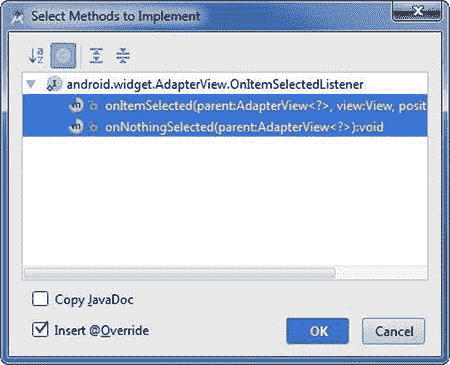
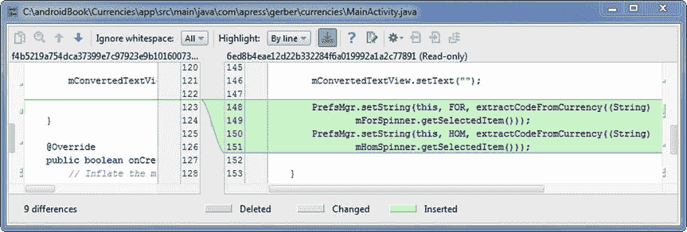
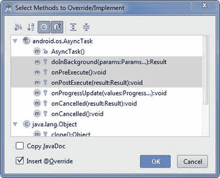

# 十、货币 Lab：第二部分

在前一章中，您通过在`SplashActivity`中使用一个`AsyncTask`来获取活动货币代码。您将货币代码加载到一个包中，并将该包附加到目的地为`MainActivity`的意向中。最后，您将意向发送到 Android 操作系统。

在本章中，您将继续开发货币应用，并专注于`MainActivity`的功能来完成应用。您将使用一个`ArrayAdapter`将一个字符串数组绑定到微调器。您将使用 Android Studio 将视图行为的处理委托给封装活动。您还将了解如何使用共享偏好设置以及资源。您将了解 Android 中的并发性，尤其是如何使用`AsyncTask`。最后，您将修改布局并使用 Android Studio 生成可绘制的资源。

## 定义主活动的成员

让我们从定义对应于`activity_main.xml`布局文件中视图的`MainActivity`类中的引用开始，然后给它们分配对象。打开`MainActivity.java`和`activity_main.xml`文件，这样你可以参考这两个文件。右键单击`activity_main.xml`选项卡，选择右移，将`activity_main.xml`的模式改为文本。修改您的`MainActivity.java`文件，使其看起来如图 10-1 所示，并根据需要通过按 Alt+Enter 来解决任何导入。

图 10-1。

Define members and assign references to these members

注意，我们在`MainActivity`中只为那些在`activity_main.xml`中的视图定义了引用，我们之前已经为这些视图分配了一个 ID。`setContentView` `(R.layout.activity_main);`陈述夸大了`activity_main.xml`中包含的观点。在 Android 中，world inflate 意味着当 Android 遍历`activity_main.xml`布局中定义的视图时，Android 会将每个视图实例化为堆中的一个 Java 对象。如果那个`View`对象有一个 id，Android 会将那个对象的内存位置与其 ID 关联起来。这种关联可以在一个名为`R.java`的自动生成文件中找到，它在您的资源和 Java 源文件之间起到了桥梁的作用。

一旦布局和它的所有视图都被放入内存空间，我们就可以通过调用`findViewById()`方法并传递一个 ID 来将这些对象分配给我们之前定义的引用。`findViewById()`方法返回一个`View`对象，它是 Android 中所有`Views`和`ViewGroups`的层次祖先；这就是为什么我们需要将每个对`findViewById()`的调用转换到适当的`View`子类。按 Ctrl+K | Cmd+K 并提交，同时显示获取对布局中定义的视图的引用的消息。

## 从捆绑包中解包货币代码

在前一章中，我们将一个`Strings`的`ArrayList`传递到用于启动`MainActivity`的 intent 包中。虽然 Android OS 已经成功交付了它的有效载荷，但我们仍然需要拆开它。我们在`SplashActivity`中使用的数据结构是一个向量(`ArrayList<String>`，这意味着它可以根据需要增长和收缩。我们将在`MainActivity`中用来存储活动货币代码的数据结构将是一个长度固定的简单字符串数组。改变数据结构的原因是我们将使用`ArrayAdapter`作为微调器的控制器，而`ArrayAdapter`使用数组，而不是`ArrayLists`。修改`MainActivity`类，使其看起来如图 10-2 所示，并根据需要解析任何导入。

图 10-2。

Unpack currency codes from ArrayList

语句`ArrayList<String> arrayList = ((ArrayList<String>) getIntent().getSerializableExtra(SplashActivity.KEY_ARRAYLIST));`将`ArrayList<String>`从用于启动此活动的意向包中解包。注意，我们使用同一个公共常量作为键(`SplashActivity.KEY_ARRAYLIST`)来对`MainActivity`中的`ArrayList<String>`进行解包，我们之前使用这个常量来对`SplashActivity`中的`ArrayList<String>`进行打包。还要注意，我们使用了`Collections`接口对数据进行排序，然后我们将`ArrayList<String>`转换成一个字符串数组。按 Ctrl+K | Cmd+K 并提交一条从包中解包货币代码的消息。

## 创建选项菜单

新建项目向导为我们创建了一个名为`menu_main.xml`的菜单。按 Ctrl+Shift+N | Cmd+Shift+O，键入 main，选择`res/menu/menu_main.xml`打开。修改`menu_main.xml`，使其看起来像清单 10-1 。

Listing 10-1\. Modify the menu_main.xml File

`<menu xmlns:android="``http://schemas.android.com/apk/res/android`

`xmlns:app="``http://schemas.android.com/apk/res-auto`

`xmlns:tools="``http://schemas.android.com/tools`

`tools:context=".MainActivity">`

`<item`

`android:id="@+id/mnu_codes"`

`android:orderInCategory="100"`

`app:showAsAction="never"`

`android:title="search active codes"/>`

`<item`

`android:id="@+id/mnu_invert"`

`android:orderInCategory="200"`

`app:showAsAction="never"`

`android:title="invert codes"/>`

`<item`

`android:id="@+id/mnu_exit"`

`android:orderInCategory="300"`

`app:showAsAction="never"`

`android:title="exit"/>`

`</menu>`

`app:showAsAction`属性决定了菜单项的位置。将该属性设置为`never`意味着该菜单项永远不会出现在动作栏上，而总是出现在溢出菜单中。溢出菜单由操作栏右侧的三个垂直圆点表示。

`android:orderInCategory`用于设置菜单项的顺序。Android 中的惯例是使用 100 的倍数，例如，我们可以使用 250 在 200 和 300 之间插入一个新的菜单项，使用 225 在 200 和 250 之间插入一个新的菜单项。`orderInCategory`属性值必须是一个整数，所以如果我们从 2 和 3 这样的连续值开始，将没有空间插入中间值，我们将不得不对整个集合重新排序。

请注意，我们为每个菜单项分配了一个 ID，这样我们以后就可以在 Java 代码中引用这些对象。打开`MainActivity.java`，改变`onOptionsItemSelected()`方法，如清单 10-2 所示。

Listing 10-2\. Modify the onOptionsItemSelected( ) Method

`public boolean onOptionsItemSelected(MenuItem item) {`

`int id = item.getItemId();`

`switch (id){`

`case R.id.mnu_invert:`

`//TODO define behavior here`

`break;`

`case R.id.mnu_codes:`

`//TODO define behavior here`

`break;`

`case R.id.mnu_exit:`

`finish();`

`break;`

`}`

`return true;`

`}`

注意，除了 Exit 菜单项之外，我们用 TODOs 代替了实现代码。我们将在下一步实现其余选项菜单项的功能。按 Ctrl+K | Cmd+K 并提交一条创建选项菜单的消息。

## 实施选项菜单行为

在本节中，我们将编写需要权限的代码。如果你是一个 Android 用户，那么你可能很熟悉在安装一个应用之前你必须同意的一系列权限。一些应用比其他应用需要更多权限，但大多数应用至少需要一个权限。在前面的步骤中，我们请求用户允许我们访问互联网。在这一步中，我们将向用户请求访问设备网络状态的权限。很容易忽略权限，尤其是如果你是一个新手 Android 程序员。幸运的是，如果您忘记包含适当的权限，与这个问题相关的异常是简单明了的。

要打开`AndroidManifest.xml`文件，按 Ctrl+Shift+N | Cmd+Shift+O，键入和，按 Enter 选择`AndroidManifest.xml`打开。修改`AndroidManifest.xml`插入图 10-3 中高亮显示的线。

图 10-3。

Add permission to access the network state in the AndroidManifest.xml file

打开`MainActivity.java`类。定义清单 10-3 中的三种方法。`isOnline()`方法检查用户是否有互联网连接。这个方法使用的是 Android `ConnectivityManager`，这就是为什么我们需要将`android.permission.ACCESS_NETWORK_STATE`添加到`AndroidManifest.xml`文件中。`launchBrowser()`方法接受一个表示统一资源标识符(URI)的字符串。URI 是统一资源定位器(URL)的超集，因此任何定义为有效 HTTP 或 HTTPS 地址的字符串都可以作为参数使用。`launchBrowser()`方法启动设备上的默认浏览器，并打开我们传递给它的 URI。`invertCurrencies()`方法简单地交换本币和外币微调器的值。当然，如果包含计算结果的`TextView`先前已经填充了数据，我们也需要清除它以避免任何混淆。把你的新方法放在`onCreate()`方法下面。

Listing 10-3\. Create Three Methods in MainActivity.java

`public boolean isOnline() {`

`ConnectivityManager cm =`

`(ConnectivityManager)`

`getSystemService(Context.CONNECTIVITY_SERVICE);`

`NetworkInfo networkInfo = cm.getActiveNetworkInfo();`

`if (networkInfo != null && networkInfo.isConnectedOrConnecting()) {`

`return true;`

`}`

`return false;`

`}`

`private void launchBrowser(String strUri) {`

`if (isOnline()) {`

`Uri uri = Uri.parse(strUri);`

`//call an implicit intent`

`Intent intent = new Intent(Intent.ACTION_VIEW, uri);`

`startActivity(intent);`

`}`

`}`

`private void invertCurrencies() {`

`int nFor = mForSpinner.getSelectedItemPosition();`

`int nHom = mHomSpinner.getSelectedItemPosition();`

`mForSpinner.setSelection(nHom);`

`mHomSpinner.setSelection(nFor);`

`mConvertedTextView.setText("");`

`}`

按照清单 10-4 用方法调用替换`MainActivity.java`文件的`onOptionsItemSelected()`方法中的 TODOs。按 Ctrl+K | Cmd+K 并提交一条实现选项菜单行为和修改清单文件的消息。

Listing 10-4\. Replace TODOs in onOptionsItemSelected( ) Method with Calls to the Methods We Just Defined

`case R.id.mnu_invert:`

`invertCurrencies();`

`break;`

`case R.id.mnu_codes:`

`launchBrowser(SplashActivity.URL_CODES);`

`break;`

## 创建 spinner_closed 布局

当微调器处于关闭状态时，为其创建布局。右键单击(在 Mac 上按住 Ctrl 键)目录并选择“新建➤布局资源文件”。将文件命名为 spinner_closed，点击确定，如图 10-4 所示。

图 10-4。

Define the spinner_closed layout resource file

修改`spinner_closed.xml`文件，如清单 10-5 所示。

Listing 10-5\. Definition of spinner_closed.xml

`<TextView xmlns:android="``http://schemas.android.com/apk/res/android`

`android:id="@android:id/text1"`

`android:background="@color/grey_very_dark"`

`android:textColor="@color/grey_light"`

`android:singleLine="true"`

`android:textSize="18sp"`

`android:layout_width="match_parent"`

`android:layout_height="fill_parent"`

`android:gravity="center_vertical"`

`android:ellipsize="marquee"`

`/>`

## 将货币绑定到旋转器

本币微调器和外币微调器将显示相同的项目。我们需要将`mCurrencies`数组绑定到两个微调器。为此，我们将使用一个名为`ArrayAdapter`的类。在`MainActivity.java`的`onCreate()`方法中，添加如图 10-5 所示的代码，解析导入。

图 10-5。

Bind mCurrencies to spinners

`ArrayAdapter`构造函数有三个参数:一个上下文、一个布局和一个数组。`ArrayAdapter`充当模型-视图-控制器设计模式中的控制器，并协调模型和视图之间的关系。在我们的例子中，模型是名为`mCurrencies`的字符串数组。`mCurrencies`中的每个元素都包含一个货币代码、一个提供视觉分隔的管道字符和一个货币描述。微调器有两个视图:一个视图在微调器打开时显示，另一个视图在微调器关闭时显示。最后两条语句将新构建的`arrayAdapter`对象分配给微调器。按 Ctrl+K | Cmd+K 并提交一条将数据绑定到微调器的消息。通过按下 Shift+F10 | Ctrl+R 运行您的应用，并与两个微调器进行交互，以确保它们正常工作。

## 将微调器行为委托给 MainActivity

Java 事件模型非常灵活。我们可以将事件的处理委托给任何实现适当侦听器接口的对象。如果一个视图是惟一的，比如 Calculate 按钮，那么将其行为的处理委托给一个匿名的内部类是有意义的。然而，如果我们的布局包含相同类型的多个视图，比如货币应用中的两个或更多微调器，那么通常更容易将这些视图行为的处理委托给封闭类。将两行代码添加到`MainActivity.java`中`onCreate()`方法的末尾，如图 10-6 所示。单词`this`将以红色下划线标出，表示编译时错误。

图 10-6。

Delegate the behavior of spinners to MainActivity

将光标放在任一单词`this`上的任意位置，按 Alt+Enter 调用 IntelliSense 代码完成。选择第二个选项(使' MainActivity '实现' Android . widget . adapter view . onitemselectedlistener ')，如图 10-7 所示。在如图 10-8 所示的选择要实现的方法对话框中选择两种方法，然后点击确定。如果你向上滚动到类的顶部，你会注意到`MainActivity`现在实现了`AdapterView.OnItemSelectedListener`。

图 10-8。

Select Methods to Implement dialog box

图 10-7。

Make ‘MainActivity’ implement OnItemSelectedListener

`OnItemSelectedListener`接口有两个任何实现类都必须覆盖的收缩方法:`onItemSelected()`和`onNothingSelected()`。我们不会在`onNothingSelected()`方法的主体中提供任何实现代码。虽然`onNothingSelected()`是一个鼻涕虫，但是它必须出现在`MainActivity`里面才能满足接口契约。

在`onItemSelected()`方法中，我们需要通过检查`parent.getId()`来确定选择了哪个微调器，然后添加一些条件逻辑来编程所选微调器的行为。修改`onItemSelected()`方法，如图 10-9 所示。

图 10-9。

Modify the onItemSelected( ) method

请注意，我们将占位符注释(`//define behavior here`)放在了我们期望实现代码所在的位置。我们将在后续步骤中实现 spinners 的行为。按 Ctrl+K | Cmd+K 并提交一条消息，将 spinners 行为的处理委托给 MainActivity。

## 创建首选项管理器

共享偏好设置提供了一种在应用退出时保留用户偏好设置的方法。如果我们试图将用户的偏好存储在内存中，这些数据将在用户退出应用后被刷新，应用的内存将被 Android 操作系统回收。为了解决这个问题，可以将共享偏好存储在用户设备上的文件中。这个文件是一个带有键/值对的序列化哈希映射，每个应用可能都有自己的共享首选项。

可以存储在共享首选项中的值的类型仅限于 Java 原语、字符串、序列化对象和序列化对象数组。与向 SQLite 数据库读写数据相比，共享首选项速度较慢。因此，您不应该考虑使用共享首选项作为记录管理的替代方案；您应该始终使用 SQLite 数据库进行记录管理，就像您在 Reminders 实验中看到的那样。然而，共享偏好是保持用户偏好的一个好方法。

我们希望保留本币和外币微调器中显示的货币代码。这是一个典型的场景。假设一个美国用户正在伊斯坦布尔度假，在露天市场使用货币应用争论一些珍贵的拜占庭古董。用户退出应用并返回酒店。第二天早上，他在当地一家餐馆吃早餐，然后启动货币应用查看账单。如果我们的用户在执行另一个计算之前不得不在微调器中重新选择 TRY 和 USD，这将是非常令人沮丧的。相反，微调器应该自动填充先前为本币和外币选择的代码。

我们将创建一个实用程序类，让我们能够访问共享的首选项。我们的实用程序类将具有公共静态方法，允许我们获取和设置用户为本国货币和外国货币选择的货币代码。右键单击(在 Mac 上按住 Ctrl 键)这个`com.apress.gerber.currencies`包并选择 New Java Class。将您的类命名为 PrefsMgr，并插入如图 10-10 所示的代码。

图 10-10。

Create the PrefsMgr class

`setString()`方法为国内或国外的特定地区设置货币代码。`getString()`方法将返回为特定地区存储的货币代码值，如果没有找到代码，那么默认情况下将返回`null`。按 Ctrl+K | Cmd+K 并提交一条创建我们自己的首选项管理器的消息。

## 查找给定代码的位置

微调器使用从零开始的整数来表示其当前位置的值。要将微调器设置为特定代码，我们需要找到元素的适当位置或索引。由于`mCurrencies`被用作微调器的模型，我们可以简单地将货币代码与存储在`mCurrencies`中的聚合字符串的前三个字符进行比较。如果找到匹配，我们返回索引位置。如果没有找到匹配，我们返回到零，这对应于微调器的第一个位置。ISO 4217 货币代码标准规定货币代码的长度总是三个字母。让我们编写一个方法，从包含货币代码、管道字符和货币描述的聚合字符串中提取三个字母的货币代码。我们知道这个聚合字符串的前三个字符是货币代码，所以我们可以使用 string 的 substring()方法来提取它。打开`MainActivity.java`，在 invertCurrencies()方法下定义 findPositionGivenCode()方法，如图 10-11 所示。按 Ctrl+K | Cmd+K 并提交一条创建查找位置给定代码方法的消息。

图 10-11。

Create the findPositionGivenCode() method

## 从货币中提取代码

从存储在`mCurrencies`的每个元素中的聚合字符串中提取三个字母的货币代码将不限于`findPositionGivenCode()`方法。与其在别处复制这些代码，不如提取一个方法，然后在需要它的功能时调用这个方法。在`MainActivity.java`中，高亮显示如图 10-12 所示的代码，按 Ctrl+Alt+M | Cmd+Alt+M 提取一个方法，选择第一个选项。

图 10-12。

Select the code that will be extracted as a method

在提取方法对话框中，将方法名称改为 extractCodeFromCurrency，如图 10-13 所示，点击确定。你最终应该得到类似图 10-14 的东西。按 Ctrl+K | Cmd+K 并提交名为 extractCodeFromCurrency 的消息提取方法。

图 10-14。

Resulting code from the extract method operation

图 10-13。

Create extractCodeFromCurrency( ) in the Extract Method dialog box

## 实施共享偏好设置

shared preferences 中的数据存储在一个 hash-map 中，其中的键总是字符串，因此这是一个将键定义为`String`常量的绝佳机会。打开`MainActivity.java`，定义如图 10-15 所示的两个`String`常量。

图 10-15。

Define two constants that will be used as keys

在你的`MainActivity`类的`onCreate()`方法的末尾插入如图 10-16 所示的`if/else`块。在前面的步骤中，我们对`PrefsMgr`类进行了编程，以便在找不到键的情况下返回`null`。`if`块检查本币和外币密钥是否都不存在。这种独特的情况只会发生一次，即首次在用户设备上使用该应用时，微调器将分别设置为 CNY 和美元作为外币和本币。如果不满足该唯一条件，微调器将被设置为存储在用户共享首选项中的值。

图 10-16。

Create the if/else block

使用共享偏好设置会对性能造成轻微影响，我们希望尽可能避免这种影响。我们在我们的`if`语句的括号内包含了`savedInstanceState == null &&`，以便在`MainActivity`简单地从中断或配置改变中恢复的情况下，这个块将会短路。

导航到我们之前定义的`onItemSelected()`方法。修改此方法，以便我们每次在一个微调器中选择一个项目时都设置共享首选项。此外，我们将清除`mConvertedTextView`以避免任何混淆。修改`MainActivity.java`如图 10-17 所示。

图 10-17。

Apply shared preferences to the onItemSelected method

最后，我们需要确保当用户从 options 菜单中选择 Invert Currencies 菜单项时，正确设置了共享的首选项。将如图 10-18 所示的两行代码添加到`invertCurrencies()`方法的末尾。按 Ctrl+K | Cmd+K 并提交一条实现共享首选项的消息。

图 10-18。

Apply shared preferences to the invertCurrencies method

## 按钮点击行为

我们的 app 里只有一个按钮。因此，将按钮行为的处理委托给一个匿名的内部类，而不是委托给封闭活动，这是有意义的，就像我们前面对两个 spinners 所做的那样。

在`onCreate()`方法的末尾，但仍在它的大括号内，键入 mcalcbutton . setonclicklistener()；现在将光标放在该方法的括号内，并键入 new On。如有必要，使用向下箭头键从代码完成提供给您的建议中选择`onClickListener{...}`选项，然后按 Enter。在`onClick()`方法中添加一些占位符文本如//define behavior，如图 10-19 所示。按 Ctrl+K | Cmd+K 并提交一条消息，提示创建一个内部类来处理按钮行为。

图 10-19。

Create an anonymous inner class to handle button click behavior

## 存储开发者密钥

在项目工具窗口中右键单击`app`，选择新建➤文件夹➤素材文件夹。在随后的对话框中，默认情况下，目标源集选项应该是 main。单击完成。

在项目工具窗口中右键单击新创建的`assets`目录，并选择新建➤文件。命名新的文件密钥。属性，如图 10-20 所示。

图 10-20。

Create the keys.properties file

将下面一行添加到`keys.properties`文件中:

`open_key=9a894f5f4f5742e2897d20bdcac7706a`

您需要通过将浏览器导航到 [`https://openexchangerates.org/signup/free`](https://openexchangerates.org/signup/free) 来注册您自己的免费密钥。这个过程很简单，大约需要 30 秒。用你自己的有效密钥代替我们在这里提供的假密钥。参见图 10-21 。按 Ctrl+K | Cmd+K 并提交一条定义 openexchangerates.org 键的消息。

图 10-21。

Define open_key in the keys.properties file. The key provided here is a placeholder and will not work Note

我们提供的密钥 9a 894 F5 F4 f 5742 e 2897d 20 bdcac 7706 a 无法工作；它只是一个占位符。您需要在浏览器中导航到 [`https://openexchangerates.org/signup/free`](https://openexchangerates.org/signup/free) 来注册您自己的密钥，然后用您自己的有效密钥替换假密钥。

## 获取开发者密钥

在`MainActivity.java`中定义一个方法，在`extractCodeFromCurrency()`方法下获取存储在`keys.properties`中名为`getKey()`的密钥。注意，我们使用`AssetManager`从`keys.properties`读取一个密钥。您将需要根据需要解析导入。见图 10-22 。

图 10-22。

Define the getKey( ) method

文件 I/O 是一项开销很大的操作。我们在上一步中定义的`getKey()`方法包含这样的操作，所以我们希望尽可能少地调用`getKey()`。我们将在`onCreate()`中调用一次这个调用，然后将这个值存储在`MainActivity`的一个名为`mKey`的成员中，而不是每次我们想从`openexchangerates.org`中获取利率时都调用`getKey()`。定义你的`MainActivity`类的成员，如图 10-23 所示。

图 10-23。

Define members to facilitate fetching key and formatting results

在`onCreate()`方法的末尾，但仍在它的括号内，给`mKey`赋值，如下所示:`mKey = getKey("open_key");`。参见图 10-24 。按 Ctrl+K | Cmd+K 并提交一条获取键、定义成员和常量的消息。

图 10-24。

Assign the key as the last statement of the onCreate( ) method

## CurrencyConverterTask

线程是一个轻量级进程，它可以与同一应用中的其他线程并发运行。Android 并发性的第一条规则是你不能阻塞 UI 线程，它也称为主线程。UI 线程是默认情况下在应用启动期间产生的线程，它驱动用户界面。如果 UI 线程被阻塞超过 5000 毫秒，Android 操作系统将显示应用不响应(ANR)错误，您的应用将崩溃。阻塞 UI 线程不仅会导致 ANR 错误，而且当 UI 线程被阻塞时，用户界面将完全没有响应。因此，如果一个操作可能需要几毫秒以上的时间，那么它可能会阻塞 UI 线程，应该在后台线程上完成。例如，尝试从远程服务器获取数据可能会持续几毫秒以上，应该在后台线程上完成。当在 Android 环境中使用时，术语后台线程是指除 UI 线程之外的任何线程。

Note

UI 线程有时被称为主线程。

Android 并发的第二个规则是 UI 线程是唯一有权限与用户界面交互的线程。如果你试图从后台线程更新任何视图，你的应用将立即崩溃！违反 Android 并发规则中的一个或两个将导致糟糕的用户体验。

没有什么可以阻止你在你的 Android 应用中生成优秀的 Java 线程，但是一个名为`AsyncTask`的类是专门为解决本节描述的问题而设计的，因此它是 Android 并发的首选实现。如果你正确实现了`AsyncTask`，遵循 Android 并发的两条规则就没有问题。

在本节中，我们将创建一个名为`CurrencyConverterTask`的内部类，它将用于获取`openexchangerates.org. CurrencyConverterTask`上引用的汇率。它是抽象类`AsyncTask. AsyncTask`的一个具体实现，有一个名为`doInBackground()`的抽象方法，所有具体类都需要覆盖它。此外，您还可以覆盖其他一些方法，包括`onPreExecute()`、`onProgressUpdate()`和`onPostExecute()`等等。`AsyncTask`的神奇之处在于`doInBackground()`方法是在后台线程上执行的，而`AsyncTask`的其余方法是在 UI 线程上执行的。如果我们不接触`doInBackground()`方法中的任何视图，`AsyncTask`使用起来是完全安全的。

将`CurrencyConverterTask`定义为私有内部类，在`MainActivity.java`的末尾，但仍在`MainActivity`的括号内。除了扩展`AsyncTask`，还必须定义三个通用对象参数，如图 10-25 所示。解决任何导入。即使在您解析了导入之后，您的类定义仍将带有红色下划线，表明存在编译时错误。暂时忽略这个。

图 10-25。

Define CurrencyConverterTask

将光标放在`CurrencyConverterTask`类定义的花括号内，按 Alt+Insert | Cmd+N，并选择 Override Methods。选择`doInBackground()`、`onPreExecute()`和`onPostExecute()`方法，点击确定，如图 10-26 所示。注意，返回值以及参数`doInBackground()`和`onPostExecute()`是根据通用参数`<String, Void, JSONObject>`定义的。第一个参数(`String`)用作`doInBackground()`方法的输入，第二个参数(`Void`)用于向`onProgressUpdate()`方法发送进度更新，第三个参数(`JSONObject`)是`doInBackground()`的返回值，也是`onPostExecute()`方法的输入参数。整个获取操作大约需要一秒钟，因此用户几乎察觉不到进度更新；这就是为什么我们省略了`onProgressUpdate()`方法并使用`Void`作为第二个参数。

图 10-26。

Select methods to override/implement

让我们重新排列我们的方法，使它们按照被触发的顺序出现。选择整个`onPreExecute()`块，包括`@Override`注释，按 Ctrl+Shift+Up | Cmd+Shift+Up 将`onPreExecute()`方法移动到`doInBackground()`方法之上。你的`CurrencyConverterTask`现在应该看起来如图 10-27 所示。

图 10-27。

Results after overriding methods in CurrencyConverterTask and moving onPreExecute() up

再次修改`CurrencyConverterTask`，使其看起来像清单 10-6 并解析任何导入。让我们依次讨论一下`CurrencyConverterTask`的三个被覆盖的方法。

Listing 10-6\. Modify the CurrencyConverterTask

`private class CurrencyConverterTask extends AsyncTask<String, Void, JSONObject> {`

`private ProgressDialog progressDialog;`

`@Override`

`protected void onPreExecute() {`

`progressDialog = new ProgressDialog(MainActivity.this);`

`progressDialog.setTitle("Calculating Result...");`

`progressDialog.setMessage("One moment please...");`

`progressDialog.setCancelable(true);`

`progressDialog.setButton(DialogInterface.BUTTON_NEGATIVE,`

`"Cancel", new DialogInterface.OnClickListener() {`

`@Override`

`public void onClick(DialogInterface dialog, int which) {`

`CurrencyConverterTask.this.cancel(true);`

`progressDialog.dismiss();`

`}`

`});`

`progressDialog.show();`

`}`

`@Override`

`protected JSONObject doInBackground(String... params) {`

`return new JSONParser().getJSONFromUrl(params[0]);`

`}`

`@Override`

`protected void onPostExecute(JSONObject jsonObject) {`

`double dCalculated = 0.0;`

`String strForCode =`

`extractCodeFromCurrency(mCurrencies[mForSpinner.getSelectedItemPosition()]);`

`String strHomCode = extractCodeFromCurrency(mCurrencies[mHomSpinner.getSelectedItemPosition()]);`

`String strAmount = mAmountEditText.getText().toString();`

`try {`

`if (jsonObject == null){`

`throw  new JSONException("no data available.");`

`}`

`JSONObject jsonRates = jsonObject.getJSONObject(RATES);`

`if (strHomCode.equalsIgnoreCase("USD")){`

`dCalculated = Double.parseDouble(strAmount) / jsonRates.getDouble(strForCode);`

`} else if (strForCode.equalsIgnoreCase("USD")) {`

`dCalculated = Double.parseDouble(strAmount)  * jsonRates.getDouble(strHomCode) ;`

`}`

`else {`

`dCalculated = Double.parseDouble(strAmount) *  jsonRates.getDouble(strHomCode)`

`/ jsonRates.getDouble(strForCode)   ;`

`}`

`} catch (JSONException e) {`

`Toast.makeText(`

`MainActivity.this,`

`"There's been a JSON exception: " + e.getMessage(),`

`Toast.LENGTH_LONG`

`).show();`

`mConvertedTextView.setText("");`

`e.printStackTrace();`

`}`

`mConvertedTextView.setText(DECIMAL_FORMAT.format(dCalculated) + " " + strHomCode);`

`progressDialog.dismiss();`

`}`

`}`

### onPreExecute()

在触发`doInBackground()`方法之前，在 UI 线程上执行`onPreExecute()`方法。由于我们可能不会从后台线程接触 UI 中的任何视图，`onPreExecute()`方法代表了在`doInBackground()`被触发之前修改 UI 的机会。当`onPreExecute()`被调用时，会出现一个`ProgressDialog`，用户可以选择按下取消按钮并终止操作。

### doInBackground()

`doInBackground()`方法是`AsyncTask`的`execute()`方法的代理。例如，调用`CurrencyConverterTask`的最简单方法是实例化一个新的引用匿名对象，并像这样调用它的`execute()`方法:

`new CurrencyConverterTask().execute("url_to_web_service");`

您传递给`execute()`的参数将依次传递给`doInBackground()`，但不是在执行`onPreExecute()`之前。我们`doInBackground()`的全称是`protected JSONObject doInBackground(String... params)`。`doInBackground()`的参数被定义为 varargs，因此我们可以向`execute()`中传递尽可能多的逗号分隔的类型为`String`的参数，尽管在这个简单的应用中我们只传递一个——URL 的字符串表示。在`doInBackground()`方法中，`params`被视为一个字符串数组。为了引用第一个(也是唯一的)元素，我们使用`params[0]`。

在`doInBackground()`的体内，我们称之为`return new JSONParser().getJSONFromUrl(params[0]);`。`getJSONFromUrl()`方法从 web 服务中获取一个`JSONObject`。因为这个操作需要用户设备和远程服务器之间的通信——因此可能需要几毫秒以上的时间——我们将`getJSONFromUrl()`放在了`doInBackground()`方法中。`getJSONFromUrl()`方法返回一个`JSONObject`，它是为`doInBackground()`定义的返回值。如前所述，`doInBackground()`是 AsyncTask 唯一运行在后台线程上的方法，其他所有方法都运行在 UI 线程上。注意，我们在`doInBackground()`方法中没有触及任何视图。

### onPostExecute()

和`onPreExecute()`一样，`onPostExecute()`方法运行在 UI 线程上。`doInBackground()`的返回值被定义为`JSONObject`。这个相同的对象将作为参数传递给`onPostExecute()`方法，该方法的完整签名被定义为`protected void onPostExecute(JSONObject jsonObject)`。当我们进入`onPostExecute()`方法时，`doInBackground()`方法的后台线程已经终止，我们现在可以用从`doInBackground()`获取的`JSONObject`数据安全地更新 UI。最后，我们进行一些计算，并将格式化的结果分配给`mConvertedTextView`。

在运行我们的应用之前，我们需要对代码进行最后一次修改，以便执行`CurrencyConverterTask`。根据图 10-28 修改`mCalcButton`的`onClick()`方法。

图 10-28。

Fire the new CurrencyConverterTask in the mCalcButton onClick method

按 Ctrl+K | Cmd+K 并提交一条实现 CurrencyConverterTask 的消息。按 Shift+F10 | Ctrl+R 运行应用。在此处输入外币金额字段中输入金额，然后单击计算按钮。您应该从服务器返回一个结果，这个结果应该显示在以本币计算的结果字段中。如果您的应用未能返回结果，请验证您是否拥有来自`openexchangerates.org`的有效开发者密钥。

## 按钮选择器

当您运行您的货币应用时，您可能已经注意到在`mConvertedTextView`中显示的文本是黑色的，这不能提供足够的对比度。打开`activity_main.xml`文件，插入图 10-29 中高亮显示的行，修改`txt_converted TextView`的定义。

图 10-29。

Insert the textColor attribute of txt_converted and set to @color/white in activity_main.xml

右键单击(在 Mac 上按住 Ctrl 键单击)可绘制目录，并选择“新建➤可绘制资源文件”。将资源命名为 button_selector，如图 10-30 所示。修改 XML，使其看起来如图 10-31 所示。根据图 10-32 更改`activity_main.xml`中`btn_calc`的定义。

图 10-32。

Modify the btn_calc in activity_main.xml

图 10-31。

Modify the button_selector resource file

图 10-30。

Create the button_selector resource file

按 Ctrl+K | Cmd+K 并提交一条创建按钮选择器的消息。

## 启动器图标

我们将定义自己的图标，而不是使用普通的 Android 图标作为启动图标。我冒昧地使用先进的谷歌图片搜索找到了一枚一欧元硬币的免版税图片，这是流通中最好的硬币之一。你可以在这里找到这个形象: [`http://pixabay.com/static/uploads/photo/2013/07/13/01/21/coin-155597_640.png`](http://pixabay.com/static/uploads/photo/2013/07/13/01/21/coin-155597_640.png) 。

下载这张图片，并将其命名为 coin.png。将您的项目工具窗口切换到 Android 视图。右键单击(在 Mac 上按住 Ctrl 键单击)res/mipmap 目录，然后选择“新建➤图像素材”。在随后的对话框中，选择可绘制目录作为目标目录。使用图 10-33 中的设置为每个分辨率创建`ic_launcher.png`文件，然后点击下一步并完成。将以下代码行插入到`MainActivity`的`onCreate()`方法中，在展开布局的代码行`setContentView(R.layout.activity_main)`之后；。这段代码在您的操作栏中显示一个自定义图标:

图 10-33。

Create ic_launcher icons

`ActionBar actionBar = getSupportActionBar();`

`actionBar.setHomeButtonEnabled(true);`

`actionBar.setDisplayShowHomeEnabled(true);`

`actionBar.setIcon(R.mipmap.ic_launcher);`

这个应用的图标现在将是一个一欧元硬币，而不是一个标准的 Android 图标。按 Ctrl+K | Cmd+K 并提交一条创建启动器图标的消息。

## 摘要

本章展示了 Android 如何扩大视图，以及`R.java`文件如何充当资源和 Java 源文件之间的桥梁。您学习了如何从包中解包一个值，并实现了菜单和编码它们的行为。您使用了一个`ArrayAdapter`将一个字符串数组绑定到微调器。您还了解了如何使用 Android Studio 将视图事件的处理委托给封闭活动。您学习了如何使用共享的偏好设置和资源。您学习了 Android 中的并发性——特别是关于`AsyncTask`的方法。您还实现了自己的`CurrencyConverterTask`，它从`openexchangerates.org` web 服务中获取货币汇率。最后，您使用 Android Studio 生成图像资源，并创建了一个按钮选择器。

我们已经完成了上一章开始的货币应用。通过按下 Shift+F10 | Ctrl+R 运行您的应用，并确保其正常运行。如果你是一个经验丰富的 Android 开发人员，或者只是一个特别好奇的 UI 测试人员，你可能会注意到有一个角落情况会导致应用崩溃。我们将把这个 bug 留在原处，并在第十一章中修复它，这一章专门用于分析和测试。