# 11.测试和分析

测试是任何软件开发生命周期中的关键阶段。在一些商店中，质量保证团队负责编写和维护测试，而在其他商店中，开发团队必须执行这项任务。在这两种情况下，随着应用变得越来越复杂，测试的需求也变得越来越重要。测试允许团队成员识别应用的功能问题，这样他们就可以放心地继续工作，因为他们知道他们在源代码中所做的任何更改都不会导致运行时错误、错误的输出和意外的行为。当然，即使是最彻底的测试也不能消除所有的错误，但是测试是软件开发团队的第一道防线。

测试在软件开发人员中是一个有争议的问题。所有开发人员可能都会同意需要进行一些测试。然而，有些人认为测试是如此重要，以至于它应该在开发阶段之前(一种被称为测试驱动开发的方法)，而在其他商店，特别是初创公司，有些人试图创建一个最小可行的产品，因此认为测试是一种潜在的浪费，只能有节制地进行。无论你对测试的看法如何，我们鼓励你熟悉本章所涉及的技术，包括`android.test`库中的类，以及 Android Studio 和 Android SDK 附带的工具。

我们选择了那些我们认为对 Android 开发者最有用的工具。在这一章中，我们介绍仪器测试；然后向您展示 Monkey，它是 Android SDK 附带的一个优秀工具，可以生成随机 UI 事件，用于对您的应用进行压力测试；最后，我们将向您展示 Android Studio 中的一些分析工具。

Tip

有一个很好的第三方测试框架叫做 Roboelectric。虽然 Roboelectric 并没有为我们在这里讨论的 Android SDK 测试框架提供任何明显的好处，但它仍然受到 Android 开发人员的欢迎。你可以在这里找到更多关于 Roboelectric 的信息:[robo electric。org](http://robolectric.org) 。

## 创建新的检测测试

仪器测试允许您在设备上执行操作，就像人类用户在操作它一样。在本节中，您将通过扩展`android.test.ActivityInstrumentationTestCase2`类来创建一个插装测试。

从[第 10 章](10.html)中打开货币项目，将你的项目工具窗口切换到 Android 视图。在项目工具窗口中，右键单击(在 Mac 上按住 Ctrl 键并单击)该`com.apress.gerber.currencies(androidTest)`包，然后选择“新建➤ Java 类”。将您的类命名为 MainActivityTest，扩展`ActivityInstrumentationTestCase2<MainActivity>.`定义一个构造函数，如图 [11-1](#Fig1) 所示。您会注意到`ActivityInstrumentationTestCase2<>`的泛型参数是`MainActivity`，这是这里测试的活动。

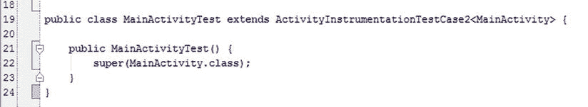

图 11-1。

Define a class called MainActivityTest, which extends ActivityInstrumentationTestCase2

### 定义 SetUp()和 TearDown()方法

将光标放在`MainActivityTest`的类范围内，再次按 Alt+Insert | Cmd+N 调用生成上下文菜单，如图 [11-2](#Fig2) 所示。选择设置方法，然后按 Enter 键。对拆卸方法重复此过程。框架代码应该如图 [11-3](#Fig3) 所示。`setUp()`和`tearDown()`方法是该仪器测试的生命周期方法。`setUp()`方法为您提供了一个机会，可以连接到任何需要的资源，通过一个包传递任何数据，或者在运行测试之前分配引用。在测试方法运行之后，`tearDown()`方法可以用来关闭任何连接和清理任何资源。

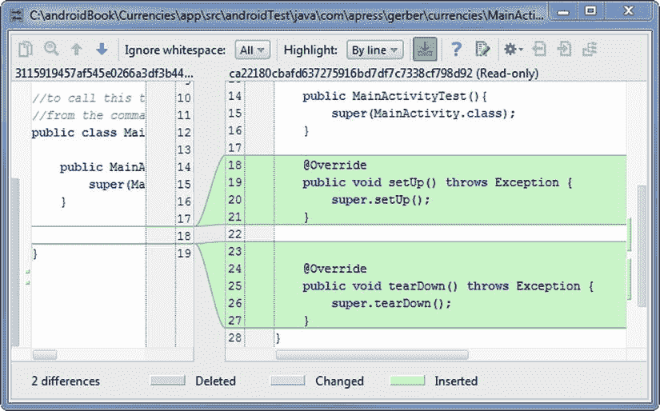

图 11-3。

SetUp and TearDown skeleton code

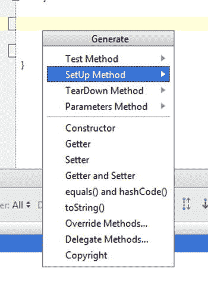

图 11-2。

Generate SetUp and TearDown methods

打开`MainActivity.java`文件，这是我们将要测试的活动，并检查`onCreate()`方法。在每一项活动中—`MainActivity`也不例外—`onCreate()`生命周期法是你获得膨胀视图参考的机会。例如，在`MainActivity`中，第`mCalcButton = (Button) findViewById(R.id.btn_calc);`行将找到在堆上实例化并由`R.id.bnt_calc` ID 标识的视图，将其转换为`Button`，并将该引用分配给`mCalcButton`。

在`MainActivityTest`中，我们将以几乎完全相同的方式引用`MainActivity`的视图。然而，由于`findViewById()`是`Activity`的一个方法，而不是`ActivityInstrumentationTestCase2`，为了做到这一点，我们需要引用`MainActivity`。在`MainActivityTest`中定义一个名为`MainActivity mActivity;`的引用，以及其他引用，如图 [11-4](#Fig4) 所示。`ActivityInstrumentationTestCase2<MainActivity>`类有一个名为`getActivity()`的方法，该方法返回对`MainActivity`的引用。在将`MainActivity`引用传递给`MainActivityTest`的构造函数时，`MainActivity`中的视图已经被展开。一旦我们有了这个引用，我们就可以调用`mActivity.findViewById()`来获取我们的引用，如图 [11-4](#Fig4) 所示。

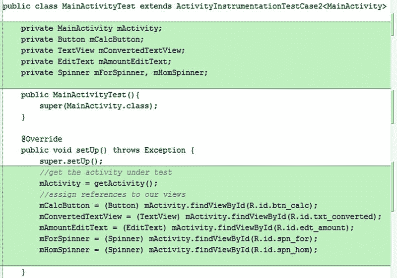

图 11-4。

Define the members and body of the setUp( ) method

按 Ctrl+K | Cmd+K 并提交，同时显示一条消息，提示获取对 MainActivity 中展开视图的引用。请记住，在正常情况下，`MainActivity`是从`SplashActivity`启动的，它获取有效货币代码并将其存储在一个`ArrayList<String>`中，然后将该`ArrayList<String>`打包成一个包，然后通过一个意向将该包穿梭到`MainActivity`。我们可以不借助`SplashActivity`来模拟这一切。重新创建代码，如图 [11-5](#Fig5) 所示。在第`setActivityIntent(intent)`行中，我们向`MainActivity`输入了测试数据——如果`MainActivity`在正常情况下被`SplashActivity`调用，它将会得到相同类型的数据。

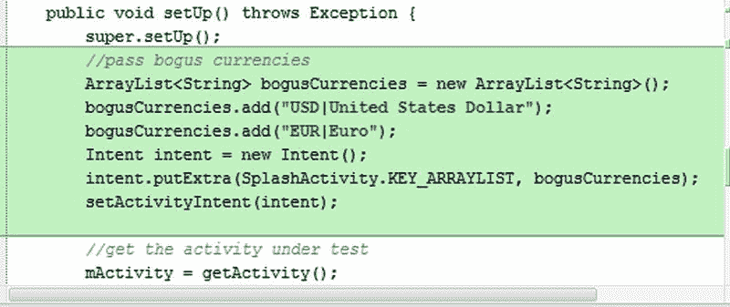

图 11-5。

Simulate the work of SplashActivity by passing a loaded intent into MainActivity

### 在 MainActivity 中定义回调

在大多数情况下，您的插装测试将在 UI 线程上进行，而不需要修改测试中的活动。然而，在我们的例子中，我们希望在`CurrencyConverterTask`在后台线程上完成工作后测试应用的状态。为此，我们需要在`MainActivity`中定义一个回调。

打开`MainActivity.java`，定义实例、接口和设置器，如图 [11-6](#Fig6) 所示。同样，在`CurrencyConverterTask`的`onPostExecute()`方法的最后，根据图 [11-7](#Fig7) 添加代码。按 Ctrl+K | Cmd+K 并在 MainActivity 中提交定义回调的消息。

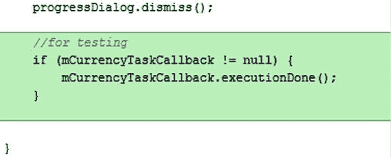

图 11-7。

Add an if block of code to the end of CurrencyConverterTask

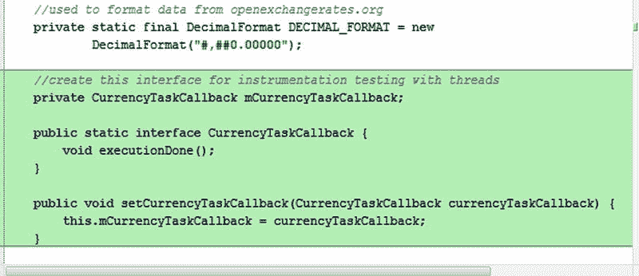

图 11-6。

Define an interface in the MainActivity.java class

### 定义一些测试方法

返回到`MainActivityTest.java`。将光标放在类范围内。重新创建名为`proxyCurrencyConverterTask()`和`convertToDouble()`的方法，如清单 [11-1](#FPar1) 所示。您需要解决一些导入问题。`proxyCurrencyConverterTask()`方法允许您用数据填充微调器，模拟单击 Calculate 按钮，并在测试从服务器返回的数据是否准确之前等待来自服务器的响应。

Listing 11-1\. Create Method to Simulate CurrencyConverterTask and Wait for Termination

`public void proxyCurrencyConverterTask (final String str) throws Throwable {`

`final CountDownLatch latch = new CountDownLatch(1);`

`mActivity.setCurrencyTaskCallback(new MainActivity.CurrencyTaskCallback() {`

`@Override`

`public void executionDone() {`

`latch.countDown();`

`assertEquals(convertToDouble(mConvertedTextView.getText().toString().substring(0, 5)),convertToDouble( str));`

`}`

`});`

`runTestOnUiThread(new Runnable() {`

`@Override`

`public void run() {`

`mAmountEditText.setText(str);`

`mForSpinner.setSelection(0);`

`mHomSpinner.setSelection(0);`

`mCalcButton.performClick();`

`}`

`});`

`latch.await(30, TimeUnit.SECONDS);`

`}`

`private double convertToDouble(String str) throws NumberFormatException{`

`double dReturn = 0;`

`try {`

`dReturn = Double.parseDouble(str);`

`} catch (NumberFormatException e) {`

`throw e;`

`}`

`return dReturn;`

`}`

再次将光标放在类范围内的`proxyCurrencyConverterTask()`方法下面，然后按 Alt+Insert | Cmd+N 调用生成上下文菜单。选择测试方法并按 Enter 键。将您的方法命名为`testInteger()`并重新创建如图 [11-8](#Fig8) 所示的方法，包括将`Exception`替换为`Throwable`。对名为`testFloat()`的测试方法重复这些步骤。

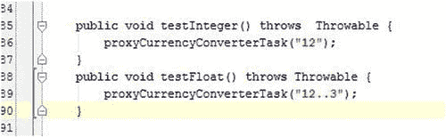

图 11-8。

Create test methods. Pass a nonnumeric value such as “12..3” or “12,,3” into proxyCurrencyConverterTask( )

在这两种测试方法中，我们将大部分行为委托给了`proxyCurrencyConverterTask()`方法。请记住，为了让您的测试方法被`ActivityInstrumentationTestCase2`识别，它必须以小写的`test`开头。

在`testInteger()`中，我们用整数 12 的字符串表示填充`mAmountEditText`，并用对应于`EUR|Euro`的货币数组索引设置`mForSpinner`和`mHomSpinner`。然后我们通过调用`performClick()`方法来模拟点击`mCalculateButton`。我们使用一种叫做`CountDownLatch`的机制，它被设置为在我们从服务器获取汇率时暂停当前线程。一旦`MainActivity`中`CurrencyConverterTask`的线程终止，`CurrencyConverterTask`将调用`executionDone()`，释放挂起的`CountDownLatch`，允许`ActivityInstrumentationTestCase2`继续调用`assertEquals()`。由于本币和外币都被设置为`EUR`，输出应该与输入相同。我们在这里创建的插装测试使用了 JUnit 框架；因此，如果`assertEquals()`方法评估为`true`，我们的测试将通过。

在`testFloat()`方法中，我们模拟与前面描述的相同的过程，尽管我们用非数字数据填充`mAmountEditText`( 12..3).尽管我们通过将`mAmountEditText`的软键盘设置为仅允许数字输入来约束用户，但是我们的用户仍然有可能连续输入两个小数点，这就是我们在这里测试的场景。按 Ctrl+K | Cmd+K，并提交一条创建代理方法的消息。

Note

在某些语言中，逗号被用来代替小数点后面的句号。如果您的设备的默认语言设置为这种语言，您的软键盘将显示逗号而不是句号。您可以简单地测试(12，，3)而不是(12..3).

### 运行仪器测试

在项目工具窗口中右键单击(在 Mac 上按住 Ctrl 键单击)该`MainActivityTest`类，并从上下文菜单中选择 Run。您也可以从工具栏中 Run 按钮左侧的组合框中选择 MainActivityTest，然后按 Run 按钮。Android Studio 会显示运行工具窗口，控制台会显示你的进度。你的`testFloat()`方法应该会失败，你会看到一个红色的进度条，如图 [11-9](#Fig9) 所示。注意，抛出的异常被称为`java.lang.NumberFormatException`。将该值从 12..3 到 12.3(或者，如果您的语言使用逗号而不是句点来表示小数点，则从 12，，3 到 12，3)，然后再次运行它。您的测试现在应该成功了，您应该会看到一个绿色的进度条，如图 [11-10](#Fig10) 所示。按 Ctrl+K | Cmd+K 并提交，同时显示一条创建检测测试的消息。

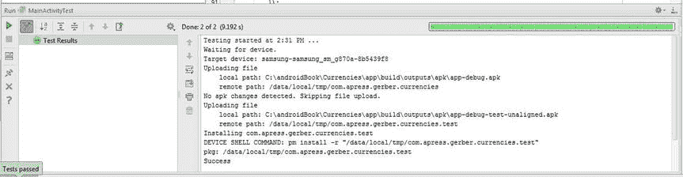

图 11-10。

All tests succeeded

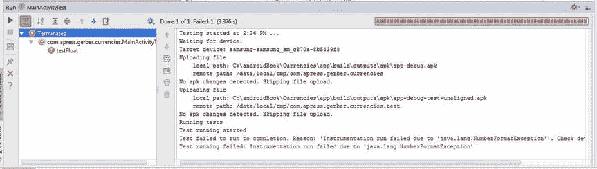

图 11-9。

Failed testFloat( ) method

### 修复错误

您刚刚运行的失败测试突出了您的代码中的一个问题。即使键盘被设置为只接受数值，小数点也可能被输入多次，这将导致当 Android 试图将诸如`"12..3"`的字符串值转换为 double 时出现`NumberFormatException`。在调用`CurrencyConverterTask`之前，您需要验证用户输入的数据是数字。在`MainActivity.java`中，创建名为`isNumeric()`的方法，如清单 [11-2](#FPar2) 所示。

Listing 11-2\. The isNumeric() Method to Be Used to Verify Input from the User

`public static boolean isNumeric(String str)`

`{`

`try{`

`double dub = Double.parseDouble(str);`

`}`

`catch(NumberFormatException nfe) {`

`return false;`

`}`

`return true;`

`}`

修改`mCalcButton`的`onClick()`方法，使我们在执行`CurrencyConverterTask`之前验证输入数据是数值，如图 [11-11](#Fig11) 所示。

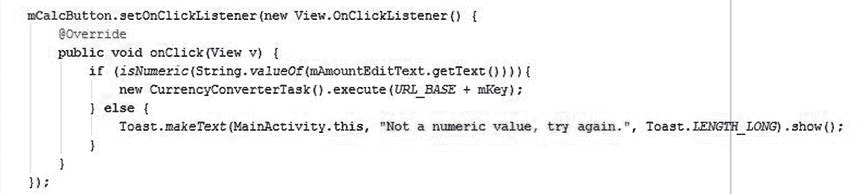

图 11-11。

Modify the onClick( ) method so that we verify the input value of mAmountEditText with isNumeric( )

祝贺您——您刚刚创建了一个插装测试，用它来识别一个 bug，然后在源代码中修复了这个 bug。按 Ctrl+K | Cmd+K，并通过验证输入是数字来提交一条修复 bug 的消息。

## 使用猴子

Android SDK 附带了一个非常好的工具，叫做 Monkey，也称为 UI/应用练习器 Monkey。这个工具允许你在你的应用上生成随机的 UI 事件，就像一只猴子在使用它一样。Monkey 对你的应用进行压力测试很有用。Monkey 的文档可以在`developer.android.com/tools/help/monkey.html`找到。

Note

除了 Monkey 之外，一个名为 MonkeyRunner 的工具允许您创建和运行 Python 脚本来自动化您的应用进行测试。MonkeyRunner 和猴子没有血缘关系。此外，MonkeyRunner 要求您知道如何使用 Python 编写脚本，这超出了本书的范围。如果您有兴趣了解更多关于 MonkeyRunner 的信息，请参阅位于`developer.android.com/tools/help/monkeyrunner_concepts.html`的文档。

首先在 Android Studio 中打开一个终端会话，方法是按下位于 IDE 底部边缘的终端窗口按钮。在工具栏的组合框中选择应用，然后单击绿色的运行按钮，启动货币应用。一旦应用运行并空闲，向终端会话发出以下命令，然后按 Enter 键，如图 [11-12](#Fig12) 所示:

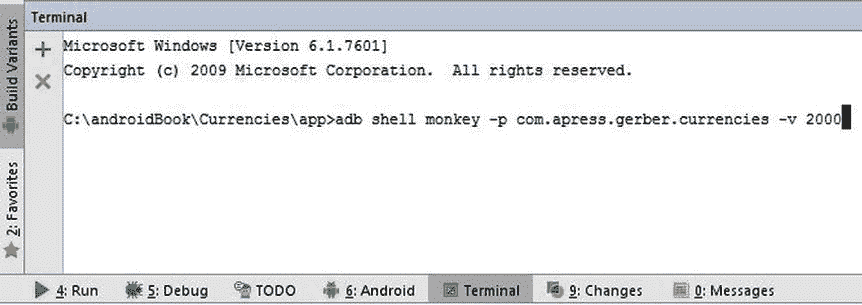

图 11-12。

Open a terminal session, type the monkey command, and then press Enter

`adb shell monkey -p com.apress.gerber.currencies -v 2000`

从这个命令中您会注意到的第一件事是 Monkey 正在使用`adb`，即 Android Debug Bridge，它允许您与运行设备的操作系统外壳进行交互。如果您在发出此命令之前忘记启动您的应用，Monkey 将不会工作。`-p`开关告诉 Monkey 将其随机 UI 事件约束到`com.apress.gerber.currencies`包中。`-v`开关告诉 Monkey 以详细的方式报告事件和异常；如果 Monkey 抛出了一个异常，如果报告很详细，那么跟踪这个异常会更容易。最后一个参数(`2000`)是事件的数量。两千个随机的 UI 事件应该可以暴露出 UI 的任何问题，您可以根据需要随时运行这个命令。

Caution

当运行 Monkey 时，即使将 Monkey 的 UI 事件约束到一个特定的包中，您也有可能意外地更改设备的默认设置。例如，Monkey 翻转你的 Wi-Fi 或更改手机默认语言的情况并不少见。

## 使用分析工具

Android SDK 附带的分析工具叫做 Lint。不久前，开发人员还被要求从命令行调用这个工具。幸运的是，Lint 现在已经完全集成到 Android Studio 中。Lint 将分析您的源代码、XML 文件和其他资产，以寻找潜在的错误、未使用的资源、低效的布局、硬编码的文本和其他与 Android 相关的潜在问题。更重要的是，Android Studio 有自己的分析工具，可以对 Java 和 Android 语法执行类似的操作，甚至比 Lint 更强大。总之，这个完全集成的工具套件将保持您的代码整洁，希望没有错误。您可以从主菜单栏中的分析菜单访问 Android Studio 的分析工具。

### 检查代码

检查代码操作是最有用和最全面的分析操作。导航至分析➤检查代码以运行此操作。在弹出的对话框中，选择整个项目单选按钮，点击确定，如图 [11-13](#Fig13) 所示。等待几秒钟，让 Android Studio 分析你的整个项目，并在检查工具窗口中显示结果，如图 [11-14](#Fig14) 所示。您会注意到，首先列出了 Android Lint 检查的目录，然后进一步列出了 Android Studio 自己检查的几个目录。

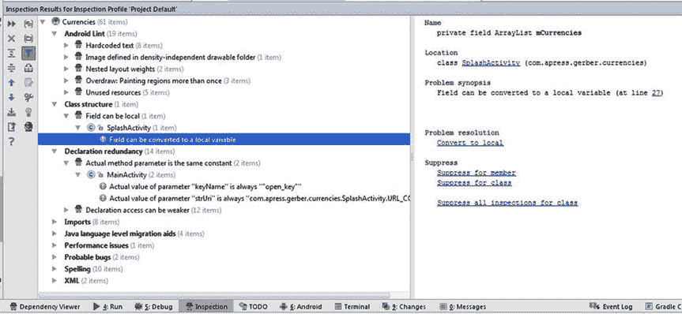

图 11-14。

Inspection tool window showing results of the Inspect Code operation

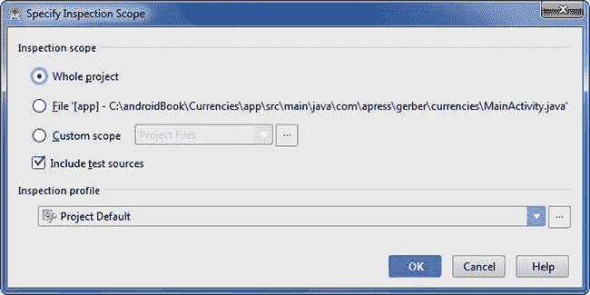

图 11-13。

Select the Whole Project option from the Specify Inspection Scope dialog box

请记住，由 Inspect 代码操作识别的问题可能根本不是严重的问题。因此，不要觉得有义务去解决每一个问题。此外，在极少数情况下，建议的解决方案可能会破坏您的代码或违背您最初的良好意图。所以，你应该把 Lint 和 Android Studio 的分析工具识别出的问题当作建议。

切换打开检查工具窗口中的目录，直到您能够看到单个行项目。当您检查这些行项目时，请注意检查工具窗口右窗格中每个可能问题的摘要。详细信息包括名称、位置、问题概要、问题解决和抑制，如图 [11-14](#Fig14) 所示。修复一个潜在的问题就像直接点击问题解决标题下的蓝色超文本一样简单；Android Studio 会完成剩下的工作。避免试图修复由 Inspect 代码操作识别的每一个问题。如果你解决了这些问题中的一个，请谨慎操作并测试你的应用，以确保你没有引入新的错误。

### 分析依赖关系

“分析依赖项”操作同样位于主菜单栏的“分析”菜单中。分析依赖项将检查您的源代码，并自动为您识别任何依赖项。您可以通过检查项目中每个 Java 源文件的 import 语句来手动执行这个操作，但是这很繁琐。Analyze Dependencies 操作为您节省了这种繁琐的工作，并且还识别了每个依赖项的位置。

Android 中的依赖项可能来自各种来源，包括 Java JDK、Android SDK、第三方 JAR 库(如 Apache Commons)和库项目(如脸书)。如果协作开发人员无法编译和运行项目，主要怀疑是缺少依赖项，您可以使用分析依赖项操作来确定可能缺少哪些依赖项。在 Gradle 之前，管理依赖关系是一件大事。自从 Gradle 出现以来，大多数依赖项都是自动为您下载的，Gradle 使得管理依赖项变得容易和可移植。

从主菜单栏中选择分析➤分析相关性。等待 Android Studio 执行操作，在依赖查看器工具窗口查看结果，如图 [11-15](#Fig15) 所示。浏览左窗格和右窗格中的各个行项目，注意底部窗格突出显示了 Java 源文件中每个依赖项的位置。

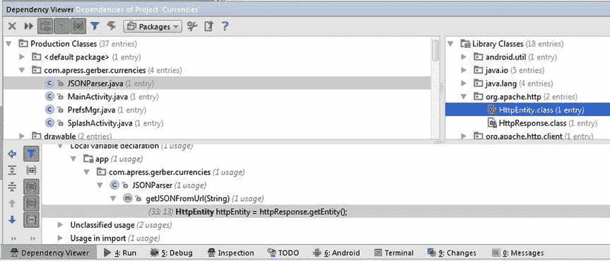

图 11-15。

Analyze Dependencies tool window showing dependency on org.apache.http.HttpEntity.class

### 分析堆栈跟踪

假设您没有处于调试模式，并且抛出了一个异常，那么追踪它的最好方法是检查 logcat，它是 Android 的日志工具。Logcat 太好了，也太啰嗦了，很容易让你不知所措，这就是为什么你应该使用 Analyze Stacktrace。撤销我们之前做的错误修复。如果您熟悉 Git，您可以恢复最后一次提交。否则，注释掉修复这个错误的代码，如清单 [11-3](#FPar3) 所示。

Listing 11-3\. Comment Out the Bug Fix

`mCalcButton.setOnClickListener(new View.OnClickListener() {`

`@Override`

`public void onClick(View v) {`

`// if (isNumeric(String.valueOf(mAmountEditText.getText()))){`

`new CurrencyConverterTask().execute(URL_BASE + mKey);`

`//  } else {`

`//  Toast.makeText(MainActivity.this, "Not a numeric value, try again.",` `//  Toast.LENGTH_LONG).show();`

`//  }`

`}`

`});`

按下主工具栏中的绿色运行按钮，运行货币应用。一旦货币应用启动并准备就绪，输入 12..在`mAmountEditText`中输入 3(或者 12，3，如果您的语言使用逗号而不是句点)，然后按下计算按钮。应用将崩溃，因为 12..3 不是数值。

按 Alt+6 | Cmd+6 激活 Android DDMS 工具窗口。单击 logcat 选项卡，这是 Android DDMS 工具窗口中最左侧的选项卡。按 Ctrl+A | Cmd+A 选择 logcat 窗口中的所有文本，然后按 Ctrl+C | Cmd+C 复制所有文本，如图 [11-16](#Fig16) 所示。

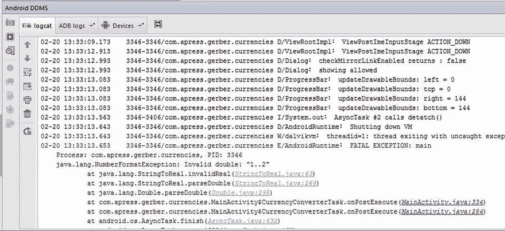

图 11-16。

Logcat window with verbose logs and stack trace

选择分析➤分析堆栈跟踪以调用分析堆栈跟踪操作。任何设置到剪贴板的文本现在都将出现在“分析堆栈跟踪”对话框中。点击正常化按钮，然后点击确定，如图 [11-17](#Fig17) 所示。运行工具窗口将被激活，堆栈跟踪将可见(不包括任何多余的日志)以及显示异常来源的超链接文本，如图 [11-18](#Fig18) 所示。Analyze Stacktrace 很好地解析和显示了相关的堆栈跟踪，现在可以轻松地对其进行分析了。

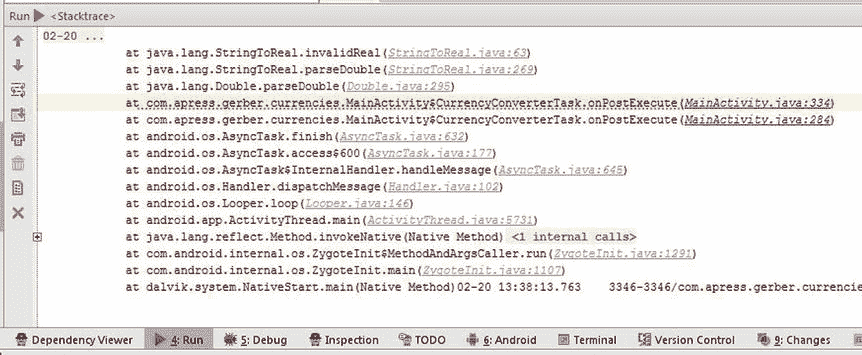

图 11-18。

The Stacktrace window showing only the relevant stack trace and hyperlinks to the exception’s source

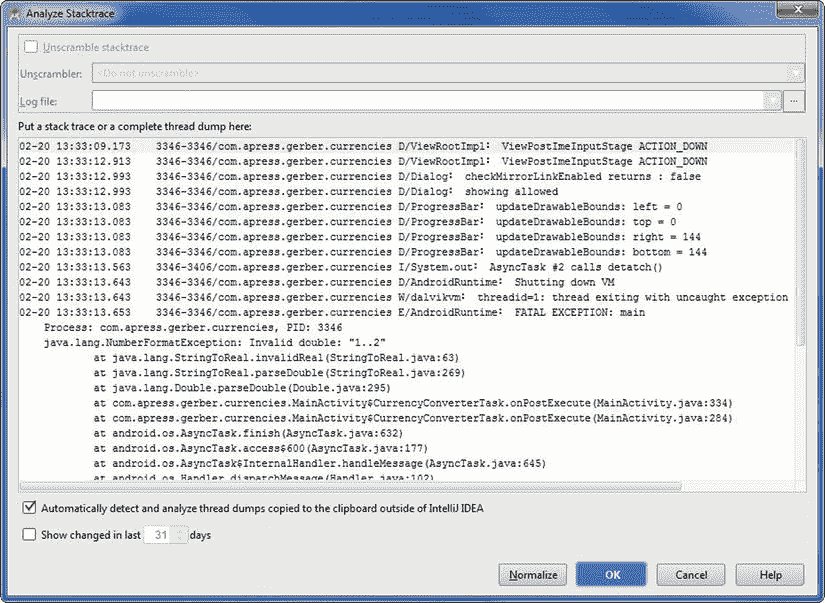

图 11-17。

Analyze Stacktrace dialog box with contents of entire clipboard

您可以使用 Git 来恢复最后一次提交，或者取消对 bug 修复的注释，如清单 [11-4](#FPar4) 所示。

Listing 11-4\. Uncomment the Bug Fix

`mCalcButton.setOnClickListener(new View.OnClickListener() {`

`@Override`

`public void onClick(View v) {`

`if (isNumeric(String.valueOf(mAmountEditText.getText()))){`

`new CurrencyConverterTask().execute(URL_BASE + mKey);`

`} else {`

`Toast.makeText(MainActivity.this, "Not a numeric value, try again.", Toast.LENGTH_LONG).show();`

`}`

`}`

`});`

## 摘要

在这一章中，我们已经向你展示了如何使用 Android Studio 中的一些测试和分析工具。我们还向您展示了如何使用测试工具来识别 bug，然后我们继续修复 bug。最后，我们讨论了仪器测试、Monkey、Lint 和 Android Studio 自己的分析工具。