# 十二、排除故障

你的应用变得越复杂，就越有可能包含错误。没有什么比一个应用崩溃、在特定条件下无法运行或者妨碍了它本来要完成的任务更让用户沮丧的了。一种天真的开发方法是假设您的代码将总是沿着您定义的路径执行。这有时被称为快乐之路。

理解代码在哪里会偏离快乐的道路对于成为一名优秀的软件开发人员至关重要。因为您无法预测开发过程中所有潜在的不愉快路径，所以了解 Android 开发中涉及的各种诊断工具和技术会有所帮助。第十一章涵盖了任何工具；本章详细探讨了调试器，并回顾了其他一些分析工具，您不仅可以使用它们来修复错误，还可以在工作中洞察潜在的弱点。

## 记录

许多开发人员在 Android 中使用的第一个工具是 Android 登录系统。日志记录是将变量值或程序状态打印到系统控制台的一种方式，可以在程序运行时读取。如果你有编程的背景，你可能对这种技术很熟悉。然而，日志记录在 Android 中的形式与在其他平台上略有不同。第一个差异是您可能习惯于在普通 Java 平台上使用的函数或方法调用。Android 应用在一台机器上开发，但在另一台机器上执行，因此打印输出被藏在运行代码的设备上。

Android 上负责日志消息的框架叫做`logger`。它捕获各种事件的输出，不限于您的应用，并将该输出存储在一系列循环缓冲区中。循环缓冲区是一种类似链表的数据结构，但除了以串行方式链接其元素之外，它还将其最后一个元素链接到其第一个元素。这些缓冲区包括`radio`，它包含无线电和电话相关的消息；`events`，包含系统事件消息，如服务创建和销毁的通知；和`main`，包含主日志输出。SDK 提供了一组用于检查这些日志消息的编程和命令行工具。查看所有这些事件的日志就像切断消防水管喝一口水一样。因此，您可以使用各种操作和标志来减少输出。

### 使用 Logcat

从命令行，您可以使用 Logcat，它连接到一个附加设备，并将这些循环缓冲区的内容转发到您的开发控制台。它有多种选项，调用它的语法在表 12-1 中给出。

表 12-1。

Logcat Options and Filters

<colgroup><col> <col></colgroup> 
| `Log Options and Filters` | 描述 |
| --- | --- |
| `-c` | 清除或刷新日志。 |
| `-d` | 将日志转储到控制台。 |
| `-f <filename>` | 将日志写入`<filename>`。 |
| `-g` | 显示给定日志缓冲区的大小。 |
| `-n <count>` | 设置旋转日志的数量。默认值为 4。该选项需要`-r`选项。 |
| `-r <kbytes>` | 针对给定的每千字节数旋转日志文件。缺省值是 16，这个选项需要`-f`选项。 |
| `-s` | 将默认过滤器设置为静音。 |
| `-v <format>` | 将输出格式设置为以下格式之一:`brief`显示发出消息的进程的优先级、标签和 PID。`process`仅显示 PID。`tag`只显示优先级和标签。`raw`显示原始日志消息，没有任何其他字段。`time`显示发出消息的进程的日期、调用时间、优先级、标签和 PID。`threadtime`:显示每条消息线程的日期、调用时间、优先级、标签、PID 和线程 ID (TID)。`long`显示所有字段，并用空行分隔消息。 |
| -b | 显示给定缓冲区的日志输出。缓冲区可以是下列之一:`radio`包含与无线电/电话相关的消息。`events`包含事件相关消息。`main`是主日志缓冲区(默认)。 |

`adb logcat [option] ... [filter] ...`

日志中的每条消息都有一个标签。标签是一个短字符串，通常代表发出消息的组件。该组件可以是一个`View`、一个`CustomErrorDialog`或应用中定义的任何小部件。每条消息还具有相关联的优先级，该优先级决定了该消息的重要性。优先事项如下:

*   `V`:详细(最低优先级)
*   `D`:调试
*   `I`:信息
*   `W`:警告
*   `E`:错误
*   `F`:致命
*   `S`:静默(最高优先级，日志中的所有内容都被忽略)

您可以通过使用过滤器表达式来控制 Logcat 的输出。使用正确的标志组合将有助于您关注与您的调查相关的输出。过滤表达式采用`tag:priority`的形式。例如，`MyBroadcastReceiver:D`将只包含来自`MyBroadcastReceiver`组件的日志消息，这些消息被标记为调试优先级。

Android Studio 包括一个内置的设备 Logcat 查看器，它通过使用图形控件来处理命令行的细节。插入您的设备或启动模拟器，然后单击 IDE 底部的数字 6 选项卡打开 DDMS 浏览器。如果尚未选择，选择`Devices | Logcat`选项卡。你的屏幕应该如图 12-1 所示。

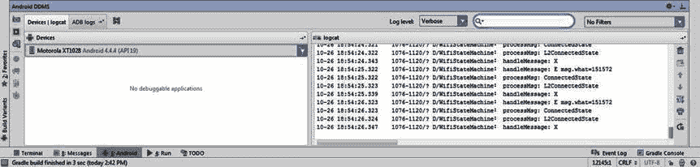

图 12-1。

The Android DDMS tool window

在该视图的右上角，您将看到三个重要的过滤器控件。日志级别下拉列表按优先级控制过滤。在图 12-1 中，该选项设置为 Verbose，记录所有消息。将日志级别设置为 Debug 将包括 Debug 优先级或更高优先级的所有消息。该下拉列表旁边是一个手动文本输入控件，它将消息限制为只包含您在此处键入的文本。清除条目会清除过滤器。下一个下拉列表包括一组预设过滤器和一个编辑或更改这些预设的选项。单击编辑过滤器配置以打开创建新的 Logcat 过滤器对话框。该对话框如图 12-2 所示，包括修改任何预设过滤器的控件。

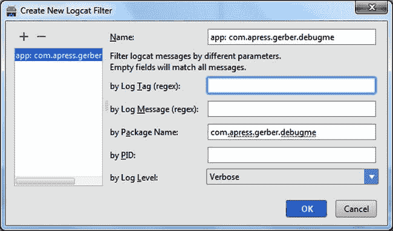

图 12-2。

The Create New Logcat Filter dialog box

您还可以添加、更改或删除任何自定义过滤器。这些预设可以通过标签、包名、进程 ID (PID)和/或日志级别进行过滤。

### 写入 Android 日志

当你的应用运行时，你可能想知道一个方法实际上正在执行，这个执行使得它通过了方法中的某个点，或者某些变量的值。SDK 在一个名为`android.util.Log`的类上定义了静态方法，您可以用它来写入日志。这些方法使用短名称— `v`、`d`、`I`、`w`、`e`和`f`—对应于详细、调试、信息、警告、错误和致命优先级。每个方法都有一个标签、一个消息字符串和一个可选的 throwable。您选择的方法决定了与您提供的消息相关联的优先级。例如，下面的片段是您可能在活动中找到的日志。它将记录带有调试优先级的文本`onCreate()`，同时使用类名作为标记:

`protected void onCreate(Bundle savedInstanceState) {`

`Log.d(this.getClass().getSimpleName(), "onCreate()");`

`super.onCreate(savedInstanceState);`

`setContentView(R.layout.activity_main);`

`}`

## 捕虫游戏。

大多数开发人员主要关注于编写有效的软件。本节向您介绍一个不工作的应用！它是故意带着问题写的，作为调试的练习。这个简单的数学测试应用有几个文本输入字段，用于输入任意数字。运算符下拉列表允许您选择加法、减法、乘法和除法。在底部的文本输入字段中，您可以尝试回答您构建的数学问题。复选按钮使您能够检查答案。通读清单 12-1 中的代码，看看它是如何工作的。

Listing 12-1\. The DebugMe App

`<FrameLayout`

`android:layout_width="fill_parent"`

`android:layout_height="fill_parent"`

`xmlns:android="``http://schemas.android.com/apk/res/android`

`android:background="@android:color/black">`

`<TextView`

`android:layout_width="wrap_content"`

`android:layout_height="wrap_content"`

`android:textAppearance="?android:attr/textAppearanceLarge"`

`android:text="Math Test"`

`android:id="@+id/txtTitle"`

`android:layout_gravity="center_horizontal|top"`

`android:layout_marginTop="10dp"`

`android:textColor="@android:color/white" />`

`<RelativeLayout`

`android:layout_width="fill_parent"`

`android:layout_height="fill_parent"`

`android:layout_gravity="center">`

`<EditText`

`android:layout_width="wrap_content"`

`android:layout_height="wrap_content"`

`android:id="@+id/editItem1"`

`android:text="25"`

`android:layout_above="@+id/editItem2"`

`android:layout_centerHorizontal="true"`

`android:layout_alignStart="@+id/editItem2"`

`android:textColor="@android:color/white" />`

`<Spinner`

`android:layout_width="wrap_content"`

`android:layout_height="wrap_content"`

`android:id="@+id/spinOperator"`

`android:layout_centerVertical="true"`

`android:layout_toLeftOf="@+id/editItem2"`

`android:layout_alignBottom="@+id/editItem2"`

`android:spinnerMode="dropdown" />`

`<EditText`

`android:layout_width="wrap_content"`

`android:layout_height="wrap_content"`

`android:id="@+id/editItem2"`

`android:text="50"`

`android:layout_centerVertical="true"`

`android:layout_centerHorizontal="true"`

`android:layout_margin="25dp"`

`android:textColor="@android:color/white" />`

`<EditText`

`android:layout_width="wrap_content"`

`android:layout_height="wrap_content"`

`android:text="\???"`

`android:id="@+id/editAnswer"`

`android:layout_below="@+id/editItem2"`

`android:layout_centerHorizontal="true"`

`android:layout_marginLeft="25dp"`

`android:textColor="@android:color/white" />`

`<TextView`

`android:layout_width="wrap_content"`

`android:layout_height="wrap_content"`

`android:textAppearance="?android:attr/textAppearanceLarge"`

`android:text="="`

`android:id="@+id/textView"`

`android:layout_below="@+id/editItem2"`

`android:layout_toLeftOf="@+id/editAnswer"`

`android:textColor="@android:color/white" />`

`<Button`

`android:layout_width="wrap_content"`

`android:layout_height="wrap_content"`

`android:layout_marginLeft="25dp"`

`android:text="Check"`

`android:onClick="checkAnswer"`

`android:layout_toRightOf="@id/editAnswer"`

`android:layout_alignBottom="@id/editAnswer"`

`android:textColor="@android:color/white" />`

`<TextView`

`android:layout_width="wrap_content"`

`android:layout_height="wrap_content"`

`android:textAppearance="?android:attr/textAppearanceLarge"`

`android:text="The answer is:\nXXX"`

`android:id="@+id/txtAnswer"`

`android:layout_below="@+id/editAnswer"`

`android:layout_centerHorizontal="true"`

`android:textColor="@android:color/holo_red_light"`

`/>`

`</RelativeLayout>`

`</FrameLayout>`

`public class MainActivity extends Activity {`

`private static final int SECONDS = 1000;//millis`

`private Spinner operators;`

`private TextView answerMessage;`

`@Override`

`protected void onCreate(Bundle savedInstanceState) {`

`Log.d(this.getClass().getSimpleName(), "onCreate()");`

`super.onCreate(savedInstanceState);`

`setContentView(R.layout.activity_main);`

`answerMessage = (TextView) findViewById(R.id.txtAnswer);`

`answerMessage.setVisibility(View.INVISIBLE);`

`operators = (Spinner) findViewById(R.id.spinOperator);`

`final ArrayAdapter<CharSequence> adapter = ArrayAdapter.createFromResource(this,`

`R.array.operators_array, android.R.layout.simple_spinner_item);`

`adapter.setDropDownViewResource(android.R.layout.simple_spinner_dropdown_item);`

`operators.setAdapter(adapter);`

`}`

`public void checkanswer(View sender) {`

`InputMethodManager imm = (InputMethodManager)getSystemService(Context.INPUT_METHOD_SERVICE);`

`imm.hideSoftInputFromWindow(findViewById(R.id.editAnswer).getWindowToken(), 0);`

`checkAnswer(sender);`

`}`

`public void checkAnswer(View sender) {`

`String givenAnswer = ((EditText) findViewById(R.id.editAnswer)).getText().toString();`

`int answer = calculateAnswer((EditText) findViewById(R.id.editItem1),`

`(EditText) findViewById(R.id.editItem2));`

`final String message = "The answer is:\n" + answer;`

`if(Integer.parseInt(givenAnswer) == answer) {`

`showAnswer(true, message);`

`} else {`

`showAnswer(false, message);`

`}`

`eventuallyHideAnswer();`

`}`

`private int calculateAnswer(EditText item1, EditText item2) {`

`int number1 = Integer.parseInt(item1.getText().toString());`

`int number2 = Integer.parseInt(item2.getText().toString());`

`int answer = 0;`

`switch(((Spinner) findViewById(R.id.spinOperator)).getSelectedItemPosition()) {`

`case 0:`

`answer = number1 + number2;`

`break;`

`case 1:`

`answer = number1 - number2;`

`break;`

`case 2:`

`answer = number1 * number2;`

`break;`

`case 3:`

`answer = number1 / number2;`

`break;`

`}`

`return answer;`

`}`

`private void showAnswer(final boolean isCorrect, final String message) {`

`if (isCorrect) {`

`answerMessage.setText("Correct! " + message);`

`answerMessage.setTextColor(getResources().getColor(android.R.color.holo_green_light));`

`} else {`

`answerMessage.setText("Incorrect! " + message);`

`answerMessage.setTextColor(getResources().getColor(android.R.color.holo_red_light));`

`}`

`answerMessage.setVisibility(View.VISIBLE);`

`}`

`private void eventuallyHideAnswer() {`

`final Runnable hideAnswer = new Runnable() {`

`@Override`

`public void run() {`

`answerMessage.setVisibility(View.INVISIBLE);`

`}`

`};`

`answerMessage.postDelayed(hideAnswer,10 * SECONDS);`

`}`

`}`

我们有一个活动，允许用户尝试解决一个简单的数学问题。`onCreate()`方法将所有视图组件保存在实例变量中，并将基本操作符(加、减、乘、除)插入到`ArrayAdapter`中。在调用被覆盖的`checkAnswer()`方法之前，`checkanswer()`方法隐藏了键盘，该方法执行检查我们答案的实际工作。这个被覆盖的`checkAnswer()`方法调用一个`calculateAnswer()`方法来寻找实际的答案。然后，`checkAnswer()`方法将答案与给定的答案进行比较，并构建一个答案消息。如果答案与给定的答案匹配，则调用`showAnswer()`，其中`true`值指示成功；否则，用`false`调用`showAnswer()`。最后，`checkAnswer()`方法通过调用`eventuallyHideAnswer()`方法最终隐藏了应答消息，这将发布一个`Runnable`代码块在 10 秒钟后执行。

当你开始使用这个应用时，你可能不会注意到这些错误，但它们很快就会出现。如果您通读了示例代码，并在运行它之前自己输入了它，您可能会对它明显的弱点很敏感。保留默认答案或尝试回答并点击“检查”按钮。应用会立即崩溃。试着再运行一次。这一次，输入数学题的错误答案，然后点击“检查”按钮。没有可见的反馈告诉你答案是否正确！您可能认为您知道崩溃的根源在哪里，但是我们不会猜测假设的问题，而是尝试使用调试器来正确地隔离 bug。

### 使用交互式调试器

Android Studio 包括一个交互式调试器，允许您设置断点。您可以通过单击编辑器左侧空白处您想要检查的行来设置断点。请记住，断点必须设置在包含可执行语句的行上；例如，您不能在包含注释的行上设置断点。设置断点时，Android Studio 会在装订线中添加一个粉色圆圈图标，并以粉色突出显示整行。当在调试模式下运行应用，并且程序执行到达断点时，槽中的圆圈变为红色，该行突出显示，执行暂停并进入交互式调试模式。在交互调试模式下，许多应用状态都显示在调试工具窗口中，包括变量和线程。程序的状态可以被详细检查或者甚至被改变。

要开始调试，可以通过单击顶部工具栏中的 bug 图标以调试模式启动程序，也可以单击 bug 图标右侧的图标。这将在程序运行时将调试器附加到程序上(见图 12-3 )。您选择的方法取决于您试图捕捉的问题。您的 bug 可能会在真实世界的条件下出现，因此您需要将设备带到特定的位置或以特定的方式使用它。在这种情况下，将设备连接到电脑可能会不方便。在这些情况下，让您的设备进入 bug 开始显现的状态，然后将设备连接到您的计算机以启动调试器是有意义的。然而，如果 bug 发生在应用启动的早期，以调试模式启动可能是有意义的，这样应用启动时可以立即暂停执行。在第三种方法中，你可以从 Android 设备设置中将一个应用设置为可调试的，并让它等待调试器连接。当您试图发现应用启动时出现的问题，但不想上传和替换设备上已安装的实际应用时，这很有帮助。

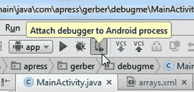

图 12-3。

Attach the debugger while running

我们将从在`MainActivity`中每个方法的第一行添加断点开始。当您不确定问题的确切位置并且没有太多方法时，这种方法非常有效。但是，它不会随着应用复杂性的增加而扩展。单击左边距中的装订线，在每个方法的第一行添加断点。你应该会看到类似于图 12-4 的东西。

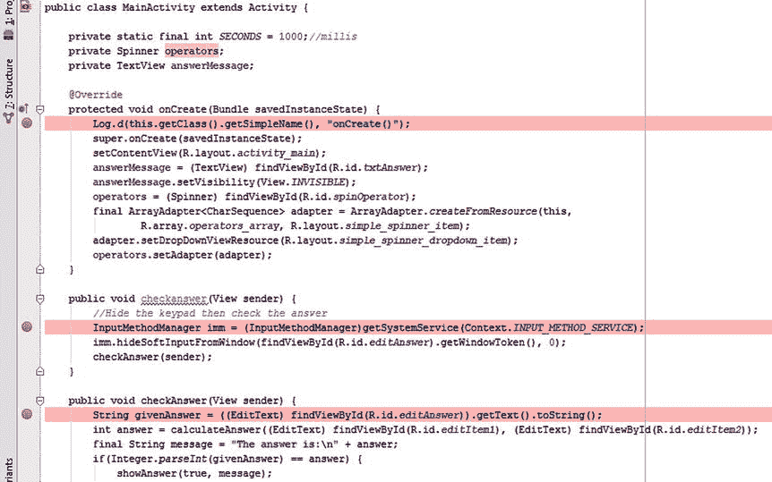

图 12-4。

Add breakpoints to each method in the MainActivity class

单击运行➤调试应用，等待 Android Studio 在设备上构建并启动您的应用。当应用启动时，您会看到一个简短的对话框，指示 adb (Android Debug Bridge)正在等待调试器连接，然后 IDE 才会建立连接。然后 Android Studio 最终会高亮显示(蓝色)在`onCreate()`方法行的第一个断点，如图 12-5 所示。调试工具窗口将会打开，如果您在等待断点时碰巧正在运行另一个程序，IDE 甚至会请求焦点并跳到屏幕的前面。这可能很方便，但如果你碰巧使用社交网络或聊天应用，会造成干扰，因为你的击键可能会进入编辑器并破坏你的代码，所以要小心！

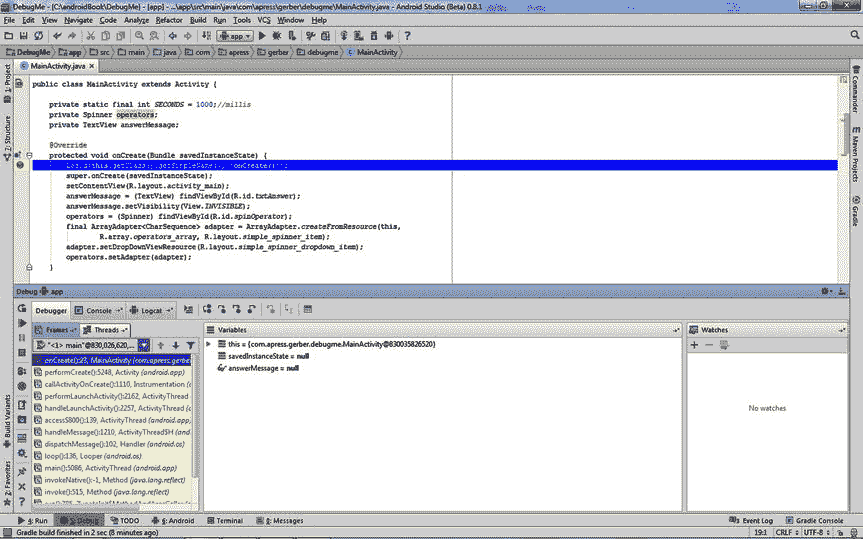

图 12-5。

Execution stops at a breakpoint and highlights it blue

当第一个断点显示为蓝色时,“调试工具”窗口从底部窗格打开，此时您可以开始检查程序的状态。“调试工具”窗口具有一些功能，您可以使用这些功能深入到执行和控件的不同区域，您可以使用这些功能单步执行、单步退出和单步跳过方法。当前行恰好是对`Log.d()`方法的调用，该方法向 Logcat 发送一行文本。单击 Logcat 选项卡显示日志，然后单击 Step Over 按钮执行 log 语句。Logcat 显示日志信息，执行移动到下一行，如图 12-6 所示

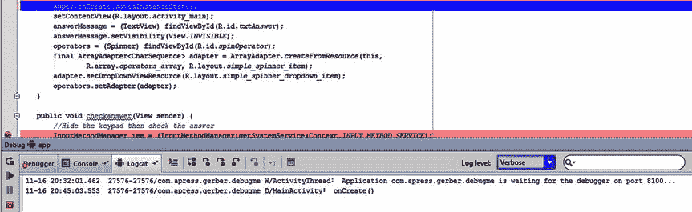

图 12-6。

The Logcat view shows the log message after stepping over

单击调试器选项卡以显示变量视图。在这个视图下，您应该看到三个变量:`this`、`savedInstance`和`answerMessage`。点击`this`变量旁边的三角形，展开与`this`对象相关的所有变量。`this`对象总是表示正在执行的当前类，所以当前文件中的所有实例变量在您深入查看时都是可见的。您还会看到许多其他实例变量，每个都是从父类派生的。筛选如此多的变量可能有些乏味，但它有助于理解您当前正在调试的类的结构。折叠`this`变量，再点击两次单步执行，将执行点移动到`answerMessage`的赋值处。请注意，在 variables 视图中突然出现了操作符的实例变量。当执行点接近实例变量的赋值时，它们开始显示在 variables 视图中。

### 评估表达式

在运行将设置`answerMessage`变量的赋值语句之前，您可以分解这一行，看看在它发生之前会有什么赋值。单击并拖动选择到`findViewById(R.id.txtAnswer)`表达式上，然后按 Alt+F8。你会看到一个类似于图 12-7 的对话框。

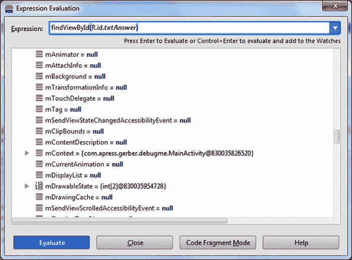

图 12-7。

Using the Evaluate Expression dialog box

该表达式将被复制到“表达式求值”对话框中，并且可以独立于该行的其余部分执行。该对话框接受任何 Java 代码片段，并显示其评估结果。单击“求值”(或按 Enter 键，因为默认情况下选择了“求值”)来求值并执行表达式。对话框最终会被表达式的结果填充，你可以看到代表`TextView`的对象，它保存了答案文本。当你检查答案时，你最终会看到同样的`TextView`。结果是一个以扩展形式显示的对象，它提供了关于`TextView`状态的大量信息。您可以检查内部的`mText`属性、文本颜色、布局参数等等。在表达式后面追加一个`getVisibility()`方法调用，如图 12-8 所示。

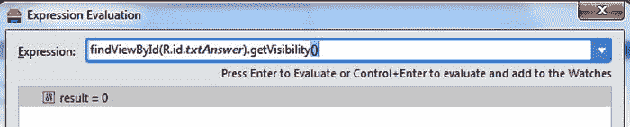

图 12-8。

Examine the answer EditText’s visibility in the Evaluate Expression dialog box

`findViewById(R.id.txtAnswer).getVisibility()`表达式的结果为 0，等于`View.VISIBLE`常数。记住常量的值可能很困难，但您可以在表达式计算器中使用任何表达式。这意味着通过使用如下表达式，您可以直接询问 Android Studio，“我的视图可见吗？”

`findViewById(R.id.txtAnswer) == View.Visible`

前面一行代码的结果将是`true`；但是，尝试跳过接下来的两行，执行将视图设置为不可见的那一行。按 Alt+F8 再次调出“表达式计算器”对话框，并使用向下箭头键在您计算过的早期表达式中循环，找到“我的视图可见吗？”表情。此时，结果应该是`false`，在意料之中。这个想法是隐藏答案，直到点击检查按钮。逐行单步执行语句可以让您了解实际发生了什么，而使用表达式计算器可以让您在程序运行时确认变量或表达式的值。

单击调试器左侧控制面板中的运行按钮，恢复正常执行。app 会继续完成`onCreate()`方法，以正常速度运行，直到到达另一个断点。在`onCreate()`完成之后，用户界面应该在您的设备或模拟器上呈现。至此，我们可以开始解决实际问题了。当你试图检查数学问题的给定答案时，第一个问题出现了。键盘永远不会隐藏，答案永远不会透露。点击问号激活答案字段`TextEdit`控件，清除它，并键入任何数字。接下来点击检查按钮。即使在第一个`checkanswer()`方法的开头有一个断点，执行也会在第一行的`checkAnswer()`方法处暂停。这里的意图是第一个`checkanswer()`方法应该在有逻辑隐藏键盘的地方被调用。这个方法然后调用第二个`checkAnswer()`方法来完成验证输入的实际工作。因为没有调用第一个方法，所以键盘保持可见！

现在您已经知道了这个问题的原因，让我们检查一下代码的其他部分，看看为什么这个方法没有被调用。我们的例子使用`activity_main`布局文件中的`onClick`属性将按钮连接到方法。打开`activity_main`布局文件，你会找到根本原因。Check 按钮的`onClick`属性被设置为`checkAnswer`(使用大小写混合版本)，而你确实希望`onClick`属性调用`checkanswer`(全小写版本)。忽略使用仅大小写不同的两个方法名的明显不良模式，修复在`android:onClick`属性中的调用，将其设置为`checkanswer`。现在，单击左侧控制窗格中的调试器停止按钮。这将分离调试器，并允许程序恢复正常执行。构建并再次运行应用以查看结果。您应该会看到类似于图 12-9 的内容。

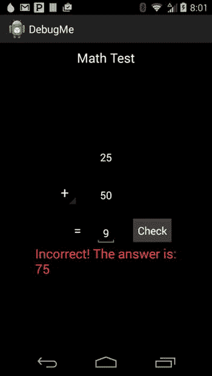

图 12-9。

The keypad is dismissed, and the answer’s TextView is visible

### 使用堆栈跟踪

您通过使用交互式调试器发现并修复了两个错误。然而，更多的问题存在。如果您再次启动应用并立即点击检查按钮，应用将会崩溃。您可以使用交互式调试器来查找根本原因，也可以跟踪堆栈跟踪。堆栈跟踪是崩溃时堆栈上每个方法的转储，包括行号。堆栈引用一系列方法，每个方法都由它之前的方法调用。Java 将程序错误表示为`Exception`或`Throwable`对象。这些特殊的对象携带关于错误原因的元数据以及错误发生时的程序状态。异常沿着程序堆栈向上传播到调用方法及其父调用方，直到它们被捕获和处理。如果它们没有被发现和处理，它们会一直传播到操作系统，使你的应用崩溃。要想清楚，最好看一个例子。触发崩溃，然后立即在 Android DDMS 工具窗口下的 logcat 窗口中查找堆栈跟踪。

Listing 12-2. The Stack Trace Produced When Check Is Tapped

`03-08 20:10:56.660    9602-9602/com.apress.gerber.debugme E/AndroidRuntime:` `FATAL EXCEPTION: main`

`Process: com.apress.gerber.debugme, PID: 9602`

`java.lang.IllegalStateException: Could not execute method of the activity`

`at android.view.View$1.onClick(View.java:3841)`

`at android.view.View.performClick(View.java:4456)`

`at android.view.View$PerformClick.run(View.java:18465)`

`at android.os.Handler.handleCallback(Handler.java:733)`

`at android.os.Handler.dispatchMessage(Handler.java:95)`

`at android.os.Looper.loop(Looper.java:136)`

`at android.app.ActivityThread.main(ActivityThread.java:5086)`

`at java.lang.reflect.Method.invokeNative(Native Method)`

`at java.lang.reflect.Method.invoke(Method.java:515)`

`at com.android.internal.os.ZygoteInit$MethodAndArgsCaller.run(ZygoteInit.java:785)`

`at com.android.internal.os.ZygoteInit.main(ZygoteInit.java:601)`

`at dalvik.system.NativeStart.main(Native Method)`

`Caused by: java.lang.reflect.InvocationTargetException`

`at java.lang.reflect.Method.invokeNative(Native Method)`

`at java.lang.reflect.Method.invoke(Method.java:515)`

`at android.view.View$1.onClick(View.java:3836)`

`at android.view.View.performClick(View.java:4456)`

`at android.view.View$PerformClick.run(View.java:18465)`

`at android.os.Handler.handleCallback(Handler.java:733)`

`at android.os.Handler.dispatchMessage(Handler.java:95)`

`at android.os.Looper.loop(Looper.java:136)`

`at android.app.ActivityThread.main(ActivityThread.java:5086)`

`at java.lang.reflect.Method.invokeNative(Native Method)`

`at java.lang.reflect.Method.invoke(Method.java:515)`

`at com.android.internal.os.ZygoteInit$MethodAndArgsCaller.run(ZygoteInit.java:785)`

`at com.android.internal.os.ZygoteInit.main(ZygoteInit.java:601)`

`at dalvik.system.NativeStart.main(Native Method)`

`Caused by: java.lang.NumberFormatException: Invalid int: "???"`

`at java.lang.Integer.invalidInt(Integer.java:137)`

`at java.lang.Integer.parse(Integer.java:374)`

`at java.lang.Integer.parseInt(Integer.java:365)`

`at java.lang.Integer.parseInt(Integer.java:331)`

`at com.apress.gerber.debugme.MainActivity.checkAnswer(MainActivity.java:46)`

`at com.apress.gerber.debugme.MainActivity.checkanswer(MainActivity.java:39)`

`at java.lang.reflect.Method.invokeNative(Native Method)`

`at java.lang.reflect.Method.invoke(Method.java:515)`

`at android.view.View$1.onClick(View.java:3836)`

`at android.view.View.performClick(View.java:4456)`

`at android.view.View$PerformClick.run(View.java:18465)`

`at android.os.Handler.handleCallback(Handler.java:733)`

`at android.os.Handler.dispatchMessage(Handler.java:95)`

`at android.os.Looper.loop(Looper.java:136)`

`at android.app.ActivityThread.main(ActivityThread.java:5086)`

`at java.lang.reflect.Method.invokeNative(Native Method)`

`at java.lang.reflect.Method.invoke(Method.java:515)`

`at com.android.internal.os.ZygoteInit$MethodAndArgsCaller.run(ZygoteInit.java:785)`

`at com.android.internal.os.ZygoteInit.main(ZygoteInit.java:601)`

`at dalvik.system.NativeStart.main(Native Method)`

堆栈跟踪可能会很长，这取决于你的应用的复杂性，但是学习导航它们是一项有价值的技能，可以添加到你的武器库中。在前面的堆栈跟踪中，您将看到各种方法名称和行号一起列出。第一个列出的方法`View$1.onClick`被认为是堆栈的顶部，是最近调用的方法。方法名旁边是一个行号，指向发生异常的源代码的实际行。因为这个类不是我们作为示例的一部分编写的代码，所以您必须深入查看堆栈。当您向下查看堆栈时，您会看到以`Caused By`开头的条目。阅读的方式如下:你有一个异常，这个异常是由一个异常引起的，以此类推。如果你读了最后一个原因，你会发现实际的问题，`Invalid int: "???"`。系统抱怨您向`Integer.java`中的`InvalidInt`方法传递了一个无效的整数值，一系列问号。这是 Android 运行时的一部分，不受你的控制。但是，如果您继续阅读，您会看到`invalidInt`被更多的 Java 运行时方法调用，这些方法实际上是由`checkAnswer`调用的，这些方法在`MainActivity.java`中。您可以单击 Logcat 视图中的行号，这将直接跳转到下面代码片段中指示的位置:

`if(Integer.parseInt(givenAnswer) == answer) {`

`showAnswer(true, message);`

`} else {`

`showAnswer(false, message);`

`}`

`eventuallyHideAnswer();`

此时，在点击 Check 之后，我们将把`givenAnswer`变量传递给`Integer.parseInt`方法。在同一方法的前几行，您将看到以下初始化 givenAswer 变量的代码:

`String givenAnswer = ((EditText) findViewById(R.id.editAnswer)).getText().toString();`

来自`EditText`控件的文本值存储在`givenAnswer`字符串变量中。在将值转换为数字之前，您应该检查它是否确实是一个数字，以防止系统崩溃。将调用`Integer.parseInt`的`if`块改为使用以下`if` / `else if`逻辑:

`if(! isNumeric(givenAnswer)) {`

`showAnswer(false, "Please enter only numbers!");`

`} else if(Integer.parseInt(givenAnswer) == answer) {`

`showAnswer(true, message);`

`} else {`

`showAnswer(false, message);`

`}`

接下来定义`isNumeric`方法如下:

`private boolean isNumeric(String givenAnswer) {`

`String numbers = "1234567890";`

`for(int i =0; i < givenAnswer.length(); i++){`

`if(!numbers.contains(givenAnswer.substring(i,i+1))){`

`return false;`

`}`

`}`

`return true;`

`}`

`isNumeric()`方法根据所有数字的列表测试每个字符。如果该方法返回`false`，那么修改后的`if`块将调用`showAnswer()`，并提示用户只输入数字。准备就绪后，再次尝试运行该应用。轻按“检查”按钮，不更改带问号的默认答案。崩溃行为应该被重点关注。代码中还有一个故意放置的错误，这可能会导致崩溃。我们稍后解释。使用该应用来解决一些数学问题与一些其他运营商除了揭露崩溃。花一点时间用你所学的来看看你是否能找到它。

本节介绍了调试的基础知识。现在，您将深入探索交互式调试器，并访问它的更多特性。在第十一章中，我们讨论了分析堆栈跟踪工具，它可以帮助你解析长堆栈跟踪。

### 探索交互式调试器的工具窗口

调试器工具窗口包括跟踪执行时逐句进入代码行的控件。默认情况下，“框架”选项卡显示调用堆栈。调用堆栈是被调用以到达当前断点的方法调用的堆栈。在这些堆栈中，最后调用的方法在顶部，而调用它的方法就在下面。属于 Android 运行时的方法被涂成黄色，以区别于项目中定义的方法，后者被涂成白色。

图 12-10 描述了一个调用栈，并关注两个项目方法。在这个例子中，`checkAnswer()`方法调用了`calculateAnswer()`方法，所以`calculateAnswer()`方法在栈顶。

图 12-10。

Use the frames view to examine the call stack

跳过按钮跳过当前行，到下一行。当前行上的所有指令，包括任何方法调用，都被立即执行。当它到达下一行时，应用将暂停。

单步执行按钮执行当前行上的所有指令，直到该行上的第一个方法调用。执行在第一个方法调用的第一行暂停。如果一行中出现多个方法调用，则遵循 Java 定义的正常操作顺序:从左向右执行，嵌套方法首先执行。不考虑在项目外部的类中定义的方法(比如第三方 JAR 文件，以及内置的 Java 和 Android API 方法)。这些方法的执行步骤。

Force Step Into 按钮的行为类似于 Step Into 按钮，除了外部定义的方法，如 Android SDK 中定义的方法，也被单步执行。

步出按钮完成当前方法中所有指令的执行，并步出该方法，到调用堆栈中的前一个调用方法。执行在调用方法后的下一行代码处暂停。

Show Execution Point 按钮将您导航到执行当前暂停的位置。有时，您可能会在调试时远离断点并深入代码。通过使用导航中介绍的一些高级功能，您可以进入各种方法调用或探索类的调用者。这种探索可能会导致您丢失最初跟踪的方法的上下文。此选项允许您快速重新校准并从开始的地方开始。

### 使用断点浏览器

点击运行查看断点打开断点对话框，如图 12-11 所示。此对话框概述了您在应用中创建的所有断点。如果双击列表中的任何断点，IDE 将跳转到源代码的该行。选择任何断点都会在右侧视图中显示其详细信息。详细视图使您能够禁用断点，并控制当执行到达断点时应用暂停的方式和时间。这个视图充满了强大的选项，允许您微调断点的行为。你有能力运行任意程序语句，有条件地在感兴趣的点暂停应用，甚至控制其他断点的执行。

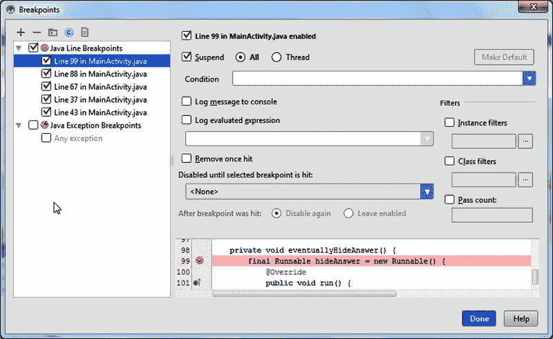

图 12-11。

Set breakpoint properties with the Breakpoints dialog box

视图中的第一个复选框启用和禁用断点。“挂起”复选框控制到达断点时的执行行为。如果未选中此复选框，断点将被完全禁用，并且在运行时对应用没有影响。当与其他一些选项(如 Log Evaluated Expression 选项)结合使用时，此功能特别有用。Suspend 选项旁边的单选按钮将导致断点分别挂起整个应用或当前线程。这是一项高级功能，有助于调试行为难以遵循的多线程应用。

Condition 选项允许您指定断点处于活动状态的条件。该下拉列表接受任何计算结果为布尔值的有效 Java Android 代码表达式。表达式中使用的代码在定义断点的方法的上下文中执行。因此，代码可以访问在定义它的方法中可见的任何变量。它遵循 Java 语法规则来确定作用域，您可以参考这些规则来获得关于变量可见性的更多细节。当条件为`false`时，断点被忽略。当条件为`true`时，执行将在到达断点时暂停。

每次到达断点时,“将消息记录到控制台”选项都会向调试控制台发出一条通用日志消息。这个通用消息包括方法的完全限定名和行号的可点击引用。若要查看实际效果，请检查当前在“断点”对话框中设置的每个断点。取消选中“暂停”复选框，并为每个选项选中“将消息记录到控制台”复选框。在应用运行的情况下，点击 Check 按钮触发对`checkanswer()`的呼叫。激活调试器工具窗口中的“控制台”选项卡，以查找来自调试器的日志消息。

Log Evaluated Expression 选项包括一个文本输入字段，它接受任何有效的 Java 代码语句。每当到达断点时，就会执行下拉列表中的代码，并将代码评估结果写入调试控制台。与 Condition 选项非常相似，这段代码在定义它的方法的上下文中运行。代码遵循与 Condition 选项相同的变量可见性规则。通常，您会指定一个计算结果为字符串的 Java 表达式，但是要知道任何 Java 语句都可以被计算，甚至是 Java 赋值语句。这使您能够在应用运行时插入代码，甚至改变行为！

Remove Once Hit 选项允许您定义自毁断点。当在一个紧密的循环中使用时，这是很有用的，在这种循环中，多次点击会使你试图看到的东西变得模糊。

“命中选定断点前禁用”选项允许您将一个断点连接到另一个断点。此选项使当前断点保持禁用状态，直到执行到达此处指定的断点。假设您有一个方法`foo`，它重复调用另一个方法`bar`，您正试图调试这个方法。当`foo`调用`bar`时，您正试图跟踪它的行为。让事情变得复杂的是，假设其他几种方法也调用`bar`。您可以在`foo`和`bar`中放置一个断点，然后选择`bar`的断点并配置此选项以禁用`bar`，直到到达`foo`中的断点。

早些时候，我们认为应用中还有一个错误会导致崩溃。这场崩溃可能很明显，也可能不明显。如果输入类似图 12-12 的表达式，就会触发 bug。您可以使用本章介绍的任何功能来调试崩溃。查看堆栈跟踪可以直接找到问题的根源。

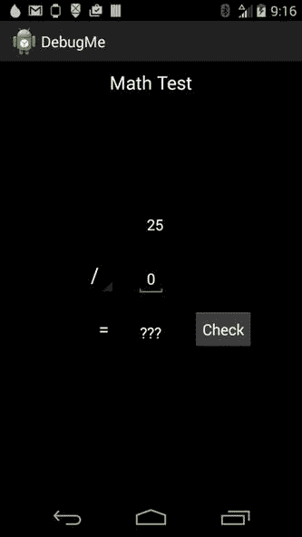

图 12-12。

Try a division problem to find a crash!

`switch` / `case`块中的算术表达式需要防止被零除。使用以下代码片段解决崩溃问题:

`switch(((Spinner) findViewById(R.id.spinOperator)).getSelectedItemPosition()) {`

`case 0:`

`answer = number1 + number2;`

`break;`

`case 1:`

`answer = number1 - number2;`

`break;`

`case 2:`

`answer = number1 * number2;`

`break;`

`case 3:`

`if(number2 != 0) {`

`answer = number1 / number2;`

`}`

`break;`

`}`

### 条件断点

调试中比较乏味的练习之一是跟踪重复方法调用和循环之间的错误行为。根据逻辑的复杂程度，您可能会花费宝贵的时间逐句通过代码行，等待逻辑出现异常的特定情况。为了节省时间，Android Studio 支持条件断点。这些断点仅在给定的条件下是活动的。为了演示，假设您想要支持数学测试的指数特性。给`arrays.xml`中的`operators_array`添加一个指数运算符，如下所示:

`<resources>`

`<string-array name="operators_array">`

`<item>+</item>`

`<item>-</item>`

`<item>x</item>`

`<item>/</item>`

`<item>exp</item>`

`</string-array>`

`</resources>`

因为您已经在数组的索引 4 处添加了 exp，所以您必须向`calculateAnswer()`方法添加另一个 case 块，如下所示:

`case 4:`

`if (number2!=0) {`

`answer = 1;`

`for(int i=0; i <=number2; i++) {`

`answer = answer * number1;`

`}`

`}`

`break;`

您添加的是一个简单的循环，使用第二个数字作为循环计数器，将第一个数字乘以自身。在这一点上，故意的错误对您来说可能是显而易见的，也可能是不明显的。构建并运行应用，尝试解决一个 2 的 8 次方的数学问题。图 12-13 展示了这些变化会给你带来什么。

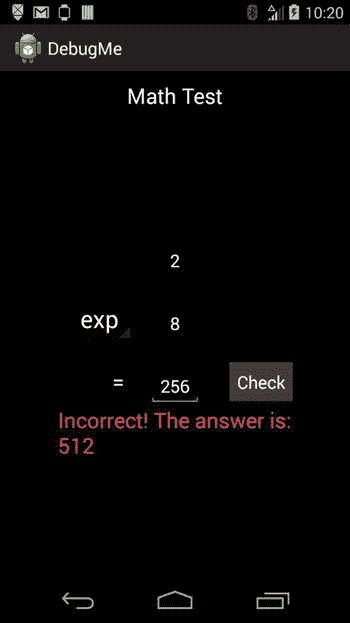

图 12-13。

The exponent answer is correct, but the app gives an error

应用错误地将答案计算为 512。您将使用交互式调试器来查找问题。首先，清除所有断点以避免任何不必要的暂停。单击“附加调试器”图标进入交互式调试模式并附加您的调试器。现在，您可以在刚刚添加的 for 循环中间放置一个断点，遍历 8 个循环，看看为什么会得到错误的结果。或者，您可以使用条件断点来查看最后一次迭代中发生了什么。单击装订线以在该行添加断点:

`answer = answer * number1;`

接下来右击断点，在条件字段中输入表达式 i==8(如图 12-14 所示)。

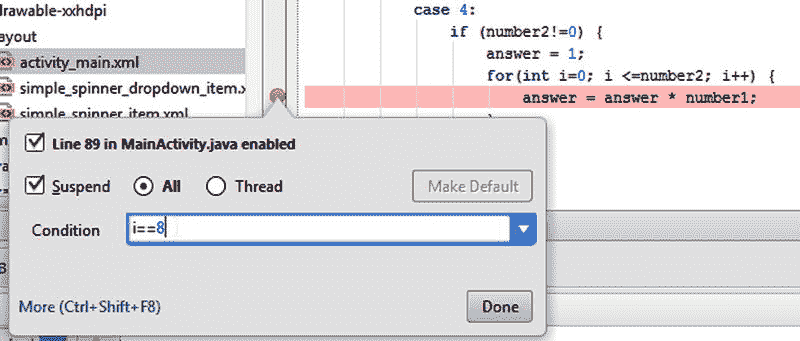

图 12-14。

Set a condition for the breakpoint

单击完成关闭弹出窗口，然后点击设备或模拟器上的检查按钮。执行将在断点处暂停，但只有在`i`计数器增加到 8 之后。在调试工具窗口的变量视图中查看所有变量的状态。`number1`变量设为 2，`number2`变量设为 8，答案是 256。但是，此时单击“单步执行”会导致发生额外的乘法运算，从而改变值。预期的行为是循环在第 8 个周期后终止，但事实并非如此。如果您仔细观察 for 循环中的条件，您会看到`i`如何初始化为 0，以及对`i<=number2`的检查。你需要检查`i<number2`，因为`i`是从 0 开始的。进行更改，然后构建并正常运行应用来测试它。图 12-15 显示了更改后运行的应用。

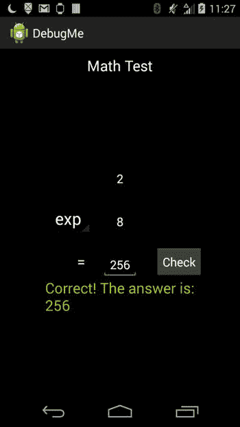

图 12-15。

Figure 12-15.

## 摘要

在本节中，您学习了如何使用 Android Studio 中的各种工具和功能进行调试。您了解了如何在各种级别使用日志记录，以及如何直接在 IDE 中检查 Android logcat。您探索了交互式调试器并研究了它的高级特性。您还在一个损坏的应用中进行了代码潜水，并使用调试工具来查找和修复崩溃。通过代码示例，您已经熟悉了从 stacktraces 导航和设置常规断点和条件断点。本章只讲述了在 Android Studio 中调试的基础知识。您可以创造性地组合调试器中的许多功能，以定制您的体验。您还可以在调试会话中结合 Android Logcat，以便更深入地了解您的应用。