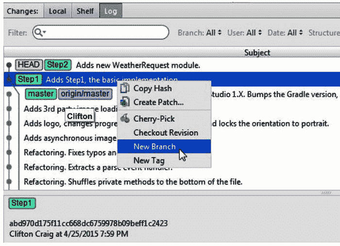
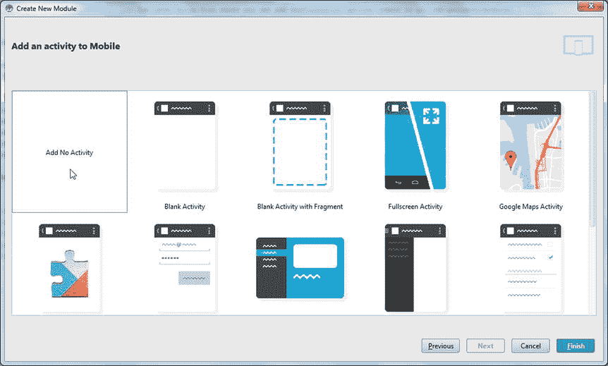

# 十三、级别

当 Android 最初发布时，Google 开发了一个基于 Apache Ant 的构建系统，作为 SDK 的一部分。Ant 是一项成熟的技术，经过多年的改进，拥有一个庞大的贡献者社区。多年来，出现了其他构建系统，其中一些在蓬勃发展的社区中变得流行起来。在这些构建系统中，Gradle 成为 Java 开发的下一个发展阶段。本章探讨了 Gradle，并举例说明了如何最好地使用它来开发和维护您的 Android 应用。

在阐述 Gradle 之前，本章解释了什么是构建系统，以及为什么你可能需要对现有的构建系统进行改进。历史上，创建应用或任何软件的过程都涉及用特定的编程语言编写代码，然后将代码编译成可执行的形式。

Note

本章后面会有一个实验，解释如何在多模块项目中使用 Gradle。我们邀请您使用 Git 克隆这个项目的 Lab，以便跟进，尽管您将从头开始使用它自己的 Git 库重新创建这个项目。如果您的计算机上没有安装 Git，请参见第七章。在 Windows 中打开一个 Git-bash 会话(或者在 Mac 或 Linux 中打开一个终端)并导航到 C:\androidBook\reference\(如果没有参考目录，请创建一个。在 Mac 上，导航到/your-labs-parent-dir/reference/)并发出以下 git 命令:git clone[`https://bitbucket.org/csgerber/gradleweather.git`](https://bitbucket.org/csgerber/gradleweather.git)gradle weather。

现代软件开发不仅包括链接和编译，还包括测试、打包和最终产品的发布。构建系统通过提供完成这些任务的必要工具来满足这些紧急需求。考虑许多开发人员今天面临的紧急需求列表:支持最终产品的变体(调试版本、发布版本、付费版本和免费版本)，管理作为产品一部分的第三方软件库和组件，以及基于外部因素向整个过程添加条件。

Android 构建系统最初是用 Ant 编写的。它基于一个相当扁平的项目结构，没有为诸如构建变化、依赖性管理和将项目的输出发布到中央存储库之类的事情提供太多的支持。Ant 有一个简单且可扩展的基于 XML 标记的编程模型，尽管许多开发人员觉得它很麻烦。此外，Ant 使用声明性模型。尽管 Ant 遵循函数式编程的一些原则，但许多开发人员对大多数现代编程语言中常见的命令式模型并不陌生。简而言之，不直接支持诸如循环结构、条件分支和可重分配属性(变量的 Ant 等价物)之类的东西。

Gradle build 是用 Groovy 编程语言编写的，它构建在 Java 的核心运行时和 API 之上。Groovy 松散地遵循 Java 的语法，当与 Java 的语法结合时，降低了学习曲线。这增加了 Groovy 的吸引力，因为它非常接近 Java 语言，您可以将大部分 Java 代码移植到 Groovy，只需做很少的更改。这也增加了 Gradle 的优势，因为您可以在 Gradle 构建的任何时候添加 Groovy 代码。由于 Groovy 语法与 Java 如此接近，您实际上可以在 Gradle 构建脚本的中间添加 Java 语法，以达到您想要的效果。Groovy 还在 Java 的语法中加入了闭包。闭包是用花括号括起来的代码块，可以赋给变量或传递给方法。闭包是 Gradle 构建系统的核心部分，稍后您将了解更多。

## gradle 语法

Gradle 构建脚本实际上是遵循某些约定的 Groovy 脚本文件。因此，您可以在构建中包含任何有效的 Groovy 语句。然而，大多数都是由遵循基于块的简单语法的语句组成的。Gradle 构建脚本的基本结构包括配置和任务块。任务块定义了在构建过程中不同时间点执行的代码。配置块是特殊的 Groovy 闭包，它在运行时向底层对象添加属性和方法。您可以在 Gradle 构建脚本中包含其他类型的块，但这超出了本书的范围。您将主要使用配置块，因为 Gradle Android 构建中涉及的任务已经定义好了。配置块采用以下形式:

`label {`

`//Configuration code...`

`}`

其中`label`是特定对象的名称，花括号定义了该对象的配置块。配置块中的代码采用以下形式:

`{`

`stringProperty "value"`

`numericProperty 123.456`

`buildTimeProperty anObject.someMethod()`

`objectProperty {`

`//nested configuration block`

`}`

`}`

该块可以访问对象的各个属性，并为它们赋值。这些属性可以是字符串、数字或对象本身。字符串属性可以接受文字值或从 Groovy 方法调用返回的值。文字值遵循类似于 Java 的规则。但是，字符串可以用双引号、单引号或 Groovy 用来表示字符串的任何其他方式来表示。对象特性使用嵌套块来设置它们各自的特性。

Gradle 构建脚本遵循一定的标准。在这个标准下，构建脚本的顶部是您声明 Gradle 插件的地方。这些是用 Groovy/Gradle 编写的组件，它们增加或扩展了 Gradle 的特性。插件声明遵循`apply plugin: 'plugin.id'`的形式，其中`plugin.id`是您希望使用的 Gradle 插件的标识符。

Gradle 任务和配置块以任何顺序遵循插件定义。习惯上声明 Android 插件，它是通过`android`属性在构建脚本中可用的对象。项目的依赖项通常遵循 Android 配置。依赖项列出了支持项目使用的任何外部 API、声明的插件或组件的所有库。下面是一个 Gradle 构建脚本的例子。稍后你会了解到更多的细节。

Listing 13-1\. A Gradle Build Script Example

`apply plugin: 'com.android.application'`

`android {`

`compileSdkVersion 20`

`buildToolsVersion '20.0.0'`

`defaultConfig {`

`applicationId "com.company.package.name"`

`minSdkVersion 14`

`targetSdkVersion 20`

`versionCode 1`

`versionName "1.0"`

`}`

`buildTypes {`

`release {`

`minifyEnabled false`

`proguardFiles getDefaultProguardFile('proguard-android.txt'),` 

`'proguard-rules.pro'`

`}`

`}`

`}`

`dependencies {`

`compile fileTree(dir: 'libs', include: ['*.jar'])`

`compile 'com.android.support:support-v4:20.+'`

`}`

## IntelliJ 核心构建系统

Android Studio 基于 IntelliJ IDEA 平台构建，继承了 IntelliJ 核心的大部分功能。它以插件的方式向内核添加了更多 Android 特有的功能。插件是一种软件组件，可以从 IntelliJ 插件库中下载，并以可插拔的方式安装或删除，就像乐高积木一样。这些插件用于增强 IntelliJ 的功能，每个插件都可以通过使用设置窗口来启用或禁用。IntelliJ Gradle 插件将 IntelliJ 的核心构建系统融合到 Gradle 构建系统中。当输出通过 IntelliJ 核心反馈并以 IntelliJ 熟悉的方式格式化时，通常触发应用构建的动作改为调用 Gradle。

## Gradle 构建概念

Gradle build 系统是一个通用工具，用于从源文件集合中构建软件包。它定义了一些构建软件的高级概念，这些概念对于大多数项目都是一致的。最常见的概念包括项目、源集、构建工件、依赖工件和存储库。项目是硬盘上的一个位置，包含所有项目源代码的集合。一个 Gradle build 将有一组源文件，它们被表示为源集。它将有一个可选的依赖列表。这些依赖项是软件工件，可以包括从 JAR 或 ZIP 存档到文本文件，再到预编译的二进制文件的任何东西。工件从存储库中取出。存储库是以特殊方式组织的工件的集合，以允许构建系统找到给定的工件。它可以是硬盘上的一个位置，也可以是一个按照标准惯例组织工件的特殊网站。每个工件可以有选择地包括它自己的依赖集，这些依赖集可以包含在构建中。构建将源集与依赖工件结合起来，生成构建工件。构建者可以有选择地将这些工件发布到存储库中，以便其他开发人员或团队可以使用它们。

### Gradle Android 结构

Gradle Android 项目有一个分层结构，将子项目或模块嵌套在项目根下的各个文件夹中。这类似于 Android Studio 的 IntelliJ 基础传统上管理项目的方式。使用 Gradle 和 IntelliJ 环境，一个简单的项目可以包含一个名为`app`的模块，以及一些其他的文件夹和文件，或者它可以包含多个不同名称的模块。相似之处到此为止，因为 Gradle 允许模块的无限嵌套。换句话说，一个项目可以包含一个模块，该模块也包含嵌套模块。因此，Android Studio 构建系统在幕后运行 Gradle。下面的列表简要描述了一个典型的 Gradle Android 项目中包含的各个文件和文件夹。此列表主要关注您可能会考虑更改的文件:

*   临时的 Gradle 输出、缓存和其他支持元数据都存储在这个文件夹下。
*   `app`:单个模块按照名字嵌套在根目录下的文件夹中。每个模块文件夹包含一个 Gradle 项目文件，该文件生成主项目使用的输出。最简单的 Android 项目将包括一个生成 APK 工件的 Gradle 项目。
*   这个文件夹包含了 Gradle 包装器。Gradle 包装器是一个 JAR 文件，包含与当前项目兼容的 Gradle 运行时版本。
*   `build.gradle`:整个项目构建逻辑存在于这个文件中。它负责包含任何必需的子项目，并触发每个子项目的构建。
*   `gradle.properties` : Gradle 和 JVM 属性存储在这个文件中。您可以使用它来配置 Gradle 守护进程，并管理 Gradle 在构建期间如何生成 JVM 进程。你也可以使用这个文件来帮助 Gradle 在网络上通过 web 代理进行通信。
*   这些文件是操作系统特有的文件，用于通过包装器执行 Gradle。如果您的系统上没有安装 Gradle，或者您没有与您的构建兼容的版本，那么建议使用这些文件中的一个来调用 Gradle。
*   `local.properties`:这个文件用来定义本地机器特有的属性，比如 Android SDK 或者 NDK 的位置。
*   `settings.gradle`:多项目构建或任何定义子项目的项目都需要这个文件。它定义了整体构建中包含哪些子项目。
*   `Project.iml`、`.idea`、`.gitignore`:在 Android Studio 中创建新项目时，您可能会注意到根目录下的这些文件。虽然这些文件(除了在第七章中讨论的`.gitignore`)不是 Gradle 构建系统的一部分，但是它们会随着你对 Gradle 文件的修改而不断更新。它们会影响 Android Studio“看待”您的项目的方式。
*   所有的 Gradle 构建输出都在这个文件夹下。这包括生成的源。Gradle 有组织有意识地将所有输出保存在一个文件夹中。这简化了项目，因为要从版本控制中排除的内容列表不那么令人生畏，而清理只是删除一个文件夹。

### 项目相关性

Gradle 简化了依赖项管理，使得跨多个项目使用和重用代码变得容易，与平台无关。当一个项目变得越来越复杂时，将它分成单独的部分是有意义的，这在 Android 中被称为库。这些库可以在单独的 Gradle 项目中独立开发，也可以在 Android Studio 的多模块项目中共同开发。因为 Android Studio 将模块作为 Gradle 项目来处理，所以界限可能会变得模糊，这为代码共享带来了强大的可能性。调用全球另一个团队开发的代码中的对象与调用本地单独模块中的对象几乎是一样的！当您的项目中的代码需要调用另一个 Gradle 项目或另一个 Android Studio 模块中的代码时，您只需在主项目中声明一个依赖项，就可以将代码绑定在一起。最终的结果是将独立的部分无缝地缝合在一起，形成一个有凝聚力的应用。

考虑一个简单的例子，您的应用需要调用外部类`Foo`中的方法`bar`。使用传统的 Android 工具，你必须找到定义类`Foo`的项目。这可能包括从网上下载，或者如果你不太确定项目的位置或主页，甚至是费力的网上搜索。然后，您必须执行以下操作:

*   将下载的项目保存到开发计算机上
*   可能从源代码构建它
*   找到它的输出 JAR 文件，并将其复制或移动到项目的`libs`文件夹中
*   可能将其签入源代码管理
*   如果您的 IDE 或工具集不能自动完成这一工作，请将它添加到您的库构建路径中
*   编写调用该方法的代码

所有这些步骤都容易出错，如果项目使用其他项目的 jar 或代码，许多步骤都需要重复。此外，项目的不同版本有时可能位于不同的位置，或者与您已经包含在应用中的其他项目不兼容。如果项目由您公司的另一个团队维护，您可能会遇到缺少预构建 JAR 的问题，这意味着您需要将另一个团队的构建文件与您的构建文件相结合，这可能会大大增加构建应用的时间和复杂性！

有了 Android Studio 和 Gradle，你可以跳过所有的混乱。您只需要在构建文件中将项目声明为依赖项，然后编写代码来调用该方法。为了理解依赖项是如何声明的，回想一下本章前面介绍的 Gradle 构建文件示例，它包括以下块:

`dependencies {`

`compile fileTree(dir: 'libs', include: ['*.jar'])`

`compile 'com.android.support:support-v4:20.+'`

`}`

第一个`compile`行指示 Gradle 获取`libs`文件夹下的所有 JAR 文件，作为编译步骤的一部分。这类似于经典的 Ant 构建脚本处理依赖项的方式，主要是为了与旧项目兼容。第二个`compile`行告诉 Gradle 从资源库中找到由`com.android.support`组组织的`support-v4`库的版本 20 或更高版本，并使其在项目中可用。请记住，存储库是一个抽象的位置，包含一组预构建的工件。Gradle 将根据需要从互联网上下载依赖工件，并使它们在编译器的类路径中可用，并将它们与您生成的应用打包在一起。

## 案例研究:Gradle 气象项目

在这一节中，您将研究一个项目 Gradle Weather，它将逐步公开各种类型的 Gradle 构建。这个项目显示天气预报。虽然一些实现使用了中等程度的高级功能，但我们将主要关注将应用缝合在一起并截断许多源列表的构建文件。演练的每一步都有分支。这个项目的 Git 存储库标记了这个研究中各个步骤的分支。您可以通过逐个检查这些步骤或者通过查看 Git 日志中与它们相关联的变更列表来参考本章中的这些步骤。请随意深入探究其来源。

我们从一个呈现假天气预报的极简实现开始 Gradle Weather。打开 Git 日志，找到名为 Step1 的分支。右键单击该分支，从上下文菜单中选择新建分支，创建一个新分支，如图 13-4 所示。将这个分支命名为 mylocal。随着您的继续，您将对这个分支进行提交。Gradle Weather 建立在全屏活动模板的基础上，使用作为该模板的一部分生成的`SystemUiHider`逻辑。它启动时有一个闪屏，运行在一个 5 秒钟的计时器上，并通过从一个名为`TemperatureData`的硬编码的普通 Java 对象中提取数据来模拟天气预报的加载。这个`TemperatureData`对象被赋予一个`Adapter`类来填充一个充满预测的列表视图。(`ListView`组件将在第八章的中深入讨论。)`TemperatureData`使用一个`TemperatureItem`类来描述给定一天的天气预报。该项目的构建脚本代码遵循之前定义的相同的标准 Gradle Android 项目结构。首先，您将检查负责 Gradle 构建的根文件夹中的文件。图 13-1 和清单 13-2 到 13-5 详细说明了控制构建的核心文件背后的代码。

图 13-1。

Create a new branch from the Step1 branch Listing 13-2\. Settings.gradle

`include ':app'`

Listing 13-3\. Root build.gradle

`buildscript {`

`repositories {`

`jcenter()`

`}`

`dependencies {`

`classpath 'com.android.tools.build:gradle:0.12.+'`

`// NOTE: Do not place your application dependencies here; they belong`

`// in the individual module build.gradle files`

`}`

`}`

`allprojects {`

`repositories {`

`jcenter()`

`}`

`}`

Listing 13-4\. local.properties

`sdk.dir=C\:\\Android\\android-studio\\sdk`

Listing 13-5\. app\build.gradle

`apply plugin: 'com.android.application'`

`android {`

`compileSdkVersion 20`

`buildToolsVersion '20.0.0'`

`defaultConfig {`

`applicationId "com.apress.gerber.gradleweather"`

`minSdkVersion 14`

`targetSdkVersion 20`

`versionCode 1`

`versionName "1.0"`

`}`

`buildTypes {`

`release {`

`minifyEnabled true`

`proguardFiles getDefaultProguardFile('proguard-android.txt'), 'proguard-rules.pro'`

`}`

`}`

`}`

`dependencies {`

`compile fileTree(dir: 'libs', include: ['*.jar'])`

`compile 'com.android.support:support-v4:20.+'`

`}`

`settings.gradle`文件只定义了`app`子项目的路径。接下来是`build.gradle`，包括一个`buildscript { ... }`区块。`buildscript`块配置当前的构建文件。它包括应用中唯一的子项目`app`。接下来，`build.gradle`文件定义了适用于所有子项目的所有构建设置。它定义了一个包含 JCenter 存储库的`buildscript`块。这个可通过互联网访问的 Maven 资源库包含许多 Android 依赖项和开源项目。然后，该文件设置对 Gradle 0.12 或更高版本的依赖。最后，它将所有子项目设置为使用同一个 JCenter 存储库。

`local.properties`文件只包含 Android SDK 位置的设置。最后我们有`app\build.gradle`。这包括我们应用的所有构建配置和逻辑。第一行使用 Android Gradle 插件，用于当前构建。然后，它在`android { ... }`块中应用 Android 特有的配置。在这个块中，我们设置 SDK 版本和构建工具版本。SDK 指的是您希望编译的 Android SDK APIs 的版本，而构建工具版本指的是用于 Dalvik 可执行文件转换(`dx`步骤)、ZIP 对齐等等的构建工具的版本。`defaultConfig { ... }`块定义了应用 ID(当您提交到谷歌 Play 商店时使用)、您的应用兼容的最低 SDK 版本、您的目标 SDK、应用版本和版本名称。

`buildTypes` `{ ... }`块控制构建的输出。它允许您重写控制生成输出的不同配置。使用此块，您可以定义发布到谷歌 Play 商店的特定配置。

`dependencies { ... }`块定义了应用的所有依赖关系。第一个依赖项是一个本地依赖项，它使用一个特殊的`fileTree`方法调用，该方法调用包含了`libs`子文件夹中的所有 JAR 文件。第二行声明了一个外部依赖项，它将从远程存储库中获取。使用一种特殊的语法，通过给定的字符串来声明外部依赖关系。该字符串由冒号分隔成几个部分。第一部分是组 ID，它标识了创建工件的公司或组织。第二部分是工件名称。最后一部分是您的模块所依赖的工件的特定版本。

Gradle Weather 定义了一个`MainActivity`类和另外三个负责建模和显示天气数据的类。清单 13-6 显示了这个活动的代码。这些级别包括`TemperatureAdapter`、`TemperatureData`和`TemperatureItem`。在这个应用的最初版本中，天气仅仅是一个虚构的数据集，硬编码在`TemperatureData`类中。

Listing 13-6\. MainActivity.java

`public class MainActivity extends ListActivity implements Runnable{`

`private Handler handler;`

`private TemperatureAdapter temperatureAdapter;`

`private TemperatureData temperatureData;`

`private Dialog splashDialog;`

`String [] weekdays = { "Sunday","Monday","Tuesday",`

`"Wednesday","Thursday","Friday","Saturday" };`

`@Override`

`protected void onCreate(Bundle savedInstanceState) {`

`super.onCreate(savedInstanceState);`

`setContentView(R.layout.activity_main);`

`temperatureAdapter = new TemperatureAdapter(this);`

`setListAdapter(temperatureAdapter);`

`showSplashScreen();`

`handler = new Handler();`

`AsyncTask.execute(this);`

`}`

`private void showSplashScreen() {`

`splashDialog = new Dialog(this, R.style.splash_screen);`

`splashDialog.setContentView(R.layout.activity_splash);`

`splashDialog.setCancelable(false);`

`splashDialog.show();`

`}`

`private void onDataLoaded() {`

`((TextView) findViewById(R.id.currentDayOfWeek)).setText(`

`weekdays[Calendar.getInstance().get(Calendar.DAY_OF_WEEK)-1]);`

`((TextView) findViewById(R.id.currentTemperature)).setText(`

`temperatureData.getCurrentConditions().get(TemperatureData.CURRENT));`

`((TextView) findViewById(R.id.currentDewPoint)).setText(`

`temperatureData.getCurrentConditions().get(TemperatureData.DEW_POINT));`

`((TextView) findViewById(R.id.currentHigh)).setText(`

`temperatureData.getCurrentConditions().get(TemperatureData.HIGH));`

`((TextView) findViewById(R.id.currentLow)).setText(`

`temperatureData.getCurrentConditions().get(TemperatureData.LOW));`

`if (splashDialog!=null) {`

`splashDialog.dismiss();`

`splashDialog = null;`

`}`

`}`

`@Override`

`public boolean onCreateOptionsMenu(Menu menu) {`

`// Inflate the menu; this adds items to the action bar if it is present.`

`getMenuInflater().inflate(R.menu.main, menu);`

`return true;`

`}`

`@Override`

`public void run() {`

`temperatureData = new TemperatureData(this);`

`temperatureAdapter.setTemperatureData(temperatureData);`

`// Set Runnable to remove splash screen just in case`

`handler.postDelayed(new Runnable() {`

`@Override`

`public void run() {`

`onDataLoaded();`

`}`

`}, 5000);`

`}`

`}`

`MainActivity.java`假装加载天气数据时，暂时显示闪屏。(这样做是为了计划项目的后续修订，这将引入实际的数据负载。)然后，它通过使用`TemperatureData`类将数据加载到屏幕上的各个视图中。`TemperatureData`类包含一组假想的预测数据，如下面的部分代码片段所示:

`protected List<TemperatureItem> getTemperatureItems() {`

`List<TemperatureItem>items = new ArrayList<TemperatureItem>();`

`items.add(new TemperatureItem(drawable(R.drawable.early_sunny),`

`"Today", "Sunny",`

`"Sunny, with a high near 81\. North northwest wind 3 to 8 mph."));`

`items.add(new TemperatureItem(drawable(R.drawable.night_clear),`

`"Tonight", "Clear",`

`"Clear, with a low around 59\. North wind 5 to 10 mph becoming` 

`light northeast  in the evening."));`

`items.add(new TemperatureItem(drawable(R.drawable.sunny_icon),`

`"Wednesday", "Sunny",`

`"Sunny, with a high near 82\. North wind 3 to 8 mph."));`

`//example truncated for brevity...`

`return items;`

`}`

`public Map<String, String> getCurrentConditions() {`

`Map<String, String> currentConditions = new HashMap<String, String>();`

`currentConditions.put(CURRENT,"63");`

`currentConditions.put(LOW,"59");`

`currentConditions.put(HIGH,"81");`

`currentConditions.put(DEW_POINT,"56");`

`return currentConditions;`

`}`

主活动的布局包括一个由清单 13-7 中所示的`TemperatureAdapter`类填充的`ListView`。这个类接受一个`TemperatureData`对象，用它来拉一个`TemperatureItems`列表。它使用图 13-2 所示的`temperature_summary`布局为每个`TemperatureItem`创建一个视图。清单 13-8 中详述的每个`TemperatureItem`仅仅是一个数据容器对象，带有重要数据字段的 getters。这些总结包含在活动的主布局中，如图 13-3 所示。

图 13-3。

The activity_main layout

图 13-2。

The temperature_summary layout Listing 13-7\. TemperatureAdapter.java

`public class TemperatureAdapter extends BaseAdapter {`

`private final Context context;`

`List<TemperatureItem>items;`

`//This example is truncated for brevity...`

`@Override`

`public View getView(int position, View convertView, ViewGroup parent) {`

`View view = convertView != null ? convertView : createView(parent);`

`TemperatureItem temperatureItem = items.get(position);`

`((ImageView) view.findViewById(R.id.imageIcon)).setImageDrawable(temperatureItem.` 

`getImageDrawable());`

`((TextView) view.findViewById(R.id.dayTextView)).setText(`

`temperatureItem.getDay());`

`((TextView) view.findViewById(R.id.briefForecast)).setText(`

`temperatureItem.getForecast());`

`((TextView) view.findViewById(R.id.description)).setText(`

`temperatureItem.getDescription());`

`return view;`

`}`

`private View createView(ViewGroup parent) {`

`LayoutInflater inflater = (LayoutInflater) context`

`.getSystemService(Context.LAYOUT_INFLATER_SERVICE);`

`return inflater.inflate(R.layout.temperature_summary, parent, false);`

`}`

`public void setTemperatureData(TemperatureData temperatureData) {`

`items = temperatureData.getTemperatureItems();`

`notifyDataSetChanged();`

`}`

`}`

Listing 13-8\. TemperatureItem.java

`class TemperatureItem {`

`private final Drawable image;`

`private final String day;`

`private final String forecast;`

`private final String description;`

`public TemperatureItem(Drawable image, String day, String forecast,` 

`String description) {`

`this.image = image;`

`this.day = day;`

`this.forecast = forecast;`

`this.description = description;`

`}`

`public String getDay() {`

`return day;`

`}`

`public String getForecast() {`

`return forecast;`

`}`

`public String getDescription() {`

`return description;`

`}`

`public Drawable getImageDrawable() {`

`return image;`

`}`

`}`

## Android 库依赖项

虽然一个微不足道的 Android 应用可能包含由单个团队开发的代码，但随着时间的推移，该应用最终会成熟，以包含由其他开发人员或团队实现的功能。这些可以在 Android 库中对外提供。Android 库是一种特殊类型的 Android 项目，您可以在其中开发一个软件组件或一系列组件，为您的应用提供一些行为——无论是像两个数字相乘这样简单的事情，还是像提供一个列出朋友和活动的社交网络门户这样复杂的事情。Android 库以一种允许你即插即用而没有太多麻烦的方式将特性具体化。Gradle 强大的存储库系统允许您轻松定位和使用来自其他公司、开源库或您自己组织中其他人的库的代码。在本节中，您将使用一个 Android 库依赖项来改进我们的应用，该依赖项通过网络请求天气数据。这种改变对于里程碑版本来说是不够的，因为它不会以有意义的方式呈现网络数据。然而，它足以演示如何在现有的 Android 应用中使用库项目中的代码。您将做进一步的修改来呈现数据。

添加 Android 库的流程类似于从头开始创建 Android 应用。选择文件➤新建模块打开新建模块向导，如图 13-4 所示。然后在第一个对话框中选择 Android 库。在第二个对话框中，输入`WeatherRequest`作为模块名称，并选择符合您的 app 要求的最低 SDK 设置，如图 13-5 所示。

图 13-5。

Set the library module’s name and SDK levels

图 13-4。

Add a library module

在向导的下一页选择不添加活动，如图 13-6 所示。单击“完成”按钮，将库模块添加到项目中。

图 13-6。

Choose the Add No Activity option

克隆的存储库中的步骤 2 有新的模块，您可以将其用作参考。您的新模块将包含以下`build.gradle`文件:

`apply plugin: 'com.android.library'`

`android {`

`compileSdkVersion 20`

`buildToolsVersion "20.0.0"`

`defaultConfig {`

`minSdkVersion 14`

`targetSdkVersion 14`

`versionCode 1`

`versionName "1.0"`

`}`

`buildTypes {`

`release {`

`minifyEnabled false`

`proguardFiles getDefaultProguardFile('proguard-android.txt'),` 

`'proguard-rules.pro'`

`}`

`}`

`}`

`dependencies {`

`compile fileTree(dir: 'libs', include: ['*.jar'])`

`}`

这个版本和应用主版本的主要区别是使用了 Android 库插件。这个插件从模块源生成一个特殊的 Android 归档文件格式，AAR。AAR 格式是 Android 新增的增强功能之一，它允许代码以库的形式在项目间共享。这些库可以通过使用新的 Gradle 构建系统发布到工件存储库中。您还可以声明对任何拥有已发布的 AAR 工件的项目的依赖，并在您的项目中使用它。典型的 AAR 文件仅仅是一个扩展名为`.aar`的 ZIP 文件。它具有以下结构:

*   `/AndroidManifest.xml`(必需)
*   `/classes.jar`(必需)
*   `/res/`(必需)
*   `/R.txt`(必需)
*   `/assets/`（可选）
*   `/libs/*.jar`（可选）
*   `/jni/<abi>/*.so`（可选）
*   `/proguard.txt`（可选）
*   `/lint.jar`（可选）

`AndroidManifest.xml`描述了归档文件的内容，而`classes.jar`包含了编译后的 Java 代码。资源可以在`res`目录下找到。`R.txt`文件包含`aapt`工具的文本输出。

Android AAR 文件允许您随意捆绑素材、本地库和/或 JAR 依赖项，这在 SDK 的早期版本中是不可能的。

在我们例子中的存储库的步骤 3 分支中，我们已经向项目添加了一个`WeatherRequest`模块，并更改了主应用模块，以将该模块作为依赖项包含进来。这个新模块包含一个类`NationalWeatherRequest`，它代表主应用与国家气象局建立网络连接。这是一个返回任何地点的天气信息的服务。位置以经度和纬度的形式给出，响应是 XML 格式的。研究清单 13-9 中的代码会有更好的理解。

Listing 13-9\. NationalWeatherRequest.java

`public class NationalWeatherRequest {`

`public static final String NATIONAL_WEATHER_SERVICE =`

`"``http://forecast.weather.gov/MapClick.php?lat=%f&lon=%f&FcstType=dwml`

`public NationalWeatherRequest(Location location) {`

`URL url;`

`try {`

`url = new URL(String.format(NATIONAL_WEATHER_SERVICE,`

`location.getLatitude(), location.getLongitude()));`

`} catch (MalformedURLException e) {`

`throw new IllegalArgumentException(`

`"Invalid URL for National Weather Service: " +`

`NATIONAL_WEATHER_SERVICE);`

`}`

`InputStream inputStream;`

`try {`

`inputStream = url.openStream();`

`} catch (IOException e) {`

`log("Exception opening Nat'l weather URL " + e);`

`e.printStackTrace();`

`return;`

`}`

`log("Dumping weather data...");`

`BufferedReader weatherReader = new BufferedReader(`

`new InputStreamReader(inputStream));`

`try {`

`for(String eachLine = weatherReader.readLine(); eachLine!=null;`

`eachLine = weatherReader.readLine()) {`

`log(eachLine);`

`}`

`} catch (IOException e) {`

`log("Exception reading data from Nat'l weather site " + e);`

`e.printStackTrace();`

`}`

`}`

`private int log(String eachLine) {`

`return Log.d(getClass().getName(), eachLine);`

`}`

`}`

这个新类检索天气数据并将其转储到 Android 日志中，作为使用 Android 库的一个基本示例。要在我们的项目中包含新模块，必须编辑 app 模块中的`build.gradle`文件。找到 dependencies 块并对其进行更改，如下所示:

`dependencies {`

`compile fileTree(dir: 'libs', include: ['*.jar'])`

`compile 'com.android.support:support-v4:20.+'`

`compile project(':WeatherRequest')`

`}`

`compile project()`行引入了一个项目依赖。项目位置是作为参数给定给`project()`方法的相对路径，这个位置使用冒号作为路径分隔符。前面的例子是在主项目文件夹`GradleWeather`中名为`WeatherRequest`的文件夹中定位一个项目。Gradle 将项目依赖视为主构建中的附加工作。在构建应用模块之前，Gradle 将运行`WeatherRequest`依赖项目，然后查看这个项目，在`build/outputs`文件夹下找到它的输出。`WeatherRequest`项目输出一个 AAR 文件作为它的主要输出，由 app 模块中的构建使用。AAR ZIP 文件在 app 模块的`build/intermediates`文件夹下展开，其内容包含在其编译输出中。您通常不需要了解哪个项目文件包含在哪里的细节。只是在你的主模块的`dependencies`块中引用另一个模块是告诉 Gradle 把它作为你的应用的一部分的高级方式。对您的本地分支进行相同的更改，并提交给 get。

### Java 库依赖性

我们项目的下一个版本，包括在第 4 步中，包含了一个纯 Java 依赖。这展示了 Android 和 Gradle build 系统的灵活性，因为它为包含大量预先存在的代码打开了大门。选择文件➤新建模块打开新建模块向导，如图 13-7 所示。然后在第一个对话框中选择 Java 库。在第二个对话框中，输入 WeatherParse 作为库名，点击完成，如图 13-8 所示。

图 13-8。

Name the new JAR library

图 13-7。

Add a new JAR library

如你所见，添加 Java 库模块类似于添加 Android 模块。主要区别在第二个对话框中很明显，它的选项较少。这是因为 Java 模块通常只包含编译过的 Java 类文件，其输出是一个 jar 文件。与输出 aar 文件的 Android 库模块相比，AAR 文件可以包括布局、原生 C/C++ 代码、素材、布局文件等等。

这就引出了一个问题，为什么会有人想要使用 Java 模块而不是 Android 库呢？一开始优势并不明显，但是有了 Java 模块，你就有机会在 Android 平台之外重用你的 Java 代码。这在很多情况下都会让你受益。考虑一个服务器端 web 解决方案，它定义了一个复杂的图像处理算法来匹配相似的人脸。这种算法可以单独定义为一个 Gradle 项目，并直接在您的 Android 应用中使用，以添加相同的功能。Java 模块也可以与普通的 JUnit 测试用例集成。虽然 Android 包括 JUnit 框架的衍生产品，但这些测试用例必须在设备或仿真器上部署和执行，这在几个周期后很快成为一个繁琐的过程。使用 pure JUnit 来测试 Java 代码，这样只需点击一下按钮，测试就可以直接在 IDE 中运行。这些测试的运行速度通常比 Android JUnit 的同类产品快一个数量级。

我们的示例项目将包含一些复杂的 XML 解析逻辑，以理解来自国家气象局的 XML 响应。我们的`WeatherParse`使用开源的 kXML 库来解析响应。这是与 Android 运行时捆绑在一起的同一个库。挑战在于在 kXML 所在的 Android 运行时之外编译我们的解析器。虽然我们可以为 kXML 设置一个依赖项，但是我们还需要在设备上分发和使用我们的 Java 库，而不包括多余的 kXML API 副本。我们稍后将解决这个问题。现在，让我们看看添加的 Java 依赖关系的`build.gradle`文件:

`apply plugin: 'java'`

`dependencies {`

`compile fileTree(dir: 'libs', include: ['*.jar'])`

`compile 'kxml:kxml:2.2.2'`

`testCompile 'junit:junit:4.11'`

`}`

`processTestResources << {`

`ant.copy(todir:sourceSets['test'].output.classesDir) {`

`fileset(dir:sourceSets['test'].output.resourcesDir)`

`}`

`}`

除了 Java 插件的声明之外，这里没有太多内容。Java 插件配置 Gradle 生成一个 JAR 文件作为输出，同时设置编译、测试和打包类文件所需的构建步骤。`dependencies { ... }`块为 kXML 解析器和 JUnit 定义了编译时依赖关系。Gradle 将生成一个 Java JAR 文件，其中只包含项目中已编译的类。该项目还包括两个 Java 类文件(一个调用解析器，一个处理解析器事件)以及一个单元测试 Java 类。该测试将来自服务的典型天气 XML 响应的副本提供给解析器，并验证解析器可以提取天气信息。响应的副本保存在 resources 文件夹下。参见清单 13-10 中简短的单元测试代码片段。

Listing 13-10\. WeatherParseTest.java

`public class WeatherParseTest extends TestCase {`

`private WeatherParser weather;`

`private String asString(InputStream inputStream) throws IOException {`

`BufferedReader reader = new BufferedReader(`

`new InputStreamReader(inputStream));`

`StringBuilder builder = new StringBuilder();`

`for(String eachLine = reader.readLine(); eachLine != null;`

`eachLine = reader.readLine()) {`

`builder.append(eachLine);`

`}`

`return builder.toString();`

`}`

`public void setUp() throws IOException, XmlPullParserException {`

`URL weatherXml = getClass().getResource("/weather.xml");`

`assertNotNull("Test requires weather.xml as a resource at the CP root.",`

`weatherXml);`

`String givenXml = asString(weatherXml.openStream());`

`this.weather = new WeatherParser();`

`weather.parse(new StringReader(givenXml.replaceAll(" ", " ")));`

`}`

`public void testCanSeeCurrentTemp() {`

`assertEquals(weather.getCurrent("apparent"), "63");`

`assertEquals(weather.getCurrent("minimum"), "59");`

`assertEquals(weather.getCurrent("maximum"), "81");`

`assertEquals(weather.getCurrent("dew point"), "56");`

`}`

`public void testCanSeeCurrentLocation() {`

`assertEquals("Should see the location in XML", weather.getLocation(),`

`"Sunnyvale, CA");`

`}`

`}`

任何单元测试都可以通过右击测试方法名并单击上下文菜单中的 run 选项来运行。反馈是即时的，因为测试直接在 IDE 中运行，没有启动或选择设备、上传 APK 文件和启动的开销。当您从 Android Studio 中的 Java 库运行单元测试时，Gradle 会在后台被调用，并将资源从 resources 文件夹复制到测试要定位的输出文件夹中。测试用例中的`setUp`方法利用复制的`weather.xml`文件，并使用定制的`asString`方法将它作为字符串读入。(另外，XML 包含 HTML ` `标签，需要使用 Java 的`String replaceAll()`方法正确终止这些标签，以防止 XML 解析异常。)方法`setUp()`继续创建一个`WeatherParser`对象，同时要求它解析 XML。前面代码中包含的两个测试方法演示了如何使用天气解析器从响应中找到当前温度和当前位置。

有了天气解析 Java 库，你可以自由地改变我们的天气请求 Android 库来使用它。要做到这一点，你需要做两件事。首先，您要确保 Java 库包含在`GradleWeather`项目根目录下的顶层`settings.gradle`文件中。接下来，您在`WeatherRequest` gradle build 中设置一个依赖项来获取`WeatherParse`项目输出。同样，`WeatherParse`项目是一个输出单个 JAR 文件的 Java 库，但是有一个微妙的细节需要注意。我们的 Java 库包括对 kXML 的依赖，它被认为是可传递的。我们可以在`WeatherRequest`模块中声明依赖关系如下:

`dependencies {`

`compile fileTree(dir: 'libs', include: ['*.jar'])`

`compile project(':WeatherParse')`

`}`

但是，这将导致以下编译器错误:

`Output:`

`UNEXPECTED TOP-LEVEL EXCEPTION:`

`com.android.dex.DexException:` 

`Multiple dex files define Lorg/xmlpull/v1/XmlPullParser;`

许多开发人员感到沮丧的一个常见原因是，你的 APK 中包含了不止一个相同的文件。在这种情况下，例外来自于 Android，它已经将 kXML API 中定义的`XmlPullParser`作为 SDK 的一部分。Android SDK 使这些和其他 API 在任何 Android 应用或库项目的编译过程中可用。我们在构建`WeatherParse`模块时不会出错的原因是它被定义为一个 Java 库。Java 库项目是用 Java SDK 编译的，编译过程中不包含任何 Android APIs。为了解决这个错误，我们需要从`WeatherRequest`模块中考虑的依赖项列表中排除这个可传递的依赖项。我们将图 13-9 所示的代码添加到`WeatherRequest`模块的 Gradle 构建文件中，以消除错误。

图 13-9。

Exclude the kXML dependency

该项目现在被更新为解析 XML 天气响应，并通过使用来自 XML 的链接下载图像。`NationalWeatherRequest`对象将 URL 对象缓存为成员变量，并添加一个`getWeatherXml`方法来使用 URL，如清单 13-11 所示。

Listing 13-11\. NationalWeatherRequest.java

`public class NationalWeatherRequest {`

`public static final String NATIONAL_WEATHER_SERVICE =`

`"``http://forecast.weather.gov/MapClick.php?lat=%f&lon=%f&FcstType=dwml`

`private final URL url;`

`//...`

`public String getWeatherXml() {`

`InputStream inputStream = getInputStream(url);`

`return readWeatherXml(inputStream);`

`}`

`private String readWeatherXml(InputStream inputStream) {`

`StringBuilder builder = new StringBuilder();`

`if (inputStream!=null) {`

`BufferedReader weatherReader = new BufferedReader(`

`new InputStreamReader(inputStream));`

`try {`

`for(String eachLine = weatherReader.readLine(); eachLine!=null;`

`eachLine = weatherReader.readLine()) {`

`builder.append(eachLine);`

`}`

`} catch (IOException e) {`

`log("Exception reading data from Nat'l weather site " + e);`

`e.printStackTrace();`

`}`

`}`

`String weatherXml = builder.toString();`

`log("Weather data " + weatherXml);`

`return weatherXml;`

`}`

`private InputStream getInputStream(URL url) {`

`InputStream inputStream = null;`

`try {`

`inputStream = url.openStream();`

`} catch (IOException e) {`

`log("Exception opening Nat'l weather URL " + e);`

`e.printStackTrace();`

`}`

`return inputStream;`

`}`

清单 13-12 详述了如何更新`NationalWeatherRequestData`对象以使用新的`getWeatherXML`方法，并将其结果提供给新的`WeatherParse` Java 组件。

Listing 13-12\. NationalWeatherRequestData.java

`public NationalWeatherRequestData(Context context) {`

`this.context = context;`

`Location location = getLocation(context);`

`weatherParser = new WeatherParser();`

`String weatherXml = new NationalWeatherRequest(location).getWeatherXml();`

`//National weather service returns XML data with embedded HTML   tags`

`//These will choke the XML parser as they don't have closing syntax.`

`String validXml = asValidXml(weatherXml);`

`try {`

`weatherParser.parse(new StringReader(validXml));`

`} catch (XmlPullParserException e) {`

`e.printStackTrace();`

`} catch (IOException e) {`

`e.printStackTrace();`

`}`

`}`

`public String asValidXml(String weatherXml) {`

`return weatherXml.replaceAll(" "," ");`

`}`

`@Override`

`public List<TemperatureItem> getTemperatureItems() {`

`ArrayList<TemperatureItem> temperatureItems =`

`new ArrayList<TemperatureItem>();`

`List<Map<String, String>> forecast = weatherParser.getLastForecast();`

`if (forecast!=null) {`

`for(Map<String,String> eachEntry : forecast) {`

`temperatureItems.add(new TemperatureItem(`

`context.getResources().getDrawable(R.drawable.progress),`

`eachEntry.get("iconLink"),`

`eachEntry.get("day"),`

`eachEntry.get("shortDescription"),`

`eachEntry.get("description")`

`));`

`}`

`}`

`return temperatureItems;`

`}`

`TemperatureAdapter`级经历了一次大修，变得相当复杂。它使用来自`WeatherRequest`的图像链接在后台下载图像。参见清单 13-13 中的定义。

Listing 13-13\. TemperatureAdapter.java

`public class TemperatureAdapter extends BaseAdapter {`

`private final Context context;`

`List<TemperatureItem>items;`

`public TemperatureAdapter(Context context) {`

`this.context = context;`

`this.items = new ArrayList<TemperatureItem>();`

`}`

`@Override`

`public int getCount() {`

`return items.size();`

`}`

`@Override`

`public Object getItem(int position) {`

`return items.get(position);`

`}`

`@Override`

`public long getItemId(int position) {`

`return position;`

`}`

`@Override`

`public View getView(int position, View convertView, ViewGroup parent) {`

`View view = convertView != null ? convertView : createView(parent);`

`TemperatureItem temperatureItem = items.get(position);`

`ImageView imageView = (ImageView) view.findViewById(R.id.imageIcon);`

`imageView.setImageDrawable(temperatureItem.getImageDrawable());`

`if(temperatureItem.getIconLink()!=null){`

`Animation animation = AnimationUtils.loadAnimation(`

`context, R.anim.progress_animation);`

`animation.setInterpolator(new LinearInterpolator());`

`imageView.startAnimation(animation);`

`((ViewHolder) view.getTag()).setIconLink(temperatureItem.getIconLink());`

`}`

`((TextView) view.findViewById(R.id.dayTextView)).setText(`

`temperatureItem.getDay());`

`((TextView) view.findViewById(R.id.briefForecast)).setText(`

`temperatureItem.getForecast());`

`((TextView) view.findViewById(R.id.description)).setText(`

`temperatureItem.getDescription());`

`return view;`

`}`

`class ViewHolder {`

`private final View view;`

`private String iconLink;`

`private AsyncTask<String, Integer, Bitmap> asyncTask;`

`public ViewHolder(View view) {`

`this.view = view;`

`}`

`public void setIconLink(String iconLink) {`

`if(this.iconLink != null && this.iconLink.equals(iconLink)) return;`

`else this.iconLink = iconLink;`

`if(asyncTask != null) {`

`asyncTask.cancel(true);`

`}`

`asyncTask = new AsyncTask<String,Integer,Bitmap>() {`

`@Override`

`protected Bitmap doInBackground(String... url) {`

`InputStream imageStream;`

`try {`

`imageStream = new URL(url[0]).openStream();`

`} catch (IOException e) {`

`e.printStackTrace();`

`return null;`

`}`

`return BitmapFactory.decodeStream(imageStream);`

`}`

`@Override`

`protected void onPostExecute(final Bitmap bitmap) {`

`if (bitmap == null) {`

`return;`

`}`

`new Handler(context.getMainLooper()).post(new Runnable() {`

`@Override`

`public void run() {`

`ImageView imageView = (ImageView) view`

`.findViewById(R.id.imageIcon);`

`imageView.clearAnimation();`

`imageView.setImageBitmap(bitmap);`

`}`

`});`

`asyncTask = null;`

`}`

`};`

`asyncTask.execute(iconLink);`

`}`

`}`

`private View createView(ViewGroup parent) {`

`LayoutInflater inflater = (LayoutInflater) context`

`.getSystemService(Context.LAYOUT_INFLATER_SERVICE);`

`View inflatedView = inflater.inflate(R.layout.temperature_summary,`

`parent, false);`

`inflatedView.setTag(new ViewHolder(inflatedView));`

`return inflatedView;`

`}`

`public void setTemperatureData(TemperatureData temperatureData) {`

`items = temperatureData.getTemperatureItems();`

`notifyDataSetChanged();`

`}`

`}`

每个`ImageViews`都与一个`ViewHolder`相关联，并用一个微调图标和一个模拟无限进度微调的旋转动画来初始化。大部分工作都是用`ViewHolder`的`setIconLink`方法完成的。该方法触发后台天气图标的下载。下载完成后,`ImageView`会根据下载的图像进行更新。并且旋转动画被取消。同样，这个类文件非常复杂，只是为了处理图像的加载。简化不是更好吗？

### 第三方库

有时你没有实现一个复杂逻辑的能力或专业知识。第三方库经常被用来解决 Android 开发中的这些和其他棘手的问题。如前所述，调用由地球上其他地方的另一个开发人员或团队开发的代码与调用项目中另一个模块的代码几乎是一样的。我们继续 Step5 分支，在这里我们将演示如何将开源组件用于 Gradle Weather 项目。我们的应用下载了一系列图片，每张图片代表某一天的情况。我们从图 13-10 所示的 app 模块下的 Gradle build 的极简添加开始。

图 13-10。

Add the universal image loader

就这样！您将立即看到一个黄色提示，指示 Gradle 文件已更改，以及一个超链接文本按钮，使项目同步开始。点击图 13-11 所示的链接，允许 Android Studio 将底层 IntelliJ 项目文件与依赖项同步。格雷尔会在后台下载它们。

图 13-11。

Gradle files need to be synced

项目同步和下载完成后，可以更改代码来调用 API。回顾之前的内容，我们可以体会到在后台下载天气图标是多么容易:

`private final ImageLoader imageLoader;`

`List<TemperatureItem>items;`

`public TemperatureAdapter(Context context, ImageLoader imageLoader) {`

`this.context = context;`

`this.imageLoader = imageLoader;`

`this.items = new ArrayList<TemperatureItem>();`

`}`

`public void setIconLink(String iconLink) {`

`final ImageView imageView = (ImageView) view.findViewById(`

`R.id.imageIcon);`

`imageLoader.displayImage(iconLink, imageView,`

`new SimpleImageLoadingListener(){`

`@Override`

`public void onLoadingComplete(String imageUri, View view,`

`Bitmap loadedImage) {`

`imageView.clearAnimation();`

`super.onLoadingComplete(imageUri, view, loadedImage);`

`}`

`});`

`}`

构造函数被更新以获取一个`ImageLoader`对象并将其存储在一个实例变量中。`setIconLink`方法只是将`iconLink`交给了`ImageLoader`，后者完成了所有繁重的工作。

## 打开旧项目

Android Studio 现在包括强大的导入工具，用于将旧项目迁移到新的 Gradle build 系统中。这种支持几乎是透明的，并且会在您打开旧项目时自动发生。在 Android Studio 的早期测试阶段，许多人在打开这些旧项目时会感到恼火。令人沮丧的部分是 Gradle 的快速更新周期，这可能导致旧版本有时无法工作。当你在旧版本上使用新版本的 Gradle 时会发生这种情况。在导入旧项目时使用 Gradle 包装器应该可以在某种程度上减轻这种痛苦，但有时这并不可行或有效。当您在更新版本的 Android Studio 中打开一个旧项目时，例如，从 0.8x 版本迁移到 1.x 版本，您可能会看到如图 13-12 所示的不支持的 Android Gradle 插件错误。

图 13-12。

Unsupported version error

你可以点击修复插件版本并重新导入项目链接，但是你会看到图 13-13 中的错误，它抱怨一个丢失的 DSL 方法`runProGuard()`。有了 Gradle 的新知识，您可以推测 DSL 方法是什么，并且您现在知道打开应用的`build.gradle`文件来找到这个错误的方法调用。1.x 版本不赞成这个调用，而支持`minifyEnabled`。

图 13-13。

DSL method not found error

## 摘要

您已经探索了 Gradle 构建系统的基础。我们展示了一个具有不同依赖类型的多模块 Android 项目。您还看到了如何在 Android 项目中将常规 Java 代码与 JUnit 测试结合起来。最后，您学习了如何使用 Android Studio 内置的导入功能来打开旧项目。您演练了如何修复这些旧项目导入的一些常见问题。Gradle 还包括一个强大的依赖管理系统，允许您轻松地在项目间重用代码。这一章仅仅触及了 Android Studio 中 Gradle 的一些皮毛。请自行探索，并进一步增强示例项目。