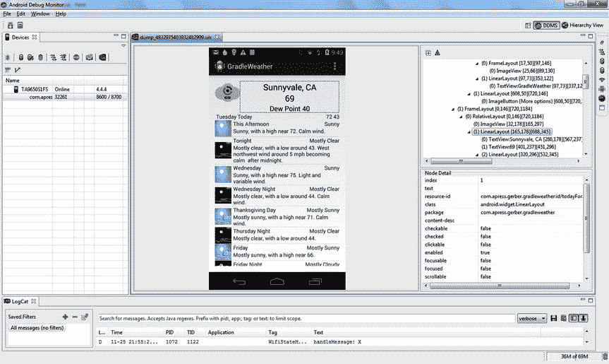
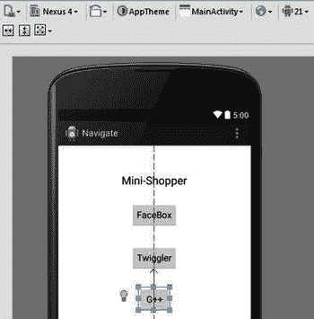
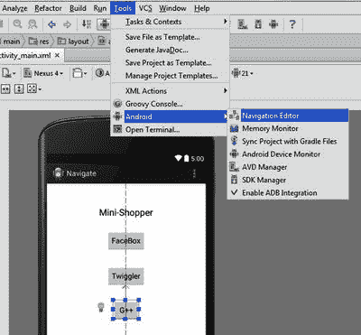
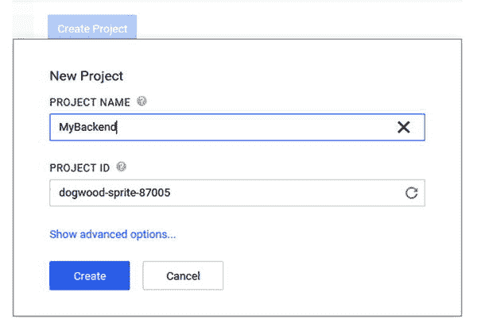

# 14.更多 SDK 工具

Android Studio 是 IntelliJ IDEA 的一个特殊构建，它包含了面向 Android 开发的工具。本章探讨了您可以使用的各种工具。其中许多被嵌入到各种工具窗口中，其他的只需轻轻一击。

## Android 设备监视器

Android 设备监视器(ADM)是 SDK 中最强大的工具之一。它允许您从多个角度监控您的设备，并检查诸如内存、CPU、网络利用率等内容。要开始使用 ADM，请从 Android Studio 菜单中选择工具➤ Android ➤ Android 设备监视器。打开的窗口左侧有一个设备视图。

在这个视图中，您应该看到连接到开发计算机的所有设备，以及在每个设备上运行的进程列表。如果您的应用没有运行，请启动它，然后在进程列表中找到它。该名称应该遵循通常的包命名约定。如果读进程名有困难，您可以在设备视图中调整各个列的大小。点击你的应用将其选中，它将成为 ADM 中各种工具的焦点，在这些示例中，你将分析 Gradle Weather 应用。图 [14-1](#Fig1) 显示了选择 Gradle Weather 应用的 ADM 窗口。

图 14-1。

The Android Device Monitor screen

### 线程监视器

选中您的应用后，您可以通过单击启用 ADM 中的特性来开始探索其执行的各种特征。线程活动是比较容易监控的事情之一。单击 Update Threads 按钮，用活动线程列表以及 id、状态和名称填充右侧视图。当您执行更新时，单击右视图中的任何线程将显示其活动的更多细节。其他详细信息将作为堆栈跟踪显示在“线程”选项卡下的窗格中。例如，单击名为 main 的线程。您可能会看到类似如下的堆栈跟踪:

`at android.os.MessageQueue.nativePollOnce(Native Method)`

`at android.os.MessageQueue.next(MessageQueue.java:138)`

`at android.os.Looper.loop(Looper.java:123)`

`at android.app.ActivityThread.main(ActivityThread.java:5086)`

`at java.lang.reflect.Method.invokeNative(Native Method)`

`at java.lang.reflect.Method.invoke(Method.java:515)`

`at com.android.internal.os.ZygoteInit$MethodAndArgsCaller.run(ZygoteInit.java:785)`

`at com.android.internal.os.ZygoteInit.main(ZygoteInit.java:601)`

`at dalvik.system.NativeStart.main(Native Method)`

主线程通常迭代`android.os.MessageQueue`，寻找用户交互。当在屏幕上做手势、敲键盘或发生其他交互时，系统会将活动记录为消息并填充`MessageQueue`。系统调用`nativePollOnce()`来检索这些消息，然后将它们作为事件发送到你的应用。这个调用是从由主循环调用的`MessageQueue.next()`方法调用的，主循环由`ActivityThread.main()`方法调用。沿着堆栈往下看，您可以看到主线程是由`Zygote.Init()`启动的，它是您启动设备时首先启动的进程之一。您可以单击堆栈跟踪上方的刷新按钮来更新它。

探索应用中其他线程的堆栈跟踪，了解它们在做什么。在图 [14-2](#Fig2) 中，我们探索了 Gradle Weather 项目中众多通用图像加载器线程之一，同时更新了堆栈跟踪。堆栈跟踪揭示了从网络流中读取图像并将其解码为位图所涉及的工作。

图 14-2。

The thread monitor

### 堆监视器

堆监视器允许您在应用运行时检查在堆上分配的对象。单击 ADM 窗口右侧 Threads 选项卡旁边的 Heap 选项卡，将 heap monitor 置于前台。保持您的应用在设备窗格中处于选中状态，单击更新堆按钮以启用堆更新，如图 [14-3](#Fig3) 所示。每次垃圾收集器在设备上运行时，都会发生堆更新；每次执行时，描述堆的新数据都被发送到 ADM 用户界面。在偶然的用例下与你的应用的交互可能最终触发垃圾收集器的执行。您还可以通过单击看起来像垃圾桶的垃圾收集图标，随时强制执行。

图 14-3。

The heap monitor

Heap 选项卡中充满了标识堆上各个对象的类型和数量以及每种类型的最小和最大大小的详细信息。选择单个类型允许您深入查看该特定类型的分配计数。在我们的示例中，我们深入研究了 11，212 个 2 字节数组对象，它们占据了堆中最大的总空间。堆详细信息下面的图表显示，有超过 2，500 个 2 字节数组正好是 32 字节长。这些数组可能是用于图标的分配，因为 32 字节是管理图像数据的最佳大小。

### 分配跟踪器

分配跟踪器也可以用来跟踪你的应用中内存的使用情况。您可以通过“分配跟踪器”选项卡访问分配跟踪器，该选项卡位于“堆”选项卡旁边，有两个按钮:开始跟踪和获取分配。单击开始跟踪按钮开始跟踪分配。单击获取分配按钮，在用户分配视图中加载捕获的数据。跟踪器运行时,“开始”按钮变成“停止”按钮。您可以随时单击停止跟踪来终止跟踪器。

在捕获时，视图将显示顺序、大小、类、线程 ID 以及每个分配的类和方法。该列表最初按大小降序排序，但您可以单击任何列标题来更改排序顺序。重复单击列标题可在升序和降序之间切换排序顺序。单击视图中的任何条目都会加载发生分配的堆栈跟踪。同样，这个例子使用了 Gradle Weather 应用，您可以滚动列表。该应用将加载不同日子的图标，同时跟踪分配。图 [14-4](#Fig4) 说明了结果。

图 14-4。

The allocations tracker results from Gradle Weather

作为从网络下载图标数据的一部分，您可以看到几个 32KB `byte`数组的分配。如果您的应用遇到内存不足的问题，这可能是优化的目标。除非遇到内存不足的情况，否则不应该优化代码，理解这一点很重要。过早地优化代码会导致不必要的复杂性，并且可能与您的性能优化目标背道而驰。

### 网络统计

网络统计选项卡能够监控网络流量。这个工具和其他工具一样容易使用。图 [14-5](#Fig5) 显示了开始网络统计数据捕获之前的选项卡。单击网络统计选项卡上的开始按钮，开始捕获网络流量。“开始”按钮变成了“停止”按钮，单击它可以停止采集。

图 14-5。

Tracking network statistics

该视图将显示一个图表，绘制应用运行时的传入和传出流量。图表顶部的 RX 部分代表响应数据，而 TX 部分代表传输数据。在我们的示例中，我们捕获了 1MB 的响应数据，这些数据是在 Gradle Weather 应用中滚动列表视图以下载图像数据时发生的。设备已经发送了总计 52KB 的请求数据。

### 层次结构查看器

通常，您可能很难正确渲染布局。您的活动中可能有逻辑，根据用户交互有条件地定位视图或设置可见性。当事情变得复杂时，转储 ADM 中的视图层次结构会有所帮助。单击屏幕截图中的元素会在屏幕截图右侧的窗格中显示细分。细分以树形结构给出，节点代表`ViewGroup`对象。图 [14-6](#Fig6) 显示了 Gradle Weather 应用的层级转储。您可以浏览这些节点，查看它们各自的布局属性。您还可以钻取到任何节点以浏览其子对象。

图 14-6。

Exploring the Gradle Weather UI by using a hierarchy ump

单击右窗格中的单个节点将在屏幕截图中找到相应的视图对象，同时在其周围绘制一个红色矩形高亮显示。任何选定节点的属性都显示在树视图窗格下的窗格中。这些属性表明视图是否可见、聚焦、可点击、被选择等等。您还可以检查视图边界、资源 ID 和内容描述。如果您遇到一个应该可见但没有的视图，您可以选择包含的`ViewGroup`布局并钻取以找到该视图。

对视图的一个常见误解是`View.INVISIBLE`和`View.GONE`常量属性值之间的差异。标记为`View.GONE`的视图不会出现在层次结构中。标记为`View.INVISIBLE`的视图将出现在层次结构中，但不会被绘制到屏幕上。另一个常见的问题是理解如何在`ViewGroup`布局或容器上使用`wrap_content`属性为视图保留空间，即使它们是不可见的。如果视图被标记为`View.GONE`，容器将不会保留空间，并将缩小尺寸以容纳任何剩余的内容。

Note

Android 设备监视器基于 Eclipse 工具，让您能够通过切换视角来调整用户界面。如果您不熟悉 Eclipse，请理解透视图代表了一个特定的工作流，并且选项卡和视图以一种最适合该工作流的方式定位。Eclipse 工具通常有几个预配置的透视图，同时允许您创建自己的透视图。因为 ADM 中的许多工具都被嵌入到 Android Studio IDE 中，所以本节只讨论 ADM 专用工具的一个子集。

点击窗口➤打开透视图，查看监视器可用的工作流程，如图 [14-7](#Fig7) 所示。

图 14-7。

Switching the perspective in ADM

单击层次视图选项打开层次视图透视图。层次查看器与层次转储工具的不同之处在于，它仅适用于模拟器或根设备。要使用等级查看器，请启动模拟器并在模拟器中启动您的应用。单击刷新按钮，然后在 Windows 选项卡的设备列表中找到您的模拟器。您的屏幕应该类似于图 [14-8](#Fig8) 。在设备列表中找到代表您的应用的进程，然后单击加载按钮，从您的应用加载当前屏幕的视图层次。层次视图提供了当前在屏幕上呈现的布局的大而深的树形视图。

图 14-8。

Exploring the Gradle Weather UI using the Hierarchy viewer

ADM 窗口左侧的“视图属性”选项卡包含一个全面的属性列表，而中间的窗格则显示层次结构的放大视图。您可以在窗口的右下角找到布局视图选项卡，它显示了当前屏幕的类似线框的摘要。单击这些选项卡中的元素会选择其他选项卡中的等效元素，因为它们都保持同步。

## Android 显示器集成

Android Studio 在 IDE 底部的 Android DDMS 视图中捆绑了来自 ADM 的一些更常用的工具。这些工具允许您生成系统信息转储、执行垃圾收集、终止应用、分析堆以及执行方法跟踪。随着你的应用越来越复杂，这些工具将会成为你宝库中的无价之宝。在 Android DDMS 视图中，在进程列表中选择您的应用。可以在 Android 视图中的设备➤日志目录选项卡下找到进程列表。如果它还不在最前面，请单击此选项卡使其成为焦点。选择运行应用的流程后，将会启用附加工具按钮。

### 内存监视器

内存监视器显示当前调试的应用消耗的内存的图形图表。它可用于轻松识别一般内存趋势。单击屏幕右下角的内存监视器按钮，该按钮位于事件日志和 Gradle 控制台按钮旁边。这将打开监视器工具窗口。试验您的应用，并在监视器运行时观察图表。在图 [14-9](#Fig9) 中，我们运行 Gradle Weather 应用，同时滚动预测列表以查看内存影响。您还可以使用 Initiate GC 按钮在任何时间点触发垃圾收集，并查看回收了多少内存。如果图形中使用的内存在启动垃圾收集器后没有恢复到合理的水平，您的应用可能会泄漏内存。

图 14-9。

Memory consumption of Gradle Weather while scrolling the list

### 方法跟踪工具

方法跟踪工具可以帮助您找到需要大量 CPU 周期来执行的方法。CPU 周期是一种宝贵的资源，方法应该这样对待它们。当一个或多个方法在 CPU 上运行得太舒服时，应用就会变慢。如果您的应用速度变慢，或者您只想更好地了解典型用例中 CPU 的使用情况，您可以使用方法跟踪工具来记录在任何给定场景下使用应用时的活动。

方法跟踪工具使用起来很简单。准备好你的应用，或者让它进入你想要检查的状态。从流程列表中选择您的应用后，单击启动方法跟踪图标开始跟踪。使用您的应用练习您感兴趣的任何方法，然后再次单击按钮以完成方法跟踪。在图 [14-10](#Fig10) 中，我们在滚动列表时从 Gradle Weather 捕捉到了活动。

图 14-10。

The Method Trace tool

在本例中，我们运行了 Gradle Weather 应用，并在录制时滚动了天气条目列表。当您最初完成方法跟踪时，视图将默认为主线程。每个方法调用都以可视化方式表示，为调用绘制条形。这些条根据它们的独占时间来着色，独占时间是仅在该方法中花费的时间，不包括在它调用的方法中花费的时间。“线程”下拉列表可用于切换其他线程的视图，以便您可以看到它们遇到的活动。该图探索了发生在后台线程(不是主线程)中的图像加载和解码。虽然在主线程上做大量的工作是 UI 迟缓的常见原因，但是您永远不能排除在其他线程上做的工作。只要注意到有多少额外的线程正在运行以及它们正在执行什么工作，许多问题就会浮出水面。

使用鼠标上的滚轮可以放大和缩小跟踪视图。围绕鼠标光标在屏幕上的位置进行缩放。需要一段时间来习惯探索跟踪视图，因为您可能已经习惯了典型的左/右滚动行为，这在查看器中是不存在的。要找到一个位图加载方法调用的细节，您可以在查看器中找到它，然后用鼠标指向它。然后向下滚动，放大你需要的视觉细节。缩放时，查看器会包含更多细节，堆栈中较低的方法调用会被显示和标记。稍后，要查看之前发生的方法调用，您可以向上滚动鼠标滚轮以缩小并查看更多的跟踪。然后，您将指向先前的方法调用，并重复该过程。

可视化查看器下面的表格显示了所有方法调用的细目分类。该细分包括名称、调用计数以及包含和排除时间。所有这些计时都与记录跟踪所花费的时间相关。如果你花 4 秒钟记录一个轨迹，50%的读数相当于 2 秒钟。您可以将鼠标悬停在查看器中的任何方法调用上，等待 2 秒钟，工具提示就会出现，并以毫秒为单位给出准确的时间。

### 分配跟踪器

分配跟踪器现在内置在 Android Studio 中。它的工作原理与 ADM 类似。单击 Android DDMS 工具窗口下左侧工具栏中的内存跟踪器，开始跟踪分配。在应用运行时与其互动，然后再次点按该按钮以停止跟踪分配。编辑器中将打开一个新的选项卡，显示跟踪的结果。如图 [14-11](#Fig11) 所示。

图 14-11。

The built-in allocation tracker

### 屏幕捕获

Android DDMS 窗口包含几个选项，允许你在使用应用时捕捉屏幕。屏幕捕获按钮立即捕获设备的当前屏幕，并在预览对话框中加载图像，您可以选择将其保存到磁盘。图 [14-12](#Fig12) 显示了该对话框。“屏幕截图”对话框还允许您通过使用手机或平板电脑设计的框架来给图像加框。有放大和缩小屏幕的缩放控件。您可以启用投影、屏幕眩光，甚至在保存之前旋转图像。单击“重新加载”按钮，用当前屏幕渲染的图像刷新对话框。

图 14-12。

Using the Screen Capture tool

屏幕录制按钮允许您在与应用交互时录制屏幕视频。点击该按钮，会出现如图 [14-13](#Fig13) 所示的对话框，提示您选择录制比特率和分辨率。单击开始录制按钮开始录制并使用您的应用。完成后，单击“停止录制”以生成包含录制的交互的视频文件。另一个对话框将提示您保存记录。使用任何文件名，并将其保存到系统中容易找到的位置。Windows 用户可能需要安装替代编解码器或软件，因为文件以 MP4 格式保存。图 [14-14](#Fig14) 展示了使用 Windows 上流行的 VLC 播放器回放与 Gradle Weather 应用的交互。

图 14-14。

Playback of a screen recording

图 14-13。

Starting the Screen Recorder tool

## 导航编辑器

导航编辑器是 Android Studio 中的一个全新功能。虽然在撰写本文时它已经可以使用了，但它仍在大量开发中。该编辑器允许您在进出特定活动和片段的编辑模式时，快速构建应用的高级流程原型。如果你对一个应用有一个粗略的想法，并想想象用户如何在屏幕之间移动，导航编辑器是理想的工具。它还可以发现现有应用中屏幕之间的现有流程和连接。随着时间的推移，看到这个工具成熟将是令人兴奋的。

让自己熟悉它的最好方法就是一个全新的项目。想象一下，你想设计一个新的购物应用，允许用户通过他们喜欢的社交网络凭证快速注册，并随意浏览商品列表。找到一件商品后，用户可以在决定购买前点击它以获得更多细节。要设计这样的流程，您可以使用手绘草图、白板或其他工具，这些工具提供了与您的 IDE 的有限集成。将您的粗略想法转化为功能性应用的过程可能是一个艰巨的过程，外部工具会在您工作时管理多个设计师程序时增加额外的麻烦。在使用 IDE 时，人们经常使用线框或图表工具，如 OmniGraffle、Lucidchart 等。在这些程序之间转换以实现一个工作应用的过程并不总是简单明了的。导航编辑器为您提供了一种方法，可以在您的 IDE 中轻松地构建原型和绘制流程。在本节中，您将使用该工具探索我们的购物应用。

### 设计用户界面

使用新建项目向导和空白活动模板，创建一个名为 Navigate 的项目。项目加载后，您应该在设计模式下开始编辑`activity_main` xml 布局。移除 Hello World 标签，拖出一个下面有三个按钮的大文本标签。将标签的文本更改为 Mini-Shopper，并更改按钮上的文本以反映三个虚构的社交网络服务。图 [14-15](#Fig15) 中的例子使用了 FaceBox、Twiggler 和 G++，但是你可以随心所欲地发挥创造力。

 

图 14-15。

Designing the FaceBox UI

### 导航编辑器的第一步

接下来，从主菜单中单击工具 Android ➤导航编辑器。您的屏幕将类似于图 [14-16](#Fig16) 。

图 14-16。

Opening the Navigation Editor

Android Studio 将创建一个`main.nvg.xml`文件，并将其呈现在导航编辑器中。它会直观地显示你的活动及其相关的 Android 上下文菜单。(空白活动模板会自动创建此上下文菜单。)该编辑器允许您快速创建新的活动，并将这些活动与现有活动上的控件相关联，以创建转换。它还允许你连接到 Android 系统上下文菜单中的项目。您可以在编辑器中单击并拖动项目，如上下文菜单。

右键单击编辑器中的任意位置，打开带有单个新活动选项的编辑器上下文菜单，如图 [14-17](#Fig17) 所示。单击此选项打开新建活动向导。选择空白活动模板，并将新活动命名为 FaceBoxLoginActivity。您将返回到导航视图，该视图现在显示这两个活动。

图 14-17。

Create a new activity with the Navigation Editor

### 连接活动

重新定位新活动，使其与原始活动相邻。你需要在它们之间建立联系。在编辑器中工作时，可以随意重新定位上下文菜单。按住 Shift 键，同时单击 FaceBox 按钮并拖动到新的`FaceBoxLoginActivity`。编辑器将在它们之间绘制一条连接线，一个粉红色的点代表位于线中间的过渡。单击此点查看过渡的定义。过渡通过按压手势将源`MainActivity`连接到目的`FaceBoxLoginActivity`，如图 [14-18](#Fig18) 所示。

图 14-18。

Connecting activities with the Navigation Editor

现在打开`MainActivity.java`源文件。您应该看到一个点击监听器连接到启动`FaceBoxLoginActivity`的按钮:

`@Override`

`protected void onCreate(Bundle savedInstanceState) {`

`super.onCreate(savedInstanceState);`

`setContentView(R.layout.activity_main);`

`findViewById(R.id.button).setOnClickListener(new View.OnClickListener() {`

`@Override`

`public void onClick(View v) {`

`MainActivity.this.startActivity(new Intent(MainActivity.this,`

`FaceBoxLoginActivity.class));`

`}`

`});`

`}`

这段代码是通过在编辑器中简单的点击和拖动操作生成的。返回导航编辑器，双击`FaceBoxLoginActivity`。您将被设置到这个活动的图形编辑视图，在这里您可以拖放以用更多的控件和选项来装饰它。创建一个极简的登录界面，有两个`TextView`标签，两个用于用户名和密码的`EditText`输入框，最后是一个登录按钮。图 [14-19](#Fig19) 显示了假装 FaceBox 登录屏幕。

图 14-19。

Designing the FaceBox login screen

### 编辑菜单

返回导航编辑器，这将反映出`FaceBoxLogin`布局的变化。您可以运行应用来测试过渡和新的`FaceBoxLogin`布局更改。在导航编辑器中，双击与登录活动关联的上下文菜单。`menu_facebox_login.xml`文件将被打开，并在右侧显示一个即时预览窗口。更改菜单中的单个项目，将其 ID 设为`@+id/action_back`，标题设为`@string/action_back`。按 Alt+Enter 弹出意图对话框，提示创建新的字符串值资源的动作，如图 [14-20](#Fig20) 所示。按回车键执行此操作。

图 14-20。

Editing the FaceBox menu

在资源对话框中键入 back 作为新字符串的值，然后按 Enter 键继续。返回导航编辑器。现在，您将从新菜单项建立到`MainActivity`的连接。像以前一样，按住 Shift 键，从后退菜单项单击并拖动到`MainActivity`。当您建立新的连接时，编辑器将在`MainActivity`中生成代码。打开`MainActivity.java`文件，查看下面生成的代码:

`@Override`

`public boolean onPrepareOptionsMenu(Menu menu) {`

`boolean result = super.onPrepareOptionsMenu(menu);`

`menu.findItem(R.id.action_back).setOnMenuItemClickListener(new`

`MenuItem.OnMenuItemClickListener() {`

`@Override`

`public boolean onMenuItemClick(MenuItem menuItem) {`

`FaceBoxLoginActivity.this.startActivity(new Intent(FaceBoxLoginActivity.this,`

`MainActivity.class));`

`return true;`

`}`

`});`

`return result;`

`}`

在建立这些连接时，构建并运行应用，以测试过渡是如何进行的。此时，您应该能够从主活动转换到`FaceBoxLogin`活动，然后通过使用新的上下文菜单项返回到主活动。

现在您已经对导航编辑器的基本用法有了一些了解，试着为应用再创建两个活动，一个用于显示项目列表，一个用于查看项目细节。

## 末端的

也许您的工具箱中需要的最实用的插件是终端。单击 IDE 底部的“终端”选项卡，打开一个终端窗口，您可以在其中输入操作系统命令。您可以单击绿色加号按钮在单独的选项卡中开始新的会话。当您找不到或记不起等效的 IDE 时，命令窗口可以帮助您完成任务。也许你需要了解的终端中最重要的工具是 ADB，Android 调试桥。此工具使您可以直接控制连接的设备或仿真器。该命令采用`adb {device-options} sub-command {sub-command-options}`的形式。设备选项如下:`-d`指向唯一连接的设备，`-e`指向唯一连接的仿真器，或者`-s deviceID`指向具有给定 ID 的特定设备。

打开您的终端，研究本节其余部分描述的命令。

### 查询设备

`adb devices`

`devices`子命令列出每个连接设备的名称和设备 id。模拟器将列出一个设备 ID，格式为`emulator-<port>`。

### 安装 APK

`adb install /path/to/app.apk`

`install`命令会将一个 Android APK 推送到设备上并安装它。只需提供开发机器上 APK 文件的路径。

### 下载文件

`adb pull /path/to/device/file.ext /path/to/local/destination/`

`pull`命令将任意文件从设备下载到您的开发机器上。

### 上传文件

`adb push /path/to/local/file.ext /path/to/device/destination/`

`push`命令将任意文件从您的开发机器上传到设备。

### 左舷向前

`adb forward local-port remote-port`

`forward`命令将把开发机器上的网络连接重定向到设备。这是一种在高级场景中使用的技术，例如调试 Chrome web 浏览器中运行的代码或连接到设备上运行的网络服务器。

## 谷歌云工具

之前，您探索了一个使用网络服务收集天气预报的 Android 应用。在本节中，您将探索如何使用 Google Cloud tools 开发和部署您自己的后端。首先，您将设计前端，它将与任意 bean 通信以构建问候。稍后，您将构建后端并在本地运行它。最后，您将发布到 Google 的云服务，并对项目进行端到端的测试。首先，您需要使用您的 Google 帐户登录 Google，如图 [14-21](#Fig21) 所示。

 

图 14-21。

Sign into Google

### 创建 HelloCloud 前端

使用空白活动模板创建一个新的 Android 项目，并将其命名为 HelloCloud。将空白活动命名为 MainActivity，然后单击 Finish 开始您的项目。对您的`MainActivity`使用清单 [14-1](#FPar1) 中的代码，对您的`activity_main.xml`布局使用清单 [14-2](#FPar2) 中的 XML。

Listing 14-1\. The MainActivity for the HelloCloud Front End

`public class MainActivity extends Activity {`

`private SimpleCloudBean cloudBean;`

`@Override`

`protected void onCreate(Bundle savedInstanceState) {`

`super.onCreate(savedInstanceState);`

`setCloudBean(new SimpleCloudBean());`

`setContentView(R.layout.activity_main);`

`}`

`public void onGoClick(View sender) {`

`final TextView txtResponse = (TextView) findViewById(R.id.txtResponse);`

`txtResponse.setText(getCloudBean().getResponse());`

`txtResponse.setVisibility(View.VISIBLE);`

`}`

`public SimpleCloudBean getCloudBean() {`

`return cloudBean;`

`}`

`public void setCloudBean(SimpleCloudBean cloudBean) {`

`this.cloudBean = cloudBean;`

`}`

`public class SimpleCloudBean {`

`public CharSequence getResponse() {`

`return "This response is from " + getClass().getSimpleName();`

`}`

`}`

`}`

Listing 14-2\. The activity_main.xml for the HelloCloud Front End

`<RelativeLayout xmlns:android="``http://schemas.android.com/apk/res/android`T2】

`xmlns:tools="``http://schemas.android.com/tools`T2】

`android:layout_width="match_parent"`

`android:layout_height="match_parent"`

`android:paddingLeft="@dimen/activity_horizontal_margin"`

`android:paddingRight="@dimen/activity_horizontal_margin"`

`android:paddingTop="@dimen/activity_vertical_margin"`

`android:paddingBottom="@dimen/activity_vertical_margin"`

`tools:context=".MainActivity">`

`<TextView`

`android:text="@string/greeting_text"`

`android:layout_width="wrap_content"`

`android:layout_height="wrap_content"`

`android:id="@+id/txtGreeting" />`

`<Button`

`android:layout_width="wrap_content"`

`android:layout_height="wrap_content"`

`android:text="go!"`

`android:id="@+id/button"`

`android:layout_below="@+id/txtGreeting"`

`android:layout_alignParentRight="true"`

`android:layout_alignParentEnd="true"`

`android:layout_marginRight="42dp"`

`android:layout_marginTop="72dp"`

`android:onClick="onGoClick" />`

`<TextView`

`android:layout_width="wrap_content"`

`android:layout_height="wrap_content"`

`android:textAppearance="?android:attr/textAppearanceLarge"`

`android:text="Response Shows Here"`

`android:id="@+id/txtResponse"`

`android:layout_below="@+id/txtGreeting"`

`android:layout_alignParentLeft="true"`

`android:layout_alignParentStart="true"`

`android:layout_marginTop="34dp"`

`android:visibility="invisible" />`

`</RelativeLayout>`

这段代码调用一个简单的本地 bean，该 bean 返回对活动的响应。响应在一个隐藏的`TextView`组件中更新，然后被设置为`View.Visible`。

### 创建 Java 端点后端模块

现在，您可以向项目中添加一个新的后端模块。这个后端模块将包含在 web 服务器上运行的代码。点击文件➤新建模块，选择谷歌云模块，如图 [14-22](#Fig22) 所示。

图 14-22。

Create an App Engine module

命名你的模块后端，保留其他选项的默认设置，如图 [14-23](#Fig23) 所示。点击 Finish，Android Studio 将生成一个基本的 Java servlet 项目，并带有一个随时可用的 Google Cloud 端点。Gradle 将开始用新模块同步您的项目。

图 14-23。

Select App Engine Java Endpoints Module

同步完成后，右键单击项目窗口中的后端模块，然后选择“使模块成为后端”选项。接下来，在运行配置列表中找到后端选项，并单击 run 按钮启动它。Android Studio 将把 servlet 代码包装在本地运行的 Jetty web servlet 引擎的一个实例中，供您探索。控制台会提示如何使用 web 浏览器与终端进行交互。启动您的浏览器并将其指向`http://localhost:8080/`以查看运行中的端点。您将看到如图 [14-24](#Fig24) 所示的页面。

图 14-24。

Running your Google Cloud Endpoint

### 连接零件

在验证端点正在运行之后，您可以让 Android Studio 生成并安装可以在您的 Android 应用中使用的客户端库。在右侧的 Gradle 构建工具窗口中找到后端模块的构建，并运行`appengineEndpointsInstallClientLibs`任务。如图 [14-25](#Fig25) 所示。

图 14-25。

Install the client libs for your endpoint

Android Studio 早期版本的菜单中有一个选项，最近从版本 1.0.1 中删除了。在 0.8.x 版本中，您可以单击工具➤谷歌云工具➤安装客户端库。图 [14-26](#Fig26) 显示了之前的菜单。

图 14-26。

Earlier versions of Android Studio had the task baked into the menu

Android Studio 触发了一个特殊的 Gradle build，它将生成一个可安装的客户端库，作为 Android 客户端和后端 web 服务器之间的代理。Gradle 构建完成后，您可以在后端模块的构建文件夹中的`client-libs`文件夹下找到作为 ZIP 文件的客户端库。ZIP 文件包含一个`readme.html`文件，其中包含所有关于如何使用它的说明。寻找编译时依赖项，这些依赖项需要复制到使用端点的模块中。您可以忽略解释如何安装客户端库的额外说明，因为 IDE 会在生成过程中执行此步骤。

在应用模块的`build.gradle`文件中添加编译时依赖项后，您的`dependencies`块应该如下所示:

`dependencies {`

`compile fileTree(dir: 'libs', include: ['*.jar'])`

`compile ([group: 'com.apress.gerber.cloud.backend', name: 'myApi',`

`version: 'v1-1.19.0-SNAPSHOT'])`

`compile([group: 'com.google.api-client', name: 'google-api-client-android',`

`version: '1.19.0'])`

`//    compile project(path: ':backend', <- remove this line`

`//      configuration: 'android-endpoints') <- remove this line`

`}`

当我们向项目中添加新模块时，我们示例中被注释掉的依赖项是自动添加的。应该删除它，因为您不希望应用直接链接到 servlet 代码；相反，它使用客户端库来代理请求。您还必须确保已经将本地 Maven 存储库添加到项目中。打开顶层`build.gradle`文件并将其添加到`allprojects`部分:

`allprojects {`

`repositories {`

`jcenter()`

`mavenLocal()`

`}`

`}`

在添加了依赖项和`mavenLocal`存储库之后，您应该将您的项目与 Gradle build 同步，以使 API 可用。在您的应用模块中添加一个新类来使用它。调用这个类 RemoteCloudBeanAsyncTask 并使其扩展`AsyncTask`。声明一个`MyApi`类型的静态变量。应该提示您导入该类，它现在应该在类路径中可用。如果您没有导入它的选项，请仔细检查您的依赖项并重新构建模块，以确保您已经正确地包含了生成的客户端库。清单 [14-3](#FPar3) 定义了这个新类。

Listing 14-3\. The RemoteCloudBeanAsyncTask Class Definition

`class RemoteCloudBeanAsyncTask extends AsyncTask<String, Void, String> {`

`public static final String RESULT = "result";`

`private static MyApi apiService = null;`

`private final Handler handler;`

`public RemoteCloudBeanAsyncTask(Handler handler) {`

`this.handler = handler;`

`}`

`@Override`

`protected String doInBackground(String... params) {`

`String name = params[0];`

`try {`

`return getMyApi().sayHi(name).execute().getData();`

`} catch (IOException e) {`

`return e.getMessage();`

`}`

`}`

`private MyApi getMyApi() {`

`//Lazily initialize the API service`

`if(apiService == null) {`

`MyApi.Builder builder = new MyApi.Builder(AndroidHttp.newCompatibleTransport(),`

`new AndroidJsonFactory(), null)`

`// The special 10.0.2.2 IP points to the local machine's IP address`

`// in the emulator`

`.setRootUrl("``http://10.0.2.2:8080/_ah/api/`T2】

`.setGoogleClientRequestInitializer(new`

`GoogleClientRequestInitializer() {`

`@Override`

`public void initialize(AbstractGoogleClientRequest<?>`

`abstractGoogleClientRequest) throws IOException {`

`abstractGoogleClientRequest.setDisableGZipContent(true);`

`}`

`});`

`apiService = builder.build();`

`}`

`return apiService;`

`}`

`@Override`

`protected void onPostExecute(String result) {`

`final Message message = new Message();`

`final Bundle data = new Bundle();`

`data.putString(RESULT, result);`

`message.setData(data);`

`handler.sendMessage(message);`

`}`

`}`

记住使用`AsyncTask`很重要，因为初始化服务和进行网络调用需要一些时间。这个对象是用 Android 处理程序实例化的，稍后将在逻辑中使用。我们在`doInBackground`方法中检索对 API 的引用。返回引用的方法创建并延迟初始化它。获得 API 引用后，调用 web 端点，并返回调用结果。然后，一条消息被发送到`onPostExecute`方法中的处理程序。

通过修改`onGoClick`方法将此`AsyncTask`插入`MainActivity`;

`public void onGoClick(View sender) {`

`final RemoteCloudBeanAsyncTask remoteCloudBeanAsyncTask =`

`new RemoteCloudBeanAsyncTask(new Handler() {`

`@Override`

`public void handleMessage(Message msg) {`

`super.handleMessage(msg);`

`final String result = msg.getData().getString(RemoteCloudBeanAsyncTask.RESULT);`

`final TextView txtResponse = (TextView) findViewById(R.id.txtResponse);`

`txtResponse.setText(result);`

`txtResponse.setVisibility(View.VISIBLE);`

`}`

`});`

`remoteCloudBeanAsyncTask.execute("Developers");`

`}`

这里我们创建了`RemoteCloudBeanAsyncTask`并给它一个处理程序，将消息传递给隐藏的文本视图并使其可见。当后端服务器仍然在您的开发机器上运行时，在模拟器上构建并运行这个示例。点击 Go 按钮，您应该会看到来自 Google Cloud 端点的返回消息，如图 [14-27](#Fig27) 所示。如果您收到指示超时的消息，请仔细检查您的服务器是否仍在运行，并且可以使用 web 浏览器访问。确保您已经在清单中声明了 Internet 权限。您可能还需要更改或禁用已启用的任何主动防火墙设置。

图 14-27。

Running the app on the emulator against the endpoint

### 部署到应用引擎

既然这项服务已经在本地运行并产生了结果，你可以部署到谷歌的云服务器上。部署到云很简单。如果后端正在本地运行，请停止它。使用您的 Google 帐户在 [`https://console.developers.google.com/project`](https://console.developers.google.com/project) 登录开发者控制台。单击创建项目按钮，在 Google 的云服务中创建新的端点。给项目起一个名字，比如 MyBackend，然后将生成的项目 ID 复制并保存到一个可以访问的地方。示例见图 [14-28](#Fig28) 。点击创建，您将看到如图 [14-29](#Fig29) 所示的进度指示器。给它一点时间让谷歌服务完成这个过程。返回 Android Studio，找到`appengine-web.xml`文件，并将保存的项目 id 复制到`application`标签中。这个文件在`src` ➤ `main` ➤ `webapp` ➤ `WEB-INF`下。

图 14-29。

Google Developers Console will spin momentarily while it works

图 14-28。

Creating a new Java Endpoints project with Google Developers Console

从顶部菜单中，选择构建➤将模块部署到应用引擎。单击“部署到”下拉列表，并选择您的项目 ID。首次部署时，您需要登录 Google 进行选择。图 [14-30](#Fig30) 显示了点击部署到下拉菜单后的登录屏幕。

图 14-30。

Sign into Google Developers Console

登录提示打开浏览器窗口，如图 [14-31](#Fig31) 所示。单击“接受”以授予必要的权限。

图 14-31。

Google Developers Console permission prompt

后端发布后，切换到之前创建的`AsyncTask`并更新加载 API 的方法:

`private MyApi getMyApiRemote() {`

`//Lazily initialize the API service`

`if(apiService == null) {`

`MyApi.Builder builder = new MyApi.Builder(`

`AndroidHttp.newCompatibleTransport(), new AndroidJsonFactory(), null)`

`.setRootUrl("https://{your-project-id}.appspot.com/_ah/api/");`

`apiService = builder.build();`

`}`

`return apiService;`

`}`

用您在线创建的项目的项目 ID 替换`{your-project-id}`。在您的设备或模拟器上构建并运行该应用，您应该会得到相同的结果。

## 摘要

本章探讨了用于分析和设计应用的各种工具。它着眼于从不同方面探索应用性能的许多可用选项。您学会了使用新的导航编辑器快速构建想法的原型，这些想法可以在以后构建到成熟的应用中。最后，您深入研究了 Google 的云服务，了解了如何使用 Google 提供的强大计算引擎来构建、测试和部署客户机服务器应用。这些工具都为您提供了强大的控制和洞察力，可用于构建健壮的应用。