# 一、Kotlin 入门

*我们将介绍的内容:*

*   Kotlin 语简介

*   如何得到 Kotlin

*   在 macOS、Windows 和 Linux 上安装 Kotlin

*   在命令行中运行 Kotlin 程序

*   在 IntelliJ IDEA 中创建和运行项目

本章介绍了 Kotlin 语言，并详细介绍了如何建立一个开发环境。你可以找到如何在 macOS、Windows 和 Linux 上安装 Kotlin 的说明。您还可以找到关于如何使用简单的命令行安装 Kotlin 环境的说明。每个开发人员都被某种设置所吸引，您的开发人员也不例外。这是我在整本书中使用的设置:

*   IntelliJ 2018 运行在 macOS 上(高 Sierra)。我在第 1 到 7 章中一直使用这个

*   macOS 上的 Android Studio 3(高 Siera)。我在这本书的其余部分使用了这个

你不需要完全按照我的设置来。我们已经尽力确保本书中的说明在 Linux 和 Windows 中的效果和在 macOS 中一样好。还有，我说的 Linux，并不是指 Linux 的所有发行版。事实是，我只在 Lubuntu 17 中测试了这些代码。为什么呢？因为那是我最熟悉的 Linux 发行版。我相信本书的大多数读者(使用 Linux 的)也会熟悉这个 Linux 发行版(或者它的任何近亲)。

Android Studio 3 和 IntelliJ 可以在 Windows 7、8 和 10 (32 位和 64 位)上运行，但我只测试了 Windows 10 64 位上的练习——这是我唯一可以使用的机器；我相信大多数使用 Windows 的读者也使用这种设置。

最后，让我们讨论一下 JDK 版本。在撰写本文时，JDK 10 号正处于早期访问阶段。因此，JDK 版本的选择是 8 或 9(因为 JDK 7 在 2015 年的某个时候结束了它的生命)。我选择了 9 分——没有特别的原因，我认为 8 分也可以。

## 关于 Kotlin

Kotlin 是一种针对 Java 平台的新语言；它的程序运行在 JVM (Java 虚拟机)上，这使它与 Groovy、Scala、Jython 和 Clojure 等语言齐名。

Kotlin 来自 JetBrains，它是 IntelliJ、PyCharm、WebStorm、ReSharper 和其他优秀开发工具的创造者。2011 年，JetBrains 推出了 Kotlin 第二年，他们在 Apache 2 许可下开源了 Kotlin。在 Google I/O 2017 上，Google 宣布了在 Android 平台上对 Kotlin 的一流支持。如果你想知道 Kotlin 这个名字是从哪里来的，那是圣彼得堡附近的一个岛屿的名字，Kotlin 团队的大多数成员都在那里。据 JetBrains 的安德烈·布雷斯拉夫(Andrey Breslav)介绍，Kotlin 是以一个岛屿命名的，就像爪哇是以印度尼西亚的爪哇岛命名的一样。然而，您可能记得 Java 语言的历史中提到它是以咖啡而不是岛命名的。

Kotlin 作为一种语言有许多特征和能力，我们有这本书的整个第一部分来探索这些，但这里有一些事情使它变得有趣。

*   **和 Java 一样，是面向对象的**。所以，你在 Java 的 OOP 和设计模式上投入的所有时间都不会浪费。Kotlin 类、接口和泛型的外观和行为与 Java 非常相似。这绝对是一个优势，因为与其他 JVM 语言(例如 Scala)不同，Kotlin 看起来并不太陌生。它不会疏远 Java 程序员；相反，这让他们可以发挥自己的优势。

*   **静态强类型**。Kotlin 与 Java 共享的另一个领域是类型系统。它还使用静态和强类型。然而，与 Java 不同，在使用变量之前，不必总是声明变量的类型。Kotlin 使用*式推理*。

*   **不如 Java** 隆重。我们不必(总是)写一个类；顶级函数也可以。我们不需要为数据对象显式地编写 getters 和 settersKotlin 中有一些语言特性，这使得我们可以抛弃这种锅炉板代码。此外，用 Kotlin 编写代码的自然方式阻止我们将 *null* 赋给变量。如果你想显式地允许一个值为 *null* ，你必须以一种深思熟虑的方式去做。

*   **这是一种** **函数式语言**。函数不仅仅是命名的语句集合；你可以在任何可能用到变量的地方使用它们。您可以将参数输入中的函数传递给其他函数，甚至可以从其他函数返回函数。这种编码方式允许不同的抽象方式。

*   **与 Java 的互操作性**。Kotlin 可以使用 Java 库，您也可以从 Java 程序中使用它。这降低了 Kotlin 的准入门槛；与 Java 的互操作性使得决定使用 Kotlin 启动一个新项目变得不那么困难。

在你的下一个项目中使用 Kotlin 有很多理由，但也有反对的理由。我们不会列出在你的下一个项目中为什么应该或者不应该使用 Kotlin 的利弊；但是我将讨论一个为什么我会建议你在狂热之前慢下来并停下来的原因。

还是比较新的。一些人确信，它正在接近“膨胀的期望的顶峰”，并将很快进入“幻灭的低谷”。他们的主要论点是，如果你现在押注于 Kotlin，你将背负着学习曲线问题，你将有义务维护代码库——即使 Kotlin 消失在一股烟雾中。换句话说，你可能会把它当作技术债务。

收养 Kotlin 也要付出一些代价。你必须训练你的团队如何使用它。不管你的团队有多有经验，他们肯定会在过程中降低速度——这是一个项目管理问题。此外，因为 Kotlin 是新的，所以还没有“有效的 Kotlin”的指导文章，而 Java 程序员总是有他们的“有效的 Java”

这将归结为你的赌注。如果你打赌 Kotlin 会坚持到底，而不是在黑暗中悄悄消失，那么这个赌注就有回报了。如果你赌错了，那么你就走上了维护一门废弃语言的代码库的艰难道路——技术债务。要么这样，要么你把它重写回 Java。

谷歌已经在 Android Studio 中正式支持该语言，越来越多的开发者也加入了这一行列。收养率正在上升。这些都是好迹象，表明 Kotlin 不会悄无声息地倒下，实际上可能会坚持到底。另外，这是一种很酷的语言。

### 注意

“膨胀的期望的顶峰”和“幻灭的低谷”是“炒作周期”的一部分。**炒作周期**是由美国研究、咨询和[信息技术](https://en.wikipedia.org/wiki/Information_technology)公司 [Gartner](https://en.wikipedia.org/wiki/Gartner) 开发和使用的品牌图形表示，用于表示特定[技术](https://en.wikipedia.org/wiki/Technology)的成熟、采用和社会应用。可以在 [`https://gtnr.it/cycleofhype`](https://gtnr.it/cycleofhype) 了解更多。

让我们继续为自己构建一个开发环境。

## 安装 Java SDK

在使用 Kotlin 之前，我们需要安装 JDK。如果您已经安装了 Java 开发工具包，那么您可以跳过这一节，跳到下一节(安装 Kotlin)。JDK 安装程序可用于 Windows、Linux 和 macOS。你可以从甲骨文网站 [`http://bit.ly/java9download`](http://bit.ly/java9download) 下载目前稳定的版本。 <sup>1</sup>

图 1-1 显示了甲骨文 JDK 的下载页面。选择适合您平台的安装程序，然后单击“接受许可协议”继续。

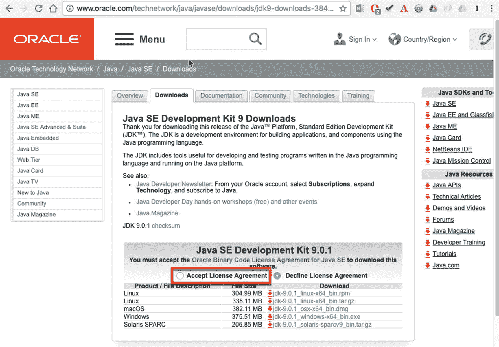

图 1-1

Oracle JDK 下载页面

### 在 macOS 上安装

要在 macOS 上安装 JDK，双击下载的 **dmg** 文件，按照提示进行操作。安装程序负责更新系统路径，因此安装后您不需要执行任何进一步的操作。

当你完成安装后，你可以通过启动“Terminal.app”并尝试`Java`命令来测试 JDK 是否已经安装好(*见*列表 1-1 )。

```kt
$ java –version
$ javac –version

Listing 1-1Test the JDK tools on a macOS Terminal

```

如果终端输出如图 1-2 所示的`java`和`javac`版本，你就知道你已经安装了 JDK，没有问题。

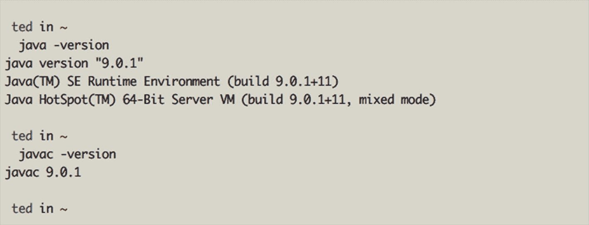

图 1-2

终端上的 java 和 javac . app

### 在 Windows 10 上安装

可以在 Windows 7/8/10 (32 位和 64 位)安装 Android Studio 3；但出于本书的目的，我只用了 Windows 10 64 位。

要在 Windows 上安装 JDK，请双击下载的压缩文件，然后按照提示进行操作。与 macOS 不同，您必须在设置后执行额外的配置。你需要(1)在你的系统路径中包含 Java/bin ,( 2)在 Windows 的*环境变量*中包含一个*类路径*定义。表格 1-1 将带您了解如何做到这一点的步骤。

表 1-1

Windows 中的 JDK 配置

<colgroup><col class="tcol1 align-left"> <col class="tcol2 align-left"> <col class="tcol3 align-left"></colgroup> 
| one | 将 JAVA_HOME/bin 包含到系统路径中 | 1.点击**开始** ➤ **控制面板** ➤ **系统**2.点击**高级** ➤ **环境变量。**有两个变量框，上面的框写着“用户变量”，下面的框写着“系统变量”，系统`PATH`将在“系统变量”框中。3.将 bin 文件夹的位置添加到系统变量`PATH`中。4.典型的路径变量如下所示:`C:\WINDOWS\system32;C:\WINDOWS;C:\Program Files\Java\jdk-9\bin;` |
| Two | 在 Windows *环境变量*中创建一个*类路径*定义 | 当**环境变量**窗口仍然打开时，点击“用户变量”部分的“新建”按钮。将弹出另一个对话框，其中有两个文本框，允许您添加一个新变量。使用下面的值填充文本框。1 .名称 2.价值➤ `C:\WINDOWS\system32;C:\WINDOWS;C:\Program Files\Java\jdk-9\jre\lib\rt.jar;` |

关闭环境变量窗口，得到一个 *cmd* 窗口，这样我们可以测试我们的更改是否已经生效。当 cmd 窗口打开时，键入如清单 [1-2 所示的命令。

```kt
C:\Users\yourname>java –version
C:\Users\yourname>javac –version

Listing 1-2Test the JDK tools on a Windows cmd shell

```

如果 cmd shell 向您显示了 java 和 javac 的版本，那么您已经成功地安装和配置了 JDK。另一方面，如果您看到一条错误消息(例如，“错误的命令或文件名”)，这意味着 JAVA_HOME\bin 仍然不是系统路径的一部分。您应该重新访问表 1-1 并重新检查您的条目，然后重新测试。

### 在 Linux 上安装

如果您是 Linux 用户，您可能已经在下载中看到了 tar ball 和 rpm 选项，您可以像在您的 Linux 平台上安装任何其他软件一样使用和安装它，或者您可以从存储库中安装 JDK(参见清单 1-3 )。本指令适用于 Debian 及其衍生工具(如 Ubuntu、Mint 等。).

```kt
sudo add-apt-repository ppa:webupd8team/java
sudo apt-get update
sudo apt-get install oracle-java9-installer
sudo update-alternatives --config java

Listing 1-3Installing the JDK in Ubuntu Using a PPA

```

下载完成后，您可以通过从命令行试用`java`和`javac`工具来测试安装(参见清单 1-4 )。打开你喜欢的终端模拟器(如 *xterm、terminator、gnome-terminal、lxterminal* 等)。).

```kt
$ java –version
$ javac –version

Listing 1-4Test the JDK Tools on Linux

```

如果安装成功，您应该能够在您的系统中看到 java 和 javac 的版本。一旦 JDK 建成并开始运行，我们现在可以得到 Kotlin。

## 安装 Kotlin

Kotlin 编码有几种入门方法。你可以使用在线 IDE，这是最快的，因为它不需要你安装任何东西。您也可以尝试下载一个带有 Kotlin 插件的 IDE(例如 IntelliJ、Android Studio 或 Eclipse)。最后，您可以下载 Kotlin 的命令行工具。如果你不想安装一个完整的 IDE，而只是简单地使用你最喜欢的编辑器，你当然可以使用命令行工具。我们不会探究这些选项中的每一个，但是我们将看看命令行工具和 IntelliJ。

### 注意

这本书是关于 Android Studio 的，所以你可能想知道为什么我们不使用 Android Studio 来试用 Kotlin。这是因为这本书的这一部分仅仅是关于 Kotlin 的，而不是关于 Android 编程的。我认为，当我们做一些编码练习时，最好更多地关注语言，不要被 Android 特定的主题所阻碍。Android Studio 无论如何都是基于 IntelliJ 的，所以我们在本书这一部分学习的任何 IDE 技术在我们学习第二部分时都应该可以很好地继续下去。

### 安装命令行工具

即使您选择命令行工具，也有几种安装方法可供选择。我们可以通过(1)下载压缩文件来安装它；(2)如果你的操作系统和工具支持，使用 SDKMAN 或者(3)如果你在 macOS 上，使用自制软件或 MacPorts。你只需要选择这些方法中你最习惯的一种，然后去做。

#### 自制或 macports

如果你在 macOS 上并且已经使用了`brew`或`port`，请参见清单 1-5 或 1-6 中获取 Kotlin 的终端命令。

```kt
$ sudo port install kotlin

Listing 1-6Install Kotlin Using MacPorts

```

```kt
$ brew update
$ brew install kotlin

Listing 1-5Install Kotlin Using HomeBrew

```

#### 使用压缩安装程序

如果你去 Kotlin 网站， [`http://kotlinglang.org`](http://kotlinglang.org) 然后“学习”➤“教程”《➤》入门“➤”使用命令行编译器”，你会发现一个网页 <sup>2</sup> 看起来可能如图 1-3 所示。压缩后的安装程序可以通过链接“GitHub releases”下载(如图 1-3 )。

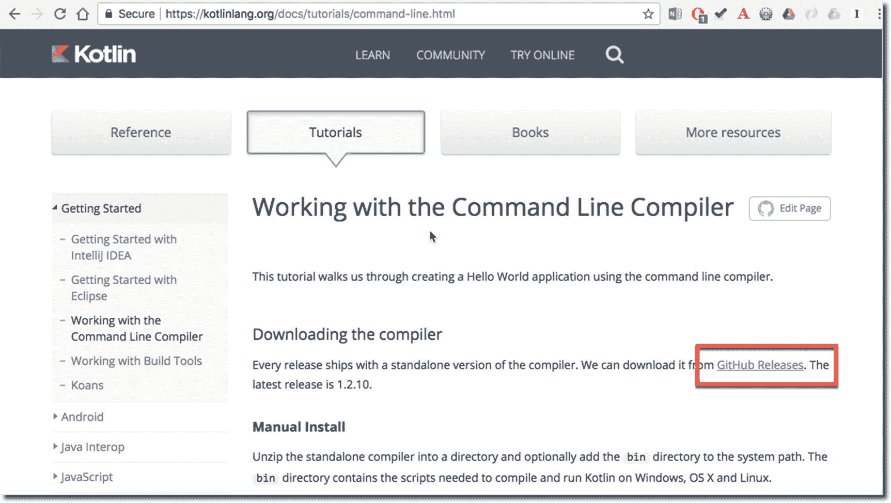

图 1-3

Kotlin 命令行编译器页面

链接应该会把你带到 JetBrains/Kotlin<sup>3</sup>的 GitHub 页面(图 1-4 )。在撰写本文时，Kotlin 的版本是 1 . 2 . 10；当你读到这篇文章的时候，它可能是一个不同的版本，但是只要下载最新的稳定版本。

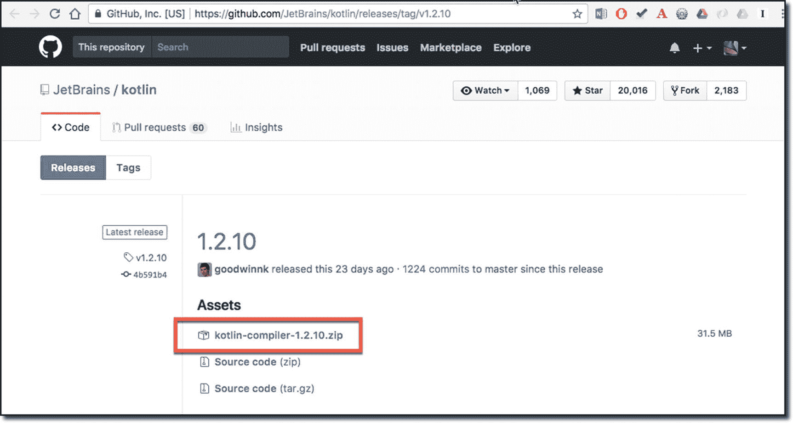

图 1-4

安装程序压缩文件的 GitHub 页面

下载完成后，解压缩安装程序文件，并将其放在系统中的某个位置，最好是您拥有读、写和执行权限的目录。文件应该解压到名为“kotlinc”的文件夹中。接下来要做的是将 kotlinc/bin 文件夹添加到系统路径变量中。下面几节将演示如何在 macOS、Linux 和 Windows 上做到这一点。

##### macOS 和 Linux

将下载的压缩文件复制到您的主目录，并在那里解压缩。清单 1-7 显示了该命令。

```kt
$ cd ~
$ unzip ~/kotlin-compiler-1.2.10.zip

Listing 1-7Unzip Kotlin Installer

```

### 注意

默认情况下，解压缩命令在 macOS 中是可用的，但是对于 Linux 系统，您可能必须首先从存储库中获取它。清单 1-8 显示了如何从存储库中提取它的命令。

```kt
$ sudo apt get update
$ sudo apt-get install unzip

Listing 1-8Getting the Unzip Tool

```

安装文件应该解压到一个名为“kotlinc”的文件夹中，如图 1-5 所示。

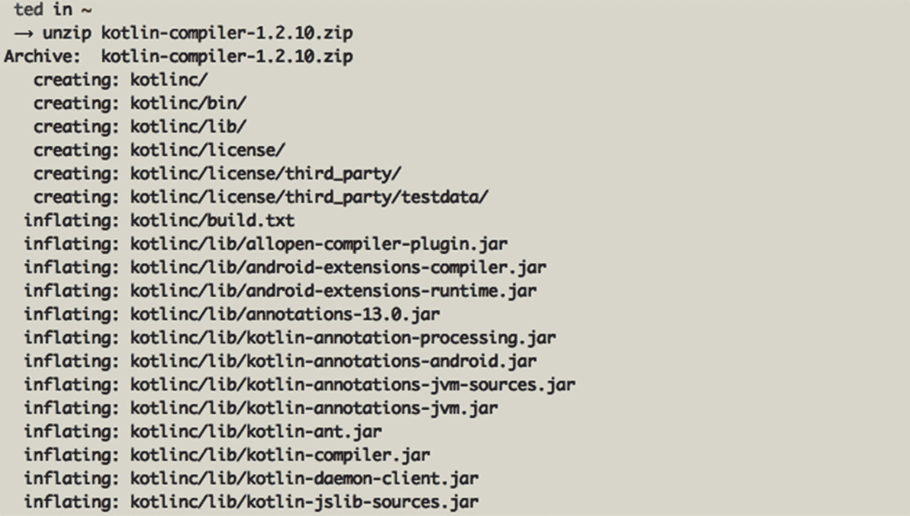

图 1-5

解压缩 Kotlin 安装程序

在使用命令行工具之前，我们需要将“kotlinc/bin”文件夹添加到系统路径变量中，如清单 1-9 所示。

```kt
$ export PATH=~/kotlinc/bin:$PATH

Listing 1-9Adding kotlinc/bin to the System Path

```

按下回车键，`kotlinc`命令现在应该可以工作了。您可以将清单 1-9 中所示的行添加到您的登录脚本中，这样每次打开终端窗口时都可以使用 Kotlin 工具。

##### Windows 10

将 Kotlin 安装程序的压缩文件复制到您的主目录，并在那里解压缩。使用你最喜欢的存档工具解压。它应该解压到下面的文件夹:`C:\Users\yourname\kotlinc`。在 kotlinc 文件夹中是 bin 文件夹，它包含了我们需要用于编译的各种脚本和批处理文件。这个 bin 文件夹就是我们需要添加的 Windows 系统路径。

要将 kotlinc\bin 文件夹添加到系统路径，点击 Windows **开始**按钮➤ **控制面板** ➤ **系统**。一旦系统对话框打开，点击**高级** ➤ **环境变量**。变量有两个框；上框显示“用户变量”，下框显示“系统变量”。系统`PATH`将出现在“系统变量”框中。追加`kotlinc\bin`到`PATH`变量。关闭系统对话框以保存更改。

#### 使用 SDKMAN

SDKMAN 可以在 macOS、Linux、Cygwin (Windows)、FreeBSD 和其他 UNIX 系统上使用。如果您已经将它作为工具链的一部分，那么您可以使用它来获得 Kotlin 编译器。如果你还没有 SDKMAN，安装起来很简单。参见清单 1-10 安装 SDKMAN。

### 重要的

在从命令行安装 SDKMAN 之前，您需要获得`curl`工具。如果您还没有它，请使用您的平台软件包管理器来获取`curl`。

```kt
$ curl -s "https://get.sdkman.io" | bash

Listing 1-10Installing SDKMAN From the Command Line

```

按照屏幕上的说明完成安装。您需要关闭当前的终端窗口并启动另一个窗口，因为 SDKMAN 安装程序对登录脚本进行了更改。为了使这些更改生效，您需要打开一个新的终端窗口。完成后，我们现在可以安装 kotlin 了。安装命令见清单 1-11 。

```kt
$ sdk install kotlin

Listing 1-11Installing Kotlin via SDKMAN

```

### 使用命令行工具编码

无论您选择哪种方式来安装命令行工具，现在您都应该已经有了一个可以工作的 Kotlin 编译器。要尝试一下，打开一个终端窗口，输入命令`kotlinc`。这将改变你的终端提示为三个 v 形(大于符号)；参见清单 1-12 。

```kt
$ kotlinc
Welcome to Kotlin version 1.2.10 (JRE 9.0.1+11)
Type :help for help, :quit for quit
>>>

Listing 1-12Kotlin REPL

```

这是 Kotlin REPL——读取、评估、打印、循环的缩写。它以交互方式执行 Kotlin 命令，并立即向您显示结果。如果您以前使用过现代浏览器的控制台功能来输入 JavaScript 命令，这与那个非常相似。REPL 是互动学习语言的好方法。它在开发过程中也非常有用，因为它允许您试验表达式和语句，而不必经历完整的编写-编译-运行周期。您可能想要尝试几个表达式和语句(参见清单 1-13 )。

```kt
>>> 5 * 3
15
>>> println("Hello there")
Hello there
for (i in 1 . . 3) {
. . .println(i)
. . .}
1
2
3
>>>

Listing 1-13Simple Expressions

```

REPL 对于测试语句甚至清单 1-13 中所示的小段代码非常有用，但是如果您需要测试更长的程序，将它编写在程序文件中、编译并运行它会更方便，就像您测试 Java 程序一样。让我们来看看在 Kotlin 是什么样子。

首先，创建一个文件，并将其命名为“hello . kt”——kot Lin 源文件的扩展名为”。kt”。hello.kt 的内容如清单 1-14 所示。

```kt
fun main(args: Array<String>) {
  print("Hello")
}

Listing 1-14hello.kt

```

Kotlin 与 Java 有相似之处，所以清单 1-14 可能看起来很熟悉，但是您也会很快注意到一些明显的东西，所以现在让我们来解决这些问题。

*   **没有类构造**。Kotlin 不需要类来执行函数。如清单 1-14 所示的函数称为顶级函数；main 函数很特殊，因为与 Java 的`public static void main()`一样，Kotlin 的`fun main()`是应用的入口点。当您运行一个 Kotlin 文件时，运行时将查找这个函数。

*   **函数 main 与**语法略有不同。用关键字`fun`定义函数。类型声明在标识符`(args)`之后；你会习惯的。此外，Kotlin 没有特殊的语法来定义数组。数组只是 Kotlin 中的类型。

*   **函数 main 没有返回值**。其实是有的，只是我们没有写在例子里。函数的默认返回值是`Unit;`,就像 Java 中的 void。

*   **没有分号** - **冒号**。这些已经没有必要了。

下一步是编译和运行我们的源文件。清单 1-15 显示了管理它的命令。

```kt
kotlin hello.kt –include-runtime –d hello.jar
java –jar hello.jar

Listing 1-15Compile and Run hello.kt

```

如果您能够像前面的清单和示例中所示的那样正确地输入所有内容，您应该会在屏幕上看到“Hello World”消息。

如果您觉得命令行工具不适合您，并且您更愿意使用功能更丰富的编程环境，您可以尝试其他 ide，如 Eclipse、IntelliJ 或 Android Studio 3 (AS3)。我们将在本书中介绍 IntelliJ 和 AS3 的安装和使用。下一节将带您了解 IntelliJ IDEA 的设置。

### 安装 IntelliJ

JetBrains 创建了 Kotlin，所以正如你所想象的，它有很好的支持。Android Studio 基于 JetBrain 的 IntelliJ IDEA CE(社区版)；然而，Android Studio 是免费和开放源码软件，由谷歌而不是 JetBrains 维护。

我们甚至可以在本书的第一部分使用 AS3 然而，这样做需要我们同时处理 Kotlin 和 Android 组件。我选择不去做，而是专注于 Kotlin。无论如何，AS3 是基于 IntelliJ 理念的，所以我们在 IntelliJ 上获得的任何知识和技能都将很好地转化为 AS3。

你可以从 JetBrains 网站( [`http://www.jetbrains.com`](http://www.jetbrains.com) )下载 IntelliJ IDEA，然后上来**工具**，下来 **IntelliJ IDEA** (见图 1-6 )。它将带你到一个页面，在那里你可以为你的平台选择合适的安装程序。您还可以选择是下载“终极版”还是“社区版”。我们将下载社区版。

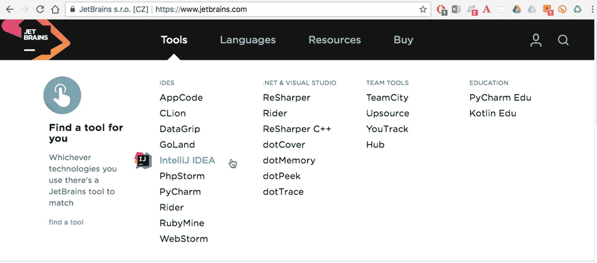

图 1-6

IntelliJ IDEA 下载页面

如果您使用的是**窗口**，您需要:

1.  双击您下载的*ideaIC.exe*

2.  按照屏幕提示完成安装

对于 **macOS** ，执行以下操作:

1.  双击您下载的 *ideaIC.dmg*

2.  将 IntelliJ IDEA 复制到应用文件夹

3.  运行 IntelliJ IDEA。

对于 **Linux** ，安装说明如下:

1.  将 tar.gz 安装程序文件复制到您拥有读取、写入和执行权限的目录中。出于我们的目的，我们将把它复制到主文件夹中(参见清单 1-16 )。

1.  打开 ideaIC.tar.gz 的包装，如清单 1-17 所示。

```kt
$ cd
$ cp ~/Downloads/ideaIC-2017.3.2.tar.gz .

Listing 1-16Copy IntelliJ Installer to Your Home Folder

```

1.  将 ideaIC/bin 添加到系统路径中，如清单 1-18 所示。

```kt
tar –xzvf ideaIC.tar.gz

Listing 1-17Untar the Installer

```

1.  通过运行 idea.sh 脚本启动 IntelliJ IDEA，如清单 1-19 所示。

```kt
$ export PATH=~/ideaIC-2017.3.2/bin:$PATH:.

Listing 1-18Add ideaIC/bin to the System Path

```

```kt
$ sh idea.sh

Listing 1-19Start idea.sh

```

## 创建项目

如果您还没有启动 IntelliJ，请启动它。它从一个欢迎屏幕开始，如图 1-7 所示。首先，让我们创建一个项目。

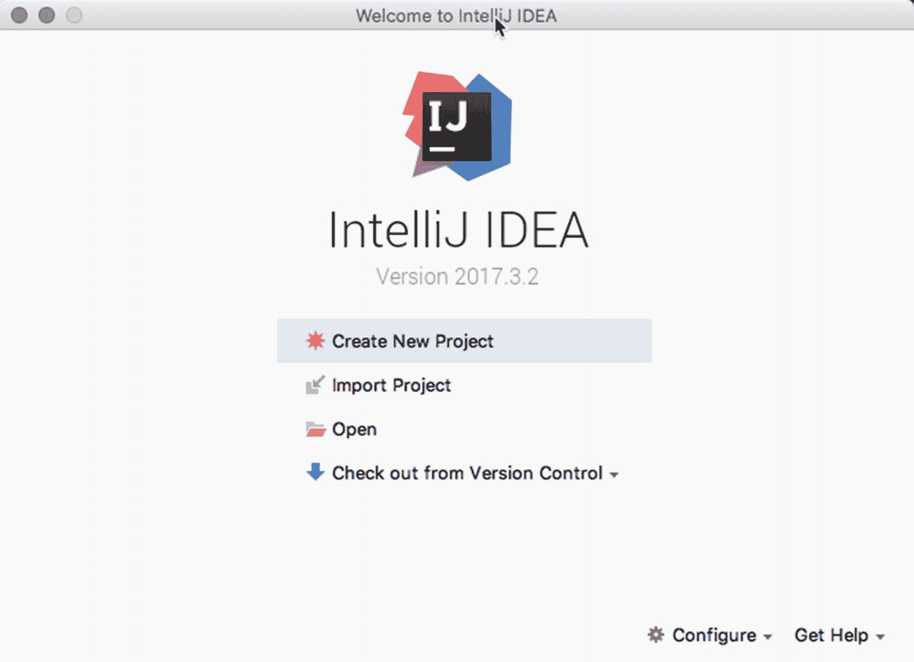

图 1-7

欢迎来到 intellij idea

点击“创建新项目”会将我们带到“新项目”窗口(如图 1-8 所示)。选择“Kotlin/JVM ”,然后单击“下一步”按钮。

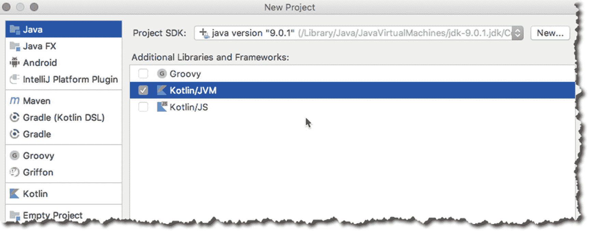

图 1-8

新的 Kotlin/JVM 项目

这将我们带到“New Project”向导的第二个窗口，在这里我们需要输入一些信息，但是大多数信息已经预先填充了默认条目，我们可以简单地接受默认值。我们确实需要提供“项目名称”，除非您想将您的项目命名为“未命名”(这是项目名称字段的默认值—可能不是一个好主意)。

在图 1-9 中，我使用了“kotlinproject”作为项目名称。我没有更改默认的项目位置，即主文件夹下的“IdeaProjects”。我也没有对“项目 SDK”做任何更改，这是 IntelliJ 在安装时检测到的。要完成项目创建向导，请单击“完成”按钮。

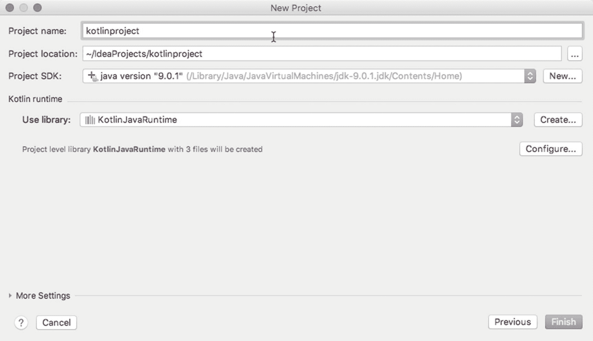

图 1-9

新项目

第一次启动 IntelliJ 时，你会看到“日积月累”窗口(图 1-10 )。提示对于学习 IDE 的功能非常有用，但是我更喜欢它们只在我召唤它们的时候出现，而不是每次启动 IDE 的时候都弹出来。您可以通过取消选中“启动时显示提示”来禁用启动时显示的“每日提示”窗口让我们暂时关闭它。

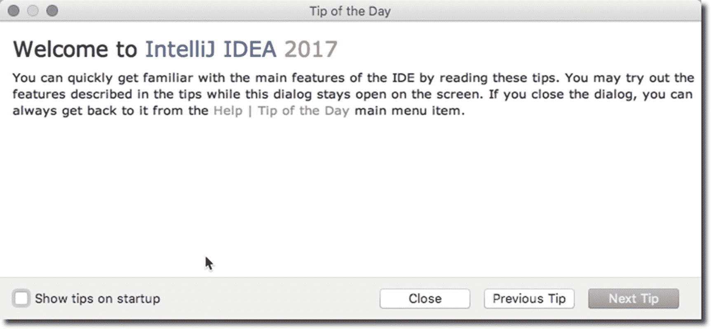

图 1-10

日积月累

当日积月累对话框关闭时，我们可以更全面地看到我们新创建的项目(图 1-11 )。ide 的左侧显示“项目工具窗口”；它现在没有多少，因为我们还没有创造任何东西。

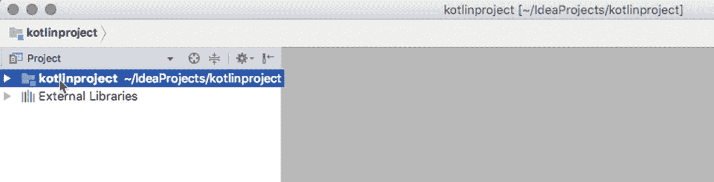

图 1-11

我们在 IntelliJ 的 Kotlin 项目

项目工具窗口允许我们更改“视图”所有的视图都显示相同的项目，但是每个视图对内容的安排都有所不同。您可以通过单击下拉按钮来更改项目工具窗口的视图(参见图 1-12 )。您应该尝试几种视图来熟悉它们。

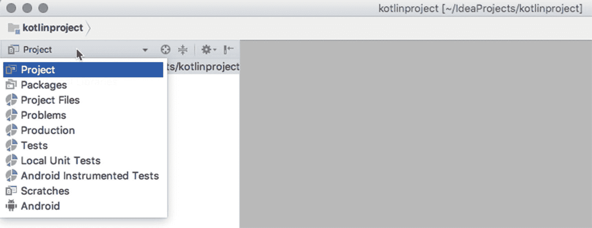

图 1-12

项目工具窗口，视图

对于本节的其余部分，我们将使用“项目”视图。这个视图以树状结构显示我们的文件，很像你操作系统中的文件管理器(见图 1-12 )。您可以向下钻取并展开以查看文件夹的内容，如图 1-13 所示。

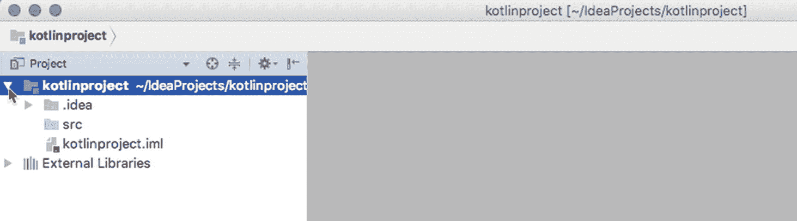

图 1-13

项目工具窗口。项目视图

“src”文件夹(source 的缩写)是我们放置 Kotlin 源文件的地方。右击 src 文件夹，选择新建➤·Kotlin 文件/类，如图 1-14 所示。

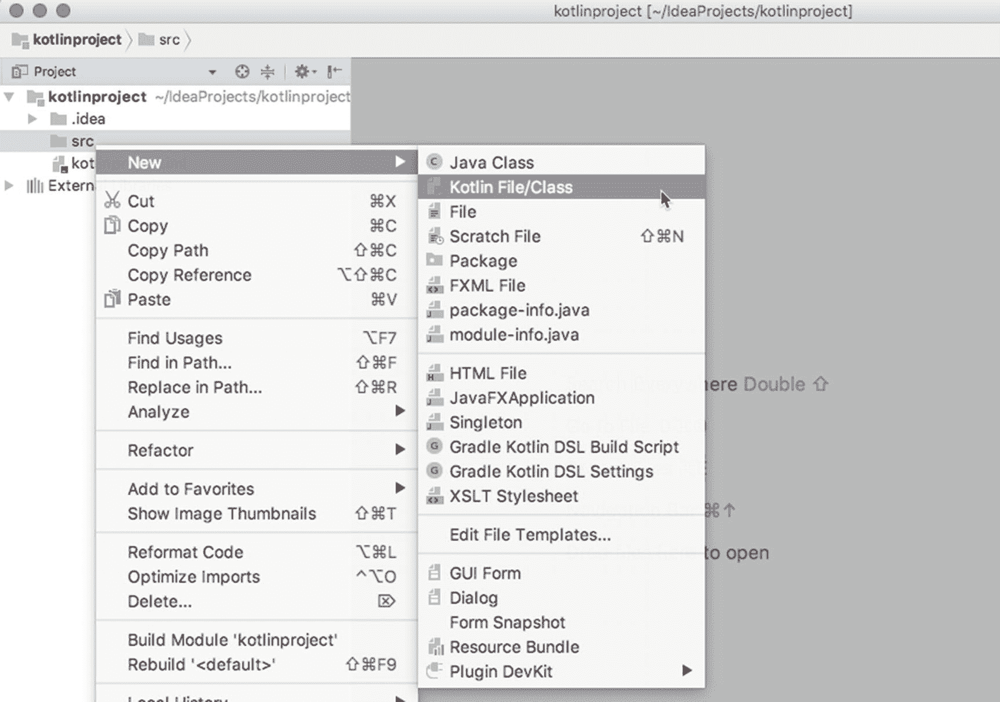

图 1-14

从项目工具窗口新建 Kotlin 文件

我们现在将创建一个 Kotlin 文件，并将其命名为“Hello”；“我们不用写了。kt "扩展名名称字段(见图 1-15)—扩展名将自动为我们添加。确保在对话框的“种类”栏中选择了“文件”选项(参见图 1-15 )。单击“确定”按钮创建文件。

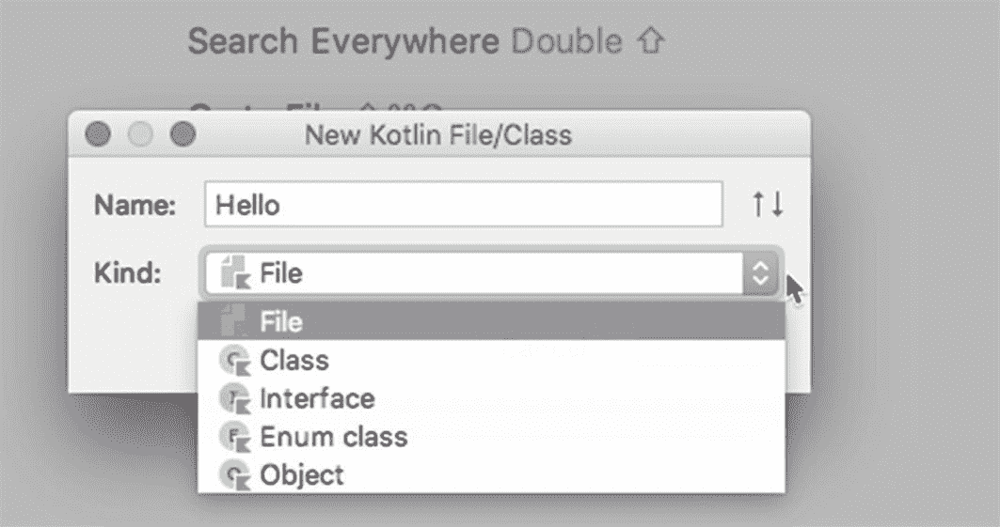

图 1-15

新 Kotlin 文件

当源文件被创建时，你会在项目工具窗口的 src 文件夹下看到它，它也会在主编辑器窗口中被打开(见图 1-16 )。

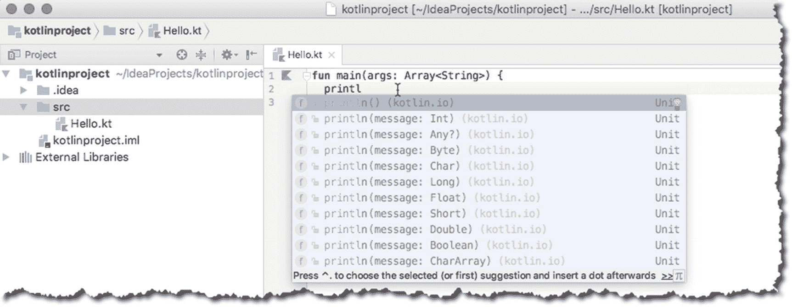

图 1-16

Hello.kt

IntelliJ 具有出色的代码提示和自动完成功能。当它识别出你正在输入的内容时，它会给你一些建议和提示(见图 1-15 )。一旦您键入了足够多的可能是 Kotlin 关键字或构造的字符模式，IDE 就会提供建议。您可以接受当前建议的选项(在弹出窗口中高亮显示，如图 1-15 所示)或使用鼠标或箭头键选择其他自动完成选项。

清单 1-20 显示了这个例子的完整代码清单。

```kt
fun main(args: Array<String>) {
  println("Hello World")
}

Listing 1-20Hello.kt

```

下一步是运行这个程序；您可以通过调用 IntelliJ 主菜单栏上的 Run 菜单来实现这一点。主菜单栏位于 IDE 的顶部，顶层选项包括文件、编辑、查看和帮助。从主菜单栏中点击**运行** ➤ **运行**。你会注意到在主运行菜单上有两个运行选项，第一个运行选项是灰色的。选择另一个运行选项，它位于从顶部往下数第四个项目的位置。第一次运行选项是灰色的，因为我们还没有为项目定义任何运行时配置。我们本来可以编辑配置并提供运行时类的名称，但是我们不必这样做。选择第二个运行选项会弹出一个对话框窗口(见图 1-17 )，会要求我们输入当前项目的运行时类的名称。“HelloKt”是我们将选择作为该项目的运行时类的类。

### 注意

我们的源文件名是“Hello.kt”，但是 Kotlin 编译器不会生成“hello . class”；而是会生成字节码“HelloKt.class”。在处理 Kotlin 类文件时，您应该记住这一点。

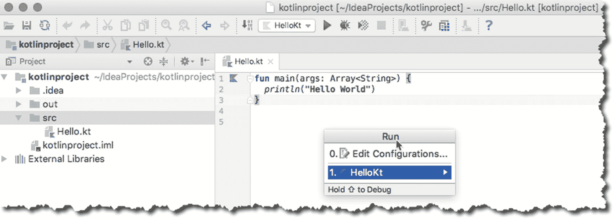

图 1-17

运行 Hello.kt

IDE 将把“Hello.kt”编译成“HelloKt.class ”,然后运行。结果将显示在“运行”工具窗口中(参见图 1-18 )。

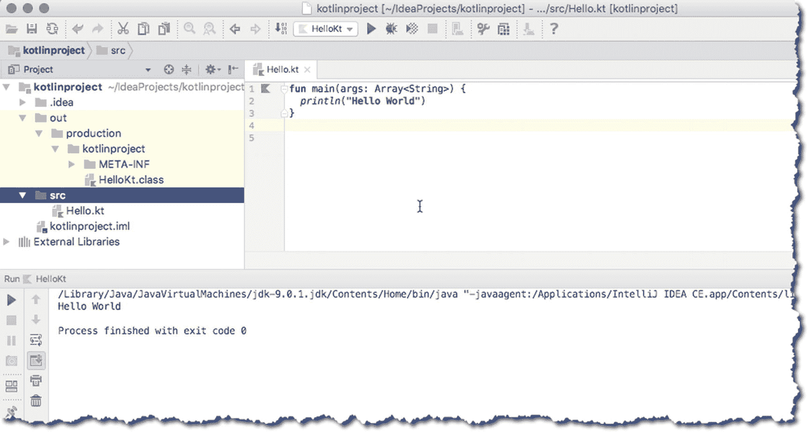

图 1-18

运行 Hello.kt 的结果

现在我们已经成功运行了一个顶级函数，让我们向应用添加一个类，并编写一个更加面向对象的代码示例版本。要添加一个类，右击项目工具窗口上的“src”文件夹(图 1-19 ，选择**新建** ➤ **Kotlin 文件/类**。

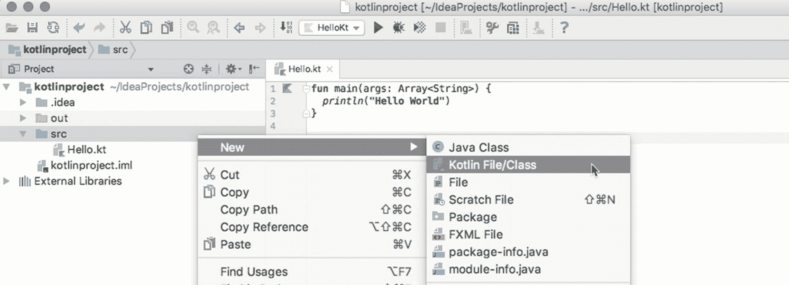

图 1-19

向项目中添加新文件/类

当弹出“新建 Kotlin 文件/类”对话框窗口时，选择“类”(图 1-20)；姑且称之为“迎宾”。

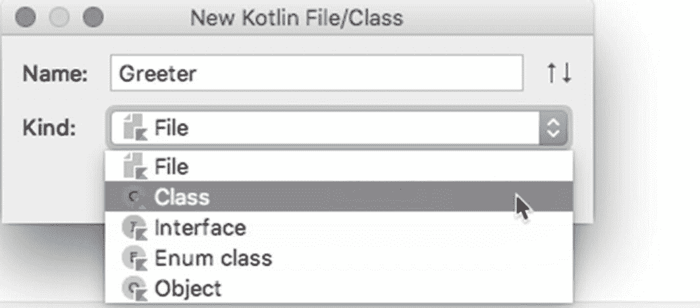

图 1-20

新 Kotlin 级

在主编辑器窗口中编辑欢迎类(图 1-21 )。

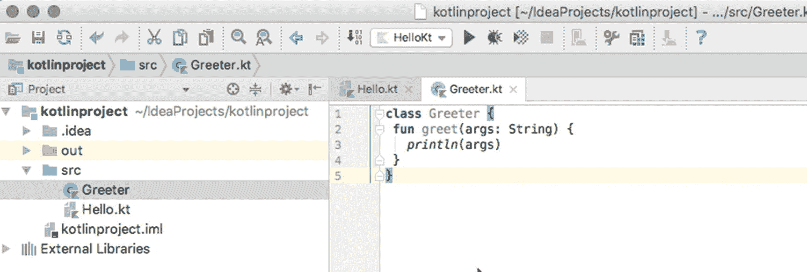

图 1-21

更大的阶级

然后编辑 Hello.kt 如图 1-22 所示。完成更改后，再次运行“Hello.kt”。从主菜单栏中，**运行** ➤ **运行**；或者，您可以使用`Shift + F10`来运行代码。

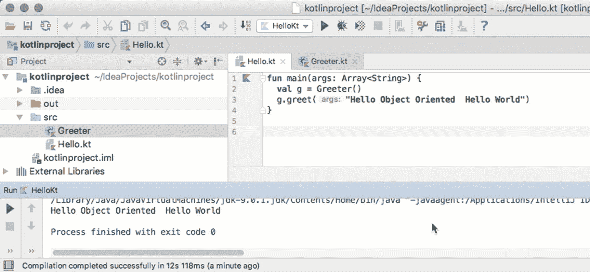

图 1-22

用更大的类运行 main

图 1-21 显示了我们更新代码的输出。本章的所有编码活动到此结束。现在您可能已经知道，IntelliJ 对 Kotlin 语言有很好的支持；如果你喜欢用不同的编辑器编写 Kotlin 程序，你可以不使用它。但是如果您选择使用它，我们不妨快速浏览一下 IDE，以便更好地使用它。这就是下一部分的内容。

## 智能集成电路

图 1-23 显示了 IDE 的各个部分。您需要有一个打开的项目，以便在桌面上看到类似的内容。

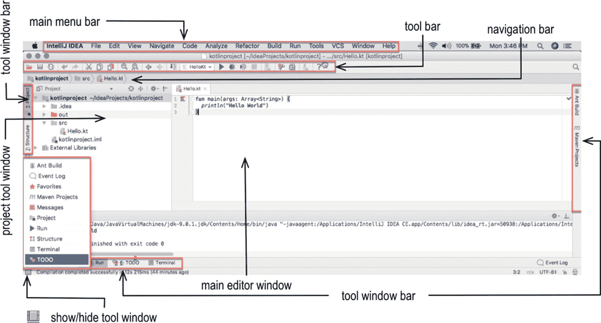

图 1-23

IntelliJ IDEA IDE

表 1-2 讨论了 IDE 的各个部分，因为它与图 1-22 相关。

表 1-2

IntelliJ IDE

<colgroup><col class="tcol1 align-left"> <col class="tcol2 align-left"></colgroup> 
| 主菜单栏 | 在 IDE 中有许多方法可以完成任何任务；您可以使用各种键盘快捷键或上下文菜单，但最全面的导航方式是在主菜单栏上。这个栏位于 IDE 的最顶端。 |
| 工具窗口栏 | 工具窗口栏沿着 IDE 窗口的周边运行。它包含激活特定工具窗口所需的各个按钮。 |
| 显示/隐藏工具窗口 | 这是查看 IDEA 中各种工具窗口的快捷方式。也可以从主菜单栏**查看** ➤ **工具窗口中查看或隐藏工具窗口。** |
| 主编辑器窗口 | 这是最突出的窗口，它拥有最多的屏幕空间。在编辑器窗口中，您可以创建和修改项目文件和源文件。 |
| 刀杆 | 工具栏允许您执行各种操作(例如，保存文件、运行应用、打开 AVD 管理器、打开 SDK 管理器、撤销、重做操作等)。). |
| 导航栏 | 它允许您导航项目文件。这只是“项目文件”窗口的一个更紧凑的视图。这是一个水平排列的箭头框集合，类似于一些网站上可以找到的面包屑导航。您可以通过导航栏或项目工具窗口打开项目文件。 |
| 项目工具窗口 | 显示项目中的文件。如果您想要打开一个特定的文件，在这个窗口中双击该文件，它将在主编辑器窗口中打开。您也可以在此窗口中的项目上使用上下文菜单。上下文菜单允许在 IDE 中完成任务的替代方法(例如，添加类文件、运行代码、调试等)。). |

## 章节总结

*   Kotlin 是 Android 最新的编程语言，它在 Android Studio 3 上有一流的支持。

*   有许多方法可以在 macOS、Linux 和 Windows 上安装 Kotlin 命令行编译器和运行时。

*   各种 ide 都支持 Kotlin 语言；在其中的一些上，你必须得到一个插件，而在一些上，它是开箱即用的。

*   Kotlin 看起来和 Java 很像，但也有区别。

*   IntelliJ 对 Kotlin 有很好的支持——毕竟是 JetBrains 创造了 Kotlin。

在下一章中，我们将了解以下内容:

*   程序元素(例如，文字、变量、表达式、关键字、运算符等。)—构成我们代码的各种东西

*   在 Kotlin 中我们可以使用哪些类型的数据

*   Kotlin 中为什么会有可空类型，它首先是什么？

*   控制结构，以便您可以循环和分支

*   异常处理和为什么你不必再用 Kotlin 写 try-catch 了(剧透)

<aside class="FootnoteSection" epub:type="footnotes">Footnotes 1

可用 [`http://www.oracle.com/technetwork/java/javase/downloads/jdk9-downloads-3848520.html`](http://www.oracle.com/technetwork/java/javase/downloads/jdk9-downloads-3848520.html)

  2

使用命令行编译器: [`https://kotlinlang.org/docs/tutorials/command-line.html`](https://kotlinlang.org/docs/tutorials/command-line.html)

  3

jetbrains/kotlin github page:[`https://github.com/JetBrains/kotlin/releases/tag/v1.2.10`](https://github.com/JetBrains/kotlin/releases/tag/v1.2.10)

 </aside>