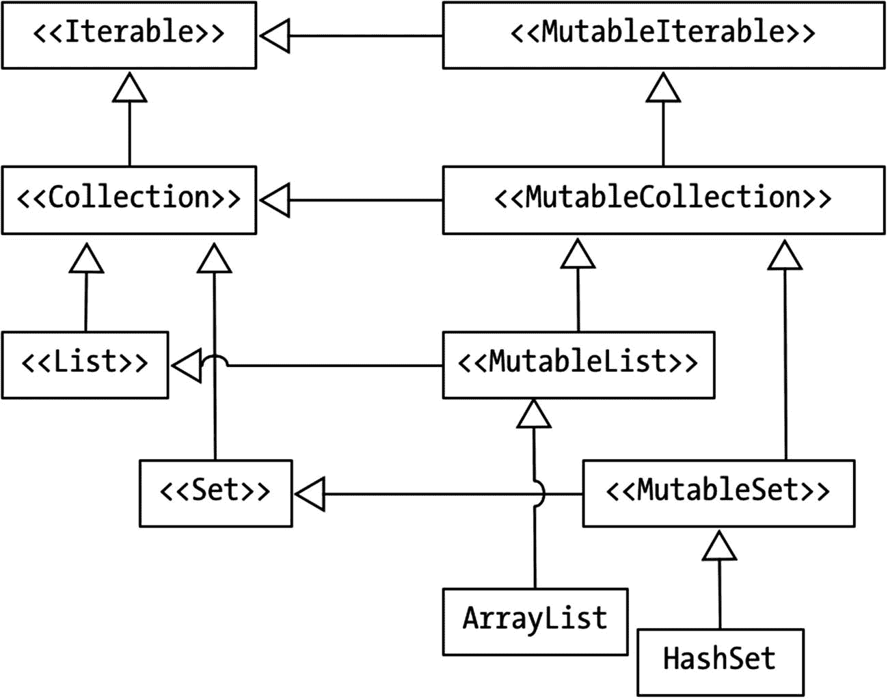

# 六、集合和数组

*我们将介绍的内容:*

*   数组

*   收集

*   过滤并应用

现实世界中收藏的一个类比是一个钱包或一个装满硬币等各种东西的袋子。硬币将会是*物品*，而袋子本身就是*收藏*。因此，基于这个类比，我们可以说集合是各种各样的*容器*，其中可能有零个、一个或多个条目。你可能记得我们已经有了类似的东西——一个数组。该数组完全符合这一描述，因为它可以包含零个、一个或多个项目。如果是这样的话，我们真的需要学习其他容器吗？在这一章中，我们将看看 Kotlin 集合框架中的数组、集合和一些函数。

## 数组

从 Java 开始，在使用 Kotlin 数组之前，您需要稍微后退一步。在 Java 中，这些是特殊类型；他们在语言层面有一流的支持。在 Kotlin 中，数组只是类型；更确切地说，它们是参数化类型。如果您想创建一个字符串数组，您可能会认为下面的代码片段可能有用:

```kt
var arr = {"1", "2", "3", "4", "5"}

```

这段代码对 Kotlin 来说没有意义——它没有把数组当作特殊类型。如果我们想创建一个类似例子的字符串数组，我们可以用几种方法来实现。Kotlin 有一些库函数，如 *arrayOf、emptyArray* 和 *arrayOfNulls* ，我们可以用它们来简化数组的创建。清单 6-1 展示了如何使用 *emptyArray* 函数创建并填充一个数组。

```kt
var arr = emptyArray<String>();
arr += "1"
arr += "2"
arr += "3"
arr += "4"
arr += "5"

Listing 6-1Using the emptyArray Function

```

向 Kotlin 数组添加元素不像在 Java 中那样冗长，但是不要被漂亮的语法所迷惑。数组在创建时仍然是固定大小的，即使在 Kotlin 中也是如此。通过创建一个比旧数组更大的新数组，然后将旧数组的元素复制到新数组中，可以将元素添加到数组中。所以，你看，这仍然是一个昂贵的操作——即使我们有一个漂亮的甜语法。清单 6-2 展示了如何使用 *arrayOfNulls* 函数来做同样的事情。

```kt
var arr2 = arrayOfNulls<String>(2)
arr2.set(0, "1")
arr2.set(1, "2")

Listing 6-2Using the arrayOfNulls Function

```

arrayOfNulls 函数的整数参数是要创建的数组的大小。与清单 6-1 中的空数组不同，这个函数让您有机会为将要创建的数组提供一个大小。顺便说一下，你仍然可以对 Kotlin 数组使用括号语法，*数组*的 *get* 和 *set* 方法只是方便的函数。清单 6-3 展示了括号语法以及新的 *get* 和 *set* 函数的使用。

```kt
var arr2 = arrayOfNulls<String>(2)

// arr2.set(0, "1")
// arr2.set(1, "2")

arr2[0] = "1"
arr2[1] = "2"
println(arr2[0]) // same as arr2.get(0)
println(arr2[1])

Listing 6-3Get and Set Methods of Array

```

创建数组的另一种方法是使用函数的*array。清单 6-4 显示了代码片段。*

```kt
var arr4 = arrayOf("1", "2", "3")

Listing 6-4Using the arrayOf Function

```

这个函数可能是我们能得到的最接近 Java 数组文字的语法，这可能是为什么它被程序员更多地使用的原因。您可以将逗号分隔的值列表传递给函数，这样会自动填充新创建的数组。

最后，可以使用数组构造函数创建数组。构造函数接受两个参数，第一个参数是要创建的数组的大小，第二个参数是一个 lambda 函数，它可以返回每个元素的初始值。

```kt
var arr3 = Array<String>(5, {it.toString()})

Listing 6-5Using the Array Constructor

```

在大多数需要处理数字数组的情况下，使用*数组*类就足够了。然而，你需要记住，例如,`Array<Int>,`将 int 表示为整数对象，而不是整数原语。因此，如果您需要从代码中挤出更多的性能，并真正使用原始数字类型，您可以使用 Kotlin 的专用数组类型。

像 *ByteArray* 、 *IntArray、ShortArray、*和 *LongArray* 这样的专用类表示原始类型的数组(就像 Java 中的数组)。这些类型让您可以使用数组，而不需要像使用 number 原语的对象对应物的*数组*那样的装箱和拆箱开销。这些专用类型实际上并不继承自*数组*，但是它们有相同的方法和属性集。此外，它们有专门的工厂功能，使它们更容易使用。参见清单 6-6 中的示例。

```kt
var z = intArrayOf(1,2,3)
var y = longArrayOf(1,2,3)
var x = byteArrayOf(1,2,3)
var w = shortArrayOf(1,2,3)

println(Arrays.toString(z))
println(Arrays.toString(y))
println(Arrays.toString(x))
println(Arrays.toString(w))

Listing 6-6Special Array Types

```

我使用了`Arrays.toString()`函数，这样我们在打印内容时就可以得到可读的输出。如果你只是简单地打印没有帮助函数的数组，它看起来就像胡言乱语，就像这样

```kt
println(z) // outputs Ljava.lang.String;@6ad5c04e

```

遍历数组有几种方法。首先，您可以将可信任的*用于*循环，如清单 [6-7 所示。

```kt
for (i in z) {
  println("$i zee")
}

Listing 6-7Using a for Loop to Process Each Array Element

```

或者你可以使用 *forEach* 函数，就像这样。

```kt
y.forEach { i -> println("$i why") }

```

如果需要跟踪数组的索引和元素，可以使用 *forEachIndexed* 函数，如清单 6-8 所示。

```kt
x.forEachIndexed { index, element ->
  println("$index : $element")

}

Listing 6-8Using the forEachIndexed Function to Traverse the Array

```

在我们离开数组的主题之前，我们需要记住，如果您不希望数组的内容有任何重复，您必须自己编写程序逻辑。数组不能保证内容的唯一性。

虽然数组在许多情况下非常有用，但正如您在前面的讨论中看到的，它们也有局限性。向数组中添加新元素虽然语法友好，但仍然是一项开销很大的操作。如果不使用助手函数，就无法打印出来(虽然这没什么大不了的)。最后，它没有约束元素的工具(例如，强制唯一性)。在某些情况下，这些限制可能没什么大不了的，但在某些情况下，这些限制可能会成为交易杀手。因此，当我们遇到数组的限制时，我们就进入了集合的领域——它们帮助我们处理这样的限制。

作为开发工具包的一部分，集合框架的可用性对您来说可能不是一件大事。毕竟，你来自 Java，它有一个令人印象深刻的集合框架。但是你需要记住，在 Java、C#、Python 等语言之前。没有集合框架。程序员不得不编写他们自己的程序逻辑来处理诸如可调整大小的数组、后进先出访问、哈希表或哈希表等问题。这些不是简单的存储问题，而是数据结构问题。自己实现这种数据结构逻辑相当困难；有很多边缘情况需要纠正。尽管仍然有合理的理由实现自己的数据结构(可能是因为性能原因)，但在大多数情况下，使用内置的集合框架会更好。

## 收集

Kotlin 收藏馆实际上是 JDK 收藏馆的直接实例。不涉及包装的转换。因此，如果您在使用 Java 时没有忽略对集合的研究，那现在肯定会派上用场。尽管 Kotlin 没有定义自己的集合代码，但它确实为框架添加了相当多的便利函数，这是一个受欢迎的附加功能，因为它使集合更容易使用。

在我们讨论代码示例和更多细节之前，需要说明一下为什么它被称为集合框架。之所以称之为框架，是因为数据结构本身非常多样化。其中一些限制了我们浏览整个系列的方式；它们强加了特定遍历顺序。一些集合约束数据元素的唯一性；他们不允许你放复制品。其中一些让我们成对地使用集合——就像在字典条目中，你将有一个具有相应值的键。



图 6-1

集合框架

图 6-1 显示了 Kotlin 集合框架的层次结构。在层次的顶端是接口 *Iterable* 和*mutable talible*——它们是我们将使用的所有集合类的父类。正如您在图中注意到的，每个 Java 集合在 Kotlin 中都有两种表示:一种是只读的，一种是可变的。可变接口直接映射到 Java 接口，而不可变接口缺少可变接口的所有 mutator 方法。

Kotlin 没有创建列表或集合的专用语法，但是它为我们提供了方便创建的库函数。表 6-1 列出了其中的一些。

表 6-1

Kotlin 收藏及其创作功能

<colgroup><col class="tcol1 align-left"> <col class="tcol2 align-left"> <col class="tcol3 align-left"></colgroup> 
| 

募捐

 | 

只读

 | 

易变的

 |
| --- | --- | --- |
| 目录 | `listOf` | `mutableListOf, arrayListOf` |
| 设置 | `setOf` | `mutableSetOf, hashSetOf, linkedSetOf, sortedSetOf` |
| 地图 | `mapOf` | `mutableMapOf, hashMapOf, linkedMapOf, sortedMapOf` |

### 注意

尽管 map 类没有从 *Iterable* 或*mutable talible*(图 6-1 )继承，但它在 Kotlin 中仍然表现为两个不同的版本:一个是可变的，一个是不可变的。

### 列表

列表是一种具有特定迭代顺序的集合。这意味着，如果我们向列表中添加几个元素，然后遍历它，这些元素会以非常特定的顺序出现——即它们被添加或插入的顺序。它们不会以随机的顺序或颠倒的时间顺序出现，而是精确地按照它们被添加的顺序出现。它意味着列表中的每个元素都有一个放置顺序，一个指示其顺序位置的索引号。要添加的第一个元素的索引为 0，第二个元素的索引为 1，第三个元素的索引为 2，依此类推。所以，就像数组一样，它是从零开始的。清单 6-9 显示了列表的基本用法。

<colgroup><col class="tcol1 align-left"> <col class="tcol2 align-left"></colgroup> 
| -什么 | 创建一个可变列表，构造函数允许我们传递一个变量参数来填充列表。在这种情况下，我们只通过了一个论点——我们本可以通过更多的论点。 |
| ➋ | 向列表中添加元素；“Orange”将紧跟在“Apple”之后，因为我们没有指定插入的顺序位置。 |
| ➌ | 向列表中添加另一个元素，但是这一次，我们告诉它应该将元素放在哪里。这一个碰撞“橙色”元素，然后插入它自己。自然，它后面的所有元素的序号位置或索引将会改变。 |
| -你好 | 您可以按名称删除元素。当一个元素被移除时，它旁边的元素将取代它的位置。它后面的所有元素的顺序位置将相应地改变。 |
| ➎ | 您也可以通过指定元素在列表中的位置来移除元素。 |
| ➏ | 你可以问`first()`柠檬是否等于“草莓”。 |
| -好的 | 还可以测试一下`last()`柠檬是否等于“香蕉”。 |

```kt
fun main(args: Array<String>) {

  val fruits = mutableListOf<String>("Apple") ➊
  fruits.add("Orange")      ➋
  fruits.add(1, "Banana")   ➌
  fruits.add("Guava")

  println(fruits)  // prints [Apple, Banana, Orange, Guava]

  fruits.remove("Guava")    ➍
  fruits.removeAt(2)        ➎

  println(fruits.first() == "Strawberries") ➏
  println(fruits.last() == "Banana")        ➐

  println(fruits) //  prints [Apple, Banana]
}

Listing 6-9Basic Usage of Lists

```

### 设置

集合和列表在操作和结构上都非常相似，所以我们所学的关于列表的所有东西也适用于集合。集合与列表的不同之处在于它们对元素的唯一性进行约束。它们不允许在一个集合中有重复的元素或相同的元素。对许多人来说,“相同”意味着什么似乎是显而易见的，但是 Kotlin 和 Java 一样，对“相同性”有特定的含义。当我们说两个对象相同时，这意味着我们已经对这两个对象进行了结构相等的测试。Java 和 Kotlin 都定义了一个叫做`equals(),`的方法，它允许我们确定对象之间的等价关系。这就是我们通常所说的“相同”清单 6-10 显示了集合的一些基本操作。

<colgroup><col class="tcol1 align-left"> <col class="tcol2 align-left"></colgroup> 
| -什么 | 创建一个可变集合，并通过向 creator 函数传递一个变量参数来初始化它。 |
| ➋ | 这没有任何作用。它不会将“two”添加到集合中，因为元素“two”已经在集合中。 |
| ➌ | 不管你加多少次“二”，集合都会拒绝它，因为它已经存在了。 |
| -你好 | 另一方面，这将被添加，因为“三”在元素中还不存在。 |
| ➎ | 从一个范围创建一个可变集。这是一种创建包含许多数字元素的集合(或列表)的简便方法。 |
| ➏ | 这演示了如何使用 lambda 删除集合中的所有偶数。 |

```kt
val nums = mutableSetOf("one", "two")  ➊
nums.add("two")                        ➋
nums.add("two")                        ➌
nums.add("three")                      ➍

println(nums) // prints [one, two, three]

val numbers = (1..1000).toMutableSet() ➎
numbers.add(6)
numbers.removeIf { i -> i % 2 == 0 }   ➏

println(numbers)

Listing 6-10Basic Usage for Sets

```

### 地图

与列表或集合不同，映射不是单个值的集合；相反，它们是成对值的集合。把地图想象成字典或电话簿。它的内容使用键值对来组织。对于映射中的每个键，有且只有一个对应的值。在一个字典示例中，键将是术语的*，其值将是术语的含义*的*或定义*的*。*

映射中的键是唯一的。像集合一样，贴图不允许重复的键。然而，映射中的值不受相同的唯一性约束；map 中的两对或更多对可能具有相同的值。清单 6-11 显示了地图的一些基本用法。

<colgroup><col class="tcol1 align-left"> <col class="tcol2 align-left"></colgroup> 
| -什么 | Ca 可变映射 |
| ➋ | 向映射添加新的键和值 |
| ➌ | 将`dict`图分配给一个新变量。这不会创建新的地图。它仅向现有地图添加一个对象引用。 |
| -你好 | 向映射添加另一个键值对 |
| ➎ | 打印{bar = 2，baz = 3，foo=1} |
| ➏ | 还打印{bar = 2，baz = 3，foo=1}，因为`snapshot`和`dict`都指向同一个地图。 |
| -好的 | 使用键从映射中获取值 |

```kt
val dict = hashMapOf("foo" to 1)  ➊
dict["bar"] = 2                   ➋

val snapshot: MutableMap<String, Int> = dict ➌
snapshot["baz"] = 3                          ➍

println(snapshot)                 ➎
println(dict)                     ➏
println(snapshot["bar"]) // prints 2   ➐

Listing 6-11Basic Operations on a Map

```

现在我们已经看到了集合的一些基本用法的例子，您可能已经注意到它们有一些共同的特征——可能不是 100%像地图一样，但是列表和集合有相当多的重叠。使用集合框架的一个好处是整个集合中某些操作的一致性或规律性。例如，我们从列表工作中学到的技能和知识也可以很好地在集合和地图之间转换。因此，熟悉集合协议是一个好主意。表 6-2 列出了集合上一些更常见的操作。

表 6-2

集合的常见操作

<colgroup><col class="tcol1 align-left"> <col class="tcol2 align-left"></colgroup> 
| 

功能或属性

 | 

描述

 |
| --- | --- |
| `Size` | 告诉您集合中有多少元素。使用列表、集合和地图。 |
| `isEmpty()` | 如果集合为空，则返回 True，否则返回 False。使用列表、集合和地图。 |
| `contains(arg)` | 如果 arg 在集合中，则返回 True。使用列表、集合和地图。 |
| `add(arg)` | 向集合中添加参数。如果添加了 arg，则该函数返回 true 对于列表，将始终添加 arg。在集合的情况下，第一次将添加 arg 并返回 true，但是如果第二次添加相同的 arg，它将返回 False。在地图上找不到此成员函数。 |
| `remove(arg)` | 如果从集合中移除了 arg，则返回 True 如果集合未被修改，则返回 False。 |
| `iterator()` | 返回对象元素的迭代器。这是从 Iterable 接口继承的。使用列表、集合和地图。 |

### 集合遍历

到目前为止，我们已经知道如何使用基本集合。我们知道如何创建它们，以及如何在其中添加和删除项目。我们有效处理集合需要的另一项技能是循环遍历集合的能力。为此，让我们回到图 6-1 并回忆集合框架的继承结构。

在图 6-1 中，你会注意到*集合*继承了*可迭代*接口。一个*可迭代的*定义了一些可以被迭代或跳过的东西。当一个类继承了一个 Iterable 接口时，不管是直接的还是间接的，这意味着我们可以从中取出一个迭代器，并一个接一个地遍历它的元素。在每一步中，我们还可以提取每个元素的值——这取决于您的程序逻辑，您想用这些值做什么；例如，您可以转换它们，在算术运算中使用它们，或者将它们保存在存储器中。

我们可以使用各种方法来遍历集合中的元素。如果你喜欢，我们可以使用可靠的*而*和*用于*循环，但是使用更现代的*用于每个*更习惯——而且有点流行。清单 6-12 展示了如何使用 *while* 和 for *循环*遍历列表。

```kt
val basket = listOf("apple", "banana", "orange")
var iter = basket.iterator()
while (iter.hasNext()) {
  println(iter.next())
}

for (i in basket) {
  println(i)
}

Listing 6-12Using while and for Loops for Collections

```

清单 6-12 可能与您在 Java 中处理集合的方式很相似，所以看起来应该很熟悉。清单 6-13 显示了使用 *forEach* 函数时的等效代码。

<colgroup><col class="tcol1 align-left"> <col class="tcol2 align-left"></colgroup> 
| -什么 | `forEach`的 lambda 表达式有一个隐式的`it`参数。`it`参数是当前元素的值。这个语句的意思是，对于*水果*中的每一项，执行 lambda 中的操作，在我们的例子中，lambda 就是`println().` |
| ➋ | 同样的事情也适用于*集合* |
| ➌ | 同样的事情也适用于*地图* |
| -你好 | 这是上面第 3 条的变体，但是这一条允许我们分别处理*键*和*值*。 |

```kt
fruits.forEach { println(it) } ➊
nums.forEach { println(it) }   ➋

// for maps

dict.forEach { println(it) }   ➌
dict.forEach { t, u -> println("$t | $u") } ➍

Listing 6-13Using forEach

```

## 过滤和映射

为了有效地使用集合，过滤和映射是您需要掌握的基本技能的一部分。过滤允许我们有选择地使用集合中的元素。它缩小了范围。它基本上返回原始集合的子集。另一方面，映射允许我们转换元素或集合本身。

比方说，我们有一个数字列表——确切地说是整数，就像这样

```kt
val ints = (1..100).toList()

```

变量`ints`包含从 1 到 100 的整数列表，增量为 1。如果我们只想处理这个列表中的偶数，我们可以这样做:( 1)创建一个新列表；(2)迭代整数列表并对偶数执行模校验；然后(3)如果正在处理的当前元素是偶数，我们将其添加到新列表中。这些代码可能看起来像清单 6-14 。

```kt
val evenInts2 = mutableListOf<Int>()
for (i in ints) {
  if (i % 2 == 0) {
    evenInts2.add(i)
  }
}

Listing 6-14Using a for Loop to Sieve Out the Even Numbers

```

清单 6-14 可以被称为过滤事物的“必要”方式。没什么不好——就是有点啰嗦，仅此而已。但是它可读性很好，即使对于刚开始编程的人也是如此。然而，在 Kotlin 中，更惯用的缩小集合的方法是使用*过滤器*函数。如果我们用过滤器来做这件事，它会像这样

```kt
val evenInts = ints.filter { it % 2 == 0 }

```

我甚至不再给它贴上列表标签，因为这是不必要的——它只是一行。filter 函数是集合库中的标准函数。你已经知道花括号里的表达式是λ。然而，对于过滤器，更恰当的术语是 lambda 谓词。lambda 谓词也是一个函数文字，但是其中的表达式必须产生一个布尔值。

回到我们的例子，过滤器是针对一个集合调用的——例如，一个 int 列表。过滤操作的结果是一个较小的列表或子集。通过遍历每个元素并根据 lambda 谓词中指定的条件对它们进行测试，对列表进行了精简。任何通过谓词测试的项目都将包含在结果子集中。

让我们继续我们的例子，并与我们的偶数整数较小的列表。假设我们现在想要的是对偶整数列表中的每个元素求平方。这要求我们操作并转换列表中的每个元素，然后返回一个包含已转换元素的新列表。如果我们使用 for 循环来解决这个问题，它将看起来像清单 6-15 。

```kt
val squaredInts2 = mutableListOf<Int>()
for (i in evenInts2) {
  squaredInts2.add( i * i )
}
println(squaredInts2)

Listing 6-15Generate a List of Squared Ints Using a for Loop

```

或者我们可以在集合中使用 *forEach* 函数来解决这个问题。它看起来就像清单 6-16 。

```kt
val squaredInts2 = mutableListOf<Int>()
evenInts2.forEach { squaredInts2.add(it * it) }

Listing 6-16Generate a List of Squared Ints Using forEach

```

这实际上看起来更好，但是转换集合中的元素实际上是 map 函数的范围。所以，让我们用地图来解决整数平方的问题。清单 6-17 显示了代码。

```kt
val squaredInts = evenInts.map { it * it}
println("Sum of squares of even nos <= 100 is ${squaredInts.sum()}")

Listing 6-17Using the Map Function

```

清单 6-17 中唯一相关的语句是第一条。第二条语句只打印出从 1 到 100 的所有偶数的总和。另外，第二行展示了集合框架中的另一个内置函数,`sum()`函数。它的作用非常明显——它总结了集合中的值。

## 章节总结

*   当处理一组值时，我们可以使用数组或集合。对于简单的数据结构使用数组，但是当您需要动态调整数据组的大小时，或者您需要对它施加更多的约束时，例如唯一性约束，集合可能会更好。

*   Kotlin 中的数组不同于 Java 中的数组；他们不享受特殊待遇。在 Kotlin 中，数组只是类。

*   如果您觉得需要使用数组而不需要装箱和拆箱的开销，Kotlin 为数组提供了专门的类。

*   Kotlin 集合与 Java 集合非常相似，但是每个 Java 集合类都以两种方式表示:可变的和不可变的。

*   Kotlin 集合具有像 filter、map 和 sum 这样的内置函数，这使得使用集合变得更加容易。

在下一章，我们将探索 Kotlin 如何处理泛型。