# 九、入门指南

*我们将介绍的内容:*

*   Android 组件

*   创建项目

*   创建 android 虚拟设备

*   Android Studio IDE

android 中的应用与为桌面编写的应用不太一样。就外表而言，它们可能有一些惊人的相似之处，但在结构上却有很大的不同。EXE 文件包含应用需要的所有例程和子例程。有时它可能依赖于一些动态加载的库，但是可执行文件几乎是自包含的。Android 应用不完全是这样，它们由松散耦合的组件组成，这些组件使用 Android 平台特有的消息传递机制相互通信。

在这一章中，我们将仔细看看 Android 应用的内部。我们还将通过创建和运行一个示例应用来熟悉 Android Studio 3。最后，我们将简单浏览一下 Android Studio 3 IDE。

## 应用中有什么

android 应用不像 Windows 中的 EXE 文件那样是一个单一的包。它是一个松散组装的组件和其他资源的捆绑包，它们一起保存在一个 Android 包文件或 *APK* 中。图 9-1 显示了一个假想应用的逻辑结构。

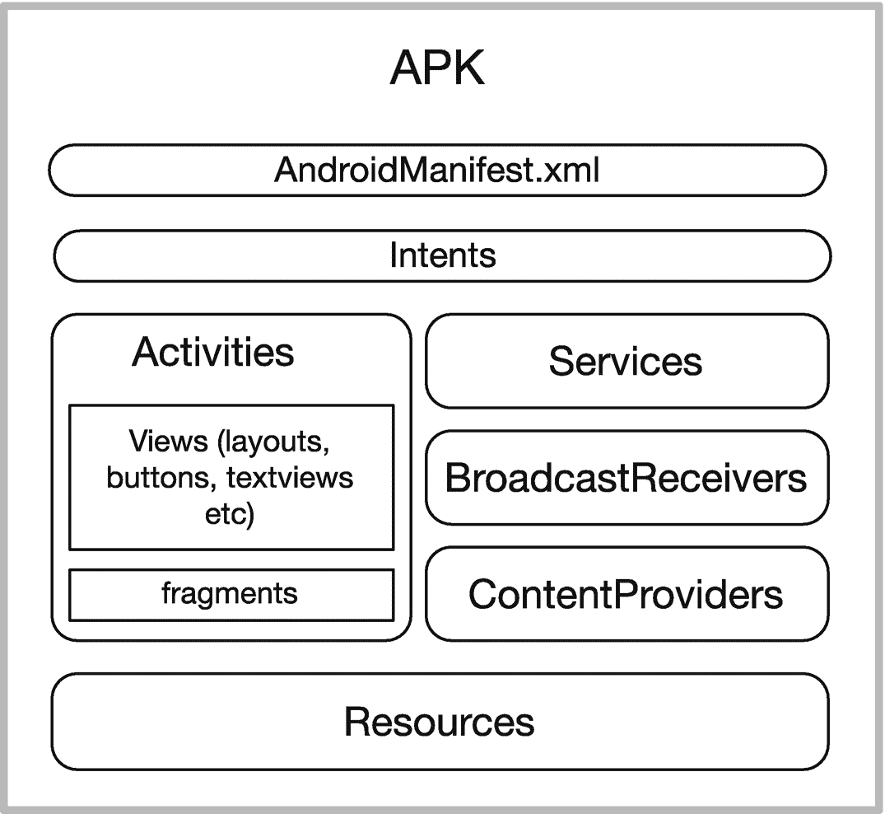

图 9-1

什么构成了一个应用

图 9-1 中描述的应用是一个大型应用——它拥有一切，包括厨房水槽。你的应用不需要包括所有这些东西，就像我们这里假设的应用；但你的肯定会包括其中一些。

活动、服务、广播接收者和内容提供者被称为 *Android 组件*。它们是应用的关键组成部分。它们是对有用事物的高级抽象，如向用户显示屏幕、在后台运行任务、广播事件以便感兴趣的应用可以响应它们等。组件是具有非常特定行为的预编码或预构建的类，我们通过扩展它们在应用中使用它们，以便我们可以添加我们的应用特有的行为。

构建一个 Android 应用很像建造一座房子。有些人用传统方式建造房屋——他们组装横梁、支柱、地板等。他们像工匠一样，用原材质手工制作门和其他配件。如果我们以这种方式构建 android 应用，可能会花费我们很长时间，而且可能会非常困难。对于一些程序员来说，从头构建应用所需的技能可能遥不可及。在 Android 中，应用是使用组件构建的。把它想象成房子的预制构件。零件是预先制造好的，只需要组装就可以了。

一个**活动**是我们把用户可以看到的东西放在一起的地方。是用户可以做的专注的事情。例如，可以有目的地使用户能够查看单封电子邮件或填写表单。它是用户界面元素粘合在一起的地方。如图 9-1 所示，活动内部有*视图*和*片段*。视图是用于将内容绘制到屏幕中的类；视图对象的一些例子是按钮和文本视图。片段类似于活动，因为它也是一个组合单元，但是更小。像活动一样，它们也可以持有视图对象。大多数现代应用使用片段来解决在多种外形上部署应用的问题。片段可以根据可用的屏幕空间和/或方向打开或关闭。

服务是允许我们在不冻结用户界面的情况下运行程序逻辑的类。服务是在后台运行的代码；当你的应用需要从网上下载文件或者播放音乐时，它们会非常有用。

**BroadcastReceivers** 允许我们的应用监听来自 Android 系统或其他应用的特定消息——是的，我们的应用可以发送消息并在系统范围内广播。例如，如果您希望在电池电量下降到 10%以下时显示警告消息，您可能希望使用 BroadcastReceivers。

ContentProviders 允许我们创建能够与其他应用共享数据的应用。它管理对某种中央数据存储库的访问。有些内容提供商有自己的用户界面，但有些没有。您使用该组件的主要原因是允许其他应用访问您的应用的数据，而无需通过一些 SQL 技巧。数据库访问的细节对他们是完全隐藏的(客户端应用)。Android 中的“联系人”应用就是一个作为内容提供者的预建应用的例子。

您的应用可能需要一些视觉或听觉素材；这些就是我们在图 9-1 中所说的“资源”。

AndroidManifest 顾名思义——它是一个清单，并且是 XML 格式的。它声明了关于应用的一些事情，比如

*   应用的名称

*   当用户启动应用时，哪个活动将首先显示

*   app 里有什么样的组件。如果它有活动，清单会声明它们——类名和所有的名称。如果应用有服务，它们的类名也将在 manifest 中声明。

*   这个应用可以做哪些事情？它的权限是什么？允许上网还是相机？它能记录 GPS 位置吗？等等。

*   它使用外部库吗？

*   此应用将在哪个(些)版本的 Android 上运行？

如你所见，舱单是一个繁忙的地方，有很多事情要留意。不过这个文件不用太担心。AS3 的创建向导会自动处理这里的大部分条目。为数不多的几个与它交互的场合之一可能是当你需要给你的应用添加权限的时候。

### 组件激活

Android 热衷于松散耦合。应用只是由清单文件保存在一起的组件的集合。这些组件中的每一个都可以通过向其发送消息来激活。这种程序交互性的方法非常独特，因为它非常以用户为中心。它赋予用户很大的权力来选择如何操作和创建数据。

让我们举一个 Android 设备的常见使用场景。例如，用户打开“联系人”应用并选择 John Doe 的联系人详细资料。比方说，这个联系人可能有一个电子邮件地址、一部手机和一个 twitter 用户名。用户可以点击 John 的每一个联系点，每次，Android 都会启动一个不同的应用；默认的电子邮件客户端、拨号器和下载的 Twitter 应用。用户可能不关心启动了哪个应用或者当前打开了多少个应用；他只是想传达一个信息。如果这位用户不喜欢电子邮件应用或默认的 twitter 客户端，他可以删除这些应用，并用其他东西替换它们，他应该会回到业务中。

为了实现这种程序交互，Android 需要设计平台，重点关注松散耦合和可插拔性。像联系人应用这样的组件不应该知道当电子邮件地址或手机号码被窃听时应该使用什么应用的任何具体细节。用于特定类型数据的应用的解决方案不应硬连线到联系人应用中；否则，用户将无法在发送电子邮件或推文时选择使用哪个应用。

这就是意图的来源。当一个组件拥有超出其服务能力的数据或信息时，它可以使用 Intents 访问 Android 平台，并询问是否有任何应用能够(或想要)满足请求。有两种意图:隐含的和明确的。我们在电子邮件和 twitter 示例中讨论的意图被称为显式意图。我们将在后面的章节中更深入地探讨这一点。

Android Intents 是一种组件激活机制。它们是一种消息传递机制，如果您想要激活任何 Android 组件，无论是活动、服务、内容提供者还是广播接收者，都可以使用。要激活任何组件，您需要创建一个意图，并将其传递给想要激活的组件。在具有多个活动的应用中，意图用于将控制或焦点从一个活动切换到另一个活动。

## 创建项目

现在，我们对 Android 应用内部有了一些工作思路，让我们尝试创建一个示例项目并试用 ide。如果 AS3 还没有打开，就启动它。图 9-2 为 Android Studio 3 的欢迎画面。

点击“开始一个新的 Android Studio 项目”，如图 9-2 所示。检查一下你是否有互联网连接可能是个好主意。AS3 使用 Gradle 构建工具；当创建向导完成时，Gradle 将从 internet 存储库中提取几个文件。图 9-3 显示下一个屏幕。

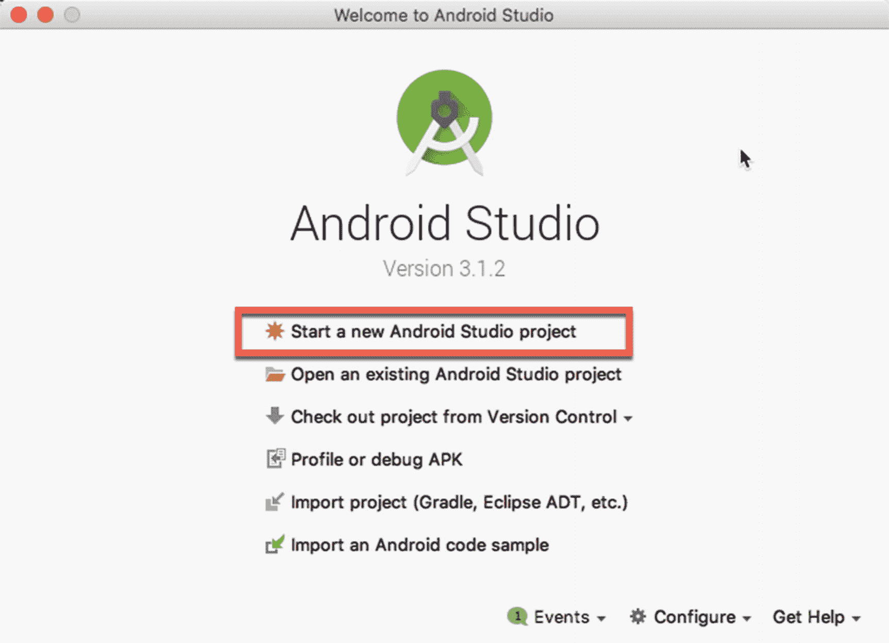

图 9-2

AS3 欢迎屏幕

如图 9-3 所示，您需要填写一些关于项目的信息(例如，应用名称、公司域名和项目位置)。应用名称的默认值是“我的应用”；您可以保留默认值。

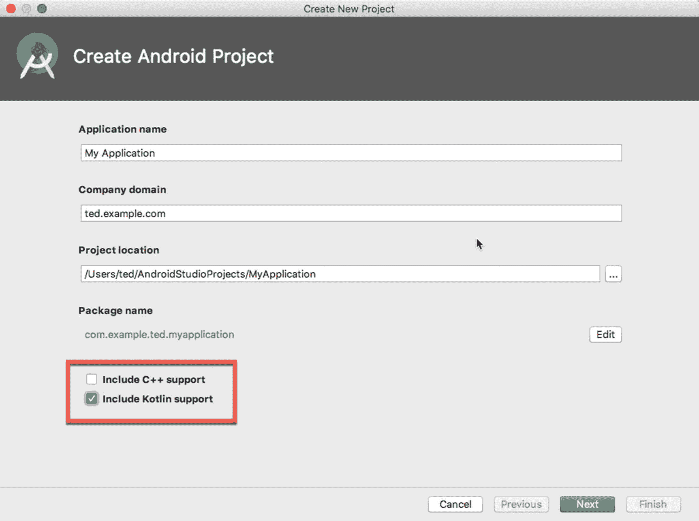

图 9-3

创建新项目

我填了公司域名；如果你愿意，你也可以。一般是你公司的网站。该信息将在项目中使用，并将成为反向 DNS 表示法中的包名。因此，我们的类将存储在名为 *com.example.ted* 的包中。

项目位置是 AS3 将存储项目的文件夹的位置。您也可以保留默认值。

启用“包含 Kotlin 支持”复选框很重要，因为我们将使用 Kotlin 作为编程语言。点击“下一步”

图 9-4 显示了下一个屏幕。在这里，您将被要求选择您的应用预期运行的 Android 版本。只勾选“手机和平板”，选择 API 23。

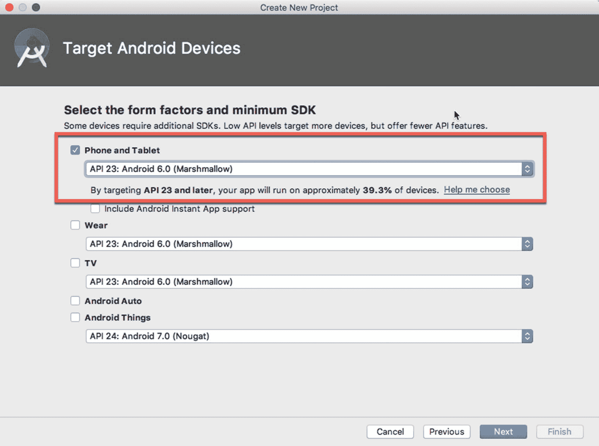

图 9-4

目标 Android 设备

图 9-5 显示下一个画面；可能会出现一个小弹出窗口，提醒您需要安装“即时应用”现在单击“否”。“即时应用”是 Google Play 的一项功能，允许用户在不安装应用的情况下使用或试用应用。如果用户喜欢这个应用，那么如果有必要，他们可以从应用商店购买。我们暂时完全忽略这一点。点击“下一步”

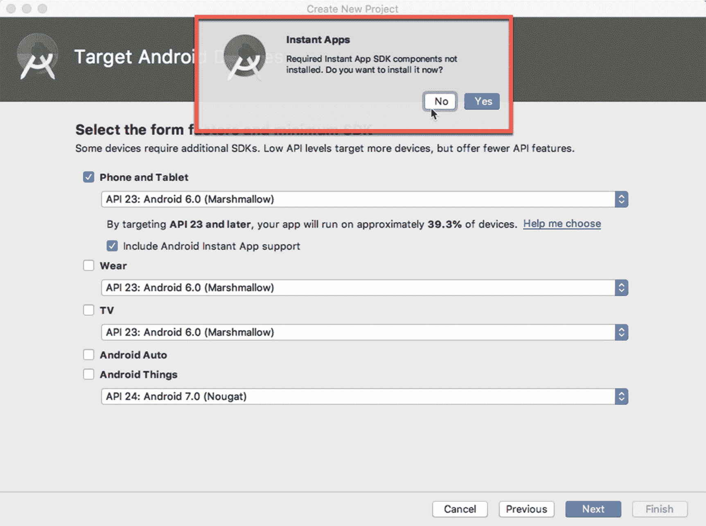

图 9-5

即时应用

在下一个屏幕上，如图 9-6 所示，我们被要求向应用添加一个活动。您有几个选择，但是对于我们的目的，选择“空活动”点击“下一步”

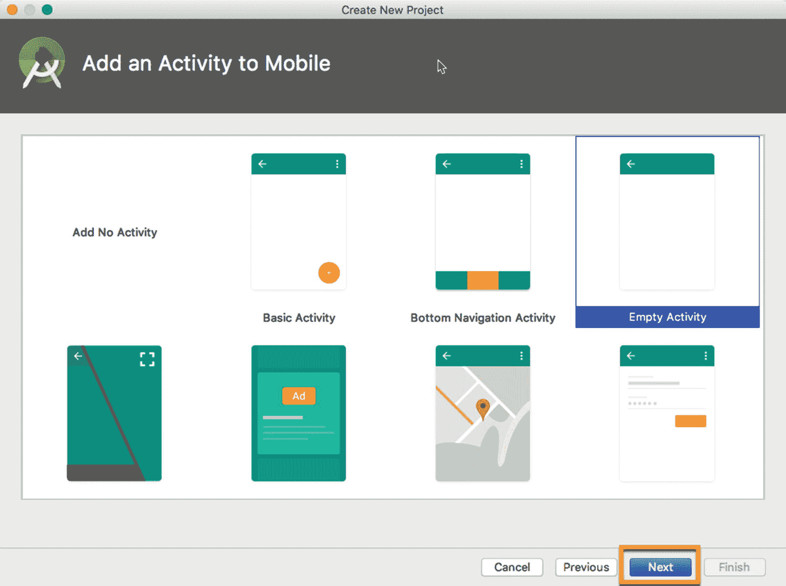

图 9-6

选择一项活动

项目创建向导的最后一个屏幕如图 9-7 所示。我们被要求填写活动名称和布局名称。我们将保留所有内容的默认值。点击“下一步”

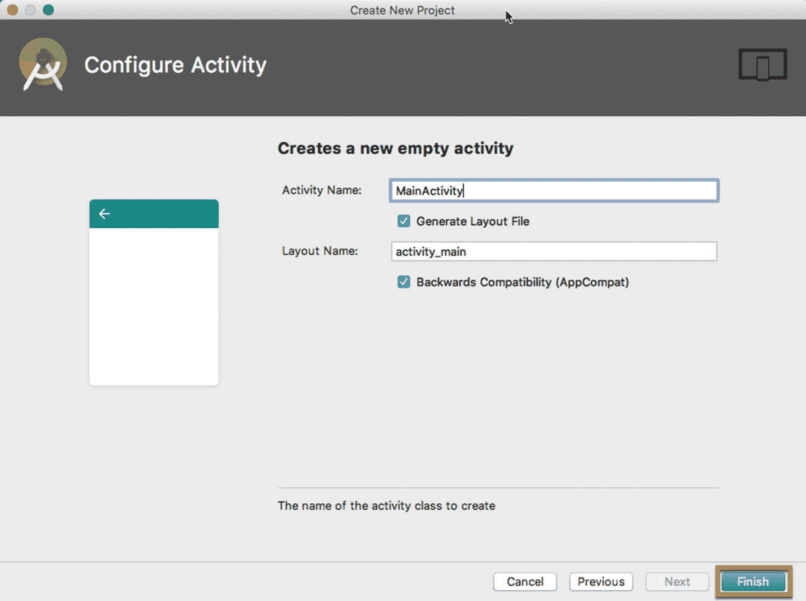

图 9-7

配置活动

图 9-8 显示了我们在 AS3 主窗口中新创建的项目。在点击图 9-7 中的“下一步”按钮后，需要一段时间事情才会尘埃落定，因为 Gradle 工具会构建项目，当它试图这么做时，它会从存储库中提取相当多的文件。

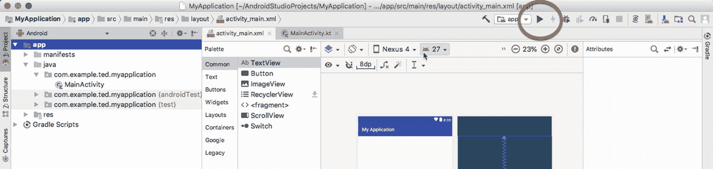

图 9-8

带有打开项目的主 AS3

我们现在不会试图改变这个项目中的任何东西。我们的目标是简单地试用 AS3，熟悉项目创建的各个步骤。项目创建向导已经生成了一个带有几个视图的活动。我们测试的下一步是在模拟器中运行项目。为此，单击工具栏中的运行图标(图 9-8 中的圆圈)。

当您点击运行图标时，将出现“选择部署目标”屏幕，如图 9-9 所示。该屏幕显示所有运行的 Android 虚拟设备(avd)。它还显示了所有连接的物理 Android 设备，如果你插入了任何设备。

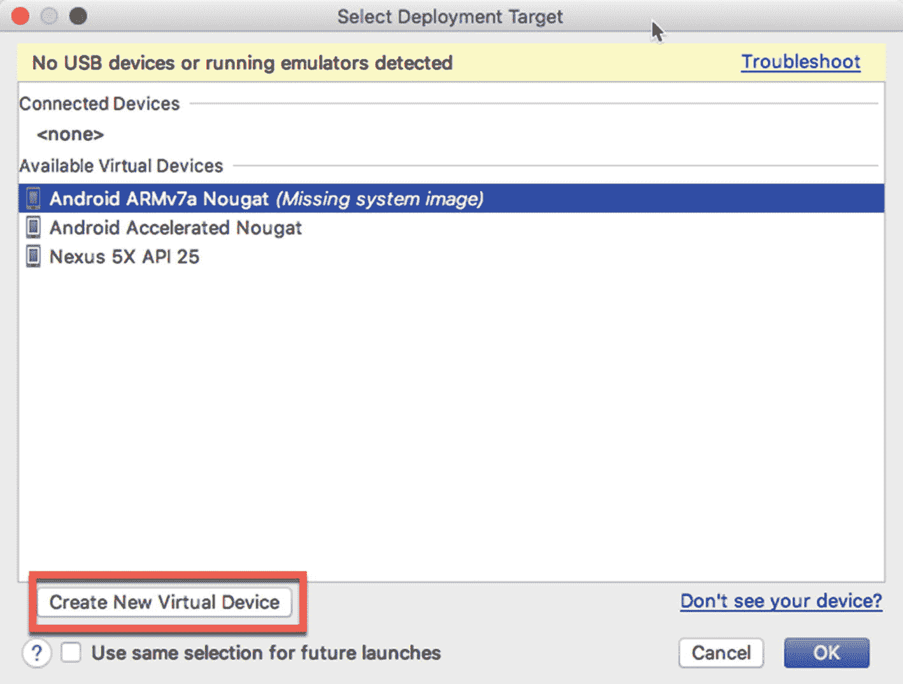

图 9-9

选择部署目标

如您所见，我已经创建了几个虚拟设备。在您的情况下，您可能看不到“可用虚拟设备”下的任何内容，因为您有一个全新的安装。单击“创建新的虚拟设备”

在图 9-10 中，您可以选择虚拟设备的外形。我选择了 Nexus 5x。点击“下一步”

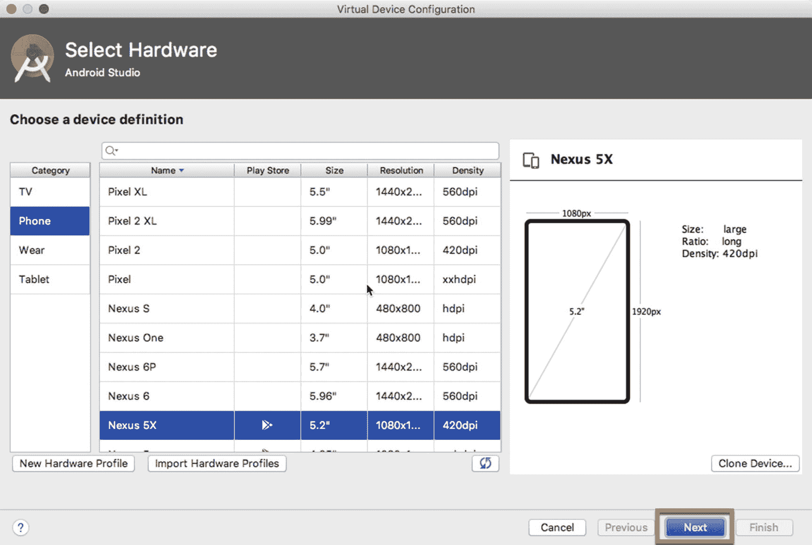

图 9-10

选择硬件

图 9-11 显示了系统映像的选项。系统映像是我们可以在模拟器上运行的 Android 操作系统的副本。我们的项目是用 API 23(“棉花糖”)的目标 SDK 值创建的。选择高于 API 23 的系统映像是可以的，但是出于我们的目的，让我们实际下载 API 23 系统映像。

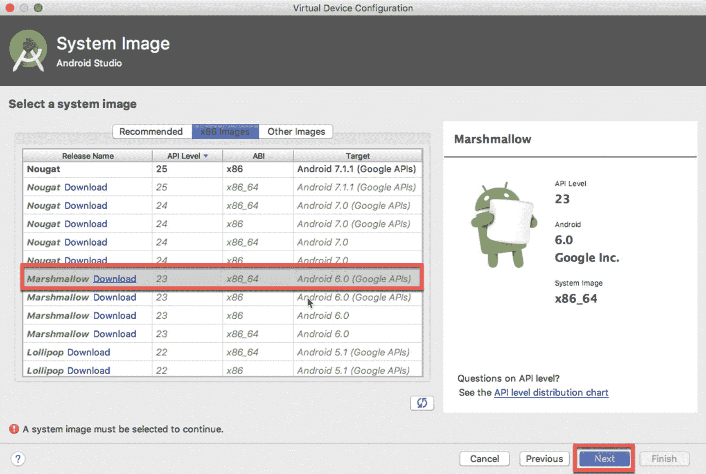

图 9-11

系统映像

点击中间标签“x86 Images”，如图 9-11 所示，使用 Google APIs 查找 API level 23，x86_64。单击“下载”链接。

图 9-12 显示了组件安装程序窗口，它显示了下载的进度。完成后，单击“完成”关闭窗口。

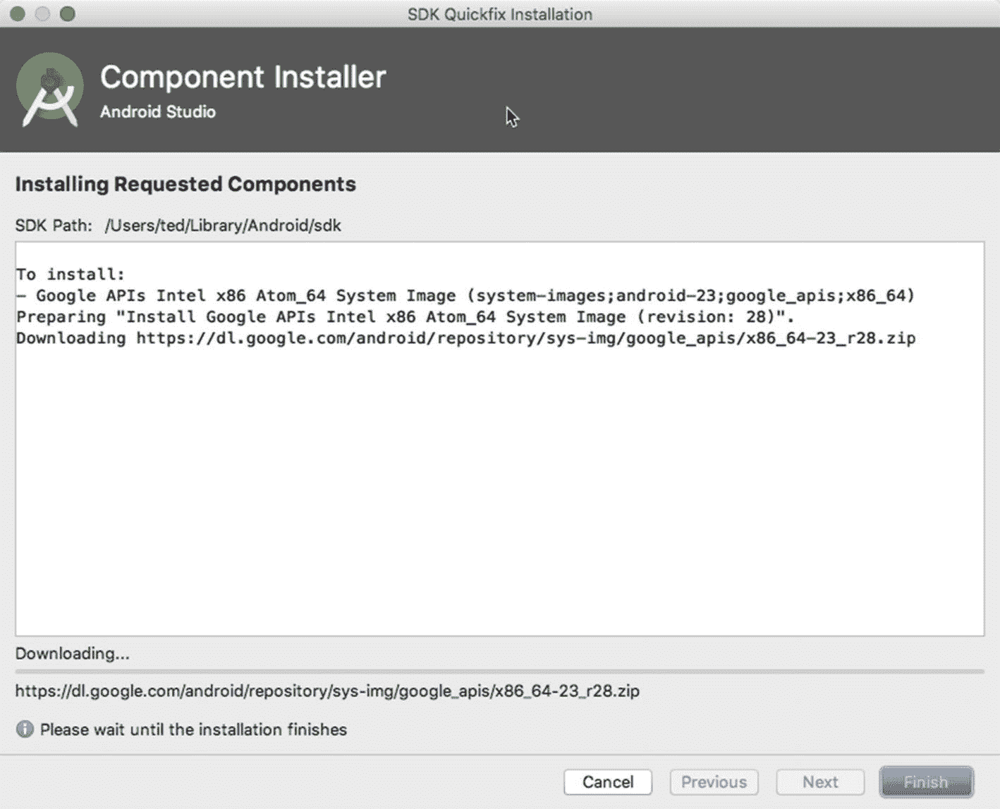

图 9-12

组件安装程序

我们再次回到系统图像窗口，如图 9-13 所示。您会注意到“棉花糖”标签旁边的“下载”链接不再可见，该行现在是可选的。当棉花糖行被选中时，点击“下一步”

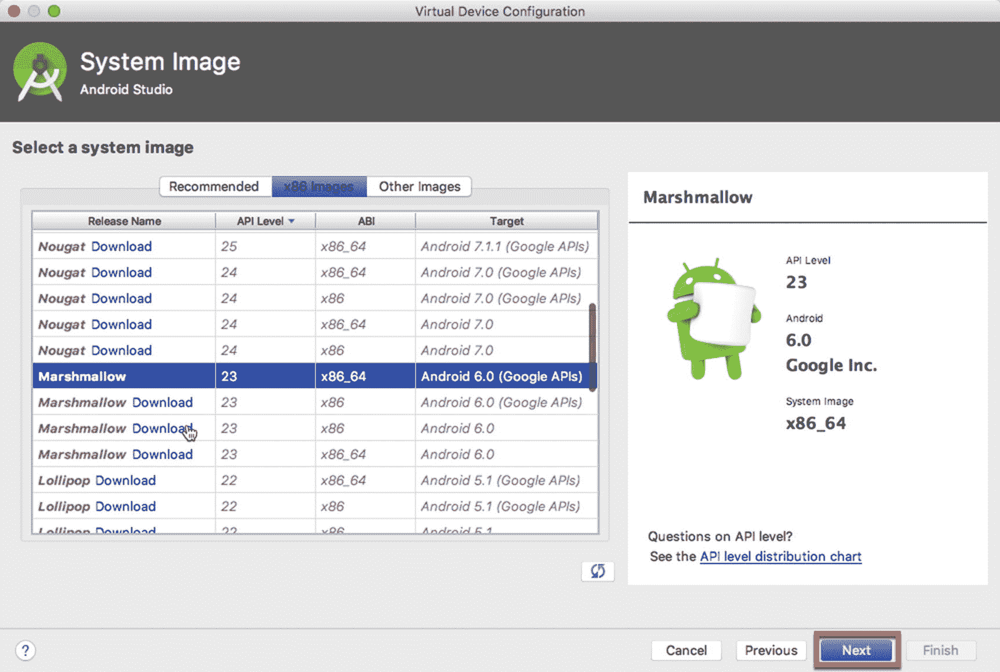

图 9-13

系统映像

图 9-14 显示了创建 AVD 的最终配置屏幕。我将保留所有的默认值，包括 AVD 名称。点击“完成”

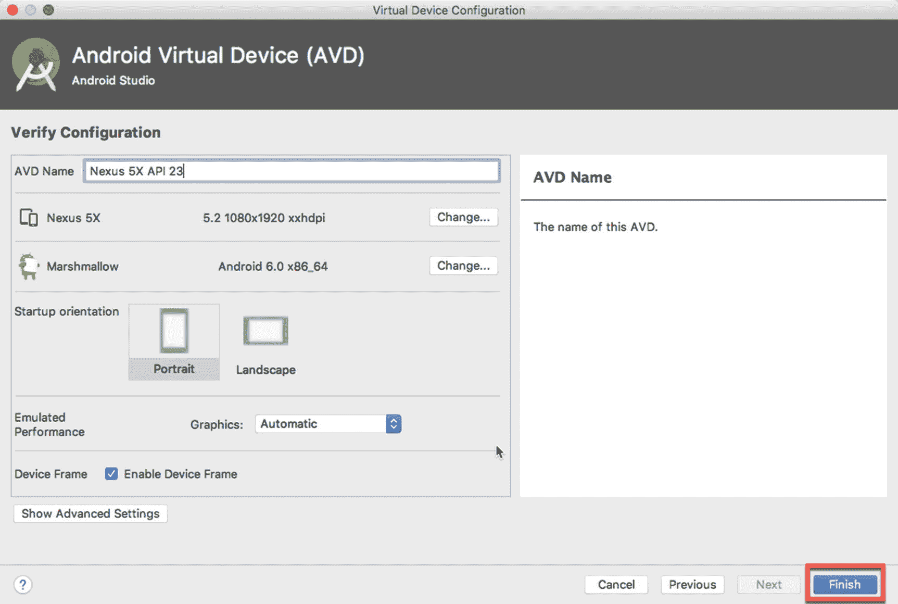

图 9-14

Android 虚拟设备

我们回到了“选择部署目标”屏幕(图 9-15 )，但这一次，我们新创建的 AVD (Nexus 5X API 23)显示在“可用虚拟设备”中选择我们刚刚创建的 AVD，然后单击“OK”

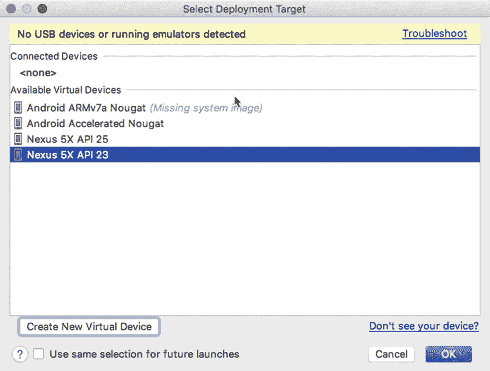

图 9-15

选择部署目标

AS3 可能会提示您安装“即时运行”，如图 9-16 所示。我们想安装这个，因为它将加快我们的开发时间。即时运行允许我们将代码更改推送到 AVD，而无需构建新的 APK。那会节省我们的时间。点按“安装并继续”

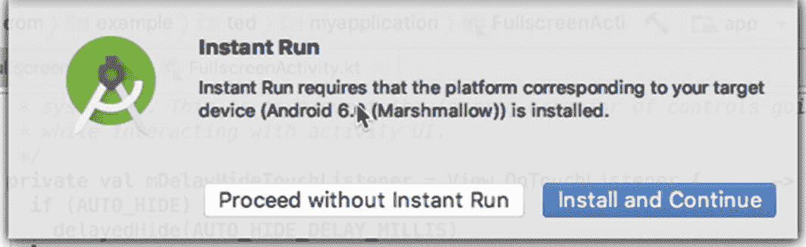

图 9-16

瞬间奔跑

AS3 将为应用创建 APK，并在之后立即将其推送到 AVD。完成后，您应该能够看到应用在 AVD 中运行，如图 9-17 所示。

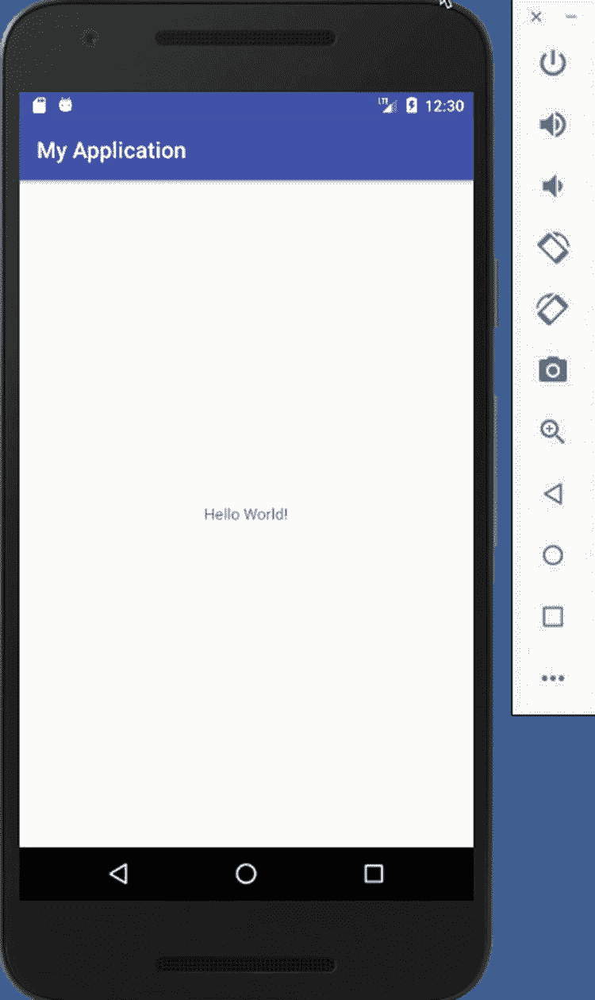

图 9-17

Android 虚拟设备

## IDE

让我们花点时间熟悉一下 IDE。在深入研究编码之前，最好先了解一些情况。Android Studio 基于 IntelliJ，我们在前面的章节中使用 IntelliJ 进行 Kotlin 研究，所以 AS3 应该看起来很熟悉。图 9-18 显示了一个打开项目的 AS3 IDE。

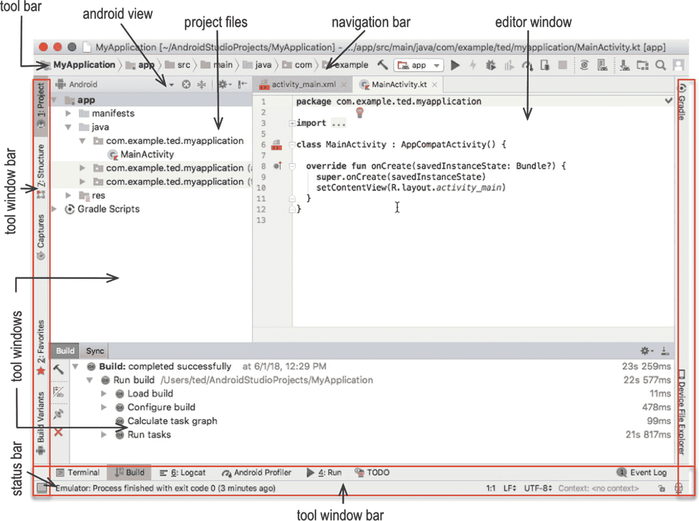

图 9-18

带有已打开项目的 AS3 IDE

**编辑器窗口**是最突出的窗口，拥有最多的屏幕空间。在编辑器窗口中，您可以创建和修改项目文件。它会根据您正在编辑的内容改变外观。如果您正在处理程序源文件，此窗口将只显示源文件。编辑布局文件时，您可能会看到原始 XML 文件或布局的可视化渲染。

Android Studio 中的每个项目都包含一个或多个带有源代码文件和资源文件的模块。模块的类型包括 Android 应用模块、库模块，有时还包括 Google 应用模块。AS3 默认在 *Android 视图*中显示**项目文件**，如图 9-18 所示。Android 视图由模块组成，提供对项目最相关文件的快速访问。您可以通过点击项目窗口顶部的向下箭头来改变查看项目文件的方式，如图 9-19 所示。

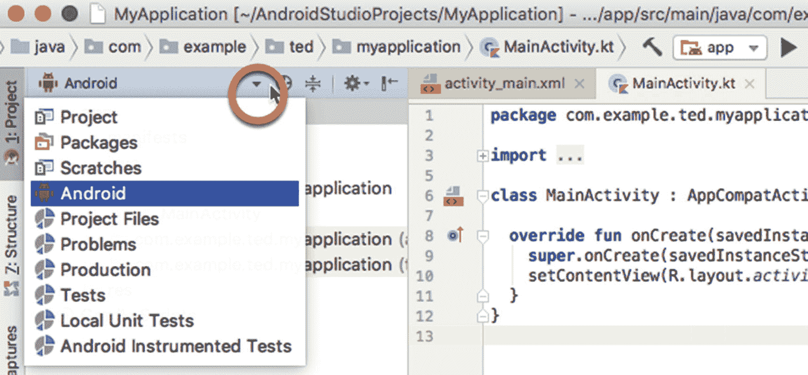

图 9-19

如何在项目窗口中切换视图

**导航栏**允许您浏览项目文件。这只是“项目文件”窗口的一个更紧凑的视图。这是一个水平排列的人字形集合，类似于一些网站上可以找到的面包屑导航。您可以通过导航栏或项目工具窗口打开项目文件。

**工具栏**允许您执行各种操作(例如，保存文件、运行应用、打开 AVD 管理器、打开 SDK 管理器、撤销、重做操作等)。).

**工具窗口**让您可以访问非常具体的任务(例如，查看项目文件、查看所有待办事项注释、查看 logcat 窗口、访问 profiler 等。).每个工具窗口都是可展开和可折叠的。你可以在需要的时候把它们打开，用完后把它们藏起来。

**工具窗口栏**沿着 IDE 窗口的周边运行。它包含激活特定工具窗口所需的各个按钮。

**状态栏**是 IDE 的一部分，显示你的项目和 AS3 本身的进展。它显示上下文相关的消息，如错误消息、正在运行的流程、存储库消息等。

### 炙单

Android Studio 提供了许多导航 IDE 的方式，但是主要的导航方式是主菜单。图 9-20 显示 AS3 主菜单；它位于 IDE 的顶部，提供了最完整的导航方式。它包含用于打开、创建项目、重构代码、运行和调试应用、将文件置于版本控制之下等等的命令。

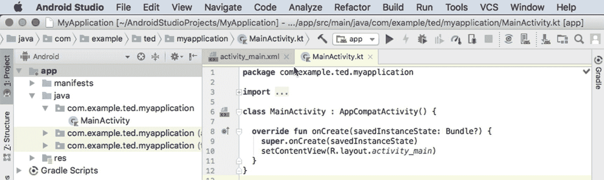

图 9-20

Android Studio 的主菜单

### 快捷键

随着应用的增长，您可能想尝试一种更快的方式来导航 AS3。这里有一些键盘快捷键让你开始。

表 9-1

一些键盘快捷键

<colgroup><col class="tcol1 align-left"> <col class="tcol2 align-left"> <col class="tcol3 align-left"></colgroup> 
| 

工作

 | 

Linux 和 Windows

 | 

苹果

 |
| --- | --- | --- |
| 在文件中搜索 | `CTRL + F` | ≤??] |
| 到处搜索 | `CTRL + Shift + F` | `+ F``+ F` |
| 全部保存 | `CTLR + S` | ≤??] |
| 覆盖方法 | `CTRL + O` | `CTRL + O` |
| 实现方法 | `CTRL + I` | `CTRL + I` |
| 基本代码完成 | `CTRL + Space` | `CTRL + Space` |
| 建设 | `CTRL + F9` | ≤??] |
| 构建并运行 | `Shift + F10` | `CTRL + R` |
| 应用更改(通过即时运行) | `CTRL + F10` | `+ R``+ R` |

表 9-1 中显示的快捷键列表明显不完整。Android 开发者网站维护着一个页面，上面有 Android Studio 键盘快捷键的完整列表；你可以在这里找到 [`http://bit.ly/androidstudiokbshortcuts`](http://bit.ly/androidstudiokbshortcuts) 。

AS3 主菜单中的某些操作或选项没有默认的键盘映射(例如，进入全屏视图)。在这种情况下，您可以将自己选择的键盘快捷键映射到菜单操作。您可以在 AS3 的*键图设置*中完成此操作。

要打开键图设置，从主菜单中选择**文件** ➤ **设置**(在 macOS 上， **Android Studio** ➤ **首选项**，导航到键图窗格，如图 9-21 所示。

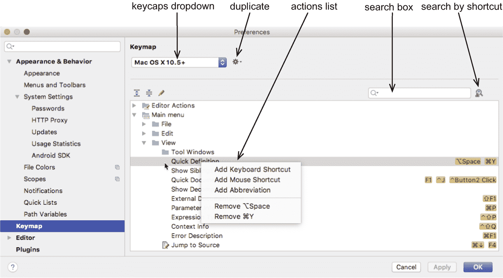

图 9-21

设置键盘映射

*   **按键映射下拉菜单**让您选择所需的按键映射，它在预设的按键映射之间切换。

*   **动作列表**。右键单击一个操作来修改它。您可以为动作添加附加的键盘快捷键，添加鼠标快捷键以将动作与鼠标单击相关联，或者移除当前快捷键。如果您正在使用预置的键映射，修改动作的快捷键将自动创建键映射的副本，并将您的修改添加到副本中。

*   您可以使用**搜索框**来搜索使用*动作名称的快捷键。*

*   **通过快捷方式**搜索。您可以在此搜索窗口中键入键盘快捷键来查找操作名称。

### 自定义代码样式

在同一个*设置*(MAC OS 中的*首选项*)窗口中，您还可以自定义编码风格和许多其他设置，如编辑器字体和配色方案等。

若要自定编码样式，请打开“偏好设置”窗口(如果它尚未打开)。在主菜单上点击**文件** ➤ **设置**(在 macOS 上， **Android Studio** ➤ **首选项**)。代码样式窗口位于首选项窗口右侧的*编辑器*菜单下，如图 9-22 所示。

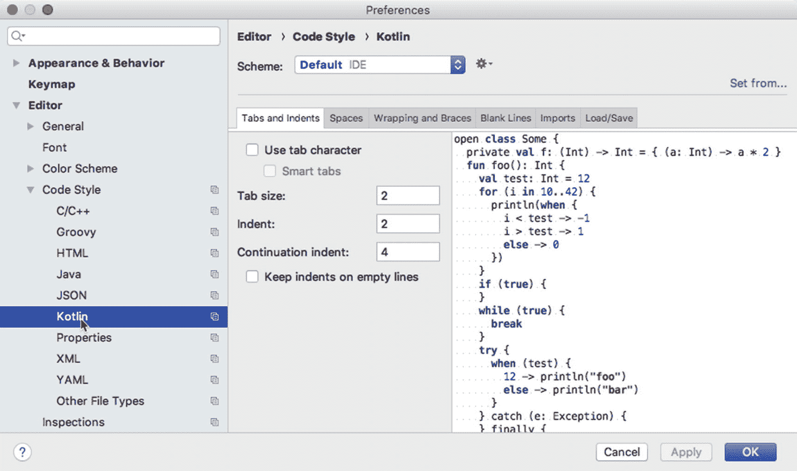

图 9-22

代码风格

现在，您可以随意调整编辑器。这些设置是不言自明的，只需根据你的喜好进行调整即可——或者，如果你在一个团队中工作，根据发布的编码风格指南来调整设置。

## 章节总结

*   Android 应用由松散组装的组件组成，这些组件由 AndroidManifest.xml 组合在一起。

*   您可以在 Android 清单文件中设置应用权限。

*   一个应用可能包含活动、服务、广播接收者和内容提供者等组件的组合。

*   组件使用意图相互通信。

在下一章，我们将开始研究如何用活动和布局来构建用户界面。我们将了解 Android 如何使用 XML 作为布局资源，以及这些 XML 资源如何在运行时使用名为 inflation 的过程转换并呈现为对象，等等。