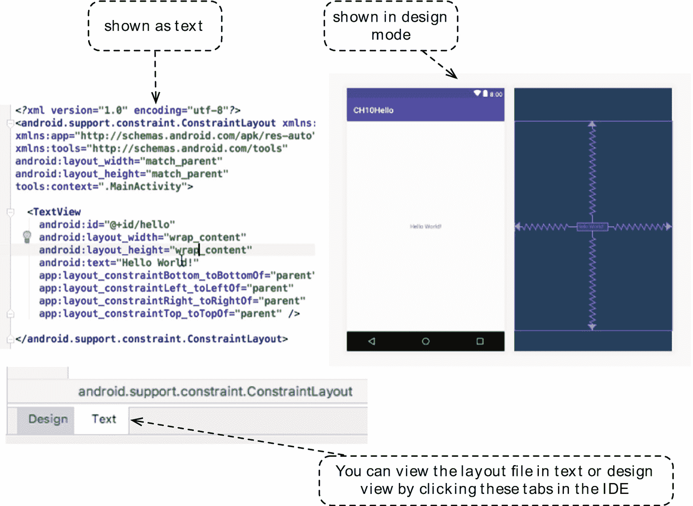

# 十、活动和布局

*我们将介绍的内容:*

*   活动和布局

*   查看和查看组对象

*   活动生命周期

*   Kotlin Android 扩展

大多数程序需要一个入口点或一个开始例程，所有的执行都从那里开始。即使是前面例子中简单的“Hello World”也需要一个主函数作为入口点。安卓程序也一样，它也需要自己版本的“功能主”但是 Android 程序的入口点不仅仅是一个名为“main”的函数——它比这个函数要复杂一些。在这一章中，我们将探索一个基本应用的结构。我们将看看如何建立一个用户界面，并发现是什么让他们滴答作响。

## 应用入口点

一个简单的向用户显示屏幕的应用至少需要三样东西。它需要(1)一个充当主程序文件的活动类；(2)包含所有 UI 定义的布局文件；以及(3)清单文件，它将项目的所有内容联系在一起。如果你还记得使用 JavaBean 的 manifest 文件，Android manifest 有点像。它描述了项目的内容。

当应用启动时，Android 运行时会创建一个 Intent 对象并检查清单文件。它在寻找`intent-filter`节点的特定值；运行时试图查看应用是否有定义的入口点，类似于“主函数”清单 10-1 显示了清单文件的摘录。

```kt
<activity android:name=".MainActivity">
 <intent-filter>
   <action android:name="android.intent.action.MAIN" />
   <category android:name="android.intent.category.LAUNCHER" />
 </intent-filter>
</activity>

Listing 10-1Excerpt from AndroidManifest.xml

```

清单 10-1 显示了一个活动的声明。如果应用有多个活动，你会看到几个定义，如清单 10-1——每个活动一个定义。定义的第一行有一个名为`android:name`的属性。该属性指向活动的类名。在这个例子中，类的名称是“MainActivity”

第二行声明了*意图过滤器*；当您在 intent-filter 节点上看到类似于`android.intent.action.MAIN`的内容时，这意味着该活动是应用的入口点。当应用启动时，这是将与用户交互的活动。

### 活动类别

主活动类负责与用户的初始交互。这是一个 Kotlin 类，在这个类中，我们可以并且经常做以下事情:

*   选择要使用的 UI 文件。当我们从活动内部调用`setLayout(xml:file)`函数时，它会将活动绑定到 xml:file。这被称为“布局绑定”当活动绑定到布局时，屏幕上将充满用户可以触摸或滑动的用户界面元素。

*   获取视图对象的引用。视图对象也称为小部件或控件。当我们有一个对视图对象的编程引用时，我们可以操作它们，改变它们的属性，或者将它们与一个事件相关联。这被称为*视图绑定。*

Activity 类以某种方式继承了 android.app.Activity。在我们的例子中，它们继承自 AppCompatActivity 这是 FragmentActivity 的子元素，而后者又是 android.app.Activity 的子元素。我们使用 appcompactivity 类，这样我们就可以将工具栏等现代 UI 元素放在我们的项目中，并且仍然可以在旧版本的 android 上运行它们，否则工具栏将不受支持——因此，appcompactivity 的名称中有“Compat”。

当运行时启动一个最终会启动一个活动的应用时，它会创建并跟踪该活动发生了什么。每个活动都有一个非常完整的生命周期，每个生命周期事件都有一个关联的函数，我们可以用它来定制应用的行为。

图 10-1 显示了活动生命周期的各个阶段。每个方框显示了特定存在阶段的活动状态。函数调用的名称嵌入在连接阶段的方向箭头中。


图 10-1

活动生命周期

当运行时启动应用时，它调用主活动的`onCreate()`函数，这将使活动的状态变为“已创建”。您可以使用此函数执行初始化例程，如准备事件处理代码等。

活动将进行到下一个状态，即“已开始”；此时，用户可以看到活动，但是还不能进行交互。下一个状态是“恢复”；这是应用与用户交互的状态。

如果用户单击任何可能启动另一个活动的东西，运行时将暂停当前活动，并进入“暂停”状态。从那里，如果用户返回到活动，调用`onResume()`函数，活动再次运行。另一方面，如果用户决定打开一个不同的应用，运行时可能会“停止”并最终“破坏”该应用。

### 布局文件

布局文件包含以 XML 层次结构排列的视图对象。像按钮或文本字段这样的用户界面元素是在 XML 文件中编写的。一些人可能会害怕只使用 XML 编辑器手工编写 UI。但是你不必担心，因为 AS3 使得用户界面的构建变得很容易。我们可以在文本模式(手工编辑 XML)下使用布局文件，也可以在设计模式(WYSIWYG)下使用它。

图 10-2 显示了以两种可能模式显示的布局文件:文本模式和设计模式。您可以通过点击主编辑器窗口左下方的“文本”或“设计”选项卡来切换模式。当您通过编辑 XML 来更改元素时，AS3 会自动更新设计视图的呈现。同样，当您在设计视图中进行更改时，XML 文件也会更新。



图 10-2

以文本和设计模式显示的布局文件

清单 10-2 显示了一个典型的布局文件。如果您选择创建一个“空”活动，那么这就是项目创建向导将产生的结果。

```kt
<?xml version="1.0" encoding="utf-8"?>
<android.support.constraint.ConstraintLayout xmlns:android=http://schemas.android.com/apk/res/android
  xmlns:app=http://schemas.android.com/apk/res-auto
  xmlns:tools=http://schemas.android.com/tools
  android:layout_width="match_parent"
  android:layout_height="match_parent"
  tools:context=".MainActivity">

  <TextView
    android:layout_width="wrap_content"
    android:layout_height="wrap_content"
    android:text="Hello World!"
    app:layout_constraintBottom_toBottomOf="parent"
    app:layout_constraintLeft_toLeftOf="parent"
    app:layout_constraintRight_toRightOf="parent"
    app:layout_constraintTop_toTopOf="parent" />

</android.support.constraint.ConstraintLayout>

Listing 10-2activity_main.xml

```

一个简单的布局文件通常有两个部分:一个容器的声明和其中每个 UI 元素的声明。在清单 10-2 中，第二行(也是 XML 文档的根)是容器的声明。TextView 元素被声明为容器的子节点。这就是容器和 UI 元素在布局文件中的排列方式。

### 查看和查看组对象

视图对象是一个组合单元。通过将一个或多个视图对象并排排列，或者有时相互嵌入，可以构建一个 UI。Android 库定义了两种视图，一个“视图”和一个“视图组”。按钮或文本字段就是视图对象的一个例子。这些对象旨在与其他视图一起组成，但它们并不包含子视图，而是独立存在的。另一方面，视图组可以包含子视图——这就是它们有时被称为容器的原因。

图 10-3 显示了一些更常见的 UI 元素的类层次结构。用户界面中的每一项都是 *android.view.View* 类的子类。我们可以使用 Android SDK 中预先构建的用户界面元素，如 TextView、Button、ProgressBars 等。或者，如果需要，我们可以构造自定义控件(窗口小部件或视图有时被称为“控件”)，方法是:( 1)对现有元素(如 TextViews)进行子类化；(2)子类化视图类本身，完全从零开始绘制一个自定义小部件；或者(3)细分视图组并在其中嵌入其他小部件——这就是所谓的*复合视图*(图 10-3 中的单选按钮组就是一个例子)。


图 10-3

视图组类层次结构

每个视图对象最终都会在运行时变成一个 Java 对象，但是我们在设计时将它们作为 XML 元素来处理。我们不必担心 Android 如何将 XML 膨胀成 Java 对象，因为这个过程对我们来说是不可见的——它发生在幕后。图 10-4 显示了 Android 编译过程的逻辑表示。


图 10-4

Android 编译过程

Kotlin 编译器将程序源文件转换成 Java 字节码。产生的字节码与 Kotlin 标准库结合形成一个 DEX 文件。DEX 文件是 Dalvik 可执行文件——它是 Android 运行时(ART)理解的可执行文件格式。在 dex 文件和其他资源被打包到 Android 包(APK)之前，它还产生了一个名为“R.class”的特殊文件。我们使用 R.class 来获取对我们在布局文件中定义的 UI 元素的程序引用。

### 容器

除了创建复合视图，ViewGroup 类还有另一个用途。它们是布局管理器的基础。布局管理器是一个容器，负责控制子视图在屏幕上相对于容器和彼此的位置。Android 自带了几个预置的布局管理器。表 10-1 向我们展示了其中的一些。

表 10-1

布局经理

<colgroup><col class="tcol1 align-left"> <col class="tcol2 align-left"></colgroup> 
| 

**布局管理器**

 | 

**描述**

 |
| --- | --- |
| 线形布局 | 根据选定的方向，将小工具定位在单行或单列中。可以为每个微件分配一个权重值，该权重值决定了该微件相对于其他微件所占用的空间量。 |
| 表格布局 | 以行和列的网格格式排列小部件 |
| 框架布局 | 将子视图堆叠在一起。XML 布局文件的最后一个条目是堆栈顶部的条目。 |
| 相对布局 | 通过在每个视图上指定对齐方式和边距，可以相对于其他视图和容器定位视图。 |
| 约束布局 | ConstraintLayout 是最新布局。它还相对于彼此和容器定位小部件(如 RelativeLayout)。但是它不仅仅使用对齐和边距来完成布局管理。它引入了“约束”对象的概念，将小部件锚定到目标上。这个目标可以是另一个小部件或容器；或者另一个定位点。这是我们将在本书中的大多数例子中使用的布局。 |

现在我们已经有了一些关于活动和布局的工作知识，让我们在下一节中在代码级别探索它们。

## 你好世界

让我们创建一个包含空活动的新应用。如果你想继续进行代码示例，项目信息如表 10-2 所示。

表 10-2

Hello 应用的项目信息

<colgroup><col class="tcol1 align-left"> <col class="tcol2 align-left"></colgroup> 
| 

**项目明细**

 | 

**值**

 |
| --- | --- |
| 应用名称 | 你好 |
| 公司域 | 使用您的网站名称 |
| Kotlin 支架 | 是 |
| 波形因数 | 仅限手机和平板电脑 |
| 最低 SDK | API 23 棉花糖 |
| 活动类型 | 空的 |
| 活动名称 | 主要活动 |
| 布局名称 | 活动 _ 主要 |

创建项目时，您会在项目窗口中看到一堆文件，但我们只对三个感兴趣。图 10-5 显示了(1)主程序文件的位置；(二)载货清单；以及(3)项目文件窗口中的主布局文件。


图 10-5

CH10Hello 项目

名为 *activity_main.xml* 的主布局文件位于 *app ➤ res ➤布局*文件夹中。所有用户界面元素都写在布局文件中。

主程序文件 *MainActivity.kt* 位于 *app ➤ java ➤包名*文件夹中。这是 Kotlin 文件，包含扩展 Android 活动的类。如果你想对用户生成的事件做出反应，这里就是我们编写程序逻辑的地方。不要被“java”文件夹所迷惑，所有的源文件，不管是 java 还是 Kotlin，都存储在“Java”文件夹中。没有“Kotlin”文件夹。

清单文件向 Android 构建工具描述了关于应用的基本信息:Android OS 和 Google play。看图 10-5 ，好像清单文件在 *app ➤清单➤ AndroidManifest.xml* 里。你需要记住，我们看到的是项目窗口的“Android 视图”。它是项目文件的逻辑表示，而不是文件相对于项目根文件夹的文字排列。如果想查看项目文件的实际位置，切换到“项目视图”，如图 10-6 所示。


图 10-6

CH10Hello，在项目视图中

项目视图显示了所有项目文件的实际位置。它看起来比“Android 视图”要忙得多，但是如果你需要定位项目下的任何文件，这个视图会很有用。现在我们可以回到“Android 视图”，这是我们将在本书的大部分内容中使用的。

让我们仔细看看生成的布局和 MainActivity 文件。代码分别显示在清单 10-3 和 10-4 中。

<colgroup><col class="tcol1 align-left"> <col class="tcol2 align-left"></colgroup> 
| -什么 | 布局文件的根节点，它也声明哪种布局管理器是有效的。在这种情况下，我们使用约束布局管理器 |
| ➋ | TextView 对象的声明。它是布局管理器的子节点。 |
| ➌ | 定义 TextView 对象的约束之一。它说，在文本视图的底部有一个锚点，它锚定在容器的底部。 |

```kt
<?xml version="1.0" encoding="utf-8"?>
<android.support.constraint.ConstraintLayout ➊
xmlns:android="http://schemas.android.com/apk/res/android"
xmlns:app="http://schemas.android.com/apk/res-auto"
xmlns:tools="http://schemas.android.com/tools"
android:layout_width="match_parent"
android:layout_height="match_parent"
tools:context=".MainActivity">

  <TextView                          ➋
    android:id="@+id/hello"
    android:layout_width="wrap_content"
    android:layout_height="wrap_content"
    android:text="Hello World!"
    app:layout_constraintBottom_toBottomOf="parent" ➌
    app:layout_constraintLeft_toLeftOf="parent"
    app:layout_constraintRight_toRightOf="parent"
    app:layout_constraintTop_toTopOf="parent" />

</android.support.constraint.ConstraintLayout>

Listing 10-3activity_main.xml

```

```kt
package com.example.ted.ch10hello

import android.support.v7.app.AppCompatActivity
import android.os.Bundle

class MainActivity : AppCompatActivity() {

  override fun onCreate(savedInstanceState: Bundle?) { ➊
    super.onCreate(savedInstanceState)
    setContentView(R.layout.activity_main) ➋
  }

Listing 10-4MainActivity.Kt

```

`}`

<colgroup><col class="tcol1 align-left"> <col class="tcol2 align-left"></colgroup> 
| -什么 | 第一个活动生命周期方法。运行时可能会也可能不会将一个`Bundle`对象传递给函数。bundle 对象通常包含以前活动状态的数据(例如，当您从用户处收集数据时，您可能希望在活动达到“暂停”状态时将它们保存在 Bundle 中，这样，如果用户被打断(通常是被另一个活动打断)，您就不必要求用户再次输入数据，因为数据已经在 Bundle 中了)。 |
| ➋ | `setContent()`函数将这个活动绑定到一个特定的布局文件。“R”类是在 Android 构建过程中由 *aapt* 工具生成的；它包含了对我们在 *app ➤ res* 文件夹中声明的所有内容的编程引用。在这个声明中，我们将主活动。带`R.layout.activity_main.`的 Kt |

既然我们知道了项目向导给了我们什么，让我们对应用进行更改。

### 修改 Hello World

我们将对布局文件和活动进行一些小的修改。我们将执行以下操作:

1.  更改当前 TextView 控件中的文本。

2.  在屏幕上添加一个按钮，我们将把按钮放在文本视图的正下方。

3.  向活动添加一个功能。该函数将递增 TextView 的当前值。

4.  我们将把我们的新函数与按钮关联起来，这样我们每次单击按钮，TextView 的值都会增加 1。

图 10-7 显示了我们项目在 AS3 内部的总体布局。目前，我们正在设计模式下查看 activity_main.xml。在这种模式下，我们可以看到视图面板、设计图面和蓝图面。


图 10-7

设计视图中显示的 CH10Hello

要添加一个按钮控件，请将按钮从视图面板拖放到设计图面，如图 10-8 所示——您也可以将其拖放到蓝图图面中，这样也可以。


图 10-8

从视图选项板拖放控件

按钮控件还没有任何约束，因为我们没有把任何。向设计图面添加控件时，不会自动添加约束。TextView 有约束，因为它是在我们创建项目时由向导生成的。图 10-9 显示了我们当前项目的运行时和设计时再现。


图 10-9

无约束按钮

Hello TextView 很好地位于屏幕中央，因为它有四个锚点(约束)。该按钮在设计时出现在 Hello 文本的正下方，但在运行时，它位于屏幕的位置 0，0(左上角)，这是控件在运行时没有约束时的定位方式。

让我们重新开始。移除设计图面中所有现有的约束。您可以通过选择所有控件并单击“清除约束”按钮来完成此操作，如图 10-10 所示。


图 10-10

清除约束

移除所有约束后，按照您希望控件在运行时出现的方式在设计图面上重新定位控件。接下来，再次选择所有控件，方法是在控件周围单击并拖动鼠标。

要“神奇地”为我们的控件添加所有约束，单击“推断约束”，如图 10-11 所示。AS3 将尽力猜测控件所需的约束，这些约束将与您在设计图面中的排列相匹配。


图 10-11

推断约束

可以在“属性”窗口中设置控件的属性。我们需要改变文本视图和按钮控件的一些属性。当在设计界面中选择一个对象时，该对象的属性会出现在属性窗口中，如图 10-12 所示。


图 10-12

属性窗口

“属性”窗口包含选定视图对象的所有属性，但默认情况下不会显示所有属性。它只显示我们常用的属性。要查看所有属性，点击“查看所有属性”按钮，如图 10-12 所示。

将 TextView 的“ID”属性改为“textHello”，如图 10-12 所示。接下来，将“textApperance”更改为“Material”。大”——您必须在属性窗口中向下滚动一点，这样才能看到“textApperance”属性。

视图对象的 ID 属性很重要，因为它使视图对象可以从我们的代码(Activity 类)中访问。

我们需要更改的下一个属性是按钮的 onClick 属性。选择按钮，然后找到“onClick”属性。您可能需要显示按钮的所有属性并向下滚动，直到看到 onClick 属性。


图 10-13

按钮的 onClick 属性

在按钮的 onClick 属性中键入“addNumber”，如图 10-13 所示。这个动作会将按钮的 click 事件关联到 MainActivity 类中的`addNumber()`函数。当然，我们还没有写函数，但是没关系，因为我们很快就会实现它。

我们已经完成了布局文件中的工作。现在我们可以在 MainActivity 类上工作了。打开主活动。Kt 并进行如下修改，如清单 10-5 所示。

```kt
class MainActivity : AppCompatActivity() {

  override fun onCreate(savedInstanceState: Bundle?) {
    super.onCreate(savedInstanceState)
    setContentView(R.layout.activity_main)

    findViewById<TextView>(R.id.textHello).text = "1"

  }
}

Listing 10-5MainActivity.Kt

```

这里没有惊喜。`onCreate()`函数中的最后一条语句获取对 textHello 对象的引用，并将 text 属性设置为“1”这已经是很大的进步了。请记住，在 Java 中，这条语句看起来像清单 10-6 。

```kt
TextView helloText = (TextView) findViewById(R.id.textHello);
helloText.setText("1")

Listing 10-6How to Set a Property During Runtime, in Java

```

在 Kotlin 中，我们得到了很好的 getter 和 setter 语法糖。但是我们仍然可以削减一些锅炉板代码。AS3 自动带有 Kotlin Android Extensions 插件，每当创建一个新项目时，它已经在模块级的“build.gradle”文件中声明。图 10-14 显示了 build.gradle 文件及其内容。


图 10-14

build.gradle，模块级

Gradle 已经取代 Apache Ant 成为构建工具。你通常不需要改变 gradle 文件中的任何内容，因为默认内容在大多数情况下都很好。

回到代码，清单 10-7 显示了 MainActivity 的完整程序。Kt，它实现了每当单击按钮时递增 textHello 值的逻辑。

<colgroup><col class="tcol1 align-left"> <col class="tcol2 align-left"></colgroup> 
| -什么 | 该语句导入了 Kotlin Android 扩展。您可能不需要自己输入——AS3 会在尝试使用视图对象的 ID 进行视图绑定时自动添加它。 |
| ➋ | 我们不用再用`findViewById()`了；我们甚至不必使用 R.class 来限定视图对象的 ID。Android Kotlin 扩展将视图暴露给我们的代码，少了很多仪式。这将产生更加清晰的代码。还要注意，我们得到了 Kotlin 添加的良好的 getter 和 setter 语法。 |
| ➌ | `addNumber()`功能与按钮控件的 *onClick* 事件相关联。该函数是一个*事件处理程序*——当点击按钮时，该函数将被调用。它需要接受一个`View`对象作为参数，因为这是事件处理程序的要求。该函数需要能够访问引发事件的视图对象。 |
| -你好 | `textHello.text`以 CharSequence 类型返回 textHello 的当前值。`toString()`将其转换为字符串类型，我们可以使用`toInt()`函数将其转换为 Int 类型。我们需要 Int 形式的值，因为我们将在数学运算中使用它。 |
| ➎ | 该语句将 textHello 的 text 属性设置为一个新值。 |

```kt
import android.support.v7.app.AppCompatActivity
import android.os.Bundle
import android.view.View
import android.widget.TextView
import kotlinx.android.synthetic.main.activity_main.* ➊

class MainActivity : AppCompatActivity() {

  override fun onCreate(savedInstanceState: Bundle?) {
    super.onCreate(savedInstanceState)
    setContentView(R.layout.activity_main)

    textHello.text = "1" ➋

  }

  fun addNumber(v: View) {  ➌
    val currVal = textHello.text.toString().toInt() ➍
    val nextVal = currVal + 1
    textHello.text = nextVal.toString() ➎
  }
}

Listing 10-7MainActivity.Kt

```

完成编辑后，在 AVD 上运行应用。图 10-15 显示了在仿真器上运行的项目。


图 10-15

运行在模拟器上的 CH10Hello

## 章节总结

*   Android 应用的入口点需要三个文件:清单文件、布局文件和活动类

*   AndroidManifest 文件声明了 Android 项目的所有内容。清单可以指定一个活动类作为应用的入口点。

*   布局文件描述了屏幕的 UI 结构。每个元素都被描述为一个 XML 节点，但是 XML 文件在运行时是膨胀的。膨胀过程产生 UI 元素的 Java 对象表示。

*   所有 UI 元素都继承自 android.view.View 类。

*   复合视图可以通过从 ViewGroup 类继承来构造。

*   布局管理器提供了在屏幕上排列 UI 元素的方法。Android SDK 有大量预置的管理器，我们可以开箱即用。

*   Kotlin Android 扩展允许我们通过公开视图元素的属性和功能来简化视图绑定代码。我们不再需要使用 findViewById。

在下一章中，我们将学习如何:

*   使用一些基本的视图元素，如按钮和吐司

*   使用 Kotlin 的 Android 扩展获取视图对象的引用；它取代了黄油刀

*   处理点击和长点击；我们将使用对象表达式的完整语法来完成长格式，并使用 lambda 表达式来完成捷径