# 十一、事件处理

*我们将介绍的内容:*

*   监听器对象

*   匿名内部对象

*   在事件处理程序中使用 lambdas

在上一章中，我们已经做了一些事件处理。我们编写了一个函数，它会在每次单击按钮时增加文本视图的值，这部分练习是关于声明性事件处理的。要将函数名绑定到点击事件，我们只需将视图的 **android:onClick** 属性设置为函数名。这是一种简单的处理事件的方式，但是仅限于“click”事件。当你需要处理像长点击或手势这样的事件时，你需要使用事件监听器——这是本章的主题。

## 事件处理简介

用户通过触摸、点击、滑动或输入东西来与你的应用进行交互。Android 框架捕获、存储、处理这些动作，并将其作为*事件对象*发送给你的应用。我们可以通过编写专门用于处理这些事件的函数来响应这些事件。处理事件的函数写在*监听器对象*里面——而且有相当多的这样的函数。图 11-1 显示了 Android 框架和你的应用如何处理用户动作的简化模型。

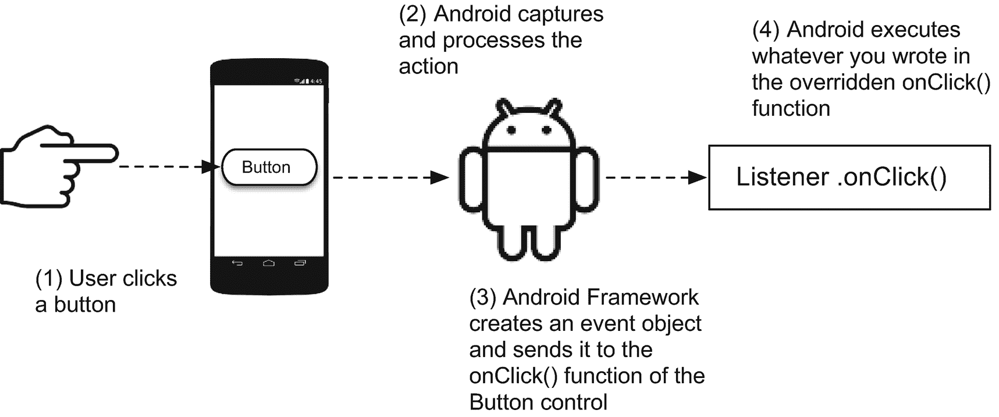

图 11-1

简化的事件处理模型

当用户用你的应用做一些事情时，比如点击一个按钮，Android 框架捕捉这个动作，并把它变成一个事件对象。事件对象包含关于用户动作的数据(例如，点击了哪个按钮，按钮被点击时的位置，等等)。)Android 将此事件对象发送到您的应用，并调用与用户动作相对应的特定函数。如果用户*点击了*按钮，Android 将调用按钮对象上的`onClick()`函数，如果用户点击了同一个按钮，但按住时间稍长，则调用`onLongClick()`函数。像按钮一样，视图对象可以响应一系列事件，如点击、按键、触摸或滑动等。表 11-1 列出了一些常见事件及其对应的事件处理程序。

表 11-1

通用监听器对象

<colgroup><col class="tcol1 align-left"> <col class="tcol2 align-left"> <col class="tcol3 align-left"></colgroup> 
| 

连接

 | 

功能

 | 

描述

 |
| --- | --- | --- |
| `View.OnClickListener` | `onClick()` | 当用户触摸并按住控件时(在触摸模式下)，或者用导航键聚焦在项目上然后按 ENTER 键时，调用此函数 |
| `View.OnLongClickListener` | `onLongClick()` | 几乎和点击一样，但时间更长 |
| `View.OnFocusChangeListener` | `onFocusChange()` | 当用户导航到控件上或离开控件时 |
| `View.OnTouchListener` | `onTouch()` | 几乎和点击动作一样，但是这个处理程序让你发现用户是向上还是向下滑动。你可以用这个来回应手势 |
| `View.OnCreateContextMenuListener` | `onCreateContextMenu()` | 当一个上下文菜单被构建时，Android 调用这个，作为一个持续长时间点击的结果 |

为了设置一个监听器，View 对象可以设置或者更恰当地说，注册一个*监听器对象*。注册一个监听器意味着当用户与视图对象交互时，你告诉 Android 框架调用哪个函数。图 11-2 显示了注册处理程序的注释代码。

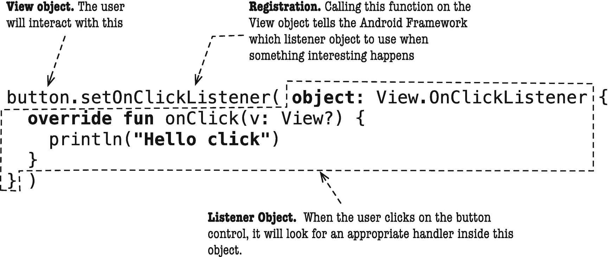

图 11-2

带注释的事件注册和处理代码

**setOnClickListener** 是 android.view.view 类的成员函数，这意味着 View 的每个子类都有它。这个函数需要一个 **OnClickListener** 对象作为参数——这个对象成为按钮控件的监听器。点击按钮时，运行 **onClick** 函数内的代码。

我们通过创建一个从**视图继承的对象表达式来创建监听器对象。OnClickListener** 。该类型在视图类中被声明为嵌套接口。对象表达式是 Java 的匿名内部类的 Kotlin 等价物。在 Java 中，我们编写了类似清单 11-1 中 thseat 的代码。

```kt
button.setOnClickListener(new View.OnClickListener() {
  @Override
  public void onClick(View view) {
    System.out.println("Hello click");
  }
}});

Listing 11-1onClick Listener in Java

```

在 Kotlin 中，使用对象表达式创建一个匿名内部类，如清单 11-2 所示。

```kt
button.setOnClickListener(object: View.OnClickListener {
  override fun onClick(v: View?) {
    println("Hello click")
  }
})

Listing 11-2onClick Listener in Kotlin

```

清单 11-2 实际上是一种编写对象表达式的冗长方式。Kotlin 对 lambdas 的支持可以简化我们现有的代码，如清单 11-3 所示。

```kt
button.setOnClickListener {
  println("Hello")
}

Listing 11-3onClick Listener Using lambdas

```

现在我们已经有了足够的关于事件的工作知识，让我们通过创建一个新项目来进一步探索它们。表 11-2 显示了项目详情。

表 11-2

CH11EventAnonymousclass 类的项目信息

<colgroup><col class="tcol1 align-left"> <col class="tcol2 align-left"></colgroup> 
| 

项目详细信息

 | 

价值

 |
| --- | --- |
| 应用名称 | ch11 事件匿名类 |
| 公司域 | 使用您的网站名称 |
| Kotlin 支架 | 是 |
| 波形因数 | 仅限手机和平板电脑 |
| 最低 SDK | API 23 棉花糖 |
| 活动类型 | 空的 |
| 活动名称 | 主要活动 |
| 布局名称 | 活动 _ 主要 |
| 向后兼容性 | 是的。应用兼容性 |

这个项目将只包含两个控件:一个是当我们使用向导时项目附带的 TextView，另一个是我们还没有添加的 Button view。这个按钮将使用一个匿名的内部对象拦截点击和长时间点击事件。

在主编辑器中打开 **activity_main.xml** 文件，如果它还没有打开的话。你可以在 *app > res > layout* 文件夹下的项目浏览器窗口中找到。

向设计图面添加一个按钮，并向其添加一些约束。您可以通过将按钮控件从组件面板中拖动到设计图面上来将它添加到布局中，如图 11-3 所示。

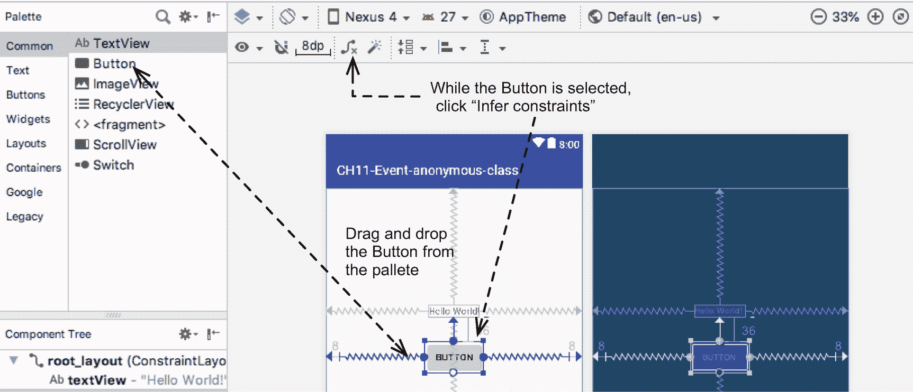

图 11-3

向设计图面添加一个 button 控件

当按钮控件被选中时，点击约束工具栏上的“推断约束”(如图 11-3 )。

您可能会注意到在布局编辑器的右上角有一个黄色的警告三角形(如图 11-4 所示)。单击警告框。

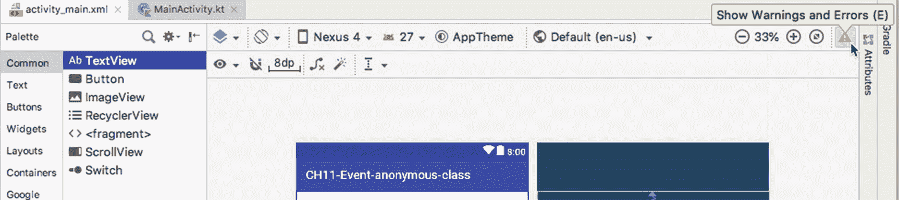

图 11-4

显示警告和错误按钮

图 11-5 显示消息工具窗口。它包含了一些关于为什么我们会得到警告的解释，以及一个建议修复的按钮提示。

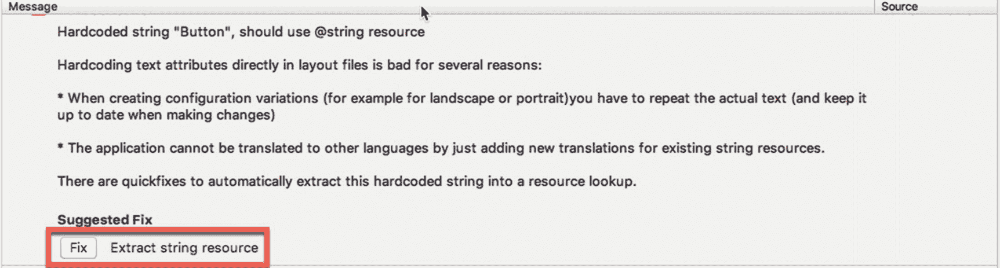

图 11-5

建议的修复

AS3 抱怨是因为新添加的按钮在其文本属性中有一个硬编码的值。清单 11-4 显示了“修复”之前的 activity_main.xml(的一个片段)现在， *android:text* 属性有一个值“Button”，一个字符串文字。

```kt
<Button
  android:id="@+id/button"
  android:text="Button"
/>

Listing 11-4activity_main.xml, Button Element, Before the Fix

```

Androids 更喜欢我们在资源文件中编写属性值，比如按钮的文本属性，而不是硬编码。单击“修复”按钮，这样 AS3 可以自动提取字符串资源。该操作打开提取资源窗口(参见图 11-6 )。

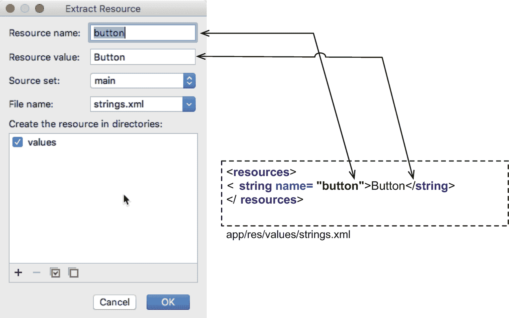

图 11-6

提取资源

我们的项目在**app/RES/values/strings . XML**中有一个字符串资源文件。它为应用提供文本资源值。Android 希望我们在这个资源文件中存储所有的字符串文字，而不是像你在清单 11-4 中看到的那样硬编码它们。

“资源名称”成为新创建的字符串资源的“名称”属性，“资源值”成为字符串资源的值。该值将显示在按钮的文本中。单击“确定”完成操作。

清单 11-5 显示了修复后 activity_main.xml 的内容。android:text 的值现在设置为“@string/button。”@符号意味着我们不应该直接使用这个字符串的值，而应该在字符串资源文件中查找一个名为“button”的资源。

```kt
<Button
  android:id="@+id/button"
  android:text="@string/button"
/>

Listing 11-5activity_main.xml, Button Element, After the Fix

```

我们需要在布局文件上做的最后一件事是给布局容器分配一个 **id** 属性。默认情况下，布局容器没有 id 属性。我们需要给它分配一个 id，因为我们将在后面的代码中引用它。切换到设计模式，点击布局容器内的某处(如图 11-7 )。在属性面板中，编辑 **id** 属性。在这个例子中，布局容器的 **id** 是“root_layout”

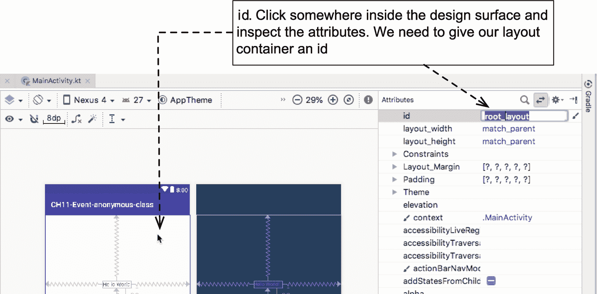

图 11-7

更改布局容器的 id 属性

清单 11-6 显示了我们布局文件的修改内容。

<colgroup><col class="tcol1 align-left"> <col class="tcol2 align-left"></colgroup> 
| -什么 | 布局容器的 android:id 现在被设置为`+@id/root_layout`。在后面的代码中，我们可以将这个控件称为`root_layout .` |
| ➋ | android:text 属性现在有一个值`@string/button;`，它不再是硬编码的。它现在从 strings.xml 资源文件中获取其值。 |

```kt
<?xml version="1.0" encoding="utf-8"?>
<android.support.constraint.ConstraintLayout xmlns:android="http://schemas.android.com/apk/res/android"
  xmlns:app="http://schemas.android.com/apk/res-auto"
  xmlns:tools="http://schemas.android.com/tools"
  android:id="@+id/root_layout"    ➊
  android:layout_width="match_parent"
  android:layout_height="match_parent"
  tools:context=".MainActivity">

  <TextView
    android:id="@+id/textView"
    android:layout_width="wrap_content"
    android:layout_height="wrap_content"
    android:text="Hello World!"
    app:layout_constraintBottom_toBottomOf="parent"
    app:layout_constraintLeft_toLeftOf="parent"
    app:layout_constraintRight_toRightOf="parent"
    app:layout_constraintTop_toTopOf="parent"
    app:layout_constraintVertical_bias="0.353" />

  <Button

    android:id="@+id/button"
    android:layout_width="wrap_content"
    android:layout_height="wrap_content"
    android:layout_marginEnd="8dp"
    android:layout_marginStart="8dp"
    android:layout_marginTop="36dp"
    android:text="@string/button"   ➋
    app:layout_constraintEnd_toEndOf="parent"
    app:layout_constraintStart_toStartOf="parent"
    app:layout_constraintTop_toBottomOf="@+id/textView" />

</android.support.constraint.ConstraintLayout>

Listing 11-6Complete Listing for activity_main.xml

```

现在我们可以处理程序文件了。打开*主活动。Kt* 在主编辑器中。您可以通过双击文件 app/Java/com . example…/main activity 来启动它。项目窗口中的 Kt。

我们希望按钮对点击和长时间点击都有反应。为此，我们需要为同一个按钮设置两个独立的侦听器——我们可以创建两个按钮，并为每个按钮分配一个侦听器，但是我觉得如果我们将两个侦听器绑定到同一个按钮，这个练习会更有指导意义。

在我们设置侦听器之前，活动不需要对用户可见；它只需要处于“已创建”状态。这就是为什么我们要在`onCreate()`回调函数中设置监听器。让我们先处理点击事件，然后我们将处理长时间点击。清单 11-7 显示了 OnClickListener 的代码。

```kt
button.setOnClickListener(object : View.OnClickListener {
    override fun onClick(v: View?) {
    }
})

Listing 11-7
OnClickListener

```

顺便说一下，当您键入这些代码时，您可能会看到一些错误或警告，如图 11-8 所示。

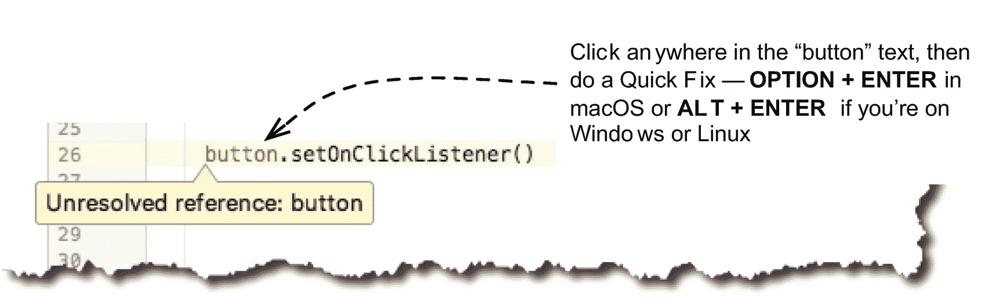

图 11-8

AS3 提示

在图 11-8 中，AS3 警告了一个未解析的“按钮”引用。要修复这个错误，我们可以手动键入所需的导入语句，或者使用 AS3 的“快速修复”功能。要使用快速修复，单击未解析引用中的任意位置——在我们的例子中是“按钮”标识符——然后按下键 **OPTION + ENTER** (如果你在 macOS 上);**如果你在 Windows 或 Linux 上，按 ALT + ENTER** 。

如果有多种解决问题的方法，AS3 将提供一些选项。您可以滚动选项并选择您想要使用的选项。

图 11-9 显示了如何修复未解决的参考误差的选项。我们将选择最后一个选项—这个导入语句是 Kotlin Android Extensions (KAE)。KAE 的神奇之处在于，它将布局中所有视图元素的 id 作为 Activity 类的扩展属性公开。因此，如果您在 **activity_main.xml** 中有一个 ID 为“Button”的按钮视图，您可以像使用常规变量一样在 activity 类中简单地使用该 ID——您不再需要使用 **findViewById()** 。

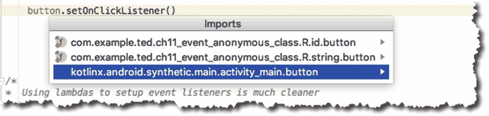

图 11-9

AS3 暗示导入

一旦你输入了清单 11-7 和图 11-10 中所示的事件处理程序，你会注意到 AS3 在提示我们将 listener 对象转换成 lambda 表达式。

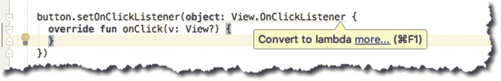

图 11-10

转换为 lambda 提示

要使用快速修复，单击“OnClickListener”中的任意位置，如图 11-11 所示，按 OPTION + ENTER 或 ALT + ENTER，然后选择“转换为 lambda”

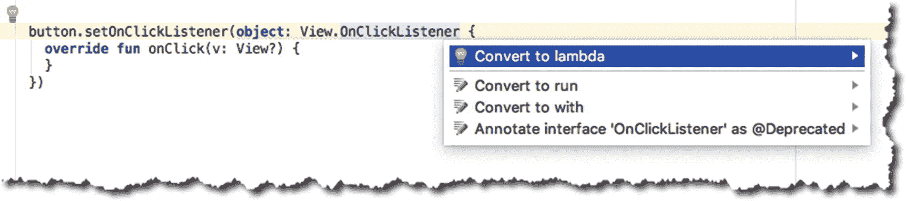

图 11-11

转换为 lambda 快速修复

lambda 简化版删除了我们的一些代码 setOnClickListener 的括号、对象表达式和被覆盖的 onClick 函数都被删除了，留给我们的只有下面的代码:

```kt
button.setOnClickListener {  }

```

接下来要做的事情是在 onClick 处理程序中放置一个 Toast 消息。清单 11-8 显示了点击处理程序中的一个简单的 Toast 消息。祝酒词是一个小的弹出消息，一段时间后会自动消失。您可以使用它向用户发送小的反馈消息。清单 11-8 展示了如何在 OnClickListener 中构造一个 Toast 消息。

```kt
button.setOnClickListener {
  Toast.makeText(this, "Hello World", Toast.LENGTH_LONG).show()
}

Listing 11-8
Toast Message

```

显示祝酒词的过程分为两步。第一步是使用 **makeText()** 函数创建一条 Toast 消息。它有三个参数:(1)应用的上下文，在我们的例子中是 MainActivity 的实例；(2)消息显示；以及(3)显示消息多长时间。第二步是通过调用。**显示()**功能。

让我们转到长点击监听器。这个监听器的代码如清单 11-9 所示。

```kt
button.setOnLongClickListener(object: View.OnLongClickListener {
  override fun onLongClick(v: View?): Boolean {

    return true
  }
})

Listing 11-9
OnLongClickListener

```

将清单 11-9 中的代码简化为它的 lambda 版本，得到如下代码:

```kt
button.setOnLongClickListener { true }

```

为了测试长点击处理程序，让我们使用 SnackBar 而不是 Toast。SnackBar 类似于 Toast，但它出现在屏幕的底部。你也可以让它在超时后消失，比如祝酒，或者你可以让用户滑动它。SnackBar 比 Toast 功能更强大，因为您可以在消息中包含一些操作，比如一个小对话框。

在项目中使用 SnackBar 之前，需要修改项目的 build.gradle 文件。请参见清单 11-10 了解您需要做出的更改。

<colgroup><col class="tcol1 align-left"> <col class="tcol2 align-left"></colgroup> 
| -什么 | 在使用 SnackBar 之前，您需要将它添加到项目的 **build.gradle** 文件(应用级别)中。 |

```kt
dependencies {
    implementation 'com.android.support:design:27.1.1' ➊
    implementation fileTree(dir: 'libs', include: ['*.jar'])
    implementation"org.jetbrains.kotlin:kotlin-stdlib-jre7:$kotlin_version"
    implementation 'com.android.support:appcompat-v7:27.1.1'
    implementation 'com.android.support.constraint:constraint-layout:1.1.2'
    testImplementation 'junit:junit:4.12'
    androidTestImplementation 'com.android.support.test:runner:1.0.2'
    androidTestImplementation 'com.android.support.test.espresso:espresso-core:3.0.2'
}

Listing 11-10/app/build.gradle

```

之后，您需要“同步”gradle 文件。主编辑器的上部会出现一个黄色条，右上角会有一个“同步”文件的链接。点击它，如图 11-12 所示。

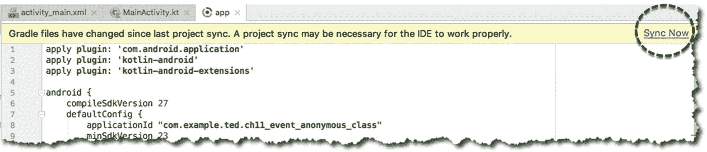

图 11-12

同步 build.gradle 文件

之后，您现在可以使用 SnackBar 元素了。清单 11-11 展示了如何在长点击处理程序中构建一个 SnackBar。

```kt
button.setOnLongClickListener {
  Snackbar.make(root_layout, "Long click", Snackbar.LENGTH_LONG).show()
  true
}

Listing 11-11SnackBar Message Inside OnLongClickListener

```

SnackBar 的 make 函数需要三个参数:(1)一个父视图；root_layout 是我们的布局容器的 ID；(2)要显示的消息；以及(3)显示消息多长时间。

OnLongClickListener 中的最后一行实际上是一个 return 语句，但是我们省略了“return ”,因为处理程序是 lambda 形式的——在这种形式中，返回块上的最后一个表达式。

onLongClick()回调函数有一个布尔签名—它返回 true 或 false。在我们的例子中，我们返回了 true，这告诉 Android 运行时事件已经被消费了，不需要其他事件处理程序(如 onClick)再次处理它。如果我们返回 false，onClick 处理程序会在 onLongClick 之后立即启动。清单 11-12 显示了 MainActivity 的完整代码。

<colgroup><col class="tcol1 align-left"> <col class="tcol2 align-left"></colgroup> 
| -什么 | 我们项目的包声明。这来自项目创建期间的“公司域”条目。 |
| ➋ | Kotlin Android 扩展(KAE)的导入声明。KAE 将 activity_main.xml 中的所有视图元素转换为扩展属性。因此，我们可以只使用 ID 来引用任何视图元素。 |
| ➌ | 我们从 AppCompatActivity 扩展而来，因此我们可以使用 SnackBar 等现代元素，同时仍然可以在早期版本的 Android 上运行该应用。 |
| -你好 | 该语句将 MainActivity 绑定到我们的布局文件 activity_main.xml。 |

```kt
package com.example.ted.ch11_event_anonymous_class  ➊

import android.support.v7.app.AppCompatActivity
import android.os.Bundle
import android.support.design.widget.Snackbar
import android.test.ViewAsserts
import android.view.View
import android.widget.Toast
import kotlinx.android.synthetic.main.activity_main.* ➋

class MainActivity : AppCompatActivity() {  ➌

  override fun onCreate(savedInstanceState: Bundle?) {
    super.onCreate(savedInstanceState)
    setContentView(R.layout.activity_main)  ➍

    button.setOnClickListener {
      Toast.makeText(this, "Hello World", Toast.LENGTH_LONG).show()
    }

    button.setOnLongClickListener {
      Snackbar.make(root_layout, "Long click", Snackbar.LENGTH_LONG).show()
      true
    }
  }
}

Listing 11-12MainActivity.Kt, Annotated

```

如果你在模拟器上运行应用，你会看到类似图 11-13 的东西。

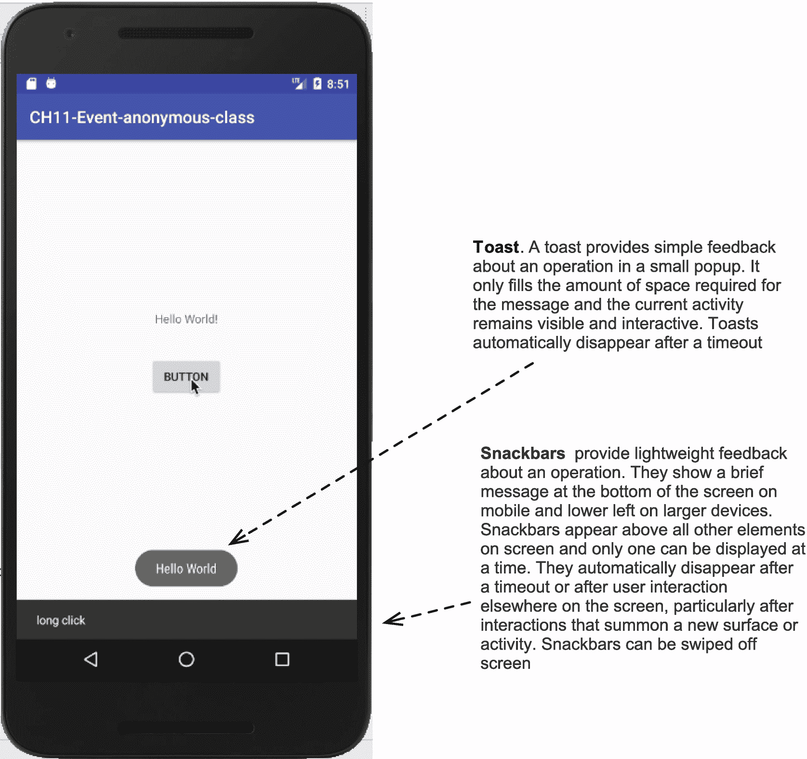

图 11-13

在模拟器中运行的已完成项目

## 章节总结

*   如果想处理简单的点击事件，可以将 **android:onClick** 属性设置为一个函数名。

*   如果您想要拦截某些事件，监听器对象必须注册到 Android 运行时。

*   侦听器对象有很多种，它们在 View 类中被列为嵌套接口。

*   使用 Kotlin Android 扩展简化了我们的编码。它将布局文件中所有视图的 Id 作为 MainActivity 的扩展属性公开——我们不再需要使用 **findViewById()** 了。

*   Lambdas 清理我们的事件处理代码。

在下一章，我们将看看 Android 最重要的部分之一:意图。Android 作为一个架构，没有它就无法存在。它是将 Android 中所有松散耦合的组件结合在一起的粘合剂。