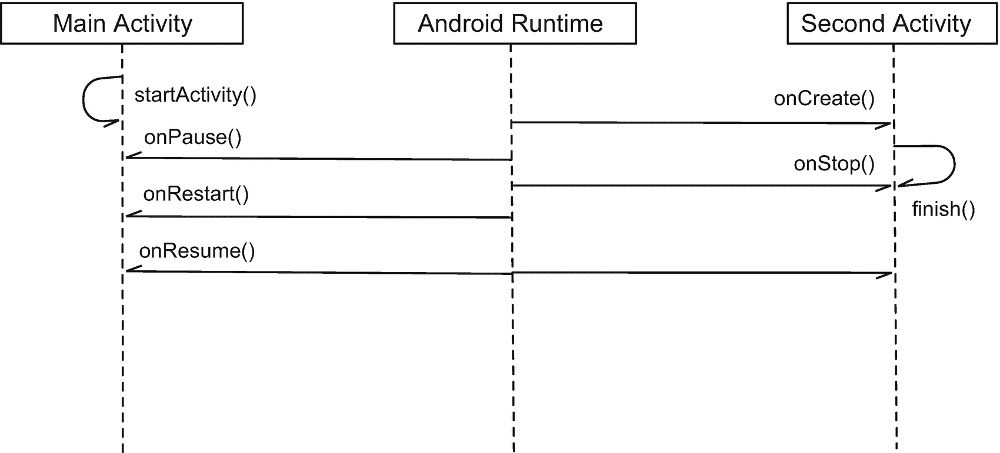

# 十二、意图

*我们将介绍的内容:*

*   意向概述

*   显性和隐性意图

*   在活动之间传递数据

*   从意图返回结果

Android 的架构在构建应用的方式上非常独特。它有组件的概念，而不仅仅是简单的对象。而安卓让这些组件交互的方式，是只有安卓平台才有的。Android 使用意图作为其组件通信的方式——它使用意图在组件之间传递消息。在这一章中，我们将看看意图:它们是什么以及我们如何使用它们。

## 意图是什么

意图是“对要执行的操作的抽象描述”。 <sup>1</sup> “这是 Android 独有的概念，因为没有其他平台使用相同的东西作为组件激活的手段。在前几章中，我们看了 Android 应用的内部。你可能记得一个应用只是一堆松散地组合在一起的“组件”(见图 12-1 )，每个组件都在一个清单文件中声明。


图 12-1

*一个* *安卓应用*的逻辑表示

如果您需要您的组件相互通信(例如，启动另一个活动)，该怎么办？你认为我们应该如何处理？如果你有桌面编程的经验，你可以做一些类似清单 12-1 中的代码。

```kt
class MainActivity : AppCompatActivity {

  button.setOnClickListener(object: View.OnClickListener {
    override fun onClick(v: View?) {
      SecondActivity(). // Won't work
   }
  })
}

class SecondActivity : AppCompatActivity {}

Listing 12-1Wrong Way to Activate Another Activity

```

清单 12-1 可能看起来是启动另一个活动的简单而直接的方法，但不幸的是，它是错误的，不会起作用。活动不是一个简单的对象，而是一个组件。不能仅仅通过实例化来激活组件。要启动一个活动，您需要创建一个 Intent 对象，并使用 startActivity()函数启动它。代码如清单 12-2 所示。

<colgroup><col class="tcol1 align-left"> <col class="tcol2 align-left"></colgroup> 
| -什么 | **this @ main activity**Intent 构造函数的第一个参数是一个`Context`对象。我们传递了`this@MainActivity`，因为 Activity 类是`Context`的子类，所以我们可以使用它。或者，我们也可以使用`getApplicationContext()` `;`,应用上下文也可以被接受。 |
| ➋ | **第二个活动::class.java** 。第二个参数是一个`Class`对象。它是我们想要向其传递消息的组件的类。这是一个*反射*语法。你可能已经知道，*反射*允许我们在运行时检查程序的结构。如果 SecondActivity 是一个 Kotlin 类(KClass ),它将引用 second activity 的运行时引用，但它不是。SecondActivity 是一个 Java 类(Android 库仍然是 Java 的)，因此我们称它为`SecondActivity::class.java` |
| ➌ | 我们通过调用`startActivity()`并向其传递 intent 对象来启动活动。 |

```kt
button.setOnClickListener {
  val intent = Intent(this@MainActivity, SecondActivity::class.java) ➊ ➋
  startActivity(intent) ➌
}

Listing 12-2How to Activate Another Activity

```

Android 平台对松散耦合非常狂热，组件激活在它的架构中受到了影响。应用只是由清单文件保存在一起的组件的集合，每个组件都可以通过向其发送消息来激活。基本思想是，组件之间不直接对话。如果一个组件，比如一个活动，想要与另一个组件对话，它需要向 Android 运行时发送一个请求，并让运行时解析这个请求。您可以将意图视为 Android 中的消息传递机制:它将组件粘合在一起。

## 松耦合

你可能会认为 Android 的架构过于复杂，因为为什么要花这么大力气去推出另一个屏幕呢？为什么我们不能只创建一个对象的实例就完事了呢——这已经是众所周知的编程习惯了。为什么我们要用组件激活来代替它呢？

嗯，Android 的程序交互性方法非常独特，因为它非常以用户为中心。它赋予用户很大的权力来选择如何操作和创建数据。移动用户一般以任务为中心，而不是以 app 为中心；他们并不真正关心哪个应用做什么，只要它能完成。

让我们举一个 Android 设备的常见使用场景。例如，用户打开“联系人”应用并选择 Ted Hagos 的联系人详细资料。比方说，这个联系人可能有一个电子邮件地址、一部手机和一个 twitter 用户名。用户可以点击 Ted 的每个联系点，每一次，Android 都会启动一个不同的应用；默认的电子邮件客户端、拨号器和下载的 Twitter 应用。用户可能不关心启动了哪个应用或者当前打开了多少个应用；他只是想传达一个信息。如果这位用户不喜欢电子邮件应用或默认的 twitter 客户端，他可以删除这些应用，并用其他东西替换它们，他应该会回到业务中。图 12-2 显示了一个使用联系人应用的简单故事板。


图 12-2

用户如何与“通讯录”应用交互

为了实现这种程序交互，Android 需要设计平台，重点关注松散耦合和可插拔性。像联系人应用这样的组件，不应该知道当电子邮件地址或手机号码被点击时应该使用什么应用的任何具体细节。用于特定类型数据的应用的解决方案不应硬连线到联系人应用中；否则，用户将无法在发送电子邮件或推文时选择使用哪个应用。

这就是意图的来源。当一个组件需要完成一项超出其服务能力的任务时，它可以使用 Intents 访问 Android 平台，并询问是否有任何应用可以(或想要)满足该请求。

## 两种意图

有两种意图:隐含的和明确的。打个比方可能有助于说明这两种意图之间的区别。比方说，我们将请人买些糖。如果我们给出一个指令，比如“你能买些糖吗”，没有进一步的细节，这就相当于一个隐含的意图，因为那个人可以在任何地方买糖。另一方面，如果我们给出类似“请你去第三街的 ABC 商店买些糖”的指示，这就相当于一个明确的意图。清单 12-2 中的代码示例是一个显式意图的例子。

隐式意图非常强大，因为它们允许您的应用利用其他应用。你的应用可以获得不是你自己编写的功能。例如，您可以创建一个打开相机、拍摄和保存照片的意图，而无需编写任何特定于相机的代码。

## 意图可以携带数据

意图可以做的远不止发起其他活动；你也可以用它发送和接收数据。假设我们有两个名为 *MainActivity* 和 *SecondActivity* 的活动，当在 MainActivity 中单击一个按钮视图对象时，我们希望启动并向 SecondActivity 发送一些数据。要向 SecondActivity 发送数据，您需要:

1.  创建一个意图——在我们的例子中，它是一个明确的意图。

2.  使用 **putExtra** 方法将数据添加到意图中。

3.  通过调用 **startActivity** 方法启动另一个活动；此时，Android 运行时将启动 *SecondActivity。*

4.  在 *SecondActivity* 的 **onCreate** 方法中，我们可以通过使用 **getExtra** 方法从意图中提取数据。

图 12-3 显示了这一切是如何工作的简单序列图。


图 12-3

*如何向另一个活动发送数据*

### 注意

Android 中的大多数函数调用像 **startActivity** 、 **onCreate** 等。是异步的——这就是为什么序列图中使用的箭头是半杆箭头。图 12-3 (以及其他序列图中)所示的调用顺序只是近似值，它们实际上可能不会按照那个顺序发生。

为了用代码表示这些步骤，它可能看起来像清单 12-3 。

```kt
button.setOnClickListener {
  val intent = Intent(this@MainActivity, SecondActivity::class.java)
  intent.putExtra("main_activity_data", editText.text.toString())
  startActivity(intent)
}

Listing 12-3Code Snippet from MainActivity

```

**putExtra** 方法的参数是一个键值对；第一个参数是键或名称，第二个参数是值。name 参数将总是字符串类型，但第二个参数(值)可能不总是字符串类型。 **putExtra** 方法是重载的，它可以接受第二个参数的类型范围。如果你在 Android Studio 中输入得足够慢，你可能会在输入 **putExtra** 方法时看到代码提示中显示的选项；见图 12-4 。


图 12-4

*AS3 中的代码提示显示了重载的 putExtra()*

在清单 12-3 中，我们在 **putExtra 的第二个参数中放了一个字符串；**我们也可以使用其他类型(例如， *Int、Byte、Char、Float、Short、*等基本类型。).我们也可以使用*包、Parcelables、*或*序列化*。

在调用了意图上的 **putExtra** 方法之后，下一步是调用 **startActivity** 。这将触发 Android 运行时的意图解析机制，并最终启动*第二个活动*。

现在我们继续进行第二项活动。很自然，你想从 *MainActivity 中提取我们发送的数据。*要做到这一点，你需要做两件事。您需要:

1.  获取对意图对象的引用；和

2.  从意图中调用 **getExtra** 函数。该代码可能如下所示:

```kt
val myintent = getIntent()
val data = myintent.getStringExtra("main_activity_data")

```

但是由于 Kotlin 的 getters 和 setters 的魔力，`getIntent()`函数变成了 *intent* 属性。所以，我们可以这样重写:

```kt
val data = intent.getStringExtra("main_activity_data")

```

### 从另一个活动中获取结果

在上一节中，我们设法启动了第二个活动并向其发送数据。在这一节中，我们将基于前面的例子，但是这一次，我们也将一些数据发送回 *MainActivity* 。为此，我们需要:

1.  创建一个明确的意图。

2.  使用 **putExtra** 方法将数据添加到意图中。

3.  通过调用 **startActivityForResult** 方法启动另一个活动。像 **startActivity** 方法一样，我们需要将一个 Intent 对象作为参数传递给这个方法。此外，我们还需要传递一个*请求代码*给它。一个*请求代码*充当某种令牌。当我们开始一个活动并期望返回一些结果时，任何其他活动都可以返回任何结果。如果我们在一个项目中有几个活动，当我们得到结果时，可能会感到困惑。我们需要一种方法来跟踪谁发送回这些结果，而*请求代码*将帮助我们做到这一点。一旦我们调用 startActivityForResult，第二个活动就会启动。

4.  在 SecondActivity 的 **onCreate** 方法中，我们可以通过使用 **getExtra** 方法从意图中提取数据。

5.  我们可以在 SecondActivity 中做一些计算。当我们准备好发回数据时，我们将执行以下操作:
    1.  获取对意图对象的引用。

    2.  使用 **putExtra** 方法将数据添加到意图中。

    3.  调用 SecondActivity 的 **setResult** 方法。在这里我们需要做两件事情:(1)设置意向呼叫的状态，如果没有错误，您可以将其设置为*活动。结果 _ OK*；以及(2)将包含额外内容的意图对象作为第二个参数传递。

    4.  从 *SecondActivity* 内部调用 **finish()** 。这将停止 SecondActivity，并有效地将意图发送给名为 SecondActivity 的组件，即 MainActivity

6.  回到 MainActivity，无论我们期望从 second Activity——或者任何其他活动——返回什么结果，都可以从 **onActivityResult** 回调中接收。这个方法的参数中有三样东西:它有请求代码、结果代码和由 SecondActivity 发回的 Intent 对象。

图 12-5 显示了如何从另一个活动发送和获取结果的序列图。


图 12-5

从另一个活动获取结果的序列图

当您向另一个活动发送数据并希望获得一些数据时，您需要使用 **startActivityForResult** 而不是 **startActivity** 。这样做的代码如下所示:

```kt
startActivityForResult(intent, SECOND_ACTIVITY)

```

和 startActivity 一样，你将 Intent 对象传递给 **startActivityForResult** ，除了 Intent 对象，你还需要传递一个*请求代码* ( `SECOND_ACTIVITY`)。这个请求代码对于 MainActivity 非常重要，因为我们将使用它来跟踪从谁那里获取数据。请求代码是一个您需要定义的 *Int* 。只要您有多个请求代码，每个代码都是不同的，那么您将使用什么号码并不重要。如果您发送数据并期望从几个活动返回数据，您将使用请求代码来跟踪哪些其他活动正在向您发送数据。这样，当结果出来的时候，我们就可以知道我们最初想做什么。

在 SecondActivity 中，当我们准备好发回数据时，我们需要创建另一个 Intent 对象，并使用 **putExtra** 方法加载数据。之后，我们调用 SecondActivity 的 **setResult** 方法。setResult 方法有两个参数:一个*结果代码*和 Intent 对象。如果应用一切正常，使用*活动。结果 _ OK*；否则使用*活动。结果 _ 取消*。RESULT_OK 实际上是-1，RESULT_CANCELLED 是 0，但是请不要使用 *Int* 文字，总是使用提供的类常量。

当您在 SecondActivity 上调用 finish 方法时，它将进入停止状态，MainActivity 将再次出现在前台—因此，它将*重启*并且*恢复*。无论 SecondActivity 发送回什么数据，我们都应该能够在 MainActivity 的 **onActivityResult** 回调中获得它。清单 12-4 显示了一个典型的被覆盖的 onActivityResult 回调。

```kt
override fun onActivityResult(requestCode: Int, resultCode: Int, data: Intent?) {
  super.onActivityResult(requestCode, resultCode, data)

  if((requestCode == SECOND_ACTIVITY) and (resultCode == Activity.RESULT_OK))  {
    // extract data here
  }
}

Listing 12-4
onActivityResult

```

### 注意

您如何知道何时应该覆盖 **onActivityResult** 回调？如果您使用 **startActivityForResult** 启动另一个活动，您应该覆盖 onActivityResult 回调——在这里您可以获得发送给您的任何数据。

## 隐含的意图

我们在前面几节中看到的都是明确意图的例子。明确的意图告诉 Android 运行时精确地激活哪个组件。回到我们的类比，这就像告诉某人去 3 <sup>rd</sup> 街的杂货店买些糖。另一方面，一个隐含的意图只是简单地给出了“得到一些糖”的指令——在哪里或如何得到糖并不重要。隐含的意图只规定了行动。

当你使用一个隐含的意图时，一般的想法是你想使用一个不存在于你的应用中的功能——如果它存在于你的应用中，你会首先使用一个明确的意图；—因此，您要求 Android 运行时在设备上的某个地方找到一个应用来满足您的请求。

从前面的例子中我们知道，意图可以携带数据；我们用临时演员做了这件事。额外的东西是一个意图可以拥有的四样东西之一；另外三个是*动作*、*数据、*和*类别*。动作是您想要做的操作(例如，查看、拨号、应答、呼叫等。).数据与操作必须处理的信息类型有关(是 URI、电话号码、图片等。)，而类别与哪些组件有资格处理此意图有关。有时，运行时需要类别来过滤或选择那些能够响应我们意图的组件。您可以向活动、广播接收者和服务发送意图，但是在本章中，我们将只处理活动。

通常你需要做四件事来获得一个隐含的意图。您需要:

1.  创建意图对象

2.  设置其动作(例如，“查看地图”、“拨打电话”、“拍照”等)。)

3.  设置其数据；和

4.  启动意图

清单 12-5 向我们展示了这一切在代码中的样子。

<colgroup><col class="tcol1 align-left"> <col class="tcol2 align-left"></colgroup> 
| -什么 | 使用无参数构造函数创建意图。 |
| ➋ | 设置意图动作。在这个例子中，我们想要查看一些东西；它可以是联系人、网页、地图、某处的图片等。此时，Android 运行时还不知道您想要查看什么。ACTION_VIEW 是您可以使用的许多意图操作之一。你可以在安卓官方网站找到其他种类的动作([`bit . ly/androidcommonint ents`](http://bit.ly/androidcommonintents))。 |
| ➌ | 设置其数据。在这一点上，Android 运行时已经很清楚你在做什么了。在这个例子中，Uri 是一个网页。Android 很聪明地判断出我们想要浏览网页。 |
| -你好 | Android 将搜索设备上最符合这一要求的每个应用。如果它发现不止一个应用，它会让用户选择哪一个。如果只找到一个，它将简单地启动该应用。 |

```kt
val m_intent = Intent() ➊
m_intent = setAction(Intent.ACTION_VIEW)   ➋
m_intent = setData(Uri.parse("https://workingdev.net")) ➌
startActivity (m_intent) ➍

Listing 12-5Example Intent to Launch a Web Browser

```

我们可以将清单 12-16 中的代码简化成这样

```kt
m_intent = Intent(Intent.ACTION_VIEW,  Uri.parse("https://workingdev.net"))
startActivity(m_intent)

```

动作和数据可以作为参数传递给 Intent 的构造函数。

任何符合我们意图的组件都不需要为了接收意图而运行。请记住，所有应用都需要一个清单文件。每个应用在清单文件中声明它的能力，特别是通过`<intent-filter>`部分。Android 的包管理器拥有设备上安装的所有应用的所有信息。Android 的运行时只需要清单文件上的信息来查看哪些应用有能力和/或有资格响应意图。

在接下来的部分中，我们将更详细地探讨隐含和明确的意图。我们将设置示例项目，以便您可以在上面进行练习。

## 演示 1:发起一项活动

我们不会在这个项目上做任何花哨的东西。我们将简单地创建两个活动:MainActivity 和 SecondActivity。当单击按钮时，我们将从 MainActivity 启动 SecondActivity。项目详情见表 12-1 。

表 12-1

*演示应用的项目详情*

<colgroup><col class="tcol1 align-left"> <col class="tcol2 align-left"></colgroup> 
| 

项目详细信息

 | 

价值

 |
| --- | --- |
| 应用名称 | ch12 launchanothersactivity |
| 公司域 | 您的网站名称 |
| Kotlin 支架 | 是 |
| 波形因数 | 仅限手机和平板电脑 |
| 最低 SDK | API 23 棉花糖 |
| 活动类型 | 空的 |
| 活动名称 | 主要活动 |
| 布局名称 | 活动 _ 主要 |
| 向后兼容性 | 是的。应用兼容性 |

当项目在主窗口中打开时，创建第二个活动。方法之一是选择“app”项目工具窗口，如图 12-6 所示，然后从主工具栏点击**文件** ➤ **新建** ➤ **活动** ➤ **空活动**。


图 12-6

*在* *项目工具窗口*中选择“app”

让我们把它命名为“SecondActivity”，如图 12-7 所示。


图 12-7

*新的安卓活动*

接下来，转到 activity_main.xml(设计视图)。移除 TextView 元素并用按钮视图替换它。将按钮定位在布局的中心附近，然后使用“推断约束”按钮，如图 12-8 所示

接下来，同样在设计视图中打开 activity_second.xml，然后添加一个按钮视图并将其置于布局的中心，就像您在 activity_main 中所做的那样..


图 12-8

*在布局上居中按钮视图*

此时，您应该可以使用以下视图元素和类:

*   主要活动。Kt 及其关联的 *activity_main.xml* ，这来自项目创建向导

*   SecondActivity.Kt .及其关联的 *activity_second.xml* ，这来自活动创建向导

*   *activity_main* 中的按钮视图对象，其 id 为“Button”——这是项目中第一个按钮元素的默认 id

*   activity_second 中的另一个按钮视图对象，其 id 为“Button 2”——这是项目中第二个按钮元素的默认 id

清单 12-6 和 12-7 分别显示 activity_main 和 activity_second 的代码；如果您尝试自己构建项目，您可以将它们用作参考或比较。

```kt
<?xml version="1.0" encoding="utf-8"?>
<android.support.constraint.ConstraintLayout xmlns:android=http://schemas.android.com/apk/res/android
  xmlns:app=http://schemas.android.com/apk/res-auto
  xmlns:tools=http://schemas.android.com/tools
  android:layout_width="match_parent"
  android:layout_height="match_parent"
  tools:context=".SecondActivity">

  <Button
    android:id="@+id/button2"
    android:layout_width="wrap_content"
    android:layout_height="wrap_content"
    android:layout_marginTop="88dp"
    android:text="Button"
    app:layout_constraintEnd_toEndOf="parent"
    app:layout_constraintStart_toStartOf="parent"
    app:layout_constraintTop_toTopOf="parent" />
</android.support.constraint.ConstraintLayout>

Listing 12-7/app/res/layout/-->activity_second.xml

```

```kt
<?xml version="1.0" encoding="utf-8"?>
<android.support.constraint.ConstraintLayout xmlns:android=http://schemas.android.com/apk/res/android
  xmlns:app=http://schemas.android.com/apk/res-auto
  xmlns:tools=http://schemas.android.com/tools
  android:layout_width="match_parent"
  android:layout_height="match_parent"
  tools:context=".MainActivity">

  <Button
    android:id="@+id/button"
    android:layout_width="wrap_content"
    android:layout_height="wrap_content"
    android:layout_marginTop="80dp"
    android:text="Button"
    app:layout_constraintEnd_toEndOf="parent"
    app:layout_constraintStart_toStartOf="parent"
    app:layout_constraintTop_toTopOf="parent" />
</android.support.constraint.ConstraintLayout>

Listing 12-6/app/res/layout/activity_main.xml

```

清单 12-8 和 12-9 显示了主活动的注释代码。Kt 和 SecondActivity。Kt。

<colgroup><col class="tcol1 align-left"> <col class="tcol2 align-left"></colgroup> 
| -什么 | 我们正在定义一个简单的日志对象。我们本可以使用 **android.util.Log** 类，但是我认为大多数阅读本书的人都有 Java 背景，所以这看起来应该很熟悉。参数`MainActivity::` [`class.name`](http://class.name) 大致相当于 Java 的`getClass().getName()`。或者，您也可以将任何字符串传递给`getLogger()`方法——例如`getLogger("My Project")`——但是通常的做法是使用 Logger 对象的类名。 |
| ➋ | 我们只是创建一个日志条目，说明我们正在进行 MainActivity 的“onCreate”回调。 |
| ➌ | 这是按钮的点击监听器的基本设置；你已经做过了。 |
| -你好 | 这条线创建一个意图对象。意图对象的第一个参数是上下文对象；您可以在这里使用应用上下文，但是在我们的例子中，我们使用了活动上下文。`this@MainActivity`是对 MainActivity 的上下文的引用。第二个参数是意图的目标对象。这是给 Android 运行时的一个特定指令，我们想要激活这个对象。第二个参数的类型应该是**类**。MainActivity 的类对象的符号是`MainActivity::class.java`。 |
| ➎ | 我们启动意图。 |

```kt
import android.content.Intent
import android.support.v7.app.AppCompatActivity
import android.os.Bundle
import kotlinx.android.synthetic.main.activity_main.*
import java.util.logging.Logger

class MainActivity : AppCompatActivity() {

  val Log = Logger.getLogger(MainActivity::class.java.name)  ➊

  override fun onCreate(savedInstanceState: Bundle?) {
    super.onCreate(savedInstanceState)
    setContentView(R.layout.activity_main)

    Log.info("onCreate")  ➋

    button.setOnClickListener { ➌
      val m_intent = Intent(this@MainActivity, SecondActivity::class.java) ➍
      startActivity(m_intent) ➎
    }
  }

  override fun onPause() {
    super.onPause()
    Log.info("onPause")
  }

  override fun onRestart() {
    super.onRestart()
    Log.info("onRestart")
  }

  override fun onResume() {
    super.onResume()
    Log.info("onResume")
  }
}

Listing 12-8Full Listing and Annotated Code of -->MainActivity.Kt

```

<colgroup><col class="tcol1 align-left"> <col class="tcol2 align-left"></colgroup> 
| -什么 | 当我们调用它时，SecondActivity 将处于“停止”状态。 |
| ➋ | 当 SecondActivity 进入 **onStart** 回调时，它将对用户可见。无论什么活动在前台，现在都将被移到后台；主活动将进入“暂停”状态。 |

```kt
import android.support.v7.app.AppCompatActivity
import android.os.Bundle
import kotlinx.android.synthetic.main.activity_second.*
import java.util.logging.Logger

class SecondActivity : AppCompatActivity() {

  val Log = Logger.getLogger(SecondActivity::class.java.name)

  override fun onCreate(savedInstanceState: Bundle?) {
    super.onCreate(savedInstanceState)
    setContentView(R.layout.activity_second)

    Log.info("onCreate")

    button2.setOnClickListener {
      finish()  ➊
    }
  }

  override fun onStart() {
    super.onStart()   ➋
    Log.info("onStart")
  }

  override fun onStop() {
    super.onStop()
    Log.info("onStop")
  }
}

Listing 12-9
-->SecondActivity.Kt

```

当您从 MainActivity 调用 startActivity 时，运行时将激活 SecondActivity。当 SecondActivity 对用户可见时，这应该发生在 SecondActivity 的 **onStart** 期间，MainActivity 将进入“暂停”状态。

当你从 SecondActivity 调用`finish()`时，它会进入“停止”状态。MainActivity 将被带到前台，因此它将重新进入“resume”和“restart”状态。这种相互作用如图 12-9 所示。



图 12-9

MainActivity、SecondActivity 和运行时的序列图

我已经覆盖了 MainActivity 和 SecondActivity 的一些生命周期回调。您可以检查日志来查看调用生命周期方法的时间和顺序。您可以使用 Logcat 工具窗口来检查应用和系统日志，如图 12-10 所示。


图 12-10

*Logcat 工具窗口*

## 演示 2:向活动发送数据

在这个项目中，我们将继续探索显式意图的基本机制。然而，我们并不只是启动另一个活动，我们还会向它发送一些数据。我们将详细讨论如何在意图中加入“额外”以及如何提取它。同样，如果你想编码，项目的细节如表 12-2 所示。

表 12-2

*项目详情*

<colgroup><col class="tcol1 align-left"> <col class="tcol2 align-left"></colgroup> 
| 

项目详细信息

 | 

价值

 |
| --- | --- |
| 应用名称 | ch12senddatatoanothersctivity |
| 公司域 | 您的网站名称 |
| Kotlin 支架 | 是 |
| 波形因数 | 仅限手机和平板电脑 |
| 最低 SDK | API 23 棉花糖 |
| 活动类型 | 空的 |
| 活动名称 | 主要活动 |
| 布局名称 | 活动 _ 主要 |
| 向后兼容性 | 是的。应用兼容性 |

与上一节一样，我们还需要创建另一个活动。创建另一个活动，并将其命名为“SecondActivity”

返回 activity_main 并在设计视图中打开它。从布局中删除“Hello”TextView，然后添加一个 EditText 和一个 Button 视图，如图 12-11 所示。对齐元素，在布局中居中，并使用“推断约束”，就像我们在之前的演示项目中所做的那样。


图 12-11

*activity_main.xml，设计视图*

接下来，在设计视图中打开 activity_second，然后向其中添加一个 TextView 元素。使用“推断约束”(像往常一样)并调整一些属性，如文本大小和文本对齐，如图 12-12 所示。


图 12-12

*activity_second.xml，设计模式*

到目前为止，您应该已经拥有了以下视图元素和类:

*   主要活动。Kt 及其关联的*activity _ main . XML*；这来自项目创建向导。

*   SecondActivity.Kt .及其关联的*activity _ second . XML*；这来自活动创建向导。

*   *activity_main* 中的 editText 和 button 视图对象，它们的 id 分别是“EditText”和“Button”。editText 是项目中第一个明文元素的默认 id。

*   activity_second 中的 textView 对象，其 id 为“TextView”，这是项目中第一个 TextView 元素的默认 id。

清单 12-10 和 12-11 分别显示了 activity_main.xml 和 activity_two.xml 的代码。

```kt
<?xml version="1.0" encoding="utf-8"?>
<android.support.constraint.ConstraintLayout xmlns:android=http://schemas.android.com/apk/res/android
  xmlns:app=http://schemas.android.com/apk/res-auto
  xmlns:tools=http://schemas.android.com/tools
  android:layout_width="match_parent"
  android:layout_height="match_parent"
  tools:context=".SecondActivity">

  <TextView
    android:id="@+id/textView"
    android:layout_width="324dp"
    android:layout_height="wrap_content"
    android:text="TextView"
    android:textAlignment="center"
    android:textSize="36sp"
    tools:layout_editor_absoluteX="35dp"
    tools:layout_editor_absoluteY="78dp" />
</android.support.constraint.ConstraintLayout>

Listing 12-11/app/res/layout/activity_second.xml

```

```kt
<?xml version="1.0" encoding="utf-8"?>
<android.support.constraint.ConstraintLayout xmlns:android=http://schemas.android.com/apk/res/android
  xmlns:app=http://schemas.android.com/apk/res-auto
  xmlns:tools=http://schemas.android.com/tools
  android:layout_width="match_parent"
  android:layout_height="match_parent"
  tools:context=".MainActivity">

  <Button
    android:id="@+id/button"
    android:layout_width="wrap_content"
    android:layout_height="wrap_content"
    android:layout_marginTop="31dp"
    android:text="Button"
    app:layout_constraintEnd_toEndOf="@+id/editText"
    app:layout_constraintStart_toStartOf="@+id/editText"
    app:layout_constraintTop_toBottomOf="@+id/editText" />

  <EditText
    android:id="@+id/editText"
    android:layout_width="wrap_content"
    android:layout_height="wrap_content"
    android:layout_marginTop="49dp"
    android:ems="10"
    android:inputType="textPersonName"
    android:text="Name"
    app:layout_constraintEnd_toEndOf="parent"
    app:layout_constraintStart_toStartOf="parent"
    app:layout_constraintTop_toTopOf="parent" />
</android.support.constraint.ConstraintLayout>

Listing 12-10/app/res/layout/activity_main.xml

```

清单 12-12 和 12-13 分别显示了 MainActivity 和 SecondActivity 的注释代码。

<colgroup><col class="tcol1 align-left"> <col class="tcol2 align-left"></colgroup> 
| -什么 | 我们正在获取用户在 EditText 对象中输入的任何内容的值。这样做的语法实际上是`editText.getText().toString()`但是 Kotlin 用 getters 和 setters 的语法糖使我们的生活变得更容易。我们可以使用属性“ **text** ”来设置或获取 EditText 视图的运行时值。我们必须调用`toString()`函数，因为`EditText.getText()`的返回类型是**可编辑的**或**字符序列**。我需要它是字符串类型的，因为 **putExtra** 既不接受 Editable 也不接受 CharSequence 它收绳子。 |
| ➋ | 我们正在创建一个明确的意图，其目标是 **SecondActivity。** |
| ➌ | 现在我们要放一些数据在意图上。putExtra 的两个参数看起来像一个*键-值*对；他们确实是。*键*是第一个参数，“main_activity_data”，而*值*是 EditText 的运行时内容——当然是转换成字符串。 |
| -你好 | 我们正在发送意向对象。 |

```kt
import android.content.Intent
import android.support.v7.app.AppCompatActivity
import android.os.Bundle
import kotlinx.android.synthetic.main.activity_main.*

class MainActivity : AppCompatActivity() {

  override fun onCreate(savedInstanceState: Bundle?) {
    super.onCreate(savedInstanceState)
    setContentView(R.layout.activity_main)

    button.setOnClickListener {
      val m_data = editText.text.toString() ➊
      val m_intent = Intent(this@MainActivity, SecondActivity::class.java) ➋
      m_intent.putExtra("main_activity_data", m_data) ➌
      startActivity(m_intent) ➍
    }
  }
}

Listing 12-12
MainActivity

```

<colgroup><col class="tcol1 align-left"> <col class="tcol2 align-left"></colgroup> 
| -什么 | 我们正在获取对与 SecondActivity 相关联的 Intent 对象的引用，我们在这里没有创建新的 Intent 对象。语法实际上是`getIntent()`,但是因为 Kotlin 的魔法酱，我们把它简单地称为**意图** |
| ➋ | Intent 对象的 **getStringExtra** 方法正在做您认为它在做的事情。它使用地图习惯用法从意图对象中提取一些数据；你给它一个键，你会得到一个值。在本例中，我们给它指定了键“main _ activity _ data——这是我们在 MainActivity 中使用的同一个键。我们使用了 **getStringExtra** 方法，因为我们知道它包含一个字符串。*的取放器*应与*的放放器*对应。如果你放入*字节、数组或包*，那么你应该分别得到 **getByteExtra** 、 **getArrayExtra、**和 **getBundleExtra** 。 |
| ➌ | 我们正在改变文本视图的运行时值。我们把它设置成我们从意图号外得到的任何东西。 |

```kt
import android.support.v7.app.AppCompatActivity
import android.os.Bundle
import kotlinx.android.synthetic.main.activity_second.*

class SecondActivity : AppCompatActivity() {

  override fun onCreate(savedInstanceState: Bundle?) {
    super.onCreate(savedInstanceState)
    setContentView(R.layout.activity_second)

    val m_data = intent.getStringExtra("main_activity_data") ➊ ➋
    textView.setText(m_data) ➌
  }
}

Listing 12-13
SecondActivity

```

运行程序并尝试在编辑文本上键入。当您单击按钮时，SecondActivity 上的 TextView 应该显示您键入的任何内容。

## 演示 3:向活动发送数据并从中获取数据

在这个项目中，我们将要求用户输入他的体重和身高，然后我们将计算他的身体质量指数(身体质量指数)。该项目有两个活动:主活动和次活动。

我们将要求用户在 MainActivity 上输入他的身高和体重。我们将通过一个意向把数据发送给 SecondActivity。在 SecondActivity 中，我们将从 MainActivity 发送给我们的意图中提取数据。我们将使用身高和体重数据来计算身体质量指数，然后将其发送回 MainActivity。

如果你想继续，我已经在表 12-3 中列出了项目细节。

表 12-3

*演示应用的项目详情*

<colgroup><col class="tcol1 align-left"> <col class="tcol2 align-left"></colgroup> 
| 

项目详细信息

 | 

价值

 |
| --- | --- |
| 应用名称 | ch12 sendanddgetdatabackfrom activity |
| 公司域 | 您的网站名称 |
| Kotlin 支架 | 是 |
| 波形因数 | 仅限手机和平板电脑 |
| 最低 SDK | API 23 棉花糖 |
| 活动类型 | 空的 |
| 活动名称 | 主要活动 |
| 布局名称 | 活动 _ 主要 |
| 向后兼容性 | 是的。应用兼容性 |

和前面的演示一样，这个项目也有两个活动，但是它有更多的视图元素。像在前面的演示中那样创建两个活动。

MainActivity 有两个视图元素:两个用于用户输入的 EditTexts、一个按钮和一个 TextView，我们将使用它来显示身体质量指数。您可以在清单 12-14 中找到视图对象的详细信息，如 *id、*和*文本大小*；这是 activity_main.xml 的完整代码。

我给了视图一个非常简单的安排——我简单地将它们垂直打包并居中。我也没有太在意布局的限制。在目测了一个我认为不那么令人反感的布局后，我使用了“推断约束”按钮来自动修复所有的布局约束，就像我们在之前的演示中所做的那样。图 12-13 说明了如何管理 activity_main 的布局。


图 12-13

【activity _ main 的基本布局

示例代码不会特意以编程方式验证输入，所以我们将在编辑文本上放置一些验证机制。体重和身高输入字段应该只接受数字，特别是浮点数；我们可以通过设置 EditText 视图的 *inputType* 属性来实现这一点。以下是如何做到这一点:

1.  在设计视图上编辑 activity_main 时，选择一个编辑文本视图。

2.  在属性工具窗口中，单击“输入类型”

3.  选择“数字十进制”

4.  对其他编辑文本重复步骤 1-3。

图 12-14 说明了这一过程。


图 12-14

对编辑文本施加验证约束

这应该可以处理 MainActivity 的 UI。清单 12-14 显示了 activity_main.xml 的完整代码

```kt
<?xml version="1.0" encoding="utf-8"?>
<android.support.constraint.ConstraintLayout xmlns:android=http://schemas.android.com/apk/res/android
  xmlns:app=http://schemas.android.com/apk/res-auto
  xmlns:tools=http://schemas.android.com/tools
  android:layout_width="match_parent"
  android:layout_height="match_parent"
  tools:context=".MainActivity">

  <EditText
    android:id="@+id/input_weight"
    android:layout_width="wrap_content"
    android:layout_height="wrap_content"
    android:layout_marginTop="68dp"
    android:ems="10"
    android:inputType="numberDecimal"
    android:text="Name"
    app:layout_constraintEnd_toEndOf="@+id/input_height"
    app:layout_constraintStart_toStartOf="@+id/input_height"
    app:layout_constraintTop_toTopOf="parent" />

  <EditText
    android:id="@+id/input_height"
    android:layout_width="wrap_content"
    android:layout_height="wrap_content"
    android:layout_marginTop="23dp"
    android:ems="10"
    android:inputType="textPersonName"
    android:text="Name"
    app:layout_constraintEnd_toEndOf="@+id/btn_send_data"
    app:layout_constraintStart_toStartOf="@+id/btn_send_data"
    app:layout_constraintTop_toBottomOf="@+id/input_weight" />

  <Button

    android:id="@+id/btn_send_data"
    android:layout_width="wrap_content"
    android:layout_height="wrap_content"
    android:layout_marginTop="21dp"
    android:text="calculate BMI"
    app:layout_constraintEnd_toEndOf="@+id/txt_bmi"
    app:layout_constraintStart_toStartOf="@+id/txt_bmi"
    app:layout_constraintTop_toBottomOf="@+id/input_height" />

  <TextView
    android:id="@+id/txt_bmi"
    android:layout_width="wrap_content"
    android:layout_height="wrap_content"
    android:layout_marginTop="33dp"
    android:text="TextView"
    android:textSize="36sp"
    app:layout_constraintEnd_toEndOf="parent"
    app:layout_constraintStart_toStartOf="parent"
    app:layout_constraintTop_toBottomOf="@+id/btn_send_data" />
</android.support.constraint.ConstraintLayout>

Listing 12-14/app/res/layout/activity_main.xml

```

您可以使用 AS3 中的上下文菜单来创建 SecondActivity。右键点击项目文件夹中的“app”，然后**新建** ➤ **活动** ➤ **清空活动**，如图 12-15 所示。


图 12-15

*创建一个新的空活动*

填写新活动的详细信息，如图 12-16 所示。确保新活动的名称是 *SecondActivity* ，并且您正在与 MainActivity 相同的包中创建它。


图 12-16

创建第二个活动

SecondActivity 有两个视图元素:一个显示传递给它的意图内容的 TextView 和一个触发身体质量指数计算的按钮。图 12-17 显示了 SecondActivity 的用户界面。将布局中的元素居中，并使用“推断约束”将元素锚定到位。你也可以根据自己的喜好调整文本视图的*文本对齐*和*文本大小*属性。


图 12-17

activity_second.xml

清单 12-15 显示了 activity_second.xml 的完整代码

```kt
<?xml version="1.0" encoding="utf-8"?>
<android.support.constraint.ConstraintLayout xmlns:android=http://schemas.android.com/apk/res/android
  xmlns:app=http://schemas.android.com/apk/res-auto
  xmlns:tools=http://schemas.android.com/tools
  android:layout_width="match_parent"
  android:layout_height="match_parent"
  tools:context=".SecondActivity">

  <TextView
    android:id="@+id/txt_intentdata"
    android:layout_width="346dp"
    android:layout_height="wrap_content"
    android:layout_marginTop="109dp"
    android:text="TextView"
    android:textAlignment="center"
    android:textSize="24sp"
    app:layout_constraintEnd_toEndOf="parent"
    app:layout_constraintStart_toStartOf="parent"
    app:layout_constraintTop_toTopOf="parent" />

  <Button
    android:id="@+id/btn_calculate"
    android:layout_width="wrap_content"
    android:layout_height="wrap_content"
    android:layout_marginTop="29dp"
    android:text="calc bmi"
    app:layout_constraintEnd_toEndOf="@+id/txt_intentdata"
    app:layout_constraintStart_toStartOf="@+id/txt_intentdata"

    app:layout_constraintTop_toBottomOf="@+id/txt_intentdata" />
</android.support.constraint.ConstraintLayout>

Listing 12-15/app/res/layout/activity_second.xml

```

让我们放大一下 MainActivity 的 onCreate 方法。应用一打开，EditText 就会等待用户输入。一旦用户点击按钮，我们的应用将收集输入并有目的地发送出去。

清单 12-16 显示了 MainActivity 的注释片段，其中包含了单击按钮时的事件处理代码。

<colgroup><col class="tcol1 align-left"> <col class="tcol2 align-left"></colgroup> 
| -什么 | 我们声明并定义了一个属性，它将作为某种常量。这就是我们稍后在代码中用作*请求代码*的内容。 |
| ➋ | 我们正在设置纯文本视图的*提示*属性。提示显示为文本的灰色占位符。如果您在 HTML 5 中使用了占位符属性，提示属性与此类似。您可以使用提示来代替标签。 |
| ➌ | 我们正在定义一个显式意图，`this@MainActivity`是上下文，意图目标是一个类对象(`SecondActivity::class.java`)。 |
| -你好 | 我们需要向 SecondActivity 发送两个数据点，当需要发送多对键值对时，最好使用 Bundles。 |
| ➎ | 像 Intent 一样， **Bundle** 对象也允许我们以几种方式向它添加数据。我在这个例子中使用了`putFloat()`,因为我想处理浮点数。如果需要处理字符串，字节，字符，整型等。，只需使用适当的 **putXXX** 方法即可。 |
| ➏ | 我们正在加载以捆绑到意图对象。使用有意图的包允许我们处理更复杂的数据结构。 |
| -好的 | 我们正在发送活动，但是这一次，我们告诉运行时我们期望一些数据返回——这就是为什么我们使用 **startActivityForResult** 。每当其他活动调用 MainActivity 的`finish()`方法时，这就通知运行时调用 main activity 的 **onActivityResult** 回调。startActivityForResult 的第二个参数是请求代码。当我们收到返回的结果时，请求代码将帮助我们路由程序逻辑。在这个调用中，我们使用了类常量 **SECOND_ACTIVITY** 作为启动 SecondActivity 的请求代码，这意味着当 SecondActivity 调用它的`finish()`方法时，这个请求代码也会被发送回 MainActivity。 |

```kt
val SECOND_ACTIVITY = 1000 ➊

override fun onCreate(savedInstanceState: Bundle?) {
  super.onCreate(savedInstanceState)
  setContentView(R.layout.activity_main)

  input_weight.setHint("weight (lbs)")     ➋
  input_height.setHint("height (inches)")

  btn_send_data.setOnClickListener {

    val m_intent = Intent(this@MainActivity, SecondActivity::class.java) ➌
    val m_bundle = Bundle()   ➍

    m_bundle.putFloat("weight", input_weight.text.toString().toFloat()) ➎
    m_bundle.putFloat("height", input_height.text.toString().toFloat())
    m_intent.putExtra("main_activity_data", m_bundle)  ➏

    startActivityForResult(m_intent, SECOND_ACTIVITY) ➐
  }
}

Listing 12-16onCreate Method of MainActivity

```

练习的下一个阶段发生在 SecondActivity 的 onCreate 回调上。在我们将身高和体重数据发送给接收活动之后，我们必须提取并处理这些数据。清单 12-17 显示了该代码的注释片段。

<colgroup><col class="tcol1 align-left"> <col class="tcol2 align-left"></colgroup> 
| -什么 | 我们需要获得对与 SecondActivity 关联的 Intent 对象的引用。这是我们从 MainActivity 中启动的同一个 Intent 对象。这也是激活 SecondActivity 的相同意图。为了获得关联的 Intent 对象，我们应该调用`getIntent()`，但是因为我们使用的是 Kotlin，而不是方法`getIntent()`，我们简单地称它为**Intent**——属性而不是方法。请记住，我们在这里并不是创建一个新的意图，我们只是获得一个与 SecondActivity 相关的意图的引用。我们在 MainActivity 中发送了一个包，所以我们应该使用 **getBundleExtra** 来获取数据。 |
| ➋ | 既然我们已经获得了包，我们需要开始从包中获取更多的数据。我们使用 **putFloat** 将数据放入包中，因此，我们需要使用 **getFloat** 将数据取出。 |
| ➌ | 我们将文本视图的*文本*属性设置为串联的*高度*和*重量*字符串。 |
| -你好 | 在这一行中，我们正在创建一个新的意图对象。这个活动将把一些数据发送回 MainActivity。我们需要一个新的意图来做这件事。 |
| ➎ | 这是一种计算身体质量指数的简单方法，但应该可行。 |
| ➏ | 现在我们已经计算了身体质量指数，让我们加载到我们新创建的意图对象。 |
| -好的 | **setResult** 方法接受两个参数:a.**结果代码**。这不是 0 就是-1。一般来说，如果出错了，你应该返回-1，或者如果一切顺利，你应该返回 0。但是在 Activity 类中使用类常量是个好主意。**活动。结果 _OK** 为-1，**活动。RESULT_CANCELLED** 为 0。b.**意图**。这是包含计算身体质量指数的目的对象。 |
| -好的 | 最后，为了将计算结果返回给 MainActivity，我们需要调用`finish().` |

```kt
override fun onCreate(savedInstanceState: Bundle?) {
  super.onCreate(savedInstanceState)
  setContentView(R.layout.activity_second)

  val bundle = intent.getBundleExtra("main_activity_data") ➊
  val height = bundle.getFloat("height") ➋
  val weight = bundle.getFloat("weight")

  txt_intentdata.text = "Height: $height | Weight: $weight" ➌

  btn_calculate.setOnClickListener {
    val m_intent = Intent()  ➍
    val m_bmi = 703 * (weight / (height * height)) ➎
    m_intent.putExtra("second_activity_data", m_bmi) ➏
    setResult(Activity.RESULT_OK, m_intent) ➐
    finish() ➑
  }
}

Listing 12-17onCreate Method of SecondActivity

```

意图之旅的下一部分是回到主活动。在 SecondActivity 调用完成后，运行时将调用 MainActivity 上的 onActivityResult 回调——在这个回调中，我们有机会处理 SecondActivity 发送给我们的任何数据。清单 12-18 向我们展示了 MainActivity 的 onActivityResult 的注释片段。

<colgroup><col class="tcol1 align-left"> <col class="tcol2 align-left"></colgroup> 
| -什么 | 该表达式中有两个测试:1.`requestCode == SECOND_ACTIVITY`。我们在问数据是否来自 SecondActivity。2.`Activity.RESULT_OK`。我们正在尝试查看 SecondActivity 是否调用了 setResult 并实际调用了 finish。 |
| ➋ | 既然我们知道数据来自 SecondActivity，并且一切顺利，我们就可以从意图中提取数据了。我们使用了 **getFloatExtra** ,因为我们知道它包含了一个浮点——毕竟我们把它放在了那里。我们不得不在`data?.getFloatExtra()`中使用*安全调用*(问号)，因为传递给 onActivityResult 的 Intent 对象的签名是可空类型。 |
| ➌ | 我们可以显示计算出的身体质量指数值。 |

```kt
override fun onActivityResult(requestCode: Int, resultCode: Int, data: Intent?) {
  super.onActivityResult(requestCode, resultCode, data)

  if((requestCode == SECOND_ACTIVITY) and (resultCode == Activity.RESULT_OK))  { ➊
    val bmi = data?.getFloatExtra("second_activity_data", 1.0F) ➋
    txt_bmi.setText(bmi.toString()) ➌
  }
}

Listing 12-18Annotated onActivityResult of MainActivity

```

如果您正在编写代码，那么现在您应该能够将整个应用拼凑起来。

清单 12-19 显示了 MainActivity 的完整代码。您可能会注意到这个完整列表与列表 12-16 和 12-18 之间的一些差异。为了简洁明了，我省略了清单 12-16 和 12-18 中的一些其他细节。在清单 12-19 中，我放回了所有省略的部分，并且对它们进行了注释，这样您可以更容易地发现它们。

<colgroup><col class="tcol1 align-left"> <col class="tcol2 align-left"></colgroup> 
| -什么 | 让我们清除输入字段。我们将这个调用放在 **onResume** 回调中，这样每次活动对用户可见时，输入字段都是清晰的。您可能还记得，在活动的生命周期中，可以多次调用 **onResume** 生命周期方法。当应用启动时，它将被第一次调用。当 SecondActivity 调用 **finish** 时会被第二次调用，MainActivity 会从后台堆栈中弹出，以此类推。 |
| ➋ | 我没有使用返回可空类型的`data?.getExtra(),`，而是使用了返回不可空类型的`data!!.getExtra(),`。我这样做是为了简化我们在 **gerBMIDescription** 函数中的代码，它需要一个不可空的类型。我们本可以在 **getBMIDescription** 中处理可空类型，但是我选择使用更简单的方法处理不可空类型。 |
| ➌ | 该函数接受一个身体质量指数浮点值，并返回一个权重描述。 |
| -你好 | `initializeInputs()`的实现。我们只是将 EditTexts 的文本属性*设置为一个空字符串。* |

```kt
import android.app.Activity
import android.content.Intent
import android.support.v7.app.AppCompatActivity
import android.os.Bundle
import kotlinx.android.synthetic.main.activity_main.*

class MainActivity : AppCompatActivity() {

  val SECOND_ACTIVITY = 1000

  override fun onCreate(savedInstanceState: Bundle?) {
    super.onCreate(savedInstanceState)
    setContentView(R.layout.activity_main)

    input_weight.setHint("weight (lbs)")
    input_height.setHint("height (inches)")

    btn_send_data.setOnClickListener {

      val m_intent = Intent(this@MainActivity, SecondActivity::class.java)
      val m_bundle = Bundle()

      m_bundle.putFloat("weight", input_weight.text.toString().toFloat())
      m_bundle.putFloat("height", input_height.text.toString().toFloat())
      m_intent.putExtra("main_activity_data", m_bundle)

      startActivityForResult(m_intent, SECOND_ACTIVITY)
    }
  }

  override fun onResume() {
    super.onResume()
    clearInputs()  ➊
  }

  override fun onActivityResult(requestCode: Int, resultCode: Int, data: Intent?) {
    super.onActivityResult(requestCode, resultCode, data)

    if((requestCode == SECOND_ACTIVITY) and (resultCode == Activity.RESULT_OK))  {
      val bmi = data!!.getFloatExtra("second_activity_data", 1.0F) ➋
      val bmiString = "%.2f".format(bmi)
      input_height.setText("")
      input_weight.setText("")
      txt_bmi.setText("BMI : $bmiString ${getBMIDescription(bmi)}")
    }
  }

  private fun getBMIDescription(bmi: Float) : String { ➌

    return when (bmi) {
      in 1.0..18.5 -> "Underweight"
      in 18.6..24.9 -> "Normal weight"
      in 25.0..29.9 -> "Overweight"
      else -> "Obese"
    }
  }

  private fun clearInputs() { //  ➍
    input_weight.setText("")
    input_height.setText("")
  }
}

Listing 12-19Full Code Listing for MainActivity

```

## 演示 4:隐含的意图

我们最后一个演示应用的特点是隐含的意图。在本节中，我们将处理三种类型的数据:web URI、地理坐标和电话号码。希望这三个例子能给你足够的洞察力和立足点，让你继续探索隐含的意图。像往常一样，如果你想编码，项目细节如表 12-4 所示。

表 12-4

演示应用的项目详情

<colgroup><col class="tcol1 align-left"> <col class="tcol2 align-left"></colgroup> 
| 

项目详细信息

 | 

价值

 |
| --- | --- |
| 应用名称 | CH12ImplicitIntents |
| 公司域 | 使用您的网站名称 |
| Kotlin 支架 | 是 |
| 波形因数 | 仅限手机和平板电脑 |
| 最低 SDK | API 23 棉花糖 |
| 活动类型 | 空的 |
| 活动名称 | 主要活动 |
| 布局名称 | 活动 _ 主要 |
| 向后兼容性 | 是的。应用兼容性 |

该应用有一个简单的设置，我在 activity_main.xml 上做的唯一一件事就是删除“Hello World”TextView。我使用 Options 菜单来帮助用户选择启动三个示例意图。选项菜单在动作栏上，如图 12-18 所示。


图 12-18

MainActivity 菜单

在 UI 部分没有什么要做的，所以没有必要显示 activity_main 的 XML 列表。我们需要做的一切都在 MainActivity 内部完成。

在前面的章节中，我们使用 XML 资源构建了菜单；在这个例子中，我构建的菜单有点不同。我没有使用 XML 资源，而是动态构建了所有的菜单项。清单 12-20 显示了 MainActivity 的完整和带注释的代码。

<colgroup><col class="tcol1 align-left"> <col class="tcol2 align-left"></colgroup> 
| -什么 | 在调用了 **onCreate** 方法之后，将会调用 **onCreateOptionsMenu** 回调。在 API 11 (Honeycomb)之前， **onCreateOptionsMenu** 只有在用户点击手机的*选项*按钮时才会被调用，但从 Honeycomb 开始，现在被称为 onCreate。这种行为变化的主要原因是因为 ActionBar 是从 API 11 开始引入的。因为我们使用的是 API 23，所以我们可以利用这个行为来构建一个简单的菜单。 |
| ➋ | 我们将动态添加一个菜单项。 |
| ➌ | 每当用户点击其中一个菜单项，就会调用 **onOptionsItemSelected** 。这是我们处理菜单点击的地方。 |
| -你好 | **项**参数可以告诉我们点击了哪个菜单项。我们将它转换成字符串，这样我们就可以用它在 **when** 表达式中路由我们的程序逻辑。 |
| ➎ | 这是创建意图的简化版本。 |

```kt
import android.content.Intent
import android.net.Uri
import android.support.v7.app.AppCompatActivity
import android.os.Bundle
import android.view.Menu
import android.view.MenuItem

class MainActivity : AppCompatActivity() {

  override fun onCreate(savedInstanceState: Bundle?) {
    super.onCreate(savedInstanceState)
    setContentView(R.layout.activity_main)
  }

  override fun onCreateOptionsMenu(menu: Menu?): Boolean { ➊
    menu?.add("Web") ➋
    menu?.add("Map")
    menu?.add("Phone number")
    return super.onCreateOptionsMenu(menu)
  }

  override fun onOptionsItemSelected(item: MenuItem?): Boolean { ➌

    var m_uri: Uri

    var m_intent: Intent = Intent()

    when (item?.toString()) { ➍
      "Web" -> {
        m_uri = Uri.parse("https://www.apress.com")
        m_intent = Intent(Intent.ACTION_VIEW, m_uri) ➎
      }
      "Map" -> {
        m_uri = Uri.parse("geo:40.7113399,-74.0263469")

//      This would have worked as well
//      m_uri = Uri.parse("https://maps.google.com/maps?q=40.7113399,-74.0263469")
        m_intent = Intent(Intent.ACTION_VIEW, m_uri)

      }
      "Phone number" -> {
        m_uri = Uri.parse("tel:639285083333")
        m_intent = Intent(Intent.ACTION_DIAL, m_uri)
      }

    startActivity(m_intent)
    return true
  }
}

Listing 12-20
MainActivity

```

图 12-19 显示了我们的应用的运行时快照。


图 12-19

隐含意图，运行

## 章节总结

*   意图用于组件激活。

*   有两种意图:隐性的和显性的。

*   明确的意图让我们可以处理多种活动。您可以使用明确的意图来激活特定的活动。

*   隐式意图扩展了应用的功能。它让你的应用做一些超出应用功能的事情。

*   你可以通过意图发送和接收数据。

在下一章中，我们将:

*   查看并简要了解材质设计(不多)。

*   了解如何在我们的应用中创建和应用样式和主题。

*   了解如何在动作栏中添加菜单。

<aside class="FootnoteSection" epub:type="footnotes">Footnotes 1

[`开发者。安卓。com/reference/Android/content/Intent`](https://developer.android.com/reference/android/content/Intent)

 </aside>