# 十三、主题和菜单

*我们将介绍的内容:*

*   主题和颜色

*   菜单

谷歌 Play 商店有将近 350 万个应用。有很多应用可供选择，这对用户来说是好事，但对开发者来说，竞争非常激烈。

如果你要发布一个应用，你需要润色它——即使只是修饰一下——这样才不会显得寒酸。即使你有一个杀手级应用，你也应该考虑它对用户来说是什么样子(和感觉)。记住，不管你的代码有多棒，用户看到的不是代码，而是用户界面。

谷歌发布了一套用户界面指南。他们称之为材质设计，你可以在 [`http://material.io`](http://material.io) 了解更多信息。材质设计是一个很大的主题，它本身就可以填满整本书，我们不打算涵盖所有内容，但在这一章中，我们将看看主题以及如何将 AppBar 添加到您的应用中。

## 样式和主题

Android 平台有类似“风格”和“主题”的概念。样式是属性的集合，您可以在其中控制视图的外观、背景和前景色、字体大小等等。另一方面，主题是应用于整个应用的风格，而不仅仅是单个视图。当您将样式应用为主题时，应用中的每个视图都会遵循该主题。Android Manifest 的**应用**节点中的应用应用了一个主题，如以下代码片段所示:

```kt
android:theme="@style/AppTheme"

```

在本例中，“AppTheme”是样式的名称。样式在 *app ➤ res ➤ styles.xml* 中被写成 XML 文件——文件名通常是 style.xml，但它可以改变，这不是硬性要求。清单 13-1 显示了当前的 styles.xml 这是我们在项目创建向导之后得到的结果。

```kt
<resources>
 <!-- Base application theme. -->
  <style name="AppTheme" parent="Theme.AppCompat.Light.DarkActionBar">
    <!-- Customize your theme here. -->
    <item name="colorPrimary">@color/colorPrimary</item>
    <item name="colorPrimaryDark">@color/colorPrimaryDark</item>
    <item name="colorAccent">@color/colorAccent</item>
  </style>
</resources>

Listing 13-1app/res/values/styles.xml

```

styles (styles.xml)的根节点是“resources”，您可以在这个节点下定义任意多的样式。样式节点具有属性“名称”和“父节点”name 属性是您选择的东西，比如变量、类或函数的名称。父属性是您需要从一组现有主题中选择的东西。AS3 会用提示帮你解决，如图 13-1 所示。

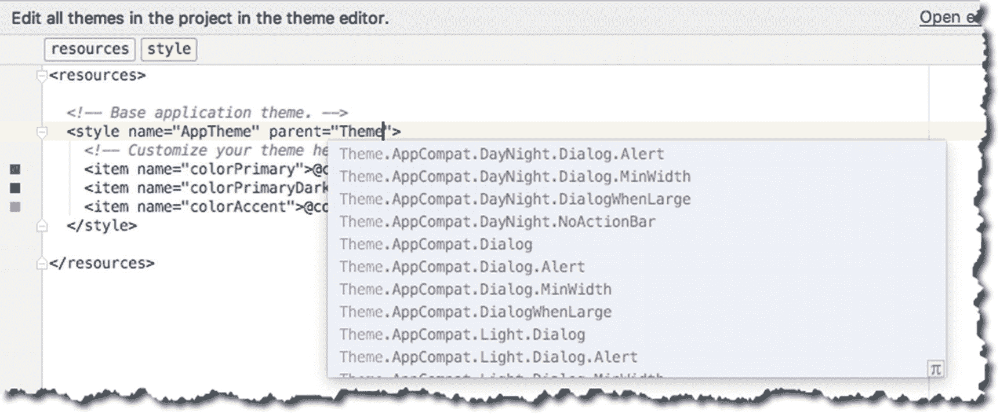

图 13-1

编辑 styles.xml 时的代码提示

一旦定义了样式节点，就可以开始为应用定制颜色了。颜色被定义为“style”元素中的“item”条目。

谷歌的材质设计通过使用贯穿整个应用的原色和强调色，赋予你的品牌身份以生命。这些颜色定义如下:

*   **colorPrimary:** 应用栏的颜色

    **colorPrimaryDark:** 状态栏和上下文应用栏的颜色；这是彩色原色的黑暗版本

*   **colorAccent:** 复选框、单选按钮和编辑文本框等视图的颜色

*   **窗口背景**:屏幕背景的颜色

*   **textColorPrimary:** 应用栏中 UI 文本的颜色

*   **状态栏颜色**:状态栏的颜色

*   **导航条颜色:**导航条的颜色

您不必在 styles.xml 中定义所有这些，但是如果您愿意，您可以这样做。您可能已经注意到，颜色项的值本身并没有在 styles.xml 文件中定义，而是被重定向到另一个资源文件。在 styles.xml 中，当您看到这样的条目时

```kt
<item name="colorPrimary">@color/colorPrimary</item>

```

这意味着“colorPrimary”的实际值可以在 colors.xml 文件中找到，该文件位于 *app ➤研究➤值*文件夹中。清单 13-2 显示了 colors.xml 的当前内容

```kt
<?xml version="1.0" encoding="utf-8"?>
<resources>
  <color name="colorPrimary">#3F51B5</color>
  <color name="colorPrimaryDark">#303F9F</color>
  <color name="colorAccent">#FF4081</color>
</resources>

Listing 13-2app/res/values/colors.xml

```

### 自定义主题

您可以通过两种方式编辑颜色。您可以直接编辑 colors.xml 文件，也可以使用 AS3 的主题编辑器修改颜色。要使用主题编辑器，在主编辑器中打开 styles.xml 文件，然后点击右上角的“打开编辑器”链接，如图 13-2 所示。

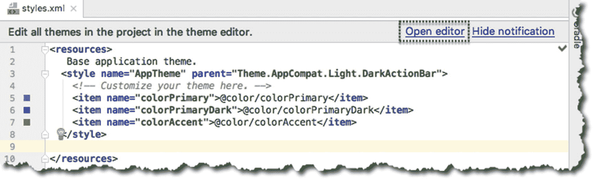

图 13-2

启动“打开编辑器”

主题编辑器允许您更改应用的颜色值。它还向您展示了应用在给定的配色方案下的外观。图 13-3 显示了主题编辑器的各个部分。

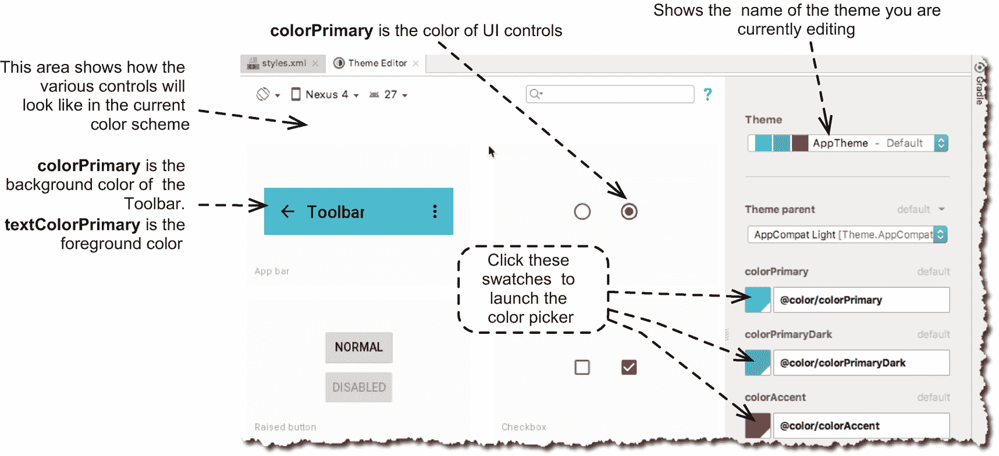

图 13-3

主题编辑器

要改变颜色，单击材质颜色旁边的样本(如图 13-3 )。这将启动拾色器(如图 13-4 )。


图 13-4

颜色选择器

Google 在 [`http://bit.ly/materialdesigndox`](http://bit.ly/materialdesigndox) 发布了关于材质设计的文档；在修改配色方案之前，最好先阅读一下。你可以使用的另一个网络资源是 materialPalette.com；它面向 Android 材质设计。图 13-5 显示了他们网站的截图。

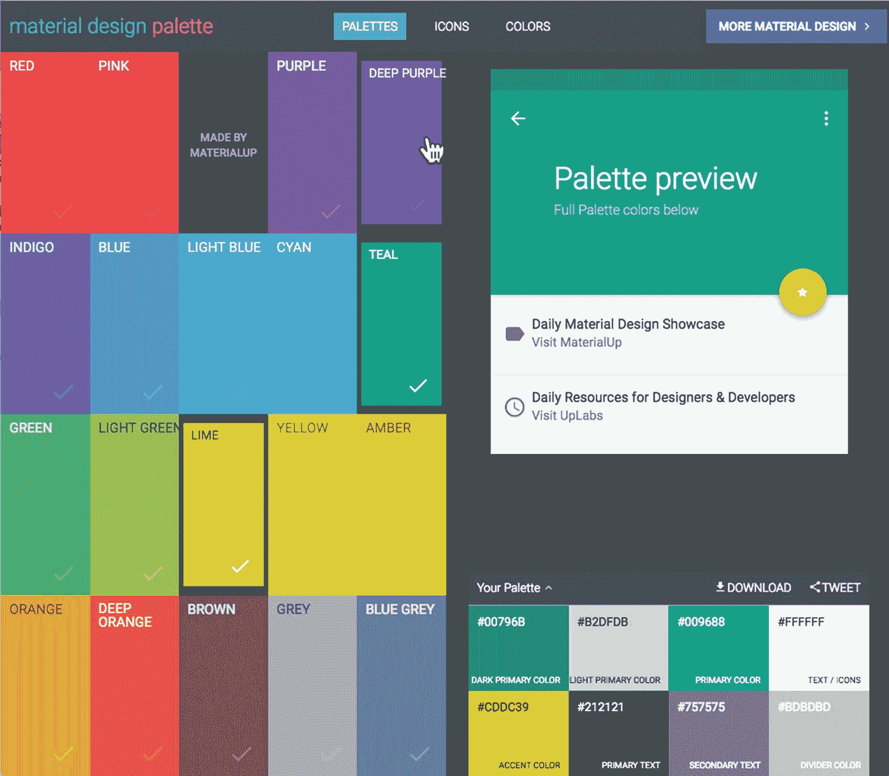

图 13-5

截图自 [`https://www.materialpalette.com`](https://www.materialpalette.com)

基本的想法是选择两种颜色，网站为你建立一个调色板。现在你可以简单地复制原色、深原色、强调色、浅原色和其他颜色的十六进制值。

## 菜单

菜单在 UI 设计中非常重要。它们允许用户使用应用的功能。传统上，菜单系统是分层次地组织在介绍组中的，这意味着在用户到达他的目标动作之前，他需要遍历菜单的层次结构。Android 的菜单系统，在某个时间点上，已经完全像那样表现了——分组和分级。但那是过去的事了。Android 的菜单方式在其生命周期中发生了巨大的变化。

Android Honeycomb 之前的菜单依赖于硬件按钮，如图 13-6 所示。

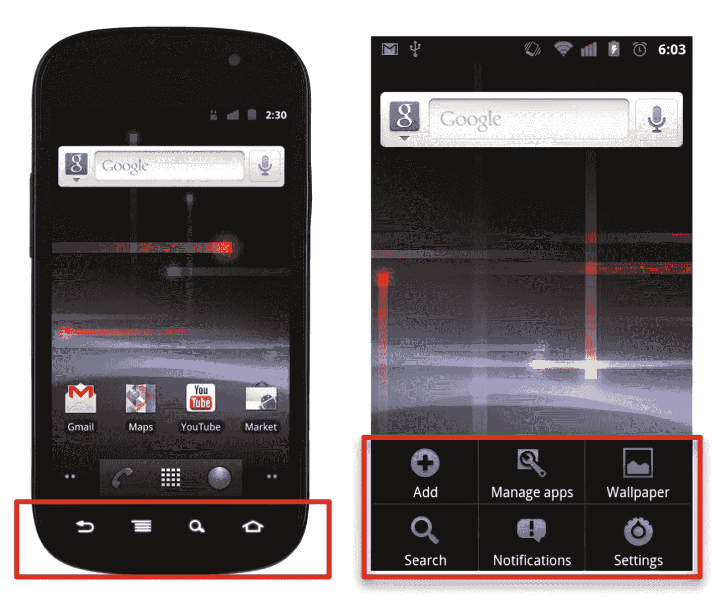

图 13-6

旧 Android 硬件上的菜单

那时候，我们总是可以相信“home”和“option”按钮会出现在任何 Android 手机上。我们基于这些假设开发我们的应用，因为它们在当时是合理的。

时代变了，安卓硬件也变了。屏幕分辨率大幅提高，硬件按键消失。幸运的是，Android 的菜单方式也发生了变化，并跟上了硬件功能的发展。

Honeycomb 问世时，Android 中加入了一种新的菜单系统。最低目标 SDK 是 API 11 的应用现在可以使用“ActionBar”

如图 13-7 所示，ActionBar 是屏幕顶部的一个专用区域，在整个应用中持续存在。仔细想想很像 AS3 的主菜单栏。


图 13-7

带有动作栏的应用

您可以使用操作栏来显示应用最重要的功能，并以可预测的方式访问它们(例如，在顶部放置一个永久的搜索小部件，等等)。).它通过消除菜单中的混乱来创建一个更整洁的外观，并且在菜单中的所有项目不能适合屏幕的情况下，动作栏会显示一个溢出图标。溢出图标是一个垂直省略号，由三个点垂直排列而成，通常位于工具栏的最右侧。它还显示应用的名称，因此它强化了应用的品牌身份。

如今，ActionBar 已经有点过时了，已经被工具栏盖过了。工具栏更加通用，因为它不是永久地夹在屏幕的顶部，你可以把它放在任何你想放的地方，而且它有更多的功能。然而，对于简单的菜单系统，ActionBar 仍然是一个可行的解决方案；事实上，没有什么可以阻止你在应用中同时使用动作栏和工具栏。使用你拥有的最好的工具。

在 Android API level 10 或更低版本中，当用户按下硬件菜单按钮时，菜单选项会出现在屏幕底部。在 Android API 11 及更高版本中，选项菜单中的项目在应用栏中可用。默认情况下，系统会将所有项目放置在动作溢出中，用户可以通过应用栏右侧的动作溢出图标来显示。

要将菜单添加到应用，您需要执行以下操作:

1.  **创建一个菜单资源文件**。我们将在 *app/res* 文件夹中创建一个菜单文件夹。然后，我们将在其中创建一个菜单资源文件。

2.  **在主程序**中展开菜单资源。我们将覆盖 MainActivity 的`onCreateOptionsMenu`并调用*菜单*对象的*膨胀*函数。

3.  **添加事件处理程序到菜单项**。我们将覆盖 MainActivity 的 onOptionsItemSelected 函数，并根据单击了哪个菜单项来路由用户操作。

4.  或者，将矢量图像添加到菜单中。

让我们创建一个演示应用，这样我们就可以探索菜单。项目详情见表 13-1 。

表 13-1

演示应用的项目详情

<colgroup><col class="tcol1 align-left"> <col class="tcol2 align-left"></colgroup> 
| 

**项目明细**

 | 

**值**

 |
| --- | --- |
| 应用名称 | CH13AppBar(消歧义) |
| 公司域 | 使用您的网站名称 |
| Kotlin 支架 | 是 |
| 波形因数 | 仅限手机和平板电脑 |
| 最低 SDK | API 23 棉花糖 |
| 活动类型 | 空的 |
| 活动名称 | 主要活动 |
| 布局名称 | 活动 _ 主要 |
| 向后兼容性 | 是的。应用兼容性 |

我们不会在这个应用中添加任何额外的视图元素，因为它们不会被需要，但我们会将 and **android:id** 添加到我们的布局容器中。注意清单 13-3 中的第六行:ID 属性在默认情况下是不存在的，你需要把它放进去。每个视图元素的 id 现在对我们来说更重要了，因为 Kotlin Android 扩展依赖于它。如果没有视图 id，扩展将无法合成视图 id。

```kt
<?xml version="1.0" encoding="utf-8"?>
<android.support.constraint.ConstraintLayout xmlns:android=http://schemas.android.com/apk/res/android
  xmlns:app=http://schemas.android.com/apk/res-auto
  xmlns:tools=http://schemas.android.com/tools
  android:id="@+id/root_layout"
  tools:context=".MainActivity">
</android.support.constraint.ConstraintLayout>

Listing 13-3excerpt from activity_main.xml

```

我们还需要编辑模块级的 build.gradle 文件。为了使用 Snackbar 小部件，我们需要在 gradle 文件中包含“com.android.support:design”依赖项。图 13-8 显示了 gradle 文件在项目窗口中的位置。

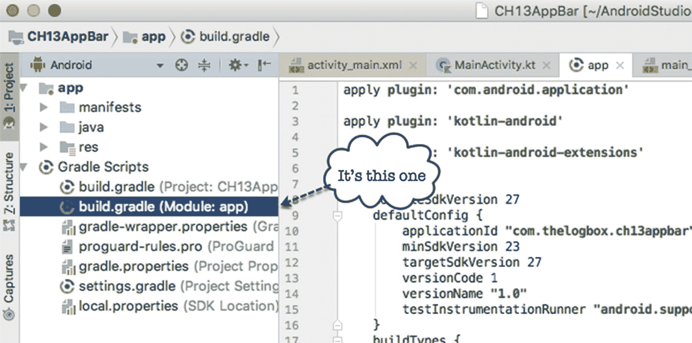

图 13-8

模块级 build.gradle

您需要添加“com.android.support:design”行，如清单 13-4 所示。

```kt
dependencies {
    implementation fileTree(dir: 'libs', include: ['*.jar'])
    implementation"org.jetbrains.kotlin:kotlin-stdlib-jre7:$kotlin_version"
    implementation 'com.android.support:appcompat-v7:27.1.0'
    implementation 'com.android.support.constraint:constraint-layout:1.1.2'
    testImplementation 'junit:junit:4.12'
    androidTestImplementation 'com.android.support.test:runner:1.0.2'
    androidTestImplementation 'com.android.support.test.espresso:espresso-core:3.0.2'

    implementation 'com.android.support:design:27.1.0'
}

Listing 13-4excerpt from build.gradle

```

AS3 会感觉到在构建文件中有什么改变，它会要求你“同步”gradle 文件。该提示将在主编辑器的上部显示为黄色条。单击“同步”以便继续。

现在我们准备创建菜单文件，但在此之前，让我们创建一个菜单文件夹。在项目窗口中右键点击 **app** ➤ **res** 文件夹，如图 13-9 所示。选择**新建** ➤ **安卓资源目录**。

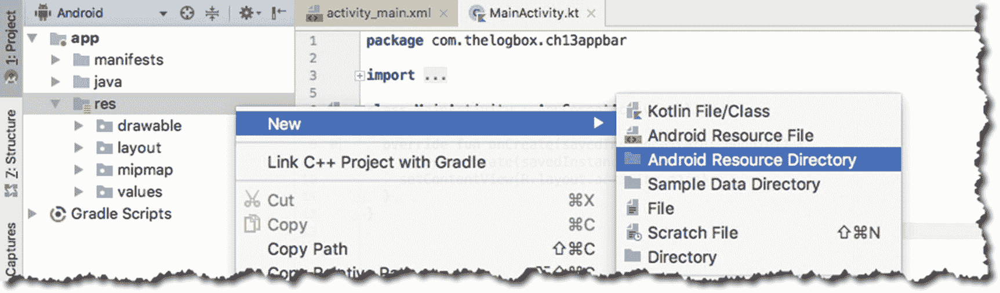

图 13-9

创建新的 Android 资源目录

给新创建的文件夹命名，如图 13-10 所示。

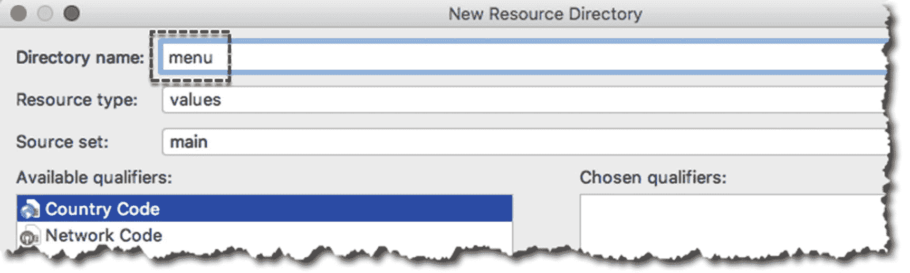

图 13-10

新菜单文件夹

现在我们有了一个菜单文件夹，右击它并创建一个新的菜单资源文件，如图 13-11 所示。

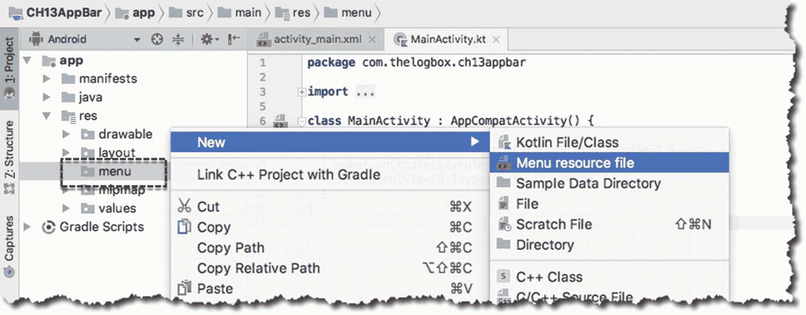

图 13-11

新菜单资源文件

让我们给新创建的菜单文件命名，如图 13-12 所示。

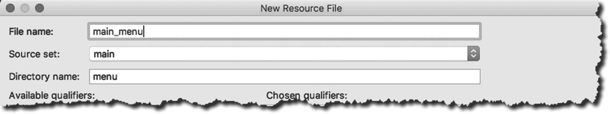

图 13-12

主菜单资源文件

让我们在菜单文件中添加一些项目。在主编辑器中打开文件**app/RES/menu/main _ menu . XML**，添加如清单 13-5 所示的菜单项。

```kt
<?xml version="1.0" encoding="utf-8"?>
<menu xmlns:android="http://schemas.android.com/apk/res/android">

  <item android:id="@+id/menuFile"
    android:title="@string/menuFile"
    />
  <item android:id="@+id/menuEdit"
    android:title="@string/menuEdit"
    />
  <item android:id="@+id/menuHelp"
    android:title="@string/menuHelp"
    />
  <item android:id="@+id/menuExit"
    android:title="@string/menuExit"
    />
</menu>

Listing 13-5app/res/menu/main_menu.xml

```

清单 13-5 中的每个项目元素代表一个菜单项。每个元素由两个属性组成:一个 **android:id** 和一个 **android:title** 。标题是您将在菜单上看到的内容，id 是对菜单项的编程引用。当我们想从程序中引用一个菜单项时，我们将使用这个 id。

**android:id** 是用 **@+id** 符号写的，这样在它还不存在的情况下会被创建。 **android:title** 是用 **@string** 符号编写的，所以标题的值在 app/res/values/strings.xml 文件中被解析。我们可以像这样对菜单标题进行硬编码:

```kt
<item android:id="@+id/menuFile"
  android:title="File" />

```

但这是一种糟糕的做法。Android 编程的惯例是在 *strings.xml* 资源文件中存储和检索字符串。将您的字符串存储在/app/res/values/strings.xml 中还可以让您更容易发布非英语版本的应用。想象一下，如果你创建了一个法语或意大利语版本的应用。您必须手动替换所有这些硬编码的字符串。但是如果您将字符串存储在 xml 文件中，那么您只需要在一个文件中替换它，这使得本地化和国际化变得更加容易。

一旦输入完菜单文件，您会注意到 AS3 抱怨新创建的菜单项。android:title 条目无法解析或者无法在 strings.xml 中找到。当然 AS3 找不到它——我们还没有创建它。

我们既可以手动将新条目添加到 strings.xml，也可以使用 AS3 的快速修复来解决错误。让我们使用快速修复。当 main_menu.xml 仍然在编辑器上时，点击@string/menuExit，如图 13-13 所示，然后按 **OPTION + ENTER** 或 **ALT + ENTER** 。

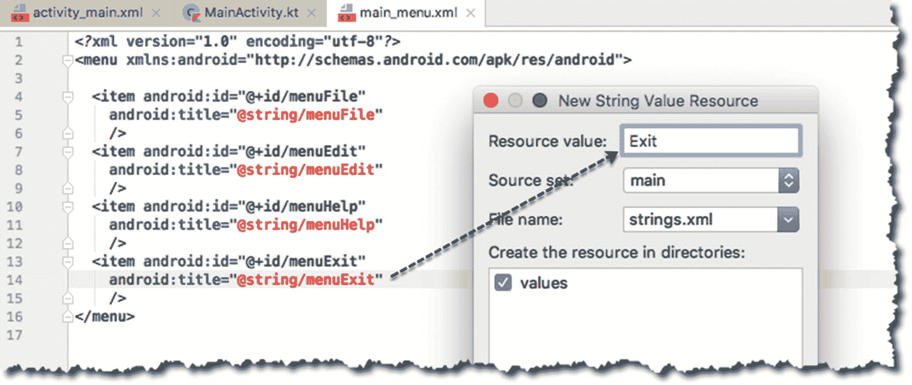

图 13-13

将菜单标题添加到 strings.xml

键入该项目的资源值，并对每个 android:title 属性重复这些步骤。资源值将存储在 app ➤ res ➤值➤ strings.xml 中——strings . XML 的内容如清单 13-6 所示。

```kt
<resources>
  <string name="app_name">CH13AppBar</string>
  <string name="menuExit">Exit</string>
  <string name="menuHelp">Help</string>
  <string name="menuEdit">Edit</string>
  <string name="menuFile">File</string>
</resources>

Listing 13-6app/res/values/strings.xml

```

下一步是将菜单与主活动关联起来。为此，我们需要通过覆盖 MainActivity 中的 **onCreateOptionsMenu** 来扩展菜单文件。

打开主活动。Kt，并开始添加一个顶级函数。一旦你开始输入 **onCreateOptionsMenu** 的前几个字符，AS3 会通过给出代码提示来帮助你。使用如图 13-14 所示的自动完成功能来完成功能的框架。

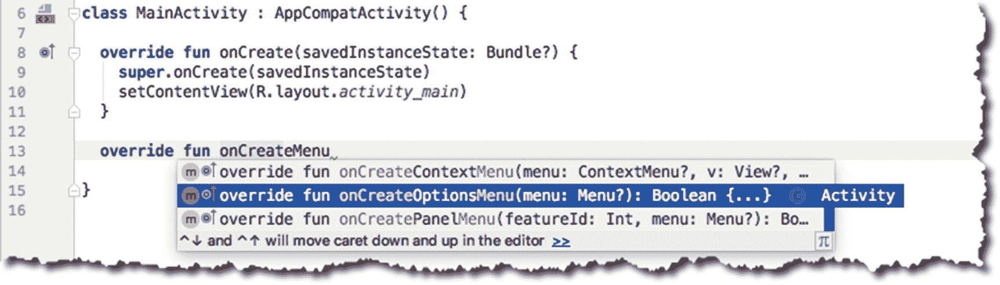

图 13-14

自动完成 onCreateOptionsMenu

复制清单 13-7 中的代码来完成 onCreateOptionsMenu。

```kt
override fun onCreateOptionsMenu(menu: Menu?): Boolean {
  menuInflater.inflate(R.menu.main_menu, menu)
  return super.onCreateOptionsMenu(menu)
}

Listing 13-7onCreateOptionsMenu

```

**inflate()** 函数使用我们之前创建的菜单 XML 文件(第一个参数)创建菜单项，并将其附加到菜单对象(inflate 函数的第二个参数)。Android 运行时在调用 onCreateOptionsMenu 回调函数时会把菜单传给我们。

图 13-15 显示运行时的菜单；左边的图片显示了溢出图标——它是三个白点，像垂直省略号一样排列。通过点击或触摸溢出图标显示菜单项。右图显示了我们的应用，显示了所有菜单项。

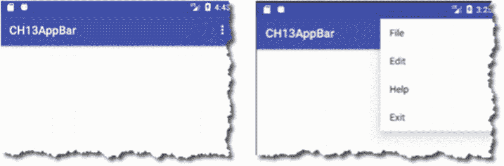

图 13-15

查帕尔菜单

现在，菜单项出现了，但是它们还没有做任何事情。为了处理每个菜单项的事件，我们将在 MainActivity 中覆盖 **onOptionsItemSelected()** 函数。

清单 13-8 显示了被覆盖的 onOptionsItemSelected 的代码。每次用户单击菜单项时，Android 运行时都会调用该方法。运行库将 MenuItem 对象传递给表示所单击的菜单项的函数。

```kt
override fun onOptionsItemSelected(item: MenuItem?): Boolean {
  return true
}

Listing 13-8onOptionsItemSelected

```

我们可以使用 MenuItem 来路由我们的程序逻辑，方法是将它的 **itemId** 属性与我们在 main_menu.xml 中定义的四个菜单项进行比较。

```kt
override fun onOptionsItemSelected(item: MenuItem?): Boolean {
  if(item?.itemId == R.id.menuFile) {
    showMessage(“File Menu “) // user defined function
    return true
  }

}

Listing 13-9comparing itemId with R.id.menuFile

```

注意我们如何使用安全调用操作符(？。)测试期间。我们需要使用安全调用，因为 MenuItem 在 onOptionsItemSelected 中被声明为可空，而且该函数应该返回一个布尔值。在我们的例子中，我们返回了 **true，**,这告诉 Android 运行时我们已经消费了这个事件，并且不需要其他侦听器进一步处理这个事件。我们可以继续使用 if-else 构造来路由程序逻辑，但是在这种情况下， **when** 构造可能更合适。清单 13-10 展示了如何在处理程序逻辑时使用**。你可能还记得第三章的和中提到 Kotlin 没有一个 **switch** 语句——这个 **when** 结构相当于 Java 的 switch。**

```kt
override fun onOptionsItemSelected(item: MenuItem?): Boolean {

  when(item?.itemId) {
    R.id.menuFile -> {
      showMessage("File menu")
      return true
    }
    R.id.menuEdit -> {
      showMessage("Edit menu")
      return true
    }
    R.id.menuHelp -> {
      showMessage("Help menu")
      return true
    }
    R.id.menuExit -> {
      showMessage("Exit")
      return true
    }
  }

Listing 13-10using when to route program logic

```

清单 13-11 、 13-12 和 13-13 分别显示了 MainActivity、activity_main 和 build.gradle 的完整代码。如果您正在编写代码，您可以使用它作为参考。

```kt
apply plugin: 'com.android.application'
apply plugin: 'kotlin-android'
apply plugin: 'kotlin-android-extensions'

android {
    compileSdkVersion 27
    defaultConfig {
        applicationId "com.thelogbox.ch13appbar"
        minSdkVersion 23
        targetSdkVersion 27
        versionCode 1
        versionName "1.0"
        testInstrumentationRunner "android.support.test.runner.AndroidJUnitRunner"
    }
    buildTypes {
        release {
            minifyEnabled false
            proguardFiles getDefaultProguardFile('proguard-android.txt'), 'proguard-rules.pro'
        }
    }
}

dependencies {
    implementation fileTree(dir: 'libs', include: ['*.jar'])
    implementation"org.jetbrains.kotlin:kotlin-stdlib-jre7:$kotlin_version"
    implementation 'com.android.support:appcompat-v7:27.1.0'
    implementation 'com.android.support.constraint:constraint-layout:1.1.2'
    testImplementation 'junit:junit:4.12'
    androidTestImplementation 'com.android.support.test:runner:1.0.2'
    androidTestImplementation 'com.android.support.test.espresso:espresso-core:3.0.2'
    implementation 'com.android.support:design:27.1.0'
}

Listing 13-13app/build.gradle

```

```kt
<?xml version="1.0" encoding="utf-8"?>
<android.support.constraint.ConstraintLayout xmlns:android=http://schemas.android.com/apk/res/android
  xmlns:app=http://schemas.android.com/apk/res-auto
  xmlns:tools=http://schemas.android.com/tools
  android:id="@+id/root_layout"
  android:layout_width="match_parent"
  android:layout_height="match_parent"
  tools:context=".MainActivity">

  <TextView
    android:layout_width="wrap_content"
    android:layout_height="wrap_content"
    android:text="Hello World!"
    app:layout_constraintBottom_toBottomOf="parent"
    app:layout_constraintLeft_toLeftOf="parent"
    app:layout_constraintRight_toRightOf="parent"
    app:layout_constraintTop_toTopOf="parent" />

</android.support.constraint.ConstraintLayout>

Listing 13-12complete code for activity_main.xml

```

```kt
import android.support.v7.app.AppCompatActivity
import android.os.Bundle
import android.support.design.widget.Snackbar
import android.view.Menu
import android.view.MenuItem

import kotlinx.android.synthetic.main.activity_main.*

class MainActivity : AppCompatActivity() {

  override fun onCreate(savedInstanceState: Bundle?) {
    super.onCreate(savedInstanceState)
    setContentView(R.layout.activity_main)
  }

  override fun onCreateOptionsMenu(menu: Menu?): Boolean {
    menuInflater.inflate(R.menu.main_menu, menu)

    return super.onCreateOptionsMenu(menu)
  }

  override fun onOptionsItemSelected

(item: MenuItem?): Boolean {

    when(item?.itemId) {
      R.id.menuFile -> {
        showMessage("File menu")
        return true
      }
      R.id.menuEdit -> {
        showMessage("Edit menu")
        return true
      }
      R.id.menuHelp -> {
        showMessage("Help menu")
        return true
      }
      R.id.menuExit -> {
        showMessage("Exit")
        return true
      }
    }

    return super.onOptionsItemSelected(item)
  }

  private fun showMessage(msg:String) {
    Snackbar.make(root_layout, msg, Snackbar.LENGTH_LONG).show()

  }
}

Listing 13-11complete code for MainActivity.Kt

```

## 章节总结

*   使用样式和主题可以立刻给你的应用增加活力。升级你的应用是最简单的事情。

*   动作栏中的菜单可以显示应用最重要的功能。

在下一章中，我们将:

*   看片段。您可以使用它们来使您的应用适应不同的外形和设备方向(纵向与横向)。

*   我们还将看看如何让片段相互交流。