# 十四、片段

*我们将介绍的内容:*

*   片段简介

*   横向和纵向

*   片段间通信

在 Android 的早期，当它只在手机上运行，没有任何高分辨率的屏幕时，activities 作为一种编写 UI 和与用户交互的方式就足够了。随后出现了平板电脑和高分辨率屏幕，创建可以在手机和平板电脑上良好运行的应用变得越来越困难。开发者面临着艰难的选择。要么选择功能最差的硬件作为目标，并使其成为最小公分母，要么通过根据设备的功能移除和添加 UI 元素来使应用适应一系列外形，这被证明是非常难以手动完成的。API 11(蜂巢)出来的时候，安卓用片段解决了这个问题。

## 片段简介

片段是一个非常高级的概念，初学者可能会战战兢兢地接近它，但是它背后的基本概念非常简单。如果我们把一个活动看作是 UI 的组成单元，那么就把一个片段看作是一个迷你活动——它是一个更小的组成单元。您通常会在运行时显示(和隐藏)片段，以响应用户的操作(例如，倾斜设备或从纵向切换到横向，从而腾出更多的屏幕空间)。你甚至可以使用片段作为适应设备外形的策略；当应用在较小的屏幕上运行时，您将只显示一些片段。

像活动一样，片段由两部分组成:一个 Java 程序和一个布局文件。想法几乎是一样的——在 XML 文件中定义 UI 元素，然后在程序文件中膨胀 XML 文件，这样 XML 中的所有视图对象都将成为一个对象。之后，我们可以使用 R.class 引用 XML 中的每个视图对象。一旦我们理解了这个概念，就可以将片段想象成一个普通的视图对象，我们可以将它拖放到主布局文件上——当然，片段不是普通的视图，但它们是视图。

为了创建一个片段，我们通常做以下事情:

1.  创建一个 XML 资源文件，放在 **/app/res/layout** 文件夹中，就像我们放 activity_main.xml 的地方一样。

2.  给新的资源文件起一个描述性的名字——比如说，`fragment_booktitles.`

3.  创建片段类。我们过去在创建片段时会在两个类之间选择——要么从原生的 **android.app.Fragment** 继承，要么从**Android . support . v4 . app . fragment**继承。如果您的目标 SDK 是 API 11 或更高版本，您可以使用前者，而对于任何低于 Android 3 (Honeycomb)的应用，您可以使用后者。你仍然可以使用 android.app.Fragment，但作为一个提醒，你需要知道 Android P(又名 Android 9)已经弃用了原生片段。如果您仍然想使用片段，请使用支持库，这样您就可以在所有 API 级别上获得一致的行为。

4.  接下来，将片段类与 XML 资源布局联系起来。您可以通过在 Fragment 类的 **onCreate** 方法中膨胀 XML 资源文件来做到这一点。

5.  添加新创建的片段。

让我们在 Android Studio 中完成它们。首先，创建一个包含空活动的项目，就像我们已经创建的所有其他项目一样。

现在，创建一个 XML 资源文件，放入 **/app/res/layout** ，如图 14-1 所示。

使用上下文菜单，右键单击项目工具窗口中的 **/app/res/layout** 文件夹(图 14-1 )。选择**新建** ➤ **布局** **资源文件**。这个布局资源文件将包含我们片段的所有视图元素。你会看到一个“新资源文件”的对话窗口；输入资源文件的名称—出于练习的目的，我将其命名为“book_titles”

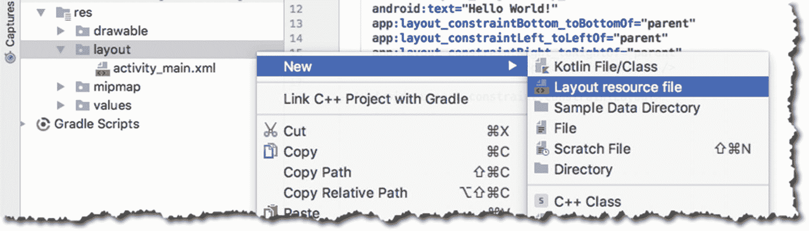

图 14-1

新布局资源文件

您可以放置任何您需要的视图元素。这个片段资源文件与我们之前处理过的任何活动资源文件没有什么不同。您可以将任何内容放入活动资源文件，也可以放入片段资源文件。

接下来，让我们创建片段类。再次使用上下文菜单创建类，如图 14-2 所示。

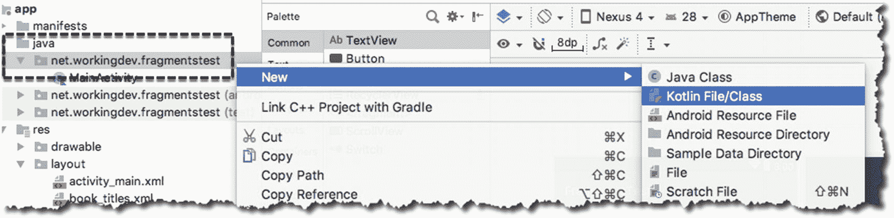

图 14-2

创建新的 Kotlin 类

如果您在创建新的 Kotlin 类时右键单击了**Java**➤**net . working dev . fragments test**，那么新创建的类将与您的其余代码属于同一个包。如果您在创建新的 Kotlin 类时右键单击 **java** 文件夹，该类将在默认包中；当这种情况发生时，您需要自己将 package 语句添加到类中。

您将被要求创建哪种 Kotlin 文件。从下拉菜单中选择类别，如图 14-3 所示。

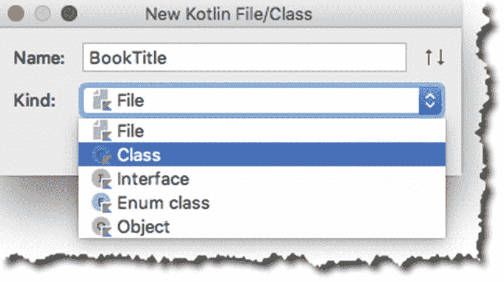

图 14-3

给 Kotlin 类命名

片段类可以通过膨胀资源文件并从 **onCreateView** 回调中返回来与 UI 资源文件相关联。清单 14-1 包含 MainActivity 的注释和解释片段；它展示了如何将片段类与 UI 资源文件连接起来。具体来说，项目符号❸是负责将片段类与 UI 资源文件相关联的代码。

<colgroup><col class="tcol1 align-left"> <col class="tcol2 align-left"></colgroup> 
| -好的 | 我们使用支持库中的 Fragment 类，因为 Android 9 不赞成使用 **android.app.Fragment** 。即使我们通常以 API 23 为目标，从现在开始最好总是使用受支持的库。 |
| ❷ | **onCreateView** 回调类似于活动的 onCreate。但是注意不要在这里引用任何视图元素——它们现在还不可用。如果您试图在这里引用一个 UI 元素(例如，一个按钮或文本字段)，它将返回 null。 |
| -你好 | 在这个例子中，UI 资源文件的名称是 **book_titles** 。因此，假设您有一个名为**/app/RES/layout/book _ titles . XML**的文件。膨胀 XML 资源文件并返回它，以便 MainActivity 可以在它的末端组成 UI。当你在 **onCreateView** 中时，你不能引用任何 UI 元素的原因是因为你还没有膨胀 XML 资源，所以此时你的 UI 元素都不存在。Android 运行时将**充气器**和**容器**对象传递给 **onCreateView** 方法。我们需要这些对象来扩充 UI 资源。 |
| (a) | 当所有 UI 元素就绪时，运行时调用 onViewCreated 方法**。这是您可以开始使用和引用 UI 元素的地方。** |

```kt
import android.support.v4.app.Fragment    ❶
...

class BookTitle : Fragment() {

  override fun onCreateView(inflater: LayoutInflater, container: ViewGroup?, savedInstanceState: Bundle?): View? {            ❷

    val v = inflater.inflate(R.layout.book_titles, container, false) ❸
    return v
  }

  override fun onViewCreated(view: View, savedInstanceState: Bundle?) {
    ❹
  }
}

Listing 14-1BookTitle Fragment

```

### 注意

“膨胀”UI 资源文件意味着接受 UI 定义(XML 格式)，创建实际的视图和视图组对象，并呈现它们。在展开过程之后，您将能够以编程方式引用视图对象。

最后一步是将片段添加到活动中。您可以通过两种方式向活动添加片段:在运行时或在设计时。现在，我们将在设计时添加片段。

打开 MainActivity 的 UI 资源文件(如果它尚未打开)。在项目工具窗口中，双击**/app/RES/layout/activity _ main . XML**。在“设计”模式下打开它。在调色板中，到**常用**，寻找 **<片段>，**，如图 14-4 。

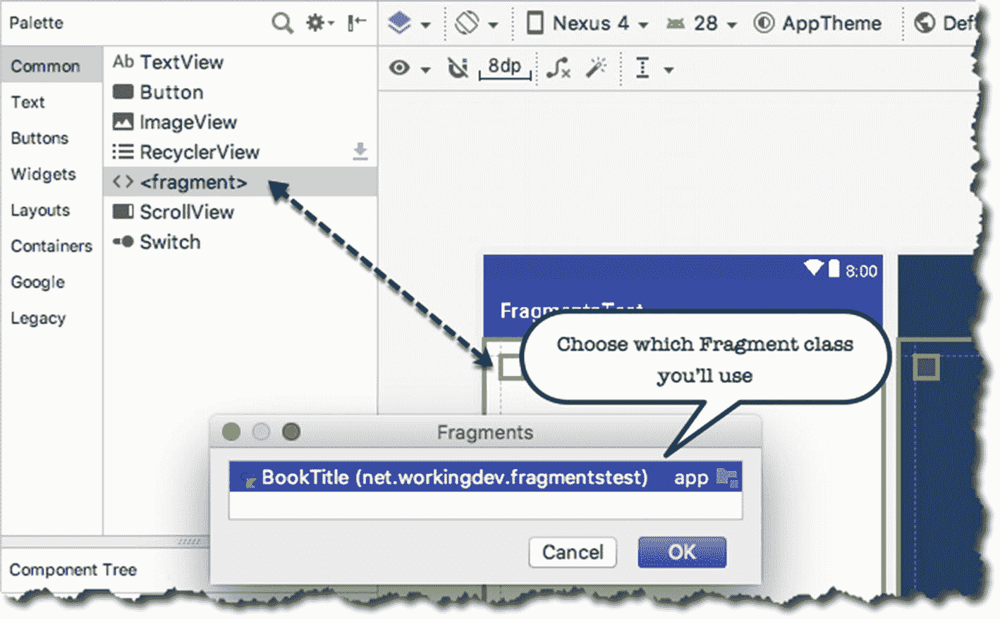

图 14-4

将片段元素拖到 activity_main 中

将 **<片段>** 元素拖放到活动中的任意位置，就像拖放任何视图元素一样。将弹出一个片段对话框；您需要选择想要添加到 **activity_main** 布局中的片段类。在我们的例子中，只有一个片段类—选择 BookTitle 片段。

就这样，我们现在可以运行我们无趣和无趣的片段样本了。如果你运行它，它看起来像模拟器中的图 14-5 。


图 14-5

片段测试，运行

尽管它很无趣，但它应该让你在片段的基础上打好基础。现在，我们准备好了一些更有趣的东西。在下一节中，我们将创建一个包含两个片段的演示项目。

## 书名和描述，片段演示

我们想做的是:

1.  在我们的主活动中使用两个片段。

2.  其中一个片段包含一个书单；我们将让用户通过单击一个单选按钮来选择一本书。

3.  另一个片段包含对当前选中的书的描述。

4.  这些片段将根据用户手持设备的方式(纵向或横向)自行重新排列。

在运行时，当设备垂直放置时，应用看起来如图 14-6 所示。

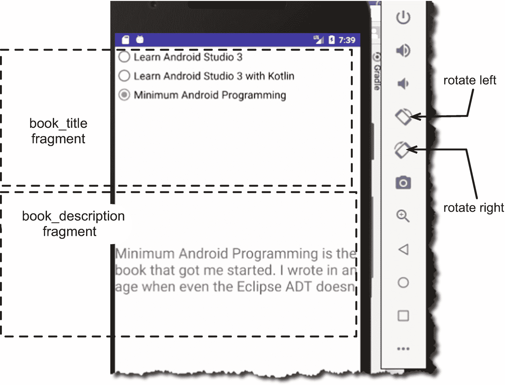

图 14-6

图书标题应用，垂直方向(纵向)

当用户在横向模式下手持设备时，它看起来如图 14-7 所示。

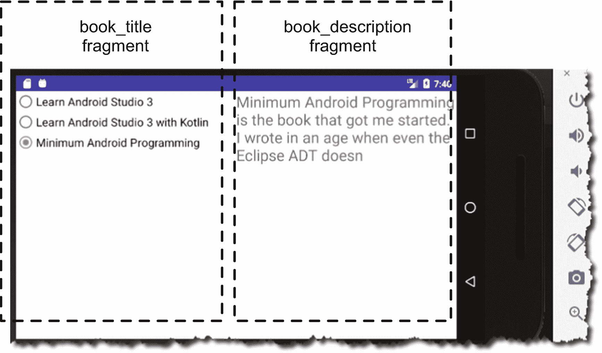

图 14-7

水平方向，横向

我们已经知道了如何创建片段，以及如何将它们添加到活动中，但是为了完成这个演示项目，我们将需要散列更多的细节。

1.  **我们如何使用单选按钮作为选择器**，这样当一个按钮被选中时，其他的按钮就会被取消选中？我们将使用一个单选按钮组并收集该组下的所有单选按钮。

2.  我们将在哪里存储每本书的文本定义？我们将使用一个 XML 文件，然后将其加载到一个数组中。数组的每个元素将包含一本书的定义。

3.  我们如何同步两个片段之间的信息呢？我们将探索片段间的交流。我们不会让片段直接相互通信(虽然我们可以，但这不是好的做法)。我们将通过活动来管理同步。

4.  我们如何处理设备方向的**变化？我们将在 **/app/res** 中专门为风景布局创建另一个布局文件夹。它将被命名为**/app/RES/layout-land**；当设备处于横向时，这是我们放置布局文件的地方。**

那我们开始工作吧。我为此演示创建了一个新项目；详情见表 14-1 。

表 14-1

项目详细信息

<colgroup><col class="tcol1 align-left"> <col class="tcol2 align-left"></colgroup> 
| 

项目详细信息

 | 

价值

 |
| --- | --- |
| 应用名称 | ch14 片段书籍 |
| 公司域 | 使用您的网站名称 |
| Kotlin 支架 | 是 |
| 波形因数 | 仅限手机和平板电脑 |
| 最低 SDK | API 23 棉花糖 |
| 活动类型 | 空的 |
| 活动名称 | 主要活动 |
| 布局名称 | 活动 _ 主要 |

让我们创建 XML 资源文件，它将保存书籍描述的文本。为此，您可以:

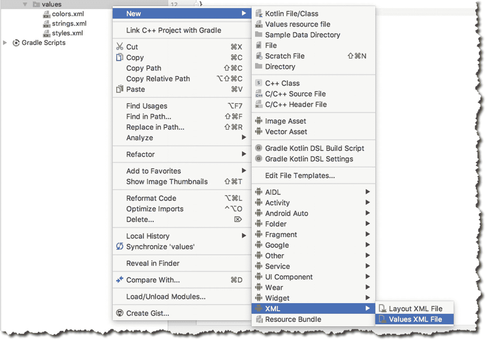

图 14-8

创建新的 XML 值文件

1.  使用上下文菜单，在项目工具窗口中右键单击/ **app/res/values** ，然后

2.  点击**新建** ➤ **XML** ➤ **值 XML 文件**，如图 14-8 所示。

3.  将其命名为“图书描述”——不要键入*。xml* 扩展名；Android Studio 会处理好的。

在编辑器中打开 bookdescriptions.xml，将清单 14-2 的内容复制到其中。

```kt
<?xml version="1.0" encoding="utf-8"?>
<resources>
  <string-array name="bookdescriptions">
    <item>
       How to use Android Studio 3, but also teaches you how basic
Android programming. And hey, in case you're also a beginner in Java, that's covered too.
    </item>
    <item>
      This book is also about how to use Android Studio. Like the first one,
      it also teaches you the basics of the IDE and Android programming; but
      this time around, you'll use Kotlin. The newest kid in the JVM block
    </item>
    <item>
      Minimum Android Programming is the book that got me started. I wrote
      in an age when even the Eclipse ADT doesn't exist yet. So, this means
      you'll use the Android SDK in all the glory of the CLI tools
    </item>
  </string-array>
</resources>

Listing 14-2/app/res/values/bookdescriptions.xml

```

现在我们可以研究片段了。让我们首先创建 *book_titles* 片段。创建一个新的布局资源文件，并将其命名为“book_titles”

清单 14-3 显示了**/app/RES/layout/book _ titles . XML**的内容

<colgroup><col class="tcol1 align-left"> <col class="tcol2 align-left"></colgroup> 
| -好的 | 获取单选按钮组视图。 |
| ❷ | 添加第一个单选按钮作为 RadioGroup 的子节点。 |
| -你好 | 对第二个单选按钮执行相同的操作。 |
| (a) | 对第三个无线电按钮进行同样的操作 |

```kt
<?xml version="1.0" encoding="utf-8"?>
<android.support.constraint.ConstraintLayout xmlns:android="http://schemas.android.com/apk/res/android"
  xmlns:app="http://schemas.android.com/apk/res-auto"
  xmlns:tools="http://schemas.android.com/tools"
  android:layout_width="match_parent"
  android:layout_height="match_parent"
  tools:layout_editor_absoluteY="81dp">

  <RadioGroup                                 ❶
    android:id="@+id/radioGroup"
    android:layout_width="354dp"
    android:layout_height="wrap_content"
    tools:layout_editor_absoluteX="16dp"
    tools:layout_editor_absoluteY="75dp">

    <RadioButton                              ❷
      android:id="@+id/rlas3"
      android:layout_width="wrap_content"
      android:layout_height="wrap_content"
      android:layout_weight="1"
      android:text="Learn Android Studio 3"
      android:textSize="18sp" />

    <RadioButton                              ❸
      android:id="@+id/rlas3kotlin"
      android:layout_width="wrap_content"
      android:layout_height="wrap_content"
      android:layout_weight="1"
      android:text="Learn Android Studio 3 with Kotlin"
      android:textSize="18sp" />

    <RadioButton                              ❹
      android:id="@+id/rminandroid"
      android:layout_width="wrap_content"
      android:layout_height="wrap_content"
      android:layout_weight="1"
      android:text="Minimum Android Programming"
      android:textSize="18sp" />
  </RadioGroup>
</android.support.constraint.ConstraintLayout>

Listing 14-3/app/res/layout/book_titles.xml

```

接下来，让我们为 book_titles UI 创建片段类。使用上下文菜单，右键点击**/app/Java/net . working dev . ch 14 fragment books**，然后选择**新建** ➤ **Kotlin 文件/类**。创建一个类，并将其命名为 BookTitle。在本课程中，我们需要做以下工作:

1.  它是一个片段，所以它需要继承片段类。

2.  覆盖 **onCreateView** 回调，膨胀 UI 资源文件，并返回。

3.  处理单选按钮的单击事件。有几种方法可以做到这一点。一种方法是为 radioGroup 设置一个监听器，另一种方法是为每个单选按钮设置一个点击监听器；我们选择后者。

清单 14-4 中显示了带注释(和解释)的 BookTitle 类。

<colgroup><col class="tcol1 align-left"> <col class="tcol2 align-left"></colgroup> 
| -好的 | 我们从支持库中扩展了片段类。我们还实现了**视图。OnClickListener** 接口。我们将使用该类作为三个单选按钮的 **onClick** 监听器对象。 |
| ❷ | 运行时调用 **onCreateView** 方法来组成片段的 UI。此时，该片段的 UI 元素都是不可访问的。您不能在这里进行任何 UI 更改或初始化。 |
| -你好 | 这将向运行时返回一个视图对象。我们正在膨胀 UI 资源文件。**膨胀**方法有三个参数:1. **UI 资源文件**。片段的 XML 布局，我们将使用 R.layout.book_titles。2.**这是片段的潜在父级，或者根**。为此，我们将只使用**容器**。3.**附着根**。这是一个布尔值。这个值将决定膨胀视图是否应该附加到根参数？如果为 false，root 仅用于为 XML 中的根视图创建 LayoutParams 的正确子类。 |
| (a) | 我们说单选按钮的监听器对象是 BookTitle 类的实例， *this* 类。 |
| (一) | **onClick** 回调来自**视图。OnClickListener** 接口。当单击其中一个单选按钮时，运行时将调用此方法并传递被单击的实际视图对象。这是我们规划程序逻辑的地方。我们将知道哪个单选按钮实际上被点击了。 |
| ❻ | **when** 构造非常适合路由程序逻辑。我们在这里测试 **View.id** 的运行时值； *R.id.rlas3* 、 *R.id.rlas3kotlin* 和 *R.id.rminandroid* 是 book_title.xml 中单选按钮声明的*id*。 |
| ❼ | 我们给 **rlas3** 赋值为零，因为 rlas3 的描述在图书描述数组的*0*<sup>th</sup>元素中找到(我们还没有创建这个数组)。同样，rlas3kotlin 的定义是图书描述数组的第 1 个 <sup>st</sup> 元素，而 rminandroid 的定义是第 2 个 <sup>nd</sup> 元素。 |

```kt
import android.support.v4.app.Fragment
import android.view.LayoutInflater
import android.view.View
import android.view.ViewGroup

class BookTitle : Fragment(), View.OnClickListener {  ❶

  override fun onCreateView(inflater: LayoutInflater, container: ViewGroup?, savedInstanceState: Bundle?): View? {    ❷
    val v = inflater.inflate(R.layout.book_titles, container, false) ❸
    return v
  }

  override fun onViewCreated(view: View, savedInstanceState: Bundle?) {
    rlas3.setOnClickListener(this)          ❹
    rlas3kotlin.setOnClickListener(this)
    rminandroid.setOnClickListener(this)
  }

  override fun onClick(v: View?) {  ❺
    var index:Int = 0
    when(v?.id) {
      R.id.rlas3 -> {               ❻
        index = 0                   ❼
      }
      R.id.rlas3kotlin -> {
        index = 1
      }
      R.id.rminandroid -> {
        index = 2
      }
    }
  }
}

Listing 14-4BookTitle Fragment Class

```

既然已经完成了 *book_titles* 片段的两个组件，我们就可以处理 *book_description* 片段了。你已经知道如何创建一个片段，所以我将跳过指令，直接跳到代码。

创建一个新的 UI 资源，命名为 **book_description** ，确保它在 **/app/res/layout** 文件夹中。作为片段类的，将其命名为**图书描述**。

清单 14-5 和 14-6 分别显示了 book_description.xml 和 BookDescription 类的代码。

book_description 片段很简单。它只有一个 TextView 元素。注意，我们没有对这个片段使用 ConstraintLayout 我们可以使用，但是使用 LinearLayout 要简单得多。我们希望文本视图的宽度占据整个屏幕的宽度。如果您尝试按照练习进行，您可以简单地复制清单 14-5 并覆盖 book_description.xml 的内容。

<colgroup><col class="tcol1 align-left"> <col class="tcol2 align-left"></colgroup> 
| -好的 | 该语句读取文件**/app/RES/values/book descriptions . XML**，并从中创建一个数组。 |
| ❷ | 我们创建了一个小函数，它将负责修改描述文本视图中的文本。它接受一个 **Int** 值，我们将用它作为描述的选择器。数组的每个元素包含一本书的描述。 |
| -你好 | **arrbookdesc[bookindex]** 从数组中获取一个描述，然后将 TextView 的**文本**属性设置给它。 |

```kt
class BookDescription : Fragment() {

  lateinit var arrbookdesc: Array<String>
  var bookindex = 0

  override fun onCreateView(inflater: LayoutInflater, container: ViewGroup?, savedInstanceState: Bundle?): View? {

    val v = inflater.inflate(R.layout.book_description, container, false)
    arrbookdesc = resources.getStringArray(R.array.bookdescriptions) ❶

    return v
  }

  fun changeDescription(index:Int) : Unit { ❷
    bookindex = index
    txtdescription?.setText(arrbookdesc[bookindex]) ❸
  }

  override fun onViewCreated(view: View, savedInstanceState: Bundle?) {
    changeDescription(bookindex)
  }
}

Listing 14-6
BookDescription class

```

```kt
<?xml version="1.0" encoding="utf-8"?>
<LinearLayout xmlns:android=http://schemas.android.com/apk/res/android
  xmlns:tools=http://schemas.android.com/tools
  android:layout_width="match_parent"
  android:layout_height="match_parent"
  android:orientation="vertical">

  <TextView
    android:id="@+id/txtdescription"
    android:layout_width="match_parent"
    android:layout_height="wrap_content"
    android:text="TextView"
    android:textSize="24sp" />
</LinearLayout>

Listing 14-5/app/res/layout/book_description.xml

```

现在这两个片段已经构建好了，我们可以把注意力放在主活动上了。它需要做三件事:

1.  **把两个片段抱在一起**；

2.  **充当每个片段的信使。**当用户在 book_titles 片段中选择一本书时，我们需要在 *bookdescriptions* 数组中查找该书的描述，并相应地修改 book_description 片段中的文本描述；和

3.  **根据设备的方向调整两个片段**的排列。如果设备垂直定向，两个片段将从上到下堆叠排列。当设备水平放置时，堆叠将从左到右进行。

让我们先努力实现第三个目标。现在，我们只有一个布局文件夹， **/app/res/layout** 文件夹是 Android 寻找布局资源的默认位置。这就是为什么我们总是把我们的 **activity_main.xml** 放在这个文件夹中的原因。有一个约定，如果我们创建一个名为 **/app/res/layout-land 的文件夹，**当设备处于风景模式时，Android 会在这个文件夹中查找布局文件。我们将利用这一惯例来实现我们的目标。

还有，我们需要解决从上到下和从左到右的堆叠顺序。最简单的方法是将 *activity_main 的*布局从 ConstraintLayout 改为 LinearLayout。想法是为/app/res/layout 和/app/res/layout-land 提供相同的 *activity_main* xml 文件，但是我们将更改 LinearLayout 方向，以便在默认布局文件夹中，方向是垂直的(默认)，而在 layout-land 文件夹中，方向是水平的。我们还会做一些改动，但是我们会在一段时间内完成。

要将 activity_main 的布局转换为 LinearLayout，请执行以下操作:

1.  在设计视图中打开 activity_main.xml。

2.  In the “Component Tree” tool window, right-click on “ConstraintLayout, as shown in Figure 14-9.

    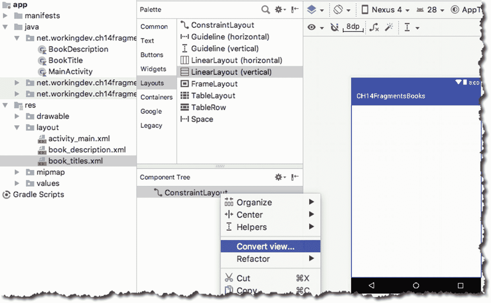

    图 14-9

    将 activity_main 转换为 LinearLayout

3.  选择**转换视图**。

4.  A dialog box will appear; choose LinearLayout, as shown in Figure 14-10.

    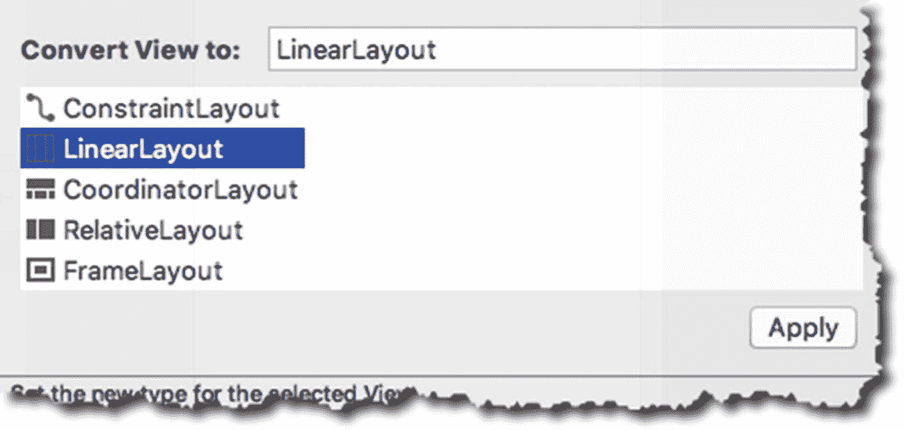

    图 14-10

    转换为线性布局

清单 14-7 显示了修改后的 activity_main 的代码(转换为 LinearLayout 之后)。

<colgroup><col class="tcol1 align-left"> <col class="tcol2 align-left"></colgroup> 
| -好的 | layout _ width:“match _ parent”表示布局将跨越整个屏幕宽度。 |
| ❷ | \这意味着布局将跨越屏幕的整个高度。 |
| -你好 | 方向:“垂直”意味着我们在布局中放置的任何视图都将从上到下排列。 |

```kt
<LinearLayout xmlns:android="http://schemas.android.com/apk/res/android"
  xmlns:app="http://schemas.android.com/apk/res-auto"
  xmlns:tools="http://schemas.android.com/tools"
  android:layout_width="match_parent"  ❶
  android:layout_height="match_parent" ❷
  android:orientation="vertical"       ❸
  tools:context=".MainActivity">

</LinearLayout>

Listing 14-7Code of activity_main.xml

```

接下来，将这两个片段添加到 activity_main 中。在设计模式下打开 activity_main，进入**调色板** ➤ **常用**，然后找到 **<片段>，**如图 14-11 所示。首先添加 BookTitle 片段。重复该过程并添加图书描述。

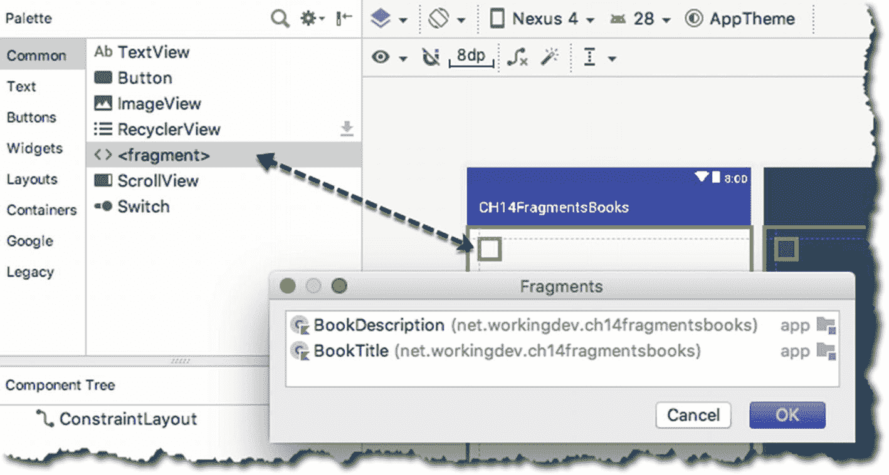

图 14-11

将片段元素拖到 activity_main 中

清单 14-8 显示了添加了两个片段的 activity_main.xml。

<colgroup><col class="tcol1 align-left"> <col class="tcol2 align-left"></colgroup> 
| -好的 | 我们希望顶部片段横跨整个宽度。 |
| ❷ | 高度设置为 0px 即可。我们将让运行时为我们决定高度。反正我们用的是布局权重。 |
| -你好 | 假设权重为“1”你在这里用什么数并不重要，只要另一个片段有相同的重量。 |
| (a) | 我们还希望底部的片段横跨整个宽度。 |
| (一) | 我们让运行时决定高度；把这个也设置成 0px。 |
| ❻ | 我们希望顶部和底部的片段有相等的高度。因此，我们也将这里的权重设置为“1”。 |

```kt
<?xml version="1.0" encoding="utf-8"?>
<LinearLayout xmlns:android="http://schemas.android.com/apk/res/android"
  xmlns:app="http://schemas.android.com/apk/res-auto"
  xmlns:tools="http://schemas.android.com/tools"
  android:layout_width="match_parent"
  android:layout_height="match_parent"
  android:orientation="vertical"
  tools:context=".MainActivity">

  <fragment
    android:id="@+id/fragmentbooktitle"
    android:name="net.workingdev.ch14fragmentsbooks.BookTitle"
    android:layout_width="match_parent"   ❶
    android:layout_height="0px"           ❷
    android:layout_weight="1" />          ❸

  <fragment
    android:id="@+id/fragmentbookdescription"
    android:name="net.workingdev.ch14fragmentsbooks.BookDescription"
    android:layout_width="match_parent"   ❹
    android:layout_height="0px"           ❺
    android:layout_weight="1" />          ❻

</LinearLayout>

Listing 14-8activity_main With book_titles and book_description Fragments

```

这就是默认的纵向方向。现在，让我们在横向方向上工作。为了在设备水平放置时控制应用的外观和行为，我们需要做四件事。它们概述如下:

1.  创建文件夹 **/app/res/layout-land** 。

2.  在 **layout-land** 中创建另一个 UI 资源文件；我们也将命名为 activity_main。

3.  将/app/res/layout/activity_main 的内容复制到/app/RES/layout-land/activity _ main。

4.  在/app/RES/layout-land/activity _ main 中进行必要的方向更改。

首先，您需要切换项目工具窗口的视图。现在我们正在使用“Android 视图”，我们需要转到“项目视图”转到项目工具窗口的上部区域，点击向下箭头(如图 14-12 所示)，然后选择“项目”

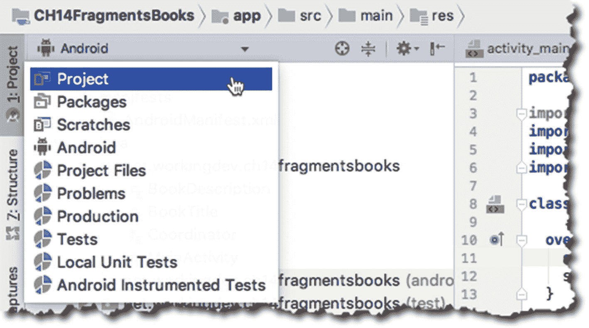

图 14-12

从 Android 视图更改为项目视图

创建文件夹布局-在/app/res 文件夹中着陆。右键点击/app/res 文件夹，然后选择**新建** ➤ **安卓资源目录**。将新目录命名为“layout-land”，如图 14-13 所示。

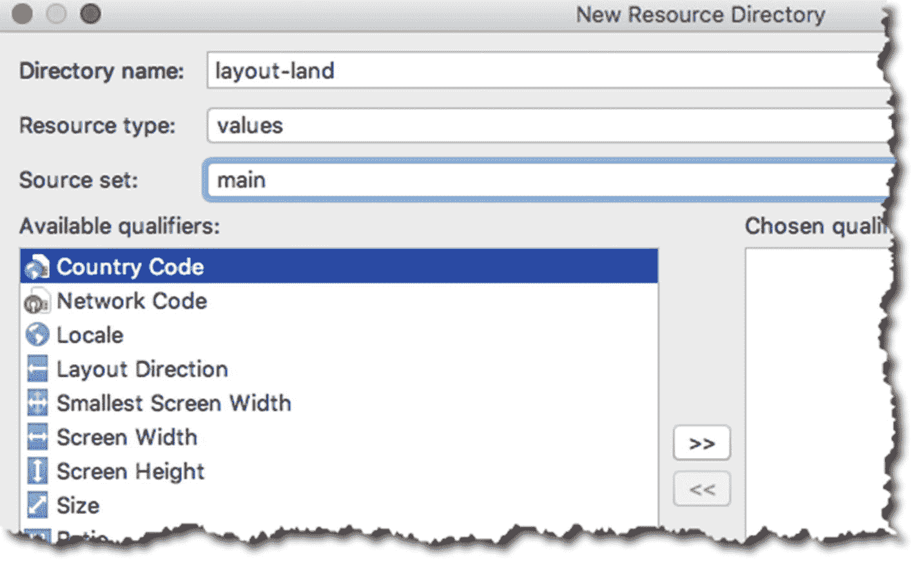

图 14-13

新资源目录

右键单击新创建的 layout-land 文件夹，然后选择**新建** ➤ **布局资源文件**。

将文件命名为“activity_main”，并为“根元素”选择 LinearLayout，如图 14-14 所示。

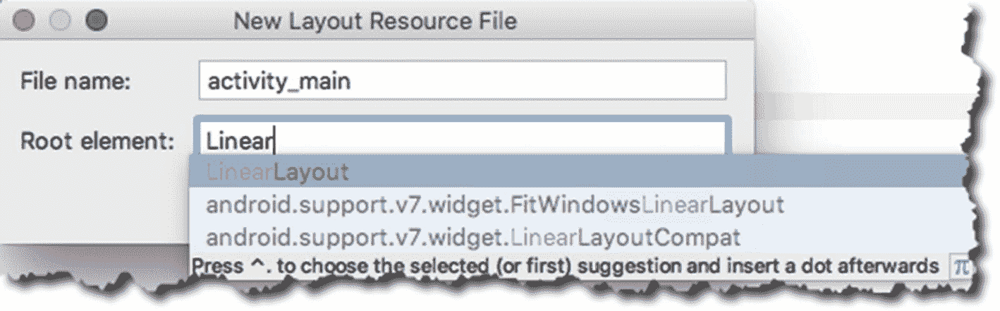

图 14-14

新布局资源文件

将/app/RES/layout/activity_main . XML 的内容复制到 layout-land 中这个新创建的 activity _ main 中，并进行适当的修改，如清单 14-9 所示。

<colgroup><col class="tcol1 align-left"> <col class="tcol2 align-left"></colgroup> 
| -好的 | 我们处于横向模式，所以这需要是“水平的”。使用此设置，片段将从左到右排列，而不是从上到下。 |
| ❷ | 在纵向模式下，layout_width 设置为“match_parent”，layout_height 设置为“0px”。我们将在横向模式下反转这些设置。所以把 layout_width 设置为“0px”。 |
| -你好 | 将 layout_height 设置为“match_parent”。 |
| (a) | 和往常一样，我们希望这两个片段具有相等的权重，所以在这里使用“1”。确保另一个片段中的 layout_weight 也是“1” |

```kt
<?xml version="1.0" encoding="utf-8"?>
<LinearLayout xmlns:android="http://schemas.android.com/apk/res/android"
  xmlns:app="http://schemas.android.com/apk/res-auto"
  xmlns:tools="http://schemas.android.com/tools"
  android:layout_width="match_parent"
  android:layout_height="match_parent"
  android:orientation="horizontal"   ❶

  tools:context=".MainActivity">

  <fragment
    android:id="@+id/fragmentbooktitle"
    android:name="net.workingdev.ch14fragmentsbooks.BookTitle"
    android:layout_width="0px"             ❷
    android:layout_height="match_parent"   ❸
    android:layout_weight="1" />           ❹

  <fragment
    android:id="@+id/fragmentbookdescription"
    android:name="net.workingdev.ch14fragmentsbooks.BookDescription"
    android:layout_width="0px"
    android:layout_height="match_parent"
    android:layout_weight="1" />

</LinearLayout>

Listing 14-9/app/res/layout-land/activity_main.xml

```

这个项目的最后一部分是同步这两个片段。图 14-15 提醒我们我们的小项目应该做什么。

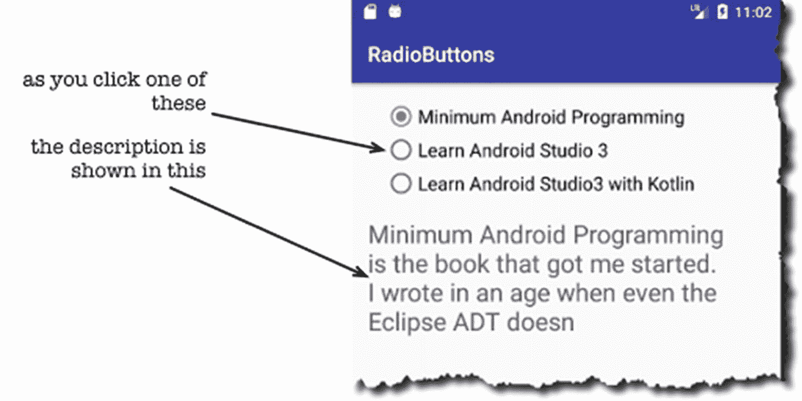

图 14-15

同步片段

当用户单击 book_titles 片段中的一个单选按钮时，book_description 片段应该会改变并显示当前所选书籍的描述。前面我们在 BookDescription 类中写了 **changeDescription** 函数；我们可以简单地从 BookTitle 类中调用这个函数，但这不是好的做法。为什么？因为如果我们这样做了，BookTitle 类将会知道很多关于 BookDescription 类的信息——这使得前者依赖于后者。开发人员称之为“紧耦合”，大多数时候应该避免这种情况。

如果我们不直接从 BookTitle 调用 changeDescription，我们要怎么做呢？图 14-16 显示了我们的表演。

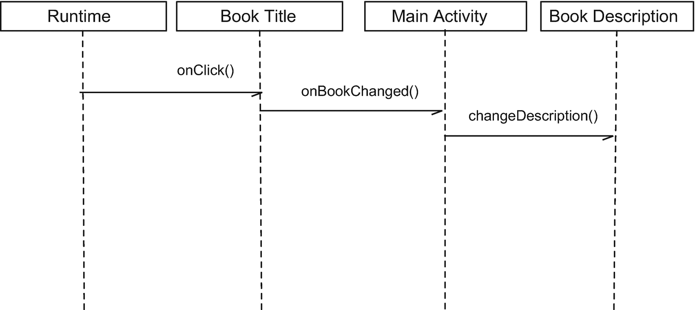

图 14-16

片段之间的通信

这个想法是通过主要活动来引导行动。在序列图中，BookTitle 调用活动中的 **onBookChanged** 函数，然后活动调用 BookDescription 中的 **changeDescription** 函数。敏锐的读者可能会注意到，我们只是简单地将依赖性从图书描述转移到主活动，这将使图书标题依赖于(并紧密耦合于)主活动。如果我们把主要活动和书名特别联系起来，你可能是对的。我们不会。我们将使用一个接口来代替；这种方法给了我们某种程度的间接性。它不再是紧密耦合的——至少，没有那么紧密。这是我们要做的。

1.  创建一个协调器接口——让我们把它命名为协调器，为什么不呢？

2.  在 MainActivity 中实现协调器接口。

3.  使用 BookTitle 中的协调员类型。当我们需要调用 BookTitle 中的 coordinator 方法时，我们将针对 Coordinator 类型进行调用，而不是针对 MainActivity。

要创建一个接口，在项目工具窗口中右击你的项目包(如图 14-17 )，然后点击**新建** ➤ **Kotlin 文件/类**。

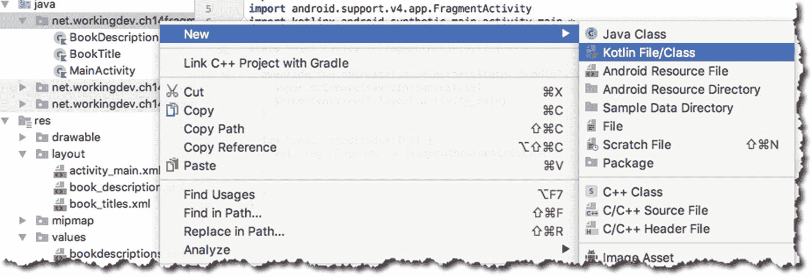

图 14-17

创建新的 Kotlin 文件/类

如图 14-18 所示，将其命名为“协调器”，然后将“种类”改为“接口”

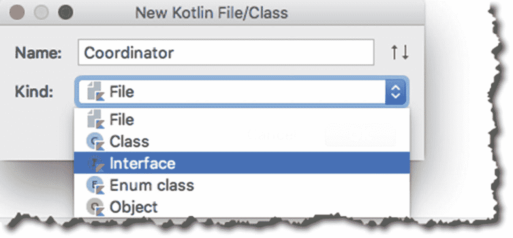

图 14-18

新界面

清单 14-10 显示了**协调器**接口的代码。

<colgroup><col class="tcol1 align-left"> <col class="tcol2 align-left"></colgroup> 
| -好的 | 声明一个接口。 |
| ❷ | 声明一个抽象方法。它接受一个 Int 参数。此参数代表 bookdescriptions 数组中的元素编号。无论我们在这里收到什么值，我们都将使用它来调用 BookDescription 片段中的 **changeDescription** 方法。顺便说一下，我们不必显式地将这个方法声明为*公共*和*抽象*——这是接口中所有方法的默认设置。 |

```kt
interface Coordinator {         ❶
  fun onBookChanged(index:Int)  ❷
}

Listing 14-10Coordinator.Kt

```

接下来，让我们在 MainActivity 中实现这个接口。清单 14-11 显示了带注释的代码。

<colgroup><col class="tcol1 align-left"> <col class="tcol2 align-left"></colgroup> 
| -好的 | 让我们实现协调器接口。 |
| ❷ | 覆盖 **onBookChanged** 方法。这在协调器接口中被声明为抽象的；我们必须在 MainActivity 中覆盖它，这样我们才能提供具体的行为。 |
| -你好 | 我们来获取一个对 BookDescription 片段的引用； **fragmentbookdescription** 是片段的 **id** 。这个调用返回一个**片段**类；*还没有*图书描述类。如果你以前使用 Java 处理过片段，你可能记得我们需要使用 **findFragmentById** 来做这种事情。我们不必再这样做了。Kotlin Android 扩展让我们可以通过 id 直接引用片段——它已经在 MainActivity 中合成了。 |
| (a) | 我们将**片段**(仍然是一个片段类)转换为**图书描述**。Kotlin 中的 **is** 操作器足够聪明，可以为我们自动执行转换。我们不必再执行显式强制转换。这是 Java 和 Kotlin 的又一个区别；在前一种情况下，你必须显式强制转换。在 Kotlin 中， **is** 操作符不仅相当于的**实例，它还为我们执行智能强制转换。** |
| (一) | 现在，我们可以调用 BookDescription 类的 **changeDescription** 方法。 |

```kt
import android.os.Bundle
import android.support.v7.app.AppCompatActivity
import kotlinx.android.synthetic.main.activity_main.*

class MainActivity : AppCompatActivity(), Coordinator { ❶

  override fun onCreate(savedInstanceState: Bundle?) {
    super.onCreate(savedInstanceState)
    setContentView(R.layout.activity_main)
  }

  override fun onBookChanged(index:Int) {   ❷
    val frag = fragmentbookdescription      ❸
    if (frag is BookDescription) {          ❹
      frag.changeDescription(index)         ❺
    }
  }
}

Listing 14-11MainActivity, Annotated

```

剩下要做的是在 BookTitle 类中进行更改。当单击单选按钮时，我们将执行以下操作:

1.  找出哪个按钮被点击了。

2.  根据单击时 radiobutton 的值，我们将为一个索引变量赋值；**0**—“学习 Android Studio 3”；**1**——跟 Kotlin 学习《Android Studio 3》；以及**2**–“最少安卓编程。整数 0、1 和 2 对应于 **bookdescriptions.xml** 的三个数组元素。

3.  使用协调器类型获取对 MainActivity 的引用；然后

4.  调用 **onBookChanged** 方法。

清单 14-12 展示了所有这些在代码中的样子。

<colgroup><col class="tcol1 align-left"> <col class="tcol2 align-left"></colgroup> 
| -好的 | 让我们找出哪个按钮被点击了。 |
| ❷ | 如果是“学习 Android Studio 3”的按钮，我们会将**索引**的值设置为 0，并相应地为 *rlas3kotlin* 和*terminandroid 设置**索引**的值。***when**构造实质上是将 radiobutton 的运行时值转换成一个 Int，我们可以用它作为数组的索引。 |
| -你好 | 让我们获取一个对当前正在运行的活动的引用，它是 **MainActivity** 。注意 **getActivity()** 不返回 MainActivity 的具体实例；它只是返回 main activity(fragmentation activity)的超类型。 |
| (a) | 让我们将**活动**转换为**协调者**类型。 |
| (一) | 最后，调用 **onBookChanged** 方法。 |

```kt
class BookTitle : Fragment(), View.OnClickListener {

  override fun onCreateView(inflater: LayoutInflater, container: ViewGroup?, savedInstanceState: Bundle?): View? {
    val v = inflater.inflate(R.layout.book_titles, container, false)
    return v
  }

  override fun onViewCreated(view: View, savedInstanceState: Bundle?) {
    rlas3.setOnClickListener(this)
    rlas3kotlin.setOnClickListener(this)
    rminandroid.setOnClickListener(this)
  }

  override fun onClick(v: View?) {
    var index:Int = 0
    when(v?.id) {                 ❶
      R.id.rlas3 -> {             ❷
        index = 0
      }
      R.id.rlas3kotlin -> {
        index = 1
      }
      R.id.rminandroid -> {
        index = 2
      }
    }

    val activity = getActivity()    ❸
    if (activity is Coordinator) {  ❹
      activity.onBookChanged(index) ❺
    }
  }
}

Listing 14-12BookTitle, Annotated

```

我们已经把所有的点联系起来了。现在我们可以:

*   在一个片段中使用单选按钮显示书籍；

*   在另一个片段中显示当前所选书籍的描述；和

*   根据设备方向的变化调整片段的布局。

尝试在模拟器中运行应用。点按几个按钮，然后尝试将方向从纵向更改为横向。尝试在从纵向模式到横向模式之间切换单选按钮。如果您想从横向切换到纵向，请使用模拟器上的旋转按钮(如图 14-19 所示),反之亦然。

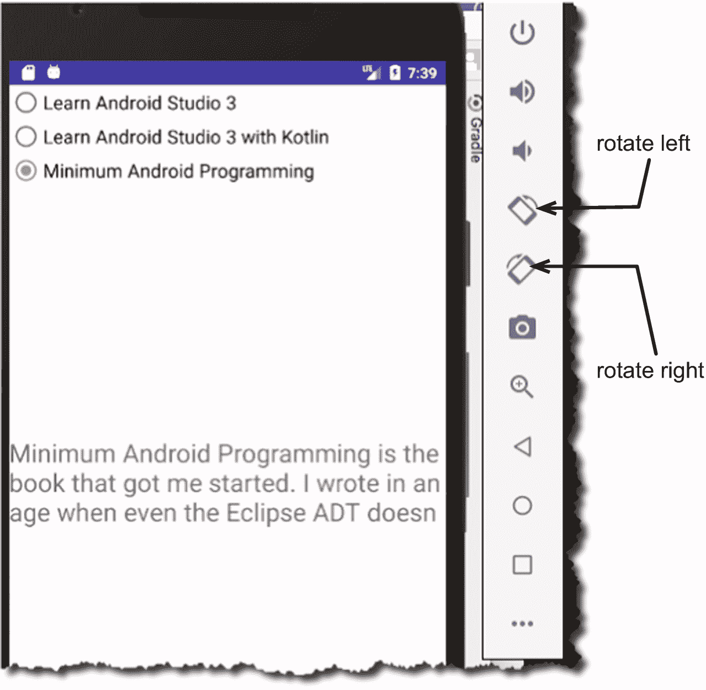

图 14-19

设备旋转按钮，模拟器

您可能已经注意到，当您更改设备方向时，这两个片段不同步。 **book_description** 片段总是回到“学习 Android Studio 3”的描述(bookdescription 数组上的第一个元素)。

只要您不改变设备的方向，这两个片段就会保持同步。当你改变方向时，片段会发生一些变化。

随着设备方向的改变，MainActivity 及其片段会发生一些变化。记住一个活动有一个生命周期？片段也有生命周期——它们与活动的生命周期相似，但也有显著的不同。我们不会进入片段生命周期的细节，也不会讨论活动生命周期如何影响片段的生命周期。我只想指出，当你改变装置的方向时，这个活动，连同片段，将会被拆除并重新构建。活动可能会进入以下状态并在其中转换(回调):

1.  **activity . onSaveInstanceState .**将调用片段的 onSaveInstanceState。

2.  **Activity.onPause** 。将调用片段 onPause。

3.  **活动停止**。Fragment 的 onStop 也将被调用。

4.  **Activity.onCreate** 。片段的 oncreate➤oncreate 视图➤ onViewCreated 将被调用。

5.  **Activity.onStart** 。将调用片段 onStart。

6.  **activity . onrestoreinstancestate**

7.  **Activity.onResume** 。将调用片段的 onRestoreInstance。

这里需要注意的是，当你改变方向时，片段会失去它们当前的状态。我们需要找到一种方法来保存数组索引的值(在 BookDescription 类中),在它被拆除并重新构建之前。幸运的是，我们知道运行时会调用活动的 **onSaveInstanceState** ，推而广之，也会调用片段的**onSaveInstanceState**；这个方法让我们将值保存在一个包中，所以当设备旋转时，我们将使用它来保存数组索引的值。清单 14-13 显示了 BookDescription 类的完整和带注释的代码。

<colgroup><col class="tcol1 align-left"> <col class="tcol2 align-left"></colgroup> 
| -好的 | 我们需要检查“bookindex”键是否不为空。我们第一次启动应用时，它将为空，因为应用还没有调用 **onSaveInstanceState** 。如果是 null，我们就默认**book index = 0**；我们使用数组中的第一个描述。 |
| ❷ | 如果它不为空，我们已经在“bookindex”键中保存了一个值；因此，获取“bookindex”的值，并将 **bookindex** 变量的值设置为该值。 |
| -你好 | 就在活动和片段被拆分和重建之前，运行时调用 **onSaveInstanceState** 。这个方法让我们可以访问一个 Bundle 对象；这是我们在 **onCreateView** 回调期间得到的同一个 Bundle 对象。使用键“bookindex”将 **bookindex** 的当前值保存到包中。 |

```kt
import android.os.Bundle
import android.support.v4.app.Fragment
import android.view.LayoutInflater
import android.view.View
import android.view.ViewGroup
import kotlinx.android.synthetic.main.book_description.*

class BookDescription : Fragment() {

  lateinit var arrbookdesc: Array<String>
  var bookindex = 0

  override fun onCreateView(inflater: LayoutInflater,
container: ViewGroup?, savedInstanceState: Bundle?): View? {

    val v = inflater.inflate(R.layout.book_description, container, false)
    arrbookdesc = resources.getStringArray(R.array.bookdescriptions)

    bookindex = if(savedInstanceState?.getInt("bookindex") == null) 0   ❶
    else { savedInstanceState.getInt("bookindex")}                      ❷

    return v
  }

  override fun onSaveInstanceState(outState: Bundle) {                  ❸
    outState.putInt("bookindex", bookindex)
  }

  override fun onViewCreated(view: View, savedInstanceState: Bundle?) {
    changeDescription(bookindex)
  }

  fun changeDescription(index:Int) : Unit {
    bookindex = index
    println("BOOK INDEX = $bookindex")
    txtdescription?.setText(arrbookdesc[bookindex])
    println(arrbookdesc[bookindex])
  }
}

Listing 14-13Complete Code for BookDescription, Annotated

```

## 片段演示，动态

既然我们知道了如何在设计时处理片段，让我们看看如何动态地处理片段。为了动态地添加片段，我们通常必须做以下事情:

1.  为片段创建布局资源和相应的 Kotlin 类；就像我们在之前的项目中所做的一样。

2.  在 MainActivity 中，我们创建了 fragment 类的一个实例。

3.  创建 FragmentManager 和 FragmentTransaction 对象的实例。

4.  为活动布局文件中的片段创建占位符。占位符是我们稍后放置片段的地方。

5.  使用 FragmentTransaction 对象，将片段添加到活动中。

这个项目和上一个几乎一样。唯一的区别是我们添加片段的方式。我认为最好为此创建一个新项目，这样可以保持之前的项目不变，以备将来参考。

用以下细节创建一个新项目(表 14-2 )。

表 14-2

项目详细信息

<colgroup><col class="tcol1 align-left"> <col class="tcol2 align-left"></colgroup> 
| 

项目详细信息

 | 

价值

 |
| --- | --- |
| 应用名称 | CH14FragmentsBooksDynamic |
| 公司域 | 使用您的网站名称 |
| Kotlin 支架 | 是 |
| 波形因数 | 仅限手机和平板电脑 |
| 最低 SDK | API 23 棉花糖 |
| 活动类型 | 空的 |
| 活动名称 | 主要活动 |
| 布局名称 | 活动 _ 主要 |

在大多数情况下，您只需复制并粘贴上一个项目中的文件。我建议你不要复制整个项目文件夹。创建一个新项目，并在以前的项目中重新创建您的步骤；使用与前一个项目完全相同的文件名创建相同的类、接口、xml 资源和 UI 资源。然后，将前一个项目中的文件内容复制到新项目的相应文件中。

完成后，表 14-3 显示了当前项目中哪个文件保持不变，哪个文件将发生变化。

表 14-3

新项目中的变更摘要

<colgroup><col class="tcol1 align-left"> <col class="tcol2 align-left"></colgroup> 
| 

文件

 | 

描述

 |
| --- | --- |
| MainActivity.Kt 公司 | 变化=是。我们需要添加 FragmentManager 和 FragmentTransaction 代码。 |
| activity_main.xml | 变化=是。我们将移除<fragment>元素并用一个占位符替换它。</fragment> |
| book_description.xml | 更改=否。保持不变。你可以复制粘贴然后不管它。 |
| 图书描述。滨鹬 | 更改=否。复制、粘贴，然后不去管它。 |
| book_titles.xml | 更改=否。原样复制。 |
| 书名.Kt | 更改=否。原样复制。 |
| bookdescriptions.xml | 更改=否。原样复制。 |
| 协调员。滨鹬 | 更改=否。原样复制。 |

正如您所看到的，这些更改都包含在主活动文件中。清单 14-14 显示了完整的代码，并注释了 activity_main.xml 中的变化。

<colgroup><col class="tcol1 align-left"> <col class="tcol2 align-left"></colgroup> 
| -好的 | 我们添加了一个 LinearLayout 容器；和 |
| ❷ | 我们将第一个容器命名为 **fragtop** 。这是 BookTitles 片段的占位符。 |
| -你好 | 我们添加了另一个 LinearLayout 容器；和 |
| (a) | 将这个命名为 **fragbottom** 。这是 BookDescription 片段的占位符。 |

```kt
<?xml version="1.0" encoding="utf-8"?>
<LinearLayout xmlns:android="http://schemas.android.com/apk/res/android"
  xmlns:app="http://schemas.android.com/apk/res-auto"
  xmlns:tools="http://schemas.android.com/tools"
  android:layout_width="match_parent"
  android:layout_height="match_parent"
  android:orientation="vertical"
  tools:context=".MainActivity">

  <LinearLayout                             ❶
    android:id="@+id/fragtop"               ❷
    android:layout_width="match_parent"
    android:layout_height="match_parent"
    android:layout_weight="1"
    android:orientation="horizontal">

  </LinearLayout>

  <LinearLayout                             ❸
    android:id="@+id/fragbottom"            ❹
    android:layout_width="match_parent"
    android:layout_height="match_parent"
    android:layout_weight="1"
    android:orientation="horizontal">

  </LinearLayout>
</LinearLayout>

Listing 14-14/app/res/layout/activity_main.xml

```

您会注意到 activity_main 不再包含 **<片段>** 元素。相反，我们放置了两个 LinearLayout 容器作为片段的占位符。当我们调用将片段添加到我们的活动中时，我们将把它们放在这些占位符中。这就是 UI 资源布局的变化程度。大部分的变化实际上将发生在主活动上。

在之前的项目中，我们静态地将片段添加到活动中，就片段而言，我们做得不多；但是现在我们将动态添加片段，我们将需要添加必要的代码来在运行时添加片段。

要动态地处理片段，您需要两个对象:FragmentManager 和 FragmentTransaction。您可以使用 FragmentManager 做很多事情，比如通过 Id 和标签查找片段；但是出于我们的目的，我们将只使用它来获取 FragmentTransaction 对象。

FragmentTransaction 负责在运行时添加、附加、分离和删除片段。出于我们的目的，我们将只使用它来添加片段。

清单 14-15 中显示了 MainActivity 的完整代码。

<colgroup><col class="tcol1 align-left"> <col class="tcol2 align-left"></colgroup> 
| -好的 | 创建一个 **BookTitle** 片段的实例。 |
| ❷ | 创建一个 **BookDescription** 片段的实例。 |
| -你好 | 让我们获取一个 FragmentTransaction 对象。 **supportFragmentManager** 是 Android Studio 和 Kotlin 的一项便利功能。实际的调用是**getSupportFragmentManager()**，但是它已经为我们合成了，所以我们不必使用实际的方法。接下来， **beginTransaction()** 调用是一个工厂方法，它给了我们一个 FragmentTransaction 对象。 |
| (a) | 让我们使用 FragmentTransaction 来添加一个片段。 **add** 方法有两个参数:1.视图对象的 id。这是我们在 activity_main.xml (fragtop)中添加的 LinearLayout 占位符的 id。2.片段的实例(fragBookTitle) |
| (一) | 同样的，我们再加上图书描述片段。 |
| ❻ | 我们必须调用 FragmentTransaction 的 **commit()** 方法来完成 FragmentTransaction 中的所有更改。如果不调用这个方法，什么都不会发生——不会添加片段。 |
| ❼ | 您还记得这个方法，当用户单击 **BookTitle** 片段中的一个单选按钮时，该片段将调用 MainActivity 中的 **onBookChanged()** 方法。 |
| ❽ | 在之前的项目中，我们必须找到 book_description 片段的 id，然后在调用 **changeDescription** 之前将其转换为 BookDescription 对象。我们不必再这样做了，因为我们可以直接引用 **BookDescription** 片段的实例。 |

```kt
import android.support.v7.app.AppCompatActivity
import android.os.Bundle

class MainActivity : AppCompatActivity(), Coordinator {

  lateinit var fragBookDescription: BookDescription
  lateinit var fragBookTitle: BookTitle

  override fun onCreate(savedInstanceState: Bundle?) {
    super.onCreate(savedInstanceState)
    setContentView(R.layout.activity_main)

    fragBookTitle = BookTitle()                 ❶
    fragBookDescription = BookDescription()     ❷
    val fragTransaction = supportFragmentManager.beginTransaction() ❸
    fragTransaction.add(R.id.fragtop, fragBookTitle)  ❹
    fragTransaction.add(R.id.fragbottom, fragBookDescription) ❺
    fragTransaction.commit() ❻

  }

  override fun onBookChanged(index:Int) {         ❼
    fragBookDescription.changeDescription(index)  ❽
  }
}

Listing 14-15MainActivity, Annotated

```

练习和本章到此结束。我们仅仅触及了片段的表面——它们比这里呈现的要多得多；但是希望，当你进一步探索它们的时候，这会给你一个好的基础。

## 章节总结

*   像活动一样，片段可以包含视图元素。他们也是一个组成单位，但更小。

*   您可以使用片段来响应不同的设备方向、外形或大小。

*   片段和活动一样，也有生命周期回调。

*   活动的生命周期对片段有影响。

*   当您更改设备的方向时，活动(和片段)会被拆除并重新构建。他们经历了一系列的生命周期回调。

*   Android P 弃用 **android.app.Fragments** 。所以，如果你想使用片段，使用支持库中的类。

在下一章中，我们将了解 Android 所谓的“jank”以及如何在代码中避免它。