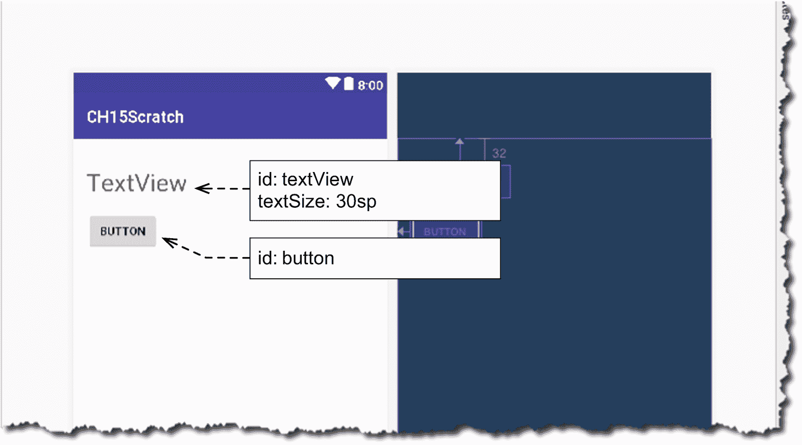
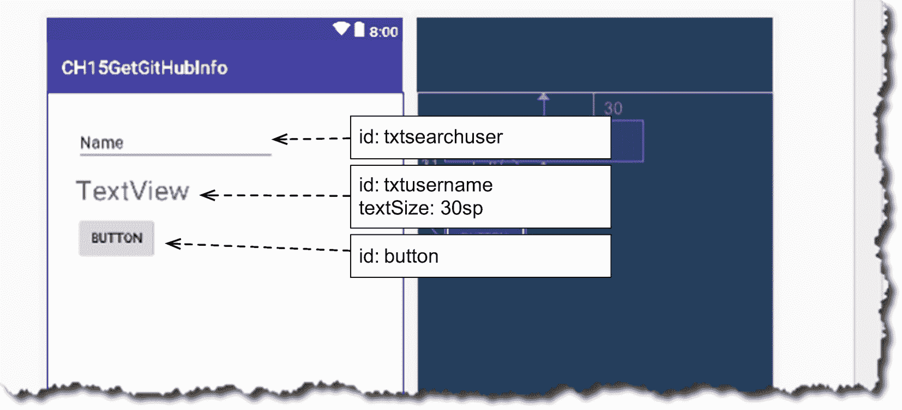
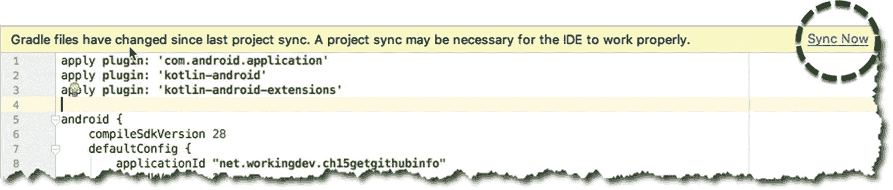
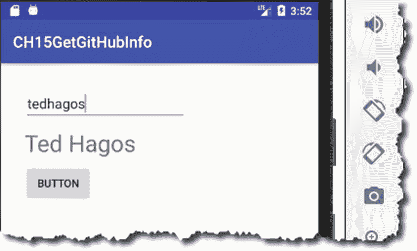

# 十五、在后台运行

*我们将介绍的内容:*

*   用户界面线程

*   线程和可运行程序

*   处理程序和消息

*   异步任务

*   安科的 doasync

没有人愿意使用缓慢的应用。用户希望他们的应用简洁明快。每个开发人员都希望这样——没有人开始构建他们的应用时会说，“这个应用太快了，也许我应该让它慢一点”；没人会这么做。那么，为什么会有像糖蜜一样移动的应用呢？你可能见过我说的这些应用中的一些——你知道你试图滚动一个回收器视图或列表，然后它开始，停止，并发出劈啪声。呆滞。

我们可以列出一些应用运行缓慢的原因，但我敢打赌 10 大原因之一是主线程上运行的太多了。它可能被一个 I/O 例程或一个复杂的计算所拖累，或者两者兼而有之，这很糟糕。

这是否意味着你不应该在你的应用中进行任何 I/O 调用或任何复杂的计算？一点也不。但是你应该知道把 I/O 调用或者复杂的计算放在哪里；而且不在主线程上。

在这一章中，我们将看看如何让运行缓慢的代码远离主线程，从而让应用能够快速而敏捷地做出响应。

## 基本概念

应用启动时会创建一个流程。它被分配了一些资源，比如内存和其他一些它需要的东西，这样它才能完成它的工作。它至少有一个线程。

不严格地说，线程是一系列指令。它是真正执行你的代码的东西。在应用运行期间，线程将利用进程的资源。它可以读取或写入数据到内存、磁盘，有时甚至是网络 I/O。当线程与所有这些交互时，它实际上只是在等待。它不能在等待时利用 CPU 周期。我们不能让这些 CPU 周期白白浪费掉。可以吗？我们可以做的是创建其他线程，这样当一个或多个线程在等待时，其他线程可以利用 CPU。多线程应用就是这种情况。

当运行时创建应用的实例时，该进程被赋予一个线程。它被称为主线程。一些开发者称之为 UI 线程。运行时只给了我们一个线程，仅此而已。但好消息是我们可以创造更多。UI 线程被允许产生其他线程。

## 用户界面线程

在我们深入到生成或创建子线程的细节之前，让我们先讨论一下 UI 线程。它负责启动主活动和扩展布局 xml，以便其中的所有视图元素都变成实际的 Java 对象(例如，按钮、文本视图等)。).简而言之，它是负责 UI 的人。

当你发出类似 **setText** 或者 **setHint** 的调用时，会在主线程上完成；如果你认为这些调用会立即执行，那就错了。无论你在应用中写什么，一般都会遵循以下步骤:

1.  这些语句将被放在一个 MessageQueue 中，并一直放在那里，直到

2.  一个处理程序把它捡起来执行；最后

3.  它在主线程上执行。

你可能会说，“知道这些很好，但那又怎么样呢？”。嗯，你应该关心这个，因为主线程不仅仅用于绘制 UI 元素。它也用于应用中发生的所有其他事情。记住，活动还有其他方法，如 **onCreate** 、 **onStop** 、 **onResume** 、 **onCreateOptionsMenu** 、 **onOptionsItemSelected** ，以及其他类似的方法；每当代码在这些块上运行时，Android 运行时无法处理队列中的任何消息。处于*阻塞*状态；阻塞状态是一个并发术语，开发人员用它来表示应用正在等待某件事情完成，然后才能继续处理它的业务。不要在意行话——只要记住屏蔽可能对用户体验不利。

怎么会这样？答案是“因为我们只有一个线程来做所有这些事情。”这个问题的解决方案是创建一个后台线程或子线程，并在其中执行我们的非 UI 任务——但并不总是这样。如果您认为这个调用在处理资源方面足够便宜，比方说 1 ms 到 15 ms，那么就在主线程上进行吧。如果需要 16 毫秒以上的时间，你应该在后台线程上完成。

16 毫秒阈值是 Android 4.1 (Jellybean)发布时“黄油计划”中的一个指导原则。它旨在提高 Android 应用的性能。当运行时感觉到你在主线程上做了太多的事情，它会开始丢帧。当你不打昂贵的电话时，应用以平滑的 60 FPS(每秒帧数)运行。如果你绑定了主线程，你会开始注意到缓慢的性能，或者 Android 团队所说的“jank”。我没有一个明确的指导方针可以告诉你什么是昂贵的电话，什么是便宜的电话。不过，我能做的是，向你们展示这两个调用的例子；希望你能了解什么是昂贵的电话和便宜的电话。

清单 15-1 是一个廉价的调用，即使它将文本属性设置为一个计算值。计算很简单，UI 线程不会出一点汗。

```kt
button.setOnClickListener {
  txtsecondnumber.setText((2 * 2 * 2).toString())
}

Listing 15-1Set Text Attribute to a Calculated Value: A Cheap Call

```

清单 15-2 可能看起来很复杂，因为它计算 GCF。如果数字很大怎么办——这对主线程来说不是太繁重了吗？不完全是。清单 15-2 使用欧几里德算法寻找 GCF。该算法以常数时间或 O(1)执行；这是开发人员在谈论算法的时间复杂度或代码完成需要多长时间时使用的另一种行话。O(1)或恒定时间意味着无论输入是大还是小，算法都将执行相同的操作；无论我们找到的 GCF 是 12 和 15 还是 16，848，662 和 24，时间复杂度都没有太大变化。所以，把这个放在主线程里还是挺好的。

### 注意

算法的时间复杂度可以表示为 O(1)、O(N)、O(N <sup>2</sup> )、O(2 <sup>N</sup> )或 O(log N)，其中 N 代表输入的大小。这是一个叫做大 O 的符号。了解它是有好处的——特别是如果你想写性能代码的话。

```kt
button.setOnClickListener {

  val numfno = txtfirstnumber.text.toString().toInt()
  val numsno = txtsecondnumber.text.toString().toInt()

  var numbig = if(numfno > numsno) numfno else numsno
  var numsmall = if(numfno < numsno) numfno else numsno

  var rem = numbig % numsmall

  while(rem != 0) {
    numbig = numsmall
    numsmall = rem
    rem = numbig % numsmall
  }
  Toast.makeText(this@MainActivity, "GCF is $numsmall", Toast.LENGTH_LONG).show()
}

Listing 15-2Calculate GCF: Still a Cheap Call

```

清单 15-3 被认为是昂贵的，因为它调用网络 I/O。事实上，代码甚至根本不会编译，因为它将导致一个**NetworkOnMainThreadException**。IDE 甚至不让我们完成编译过程。根据经验，如果您的代码将进行 I/O 调用，无论是本地文件还是网络，您都应该在后台线程中进行。

```kt
button.setOnClickListener {
  val url = "https://api.github.com/users/tedhagos"
  println("inside doGetHttp")
  val client = OkHttpClient()
  val request = Request.Builder().url(url).build()
  val response = client.newCall(request).execute()

  val bodystr = response.body().string()
}

Listing 15-3Read Something from GitHub: Expensive Call

```

清单 15-4 不做任何 I/O，但是函数 **killSomeTime** 模拟一个昂贵的调用。

```kt
button.setOnClickListener {
    killSomeTime()
  }
}

private fun killSomeTime() {
  for (i in 1..20) {
    textView.text = i.toString()
    println("i:$i")
    Thread.sleep(2000)
  }
}

Listing 15-4Do Something That Blocks: Expensive Call

```

清单 15-4 中的 **Thread.sleep** 调用完全暴露了代码将会阻塞的情况，但是它可以模拟一些需要 2 秒钟才能完成的事情。乍一看，你可能认为**文本视图**会每 2 秒更新一次来显示 *i* 的当前值，但这不会发生，因为运行时已经降低了帧速率。UI 线程无法更新 textView，因为它正在等待线程唤醒和恢复。

想象一下，如果您有一个类似于清单 15-5 的代码—它没有任何 I/O 调用或 **Thread.sleep** ，但是它不会像您所期望的那样更新文本字段(在循环的第二层)—同样，因为主线程正忙于计算笛卡尔积。

```kt
button.setOnClickListener {
  for (i in 1..100000) {
    for (j in 1..10000) {
      txtfirstnumber.setText((i*j).toString())
      for (k in 1..10000) {
        println("i: $i | j: $j | k$k | i*j*k = ${i*j*k}")
      }
    }
  }
}

Listing 15-5Deeply Nested Calculation: Expensive Call

```

### 注意

笛卡尔积是一个数学集合，它是其他集合相乘的结果。

在 Android 的早期版本中，在 Project Butter 之前，清单 15-3 、 15-4 和 15-5 中显示的代码可能会导致 ANR 错误(Android 没有响应)。如今，他们可能不再画 ANR 了，但是更大的担忧是 jank。为了避免 jank，我们应该将那些昂贵的调用转移到后台线程。在 Android 中有很多方法可以做到这一点。有些解决方案是在框架层面上找到的，比如 Loader API 或 AsyncTaskLoader 然而，这些东西从 API 28 开始就被弃用了，所以最好远离它们。在后台也有一些低级的方法来完成一些任务，它们是:

*   **线程和可运行线程**，来自 Java

*   AsyncTask 是 Android 框架的一部分

*   **处理程序和消息**，也是 Android 框架的一部分

*   Anko 的 doAsync 是一个用 Kotin 编写的第三方库

## 线程和可运行程序

让我们使用清单 15-14 作为我们探索的用例。要运行这些代码，你需要一个类似图 15-1 的用户界面；我们的基本 UI 的 xml 代码在清单 15-6 中。



图 15-1

我们的基本活动 _ 主要布局

```kt
<?xml version="1.0" encoding="utf-8"?>
<android.support.constraint.ConstraintLayout xmlns:android=http://schemas.android.com/apk/res/android
  xmlns:app=http://schemas.android.com/apk/res-auto
  xmlns:tools=http://schemas.android.com/tools
  android:layout_width="match_parent"
  android:layout_height="match_parent"
  tools:context=".MainActivity">

  <Button
    android:id="@+id/button"
    android:layout_width="wrap_content"
    android:layout_height="wrap_content"
    android:layout_marginStart="16dp"
    android:layout_marginTop="16dp"
    android:text="Button"
    app:layout_constraintStart_toStartOf="parent"
    app:layout_constraintTop_toBottomOf="@+id/textView" />

  <TextView
    android:id="@+id/textView"
    android:layout_width="wrap_content"
    android:layout_height="wrap_content"
    android:layout_marginStart="16dp"
    android:layout_marginTop="32dp"
    android:text="TextView"
    android:textSize="30sp"
    app:layout_constraintStart_toStartOf="parent"
    app:layout_constraintTop_toTopOf="parent" />
</android.support.constraint.ConstraintLayout>

Listing 15-6/app/res/layout/activity_main.xml

```

如果你现在试图运行清单 15-4 ，它将会运行；但是不会跑的很好。您将注意到以下内容:

1.  你期望**文本视图**每 2 秒刷新一次，以显示 *i* 的当前值。不会的。这些帧会被删除，所以你看不到任何用户界面活动。

2.  但是你会看到 *I* 的值，因为它在 **Logcat** 窗口中每 2 秒更新一次。这是因为 **println** 不受帧率降低的影响——输出是在控制台中，而不是在 UI 中。

3.  您可能会看到来自运行时的**编排器:**的类似这样的消息

    ```kt
    07-31 15:51:29.646 13403-13403/net.workingdev.ch15scratchasynctask I/Choreographer: Skipped 2402 frames! The application may be doing too much work on its main thread.

    ```

虽然这款应用没有获得 ANR 奖，但速度明显变慢了。你肯定能感觉到一些玩笑。为了解决这个问题，让我们将 janky 代码移到后台线程中。

要创建一个线程并启动它，您需要执行以下操作:

1.  创建一个实现 Runnable 类型的类。

2.  任何你想在后台运行的东西，把它放在被覆盖的 **run** 方法中。

3.  创建一个线程对象，然后将您刚刚在步骤 1 中创建的 Runnable 对象传递给线程的构造函数。

4.  调用线程的 start 方法。

5.  每当变量 *i* 的值改变时，我们更新 TextView。

在代码中，它看起来像下面这样(参见清单 15-7 )。

```kt
class MainActivity : AppCompatActivity() {

  override fun onCreate(savedInstanceState: Bundle?) {
    super.onCreate(savedInstanceState)
    setContentView(R.layout.activity_main)

    button.setOnClickListener {
      val runnable = Worker()
      val thread = Thread(runnable)
      thread.start()
    }
  }

  inner class Worker : Runnable {
    override fun run() {
      killSomeTime()
    }
  }

  private fun killSomeTime() {
    for (i in 1..20) {
      Thread.sleep(2000)
      println("i: $i")
    }
  }
}

Listing 15-7
Threads and Runnables

```

到目前为止，在本书的第十五章中，你已经知道了匿名对象、lambdas 以及如何链接函数调用。我们应该能做出这样的东西:

<colgroup><col class="tcol1 align-left"> <col class="tcol2 align-left"></colgroup> 
| -好的 | 使用 Kotlin lambda 表达式创建一个可运行的匿名对象。它被传递给一个线程类的构造函数。 |
| ❷ | 我们不必再编写 **run** 方法了。Runnable 是一个 SAM 类(一个只有一个抽象方法的类)。在 lambda 表达式中使用 SAM 类时，不需要显式编写抽象方法的名称。 |
| -你好 | 调用 **start** 将线程踢入高速档。 |

```kt
 button.setOnClickListener {
  Thread(Runnable {     ❶ ❷
    killSomeTime()
  }).start()            ❸
}

```

如果我们只想将 ln 打印到控制台，我们的代码现在应该可以正常工作。但是请记住，我们需要将 TextField 的值设置为当前值 *i* 。

不允许后台线程更改 UI 中的任何内容。这个责任只属于 UI 线程。因此，我们需要解决的下一个问题是如何回到 UI 线程，以便我们可以更新 TextView。有几种方法可以做到这一点，但最简单的是调用 Activity 类的 **runOnUiThread** 方法。

**runOnUiThread** 方法获取一个 Runnable 对象，并在主线程中执行该 Runnable 对象的代码。清单 15-8 显示了 MainActivity 的完整的、带注释的和解释的代码。

<colgroup><col class="tcol1 align-left"> <col class="tcol2 align-left"></colgroup> 
| -好的 | 要创建一个后台线程，需要创建一个 Runnable 类型的实例(thread)并 **start** 它。**线程**构造函数采用 Runnable 类型并执行 **run** 方法中的任何内容。我在这行中使用了一个对象表达式来创建一个 Runnable 类型的实例，而没有创建一个名为子类的*——有点像 Java 的匿名类。* |
| ❷ | 我们现在在 Runnable 的 **run** 方法中。我们在后台线程中。 |
| -你好 | 别忘了在线程对象上调用 **start** 。 |
| (a) | 后台线程的限制之一是它**不能**做任何修改 UI 的事情。任何 UI 修改代码都必须从创建 UI 的原始线程运行——也就是 UI 线程。如果需要从后台线程改变 UI(像这样)，可以调用**活动**类的 **runOnUiThread** 方法。它采用一个 Runnable 类型(再次)，你可以把所有的 UI 修改代码放在这个 Runnable 类型的 **run** 方法上。 |

```kt
import android.os.AsyncTask
import android.support.v7.app.AppCompatActivity
import android.os.Bundle
import kotlinx.android.synthetic.main.activity_main.*

class MainActivity : AppCompatActivity() {

  override fun onCreate(savedInstanceState: Bundle?) {
    super.onCreate(savedInstanceState)
    setContentView(R.layout.activity_main)

    button.setOnClickListener {
      Thread(Runnable {                ❶
        killSomeTime()                 ❷
      }).start()                       ❸
    }
  }

  private fun killSomeTime() {
    for (i in 1..20) {
      runOnUiThread(Runnable{          ❹
        textView.text = i.toString()
      })
      println("i:$i")
      Thread.sleep(2000)
    }
  }
}

Listing 15-8Full Code of MainActivity, With Annotations

```

当您运行这段代码时，您应该每 2 秒钟看到一次变量 *i* 的更新值。**的编舞**也不会再因为丢帧而烦扰我们，因为我们回到了非常流畅的 60 FPS 的速度。

## 使用处理程序类

与线程不同，Handler 类是 Android 框架的一部分，而不是 Java 的一部分。处理程序对象主要用于管理线程。还记得之前关于将代码放入 MessageQueue 的讨论吗；它在那里等待，直到被拾取和执行——是处理程序进行拾取和执行。

基本思想是获取对主线程处理程序的引用，然后，当我们在后台线程中时(在这里我们不能进行任何 UI 更改)，向处理程序对象发送一个**消息**。使用消息对象在后台线程和主线程之间传递数据。

要使用 Handler 对象，您需要执行以下操作:

1.  获取与 UI 线程关联的处理程序对象。

2.  在你代码的某个地方，当你要做一些可能导致 jank 的事情时，在后台线程上运行它。

3.  当您在后台线程中时，当您需要更改 UI 中的某些内容时，请执行以下操作:

    a.创建一个**消息**对象，最好的方法是调用**消息.获取()**。

    b.通过调用 **sendMessage** 方法向 Handler 对象发送消息。消息对象可以携带数据。消息对象的**数据**属性是一个 Bundle 对象，所以你可以对它使用各种`putXXX()`方法(例如 **putString、putInt、putBundle、putFloat** 等)。).

4.  您可以在 Handler 对象的 **handleMessage** 回调中更改 UI。

清单 15-9 展示了所有这些是如何在代码中组合在一起的。

<colgroup><col class="tcol1 align-left"> <col class="tcol2 align-left"></colgroup> 
| -好的 | 将处理程序对象声明为类的属性。我们需要从我们的两个顶级功能访问它。我们在这里使用 **lateinit** 是因为我们还没有准备好定义对象。 |
| ❷ | 我们现在正在定义处理程序对象。我们正在获取与 UI 线程关联的 Handler 对象。 |
| -你好 | 在这里修改用户界面是安全的。这是与 UI 线程相关联的处理程序。当我们调用 **sendMessage** 时，运行时将调用 **handleMessage** 回调。此方法的消息参数携带数据。 |
| (a) | **kill some**是任何 I/O 或耗时任务的代表。总是在后台线程中运行它，以避免 jank。 |
| (一) | 创建一个消息对象。这是我们稍后将发送给处理程序的内容。 |
| ❻ | 消息对象的**数据**属性就像一个**包**——你可以把东西放在里面。它就像一本字典，每个条目都是一对——一个键和一个值。我们向 putString()方法传递了两样东西，它们是:1.【计数器】、**键**2.`i.toString(),`**值** |
| ❼ | 将消息发送到处理程序对象。 |

```kt
import android.support.v7.app.AppCompatActivity
import android.os.Bundle
import android.os.Handler
import android.os.Message
import kotlinx.android.synthetic.main.activity_main.*

class MainActivity : AppCompatActivity() {

  lateinit var mhandler: Handler                        ❶

  override fun onCreate(savedInstanceState: Bundle?) {
    super.onCreate(savedInstanceState)
    setContentView(R.layout.activity_main)

    mhandler = object : Handler() {                     ❷
      override fun handleMessage(msg: Message?) {
        textView.text = msg?.data?.getString("counter") ❸
      }
    }

    button.setOnClickListener {
      Thread(Runnable {
        killSomeTime()                                  ❹
      }).start()
    }
  }

  private fun killSomeTime() {
    for (i in 1..20) {
      var msg = Message.obtain()                        ❺
      msg.data.putString("counter", i.toString())       ❻
      mhandler.sendMessage(msg)                         ❼
      Thread.sleep(2000)
    }
  }
}

Listing 15-9Full Listing for MainActivity, Annotated and Explained

```

当您运行这段代码时，它的性能与我们前面的线程示例一样好。

## 异步任务

另一种在后台运行代码的方法是使用 AsyncTask 类。AsyncTask 和 Handler 类一样，是 Android 框架的一部分。像处理程序一样，它有一个在后台完成工作的机制，并且它还提供了一个更新 UI 的(更干净的)方法。

要使用 AsyncTask，通常需要执行以下操作:

1.  扩展 AsyncTask 类。

2.  覆盖 AsyncTask 的 **doInBackground** 方法，这样您就可以完成后台工作。

3.  重写几个 AsyncTask 的生命周期方法，这样就可以更新 UI 并报告后台任务的整体状态。

4.  创建 AsyncTask 子类的一个实例，并调用**execute**——这就是如何启动后台操作。

AsyncTask 不如简单线程受欢迎的原因之一是它使用泛型。AsyncTask 类是参数化的。在使用它之前，您必须指定三种类型。清单 15-10 向我们展示了如何创建 AsyncTask 类的子类。

<colgroup><col class="tcol1 align-left"> <col class="tcol2 align-left"></colgroup> 
| -好的 | AsyncTask 是一个参数化类。在使用它之前，您必须指定三种类型。这三种类型按出现的顺序如下:**a .**Params。这是您需要传递给 AsyncTask 的信息，以便它可以执行后台任务。它可以是任何东西，比如 URL 列表、视图对象或字符串。为了让它对我们来说更有挑战性，它是一个 *vararg* 参数。通常，开发人员使用此参数来传递视图元素，以便 AsyncTask 可以引用活动的视图对象。但是在我们的例子中，我将使 AsyncTask 成为一个内部类——这样，它可以引用 MainActivity 中的任何视图元素(这就是我使用 **Void** 作为第一个类型参数的原因——我根本不需要它)。**b .**??【进度】??。您希望后台线程传递给 UI 线程的信息类型，以便您可以告诉用户正在发生什么。**c .**结果。您想要指示后台操作结果的种类数据；大多数时候，这不是*真*就是*假*。如果操作成功，则为*真，否则为*假。** |
| ❷ | 这是唯一需要覆盖的强制函数。顾名思义，这是您在后台做事情的地方。每当你需要读/写一个文件或一个网络 I/O 时，你会想在这里做。这个函数接受一个 *vararg* **Void** 参数，它对应于我们为类定义的第一个*类型参数*。如果您将第一个类型参数设置为字符串，那么 **doInBackground** 应该接受一个字符串。还要注意，这个方法返回一个布尔值；那是因为我们传递了一个**布尔值**作为第三个参数类型。 |
| -你好 | 定期地，你可能想要通知用户你的应用正在进行什么，特别是如果它是一个冗长的操作。 **publishProgress** 方法允许您这样做。当你在 **doInBackground** 里面的时候，你不能对 UI 做任何修改。UI 更改需要发生在 UI 线程上。当您调用 **publishProgress** 时，Android 运行时将调用**onprogress update**——在那里您可以进行 UI 更改。无论您向 **publishProgress** 传递什么参数，onProgressUpdate 都会接收到它。 |
| (a) | 当你在这个方法中时，所有的语句都将在 UI 线程上执行。这是您对视图对象进行更改的地方。该方法接受一个字符串参数，因为我们将**字符串**作为 AsyncTask 类的第二个类型参数进行了传递，并且它与该类型参数相对应。在我们从**的背景**方法中调用**的发布进度**后，这个方法将被调用；无论您传递给 **publishProgress** 什么数据，都将由 **onProgressUpdate 接收。** |
| (一) | 当 **doInBackground** 完成时，运行时将调用该方法。doInBackground 返回了**结果**参数。 |

```kt
AsyncTask<Void, String, Boolean> {                                ❶

  override fun doInBackground(vararg p0: Void?) : Boolean {       ❷
    // statement
    publishProgress("status of anything")                         ❸
  }
  override fun onProgressUpdate(vararg values: String?) {
    // update the UI                                              ❹
  }
  override fun onPostExecute(result: Boolean?) {
    println(result)                                               ❺
  }
}

Listing 15-10Subclassing the AsyncTask

```

现在我们已经熟悉了 AsyncTask 的结构，让我们看看如何在我们的计数示例中使用它。清单 15-11 显示了在 MainActivity 中使用 AsyncTask 的完整和带注释的代码。

<colgroup><col class="tcol1 align-left"> <col class="tcol2 align-left"></colgroup> 
| -好的 | 创建一个**工作者**的实例，然后**执行**它。 |
| ❷ | 将 AsyncTask 定义为内部类，这样我们就可以引用封闭 MainActivity 的视图对象。*类型参数*解释如下。**a .作废**。我真的不需要传递任何东西给 AsyncTask，所以，Void。**b .字符串**。方法 **onProgressUpdate** 将更新文本视图。因为我们将使用第二种类型来更新值 TextView，所以 String 似乎是一个不错的选择。**c .布尔**。当我们完成**的后台**时，我们想要设置一个状态来表示成功或失败；布尔似乎是一个很好的选择。 |
| -你好 | 我们来告诉用户 *i* 的当前值是多少。onProgressUpdate 采用字符串参数；这就是为什么我们要把 *i* 转换成一个整数。 |
| (a) | 这模拟了长度运算。 |
| (一) | 既然我们在 UI 线程中，我们可以安全地将 TextView 的*文本*属性设置为当前的 *i* 值。我们只从 **publishProgress** 传递了一个参数，所以如果我们想得到它，它是 **values** 参数的第 0 个元素。 |

```kt
import android.os.AsyncTask
import android.support.v7.app.AppCompatActivity
import android.os.Bundle
import android.view.View
import kotlinx.android.synthetic.main.activity_main.*

class MainActivity : AppCompatActivity() {

  override fun onCreate(savedInstanceState: Bundle?) {
    super.onCreate(savedInstanceState)
    setContentView(R.layout.activity_main)

    button.setOnClickListener {
      Worker().execute()                                           ❶
    }
  }

  inner class Worker : AsyncTask<Void, String, Boolean>() {        ❷

    override fun doInBackground(vararg p0: Void?) : Boolean {
      for (i in 1..20) {
        publishProgress(i.toString())                              ❸
        Thread.sleep(2000)                                         ❹
      }
      return true
    }

    override fun onProgressUpdate(vararg values: String?) {
      textView.text = values[0]                                    ❺
    }

    override fun onPostExecute(result: Boolean?) {
      println(result)
    }
  }
}

Listing 15-11Full Code for MainActivity, Annotated and Explained

```

与处理程序和线程类一样，AsyncTask 将释放 UI 线程。当你运行这个程序时，它会以 60 帧/秒的速度发出咕噜声。

## 安科的 doasync

Anko 是 JetBrains(创建 Kotlin 的同一家公司)用 Kotlin 编写的 Android 库。您可以将它用于各种各样的任务，但是对于我们的目的，我们只需要 **doAsync** 部分。顾名思义，Anko 的 doAsync 将让我们异步或在后台运行代码。

在使用 Anko 之前，您需要将它添加到项目的 Gradle 文件的依赖项中，如清单 15-12 所示。

```kt
dependencies {
  ....
  implementation 'org.jetbrains.anko:anko-common:0.9'
}

Listing 15-12/app/build.gradle

```

使用 doAsync 的语法如清单 15-13 所示。

<colgroup><col class="tcol1 align-left"> <col class="tcol2 align-left"></colgroup> 
| -好的 | 在这里，您可以读取或写入大文件，从互联网上下载文件，或者执行需要很长时间才能完成的任务。该块将在后台线程中执行。 |

```kt
doAsync {
  // do things in the background  ❶
}

Listing 15-13Syntax for doAsync

```

下一个挑战是如何回到 UI 线程。请记住，后台线程不允许更改 UI 中的任何内容。Anko 的方法可能是我们在前面章节中讨论的所有其他选项中最简单的。清单 15-14 展示了一个样例代码，它展示了 doAsync 如何在后台运行代码，以及它如何返回到 UI 线程。

清单 15-14 。doAsync 和 activityUiThread

<colgroup><col class="tcol1 align-left"> <col class="tcol2 align-left"></colgroup> 
| -好的 | 后台处理。 |
| ❷ | 现在，您回到了 UI 线程。就这么简单。无论何时你需要返回 UI 线程，你都可以在**activity ithread**块中完成。 |

```kt
doAsync {
  // do things in the background  ❶
  activityUiThread {
    // make changes to the UI     ❷
    textView.text = "Hello"
  }
}

```

清单 15-15 显示了 MainActivity 的完整代码示例。它使用 Anko 的 doAsync 来执行长时间的计算，然后将一些内容写回 UI。

<colgroup><col class="tcol1 align-left"> <col class="tcol2 align-left"></colgroup> 
| -好的 | 让我们设置一个基本的 OnClickListener。这将触发后台任务。 |
| ❷ | 让我们从 1 数到 15。 |
| -你好 | 这模拟了一个长时间运行的任务。我们的循环大约要进行 15 次，所以完成这个任务总共需要 30 秒。 |
| (a) | 让我们告诉用户这个应用是怎么回事。用 *i.* 的当前值更新 TextView 对象 |

```kt
import android.support.v7.app.AppCompatActivity
import android.os.Bundle
import kotlinx.android.synthetic.main.activity_main.*
import org.jetbrains.anko.activityUiThread
import org.jetbrains.anko.doAsync

class MainActivity : AppCompatActivity() {

  override fun onCreate(savedInstanceState: Bundle?) {
    super.onCreate(savedInstanceState)
    setContentView(R.layout.activity_main)

    button.setOnClickListener {             ❶
      doAsync {
        for(i in 1..15) {                   ❷
          Thread.sleep(2000)                ❸
          activityUiThread {
            textView.text = i.toString()    ❹
          }
        }
      }
    }
  }
}

Listing 15-15Full Code for MainActivity Using doAsync, Annotated and Explained

```

doAsync 就像之前的 Thread、Handler 和 AsyncTask 示例一样，应该表现得一样好。当您运行这段代码时，应用将以 60 FPS 的速度流畅运行。

您已经看到了在后台执行任务的四种底层技术。希望代码示例给了您足够的想法，让您可以继续自己的工作。

## 现实世界的例子

在我们结束这一章之前，让我们研究一些你可能会在项目中用到的东西。让我们使用 GitHub 的公共 API 从 GitHub 获取一些用户信息。GitHub 允许任何人访问 [`https://api.github.com/users/<username>`](https://api.github.com/users/%253cusername%253e) 。如果您有 GitHub 帐户，请尝试使用您的 GitHub 登录来调用此 URL，这样您就可以熟悉它返回的内容。清单 15-16 显示了使用我自己的 GitHub id (tedhagos)的 HTTP 调用的部分输出。

```kt
{
  "login": "tedhagos",
  "id": 1287584,
  "node_id": "MDQ6VXNlcjEyODc1ODQ=",
  "avatar_url": "https://avatars1.githubusercontent.com/u/1287584?v=4",
  "gravatar_id": "",
  "url": "https://api.github.com/users/tedhagos",
  "html_url": "https://github.com/tedhagos",
  "followers_url": "https://api.github.com/users/tedhagos/followers",
  "following_url": "https://api.github.com/users/tedhagos/following{/other_user}",
  "gists_url": "https://api.github.com/users/tedhagos/gists{/gist_id}",
  "starred_url": "https://api.github.com/users/tedhagos/starred{/owner}{/repo}",
  "subscriptions_url": "https://api.github.com/users/tedhagos/subscriptions",
  "organizations_url": "https://api.github.com/users/tedhagos/orgs",
  "repos_url": "https://api.github.com/users/tedhagos/repos",
  "events_url": "https://api.github.com/users/tedhagos/events{/privacy}",
  "received_events_url": "https://api.github.com/users/tedhagos/received_events",
  "type": "User",
  "site_admin": false,
  "name": "Ted Hagos",
  "company": null,
  "blog": "https://workingdev.net",
  "location": null,
  "email": null,
  "hireable": null,
  "bio": "Currently CTO and Data Protection Officer of RenditionDigital International. Sometimes a writer and tech trainer."
}

Listing 15-16Sample JSON Response from GitHub API

```

我们想要做的如下:

1.  提示用户输入 GitHub 帐户；是登录 id。我们将使用 EditText 的 hint 属性来告诉用户输入什么。

2.  使用我们从用户那里获得的登录 id 编写 HTTP 请求。我们可以通过使用低级的 java.net 类来 DIY 我们的方法，但是那会分散我们对主题的注意力，所以我们将使用 OkHttp。这是一个第三方库，但它非常易于使用，最重要的是，易于理解。

3.  对 GitHub API 进行 HTTP 调用，并在后台线程中运行。我们将在这个项目中使用 Anko 的 doAsync。这是最容易使用的。你不觉得吗？

4.  HTTP 调用返回一个 JSON 对象，如清单 15-16 所示。我们将解析 JSON 消息，只获取 name 属性的值。

5.  我们将通过使用方法**activity ithread**返回到 UI thread，在那里，我们将使用 name 属性的值(我们从 JSON 对象获得的值)更新 textView。

表 15-1 显示了演示项目的详细信息。

表 15-1

项目详细信息

<colgroup><col class="tcol1 align-left"> <col class="tcol2 align-left"></colgroup> 
| 

项目详细信息

 | 

价值

 |
| --- | --- |
| 应用名称 | CH15GetGitHubInfo |
| 公司域 | 使用您的网站名称 |
| Kotlin 支架 | 是 |
| 波形因数 | 仅限手机和平板电脑 |
| 最低 SDK | API 23 棉花糖 |
| 活动类型 | 空的 |
| 活动名称 | 主要活动 |
| 布局名称 | 活动 _ 主要 |
| 向后兼容性 | 是的。应用兼容性 |

UI 截图如图 15-2 所示。我们将使用 EditText 获取用户的输入，并使用 TextView 显示返回的 JSON 文件的**名称**属性。



图 15-2

CH15GetGitHubInfo 的用户界面

清单 15-17 显示了 activity_main.xml 的完整清单

```kt
<?xml version="1.0" encoding="utf-8"?>
<android.support.constraint.ConstraintLayout xmlns:android=http://schemas.android.com/apk/res/android
  xmlns:app=http://schemas.android.com/apk/res-auto
  xmlns:tools=http://schemas.android.com/tools
  android:layout_width="match_parent"
  android:layout_height="match_parent"
  tools:context=".MainActivity"
  tools:layout_editor_absoluteY="81dp">

  <Button
    android:id="@+id/button"
    android:layout_width="wrap_content"
    android:layout_height="wrap_content"
    android:layout_marginTop="8dp"
    android:text="Button"
    app:layout_constraintStart_toStartOf="@+id/txtusername"
    app:layout_constraintTop_toBottomOf="@+id/txtusername" />

  <TextView
    android:id="@+id/txtusername"
    android:layout_width="wrap_content"
    android:layout_height="wrap_content"
    android:layout_marginTop="8dp"
    android:text="TextView"
    android:textSize="30sp"
    app:layout_constraintStart_toStartOf="@+id/txtsearchuser"
    app:layout_constraintTop_toBottomOf="@+id/txtsearchuser" />

  <EditText
    android:id="@+id/txtsearchuser"
    android:layout_width="wrap_content"
    android:layout_height="wrap_content"
    android:layout_marginStart="31dp"
    android:layout_marginTop="30dp"
    android:ems="10"
    android:inputType="textPersonName"
    android:text="Name"
    app:layout_constraintStart_toStartOf="parent"
    app:layout_constraintTop_toTopOf="parent" />
</android.support.constraint.ConstraintLayout>

Listing 15-17/app/res/layout/activity_main.xml

```

在使用 OkHttp 和 Anko 库之前，您需要将它们的依赖项添加到项目的模块级 gradle 文件中。清单 15-18 显示了您需要添加到 **/app/build.gradle** 的**依赖项**部分的内容。

<colgroup><col class="tcol1 align-left"> <col class="tcol2 align-left"></colgroup> 
| -好的 | 您需要添加此项才能使用 OkHttp。 |
| ❷ | 你需要添加这个，这样你才能使用 Anko 的 doAsync。 |

```kt
dependencies {
    implementation fileTree(dir: 'libs', include: ['*.jar'])
    implementation"org.jetbrains.kotlin:kotlin-stdlib-jre7:$kotlin_version"
    implementation 'com.android.support:appcompat-v7:28.0.0-alpha3'
    implementation 'com.android.support.constraint:constraint-layout:1.1.2'
    testImplementation 'junit:junit:4.12'
    androidTestImplementation 'com.android.support.test:runner:1.0.2'
    androidTestImplementation 'com.android.support.test.espresso:espresso-core:3.0.2'
    implementation 'com.squareup.okhttp:okhttp:2.5.0'   ❶
    implementation 'org.jetbrains.anko:anko-common:0.9' ❷
}

Listing 15-18Add OkHttp and Anko to /app/build.gradle

```

在 gradle 文件中添加了 Anko 和 OkHttp 之后，您必须同步该文件。点击屏幕右上角的“立即同步”链接，如图 15-3 所示。



图 15-3

编辑后同步 gradle 文件

OkHttp 网站有一个展示基本用法的示例代码——如清单 15-19 所示。它是用 Java 写的，但是很容易改编为我们所用。

```kt
OkHttpClient client = new OkHttpClient();

String run(String url) throws IOException {
  Request request = new Request.Builder()
      .url(url)
      .build();

  Response response = client.newCall(request).execute();
  return response.body().string();
}

Listing 15-19Sample Code from 
http://square.github.io/okhttp/

```

清单 15-20 展示了我们 Kotlin 版本的 OkHttp 代码示例。

```kt
private fun fetchGitHubInfo(login_id: String): String {
  val url = https://api.github.com/users/$login_id
  val client = OkHttpClient()
  val request = Request.Builder().url(url).build()
  val response = client.newCall(request).execute()
  val bodystr =  response.body().string() // this can be consumed only once

  return bodystr
}

Listing 15-20Our Kotlin Version of OkHttp Code

```

够近了。顺便说一句，我希望你注意到了清单 15-20 的倒数第二行——我甚至注释了它。调用 **response.body.string，**时只能消费一次，不能这样调用:

```kt
println(response.body.string())            // consumes the content
val bodystr =  response.body().string().   // no more JSON file here

```

**response.body.string** 调用不是*等幂*。你不能重复调用它，并期望它每次调用都返回相同的结果。

现在我们已经得到了我们需要的一切，是时候编写 MainActivity 了。清单 15-21 显示了 MainActivity 的完整和带注释的代码。

<colgroup><col class="tcol1 align-center"> <col class="tcol2 align-left"></colgroup> 
| -好的 | Anko 的 **doAsync** 块从这里开始。这个块中的所有东西都将在后台线程中运行。 |
| ❷ | 让我们将 **txtsearchuser** EditText 的当前值传递给 **fetchGitHubInfo** ，并将结果 JSON 对象赋给 *mgithubinfo* 变量。 |
| -你好 | 让我们用内置的 **JSONObject** 解析 *mgithubinfo* 。 |
| (a) | 现在我们需要返回 UI 线程，这样我们就可以将 http 调用的结果写入 UI。 |
| (一) | **activity ithread**块让我们回到 UI 线程并做一些更改。我们将 **txtusername** 的**文本**属性设置为 JSON 文件的 name 属性。 |

```kt
import android.support.v7.app.AppCompatActivity
import android.os.Bundle
import com.squareup.okhttp.OkHttpClient
import com.squareup.okhttp.Request
import kotlinx.android.synthetic.main.activity_main.*
import org.jetbrains.anko.activityUiThread
import org.jetbrains.anko.doAsync
import org.json.JSONObject

class MainActivity : AppCompatActivity() {

  override fun onCreate(savedInstanceState: Bundle?) {
    super.onCreate(savedInstanceState)
    setContentView(R.layout.activity_main)

    button.setOnClickListener {
      doAsync {                                                           ❶
        val mgithubinfo = fetchGitHubInfo(txtsearchuser.text.toString())  ❷
        val jsonreader = JSONObject(mgithubinfo)                          ❸
        activityUiThread {                                                ❹
          txtusername.text = jsonreader.getString("name")                 ❺
        }
      }
    }
  }

  private fun fetchGitHubInfo(login_id: String): String {
    val url = "https://api.github.com/users/$login_id"
    val client = OkHttpClient()
    val request = Request.Builder().url(url).build()
    val response = client.newCall(request).execute()
    val bodystr =  response.body().string() // this can be consumed only once

    return bodystr
  }

  override fun onResume() {
    super.onResume()

    txtsearchuser.setText("")
    txtsearchuser.setHint("Enter GitHub username")
  }
}

Listing 15-21MainActivity, Annotated and Explained

```

在运行应用之前，还有一件事要做:我们需要将 INTERNET 权限添加到清单文件中。

<colgroup><col class="tcol1 align-left"> <col class="tcol2 align-left"></colgroup> 
| -好的 | 您应该将它添加到项目的 AndroidManifest 文件中。 |

```kt
<?xml version="1.0" encoding="utf-8"?>
<manifest xmlns:android="http://schemas.android.com/apk/res/android"
  package="net.workingdev.ch15getgithubinfo">
  <uses-permission android:name="android.permission.INTERNET"/> ❶
  <application
  ....
  </application>=
</manifest>

Listing 15-22
AndroidManifest.xml

```

图 15-4 显示了正在运行的应用。



图 15-4

仿真器上的 CH15GetGitHubInfo

## 章节总结

*   **什么是 jank？**当你试图在 UI 线程上做太多事情时，Android 运行时会开始丢帧。当你的应用的 FPS 下降时，用户界面会断断续续，使用起来会很慢，很烦人。这是**杰克。**

*   **我们如何避免？**不要试图在 UI 线程上做太多。**不要:**
    *   从大文件中读取，或者向文件中写入大量信息。

    *   连接到网络并从中读取(或写入)。

    *   计算一个复杂的例程在后台线程中做这些事情。

*   **什么是 UI 线程**？最初的线程负责在应用中创建(和修改)视图元素。一些开发人员将 UI 线程称为“主线程”

*   **什么是后台线程**？任何不是 UI 线程的线程。你通常为你的应用创建一个后台线程。

*   **创建后台线程**的方法有哪些？Java 线程、处理程序、AsyncTask 和 Anko 的 doAsync

在下一章中:

*   我们将了解开发人员日常面临的各种错误。

*   我们也会得到一些如何避免它们的提示。

*   如果我们深陷在错误中，我们会知道该怎么做。