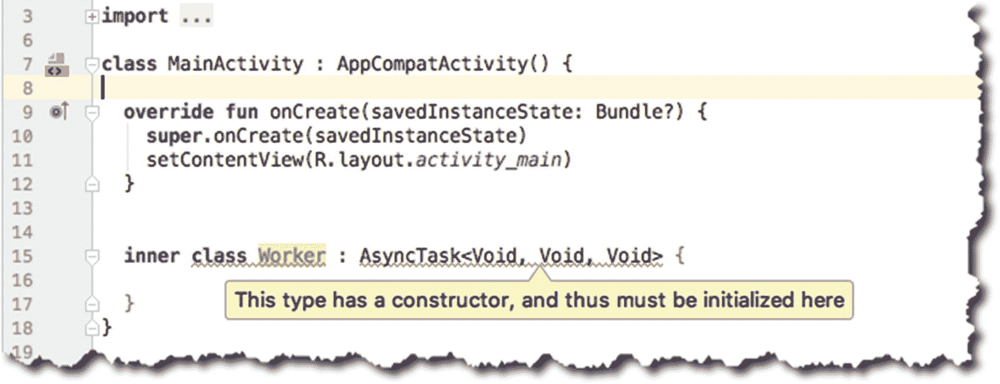
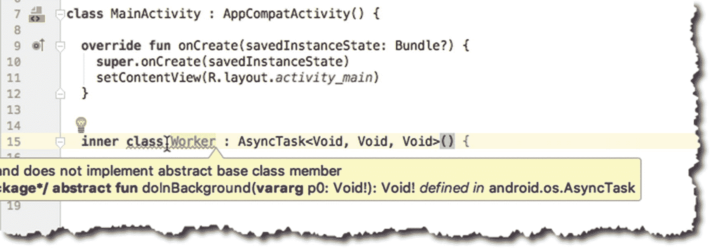
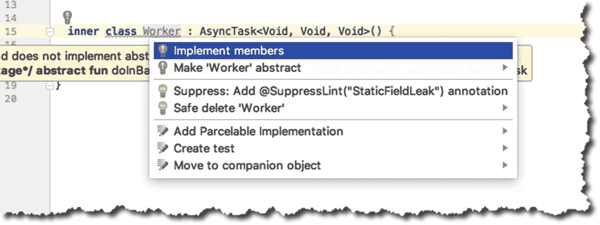
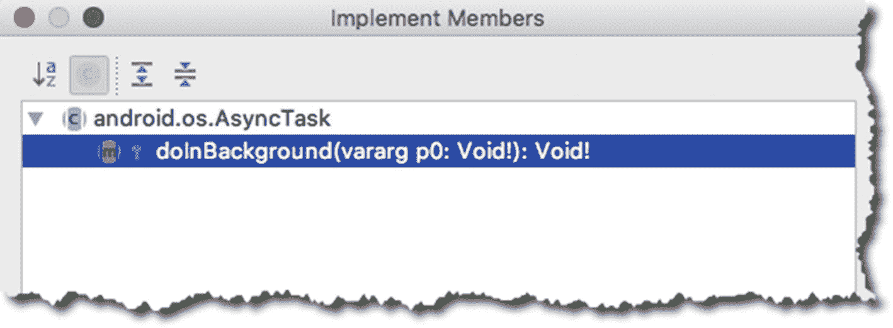
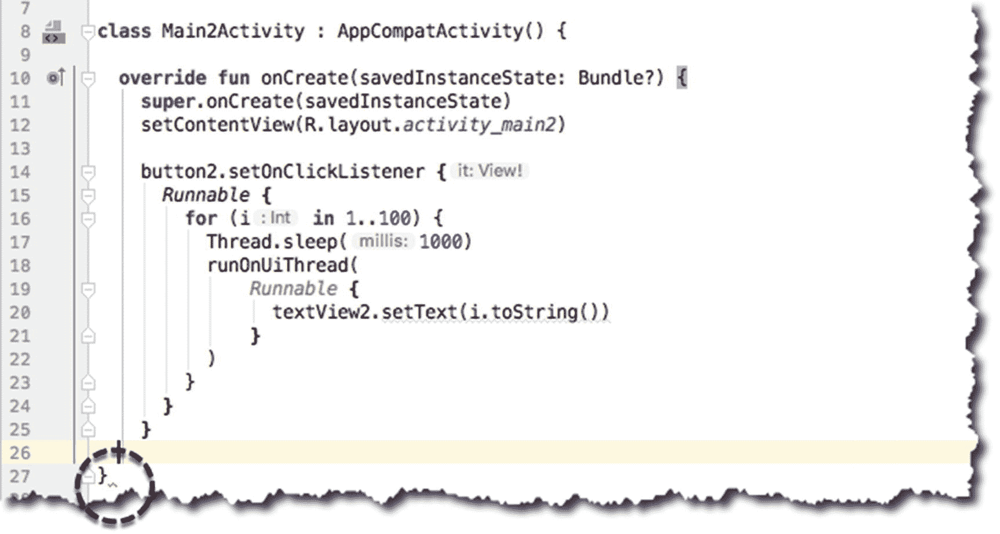
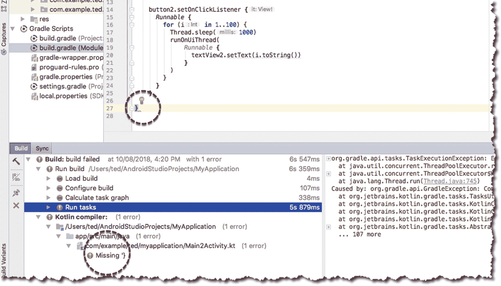
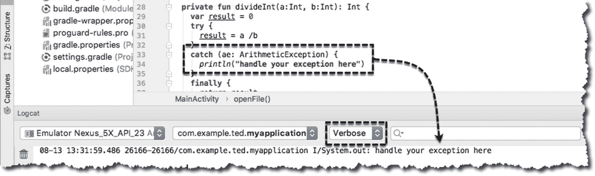
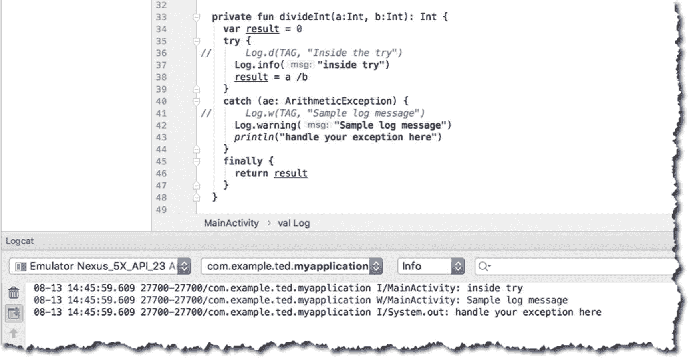
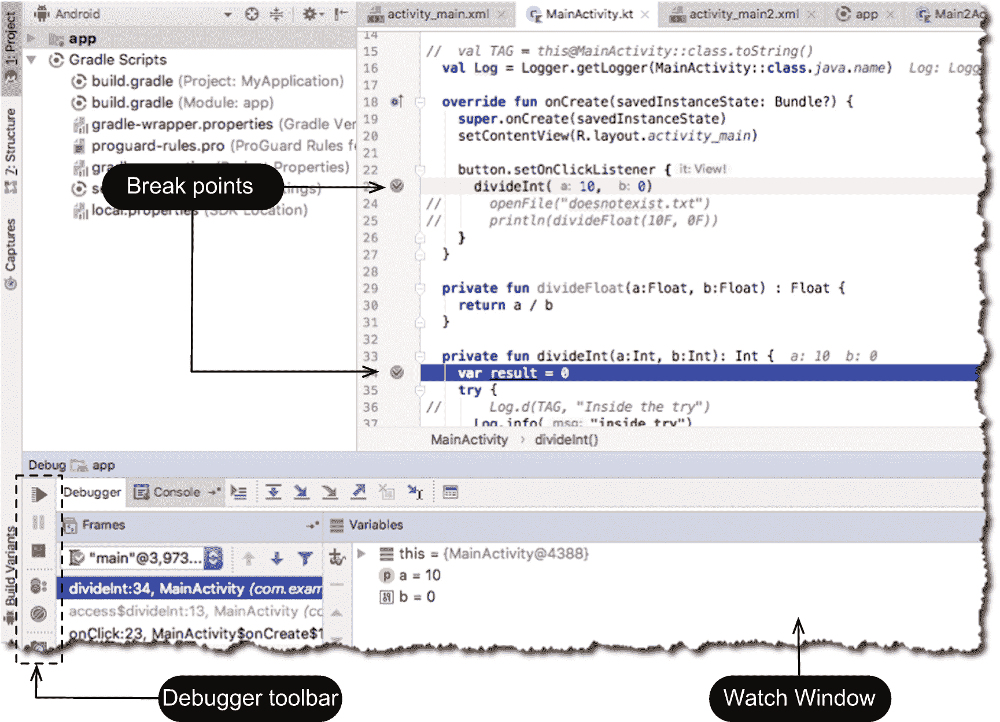

# 十六、排除故障

*我们将介绍的内容:*

*   你会遇到的错误种类

*   记录调试语句

*   使用交互式调试器遍历代码

很快，您将会超越本书中示例代码的简单结构。你的程序会变得越来越复杂，文件越来越多，组件越来越多。随着这种情况的发生，你将面临的错误数量也会增加；到那时它们可能更难被发现。

在这一章中，我们将看看你可能会遇到的三种主要的错误，以及什么样的工具或技术可以帮助你解决。

## 句法误差

语法错误正如您所想的那样:语法错误。发生这种情况是因为你在代码中写了一些 Kotlin 编译器的规则中不允许的东西。换句话说，编译器不理解它。这可能是良性的，就像忘记了表达式中的右花括号或右圆括号一样。它也可能稍微复杂一些，比如在使用泛型时将错误类型的参数传递给函数或参数化类。在 Android 开发的早期，您所能做的就是使用裸露的 SDK，您只有在尝试编译代码时才能知道是否有语法错误，这就是为什么其他程序员也将这种错误称为“编译时”错误的原因。当然，自那以后，Android 开发已经走过了漫长的道路。我们有一个非常称职的 IDE，它甚至可以在你试图编译你的代码之前就发现并指出语法错误。这就好像 IDE 一直在读取代码并编译它。

图 16-1 显示了一个内部 AsyncTask 子类的片段。IDE 通过用红色曲线突出显示有问题的代码来引起您的注意。



图 16-1

AsyncTask 类缺少构造函数

将鼠标悬停在出现曲线的区域足够长的时间，您应该会看到 AS3 的气球提示。它说 AsyncTask 类有一个必须初始化的类型构造函数。要修复它，将构造函数调用——一对括号——放在类定义的旁边，如图 16-2 所示。



图 16-2

AsyncTask 类缺少强制实现

弯弯曲曲的线条正在一条一条消失。这是一个好迹象，意味着我们正在修复错误，但还没有完成。你注意到图 16-2 中的第 15 行了吗？我们仍然有一个错误。它说我们的类没有实现基类成员。AsyncTask 类是抽象的；它声明了抽象方法 **doInBackground** 。我们必须重写这个方法并编写我们的实现，除非我们也将 class Worker 变成一个抽象类——这不是我们的意图。利用 Android Studio 的快速修复功能( **option + Enter** 在 Mac， **alt + Enter** 在 Windows 和 Linux)解决问题，如图 16-2 。

图 16-3 显示了快速固定的作用。它为我们如何修复它提供了一些建议。第一个选项是我们想要的——实现并覆盖 AsyncTask 的抽象成员。



图 16-3

AsyncTask 类的快速修复

点击**确定**。接下来是实现成员的对话框，如图 16-4 所示。AsyncTask 只有一个需要由子类重写的抽象成员。选择**做背景**并点击**确定**继续。



图 16-4

实现成员

Android Studio 会给你一个 **doInBackground** 函数的结构骨架。现在，您可以编写您的实现了。

有时，即使有曲线的帮助，错误也不是很明显。图 16-5 显示了这个问题的一个例子。



图 16-5

嵌套块

图 16-5 中第 14 行和第 27 行之间的代码显示了一个深度嵌套的块。当您使用匿名对象时，有时会发生这种情况，您可以从示例代码的结构中看到这一点。



图 16-6

错误代码

如果你尝试*制作*项目(从主菜单栏➤ **构建** ➤ **制作)**，IDE 会给你更多的信息，更多的信息，如图 16-6 所示；但可能不会给你更多的感悟。这是你确实需要做繁重工作的情况之一。您必须手动检查代码结构。请注意，曲线出现在类的末尾(图 16-6 中的第 27 行)以及告诉我们缺少花括号的错误消息；从那里开始，手动检查成对的花括号。这个问题与我们如何构建代码有关。你只需要小心那些大括号——Python 程序员现在可能会幸灾乐祸地说，“这就是你使用大括号的结果，缩进石头。”

## 运行时错误

当你的代码遇到它没有预料到的情况时，运行时错误就会发生；顾名思义，这种错误情况只有在程序运行时才会出现，而不是你或编译器在编译时能看到的。您的代码可以顺利编译，但是当运行时环境中的某些内容与您的代码不一致时，它可能会停止运行。这些事情有很多例子，例如:

*   该应用从互联网上获取一些东西——一张图片或一个文件等。—所以它假设互联网可用，并且有网络连接。一直都是。经验应该告诉你，情况并不总是这样。网络连接有时会中断，如果您不在代码中考虑这一点，它可能会崩溃。

*   该应用需要从文件中读取。就像我们前面的第一个案例一样，您的代码假设文件将一直存在。有时，文件会损坏，可能变得不可读。这也应该在代码中考虑。

*   该应用执行数学计算。它使用用户输入的值，有时也使用从其他计算中导出的值。如果您的代码碰巧执行了除法，并且其中一个除法的除数为零，这也会导致运行时问题。

这里有一些代码示例，乍看起来可能没问题，并且可以编译，但是当它在运行时遇到没有准备好的情况时，就会出现运行时错误。

清单 16-1 显示了打开一个文件并将其内容读入一个字符串变量的基本代码。如果代码试图打开一个已经存在的文件，没有问题——代码会正常工作，如预期的那样。如果它试图打开一个不存在或由于某种原因无法读取的文件，问题就会出现。

```kt
override fun onCreate(savedInstanceState: Bundle?) {
  super.onCreate(savedInstanceState)
  setContentView(R.layout.activity_main)

  button.setOnClickListener {
      openFile("doesnotexist.txt")
  }
}

private fun openFile(file: String) {
  val strFile = File(file).readText()
}

Listing 16-1Possible FileNotFoundException or Other IOException

```

清单 16-2 可能看起来不自然，但是想象一下，如果你从一个用户那里得到输入，或者你从其他地方读取输入，除数变成零。您将遇到一个算术异常错误。

```kt
override fun onCreate(savedInstanceState: Bundle?) {
  super.onCreate(savedInstanceState)
  setContentView(R.layout.activity_main)

  button.setOnClickListener {
      divide(10, 0)
  }
}

private fun divide(a:Int, b:Int) :  {
  return a / b
}

Listing 16-2Possible ArithmeticException

```

顺便说一下， **ArithmeticException** 只对整数值抛出。对于浮点型和双精度型不会发生这种情况。如果你试图将一个浮点数除以零，它只会产生一个无穷大的值，但不会抛出异常。

清单 16-3 显示了另一个会遇到运行时问题的代码示例。它现在看起来是人为的，因为你可以明显地看到，数组中没有第五元素。但是想象一下，如果你从一个 API 中读取数组(你没有创建数组，是别人创建的)，并且你没有使用整数来访问数组；取而代之的是使用变量。到时候误差就不会那么明显了。

```kt
val arr = arrayOf(1,2,3,4)
println(arr[5])

Listing 16-3ArrayIndexOutOfBounds Exception

```

解决运行时错误的唯一方法是:

1.  了解你的代码。您需要知道哪些调用可能会遇到运行时异常；和

2.  在代码中使用适当的异常处理。

像 Java 一样，Kotlin 也使用 try-catch 结构来处理异常；但是与 Java 不同，Kotlin 的所有异常都是未检查的(??)。异常处理在 Kotlin 中实际上是可选的— **throws** 在 Kotlin 中甚至不是一个关键字，但是**throws**关键字仍然是。这可能是好事，也可能是坏事，看你怎么看；在流行的编码论坛上有关于这个主题的热烈讨论。Kotlin 团队关于检查异常的意见可以在 Kotlin 在线文档( [`https://kotlinlang.org/docs/reference/exceptions.html`](https://kotlinlang.org/docs/reference/exceptions.html) )中找到。

根据 Kotlin 团队的说法，Kotlin 针对的是大型开发项目，几乎没有证据表明使用检查异常有助于开发人员的生产力；恰恰相反，它减轻了它。

Kotlin 中的异常处理在很大程度上与 Java 中的方式完全一样。你可以用**试抓**或**试抓最终**来做。在 Java 7 中，引入了**try-with**resources 的概念。Kotlin 没有 try-with-resources，但是它有 **use** 扩展；这相当于尝试资源。

为了唤起我们的记忆，try-catch 块的基本形式如清单 16-4 所示。

<colgroup><col class="tcol1 align-left"> <col class="tcol2 align-left"></colgroup> 
| -什么 | 这是 **try** 块的主体。这是您应该编写可能抛出异常的调用的地方。 |
| ➋ | 您必须在 catch 子句中尽可能多地提供确切的异常类型(例如，如果您正在处理 FileNotFoundException，那么这就是您应该在此处写入的内容，以代替 **theException)。** |
| ➌ | 这是 **catch** 子句的主体。这是您应该写下当异常发生时您想要做的事情的地方(例如，记录到文件，要求用户重复输入，等等)。). |
| -你好 | 有时，您可能不想处理异常。你可以**把**扔给函数的调用者(调用栈的上一层)，让它成为他们的问题。 |
| ➎ | **finally** 子句的主体是放置代码的地方，无论是否发生异常，都要执行这些代码。finally 子句的主体是保证总是被执行的*。* |

```kt
try {
  ... ➊
}
catch(mexception: theException) { ➋
  ... ➌
  throw mexception ➍
}
finally {
  ... ➎
}

Listing 16-4The Try-Catch-Finally Structure

```

现在，让我们看看如何使用 try-catch 来防止打开文件时崩溃。参见清单 16-5 。

<colgroup><col class="tcol1 align-left"> <col class="tcol2 align-left"></colgroup> 
| -什么 | **文件**构造函数实际上可以抛出一个 FileNotFoundException，所以我们将它们放在一个 try-catch 块中。 |
| ➋ | 我们知道 **FileNotFoundException** 可以被 **File** 构造函数抛出，所以这就是我们放在 **catch** 子句中的内容。如果你想匹配一个更一般类型的异常，你也可以在这里使用 **IOException** 。IOException 是 **FileNotFoundException 的父类。** |

```kt
private fun openFile(file: String) {
  try {                                     ➊
    File(file).useLines {
      println(it)
    }
  }
  catch (fe: FileNotFoundException) {       ➋
    println("do your error handling here")
  }
}

Listing 16-5How to Handle the FileNotFoundException

```

清单 16-6 展示了如何在处理整数运算时防止崩溃。

```kt
  private fun divideInt(a:Int, b:Int): Int {
    var result = 0
    try {
      result = a /b
    }
    catch (ae: ArithmeticException) {
      println("handle your exception here")
    }
    finally {
      return result
    }
  }

Listing 16-6How to Handle the ArithmeticException

```

## 逻辑错误

逻辑错误是最难发现的。顾名思义，这是你逻辑上的错误。当你的代码没有做你认为它应该做的事情时，那就是逻辑错误。有许多方法可以解决这个问题，但是在这一节中，我们将研究两种方法:在代码的某些地方打印调试语句和使用断点进行代码遍历。

当您检查代码时，您会发现某些您非常确定发生了什么的区域，然后还有一些您不太确定的区域—您可以在这些区域中放置调试语句。就像留下面包屑让你跟着走。有几种方法可以打印调试语句。你可以使用 Java 中的 **println** 、 **Log、**或者 **Logger** 类。

图 16-7 显示了 Logcat 工具窗口中 println 语句的输出。



图 16-7

在 Logcat 工具窗口中显示 println

println 是您可以用来打印调试语句的最简单、最容易的工具，但是请记住，只有当 Logcat 的模式设置为“verbose”、“info”或“debug”时，您才能在 Logcat 中看到这些语句。如果您将模式设置为其他模式，如 warn、error 或 assert，您将看不到 println 语句。

当您将 Logcat 的模式设置为 verbose、info 或 debug 时，您将看到 Android 运行时生成的所有消息。如果您只想看到警告消息或错误，那么您需要使用 Log 或 Logger 类。

Log 类有五个静态方法；用法如下所示。

```kt
Log.v(tag, message) // verbose
Log.d(tag, message) // debug
Log.i(tag, message) // info
Log.w(tag, message) // warning
Log.e(tag, message) // error

```

在每种情况下，**标签**是一个字符串或变量。您可以使用标记来过滤 Logcat 窗口中的消息。**消息**也是字符串或变量，它包含您实际想要在日志中看到的内容。清单 16-7 显示了如何使用 Log 类的示例代码。

<colgroup><col class="tcol1 align-left"> <col class="tcol2 align-left"></colgroup> 
| -什么 | 您可以在类中的任何地方定义标签，但是在本例中，它被定义为 class property。 |
| ➋ | 我们正在打印调试信息。 |
| ➌ | 我们正在打印警告信息。 |

```kt
  val TAG = this@MainActivity::class.toString() ➊

  private fun divideInt(a:Int, b:Int): Int {
    var result = 0
    try {
      Log.d(TAG, "Inside the try")              ➋
      result = a /b
    }
    catch (ae: ArithmeticException) {
      Log.w(TAG, "Sample log message")          ➌
    }
    finally {
      return result
    }
  }

Listing 16-7How to Use the Log Class

```

或者，我们也可以使用 Java 中的 Logger 类；如清单 16-8 所示。

```kt
val Log = Logger.getLogger(MainActivity::class.java.name)

private fun divideInt(a:Int, b:Int): Int {
  var result = 0
  try {
     Log.info("inside try")
     result = a /b
    }
  catch (ae: ArithmeticException) {
     Log.warning("Sample log message")
     println("handle your exception here")
  }
  finally {
    return result
  }
}

Listing 16-8How to Use the Logger Class

```

运行应用时，您可以在 Logcat 工具窗口中看到日志消息。你可以在 AS3 窗口底部的菜单栏点击它的标签，或者从主菜单栏**查看➤工具窗口** ➤ **日志目录**来启动它。图 16-8 显示了 Logcat 工具窗口。



图 16-8

Logcat 工具窗口

### 遍历代码

AS3 包括一个交互式调试器，允许您在代码运行时遍历和单步调试代码。使用交互式调试器，我们可以检查应用的快照——变量值、正在运行的线程等。—在代码中的特定位置和特定时间点。代码中的这些特定位置被称为*断点*；你可以选择这些断点。

若要设置断点，请选择包含可执行语句的一行，然后在装订线中点按其行号。设置断点时，槽内会出现一个粉红色的圆圈图标，整行都是粉红色点亮，如图 16-9 所示。



图 16-9

调试器窗口

设置断点后，您必须在调试模式下运行应用。如果应用当前正在运行，请将其停止，然后从主菜单栏中点击**运行** ➤ **调试应用。**

### 注意

在调试模式下运行应用并不是调试应用的唯一方式。您还可以在当前运行的应用中附加调试器进程。在某些情况下，第二种技术非常有用，例如，当您试图解决的错误发生在非常特定的条件下时，您可能希望运行应用一段时间，当您认为您接近错误点时，您可以连接调试器。

照常使用该应用。当执行到您设置断点的一行时，该行将从粉红色变为蓝色。这就是你如何知道代码执行是在你的断点。此时，调试器窗口打开，执行停止，AS3 进入交互式调试模式。当您在这里时，应用的状态显示在**调试工具窗口**中。在此期间，您可以检查变量值，甚至看到应用中运行的线程。

您甚至可以通过单击带有眼镜图标的加号，在“监视”窗口中添加变量或表达式。将有一个文本字段，您可以在其中输入任何有效的表达式。当你按下**输入**时，Android Studio 会对表达式进行求值，并向你显示结果。要删除监视表达式，请选择表达式，然后单击“监视”窗口上的减号图标。

要恢复程序执行，您可以单击调试器工具栏顶部的“恢复程序”按钮—它是指向右侧的绿色箭头。或者，您也可以从主菜单栏**运行** ➤ **恢复程序**中恢复程序。如果你想在程序自然完成之前暂停它，你可以点击调试器工具栏上的“停止应用”按钮——它是一个红色的正方形图标。或者，您也可以从主菜单栏**运行** ➤ **停止应用**中执行此操作

## 其他说明

在 Android 开发的早期，那时还没有 ide，开发人员使用一种叫做“adb”的工具，这是 Android Debug Bridge 的缩写。这是一个漂亮的命令行工具，可以让你与 Android 设备(虚拟的或真实的)进行通信。它可以让您做以下事情:

*   安装应用

*   调试应用

*   获取对外壳终端的访问权限；请记住，Android 是基于 Linux 的，访问终端会非常方便(例如，当您在 sqlite 数据库上进行一些白盒测试时，等等)。).

Android Studio 接管了一些过去由 **adb** 做的事情(例如，显示日志、安装应用、调试应用等。).但是，如果你需要在 linux 命令行级别做事情，你真的必须使用**ADB**——你可以在**ANDROID _ HOME/SDK/platform-tools**文件夹中找到这个工具；其中 ANDROID_HOME 是您安装 Android SDK 的文件夹。

本章中我们没有提到的另一个工具是 *Android Profiler* ，它是 Android Studio 3.0 中的新功能。它取代了一个名为*的安卓设备监控工具*。你可以使用这个工具来查看你的应用的实时数据。您可以找出您的应用消耗了多少 CPU、内存、网络和 I/O 资源。您可以捕获堆转储、查看内存分配以及检查网络传输文件的详细信息。

## 章节总结

*   您可能遇到的三种错误是编译类型或语法错误、运行时错误和逻辑错误。

*   语法错误是最容易修复的。Android Studio 本身为您竭尽全力，让您可以快速发现语法错误。用 AS3 有各种方法来修复语法错误，但是大多数时候，**快速修复**应该可以做到。

*   Kotlin 不像 Java 那样有检查异常。Kotlin 团队这样做是有充分理由的。如果你是 Kotlin 的初学者，但对 Java 却很陌生，那么这应该不会影响你——在处理可能的异常时，使用你对旧 Java APIs 的了解。如果你是 Kotlin 和 Java 的新手，你应该多花一点时间学习单元测试；这样，你就可以看到你的应用的“快乐之路”和“不快乐之路”；然后你就可以采取相应的行动。

*   逻辑错误是最难发现的，但 Android Studio 使这种活动变得更容易忍受，因为我们可以使用工具——你可以在程序运行时遍历代码并检查事情。

在下一章中，我们将了解以下内容:

*   如何使用 SharedPreferences 保存数据？

*   我们将使用 Bundle 对象，这样我们可以将一些基本类型保存到一个文件中。

*   我们还将看看如何在活动之间传递数据。