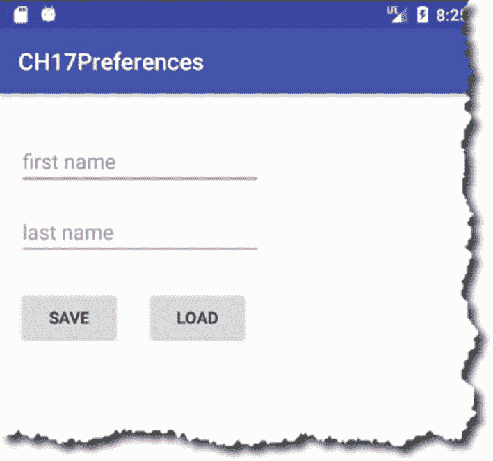
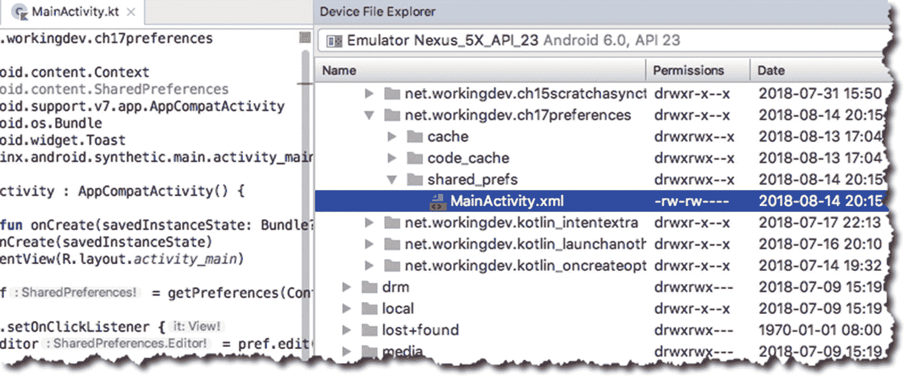
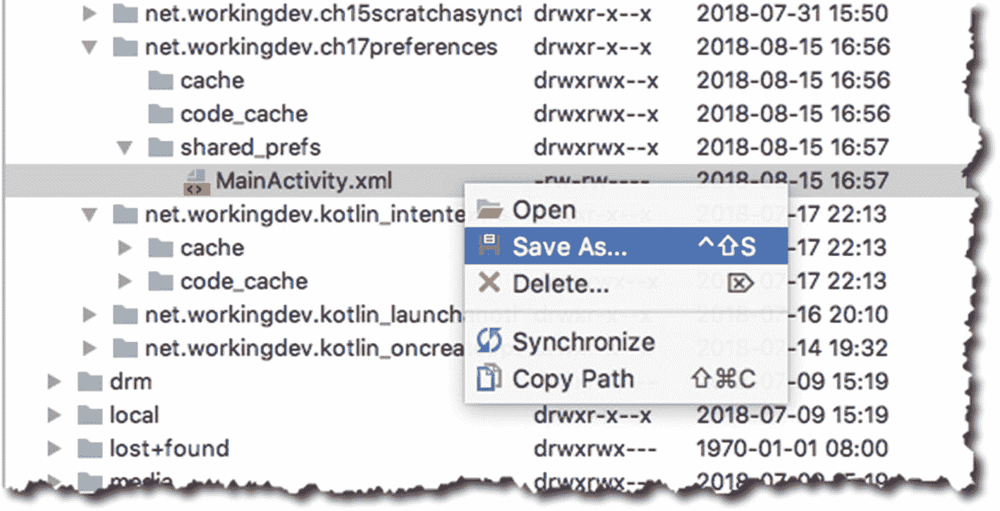
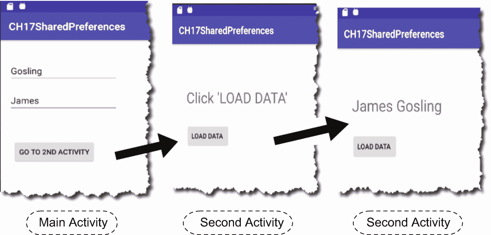

# 十七、共享参数

*我们将介绍的内容:*

*   共享首选项简介

*   如何从首选项文件中放置和获取数据

*   如何在活动之间共享首选项文件

默认情况下，Android 应用不会保存你的数据。在应用的整个生命周期中，保持数据的持久性和弹性是您的责任。假设您正在从用户那里收集数据，然后在工作流程进行到一半时，应用被另一个应用中断了。不能保证当你的应用返回时，用户已经输入的任何数据都会存在。

使数据持久意味着以某种形式存储数据。你可以用几种方法存储数据。它们列举如下:

*   **共享的首选项**。这是最简单的选择。这只是一个字典对象，它使用熟悉的键值对机制。如果您的数据足够简单，能够以键值对的形式进行结构化，这将非常有用。Android 将这些文件作为 XML 文件存储在内部。您只能存储简单的数据类型，如字符串和基本类型。这通常用于存储用户的偏好，比如列表中的排序顺序，你在电子书应用上阅读的最后一页，等等。

*   **内部或外部存储**。使用设备中的内部或媒体存储器(例如 sdcard)。您可以使用它来存储结构更复杂的数据(例如，音频或视频文件)。如果您以前使用过文件 I/O，这与那没有什么不同。

*   **SQLite 数据库**。这个使用关系数据库。如果您以前使用过其他数据库，如 MS SQL server、MySQL、PostgreSQL 或任何其他关系数据库，这在本质上是相同的。数据存储在表中，您需要使用 SQL 语句来创建、读取、更新和删除数据。

*   **网络存储**。如果您可以假设您的用户将始终可以访问 internet，并且您有一个托管在 Internet 上的数据库服务器，那么您可以使用此选项。这种设置可能会有点复杂，因为您需要在某个地方(Amazon、Google 或任何其他云提供商)托管数据库，为数据提供 REST 接口，并在 Android 应用中使用 HTTP 库作为客户端。本书不涉及这个话题。

*   **内容提供者**。内容提供商是 Android 平台上的另一个组件；它就在活动、服务和广播接收器的上面。该组件使数据对应用可用，而不是对其本身。可以把它想象成一个拥有公共 HTTP API 层的数据库。任何通过 HTTP 通信的应用都可以读写数据。顺便说一下，ContentProviders 在内部使用 SQLite 数据库——他们只是在简洁的 HTTP API 中包装和提供数据。如果你开发过 RESTful 应用，这些应用通过 API 公开了一些底层数据，这就有点像。

在本章中，我们将了解 SharedPreferences。

SharedPreferences 对象允许您以*键-值*对的形式存储和检索数据，就像字典一样。它使用 XML 文件进行存储。使用 SharedPreferences 对象存储基本数据可以通过以下步骤完成:

1.  获取 SharedPreferences 对象。您可以通过从活动中调用 **getPreferences** 方法来实现这一点。

2.  接下来，我们得到一个**shared preferences。编辑器**对象，方法是使用 SharedPreferences 对象的工厂方法。

3.  现在我们可以用**编辑器**对象插入数据。

4.  最后，为了永久存储数据，我们在编辑器上使用了**提交**或**应用**方法。

清单 17-1 展示了所有这些在代码中的样子。

<colgroup><col class="tcol1 align-left"> <col class="tcol2 align-left"></colgroup> 
| -什么 | **Activity.getPreferences** 方法给了我们一个 **SharedPreferences** 对象，它是活动的私有对象。我们使用`Context.MODE_PRIVATE`是因为我们希望首选项文件只允许我们的应用访问——其他应用禁止访问。 |
| ➋ | 我们需要一个共享的参考。Editor 对象，我们可以通过在 SharedPreferences 对象上调用 **edit** 方法来获得它。 |
| ➌ | 现在，我们可以使用各种 **putXXX** 方法来存储键值对。第一个参数是键，这应该是一个字符串。第二个参数可以是任何基本类型，如 Int、Float、Double、String 等。 |
| -你好 | 如果我们不调用**应用**，我们的 **putString** 调用都不会被永久存储到文件中。或者，你也可以调用**提交**。**应用**方法异步保存数据*，而**提交**同步保存*。*因此，要持久化数据，调用 apply 或 commit。* |

```kt
val pref = getPreferences(Context.MODE_PRIVATE) ➊
val editor = pref.edit()  ➋

editor.putString("lastname", "Breslav") ➌
editor.putString("firstname", "Andrey")
editor.apply() ➍

Listing 17-1Basic Steps to Save Data

```

如果你想知道其他的上下文模式选项，这里有。

*   **MODE_PRIVATE** :默认模式，创建的文件只能由调用应用访问。这可能是你大多数时候想要的。

*   **MODE_WORLD_READABLE** :任何应用都可以读取偏好数据。这可能会导致应用出现安全漏洞。除非你有一个非常好的理由，否则远离这个。如果您想让数据对任何应用可用，可以考虑构建一个 ContentProvider。

*   **MODE_WORLD_WRITEABLE** :任何应用都可以编辑偏好数据。这可能会导致应用出现安全漏洞。还是那句话，除非你有充分的理由，否则远离这个。

*   **MODE_APPEND** :这将把已经存在的参数追加到新的参数中。

让我们为此做一个小的演示项目。表 17-1 显示了项目的详细情况。

表 17-1

演示项目的详细信息

<colgroup><col class="tcol1 align-left"> <col class="tcol2 align-left"></colgroup> 
| 

项目详细信息

 | 

价值

 |
| --- | --- |
| 应用名称 | ch17 首选项 |
| 公司域 | 使用您的网站名称 |
| Kotlin 支架 | 是 |
| 波形因数 | 仅限手机和平板电脑 |
| 最低 SDK | API 23 棉花糖 |
| 活动类型 | 空的 |
| 活动名称 | 主要活动 |
| 布局名称 | 活动 _ 主要 |

我们想做的是:

1.  让用户输入他的姓和名——我们将为此使用两个编辑文本。

2.  当用户单击“保存”按钮时，我们将把姓氏和名字存储到首选项文件中。

3.  当用户单击“Load”按钮时，我们将从首选项文件中读取姓氏和名字。

4.  我们将在 TextView 对象中显示它们。

图 17-1 为正在运行的 app 截图。



图 17-1

我们的项目快照，正在运行

清单 17-2 包含 XML 布局文件的完整代码，因此您可以看到视图对象的属性设置。清单 17-3 显示了 MainActivity 的完整和带注释的代码。

<colgroup><col class="tcol1 align-left"> <col class="tcol2 align-left"></colgroup> 
| -什么 | 获取一个 **SharedPreferences** 对象。 |
| ➋ | 获取一个 **SharedPreferences。编辑**对象。 |
| ➌ | 保存 EditText 的运行时值(txtlastname)；让我们使用“姓氏”作为关键字。 |
| -你好 | 通过调用 **apply** 而不是 **commit 来异步保存数据。** |
| ➎ | 我们现在在“加载”按钮监听器里面。让我们获取“lastname”键的值，并将其保存到一个临时变量中。 |
| ➏ | 串联姓氏和名字变量 |
| -好的 | 将 TextView (txtoutput)的**文本**属性设置为串联的 lastname 和 firstname |
| -好的 | 在 **onResume** 回调中，我们初始化了 txtlastname、txtfirstname 和 txtoutput 的文本属性。我们还设置了文本字段的提示属性。 |

```kt
import android.content.Context
import android.content.SharedPreferences
import android.support.v7.app.AppCompatActivity
import android.os.Bundle
import android.widget.Toast
import kotlinx.android.synthetic.main.activity_main.*

class MainActivity : AppCompatActivity() {

  override fun onCreate(savedInstanceState: Bundle?) {
    super.onCreate(savedInstanceState)
    setContentView(R.layout.activity_main)

    val pref = getPreferences(Context.MODE_PRIVATE)                 ➊

    btnsave.setOnClickListener {
      val editor = pref.edit()                                      ➋

      editor.putString("lastname", txtlastname.text.toString())     ➌
      editor.putString("firstname", txtfirstname.text.toString())
      editor.apply()                                                ➍

      Toast.makeText(this, "Saved data", Toast.LENGTH_LONG).show()
    }

    btnload.setOnClickListener {
      val mlastname = pref.getString("lastname", "")                ➎
      val mfirstname = pref.getString("firstname", "")
      val moutput = "$mfirstname $mlastname"                        ➏

      txtoutput.text = moutput                                      ➐
    }
  }

  override fun onResume() {                                         ➑
    super.onResume()

    txtfirstname.setText("")

    txtlastname.setText("")
    txtfirstname.setHint("first name")
    txtlastname.setHint("last name")

    txtoutput.setText("")
  }
}

Listing 17-3MainActivity, Annotated

```

```kt
<?xml version="1.0" encoding="utf-8"?>
<android.support.constraint.ConstraintLayout xmlns:android=http://schemas.android.com/apk/res/android
  xmlns:app=http://schemas.android.com/apk/res-auto
  xmlns:tools=http://schemas.android.com/tools
  android:layout_width="match_parent"
  android:layout_height="match_parent"
  tools:context=".MainActivity">

  <EditText
    android:id="@+id/txtfirstname"
    android:layout_width="wrap_content"
    android:layout_height="wrap_content"
    android:layout_marginStart="16dp"
    android:layout_marginTop="36dp"
    android:ems="10"
    android:inputType="textPersonName"
    android:text="Name"
    app:layout_constraintStart_toStartOf="parent"
    app:layout_constraintTop_toTopOf="parent" />

  <EditText
    android:id="@+id/txtlastname"
    android:layout_width="wrap_content"
    android:layout_height="wrap_content"
    android:layout_marginStart="16dp"
    android:layout_marginTop="16dp"
    android:ems="10"
    android:inputType="textPersonName"
    android:text="Name"
    app:layout_constraintStart_toStartOf="parent"
    app:layout_constraintTop_toBottomOf="@+id/txtfirstname" />

  <TextView
    android:id="@+id/txtoutput"
    android:layout_width="wrap_content"
    android:layout_height="wrap_content"
    android:layout_marginBottom="183dp"
    android:layout_marginStart="16dp"
    android:text="TextView"
    android:textSize="36sp"
    app:layout_constraintBottom_toBottomOf="parent"
    app:layout_constraintStart_toStartOf="parent" />

  <Button
    android:id="@+id/btnsave"
    android:layout_width="wrap_content"
    android:layout_height="wrap_content"
    android:layout_marginStart="16dp"
    android:text="save"
    app:layout_constraintBaseline_toBaselineOf="@+id/btnload"
    app:layout_constraintStart_toStartOf="parent" />

  <Button
    android:id="@+id/btnload"
    android:layout_width="wrap_content"
    android:layout_height="wrap_content"
    android:layout_marginEnd="11dp"
    android:layout_marginTop="27dp"
    android:text="load"
    app:layout_constraintEnd_toEndOf="@+id/txtlastname"
    app:layout_constraintTop_toBottomOf="@+id/txtlastname" />
</android.support.constraint.ConstraintLayout>

Listing 17-2/app/res/layout/activity_main.xml

```

Android 将创建一个 XML 文件来存储该首选项，它将以创建它的活动命名；在我们的例子中，它是主要的活动。

如果你想检查文件，可以使用设备文件浏览器(以前叫 Android 设备监视器)下载。进入主菜单栏，然后**查看** ➤ **工具窗口** ➤ **设备文件浏览器。**你应该会看到一个类似图 17-2 的屏幕。



图 17-2

设备文件资源管理器中的 MainActivity.xml 文件

接下来，深入到**数据** ➤ **数据**➤**fullyqualifiednameofproject**(在我的例子中是 net . working dev . ch17 preferences；代入自己的项目名称)；然后，进一步向下钻取到**shared _ prefs**➤**main activity . XML**，如图 17-2 所示。

如果双击 MainActivity.xml 文件，Android Studio 将在主编辑器中显示其内容。或者，您也可以将其下载到您的电脑上。使用 MainActivity.xml 上的上下文相关菜单(右键单击)，如图 17-3 所示，然后“另存为”然后，您可以用程序编辑器打开 XML 文件。



图 17-3

将 XML 文件保存到计算机

清单 17-4 显示了 MainActivity.xml 首选项文件的内容。

```kt
<?xml version='1.0' encoding='utf-8' standalone="yes" ?>
<map>
    <string name="lastname">hagos</string>
    <string name="firstname">ted</string>
</map>

Listing 17-4Contents of MainActivity.xml

```

请记住，我们在这里创建的首选项文件只能由 MainActivity 类访问。如果您需要与应用中的其他活动共享首选项文件，您需要创建一个应用级别的首选项。

## 在活动之间共享数据

要使一个首选项文件对 app 中的所有活动都可用，我们只需要在代码中做一点小小的修改。

<colgroup><col class="tcol1 align-left"> <col class="tcol2 align-left"></colgroup> 
| -什么 | **packageName** 实际上是对 **getPackageName()** 的调用。我们只是在这行中构造一个文件名。 |
| ➋ | **这是我们唯一需要做的改变**；不要调用 **getPreferences** ，让我们使用 **getSharedPreferences** 。这个函数接受两个参数。你已经知道了第二个，很容易猜到第一个参数是干什么的。第一个参数指定首选项文件的文件名。 |

```kt
val filename = "$packageName TESTFILE"                  ➊
val pref = getSharedPreferences(filename, Context.MODE_PRIVATE)   ➋
val editor = pref.edit()

editor.putString("lastname", "Breslav")
editor.putString("firstname", "Andrey")
editor.apply()

Listing 17-5How to Create an Application Level Preferences File

```

实际上， **getPreferences** (我们上一节的例子)只是对 **getSharedPreferences** 的包装调用，前者只是将当前活动的名称作为第一个参数传递给后者。

要从共享首选项文件中检索数据，再次使用 **getSharedPreferences** ，指定要读取哪个文件，然后使用 **getString** 方法，如清单 17-6 所示。

<colgroup><col class="tcol1 align-left"> <col class="tcol2 align-left"></colgroup> 
| -什么 | 获取 SharedPreferences 对象。通过将首选项文件作为第一个参数传递来指定其名称。 |
| ➋ | 第一个参数是关键；它是要检索的首选项的名称。第二个参数是默认值，以防键不存在。 |

```kt
val pref = getSharedPreferences("$packageName TESTFILE", Context.MODE_PRIVATE)  ➊

val mlastname = pref.getString("lastname", "")  ➋
val mfirstname = pref.getString("firstname", "")

Listing 17-6How to Read From an Application Preferences File

```

让我们为此做另一个小演示项目。表 17-2 显示了项目详情。

表 17-2

项目详细信息

<colgroup><col class="tcol1 align-left"> <col class="tcol2 align-left"></colgroup> 
| 

项目详细信息

 | 

价值

 |
| --- | --- |
| 应用名称 | CH17SharedPreferences(共享首选项) |
| 公司域 | 使用您的网站名称 |
| Kotlin 支架 | 是 |
| 波形因数 | 仅限手机和平板电脑 |
| 最低 SDK | API 23 棉花糖 |
| 活动类型 | 空的 |
| 活动名称 | 主要活动 |
| 布局名称 | 活动 _ 主要 |

我们想做的是:

1.  让用户输入他的姓和名；为此，我们将使用两个版本。

2.  当用户点击“Go to 2 <sup>nd</sup> Activity”按钮时，我们将创建一个启动“SecondActivity”的意图

3.  在 MainActivity 进入暂停状态之前，我们将把姓氏和名字数据保存到指定的首选项文件中。

4.  当 SecondActivity 进入用户视图时，我们将在 TextView 中显示“Click LOAD DATA”提示。

5.  当单击“加载数据”按钮时，我们将检索首选项文件，并将其显示为 TextView 的文本属性。

图 17-4 向我们展示了我们应用的基本故事板。



图 17-4

我们的项目快照，正在运行

清单 17-7 和 17-8 显示了 activity_main.xml 和 activity_second.xml 的完整代码，因此您可以看到视图对象的属性。

```kt
<?xml version="1.0" encoding="utf-8"?>
<android.support.constraint.ConstraintLayout xmlns:android=http://schemas.android.com/apk/res/android
  xmlns:app=http://schemas.android.com/apk/res-auto
  xmlns:tools=http://schemas.android.com/tools
  android:layout_width="match_parent"
  android:layout_height="match_parent"
  tools:context=".SecondActivity"
  tools:layout_editor_absoluteY="81dp">

  <Button
    android:id="@+id/btnloaddata"
    android:layout_width="wrap_content"
    android:layout_height="wrap_content"
    android:layout_marginStart="34dp"
    android:layout_marginTop="33dp"
    android:text="Load data "
    app:layout_constraintStart_toStartOf="parent"
    app:layout_constraintTop_toBottomOf="@+id/txtoutput" />

  <TextView
    android:id="@+id/txtoutput"
    android:layout_width="wrap_content"
    android:layout_height="wrap_content"
    android:layout_marginStart="34dp"
    android:layout_marginTop="87dp"
    android:text="TextView"
    android:textSize="30sp"
    app:layout_constraintStart_toStartOf="parent"
    app:layout_constraintTop_toTopOf="parent" />
</android.support.constraint.ConstraintLayout>

Listing 17-8/app/res/activity_second.xml

```

```kt
<?xml version="1.0" encoding="utf-8"?>
<android.support.constraint.ConstraintLayout xmlns:android=http://schemas.android.com/apk/res/android
  xmlns:app=http://schemas.android.com/apk/res-auto
  xmlns:tools=http://schemas.android.com/tools
  android:layout_width="match_parent"
  android:layout_height="match_parent"
  tools:context=".MainActivity"
  tools:layout_editor_absoluteY="81dp">

  <EditText
    android:id="@+id/txtlastname"
    android:layout_width="wrap_content"
    android:layout_height="wrap_content"
    android:layout_marginStart="16dp"
    android:layout_marginTop="40dp"
    android:ems="10"
    android:inputType="textPersonName"
    android:text="Name"
    app:layout_constraintStart_toStartOf="parent"
    app:layout_constraintTop_toTopOf="parent" />

  <EditText
    android:id="@+id/txtfirstname"
    android:layout_width="wrap_content"
    android:layout_height="wrap_content"
    android:layout_marginStart="16dp"
    android:layout_marginTop="15dp"
    android:ems="10"
    android:inputType="textPersonName"
    android:text="Name"
    app:layout_constraintStart_toStartOf="parent"
    app:layout_constraintTop_toBottomOf="@+id/txtlastname" />

  <Button
    android:id="@+id/button"
    android:layout_width="wrap_content"
    android:layout_height="wrap_content"
    android:layout_marginStart="24dp"
    android:layout_marginTop="57dp"
    android:text="Go to 2nd Activity"
    app:layout_constraintStart_toStartOf="parent"
    app:layout_constraintTop_toBottomOf="@+id/txtfirstname" />

</android.support.constraint.ConstraintLayout>

Listing 17-7/app/res/layout/activity_main.xml

```

这就解决了布局问题。在 MainActivity 中，我们需要做的事情如下:

1.  接受来自用户的一些输入，姓氏和名字。

2.  单击按钮时，使用明确的意图启动 SecondActivity。

3.  在 MainActivity 进入“暂停”状态之前，让我们保存首选项文件。

清单 17-9 显示了 MainActivity 的完整和带注释的代码。

<colgroup><col class="tcol1 align-left"> <col class="tcol2 align-left"></colgroup> 
| -什么 | 我们正在创建一个将启动 SecondActivity 的明确意图。我们不会在这里保存首选项文件——我们将在稍后的 **onPause** 回调中保存。 |
| ➋ | 让我们从这里调用 **saveData** 函数。onPause 函数会在 MainActivity 从用户视野中消失之前被 Android 运行时调用，最终进入“暂停”状态。 |
| ➌ | **saveData** 函数是我们实际保存首选项文件的地方。这些代码你都见过了，我们就不再注释了。 |
| -你好 | 一条简单的消息告诉用户我们已经保存了数据 |
| ➎ | Android 运行时将在 MainActivity 再次对用户完全可见之前调用 **onResume** 函数，如果它来自“暂停”状态。我认为最好在这里重新初始化所有的 UI 元素。 |

```kt
import android.content.Context
import android.content.Intent
import android.content.SharedPreferences
import android.support.v7.app.AppCompatActivity
import android.os.Bundle
import android.widget.Toast
import kotlinx.android.synthetic.main.activity_main.*

class MainActivity : AppCompatActivity() {

  override fun onCreate(savedInstanceState: Bundle?) {
    super.onCreate(savedInstanceState)
    setContentView(R.layout.activity_main)

    button.setOnClickListener {
      val intent = Intent(this@MainActivity, SecondActivity::class.java) ➊
      startActivity(intent)
    }
  }

  override fun onPause() {
    super.onPause()
    saveData()     ➋
  }

  private fun saveData() {   ➌

    val filename = "$packageName TESTFILE"
    val pref = getSharedPreferences(filename, Context.MODE_PRIVATE)
    val edit = pref.edit()

    edit.putString("lastname", txtlastname.text.toString())
    edit.putString("firstname", txtfirstname.text.toString())
    edit.apply()

    Toast.makeText(this, "Saved data", Toast.LENGTH_LONG).show() ➍
  }

  override fun onResume() { ➎
    super.onResume()

    txtfirstname.setText("")
    txtlastname.setText("")
    txtfirstname.setHint("first name")
    txtlastname.setHint("last name")
  }

}

Listing 17-9MainActivity, Annotated

```

这就是我们在主活动中需要做的一切。在 SecondActivity 中，我们需要在单击按钮时读取指定的首选项文件。清单 17-10 显示了 SecondActivity 的完整和带注释的代码。

<colgroup><col class="tcol1 align-left"> <col class="tcol2 align-left"></colgroup> 
| -什么 | 当按钮被单击时，让我们读取指定的首选项文件。 |
| ➋ | 让我们提取姓氏(以及名字)。 |
| ➌ | 连接姓氏和名字数据，并将其显示为 TextView 的文本属性。 |

```kt
import android.content.Context
import android.support.v7.app.AppCompatActivity
import android.os.Bundle
import kotlinx.android.synthetic.main.activity_second.*

class SecondActivity : AppCompatActivity() {

  override fun onCreate(savedInstanceState: Bundle?) {
    super.onCreate(savedInstanceState)
    setContentView(R.layout.activity_second)

    btnloaddata.setOnClickListener {
    val filename = "$packageName TESTFILE"
    val pref = getSharedPreferences(filename, Context.MODE_PRIVATE) ➊

      val mlastname = pref.getString("lastname", "") ➋
      val mfirstname = pref.getString("firstname", "")

      txtoutput.text = "$mfirstname $mlastname " ➌
    }
  }

  override fun onResume() {
    super.onResume()

    txtoutput.text = "Click 'LOAD DATA'"
  }
}

Listing 17-10
SecondActivity

```

这应该可以让你开始使用 SharedPreferences。在我们结束这一章之前，我想留给你一些关于*共享优先权的信息。编辑*对象。你已经知道是**提交**或**应用**函数负责实际保存文件。它还具有其他功能，如清除和删除。他们是这样做的:

*   **删除(字符串参数)** **。**这个调用删除一个命名的偏好。String 参数代表键。因此，像`remove("lastname")`这样的调用将从首选项文件中删除 lastname 键。

*   **清()** **。**删除首选项文件中的所有键。

我将让您来试验这两个编辑器功能。

## 章节总结

*   Android 有几种持久化数据的方法。它的范围从简单的机制 SharedPreferences 一直到健壮的和一些更复杂的 ContentProviders 和 HTTP 数据库，比如 FireBase。

*   SharedPreferences 使用类似字典或地图的习惯用法。它以键值对的形式存储数据。

*   您可以将偏好设置文件设为某个活动的专用文件，也可以将其提供给应用中的所有活动。

在下一章，我们将会看到另一种将数据保存到文件中的方法；但是，它不会局限于基本类型。您将学习如何在没有强制结构(如键值对)的情况下使用文件。