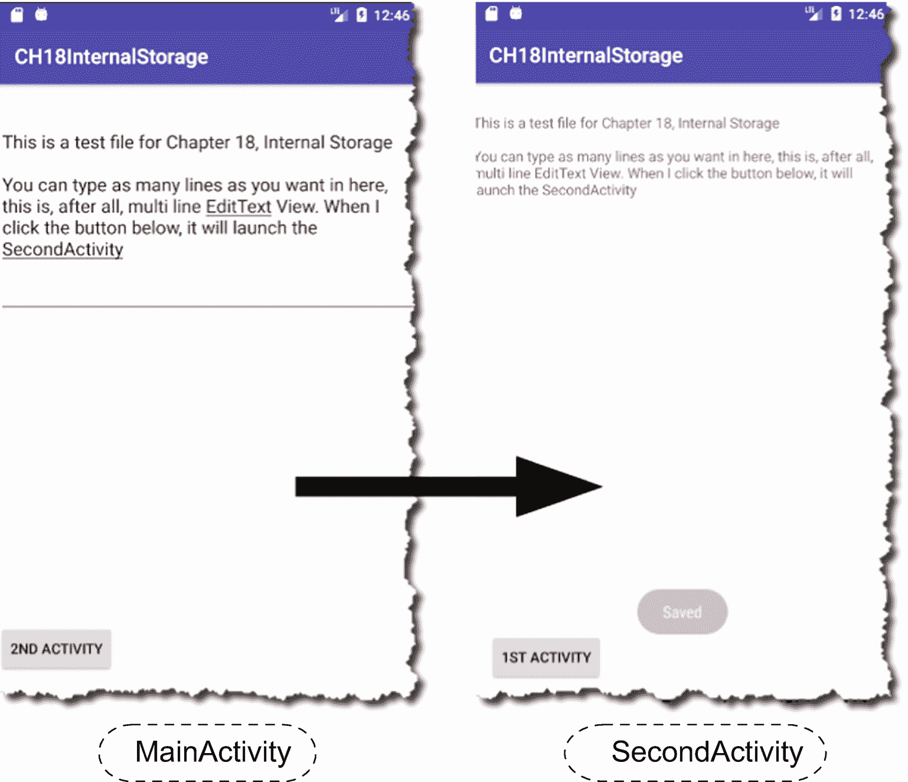

# 十八、内部存储

*我们将介绍的内容:*

*   Android 的文件 I/O 介绍

*   内部存储与外部存储

*   如何使用内部存储

在前一章中，我们学习了如何使用首选项文件。SharedPreferences 使用类似字典的结构，可以用键值格式保存数据行；但是你只能在里面保存基本类型。当您需要处理不限于键值对和基本类型的文件结构时，您可以使用 Java I/O(输入/输出)中良好的 ole 文件类。这就是本章的主题。

## 文件存储概述

当您需要处理视频、音频、json 或纯文本文件时，您可以使用 Java 文件 I/O 来处理本地文件。您将使用相同的**文件**、 **InputStream、**和 **OutputWriter** 以及 Java 中的其他 **I/O** 类——如果您以前使用过它们的话。Android 的不同之处在于你保存它们的位置。在 Java 桌面应用中，你可以把你的文件放在任何你想放的地方。安卓就不是这样了。就像在 Java web 应用中一样，Android 应用不能在任何地方自由地创建和读取文件。在某些地方，您的应用具有读写权限。

如果你以前没有使用过 Java I/O 也不用担心，我们不会使用任何难以遵循的代码。我们将使用的所有 I/O 例程都在初学者的能力范围之内。

### 内部和外部存储

Android 区分内部和外部存储。*内部*存储指的是闪存驱动器中由所有已安装的应用共享的部分。*外部*存储指的是用户可以安装的存储空间——通常是 sd 卡，但不是必须的。只要它能被用户安装，它可以是任何东西；它甚至可以是内部闪存驱动器的一部分。

每个选项都有利弊，所以你需要考虑你的应用的需求和每个选项的限制。下面的列表显示了一些利弊。

**内部存储**

*   内存始终可供您的应用使用。不存在用户卸载 sd 卡或任何设备的危险。它保证会一直在那里。

*   存储空间的大小将小于外部存储，因为您的应用将只分配到一部分闪存存储空间，该存储空间由所有其他应用共享。在早期版本的 Android 中，这是一个问题，但现在不那么担心了。根据 Android 兼容性定义，从 Android 6.0 开始，Android 手机或平板电脑必须为用户空间保留至少 1.5 GB 的非易失性空间(/data 分区)。对于大多数应用来说，这个空间应该足够了。你可以在这里阅读兼容性定义 [`https://bit.ly/android6compatibilitydefinition`](https://bit.ly/android6compatibilitydefinition) 。

*   当你的应用在此空间中创建文件时，只有你的应用可以访问这些文件。除非手机是 root 的，但大多数用户不会 root 他们的手机，所以一般来说，这不是什么大问题。

*   卸载你的应用时，它创建的所有文件都将被删除。

**外部存储器**

*   它通常比内部存储空间更大；但是

*   它可能并不总是可用(例如，当用户移除 SD 卡或将其安装为 USB 驱动器时。

*   这里的所有文件对所有应用和用户都是可见的。任何人和任何应用都可以在这里创建和保存文件。他们还可以删除文件。

*   当一个 app 在这个空间创建了一个文件，它可以比 app 活得更久；我的意思是，当你卸载应用时，文件不会被删除。

### 缓存目录

无论您选择内部存储还是外部存储，您可能仍然需要在文件位置上再做一个决定。你可以把你的文件放在一个缓存目录或更永久的地方。如果需要空间，缓存目录中的文件可能会被 Android 操作系统或第三方应用回收。所有不在缓存目录中的文件都非常安全，除非您手动删除它们。在本章中，我们不会使用缓存目录或外部存储。我们将只使用内部存储，并将文件放在标准位置。

## 如何使用内部存储

如前所述，在 Android 中使用文件存储就像在 Java I/O 中使用普通的类一样。有几个选项可以使用，如 **openFileInput()** 和 **openFileOutput()** **，**或其他一些可以使用 **InputStreams** 和 **OutputStreams** 的方法。您只需要记住，这些调用不会让您指定文件路径。你可以只提供文件名，如果你不介意的话，继续使用它们——实际上这就是我们将在本章中使用的。另一方面，如果您需要更大的灵活性，您可以使用**getfiledir()**或 **getCacheDir()** 来获取一个指向文件位置根目录的 **File** 对象——如果您想要使用内部存储的缓存目录，请使用 **getCacheDir()** 。当你有一个**文件**对象时，你可以从那里创建你自己的目录和文件结构。

这是 Android 文件存储领域的一般情况。同样，在本章中，我们将只使用标准位置的内部存储(不是缓存)。

写入文件需要几个简单的步骤。您需要:

1.  决定文件名

2.  获取文件输出流对象

3.  将内容转换为 ByteArray

4.  使用 FileOutputStream 写入 ByteArray

5.  不要忘记关闭文件

清单 18-1 向我们展示了它在代码中的样子。

<colgroup><col class="tcol1 align-left"> <col class="tcol2 align-left"></colgroup> 
| -什么 | **openFileOutput** 返回一个 FileOutputStream 我们需要这个对象，这样我们就可以写入文件。调用的第一个参数是您想要创建的文件的名称。第二个参数是上下文模式；你已经从上一章知道了这一点。我们使用 MODE_PRIVATE 是因为我们希望文件对应用是私有的。 |
| ➋ | **使用**扩展名意味着我不必显式或手动关闭文件。一旦我们使用完它，Android 运行时会为我们关闭它。考虑到许多开发人员忘记关闭文件，这是非常方便的。在应用终止前保持文件句柄打开会导致内存泄漏。 **use** 扩展相当于 Java 的 **try-with-resources。** |
| ➌ | **write** 方法需要一个 ByteArray。因此，我们需要将 Editable(EditText 的数据类型)转换为 String，然后将其转换为 ByteArray。 |

```kt
val filename = "ourfile.txt"
val out = openFileOutput(filename, Context.MODE_PRIVATE) ➊
out.use { ➋
  out.write(txtinput.text.toString().toByteArray()) ➌
}

Listing 18-1How to Save to a File

```

从文件中读取比写入文件涉及更多的步骤。您通常需要执行以下操作:

1.  获取文件输入流

2.  从流中读取，一次一个字节

3.  坚持读下去，直到没什么可读的了。当你到达文件末尾时，你会知道你所读取的最后一个字节的值是否为 **-1** 。到时候就该收手了。

4.  当您到达文件末尾时，您需要将从流中获取的字节存储到一个临时容器中。StringBuilder 或 StringBuffer 应该可以做到这一点。因为字符串是不可变的，所以使用加号运算符构建字符串对象既浪费又低效。每次使用加号运算符时，它都会创建一个新的 String 对象；如果您的文件包含 2000 个字符，您将创建 2000 个 String 对象。

    如果你正在阅读一个文本文件，情况就是这样。如果您正在读取音频或视频文件等其他内容，您将使用不同的数据结构。

5.  当你到达文件的末尾时，停止阅读。用你读过的东西做你需要做的事情，不要忘记关闭文件。

清单 18-2 向我们展示了这在代码中的样子。

<colgroup><col class="tcol1 align-left"> <col class="tcol2 align-left"></colgroup> 
| -什么 | **openFileInput** 返回一个 FileInputStream 这是我们需要的对象，所以可以从文件中读取。它唯一需要的参数是要读取的文件的名称。 |
| ➋ | 我们不可能一下子读完整个文件。我们会一段一段地读。当我们得到一些块时，我们将把它们存储在 StringBuilder 对象中。 |
| ➌ | **read** 方法从输入流中读取一个字节的数据，并将其作为整数返回。我们需要一次从流中读取一个字节，直到到达文件结尾(EOF)标记。 |
| -你好 | 当流中没有更多的字节要读取时，EOF 被标记为 **-1** 。我们将用它作为 **while** 循环的条件。直到 **bytes_read** 不等于 **-1** 为止，继续读取。 |
| ➎ | **read** 方法返回一个 int 它是文件中每个字母的 ASCII 值，作为整数返回。在将它放入 StringBuilder 之前，我们必须将其转换成一个**字符**。 |
| ➏ | 如果我们还没到 EOF，让我们读另一个字节。 |
| -好的 | 当我们用完要读取的字节时，我们将退出循环并打印 StringBuilder 的内容。 |

```kt
val filename = "ourfile.txt"
val input = openFileInput(filename) ➊

input.use {
  var buffer = StringBuilder() ➋
  var bytes_read = input.read() ➌
  while(bytes_read != -1) { ➍
    buffer.append(bytes_read.toChar()) ➎
    bytes_read = input.read() ➏
  }
  println(buffer.toString()) ➐
}

Listing 18-2How to Read From a File

```

当然，我们会做一些小的演示项目。它巩固了我们的学习。表 18-1 显示了演示项目的详细信息。

表 18-1

项目详细信息

<colgroup><col class="tcol1 align-left"> <col class="tcol2 align-left"></colgroup> 
| 

项目详细信息

 | 

价值

 |
| --- | --- |
| 应用名称 | ch18 内部存储 |
| 公司域 | 使用您的网站名称 |
| Kotlin 支架 | 是 |
| 波形因数 | 仅限手机和平板电脑 |
| 最低 SDK | API 23 棉花糖 |
| 活动类型 | 空的 |
| 活动名称 | 主要活动 |
| 布局名称 | 活动 _ 主要 |

我们想做的是:

1.  我们将设置两个活动:MainActivity 和 SecondActivity。

2.  在 MainActivity 中，用户可以在多行编辑文本中自由键入文本。

3.  当点击按钮“2 <sup>和</sup> Activity”时，我们将启动一个打开 SecondActivity 的明确意图。

4.  但是在我们离开 MainActivity 之前，我们将创建一个文件并将 EditText 的内容保存到该文件中。这个调用并不十分昂贵，但是我们将在后台线程中运行这个代码，因为它是一个 I/O 调用。你永远无法确定一个 I/O 调用会多于还是少于 16 ms，所以还是小心为妙。

5.  在 SecondActivity 中，一旦它对用户可见，我们将读取文件的内容(我们刚刚保存在 MainActivity 中的那个)并使用多行 TextEdit 显示给用户。

6.  仍然在 SecondActivity 中，当用户单击按钮“1 <sup>st</sup> Activity”时，我们将启动一个返回主 Activity 的明确意图。

7.  在 MainActivity 的 onResume 中，我们将尝试读取文件并使其可用于编辑。

图 18-1 显示了我们 app 的两个屏幕。



图 18-1

该应用在运行时

清单 18-3 和 18-4 显示了 activity_main.xml 的完整代码(MainActivity 的 UI。Kt)和 activity _ second . XML(second activity 的 UI。Kt)。

```kt
<?xml version="1.0" encoding="utf-8"?>
<android.support.constraint.ConstraintLayout xmlns:android=http://schemas.android.com/apk/res/android
  xmlns:app=http://schemas.android.com/apk/res-auto
  xmlns:tools=http://schemas.android.com/tools
  android:layout_width="match_parent"
  android:layout_height="match_parent"
  tools:context=".MainActivity">

  <EditText
    android:id="@+id/txtinput"
    android:layout_width="0dp"
    android:layout_height="wrap_content"
    android:layout_marginTop="34dp"
    android:ems="10"
    android:inputType="textMultiLine"
    app:layout_constraintEnd_toEndOf="parent"
    app:layout_constraintStart_toStartOf="parent"
    app:layout_constraintTop_toTopOf="parent" />

  <Button
    android:id="@+id/btnsecondactivity"
    android:layout_width="wrap_content"
    android:layout_height="wrap_content"
    android:layout_marginBottom="16dp"
    android:layout_marginTop="8dp"
    android:text="2nd Activity"
    app:layout_constraintBottom_toBottomOf="parent"
    app:layout_constraintTop_toBottomOf="@+id/txtinput"
    app:layout_constraintVertical_bias="0.963"
    tools:layout_editor_absoluteX="16dp" />
</android.support.constraint.ConstraintLayout>

Listing 18-3/app/res/layout/activity_main.xml

```

接下来是 activity_second 的 xml 定义。

```kt
<?xml version="1.0" encoding="utf-8"?>
<android.support.constraint.ConstraintLayout xmlns:android=http://schemas.android.com/apk/res/android
  xmlns:app=http://schemas.android.com/apk/res-auto
  xmlns:tools=http://schemas.android.com/tools
  android:layout_width="match_parent"
  android:layout_height="match_parent"
  tools:context=".SecondActivity">

  <Button
    android:id="@+id/btnmainactivity"
    android:layout_width="wrap_content"
    android:layout_height="wrap_content"
    android:layout_marginBottom="18dp"
    android:layout_marginStart="16dp"
    android:text="1st activity"
    app:layout_constraintBottom_toBottomOf="parent"
    app:layout_constraintStart_toStartOf="parent" />

  <TextView
    android:id="@+id/txtoutput"
    android:layout_width="0dp"
    android:layout_height="wrap_content"
    android:layout_marginTop="29dp"
    android:inputType="textMultiLine"
    android:text="TextView"
    app:layout_constraintEnd_toEndOf="parent"
    app:layout_constraintStart_toStartOf="parent"
    app:layout_constraintTop_toTopOf="parent" />

</android.support.constraint.ConstraintLayout>

Listing 18-4/app/res/layout/activity_second.xml

```

主要活动有几个方面。在我们看完整的代码之前，让我们先看看它的重要部分。

当 MainActivity 打开时，我们运行一些代码来检查“ourfile.txt”(文件的名称)是否已经存在。如果是，我们将读取它并在 EditText 中显示内容，这样用户就可以编辑它。这段代码位于 **onResume()** 回调函数中，这是放置代码的好地方，因为一旦用户看到活动，运行时就会调用它。

清单 18-5 显示了 **onResume** 回调和 **loadData** 函数。我只注释了三点——从哪里调用 **loadData** 以及与文件输入/输出相关的所有代码的开始/结束行。你已经熟悉了其余的代码，因为它们已经在本章的前面和/或前面的章节中解释过了。

代码很简单，但是对于初学者来说可能在结构上有挑战性。所以，还是一步一步来吧。

<colgroup><col class="tcol1 align-left"> <col class="tcol2 align-left"></colgroup> 
| -什么 | 一旦用户看到活动，我们就调用**loadData()**；这发生在 **onResume** 回调中。 |
| ➋ | I/O 代码的开始 |
| ➌ | I/O 代码结束。其余的是锅炉板穿线和例外。 |

```kt
val Log = Logger.getLogger(MainActivity::class.java.name)

override fun onResume() {
  super.onResume()
  loadData()                                    ➊
}

private fun loadData() {

  val filename = "ourfile.txt"
  Thread(Runnable{
    try {
      val input = openFileInput(filename)       ➋
      input.use {
        var buffer = StringBuilder()
        var bytes_read = input.read()

        while(bytes_read != -1) {
          buffer.append(bytes_read.toChar())
          bytes_read = input.read()
        }
        runOnUiThread(Runnable{
          txtinput.setText(buffer.toString())
        })
      }                                         ➌
    }

    catch(fnfe:FileNotFoundException) {
      Log.warning("file not found, occurs only once")
    }
    catch(ioe: IOException) {
      Log.warning("IOException : $ioe")
    }
  }).start()
}

Listing 18-5
loadData Function

```

重点关注清单 18-5 中➋点和➌点之间的代码。它们是唯一对读取文件重要的文件。**线程**、 **Runnable** 、**runnonuithread**、 **try、**catch 都是内务代码。他们在那里是因为我们试图进行防御性编码。我们在后台运行，因为 I/O 代码可能需要一些时间来完成。我们使用 try-catch 块是因为 I/O 代码可能会抛出异常。我们使用了 **runOnUiThread** ，因为当我们在后台线程中时，我们不能向 UI 写任何东西。这些就是结构杂技的原因。

清单 18-6 再次显示了 **loadData** 函数，但是这次没有 I/O 代码。你只能看到管家代码。

<colgroup><col class="tcol1 align-left"> <col class="tcol2 align-left"></colgroup> 
| -什么 | 在这里运行你的后台代码。我们所有的文件输入/输出代码都在这里。 |
| ➋ | 这是你写代码的地方，这样**可以抛出异常**。Java I/O 调用会抛出异常——这就是为什么我们需要把它们放在这里。 |
| ➌ | 如果你需要更新 UI，你必须回到 UI 线程。在后台线程中，您不能更改用户界面。 |
| -你好 | 如果确实发生了异常，请在这里做您需要做的任何事情，以便应用可以恢复。至少，在这里记录一些东西，这样当您以后查看日志时就可以看到发生了什么错误。显式处理异常(像这样)的好处是，如果在运行时遇到不利的事情，应用不会崩溃。这样，你就有机会优雅地恢复。 |
| ➎ | **start** 方法将螺纹踢入高速档。它得到了线程，嗯，开始。 |

```kt
Thread(Runnable {
  ...                         ➊

  try {
    ...                       ➋

    runOnUiThread(Runnable {
      ...                     ➌
    })
  }
  catch(ioe:IOException) {
    ...                       ➍
  }

}).start()                    ➎

Listing 18-6loadData Without the I/O Codes

```

从➊到➎包含了所有在后台线程中运行的东西。这个过度扩展语句的基本结构是这样的:所有的 I/O 代码和 try-catch 块都被写在省略号的位置。

接下来，当应用对用户完全可见时，它会等待输入。用户可以在多行编辑文本中添加文本。如果用户点击“2 <sup>和</sup> Activity”按钮，我们将启动带有明确意图的 SecondActivity。MainActivity 从“运行中”转换到“暂停”状态，但在此之前，运行时将调用 MainActivity 的 **onPause** 方法。我们将在这里编写代码，将数据保存到文件中。清单 18-7 显示了带注释的 saveData 函数。

<colgroup><col class="tcol1 align-left"> <col class="tcol2 align-left"></colgroup> 
| -什么 | 我们将在后台线程中运行，因为这是一个 I/O 调用。 |
| ➋ | 让我们打开一个文件进行输入。这给了我们一个**文件输入流**。将文件名作为第一个参数传递，将上下文模式作为第二个参数传递。 |
| ➌ | 现在我们可以写入文件了。请记住，您只能在 FileInputStream 对象中写入字节数组，因此您必须将 EditText 的运行时值转换为 ByteArray。 |
| -你好 | 现在我们必须回到 UI 线程，即使我们只显示一条祝酒词。 |

```kt
private fun saveData() {
  val filename = "ourfile.txt"
  Thread(Runnable {                                            ➊
    try {
      val out = openFileOutput(filename, Context.MODE_PRIVATE) ➋
      out.use {
        out.write(txtinput.text.toString().toByteArray())      ➌
      }
      runOnUiThread(Runnable {                                 ➍
        Toast.makeText(this, “Saved", Toast.LENGTH_LONG).show()
      })
    }
    catch(ioe:IOException) {
      Log.warning("Error while saving ${filename} : ${ioe}")
    }
  }).start()
}

override fun onPause() {
  super.onPause()
  saveData()
}

Listing 18-7annotated saveData function

```

希望这能澄清主要活动的结构。SecondActivity 要简单得多，但它也遵循与 MainActivity 相同的结构流程。清单 18-8 和 18-9 分别显示了 MainActivity 和 SecondActivity 的完整和带注释的代码。

<colgroup><col class="tcol1 align-left"> <col class="tcol2 align-left"></colgroup> 
| -什么 | 当单击按钮时，我们将简单地启动一个显式的意图来打开 SecondActivity。这里我们不做任何 I/O 代码。 |
| ➋ | 函数 **saveData** 包含将 EditText 的运行时内容写入文件的所有 I/O 代码。 |
| ➌ | 在 MainActivity 进入“暂停”状态并从用户视野中消失之前，运行时会调用**on pause；**这就是我们称之为 **saveData 的地方。** |
| -你好 | 当 MainActivity 第一次出现在用户的视图中时，运行时调用 **onResume** 。这里我们将调用 **loadData** 函数。它将读取文件并在 TextView 对象中显示其内容。 |

```kt
import android.content.Context
import android.content.Intent
import android.support.v7.app.AppCompatActivity
import android.os.Bundle
import android.widget.Toast
import kotlinx.android.synthetic.main.activity_main.*
import java.io.FileNotFoundException
import java.io.IOException
import java.util.logging.Logger

class MainActivity : AppCompatActivity() {

  val Log = Logger.getLogger(MainActivity::class.java.name)
  override fun onCreate(savedInstanceState: Bundle?) {
    super.onCreate(savedInstanceState)
    setContentView(R.layout.activity_main)

    btnsecondactivity.setOnClickListener {
      startActivity(Intent(this, SecondActivity::class.java))     ➊
    }
  }

  private fun saveData() {                                        ➋
    val filename = "ourfile.txt"
    Thread(Runnable {
      try {
        val out = openFileOutput(filename, Context.MODE_PRIVATE)
        out.use {
          out.write(txtinput.text.toString().toByteArray())
        }
        runOnUiThread(Runnable {
          Toast.makeText(this, “Saved", Toast.LENGTH_LONG).show()
        })
      }
      catch(ioe:IOException) {
        Log.warning("Error while saving ${filename} : ${ioe}")
      }
    }).start()
  }

  override fun onPause() {                                        ➌
    super.onPause()
    saveData()
  }

  override fun onResume() {                                       ➍
    super.onResume()
    loadData()
  }

  private fun loadData() {

    val filename = "ourfile.txt"
    Thread(Runnable{
      try {
        val input = openFileInput(filename)
        input.use {
          var buffer = StringBuilder()
          var bytes_read = input.read()

          while(bytes_read != -1) {
            buffer.append(bytes_read.toChar())
            bytes_read = input.read()
          }
          runOnUiThread(Runnable{
            txtinput.setText(buffer.toString())
          })
        }
      }
      catch(fnfe:FileNotFoundException) {
        Log.warning("file not found, occurs only once")
      }
      catch(ioe: IOException) {
        Log.warning("IOException : $ioe")
      }
    }).start()
  }
}

Listing 18-8MainActivity, Annotated

```

让我们继续第二项活动。

<colgroup><col class="tcol1 align-left"> <col class="tcol2 align-left"></colgroup> 
| -什么 | 当 SecondActivity 出现在用户视图中时，我们将调用 **loadData。** |
| ➋ | 你以前见过这个代码。这与 MainActivity 中的代码相同。它读取文件并使用 TextView 对象显示其内容。我想我们可以重构代码，在某个地方抽象这个函数，这样我们就可以遵循 DRY(不要重复自己)原则，但这意味着我们需要解释更多的代码和概念。为了可读性，我在这里违反了 DRY 原则。请记住，不要在生产代码中这样做。 |
| ➌ | 当点击“第一活动”按钮时，我们返回到主活动。我们也可以在这里调用 **finish()** ，但是我不想完全破坏 SecondActivity，所以我使用了一个显式的意图来返回 MainActivity。 |

```kt
import android.content.Intent
import android.support.v7.app.AppCompatActivity
import android.os.Bundle
import kotlinx.android.synthetic.main.activity_second.*

class SecondActivity : AppCompatActivity() {

  override fun onResume() {                   ➊
    super.onResume()
    loadData()
  }

  private fun loadData() {                    ➋
    val filename = "ourfile.txt"
    Thread(Runnable {
      val input = openFileInput(filename)
      input.use {
        var buffer = StringBuilder()
        var bytes_read = input.read()
        while(bytes_read != -1) {
          buffer.append(bytes_read.toChar())
          bytes_read = input.read()
        }
        runOnUiThread(Runnable{
          txtoutput.setText(buffer.toString())
        })
      }

    }).start()
  }

  override fun onCreate(savedInstanceState: Bundle?) {
    super.onCreate(savedInstanceState)
    setContentView(R.layout.activity_second)

    btnmainactivity.setOnClickListener {          ➌
      startActivity(Intent(this, MainActivity::class.java))
    }
  }
}

Listing 18-9SecondActivity, Annotated

```

这就结束了这一章。这一章我已经说过几次了，但还是值得重复一遍。I/O 代码并不是最难的——是锅炉板代码让程序看起来比实际更复杂。但是你不能逃避，你需要线程和异常处理代码来观察你的代码中良好的内务处理。

## 章节总结

*   当您对存储的需求超出了简单的键值对结构和基本数据类型时，请使用 Java I/O 类。

*   您可以将文件存储在始终可用但有限的内部存储器中，或者存储在更大但可能会被卸载的外部存储器中。

*   即使您认为 I/O 调用将少于 16 ms，也要在后台线程中运行代码。你永远不知道在 I/O 调用中会发生什么。

*   Java I/O 调用抛出异常；适当地处理它们。

在下一章，我们将看看 Android 应用的另一个重要组成部分:广播接收器。他们实际上做了你认为他们做的事情——接收广播。我们将研究一些类型的广播，像往常一样，我们将做一个小的演示项目。