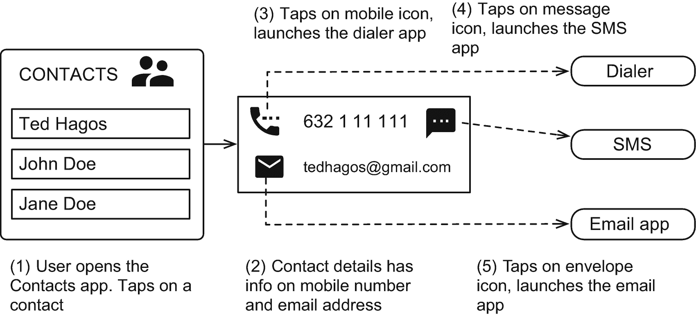
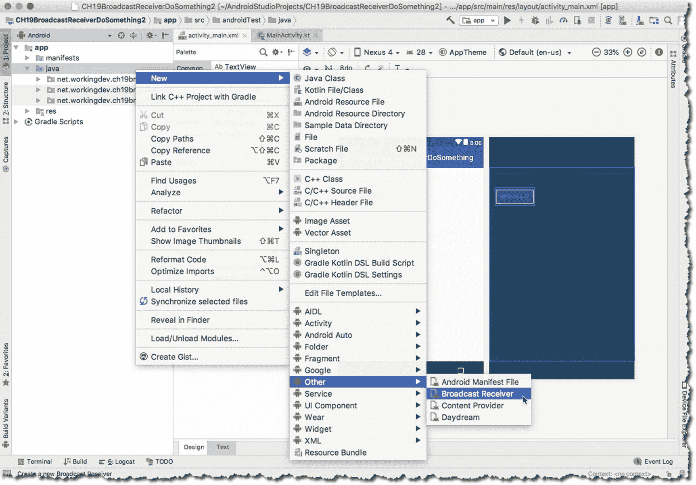
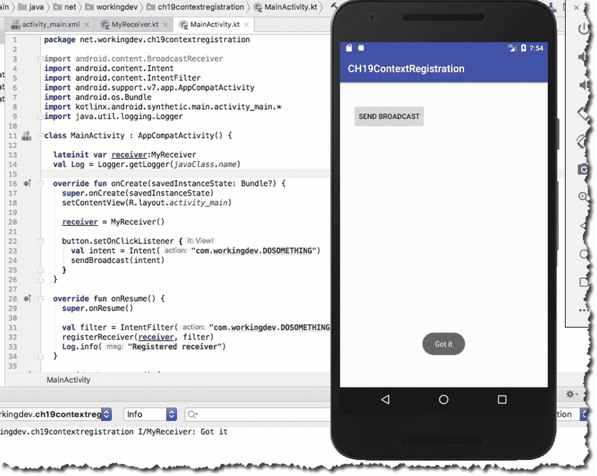
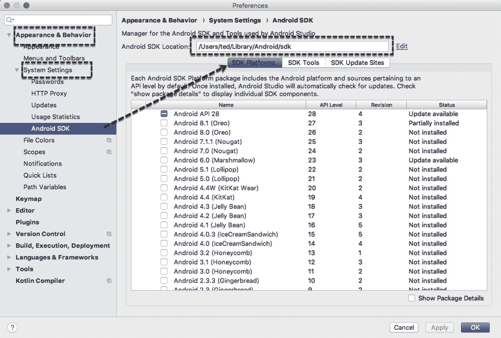

# 十九、广播接收器

*我们将介绍的内容:*

*   广播接收器简介

*   自定义和系统广播

*   清单和上下文注册的接收器

Android 的应用模型在许多方面都是独一无二的，但让它脱颖而出的是它允许你使用不是你自己制作的其他应用的功能来创建一个应用——我不仅仅指库，我指的是完整的应用。你已经了解了意图——它们是什么，它们能做什么。我们已经了解了如何使用 Intents 来启动其他组件，我们甚至使用它在组件之间传递数据。

还有一种方法可以使用意图。我们可以用它向所有组件发送广播。广播是由 Android 运行时或其他应用(包括您自己的应用)发送的意图，以便每个应用或组件都能听到它。大多数应用会忽略广播，但你可以让你的应用听它。你可以收听这条消息，以便对广播做出回应。这就是本章的主题。

## 广播接收器简介

因此，我们可以启动发送(广播)到所有应用和组件的意图。但是这有什么好处呢？要回答这个问题，我们需要回忆一下，谈谈 Android 在互操作性和可插拔性方面的哲学。还记得在第十二章中，我们第一次谈到意图吗？我们看了图 19-1 中的图片。



图 19-1

用户如何与“通讯录”应用交互

用户不在乎使用哪个应用来发送电子邮件、短信或打电话。当用户点击电子邮件时，它会启动一个隐含的意图，即“嘿，我想发一封电子邮件。谁感兴趣？”设备中的每个应用都会听到这个消息，但只有那些收听的人才能做出回应。这就是 BroadcastReceivers 的全部理念——向所有人发布一条消息，如果一些应用订阅了这条消息，他们就可以做出回应。它使用一个**发布-订阅**模型。

## 系统广播与自定义广播

意向广播可以由操作系统(系统广播)或应用(自定义广播)发送。每当发生有趣的事情时(例如，当 WiFi 打开[或关闭]时，当电池电量下降到指定阈值时，插入耳机时，或设备切换到飞行模式时等)，操作系统都会发送系统广播。).来自系统的广播动作的一些例子如下:

*   `android.app.action.ACTION_PASSWORD_CHANGED`

*   `android.app.action.ACTION_PASSWORD_EXPIRING`

*   `android.bluetooth.a2dp.profile.action.CONNECTION_STATE_CHANGED`

*   `android.bluetooth.a2dp.profile.action.PLAYING_STATE_CHANGED`

*   `android.bluetooth.adapter.action.CONNECTION_STATE_CHANGED`

*   `android.intent.action.BATTERY_CHANGED`

*   `android.intent.action.BATTERY_LOW`

*   `android.intent.action.BATTERY_OKAY`

文档中列出了大约 150 多种。你可以在 **BROADCAST_ACTIONS 上找到它们。Android SDK 中的 TXT** 文件。

另一方面，定制广播是你编造的。这些是您发送的意图，以通知您的应用的一些组件(或其他应用)发生了一些“有趣”的事情(例如，文件已完成下载或您已完成计算素数，等等)。).

## 清单注册与上下文注册

如果你想做一些事情作为对广播的响应，你需要监听它，为了做到这一点，你需要注册一个接收器。有两种注册方式:通过清单和通过上下文。

清单中注册的接收者看起来像清单 19-1 。

<colgroup><col class="tcol1 align-left"> <col class="tcol2 align-left"></colgroup> 
| -什么 | 就像活动一样，需要在清单中声明一个 **BroadcastReceiver** 。你必须在它自己的节点中声明它。像活动声明一样，它需要是**应用的子节点。** |
| ➋ | ".MyReceiver”是 BroadcastReceiver 类的名称。因此，假设您的应用中有一个名为 MyReceiver 的类，它继承了 BroadcastReceiver。我们干脆把它写成”。MyReceiver，“就像它上面的活动一样”。主要活动”。完整的形式其实是**net . working dev . ch 19 broadcast receiver something . my receiver**，但是我们可以使用简写形式，因为**包**名称已经在前面声明了；看看清单的第二行，你会找到包裹的完整名称。任何需要在清单中声明的后续类都可以简单地使用缩写形式，如“.我的收件人“或”。主要活动”。 |
| ➌ | **意向过滤器**是我们实际注册的方式。我们告诉操作系统我们对事件感兴趣**com . working dev . do something**。如果意向是以广播形式发送的，此应用会对其做出响应。 |

```kt
<?xml version="1.0" encoding="utf-8"?>
<manifest xmlns:android="http://schemas.android.com/apk/res/android"
  package="net.workingdev.ch19broadcastreceiverdosomething">
<application
  android:allowBackup="true"
  android:icon="@mipmap/ic_launcher"
  android:label="@string/app_name"
  android:roundIcon="@mipmap/ic_launcher_round"
  android:supportsRtl="true"
  android:theme="@style/AppTheme">
  <activity android:name=".MainActivity">
    <intent-filter>
      <action android:name="android.intent.action.MAIN" />
      <category android:name="android.intent.category.LAUNCHER" />
    </intent-filter>
  </activity>
  <receiver                             ➊
    android:name=".MyReceiver"          ➋
    android:enabled="true"
    android:exported="true">
    <intent-filter>                     ➌
      <action android:name="com.workingdev.DOSOMETHING"/>
    </intent-filter>
  </receiver>

</application>

Listing 19-1BroadcastReceiver Declared in AndroidManifest.xml

```

通过清单注册的接收者不需要为了响应广播而当前正在运行。接收者在清单上注册的事实足以解析意图。

当接收者通过上下文对象以编程方式注册时，它看起来像清单 19-2 。

<colgroup><col class="tcol1 align-left"> <col class="tcol2 align-left"></colgroup> 
| -什么 | 这是我们前面看到的`<intent-filter>`节点的编程等价物。要创建一个 **IntentFilter** 对象，向其构造函数传递一个广播动作。广播操作是您想要订阅的事件。在这种情况下，我们希望在发出动作为**com . working dev . do something**的意向时得到通知；此意图是自定义广播的一个示例，而不是系统广播。 |
| ➋ | 使用活动的 **registerReceiver** 方法注册接收者。该方法有两个参数:a.BroadcastReceiver 的实例，以及 b.IntentFilter 的实例 |
| ➌ | 当您以编程方式注册接收方时，请确保您也注销了它。这就是我们在这里做的。它在一个 **try-catch** 结构中，因为它可以抛出一个异常。如果你试图注销一个还没有注册的接收者(或者一个已经注销的接收者)，运行时将抛出 **IllegalArgumentException** 。我没有为注册部分这样做，因为 **registerReceiver** 不会抛出任何异常，即使你(意外地)不止一次注册了同一个接收者。一旦注册了一个接收者，运行时将忽略任何注册它的进一步尝试。 |
| -你好 | 这是 BroadcastReceiver 类的基本定义。 |

```kt
val Log = Logger.getLogger(javaClass.name)

override fun onCreate(savedInstanceState: Bundle?) {

  super.onCreate(savedInstanceState)
  setContentView(R.layout.activity_main)

  val action_filter = IntentFilter("com.workingdev.DOSOMETHING") ➊
  val receiver = MyReceiver()

  btnregister.setOnClickListener {
    registerReceiver(receiver, action_filter)  ➋
  }

  btnunregister.setOnClickListener {
    try {
      unregisterReceiver(receiver)            ➌
    }

    catch(iae:IllegalArgumentException) {
      Log.warning("IllegalArgument\n ${iae}")
    }
    catch(e:Exception) {
      Log.warning("IllegalArgument\n ${e}")
    }
  }
}

inner class MyReceiver : BroadcastReceiver() {                     ➍
  override fun onReceive(context: Context?, intent: Intent?) {
    println("got it");
    Toast.makeText(this@MainActivity, "Got it", Toast.LENGTH_LONG).show()
  }
}

Listing 19-2How to Register and Unregister a BroadcastReceiver

```

以编程方式注册的接收器只能在应用(用于注册接收器)仍在运行时响应广播。

## 广播接收器基础

创建广播接收器时，需要遵循几个步骤。它们是:

1.  **决定您想收听哪个** **的广播节目**。你想听系统广播还是自定义广播？如果您希望促进应用组件之间的一些消息传递，通常会使用自定义广播。使用 BroadcastReceiver 的一个用例是，当您使用 DownloadManager 系统服务下载大文件时，该服务会在下载完成时发出广播—您可能希望听到广播，以便在下载后立即采取行动。

2.  决定如何注册接收者，通过上下文还是通过清单？您可以通过任何一种方式(清单或上下文)收听自定义广播，但是有些广播操作是受限制的，您不能通过清单注册来收听它们。我们将很快讨论这个问题。

3.  创建一个继承自 BroadcastReceiver 类的类。

4.  **覆盖并实现新类的 onReceive** 方法。当一个广播被发送时，意图过滤器与动作匹配，操作系统将意图解析到你的应用，最终特定的 BroadcastReceiver 类，运行时调用 **onReceive** 方法。 **onReceive** 方法是 BroadcastReceiver 类的核心。无论你想在播配的时候做什么，这都是你需要写的地方。

通常，如果您通过 Android 清单或上下文对象注册了 BroadcastReceiver，就可以收听广播。让我们继续一点。前面，我使用了术语“通过上下文注册”和“以编程方式注册”——它们是同一个，意思相同。“通过上下文注册”是指在**上下文**对象上调用 **registerReceiver** 方法。所以声明

```kt
registerReceiver(receiver, intent_filter)

```

与语句相同

```kt
this.registerReceiver(receiver, intent_filter)

```

它们都是在当前活动的上下文中调用的——Activity 类实际上继承自 Context 对象，Service 类也是如此。因此，您可以从活动或服务内部调用 registerReceiver 方法。如果你在一个不从上下文继承的类中，你仍然可以通过获取应用的上下文来注册一个接收者。代码看起来像这样:

```kt
getApplicationContext().registerReceiver(receiver, intent_filter)   // or
applicationContext.registerReceiver(receiver, intent_filter)

```

回到清单与上下文注册，有些广播动作不能在清单中注册；但是你可以通过上下文注册它们。一个例子是`android.intent.action.` `TIME_TICK`，这是一个受保护的意图，只能由系统发送。它每 60 秒发送一次，你只有通过上下文注册才能收听。

在 Android 的早期版本中，已经有一些广播被限制在清单之外。写这篇文章的时候，Android 9(或者 API 级)出来了。在本书中，我们一直使用 API 级别 23 作为目标，但是您将从阅读每个 Android 版本的行为变化文档中受益。我在下面列出了一些 Android 官方文档的链接。这些文件以这样或那样的方式影响着广播受众。

*   **Android 9 (API 28)行为改变**。 [`http://bit.ly/behaviorchanges9`](http://bit.ly/behaviorchanges9) 。谈谈如果我们想瞄准 Android 9，开发者应该知道的 API 的所有变化。这位医生对广播接收器有话要说。

*   **背景**执行限制。[`bit.ly/bgexeclimit`](http://bit.ly/bgexeclimit)。这是关于你的应用在后台运行时能做什么和不能做什么。不要以为因为不在 UI 线程里，就可以到处跑，想干嘛干嘛。这份文件谈到了这些限制；它还谈到了对广播接收器的限制。

*   **broadcast receiver**exceptions。[`bit.ly/broadcastexceptions`](http://bit.ly/broadcastexceptions)。从 Android 8 开始(继续到 9)，除了一些例外，所有隐式广播动作现在都是清单的禁区。这份文件列举了那些被免除的行为。如果您想知道哪些隐式广播动作仍然可以通过清单注册，请阅读本文档。

## 隐式与显式广播动作

Android 区分了隐式和显式广播动作。它将显式广播定义为只针对一个应用的广播，而不管有多少其他应用在监听它。另一方面，任何注册的应用都可以听到明确的广播。为了我们的目的和使我们的生活更简单，文档告诉我们不要通过清单收听系统广播。从 Android 8 开始，所有隐式广播(除了那些在 [`http://bit.ly/broadcastexceptions`](http://bit.ly/broadcastexceptions) 列出的)都不能被通过清单注册的接收器听到。但是如果您通过上下文注册，您仍然可以收听这些广播操作。

所有这些新限制的主要原因都与性能优化和节能有关。考虑一下:当设备的 WiFi 连接出现问题时，会发送 CONNECTIVITY_ACTION 广播。如果有十几个应用在监听这个广播，它们都会醒来并采取行动。每次 WiFi 掉线重新连上都会这样。请记住，清单注册的接收者不需要活着才能接收广播；事实上，当他们得到广播时，他们会活过来。这种行为会导致大量功耗。如果你的应用在不运行时不需要被告知 WiFi 连接，那么通过上下文来注册更负责任。

## 演示应用:自定义广播

让我们构建一个小项目，这样您可以自己尝试广播接收器。表 19-1 显示了该项目的详细情况。

表 19-1

项目详细信息

<colgroup><col class="tcol1 align-left"> <col class="tcol2 align-left"></colgroup> 
| 

项目详细信息

 | 

价值

 |
| --- | --- |
| 应用名称 | ch19 上下文记录 |
| 公司域 | 使用您的网站名称 |
| Kotlin 支架 | 是 |
| 波形因数 | 仅限手机和平板电脑 |
| 最低 SDK | API 23 棉花糖 |
| 活动类型 | 空的 |
| 活动名称 | 主要活动 |
| 布局名称 | 活动 _ 主要 |

想做什么:

1.  创建一个响应隐式自定义广播的 BroadcastReceiver

2.  一旦活动对用户可见，我们将立即注册接收者；和

3.  我们将在活动进入“暂停”状态之前注销接收者。

4.  MainActivity 的 UI 只有一个按钮。当点击该按钮时，它将发送一个自定义的广播意图。

清单 19-3 显示了 UI 的极简代码。

```kt
<?xml version="1.0" encoding="utf-8"?>
<android.support.constraint.ConstraintLayout xmlns:android=http://schemas.android.com/apk/res/android
  xmlns:app=http://schemas.android.com/apk/res-auto
  xmlns:tools=http://schemas.android.com/tools
  android:layout_width="match_parent"
  android:layout_height="match_parent"
  tools:context=".MainActivity">

  <Button
    android:id="@+id/button"
    android:layout_width="wrap_content"
    android:layout_height="wrap_content"
    android:layout_marginStart="26dp"
    android:layout_marginTop="43dp"
    android:text="send broadcast"
    app:layout_constraintStart_toStartOf="parent"
    app:layout_constraintTop_toTopOf="parent" />
</android.support.constraint.ConstraintLayout>

Listing 19-3/app/res/layout/activity_main.xml

```

我们需要添加一个继承自 BroadcastReceiver 的类。方法之一是从主菜单栏**文件** ➤ **新建** ➤ **Kotlin 文件/类**。或者，我们也可以使用项目工具窗口的 **app** ➤ **java** 文件夹中的上下文菜单，如图 19-2 所示。从那里，你可以去**新** ➤ **其他** ➤ **广播接收器**。



图 19-2

新广播接收器

你需要填写类的名字。在本例中，我将该类命名为“MyReceiver”

我们不会在接收器中做任何特别的事情。我们将简单地在日志记录器中显示 toast 消息打印内容。清单 19-4 显示了 MyReceiver 的代码。

<colgroup><col class="tcol1 align-left"> <col class="tcol2 align-left"></colgroup> 
| -什么 | 当广播意图与接收器匹配时，操作系统调用广播接收器的 **onReceive** 方法。在这里，您应该为接收方编写应用的业务逻辑(例如，保存文件、根据 WiFi 条件路由程序逻辑等)。). |

```kt
import android.content.BroadcastReceiver
import android.content.Context
import android.content.Intent
import android.widget.Toast
import java.util.logging.Logger

class MyReceiver : BroadcastReceiver() {

  val Log = Logger.getLogger(javaClass.name)

  override fun onReceive(context: Context, intent: Intent) {  ➊
    Toast.makeText(context, "Got it", Toast.LENGTH_LONG).show()
    Log.info("Got it")
  }
}

Listing 19-4
MyReceiver.java

```

在主活动中，我们将执行以下操作:

1.  创建 MyReceiver 的实例。我们只需要做一次。这就是为什么我们将在 **onCreate** 回调中创建实例。

2.  每当接收者对用户可见时注册它。我们将把这段代码放在 MainActivity 的 **onResume** 回调中。

3.  当用户不再与 MainActivity 交互时，注销接收者。

4.  当点击该按钮时，我们将发送一个自定义的广播意图。

清单 19-5 显示了 MainActivity 的完整和带注释的代码。



图 19-3

我们的应用，跑步

<colgroup><col class="tcol1 align-left"> <col class="tcol2 align-left"></colgroup> 
| -什么 | **receiver** 变量保存了 **MyReceiver** 类的实例(我们的 BroadcastReceiver)。我们将变量声明为属性，因为我们将在 **onResume** 和 **onPause** 方法中引用它。我们使用了 **lateinit** 关键字，因为我们现在还不会定义它。 |
| ➋ | 让我们使用一个基本的日志对象。 |
| ➌ | 现在我们在 **onCreate** 中，让我们定义 MyReceiver 对象。 |
| -你好 | 当点击按钮时，我们想要创建一个广播意图，并将其*动作*设置为 DOSOMETHING。 |
| ➎ | 启动意图。 |
| ➏ | 我们正在进行 **onResume** 回调。每当 MainActivity 对用户可见时，操作系统都会调用这个方法。这是注册接收者的好地方。我们只想在使用应用时收到通知。 |
| -好的 | 我们在**中，因为**，在 MainActivity 进入“暂停”状态并从用户的视野中消失之前，操作系统调用这个方法。这是注销接收者的好地方。我们不想在不使用应用时收到通知。 |

```kt
import android.content.Intent
import android.content.IntentFilter
import android.support.v7.app.AppCompatActivity
import android.os.Bundle
import kotlinx.android.synthetic.main.activity_main.*
import java.util.logging.Logger

class MainActivity : AppCompatActivity() {

  lateinit var receiver:MyReceiver                      ➊
  val Log = Logger.getLogger(javaClass.name)            ➋

  override fun onCreate(savedInstanceState: Bundle?) {
    super.onCreate(savedInstanceState)
    setContentView(R.layout.activity_main)

    receiver = MyReceiver()                             ➌

    button.setOnClickListener {
      val intent = Intent("com.workingdev.DOSOMETHING") ➍
      sendBroadcast(intent)                             ➎
    }
  }

  override fun onResume() {                             ➏
    super.onResume()

    val filter = IntentFilter("com.workingdev.DOSOMETHING")
    registerReceiver(receiver, filter)
    Log.info("Registered receiver")
  }

  override fun onPause() {                              ➐
    super.onPause()

    try {
      unregisterReceiver(receiver)
      Log.info("Unregistered receiver")
    }
    catch(iae: IllegalArgumentException) {
      Log.warning(iae.toString())
    }
  }
}

Listing 19-5
MainActivity.java

```

另一种发送广播意图的方式是通过 Android 调试桥或 **adb** **，简称**。它是一个命令行工具，允许您与设备(物理设备或仿真设备)进行通信。adb 可以做很多事情，比如安装/卸载 apk、显示日志、在设备上运行 Linux 命令、模拟电话呼叫等等。出于我们的目的，我们将使用发送一个广播意图。

**adb** 在 Android SDK 的平台工具文件夹里。打开命令行窗口，切换到 Android SDK 的目录。如果你忘记了它在哪里，去 Android Studio 的*设置* (Windows 和 Linux)或者*首选项* (macOS)。对于 Windows 和 Linux，您可以通过按下按键 **CTRL + ALT + S** ，或者对于 macOS，您可以按下按键 **Command +、**(逗号)。

在那里，进入外观和行为➤系统设置➤安卓 SDK，如图 19-4 所示。Android SDK 的位置就在那里。



图 19-4

首选项，Android SDK

回到命令行窗口，切换到 Android SDK 文件夹。从那里，切换到**平台工具**文件夹，然后运行以下命令:

```kt
adb shell am broadcast -a com.workingdev.DOSOMETHING

```

如果您在 macOS 或 Linux 上，您可能需要在命令前面加上点号和正斜杠，就像这样:

```kt
./adb shell am broadcast -a com.workingdev.DOSOMETHING

```

## 演示应用:系统广播

下一个项目将与上一个项目相似，但我们将收听系统广播。我们将监听系统每 60 秒发出的 ACTION_TIME_TICK。这是一个受保护的意图，所以我们必须在运行时注册接收者。表 19-2 显示了该项目的详细情况。

表 19-2

系统广播的项目详情

<colgroup><col class="tcol1 align-left"> <col class="tcol2 align-left"></colgroup> 
| 

**项目明细**

 | 

**值**

 |
| --- | --- |
| 应用名称 | ch19 系统广播 |
| 公司域 | 使用您的网站名称 |
| Kotlin 支架 | 是 |
| 波形因数 | 仅限手机和平板电脑 |
| 最低 SDK | API 23 棉花糖 |
| 活动类型 | 空的 |
| 活动名称 | 主要活动 |
| 布局名称 | 活动 _ 主要 |

这个应用非常简单。没有要设置的 UI 元素。这是我们想要做的:

1.  创建一个 BroadcastReceiver 来侦听 ACTION_TIME_TICK 意图。我们将把它实现为一个内部类——这样做的唯一原因是使代码的表示更加简洁。如果您愿意，您完全可以将 receiver 类实现为独立的类。

2.  我们希望只有当用户与应用交互时才能收听广播。所以我们将在 MainActivity 的 **onResume** 回调中注册接收者；我们将在**中注销它，因为**回调。

3.  每当收到 ACTION_TIME_TICK 时，我们将简单地使用 Toast 对象向控制台和用户屏幕输出一条消息。

<colgroup><col class="tcol1 align-left"> <col class="tcol2 align-left"></colgroup> 
| -什么 | 创建 BroadcastReceiver 的实例 |
| ➋ | 创建用于监听 ACTION_TIME_TICK 广播的 **intentfilter** |
| ➌ | 在 Resume 上注册**内的接收器；当用户看到应用时，运行时会调用此方法。** |
| -你好 | 在应用进入“暂停”状态之前注销接收器。通过这种方式，只要我们的应用在用户的视野内，接收器就只收听广播。当应用不再出现在用户的视图中时，我们不想收到任何广播通知。 |
| ➎ | 这是 BroadcastReceiver 的类定义。它是作为内部类实现的，同样有效。这对我们有用，因为我们没有试图在 **onReceive** 回调中做任何实质性的事情。如果程序逻辑过于复杂，BroadcastReceiver 最好在 MainActivity 之外实现。 |

```kt
import android.content.BroadcastReceiver
import android.content.Context
import android.content.Intent
import android.content.IntentFilter
import android.support.v7.app.AppCompatActivity
import android.os.Bundle
import android.widget.Toast

import java.util.logging.Logger

class MainActivity : AppCompatActivity() {

  lateinit var intentfilter:IntentFilter
  lateinit var timereceiver:TimeReceiver
  var current_count = 0

  val Log = Logger.getLogger(javaClass.name)

  override fun onCreate(savedInstanceState: Bundle?) {
    super.onCreate(savedInstanceState)
    setContentView(R.layout.activity_main)

    timereceiver = TimeReceiver()                         ➊
    intentfilter = IntentFilter(Intent.ACTION_TIME_TICK)  ➋
  }

  override fun onResume() {
    super.onResume()
    Log.info("App is resuming")
    registerReceiver(timereceiver,intentfilter)           ➌
  }

  override fun onPause() {
    super.onPause()
    Log.info("App is paused")
    try {
      unregisterReceiver(timereceiver)                    ➍
    }
    catch(iae:IllegalArgumentException) {
      Log.warning(iae.toString())
    }
  }

  inner class TimeReceiver : BroadcastReceiver() {        ➎
    override fun onReceive(context: Context?, intent: Intent?) {
      current_count += 1
      var message = "Counter:${current_count}"
      Log.info(message)
      Toast.makeText(this@MainActivity, message, Toast.LENGTH_LONG).show()
    }
  }
}

Listing 19-6
MainActivity

```

## 其他说明

BroadcastReceivers 和 Intents 在让解耦的组件互相对话方面做得很有效。如果你想方便应用之间的交流，使用 BroadcastReceivers 是很好的；它们是进程间通信的良好解决方案。但是，如果你自己的应用的组件之间的通信受到限制，广播接收器是一个昂贵的解决方案。用全球广播不合适。

如果您只是想简化应用组件之间的消息传递，您可能需要考虑一个 LocalBroadcastManager 类。当您使用此功能时，广播数据不会离开您的应用。它不是进程间的。遗憾的是，本章不会讨论 LocalBroadcastManager。但是希望你已经对广播接收器的概念和使用有了一些好的基础。

## 章节总结

*   您可以使用 BroadcastReceivers 和 Intents 来创建真正解耦的应用。

*   您可以让您的应用收听特定的广播，并在广播发送时做一些有趣的事情。

*   BroadcastReceivers 可用于在您的应用中路由程序逻辑。您可以让应用以特定方式运行，以响应运行时环境的变化(例如，低电量、无 WiFi 连接)。

*   可以通过清单或上下文对象注册 BroadcastReceivers。如果你的目标是 Android 9.0，请确保阅读允许通过清单注册的广播动作。Android 团队不鼓励应用通过清单注册，而是使用上下文注册。

在下一章，你将学习如何准备你的应用进行分发。