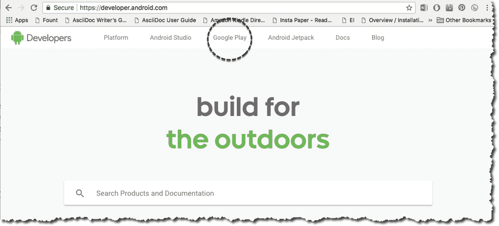

# 二十、应用分发

*我们将介绍的内容:*

*   清理

*   准备发布

*   签署应用

*   Google Play

在某些时候，您可能希望将您的应用分发给更多的人。Android 应用可以相当自由地分发，没有太多限制；你可以在你的网站上下载，甚至直接通过电子邮件发送给用户，但许多开发者选择在谷歌 Play 商店或亚马逊应用商店等市场上发布他们的应用，以最大限度地扩大影响。不管你打算如何发布，在发布应用之前，你需要做一些事情。

发布应用可能是一项非常复杂的活动，它不仅限于应用分发的技术和程序方面，例如在 **developer 上创建帐户。****，制作打磨好的图标，给你的 app 签名。它还可能涉及创建文案和宣传文本、社交媒体活动以及许多其他与技术完全无关的事情。本章将只关注 app 分发的技术要求。**

 **通常，发布应用有两个阶段:

1.  **准备 app 发布**。这是我们打扫卫生的地方。你需要在发布前清理应用。这是我们删除所有调试信息和其他设置或记录我们在开发过程中使用的内容的地方。你当然不希望你的用户意外地看到你在编码时为自己留下的“明白了”或“我在这里”的痕迹。你可能还想为应用考虑图标和其他视觉素材。在这个阶段投资一个实际的设备并在上面测试你的应用是一个好主意。最重要的是，在这个阶段，我们将建立一个开发者证书。

2.  **发布 app** 。你需要宣传这个应用，销售它，并分发它。如果您将在谷歌 Play 商店发布该应用，您需要注册一个发布者帐户，并使用 Google Play 的开发者控制台进行发布。

## 准备发布应用

这里我们需要做的三件主要事情是:

1.  准备发布的材质和素材

2.  配置要发布的应用

3.  构建一个发布就绪的应用

### 准备用于发布的材质和素材

无论你的代码多么漂亮或者聪明，用户永远也看不到它。他将看到的是你的视图对象、图标和应用的其他图形素材。确保它们是抛光的。

如果你不考虑应用的图标，那你就是失职。此图标帮助用户识别您的应用，因为它位于主屏幕上。这个图标还会出现在其他几个区域，比如启动窗口、下载部分，更重要的是，如果你在 Google marketplace 上发布你的应用，这个图标也会显示在那里。应用图标可能在给你的潜在用户创造第一印象方面起着重要作用，所以这是一个好主意，你可以在 [`http://bit.ly/androidreleaseiconguidelines`](http://bit.ly/androidreleaseiconguidelines) 找到谷歌的应用图标指南。

如果你要在谷歌市场上发布应用，还需要考虑图形素材，比如屏幕截图和促销文本。请务必阅读谷歌的图形素材指南，该指南可在 [`http://bit.ly/androidreleasegraphicassets`](http://bit.ly/androidreleasegraphicassets) 找到

### 配置要发布的应用

这是你清理和净化应用的部分。我们在这里提到的东西绝不是强制性的，但在构建发布版本之前浏览它们是一个好主意。

#### 检查包名

在前面的章节中，您已经使用了" *com.example.myapp"* 作为包名。这对于测试或实践应用来说没问题，但当你将应用发布给公众时就不一样了。软件包名称使应用在市场上独一无二，一旦你决定了软件包名称，你就不能再改变它了。所以，考虑一下吧。

#### 删除日志记录和调试信息

调试和日志信息在开发过程中是有用的——甚至是不可或缺的，但是你不能让你的用户看到它们。在发布应用之前，删除应用的所有调试和日志信息。

调试信息很容易处理，您只需删除清单文件的 **<应用>** 标签中的**Android:debuggeable**属性。不幸的是，对于日志记录信息，情况就不一样了。

有多种方法可以解决日志问题；这些解决方案可以像手动删除所有日志语句一样简单(但是繁琐),也可以像编写 sed 或 awk 程序来自动删除日志调用一样复杂。有些人通过配置 ProGuard 来处理日志问题(这超出了本书的范围)，有些人甚至会使用像 Timber(GitHub 项目)这样的第三方库来替换 Android 的日志类。无论您采用哪种方法，请注意，您需要在构建发布版之前去掉日志语句。

#### 检查应用权限

在开发过程中的某个时候，您可能已经试验了应用的一些特性，并且您可能已经在清单上设置了权限，比如使用网络、写入外部存储等的权限。检查清单上的 **< uses-permission >** 标记，确保不授予应用不需要的权限。

#### 远程服务器和 URL

如果您的应用依赖于 web APIs 或云服务，请确保应用的发布版本使用的是生产 URL，而不是测试路径。在开发过程中，您可能已经获得了沙盒和测试 URLs 您需要将它们升级到生产版本。

### 构建发布就绪的应用

我们在本书中所做的所有项目和示例都通过一个简单的过程部署在模拟器中。我们点击了**运行**按钮。Android Studio 将该应用构建并组装成 APK，部署在目标设备中。之后 app 运行。在整个过程中，有一步是 Android Studio 为我们做的，而你并不知道。你一点都没有意识到。

Android Studio 执行了一项非常重要的任务，在任何设备(仿真或实际设备)上交付或安装任何 APK 之前，都需要执行这项任务。安卓工作室签了那个 APK。

在您可以在任何设备上安装和运行应用之前，应用的 APK 必须经过数字签名。当我们点击运行按钮时，Android Studio 会自动对所有应用进行签名。但是它使用一个调试证书，这个证书只对开发和测试有用。发布应用时，不能使用相同的证书。包括谷歌在内的大多数应用商店都不接受带有调试证书的应用。

在我们发布应用之前，我们必须用正确的证书对其进行签名，而不是调试证书。我们不需要去像 Thawte 或 Verisign 这样的认证机构——自签名证书就可以了。

启动 Android Studio，如果它尚未打开的话。打开您的项目。从主菜单栏进入**构建** ➤ **生成签名 APK** ，如图 20-1 所示。

图 20-1

生成签名的 APK

单击“下一步”按钮。您应该会看到“密钥库”对话框，如图 20-2 所示。

图 20-2

密钥库对话框

**密钥存储路径**询问我们的 Java 密钥存储库(JKS)文件在哪里。在这一点上，你还没有。所以，点击**新建**。你会看到创建新密钥库的对话框，如图 20-3 所示。

图 20-3

新密钥库

### 注意

在 Java 中，keystore 是安全证书的存储库——授权证书或公钥证书。

表 20-1 显示了对密钥库输入项的描述。

表 20-1

密钥库项目和描述

<colgroup><col class="tcol1 align-left"> <col class="tcol2 align-left"></colgroup> 
| 

密钥库项目

 | 

描述

 |
| --- | --- |
| 密钥库路径 | 要保存密钥库的位置。这完全取决于。一定要记住这个地方。 |
| 密码 | 这是密钥库的密码。 |
| 别名 | 此别名标识密钥。它只是一个友好的名字。 |
| (钥匙)密码 | 这是钥匙的密码。这与密钥库的密码**不同**(但是如果您愿意，也可以使用相同的密码)。 |
| 有效期，以年计 | 默认为 25 年；你可以接受默认值。如果在 Google Play 上发布，证书的有效期必须到 2033 年 10 月——所以，25 年应该没问题。 |
| 其他信息 | 只有名字和姓氏字段是必需的。 |

填写完“新建密钥库”对话框后，单击“确定”这将把你带回生成签名 APK 窗口，如图 20-4 所示；但是现在，创建了 JKS 文件，并用它填充了密钥库对话框。

图 20-4

生成签名的 APK，已填充

点击“下一步”

图 20-5

签名 APK APK 目的地文件夹

接下来，我们选择签约 APK 的目的地，如图 20-5 所示。你需要记住这个位置。这是 Android Studio 存储签名 APK 的地方。另外，确保**构建类型**被设置为“发布”

单击“完成”后，Android Studio 将为您的应用生成签名的 APK。这是您将提交给 Google Play 的文件。你甚至可以在你的网站或其他市场上出售这款 APK——它已经准备好发布了。

## 发布应用

在向 Google Play 提交应用之前，您需要一个开发者帐户。如果你还没有，可以在 [`https://developer.android.com`](https://developer.android.com) 报名。我对接下来的活动做了很多假设。我假设:

1.  你已经有一个谷歌账户(Gmail)；

2.  你在用谷歌浏览器去[`https://developer.android.com`](https://developer.android.com)；和

3.  您的 Google 帐户已登录 Chrome。

如果你的谷歌账户没有登录 Chrome，你可能会看到类似图 20-6 的东西。Chrome 会要求你选择一个账户(或者创建一个)。

图 20-6

选择帐户

当你整理好你的谷歌账户后，你将被带到 developer.android.com 网站，如图 20-7 所示。

### 注意

这里显示的截图是他们在写作时出现的。谷歌不时对网站进行修改。当你读到这本书的时候，Google Play 网站可能不再像这些截图一样了。

点击 **Google Play** ，如图 20-7 所示。

图 20-7

developer.android.com

点击**启动游戏控制台**，如图 20-8 所示。

图 20-9

Google Play 控制台，注册

图 20-8

启动游戏控制台

您需要通过四个步骤来完成注册(如图 20-9 ):

1.  使用您的 Google 帐户登录。

2.  接受开发者协议。

3.  交报名费。

4.  填写您的帐户详细信息。

一旦完成注册和支付，您现在就可以访问 Google Play 控制台，如图 20-10 所示。

图 20-10

游戏控制台

您可以从这里开始向商店提交应用的流程。单击“创建应用”按钮开始。

## 章节总结

*   你的代码可能很棒，但是用户永远看不到它们。也要注意用户会看到的东西，比如图标和其他图形素材。

*   在发布代码之前清理它们。删除所有日志和调试信息。

*   对你自己的工作进行代码评审。如果你有伙伴或者其他人可以和你一起审查代码，那就更好了。如果你的应用使用服务器、RESTful URLs 等。，确保它们是生产就绪的，而不是沙盒。

*   如果你想将你的应用发布到 Google Play 或 Amazon 等市场，你不能使用调试证书。

*   如果你想在 Google Play 上出售你的应用，你需要一个 Google Play 账户。我一次性支付了 25 美元的费用，但那是几年前的事了。

*   别忘了在真实设备上测试你的应用。

*   我们试图提炼和简化将你的应用放入 Play Store 的过程，但是这一章并不能代替 Android 开发者的发布清单。你还是应该读一下。你可以在 [`https://bit.ly/appstorelaunchchecklist`](https://bit.ly/appstorelaunchchecklist) 找到。**