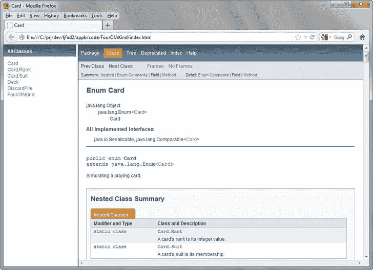

# 十六、附录 B：四个同类

应用开发不是一件容易的事情。如果你在开发一个应用之前没有仔细计划，你可能会在努力创建它的时候浪费你的时间和金钱，在它不能满足用户需求的时候浪费他们的时间和金钱。

小心谨慎地测试你的软件是非常重要的。如果故障软件给用户造成经济损失，你可能会面临诉讼。

在本附录中，我将介绍一种高效开发应用的技术。我在一个 Java 应用的上下文中介绍了这种技术，该应用让您与计算机玩一个简单的纸牌游戏，名为*四张同款* 。

理解四个同类

在坐在电脑前写代码之前，您需要完全理解您试图通过代码建模的问题域。在这种情况下，问题域是 *Four of a Kind* ，你想了解这个卡牌游戏是如何工作的。

两到四名玩家用一副标准的 52 张牌打四张同类型的牌。游戏的目标是成为第一个放下四张同等级牌(例如，四张 a)的玩家，赢得游戏。

游戏从洗牌开始，将牌面朝下。每个玩家从这副牌的顶部拿一张牌。拥有最高等级牌(国王是最高的)的玩家向每个玩家发四张牌，从庄家左边的玩家开始。然后庄家开始它的回合。

玩家检查自己的牌，以确定哪些牌最适合获得四张同类型的牌。然后，玩家扔掉弃牌堆上最没用的牌，并从牌堆顶部捡起另一张牌。(如果每张牌的等级不同，玩家随机选择一张牌扔掉。)如果玩家有四张同花顺，玩家放下这些牌(面朝上)并赢得游戏。

用伪代码 建模四个同类

既然你已经理解了四个一类的游戏是如何运作的，你可以开始模拟这个游戏了。你不会用 Java 源代码来建模游戏，因为你会陷入太多的细节中。相反，您将使用伪代码来完成这项任务。

*伪代码* 是对问题域的一种简洁而非正式的高级描述。不同于前面对四个一类的的描述，伪代码等同于解决问题的一步一步的方法。查看列表 B-1 。

清单 B-1。两个玩家的四个相同的伪代码(人类和计算机)

```java
 1\. Create a deck of cards and shuffle the deck.
 2\. Create empty discard pile.
 3\. Have each of the human and computer players take a card from the top of the deck.
 4\. Designate the player with the highest ranked card as the current player.
 5\. Return both cards to the bottom of the deck.
 6\. The current player deals four cards to each of the two players in alternating fashion, with the first card being dealt to the other player.
 7\. The current player examines its current cards to see which cards are optimal for achieving four of a kind. The current player
 throws the least helpful card onto the top of the discard pile.
 8\. The current player picks up the deck's top card. If the current player has four of a kind, it puts down its cards and wins the game.
 9\. Designate the other player as the current player.
 10\. If the deck has no more cards, empty the discard pile to the deck and shuffle the deck.
 11\. Repeat at step 7.

```

从前面的描述中派生出清单 B-1 的伪代码是实现实现*四个同类*的应用的第一步。这个伪代码执行各种任务，包括决策和重复。

尽管对于理解四个一类的(??)是如何工作的来说，清单 B-1(??)是一个更有用的指南，但是对于翻译成 Java 来说，清单 B-1(??)的层次太高了。因此，您必须细化这个伪代码，以便于翻译过程。清单 B-2 展示了这种改进。

清单 B-2。为两个玩家(人类和计算机)提炼出 4 个同类伪代码

```java
 1\. deck = new Deck()
 2\. deck.shuffle()
 3\. discardPile = new DiscardPile()
 4\. hCard = deck.deal()
 5\. cCard = deck.deal()
 6\. if hCard.rank() == cCard.rank()
    6.1\. deck.putBack(hCard)
    6.2\. deck.putBack(cCard)
    6.3\. deck.shuffle()
    6.4\. Repeat at step 4
 7\. curPlayer = HUMAN
    7.1\. if cCard.rank() > hCard.rank()
         7.1.1\. curPlayer = COMPUTER
 8\. deck.putBack(hCard)
 9\. deck.putBack(cCard)
10\. if curPlayer == HUMAN
    10.1\. for i = 0 to 3
          10.1.1\. cCards[i] = deck.deal()
          10.1.2\. hCards[i] = deck.deal()
    else
    10.2\. for i = 0 to 3
          10.2.1\. hCards[i] = deck.deal()
          10.2.2\. cCards[i] = deck.deal()
11\. if curPlayer == HUMAN
    11.01\. output(hCards)
    11.02\. choice = prompt("Identify card to throw away")
    11.03\. discardPile.setTopCard(hCards[choice])
    11.04\. hCards[choice] = deck.deal()
    11.05\. if isFourOfAKind(hCards)
           11.05.1\. output("Human wins!")
           11.05.2\. putDown(hCards)
           11.05.3\. output("Computer's cards:")
           11.05.4\. putDown(cCards)
           11.05.5\. End game
    11.06\. curPlayer = COMPUTER
    else
    11.07\. choice = leastDesirableCard(cCards)
    11.08\. discardPile.setTopCard(cCards[choice])
    11.09\. cCards[choice] = deck.deal()
    11.10\. if isFourOfAKind(cCards)
           11.10.1\. output("Computer wins!")
           11.10.2\. putDown(cCards)
           11.10.3\. End game
    11.11\. curPlayer = HUMAN
12\. if deck.isEmpty()
    12.1\. if discardPile.topCard() != null
          12.1.1\. deck.putBack(discardPile.getTopCard())
          12.1.2\. Repeat at step 12.1.
    12.2\. deck.shuffle()
13\. Repeat at step 11.

```

除了比清单 B-1 的更长之外，清单 B-2 的显示了精炼的伪代码变得更像 Java。例如，清单 B-2 揭示了 Java 表达式(如 new Deck() ，创建一个 Deck 对象)、运算符(如 == ，比较两个值是否相等)、方法调用(如 deck.isEmpty() ，调用 deck 的 isEmpty() 方法，返回一个指示是否为【真】或【假】的布尔值

将伪代码转换成 Java 代码

现在您已经有机会理解了清单 B-2 的类似 Java 的伪代码，您已经准备好检查将该伪代码转换成 Java 源代码的过程了。这个过程由几个步骤组成。

将清单 B-2 的伪代码转换成 Java 的第一步包括识别游戏结构的重要组件，并将这些组件实现为类，我在第三章中正式介绍过。

除了计算机播放器(通过游戏逻辑实现)，重要的组件是卡片、甲板和弃牌堆。我通过卡片、卡片组和废弃堆类来表示这些组件。清单 B-3 呈现卡片。

清单 B-3。将花色和等级合并成卡片

```java
/**
 *  Simulating a playing card.
 *
 *  @author Jeff Friesen
 */

public enum Card
{
   ACE_OF_CLUBS(Suit.CLUBS, Rank.ACE),
   TWO_OF_CLUBS(Suit.CLUBS, Rank.TWO),
   THREE_OF_CLUBS(Suit.CLUBS, Rank.THREE),
   FOUR_OF_CLUBS(Suit.CLUBS, Rank.FOUR),
   FIVE_OF_CLUBS(Suit.CLUBS, Rank.FIVE),
   SIX_OF_CLUBS(Suit.CLUBS, Rank.SIX),
   SEVEN_OF_CLUBS(Suit.CLUBS, Rank.SEVEN),
   EIGHT_OF_CLUBS(Suit.CLUBS, Rank.EIGHT),
   NINE_OF_CLUBS(Suit.CLUBS, Rank.NINE),
   TEN_OF_CLUBS(Suit.CLUBS, Rank.TEN),
   JACK_OF_CLUBS(Suit.CLUBS, Rank.JACK),
   QUEEN_OF_CLUBS(Suit.CLUBS, Rank.QUEEN),
   KING_OF_CLUBS(Suit.CLUBS, Rank.KING),
   ACE_OF_DIAMONDS(Suit.DIAMONDS, Rank.ACE),
   TWO_OF_DIAMONDS(Suit.DIAMONDS, Rank.TWO),
   THREE_OF_DIAMONDS(Suit.DIAMONDS, Rank.THREE),
   FOUR_OF_DIAMONDS(Suit.DIAMONDS, Rank.FOUR),
   FIVE_OF_DIAMONDS(Suit.DIAMONDS, Rank.FIVE),
   SIX_OF_DIAMONDS(Suit.DIAMONDS, Rank.SIX),
   SEVEN_OF_DIAMONDS(Suit.DIAMONDS, Rank.SEVEN),
   EIGHT_OF_DIAMONDS(Suit.DIAMONDS, Rank.EIGHT),
   NINE_OF_DIAMONDS(Suit.DIAMONDS, Rank.NINE),
   TEN_OF_DIAMONDS(Suit.DIAMONDS, Rank.TEN),
   JACK_OF_DIAMONDS(Suit.DIAMONDS, Rank.JACK),
   QUEEN_OF_DIAMONDS(Suit.DIAMONDS, Rank.QUEEN),
   KING_OF_DIAMONDS(Suit.DIAMONDS, Rank.KING),
   ACE_OF_HEARTS(Suit.HEARTS, Rank.ACE),
   TWO_OF_HEARTS(Suit.HEARTS, Rank.TWO),
   THREE_OF_HEARTS(Suit.HEARTS, Rank.THREE),
   FOUR_OF_HEARTS(Suit.HEARTS, Rank.FOUR),
   FIVE_OF_HEARTS(Suit.HEARTS, Rank.FIVE),
   SIX_OF_HEARTS(Suit.HEARTS, Rank.SIX),
   SEVEN_OF_HEARTS(Suit.HEARTS, Rank.SEVEN),
   EIGHT_OF_HEARTS(Suit.HEARTS, Rank.EIGHT),
   NINE_OF_HEARTS(Suit.HEARTS, Rank.NINE),
   TEN_OF_HEARTS(Suit.HEARTS, Rank.TEN),
   JACK_OF_HEARTS(Suit.HEARTS, Rank.JACK),
   QUEEN_OF_HEARTS(Suit.HEARTS, Rank.QUEEN),
   KING_OF_HEARTS(Suit.HEARTS, Rank.KING),
   ACE_OF_SPADES(Suit.SPADES, Rank.ACE),
   TWO_OF_SPADES(Suit.SPADES, Rank.TWO),
   THREE_OF_SPADES(Suit.SPADES, Rank.THREE),
   FOUR_OF_SPADES(Suit.SPADES, Rank.FOUR),
   FIVE_OF_SPADES(Suit.SPADES, Rank.FIVE),
   SIX_OF_SPADES(Suit.SPADES, Rank.SIX),
   SEVEN_OF_SPADES(Suit.SPADES, Rank.SEVEN),
   EIGHT_OF_SPADES(Suit.SPADES, Rank.EIGHT),
   NINE_OF_SPADES(Suit.SPADES, Rank.NINE),
   TEN_OF_SPADES(Suit.SPADES, Rank.TEN),
   JACK_OF_SPADES(Suit.SPADES, Rank.JACK),
   QUEEN_OF_SPADES(Suit.SPADES, Rank.QUEEN),
   KING_OF_SPADES(Suit.SPADES, Rank.KING);

   private Suit suit;

   /**
    *  Return <code>Card</code>'s suit.
    *
    *  @return <code>CLUBS</code>, <code>DIAMONDS</code>, <code>HEARTS</code>,
    *  or <code>SPADES</code>
    */

   public Suit suit()
   {
      return suit;
   }

   private Rank rank;

   /**
    *  Return <code>Card</code>'s rank.
    *
    *  @return <code>ACE</code>, <code>TWO</code>, <code>THREE</code>,
    *  <code>FOUR</code>, <code>FIVE</code>, <code>SIX</code>,
    *  <code>SEVEN</code>, <code>EIGHT</code>, <code>NINE</code>,
    *  <code>TEN</code>, <code>JACK</code>, <code>QUEEN</code>,
    *  <code>KING</code>.
    */

   public Rank rank()
   {
      return rank;
   }

   Card(Suit suit, Rank rank)
   {
      this.suit = suit;
      this.rank = rank;
   }

   /**
    *  A card's suit is its membership.
    *
    *  @author Jeff Friesen
    */

   public enum Suit
   {
      CLUBS, DIAMONDS, HEARTS, SPADES
   }

   /**
    *  A card's rank is its integer value.
    *
    *  @author Jeff Friesen
    */

   public enum Rank
   {
      ACE, TWO, THREE, FOUR, FIVE, SIX, SEVEN, EIGHT, NINE, TEN, JACK, QUEEN,
      KING
   }
}

```

清单 B-3 以 Javadoc 注释开始，该注释用于简要描述随后声明的卡类 并标识该类的作者。(我在第二章中简单介绍了 Javadoc 注释。)

**注意**Javadoc 注释的一个特性是能够嵌入 HTML 标签。这些标签为这些注释中的文本部分指定不同种类的格式。例如， <代码> 和</代码> 指定其包含的文本将被格式化为代码列表。在本附录的后面，您将了解如何将这些注释转换成 HTML 文档。

卡是*枚举* 的一个例子，它是我在第六章的中讨论过的一种特殊的类。如果你没有读过那一章，可以把卡想象成一个创建和存储卡对象的地方，这些对象识别组成一副标准牌的所有 52 张牌。

牌声明了一个嵌套的花色枚举。(我在第五章中讨论了嵌套。)一张卡的花色表示它的会员资格。唯一合法的花色值是梅花、方块、红心和黑桃。

卡也声明了一个嵌套的等级枚举。一张牌的等级表示其价值:王牌、两张、三张、四张、五张、六张、七张、八张、九张、十张、杰克、皇后和

当花色和等级对象被传递给其构造函数时，一个卡片对象被创建。(我在第三章的中讨论了构造函数。)比如王红心(套装。红心，等级。王)结合套装。红心和排名。国王变成红心国王。

卡片提供了一个 rank() 方法，用于返回一个卡片的 Rank 对象。同样，卡片提供了一个花色()方法，用于返回一个卡片的花色对象。例如， KING_OF_HEARTS.rank() 返回 Rank。国王和王心.套装()返回套装。红心大战。

清单 B-4。将 Java 源代码呈现给卡片组类 ，它实现了一副 52 张卡片。

清单 B-4。挑一张牌，任意一张

```java
import java.util.ArrayList;
import java.util.Collections;
import java.util.List;

/**
 *  Simulate a deck of cards.
 *
 *  @author Jeff Friesen
 */

public class Deck
{
   private Card[] cards = new Card[]
   {
      Card.ACE_OF_CLUBS,
      Card.TWO_OF_CLUBS,
      Card.THREE_OF_CLUBS,
      Card.FOUR_OF_CLUBS,
      Card.FIVE_OF_CLUBS,
      Card.SIX_OF_CLUBS,
      Card.SEVEN_OF_CLUBS,
      Card.EIGHT_OF_CLUBS,
      Card.NINE_OF_CLUBS,
      Card.TEN_OF_CLUBS,
      Card.JACK_OF_CLUBS,
      Card.QUEEN_OF_CLUBS,
      Card.KING_OF_CLUBS,
      Card.ACE_OF_DIAMONDS,
      Card.TWO_OF_DIAMONDS,
      Card.THREE_OF_DIAMONDS,
      Card.FOUR_OF_DIAMONDS,
      Card.FIVE_OF_DIAMONDS,
      Card.SIX_OF_DIAMONDS,
      Card.SEVEN_OF_DIAMONDS,
      Card.EIGHT_OF_DIAMONDS,
      Card.NINE_OF_DIAMONDS,
      Card.TEN_OF_DIAMONDS,
      Card.JACK_OF_DIAMONDS,
      Card.QUEEN_OF_DIAMONDS,
      Card.KING_OF_DIAMONDS,
      Card.ACE_OF_HEARTS,
      Card.TWO_OF_HEARTS,
      Card.THREE_OF_HEARTS,
      Card.FOUR_OF_HEARTS,
      Card.FIVE_OF_HEARTS,
      Card.SIX_OF_HEARTS,
      Card.SEVEN_OF_HEARTS,
      Card.EIGHT_OF_HEARTS,
      Card.NINE_OF_HEARTS,
      Card.TEN_OF_HEARTS,
      Card.JACK_OF_HEARTS,
      Card.QUEEN_OF_HEARTS,
      Card.KING_OF_HEARTS,
      Card.ACE_OF_SPADES,
      Card.TWO_OF_SPADES,
      Card.THREE_OF_SPADES,
      Card.FOUR_OF_SPADES,
      Card.FIVE_OF_SPADES,
      Card.SIX_OF_SPADES,
      Card.SEVEN_OF_SPADES,
      Card.EIGHT_OF_SPADES,
      Card.NINE_OF_SPADES,
      Card.TEN_OF_SPADES,
      Card.JACK_OF_SPADES,
      Card.QUEEN_OF_SPADES,
      Card.KING_OF_SPADES
   };

   private List<Card> deck;

   /**
    *  Create a <code>Deck</code> of 52 <code>Card</code> objects. Shuffle
    *  these objects.
    */

   public Deck()
   {
      deck = new ArrayList<Card>();
      for (int i = 0; i < cards.length; i++)
      {
         deck.add(cards[i]);
         cards[i] = null;
      }
      Collections.shuffle(deck);
   }

   /**
    *  Deal the <code>Deck</code>'s top <code>Card</code> object.
    *
    *  @return the <code>Card</code> object at the top of the
    *  <code>Deck</code>
    */

   public Card deal()
   {
      return deck.remove(0);
   }

   /**
    *  Return an indicator of whether or not the <code>Deck</code> is empty.
    *
    *  @return true if the <code>Deck</code> contains no <code>Card</code>
    *  objects; otherwise, false
    */

   public boolean isEmpty()
   {
      return deck.isEmpty();
   }

   /**
    *  Put back a <code>Card</code> at the bottom of the <code>Deck</code>.
    *
    *  @param card <code>Card</code> object being put back
    */

   public void putBack(Card card)
   {
      deck.add(card);
   }

   /**
    *  Shuffle the <code>Deck</code>.
    */

   public void shuffle()
   {
      Collections.shuffle(deck);
   }
}

```

卡牌初始化一个私有的牌数组给所有 52 个牌对象。因为通过一个存储这些对象的列表来实现卡片组更容易，所以卡片组的构造函数创建了这个列表，并将每个卡片对象添加到列表中。(我在第九章的中讨论了 List 和 ArrayList 。)

牌组还提供了发牌()、 isEmpty() 、收回()和洗牌()的方法，从牌组中发牌出一张牌(从牌组中物理移除牌)，确定牌组是否为空，放一张牌

清单 B-5。将源代码呈现给弃牌堆类 ，它实现了一个弃牌堆，玩家最多可以扔掉 52 张牌。

清单 B-5。卡的垃圾场

```java
import java.util.ArrayList;
import java.util.List;

/**
 *  Simulate a pile of discarded cards.
 *
 *  @author Jeff Friesen
 */

public class DiscardPile
{
   private Card[] cards;
   private int top;

   /**
    *  Create a <code>DiscardPile</code> that can accommodate a maximum of 52
    *  <code>Card</code>s. The <code>DiscardPile</code> is initially empty.
    */

   public DiscardPile()
   {
      cards = new Card[52]; // Room for entire deck on discard pile (should
                            // never happen).
      top = -1;
   }

   /**
    *  Return the <code>Card</code> at the top of the <code>DiscardPile</code>.
    *
    *  @return <code>Card</code> object at top of <code>DiscardPile</code> or
    *  null if <code>DiscardPile</code> is empty
    */

   public Card getTopCard()
   {
      if (top == -1)
         return null;
      Card card = cards[top];
      cards[top--] = null;
      return card;
   }

   /**
    *  Set the <code>DiscardPile</code>'s top card to the specified
    *  <code>Card</code> object.
    *
    *  @param card <code>Card</code> object being thrown on top of the
    *  <code>DiscardPile</code>
    */

   public void setTopCard(Card card)
   {
      cards[++top] = card;
   }

   /**
    *  Identify the top <code>Card</code> on the <code>DiscardPile</code>
    *  without removing this <code>Card</code>.
    *
    *  @return top <code>Card</code>, or null if <code>DiscardPile</code> is
    *  empty
    */

   public Card topCard()
   {
      return (top == -1) ? null : cards[top];
   }
}

```

弃牌堆实现了一个弃牌堆，在上面可以投掷牌物体。它通过一个堆栈隐喻实现了弃牌堆:最后一个扔在堆上的牌对象位于堆的顶部，并且是第一个要从堆中移除的牌对象。

这个类在一个私有的卡片数组中存储了它的卡片对象堆栈。我发现指定 52 作为这个数组的存储限制很方便，因为卡的最大数量是 52。(玩游戏永远不会导致所有的牌都存储在数组中。)

与其构造函数一起， DiscardPile 提供了 getTopCard() 、 setTopCard() 和 topCard() 方法来移除和返回堆栈的顶层卡，在堆栈上存储一个新的卡对象作为其顶层卡，并返回顶层卡而不将其从堆栈中移除。

构造函数演示了一个单行注释，以 // 字符序列开始。这个注释记录了牌数组有空间存放牌 s 的整个牌组，我在第二章中正式介绍了单行注释。

将清单 B-2 的伪代码转换成 Java 的第二步是引入一个 FourOfAKind 类，它的 main() 方法包含这个伪代码的 Java 代码等价物。清单 B-6 呈现了四种。

清单 B-6。 FourOfAKind 应用源代码

```java
/**
 *  <code>FourOfAKind</code> implements a card game that is played between two
 *  players: one human player and the computer. You play this game with a
 *  standard 52-card deck and attempt to beat the computer by being the first
 *  player to put down four cards that have the same rank (four aces, for
 *  example), and win.
 *
 *  <p>
 *  The game begins by shuffling the deck and placing it face down. Each
 *  player takes a card from the top of the deck. The player with the highest
 *  ranked card (king is highest) deals four cards to each player starting
 *  with the other player. The dealer then starts its turn.
 *
 *  <p>
 *  The player examines its cards to determine which cards are optimal for
 *  achieving four of a kind. The player then throws away one card on a
 *  discard pile and picks up another card from the top of the deck. If the
 *  player has four of a kind, the player puts down these cards (face up) and
 *  wins the game.
 *
 *  @author Jeff Friesen
 *  @version 1.0
 */

public class FourOfAKind
{
   /**
    *  Human player
    */

   final static int HUMAN = 0;

   /**
    *  Computer player
    */

   final static int COMPUTER = 1;

   /**
    *  Application entry point.
    *
    *  @param args array of command-line arguments passed to this method
    */

   public static void main(String[] args)
   {
      System.out.println("Welcome to Four of a Kind!");
      Deck deck = new Deck(); // Deck automatically shuffled
      DiscardPile discardPile = new DiscardPile();
      Card hCard;
      Card cCard;
      while (true)
      {
         hCard = deck.deal();
         cCard = deck.deal();
         if (hCard.rank() != cCard.rank())
            break;
         deck.putBack(hCard);
         deck.putBack(cCard);
         deck.shuffle(); // prevent pathological case where every successive
      }                  // pair of cards have the same rank
      int curPlayer = HUMAN;
      if (cCard.rank().ordinal() > hCard.rank().ordinal())
         curPlayer = COMPUTER;
      deck.putBack(hCard);
      hCard = null;
      deck.putBack(cCard);
      cCard = null;
      Card[] hCards = new Card[4];
      Card[] cCards = new Card[4];
      if (curPlayer == HUMAN)
         for (int i = 0; i < 4; i++)
         {
            cCards[i] = deck.deal();
            hCards[i] = deck.deal();
         }
      else
         for (int i = 0; i < 4; i++)
         {
            hCards[i] = deck.deal();
            cCards[i] = deck.deal();
         }
      while (true)
      {
         if (curPlayer == HUMAN)
         {
            showHeldCards(hCards);
            int choice = 0;
            while (choice < 'A' || choice > 'D')
            {
               choice = prompt("Which card do you want to throw away (A, B, " +
                               "C, D)? ");
               switch (choice)
               {
                  case 'a': choice = 'A'; break;
                  case 'b': choice = 'B'; break;
                  case 'c': choice = 'C'; break;
                  case 'd': choice = 'D';
               }
            }
            discardPile.setTopCard(hCards[choice - 'A']);
            hCards[choice - 'A'] = deck.deal();
            if (isFourOfAKind(hCards))
            {
               System.out.println();
               System.out.println("Human wins!");
               System.out.println();
               putDown("Human's cards:", hCards);
               System.out.println();
               putDown("Computer's cards:", cCards);
               return; // Exit application by returning from main()
            }
            curPlayer = COMPUTER;
         }
         else
         {
            int choice = leastDesirableCard(cCards);
            discardPile.setTopCard(cCards[choice]);
            cCards[choice] = deck.deal();
            if (isFourOfAKind(cCards))
            {
               System.out.println();
               System.out.println("Computer wins!");
               System.out.println();
               putDown("Computer's cards:", cCards);
               return; // Exit application by returning from main()
            }
            curPlayer = HUMAN;
         }
         if (deck.isEmpty())
         {
            while (discardPile.topCard() != null)
               deck.putBack(discardPile.getTopCard());
            deck.shuffle();
         }
      }
   }

   /**
    *  Determine if the <code>Card</code> objects passed to this method all
    *  have the same rank.
    *
    *  @param cards array of <code>Card</code> objects passed to this method
    *
    *  @return true if all <code>Card</code> objects have the same rank;
    *  otherwise, false
    */

   static boolean isFourOfAKind(Card[] cards)
   {
      for (int i = 1; i < cards.length; i++)
         if (cards[i].rank() != cards[0].rank())
            return false;
      return true;
   }

   /**
    *  Identify one of the <code>Card</code> objects that is passed to this
    *  method as the least desirable <code>Card</code> object to hold onto.
    *
    *  @param cards array of <code>Card</code> objects passed to this method
    *
    *  @return 0-based rank (ace is 0, king is 13) of least desirable card
    */

   static int leastDesirableCard(Card[] cards)
   {
      int[] rankCounts = new int[13];
      for (int i = 0; i < cards.length; i++)
         rankCounts[cards[i].rank().ordinal()]++;
      int minCount = Integer.MAX_VALUE;
      int minIndex = -1;
      for (int i = 0; i < rankCounts.length; i++)
         if (rankCounts[i] < minCount && rankCounts[i] != 0)
         {
            minCount = rankCounts[i];
            minIndex = i;
         }
      for (int i = 0; i < cards.length; i++)
         if (cards[i].rank().ordinal() == minIndex)
            return i;
      return 0; // Needed to satisfy compiler (should never be executed)
   }

   /**
    *  Prompt the human player to enter a character.
    *
    *  @param msg message to be displayed to human player
    *
    *  @return integer value of character entered by user.
    */

   static int prompt(String msg)
   {
      System.out.print(msg);
      try
      {
         int ch = System.in.read();
         // Erase all subsequent characters including terminating \n newline
         // so that they do not affect a subsequent call to prompt().
         while (System.in.read() != '\n');
         return ch;
      }
      catch (java.io.IOException ioe)
      {
      }
      return 0;
   }

   /**
    *  Display a message followed by all cards held by player. This output
    *  simulates putting down held cards.
    *
    *  @param msg message to be displayed to human player
    *  @param cards array of <code>Card</code> objects to be identified
    */

   static void putDown(String msg, Card[] cards)
   {
      System.out.println(msg);
      for (int i = 0; i < cards.length; i++)
         System.out.println(cards[i]);
   }

   /**
    *  Identify the cards being held via their <code>Card</code> objects on
    *  separate lines. Prefix each line with an uppercase letter starting with
    *  <code>A</code>.
    *
    *  @param cards array of <code>Card</code> objects to be identified
    */

   static void showHeldCards(Card[] cards)
   {
      System.out.println();
      System.out.println("Held cards:");
      for (int i = 0; i < cards.length; i++)
         if (cards[i] != null)
            System.out.println((char) ('A' + i) + ". " + cards[i]);
      System.out.println();
   }
}

```

清单 B-6。遵循清单 B-2 的伪代码概述的步骤并对其进行扩展。因为评论各种各样，这个上市我就不多说了。但是，有几个项目值得一提:

*   卡片的嵌套等级枚举存储了一系列 13 个等级对象，以 ACE 开始，以 KING 结束。不能通过 > 直接比较这些对象来确定哪个对象具有更高的等级。但是，可以通过调用 Rank 对象的 ordinal() 方法来比较它们基于整数的序号(位置)值。比如卡。ACE _ OF _ 黑桃. rank()。ordinal() 返回 0，因为 ACE 位于 Rank 的 Rank 对象和卡片列表中的位置 0。梅花之王. rank()。ordinal() 返回 12，因为 KING 位于该列表的最后一个位置。
*   leastDesirableCard() 方法对传递给该方法的四个卡片对象数组中的卡片的等级进行计数，并将这些计数存储在 rankCounts 数组中。例如，给定传递给此方法的数组中的梅花 2、黑桃 a、梅花 3 和方块 a， rankCounts 标识一个 2、两个 a 和一个 3。然后，该方法从最小的索引(代表 ace)到最大的索引(代表 king)搜索 rankCounts 以寻找第一个最小的非零计数(可能有平局，如在一个二和一个三中)，零计数表示在卡对象的数组中没有具有该等级的卡。最后，该方法搜索卡对象的数组，以识别其秩序数与最小非零计数的索引相匹配的对象，并返回该卡对象的索引。这种行为意味着最不理想的牌总是排名最小的牌。例如，给定黑桃 2、方块 3、黑桃 5 和梅花 9，黑桃 2 是最不理想的，因为它的等级最小。

    此外，当有多张同等级的牌，并且该等级小于阵列中任何其他牌的等级时，该方法将选择多张同等级牌中的第一张(以从左到右的方式)作为最不理想的牌。例如，给定(按此顺序)黑桃 2、红桃 2、方块 3 和红桃 j，黑桃 2 是最不可取的，因为它是第一张等级最小的牌。然而，当多张卡的等级不是最小的时候，具有最小等级的另一张卡被选择为最不需要的。

JDK 提供了一个 javadoc 工具，该工具从一个或多个源文件中提取所有 javadoc 注释，并生成一组 HTML 文件，这些文件以易读的格式包含这些文档。这些文件作为程序的文档。

例如，假设当前目录包含 Card.java、Deck.java、DiscardPile.java、FourOfAKind.java。要提取这些文件中出现的所有 Javadoc 注释，请指定以下命令:

```java
javadoc *.java

```

javadoc 工具通过输出以下消息做出响应:

```java
Loading source file Card.java...
Loading source file Deck.java...
Loading source file DiscardPile.java...
Loading source file FourOfAKind.java...
Constructing Javadoc information...
Standard Doclet version 1.7.0_06
Building tree for all the packages and classes...
Generating \Card.html...
Generating \Card.Rank.html...
Generating \Card.Suit.html...
Generating \Deck.html...
Generating \DiscardPile.html...
Generating \FourOfAKind.html...
Generating \package-frame.html...
Generating \package-summary.html...
Generating \package-tree.html...
Generating \constant-values.html...
Building index for all the packages and classes...
Generating \overview-tree.html...
Generating \index-all.html...
Generating \deprecated-list.html...
Building index for all classes...
Generating \allclasses-frame.html...
Generating \allclasses-noframe.html...
Generating \index.html...
Generating \help-doc.html...

```

此外，它生成一系列文件，包括 index.html 入口点文件。如果您将 web 浏览器指向该文件，您应该会看到一个类似于图 B-1 中所示页面的页面。



图 B-1 。在为 FourOfAKind 和支持类生成的 Javadoc 中查看入口点页面

javadoc 默认为公共类和类的公共/受保护成员生成基于 HTML 的文档。你在第三章中学习了公共类和类的公共/受保护成员。

由于这个原因， FourOfAKind 的文档只公开了公共的 main() 方法。它没有透露 isFourOfAKind() 和其他的包私有方法。如果你想在文档中包含这些方法，你必须指定-packagewithjavadoc:

```java
javadoc -package *.java

```

**注意**Oracle 的标准类库文档也是由 javadoc 生成的，并且遵循相同的格式。

编译，运行，分发四种

与第一章的 DumpArgs 和 EchoText 应用各由一个源文件组成不同， FourOfAKind 由 Card.java、Deck.java、DiscardPile.java 和 FourOfAKind.java 组成。您可以通过以下命令行编译所有四个源文件:

```java
javac FourOfAKind.java

```

javac 工具启动 Java 编译器，该编译器递归编译编译过程中遇到的各种类的源文件。假设编译成功，那么在当前目录中应该有六个类文件。

**提示**你可以通过指定 javac *来编译当前目录下的所有 Java 源文件。java 。

成功编译 FourOfAKind.java 和其他三个源文件后，指定以下命令行来运行该应用:

```java
java FourOfAKind

```

作为回应，您会看到一条介绍性消息和您手中的四张牌。以下输出显示了单个会话:

```java
Welcome to Four of a Kind!

Held cards:
A. SIX_OF_CLUBS
B. QUEEN_OF_DIAMONDS
C. SIX_OF_HEARTS
D. SIX_OF_SPADES

Which card do you want to throw away (A, B, C, D)? B

Held cards:
A. SIX_OF_CLUBS
B. NINE_OF_HEARTS
C. SIX_OF_HEARTS
D. SIX_OF_SPADES

Which card do you want to throw away (A, B, C, D)? B

Held cards:
A. SIX_OF_CLUBS
B. FOUR_OF_DIAMONDS
C. SIX_OF_HEARTS
D. SIX_OF_SPADES

Which card do you want to throw away (A, B, C, D)? B

Held cards:
A. SIX_OF_CLUBS
B. KING_OF_HEARTS
C. SIX_OF_HEARTS
D. SIX_OF_SPADES

Which card do you want to throw away (A, B, C, D)? B

Held cards:
A. SIX_OF_CLUBS
B. QUEEN_OF_CLUBS
C. SIX_OF_HEARTS
D. SIX_OF_SPADES

Which card do you want to throw away (A, B, C, D)? B

Held cards:
A. SIX_OF_CLUBS
B. KING_OF_DIAMONDS
C. SIX_OF_HEARTS
D. SIX_OF_SPADES

Which card do you want to throw away (A, B, C, D)? B

Held cards:
A. SIX_OF_CLUBS
B. TWO_OF_HEARTS
C. SIX_OF_HEARTS
D. SIX_OF_SPADES

Which card do you want to throw away (A, B, C, D)? B

Held cards:
A. SIX_OF_CLUBS
B. FIVE_OF_DIAMONDS
C. SIX_OF_HEARTS
D. SIX_OF_SPADES

Which card do you want to throw away (A, B, C, D)? B

Held cards:
A. SIX_OF_CLUBS
B. JACK_OF_CLUBS
C. SIX_OF_HEARTS
D. SIX_OF_SPADES

Which card do you want to throw away (A, B, C, D)? B

Held cards:
A. SIX_OF_CLUBS
B. TWO_OF_SPADES
C. SIX_OF_HEARTS
D. SIX_OF_SPADES

Which card do you want to throw away (A, B, C, D)? B

Human wins!

Human's cards:
SIX_OF_CLUBS
SIX_OF_DIAMONDS
SIX_OF_HEARTS
SIX_OF_SPADES

Computer's cards:
SEVEN_OF_HEARTS
TEN_OF_HEARTS
SEVEN_OF_CLUBS
SEVEN_OF_DIAMONDS

```

虽然*四张一类的*不算什么纸牌游戏，但你可能会决定与朋友分享四张一类的应用。然而，如果你忘记包括应用的五个支持类文件中的一个，你的朋友将不能运行这个应用。

您可以通过将 FourOfAKind 的六个类文件捆绑成一个单独的 *JAR* (Java ARchive)文件来解决这个问题，该文件是一个包含特殊目录和的 ZIP 文件。jar 文件扩展名。然后，您可以将这个 JAR 文件分发给您的朋友。

JDK 提供了用于处理 jar 文件的 jar 工具。要将所有六个类文件捆绑到一个名为 FourOfAKind.jar 的 jar 文件中，您可以指定以下命令行，其中 c 告诉 jar 创建一个 jar 文件，而 f 标识 JAR 文件的名称:

```java
jar cf FourOfAKind.jar *.class

```

创建 JAR 文件后，尝试通过以下命令行运行应用:

```java
java -jar FourOfAKind.jar

```

您将收到一条错误消息，而不是应用正在运行，这条消息与 java 应用启动器工具有关，它不知道 JAR 文件的六个类文件中的哪一个是*主类文件*(其类的 main() 方法首先执行的文件)。

您可以通过一个合并到 JAR 文件的*清单*中的文本文件来提供这些知识，这个特殊的文件名为清单。MF 存储关于 JAR 文件内容的信息，存储在 JAR 文件的 META-INF 目录中。考虑清单 B-7 。

清单 B-7。标识应用的主类

```java
Main-Class: FourOfAKind

```

清单 B-7。告诉 java 哪个 JAR 的类文件是主类文件。(你必须在主级:FourOfAKind 后留一个空行。)

下面的命令行创建了 FourOfAKind.jar ，包括 m 和提供清单内容的文本字段的名称:

```java
jar cfm FourOfAKind.jar manifest *.class

```

这一次， java -jar FourOfAKind.jar 成功并且应用运行，因为 java 能够将 FourOfAKind 识别为主类文件。

**注意**现在你已经读完了这本书，你可以开始钻研 Android 应用开发了。查看 Apress 的*开始安卓*和*安卓食谱*书籍以获得指导。在你学习了一些应用开发基础知识之后，也许你可以考虑将*四个同类*转换成一个 Android 应用。