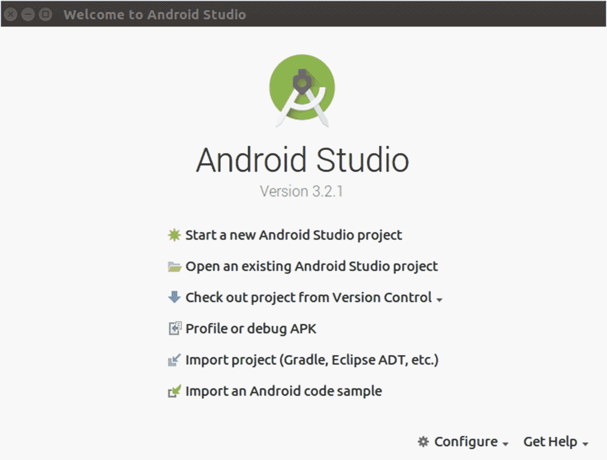
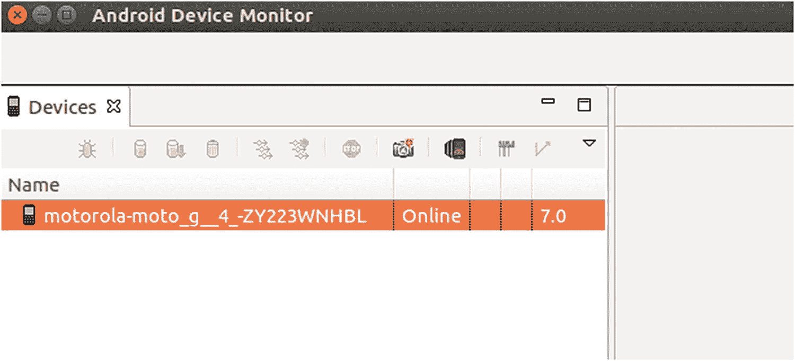
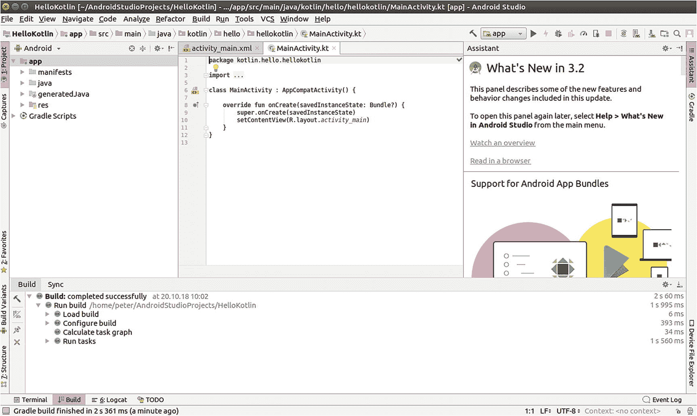
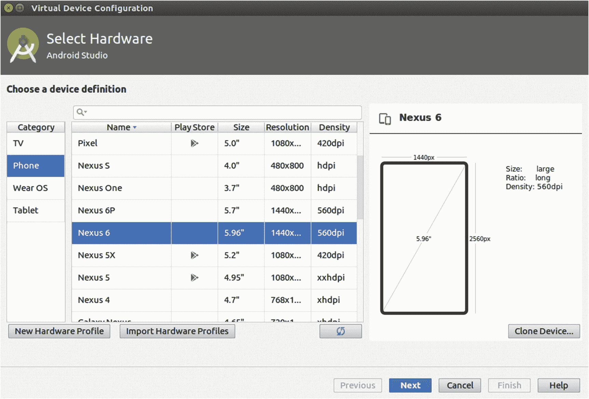
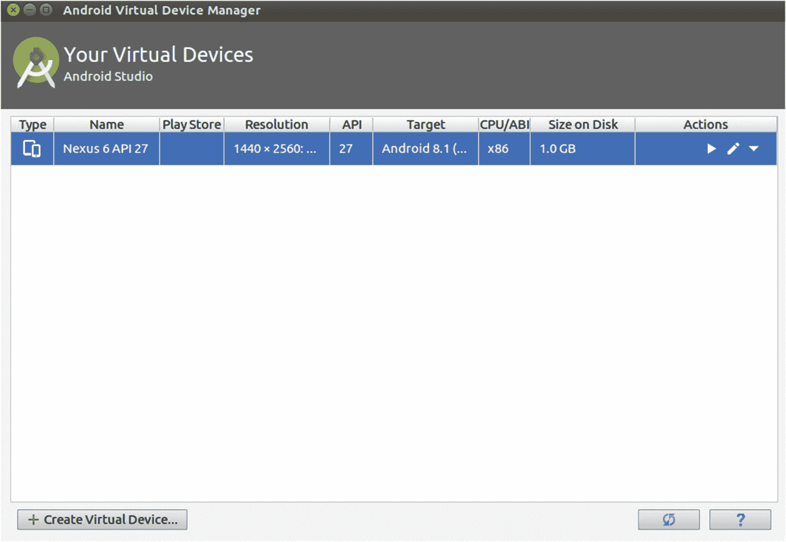
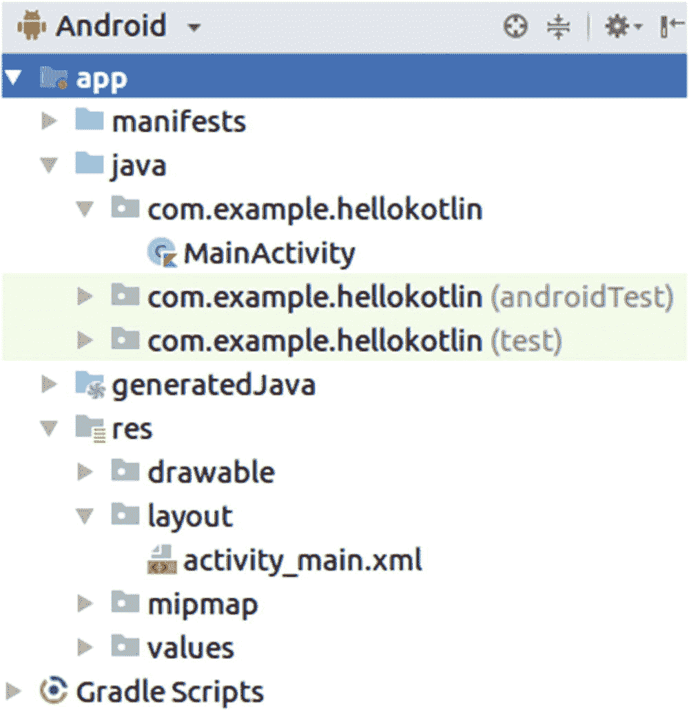
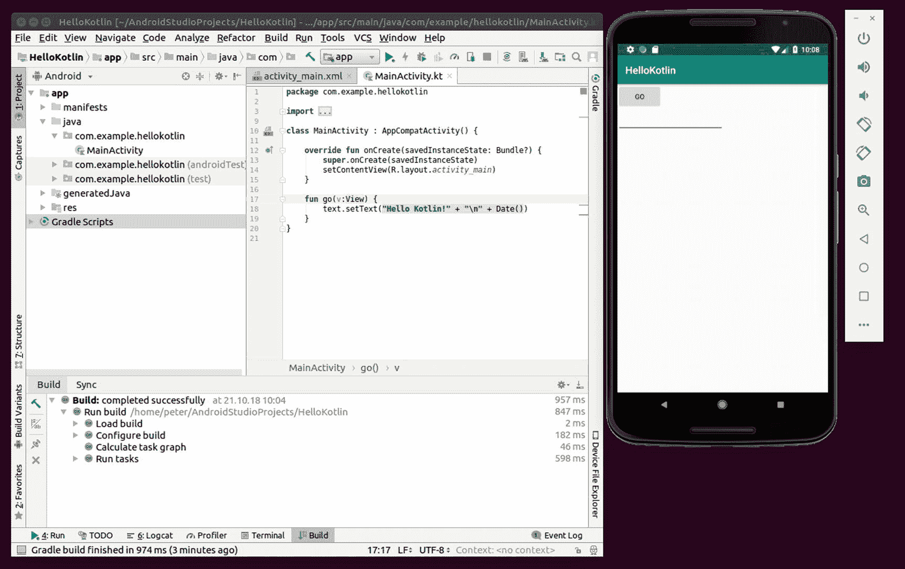
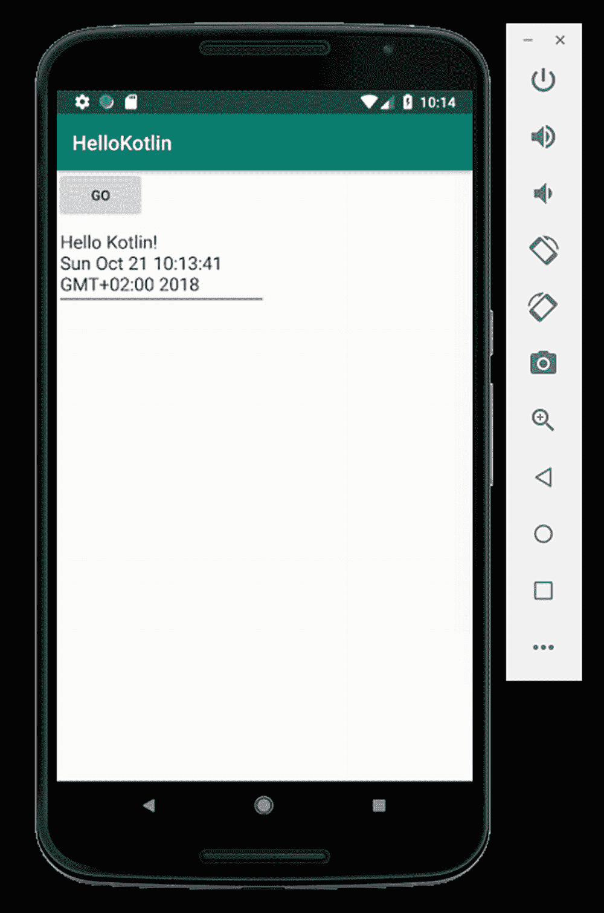

# 一、您的第一个 Kotlin 应用：Hello Kotlin

在本章中，我们将学习如何使用 Android Studio 集成开发环境(IDE)来编写和执行第一个简单的 Kotlin 程序。

## 设置 IDE: Android Studio

虽然计算机程序可以用简单的文本编辑器编写，然后通过在系统终端输入一些系统级命令来准备和执行，但使用 IDE 有助于将项目文件放在一起，还可以简化各种与开发相关的活动。

### 注意

计算机语言有两种风格:要么你有一些程序代码，当程序运行时由一些执行引擎解释，然后在 CPU 上执行，要么你有一种*编译*语言，用特殊的预备系统命令首先将程序代码翻译成*编译的*程序，可以直接由操作系统或一些特别定制的执行引擎执行。Kotlin 就是这样一种编译语言。如果您使用像 Android Studio 这样的 IDE，编译步骤通常会自动完成。

在本书中，我们使用 Android Studio 作为 IDE。它由 Google 公司开发，基于 IntelliJ IDEA 的社区版。您可以免费下载、安装和使用它。在撰写本文时，下载页面位于 [`https://developer.android.com/studio/`](https://developer.android.com/studio/) 。如果该链接不起作用，您可以通过在您最喜欢的搜索引擎中输入“android studio download”来轻松找到下载位置。要使用 Android Studio，您不必购买私人或商业项目的许可证。要在您的电脑上安装 Android Studio，请遵循以下步骤:

1.  下载适用于您的操作系统的安装程序。有针对 Linux 的安装程序(针对 Ubuntu 14.04 测试；更高版本应该也可以)、Windows(从版本 7 开始)、MacOS(从 MacOS X 10.10 开始)。

2.  启动安装程序。对于 Linux，解压缩安装程序 ZIP，然后导航到`bin`文件夹，并在终端中启动`studio.sh`。在 Windows 系统上，启动`.exe`文件。在 MacOS X 系统上，启动`.dmg`文件，然后将 Android Studio 拖放到`Applications`文件夹中。从那里再发射一次。

### 注意

要在 Ubuntu Linux 中打开终端，请按 Ctrl+Alt+T。在终端中，需要使用键盘输入命令。要更改目录，输入`cd /path/to/directory`。要启动一个`.sh`文件，输入`./name.sh`

安装的细节取决于您的操作系统细节，包括操作系统版本，以及您的 Android Studio 下载版本。你下载 Android Studio 的页面会给你更多的详细信息，甚至会提供安装过程的视频。

在任何情况下，Android Studio 的安装程序都会下载额外的组件。当您创建新项目时，这同样适用于项目向导，这取决于项目所需的功能以及已经安装的组件。因此，在开始你的第一个项目之前，你需要有一些耐心；后续的创业当然会更快。

继续安装，直到系统询问您是否要创建一个新项目。对于 Linux，这将看起来像图 1-1 ，对于其他操作系统，您将看到类似的东西。



图 1-1

项目创建向导

## 连接您的 Android 设备

首先，很重要的一点是，开发 Android 应用不一定需要手边有一个真正的硬件设备。在本章后面的“设置和使用模拟器”一节中，我们将讨论如何使用模拟器来模拟 Android 设备。然而，对于专业应用来说，手头至少有一个 Android 硬件设备是个好主意。

Android Studio 允许使用真实和模拟设备。很明显，只使用智能手机这样的真实设备可以给你的应用运行带来最大的保证。然而，它会告诉你只有你的智能手机可以操作你的应用；你不能确定其他设备会对此满意。你肯定不想买几十种不同的智能手机和其他 Android 设备。同样，尽管只在模拟设备上工作而不在真实设备上工作，也不能百分之百保证你的应用能在任何真实设备上工作。

因此，建议的开发技术是同时使用真实设备和模拟设备。你不必检查两个世界中的每一个发展步骤，但是一旦你到达一个里程碑，你应该做双重检查。当然，在你发布你的应用并提供给更广泛的受众之前，你应该在真实和模拟设备上测试它。

将 studio 连接到真实设备的过程可能会有所不同，但理想情况下，您只需将智能手机连接到 PC 或笔记本电脑的 USB 端口，并确保您的设备是可调试的设备。描述任何可能出现的问题的解决方案在这里没有太大的意义，因为你的操作系统或 Android Studio 的任何更新都可能很容易改变这种情况。因此，如果您有问题，请查阅 Android 和 Android Studio 官方文档，并使用您最喜欢的搜索引擎来查找相应的博客条目。连接硬件设备的过程基本如下:

1.  要使您的智能手机可调试，对于 Android 或更高版本，请打开设置对话框，转到关于手机，并在内部版本号上点击七次。对于之前的版本，您可能需要转到设置➤开发选项➤检查“USB 调试”

2.  通过 USB 电缆将智能手机连接到笔记本电脑或 PC。

要查看工作室是否实际连接到设备，请转到工具➤安卓➤安卓设备监视器。您应该会在设备监视器的设备部分看到您的设备，如图 1-2 所示。



图 1-2

硬件 Android 设备

## 开始你的第一个 Kotlin 应用

现在是时候在 Android Studio 中编写我们的第一个 Kotlin 应用了。在安装步骤中，系统会询问您是否要创建一个项目，或者在您第一次启动已安装的 Android Studio 实例后，或者在运行的 Android Studio 文件➤新➤新项目中，在菜单内进行如下操作:

1.  选择或单击开始新的 Android Studio 项目。

2.  在项目向导中，输入`HelloKotlin`作为应用名称。虽然不是绝对必要的，但是最好避免在名称中使用空格字符。

3.  对于公司域，输入`example.com`。除了不使用空格之外，您在这里输入什么由您自己决定。然而，输入你或你的公司拥有的真实域名是一个好习惯。对于你知道你永远不会发表的项目，选择你喜欢的。

4.  Android Studio 建议的项目位置足够体面，但如果你喜欢，你可以选择不同的位置。

5.  确保选择了“包括 Kotlin 支持”。

6.  选择手机和平板电脑作为外形规格。

7.  选择 API 19 作为最低软件开发工具包(SDK)。

8.  选择空活动。使用建议的 MainActivity 作为活动名称。确保选择了 Generate Layout File，并接受建议的 activity_main 作为布局名称。确保也选择了向后兼容性。

第一次创建项目时，Android Studio 会自动下载并安装它需要的任何附加组件，然后它还会执行初始构建。这将需要几分钟的时间，所以请耐心等待。

此时，如果一切正常，Android Studio 主窗口将会出现，如图 1-3 所示。



图 1-3

Android Studio 主窗口

## 设置和使用模拟器

现在是安装设备模拟器的时候了。模拟器非常方便，因为它们允许开发 Android 应用，而无需连接真实的设备。模拟器在电脑屏幕上模拟 Android 设备。要安装一个可用的，去工具➤ AVD 管理器。出现的屏幕显示标题您的虚拟设备。单击创建虚拟设备。以下屏幕显示设备列表，如图 1-4 所示。



图 1-4

仿真设备

在“类别”下，确保选择“电话”。在中间窗格中，选择 Nexus 6 条目。单击下一步。在下一个屏幕上，单击 Oreo，API 27 的下载链接。浏览随后出现的子向导。这里下载了一个系统映像；这有点像模拟器设备的操作系统。回到系统图像屏幕，Oreo，API 27 项目现在被选中，可以单击 Next。单击下一步，然后在下一个屏幕上单击完成。

您的虚拟设备屏幕现在显示一个条目，如图 1-5 所示。你现在可以关闭窗口了。



图 1-5

带有条目的仿真设备

## 继续使用 HelloKotlin 应用

回到 Android Studio 主窗口，在应用的左侧，通过点击名称旁边的小三角形，您可以导航到以下文件(参见图 1-6 ):



图 1-6

HelloKotlin 应用

```kt
app →  java →
    com.example.hellokotlin → MainActivity
app →  res →
    layout →  activity_main.xml

```

双击任何文件都会将它们显示在窗口中央窗格的编辑器中。两个文件`MainActivity`和`activity_main.xml`是我们第一个简单的 Kotlin 应用需要调整的中心文件。文件`activity_main.xml`定义了智能手机屏幕的布局。我们将修改它来显示一个按钮和一个文本区域。为此，打开文件，通过选择窗格底部的 text 选项卡切换到编辑器的文本视图，然后编写以下内容作为其内容:

```kt
<?xml version="1.0" encoding="utf-8"?>
<android.support.constraint.ConstraintLayout
        xmlns:android=
          "http://schemas.android.com/apk/res/android"
        xmlns:tools=
          "http://schemas.android.com/tools"
        xmlns:app=
          "http://schemas.android.com/apk/res-auto"
        android:layout_width="match_parent"
        android:layout_height="match_parent"
        tools:context=".MainActivity">

    <LinearLayout
        android:layout_width="match_parent"
        android:layout_height="match_parent"
        android:orientation="vertical"
        app:layout_constraintBottom_toBottomOf="parent"
        app:layout_constraintLeft_toLeftOf="parent"
        app:layout_constraintRight_toRightOf="parent"
        app:layout_constraintTop_toTopOf="parent">
      <Button android:layout_width="wrap_content"
                android:layout_height="wrap_content"
                android:text="Go"
                android:onClick="go"/>
      <EditText
                android:id="@+id/text"
                android:layout_width="wrap_content"
                android:layout_height="wrap_content"
                android:inputType="textMultiLine"
                android:ems="10"
                tools:layout_editor_absoluteY="286dp"
                tools:layout_editor_absoluteX="84dp"/>
    </LinearLayout>
</android.support.constraint.ConstraintLayout>

```

图形设计到此为止。程序进入`MainActivity.kt`文件。双击名称，在编辑器中打开它。

作为其内容，请编写以下内容:

```kt
package kotlin.hello.hellokotlin

import android.support.v7.app.AppCompatActivity
import android.os.Bundle
import android.view.View
import kotlinx.android.synthetic.main.activity_main.*
import java.util.*

class MainActivity : AppCompatActivity() {

  override fun onCreate(savedInstanceState: Bundle?) {
      super.onCreate(savedInstanceState)
      setContentView(R.layout.activity_main)
  }

  fun go(v:View) {
      text.setText("Hello Kotlin!" + "\n" + Date())
  }
}

```

单击窗口顶部任务按钮栏中的绿色三角形启动应用。从可用虚拟设备列表中，选择 Nexus 6 API 27，然后单击确定。第一次你可能会被问及是否要安装一个名为 *Instant Run* 的功能。如果是，请单击安装并继续。

现在模拟器窗口出现。如图 1-7 所示，应用被构建，发送到仿真器，并在那里启动。



图 1-7

HelloKotlin 应用已启动

单击 Go，仿真设备屏幕会更新，显示文本“Hello Kotlin！”以及当前日期，如图 1-8 所示。



图 1-8

设备上的 HelloKotlin 应用

恭喜你！您刚刚编写、编译并运行了您的第一个 Kotlin 应用！

## 使用命令行

虽然您可以继续使用 Android Studio 来处理任何深度的项目，但也可以在终端中使用命令行来构建和运行应用。如果你想继续使用 Android Studio，你可以安全地跳过这一部分。对于所有其他人，我想描述如何使用终端来构建应用，更准确地说是我们在上一节中创建的 HelloKotlin 应用。

### 注意

使用命令行很有帮助，例如，在没有桌面环境的情况下，比如在服务器上。你也可以在开发人员提供代码的自动化构建环境中使用它，但是要在 Android 设备上执行的程序是自动生成的。

有趣的是，Android Studio 帮助我们摆脱了自我。对于您在 Android Studio 中成功构建的任何项目，包含项目文件的文件夹也将包含专门定制的构建脚本，您可以使用这些脚本来构建应用，而无需使用 Android Studio。

首先我们需要打开一个终端:在 Ubuntu Linux 中，按 Ctrl+Alt+T。在 Windows 中，你可以通过在系统菜单中搜索 CMD 来找到一个终端。对于 Apple Mac OS，在 Spotlight 中搜索终端后可以打开终端。接下来，我们需要知道项目文件在文件系统中的位置。如果您接受了 Android Studio 在创建项目时给出的建议，路径如下:

```kt
/home/[USER]/AndroidStudioProjects/HelloKotlin
    for Linux
/Users/[USER]/AndroidStudioProjects/HelloKotlin
    for Mac OS X
C:\Users\[USER]\AndroidStudioProjects\HelloKotlin
    for Windows

```

其中`[USER]`是您的登录用户名。如果您使用了自定义项目位置，则必须使用该位置。

流畅地使用终端是一门艺术，我们在这里不赘述。但是，以下命令将为您提供一个起点。在终端中，我们切换到项目文件夹，如下所示:

```kt
cd [PATH]        #for Linux and Mac OS X and Windows

```

其中`[PATH]`是我们刚刚确定的项目文件夹。在这里，我们可以通过输入

```kt
./gradlew app:build      #for Linux and Mac OS X
gradlew   app:build      #for Windows

```

### 注意

`gradlew`命令属于 Gradle 构建系统。Gradle 在 Android Studio 中被用来构建可执行的应用。

最终的应用作为一个带有`.apk`后缀的 APK 文件将出现在`app/build/outputs/apk/debug/`中。APK 来自安卓包；这种文件是 Android 在设备上安装应用所需的所有文件的压缩集合。`gradlew`包装器脚本实际上允许更多的选项来构建和调查项目。输入`-help`或`tasks`作为参数，将它们全部列出。

```kt
./gradlew –help    #for Linux and Mac OS X
./gradlew tasks    #for Linux and Mac OS X
gradlew –help      #for Windows
gradlew tasks      #for Windows

```

为了让`tasks`命令具体显示应用的任务，你必须在前面加上`app:`，这是我们之前看到的`build`任务。

### 注意

描述如何处理这样一个由构建产生的 APK 文件的工作留给了 Android 书籍。作为开始的提示，学习如何使用 SDK 中提供的工具，尤其是`adb`平台工具。