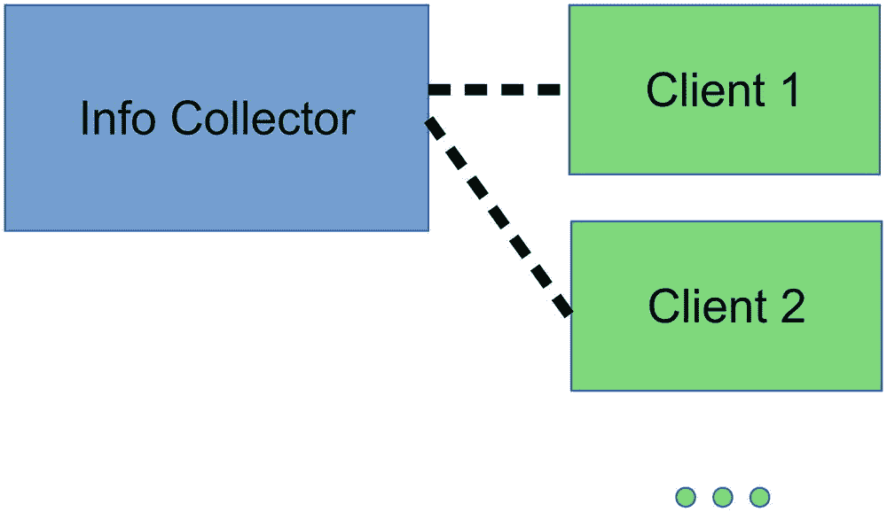

# 2.类和对象:面向对象的哲学

在本书的开始，我们说计算机程序是关于处理一些输入并从中产生一些输出，也可能改变一些数据保存实例如文件或数据库的状态。虽然这肯定是真的，但这并没有说明全部情况。在现实世界的场景中，计算机程序表现出另一个特点:它们应该有一些实际用途，因此，模拟现实世界的事件和事物。

比方说，你写了一个简单的程序来登记纸质发票并计算每天的金额。输入很清楚:它是电子形式的纸质发票。输出是每天的总数，同时数据库保存所有注册发票的记录。建模方面告诉我们，我们处理以下对象:电子形式的发票、用于保存记录的数据库，以及一些用于访问数据库和执行求和操作的计算引擎。为了实用，这些物体需要具有以下特征。首先，根据它们的性质，它们可能有一个*状态*。例如，对于发票对象，我们有卖方名称、买方名称、日期、货物名称，当然还有金额。这种状态元素通常被称为*属性*。数据库显然将数据库内容作为其状态。相比之下，计算引擎不需要自己的状态，它使用其他对象的状态来完成工作。对象的第二个特性是你可以对它们执行的操作，通常被称为*方法*。例如，invoice 对象可能有设置和告诉我们其状态的方法，database 对象需要从其存储中保存和检索数据的方法，计算引擎显然必须能够执行每天的求和计算。

在我们加深对那种真实世界到计算机世界映射方法的理解之前，让我们先总结一下到目前为止我们所看到的。

*   *对象:*我们使用对象来标识真实世界中我们想要在计算机程序中建模的事物。

*   *状态:*对象通常有一个状态，它描述了每个对象必须能够处理它应该执行的任务的特征。

*   *属性:*对象的状态由一组属性组成。因此，属性是状态的元素。

*   *方法:*方法是访问对象的一种方式。这描述了一个对象需要展示的功能方面，以处理它应该执行的任务，可能包括改变和查询它的状态。

### 注意

根据所使用的术语，方法有时也被称为*操作*或*函数*，属性有时被称为*属性*。虽然我们继续使用*属性*，但是我们将切换到使用*函数*作为方法，因为 Kotlin 文档使用了术语*函数*并且我们希望让事情变得简单，包括 Kotlin 文档中的参考研究。

要理解的一个重要概念是，发票不是物体，人也不是，三角形也不是。这怎么可能呢？我们刚刚谈到发票是对象，为什么人和三角形不是对象？这种矛盾来自于某种语言上的含混。你知道我们在谈论发票，但不是发票吗？这两者之间有一个主要的区别:发票，或者更准确地说是一个特定的发票，是一个对象，但发票是一个分类或类。所有可能的发票共享 Invoice 类中的成员资格，所有具体的人共享 Person 类中的成员资格，就像所有可能的三角形都属于三角形类一样。这是否显得理论化甚至吹毛求疵？也许吧，但是它有重要的实际意义，我们真的需要理解阶级的概念。假设在某一天有一千张发票到达。在一些计算机程序中，我们真的想写这样的东西吗:

```java
object1 = Invoice(Buyer=Smith,Date=20180923,Good=Peas,Cost=$23.99), object2 = Invoice(...), ..., object1000 = Invoice(...)

```

这是没有意义的，因为我们不想每天都编写一个庞大的新计算机程序。相反，有意义的是拥有一个描述所有可能发票的 Invoice 类。从这个类，我们必须能够创建一些发票样式输入的具体发票。在伪代码中:

```java
data = [Some incoming invoice data]

```

这提供了特定纸质发票的接收发票数据。确保数据可以用 Invoice 类的抽象特征来表示，这样它就有了买家、日期、商品或服务等等。这就相当于说 Invoice 是所有可能输入数据的有效分类。

```java
object = concrete object using that data

```

给定分类和数据，您可以构建一个具体的发票对象。从 invoice 类构建具体 Invoice 对象的另一种说法是从该类构建一个对象或创建一个 Invoice 实例。我们将在本书的其余部分使用实例和构造函数的概念。

我们这一章的主题，面向对象，正是关于类、实例化和对象的。一些细节仍未提及，但让我们先总结一下我们刚刚学到的内容，然后继续我们的定义列表:

*   *类:*一个类表征了某种类型的所有可能对象。因此，它是一个抽象，任何以类为特征的对象都属于那个特定的类。

*   *实例:*一个类的实例恰好代表一个属于该类的对象。从类和具体数据创建对象的过程称为实例化。

*   *构造:*从类创建实例的过程也叫构造。

有了这些面向对象的概念，我们现在可以开始看 Kotlin 如何处理对象、类和实例化。在接下来的章节中，我们还将讨论一些我们还没有介绍的面向对象的方面。在这里，我们可以用理论的方式来做，但是用 Kotlin 语言来描述会更容易掌握。

## 科特林和面向对象编程

在这一节中，我们将讨论 Kotlin 中类和对象的主要特征。有些方面在后面的章节中会有更详细的介绍，但是这里我们想给你一些 Kotlin 编程需要的基础知识。

### 类别声明

### 注意

这里的术语*声明*用于描述一个类的结构和组成部分。

在 Kotlin 中，要声明一个类，你基本上要写

```java
class ClassName(Parameter-Declaration1, Parameter-Declaration2, ...) {
        [Class-Body]
    }

```

让我们检查一下它的各个部分:

*   这是类的名称。它不能包含空格，按照惯例，在 Kotlin 中应该使用 CamelCase 符号；也就是说，以一个大写字母开始，而不是在单词之间使用空格，将第二个单词的第一个字母大写，如`EmployeeRecord`。

*   `Parameter-Declaration:` These declare a primary constructor and describe data that are needed to instantiate classes. We talk more about parameters and parameter types later, but for now we mention that such parameter declarations basically come in three varieties:
    *   `Variable-Name:Variable-Type`:一个例子就是`userName: String`。使用它来传递可用于实例化类的参数。这发生在一个叫做`init{}`块的特殊结构中。我们稍后将讨论初始化。

    *   `val Variable-Name:Variable-Type`(例如`val userName: String`):使用它从`init{}`块内部传递一个可用的参数，同时定义一个不可改变的属性。因此，该参数用于直接设置对象状态的一部分。

    *   `var Variable-Name:Variable-Type`(例如`var userName: String`):使用它从`init()`函数内部传递一个可用的参数，同时定义一个可变的属性来设置对象状态的一部分。

    对于名称，使用 CamelCase 符号，这次以小写字母开始，如 nameOfBuyer。变量类型有很多可能性。例如，您可以使用`Int`表示一个整数，这样声明看起来就像`val a:Int`。在第 3 章[中，我们会更多地讨论类型。](03.html)

*   `[Class-Body]`:这是任意数量的函数和附加属性的占位符，也是实例化一个类时使用的`init { ... }`块。此外，你还可以有*二级构造函数*和*伴随对象*，我们后面会描述，还有内部类。

### 练习 1

下列哪一项似乎是有效的类声明？

```java
1\.    class Triangle(color:Int) (
         val coordinates:Array<Pair<Double,Double>>
             = arrayOf()
     )

2\.    class Triangle(color:Int) {
         val coordinates:Array<Pair<Double,Double>>
             = arrayOf()
     }

3\.    class simple_rectangle() {
         val coordinates:Array<Pair<Double,Double>>
             = arrayOf()
     }

4\.    class Colored Rectangle(color:Int) {
         val coordinates:Array<Pair<Double,Double>>
             = arrayOf()
     }

```

### 财产申报

我们将在第 [3](03.html) 章中讨论属性的详细特征。在这里，我对简单的属性声明做了一个简单的总结:它们基本上看起来像

```java
val Variable-Name:Variable-Type = value

```

对于不可变属性，以及

```java
var Variable-Name:Variable-Type = value

```

对于可变属性。然而，如果变量值在一个`init { }`块中被设置，就不需要`= value`。

```java
class ClassName(Parameter-Declaration1,
        Parameter-Declaration2, ...) {
    ...
    val propertyName:PropertyType = [init-value]
    var propertyName:PropertyType = [init-value]
    ...
}

```

关于可变性，有一个词是合适的:不可变意味着`val`变量在某个地方获得它的值，并且之后不能被改变，而可变意味着`var`变量可以在任何地方自由改变。不可变变量在程序稳定性方面有一些优势，所以根据经验，你应该总是选择不可变变量而不是可变变量。

### 练习 2

以下哪一个是有效的类？

```java
1\.    class Invoice() {
         variable total:Double = 0.0
     }

2\.    class Invoice() {
         property total:Double = 0.0
     }

3\.    class Invoice() {
         Double total =
         0.0
     }

4\.    class Invoice() {
         var total:Double = 0.0
     }

5\.    class Invoice() {
         total:Double = 0.0
     }

```

### 练习 3

下面的类有什么问题(不是技术上的，而是从功能的角度)？

```java
class Invoice() {
    val total:Double = 0.0
}

```

怎么修？

### 类初始化

类体内的`init { }`块可能包含当类被实例化时被处理的语句。顾名思义，它应该在*实际使用之前用来初始化*实例。这包括准备实例的状态，以便正确设置它来完成工作。事实上，一个类中可以有几个`init{ }`块。在这种情况下,`init{ }`块按照它们在类中出现的顺序被处理。然而，这样的`init{ }`块是可选的，所以在简单的情况下，不提供这样的块是完全可以接受的。

```java
class ClassName(Parameter-Declaration1,
        Parameter-Declaration2, ...) {
    ...
    init {
        // initialization actions...
    }
}

```

### 注意

A //开始一个所谓的*行尾注释**；Kotlin 语言会忽略从该行开始直到当前行结束的任何内容。您可以将它用于注释和文档。*

如果您在一个`init { }`块中设置属性，就不再需要在属性声明中写`= [value]`。

```java
class ClassName(Parameter-Declaration1,
        Parameter-Declaration2, ...) {
    val someProperty:PropertyType
    ...
    init {
        someProperty = [some value]
        // more initialization actions...
    }
}

```

如果您在属性声明中指定了一个属性值，然后在`init { }`中更改了属性值，那么在`init{ }`开始之前，属性声明中的值将被用来初始化属性。稍后，在`init { }`中，属性的值会被合适的语句改变:

```java
class ClassName {
        var someProperty:PropertyType = [init-value]
        ...
        init {
            ...
            someProperty = [some new value]
            ...
        }
}

```

### 练习

下面这个类有什么问题？

```java
class Color(val red:Int,
            val green:Int,
            val blue:Int)
{
    init {
        red = 0
        green = 0
        blue = 0
    }
}

```

### 练习 5

下面这个类有什么问题？

```java
class Color() {
    var red:Int
    var green:Int
    var blue:Int
    init {
      red = 0
      green = 0
    }
}

```

### 科特林的发票

这是足够的理论；让我们来解决我们已经讨论过的发票类。为了简单起见，我们的发票将具有以下属性:买方的名和姓、日期、单个产品的名称和数量，以及每件产品的价格。我知道在现实生活中我们需要更多的属性，但是这个子集在这里已经足够了，因为它描述了足够多的情况，并且你可以很容易地扩展它。实际的`Invoice`类的初稿是这样的:

```java
class Invoice(val buyerFirstName:String,
      val buyerLastName:String,
      val date:String,
      val goodName:String,
      val amount:Int,
      val pricePerItem:Double) {
}

```

我们将在本章后面讨论数据类型，但是现在我们需要知道`String`是任意字符串，`Int`是整数，`Double`是浮点数。您可以看到，对于传递给类的所有参数，我都使用了`val ...`形式，因此在实例化之后，所有这些参数都将作为不可变(不可更改)的属性可用。这在这里很有意义，因为这些参数正是描述一个发票实例的特征或*状态*所需要的。

### 注意

在 Kotlin 中，允许完全省略空块。因此，您可以从`Invoice`类声明中移除`{ }`。尽管如此，我们把它留在这里，因为我们很快就会给身体添加元素。

### 更多发票属性

类体仍然是空的，但是我们可以很容易地想到我们可能想要添加的属性。例如，手头有买家的全名和所有商品的总价可能会很有趣。我们可以添加相应的属性:

```java
class Invoice(val buyerFirstName:String,
      val buyerLastName:String,
      val date:String,
      val goodName:String,
      val amount:Int,
      val pricePerItem:Double)
{
    val buyerFullName:String
    val totalPrice:Double
}

```

我们忘记通过`= something`添加值来初始化属性了吗？嗯，是也不是。这样写实际上是被禁止的，但是因为我们很快就会初始化那些在`init{ }`块中的属性，所以不初始化这些属性是允许的。

### 发票初始化

说到做到，我们添加一个相应的`init{ }`块:

```java
class Invoice(val buyerFirstName:String,
      val buyerLastName:String,
      val date:String,
      val goodName:String,
      val amount:Int,
      val pricePerItem:Double)
{
     val buyerFullName:String
     val totalPrice:Double
     init {
         buyerFullName = buyerFirstName + " " +
             buyerLastName
         totalPrice = amount * pricePerItem
     }
}

```

顺便说一下，有一种更短的方法来编写这样的单行属性初始化器:

```java
...
val buyerFullName:String = buyerFirstName + " " + buyerLastName
val totalPrice:Double = amount * pricePerItem
...

```

这使得`init{ }`块变得不必要。然而，使用一个`init{ }`块并没有什么功能上的区别，后者允许进行不适合一条语句的更复杂的计算。

### 练习 6

编写没有`init{ }`块的`Invoice`类，保留其全部功能。

### Kotlin 中的实例化

现在类声明已经准备好了，要从它实例化一个`Invoice`对象，你要做的就是这样写:

```java
val firstInvoice = Invoice("Richard", "Smith", "2018-10-23", "Peas", 5, 2.99)

```

如果你不知道如何把所有这些放进一个程序中，在 Kotlin 中，把所有东西都写在一个文件中是完全可以接受的，这个文件的内容是:

```java
class Invoice(val buyerFirstName:String,
      val buyerLastName:String,
      val date:String,
      val goodName:String,
      val amount:Int,
      val pricePerItem:Double)
{
    val buyerFullName:String
    val totalPrice:Double
    init {
        buyerFullName = buyerFirstName + " " +
            buyerLastName
        totalPrice = amount * pricePerItem
    }
}

fun main(args:Array<String>) {
    val firstInvoice = Invoice("Richard", "Smith",
      "2018-10-23", "Peas", 5, 2.99)
    // do something with it...
}

```

`main()`函数是 Kotlin 应用的入口点。不幸的是，这对 Android 来说并不适用，因为 Android 对如何启动应用有着不同的想法。请耐心等待，因为我们很快就会回来。

### 注意

话虽如此，请不要写包含大量不同类或长函数的文件。我们将在本章后面的“结构化和包”一节中讨论程序结构。现在，只要记住拥有短的可识别的代码片段对编写好的软件有很大的帮助！

### 向发票添加功能

我们的`Invoice`类还没有显式函数。我故意说显式，因为凭借构造函数属性和我们在类体中添加的属性，Kotlin 以`objectName.propertyName`的形式为我们提供了隐式访问函数。例如，我们可以在任何函数中添加:

```java
...
val firstInvoice = Invoice("Richard", "Smith",
    "2018-10-23", "Peas", 5, 2.99)
val fullName = firstInvoice.buyerFullName

```

其中`firstInvoice.buyerFullName`从对象中读取购买者的全名。在不同的情况下，我们也可以使用访问器来编写属性，如

```java
...
val firstInvoice = Invoice("Richard", "Smith",
    "2018-10-23", "Peas", 5, 2.99)
firstInvoice.buyerLastName = "Doubtfire"

```

你明白为什么我们不能在这里做吗？记住，我们将`buyer- LastName`声明为不可变的`val`，所以它不能被改变。如果我们用`var`代替`val`，变量变得可变，设置变成了允许的操作。

作为一个显式函数的例子，我们可以创建一个方法让对象告诉它的状态。让我们称这个函数为`getState()`。一种实现是:

```java
class Invoice( [constructor parameters] ) {
    val buyerFullName:String
    val totalPrice:Double
    init { [initializer code] }

    fun getState(): String {
        return "First name: ${firstName}\n" +
                "Last name: ${lastName}\n" +
                "Full name: ${buyerFullName}\n" +
                "Date: ${date}\n" +
                "Good: ${goodName}\n" +
                "Amount: ${amount}\n" +
                "Price per item: ${pricePerItem}\n" +
                "Total price: ${totalPrice}"
    }
}

```

其中`fun getState(): String`中的`:String`表示函数返回一个字符串，`return ...`实际执行返回动作。字符串中的`${some- Name}`被替换为`someName`的值，而`\n`代表换行符。

### 注意

开发人员经常使用术语*实现*来描述从一个想法到执行这个想法的代码的转换。

要从类外部调用函数，只需使用对象名和函数名，并编写

```java
objectName.functionName(parameter1, parameter2, ...)

```

因为我们没有关于`getState()`的任何参数，这将是:

```java
...
val firstInvoice = Invoice("Richard", "Smith",
    "2018-10-23", "Peas", 5, 2.99)
val state:String = firstInvoice.getState()

```

然而，如果我们发现自己在类中，比如在一个`init{ }`块中或者在类的任何其他函数中，调用一个函数只需使用它的名字，如

```java
...
// we are inside the Invoice class
val state:String = getState()

```

函数将在本章后面详细描述。现在，我只想提一下函数可能有一个参数列表。例如，`Invoice`类使用税率作为参数计算税款的方法如下:

```java
fun tax(taxRate:Double):Double {
    return taxRate * amount * pricePerItem
}

```

参数列表后的`:Double`声明该方法返回一个浮点数，而`return`语句实际上是这样做的。对于包含多个元素的参数列表，请使用逗号(，)作为分隔符。如果你还没有意识到，星号(*)是用来描述乘法运算的。

要调用税收方法，您需要编写

```java
...
val firstInvoice = Invoice("Richard", "Smith", "2018-10-23", "Peas", 5, 2.99)
val tax:Double = firstInvoice.tax(0.11)

```

### 练习 7

添加一个方法`goodInfo()`，返回类似“5 块苹果”的内容提示:使用`amount.toString()`将金额转换为字符串。

### 完整的发票分类

到目前为止，我们已经讨论过的包含所有属性和方法的`Invoice`类，以及调用它的一些代码，如下所示:

```java
class Invoice(val buyerFirstName:String,
      val buyerLastName:String,
      val date:String,
      val goodName:String,
      val amount:Int,
      val pricePerItem:Double)
{
    val buyerFullName:String
    val totalPrice:Double

    init {
        buyerFullName = buyerFirstName + " " +
            buyerLastName
        totalPrice = amount * pricePerItem
    }

    fun getState():String {
        return "First name: ${buyerFirstName}\n" +
                "Last name: ${buyerLastName}\n" +
                "Full name: ${buyerFullName}\n" +
                "Date: ${date}\n" +
                "Good: ${goodName}\n" +
                "Amount: ${amount}\n" +
                "Price per item: ${pricePerItem}\n" +
                "Total price: ${totalPrice}"
    }

    fun tax(taxRate:Double):Double {
        return taxRate * amount * pricePerItem
    }
}

fun main(args:Array<String>) {
    val firstInvoice = Invoice("Richard", "Smith", "2018-10-23", "Peas", 5, 2.99)
    val state:String = firstInvoice.getState()
    val tax:Double = firstInvoice.tax(0.11)
    // do more things with it...
}

```

这适用于您为桌面或服务器应用构建的应用风格的调用。它不能在 Android 上运行，因为启动应用和与硬件通信的程序与这样一个简单的`main()`方法相比有很大的不同。因此，回到主题，在本章的剩余部分，我们将开发一个更加 Android 风格的应用。

## 一个简单的数字猜谜游戏

在 Android 中，应用围绕着*活动、*活动，从用户工作流程的角度来看，这些活动是对应于特定职责的可识别代码片段。这些职责中的每一项都可以由位于屏幕布局中的图形对象构建的不同屏幕来处理。一个应用可以有一个或多个由不同的类表示的活动，以及资源和配置文件。正如我们在第一章[中已经看到的，Android Studio 帮助准备和裁剪所有必要的文件。](01.html)

在本章的剩余部分以及接下来的大部分章节中，我们将学习一个简单的游戏，叫做数字猜谜游戏。虽然理解起来非常简单，但它足够复杂，足以显示基本的 Kotlin 语言结构，并允许进行扩展，以帮助说明本书过程中介绍的大多数语言功能。因此，我们既没有从最优雅的解决方案开始，也没有从一开始就展示最高性能的代码。我们的目标是从一个可用的应用开始，逐步引入新功能，这样我们就可以提高我们的 Kotlin 语言能力。

游戏描述如下:开始时，用户会看到一些信息文本和一个开始按钮。一旦启动，应用会在内部选择一个 1 到 7 之间的随机数。用户被要求猜测该数字，并且在每次猜测之后，用户被告知该猜测是匹配、太高还是太低。一旦随机数被选中，游戏就结束了，用户可以开始新的游戏。

要开始应用开发，请打开 Android Studio。如果你的上一个项目是第 [1](01.html) 章中的 HelloKotlin 应用，来自该应用的文件就会出现。要开始一个新项目，从菜单中选择文件➤新➤新项目。输入`NumberGuess`作为应用名称，输入`book.kotlinforandroid`作为公司域名。接受建议的项目位置或选择您自己的位置。确保选择了“包括 Kotlin 支持”。单击下一步。选择手机和平板电脑作为外形规格，API 19 作为最低软件开发套件(SDK)版本。再次单击下一步。选择空活动，然后单击下一步。接受建议的活动名称 MainActivity 和布局名称 activity_main。确保“生成布局文件”和“向后兼容”都已选中。单击完成。

Android Studio 现在将为游戏应用生成所有构建文件和基本模板文件。在`res`文件夹中，你会找到几个资源文件，包括用于用户界面的图像和文本。我们现在不需要图像，但是我们定义了两个文本元素，用于布局文件和编码。双击文件`res/values/strings.xml`将其打开。让文件读作:

```java
<resources xmlns:tools="http://schemas.android.com/tools"
      tools:ignore="ExtraTranslation">
  <string name="app_name">
      NumberGuess</string>
  <string name="title.numberguess">
      NumberGuess</string>
  <string name="btn.start">
      Start</string>
  <string name="label.guess">
      Guess a number:</string>
  <string name="btn.do.guess">
      Do guess!</string>
  <string name="edit.number">
      Number</string>
  <string name="status.start.info">
      Press START to start a game</string>
  <string name="label.log">
      Log:</string>
  <string name="guess.hint">
      Guess a number between %1$d and %2$d</string>
  <string name="status.too.low">
      Sorry, too low.</string>
  <string name="status.too.high">
      Sorry, too high.</string>
  <string name="status.hit">
      You got it after %1$d tries!
      Press START for a new game.</string>
</resources>

```

布局文件位于`res/layout/activity_main.xml`中。打开该文件，通过单击中间窗格底部的文本选项卡切换到文本视图，然后根据其内容编写以下内容:

```java
<?xml version="1.0" encoding="utf-8"?>
<LinearLayout
      xmlns:android=
        "http://schemas.android.com/apk/res/android"
      xmlns:tools=
        "http://schemas.android.com/tools"
      xmlns:app=
        "http://schemas.android.com/apk/res-auto"
      android:orientation="vertical"
      android:layout_width="match_parent"
      android:layout_height="match_parent"
      android:padding="30dp"
      tools:context=
        "kotlinforandroid.book.numberguess.MainActivity">

  <TextView
          android:layout_width="wrap_content"
          android:layout_height="wrap_content"
          android:text="@string/title.numberguess"
          android:textSize="30sp" />

  <Button

          android:id="@+id/startBtn"
          android:onClick="start"
          android:layout_width="match_parent"
          android:layout_height="wrap_content"
          android:text="@string/btn.start"/>

  <Space android:layout_width="match_parent"
      android:layout_height="5dp"/>

  <LinearLayout
          android:orientation="horizontal"
          android:layout_width="wrap_content"
          android:layout_height="wrap_content">
      <TextView android:text="@string/label.guess"
              android:layout_width="wrap_content"
                android:layout_height="wrap_content"/>
      <EditText
              android:id="@+id/num"
              android:hint="@string/edit.number"
              android:layout_width="80sp"
              android:layout_height="wrap_content"
              android:inputType="number"
              tools:ignore="Autofill"/>
      <Button
              android:id="@+id/doGuess"
              android:onClick="guess"
              android:text="@string/btn.do.guess"
              android:layout_width="wrap_content"
              android:layout_height="wrap_content"/>
  </LinearLayout>

  <Space android:layout_width="match_parent"
      android:layout_height="5dp"/>

  <TextView
          android:id="@+id/status"
          android:text="@string/status.start.info"
          android:textColor="#FF000000" android:textSize="20sp"
          android:layout_width="wrap_content"
          android:layout_height="wrap_content"/>

  <Space android:layout_width="match_parent"
      android:layout_height="5dp"/>

  <TextView android:text="@string/label.log"
            android:textStyle="bold"
            android:layout_width="wrap_content"
            android:layout_height="wrap_content"/>
  <kotlinforandroid.book.numberguess.Console
          android:id="@+id/console"
          android:layout_height="100sp"
          android:layout_width="match_parent" />

</LinearLayout>

```

您将得到一个错误，因为该文件引用了尚不存在的类`kotlinforandroid.book.numberguess.Console`。暂时忽略这个；我们将很快解决这个问题。该布局文件的所有其他元素在 Android 开发人员文档或相应的 Android 书籍中有详细描述。不过，这里有一些提示似乎是合适的。

*   如果没有切换到该文件的编辑器视图中的 Text 选项卡，则会显示 Design 视图类型。后者允许以图形方式排列用户界面元素。在本书中，我们不会使用图形设计编辑器，但是您也可以尝试一下。只是期望得到的 XML 会有一些小的不同。

*   我不使用花哨的布局容器；相反，我更喜欢在查看 XML 代码时易于编写和理解的代码。您不必为您的项目做同样的事情，事实上，根据具体情况，一些其他的解决方案可能会更好，所以您可以自由地尝试其他的布局方法。

*   在 XML 代码中的任何地方看到`@string/...`，它指的是来自`strings.xml`文件的一个条目。

*   `kotlinforandroid.book.numberguess.Console`元素指的是自定义视图。您在教程中不会经常看到这种情况，但是自定义视图允许更简洁的编码和改进的可重用性，这意味着您可以在其他项目中轻松使用它们。`Console`指的是我们即将编写的自定义类。

Kotlin 代码进入文件`java/kotlinforandroid/book/numberguess/MainActivity.kt`。打开它，里面写着:

```java
package kotlinforandroid.book.numberguess

import android.content.Context
import android.support.v7.app.AppCompatActivity
import android.os.Bundle
import android.util.AttributeSet
import android.util.Log
import android.view.View
import android.widget.ScrollView
import android.widget.TextView
import kotlinx.android.synthetic.main.activity_main.*

class MainActivity : AppCompatActivity() {
    var started = false
    var number = 0
    var tries = 0

    override fun onCreate(savedInstanceState: Bundle?) {
        super.onCreate(savedInstanceState)
        setContentView(R.layout.activity_main)

        fetchSavedInstanceData(savedInstanceState)
        doGuess.setEnabled(started)
    }

    override fun onSaveInstanceState(outState: Bundle?) {
        super.onSaveInstanceState(outState)
        putInstanceData(outState)
    }

    fun start(v: View) {
        log("Game started")
        num.setText("")
        started = true
        doGuess.setEnabled(true)
        status.text = getString(R.string.guess_hint, 1, 7)
        number = 1 + Math.floor(Math.random()*7).toInt()
        tries = 0
    }

    fun guess(v:View) {
        if(num.text.toString() == "") return
        tries++
        log("Guessed ${num.text} (tries:${tries})")
        val g = num.text.toString().toInt()
        if(g < number) {
            status.setText(R.string.status_too_low)
            num.setText("")
        } else if(g > number){
            status.setText(R.string.status_too_high)
            num.setText("")
        } else {
            status.text = getString(R.string.status_hit,
                tries)
            started = false
            doGuess.setEnabled(false)
        }
    }

    ///////////////////////////////////////////////////
    ///////////////////////////////////////////////////

    private fun putInstanceData(outState: Bundle?) {
        if (outState != null) with(outState) {
            putBoolean("started",  started)
            putInt("number", number)
            putInt("tries", tries)
            putString("statusMsg", status.text.toString())
            putStringArrayList("logs",
                ArrayList(console.text.split("\n")))
        }
    }

    private fun fetchSavedInstanceData(
          savedInstanceState: Bundle?) {
        if (savedInstanceState != null)
        with(savedInstanceState) {
            started = getBoolean("started")
            number = getInt("number")
            tries = getInt("tries")
            status.text = getString("statusMsg")
            console.text = getStringArrayList("logs")!!.
                  joinToString("\n")
        }
    }

    private fun log(msg:String) {
        Log.d("LOG", msg)
        console.log(msg)
    }
}

class Console(ctx:Context, aset:AttributeSet? = null)
      : ScrollView(ctx, aset) {
    val tv = TextView(ctx)
    var text:String
        get() = tv.text.toString()
        set(value) { tv.setText(value) }
    init {
        setBackgroundColor(0x40FFFF00)
        addView(tv)
    }
    fun log(msg:String) {
        val l = tv.text.let {
            if(it == "") listOf() else it.split("\n")
        }.takeLast(100) + msg
        tv.text = l.joinToString("\n")
        post(object : Runnable {
            override fun run() {
                fullScroll(ScrollView.FOCUS_DOWN)
            }
        })
    }
}

```

如果到现在为止你还没有理解文件中的所有内容，不要担心。在这一章的剩余部分和随后的章节中，我们会多次提到这个项目，最终你会明白所有的一切。现在这里是你需要知道的。

*   文件顶部的`package ...`既定义了该文件中声明的元素的名称空间，又指明了它在文件层次结构中的位置。我们将在后面讨论项目结构；现在，知道参数应该反映文件在`java`文件夹中的位置就足够了，用点`.`作为分隔符。

*   该文件包含两个类。在其他语言中，每个类都应该放在自己的文件中，事实上你可以将`Console`类的声明移到文件`Console.kt`中。在 Kotlin 中，你可以在一个文件中写尽可能多的声明。但是，您不应该过度使用这个特性，因为在一个大文件中写太多东西不可避免地会导致代码混乱。然而，对于小型项目，为了简单起见，将几个声明放在一个文件中是可以接受的。

*   `import ...`语句引用了其他项目中的类或者内置到 Kotlin 中的类。在`import`语句中列出它们允许我们只使用它们的简单名称来处理导入的元素。否则，您必须在它们的包名前面加上前缀才能使用它们。通常的做法是尽可能多地导入以保持代码的可读性。

*   import 语句`kotlinx.android.synthetic.main.activity_main.*`是特殊的，因为它导入了 studio 从布局文件派生的用户界面相关的类。这与科特林无关；它是由 Android Studio 控制的一些自动化。

*   属性`var started = false`、`var number = 0,`和`var tries = 0`似乎缺少属性类型。然而，Kotlin 可以从赋值语句的右边自动推断出类型:`false`属于一个布尔值，其他两个属于一个整数。因此，`:PropertyType`在这里可以被忽略。

*   `class MainActivity : AppCompatActivity() { ... }`声明表明类`MainActivity`是从类`AppCompatActivity`派生的，或者*从它继承了*。我们将在后面详细讨论继承；现在，知道`MainActivity`是`AppCompatActivity`的一种复制，某些部分被重新定义就足够了。

*   当用户界面被创建时，函数`onCreate()`被 Android 调用。其类型为`Bundle`的参数可能包含也可能不包含用户界面重启后保存的数据。这是 Android 应用中经常发生的事情，因此每当活动重新启动时，我们都使用该参数来重建活动的状态。

*   当活动暂停时，调用`onSaveInstanceState()`。我们用它来保存活动的状态。

*   当用户点击用户界面中的按钮时，函数`start()`和`guess()`都会被调用。你可以在布局文件中看到。我们将它们用作游戏动作，并相应地更新用户界面和活动对象状态。

*   标有`private`的函数只能在同一个类中使用；外部看不到它们。我们稍后将讨论可见度。为了强调这一点，我通常将所有私有函数放在类的末尾，并用两行注释`//////....`将普通函数与私有函数分开

*   `Console`是一个自定义视图对象。它可以放在任何布局中，就像 Android 提供的所有其他内置视图一样。

*   为简洁起见，没有添加内嵌文档。我们将在后面的章节中回到文档问题。

你现在可以开始游戏了。点按 Android Studio 顶部工具栏中的绿色箭头，并选择模拟器或连接的硬件设备来指定运行应用的位置。

## 构造器

我们已经知道，实例化发生时传递给类的参数在类名后的括号中声明:

```java
class ClassName(Parameter-Declaration1,
        Parameter-Declaration2, ...) {
    [Class-Body]
}

```

我们还知道，可以从任何`init{`块内部访问参数，而且如果我们在参数声明前加上`val`或`var`，会导致创建属性:

```java
Variable-Name:Variable-Type

```

对于`init{ }`块所需要的参数，

```java
val Variable-Name:Variable-Type

```

如果您还希望将参数转换为不可变的属性，并且

```java
var Variable-Name:Variable-Type

```

如果您还想将参数转换为可变属性。

Kotlin 中这样的参数声明列表被称为*主构造函数。*正如你可能猜到的，也有二级构造函数。不过，让我们先谈谈主构造函数，因为它们展示了我们还没有看到的特性。

完整的主构造函数声明实际上是:

```java
class ClassName [modifiers] constructor(
        Parameter-Declaration1,
        Parameter-Declaration2, ...)
{
    [Class-Body]
}

```

如果没有修饰符，参数列表前面的构造函数可以省略(连同空格字符)。作为修改器，可以添加以下可见性修改器之一:

*   实例化可以在程序内外的任何地方完成。这是默认设置。

*   只能从同一个类或对象内部进行实例化。如果使用辅助构造函数，这是有意义的。

*   `protected`:设置与`private`相同，但是实例化也可以从子类开始。子类属于继承，这在第 [3](03.html) 章讨论。

*   可以在模块内部的任何地方进行实例化。在 Kotlin 中，*模块*是一组编译在一起的文件。如果不希望其他程序(来自其他项目)访问构造函数，但是希望该构造函数可以从程序中的其他类或对象自由访问，可以使用此修饰符。

### 注意

在其他语言中，构造函数包含要在实例化时执行的语句或代码。Kotlin 的设计者决定只命名(主)构造函数中的参数，并将任何类初始化代码移到`init{ }`块中。

在我们的`NumberGuess`游戏中，活动类`MainActivity`没有构造函数。实际上，它隐含了默认的无操作构造函数，不需要声明。事实上，Android 的一个特点是活动不应该有显式的构造函数。不过，这与科特林无关；这就是 Android 处理其对象生命周期的方式。相反，`Console`类有一个构造函数。这也是 Android 对其视图元素的要求。

### 练习 8

用构造函数参数创建一个类`Person`:`firstName`(一个`String`)`lastName`(一个`String`)`ssn`(一个`String`)`dateOfBirth`(一个`String`)和`gender`(一个`Char`)。确保这些参数以后可以作为实例属性使用，并且以后可以更改。

### 构造函数调用

在上一节中，我们已经应用了主要的使用模式:例如，给定一个类

```java
class GameUser(val firstName:String,
      val lastName:String,
      val birthday:String,
      val userName:String,
      val registrationNumber:Int,
      val userRank:Double) {
}

```

您可以通过以下方式实例化该类

```java
...

val firstUser = GameUser("Richard", "Smith",
    "2008-10-23", "rsmith", 123, 0.0)

```

您可以看到，对于这种类型的实例化，您必须按照与类定义中完全相同的顺序来指定参数。

### 练习 9

使用姓名`John Smith`、出生日期`1997-10-23`、SSN `0123456789`和性别`M`实例化上一个练习中的`Person`类。将其分配给变量`val person1`。提示:对`Char`文字使用单引号，如`'A'`或`'B'`。

### 练习 10

将本节我们谈到的`GameUser`类加入到`NumberGuess`游戏中。现在只添加类；不要编写在游戏逻辑中包含用户的代码。

### 命名构造函数参数

与仅仅按照声明中给出的顺序列出参数相比，实际上有一种方法可以以可读性更好、更不容易出错的方式构造对象。对于实例化，您还可以显式指定参数名，然后随意应用任何顺序:

```java
val instance = TheClass(
    parameterName1 = [some value],
    parameterName2 = [some value],
    ...)

```

上一个练习中的`GameUser`你可以写

```java
...
val user = GameUser(
    lastName = "Smith",
    firstName = "Richard",
    birthday = "2098-10-23",
    userName = "rsmith",
    registrationNumber = 765,
    userRank = 0.5)

```

有了给定的名称，调用参数的排序顺序不再起作用。Kotlin 知道如何正确分配传入的参数。

### 练习 11

使用命名参数重写练习 9 中的`Person`实例化。

### 练习 12

给`MainActivity`增加一个`var gameUser`属性，用名字`John Doe`，用户名`jdoe`，生日`1900-01-01`，注册号= `0`，用户等级= `0.0`初始化。使用命名参数。提示:使用`var gameUser = GameUser(...).`初始化声明中的属性

### 构造函数默认值

构造函数参数也可以有默认值。例如，我们可以使用“”作为默认生日，使用`0.0`作为等级，以防我们不在乎。这简化了不指定生日的游戏用户和新用户的构造，例如，初始排名为`0.0`。要声明这样的默认值，您需要编写:

```java
class GameUser(val firstName:String,
      val lastName:String,
      val userName:String,
      val registrationNumber:Int,
      val birthday:String = "1900-01-01",
      val userRank:Double = 0.0) {
}

```

如果使用带默认值和不带默认值的参数，这些默认值通常会出现在参数列表的末尾。只有这样，在调用期间传入参数的分布才是唯一的。现在，您可以像以前一样执行完全相同的构造，但是要注意顺序的变化:

```java
...
val firstUser = GameUser("Richard", "Smith", "rsmith", 123, "2008-10-23", 0.4)

```

现在，凭借默认参数，可以省略参数。在…里

```java
...
val firstUser = GameUser("Richard", "Smith", "rsmith", 123, "2008-10-23")

```

值`0.0`将应用于排名，并且在

```java
...
val firstUser = GameUser("Richard", "Smith", "rsmith", 123)

```

此外，将使用默认的生日`1900-01-01`。

为了使事情变得更简单并进一步扩展可读性，您还可以混合使用默认参数和命名参数，如

```java
...
val firstUser = GameUser(firstName = "Richard",
    lastName = "Smith",
    userName = "rsmith",
    registrationNumber = 123)

```

这一次使用您喜欢的任何参数排序顺序。

### 练习 13

更新前面练习中的`Person`类:将默认值" "(空字符串)添加到`ssn`参数中。使用命名参数执行实例化，应用 SSN 的默认值。

### 练习 14

从`NumberGuess`游戏中更新`GameUser`类:在`birthday`中加入默认值" "(空字符串)，在`userRank`参数中加入`0.0`。

### 次要构造函数

有了命名参数和默认参数值，我们已经有了多种多样的方法来满足各种构造需求。如果这还不够，还有另一种描述不同构造方法的方式:*二级构造函数*。你可以有几个这样的构造函数，但是它们的参数列表必须不同于主构造函数的参数列表，并且它们彼此之间也必须不同。

### 注意

更准确地说，主构造函数和次构造函数都必须有不同的*参数签名*。签名是一组参数类型，其中考虑了顺序。

要声明一个二级构造函数，在类体内部写

```java
constructor(param1:ParamType1,

            param2:ParamType2, ...)
{
    // do some things...
}

```

如果该类也有一个显式主构造函数，则必须委托给主构造函数调用，如下所示:

```java
constructor(param1:ParamType1,
            param2:ParamType2, ...) : this(...) {
    // do some things...
}

```

在`this(...)`中，必须指定主构造函数的参数。这里也可以为另一个次级构造函数指定参数，次级构造函数又委托给主构造函数。

在我们的`GameUser`示例中，从主构造函数中移除默认参数值，次构造函数可能是这样的:

```java
constructor(firstName:String,
            lastName:String,
            userName:String,
            registrationNumber:Int) :
      this(firstName = firstName,
           lastName = lastName,
           userName = userName,
           registrationNumber = registrationNumber,
           birthday = "",
           userRank = 0.0
      )
{
    // constructor body
    // do some things...
}

```

您可以通过以下方式实例化该类

```java
...
val firstUser = GameUser(firstName = "Richard",
     lastName = "Smith",
     userName = "rsmith",
     registrationNumber = 123)

```

在次级构造函数体内，你可以执行任意的计算和其他操作，这就是次级构造函数的用途，除了不同的，可能更短的参数列表。

这个结构`firstName = firstName, lastName = lastName, userName` = `userName`，`registrationNumber = registrationNumber`可能看起来有点混乱。然而，如果您记得等号左边的部分指向主构造函数的参数列表中的名称，而右边是从`constructor(...)`参数列表中获取的值，这就很容易理解了。

### 注意

如果您可以使用默认值和二级构造函数实现同样的事情，那么您应该倾向于使用默认值，因为这种表示法更有表现力，也更简洁。

### 练习 15

在前面练习的`Person`类中，添加一个二级建造师，参数为`firstName` (a `String`)、`lastName` (a `String`)、`ssn` (a `String`、`gender` (a `Char`)。让它调用主构造函数，将缺少的`dateOfBirth`设置为`0000-00-00`。使用辅助构造函数创建一个实例。

## 如果不需要类:单例对象

偶尔，对象不需要分类，因为你知道永远不会有不同的状态与它们相关联。这是另一种说法:如果我们有一个类，就永远不会需要一个以上的实例，因为在应用的生命周期中，所有的实例都会以某种方式被强制携带相同的状态，因此是不可区分的。

为了清楚起见，Kotlin 允许使用以下语法创建这样的对象:

```java
object ObjectName { [Object-Body]
}

```

其中对象体可以包含属性声明、`init{ }`块和函数。主构造函数和次构造函数都不允许。为了将这种对象与本节其余部分的类实例化结果的对象区分开来，我使用了术语 *singleton object* 。

要访问单例对象的属性和函数，您可以使用与作为类实例化结果的对象类似的符号:

```java
ObjectName.propertyName
ObjectName.function([function-parameters])

```

你不会太频繁地使用单例对象，因为没有类的面向对象没有太大的意义，经常使用太多的单例对象是糟糕的应用设计的标志。然而，在一些突出的例子中，对象声明是有意义的:

*   *常量:*对于您的应用，您可能希望有一个包含应用需要的所有常量的对象。

*   *首选项:*如果您有一个带有首选项的文件，您可能希望在应用启动后使用一个对象来读取首选项。

*   *数据库:*如果您的应用需要一个数据库，并且您认为您的应用永远不会访问不同的数据库，那么您可能希望将数据库访问函数移到一个对象中。

*   *效用:*效用函数在某种意义上是起作用的，它们的输出只取决于它们的输入，而没有状态与之相关联；比如`fun degreeToRad(deg: Double) = deg * Math.PI / 180`。它们还有一个共同的目的，从概念的角度来看，将它们添加到某些类中是没有意义的。因此，在单例对象中提供这样的实用函数是合理的，例如名为`Utility`。

其他用例也是可能的；只要确保你使用类或单例对象的决定是基于合理的推理。如果有疑问，经验告诉我们使用类更有意义。

对于我们的`NumberGuess`游戏，查看文件`MainActivity.kt`我们可以看到，我们使用数字`1`和`7`作为游戏逻辑的下限和上限。这些数字在功能`fun start(...)`中用于用户界面中显示的文本，并用于确定随机数:

```java
status.text = getString(R.string.guess_hint, 1, 7)
number = 1 + Math.floor(Math.random()*7).toInt()

```

最好将这些常量提取到它们自己的文件中，这样以后就可以更容易地修改它们，或者在必要时从其他类中使用它们。单例对象似乎是一个非常适合它的地方。为了改进代码，我们通过在项目视图中右键单击包`kotlinforandroid.book.numberguess` ➤新➤科特林文件/类来创建一个新文件。输入`Constants`作为名称，并确保在下拉列表中选择文件。在创建的文件中，在`package`声明下面，写下

```java
object Constants {
    val LOWER_BOUND = 1
    val UPPER_BOUND = 7
}

```

我们再次省略了属性类型，因为科特林可以推断出`1`和`7`是`Int`类型。

### 注意

这种自动插入也适用于其他类型，所以通常的做法是省略类型规范，只在需要或有助于提高可读性时才添加。

您可能已经注意到了另一件事:我们偏离了同伴对象中的`val`的命名模式。使用这种带下划线的全大写符号表示我们有一个真正不可变的独立于实例的常量。因此，这样的常量更容易从代码内部识别。

回到`start()`函数中的`MainActivity.kt,`，我们现在可以写

```java
status.text = getString(R.string.guess_hint,
      Constants.LOWER_BOUND,
      Constants.UPPER_BOUND)
val span = Constants.UPPER_BOUND -
      Constants.LOWER_BOUND + 1
number = Constants.LOWER_BOUND +
      Math.floor(Math.random()*span).toInt()

```

用于用户界面文本和密码。然后，该函数总共读取:

```java
fun start(v: View) {
    log("Game started")
    num.setText("")
    started = true
    doGuess.setEnabled(true)
    status.text = getString(R.string.guess_hint,
          Constants.LOWER_BOUND,
          Constants.UPPER_BOUND)
    val span = Constants.UPPER_BOUND -
          Constants.LOWER_BOUND + 1
    number = Constants.LOWER_BOUND +
          Math.floor(Math.random()*span).toInt()
    tries = 0
}

```

### 练习 16

以下哪一项是正确的？

1.  使用大量的单例对象有助于提高代码质量。

2.  实例化单例对象是可能的。

3.  要声明单例对象，可以使用`object`、`singleton,`或`singleton object`中的任意一个。

4.  单例对象没有状态。

5.  单例对象可能有一个构造函数。

### 练习 17

用以下属性创建一个`Constants` singleton 对象:`numberOf- Tabs = 5`、`windowTitle = "Astaria"`、`prefsFile = "prefs.properties"`。编写一些代码，打印出用于诊断目的的所有常量。提示:为了格式化，你可以在字符串中使用`\n`来换行。

## 如果状态无关紧要:伴随对象

通常，也许你甚至没有注意到，你的类有两类属性和函数:状态相关和非状态相关。与状态无关意味着属性的值对于所有可能的实例都是相同的。对于函数，这意味着它们将对所有可能的实例做完全相同的事情。这在某种程度上与单例对象有关，单例对象根本不关心可区分的状态，因此 Kotlin 允许一个名为*伴随对象*的构造。这种伴随对象对于它们所伴随的特定类的所有实例都有一个不可区分的状态，这就是名称中“伴随”的来源。

要在类体中声明一个伴随对象，请编写以下代码:

```java
companion object ObjectName {
    ...
}

```

其中`ObjectName`是可选的；在大多数情况下，你可以省略它。在伴随对象的主体中，您可以添加与单独对象相同的元素(参见上一节)。

### 注意

只有当您想从类外部寻址它时，才需要伴生对象有一个名称，使用一个专用的名称:`ClassName.ObjectName`。然而，即使缺少名称，您也可以通过`ClassName.Companion`访问它。

一个伴随对象是一个声明类所使用的常量的好地方。然后，您可以在类内的任何地方使用这些常量，就像它们是在类本身中声明的一样:

```java
class TheClass {
    companion object ObjectName {
        val SOME_CONSTANT: Int = 42
    }
    ...
    fun someFunction() {
        val x = 7 * SOME_CONSTANT
        ...
    }
}

```

在我们的`NumberGuess`游戏中，`Console`类中有两个常量:看看`init{ }`函数，我们在其中为背景色指定了一个颜色值`0x40FFFF00`(这是一个浅黄色)。此外，在功能`fun log(...)`中，您可以看到一个`100,`，它恰好指定了一个记忆的行数限制。我故意将这些留在了`Constants`伴随对象中，因为这两个新常量可以被认为更接近于属于`Console`类，并且可能被放错在一个公共常量文件中。

然而，将它们移动到一个伴随对象中是一个好主意，因为颜色和行号限制值由`Console`类的所有实例共享，并且不会从一个实例内部被改变。相应重写的`Console`类如下所示:

```java
class Console(ctx:Context, aset:AttributeSet? = null)
      : ScrollView(ctx, aset) {
  companion object {
      val BACKGROUND_COLOR = 0x40FFFF00
      val MAX_LINES = 100
  }
  val tv = TextView(ctx)
  var text:String
      get() = tv.text.toString()
      set(value) { tv.setText(value) }
  init {
      setBackgroundColor(BACKGROUND_COLOR)
      ddView(tv)
  }
  fun log(msg:String) {
      val l = tv.text.let {
        if(it == "") listOf() else it.split("\n") }.
              takeLast(MAX_LINES) + msg
      tv.text = l.joinToString("\n")
      post(object : Runnable {
          override fun run() {
                fullScroll(ScrollView.FOCUS_DOWN)
          }
      })
  }
}

```

伴随对象属性和函数也可以从类外部访问。就写这个:

```java
TheClass.THE_PROPERTY
TheClass.someFunction()

```

从相关联的伴随对象直接寻址属性或函数。当然，该函数也可以有参数。

### 练习 18

创建一个`Triangle`类。随意添加构造函数参数和属性，还要创建一个带有常量`NUMBER_OF_CORNERS = 3`的伴随对象。在类内部，创建一个`info()`函数来指示角的数量。

### 练习 19

在一个`main()`函数中，实例化练习 18 中的`Triangle`类，然后将角的数量分配给某个`val numberOfCorners`。

## 描述契约:接口

软件开发是关于需要做的事情，在面向对象的开发中，这意味着需要在类内部描述的对象上做的事情。然而，面向对象揭示了一个我们直到现在还没有谈到的特性:意图和实现的分离。

例如，考虑收集关于二维图形对象的信息的一个类或几个类，以及提供这种图形对象的另一个类或几个类。这引入了自然的类分离。我们将类的信息收集部分称为信息收集器模块，将提供图形对象的部分称为客户端模块。我们希望通过允许几个客户端模块来扩展这个想法，并且最终我们希望确保信息收集器模块不会关心有多少个客户端(参见图 [2-1](#Fig1) )。



图 2-1。

收集器模块和客户端

### 注意

我们偏离通常的路径，暂时离开`NumberGuess`游戏。如果我们有几个共享某些特性的类，那么接口的概念就更容易描述了，而这是`NumberGuess`游戏所没有的。然而，我将在其中一个练习中使用一个接口来提议对`NumberGuess`游戏的一个可能的扩展。

现在最重要的问题是:图形对象如何在模块之间进行通信？这里有一个显而易见的想法:因为客户机产生图形对象，为什么不让客户机为它们提供类呢？起初，这听起来不错，但有一个主要缺点:信息收集器模块需要知道如何处理每个客户端的图形对象类，并且当新客户端想要传输它们的对象时，它也需要更新。这样的策略对于一个好的程序来说不够灵活。

让我们试着反过来:信息收集器模块提供了所有的图形对象类，客户端使用它们来传递数据。虽然这弥补了收集器模块中不同类的增加，但是这种方法有一个不同的问题。比方说，信息收集器获得软件更新，并为图形对象类提供更改的版本。如果发生这种情况，我们还必须更新所有的客户端，这导致了大量的工作，包括增加专业项目的费用。所以这种方式也不是最好的。我们能做什么？

我们可以引入一个新的概念，它不描述事情如何被做，而只描述需要做什么。这以某种方式在不同的程序组件之间进行协调，因此它被称为*接口*。如果这样的接口不依赖于实现，而客户端只依赖于接口，那么如果信息收集器发生变化，则需要改变客户端的可能性会低得多。您也可以将界面视为双方之间的某种契约:就像在现实生活中一样，如果对契约中的措辞感到满意，那么即使完成的方式存在某种差异，契约也会得到履行。

在我进一步解释这一点之前，让我们更深入地了解一下图形收集器示例的细节。我们向图形收集器添加了以下职责:图形收集器必须能够获取执行以下操作的多边形对象:

*   说说他们有多少个角。

*   告诉我们每个角的坐标。

*   讲述它们的填充颜色。

您可以随意扩展它，但是对于我们的目标来说，这三个特征就足够了。我们现在引入一个接口声明，并编写如下代码:

```java
interface GraphicsObject {
    fun numberOfCorners(): Int
    fun coordsOf(index:Int): Pair<Double, Double>
    fun fillColor(): String
}

```

`Pair<Double, Double>`代表一个点的 x 和 y 坐标的一对浮点数。我们让图形收集器模块定义接口，因为接口是客户端需要从图形收集器模块了解以与之通信的内容。然而，这三个函数的实现完全是客户的事情，因为对于图形采集器模块来说，合同履行的*如何*并不重要。然而，接口本身只是意图的声明，所以客户端模块必须定义如何完成契约。换句话说，客户必须*实现*接口功能。这种新情况如图 [2-2](#Fig2) 所示。


图 2-2。

带接口的模块通信

例如，对于三角形，客户可能会提供以下内容:

```java
class Triangle : GraphicsObject {
    override fun numberOfCorners(): Int {
       return 3
    }
    override fun coordsOf(index:Int):
          Pair<Double,Double> {
        return when(index) {
            0 -> Pair(-1.0, 0.0)
            1 -> Pair(1.0, 0.0)
            2 -> Pair(0.0, 1.0)
            else throw RuntimeException(
                "Index ${index} out of bounds")
        }
    }
    override fun fillColor(): String {
        return "red"
    }
}

```

对于 Kotlin，如果函数的结果可以用一个表达式计算，那么允许为函数编写“`= ...`”，因此`Triangle`类实际上可以编写如下:

```java
class Triangle : GraphicsObject {
    override fun numberOfCorners() = 3
    override fun coordsOf(index:Int) =
        when(index) {
            0 -> Pair(-1.0, 0.0)
            1 -> Pair(1.0, 0.0)
            2 -> Pair(0.0, 1.0)
            else -> throw RuntimeException(
                "Index ${index} out of bounds")
        }
    override fun fillColor() = "red"
}

```

我们还使用了 Kotlin 在许多情况下可以自动推断返回类型的事实。类声明中的`: GraphicsObject`表示`Triangle`遵守`GraphicsObject`契约，每个函数前面的`override`表示该函数实现了一个接口函数。当然，`Triangle`类也可能包含任意数量的非接口函数；在这个例子中我们不需要。

### 注意

类头中的:可以翻译为“implements”或“is a ...”如果它的右边有一个接口名称。

在`coordsOf()`函数中，我们使用了一些我们还没有见过的新构造。现在，`when(){ }`根据参数选择一个`x -> ...`分支，`throw RuntimeException()`停止程序流并向终端写入一条错误消息。我们将在后续章节中更详细地讨论这些结构。

### 注意

您可以看到，对于三角形示例，我们允许角索引为 0、1 和 2。在许多计算机语言中，从 0 开始任何类型的索引都是常见的。科特林在这里也不例外。

我们仍然需要收集器模块的一个类中的访问器函数，客户端需要它来注册图形对象。我们称之为`add()`，它可以这样读:

```java
class Collector {
    ...
    fun add(graphics:GraphicsObject) {
        // do something with it...
    }
}

```

客户现在写了这样的东西:

```java
...
val collector = [get hold of it]
val triang:GraphicsObject = Triangle()
collector.add(triang)
...

```

我们也可以编写`val triang:Triangle = Triangle()`，程序将会正确无误地运行。然而，这两者之间有着巨大的概念差异。你能说出原因吗？答案是这样的:如果我们写`val triang:Triangle = Triangle()`，我们就表达了将`Triangle`类传递给收集器，这是我们实际上不想做的。这是因为我们希望将客户机与收集器适当分离，并且只使用接口`GraphicsObject`进行通信。唯一可以接受的表达方式是写`val triang:GraphicsObject = Triangle()`。

### 注意

在内部，如果我们写`triang:Triangle`或`triang:GraphicsObject`，相同的对象被传递给收集器。但是我们不仅仅想写能工作的程序；他们还必须恰当地表达他们所做的事情。因此，`triang:GraphicsObject`是更好的选择。

为了让您开始自己的实验，在下面的清单中，我提供了这个接口过程的基本实现。首先，在一个文件中，我们编写一个图形对象收集器并添加接口。

```java
interface GraphicsObject {
    fun numberOfCorners(): Int
    fun coordsOf(index:Int): Pair<Double, Double>
    fun fillColor(): String
}

object Collector {
    fun add(graphics:GraphicsObject) {
        println("Collector.add():")
        println("Number of corners: " +
            graphics.numberOfCorners())
        println("Color: " +
            graphics.fillColor())
    }
}

```

你可以看到我们在这里使用了一个单例对象来简化访问。在另一个文件中，我们创建一个`GraphicsObject`并访问收集器。

```java
class Triangle : GraphicsObject {
    override fun numberOfCorners() = 3
    override fun coordsOf(index:Int) =
        when(index) {
            0 -> Pair(-1.0, 0.0)
            1 -> Pair(1.0, 0.0)
            2 -> Pair(0.0, 1.0)
            else -> throw RuntimeException(
                "Index ${index} out of bounds")
        }
    override fun fillColor() = "red"
}

fun main(args:Array<String>) {
    val collector = Collector
    val triang:GraphicsObject = Triangle()
    collector.add(triang)
}

```

你可以看到将一个单例对象分配给一个`val`是可能的，尽管你也可以使用本章前面描述的直接单例对象访问符号。

虽然接口的概念对于一个初学开发的人来说并不容易理解，但是试图从一开始就理解接口并尽可能地使用它们对于编写好的软件来说是一个无价的帮助。

### 练习 20

基本粒子至少有三个共同点:质量、电荷和自旋。创建一个接口`ElementaryParticle`，有三个对应的函数要取:`mass():Double`、`charge():Double,`和`spin():Double`。创建实现该接口的类`Electron`和`Proton`。一个电子返回质量`9.11 · 10` <sup>`-31`</sup> ，输入为`9.11e` <sup>`-31`</sup> ，电荷`1.0,`，自旋`0.5`。一个质子返回质量`1.67·10` <sup>`-27`</sup> ，被输入为`1.67e-27`，电荷和自旋`0.5`。

### 练习 21

以练习 20 中的接口和类为例，哪一个是正确的？

1.  一个`ElementaryParticle`可以被实例化:`var p = ElementaryParticle().`

2.  一个`Electron`可以被实例化:`val electron = Electron().`

3.  一个`Proton`可以被实例化:`val proton = Proton().`

4.  初始化`var p:ElementaryParticle = Electron()`是可能的。

5.  重新分配`p = Proton()`是可能的。

6.  初始化`var p:Proton = Electron()`是可能的。

### 练习 22

想象一下，对于`NumberGuess`游戏，我们希望能够尝试不同的随机数生成功能。用一个函数`fun rnd(minInt:Int, maxInt:Int): Int`创建一个接口`RandomNumberGenerator`。使用来自`MainActivity`类:`val span = maxInt - minInt + 1; return minInt + Math.floor(Math.random()*span).toInt()`的当前代码创建一个实现该接口的类`StdRandom`。创建另一个类`RandomRandom`，它也实现了接口，但是具有属性`val rnd:Random = Random()`(将`import java.util.*`添加到导入中)并使用代码`minInt + rnd.nextInt( maxInt - minInt + 1 )`。使用其中一个实现，将类型为`RandomNumberGenerator`的属性添加到活动中。将活动中的`start()`函数改为使用该接口。

## 结构化和包

对于 Kotlin 应用，可以将所有类、接口和单例对象写入主文件夹`java`中的一个文件。然而对于实验和小项目来说，这是完全可以接受的，对于大项目来说，你不应该这样做。从鸟瞰的角度来看，中型到大型的项目不可避免地会有类、接口和单例对象，它们可以被分组到模块中做不同的事情。拥有大文件意味着实际项目中没有的某种概念上的平坦性。

### 注意

为了避免总是重复这个列表，我此后使用术语*结构单元*来表示类、单例对象、伴随对象和接口。

由于这个原因，Kotlin 允许我们将结构单元放入不同的*包*中，对应于不同的文件夹并跨越不同的名称空间。我们首先需要建立的是一个层级结构。这意味着我们将结构单元分配给树中的不同节点。因此，每个节点都包含几个结构单元，这些结构单元表现出高度的内聚性，这意味着它们彼此之间有着紧密的联系。

### 结构化项目

让我们看一下`NumberGuess`的例子，看看这种结构到底意味着什么。到目前为止，包括所有的改进和练习，我们有以下的类、接口和单例对象:活动本身，一个控制台类，一个常量对象，两个类和一个随机数接口，一个用户数据类。由此，我们确定了以下包:

*   活动类的根。

*   随机数包`random`。我们将接口放入包中，并将两个实现放入一个子包`impl`。

*   用于`Console`视图元素的`gui`包。

*   用户数据类的`model`包。开发人员经常使用术语*模型*来指代数据结构和数据关系。

*   用于`Constants`单例对象的`common`包。

我们将它放在`src`下相应的目录和子目录中，从而得到如图 [2-3](#Fig3) 所示的包和文件夹结构。


图 2-3。

包装

按照惯例，您必须在每个文件中添加一个包声明来反映这个打包结构。语法是:

```java
package the.hierarchical.position
...

```

例如，`RandomRandom.kt`文件必须以

```java
package kotlinforandroid.book.numberguess.random.impl

class RandomRandom {
    ...
}

```

### 练习 23

在 Android Studio 项目中准备这个结构。从空文件开始。提示:包(即文件夹)、类、接口和单例对象都可以通过右键单击 Android Studio 主窗口左侧包结构中的一个项目并选择 New 来初始化。

### 命名空间和导入

如前所述，层次结构还跨越了名称空间。例如，`Console`类依赖于`kotlinforandroid.book.numberguess.gui`名称空间中的`kotlinforandroid.book.numberguess.gui`包声明而存在。这意味着在同一个包中不能有另一个`Console`类，但是在其他包中可以有`Console`类，因为它们都有不同的名称空间。

### 警告

Kotlin 允许您使用不同于文件系统中层次位置的`package`声明。然而，帮你自己一个忙，保持包和文件路径同步，否则你最终会弄得一团糟。

结构单元(即类、接口、单例对象和伴随对象)可以通过简单的名字使用同一个包中的其他结构单元。但是，如果他们使用其他包中的结构单元，他们必须使用他们的*完全限定名*，这意味着有必要在包名前面加上点作为分隔符。例如，`Console,`的完全限定名读作`kotlinforandroid.book.numberguess.gui.Console`。然而，有一种方法可以避免输入大量的长名字来引用其他包中的结构单元:作为一种捷径，你可以通过使用一个`import`语句*导入*被引用的结构单元。我们已经在几个例子中看到了这一点，无需进一步解释。例如，要导入`Console`类，您直接在`package`声明下编写:

```java
package kotlinforandroid.book.numberguess

import kotlinforandroid.book.numberguess.gui.Console

class Activity {
    ...
}

```

在这种情况下，在这个文件的任何地方，你都可以使用`Console`来寻址`kotlinforandroid.book.numberguess.gui.Console`类。一个文件可以有任意数量的这样的导入语句。要导入`Constants`类，请编写以下代码:

```java
package kotlinforandroid.book.numberguess

import kotlinforandroid.book.numberguess.gui.Console
import kotlinforandroid.book.numberguess.common.
       Constants

class Activity {
    ...
}

```

### 注意

像 Android Studio 这样的 ide 可以帮助你完成这些导入。如果你输入一个简单的名字，Android Studio 会尝试确定这个包是什么。然后，您可以在名称上按住 Alt+Enter 键，以执行导入。

通过使用星号(*)作为通配符，甚至有一个从包中导入所有结构单元的快捷方式。因此，举例来说，要从包`kotlinforandroid.book.numberguess.random.impl,`中导入所有的类，您应该编写

```java
package kotlinforandroid.book.numberguess

import kotlinforandroid.book.numberguess.
       random.impl.*

class Activity {
    ...
}

```

你可以看到`NumberGuess`游戏的所有包的公共根写着`kotlinforandroid.book.numberguess`。Android Studio 在我们初始化项目的时候完成了这项工作。这是一种常见的做法，预先考虑一个反向域名，指向你作为一个开发人员，或你的教育机构或你的公司，加上一个名称为您的项目。例如，如果您拥有一个域`john.doe.com`，并且您的项目被命名为`elysium`，那么您将使用`com.doe.john.elysium`作为您的根包。

### 注意

这种域名没有存在的实际必要。如果您不能使用现有的域名，您可以使用一个虚构的域名。只要确保与现有项目冲突的可能性很低。如果你不打算发布你的软件，你可以使用你想要的，包括根本不使用域名根。

### 练习 24

将我们为`NumberGuess`游戏编写的所有代码分发到上一节中新结构的文件中。