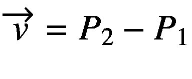

# 4.类和对象:扩展功能

这一章涵盖了一些扩展的面向对象特性，这些特性对于一个程序来说并不是必须的，但是仍然可以提高可读性和表现力。本章假定你已经阅读了第 2 章。我们还使用第 [2 章](02.html)中的`NumberGuess`示例应用程序。

## 匿名类

在您的代码中，在某些情况下，您可能希望创建接口的一次性实现或某个类的一次性子类。在科特林，可以写

```java
class A : SomeInterface {
    // implement interface functions ...
}
val inst:SomeInterface = A()
// use inst ...

```

或者

```java
open class A : SomeBaseClass() {
    // override functions ...
}
val inst:SomeBaseClass = A()
// use inst ...

```

在函数内部，有一种更简洁的方法来创建和使用这样的一次性实例:

```java
val inst:SomeInterface = object : SomeInterface {
    // implement interface functions ...
}
// use inst ...

```

或者

```java
val inst:SomeBaseClass = object : SomeBaseClass() {
    // override functions ...
}
// use inst ...

```

如果像后面的清单中那样扩展一些超类，这个超类也可能是抽象的。然而，随后有必要实现所有的抽象函数，这通常是实例化成为可能的情况。因为接口实现或子类的名字既没有指定也不需要，这样的类叫做*匿名*类。在花括号之间的类体中，你可以写任何你可以在命名类体内写的东西。

### 注意

声明中的`object :`表明只有一次实例化。匿名类不可能有多个实例。

我们知道`this`指的是实际的实例。匿名类内部也是如此，这里的`this`指的是匿名类的一个实例。有一个对`this`的扩展，它允许我们获得包围类的*的实例:只需将`@ClassName`附加到`this`上。例如在*

```java
interface X {
    fun doSomething()
}
class A {
    fun meth() {
        val x = object : X {
            override doSomething() {
                println(this)
                println(this@A)
            }
        }
    }
}

```

第一个`this`指的是匿名类，`this@A`指的是类`A`的实例。

## 内部类

类和单例对象也可以在其他类或单例对象中声明，甚至可以在函数中声明。然后可以从它们的作用域内访问它们，所以如果一个类或单例对象在某个类`A`内被声明，它可以在`A`内被实例化。如果它是在函数内部声明的，那么它可以从声明开始一直使用到函数结束。

```java
class A {
    class B { ... }
    // B can now be instantiated from
    // everywhere inside A
    fun meth() {
        ...
        class C { ... }
        // C can now be used until the end of
        // the function
        ...
    }
}

```

其他类或其他对象内部的类和对象可以使用类似于包的路径规范从外部寻址:如果在`A`(类或单例对象)内部声明了作为类或对象的`X`，那么可以编写`A.X`从外部访问它。然而，只有当内部类提供了某种到封闭类的接口时，您才应该这样做，以避免破坏封装原则。

```java
class A {
    class B { ... }
}
fun main(args:Array<String>) {
    val ab = A.B()
    // do something with it ...
}

```

## 类外的函数和属性

在您的项目中，您可以拥有不包含单个`class`、`interface`或`object`声明，但显示`val`和`var`属性和功能的 Kotlin 文件。尽管乍一看，如果我们使用这样的文件，我们似乎是在面向对象之外工作，但实际上 Kotlin 编译器隐式地、秘密地基于*包*名创建了一个 singleton 对象，并将这样的属性和功能放入这个对象中。

### 注意

对于非常小的项目，不使用显式类和单例对象是可以接受的。如果一个项目变得更大，仍然有可能只使用这样的非类文件，但是你最终会有混乱和不可读的代码的风险。

根据这一事实，以下规则适用于此类属性和功能:

*   在文件的什么地方声明`val`和`var`属性和函数并不重要；它们在文件的任何地方都是可用的。

*   这样的属性和函数对你用`import` `the.package.name.name`写在其他文件中的其他类或单例对象是可见的，其中最后的`name`指的是属性或函数名。

*   一个包中可以有几个这种类型的文件。然后，Kotlin 编译器只是顺序解析所有文件，并收集所有既不是来自类内部也不是单例对象的函数和属性。文件名在这里不起作用。

*   如果在不同的包中有几个这样的文件(由文件顶部的`package`声明定义)，名称冲突不会引起问题。属性和函数可以使用相同的名称。然而，您应该避免这种情况，以保持代码的可读性。

*   可以向这样的文件中添加类、接口和单例对象。您可以从声明的地方开始使用这样的结构单元，直到文件结束。

此外，可以使用通配符符号`import` `the.package.name.*`从特定包中的所有文件导入属性和函数。这对于避免冗长的`import`列表非常方便。

### 练习 1

你有一个实用的单例对象

```java
package com.example.util

object Util {
    fun add10(a:Int) = a + 10
    fun add100(a:Int) = a + 100
}

```

和一个客户

```java
package com.example

import com.example.util.Util

class A(q:Int) {
    val x10:Int = Util.add10(q)
    val x100:Int = Util.add100(q)
}

```

你能想出一种方法来重写`Util.kt`文件以不使用`object` { }声明吗？客户端代码会是什么样子？

## 导入函数和属性

单例对象的函数和属性可以通过如下的 import 语句导入

```java
import package.of.the.object.ObjectName.propertyName
import package.of.the.object.ObjectName.functionName

```

在文件的顶部，在`package`声明之后，与其他用于导入类和单例对象的`import`语句一起。这样就可以直接使用函数或属性，只需使用它的名字，而不需要加上`ObjectName`。

### 注意

没有通配符可以导入单例对象的所有属性和函数。你必须把它们放入各自的行中。

### 练习 2

假设`Math.log()`计算一个数的对数，并且`Math`驻留在包`java.lang`中，重写

```java
package com.example
class A {
  fun calc(a:Double) = Math.log(a)
}

```

使得不再需要`Math.`。

## 数据类别

只包含属性而不包含或包含很少函数的类很可能是*数据类，*其目的是在几个属性周围提供一个括号。因此，它们作为一种容器，聚集了一系列的属性。想象一个`Person`类，它为一个人收集姓名、生日、出生地、SSN 等等。Kotlin 对此类有一个特殊的符号:Prepend `data`如

```java
data class ClassName([constructor])

```

这看起来与普通的类没有太大的不同，但是与它们相反，前置`data`会导致以下结果:

*   该类根据属性自动获得一个特别定制的`toString()`函数；你不用自己写。

*   该类仅基于属性自动获得合理的`equals()`和`hashCode()`函数。我们稍后会谈到对象平等；现在，您需要知道的是:只有当两个数据类实例属于同一个数据类，并且它们的所有属性都需要相等时，这两个数据类实例的相等检查关系`a == b`才会产生`true`。

如果您需要一个函数来返回结构化或复合数据，那么数据类就派上了用场。在其他语言中，你必须经常使用成熟的类、数组或列表来实现这个目的，这使得这个任务看起来有点笨拙。在 Kotlin 中，你可以简洁地写出，例如:

```java
data class Point(val x:Double, val y:Double)

fun movePoint(pt:Point, dx:Double, dy:Double):Point =
    Point(pt.x + dx, pt.y + dy)

// somewhere in a function ...
val pt = Point(0.0, 1.0)
val pt2 = movePoint(pt, 0.5, 0.5)

```

你可以看到，在顶部的单个`data class`行，我们可以让函数`movePoint()`返回一个结构化的数据。

### 练习 3

使用数据类

```java
data class Point2D(val x:Double, val y:Double)
data class Point3D(val x:Double, val y:Double, val z:Double)

```

眼下，以下哪一项是正确的(`==`代表等于)？

1.  `Point2D(0, 1) == Point2D(1, 0)`

2.  `Point2D(1, 0) == Point3D(1, 0, 0)`

3.  `Point2D(1, 0).x == Point3D(1, 0, 0).x`

4.  `Point2D(1, 0) == Point2D(1.0, 0)`

5.  `Point2D(1, 0) == Point2D(1, 0)`

描述为什么或为什么不。

### 练习

`NumberGuess`游戏的哪些类算是数据类？执行转换。

## 列举

枚举类型基本上是一种非数值数据类型，其值来自给定的集合。这里基本上意味着默认情况下类型由整数处理，但是在基本的使用场景中，你不必担心这个。术语 *set* 是在数学意义上使用的，这意味着值必须是唯一的，并且没有排序顺序。

Kotlin 中的枚举是类的一种特殊形式:

```java
enum class EnumerationName {
    VALUE1, VALUE2, VALUE3, ...
}

```

其中，`EnumerationName`可以使用任何 camelCase 名称，`VALUEx`是字符集`A-Z0-9_`中以字母或`_`开头的任何字符串。

### 注意

对于这些值，技术上有更多的字符可用，但是按照惯例，您应该使用这里显示的字符组合。

要声明您编写的枚举类型，就像声明任何其他类一样，

```java
val e1: EnumerationName = ...
var e2: EnumerationName = ...

```

在赋值的右边你用`EnumerationName`。追加任何枚举值。例如，将水果作为值的枚举声明为 and，并与以下结果一起使用:

```java
enum class Fruit {
    BANANA, APPLE, PINEAPPLE, GRAPE
}

val f1 = Fruit.BANANA
val f2 = Fruit.BANANA
val f3 = Fruit.APPLE
var fx:Fruit? = null

// you can check for equality:
val b1:Boolean = f1 == f2  // -> true
val b2:Boolean = f1 == f3  // -> false

// you can reassign vars:
fx = Fruit.APPLE
fx = Fruit.BANANA

// toString() gives the textual value name
val s = fx.toString() // -> "BANANA"

```

注意`==`相当于等号。这是一个布尔表达式，我们还没有正式介绍。如果愿意，您可以自己定义枚举值的内部数据类型:只需向`enum`类添加一个主构造函数，并将其用于值:

```java
enum class Fruit(val fruitName:String) {
    BANANA("banana"),
    APPLE("apple"),
    PINEAPPLE("pineapple"),
    GRAPE("grape")
}

```

然后，您可以使用您引入的属性名称来获取这个自定义内部值:

```java
val f1 = Fruit.BANANA
var internalVal = f1.fruitName // -> "banana"

```

枚举类的一个有趣的内置函数是动态查找函数`valueOf()`:如果您需要从字符串中动态获取一个值，请编写

```java
val f1 = Fruit.valueOf("BANANA")
//     <- same as Fruit.BANANA

```

使用

```java
EnumerationName.values()

```

获取枚举的所有值(例如，对于循环)。枚举值本身也有两个内置属性:

*   使用`enumVal.name`以字符串形式获取值的名称。

*   使用`enumVal.ordinal`获取枚举值列表中值的索引。

### 练习 5

在`NumberGuess`游戏应用的`GameUser`类中添加一个`Gender`枚举。允许值`M`、`F`和`X`。在默认值为`X`的`GameUser`构造函数参数中添加相应的构造函数参数`gender`。

## 自定义属性访问器

我们知道一个`var`属性基本上是通过书写来声明的

```java
var propertyName:PropertyType = [initial_value]

```

我们还知道，为了得到`var`,我们写`object.propertyName`,为了设置它，我们写`object.propertyName =...`

在 Kotlin 中，当您获取或设置属性时，可以改变正在发生的事情。为了适应获取过程，您可以这样写:

```java
var propertyName:PropertyType = [initial_value]
    get() = [getting_expression]

```

在`[getting_expression]`里面，你可以写你喜欢的东西，包括访问函数和其他属性。对于更复杂的情况，你也可以提供一个身体，如

```java
var propertyName:PropertyType = [initial_value]
    get() {
        ...
        return [expression]
    }

```

改为更改适用于您编写的`propertyName = ...`的设置过程

```java
var propertyName:PropertyType = [initial_value]
    set(value) { ... }

```

在`set`主体中，你可以访问对象的所有函数和所有其他属性。此外，您可以使用特殊的`field`标识符来引用与属性对应的数据。

当然，你可以双管齐下；也就是说，调整获取和设置过程:

```java
var propertyName:PropertyType = [initial_value]
    get() = [getting_expression]
    set(value) { ... }

```

您可以微调属性的 getters 和 setters 的可见性。只管写

```java
[modifier] var propertyName:PropertyType = ...
    private get
    private set

```

或任何其他可见性修饰符。但是，要使 getter 成为私有的，属性本身也必须声明为私有的。相反，将 setter 设置为公共属性的私有是一个有效的选择。

有趣的是，可以定义在类或单例对象中没有相应数据的属性。如果您同时定义了属性的 setter 和 getter，并且既没有指定初始值也没有在 setter 代码中使用`field`，则不会为该属性生成任何数据字段。

### 练习 6

你能猜到用`val`代替`var`属性能做什么吗？

### 练习 7

编写一个与`toString()`功能相同的`str`属性(因此可以编写`obj.str`而不是`obj.toString()`)。

### 练习 8

回忆一下`NumberGuess`游戏 app:

```java
data class GameUser(var firstName:String,
             var lastName:String,
             var userName:String,
             var registrationNumber:Int,
             var gender:Gender = Gender.X,
             var birthday:String = "",
             var userRank:Double = 0.0) {
    enum class Gender{F,M,X}

    var fullName:String
    var initials:String
    init {
      fullName = firstName + " " + lastName
      initials = firstName.toUpperCase() +
                 lastName.toUpperCase()
    }
}

```

我们遇到的问题是，随着后来的`firstName`更改，`fullName`会被破坏。

```java
val u = GameUser("John", "Smith", "jsmith", 123)
u.firstName = "Linda"
val x = u.fullName // -> "John Smith" WRONG!

```

找到避免这种腐败状态的方法。提示:之后不再需要一个`init{ }`块。相应地更新您的代码。

## 科特林扩展

在 Kotlin 中，可以“动态地”向类添加扩展。我们需要将其动态地放在引号中，因为在执行之前，必须在代码中定义这种扩展的用法。在 Kotlin 中，不可能在运行时决定是否要使用哪些扩展，如果要使用的话。计算机语言设计者通常将这样的特性称为*静态*特性。

这就是我们所说的扩展:如果我们可以给任何类添加函数和自定义属性，那不是很好吗？这可能非常有用，例如，如果我们想要向其他人提供的类和函数添加额外的功能。我们知道我们可以使用继承来达到这个目的，但是根据具体情况，这可能是不可能的，或者实现可能会感觉笨拙。

### 警告

扩展机制非常强大。小心不要过度使用它。如果不花时间研究扩展定义，您可以使用没有人理解的扩展编写非常优雅的代码。

### 扩展功能

假设我们希望在内置的`String`类中有一个`hasLength(l:Int): Boolean`函数。你可能认为这就是继承的用途。然而，扩展`String`类是不可能的，因为通过设计来扩展`String`是被禁止的，所以我们不能为此使用继承。不过，Kotlin 扩展机制在这里帮助了我们。我们可以写作

```java
package the.ext.pckg

fun String.hasLength(len:Int) = this.length == len

```

在某个包`the.ext.pckg`内的某个文件`fileName.kt`(文件名在这里不起作用，所以随便用)。记住`==`检查平等。

我们现在可以在任何类或单例对象中使用扩展函数

```java
import the.ext.pckg.*

// anywhere inside a function ...
val hasLen10:Boolean = someString.hasLength(10)

```

同样的过程也适用于任何其他类，包括您自己的类和伴随对象。对于后一种情况，编写`fun SomeClass.Companion.ext() { }`来定义一个新的扩展函数`ext`。这里的`Companion`是一个文字标识符，用于寻址伴随对象。

### 注意

如果扩展函数与已存在的函数具有相同的名称和函数签名(参数集)，则后者优先。

## 扩展属性

类似的过程也适用于属性。假设您想给`String`添加一个`l`属性，它与`.length()`做同样的事情，并计算字符串长度。您可以通过如下结构来实现:

```java
package the.ext.pckg

val String.l get() = this.length

```

注意，我们不能使用`val String.l = this.length`，因为出于技术原因，扩展属性不允许实际创建真正的数据字段。因此初始化是不可能的，因为事实上没有什么可以初始化。至于 getters 我们想怎么写就怎么写，可以直接参考`.length`。现在可以写了

```java
import the.ext.pckg.*

// anywhere inside a function ...
val len1 = someString.length
val len2 = someString.l // this is the same

```

### 具有可空接收器的扩展

### 注意

*接收者*指的是被扩展的类或单例对象。

可以捕捉扩展的`null`值。如果你在前面加上一个问号

```java
fun SomeClass?.newFunction(...) { ... }

```

你可以检查`this == null`体内是否还有适当的反应，在这种情况下做正确的事情。即使`instance`是`null`，你也可以写`instance.newFunction(...)`，然后进入扩展函数。

### 封装扩展

如果您想在特定的类、单例对象或伴随对象中封装扩展，可以编写如下代码:

```java
class SomeClass {
    fun SomeOtherClass.meth() {
        ...
    }
}

```

这里`SomeOtherClass`接收扩展函数，但是该函数只能从`SomeClass`内部使用。对于`String`类的`hasLength()`扩展，封装版本如下所示

```java
class SomeClass {
    fun String.hasLength(len:Int) = this.length == len
    fun function() {
        ...

        // we can use hasLength() here
        val len10:Boolean = someString.hasLength(10)
        ...
    }
}

class SomeClass2 {
    // we can't use String.hasLength() here
}

```

类似的过程允许我们封装扩展属性。这些属性的符号如下

```java
class SomeClass {
    val SomeOtherClass.prop get() = ...
}

```

字符串长度的`String.l`扩展的封装版本如下

```java
class SomeClass {
    val String.l get() = this.length
    fun function() {
        ...
        // we can use .l here
        val len = someString.l
        ...
    }
}

```

封装扩展的明显优势是我们不必导入扩展文件。如果我们想要定义可用于许多类的扩展，非封装的变体将是更好的选择。

## 尾部递归函数

递归函数调用自己。对于某些算法，这种情况偶尔会发生。例如，阶乘函数`n! = n`⋅`(n`T2】⋅`(n`T4】⋅`...2`⋅`1`可以实现为

```java
fun factorial(n:Int):Int {
    return if(n==1) n else n * factorial(n-1)
}

```

注意，`if()`表达式返回在`else`之前或之后的部分，这取决于参数的计算结果是`true`还是`false`(我们将在本书后面讨论分支)。

为了让应用程序正常运行，运行时引擎需要跟踪函数调用，所以在内部，对`factorial()`的调用看起来会像`factorial( factorial( factorial (...) ) )`一样，如果递归深度不太高，这不是问题。但是，如果它真的很高，我们就会遇到内存使用和性能方面的问题。然而，如果递归发生在这样一个函数的最后一条语句中，它可以被转换成一个*尾递归*函数，这样在内部就不会发生系统资源的过度使用。

要将一个函数转换成尾部递归函数，只需在`tailrec`前面加上`fun`，如

```java
tailrec fun factorial(n:Int) {
    return if(n==1) n else n * factorial(n-1)
}

```

## 中缀运算符

中缀运算符用于由表示的运算

```java
operand1    OPERATOR    operand2

```

我们知道很多这样的中缀运算符:想想乘法(3 * 4)，加法(3 + 4)，等等。在 Kotlin 中，许多这样的中缀运算符是预定义的，但是也可以定义自己的中缀运算符。为此，请编写

```java
infix operator
fun SomeClass1.oper(param:SomeClass2) = ...

```

其中`oper`是操作符的名称(使用您自己的名称),`...`使用`this`(`SomeClass1`的实例)和`param`执行任何计算。然后你可以写

```java
[expression1] oper [expression2]

```

其中`[expression1]`的类型为`SomeClass1`，`[expression2]`的类型为`SomeClass2`。对于更复杂的计算，您也可以像往常一样使用函数体:

```java
infix operator

fun SomeClass1.oper(param:SomeClass2):ResultType {
    ...
    return [result_expression]
}

```

例如，为了允许一个字符串使用新操作符`TIMES`重复 *n 次*，我们编写

```java
infix operator fun String.TIMES(i:Int) =
    (1..i).map { this }.joinToString("")

```

(第二行是功能性构造；稍后我们将讨论功能设计。)我们可以接着写

```java
val s = "abc" TIMES 3 // -> "abcabcabc"

```

如果我们考虑到 Kotlin 有标准操作符的文本对应物，我们可以更巧妙地做到这一点。例如，`*,`的文本表示是`times`，所以我们可以写

```java
operator fun String.times(i:Int) =
     (1..i).map { this }.joinToString("")

```

这样我们就可以使用星号进行相同的操作:

```java
val s = "abc" * 3 // -> "abcabcabc"

```

这里可以省略`infix`，因为 Kotlin 知道`*`属于中缀操作。

使用标准运算符来定义自定义计算称为*运算符重载*。在下一节中，我们将使用所有标准操作符的列表和文本表示来了解更多信息。

## 运算符重载

运算符采用一个或两个表达式，并使用以下符号生成一个输出:

```java
[OPER] expression
[expression] [OPER] [expression]

```

处理一个表达式被称为*一元*操作，该操作符相应地被称为*一元操作符*。同样，处理两个表达式给了我们*二元*操作和*二元操作符*。

从数学中我们知道很多运算符，比如-a，a + b，a * b，a / b 等等。当然，Kotlin 为其数据类型内置了许多这样的操作符，所以`7 + 3`和`5 * 4`等做了预期的事情。我们将在本书后面详细讨论操作符表达式，但现在我们想关注一下操作符重载，Kotlin 的这一功能允许你使用标准操作符为自己的类定义自己的操作符。

比方说，你有一个`Point`类指定空间中的一个点`(` x，y `)`，还有一个`Vector`类指定两点之间的直接连接。从我们已经学到的，我们知道我们可以通过

```java
data class Point(val x:Double, val y:Double)
data class Vector(val dx:Double, val dy:Double)

```

现在从数学上我们知道，从点 *P* <sub>1</sub> 到点 *P* <sub>2</sub> 的向量可以写成表达式。计算结果是 *dx* = * p * 2。*x p*1。 *x* 和 *dy* = * p * 2。*y p*1。 *y* 。如果我们可以只写*v*=*p*2-*p*1 来执行那个操作，不是很好吗，就像

```java
val p1 = Point(1.0, 1.0)
val p2 = Point(4.0, -2.0)
val v:Vector = p2 - p1

```

使用运算符重载，我们可以做到这一点。这很简单:首先，我们需要——操作符的文本表示，恰好是负的。其次我们写

```java
data class Point(val x:Double, val y:Double) {
  operator fun minus(p2:Point) =
       Vector(p2.x-this.x, p2.y-this.y)
}

```

就是这样。`val v:Vector = p2 - p1`现在可以工作了，所以每当编译器看到两个`Point`实例之间有一个`-`时，它就会计算组合它们的向量。

对于一元运算符，过程是相同的，但是不需要在运算符函数中指定参数。例如，如果你想让`-Vector(1.0, 2.0))`工作，给定反向向量，你只需加上

```java
operator fun unaryMinus() = Vector(-this.dx, -this.dy)

```

到`Vector`班。

你可以对科特林认识的所有操作员做同样的事情。所有这些的文字表示如表 [4-1](#Tab1) 所示。

表 4-1

经营者

<colgroup><col class="tcol1 align-left"> <col class="tcol2 align-left"> <col class="tcol3 align-left"> <col class="tcol4 align-left"></colgroup> 
| 

标志

 | 

Arity

 | 

本文的

 | 

标准含义

 |
| --- | --- | --- | --- |
| `+` | U | 一元加号 | 再现数据(如`+3`)。 |
| − | U | 一元减操作 | 对数据求反(例如，`7`)。 |
| `!` | U | 不 | 逻辑否定数据(如`!true == false`)。 |
| `++` | U | 股份有限公司 | 递增数据(如`var  a  =  6; a++; // -> a == 7`)。操作员不得更改调用它的对象！增量值的分配在幕后进行。 |
| −− | U | 十二月 | 递减数据(例如`var a = 6; a`-`; // -> a == 5`)。操作员不得更改调用它的对象！递减值的分配在幕后进行。 |
| `+` | B | 加 | 添加两个值。 |
| − | B | 负的 | 减去两个值。 |
| *本文件迟交 | B | 倍 | 将两个值相乘。 |
| / | B | 差异 | 将两个值相除。 |
| % | B | 雷姆 | 除法的余数(例如，5 % 3 = 2)。 |
| .. | B | 范围到 | 创建一个范围(例如 2..5 -> 2, 3, 4, 5) |
| 在！在 | B | 包含 | 检查右侧是否包含在左侧中。 |
| [ ] | B+ | 获取/设置 | 索引访问。如果在像`q[5] = ...`这样的赋值的左边，`set()`函数与指定要设置的值的最后一个参数一起使用。`get()`和`set()`函数允许多个参数，这些参数对应于`[]`中几个逗号分隔的索引；比如`q[i]` → `q.get(i)`、`q[i,j]` → `q.get(i, j)`、`q[i,j] = 7` → `q.set(i, j, 7)` |
| `( )` | B+ | 引起 | 祈祷。允许多个参数，这些参数对应于`()`中几个逗号分隔的参数；比如`q(a)` → `q.invoke(a)`和`q(a, b)` → `q.invoke(a, b)`。 |
| `+ =` | B | plusAssign | 与`plus()`相同，但是将结果分配给调用操作符的实例。 |
| —`=` | B | 减法赋值 | 与`minus()`相同，但是将结果分配给调用操作符的实例。 |
| *`=` | B | 时间分配 | 与`times()`相同，但是将结果分配给调用操作符的实例。 |
| `/ =` | B | 二次分配 | 与`div()`相同，但是将结果分配给调用操作符的实例。 |
| `% =` | B | 再分配 | 与`rem()`相同，但是将结果分配给调用操作符的实例。 |
| `==` | B | 等于 | 检查是否相等。`! =`代表不相等，对应`equals()`返回`false`。 |
| `<``>``<=``>=` | B | 比较 | 比较两个值。根据参数是小于、等于还是大于函数所应用的值，函数`compareTo()`应该返回`1, 0, +1`。 |

### 注意

因为在操作符函数体或表达式中你可以计算你想要的，你可以让操作符做奇怪的事情。请记住，当使用操作符时，您的类用户期望某个特定的行为，所以合理地使用您在那里计算的内容。

顺便说一下，如果您喜欢在扩展文件中重载操作符，就不需要什么魔法了。对于前面的点和向量的例子，只需写`operator fun TheClass.[operator_name]( [parameters] ) = ...`,如下所示

```java
operator fun Point.minus(p2:Point) =
    Vector(p2.x-this.x, p2.y-this.y)

```

不要忘记导入扩展文件，就像对任何其他扩展一样。

### 练习 9

在`Vector`类中添加`-`和`+`操作符。如果`v2`是操作函数参数，计算包括增加或减少`dx`和`dy`成员:`Vector(this.dx + v2.dx, this.dy + v2.dy)`和`Vector(this.dx - v2.dx, this.dy - v2.dy)`。

## 授权

我们通过`class TheClass : SomeInterface {`了解到遗传...`}`让`TheClass`实现接口仅以抽象方式声明的功能。实现代码在`TheClass`中输入被覆盖的函数。委托类似于继承；它以同样的方式开始:`class TheClass : SomeInterface`...。不同之处在于实现代码所在的位置:对于委托，假设手边有一个已经实现了接口的对象，而`TheClass`主要是将工作委托给这个对象。使用我们已知的结构，这可以写成:

```java
interface TheInterface {
    fun someMethod(i:Int):Int
    ...more functions
}

class Implementor0 : SomeInterface {
    override fun someMethod(i:Int):Int = i*2
    ...implement the other functions
}

class Implementor : TheInterface {
    val delegate = Implementor0()
    override fun someMethod(i:Int):Int = delegate(i)
    ...do the same for the other functions
}

```

`Implementor`类中的方法`someMethod()`委托给了`delegate`，但这也可能会增加一些额外的工作，如

```java
override fun someMethod(i:Int):Int = delegate(i-1) + 1

```

Kotlin 对委托基本模式有一个简明的符号。你只需要写

```java
class Implementor : TheInterface by Implementor0()
// or
val impl0 = Implementor0()
class Implementor : TheInterface by impl0

```

然后，Kotlin 编译器通过将工作转发给委托来自动实现所有接口方法。您仍然可以通过覆盖它来更改任何函数:

```java
class Implementor : TheInterface by Implementor0() {
    override fun someMethod(i:Int):Int = i * 42
}

```

如果您明确需要委托对象，则必须将其添加到构造函数中，如

```java
val b = Implementor0()
class Implementor(val b:TheInterface) :
        TheInterface by b {
    override
    fun someMethod(i:Int):Int = b.someMethod(i-1) + 1
}
val instance = Implementor(b)

```