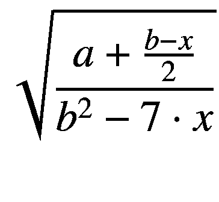

# 五、表达式：对数据的操作

我们已经用过几次表达了。每当你需要给一个变量赋值，需要函数调用参数，或者需要给某种语言结构赋值时，你就需要一个表达式。表达式也会出现在你意想不到的地方，如果我们不需要，它们可以被忽略。

## 表达式示例

表达式可以细分为不同的类型:数字表达式、布尔表达式、字符串和字符表达式、作用于位和字节的表达式，以及一些未分类的表达式。在我们开始详细解释它们之前，这里有一些例子:

```java
4 * 5         // multiplication
3 + 7         // addition
6 – 1         // subtraction
"a" + "b"     // concatenation
( 1 + 2 )     // grouping
-5            // negation
a && b        // boolean a AND b
"Hello"       // constant (String)
78            // another constant (Int)
3.14          // another constant (Double)
'A'           // another constant (Char)
arr[43]       // index access
funct(...)    // function invocation
Clazz()       // instantiation
Obj           // singleton instance access
q.a           // dereferencing
q.f()         // another dereferencing
if(){ }       // language construct
when(){ }     // another language construct

```

## 表达式的普遍性

与许多其他计算机语言不同，在 Kotlin 中，几乎所有东西都是表达式。例如，看看函数调用`funct()`。你可能会认为一个没有像在`fun funct() { ... }`中那样声明返回值的函数不是一个表达式，因为它似乎不能被赋值给一个变量。试试看，写一写

```java
fun a() {
}

val aa = a()

```

令人惊讶的是，编译器没有将这段代码标记为错误。事实上，这样的函数确实会返回值；它是`Unit`类的实例，被称为`Unit`。你不能用它做任何有趣的事情，但它是一个值，它使一个函数不显式返回任何东西，而是隐式返回一些东西。

在本章的其余部分，我们将介绍不同的表达式类型以及它们之间的转换。

## 数字表达式

数字表达式是由文字、属性和子表达式等元素构建的结构，可能由运算符组合在一起并产生一个数字。涉及加、减、乘、除的一组众所周知的运算符通常被称为*算法*。在计算中，这组标准运算符通常会增加一个递增和递减运算符`++`和*—*，以及一个整数除法余数运算符%。对于 Kotlin 内部可用于数值表达式的可能元素的完整列表，见表 [5-1](#Tab1) 。

表 5-1

数字表达式元素

<colgroup><col class="tcol1 align-left"> <col class="tcol2 align-left"> <col class="tcol3 align-left"></colgroup> 
| 

标志

 | 

意义

 | 

例子

 |
| --- | --- | --- |
| *文字* | 字面意思 | `3`或`7.5` |
| *变量* | 一处房产 | `val a = 7; val b = a + 3` |
| 函数( ) | 函数的值，如果它返回一个数字 | `fun a() = 7; val b = 3 + a()` |
| `[ ]` | 访问数组或数字列表中的元素 | `arr[0]``list[7]` |
| `( )` | 替换为内部表达式的结果 | `7 * ( a + b )` |
| `+` | 如果用在表达式前面，则复制数据 | `val a = +3``val a = +7.4` |
| `-` | 如果用在表达式前面，则对数据求反 | `val a = -(7+2)` |
| `++` | 可以用在一个`var`的前面或者后面；如果用在它的前面，则计算为`var + 1`的当前值；如果在它后面使用，则计算为`var`的当前值；作为副作用，增加了`var` | `var a = 7``val b = 7 + ++a``val c = 7 + a++` |
| `--` | 可以用在一个`var`的前面或者后面；如果用在它的前面，则计算为`var` - 1 的当前值；如果在它后面使用，则计算为`var`的当前值；作为副作用，减少了`var` | `var a = 7``val b = 7 + --a``val c = 7 + a--` |
| `+` | 将两个值相加 | `7 + 6` |
| `-` | 减去两个值 | `7 – 6` |
| `*` | 将两个值相乘 | `7 * 6` |
| `/` | 将两个值相除；如果在两个非浮点值之间，则返回一个非浮点值；否则返回一个`Double`或一个`Float` | `7 / 6`(给出 1)`7.0 / 6.0`(给出`1:16667`) |
| `%` | 两个整数值相除的余数 | `5 % 3`(给出`2`) |
| `subexpr` | 用作子表达式的任何表达式，返回一个数字 | 在`5 + a / 7`中，`a/7`可以被认为是一个子表达式 |

如果在一个表达式中混合不同类型的数字，具有较大取值范围的数字将被用作返回值的类型，因此用一个`Long`除以一个`Int`将得到一个`Long`:

```java
val l1:Long = 234567890L
val i1:Int = 37
val x = l1 / i1 // -> is a Long

```

同样，如果您在一个表达式中混合了普通精度的`Float`元素和双精度的`Double`元素，`Double`将获胜:

```java
val f1:Float = 2.45f
val d1:Double = 37.6
val x = f1 / d1 // -> is a Double

```

将整数与浮点数元素混合会产生浮点数:

```java
val i1:Int = 33
val d1:Double = 37.6
val x = i1 * d1 // -> is a Double

```

如果我们需要组合三个值(或子表达式)并在一行中有两个操作符，如

*   `expr``1`*`expr``2`*`expr`T5】**

 **问题是先评估哪个操作符。这称为*运算符优先级*，其Kotlin规则如表 [5-2](#Tab2) 所示。

表 5-2

算术运算符的优先级

<colgroup><col class="tcol1 align-left"> <col class="tcol2 align-left"> <col class="tcol3 align-left"></colgroup> 
| 

优先

 | 

经营者

 | 

例子

 |
| --- | --- | --- |
| one | `++ --`作为后缀 | `a++` |
| Two | `-`(在一个表达式前面)`+`(在一个表达式前面)`++ --`作为前缀 | `–(3 + 4)``--a` |
| three | `* /` % | `7 * a` |
| four | `+ -` | `7 – a` |

您总是可以使用圆括号`( ... )`来指定任何运算符的求值顺序。就像在数学中使用的一样，在使用括号内的解之前，首先计算括号内的值。

### 练习 1

用`Math.sqrt(...)`表示平方根√，用 Kotlin 代码写下:



假设`a, b,`和`x`是现有属性。

## 布尔表达式

布尔表达式是评估为布尔值`true`或`false`之一的表达式。如果我们需要决定程序的哪些部分参与程序流，我们经常使用布尔表达式。参与布尔表达式的对象和运算符列于表 [5-3](#Tab3) 。

表 5-3

布尔表达式元素

<colgroup><col class="tcol1 align-left"> <col class="tcol2 align-left"> <col class="tcol3 align-left"></colgroup> 
| 

标志

 | 

意义

 | 

例子

 |
| --- | --- | --- |
| *文字* | 字面意思 | `true`或`false` |
| *变量* | 一处房产 | `val a = true; val b = a` |
| `funct()` | 函数的值，如果它返回一个布尔值 | `fun a() = true; val b = a()` |
| `[ ]` | 访问数组或布尔列表中的元素 | `arr[0]``list[7]` |
| `( )` | 替换为内部表达式的结果 | `b1 && ( a &#124;&#124; b )`(注意:&& = AND，&#124;&#124; = OR) |
| `&&` | 和操作；只有当`a`和`b`都为真时，`a && b`才为真；注意，如果左边的求值结果为`false`，那么`&&`的右边永远不会被求值 | `true && true`(产量→ `true`) |
| `&#124;&#124;` | 或者运营；只有当`a`和`b`中至少有一个为真时，`a &#124;&#124; b`才为真；注意，如果左边的求值结果为`true`，那么`&#124;&#124;`的右边永远不会被求值 | `true &#124;&#124; false`(产量→ `true`) |
| `!` | 对以下布尔表达式求反 | `val b = true; val r = !b`(yields `r`为假) |
| `a == b` | 如果`a`和`b`相等，则产生`true`；`a`和`b`是任意对象或子表达式；如果布尔或数字子表达式的值相同，则它们相等；如果对象`a`和`b`的`hashCode()`函数返回相同的值，并且`a.equals(b)`返回`true`，则它们相等；如果两个字符串都包含相同的字符，则它们相等；如果一个特定数据类的两个实例的所有属性都相等，那么它们就是相等的 | `a == 3`(如果`a`的值为 3，则为`true`)`a == "Hello"` ( `true`如果`a`是字符串“你好”) |
| `a != b` | 不相等，同`!( a == b )` | `true)`→`true)``false)`→`false)` |
| `a < b` | 如果数字`a`小于数字`b`，则为真；还评估是否在对象`a`和`b`上定义了接口`Comparable` | `a < 7` (→ `true`如果`a`小于 7) |
| `a > b` | 如果数字`a`大于数字`b`，则为真；还评估是否在对象`a`和`b`上定义了接口`Comparable` | `a > 3` (→ `true`如果`a`大于 3) |
| `a <= b` | 如果数字`a`小于或等于数字`b`，则为真；还评估是否在对象`a`和`b`上定义了接口`Comparable` | `a <= 7` (→ `true`如果`a`小于或等于 7) |
| `a >= b` | 如果数字`a`大于或等于数字`b`，则为真；还评估是否在对象`a`和`b`上定义了接口`Comparable` | `a >= 3` (→ `true`如果`a`大于或等于 3) |
| `a is b` | 如果对象`a`实现了类或接口`b`则为真 | `true)`→`true)` |
| `a !is b` | 同`!(a is b)` | `true)`→`true)` |
| `a === b` | 检查引用是否相等；如果对象是`same`并因此强于`==`比较，则返回`true`；通常不经常使用，因为使用`==`操作符的语义检查在大多数情况下更有意义 | `class A``val a = A(); val b = A()``val c = a === b``false)`→`false)` |

与上一节中的数值表达式类似，如果使用带有更多运算符的表达式，布尔表达式运算符具有优先权。布尔运算符优先级的 Kotlin 规则如表 [5-4](#Tab4) 所示。

表 5-4

布尔运算符的优先级

<colgroup><col class="tcol1 align-left"> <col class="tcol2 align-left"> <col class="tcol3 align-left"></colgroup> 
| 

优先

 | 

经营者

 | 

例子

 |
| --- | --- | --- |
| one | `!`(在一个表达式前面) | `val a = true; val b = !a` |
| Two | `is`，`!is` | `a in b && c` |
| three | `<`、`<=`、`>=`、`>` | `a < 7 && b > 5` |
| four | `==`，`!=` | `a == 7 && b != 8` |
| five | `&&` | `a == 4 && b == 3` |
| six | `&#124;&#124;` | `a == 4 &#124;&#124; a == 7` |

对于数值表达式，您可以使用圆括号强制不同的优先顺序:

```java
val b1 = a == 7 && b == 3 || c == 4
val b2 = a == 7 && (b == 3 || c == 4)

```

如你所见，它们是不同的。在第一行中，`&&`获胜并首先被计算，因为它比`||`具有更高的优先级。在第二行中，`||`获胜，因为它在一个括号内。

## 字符串和字符表达式

字符串没有太多的表达式元素。但是，您可以连接字符串并执行字符串比较。字符串表达式元素的完整列表见表 [5-5](#Tab5) 。

表 5-5

字符串表达式元素

<colgroup><col class="tcol1 align-left"> <col class="tcol2 align-left"> <col class="tcol3 align-left"></colgroup> 
| 

标志

 | 

意义

 | 

例子

 |
| --- | --- | --- |
| *文字* | 字面意思 | `"Hello world"`或者`"""Hello world"""` |
| *变量* | 一处房产 | `val a = "abc"; val b = a` |
| `funct()` | 函数的值，如果它返回一个字符串 | `fun a() = "abc"; val b = a()` |
| `[ ]` | 访问数组或字符串列表中的元素 | arr[0]列表[7] |
| `str[ ]` | 从字符串中提取字符 | `"Hello" [1]`(产量`"` e `"`) |
| `( )` | 替换为内部表达式的结果 | `"ab" + ("cd" + "ef" )` |
| `+` | 串并置 | `val a = "Hello " + "world"`(产量→ `"Hello world"`) |
| `a == b` | 检查是否相等；如果两个字符串都包含相同的字符，则它们相等 | `a == "Hello"` ( `true`如果`a`是字符串“Hello”) |
| `a != b` | 不相等，同`!( a == b )` | `true)`→`true)` |
| `a < b` | 如果字符串`a`在字典顺序上小于字符串`b`则为真 | `true)`→`true)` |
| `a > b` | 如果字符串`a`在字典上比字符串`b`大，则为 True | `true)`→`true)` |
| `a <= b` | 如果字符串`a`在字典上小于或等于字符串`b`则为真 | `true)`→`true)``false)`→`false)` |
| `a >= b` | 如果字符串`a`在字典上大于或等于字符串`b`则为真 | `true)`→`true)` |
| `a in b` | 如果`a`是一个`Char`，`true`如果`b`包含`a`；如果`a`是字符串本身，`true`如果`a`是字符串`b`的一部分 | `true)`→`true)``true)`→`true)` |
| `a !in b` | 同`!(a in b)` | `true)`→`true)` |

字符串文字有几种特殊情况。

*   使用三组双引号的字符串被称为*原始字符串*。它们可以包含任何内容，包括换行符和反斜杠(\)等特殊字符。书写`"Hello\n world"`会产生由换行符分隔的“Hello world”。然而，如果你写`"""Hello\n world"""`，输出将是字面上的“Hello \n world”。一个例外是`$`；你得写`${'$'}`才能得到。

*   在原始和普通(“转义”)字符串中，你都可以使用模板:一个`${}`被包含在花括号中的任何内容的`toString()`表示所取代。例如:`"The sum of 3 and 4 is ${3+4}"`得出字符串“3 和 4 之和是 7”。如果它是一个单一的标识符，比如一个房产的名字，你也可以省略括号，写成`$propertyName`，比如`"And the value of a is $a".`

字符具有整数表示，因为它们对应于字符表中的索引。这允许一些算术和比较运算符处理字符。字符表达式元素列表如表 [5-6](#Tab6) 所示。

表 5-6

字符表达元素

<colgroup><col class="tcol1 align-left"> <col class="tcol2 align-left"> <col class="tcol3 align-left"></colgroup> 
| 

标志

 | 

意义

 | 

例子

 |
| --- | --- | --- |
| *文字* | 字面意思 | `'A'`或者`'7'` |
| *变量* | 一处房产 | `val a = 'x'; val b = a` |
| `funct()` | 函数的值，如果它返回一个字符 | `fun a() = 'x'; val b = a()` |
| `[ ]` | 访问数组或字符列表中的元素 | `arr[0]``list[7]` |
| `-` | 字符表中的距离 | `val d = 'c' - 'a'`(产量→ 2) |
| `a == b``a != b``a < b``a > b``a <= b``a >= b` | 性格比较；比较字符表中的索引 | `'c' > 'a'`(产量→ `true`) |

## 比特和字节

字节是更面向硬件的数据存储单位。我们知道有一个`Byte`类型，它的值在`128`和`127`之间。一个字节对应于一些硬件存储和处理元素，可以以极快的方式访问和使用。在你的应用中，你只是偶尔使用字节，尤其是在使用一些低级系统功能或寻址连接的硬件元素(如摄像头或扬声器)时。

你知道当你写下`125`这样的十进制数字系统中的一个数字时，你实际上的意思是`5`*`1 + 2`*`10 + 1`*`100`。计算机内部不喜欢十进制计数系统，因为如果他们使用它，例如，`7`和`8`之间的差异不能可靠地用一些技术属性来表示，如两个触点之间的电压。计算机能做得很好的是发现某个东西是否被打开，用密码`0`和`1`来表示。因此，他们在内部使用二进制编码系统。如果我们需要一个`125`它实际上由二进制数`01111101`表示，意思是`1·1 + 0·2 + 1·2`<sup>`2`</sup><sup>`3`</sup>`+ 1·2`<sup>`4`</sup>`+ 1·2`<sup>`5`</sup>`+ 1·2`<sup>`6`</sup>`+ 0·2`<sup>`7`</sup>。这个数里面的数字被称为*位*，碰巧的是，我们需要 8 位来表示一个字节所有可能的值。***

 **因为一个字节是一个数字，你可以用它做所有的事情，我们之前已经讨论过，关于数字表达式。然而，一个字节也是八位的集合，并且有一些特殊的操作可以在位级上进行(见表 [5-7](#Tab7) )。注意，`Short`、`Int`和`Long`值对应 2、4 和 8 个字节，因此对应 8、16 和 32 位。因此，位级操作不仅可以在字节上执行，还可以在其他整数类型上执行。

表 5-7

位表达式元素

<colgroup><col class="tcol1 align-left"> <col class="tcol2 align-left"> <col class="tcol3 align-left"></colgroup> 
| 

标志

 | 

意义

 | 

例子

 |
| --- | --- | --- |
| `a and b` | 位级上的 AND`a`的每一位都与`b`的相应位配对，如果两者都是`1`，那么结果号中的位也将被设置为`1` | `13 and 11`(评估为 9: `00001101`和`00001011` → `00001001`) |
| `a or b` | 位级别上的或；`a`的每个位与`b`的相应位配对，如果其中一个或两个都是`1`，结果号中的位也将被设置`1` | `13 or 11`(评估为 15: `00001101`或`00001011` → `00001111`) |
| `a xor b` | 比特级的异或运算；`a`的每一位都与`b`的相应位配对，如果其中恰好有一位是`1`，那么结果号中的位也将被置位`1` | `13 xor 11`(计算结果为 6: `00001101`异或`00001011` → `00000110`) |
| `inv a` | 将某个数字`a`的所有位从 0 切换到 1，反之亦然 | `inv 13`(计算结果为 114: inv `00001101` → `11110010` = 114) |
| `a shl b` | 将所有位从`a`向左移动`b`位 | `13 shl 2`(评估为 52:`00001101` → `00110100` = 52) |
| `a ushr b` | 将所有位从`a`向右移动`b`位位置；这个名字是无符号右移的缩写，意味着最左边的位没有得到特殊处理 | `13 shr 2`(评估为 3: `00001101` → `00000011` = 3) |
| `a shr b` | 将所有位从`a`向右移动`b`位位置；如果最左边的位被设置为`1`，则每次移位后最左边的位也被设置为`1` | `-7 shr 2`(计算结果为-2: `11111001` → `11111110` = -2) |

注意，有符号右移操作的`shr`运算符指的是位表示中的负数。这样的负数是这样建立的:确保负数的位和它的算术倒数的位相加在一起正好导致溢出。将*—*`3`表示为一个字节就产生了`11111101`，因为这个加上`00000011`(代表`+3`)就产生了`100000000`。一个字节的最后一个九位数导致溢出，最高的第九位丢失，导致零。这最终也给了我们所需的二进制表示形式的`+3 +`-`3 = 0`。

## 其他操作员

Kotlin 还有一些我们可以在表达式中使用的操作符。它们不适合区分数字、布尔、字符串和字符以及位表达式，所以我们在表 [5-8](#Tab8) 中单独列出它们。

表 5-8

其他表达元素

<colgroup><col class="tcol1 align-left"> <col class="tcol2 align-left"> <col class="tcol3 align-left"></colgroup> 
| 

标志

 | 

意义

 | 

例子

 |
| --- | --- | --- |
| `a in b` | 检查某个`a`是否包含在`b`中，`b`可能是数组，也可能是集合；一般来说，`in`操作符适用于任何定义了`operator fun contains(other:SomeClass): Boolean`函数的对象，甚至是你自己的类 | `class B``class A { operator fun``contains(other:B):Boolean``{ ... } }``val b = B()``val a = A()``val contained = b in a` |
| `a !in b` | `a in b`的反面；如果为`a`的类定义了`operator fun contains(other:SomeClass): Boolean`也有效 | 参见`a in b;`添加`val notContained = b !in a` |
| `::` | 如果像`ClassName::class`一样使用，它创建一个对类的引用；如果像`ClassName::funName`或`ClassName::propertyName`一样使用，它会创建一个对函数或属性的引用 | `val c = String::class``val f = String::length` |
| `a .. b` | 创建从一个整数(文字、`Byte`、`Short`、`Int`、`Long`或`Char` ) `a`到另一个整数`b`的范围 | `1..100` |
| `a ?: b` | `Elvis`操作员；如果`a`不是`null`，取；否则采取`b` | `var s:String? = ...``var ss = s?:"default"``(`如果`s`是`null`，取“默认”代替) |
| `a ?. b`或者`a ?. b()` | 安全解引用或安全调用运算符；对于某个对象`a`，仅当`a`不是`null`时，从函数`b()`调用中检索属性`b`或结果(可以有参数)；否则评估为`null`本身 | `var i:Int? = ...``var ss:String? =``i?.toString()` |
| `a!!` | 确保`a`不是`null`；否则会引发异常 | `var s:String? = ...``var ss = s!!.toString()` |

表达式末尾的`!! operator`不仅检查它不是`null`，还将其转换为不可空的类型:

```java
val c:Int? = ...    // an int or null
val b = c!!         // b is non-nullable!
// the same: val b:Int = c!!

```

更好的是，Kotlin记得我们检查了`c`不是`null`，并且对于函数的其余部分，将`c`视为不可空的属性。

### 警告

即使`!!`似乎是一个简化编码的通用工具，你也不应该经常使用它。操作符在某种程度上阻碍了 Kotlin 处理可空性的方式。`!!`打破了不可为空性，并通过区分可为空和不可为空的类型和表达式隐藏了我们的优势。

### 练习 2

创建一个允许通过函数`add(s:String)`连接字符串的类`Concatenator`。添加另一个函数，这样就可以编写下面的代码来查看连接的字符串是否包含子字符串。

```java
val c = Concatenator()
c.add("Hello")
c.add(" ")
c.add("world")
val contained = "ello" in c

```

## 转换策略

如果你有一个`val`或者`var`属性或者某种类型的函数参数，问题是如果在赋值中我们提供一个不同类型的表达式会发生什么。如果这种类型不匹配很严重，例如，如果我们需要一个`Int`号，而提供了一个`String`，编译器将会失败，我们需要修复它。在其他情况下，例如，如果我们实际上需要一个`Long`，就提供一个`Int`，类型之间的简单转换会很好。

Kotlin 通过提供几个可用于手动执行类型转换的函数来帮助我们。在下面的列表中，我们研究了类型不匹配时的选项。

*   需要一个`Int`。
    *   `Byte`、`Short`、`Int`、`Long`:所有这些都提供了一个到`Int()`的函数，执行直接转换。

    *   `Char`:有一个`toInt()`函数，给出字符在字符表中的索引。

    *   `Float`、`Double`:提供一个`toInt()`函数，对于正数，返回给定浮点数下面最接近的`Int`。对于负数，返回给定浮点数上面最接近的`Int`。此外，它们还有一个`roundToInt()`功能，提供向上舍入到下一个整数的功能。

    *   `String`:提供一个`toInt()`函数，解析给定的字符串，并试图将其转换成一个`Int`。如果提供的字符串不包含整数，这将失败，因为只允许使用可选符号和 0 到 9 的密码。此外，还有一个`toIntOrNull`函数处理相同的转换，但不会失败，如果转换不可能，它将返回`null`。变体`toInt(radix:Int)`和`toIntOrNull(radix:Int)`使用不同的计数系统(基数)进行转换。例如，对于十六进制基数(使用`16`作为`radix`参数)，允许使用密码 0 到 9 和字母 A 到 F。

    *   `Boolean`:从布尔值到整数的转换是不可能的。

*   需要一个`Long`、`Byte`或`Short`。

    所有类型`Byte`、`Short`、`Int`、`Long`、`Char`、`Float`、`Double`和`String`都提供了`toLong()`、`toByte()`和`toShort()`功能，这些功能遵循与`Int`目标类型相同的规则，除了适用不同的数字范围。请注意，对于字符串，长文本不允许使用 L 后缀。

*   需要一个充电器。

    所有整数类型`Byte`、`Short`、`Int`和`Long`都提供了一个`toChar()`函数，该函数使用所提供的数字在字符表中执行索引查找。A `Char.toChar()`原封不动地返回参数。类型`Float`和`Double`提供了一个`toChar()`函数，该函数首先应用一个`toInt()`，然后执行字符表查找。字符串不提供到`Char`的转换，但是您可以使用`toCharArray()`和索引操作符`[]`来访问数组元素(例如，`"123".toCharArray()[0]`给出‘1’)。

*   需要一个`Double`或一个`Float`。
    *   `Byte`、`Short`、`Int`、`Long`:这些都提供了`toFloat()`和`toDouble()`功能，执行明显的转换。

    *   `Char`:字符也有`toFloat()`和`toDouble()`函数，但是它们返回字符表中转换成浮点数的索引。

    *   `Float`、`Double`:这些提供`toFloat()`和`toDouble()`功能，必要时执行精度转换。

    *   `String`:它有`toFloat()`和`toDouble()`函数，这些函数试图解析提供的字符串，将其转换成`Float`或`Double`。`String`可以使用英文格式浮点数表示或科学记数法；比如`27.48`、`-3.0`、`1.8e4`。如果转换不可能，此过程将失败。变量`toDoubleOrNull()`和`toFloatOrNull()`将尝试相同的转换，但如果出现转换错误，则返回`null`。

    *   `Boolean`:从布尔值到浮点数的转换是不可能的。

*   需要一个`String`。

    Kotlin 中的任何对象都提供了一个`toString()`转换，将它翻译成人类可读的表示。对于包含字符的整数，转换很明显；对于浮点数，将选择英语格式；布尔值被翻译成`true`或`false`。类型`Byte`、`Short`、`Int,`和`Long`也有一个`toString(radix:Int)`功能，使用提供的编号系统(基数)进行转换。

应用了几个自动转换，所以有可能写`val l:Long = 7`，这看起来像是自动的`Int`到`Long`的转换。

### 注意

根据编码过程中的经验，您可以测试自动转换是否可行，但在大多数情况下，最好显式声明转换。

在运算符起作用的表达式中，适用另一种转换规则。对于任何运营商

*   `a`*T1】*

 *其中`a`是类型`AType`而`b`是类型`BType`，操作符实现决定了操作结果的类型。一个重要的案例是

```java
[Number]   °  [Number]

```

其中`[Number]`选自`Byte`、`Short`、`Int`、`Long`、`Float,`或`Double`，运算符为任意数值运算符(`+ - / * %`)。这里，表达式返回的类型在大多数情况下是具有更高精度的类型。精度排名是`Byte`<`Short`<`Int`<`Long`<`Float`<`Double`。例如:

```java
7 + 10_000_000_000L -> Long
34 + 46.7          -> Double

```

在 Kotlin 程序中，另一种由操作符引起的转换是

```java
String + [Any]

```

在这里，字符串和`[Any]`上的`.toString()`的结果将发生连接。例如:

```java
"Number is "  +  7.3                ->   "Number is 7.3"
"Number is "  +  7.3.toString()     ->   "Number is 7.3"
"Hell" + 'o'                        ->   "Hello"

```*****