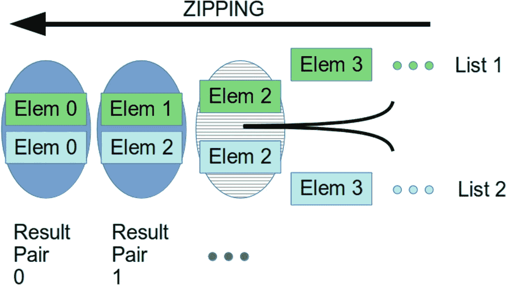
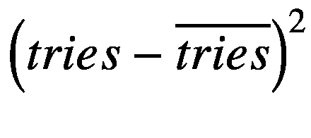
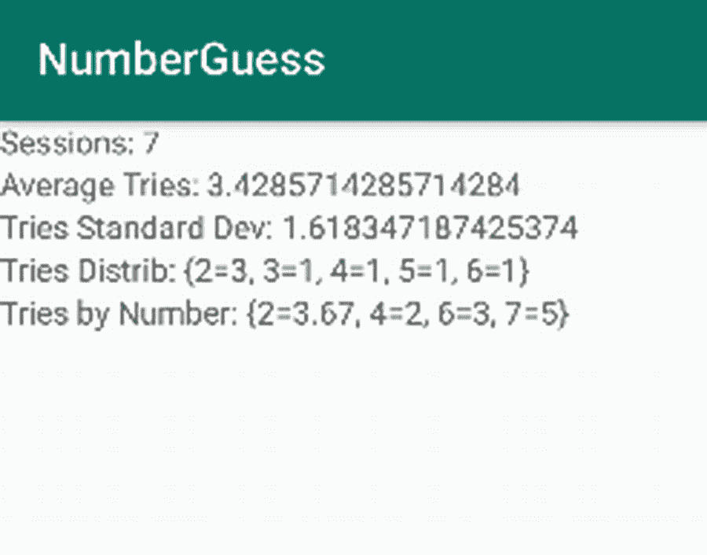

# 九、数据容器

自然和人类文明都是关于收藏的。家庭收集亲戚，城市收集一起行动的人，房子收集人和他们的财产，数学集合论使用关系公式的集合，星系收集恒星，原子收集基本粒子，等等。因此，毫不奇怪，旨在模拟现实世界场景的计算机语言也必须能够模拟集合。

在现实世界中，这不是一个很大的话题，但是计算机从一开始就在固定大小的集合和可变大小的集合之间画出了明显的区别。固定大小的集合更容易处理并表现出高性能，而可变大小的集合速度较慢，但表现出更大的灵活性，并且根据具体情况可以表现出更低的内存占用。各种与集合相关的任务都需要这两个选项，所以开发人员必须学会如何处理这两种情况。为了使区别更加清晰，固定大小的集合被称为*数组*，对于可变大小的集合，使用的术语是*集合*。

Kotlin 的内置库包含几个在数组和集合之间进行协调的函数，为了使开发人员的工作更轻松，Kotlin 还试图统一数组和集合的处理，因此两个世界之间的切换更容易实现。在接下来的部分中，我们首先讨论数组，因为它们最早出现在计算机语言的历史中，后来转到集合。

## 定义和使用数组

数组是固定大小的元素容器，元素可以是对象或原始数据类型。到目前为止，我们已经知道了很多关于对象的知识，但是我们还没有过多地讨论过原始数据类型。从 Kotlin 的观点来看，最好是完全没有这种区分，只处理对象而不处理其他。

那么为什么会有类似原始数据类型的东西，它们到底是什么，为什么我们需要使用它们？答案是原始数据类型在计算机硬件上有一个直接的表示。因此，在将对象放入数组之前，我们既不需要执行对象的实例化，也不需要使用某种引用将数组元素连接到实例(见图 [9-1](#Fig1) )。


图 9-1

原始数组与对象数组

*对象数组*通过字符串`Array`获取 Kotlin 中声明的类型，后跟尖括号中的元素类型:

```kt
Array<ElementType>

```

其中`ElementType`可以是任何类或接口。在 Kotlin 中，这些类型被视为普通类型，所以你可以让`var`和`val`使用它们

```kt
val someStringArray:Array<String> = ...
var someObjectArray:Array<Any> = ...

```

### 注意

位于 Kotlin 类型层次结构的最顶端，任何对象都隐式地自动继承它。因此，任何对象，不管你如何声明它，自动也是一个`Any`的实例。

尖括号声明了一个*泛型*类型。我们将在本书的后面讨论泛型。

*原始元素数组*存在于以下元素类型:`Boolean`、`Byte`、`Char`、`Double`、`Float`、`Int`、`Long`和`Short`。对于相应的数组类型，使用其中任何一种并添加`Array`，如

```kt
val byteArr:ByteArray = ...
var intArr:IntArray = ...
...

```

要访问数组元素，使用`array[index]`，其中`index`的范围从`0`到数组长度减一。长度本身由属性`size`给出，最后一个索引由属性`lastIndex`给出。可以像在`val elem1 = array[0]`中一样读取数组元素，像在`array[77] = ...`中一样写入数组元素。如果在访问数组元素时，您试图寻址一个超出界限的元素，您的应用将会崩溃，因此您必须采取预防措施，以确保不超过索引限制。

## 数组实例化

现在我们知道了如何声明数组，我们需要知道如何创建或实例化它们。这是`val arr:IntArray = ...`的右边，一模一样。

首先，我们可以使用 Kotlin 为数组提供的构造函数。对于具有对象元素类型的数组和专用的基本元素数组来说都是如此。第一组构造函数允许用指定数量的元素实例化原始元素数组(例如，我们给它们的大小都是 7):

```kt
val byteArr:ByteArray = ByteArray(7)
val shortArr:ShortArray = ShortArray(7)
val intArr:IntArray = IntArray(7)
val longArr:LongArray = LongArray(7)
val doubleArr:DoubleArray = DoubleArray(7)
val floatArr:FloatArray = FloatArray(7)
val booleanArr:BooleanArray = BooleanArray(7)

```

这些数组的元素都用缺省值`0`初始化为数字类型，用缺省值`false`初始化为布尔数组。

一组不同的构造函数允许我们设置单独的数组成员。您所要做的就是将一个函数作为第二个参数添加到任何一个构造函数中。但是，函数怎么可能是构造函数的参数呢？这是 Kotlin 和其他计算机语言必须提供的特性之一:将函数视为可以在函数调用中传递的对象，甚至让属性指向它们。我们将在第 [12](12.html) 章中详细介绍这些方面。我们目前需要的是一个没有函数名的所谓的*λ函数*。这样的 lambda 函数看起来像这样:

```kt
{ i ->
    [ program code ]
    [ expression ]
}

```

其中`i`是设置为数组内部索引的参数。使用`i`只是一个例子；你可以选择一个不同的名字，比如`ind`、`index`，或者任何你喜欢的名字。最后一行`[expression]`必须计算为数组元素声明的类型的值。但是，在最后一个表达式语句之前，你要做什么取决于你自己。因为`[program code]`你可以写任何东西，包括使用索引参数。比方说，我们想要创建一个大小为 10 的`IntArray`，数组元素包含平方索引，从 1 开始计数:`1, 2, 4, 9, 16, ...`。这里我们不需要一个`[program code]`，但是`[expression]`将会是`(i + 1)`∫`(i + 1)`(记住`i`是一个从`0`开始的索引)。lambda 函数然后读取

```kt
{ i -> (i+1) * (i+1) }

```

完整的数组声明和初始化是

```kt
val arr = IntArray(10, { i -> (i+1) * (i+1) })

```

添加了初始化函数后，我们现在还可以使用构造函数来生成对象数组，如

```kt
val objArr:Array<SomeType> =
      Array<SomeType>(7, { i -> ... })

```

在这里你用一个现有的类来代替`SomeType`。

### 练习 1

用元素`100, 99, 98, ..., 0`定义并初始化一个`IntArray`。把它分配给一个`val arr`。

如果我们有一组已知的初始成员值，有一种不同的方法来初始化数组。例如，如果我们手头有五个年龄分别为`26`、`56`、`12`、`17`和`26`的人，并且想要将他们放入`IntArray`中，那么就没有一种优雅的方式来使用构造函数来实现这个目的。当然，我们可以写

```kt
val ages = IntArray(5)
ages[0] = 26
ages[1] = 56
ages[2] = 12
ages[3] = 17
ages[4] = 26

```

但这看起来相当冗长。Kotlin 帮助我们用更简短的形式来写。在它的*标准库*中，它包含了几个函数来创建给定元素值的数组。对于`IntArray` s，这个函数读为`intArrayOf(...)`,因为它允许我们写任意数量的参数

```kt
val ages = intArrayOf(26, 56, 12, 17, 26)

```

看起来简洁多了。所有数组类型都有相应命名的数组初始化函数，您可以在代码中的任何地方使用它们:`intArrayOf()`、`longArrayOf()`、`doubleArrayOf()`等等。

还有两个特殊的数组创建函数。第一个创建了一个`null`对象引用的数组，您编写

```kt
val size = ...
val arr:Array<ElementType?> = arrayOfNulls(size)

```

使用它(用您需要的实际元素类替换`ElementType`)。另一个创建对象引用的空数组:

```kt
val arr:Array<ElementType?> = emptyArray()

```

最后但同样重要的是，像集合和列表(我们将在后面描述)这样的集合可以转换成数组:

*   `coll.toTypedArray(): Array<ElementType>`

    这会将元素类型为`ElementType`的集合转换为对象数组。它从不返回原始元素数组。

*   `coll.toXXXArray(): XXXArray`

    这将元素类型为`XXX`(`Int`、`Long`、`Byte`、`Short`、`Double`、`Float`、`Boolean`或`Char`中的一种)的集合转换为相应的原始元素数组。

### 练习 2

用值`true`、`false`、`true`创建一个`BooleanArray`。

## 数组运算

除了访问元素，数组还允许对它们应用一些操作(`E`是元素类型):

*   `first(): E`

    这是数组的第一个元素。

*   `last(): E`

    这是数组的最后一个元素。

*   `copyOf(): Array<E>`

    对于对象数组，这将创建数组的副本。这是一个浅层副本，意味着该副本将包含与原始数组相同的对象引用。

*   `copyOf(): XXXArray`

    对于原始元素类型`XXX`(`Int`、`Long`、`Byte`、`Double`、`Float`、`Boolean`或`Char`中的一种)，创建数组的副本。

*   `fill(element:E>)`

    这将所有数组元素设置为给定的`element`。

*   `sliceArray(indices:IntRange)`

    这将从原始数组的一部分创建一个新数组。可以输入一个`IntRange`(例如`1..100)`)。指数通常是从零开始的。

*   `contains(element:E): Boolean`

    这将检查指定的元素是否包含在数组中。

*   `all(predicate: (E) -> Boolean): Boolean`

    如果所有元素都满足谓词，则返回`true`。谓词是一个接受每个元素并执行检查的函数；比如`{ element -> ... [boolean expression] }`。

*   `any(predicate: (E) -> Boolean): Boolean`

    如果满足任何元素的谓词，则返回`true`。谓词是一个接受每个元素并执行检查的函数，例如`{ element -> ... [boolean expression] }`。

这个列表并不详尽。有关更多功能，请参考在线 API 文档。

### 注意

截至本文撰写之时，Kotlin 的 API 文档可以在 [`https://kotlinlang.org/api/latest/jvm/stdlib/index.html`](https://kotlinlang.org/api/latest/jvm/stdlib/index.html) `.`找到，如果这个链接过期了，你可以通过在你喜欢的搜索引擎中搜索“kotlin stdlib api 文档”轻松找到该文档。

Android Studio 在查找对象属性和功能方面帮助很大。只需输入对象的名称，一个点，如有必要，按 Alt+Enter。Android Studio 随后会显示一个包含所有属性和功能的列表，您可以使用光标上下键浏览该列表(参见图 [9-2](#Fig2) )。你甚至可以去找资料来源；将光标放在类名上，然后按 Ctrl+B。


图 9-2

自动化 API 文档

## 集合、列表和地图

如果您需要许多元素的数据容器，并且不知道或不想指定大小，那么可以使用集合。我们基本上有三种系列:

*   *集合:*集合是唯一元素的集合。它们包含任意数量的元素，但不允许重复。所以[ `1`、`27`、`3`是一个集合，而[ `5`、`1`、`5`不是。还有，集合没有顺序，所以[ `1`、`3`、`5` ]和[ `1`、`5`、`3` ]是同一个集合。

*   *列表:*列表是元素的有序集合，其中允许重复。所以[ `1`、`2`、`3`、`1`和[ `1`、`1`、`2`、`3`都是列表，但又不一样。

*   *映射:*映射是对[A，B]的无序集合，其中对成员之间存在映射关系:A → B，其背后的思想是，如果你有一个映射 A1 → B1，A2 → B2，A3 → B3，给定任意一个 A，你可以用映射函数或算子确定对应的 B。对[A，B]通常被称为*键/值对*，其中 A 是键，B 是值。在 Kotlin 的习惯用法中，如果`m`是地图，属性`a`包含一个键，那么`m[a]`和`m.get(a)`都可以用来检索相应的值。

与数组相反，集合总是存在两种变体:集合可以是*可变的*(可变的)或*不可变的*(不可变的)。不仅有(不可变的)集合、列表和映射，还有可变集合、可变列表和可变映射。说到班级，我们有以下内容:

```kt
Set<MemberType>
List<MemberType>
Map<KeyType, ValueType>

MutableSet<MemberType>
MutableList<MemberType>
MutableMap<KeyType, ValueType>

```

### 设置

要创建集合，您可以使用以下构造函数或库函数之一:

```kt
val set1:Set<String> = HashSet()
val set2:MutableSet<String> = HashSet()

val set3 = setOf(4, 7, 55)
val set4 = setOf<Long>(4, 7, 55)
val set5 = mutableSetOf(4, 7, 55)

```

看着这些代码，我们需要解释一些事情。

*   `Set`不是类，是接口。对于实例化，我们需要一个实现。您在这里看到的`HashSet`是一个标准实现，经常用于集合。

*   `HashSet`可用于可变和不可变集合。我们必须在属性声明中显式声明变量。参见示例中的`set1`和`set2`。

*   `setOf()`和`mutableSetOf()`试图从它们的参数中推断元素类型。如果不清楚或者需要进行转换，类型必须在尖括号内显式声明，例如示例中的`set4`。

就像其他集合类型一样，`Set`和`MutableSet`类包含大量的属性和函数。把它们都列在这里会增加这本书的篇幅。相反，我提出了最常用的；对于所有其他内容，请参考在线 API 文档。

### 注意

在撰写本文时，Kotlin 的 API 文档可以在 [`https://kotlinlang.org/api/latest/jvm/stdlib/index.html`](https://kotlinlang.org/api/latest/jvm/stdlib/index.html) `. If`找到。该链接已经过时，您可以在您喜欢的搜索引擎中搜索“kotlin stdlib api 文档”来轻松找到该文档。

至于数组，你可以让 Android Studio 向你展示一个对象的所有属性和功能。输入对象的名称，一个点，如有必要，按 Alt+Enter(回头参考图 [9-2](#Fig2) )。要查看源代码，请将光标放在类名上，然后按 Ctrl+B。

这里给出了`Set`和`MutableSet`接口最常用的属性和功能。我从基本属性和功能开始。

*   `size`

    这表示集合的大小。

*   `add(element:E): Boolean`

    (`MutableSet` only)添加元素。如果元素真的被添加了(它以前不存在)，那么返回`true`。

*   `addAll(elements:Collection<E>): Boolean`

    这增加了许多元素。一个`Collection`是另一个集合或者一个列表。如果集合由于该操作而被修改，它将返回`true`。

*   `addAll(elements:Array<out E>): Boolean`

    (`MutableSet` only)这将添加指定数组中的所有元素。数组类型参数中的`out`允许我们添加包含元素的数组，这些元素也是集合所需类型的子类。如果集合由于该操作而被修改，它将返回`true`。

*   `intersect(other:Iterable<E>): Set<T>`

    这将返回包含在这个集合和指定的`Iterable`中的一组元素。集合和列表也是可迭代的。

下一组属性和函数是用来处理空集的。

*   `clear()`

    (`MutableSet` only)这将删除所有元素。

*   `isEmpty(): Boolean`

    如果集合为空，则返回`true`。

*   `isNotEmpty(): Boolean`

    如果集合不为空，则返回`true`。

下列属性和函数用于检查。

*   `contains(element:E): Boolean`

这将检查指定的元素是否包含在集合中。

*   `containsAll(elements:Collection<E>): Boolean`

    这将检查所有指定的元素是否都包含在集合中。

对于完整集合上的操作，请使用下列属性和函数。

*   `toMutableSet(): MutableSet<E>`

    (仅非`MutableSet`)这将基于不可变集合中的元素返回一个新的可变集合。

*   `map(transform: (E) -> R): List<R>`

    这将对集合中的每个元素应用映射函数，并从中返回一个列表。例如，给定一组名字，转换函数`{ s -> s + " (${s.length})" }`返回一个附加了名字长度的名字列表。

使用下列属性和函数删除元素。

*   `remove(element:E): Boolean`

    (`MutableSet` only)如果集合中存在指定的元素，则删除该元素。如果元素存在并被移除，它将返回`true`。

*   `removeAll(elements:Collection<E>): Boolean`

    (`MutableSet` only)这将删除集合中存在的所有指定元素。一个`Collection`是另一个集合或者一个列表。如果至少删除了一个元素，它将返回`true`。

*   `removeAll(elements:Array<E>): Boolean`

    (`MutableSet` only)这将删除集合中存在的所有指定元素。如果至少删除了一个元素，它将返回`true`。

*   `retainAll(elements:Collection<E>): Boolean`

    (`MutableSet` only)这将删除不在指定元素内的所有元素。一个`Collection`是另一个集合或者一个列表。如果至少删除了一个元素，它将返回`true`。

*   `retainAll(elements:Array<E>): Boolean`

    (`MutableSet` only)这将删除不在指定数组中的所有元素。如果至少删除了一个元素，它将返回`true`。

要检查谓词，请使用这些属性和函数。

*   `all(predicate: (E) -> Boolean): Boolean`

    如果所有元素都满足谓词，则返回`true`。谓词是一个接受每个元素并执行检查的函数；比如`{ element -> ... [boolean expression] }`。

*   `any(predicate: (E) -> Boolean): Boolean`

    如果满足任何元素的谓词，则返回`true`。谓词是一个接受每个元素并执行检查的函数；比如`{ element -> ... [boolean expression] }`。

*   `filter(predicate: (E) -> Boolean): List<E>`

    这将返回谓词为其返回`true`的集合中的所有元素。谓词是一个接受每个元素并执行检查的函数；比如`{ element -> ... [boolean expression] }`。

最后一项用于循环。

*   `forEach(action: (E) -> Unit)`

    这在集合中循环。循环将在本章后面讨论。

由于多了几个扩展函数，`+`和`-`操作符得到了支持，可以用来添加或删除元素或其他集合:

```kt
setOf(1, 2, 3) + setOf(2, 3, 4) // -> [1, 2, 3, 4]
setOf(1, 2, 3, 4) + 5           // -> [1, 2, 3, 4, 5]
setOf(1, 2, 3) - setOf(3, 4)    // -> [1, 2]
setOf(1, 2, 3) – 2              // -> [1, 3]

```

### 练习 3

用元素`Apple`、`Banana`、`Grape`和`Engine`创建一个可变集合`val fruits`。在单独的语句中，将`Cherry`添加到集合中。换句话说，从器械包中移除`Engine`。从这个集合中创建一个新的集合`val fruits5`，作为过滤具有五个字符的元素的结果。注意:您可以通过寻址它的`length`属性来获得一个字符串的长度。

### 列表

列表类似于集合，但它们不要求唯一性，因此元素可能会出现多次。此外，列表有一个顺序。

为了创建一个列表，我们再次使用了 Kotlin 标准库中的列表实现构造函数和函数。

```kt
val list1:List<Int> = ArrayList()
val list2:MutableList<Int> = ArrayList()

val list3 = listOf(4, 7, 55)
val list4 = listOf<Long>(4, 7, 55)
val list5 = mutableListOf(4, 7, 55)

```

我们前面提到的例子或多或少也适用于列表:

*   `List`是一个接口。我们在这里使用的实现`ArrayList`，是一个经常使用的选择。

*   `ArrayList`可用于可变和不可变列表。我们必须在属性声明中显式声明变量。参见示例中的`list1`和`list2`。

*   `listOf()`和`mutableListOf()`试图从它们的参数中推断元素类型。如果不清楚或者需要进行转换，类型必须在尖括号内显式声明，例如示例中的`list4`。

作为一种额外的方法，通过使用数组的`toList()`或`toMutableList()`函数，可以很容易地将数组转换成列表:

```kt
val array = arrayOf(...)
val list = array.toList()

```

由于它们的性质，列表和集合共享许多属性和方法，因此下面的列表包括了集合可能使用的方法。同样，该列表并不详尽，因此请参考在线文档以了解更多详细信息。

### 注意

这种共性不仅仅是巧合。事实上，`Set`和`List`都在扩展`Collection`接口。你会看到`Collection`接口偶尔被用于某些任务，但是通常`Set`和`List`之间的概念差异值得保留，所以 set 和 list 接口被更频繁地使用。

首先，这里有一些基本的属性和功能。

*   `size`

    这表示列表的大小。

*   `lastIndex`

    是列表的大小减去`1`。

*   `add(element:E): Boolean`

    (`MutableList` only)这在末尾添加了一个元素。如果确实添加了元素，它将返回`true`。因为这种情况总是会发生，函数总是会返回`true`。

*   `addAll(elements:Collection<E>): Boolean`

    这增加了许多元素。一个`Collection`是另一个列表或集合。如果该操作导致列表被修改，它将返回`true`。除非所提供的参数属于空集合，否则该函数将始终返回`true.`

*   `addAll(elements:Array<out E>): Boolean`

    (`MutableList` only)这将添加指定数组中的所有元素。数组类型参数中的`out`允许我们添加包含元素的数组，这些元素也是列表所需类型的子类。如果该操作导致列表被修改，它将返回`true`。除非所提供的参数属于空数组，否则该函数将始终返回`true.`

*   `get(index:Int): E`

    这会从列表中检索一个元素。该指数从零开始。它映射到`[ ]`操作符，因此您可以使用`list[index]`来获得相同的结果。

*   `set(index:Int, element:E): E`

    (`MutableList` only)这将在列表中设置一个元素。该指数从零开始。它映射到了`[ ]`操作符，所以您可以使用`list[index] = ...`来获得相同的结果。

下一组属性和函数用于处理空列表。

*   `clear()`

    (`MutableList` only)这将删除所有元素。

*   `isEmpty(): Boolean`

    如果列表为空，则返回`true`。

*   `isNotEmpty(): Boolean`

    如果列表不为空，则返回`true`。

下列属性和函数用于检查包含性。

*   `contains(element:E): Boolean`

    这将检查指定的元素是否包含在列表中。

*   `containsAll(elements:Collection<E>): Boolean`

    这将检查所有指定的元素是否都包含在列表中。

*   `indexOf(element:E): Int`

    这将检索列表中指定元素的索引，如果没有找到，则为-`1`。该指数从零开始。

*   `lastIndexOf(element:E): Int`

    这将检索列表中指定元素的最后一个索引，如果没有找到，则为-`1`。该指数从零开始。

对于完整列表上的操作，请使用下列属性和函数。

*   `toMutableList(): MutableList<E>`

    (仅非`MutableList`)这将基于不可变列表中的元素返回一个新的可变列表。

*   `subList(fromIndex:Int, toIndex:Int): List<E>`

    这将返回从索引`fromIndex`开始直到(不包括)`toIndex`的列表视图。该视图意味着，如果您更改返回列表中的元素，原始列表中也会发生更改。

*   `asReversed(): List<E>`

    这会以相反的顺序返回列表的只读视图。原始列表中的任何更改也会反映在反转列表中。

*   `distinct(): List<E>`

    这将返回一个删除了重复项的新列表。

*   `shuffled(): List<E>`

    这将返回一个新的列表，其中的元素来自原始列表。

*   `map(transform: (E) -> R): List<R>`

    这将在列表的每个元素上应用一个映射函数，并从中返回一个新列表。例如，给定一个姓名列表，转换函数`{ s -> s.length }`将从中返回一个姓名长度列表。

使用下列属性和函数删除元素。

*   `remove(element:E): Boolean`

    (`MutableList` only)如果列表中存在指定的元素，则删除该元素。如果元素存在并被移除，它将返回`true`。

*   `removeAt(index:Int): E`

    (`MutableList` only)这将删除指定索引处的元素(从零开始)并返回删除的元素。

*   `removeAll(elements:Collection<E>): Boolean`

    (`MutableList` only)这将删除列表中存在的所有指定元素。一个`Collection`是另一个列表或集合。如果至少删除了一个元素，它将返回`true`。

*   `removeAll(elements:Array<E>): Boolean`

    (`MutableList` only)这将删除列表中存在的所有指定元素。如果至少删除了一个元素，它将返回`true`。

*   `retainAll(elements:Collection<E>): Boolean`

    (`MutableList` only)这将删除不在指定元素内的所有元素。一个`Collection`是另一个列表或集合。如果至少删除了一个元素，它将返回`true`。

*   `retainAll(elements:Array<E>): Boolean`

    (`MutableList` only)这将删除不在指定数组中的所有元素。如果至少删除了一个元素，它将返回`true`。

使用下列属性和函数获取列表的一部分。

*   `drop(n:Int): List<E>`

    这将返回一个新列表，其中的`n`元素已从开头删除。

*   `dropLast(n:Int): List<E>`

    这将返回一个新列表，从末尾删除了`n`元素。

*   `first(): E`

    这将返回第一个元素。

*   `take(n:Int): List<E>`

    这将返回一个新列表，其中包含原始列表的前`n`个元素。

*   `first(predicate: (E) -> Boolean): E`

    这将返回匹配谓词的第一个元素。谓词是一个接受每个元素并执行检查的函数；例如，`{ element -> ... [boolean expression] }.`

*   `last(): E`

    这将返回最后一个元素。

*   `takeLast(n:Int): List<E>`

    这将返回一个新列表，其中包含原始列表的最后`n`个元素。

*   `last(predicate: (E) -> Boolean): E`

    这将返回与谓词匹配的最后一个元素。谓词是一个接受每个元素并执行检查的函数；比如`{ element -> ... [boolean expression] }`。

要检查谓词，请使用这些属性和函数。

*   `all(predicate: (E) -> Boolean): Boolean`

    如果所有元素都满足谓词，则返回`true`。谓词是一个接受每个元素并执行检查的函数；比如`{ element -> ... [boolean expression] }`。

*   `any(predicate: (E) -> Boolean): Boolean`

    如果满足任何元素的谓词，则返回`true`。谓词是一个接受每个元素并执行检查的函数；比如`{ element -> ... [boolean expression] }`。

*   `filter(predicate: (E) -> Boolean): List<E>`

    这将返回列表中谓词返回`true`的所有元素。谓词是一个接受每个元素并执行检查的函数；比如`{ element -> ... [boolean expression] }`。

这些项目用于循环。

*   `forEach(action: (E) -> Unit)`

    该方法遍历列表。

*   `forEachIndexed(action: (index:Int,E) -> Unit)`

    这个方法也遍历列表。

由于有几个额外的函数，列表理解`+`操作符，所以可以使用`+`添加元素或集合(其他列表或集合)。

```kt
listOf(1, 2, 3) + listOf(2, 3)    // -> [1, 2, 3, 2, 3]
listOf(1, 2, 3, 4) + 5            // -> [1, 2, 3, 4, 5]

```

可以使用`toArray()`、`toIntArray()`、`toDoubleArray()`等将列表转换为数组。只有当元素具有正确的类型时，转换为基元类型数组才会成功。

### 地图

在 Kotlin 中，地图可能是最有趣的，但也是集合框架中涉及最多的部分。每当需要数学意义上的映射时，就会用到映射，这意味着集合 A = {a0，a1，a2，...}映射到集合 B = {b0，b1，b2，...}.因此，每当你有一个 a *i* 时，你可以立即从中确定(唯一的)映射 b *j* 。在计算机语言中，你映射的数据通常被称为*键*，你映射到的值被命名为*值*。

在自然和文化中，地图无处不在:地球上的一对地理坐标映射到一个高度，1 月 23 日的每一秒映射到纽约的气温，每个社会安全号码映射到一个名字，时间映射到地球在其轨道上的位置，温度映射到水的聚集状态(固体、液体、气体)，乐器演奏的音符映射到一个频率，数组中元素的索引映射到某个值，等等。

类似于集合和列表，我们再次区分了可变(可改变的)和不可变(不可改变的)映射。

在下面的代码片段中，我们将使用下面的地图:`SSN` → `name`(所有数字都是虚构的):

```kt
152835937 -> Albert Einstein
273495357 -> John Smith
346068589 -> John Smith
484767775 -> Barbra Streisand

```

要声明映射，可以使用`Map`或`MutableMap`作为类型，并在其后的尖括号中添加键和值类型。

```kt
val map1:Map<String,Int> = ...
var map2:Map<Int,Double> = ...
val map3:MutableMap<Int,String> = ...

```

为了创建地图，我们首先可以选择使用一个构造函数:

```kt
val map: MutableMap<Int,String> =
      HashMap<Int,String>().apply {
        this[152835937] = "Albert Einstein"
        this[273495357] = "John Smith"
        this[346068589] = "John Smith"
        this[484767775] = "Barbra Streisand"
      }

```

其中`HashMap`是最常用的实现之一。`apply{...}`是新的。实际上，您可以在任何情况下使用它，但是在这里它的意思是:使用我们刚刚创建的地图并对它做一些事情。`this`指的是正在创建的地图实例，而不是我们当前所在的类实例或对象。我们在这里使用`apply{ ... }`来添加一些键/值对。

接下来是 Kotlin 标准库函数，帮助我们创建和初始化地图:

```kt
val map = mutableMapOf(
        152835937 to "Albert Einstein",
        273495357 to "John Smith",
        346068589 to "John Smith",
        484767775 to "Barbra Streisand"
    )
val map2 = mapOf(
    152835937 to "Albert Einstein",
    ... )

```

### 注意

前面初始化器中的`to`实例实际上是创建内置`Pair`类实例的操作符。如果需要，您可以使用您自己的`Pair`的显式实例，比如在`val p1 = Pair(152835937, "Albert Einstein")`和`mapOf(p1, ...)`中。

映射也是列表、集合和数组的一些操作的结果。对于后三种类型中的任何一种，您都可以使用其中的一种(`T`是元素类型):

*   `associate(transform: (T) -> Pair<K, V>): Map<K,V>`

    这将创建一个键类型为`K`而值类型为`V`的映射。假定给定原始集合、列表或数组的每个元素，transform 函数将创建一个`Pair<K,V>`。例如，给定一组整数(T = `Int`)，这样的转换函数可以读作`{ i -> Pair(i, i*i) },`，创建一个将整数映射到它们的平方的映射。

*   `associateWith(ValueSelector: (K) -> V): Map<K,V>`

    这与`associate()`非常相似，但是作为快捷方式总是将原始元素作为键。`valueSelector`应该生成这个值。例如，给定一组整数，lambda 函数`{ i -> i * i }`再次将整数映射到它们的平方。

*   `associateBy(keySelector: (T) -> K): Map<K,V>`

    这与`associate()`非常相似，但是作为快捷方式总是将原始元素作为值。`keySelector`应该生成密钥。比如给定一组双精度数，lambda 函数`{ d` - > Math.floor(d)。toInt() }使用等于或小于给定双精度值的整数作为键。

*   `groupBy(keySelector: (T) -> K): Map<K, List<T>>`

    这将从原始集合或数组中收集元素，并将它们保存在结果映射中生成的键下。比方说，你有几个名字——约翰、亚当、乔和加布里埃尔——并应用`keySelector { s -> s.length }`。然后，生成的映射将姓名长度映射到姓名:`3` → [“乔”]、`4` → [“约翰”、“亚当”]，以及`7` → [“加百列”]。

注意，如果可能的话，你应该选择`associateWith()`和`associateBy()`而不是`associate()`，因为后者意味着一个对象的创建，这总是需要一些时间。

## 成对和三对

另外两种类型的数据容器是 pairs 和 triples。我们已经看到了第一个，由`Pair`类表示，用于映射目的。三元组使用类`Triple`并且只包含三个成员。当然，你可以用这两者来完成你喜欢的任何任务。声明和初始化是

```kt
val pair = Pair<FirstType, SecondType>(
      firstVal, secondVal)
val triple = Triple<FirstType, SecondType, ThirdType>(
      firstVal, secondVal, thirdVal)

```

通常，如果类型说明`< ... >`可以通过值的类型来推断，那么它可以被省略。例如，你可以写

```kt
val pair = Pair("Earth", 12800.0)

```

去弄一对`String`和`Double`。

要获取对的第一个和第二个组件，只需使用属性`first`和`second`，就像在`pair.first`和`pair.second`中一样。因此，三元组的组件可通过属性`first`、`second`和`third`访问。

## 数据容器上的循环

对数据容器进行循环意味着访问它们的每个成员来对其执行一些操作。如果您想打印、转换或聚合数据容器以推断一些容器特征，这是数据容器的一个重要用例。考虑求和、串联或平均。

在过去，计算机语言提供了某种环绕索引变量的循环结构，事实上 Kotlin 也可以做到这一点。我们在本书的前面已经讨论过这种老式的循环，但是让我在这里向您展示一种更优雅和简单的方法来循环 Kotlin 中的容器。

所有集合类型的数据容器，如数组、集合和列表，都提供了一个`forEach()`函数，您可以简单地使用它来满足循环需求。更准确地说，写

```kt
val container = ... // array or set or list
container.forEach { elem ->
    // do something with elem
}

```

如果它看起来像一个带有块的语句，为什么我们称它为函数呢？这或多或少是一种巧合；这个例子也可以写成`container.forEach({ ... })`，Kotlin 编译器允许去掉多余的圆括号。实际上，`{ ... }`不是一个语句块，而是一个函数文字，也称为 *lambda 函数*。`elem`只是一个标识符；你也可以使用`e`或`element`或任何你喜欢的名字。在任何情况下，它获取数组或集合中当前访问过的元素，并自动拥有与其相同的类型。例如，在

```kt
val container = listOf(1, 2, 3, 4, -1)
container.forEach { elem ->
    Log.d("LOG", elem.toString())
}

```

`elem`一个接一个地获取整数 1，2，3，4，-1，`elem`自动拥有类型`Int`，因为容器是一个`Int`元素的列表。

### 注意

事实上，如果有助于提高代码的可读性，你可以像在`forEach { elem:Int -> ... }`中一样在这里添加`:Int`。

如果您需要函数内部的迭代索引，您可能会想写

```kt
var index = 0
container.forEach { elem ->
    // ... do s.th. with elem
    index++ // NOT ALLOWED!
}

```

每次迭代递增`index`变量。然而，这是行不通的。不允许重新分配“外部”变量是对*内部*函数的限制。如果你需要一个索引，你可以使用`forEach()`的变体，读作`forEachIndexed()`。这一次，内部函数接收两个参数，即`Int`类型索引和元素变量:

```kt
container.forEachIndexed { index, elem ->
    // ... do s.th. with elem
}

```

`index`变量获取值 0、1、2、...并且总是有类型`Int`。同样，您可以随意更改索引变量的名称。

遍历地图的方式不同，但也不复杂。地图也有一个`forEach()`函数，但是参数类型不同。

*   如果像在`map.forEach { me -> ...}`中一样使用单个参数，该参数将是类型`Map.Entry<K,V>`，其中`K`是键类型，`V`是值类型。然后从`me`通过`me.key`得到密钥，通过`me.value`得到值。你也可以写`me.toPair()`来构建一个`Pair`。

*   (仅适用于 Android API 级别 24 或更高)如果使用两个参数，他们将在每次迭代中收到密钥和值:`map.forEach` { k，v - >...}.

## 排序数组和集合

在将数据呈现给应用用户之前，对数组和集合(如列表和集合)进行排序是一项经常需要完成的任务。此外，在开始二分搜索法算法之前，必须进行排序，我们将在本章后面的“在数组和集合中搜索”一节中讨论该算法。

排序可以就地进行，这意味着您要排序的数组或集合发生了变化，或者以函数方式进行，这意味着操作的结果是排序后的数组或集合，而原始数据容器保持不变。就地排序将是更快的选择，但是如果其他程序部分持有对原始数组或集合的引用，则会有被破坏的风险。函数排序可以提高程序的稳定性，但是可能会有一些性能损失，所以要明智地选择。

对于原始数组或集合不变的函数式排序，您有几个选项(`T`是元素类型)。

*   `Array.sorted() : List<T>`

    这将返回一个`List`，数组中的元素根据它们的*自然*排序顺序进行排序。类型`T`必须是`Comparable,`的子接口，这是所有内置数值类型和字符串的情况。作为数组，您可以使用一个对象数组或任何原始元素类型数组(`IntArray`、`DoubleArray`等)。).

*   `Array.sortedArray() : Array<T>`

    这与`Array.sorted()`相同，但是返回一个数组。Kotlin 总是返回一个对象数组，而不是一个原始类型的数组。因此，`arrayOf(1,2,3).sorted()`返回一个`Array<Int>`，而不是一个`IntArray`。但是，您可以添加方法`toIntArray()`来将`Int`对象数组转换为`IntArray`。这同样适用于其他基本元素类型对象。

*   `Collection.sorted() : List<T>`

    这与`Array.sorted()`相同，但适用于集合和列表。

您可以给它们中的任何一个添加一个`Descending`来颠倒排序顺序。

一些额外的方法允许您显式地指定元素排序的比较操作。

*   `Array.sortedBy(selector: (T) -> R?) : List<T>`

    这将根据选择器函数返回值的自然排序顺序创建一个排序列表。类型`R`必须实现`Comparable`接口。比方说，你想通过`make`对一个`data class Car(val make:Int, val name:String)`的数组进行排序。然后你可以写`array.sortedBy({ car -> car.make }).`

*   `Collection.sortedBy(selector: (T) -> R?) : List<T>`

    这与前面显示的`Array.sortedBy()`相同，但适用于集合和列表。

*   `Array.sortedWith(comparator: Comparator<in T>) : List<T>`

    这将根据提供的比较器创建一个排序列表。您可以提供一个`Comparator`的子类实现，但是 Kotlin 标准库也提供了几个`Comparator`生成器函数。类型说明符中的`in`表明比较器处理一个`T`的超类就足够了。

*   `Array.sortedArrayWith(comparator: Comparator<in T>) : Array<T>`

    这与前面显示的`Array.sortedWith()`相同，但是返回一个数组。

*   `Collection.sortedWith(comparator: Comparator<in T>) : List<T>`

    这与前面显示的`Array.sortedWith()`相同，但适用于集合和列表。

你可以给它们中的大多数加一个`Descending`来颠倒排序顺序(没有`sortedWithDescending()`也没有`sortedArrayWithDescending()`)。

对于任何`sortedWith()`函数中需要的比较器，Kotlin 提供了标准库函数，您可以使用它们来创建这样的比较器。

*   `compareBy(vararg selectors: (T) -> Comparable<*>?): Comparator<T>`

    和

*   `compareByDescending( vararg selectors: (T) -> Comparable<*>?): Comparator<T>`

    这是您可能希望在`sortedWith()`中显示的一个重要功能。它需要任意数量的函数来评估一个`Comparable`。这些函数以连续的顺序工作。第一次`Comparable`比较没有导致*等于*，将会中断链，并继续排序算法中的下一次迭代。作为函数元素，您可以编写一个 lambda 函数，如

    `{elem -> elem.someProperty}`

    如果这个属性是一个类似于`Int`或`String`的`Comparable`，但是你也可以通过写`T::propertyName`来直接引用属性 getters。举个例子:举一个清单

    `data class Car(val make:Int, val name:String)`

    并考虑按品牌进行比较。使用`sortedWith()`进行排序，然后读取

    `list.sortWith( compareBy( Car::make ) )`。

*   `compareBy(comparator: Comparator<in K>, selector: (T) -> K): Comparator<T>`

    和

*   `compareByDescending(comparator: Comparator<in K>, selector: (T) -> K): Comparator<T>`

    这将创建一个比较器，它首先将选择器应用于输入数据，然后将提供的比较器应用于选择器的结果。

*   `nullsFirst(): Comparator<T>`

    使用它作为`compareBy()`的第一个参数来扩展自然顺序比较器，该比较器隐式地允许在排序的数组或集合中使用`null`值。这样的`null`值将首先出现在返回的列表中。`nullsFirst()`比较器只能在比较`Comparable`元素的环境中使用，如果使用`nullsFirst()`作为`compareBy()`中的第一个参数，就会自动出现这种情况。

*   `nullsLast(): Comparator<T>`

    这类似于`nullsFirst`，但是`null`值将显示在返回列表的最后。

*   `reverseOrder(): Comparator<T>`

    使用它作为`compareBy()`的第一个参数来反转这里隐式使用的自然顺序比较器的顺序。可以与其他比较器扩展器混合，例如在`nullsFirst( reverseOrder() ).`中

*   `then`

    使用它作为中缀运算符来链接比较器。例如，你可以在`sortWith().`里面写`compareBy(...) then compareBy(...)`

### 练习

使用`sortWith()`，对来自`NumberGuess`游戏应用的`GameUser`实例列表`val gul = listOf(...)`进行排序，首先按姓氏排序，然后按名字排序。将结果分配给`val sorted`。

就地排序不同于迄今为止处理的排序函数，因为原始数组或集合(列表或集合)被改变以包含排序后的数据。对于列表和集合，这显然只对可变变量有意义。这里给出了就地排序的函数。

*   `sort() and sortDescending()`

    这将根据元素的自然排序顺序对数组或可变集合进行就地排序。元素必须实现`Comparable`接口才能工作。

*   `sortBy(selector: (T) -> R?)`和`sortByDescending(selector: (T) -> R?)`

    这将根据所提供的选择器函数对数组或可变集合进行排序，该函数必须返回一个`Comparable`。

*   `sortWith(comparator: Comparator<in T>)`

    这将根据提供的比较器对数组或可变集合进行就地排序。比较器类型规范中的`in`意味着比较器必须处理元素，但也可以处理元素类型的超类。对于`comparator`参数，可以使用与前面描述的函数式排序函数相同的 Kotlin 标准库函数。

### 注意

比起就地排序，您应该更喜欢函数式排序，除非性能或资源管理是一个重要的问题。

### 练习 5

执行与练习 4 相同的操作，但执行就地排序。

## 分组、折叠、缩小和压缩

分组、折叠、归约和压缩是对数组和集合(如列表和集合)的高级操作。我们依次讨论每一个问题。

### 分组

分组是指以这样一种方式重新组织数据，即根据从数据中推断出的或强加给数据的某个关键字来收集数据组。例如，看一组汽车:

```kt
data class Car(id:Int,make:Int,name:String,vin:String)
val cars = listOf(
    Car(1, 1994, "Sirus",       "WXX 130 007-1J-582943"),
    Car(2, 1997, "Sirus",       "WXX 130 008-1J-582957"),
    Car(3, 2010, "Casto 4.0",   "WXQ 456 088-4K-005614"),
    Car(4, 2010, "Babo MX",     "WYY 518 004-55-171598"),
    Car(5, 1994, "Casto 4.0",   "WXQ 456 005-4K-005658"),
    Car(6, 2011, "Quasto",      "WA0 100 036-00-012378")
)

```

如果我们想找出哪些汽车属于某一制造年份，该怎么办？如果查看 id，我们可以看到两辆车属于 1994 年，一辆属于 1997 年，两辆属于 2010 年，还有一辆属于 2011 年。：

```kt
1994 -> [ 1, 5 ]
1997 -> [ 2 ]
2010 -> [ 3, 4 ]
2011 -> [ 6 ]

```

这个操作叫做*分组*，在这个特例中，我们基于`make`分组。

在 Kotlin 中，我们有一个分组函数来帮助我们实现我们的目标:`groupBy( keysSelector: (T) -> K ): Map<K, List<T>>`其中`keySelector`应该推导出分组密钥。类型参数`T`是原始元素的类或其超类。Type `K`是分组键所需的任何类型。汽车示例的分组函数为:

```kt
data class Car(id:Int,make:Int,name:String,vin:String)
val cars = listOf( ... )
val groupedByMake = cars.groupBy(Car::make)
...
val group1997:List<Car> = groupedByMake[1997]

```

我们为 make: `Car::make`应用了 getter 函数。不太简洁，但结果相同，我们也可以用这个:

```kt
val groupedByMake = cars.groupBy { car -> car.make }

```

### 练习 6

用`substring(0,3)`从字符串中提取前三章，用`vin`的前三个字符作为关键字对汽车列表进行分组。称它为`val groupedByManufacturer`。从分组结果中提取 WXX 制造商。

还有三个分组功能。第一个是多了一个参数的`groupBy()`。这个函数在将值添加到分组结果之前对它们执行转换。还有两个功能，`groupByTo()`、将分组结果保存到作为参数提供的地图中。它们或多或少都是方便的功能。有关详细信息，请参考官方 Kotlin API 文档。

### 可折叠的

折叠是让对象扫描数组或集合(集合或列表)的所有元素，并在每次迭代中更新自己。例如，想象一个发票列表，并对所有金额进行汇总。这没什么了不起的；一个人可以写

```kt
val someObject = ...
list.forEach { elem ->
    // update someObj using elem
    ...
}

```

然而，有一个内在的危险，代码可能在循环开始做许多奇怪的事情之前初始化对象，所以有一个函数使用一条语句执行任务。其实就是一套功能。

*   `fold(initial: R, operation: (acc: R, T) -> R)): R`

    该函数将每次循环迭代要更新的对象和执行更新的函数作为参数。这个更新程序将收集对象的实际版本和当前循环元素作为参数。这将返回应用了所有数据容器元素的收集对象。在大多数实际情况下，第一个参数可能是一个新构造的对象，如`list.fold(Gatherer(), ...)`所示。

*   `foldRight(initial: R, operation: (T, acc: R) -> R)): R`

    这类似于`fold()`，但是它以相反的顺序遍历数组或集合。为了表示这种反向扫描，内部函数的参数顺序也颠倒了。

*   `foldIndexed(initial: R, operation: (index:Int, acc: R, T) -> R)): R`

    这与`fold`相同，但是内部函数获取循环迭代索引作为附加的第一个参数。

*   `foldRightIndexed(initial: R, operation: (index:Int, T, acc: R) -> R)): R`

    这类似于`foldIndexed()`，但是它以相反的顺序遍历数组或集合。同样，为了表示这种反向扫描，内部函数的参数 2 和参数 3 的顺序也颠倒了。

还有一个高级的折叠机制，包括分组操作。如果您在数组或集合(列表或集合)上使用`groupingBy()`，您将收到一个`Grouping`对象，稍后您可以将它应用于数组或集合，如集合或列表。这是一种方便的功能，因为您可以进行分组，然后手动折叠。有关详细信息，请参考 Kotlin API 文档。

### 减低

还原是折叠的小兄弟。未显式指定 gatherer，而是使用数组或集合(集合或列表)的第一个元素。折叠操作或者更准确地说是*减少*操作然后可以理解地从数据的第二个元素开始。这里列出了归约函数。

*   `reduce(operation: (acc: S, T) -> S): S`

    这将对当前 gatherer 值和当前 loop 元素执行所提供的归约操作。然后返回归约结果。reduction 函数可能返回原始数据类型`T`或其子类的值。

*   `reduceRight(operation: (T, acc: S) -> S): S`

    这类似于`reduce()`，但是它以相反的顺序扫描数据。注意，归约函数的参数顺序也是相反的。

*   `reduceIndexed(operation: (index: Int, T, acc: S) -> S): S`

    这与`reduce()`相同，但是 reduction 函数接收当前循环索引作为附加的第一个参数。

*   `reduceRightIndexed(operation: (T, acc: S) -> S): S`

    这类似于`reduceRight()`，但是它以相反的顺序扫描数据。请注意，归约函数的参数 2 和参数 3 的顺序也是相反的。

### 练习 7

创建一个列表`[1, 2, 3, 4, ..., 100]`。然后利用`reduce`，从中计算出数字`1`√`2`√`3`√`...`√`100`。提示:您可以将范围( *f 从..通过函数`toList()`将*添加到列表中。

### 拉链

循环、排序、折叠和归约已经为处理数组和集合(集合和列表)提供了一个非常通用的工具集。然而，我们还没有一个工具可以将两个数组或集合元素结合起来。在 Kotlin 中，有一组函数专门处理这类任务。

这里帮助我们的主要函数叫做`zip()`和`unzip()`。其中第一个`zip()`，有如下签名:`zip(other: Array<out R>): List<Pair<T, R>>)`或`zip(other: Iterable<R>): List<Pair<T, R>>)`。两者都定义为中缀函数，所以可以写

```kt
array.zip(otherArray)
    -or- array zip otherArray
array.zip(list)
    -or- array zip list
collection.zip(array)
    -or- collection zip array
collection.zip(otherCollection)
    -or- collection zip otherCollection

```

它们都返回一个`Pair`实例列表，如图 [9-3](#Fig3) 所示。请注意，`Iterable`是数组、集合和范围实现的接口，所以您也可以在这里使用范围。



图 9-3

拉链

例如，假设我们有两个列表`[Bananas, Apples, Oranges]`和相应的价格`[1.69, 2.19, 2.79]`。要建立一个配对列表`[Bananas, 1.69]`、`[Apples, 2.19],`和`[Oranges, 2.79]`，你所要做的就是写下来

```kt
val fruits = listOf("Bananas", "Apples", "Oranges")
val prices = listOf(1.69, 2.19, 2.79)
val fruitsAndPrices = fruits zip prices
// or fruits.zip(prices)
...
fruitsAndPrices.forEach { p ->
    // p = Pair("Bananas", 1.69) aso.
}

```

如果你试图压缩不相等长度的数组或集合，较大的一个会在最后被剪切掉，得到的列表将具有较小的一个的大小。

`unzip()`函数执行相反的操作:它获取一个成对列表，并从中提取两个单元素列表，打包成一对:`unzip(): Pair<List<T>, List<R>>`，其中类型`T`和`R`是原始列表中每对的第一个和第二个元素的类型。

对于压缩，除了添加第二个参数之外，还有一个替代函数。这是一个转换函数，在将成对的元素输出到 zip 结果之前对它们做一些事情；例如，`list1.zip(list2, a,b -> ...`其中`a`和`b`是相同索引的列表 1 和列表 2 的元素。这是一种避免在不需要的情况下创建配对的方法。同样的过程也适用于数组。

### 练习 8

使用两个列表`val fruits = listOf("Bananas", "Apples", "Oranges")`和`val prices = listOf(1.69, 2.19, 2.79)`以及一个`data class Fruit(val name:String, val price:Double)`，对包含`Fruit`元素的结果列表执行压缩。

## 在数组和集合中搜索

我们已经看到，通过使用`indexOf()`我们可以找到数组或列表中特定元素的索引。对于非常大的数组或集合(例如，一百万个条目)，这可能不是查找元素的最快方法。在内部`indexOf()`必须遍历整个数组或列表，并且必须检查每个数据值是否相等，直到命中为止。

对于排序的数组或列表，有一个更好的选择:二分搜索法。在这样的二分搜索法中，数组或列表中的 *N* 个元素被分成大小大约为 *N* /2 的两个相等部分。然后选择包含搜索元素的部分。对于较小的范围，我们再次在中间执行分割，进行另一次检查，等等。使用这种算法在一百万个条目的数组或列表中搜索一个元素，我们不需要超过 20 次检查就可以找到它。

这里给出了这种二分搜索法的函数签名(`E`是元素类型)。

*   `binarySearch(element:E, fromIndex:Int = 0, toIndex:Int = size)`

    这将使用自然排序在数组或列表中查找元素。元素类型必须有`Comparable`接口，这是所有数字类型和字符串的自动情况。如果数组或列表中不存在该元素，则返回适当的插入索引。在`[1, 2, 4, 5]`中搜索一个`3`从而返回`2`，因为这是`[1, 2, 3, 4, 5]`中`3`的索引。因为`fromIndex`和`toIndex`有足够的默认值，如果你想搜索整个列表，可以省略它们。

*   `binarySearch(element:E, comparator: Comparator<in E> fromIndex:Int = 0, toIndex:Int = size)`

    这将使用提供的比较器在数组或列表中查找元素。列表或数组必须已经根据提供的比较器预先排序。如果数组或列表中不存在该元素，则返回适当的插入索引。因为`fromIndex`和`toIndex`有足够的默认值，如果你想搜索整个列表，可以省略它们。类型参数中的`in`表示使用的比较器也可以处理`E`的超类。

请注意，在所有情况下，都必须对数组或列表进行升序排序。否则结果是不确定的。

## 扩展运算符

对于任何带有`vararg`参数的函数，您可以使用数组向函数传递值:

```kt
function xyz(a:Int, vararg x:String) {
    ...
}

val arr = arrayOf("1", "2", "3", "4", "5")
xyz(42, *arr)

```

参数前面的`*`称为*传播算子*。请注意，这仅适用于数组，但是对于列表或集合，您可以通过`.toArray()`、`.toIntArray()`、`.toDoubleArray()`等等来执行适当的转换。

## 队列和堆栈:队列

集合和列表不是您可以使用的唯一集合类型。Kotlin 并不显式处理集合和列表之外的集合类型，但是它位于 *Java 虚拟机(JVM)* 之上，并且包含了 Java 标准库的一个重要子集，包括所有的 Java 集合类型。我们不会涵盖所有这些，因为有些相当专业，并显示出您通常不需要的功能。不过，有一种有趣的类型值得更彻底的调查:*德克斯特*。

Deques 是非常类似于 lists 的集合，但是除此之外，它们还允许在头部添加元素，并且还提供了从集合的两侧移除元素的功能。在讨论 deques 提供的功能之前，我们首先澄清几个术语:

*   *头部:*列表的头部是最先添加到列表中的元素。因此，它是索引为`0`的元素。对于 deques，您通过使用名称中包含`First`的函数之一，明确声明您想要对头部做一些事情。

*   *尾部:*列表的尾部是通过`add()`函数添加元素的地方。对于 deques，您通过使用名称中包含`Last`的函数之一，明确声明您想要对尾部做一些事情。

因为`Deque`是一个接口，所以我们需要一个实现。有几个，其中`java.util.ArrayDeque`可能是最常用的一个。类`ArrayDeque`有三个构造函数(`E`是元素类型)。

*   `ArrayDeque<E>()`

    这将构造一个初始容量为 16 个 e 类型元素的 deque。从客户端的角度来看，除非性能或资源管理有问题，否则您不必考虑容量。如果希望有很多元素，可以使用后面显示的构造函数指定一个更高的初始容量大小。

*   `ArrayDeque<E>(numElements:Int)`

    这将构造一个具有给定初始容量的队列。

*   `ArrayDeque<E>(c:Collection<out E>)`

    这将构造一个用给定元素初始化的队列。类型规范中的`out`表示参数允许有`E`的子类。

例如，要创建一个包含`Int`元素的队列，您可以编写:`val dq` = `ArrayDeque<Int>()`。注意`ArrayDeque`类会让它的内部数据容器根据需要增长；因此，初始容量只是一个提示。

除了列表提供的属性和函数之外，下面是 deques 提供的函数的非穷尽列表。

*   `addFirst(element:E)`

    这会将一个元素添加到 deque 的头部。

*   `addLast(element:E)`

    这会将一个元素添加到 deque 的尾部。它对应于一个列表的`add()`。

*   `removeFirst(): E`

    这将获取并移除队列头部的元素。如果队列为空，它将抛出一个异常。

*   `removeLast(): E`

    这将获取并移除队列尾部的元素。如果队列为空，它将抛出一个异常。

*   `getFirst(): E`

    这会检索但不会移除队列头部的元素。如果队列为空，它将抛出一个异常。

*   `getLast(): E`

    这会检索但不会移除队列尾部的元素。如果队列为空，它将抛出一个异常。

此外，您可以使用以下函数之一，如果 deque 为空，这些函数不会抛出异常，而是返回`null`。

*   `peekFirst():E?`

    这将获取但不会移除 deque 的头。如果 deque 为空，则返回`null`。

*   `peekLast():E?`

    这将获取但不会移除 deque 的尾部。如果 deque 为空，则返回`null`。

*   `pollFirst():E?`

    这个函数获取并移除一个队列的头。如果 deque 为空，则返回`null`。

*   `pollLast():E?`

    这将获取并移除 deque 的尾部。如果 deque 为空，则返回`null`。

如果使用`addLast()`和`removeFirst()`，Deques 可以用来模拟先进先出(FIFO)队列。同样，可以使用`addLast()`和`removeLast()`来模拟后进先出(LIFO)堆栈。

## NumberGuess 应用的统计类

到目前为止，我们的游戏应用不包含任何类似列表的结构，这就是为什么我们暂时没有提到它。这可以很容易地改变，我们为此添加的扩展是一个专门的统计活动，为我们计算尝试和点击。

### 向应用添加操作栏

我们做的第一件事是给`NumberGuess`应用添加一个动作栏:

1.  更新`AndroidManifest.xml`文件。在`<activity>`标记中添加一个 XML 属性:`android:theme = "@style/AppTheme.NoActionBar"`(紧接在新行中的`android:name= ...`条目之后)

    ```kt
    <activity
          android:name=...
          android:theme="@style/AppTheme.NoActionBar">

    ```

2.  更新`res/values/styles.xml`文件。在`<resources>`标签内添加:

    ```kt
    <resources>
      ...
      <style name="AppTheme.NoActionBar">
          <item name="windowActionBar">false</item>
          <item name="windowNoTitle">true</item>
      </style>
      <style name="AppTheme.AppBarOverlay"
          parent="ThemeOverlay.AppCompat.Dark.ActionBar"/>
      <style name="AppTheme.PopupOverlay"
          parent="ThemeOverlay.AppCompat.Light"/>
    </resources>

    ```

3.  更新`res/layout/activity_main.xml`文件:

    ```kt
    <?xml version="1.0" encoding="utf-8"?>
    <android.support.design.widget.CoordinatorLayout
      xmlns:android=
            "http://schemas.android.com/apk/res/android"
      xmlns:app="http://schemas.android.com/apk/res-auto"
      xmlns:tools="http://schemas.android.com/tools"
      android:layout_width="match_parent"
      android:layout_height="match_parent"
      tools:context=".MainActivity">

      <android.support.design.widget.AppBarLayout
          android:layout_height="wrap_content"
          android:layout_width="match_parent"
          android:theme="@style/AppTheme.AppBarOverlay">

        <android.support.v7.widget.Toolbar
            android:id="@+id/toolbar"
            android:layout_width="match_parent"
            android:layout_height="?attr/actionBarSize"
            android:background="?attr/colorPrimary"
            app:popupTheme="@style/AppTheme.PopupOverlay"
        />
      </android.support.design.widget.AppBarLayout>

      <include layout="@layout/content_main"/>
    </android.support.design.widget.CoordinatorLayout>

    ```

4.  创建一个新文件`res/layout/content_main.xml` :

    ```kt
    <?xml version="1.0" encoding="utf-8"?>

    <android.support.constraint.ConstraintLayout
            xmlns:android=
              "http://schemas.android.com/apk/res/android"
            xmlns:app=
              "http://schemas.android.com/apk/res-auto"
            xmlns:tools=
              "http://schemas.android.com/tools"
            android:layout_width=
              "match_parent"
            android:layout_height=
              "match_parent"
            app:layout_behavior=
              "@string/appbar_scrolling_view_behavior"
            tools:showIn=
              "@layout/activity_main"
            tools:context=
              ".MainActivity">

    <LinearLayout
        android:orientation="vertical"
        android:layout_width="match_parent"
        android:layout_height="match_parent"
        android:padding="30dp"
        tools:showIn="@layout/activity_main"
        tools:context=".MainActivity">

        <TextView
            android:layout_width="wrap_content"
            android:layout_height="wrap_content"
            android:text="@string/title.numberguess"
            android:textSize="30sp"/>

        <Button
            android:id="@+id/startBtn"
            android:onClick="start"
            android:layout_width="match_parent"
            android:layout_height="wrap_content"
            android:text="@string/btn.start"/>

        <Space android:layout_width="match_parent"
            android:layout_height="5dp"/>

        <LinearLayout
            android:orientation="horizontal"
            android:layout_width="wrap_content"
            android:layout_height="wrap_content">
              <TextView
                 android:text="@string/label.guess"
                 android:layout_width="wrap_content"
                 android:layout_height="wrap_content"/>
              <EditText
                 android:id="@+id/num"
                 android:hint="@string/edit.number"
                 android:layout_width="80sp"
                 android:layout_height="wrap_content"
                 android:inputType="number"
                 tools:ignore="Autofill"/>
              <Button
                 android:id="@+id/doGuess"
                 android:onClick="guess"
                 android:text="@string/btn.do.guess"
                 android:layout_width="wrap_content"
                 android:layout_height="wrap_content"/>

        </LinearLayout>

        <Space android:layout_width="match_parent"
            android:layout_height="5dp"/>

        <TextView
                android:id="@+id/status"
                android:text="@string/status.start.info"
                android:textColor="#FF000000"
                android:textSize="20sp"
                android:layout_width="wrap_content"
                android:layout_height="wrap_content"/>

        <Space android:layout_width="match_parent"
            android:layout_height="5dp"/>

        <TextView android:text="@string/label.log"
                android:textStyle="bold"
                android:layout_width="wrap_content"
                android:layout_height="wrap_content"/>

        <kotlinforandroid.book.numberguess.gui.Console
                android:id="@+id/console"
                android:layout_height="100sp"
                android:layout_width="match_parent"/>

    </LinearLayout>
    </android.support.constraint.ConstraintLayout>

    ```

5.  确保`MainActivity.kt`文件包含 as 导入:

    ```kt
    import kotlinx.android.synthetic.main.activity_main.*
    import kotlinx.android.synthetic.main.content_main.*

    ```

6.  同样在类`MainActivity`中，让函数`onCreate()`读作:

    ```kt
    override fun onCreate(savedInstanceState: Bundle?) {
        super.onCreate(savedInstanceState)
        setContentView(R.layout.activity_main)
        setSupportActionBar(toolbar) // NEW

        fetchSavedInstanceData(savedInstanceState)
        doGuess.setEnabled(started)
    }

    ```

7.  创建菜单资源文件夹。为此，右击`res`文件夹，然后选择新➤ Android 资源目录。输入`menu`作为目录名，并从资源类型中选择菜单。

8.  创建菜单资源:右键单击`res/menu`文件夹，然后选择新建➤菜单资源文件。输入`menu_options`作为文件名。打开文件后，通过按编辑器视图底部的选项卡切换到文本视图。如内容，写

    ```kt
    <?xml version="1.0" encoding="utf-8"?>

    <menu xmlns:android=
            "http://schemas.android.com/apk/res/android"
          xmlns:app=
            "http://schemas.android.com/apk/res-auto">
        <item android:id="@+id/statistics"
              android:icon=
                "@android:drawable/ic_menu_info_details"
              android:title=
                "@string/statistics.menu_title"
              app:showAsAction="ifRoom"/>
    </menu>

    ```

9.  创建一个字符串资源:打开`res/values/strings`并添加

    ```kt
    <string name="statistics.menu_title">
          Statistics</string>

    ```

10.  在`MainActivity`类中，添加

    ```kt
    override
    fun onCreateOptionsMenu(menu: Menu): Boolean {
        val inflater: MenuInflater = menuInflater
        inflater.inflate(R.menu.menu_options, menu)
        return true
    }

    private fun openStatistics() {
        val intent: Intent = Intent(this,
              StatisticsActivity::class.java)
        startActivity(intent)
    }

    ```

activity 类现在将显示一个错误，因为`StatisticsActivity`还不存在。我们在下一节中创建它。

### 统计活动

我们现在为统计数据创建一个新的活动。

1.  右键单击`app`，然后选择新建➤活动➤清空活动。输入`StatisticsActivity`作为活动的名称。确保选择生成布局文件，并使用`kotlinforandroid.book.numberguess`作为包名。选择 Kotlin 作为源语言，并将 main 设置为目标源。单击完成。

2.  打开文件`res/layout/activity_statistics.xml`，切换到文本视图类型，将其内容替换为:

    ```kt
    <?xml version="1.0" encoding="utf-8"?>
    <LinearLayout
      xmlns:android=
          "http://schemas.android.com/apk/res/android"
      xmlns:tools=
          "http://schemas.android.com/tools"
      xmlns:app=
          "http://schemas.android.com/apk/res-auto"
      android:id="@+id/statisticsContainer"
      android:layout_width="match_parent"
      android:orientation="vertical"
      android:layout_height="match_parent"
      tools:context=".StatisticsActivity">
    </LinearLayout>

    ```

3.  Open the new activity class `StatisticsActivity` and replace its contents with this:

    ```kt
    package kotlinforandroid.book.numberguess

    import android.support.v7.app.AppCompatActivity
    import android.os.Bundle
    import android.view.ViewGroup
    import android.widget.TextView
    import kotlinforandroid.book.numberguess.
           statistics.Statistics

    class StatisticsActivity : AppCompatActivity() {

        override
        fun onCreate(savedInstanceState: Bundle?) {
            super.onCreate(savedInstanceState)
            setContentView(R.layout.activity_statistics)
            showData(Statistics.getStatistics())
        }

        fun showData(s:List<String>) {
            val container = findViewById<ViewGroup>(
                R.id.statisticsContainer)
            container.removeAllViews()
            s.forEach {line ->
                container.addView(TextView(this).apply {
                    text = line
                })
            }
        }
    }

    ```

    最后一个`import`必须在一行中输入，不像这里显示的那样。编辑器会显示该类的错误，但我们会很快更正它们。

4.  创建一个新的包`kotlinforandroid.book.numberguess.statistics`和一个新的对象`Statistics`。

5.  现在让`Statistics`读作:

    ```kt
    package kotlinforandroid.book.numberguess.statistics

    object Statistics {
        fun getStatistics(): List<String> {
            return emptyList()
        }
    }

    ```

类`StatisticsActivity`中的错误现在应该消失了。

现在，您应该能够在模拟器或连接的设备中运行该应用。如果单击任务栏上的“新建”( I)按钮，应该会出现新的统计活动。现在，它将显示一个空屏幕，但我们稍后会更改并向其添加内容(参见图 [9-4](#Fig4) )。


图 9-4

空统计活动

### 统计数据的状态内务处理

在`Statistics` singleton 对象中，我们在一个列表中收集所有游戏的结果。因为在一个会话中我们得到两个数字——要猜测的数字和猜测数字所需的尝试次数——我们定义了一个内部类`GameSessionRecord`来保存一个结果对。因此，我们相应地更新了`Statistics`对象:

```kt
package kotlinforandroid.book.numberguess.statistics

object Statistics {
    data class GameSessionRecord(val numberToGuess:Int,
          val tries:Int) : Serializable
    val data: ArrayList<GameSessionRecord> = ArrayList()

    fun getStatistics(): List<String> {
        return emptyList()
    }
}

```

其中,`ArrayList<GameSessionRecord>`意味着我们需要一个可变列表，其中包含这样的会话记录。`: Serializable`是一个标记接口，它确保来自这个类的对象可以被转换成语言无关的表示。

### 注意

不幸的是，我们不能写`val data = mutableListOf()`，因为它没有被标记为可序列化。我们还需要一个与语言无关的完整列表表示，所以我们必须回到具体的实现上。

这个`data`列表代表了`Statistics`对象的完整状态。我们从`MainActivity`中得知，我们必须找到一种方法来保存和恢复状态，因为 Android 可能会意外地将任何活动置于暂停状态，导致其失去属性。因此，我们添加了两个函数，`save()`和`restore()`。作为参数，它们拥有由活动控制的状态保存和恢复所需的`Bundle`实例。我们给`onCreate()`添加一个函数调用:

```kt
override
fun onCreate(savedInstanceState: Bundle?) {
    super.onCreate(savedInstanceState)
    setContentView(R.layout.activity_statistics)

    restoreData(savedInstanceState) // new!
    showData(Statistics.getStatistics())
}

```

两个新功能如下:

```kt
fun restoreData(savedInstanceState: Bundle?) {
    savedInstanceState?.run {
        getSerializable("statistics.data")?.run {
            Statistics.data.clear()
            Statistics.data.addAll( this as
               ArrayList<Statistics.GameSessionRecord>)
        }
    }
}

override fun onSaveInstanceState(outState: Bundle?) {
    super.onSaveInstanceState(outState)
    outState?.putSerializable("statistics.data",
          Statistics.data)
}

```

`?.run{ }`构造确保`run`块只有在它前面的值不是`null`时才会被执行。如果被执行，`this`正好包含这个值。因此，`getSerializable()`实际上转化为`this.getSerializable()`，从而从`savedInstanceState`对象转化为`getSerializable()`。需要`this as ...`是因为语言设计的`getSerializable()`已经丢失了它的类型信息，所以我们必须显式地声明类型。

### 活动之间的沟通

游戏本身由`MainActivity`类处理，统计数据由`StatisticsActivity`处理。对于那些运行相同进程的人，我们选择最简单的通信方式:使用单例对象来共享数据。我们还没有涵盖流程；在大多数情况下，知道一个进程是围绕应用组件的一个技术支架，并且单例对象位于进程的边界内就足够了。

### 注意

对于在应用组件之间共享的更复杂的数据结构，可以考虑使用内置的 Android 数据库。

此外，将游戏会话的数据发送到统计组件不需要任何用户界面操作，因此不需要任何复杂的应用内通信。因此，我们向`Statistics` singleton 对象添加了一个简单的函数，用于向列表添加记录。

```kt
object Statistics {
    ...
    fun register(numberToGuess:Int, tries:Int) {
        data.add(GameSessionRecord(numberToGuess,
                 tries))
    }
}

```

现在，在`MainActivity`中，我们调用这个函数。

```kt
fun guess(v:View) {
    ...
    if (g < number) {
        ...
    } else if (g > number) {
        ...
    } else {
        Statistics.register(number, tries)
        ...
    }
    ...
}

```

注意，要实现这一点，需要导入`Statistics`单例对象:`import kotlinforandroid.book.numberguess.statistics.Statistics`。

### 实施统计计算

统计活动都设置好了，来自游戏活动的数据也传达了，我们现在准备好对`Statistics`类中的数据进行一些计算。我们从一个简单的开始，游戏的次数。

```kt
private fun numberOfSessions() : Int =
    data.size

```

下一个计算是正确猜测数字所需的平均尝试次数:

```kt
private fun averageTriesNeeded() : Double =
    if(data.size > 0) data.map { rec -> rec.tries }
        .sum().toDouble() / data.size ;
    else 0.0

```

让我们一步一步地研究这个问题:

1.  `if()`...`;else`...检查我们是否有数据。如果没有记录，平均值就无法建立，我们必须避免被`0.0`分割。这种情况下，我们返回`0.0`。

2.  `map()`将提供的 lambda 函数应用于`data`的每个元素，并返回一个新的列表，以尝试次数作为元素。

3.  `sum()`可用于任何具有数字类型元素的集合。这里它显然总结了所有的尝试。

4.  `toDouble()`是必要的，因为否则`Int`除法的`Int`将导致`Int`，而不是期望的`Double.`

我们用总数除以游戏的次数来得到结果。

我们要计算的下一个数字是猜测秘密数字所需尝试次数的标准差。如果你不知道什么是标准差，它会告诉我们一个数字的“粗糙度”,也就是说这些数字与我们刚刚计算的平均值相差多少。标准差的公式为


其中表示平均值。相应的 Kotlin 函数为:

```kt
private fun triesNeededStdDev() : Double {
   if(data.size < 2) return 0.0
   val avg = averageTriesNeeded()
   return Math.sqrt(
      data.map {
        rec -> Math.pow(rec.tries - avg, 2.0)
      }.sum() / (data.size - 1))
}

```

并具有以下特点:

*   因为我们需要循环中的平均值，所以我们引入一个`val`变量来保存平均值。因此，这里不可能使用`fun functName() = ...`符号。我们不能用一个简单的表达式来表达。好吧，我们可以，但不能没有重大的性能损失。

*   对于标准差，我们至少需要两个记录。如果我们少了，我们就提前退出函数并返回`0.0`。

*   `Math.sqrt()`计算计算所需的平方根:。

*   `Math.pow(x, 2.0)`计算平方:*x*T3】2。

*   类似于平均值计算，`map()`提取，其中指定平均值。

*   我们再次通过应用`sum()`从结果列表中获取总和。

*   除以*大小* 1 是公式的一部分。

我们编写的下一个函数计算尝试次数的直方图。对于每一次可能需要的 *k* 尝试，我们计算出 *k* 出现在统计数据中的频率。这是映射图`Int` → `Int`将 *k* 映射到其频率的典型情况。为我们的`Statistics`类做这件事的 Kotlin 函数是这样的:

```kt
private fun neededTriesDistrib() : Map<Int, Int> =
    data.groupBy({rec -> rec.tries}).
    mapValues { me -> me.value.size }

```

它以这种方式执行:

*   我们看到了`groupBy()`的实际实现。在根据某种标准计算事物时，你会经常看到`groupBy()`。这里我们根据尝试的次数来计算记录对象的数量。这正是这里的`groupBy()`的函数参数的作用。

*   `groupBy()`功能的结果是一张地图`Int` → `List<GameSessionRecord>`。不过，我们不需要每次尝试的列表，只需要记录的数量。这就是`mapValues()`的用途；它从映射中转换每个映射到条目的值，并用列表大小替换它所在的列表。`mapValues()`参数中的`me`为`Map.Entry`类型。这是`mapValues()`规定的事情。`Map.Entry`有两个属性:`.key`和`.value`。`key`为试图，`value`为列表。我们取值并从中得到大小。结果是所需的地图。

最后一个有趣的函数试图确定猜测一个数所需的尝试次数是否取决于该数本身。我们根据标准`numberToGuess`计算尝试次数并取平均值。代码是这样的:

```kt
private
fun triesByNumberToGuess() : Map<Int, Double> =
    data.groupBy({rec -> rec.numberToGuess})
        .mapValues { me ->
            me.value.map{it.tries}.sum().toDouble()
            / me.value.size }

```

让我们研究一下零件:

*   我们再次使用`groupBy()`函数。然而，这一次，我们需要计算`numberToGuess`成员的数字，并相应地提取这个属性作为`groupBy`键。

*   我们得到一个 map，其中有一列作为值的`GameSessionRecord`元素。我们获取每个列表并计算所需的平均尝试次数。为此，我们将列表映射到一个新的列表，该列表只包含尝试次数，取总和，将其转换为 double，然后除以列表大小。

现在剩下的就是修改`getStatistics()`函数，以包含来自新计算函数的统计数字。例如，它可以读作:

```kt
fun getStatistics(): List<String> {
     val twoDigits = DecimalFormat().
           apply{ maximumFractionDigits = 2 }
     val triesDistrib = neededTriesDistrib().
           toSortedMap().toString()
     val triesByNumber = triesByNumberToGuess().
           toSortedMap().mapValues {
              me -> twoDigits.format(me.value) }
          .toString()
    return listOf(
        "Sessions: ${numberOfSessions()}",
        "Average Tries: ${averageTriesNeeded()}",
        "Tries Standard Dev: ${triesNeededStdDev()}",
        "Tries Distrib: ${triesDistrib}",
        "Tries by Number: ${triesByNumber}"
    )
}

```

为此，需要将导入`import java.text.DecimalFormat`添加到导入列表中。这里用的`NumberFormat`是新的；我们需要它来避免双精度数被打印出太多的小数位数。`.toSortedMap()`确保地图按照它们的键排序。

启动应用，玩几次游戏，然后启动统计活动，输出可能如图 [9-5](#Fig5) 所示。



图 9-5

数字猜测统计