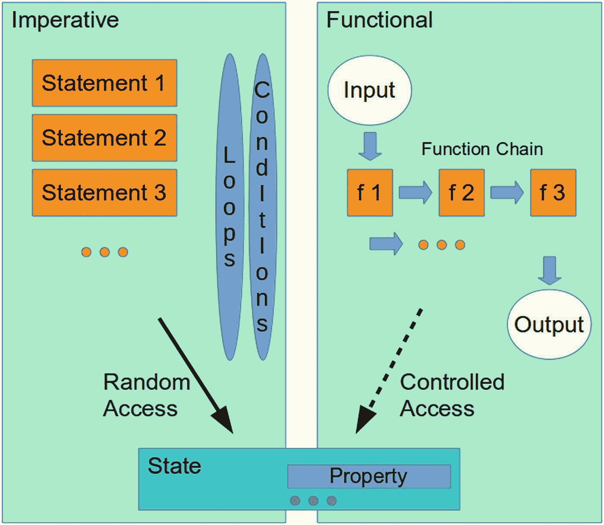

# 十二、回到数学：函数式编程

如果你看一下本书到目前为止给出的例子和练习，你会发现我们在两种编程风格之间波动:

```kt
[statement1] // do something
[statement2] // do something
[statement3] // do something
...

```

和

```kt
object.
    doSomething1().
    doSomething2().
    doSomething3().
    ...

```

第一种风格是关于命令性地告诉程序必须做什么的序列，而第二种风格是关于在函数调用链中顺序地对对象应用函数。正因为如此，第一种风格也被称为*命令式编程*，第二种被称为*函数式编程*。函数式编程经常意味着使用函数作为其他函数的参数，这些函数被称为*高阶函数*。此外，函数式编程倾向于处理不可变的对象。

当使用命令式编程风格时，下面的观察变得很清楚:

*   我们有一系列语句，包括`if/else`、`when`结构和循环。显然，语句的顺序很重要。

*   每个语句执行一个可识别的程序活动，命令式编程乍一看会产生易于理解的程序。

*   各种语句可以处理各种不同的对象。

*   每个语句可能会也可能不会改变它所嵌入的对象的状态，以及更多相关对象的状态。显然，对于各种结构构造，如循环和条件分支，对于所有涉及的对象，状态和状态转换的复杂性没有真正的限制。

*   语句包括一些函数调用，这些函数调用做了一些与它们的主要职责无关的意外事情。这种附属活动经常被称为副作用。因此，这些副作用可能是可预见的，也可能是不可预见的，可能会导致错误的程序活动。

相比之下，函数式编程具有以下特点:

*   功能构造主要指单个对象或单个对象集合。但是，根据函数参数，其他对象或集合可能会进入函数调用链。

*   函数式编程包括将函数作为函数参数来处理。因此，与命令式编程相比，它允许更高的抽象。

*   通过将函数调用结果作为参数或输入传递给其他函数，函数程序部分允许无状态编程风格，避免了复杂的状态转换。

由于函数不引用也不改变对象状态，我们也回到了一个更像数学的函数概念。请记住，在数学中，函数有一个输入并从中产生一个输出，忽略任何可能影响计算的“状态”。面向对象使用稍微改变的函数概念，其中对象的状态对函数调用的结果起着重要作用。因此，函数式编程将函数的概念转移到更像数学的语义上。图 [12-1](#Fig1) 显示了命令式和函数式编程的比较。



图 12-1

函数式编程与命令式编程

在这一点上，我们并不偏爱这两种编程模式中的任何一种，并且通过观察每种编程风格的特征，您可以看到两者都有各自的优点和缺点。我们继续这种态度，但是指出根据情况，函数构造可以导致更优雅和更稳定的程序。Kotlin 允许这两种风格，对于每个任务，由您决定哪种范式最适合您的需求。

在本章的其余部分，我们将加深对函数构造的了解，这样你就有了一个改进的工具集来编写好的软件。

## Kotlin 和函数式编程

虽然 Kotlin 是一种成熟的命令式语言，但它也允许使用函数式编程风格，因为它具有以下特性:

*   Kotlin has a function type declaration:

    ```kt
    ([parameters]) -> [result-type]

    ```

    where `[parameters]` is a comma-separated list of function parameter types. For example,

    ```kt
    val f : (Int,String) -> String = ...

    ```

    不能省略`-> [result-type]`，所以如果一个函数没有返回任何东西，你就写`-> Unit`。

*   函数是一等公民:任何变量都可以有内置类型，可以是任何类的实例，也可以是函数。通过允许函数作为参数，函数可以是高阶函数。

    ```kt
    val f1 = { -> Log.d("LOG", "Hello Kotlin") }
    val f2 = { i:Int, s:String -> "${i}: ${s}" }
    ...
    fun ff(fun1: (Int,String) -> String):String {
        return fun1(7, "Hello")
    }
    ff(f2)
    ff( { i:Int,s:String -> "${i}- ${s}" } )

    ```

*   Kotlin has anonymous lambda functions; these are function literals that can be used as function invocation parameters. For example:

    ```kt
    val f = { i:Int, s:String ->
              i.toString() + ": " + s }
    fun fun1(p: (Int,String) -> String) {
        p(42, "Hello")
    }
    fun1 { i:Int, s:String -> i.toString() + ": " + s }

    ```

    在这里，Kotlin 推断出`f`必须是类型`(Int, String) -> String`

*   Kotlin 的标准库有很多针对对象、数组和集合的高阶函数。

*   函数调用`function({ [lambda-function] })`可以缩写为

    ```kt
    function { [lambda-function] }

    ```

*   函数调用`function(par1, par2, ..., { [lambda-function] })`可以缩写为`function(par1, par2, ...) { [lambda-function] }`

*   在函数类型`([parameters]) -> [result-type]`中，参数通常是`ParType`的形式。一个特殊的*接收器类型*符号显示为`A.(ParType)`。在这种情况下，类型`A`是接收器类型，在类`A`的实例中调用的函数意味着在函数规范`this`中引用该实例。本章有一个专门的章节来讨论这种接收器类型符号。

*   Kotlin 变量可以是不可变的:`val s = ...`。不可变变量有助于避免状态处理并减少意外的副作用。

*   来自单例对象的函数可以通过在前面加上两个冒号(`::)`)来作为对象本身进行寻址。例如，如果你想使用来自`object X { fun add(a:Int,b:Int):Int = a+b }`的函数`add()`，你可以写

    ```kt
    object X {
      fun add(a:Int, b:Int): Int = a + b
    }
    ...
    val f : (Int,Int) -> Int = X::add

    ```

*   来自类的函数可以通过在前面加上两个冒号(`::`)作为接收者类型的对象来寻址。比如:

    ```kt
    class X {
      fun add(a:Int, b:Int): Int = a + b
    }
    ...
    val f : X.(Int,Int) -> Int = X::add

    ```

*   来自实例的函数可以通过在前面加上两个冒号(`::)`)作为对象来寻址。比如:

    ```kt
    class X {
      fun add(a:Int, b:Int): Int = a + b
    }
    ...
    val x1 = X()
    val f : (Int,Int) -> Int = x1::add

    ```

## 没有名字的函数:λ函数

我们知道正常的函数看起来像

```kt
fun functionName([parameters]): ReturnType {
  ...
}

```

或者

```kt
fun functionName([parameters]): ReturnType = ...

```

如果函数可以简化为一个表达式。以这种方式声明的函数由`functionName`标识。问题是:不识别函数名，怎么可能有函数呢？对于答案，我们看包含数据的变量；我们在这里写道

```kt
val varName = 37

```

`=`右侧的值也没有标识名。我们只需要变量名来处理数据。如果我们看看赋给变量的函数，

```kt
val f = { i:Int, s:String -> i.toString() + ": " + s }

```

我们可以看到,`{ ... }`构造也没有标识名；函数被分配给变量使用。这样的函数是匿名的，通常被称为 lambda 函数。

### 注意

带有这种匿名函数的表达式有时也被称为*λ演算*。

这同样适用于作为参数传递给其他函数的函数:

```kt
ff( { i:Int,s:String -> "${i}- ${s}" } )

```

这里我们又有一个没有名字的函数，或者 lambda 函数。

要调用 lambda 函数，您需要编写以下代码之一:

```kt
[lambda_function].invoke([parameters])
[lambda_function]([parameters])

```

Lambda 函数可以有结果。与通过某个`return`语句返回值的普通函数相反，lambda 函数的结果是最后一行计算的结果。前面的例子

```kt
val f = { i:Int, s:String -> i.toString() + ": " + s }

```

因此，借助 lambda 函数的最后一行，返回参数`Int`的字符串表示，加上参数`:`，加上参数`String`。

在只有一个参数的 lambda 函数中，为了简洁起见，可以省略参数声明，而可以使用特殊标识符`it`来引用参数。因此，以下两个语句是等效的:

```kt
{ par ->
    ... // do something with 'par' }
{
    ... // do something with 'it' }

```

### 练习 1

编写一个 lambda 函数:一个接受一个`s:String`和一个`num:Int`并输出一个包含`s`的`num`副本的字符串的函数。

### 练习 2

重写

```kt
val f : (String) -> String = { s:String -> s + "!" }

```

要用`it`来代替。

如果 lambda 函数有一个或多个定义中不需要的参数，可以使用下划线通配符(`_)`作为参数名:

```kt
val f : (String, Int) -> String = { s:String, _ ->
    // the Int parameter is not used
    s + "!"
}

```

## 再次循环

在第 9 章[中](09.html)我们了解到我们可以通过写`data.forEach(...)`或`data.forEachIndexed(...)`来迭代数组或集合(集合，列表)的元素:

```kt
val arr = arrayOf("Joe", "Isabel", "John" }
arr.forEach { name ->
    Log.d("A name: ${name}")
}
arr.forEachIndexed { i,s ->
    Log.d("Name #${i}: ${name}")
}

```

这里的`Log`来自包`android.util`，所以您必须导入它:

```kt
import android.util.Log

```

虽然乍一看，`forEach`或`forEachIndexed`后面的`{ }`看起来像是一个语句块，但是我们可以通过查看`->`看到，实际上`forEach`和`forEachIndexed`实际上都是带有一个 lambda 函数作为参数的函数。那么，也有可能写出`arr.forEach({ ... })`或`arr.forEachIndexed({ ... });`括号可以省略，就像 Kotlin 中的情况一样，如果它们只是用花括号括起来的话。

在 Android Studio 中，我们还可以查看任何函数调用的源代码。为此，例如，将光标放在`forEach`上，然后按 Ctrl+b。Android Studio 随后会打开该函数的源代码并显示如下:

```kt
public inline fun <T> Array<out T>.forEach(
        action: (T) -> Unit): Unit {
    for (element in this) action(element)
}

```

这里我们再次看到，在`forEach`之后的是一个作为函数参数的函数。

### 注意

按 Ctrl+B 是了解 Kotlin 幕后情况的好方法。广泛使用它来理解 Kotlin 结构和功能。

因为`forEach`和`forEachIndexed`是函数而不是语言结构，它们可以直观地应用于任何看起来包含可以迭代的东西的对象。这包括数组和集合，它们是对数组和集合应用其他函数的结果。因此，我们可以在以循环结束的函数链中包含过滤器和映射，如

```kt
originalCollection.
      filter([filter_function]).
      map([mapping_function]).
      take(37).
      forEach { elem ->
          ...
      }

```

在开始循环之前，我们首先应用一个过滤器，然后一个映射，然后减少到第一个`37`元素。我们可以看到，由于函数被允许作为函数参数，我们可以实现一个函数链，并避免中间变量作为数据持有者。

## 接收器的功能

被认为是函数对象并嵌入在上下文中的函数，例如，类中的函数，被称为具有接收器类型的*函数。您将它们声明如下:*

```kt
val f : ReceiverType.([parameters]) = ...

```

这样一个函数就像是类`ReceiverType`的成员函数，在函数实现内部，你可以使用指向实例的`this,`。例如，在

```kt
class A {
    var d:Double = 0.0
    fun plus(x:Double) = d + x
}
val f : A.(Double) -> Double =
      { x:Double -> this.d - x }
fun A.minus(x:Double) = f

```

函数`f`就是这样一个带有接收器类型的函数。我们用它来用一个`minus()`函数扩展类`A`，并且`f`实现内部的`this.d`指向接收者类型内部的属性`d`，在本例中为`A`。

在上一节中，我们已经注意到，对类内部函数的直接引用自动就是这样一个具有接收器类型的函数，因为它只在类的环境中工作:

```kt
class X {
  fun add(a:Int, b:Int): Int = a + b
}
...
val f : X.(Int,Int) -> Int = X::add

```

## 内嵌函数

请看这段代码:

```kt
class A {
  fun function1(i:Int, f:(Int) -> String): String {
      return f(i)
  }
  fun function2() {
      val a = 7

      val s = function1(8) {
          i -> "8 + a = " + (i+a) }
  }
}

```

在对`function1()`的调用中，我们以 lambda 函数`i -> ...`的形式传递一个函数对象。这个函数对象必须在运行时创建，此外，编译器必须允许将本地属性`a`传递给该对象。这带来了显著的性能损失。更准确地说，Kotlin 编译器会产生类似这样的结果:

```kt
public class A {
    public String function1(int i,
          Function1<? super Integer, String> f) {
        return f.invoke(i);
    }

    public void function2() {
        int a = 7;
        String s2 = this.function1(8,
              new Function1<Integer, String>(a){
            final int $a;
            public String invoke(int i) {
                return "8 + a = " + (i + this.$a);
            }
            {
                this.$a = n;
                super(1);
            }
        });
    }
}

```

这是 Java 语言代码，但是不用深入细节，我们看到通过`new Function1(...)`一个函数对象必须被实例化，并且在它里面属性`a`的副本将被创建。

如果这种性能损失造成了问题，那么`function1()`可以被*内联*:

```kt
class A {
  inline fun function1(i:Int, f:(Int) -> String): String
  {
      return f(i)
  }
  fun function2() {
      val a = 7
      val s = function1(8) {
          i -> "8 + a = " + (i+a) }
  }
}

```

这是什么意思？它基本上是说，每当使用内联函数时，不会发生实际的函数调用，而是将函数代码复制到使用该函数的地方。再次查看编译器输出，这次我们得到

```kt
public class A {
  public String function1(int i,
        Function1<? super Integer, String> f) {
      return f.invoke(i);
  }

  public void function2() {
      int a = 7;
      int i$iv;
      int i = i$iv = 8;
      String s2 = "8 + a = " + (i + a);
  }
}

```

您可以从内部`function2()`看到，内联函数`function1`没有被调用；相反，这个片段

```kt
int i$iv;
int i = i$iv = 8;
String s2 = "8 + a = " + (i + a);

```

替换函数调用。没有发生对象实例化，因此与没有内联的变体相比，这段代码运行得更快。

使用内联函数会产生一些不寻常的特性。例如，`return`语句的行为与内联函数不同。此外，可以只内嵌专用的 lambda 函数参数，而让其他函数创建函数对象。此外，内联函数支持一种特殊的类型参数，称为*具体化类型参数* *、*，允许在运行时访问该类型的参数。这里不赘述；如果你感兴趣，请参考在线 Kotlin 文档中的函数。

## 过滤

如果你有一些对象的列表，比如一个`data class Employee(val firstName:String, val lastName:String, val ssn:String, val yearHired:Int)`的实例，在算法中你经常需要根据一些标准提取列表成员。使用命令式编程风格，这通常会产生如下代码片段:

```kt
data class Employee(val firstName:String,
      val lastName:String,
      val ssn:String,
      val yearHired:Int)
val employees = listOf(
    Employee("John", "Smith", "123-12-0001", 1987),
    Employee("Linda", "Thundergaard", "123-12-0002", 1987),
    Employee("Lewis", "Black", "123-12-0003", 1977),
    Employee("Evans", "Brightsmith", "123-12-0004", 1991)
)
val before1990 = mutableListOf<Employee>()
for(empl in employees) {
    if(empl.yearHired < 1990) before1990.add(empl)
}
... // do something with before1990

```

这段代码看起来非常容易理解，并且似乎充分解决了过滤任务，但是如果我们更仔细地观察它，就会发现有几个问题。

*   在开始循环之前，我们需要在单独的语句中创建接收列表。结果列表创建与循环分离；代码并不阻止我们在列表创建和循环之间添加更多的语句，例如，因为未来的需求。这种分离可能会引入复杂的状态转换，从而使程序不稳定。

*   在循环内部，结果列表只是一个局部变量；循环存在的唯一目的是填充结果列表，但是代码并不阻止我们在那里做其他事情，最终降低代码的可读性。

*   如果列表变得非常长，我们可能会尝试在循环内部并行化代码；也就是说，让几个进程同时进行过滤。这很容易导致并发问题，因为`before1990`变量只是一个普通的局部属性。让几个进程同时访问同一个集合经常会导致数据一致性失败。

*   有了更复杂的过滤标准，我们可能会在循环中各种`if-else/when`分支的复杂堆叠中结束。

对几乎所有这些问题的补救措施包括切换到功能代码:

```kt
data class Employee(val firstName:String,
      val lastName:String,
      val ssn:String,
      val yearHired:Int)
val employees = listOf(
    Employee("John", "Smith", "123-12-0001", 1987),
    Employee("Linda", "Thundergaard", "123-12-0002", 1987),
    Employee("Lewis", "Black", "123-12-0003", 1977),
    Employee("Evans", "Brightsmith", "123-12-0004", 1991)
)
val before1990 = employees.filter {
    it.yearHired < 1990 }.toList()
... // do something with before1990

```

这里我们可以避免在`filter()`的参数中写`emp -> ...`，因为只有一个函数参数，并且我们使用自动的`it`变量。在`filter()`之后，我们可以插入更多的过滤器，或者一个映射函数，就像我们在第 [9 章](09.html)中看到的那样。

### 练习 3

通过应用一个只允许名字以 l 开头的雇员通过的过滤器，创建另一个列表`startsWithL`。注意:`String`有一个`startsWith()`函数可以用于这个目的。