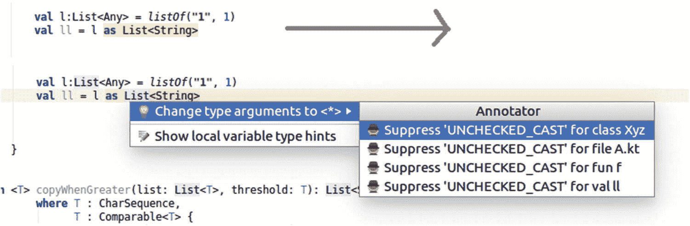

# 十四、添加提示：注解

注解用于向代码中添加元信息。那是什么意思？考虑以下类:

```kt
class Adder {
    fun add(a:Double, b:Double) = a + b
}
class Subtractor {
    fun subtract(a:Double, b:Double) = a - b
}

```

如果我们有一个更大的算术计算项目，其中各种操作由像这里的`Adder`和`Subtractor`这样的类来处理，我们可以有这样的东西

```kt
val eng = CalculationEngine()
...
eng.registerAdder(Adder::class, "add") eng.registerSubtractor(Subtractor::class, "subtract")
...

```

用于注册特定的低级操作。

然而，我们可以遵循一种不同的方法，操作者以某种方式向框架宣布他们的能力。他们可以通过特殊的文档标记来做到这一点，例如

```kt
/**
 * @Operator: ADDING
 * @Function: add
 */
class Adder {
    fun add(a:Double, b:Double) = a + b
}

/**
 * @Operator: SUBTRACTING
 * @Function: subtract
 */
class Subtractor {
    fun subtract(a:Double, b:Double) = a - b
}

```

然后，一些解析器可以查看源代码，找出各种操作符需要哪些类和函数。

### 注意

一个*框架*是为软件提供脚手架结构的类、接口和单例对象的集合。框架本身并不是一个可执行的程序，而是一个软件项目使用框架来建立一个标准化的结构。因此，使用特定框架的不同项目表现出相似的结构，如果开发人员知道一个嵌入到特定框架中的项目，那么理解使用相同框架的其他项目将会更容易。

这种让类向程序声明自己的方法经常在服务器环境中使用，在这种环境中，程序需要能够通过网络与客户机通信。

然而，这种方法有一个问题。因为元信息是从文档内部呈现的，所以编译器不可能检查标签的正确性。关于编译器，文档的内容是完全不重要的，并且应该是不重要的，因为这是语言规范所说的。

## Kotlin 中的注解

这就是注解进入游戏的地方。它们正是为了这种任务而存在的:不干涉类的主要职责，而是为程序或框架提供元信息，用于维护或注册目的。注解如下所示:

```kt
@AnnotationName

```

或者

```kt
@AnnotationName(...)

```

如果有参数。许多语言元素都可以用这样的注解来标记:文件、类、接口、单例对象、函数、属性、lambdas、语句，甚至其他注解。前面的计算引擎示例的运算符类可以读作

```kt
@Operator(ADDING)
class Adder {
    @OperatorFunction
    fun add(a:Double, b:Double) = a + b
}

@Operator(SUBTRACTING)
class Subtractor {
    @OperatorFunction
    fun subtract(a:Double, b:Double) = a - b
}

```

现在编译器的情况更好了。因为注解是语言的一部分，编译器可以检查它们是否存在，拼写是否正确，是否提供了正确的参数。

在接下来的部分中，我们首先讨论注解特征，然后讨论 Kotlin 提供的注解。然后，我们将介绍如何构建和使用我们自己的注解。

## 注解特征

注解由注解类声明，如下所示:

```kt
annotation class AnnotationName

```

我们将在后面的章节中介绍如何构建我们自己的注解。现在我们提到声明，因为注解有它们自己的注解描述的特征，这些注解是元注解:

```kt
@Target(...)
@Retention(...)
@Repeatable
@MustBeDocumented
annotation class AnnotationName

```

您可以按任意顺序使用它们的任意组合，如果没有指定，它们都有默认值。我们在这里描述它们，包括可能的参数。

*   `@Target(...)`

    Here you specify the possible element types to which the annotation can be applied. The parameter is a comma-separated list of any of the following (all of them are fields of the enumeration `kotlin.annotation.AnnotationTarget`):
    *   `CLASS`:所有的类、接口、单例对象和注解类。

    *   `ANNOTATION_CLASS`:仅注解类。

    *   `PROPERTY`:属性。

    *   `FIELD`:作为属性的数据持有者的字段。请注意，通过 getters 和 setters 获得的属性不一定需要字段。然而，如果有一个字段，这个注解目标指向那个字段。您将它与`PROPERTY`目标一起放在属性声明的前面。

    *   `LOCAL_VARIABLE`:任意局部变量(函数内的`val`或`var`)。

    *   `VALUE_PARAMETER`:函数或构造函数参数。

    *   `CONSTRUCTOR`:一级或二级建造师。如果您想要注解一个主构造函数，您必须使用添加了`constructor`关键字的符号；例如，`class Xyz @MyAnnot constructor(val p1:Int, ...).`

    *   `FUNCTION`:函数(不包括构造函数)。

    *   `PROPERTY_GETTER`:属性 getters。

    *   `PROPERTY_SETTER`:财产设定者。

    *   `TYPE`:类型注解，如`val x: @MyAnnot Int = ...`

    *   `EXPRESSION`:语句(必须包含一个表达式)。

    *   `FILE`:文件标注。您必须在`package`声明之前指定这一点，另外在`@`和注解名之间添加一个`file:`，如`@file:AnnotationName`。

    *   我们还没有讨论类型别名。它们只是类型的新名称，如在`typealias ABC = SomeClass<Int>`中。这种注解类型适用于这样的`typealias`声明。

    如果未指定，目标为`CLASS`、`PROPERTY`、`LOCAL_VARIABLE`、`VALUE_PARAMETER`、`CONSTRUCTOR`、`FUNCTION`、`PROPERTY_GETTER`和`PROPERTY_SETTER`。

*   `@Retention(...)`

    This specifies where the annotation information goes during compilation and whether it is visible using one of the following (all are fields from the enumeration class `kotlin.annotation.AnnotationRetention`):
    *   `SOURCE`:注解仅存在于源代码中；编译器会移除它。

    *   `BINARY`:注解存在于编译后的类、接口或单例对象中。使用反射在运行时查询注解是不可能的。

    *   `RUNTIME`:注解存在于编译后的类、接口或单例对象中，在运行时无法使用反射查询注解。

    默认值为运行时。

*   `@Repeatable`

    如果您想让注解不止出现一次，请添加此选项。

*   `@MustBeDocumented`

    如果您希望注解显示在公共 API 文档中，请添加此选项。

您可以看到，对于类、接口、单例对象、属性和本地属性，如果您希望注解在编译后的文件中明显显示，您不必指定特殊的特征。

## 应用注解

通常，注解写在要应用注解的元素的前面。这个故事变得有点复杂，因为元素的含义并不总是很清楚。考虑这个例子:

```kt
class Xyz {
    @MyAnnot var d1:Double = 1.0
}

```

这里我们有四个可以应用注解的元素:属性、属性 getter、属性 setter 和数据字段。出于这个原因，Kotlin 以在`@`和注解名之间写一个`qualifier:`的形式引入了*使用站点目标*。以下是可用的使用站点目标:

*   `file`

    We know that a Kotlin file can contain properties and functions outside classes, interfaces, and singleton objects. For an annotation applying to such a file, you write `@file:AnnotationName` in front of the package declaration. For example:

    ```kt
    @file:JvmName("Foo")
    package com.xyz.project
    ...

    ```

    将内部创建的类命名为`Foo`。

*   `property`

    批注与属性相关联。注意，如果使用 Java 访问 Kotlin 类，这个注解对 Java 是不可见的。

*   `field`

    注解与属性后面的数据字段相关联。

*   `get`

    注解与属性 getter 相关联。

*   `set`

    注解与属性 setter 相关联。

*   `receiver`

    注解与扩展函数或属性的接收器参数相关联。

*   `param`

    注解与构造函数参数相关联。

*   `setparam`

    注解与属性 setter 参数相关联。

*   `delegate`

    注解与存储委托实例的字段相关联。

如果没有指定 use-site 目标，`@Target`元注解用于查找要注解的元素。如果有几种可能，排名是`param > property > field`。

以下代码显示了各种注解应用示例(为简单起见，所有注解都没有参数，并假定指定了正确的`@Target`):

```kt
// An annotation applying to a file (the implicit
// internal class generated)
@file:Annot
package com.xyz.project
...

// An annotation applying to a class, a singleton
// object, or an interface
@Annot class TheName ...
@Annot object TheName ...
@Annot interface TheName ...

// An annotation applying to a function
@Annot fun theName() { ... }

// An annotation applying to a property
@property:Annot val theName = ...
@Annot var theName = ...
class SomeClass(@property:Annot var param:Type, ...) ...

// An annotation applying to a function parameter
f(@Annot p:Int, ...) { ... }

// An annotation applying to a constructor
class TheName @annot constructor(...) ...

// An annotation applying to a constructor parameter
class SomeClass(@param:Annot val param:Type, ...) ...

// An annotation applying to a lambda function
val f = @annot { par:Int -> ... }

// An annotation applying to the data field
// behind a property
@field:Annot val theName = ...
class SomeClass(@field:Annot val param:Type, ...) ...

// An annotation applying to a property setter
@set:Annot var theName = ...
var theName = 37 @Annot set(...) { ... }
class SomeClass(@set:Annot var param:Type, ...) ...

// An annotation applying to a property getter

@get:Annot var theName = ...
var theName = 37 @Annot get() = ...
class SomeClass(@get:Annot var param:Type, ...) ...

// An annotation applying to a property setter
// parameter
var theName:Int = 37
    set(@setparam:Annot p:String) { })

// An annotation applying to a receiver
@receiver:Annot fun String.xyz() { }

// An annotation applying to a delegate
class Derived(@delegate:Annot b: Base) : Base by b

```

要使用注解作为注解参数，您不需要添加一个`@`前缀:

```kt
@Annot(AnotherAnnot)

```

## 带数组参数的批注

使用数组作为注解构造函数参数很容易:只需在注解声明中使用`vararg`限定符，在注解实例化中使用逗号分隔的参数列表:

```kt
annotation class Annot(vararg val params:String)
...
@Annot("A", "B", "C", ...) val prop:Int = ...

```

如果您需要使用包含在项目中的 Java 库中的带有单个数组参数的注解，该参数会自动转换成一个`vararg`参数，所以您基本上可以这样做:

```kt
@field:JavaAnnot("A", "B", "C", ...) val prop:Int = ...

```

如果注解有几个命名参数，其中一个或几个是数组，则使用特殊的数组文字符号:

```kt
@Annot(param1 = 37, arrParam = [37, 42, 6], ...)

```

## 阅读注解

要读取保留类型为`SOURCE`的注解，您需要一个特殊的注解处理器。请记住，对于`SOURCE`类型的注解，Kotlin 编译器会在编译过程中移除注解，因此在这种情况下，我们必须在编译器开始工作之前安装一些软件来查看源代码。大多数源类型注解处理发生在较大的服务器框架项目中；在这里，注解被用来生成一些合成的 Kotlin 或 Java 代码，这些代码将类粘合在一起，以模拟复杂的数据库结构。有一个特殊的插件用于此目的，KAPT，它允许包含这样的源类型注解预处理程序。

您可以在在线 Kotlin 文档中找到更多关于 KAPT 用法的信息。在本节的剩余部分，我们将讨论`RUNTIME`保留类型注解处理。

为了读取由 Kotlin 编译器编译并最终由运行时引擎执行的字节码中的注解，使用了*反射 API* 。我们将在本书的后面讨论反射 API 这里我们只提到注解处理方面。

### 注意

要使用反射，`kotlin-reflect.jar`必须在类路径中。这意味着你必须在你的模块的`build.gradle`文件的依赖部分添加`implementation "org.jetbrains.kotlin: kotlin-reflect:$kotlin_version"`。

要获取最基本元素的注解，请参见表 14-1 ，该表描述了如何获取注解或注解列表。

表 14-1。

按元素标注

<colgroup><col class="tcol1 align-left"> <col class="tcol2 align-left"></colgroup> 
| 

元素

 | 

阅读注解

 |
| --- | --- |
| 类、单例对象和接口 | 使用`TheName::class.annotations`要获得`kotlin.Annotation`对象的列表，您可以进一步研究。例如，您可以使用属性`.annotationClass`来获取每个注解的类。如果您有一个属性，并且首先需要获取相应的类，请使用`property::class.annotations`要阅读某个注解，请使用`val annot = TheName::class.findAnnotation<AnnotationType>()`在这里用注解的类名代替`AnnotationType`。例如，您可以从这里通过`annot?.paramName`读取注解的参数。 |
| 性能 | 使用`val prop = ClassName::propertyNameval annots = prop.annotationsval annot = prop.findAnnotation<AnnotationType>()`通过名称获取一个属性，并从中获得一个注解列表或搜索某个注解。 |
| 菲尔茨 | 要访问字段的注解，请使用`val prop = ClassName::propertyNameval field = prop.javaFieldval annotations = field?.annotations` |
| 功能 | 要通过名称访问非重载功能，请写入`TheClass::functionName`。如果您有几个函数使用相同的名称，但参数不同，您可以编写`val funName = "functionName"    // <- choose your ownval pars = listOf(Int::class)    // <- choose your ownval function =     TheClass::class.    declaredFunctions.filter {        it.name == funName }    ?.find { f ->      val types = f.valueParameters.map{          it.type.jvmErasure}      types == pars``}`一旦有了这个函数，您就可以使用`.annotations`来查看注解列表，或者使用`.findAnnotation<AnnotationType>()`来搜索某个注解。 |

## 内置注解

Kotlin 从一开始就提供了一些注解。表 14-2 显示了一些通用注解。



图 14-1。

在 Android Studio 中隐藏注解

表 14-2。

内置注解:常规

<colgroup><col class="tcol1 align-left"> <col class="tcol2 align-left"> <col class="tcol3 align-left"> <col class="tcol4 align-left"></colgroup> 
| 

注解名称

 | 

包裹

 | 

目标

 | 

描述

 |
| --- | --- | --- | --- |
| `Deprecated` | 我的锅 | 类、批注类、函数、属性、构造函数、属性设置器、属性获取器、类型别名 | 接受三个参数:`message:String`、`replaceWith:ReplaceWith = ReplaceWith("")`和`level:DeprecationLevel = DeprecationLevel.WARNING`将元素标记为已弃用。`DeprecationLevel`为字段枚举:`WARNING`、`ERROR`、`HIDDEN` |
| `ReplaceWith` | 我的锅 | — | 需要两个参数:`expression:String`和`vararg imports:String`。使用它来指定`@Deprecated`中的替换代码片段。 |
| `Suppress` | 我的锅 | 类、批注类、函数、属性、字段、局部变量、值参数、构造函数、属性设置器、属性获取器、类型、类型别名、表达式、文件 | 接受一个 vararg 参数:`names:String`。保留类型为`SOURCE`。使用它来禁止编译器警告。`names`参数是一个逗号分隔的警告消息标识符列表。不幸的是，找到编译器警告标识符的详尽列表并不容易，但 Android Studio 有所帮助:一旦出现编译器警告，相应的构造就会突出显示，当光标在其上时按 Alt+Enter 允许我们生成相应的 suppress 注解。参见图 14-1 (使用箭头键在菜单中导航)。 |

## 自定义注解

要定义自己的简单注解，您需要编写

```kt
@Target(...)
@Retention(...)
@Repeatable
@MustBeDocumented
annotation class AnnotationName

```

对于注解的注解(即元注解)，注意它们都是可选的，顺序是自由的。有关它们的含义，请参阅本章前面的“注解特征”一节。

如果需要带参数的批注，可以在声明中添加一个主构造函数:

```kt
[possibly meta-annotations]
annotation class AnnotationName(val p1:Type1, val p2:Type2, ...)

```

其中允许以下参数类型:对应于原始类型的类型(即，`Byte`、`Short`、`Int`、`Long`、`Char`、`Float`、`Double`)、字符串、类、枚举、其他注解以及它们的数组。您可以添加`vararg`来获得可变数量的参数。注意，对于用作其他注解的参数的注解，参数注解的`@`被省略。

作为一个例子，我们以类`Calculator`的形式启动一个计算引擎。我们引入一个注解来避免被`0.0`除。注解如下:

```kt
@Target(AnnotationTarget.VALUE_PARAMETER)
@Retention(AnnotationRetention.RUNTIME)
annotation class NotZero()

```

对于类和两个操作符`divide`和`multiply`,我们写:

```kt
class Calculator {
  enum class Operator(val oper:String) {
      MULTIPLY("multiply"),
      DIVIDE("divide")
  }

  fun operator(oper:Operator,
               vararg params:Double): Double {
      val f = Calculator::class.declaredFunctions.
            find { it.name == oper.oper }
      f?.valueParameters?.forEachIndexed { ind, p ->

          p.findAnnotation<NotZero>()?.run {
              if (params[ind] == 0.0)
                  throw RuntimeException(
                  "Parameter ${ind} not unequal 0.0")
          }
      }
      val ps = arrayOf(this@Calculator,
            *(params).toList().toTypedArray<Any>())
      return (f?.call(*ps) as Double?) ?: 0.0
  }

  fun multiply(p1:Double, p2:Double) : Double {
      return p1 * p2
  }

  fun divide(p1:Double, @NotZero p2:Double) : Double {
      return p1 / p2
  }
}

```

`operator()`功能的作用如下:

*   它查找对应于第一个参数的函数。`Calculator::class.declaredFunctions`列出了`Calculator`类的所有直接声明的函数。这意味着它也不研究超类。`find`选择`divide()`或`multiply()`。

*   从函数中，我们通过`.valueParameters`遍历参数。对于每个参数，我们可以看到它是否有关联的注解`NotZero`。如果是，我们检查实际参数，如果是`0.0`，我们抛出一个异常。

*   如果没有抛出异常，我们调用函数。`arrayOf()`表达式将接收器对象和函数参数连接成一个`Array<Any>`。

`@NotZero`注解确保在调用`Calculator.operator()`时检查参数。要使用计算器，您可以这样写:

```kt
Calculator().
    operator(Calculator.Operator.DIVIDE,
            1.0, 1.0)

```

要查看注解是否有效，请使用第二个参数`0.0`尝试另一个调用。

### 练习 1

对于`Calculator`示例，添加一个新的注解`@NotNegative`和一个新的平方根操作`sqrt()`。请确保此运算符不允许使用负参数。注:实际平方根通过`java.lang.Math.sqrt()`计算。