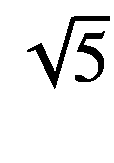

# 十六、集合 API

我们已经在第 9 章中讨论了集合，即列表、集合和映射。然而，集合 API 是广泛的，包含了比我们在第 9 章[中描述的更多的类和接口。对于 Java，API 甚至被称为*集合框架*。在这一章中，我们不要求详尽无遗，我们修改我们已经知道的，也讨论一些更有趣的集合接口、类和函数。](09.html)

不幸的是，没有什么像`java.collections`包。关于 Java，集合 API 是分散的，其主要部分位于`java.util`包中。

### 注意

在本章中，我们将展示一种指定泛型类型参数的方法。在显而易见的地方，为了简洁起见，它们没有被示出。在所有情况下，我们使用`E`作为列表或集合的元素类型，使用`K`和`V`作为映射的键和值。

## 接口

尽管 Java 已经有了集合、列表和映射的接口，Kotlin 也有自己的接口。这主要源于 Kotlin 需要区分可变和不可变的集合和映射。对于大多数用例，您可以只使用 Kotlin 版本，如果您尝试使用 Java 变体，编译器甚至会警告您。不过，也不禁止使用 Java 变体，这样做可能有原因。表 [16-1](#Tab1) 提供了一个概述。

表 16-1。

集合接口

<colgroup><col class="tcol1 align-left"> <col class="tcol2 align-left"></colgroup> 
| 

连接

 | 

描述

 |
| --- | --- |
| `kotlin.collections.Iterable` | iterable，或者可以在循环中迭代的东西。任何 iterable 都可以在一个`for( x in a )`循环中使用，所以如果你提供了自己的实现这个接口的类，你就可以在循环中使用它。所有集合(即列表和集合)都是可迭代的。 |
| `kotlin.collections.MutableIterable` | 与`Iterable`相同，但是另外支持移除当前迭代的元素。 |
| `java.lang.Iterable` | iterable 的 Java 变体；除非有充分的理由，否则不要使用它。 |
| `kotlin.collections.Collection` | 一个通用的不可变集合接口。这是`Iterable`的一个子接口。 |
| `kotlin.collections.MutableCollection` | 一个通用的可变集合接口。这是`MutableIterable`的一个子接口。 |
| `java.util.Collection` | 集合接口的 Java 变体；除非有充分的理由，否则不要使用它。 |
| `java.util.Deque` | 两头排队。使用它来实现或使用队列或堆栈。你可以把元素放在开头和结尾，两边都可以读取和撤回元素。deques 可用的函数数量有点多；通常情况下，您可以对以下设置感到满意:`size()` `: Int`得到尺寸。`addFirst(element:E)`向队列头添加一个元素。`addLast(element:E)`向队列尾部添加一个元素。`removeFirst()` `: E`获取并删除队列头的元素(如果队列为空，抛出异常)。`removeLast()` `: E`获取并删除队列尾部的元素(如果队列为空，抛出异常)。`getFirst()` `: E`检索但不删除队列头的元素(如果队列为空，则抛出异常)。`getLast()` `: E`检索但不删除队列尾部的元素(如果队列为空，则抛出异常)。对此没有 Kotlin 变体；德克总是易变的。 |
| `java.util.Queue` | 一端排队的队伍。通常你可以使用一个双端的队列来代替。对此没有 Kotlin 变体；队列总是可变的。 |
| `kotlin.collections.List` | 不可变列表。 |
| `kotlin.collections.MutableList` | 可变列表。 |
| `java.util.List` | 列表的 Java 变体；除非有充分的理由，否则不要使用它。 |
| `kotlin.collections.Set` | 不变的集合。 |
| `kotlin.collections.MutableSet` | 可变集合。 |
| `java.util.Set` | 集合的 Java 变体；除非有充分的理由，否则不要使用它。 |
| `java.util.SortedSet` | 其元素按自然排序顺序排列的集合。 |
| `java.util.NavigableSet` | 一个可以在两个方向上迭代的`SortedSet`。 |
| `kotlin.collections.Map` | 不变的地图。 |
| `kotlin.collections.MutableMap` | 可变地图。 |
| `java.util.Map` | 地图的 Java 变体；除非有充分的理由，否则不要使用它。 |
| `java.util.SortedMap` | 其关键字按自然排序顺序排序的地图。 |
| `java.util.NavigableMap` | 一个可以在两个方向上迭代的`SortedMap`。 |

请注意，所有这些接口都有必须在尖括号之间指定的泛型类型，除非 Kotlin 编译器可以推断出这些类型。对于地图，我们需要两个类型参数；其他人都需要一个。

仔细观察这个表，您可能会注意到两个有点奇怪的结构:一个以`SortedSet`形式表示的排序集合和一个以`SortedMap`形式表示的排序映射。这些语言结构在某些情况下会有所帮助，但在数学中却没有直接的对应。在数学中，集合和地图都是无序的！在你的代码中，最好不要在可以避免的地方使用它们。如果使用它们，算法不应该强烈依赖元素的顺序。这当然是个人喜好问题；把它当作一个暗示或建议。

## 班级

表 [16-2](#Tab2) 列出了实现集合和映射接口的类。

表 16-2。

集合类

<colgroup><col class="tcol1 align-left"> <col class="tcol2 align-left"></colgroup> 
| 

班级

 | 

描述

 |
| --- | --- |
| `kotlin.collections.ArrayList` | 可变和不可变列表的列表实现。 |
| `java.util.ArrayList` | 除非你有充分的理由，否则不要使用它的 Java 变体。 |
| `kotlin.collections.HashSet` | 可变和不可变集合的集合实现。 |
| `java.util.HashSet` | 一个`HashSet`的 Java 变种；除非有充分的理由，否则不要使用它。 |
| `kotlin.collections.LinkedHashSet` | 可变和不可变集合的集合实现。因为集合元素相互链接，所以迭代顺序与插入顺序相同。 |
| `java.util.LinkedHashSet` | 一个`LinkedHashSet`的 Java 变种；除非有充分的理由，否则不要使用它。 |
| `kotlin.collections.HashMap` | 可变和不可变映射的映射实现。 |
| `java.util.HashMap` | 一个`HashMap`的 Java 变种；除非有充分的理由，否则不要使用它。 |
| `kotlin.collections.LinkedHashMap` | 可变和不可变映射的映射实现。因为地图元素相互链接，所以迭代顺序与插入顺序相同。 |
| `java.util.LinkedHashMap` | 一个`LinkedHashMap`的 Java 变种；除非有充分的理由，否则不要使用它。 |
| `java.util.ArrayDeque` | 一个`Deque`实现。 |
| `java.util.EnumSet` | 枚举元素的专用`java.util.Set`实现。 |
| `java.util.LinkedList` | 一个带有链表元素的`java.util.List`实现。 |
| `java.util.PriorityQueue` | 一个`java.util.Queue`实现，根据元素的自然顺序或根据构造期间传入的比较器定义的顺序，在某个位置插入元素。 |
| `java.util.Stack` | `java.util.List`的后进先出(LIFO)实现。 |
| `java.util.TreeSet` | 一个`java.util.Set`实现，其中的元素按照它们的自然顺序进行排序，或者按照构造期间传入的比较器进行排序。 |
| `java.util.concurrent.ArrayBlockingQueue` | 一种固定大小的队列(先进先出表)。如果试图在队列已满时添加元素或试图在队列为空时移除元素，则阻止这两种情况。 |
| `java.util.concurrent.ConcurrentLinkedDeque` | 允许对元素进行并发访问的 deque 实现。 |
| `java.util.concurrent.ConcurrentLinkedQueue` | 允许对元素进行并发访问的队列实现。 |
| `java.util.concurrent.ConcurrentSkipListSet` | 允许对元素进行并发访问的`NavigableSet`实现。 |
| `java.util.concurrent.CopyOnWriteArrayList` | 允许对元素进行并发访问的`java.util.List`实现。每次写操作都会产生完整列表的新副本。 |
| `java.util.concurrent.CopyOnWriteArraySet` | 允许对元素进行并发访问的`java.util.Set`实现。每个写操作都会产生完整集合的新副本。 |
| `java.util.concurrent.DelayQueue` | 一个`java.util.Queue`实现，其中元素必须是`java.util.concurrent.Delayed`的子类。仅当延迟到期时，才允许删除元素。 |
| `java.util.concurrent.LinkedBlockingQueue` | 可选地具有固定大小的队列(先进先出列表)。如果试图在队列已满时添加元素或试图在队列为空时移除元素，则阻止这两种情况。 |
| `java.util.concurrent.PriorityBlockingQueue` | 一个`java.util.Queue`实现，根据元素的自然顺序或根据构造期间传入的比较器定义的顺序，在某个位置插入元素。可能会阻止检索操作，直到元素可用。 |
| `java.util.concurrent.SynchronousQueue` | 一个`java.util.Queue`实现，其中插入操作只有在元素被并发请求时才是可能的。否则，插入操作会阻塞并等待。 |

注意，在属性声明中，通常希望为属性类型使用一个接口，但只为实例化使用一个类。这样我们表达的是属性做了什么，而不是它是如何做的。

```kt
var l:MutableList<String> = ArrayList()
// ... = ArrayList<String>() is unnecessary, because
// Kotlin can infer the type.

```

## 发电机功能

Kotlin 在自己的集合类中提供了数百个函数，为 Java 的集合类添加了扩展函数，此外还为我们提供了许多顶级函数。这一节和接下来的几节列出了 Kotlin 和 Java 中最重要的集合函数，但并不详尽。

表 [16-3](#Tab3) 显示了可以用来创建集合的顶级生成器函数。除非另有说明，否则返回的集合和映射只是包`kotlin.collections`中的类的实例。

表 16-3。

集合生成器

<colgroup><col class="tcol1 align-left"> <col class="tcol2 align-left"></colgroup> 
| 

功能

 | 

描述

 |
| --- | --- |
| `emptyList<E>()` | 创建给定元素类型的不可变空列表。 |
| `listOf<E>(...)` | 创建作为参数给定的元素的不可变列表；例如，`listOf(1, 2, 3)` |
| `mutableListOf<E>(...)` | 创建作为参数给出的元素的可变列表；例如，`mutableListOf(1, 2, 3)` |
| `listOfNotNull<E>(...)` | 创建作为参数给定的元素的不可变列表，但是过滤掉`null`有值的参数；例如，`listOfNotNull(1, 2, null, 3)` |
| `List<E>(size: Int, init: (index: Int) -> E)` | 创建由 lambda 函数计算的不可变列表，该函数作为第二个参数给出。请注意，尽管名称以大写字母开头，但这是一个函数。 |
| `MutableList<E>(size: Int,init: (index: Int) -> E)` | 创建一个可变列表，由 lambda 函数计算，作为第二个参数给出。请注意，尽管名称以大写字母开头，但这是一个函数。 |
| `emptySet<E>()` | 创建一个不可变的空集。 |
| `setOf<E>(...)` | 创建作为参数给定的不可变元素集；例如，`setOf(1, 2, 3)` |
| `mutableSetOf<E>(...)` | 创建作为参数给定的可变元素集；例如，`mutableSetOf(1, 2, 3)` |
| `emptyMap<K,V>()` | 创建一个不可变的空映射。 |
| `mapOf<K,V>()` | 创建作为参数给出的`Pair`元素的不可变映射；例如，`mapOf(1 to "A", 2 to "B")` |
| `mutableMapOf<K,V>(...)` | 创建作为参数给出的`Pair`元素的可变映射；例如，`mutableMapOf(1 to "A", 2 to "B")` |

对于 Kotlin 来说通常是这样，如果 Kotlin 可以推断类型，那么可以省略类型参数。所以你可以写

```kt
listOf(1, 5, 7, 9)

```

而Kotlin知道这是一个`List<Int>`。

## 集合和地图设置器和移除器

表 [16-4](#Tab4) 向你展示了如何向可变集合或映射添加元素，以及如何移除它们。

表 16-4。

集合变异函数

<colgroup><col class="tcol1 align-left"> <col class="tcol2 align-left"> <col class="tcol3 align-left"></colgroup> 
| 

为

 | 

功能

 | 

描述

 |
| --- | --- | --- |
| 列表，集合 | `add(element:E)` | 在列表末尾添加一个元素，或将一个元素添加到集合中。 |
| 列表 | `set(index:Int, element:E)` | 覆盖给定索引处的元素。要覆盖的元素必须存在。 |
| 列表 | `list[index] = value` | 同`set()` |
| 列表，集合 | `addAll(elements: Collection<E>) addAll(elements: Array<out E>)` | 将作为参数提供的数组或集合中的所有元素添加到列表的尾部，或将元素添加到集合中。 |
| 地图 | `put(key:K, value:V)` | 将键/值对放入映射中。如果该键已经存在，该值将被覆盖。 |
| 地图 | `map[key:K] = value:V` | 同`put()`。 |
| 地图 | `putIfAbsent(key:K, value:V)` | 将键/值对放入映射中，但前提是键以前不存在。 |
| 地图 | `set(key:K, value:V)` | 同`put()`。 |
| 地图 | `putAll(from: Map<out K,V>)` | 对作为函数参数提供的地图中的所有元素执行`put()`。 |
| 列表，集合 | `remove(element:E)` | 从集合或列表中移除给定的元素。 |
| 列表，集合 | `removeIf { (E) -> Boolean }` | 移除 lambda 函数返回`true`的所有元素。如果至少删除了一个元素，则返回`true`。 |
| 列表，集合 | `removeAll( elements:Collection<E>) removeAll(elements:Array<out T>)` | 从列表或集合中移除包含在所提供的集合或数组参数中的所有元素。 |
| 列表，集合 | `removeAll { (E) -> Boolean }` | 同`removeIf()`。 |
| 地图 | `remove(key:K)` | 移除给定键处的元素(如果存在)。返回前一个值，如果不存在则返回`null`。 |
| 地图 | `remove(key:K, value:V)` | 如果元素存在并具有给定值，则移除给定键处的元素。如果元素被移除，则返回`true`。 |
| 列表，集合 | `retainAll( elements:Collection<E>)` | 更改给定的集合或列表，并使其仅保留那些也在给定的参数集合内的元素。 |
| 地图、列表、集合 | `clear()` | 移除所有元素。 |

## 确定性吸气器

表 [16-5](#Tab5) 中列出了从集合和映射中检索元素的确定性 getters。

表 16-5。

吸气剂

<colgroup><col class="tcol1 align-left"> <col class="tcol2 align-left"> <col class="tcol3 align-left"></colgroup> 
| 

为

 | 

功能

 | 

描述

 |
| --- | --- | --- |
| 列表 | `get(index:Int)` | 检索指定索引处的元素。 |
| 列表 | `getOrNull(index:Int)` | 检索指定索引处的元素，如果索引越界，则检索`null`。 |
| 列表 | `list[index:Int]` | 同`get()`。 |
| 列表 | `first()` | 返回第一个元素。 |
| 目录 | `firstOrNull()` | 返回第一个元素，如果列表为空，则返回`null`。 |
| 列表 | `last()` | 返回最后一个元素。 |
| 列表 | `lastOrNull()` | 返回最后一个元素，如果列表为空，则返回`null`。 |
| 列表，集合 | `random()` | 从列表或集合中返回一个随机元素。 |
| 地图 | `get(key:K)` | 返回给定键的值，如果不存在则返回`null`。 |
| 地图 | `map[key:K]` | 同`get()`。 |
| 地图 | `getOrDefault(key:K, defaultValue:V)` | 返回给定键的值，如果不存在则返回`defaultValue`。 |
| 地图 | `getOrElse(key:K, defaultValue: (K) -> V)` | 返回给定键的值，如果该值不存在，则返回作为第二个参数提供的 lambda 函数的结果。 |
| 地图 | `getOrPut(key:K, defaultValue: () -> V)` | 返回键`key`的值。但是，如果键还不存在，调用 lambda 函数并将结果作为该键的值放入映射中。在后一种情况下，返回新值。 |
| 列表，集合 | `single()` | 如果内部只有一个元素，则检索单个元素。否则将引发异常。 |
| 列表，集合 | `singleOrNull()` | 如果内部只有一个元素，则检索单个元素。否则返回`null`。 |
| 列表 | `drop(n:Int)` | 返回一个不可变的列表，其中包含原始列表中的元素，并删除前`n`个元素。 |
| 列表 | `dropLast(n:Int)` | 返回一个不可变列表，其中包含原始列表中的元素，并从末尾删除了`n`个元素。 |
| 列表 | `slice(indices:IntRange)` | 返回一个不可变列表，其中包含 range 参数给定索引处的元素。 |
| 列表 | `take(n:Int)` | 返回一个不可变列表，其中包含原始列表中的第一个`n`元素。 |
| 列表 | `takeLast(n:Int)` | 返回一个不可变列表，其中包含原始列表中的最后一个`n`元素。 |

## 集合和地图特征

采集和映射特性见表 [16-6](#Tab6) 。

表 16-6。

特征

<colgroup><col class="tcol1 align-left"> <col class="tcol2 align-left"> <col class="tcol3 align-left"></colgroup> 
| 

接收器

 | 

功能

 | 

描述

 |
| --- | --- | --- |
| 地图、列表、集合 | `Size` | 集合或地图的大小。 |
| 地图、列表、集合 | `count()` | 同`size`。 |
| 地图、列表、集合 | `isEmpty()` | 如果为空，则返回`true`。 |
| 地图、列表、集合 | `isNotEmpty()` | 如果不为空，则返回`true`。 |
| 列表，集合 | `count((E) -> Boolean)` | 计算给定谓词 lambda 函数返回的元素数`true`。 |
| 地图 | `count((K,V) -> Boolean)` | 计算给定谓词 lambda 函数返回的元素数`true`。 |
| 列表，集合 | `indices` | 作为`IntRange`的有效索引。 |
| 列表 | `lastIndex` | 最后一个有效索引。 |

## 遍历集合和地图

对于遍历集合和地图，您可以使用表 [16-7](#Tab7) 中所示的结构之一。

表 16-7。

横越

<colgroup><col class="tcol1 align-left"> <col class="tcol2 align-left"> <col class="tcol3 align-left"></colgroup> 
| 

为

 | 

建造

 | 

描述

 |
| --- | --- | --- |
| 列表、设置、实现`Iterable` | `for( i in x ) { ... }` | 一个语言结构，`i`是循环变量并接收元素。 |
| 地图 | `for( me in x ) { ... }` | 一个语言结构，`me`是循环变量，接收`Map.Element<K,V>`元素。您可以通过`me.key`获取密钥，通过`me.value`获取值 |
| 地图 | `for( (k,v) in x ) { ... }` | 语言结构，`k`和`v`是循环变量，接收每个 map 元素的键和值。 |
| 列表、设置、实现`Iterable` | `x.forEach { i -> ... }` | 遍历`x`的所有元素，`i`接收每个元素。 |
| 列表、设置、实现`Iterable` | `x.onEach { i -> ... }` | 与`forEach()`相同，但之后返回迭代列表、集合或 iterable。 |
| 列表、设置、实现`Iterable` | `x.forEachIndexed { ind, i -> ... }` | 遍历`x`的所有元素，`i`接收每个元素。`Ind`是指数变量(0，1，2，...). |
| 地图 | `x.forEach { me -> ... }` | 遍历地图`x`，`me`的所有元素，类型为`Map.Element<K,V>`。您可以通过`me.key`获取密钥，通过`me.value`获取值 |
| 地图 | `x.forEach { k,v -> ... }` | 遍历 map 的所有元素`x`，`k`是键，`v`是每个元素的值。 |

## 转换

将一个集合或地图转换成另一个集合或地图的可能性是无限的。表 [16-8](#Tab8) 显示了从地图中提取关键字和值的函数。

表 16-8。

提取关键字和值

<colgroup><col class="tcol1 align-left"> <col class="tcol2 align-left"> <col class="tcol3 align-left"></colgroup> 
| 

建造

 | 

返回

 | 

描述

 |
| --- | --- | --- |
| `map.keys` | `MutableSet<K>` | 作为一个集合从地图中获取关键字。 |
| `map.values` | `MutableCollection<V>` | 将地图中的值作为集合获取。 |

在本节中，我们分别使用`list`、`set`、`map`、`coll`和`iter`来表示`List`、`Set`、`Map`、`Collection`和`Iterable`类型的变量。请记住，列表或集合是一个集合，任何集合都是可迭代的。

表 [16-9](#Tab9) 显示了在逐个元素的基础上转换集合或映射元素的各种函数。

表 16-9。

变换:贴图

<colgroup><col class="tcol1 align-left"> <col class="tcol2 align-left"> <col class="tcol3 align-left"></colgroup> 
| 

建造

 | 

返回

 | 

描述

 |
| --- | --- | --- |
| `iter.map(transform: (E) -> R)` | `List<R>` | 根据给定的 lambda 函数转换所有集合或任何其他 iterable 的条目。返回一个不可变列表。 |
| `iter.mapIndexed( transform: (Int, E) -> R)` | `List<R>` | 根据给定的 lambda 函数转换所有集合或任何其他 iterable 的条目。lambda 函数获取索引(0，1，2，...)作为它的第一个参数。返回一个不可变列表。 |
| `map.map(transform: (Map.Entry<K,V>) -> R)` | `List<R>` | 根据提供给每个 map 元素的 lambda 函数的结果创建一个新的不可变列表。 |
| `map.mapKeys( transform: (Map.Entry<K,V>) -> R))` | `Map<R,V>` | 使用从提供的 lambda 函数派生的键创建一个新的不可变映射。 |
| `map.mapValues( transform: (Map.Entry<K, V>) -> R))` | `Map<K,R>` | 使用从提供的 lambda 函数派生的值创建一个新的不可变映射。 |

有关更改列表排序顺序或将列表或集合转换为排序列表的功能描述，请参见表 [16-10](#Tab10) 。

表 16-10

变换:重新排序

<colgroup><col class="tcol1 align-left"> <col class="tcol2 align-left"> <col class="tcol3 align-left"></colgroup> 
| 

建造

 | 

返回

 | 

描述

 |
| --- | --- | --- |
| `list.asReversed()` | `List<E>`或`MutableList<E>` | 反转列表的迭代顺序，而不更改列表。保持原始列表的可变性。请注意，对结果列表的更改会反映在原始列表中。 |
| `list.reverse()` | `Unit` | 就地反转可变列表。原始列表会发生变化。 |
| `iter.reversed()` | `List<E>` | 返回一个新的不可变列表，其中原始集合或 iterable 中的元素的排序顺序相反。 |
| `iter.distinct()` | `List<E>` | 返回一个新的不可变列表，该列表只包含原始集合或 iterable 中的不同元素。 |
| `iter.distinctBy( selector: (E) -> K)` | `List<E>` | 返回一个新的不可变列表，该列表只包含原始集合中的不同元素。对于等式检查，使用来自所提供的 lambda 函数的结果。 |
| `list.shuffle()` | `Unit` | 将可变列表中的元素随机打乱。 |
| `iter.shuffled()` | `List<E>` | 返回一个不可变列表，其中包含原始集合或 iterable 中随机打乱的元素。 |
| `list.sort()` | `Unit` | 根据自然排序顺序对可变列表进行就地排序。这些元素必须实现`Comparable`接口。`sortDescending()`函数以相反的顺序排序。 |
| `list.sortBy(selector: (E) -> R?)` | `Unit` | 根据选择器结果的自然排序顺序对可变列表进行就地排序。选择器结果必须实现`Comparator`接口。`sortDescending()`函数以相反的顺序排序。 |
| `iter.sorted()` | `List<E>` | 返回一个新的不可变列表，其中的元素按照自然排序顺序排序。这些元素必须实现`Comparable`接口。`sortedDescending()`函数以相反的顺序排序。 |
| `iter.sortedBy( selector: (E) -> R?)` | `List<E>` | 返回一个新的不可变列表，其中的元素按照选择器结果的自然排序顺序排序。选择器结果必须实现`Comparable`接口。`sortedByDescending()`函数以相反的顺序排序。 |
| `list.sortWith( comparator: Comparator<in E>` | `Unit` | 根据作为参数给出的比较器对可变列表进行就地排序。选择器结果必须实现`Comparator`接口。`sortDescending()`函数以相反的顺序排序。 |
| `iter.sortedWith( comparator: Comparator<in E>` | `List<E>` | 返回一个新的不可变列表，其中的元素根据作为参数给出的比较器进行排序。 |

有几个函数可以用来收集子列表或子映射的元素；即作为列表或映射元素的列表和映射(见表 [16-11](#Tab11) )。

表 16-11

变换:展平

<colgroup><col class="tcol1 align-left"> <col class="tcol2 align-left"> <col class="tcol3 align-left"></colgroup> 
| 

建造

 | 

返回

 | 

描述

 |
| --- | --- | --- |
| `iter.flatten(...)` | `List<E>` | 这里的`iter`是一个`Iterable<Iterable<E>>`，例如，包含集合的集合就是这种情况。返回一个新的不可变列表，其中所有元素都连接在一个列表中。 |
| `iter.flatMap( transform: (E) -> Iterable<R>)` | `List<R>` | 将 transform 函数应用于原始集合或 iterable 中的所有元素，并返回一个类似于 list 或 set 的`Iterable`,返回一个单一的不可变列表，其中所有转换结果元素串联在一起。 |
| `map.flatMap( transform: (Map.Entry<K,V>) -> Iterable<R>)` | `List<R>` | 将 transform 函数应用于原始 map 中的所有元素，并返回一个类似于 list 或 set 的`Iterable`,返回一个不可变的列表，将所有转换结果元素连接在一起。 |

通过将元素与新映射的键或值相关联，可以将列表和集合转换为映射。表 [16-12](#Tab12) 显示了这样的关联函数。

表 16-12

转换:关联

<colgroup><col class="tcol1 align-left"> <col class="tcol2 align-left"> <col class="tcol3 align-left"></colgroup> 
| 

建造

 | 

返回

 | 

描述

 |
| --- | --- | --- |
| `iter.associate( transform: (E) -> Pair<K, V>)` | `Map<K,V>` | 给定输入列表或集合或 iterable，`transform` lambda 函数应该返回一个用于返回的 map 中的新元素的`Pair<K,V>`。 |
| `iter.associateBy( keySelector: (E) -> K)` | `Map<K,E>` | 给定输入列表或集合或 iterable，`keySelector` lambda 函数用于为返回的 map 中的新元素创建一个键。该值是原始元素。 |
| `iter.associateBy( keySelector: (E) -> K, valueTransform: (E) -> V )` | `Map<K,V>` | 给定输入列表或集合或 iterable，`keySelector` lambda 函数用于为返回的 map 中的新元素创建一个键。这些值将取自`valueTransform`调用结果。 |
| `iter.associateWith( valueSelector: (E) -> V)` | `Map<E,V>` | 给定输入列表或集合或 iterable，`valueTransform` lambda 函数用于为返回的 map 中的新元素创建值。原始元素作为一个键被使用。 |

### 练习 1

给出一个类`data class Employee(val lastName:String, val firstName:String, val ssn:String)`和一个列表

```kt
val l = listOf(
    Employee("Smith", "Eve", "012-12-5678"),
    Employee("Carpenter", "John", "123-06-4901"),
    Employee("Cugar", "Clara", "034-00-1111"),
    Employee("Lionsgate", "Peter", "965-11-4561"),
    Employee("Disney", "Quentin", "888-12-3412")
)

```

从 SSN 排序的列表中获取一个新的不可变列表。

### 练习 2

给定练习 1 中的员工列表，创建一个不可变的映射，将 SSN 映射到员工。

### 练习 3

的产量是多少

```kt
listOf(listOf(1, 2), listOf(3, 4)).flatten()

```

### 练习

的产量是多少

```kt
listOf(listOf(1, 2), listOf(3, 4)).
      flatMap { it.map { it.toString() }    }

```

## 过滤

与转换密切相关的是过滤功能。它们用于根据某种标准获得新的集合或地图。表 [16-13](#Tab13) 列出了过滤功能。

表 16-13

过滤

<colgroup><col class="tcol1 align-left"> <col class="tcol2 align-left"></colgroup> 
| 

功能

 | 

描述

 |
| --- | --- |
| `iter.filter( predicate: (E) -> Boolean)` | 返回一个新的不可变列表，只包含那些匹配给定谓词的元素。 |
| `iter.filterNot( predicate: (E) -> Boolean)` | 返回一个新的不可变列表，只包含那些与给定谓词不匹配的元素。 |
| `iter.filterIndexed( predicate: (index:Int, T) -> Boolean)` | 返回一个新的不可变列表，只包含那些匹配给定谓词的元素。lambda 函数检索索引(0，1，2，...)作为第一个参数。 |
| `map.filter( predicate: (Map.Entry<K,V>) -> Boolean)` | 返回一个新的不可变映射，只包含那些匹配给定谓词的元素。 |
| `map.filterNot( predicate: (Map.Entry<K,V>) -> Boolean)` | 返回一个新的不可变映射，只包含那些与给定谓词不匹配的元素。 |

在本节中，我们分别使用`list`、`set`、`map`、`coll`和`iter`来表示`List`、`Set`、`Map`、`Collection`和`Iterable`类型的变量。请记住，列表或集合是一个集合，任何集合都是可迭代的。

### 练习 5

给定练习 1 中的雇员列表，创建一个新的不可变列表，只包含以 0 开头的 SSN。提示:`String.startsWith(...)`检查字符串是否以某些字符开头。

## 改变可变性

你可以在表 [16-14](#Tab14) 中看到，可变映射和列表的转换通常会返回不可变的映射或集合。如果您需要一个可变的地图或集合，Kotlin 可以帮助您。

表 16-14

改变模式

<colgroup><col class="tcol1 align-left"> <col class="tcol2 align-left"></colgroup> 
| 

功能

 | 

描述

 |
| --- | --- |
| `list.toMutableList()` | 将不可变列表转换为可变列表。 |
| `set.toMutableSet()` | 将不可变集合转换为可变集合。 |
| `map.toMutableMap()` | 将不可变映射转换为可变映射。 |
| `mutableList.toList()` | 将可变列表转换为不可变列表。 |
| `mutableSet.toSet()` | 将可变集合转换为不可变集合。 |
| `mutableMap.toMap()` | 将可变映射转换为不可变映射。 |

## 元素检查

要检查集合或地图的任何或所有元素是否满足某个标准，您可以使用表 [16-15](#Tab15) 中描述的函数之一。在本节中，我们分别使用`list`、`set`、`map`、`coll`和`iter`来表示`List`、`Set`、`Map`、`Collection`和`Iterable`类型的变量。请记住，列表或集合是一个集合，任何集合都是可迭代的。

表 16-15

检查

<colgroup><col class="tcol1 align-left"> <col class="tcol2 align-left"></colgroup> 
| 

功能

 | 

描述

 |
| --- | --- |
| `iter.any(predicate: (E) -> Boolean)` | 如果任何元素满足谓词，则返回`true`。 |
| `iter.all(predicate: (E) -> Boolean)` | 如果所有元素都满足谓词，则返回`true`。 |
| `iter.none(predicate: (E) -> Boolean)` | 如果没有元素满足谓词，则返回`true`。 |
| `map.any(predicate: (Map.Entry<K,V>) -> Boolean)` | 如果任何元素满足谓词，则返回`true`。 |
| `map.all(predicate: (Map.Entry<K,V>) -> Boolean)` | 如果所有元素都满足谓词，则返回`true`。 |
| `map.none(predicate: (Map.Entry<K,V>) -> Boolean)` | 如果没有元素满足谓词，则返回`true`。 |

### 练习 6

为列表`listOf(1, 2, 3, 4)`创建一个检查，查看是否所有元素都大于`0`。

## 查找元素

为了从一个集合或地图中找到特定的元素，你可以使用表 [16-16](#Tab16) 中显示的函数之一，我们也在其中添加了包含检查。

表 16-16

发现

<colgroup><col class="tcol1 align-left"> <col class="tcol2 align-left"> <col class="tcol3 align-left"></colgroup> 
| 

为

 | 

功能

 | 

描述

 |
| --- | --- | --- |
| 列表，可重复项 | `indexOf(element:E)` | 确定列表或 iterable 中元素的索引(`Int`),如果找不到该元素，则确定`1`。 |
| 列表，可重复项 | `find(predicate: (e) -> Boolean)` | 返回谓词 lambda 函数返回`true`的第一个元素，如果没有匹配的元素，则返回`null`。 |
| 列表，可重复项 | `findLast(predicate: (e) -> Boolean)` | 返回谓词 lambda 函数返回`true`的最后一个元素，如果没有匹配的元素，则返回`null`。 |
| 列表 | `binarySearch( element: E?, fromIndex: Int = 0, toIndex: Int = size)` | 在列表中执行快速二分搜索法。列表必须根据元素的自然顺序进行排序，因此必须实现`Comparable`接口。如果找到元素，则返回索引，或者返回`−insertion_point`-1，其中`insertion_point`是元素将被插入的索引，以保持列表的排序顺序。 |
| 列表 | `binarySearch( element: E?, comparator: Comparator<in E>, fromIndex: Int = 0, toIndex: Int = size)` | 与`binarySearch()`相同，但使用为比较元件提供的比较器。 |
| 列表、集合、可重复项 | `contains(element: E)` | 如果列表、集合或 iterable 包含指定的元素，则返回`true`。 |
| 地图 | `contains(key: K)` | 如果映射包含指定的键，则返回`true`。 |
| 地图 | `containsKey(key: K)` | 与地图的`contains()`相同。 |
| 地图 | `containsValue(value: V)` | 如果映射包含指定的值，则返回`true`。 |

### 练习 7

给定一个包含`Int` s 的列表`l`，找到一种不使用`if`的单表达式方式，如果列表包含`42`则抛出异常。提示:使用`find()`或`contains()`，也可能是`takeIf()`和`?.run`。

## 聚集、折叠和缩减

聚合器从集合中推导出总和、最大值、最小值或平均值。这些在表 [16-17](#Tab17) 中列出。

在本节中，我们分别使用`list`、`set`、`map`、`coll`和`iter`来表示`List`、`Set`、`Map`、`Collection`和`Iterable`类型的变量。请记住，列表或集合是一个集合，任何集合都是可迭代的。

表 16-17

聚集

<colgroup><col class="tcol1 align-left"> <col class="tcol2 align-left"> <col class="tcol3 align-left"></colgroup> 
| 

为

 | 

功能

 | 

描述

 |
| --- | --- | --- |
| 一组数字(`Byte`、`Short`、`Int`、`Long`、`Float`、`Double`) | `sum()` | 总结了元素。类型`Byte`和`Short`产生一个`Int`值的和；所有其他元素都产生与元素相同的结果类型。 |
| 任何集合或可迭代的 | `sumBy( selector: (E) -> Int)` | 对每个元素应用 lambda 函数后，对元素求和。产生一个`Int`号。 |
| 任何集合或可迭代的 | `sumByDouble( selector: (E) -> Double)` | 对每个元素应用 lambda 函数后，对元素求和。产生一个`Double`号。 |
| 一组数字(`Byte`、`Short`、`Int`、`Long`、`Float`、`Double`) | `average` | 计算所有元素的平均值，作为一个`Double.` |
| 实现`Comparable`的元素集合 | `max()` | 返回最大值。 |
| 任何集合或可迭代的 | `maxBy( selector: (E) -> R)` | 返回应用`selector`后的最大值(必须返回一个`Comparable`)。 |
| 任何地图 | `maxBy( selector: (Entry<K, V>) -> R)` | 返回应用`selector`后的最大值(必须返回一个`Comparable`)。 |
| 任何集合或可迭代的 | `maxWith( comparator: Comparator<in E>)` | 根据提供的比较器返回最大值。 |
| 任何地图 | `maxWith( comparator: Comparator<in Map.Entry<K,V>)` | 根据提供的比较器返回最大值。 |
| 实现`Comparable`的元素集合 | `min()` | 返回最小值。 |
| 任何集合或可迭代的 | `minBy( selector: (E) -> R)` | 返回应用`selector`后的最小值(必须返回一个`Comparable`)。 |
| 任何地图 | `minBy( selector: (Entry<K, V>) -> R)` | 返回应用`selector`后的最小值(必须返回一个`Comparable`)。 |
| 任何集合或可迭代的 | `minWith( comparator: Comparator<in E>)` | 根据提供的比较器返回最小值。 |
| 任何地图 | `minWith( comparator: Comparator<in Map.Entry<K,V>)` | 根据提供的比较器返回最小值。 |

*化简*获取集合或可迭代对象的第一个元素，将其存储在一个变量中，然后对集合或可迭代对象中的所有其他元素重复应用一个操作。例如，如果运算是加法，最后你得到集合的和:

```kt
start with: (1, 2, 3)
take 1st element:              (1),      remains (2, 3)
take next element, apply "+":  (1+2),    remains (3)
take next element, apply "+":  (1+2+3),  done.
result is 1+2+3 = 6

```

从右开始的缩减以相反的顺序遍历集合；也就是说，它首先获取最后一个元素，将运算符应用于倒数第二个元素，依此类推。缩减功能如表 [16-18](#Tab18) 所示。

表 16-18

减低

<colgroup><col class="tcol1 align-left"> <col class="tcol2 align-left"> <col class="tcol3 align-left"></colgroup> 
| 

功能

 | 

返回

 | 

描述

 |
| --- | --- | --- |
| `<S, E : S> iter<E>.reduce( operation: (acc: S, E) -> S)` | `S` | 在集合或 iterable 上减少。操作 lambda 函数接收当前累加器值和当前迭代的元素。 |
| `<S, E : S> iter<E>.reduceIndexed( operation: (index: Int, acc: S, E) -> S)` | `S` | 与`reduce()`相同，但是该操作另外接收当前迭代索引(0，1，2，...). |
| `<S, E : S> list<E>.reduceRight( operation: (E, acc: S) -> S)` | `S` | 从右侧减少。请注意，这对 iterables 不起作用，因为没有什么像正确的迭代。 |
| `<S, E : S> list<E>.reduceRight- Indexed( operation: (index: Int, E, acc: S)-> S)` | `S` | 与`reduceRight()`相同，但是该操作另外接收当前迭代索引(0，1，2，...). |

请注意，尽管迭代遍历了类型为`E`的元素，但操作函数也允许计算超类型`E`。这就是类型规范中的`E : S`所代表的意思。在这种情况下，累加器和总结果将与这个超类型具有相同的类型。

一个*折*就是减的老大哥。缩减从集合或 iterable 的第一个元素开始，然后使用其余的元素来更新它，而折叠则使用一个专用的折叠累加器对象，该对象逐步接收所有迭代的元素，因此可以更新其状态。因为累加器对象可以有任何合适的类型，所以折叠比还原更强大。折叠功能列于表 [16-19](#Tab19) 中。

表 16-19

可折叠的

<colgroup><col class="tcol1 align-left"> <col class="tcol2 align-left"> <col class="tcol3 align-left"></colgroup> 
| 

功能

 | 

返回

 | 

描述

 |
| --- | --- | --- |
| `iter.fold( initial: R, operation: (acc: R, E) -> R)` | `R` | 在集合或 iterable 上折叠。第一个参数接收累加器对象。操作 lambda 函数接收当前累加器对象和当前迭代的元素。 |
| `iter.foldIndexed( initial: R, operation: (index:Int, acc: R, E) -> R)` | `R` | 与`fold()`相同，但是该操作另外接收当前迭代索引(0，1，2，...). |
| `list.foldRight( initial: R, operation: (E, acc: R) -> R)` | `R` | 折叠列表，从最后一个对象开始，以相反的顺序迭代。第一个参数接收累加器对象。操作 lambda 函数接收当前累加器对象和当前迭代的元素。 |
| `list.foldRightIndexed( initial: R, operation: (index:Int, E, acc: R) -> R)` | `R` | 与`foldRight()`相同，但是该操作另外接收当前迭代索引(0，1，2，...). |

### 练习 8

给出一个类`data class Parcel(val receiverId:Int, val weight:Double)`和一个列表

```kt
val l = listOf( Parcel(1267395, 1.45),
    Parcel(1515670, 0.46),
    Parcel(8345674, 2.50),
    Parcel(3418566, 1.47),
    Parcel(3491245, 3.04)
)

```

不使用`for`或`while`循环计算重量总和。

## 连接

有时，您需要的不是一个完整的折叠操作，即一个对象从迭代中接收所有元素，而是创建一个集合或 iterable 的字符串表示，将所有元素的字符串表示连接起来。虽然这可以通过`fold()`实现，但是 Kotlin 提供的一个专用连接函数有几个额外的特性，即一个前缀和一个后缀，以及一个限制和一个截断指示符。你用

```kt
fun <E> Iterable<E>.joinToString(
    separator: CharSequence = ", ",
    prefix: CharSequence = "",
    postfix: CharSequence = "",
    limit: Int = -1,
    truncated: CharSequence = "...",
    transform: (E) -> CharSequence = null
): String

```

集合或 iterable 上，具有以下特征:

*   如果您指定了分隔符，此分隔符将用于分隔输出字符串中的各项。否则将使用`,`。

*   如果指定前缀，它将用作输出字符串的前缀。否则将不使用任何内容。

*   如果指定了后缀，它将被用作输出字符串的后缀。否则将不使用任何内容。

*   如果指定了限制，则用于构造输出字符串的元素数量将受到限制。否则将使用`1`，这表示没有限制。

*   如果指定截断字符串，它将用于表示由于超出限制(如果给定)而导致的截断。否则将使用`...`。

*   如果指定一个转换函数，它将用于从每个元素创建一个字符串。否则将使用`null`，这意味着`toString()`将应用于每个元素。

## 分组

分组是基于某种标准将一个列表分割成子列表。设想一个雇员列表，每个雇员都有一个`employer`字段，您希望为每个雇主创建一个列表。通过编写几行代码，这并不难做到，但是因为这是一个重复的任务，所以有一些标准的库函数可以帮助我们。分组相关功能见表 [16-20](#Tab20) 。

表 16-20

分组

<colgroup><col class="tcol1 align-left"> <col class="tcol2 align-left"> <col class="tcol3 align-left"></colgroup> 
| 

功能

 | 

返回

 | 

描述

 |
| --- | --- | --- |
| `<E, K> iter.groupBy( keySelector: (E) -> K)` | `Map<K, List<E>>` | 基于由`keySelector`函数计算的密钥进行分组。 |
| `<E, K> iter.groupBy( keySelector: (E) -> K, valueTransform: (E) -> V)` | `Map<K, List<V>>` | 基于由`keySelector`函数计算的键进行分组，但也通过`valueTransform`函数转换值。 |
| `<E, K> iter.groupingBy( keySelector: (E) -> K)` | `Grouping<E,K>` | 基于由`keySelector`函数计算的关键字准备分组。创建一个特殊的`Grouping`对象，可用于进一步的操作。 |
| `grouping.aggregate( operation: (key: K, accumulator: R?, element: E, first: Boolean) -> R)` | `Map<K, R>` | 获取来自`groupingBy()`的结果，并使用原始键构建地图。至于值，使用`operation`来累加每个组的值(例如，累加器可以是一个列表)。 |
| `grouping.eachCount()` | `Map<K, Int>` | 返回每组元素计数的映射。 |
| `grouping.fold( initialValueSelector: (key: K, element: E) -> R, operation: (key: K, accumulator: R, element: E) -> R)` | `Map<K, R>` | 获取来自`groupingBy()`的结果，并使用原始键构建地图。至于数值，使用`operation`累加各组的数值。每组的初始累加器由`initialValueSelector`函数构造。 |

在本节中，我们分别使用`list`、`set`、`map`、`coll`和`iter`来表示`List`、`Set`、`Map`、`Collection`和`Iterable`类型的变量。请记住，列表或集合是一个集合，任何集合都是可迭代的。

## 拉链

如果你有两个相关的列表，想把它们放在一起，Kotlin 提供了一个压缩功能，可以帮助你。比方说，您有一个雇员列表和另一个尚未注册的一年的年薪列表。两个列表大小相同，每个索引指向一对匹配的雇员和薪水。在命令式编程风格中，您应该编写类似这样的代码来获取更新的员工列表:

```kt
class Employee {
    ...
    fun setSalary(year:Int, salary:Double) {}
}

val employees = ... // list
val newSalaries = ... // list
val newYear = 2018
val newEmployees = mutableListOf<Employee>()
for(ind in employees.indices) {
    val e = employees[ind]
    val sal = newSalaries[ind]
    e.setSalary(newYear, sal)
    newEmployees.add(e)
}

```

我们可以使用标准库提供的 zipping 函数以函数式的方式重写它:

```kt
<E, R> Iterable<E>.zip(
    other: Iterable<R>
): List<Pair<E, R>>

```

这给了我们:

```kt
val employees = ... // list
val newSalaries = ... // list
val newYear = 2018
val newEmployees = employees.zip(newSalaries).
    map{ p ->
      p.first.setSalary(newYear, p.second)
      p.first
    }

```

这里的`zip()`给出了一个`Pair`的列表，每个列表包含一个`Employee`和一份薪水(例如`Double`)。`map()`调查每一对，并相应地更新员工。

还有一个相反的操作，从一个列表创建两个列表，恰当地称为*解压*。

```kt
<E, R> Iterable<Pair<E, R>>.unzip():
      Pair<List<E>, List<R>>

```

更准确地说，这是这种解压缩操作的第二部分；您将首先使用映射函数创建一个`Pair`列表；例如:

```kt
list.map { item ->
    Pair(item.something, item.somethingElse)
}.unzip()

```

## 开窗术

对于用户界面编程，你经常需要将一个列表分割成给定大小的块。例如，用户界面显示大小为 10 的块，并提供向前翻页和向后翻页按钮来显示较长列表的下一个或前一个块。为此，标准库提供了一个窗口功能(见表 [16-21](#Tab21) )。

表 16-21

开窗术

<colgroup><col class="tcol1 align-left"> <col class="tcol2 align-left"> <col class="tcol3 align-left"></colgroup> 
| 

功能

 | 

返回

 | 

描述

 |
| --- | --- | --- |
| `<E> iterable.windowed( size: Int, step: Int = 1, partialWindows: Boolean = false )` | `List<List<E>>` | 创建 iterable 或集合的窗口视图。每个块都有大小`size`，`step`表示每个块的索引偏移量(通常设置`step` = `size`)。如果你想在最后允许更小的块，你必须将`partialWindows`设置为`true`。 |
| `<E, R> iterable.windowed( size: Int, step: Int = 1, partialWindows: Boolean = false, transform: (List<E>) -> R)` | `List<R>` | 与`windowed()`相同，但是提供了一个`transform`函数来作用于每个块。 |

## 顺序

序列是延迟求值的集合。我们的意思是，除了从`kotlin.collections`包中收集数据之外，没有大量的数据保存在内存中。因此，如果您创建一个大小为 1，000，000 的集合，将有 1，000，000 项以对象引用或原语的形式分配到内存中。然而，一个大小为 1，000，000 的序列只是表明我们有一些东西可以迭代 1，000，000 次，而不需要所有与之相关的值。序列接口、类、函数都有自己的包:`kotlin.sequences`。

序列暴露了很多我们从集合中已经知道的函数。您可以使用`forEach()`、应用过滤器、执行映射、使用缩减、执行折叠等等。这里我们没有全部展示；相反，我们列出了几个更重要的，让你开始。有关更多信息，请参考 Kotlin 文档。

要创建一个给定值列表的序列，可以使用`sequenceOf()`函数；例如:

```kt
sequenceOf(1, 2, 7, 5)

```

或者，你可以拿任何`Iterable`(集合或列表或范围，或任何集合)来写

```kt
iter.asSequence()

```

要创建不依赖于现有集合或数组的真正序列，有几种可能性。其中最简单的可能是使用函数`generateSequence()`,如

```kt
// Signature:
// fun <T : Any> generateSequence(
//     nextFunction: () -> T?
// ): Sequence<T>

var iterVar = 0
val seq = generateSequence {
    iterVar++
}

```

这里我们所要做的就是提供一个函数来生成下一个序列值。这种方法的缺点是我们有一个状态，即迭代属性`iterVar`，在`generateSequence()`周围的某个地方。这是干净代码的反模式思维。前来救援的是`generateSequence()`的另一个变种:

```kt
fun <T : Any> generateSequence(
  seed: T?,
  nextFunction: (T) -> T?
): Sequence<T>
// or
fun <T : Any> generateSequence(
  seedFunction: () -> T?,
  nextFunction: (T) -> T?
): Sequence<T>

```

在这里，我们可以直接或通过一个生成器函数提供一个种子，`nextFunction()` lambda 接收当前的迭代器值，并返回下一个迭代器值。一个非常简单的序列(0，1，2，...)这样写道

```kt
val seq = generateSequence(
  seed = 0,
  nextFunction = { curr -> curr + 1 }
)

// example usage:
seq.take(10).forEach { i ->
  // i will have values 0, 1, 2, ..., 9
  ...
}

```

迭代变量不一定是一个`Int`，甚至根本不是一个数字。作为一个例子，考虑斐波纳契数列`1`、`1`、`2`、`3`、`5`、`8`，...其中每一项都是前两项的总和。这可以通过`Pair`来处理，顺序如下

```kt
val seqFib = generateSequence(
    seed = Pair(1,1),
    nextFunction = { curr ->
        Pair(curr.second, curr.first + curr.second)
    }
)

// example usage
seqFib.take(10).map { it.second }.forEach {
    Log.e("LOG", "fib: " + it)
}

```

`nextFunction`以一个`pair(1,1)`开始，接着是一个`pair(1,2)`、`pair(2,3)`、`pair(3,5)`，以此类推。示例用法片段中的映射提取并显示每对中的第二个值。有趣的是，对于更高的数字，每对中第二个成员与第一个成员的比例接近于*黄金比例* `0.5 · (1 +`  `) = 1.6180339887`:

```kt
val p = seqFib.take(40).last
val gr = p.second * 1.0 / p.first
// =  1.618033988749895

```

一种更灵活、更复杂的方法是使用另一个序列生成函数:`sequence()`。它的签名是

```kt
fun <T> sequence(
    block: suspend SequenceScope<T>.() -> Unit
): Sequence<T>

```

该函数实际上以如下方式实例化了一个`kotlin.sequences.Sequence`对象:

```kt
Sequence { iterator(block) }

```

其中`iterator()`创建并返回`SequenceBuilderIterator`的实例。lambda 函数前面的这个`SequenceBuilderIterator`和`suspend`确保序列可以在并行执行环境中使用。我们将在本书的后面讨论并发执行。我们现在需要知道的是，由于具有接收器规范`SequenceScope<T>.() -> Unit`的λ，关于`block`λ函数，我们在`SequenceScope`对象的环境中起作用。为了让这个构造做一些合理的事情，从内部`block`你必须至少调用一个

```kt
yieldAll([some implementation of Iterable])
// or
yieldAll([some implementation of Iterator])
// or
yieldAll([some implementation of Sequence])

```

作为一个例子，考虑这个:

```kt
val sequence = sequence {
    // This is an iterable:
    yieldAll(1..10 step 2)
}

// Usage example:
sequence.take(8).forEach {
    Log.e("LOG", it.toString())

}
// -> 1, 3, 5, 7, 9

```

## 经营者

对于 iterables，包括像集合和列表这样的所有集合，以及映射，有两个操作符，如表 [16-22](#Tab22) 所示，您可以使用它们中的两个来组合。

表 16-22

经营者

<colgroup><col class="tcol1 align-left"> <col class="tcol2 align-left"> <col class="tcol3 align-left"> <col class="tcol4 align-left"></colgroup> 
| 

操作数

 | 

操作员

 | 

操作数

 | 

返回

 |
| --- | --- | --- | --- |
| Iterable(集合、列表、集合) | `intersect` | Iterable(集合、列表、集合) | 创建一个新的不可变的`Set`，它包含两个操作数中包含的所有元素。 |
| Iterable(集合、列表、集合) | `union` | Iterable(集合、列表、集合) | 创建一个新的不可变的`Set`,它包含一个或两个操作数中包含的所有元素。 |
| Iterable(集合、列表、集合) | `+` | E | 返回一个新的不可变的`List`，将左操作数中的所有元素追加到右操作数中。 |
| Iterable(集合、列表、集合) | `+` | 可迭代，数组，序列 | 返回一个新的不可变的`List`,将左操作数中的所有元素追加到右操作数中的所有元素。 |
| Iterable(集合、列表、集合) | - | `E` | 返回一个新的不可变的`List`，包含左操作数中的所有元素，如果左操作数中存在右操作数，则减去右操作数。 |
| Iterable(集合、列表、集合) | - | 可迭代，数组，序列 | 返回一个新的不可变的`List`，它包含左操作数中的所有元素，减去右操作数中也存在于左操作数中的所有元素。 |
| 地图 | `+` | `Pair<K,V>` | 返回一个新的不可变映射，包含左操作数和右操作数的所有条目。如果该键以前存在，则该项会被覆盖。 |
| 地图 | `+` | `Iterable< Pair<K,V>>, Array<out Pair<K, V>>, Sequence< Pair<K,V>>, Map<out K, V>` | 返回一个新的不可变映射，包含左操作数中的所有条目，以及右操作数中的所有元素。如果右操作数中的任何键也存在于左操作数中，则相应的条目会被右操作数覆盖。 |
| 地图 | `-` | `K` | 返回一个新的不可变映射，其中包含左操作数的所有条目，但右操作数指定的键已被删除(如果存在)。 |
| 地图 | `-` | `Iterable<K>, Array<out K>, Sequence<K>` | 返回一个新的不可变映射，其中包含左操作数的所有条目，但右操作数指定的所有键都被删除(仅针对左操作数中存在的键)。 |

因为很多其他的操作符像`*`、`/`、`%`等等都是未定义的，我们知道我们可以通过操作符重载来定义它们，你可以为集合和地图设计你自己的操作符来实现很多事情。只要确保你提供了好的文档，这样其他人就可以理解他们在做什么。