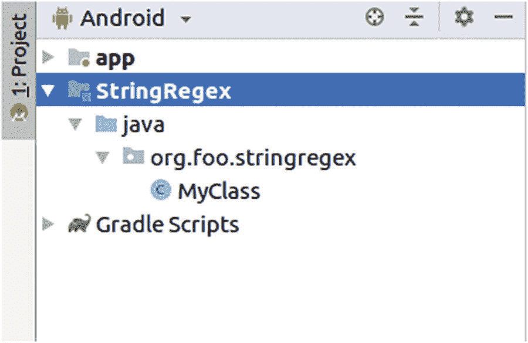

# 19.使用外部库

外部库是通用的接口和类的集合，因此可以在各种项目中重用。您还不会找到很多 Kotlin 库，但是因为 Kotlin 很容易与 Java 类和接口连接，所以在您的项目中，您可以使用其他开发人员和开发团队发布的一个或多个 Java 库。

外部库的示例领域包括编码和解码、压缩、CSV 文件处理、电子邮件、高级数学和统计、数据库、扩展日志记录工具、XML 和 JSON 文件处理等等。在第 20 章中，你会学到更多关于 XML 和 JSON 的知识。

这一章的其余部分将讨论如何在你的 Android 项目中添加外部库，如果你添加了外部 Java 库，将深入探讨与可空性相关的特性，并描述如何构建你自己的库。

## 添加外部库

添加外部库的第一步是指定库的来源。可以加载或包含库的地方被称为*库*。一旦你开始一个新的 Android 项目，项目的`build.gradle`脚本包含两个地方的库，在`buildscript`部分和`allprojects`部分:

```java
buildscript {
    ...
    repositories {
        google()
        jcenter()
    }
    ...
}

allprojects {
    ...
    repositories {
        google()
        jcenter()
    }
    ...
}
...

```

*应用*依赖项使用来自`allprojects`部分的存储库。来自`buildscript`部分的存储库转而引用*构建过程*的插件和依赖项。我们想要添加应用程序库，而不是调整构建过程，所以我们应该看看`allprojects`部分。这里可以指定以下存储库:

*   这是一个储存库，从这里可以加载 Android 特有的库。对于 Android 项目来说，这总是包括在内并且总是必要的，但是它通常不是您查找特定于应用程序的库的地方。换句话说，这不是我们用来存放外部库的地方。

*   `mavenCentral()`:这是位于 [`https://repo1.maven.org/maven2`](https://repo1.maven.org/maven2) 的原始 Maven 仓库。在谈到 Maven 构建系统时，大多数开发人员首先想到的是这个用于添加库的存储库。然而，对于 Android 来说，第一选择是使用`jcenter`来代替。

*   `jcenter()`:在 [`http://jcenter.bintray.com`](http://jcenter.bintray.com) 引用一个替代的 Maven 库。通常偏向于`jcenter`而不是`mavenCentral`不会有什么坏处，但是在很多情况下两者都可以工作，甚至有可能两者都指定。不同之处可能表现在下载库的不同性能，以及不同的“最新”库版本。`jcenter`人声称他们的库比`mavenCentral`更大更快。

*   `mavenLocal()`:无论你如何使用 Maven 作为构建系统，在你的开发机器上，一个缓存将会被构建起来，并永久地填充你从任何 Maven 库(包括`jcenter`)下载的库。此外，如果您创建了一个 Maven 库项目并安装了它，那么这个库将会出现在这个缓存中，即使您从未打算将它上传到一个官方的公共存储库中。`mavenLocal()`存储库在缓存中查找库依赖关系。请注意，您通常会在 PC 用户的`home`文件夹中的`.m2`下找到该缓存。

*   `maven { url '` [`http://example.com/maven'`](http://example.com/maven) `}`:您可以使用它来添加一个定制的 Maven 资源库。如果您使用私人或公司的 Maven 存储库，这将非常方便。注意，`google()`和`jcenter()`库只是`maven { url '` [`https://dl.google.com/dl/android/maven2/`](https://dl.google.com/dl/android/maven2/) `' }`和`maven { url '` [`https://jcenter.bintray.com/`](https://jcenter.bintray.com/) `' }`的快捷方式。

*   `ivy { url '` [`http://example.com/ivy'`](http://example.com/ivy) `}`:您可以使用它来添加一个 Apache Ivy 存储库。

在大多数情况下，使用默认设置就可以了:如图所示使用`google()`和`jcenter()`。您可以尝试这些方法，并在必要时添加新的存储库。

随着存储库的建立，我们现在可以以依赖关系的形式添加实际的库。这在模块的`build.gradle`文件中效果最好。对于一个新项目，该文件的`dependencies`部分可能是这样的:

```java
dependencies {
    implementation
        fileTree(dir: 'libs', include: ['*.jar'])
    implementation
        "org.jetbrains.kotlin:kotlin-stdlib-jdk7:
         $kotlin_version"
    implementation
        "com.android.support:appcompat-v7:28.0.0"
    implementation
        "com.android.support.constraint:
         constraint-layout:1.1.3"
    testImplementation
        "junit:junit:4.12"
    androidTestImplementation
        "com.android.support.test:runner:1.0.2"
    androidTestImplementation
        "com.android.support.test.espresso:
         espresso-core:3.0.2"
}

```

(每一项占一行。)细节这里没什么意思；你需要知道的是，对于新的外部库，我们必须添加另一行以`implementation`开头的代码。这个新条目的精确语法遵循以下格式:

```java
implementation "MAVEN_GROUP_ID:MAVEN_ARTIFACT_ID:VERSION"

```

或者

```java
implementation 'MAVEN_GROUP_ID:MAVEN_ARTIFACT_ID:VERSION'

```

这个组 ID、工件 ID 和版本的三元组也被称为 *Maven 坐标*。

一个等效的方法是使用一个参数化的表单(写在一行上，不换行):

```java
implementation group: "MAVEN_GROUP_ID",
    name: "MAVEN_ARTIFACT_ID",
    version "VERSION"

```

同样，你也可以使用单引号。

这最好用一个例子来解释。假设您想要添加 Apache Commons 数学库，它允许复杂的数学计算。我们首先需要确定库的 Maven 坐标。有几种方法可以得到这些坐标。

*   该库可能有自己的网站，例如，Maven 坐标可以在下载中找到。

*   直接查看存储库的网站，并使用那里提供的搜索工具。

*   使用您选择的搜索引擎，输入一个搜索字符串，比如“apache commons math maven”

在大多数情况下，您将获得形式为 XML 字符串的 Maven 坐标

```java
<!-- https://mvnrepository.com/artifact/
     org.apache.commons/commons-math3 -->
<dependency>
  <groupId>org.apache.commons</groupId>
  <artifactId>commons-math3</artifactId>
  <version>3.2</version>
</dependency>

```

在`dependency`元素中，您可以看到组 ID、工件 ID 和版本。因此，通过查看标记名，可以很容易地从 XML 中推导出 Gradle 等价物。这里的转录是

```java
implementation "org.apache.commons:commons-math3:3.2"

```

或者

```java
implementation group: "org.apache.commons",
    name : "commons-math3",
    version : "3.2"

```

(一行)。

### 注意

有时你也会得到 Gradle 语法。即使上面写着`compile 'org.apache.commons:commons-math3:3.2'`，也不要用`compile`而是用`implementation`来代替。`compile`关键字属于旧版本的 Gradle。

Android Studio 随后会要求您同步您的项目。这样做，然后你就可以在你的代码中使用这个新的库了。

## 依赖性管理

库可以依赖于其他库。这种情况经常发生，如果我们不得不手动添加一个库公开的所有依赖项，这可能会变成一场真正的噩梦。例如，另一个名为 Apache Commons Configuration 的 Apache Commons 库在 2.4 版中依赖于另外三个库，而这三个库又可能依赖于其他库，以此类推。幸运的是，Maven 会自动解析这种依赖关系，包括所有可传递的依赖关系，因此我们不需要做任何事情。

我们在这里提到这一点，是为了让你意识到这样的依赖和传递性依赖会极大地破坏我们的应用。例如，如果您添加了一个大小为 100 kb 的可疑库，由于依赖关系，它可能很容易膨胀到几兆字节。在现代设备上，这几乎不会造成真正的问题，但知道为什么应用程序文件在某些情况下会变得如此之大还是有好处的。

## 未解析的本地依赖项

如果您使用 Android Studio 创建一个新项目，模块的`build.gradle`文件的`dependencies`部分的第一行如下所示

```java
fileTree(dir: 'libs', include: ['*.jar'])

```

这意味着你放入`libs`文件夹的任何`.jar`文件都将作为库添加到你的应用程序中。没有自动的依赖关系解析会发生，你必须自己下载库。这与 Maven 的依赖包含方法有些冲突，所以尽量避免使用这种技术。

## 外部库和可空性

我们知道，在 Kotlin 中，属性的可空性在提高程序稳定性方面起着重要的作用。如果我们包括外部 Java 库，情况就不同了。作为一种语言，Java 并不像 Kotlin 那样精确区分可空变量和不可空变量。为了能够使用外部 Java 库，Kotlin 假设所有函数调用参数和函数返回值都可以为空。

如果外部库的 API 文档说函数返回值不能是`null`，那么告诉 Kotlin 这个事实的唯一方法就是使用 Elvis 操作符，如果返回值是`null`则抛出一个异常:

```java
val res = javaObject.function() ?:
          throw Exception("Cannot happen")

```

## 创建自己的图书馆

您可以用任何想要的方式创建一个库，包括使用命令行或其他 ide，比如 Eclipse。在这一节中，我们将介绍如何使用 Android Studio 创建和使用库。

在 Android Studio 中，一个库项目实际上不仅仅是一个可以包含在其他项目中的`.jar`文件。它几乎是一个独立的应用程序，因为它可以包括 Android 配置文件和描述用户界面的文件。但是，没有人阻止我们使用 Android 库来定义可以在其他项目中使用的接口和类。

作为一个例子，我们定义了一个名为 StringRegex 的库，它通过一个运算符函数来扩展`String`类，用于检查正则表达式匹配，因此我们可以编写

```java
val s = "The big brown fox jumps over the creek."
val containsOnlyLetters = s % "[A-Za-z ]*"
// -> false because of the "."

```

为了定义这个扩展函数，我们重载了`%`操作符`rem()`。代码是这样的

```java
package org.foo.stringregex

operator fun String.rem(re:String):Boolean =
      this.matches(Regex(re))

```

当然，你可以使用不同的东西。

我们首先在 Android Studio 中开始一个新的库项目。为此，请转到文件➤新➤新项目，并选择添加无活动。作为项目名，输入`StringRegexApp`，作为包名，输入`org.foo.stringregex`。作为保存位置，输入您喜欢的任何内容。让你选择 Kotlin 作为语言设置，作为一个最低的 API 级别，选择任何你认为合适的。在新的 Android Studio 项目窗口中，打开文件➤新➤新模块。选择 Java 库。输入`StringRegex`作为库名。其他设置在这里并不重要。项目视图现在看起来类似于图 [19-1](#Fig1) 。



图 19-1

StringRegex Android 库

删除 Java 类 MyClass，因为我们不需要它。在包`org.foo.stringregex`中，创建一个新的 Kotlin 文件。单击鼠标右键，然后选择“新建➤·科特林文件/类”。作为名称输入`stringregex`并作为种类选择文件。

Android Studio 可能会显示一条警告，说明 Kotlin 未配置。如果是这种情况，单击 Configure，从菜单中选择 Java with Gradle，在询问您要启用 Kotlin 的模块的对话框中，选择 All modules。

### 注意

对于 Android Studio 3.3，Kotlin 配置向导中有一个 bug。在 Stringregex 模块的`build.gradle`文件中，您可能需要注释掉`plugins`中的插件版本:

`id 'org.jetbrains.kotlin.jvm' //version '1.3.20'`

打开`stringregex`文件，输入前面清单中显示的扩展功能代码。您现在可以关闭窗口了，因为我们将从一个客户端项目中引用它。

从 Android Studio 中打开的任何应用程序中，您可以选择我们为这本书创建的应用程序之一，打开`settings.gradle`文件，并添加两条语句。

```java
include ':StringRegex'
project(':StringRegex').projectDir =
      new File('../StringRegexApp/StringRegex')

```

其中,`File()`中的字符串必须指向我们刚刚创建的库模块。我们仍然需要声明模块依赖关系。为此，打开客户端应用模块的`build.gradle`文件，在`dependencies`部分添加

```java
implementation project(":StringRegex")

```

这个过程可以根据你的需要对任意多个引用这个库的应用程序重复。

现在，您可以导入扩展函数，并在客户端代码中使用它。

```java
import org.foo.stringregex.rem

...
val s = "The big brown fox jumps over the creek."
val containsOnlyLetters = s % "[A-Za-z ]*"
// -> false because of the "."

```

要查看或使用从库中生成的`.jar`文件，请在操作系统的文件系统浏览器中转到`StringRegexApp / StringRegex / build / libs.`