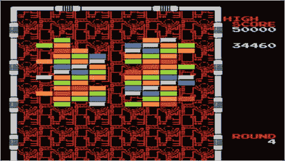
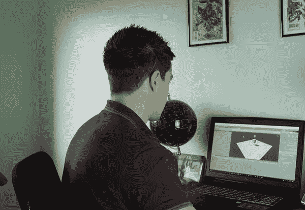

# 一、为什么这是一个为 Android 开发游戏的激动人心的时刻

这是独立游戏开发商的黄金时代。

以前也有过这样的时候。那是在家用电脑的早期——ZX 频谱和 Amstrad 的时代。由于技术的限制，那时的游戏非常简单。不管你的开发团队或预算有多大，你用那个硬件能做的也就那么多了！这使得每个人都处于一个公平的竞争环境中，这意味着一个敏锐的程序员可以在他们的地下室舒适地获得像 Arkanoid 这样的名副其实的成功(见图 1-1 )。

图 1-1。

Arkanoid, from a time when all games were indie

然后技术在发展，游戏产业在成长，我们看到了 AAA 级游戏的出现。游戏成了比好莱坞电影更大的赚钱机器，硬件也突飞猛进。一个开发者不可能与光环或侠盗猎车手这样的公司竞争。不仅像这样的游戏中的每个模型都需要从头开始设计，每一行对话都需要记录，而且简单地编写决定事物爆炸方式的物理量对于一个单独的开发者来说是不可能完成的任务。

然后命运介入了。iOS 和 Android 等移动设备和操作系统的增长引入了新的“低规格”设备。与此同时，更好的分销渠道，如谷歌 Play 商店、iTunes 应用商店，甚至 Steam，都帮助小开发者发现了他们的创作。

慢慢地，越来越多的独立开发者开始发布游戏并获得好评，随着时间的推移，这最终转化为商业上的成功。像《洞穴探险》这样的早期作品！显示了伟大的游戏性和创造性的想法可以胜过 AAA 级的生产价值。后来，像 Limbo 或 Fotonica 这样的艺术尝试表明，风格化的视觉效果可以像超真实的图形一样引人注目。很快，像《超级肉仔》和《愤怒的小鸟》这样的游戏开始在销量上与顶级工作室竞争。事实上，《我的世界》，一个世界著名的独立游戏和家喻户晓的名字，现在实际上是有史以来第二畅销的游戏(仅次于俄罗斯方块)。《无人天空》是 Steam 上有史以来最畅销的游戏之一——它也来自一家独立工作室。

这一运动近年来势头越来越大。随着许多游戏玩家逐渐对过度刺激的《使命召唤》(Call of Duty)等普通的大预算续作变得漠不关心，独立游戏为自己打造了一个利基市场，并因能够提供更具创意和大胆的体验而赢得了声誉。有时候，这些经历甚至挑战了传统的游戏“游戏”的概念著名的例子是最近越来越受欢迎的“行走的模拟人生”。

## 输入 Unity

虽然许多因素促成了独立游戏的快速增长，但 Unity(图 1-2 )等工具也对这一运动做出了巨大贡献。Unity 是一个游戏引擎，它让开发变得特别容易，让初学者可以开始创建自己的程序。

图 1-2。

The Unity logo

游戏引擎是软件的主干，它提供了游戏运行所需的许多基本元素。这些元素包括显示(渲染)3D 和 2D 图形的能力，处理基本物理(称为物理引擎)，检测游戏对象之间的“碰撞”(碰撞引擎)，甚至提供基本的人工智能脚本或其他现成的素材。

像 Unity 这样的工具允许一个开发团队专注于使他们的游戏独特的元素，然后简单地将它们插入到工作环境中，而不是从头开始创建游戏。Unity 将这一点与便捷的界面和跨平台功能相结合，从而节省了数以千计的时间，否则从零开始构建一个完全实现的游戏并将其移植到 Android、iOS 和 Windows 是必要的(图 1-3 )。

图 1-3。

Unity saves developers a huge amount of time

在这一点上，你可能想知道使用像 Unity 这样的工具在某种程度上是否是“欺骗”。如果 Unity 为你的物理学提供了底层代码，那么你真的“制作”了这个游戏吗？如果它提供了一个用户友好的图形界面来拖放预先制作的游戏资源，它与“游戏制作者”有什么不同呢？和《超级马里奥制造》差那么远吗？

毫无疑问:Unity 是一个全面的工具，被成千上万大大小小的开发者所使用。许多你在 Android(和其他地方)上最喜欢的游戏很可能是用 Unity 开发的，包括:

*   神庙逃亡
*   坏猪
*   Lara Croft:走吧
*   双人舞:秋天
*   逃跑计划
*   银河战士系列在线版
*   锈
*   超级英雄
*   幸运的故事
*   纪念碑谷
*   库法达
*   奥里和盲林
*   布洛费
*   倾斜画笔

简而言之，Unity 是一款专业级软件，已经被用于创建一些最大的独立游戏，甚至一些最大的 3a 游戏。使用现成的素材远不是不专业的标志；事实上，它是编码中最重要和最受鼓励的策略之一。任何优秀的程序员都遵循的一个关键原则是:不要重新发明轮子。换句话说，不要花大量的时间在物理引擎、人工智能甚至 3D 模型上，因为这些工作已经存在并可供使用。简单地这样做不是对时间的好利用，随着游戏变得越来越复杂和雄心勃勃，共享资源和代码不仅是明智的，而且是必要的。专业的开发者知道这一点，业余的也应该效仿。

当 Unity 是一个被证实的量时——当你知道它能够产生大量的热门歌曲时——你为什么要忽视它而使自己的生活更加困难呢？

## 共享素材

分享的风气是现代发展的重要组成部分，只需要快速的谷歌搜索就能意识到这一点。Unity 消除了许多复杂编码的需要，否则你必须自己处理，如果你想做一个非常基本的 2D 平台，那么你几乎不用写任何代码。当你不得不写代码时，如果你在论坛或其他地方提出这个问题，你通常会找到愿意帮助你的人。当然，这本书应该为你提供你需要的所有基本代码，以及理解如何创建更多的代码。

有时，您会需要 Unity 本身没有的代码，并且您不想从头开始创建这些代码——例如，特定的视觉效果或高级控制方案。幸运的是，这就是共享再次派上用场的地方。Unity 实际上在软件本身中构建了一个解决方案——不需要搜索网页或下载文件并将其导入到您的项目中。Unity 素材商店(图 1-4 )是一个资源，你可以在这里下载脚本、模型、精灵、纹理、特效等等，所有这些都是由社区或 Unity Technologies 本身提供的。下载这些组件会自动将其集成到您的项目中。更好的是，许多素材是免费的；其他的花费相对较少。通过充分利用这一特性，您几乎只需编写一行代码就可以创建任何您能想到的东西。

图 1-4。

The Unity Assets Store, where you can find all the scripts, sprites, effects, and more

这种开源的分享精神是最近帮助独立开发如此大规模起飞的另一件事。通过众包和借用游戏元素，开发者可以在原本需要的很短时间内构建出具有专业水准的巨大世界。

最好的部分？Unity 本身对业余爱好者和小型独立开发者也是免费的。你可以下载它，立即开始，无限制地发布到 Steam 或谷歌 Play 商店，直到你的游戏开始每年超过 10 万美元，这时你需要支付许可证费用(这仍然是非常合理的)。如果你每年的投资超过 20 万美元，你也需要付费，如果你打算将你的应用想法带到 Kickstarter，你需要记住这一点。有些功能也只对付费账户开放，但是大多数首次开发者不需要担心这个(我会在第二章详细介绍)。

此时你应该感到兴奋！通过使用 Unity，你可以用最近一些最大的开发者使用的完全相同的工具来构建一个游戏。构建一些基本的东西几乎不需要任何编码，当你确实需要独特的元素时，你通常可以在线获得它们。考虑到你将能够开发的游戏的质量，这里的学习曲线是非常宽松的——而且它是完全免费的(只要你坚持在免费许可证的限制之内)。

如果你一直梦想成为一名游戏开发者，但觉得遥不可及，那就再想想吧。从来没有这么容易过，有了 Unity 和这本书在手，没有什么能阻止你。

## 为什么移动设备非常适合独立项目

Unity 的另一个优点是它是跨平台的。你可以在你的 Windows PC 上制作一款游戏，然后在 Android、iOS、Xbox、Playstation、Unity(图 1-5 )等平台上销售。其中一些要求您申请开发人员许可证，购买开发工具包，或者面临其他限制。然而，理论上，跨平台的可能性是无限的。正如你将在本书后面看到的，Unity 甚至支持虚拟现实平台，如三星 Gear VR、Oculus Rift、HTC Vive 和谷歌 Daydream。当你按照这些页面中的说明进行操作时，如果你愿意，你可以选择将你的游戏移植到所有这些平台上。

图 1-5。

Indie titles are highly popular on Steam

但这本书的重点将是 Android。这是因为 Android 是所有这些平台中最开源和最大的。它的进入门槛也最低，你会发现它通常是最容易成功的平台。

再回头看看用 Unity 制作的大型游戏列表，你会发现很多都是手机游戏。其中一个原因是 Unity 和移动平台都吸引了独立开发者。有两个原因说明移动设备是印度的理想之选:

*   手机让你通过一个简单的分销渠道接触到大量的受众。
*   移动降低了人们对游戏的期望，因此也降低了游戏创作的工作量。

简单来说，如果你为 Xbox One 开发一款游戏，它将与《使命召唤》和《侠盗猎车手》等游戏竞争。虽然 Xbox 上有蓬勃发展的独立场景，但潜在的图形保真度仍然要高得多，甚至输入也更加复杂。

这就是为什么《无尽的奔跑吧》在手机上如此受欢迎，但在其他平台上却不太成功的原因。无尽的奔跑是主角向前奔跑的游戏…无止境…玩家所要做的就是在正确的时间点击“跳”。偶尔，他们可能还需要滑动来改变车道或点击另一个按钮来执行另一个动作。但最终，游戏由随机生成的障碍、最少的输入组成，没有传统意义上的“阶段”。在移动设备上，这是可以接受的，因为当你在银行排队时，它提供了理想的两分钟分心。但是大多数人都不想坐下来玩一段时间的无休止的跑步，因此他们在游戏机和个人电脑上相对较少。

现在问问你自己:作为一个新的开发者，你更愿意做一个超真实的 3D 角色扮演游戏(RPG)——还是一个无止境的跑步者？

当然，这并不意味着你可以制造垃圾。这只是意味着手机游戏玩家更加宽容，更喜欢小规模的娱乐活动。这意味着你可以用一些精致但相对简单简短的东西取得成功。显然，这种一口吃掉的性质通常会反映在价格上，但这只是意味着你可能会卖出更高的数量。当然，如果你想变得更有野心，没有什么能阻止你。像《侠盗猎车手》系列中的几款游戏这样的完整游戏已经成功移植到手机上，双截棍射手、RPG 和其他游戏也是如此(见图 1-6 )。

图 1-6。

Playing Geometry Wars 3 on an Android device

然而，批量销售把我们带到了下一点。移动平台如此受欢迎的另一个原因是它们拥有如此庞大的受众群体。如今，大多数人都有某种智能手机，可能运行 iOS 或 Android，这包括各种不同的人口统计数据。从祖父母到年幼的孩子，每个人都可以享受像愤怒的小鸟、糖果粉碎或与朋友交谈这样的游戏，这给了你大量的观众。

如果你把制作 Android 游戏作为一种爱好，你将能够与朋友分享它们，并获得大量反馈。如果你制作它们的目的是为了潜在的销售，那么你将拥有广泛的受众来推销它们。

## 为什么对开发者来说 Android 比 iOS 好

所以，手机很棒，但安卓更棒。为什么？首先，除了智能手机和平板电脑，Android 应用现在也可以出现在一系列设备上。Android 是一个完全开放的操作系统，这意味着 OEM(原始设备制造商)可以对其进行修改，以在电视、智能手表、电子书阅读器、洗衣机和其他各种硬件上运行。

好吧，所以大多数游戏短期内不会在洗衣机上运行。但是你当然可以创建一个在智能电视上运行的游戏，或者更好的是，像 Nvidia Shield 这样的游戏。更有可能的是，你将能够利用 Chromebooks 新的交叉兼容性。Chromebooks 是运行 Chrome OS 的计算机，Chrome OS 是一种基于浏览器的轻量级操作系统，自 2016 年以来一直能够原生运行 Android 应用。我会在后面的章节中详细讨论如何最大限度地兼容你的应用。

### Android 相对于 iOS 的实际优势

选择 Android 而不是 iOS 也有实际优势。除此之外，当你选择 Android 时，整个过程要简单得多。目前，将应用上传到 Play Store 仍然是一个相对简单的过程，任何人都可以管理，不需要花费超过几个小时。你可以想出一个应用的想法，把一些东西放在一起，并让它在 24 小时内上线。

要想在安卓系统的游戏上赚到真金白银，你需要尝试进入谷歌 Play 商店(图 1-7 )，用户可以在那里搜索并下载应用。这样做需要一次性支付 25 美元的费用，并且全部自动处理。你只需打包并签署你的 APK 文件(图 1-8——别担心，我会告诉你怎么做)并使用简单的屏幕指示上传它。该应用然后上传并通过自动批准过程，几个小时内人们就可以开始下载它。你可以多次这样做，而不需要再次付费，并且你的应用只有在违反谷歌政策的情况下才会被删除。

图 1-8。

Success is just a click away

图 1-7。

Games in the Google Play Store

与苹果的流程相比，这是一件轻而易举的事情，苹果的流程首先需要每年 99 美元的重复费用。即使你只有一个应用，每个月下载几次，你仍然需要每年支付 99 美元来维持它的运行。此外，iOS 应用需要经过一个审批过程，其中涉及真正的人类版主和更严格的限制。许多应用就是不允许在 iTunes 上运行，给出的原因往往有些模糊或武断。我知道至少有一个开发人员拒绝了一个笑话应用，因为它“不够有趣”那肯定是个人品味的问题！

当然，苹果的做法确实会让 iTunes 商店的应用整体质量有所提高。一般来说，iTunes 上的应用至少会达到最低质量，而一些相当严重的糟粕会进入 Play Store(这不是我们的目标！).然而，iOS 的风险在于，你花了几个月的时间创建了一个你非常满意的应用，结果却是它被拒绝，永远见不到天日。更重要的是，当涉及到应用的内容和性质时，使用 Android 只会给你更多的创作自由和更多的选择。

哦，还有一件事:为了开发 iOS，你需要给自己买一台 Mac 电脑和一台 iOS 设备来测试。这与为 Android 开发形成对比，理论上你甚至可以不需要 Android 手机就可以使用模拟器。这些必需的购买增加了开始使用 iOS 所需的投资。

### Android 与 iOS 的价格为$$$

如果你对创作游戏主要是为了赚钱感兴趣，你可能不太关心创作自由，而更关注哪个平台能让你赚最多的钱。这样的话，苹果确实有一点点优势。

首先是好消息:Android 用户比 iOS 用户多得多，但 iOS 用户在应用上的花费可能是 Android 用户的两倍半。简单来说，iOS 用户往往口袋里的钱多一点，也更倾向于使用它。实际上，这个 2.5 倍相当于每个应用 1.08 美元，而不是 0.43 美元。iOS 用户进行应用内购买的可能性也增加了 50%(根据 AppsFlyer 在 2016 年发布的应用内支出全球和区域基准状况)，7.1%的 iOS 用户每月至少进行一次应用相关支付，而 Android 用户只有 4.6%。

有一类应用是 Android 有优势的，但不幸的是，它对我们这些游戏开发者来说毫无用处:这一类是实用程序(图 1-9 )。Android 用户更有可能在实用程序上花钱，这很可能是因为开发者和应用所有者在这方面获得了更大的自由，允许他们创建自定义启动器、内存/电池管理工具、多任务应用等。

图 1-9。

Multiscreen Multitasking, an old utility app I developed for Android several years ago

AppsFlyer 的报告还揭示了其他有趣的数据:例如，与其他地区相比，亚洲用户在应用内购买上的支出高出 40%。如果你打算使用免费增值商业模式，瞄准亚洲市场可能是一个不错的策略。后面的章节将更多地讨论如何最大化你的收益。

现在的问题是:考虑到 iOS 提供了更大的收入潜力，你还应该为 Android 开发吗？当然，这是你的决定，但对许多人来说，为 Android 开发的好处大于坏处。为 iOS 开发需要太多的投资和风险，进入门槛太高。另一方面，Android 允许你立即开始开发游戏，并以更多的创作自由和更少的创作被拒绝的机会接触到更多的观众。最重要的是，Android 的市场份额在不断增长，而 iOS 的市场份额在萎缩。考虑到成千上万的原始设备制造商正在生产 Android 设备，而只有一家制造商在生产 iOS 设备，这是显而易见的。总体而言，应用支出也在上升。这使得 Android 成为更“面向未来”的市场，因为你的受众(和收入)可能会随着时间的推移而增加。

因此，尽管 iOS 可能是利润稍高的平台，但为 Android 开发也很有可能赚很多钱。到目前为止，比平台更重要的是应用的性质、营销和推广。在本书的其余部分，你将学会如何熟练地处理所有这些。

## Android 和 Unity:天作之合

希望你现在相信 Android 是独立游戏开发的首选平台。选择 Android，你可以通过消除限制和前期费用让自己的生活变得非常简单，这意味着在 Play Store 中有一个可用的应用并开始推广它之前，时间会更短。

我们战略的另一个关键部分是 Unity 3D。我们已经看到了 Unity 提供的一些令人难以置信的优势，通过选择使用 Unity 为 Android 开发，您大大降低了成为开发人员的门槛。在第二章你会学到更多关于 Unity 的工作原理。现在，请记住它是一个游戏制作工具，与其他工具相比，它可以让你在很短的时间内制作出更专业的游戏。有了 Unity，你可以在几天之内真实地组装一个无限转轮或太空射击游戏，它看起来就像一个经验丰富的大型发行商的任何东西一样令人印象深刻(如果你玩得好的话)。

Unity 的界面对初学者非常友好，允许你根据需要简单地在屏幕上拖放许多元素(图 1-10 显示了该界面的预览)。如果你担心编程，考虑一下你实际上可以完全避免使用前面提到的 Unity Assets Store 进行编码，尽管这样做在很大程度上限制了可能性。

图 1-10。

Developing with Unity

正如我们已经看到的，Unity 也是跨平台的，允许您只需轻触一个按钮就可以发布多种格式。因此，所有关于是针对 Android 还是 iOS 的辩论都不太相关，因为你可以简单地创建一个游戏，然后按一下按钮就发布到两个平台。事实上，您还可以发布到 PC (Windows Store 和 Steam)、Windows Phone、Linux、Xbox 等等。

创建你的游戏的过程在不同的平台上几乎是一样的，所以即使是 iOS 开发者也能从我们在这里讨论的内容中受益。

## 如何选择你的第一个项目

使用 Unity 3D，可能性几乎是无限的。您可以创建任何东西，从简单的益智游戏到完全实现的 3D 第一人称射击游戏。由于摩尔定律，现在普通智能手机的功能已经接近游戏机质量，可以放在我们的口袋里。

但这并不意味着你应该开始下一次使命召唤。使用 Unity 完全有可能为 Android 开发一个非常详细的 3D 游戏(见图 1-11 )，但这并不意味着你应该这样做。这是绝大多数第一次开发的人会犯的错误，也是你需要从这本书中学到的最重要的信息之一。

图 1-11。

Full 3D is also easy in Unity

简单地说:大多数第一次开发的人都有远远超过他们能力的抱负——他们只是忽略了在他们的第一个项目中控制他们抱负的需要。我并不想踩在任何人的梦想上，但这是一个更好的策略，开始创造一个可实现的和现实的目标，而不是承诺一个不可能的项目，最终占用你多年的生活，永远不会被看到完成。

想一想开发一个 3a 风格的标题所涉及的巨大事业。在一个城市环境中创建一个 3D 关卡，你需要 3D 建模每一个路人、每一辆车、每一个灯柱、垃圾箱、信箱、电话亭、街道上的垃圾、建筑物、敌人……不胜枚举。这些项目中的每一个都需要真实的物理、流体动画和相关的声音效果。你将需要过场动画、画外音、音乐、广阔的游戏区、多层次....对一个人来说，这是一个可能需要很多年的项目。到那时，技术将会继续发展，你所创造的一切可能会看起来过时。这就是发生在《毁灭公爵:永远》上的事情，这是一款背后有着经验丰富的大型工作室的游戏。这就是为什么最成功的独立游戏往往没有最逼真的图形；相反，他们选择吸引眼球的原创艺术风格，同时减轻创作者的工作量。

### 创造一个成功的独立作品的最佳策略

看看类似 Limbo 的东西，一款适用于 Xbox、Playstation、Windows 和 mobile 的游戏。这是一款早期的独立游戏，卖得非常好，在游戏社区引起了巨大的轰动。这在一定程度上要归功于完全使用剪影的艺术风格。这符合游戏的基调和形象，同时看起来令人惊叹，视觉上也很有趣。开发商(Playdead)无法通过使用超真实图形与顶级出版商竞争，而是走了一条完全不同的路线，提出了一些独特而非常有吸引力的东西。这些截图在应用商店滚动的过程中会非常突出，足以激起购物者的兴趣，并有可能让他们购买。

更好的是，通过选择使用轮廓，Playdead 大大减少了精灵和游戏元素所需的细节数量。游戏有绝对华丽的动画，这真的有助于销售的气氛，但这可能是唯一可能的，因为缺乏细节使团队能够将注意力集中在该地区。

当然，不是每个游戏都可以使用剪影，但是你需要跳出框框思考，变得有创意。一个特别受欢迎的选择是使用“像素艺术”。这是一种复古风格，模仿旧的 8 位和 16 位游戏机的图形，具有非常怀旧的吸引力。同样，它限制了所需的工作量。像《超级兄弟:剑与武器》EP 这样的游戏展示了这种风格是如何被运用到非常漂亮的效果中的。

### 考虑游戏性

同样的方法也应该用在游戏中，尤其是你的第一个项目。与其致力于制作需要你创建 3D 模型和充满细节的大地图的第一人称射击游戏，不如尝试一些 2D，最好是用程序生成或其他技术来减少你的工作量。(程序化生成是指游戏元素根据算法随机添加，去除了手动创建关卡的必要性。)

如前所述，无尽的奔跑在移动平台上非常受欢迎，这要归功于它们简单的游戏性和缺乏复杂的控制。在这里，当主角向前奔跑时，你所做的就是点击跳跃，这允许你躲避即将到来的障碍和敌人。所述障碍和平台是随着游戏向前滚动而随机产生的，并且玩家持续的时间越长，游戏的速度越快。可重复性来自于努力达到最高分，也来自于没有两次“跑”是完全相同的这一事实。像雷曼嘉年华运行，卡纳巴尔特和马里奥运行这样的游戏已经用这个非常简单的公式卖出了大量的游戏。Flappy Bird 也可以被视为传统无限转轮公式的变体。

其他游戏使用更简单的游戏机制。Terry Cavanagh 的神奇超级六边形利用了非常有创意的图形，由向屏幕中心移动的六边形组成(这产生了一种非常迷幻的效果)，以及一个简单的目标，即按下屏幕的左右两侧，尝试将您的化身移动到每层的小间隙中。这个游戏看起来非常独特和催眠，难度使它非常吸引人。这足以使它成为一个巨大的成功，特里不需要设计一个单独的精灵或关卡地图。

或者山羊模拟器怎么样？这是一个独立游戏，正如它的名字所说:它允许你控制一只山羊，同时在沙盒环境中制造各种混乱。这款游戏是 3D 的，但是它愚蠢的本质意味着没有人会期待真实的图形或物理，甚至是挑战关卡设计。尽管如此，这款游戏还是非常成功，这要归功于其核心理念的吸引力以及所有游戏片段对 YouTuber 的友好性。在这种情况下，光是这个想法就胜过了对任何技术成就的需求。Android 上有许多游戏声称是“世界上最难的游戏”，这些游戏之所以成功是因为同样的原因:它们的概念天生就很吸引人，这促使人们下载。

如果你想把开发游戏作为一种爱好，那就随意摆弄你喜欢的任何夸张的项目。但是，如果你想赚些钱，或者至少从真实用户那里得到一些积极的反馈，寻找“容易的胜利”——至少在开始的时候。

## 所以这是我们要做的

暂时搁置那个改变世界的角色扮演游戏，转而考虑在你的第一个项目中做一些更小的东西。忘记 3D 屠龙者:史诗般的探索，多想想复古的抓捕游戏。

一个简单的益智游戏，一个基本的 2D 平台，或者一个你可以在几周内完成的无限跑者，将会给你机会将一些具体的东西带到这个世界，并在你前进的过程中发展你的技能。这样，你就不会在一些可能永远不会成功的事情上投入太多的时间和精力，你就能很快开始受益并完善你的策略。好消息是 Unity 有一个 2D“模式”,使得这个策略简单了很多，并且改变了用户界面和特性来更好地支持 2D 游戏开发。

在商业中，这种方法被称为快速失败。你不是创造一个需要多年研发和数千美元投资的产品，而是创造简单、容易、不需要成功的产品。如果产品失败了，你只需继续你的下一个想法。但是，如果它在市场上获得了牵引力，那么你就要花一些时间来发展这个想法，并进一步发展。

没有什么比把你生命中的岁月倾注在一款游戏上，只为了它获得十次下载和一星评价更能摧毁灵魂的了。所以，创建一个 MVP(最低可行产品)，让它进入 Play Store，然后只有在它找到受众的情况下才能开发它。

如果你的艺术风格足够独特，游戏玩法足够新颖，你的营销技巧足够强大，你会惊讶于一个相对简单的游戏所能产生的影响。

## 你将从这本书中学到什么

考虑到所有这些，这本书将带你经历使用 Unity 设计、构建和发布一款全功能 Android 游戏的整个过程。具体来说，它带你通过创建一个 2D 平台或一个无止境的跑步者的基础，这包括从建立物理和精灵到签署你的 APK 准备上传到游戏商店的一切。

你将要做的项目将足够基本，你可以很容易地修改它以适应你自己的目的，通过改变几个精灵并给它一个新的标题，你将准备在几周内发布你的第一个游戏。游戏将会很简单，但是会有足够的功能来帮助你掌握 Unity 游戏开发的核心概念，这样你就可以将它们应用到未来的项目中。

您将发现以下内容:

*   如何安装和设置 Unity
*   如何使用 Android SDK(软件开发工具包)
*   如何在 Unity IDE(集成开发环境)中找到自己的路
*   如何创建和添加精灵
*   如何添加动画
*   如何用刚体 2D 介绍物理学
*   如何使用 Visual Studio 用 C++ 和 Java 编程
*   如何添加收藏品、音效、敌人、游戏机制等等
*   如何添加关卡、分数、关卡选择、菜单等等
*   如何添加动态摄像机
*   如何设计有趣且具有挑战性的关卡
*   如何创建已签名的 APK 文件以备上传
*   如何将应用发布到谷歌 Play 商店
*   如何为你的应用定价以获得最大利润
*   如何推广您的游戏并获得更多下载

在整个过程中，我们将使用少量的代码和大量的媒体(精灵、音乐、音效和背景)，所有这些都将供您在自己的项目中使用，进行逆向工程，或者进行您认为合适的编辑。

在这本书的过程中，我们也将看到你可以用 Unity 创造和构建的各种不同的东西。目的不是限制你，所以你会发现如何在 3D 中工作，甚至为 Gear VR(图 1-12 )、Google Cardboard 和 Google Daydream 制作虚拟现实应用。这将给你一个坚实的知识基础，如果你想拓展自己的发展，并在未来承担更具挑战性的项目，这将成为你的起点。

图 1-12。

Developing for the Gear VR with Unity

是的，Unity 3D 可以用来创建应用和实用程序，如果你愿意，你在本书中学到的技能也可以让你这样做。

TLDR；这是成为独立开发者的大好时机。Android 和 Unity 为想要在 Play Store 中推出具体产品的初学者提供了完美的组合。这本书带领你完成一个简单游戏的开发，并提供你需要知道的一切，让你的第一个项目起步，并帮助你在未来成长为一名开发者。

准备好了吗？是时候开始了，玩家 1！