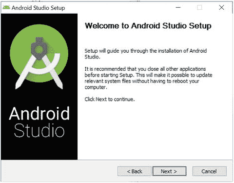

# 二、Unity 简介和设置

为 Android 开发已经对初学者和寻求赚钱的独立开发者有很大的意义。但 Unity 3D 让一切变得不同，因为它让这一切变得简单而实用。Unity 是一个令人难以置信的强大工具，它可以让你更快更容易地创建一些令人敬畏的游戏。

在这一章中，你将对 Unity 有一个更好的了解，它是什么，它从哪里来，以及你如何着手设置它，以便你可以开始使用它。

## 什么是 Unity？

第一章简要介绍了 Unity，但现在是时候更深入地了解 Unity 能为你做什么，以及它将如何影响你的工作流程。本章涵盖了什么是游戏引擎，什么是 IDE，以及如何设置和运行它。到这一章结束时，你将掌握基本知识，并准备开始动手实践。如果你已经熟悉了 Unity，并且它已经安装在你的电脑上，你可以跳过这一章。

### 作为游戏引擎的 Unity

从本质上来说，Unity 是一个游戏引擎，已经发展成为一个 IDE/快速开发工具。如果这一切听起来像天书，不要担心，我会分解它。

说得更详细一点，游戏引擎本质上是大量的代码，处理让游戏运行的所有无聊的部分。值得注意的是，这包括物理以及渲染，照明，基本的相机功能，等等。虚幻引擎是游戏引擎的另一个例子，CryENGINE 3 也是。其他的还有 Torque、Lumberyard、Ogre3D、Blender、JavaFX 等等。

如果你完全从零开始编写一个游戏，而不使用预先存在的游戏引擎，你将需要自己编写每一个细节，这意味着在你开始添加关卡等东西之前，需要进行大量的开发。当一个木箱已经被你处理好的时候，再去编码它应该如何坠落和破碎是没有任何好处的。

同样，这也是我们看到独立开发者复兴的原因。回到 ZX 光谱和 Amstrad 的时代，游戏引擎可以简单得多，大多数精灵是由大约 50 像素组成的。如果没有 Unity 这样的解决方案，当今游戏的复杂性将使一个人不可能单干。

Unity 也是交叉兼容的，这意味着它可以作为你的代码和你的目标设备之间的桥梁。编译您的游戏会压缩所有资源，并将其转换为正确的文件格式，以便添加到相应的分发平台。

简而言之，Unity 为你处理所有幕后的事情，并允许你开发一个伟大的游戏，而不用担心重新发明轮子或担心光线应该如何通过各种材料折射(见图 2-1 中我愉快地编码)。就好像宇宙的规律已经被创造出来了，你要做的就是把它填满。然后 Unity 会处理最后的必要的跑腿工作，把你的世界变成一个真正的游戏准备发行。

图 2-1。

Unity streamlines development (photo by Sophie Bunce)

今天，绝大多数开发人员——甚至是大工作室——都使用像 Unity 或 Unreal 这样的现成 ide。偶尔，一个游戏会使用一个定制的引擎(如“节奏暴力”游戏 Thumper)，但这些通常有独特的游戏机制，保证创建一个定制的引擎，他们通常花很长时间进行开发。

因为 Unity 使生活变得更容易，而没有引入任何主要限制，所以没有理由不使用它(或类似的选项，如 Unreal)。“单干”只会让挑战变得更加困难，没有任何实际的好处。

### Unity 作为 IDE

然而，让 Unity 成为开发者福音的是，它同时是一个游戏引擎和游戏制造商，拥有用户友好的界面，允许元素在屏幕上轻松拖放(图 2-2 )。

图 2-2。

An IDE is a single environment for developers to handle every aspect of creating their game

用更专业的语言来说，Unity 不是一个游戏制造商，而是一个 IDE。IDE 是 Integrated Development Environment(集成开发环境)的首字母缩写，它本质上是一套用于开发的综合工具，通过一个简单的界面就可以查看和修改一个程序的各个方面。如果你要创建一个没有 Unity 的 Android 应用，你需要使用另一个 IDE——很可能是 Android Studio，它将允许你查看代码、你的素材文件夹、调试信息、图形预览等等。在 Unity 的情况下，你可以看到场景的视图(本质上是关卡)，场景中所有元素的层次结构(称为游戏对象)，你选择关注的任何项目的细节，你的素材文件夹等等。我们将很快看看 Unity 提供的所有不同的窗口和视图。

### 统一 vs 虚幻 4(及其他)

我说过没有理由不使用 Unity，但这并不完全正确。有一个很好的理由让你选择不使用 Unity，那就是如果你打算使用其他各种游戏引擎/制造商的话。

或许最接近的比较可以用虚幻 4 来画(图 2-3 )，有很多相似的特点。两者都功能齐全，限制很少，这一点——加上它们相对简单——使它们成为独立工作室最受欢迎的两个 ide。那么两者哪个平台更好呢？为什么选择 Unity？一如既往，答案取决于你打算开发什么类型的游戏。在我们的例子中，我们打算为 Android 制作一个 2D 游戏，对于这个特定的任务，Unity 是首选。

图 2-3。

The Unreal logo (boo!)

虽然它并不多——而且往往只是归结于个人偏好——Unity 可以说对手机游戏开发和 2D 游戏开发有更好的内置支持。Unity 是手机上最受欢迎的游戏引擎，这反映了它的能力。这也确保了有一个巨大的社区为创作者提供支持，以及素材商店中几乎无限的定制素材，这可以大大加快开发速度。

许多人也喜欢 Unity 的流程，它允许你使用实体(游戏对象)和组件(脚本)的简单系统来构建游戏。这当然是一个见仁见智的问题，但足以说，Unity 在很大程度上是非常直观的，初学者也很容易使用。另一方面，虚幻的学习曲线更陡，组织性也不是很好。但虚幻 4 有更好的图形功能来开发 3a 外观的游戏。它也是开源的，这实际上意味着您可以访问源代码并对引擎本身进行更改。对于以移动设备为目标的独立开发者来说，这些都不是问题。所以 Unity 就是胜利。

### 统一的起源

Unity 由一家名为 Unity Technologies SF 的公司开发，该公司于 2004 年由大卫·赫尔加松、尼古拉斯·弗朗西斯和约阿希姆·安特在丹麦哥本哈根创立。图 2-4 为撰写时的官网。

图 2-4。

The Unity home page today

在此之前，这三位开发者自称为 Over the Edge Entertainment，并为 Mac 开发了一款名为 GooBall 的游戏，其游戏玩法类似于超级猴子球。尽管这款游戏没能引起轰动，但团队意识到该引擎可能对其他开发者有价值。因此，他们在 2006 年的 WWDC 贸易展上宣布为 OS X 推出 Unity 3D。

从那时起，Unity 经历了多次迭代和开发，现在就其支持的平台和包含的特性而言，已经更加全面了。1.1 版支持为微软视窗和浏览器创建游戏，同时支持 C/C++ 插件。2.0 版本增加了对微软 DirectX 的支持，2008 年发布了 Unity iPhone。

2010 年发布的 3.0 版本是另一个重要步骤，因为该团队希望该程序能够在 Windows 上运行，这需要从头开始重建。因此，3.0 版本整合了 Windows、iPhone，以及对 Wii 和许多其他平台的支持，而这些平台以前只能由单独的独立编辑器支持。现在 Unity 这个名字终于有意义了。是的，这也是我们支持 Android 的时候。

unity 4.3 版本见证了另一个重要的更新:Unity2D 包含了开箱即用的 2D 支持。到目前为止，开发人员基本上不得不通过使用固定的相机角度和向平面添加纹理来创建背景，从而“侵入”IDE 以支持 2D。现在，创作者可以更快更容易地利用精灵和其他更传统的方法来构建真正的 2D 游戏。

据 Unity Technologies 称，Unity 5.0 将是最大和最重要的版本，具有更好的全面性能，并对动画系统、混音器、着色器等进行了重大更新。因此，现在许多人把 Unity 称为统一。在撰写本文时，Unity 的最新版本是 5.5.0。它特别为 Android 做了许多改进，应该会提高性能。

### 如果你有新版本的 Unity 怎么办？

值得注意的是，Unity 正在不断开发其平台，并添加新的功能和改进。因此，根据你阅读这本书的时间，你可能会发现一些元素与这里描述的不同。也许你正在阅读遥远的未来，你正在使用 Unity 200。如果有，我希望你有一辆会飞的汽车。

然而，更有可能的是，你遇到的任何变化都是微小的。当然，像 Unity Technologies 这样的中间件开发人员努力避免在未来的更新中破坏代码，这意味着大多数基本功能仍然可以工作。

但在一些罕见的情况下，一行代码可能会在 Unity 中突出显示，并被描述为被否决。这意味着它被支持但不被鼓励。如果你注意到了这一点，快速的谷歌搜索会帮助你找到新的、正确的方法来处理这个功能。

### 执照

似乎 Unity 还不够棒，最棒的是它还可以完全免费使用(大部分情况下)。在未来，随着你的野心增长，你可能会发现自己需要额外的功能或收入超过 10 万美元的门槛，但大多数新手都会很好，除非他们的游戏大获成功。这是最糟糕的情况。

基本上，您可以创建几种不同类型的账户，如图 2-5 所示，每种账户都有不同的定价和不同的限制。

图 2-5。

For most people, the free personal plan will more than suffice

#### 个人的

你首先要用的免费账户是个人账户。这个账号不用花钱，Unity 连版税都不拿。唯一的限制是你每年在这个许可证上的收入不能超过 10 万美元。不过，这没关系，因为一旦你开始交出大数字，你可以简单地切换到其他许可协议之一。请记住，这个 10 万美元的限制也适用于筹集的资金，这意味着如果你在 Kickstarter 上筹集的资金超过 10 万美元，那就算数。这条规则也适用于其他来源的利润，包括点击付费广告或应用内购买。

个人帐户还有一些缺失的功能和限制。例如，当游戏启动时，使用个人帐户的创作者被要求显示 Unity 闪屏(向用户显示你在 Unity 中制作游戏)，而你将无法访问实时开发者分析或云构建。对于多人在线游戏，个人帐户一次只允许 20 名玩家。

#### Unity Plus

Unity Plus 目前每月收费 35 美元，取消了闪屏，同时将收入上限提高到每财年 20 万美元。它还增加了对大型开发人员有用的额外支持和功能，比如支持 50 个并发用户和打折的素材包。

#### Unity Pro

Unity Pro 将价格提高到每月 125 美元，并完全取消了收入上限，这意味着如果你愿意，你无需支付更多费用就可以变得非常富有。它还提供了许多专业服务，包括支持多达 200 个并发玩家，更多的分析和性能，支持大型团队，等等。

#### Unity 企业

最后，企业成员资格允许您挑选功能，以创建一个针对您的独立需求的定制开发平台。这是最高级的选择，价格实际上根本没有列出——这表明它非常昂贵。简而言之，大多数阅读本书的人暂时还不需要担心这个问题。事实上，对于绝大多数人来说，基本的个人帐户已经足够了，应该能够提供您需要的所有功能和灵活性。

Note

这些是我写这篇文章时的价格，但它们当然会有变化。也可以通过按年付费来省钱，如果你想买一个更高级的账户，你应该做进一步的研究。

下面是一个方便的表格，比较了各种功能:

<colgroup><col> <col> <col></colgroup> 
| 个人的 | 加 | 赞成 |
| --- | --- | --- |
| 所有发动机特性 | 所有发动机特性 | 所有发动机特性 |
| 所有平台 | 所有平台 | 所有平台 |
| 持续更新 | 持续更新 | 持续更新 |
| 免版税 | 免版税 | 免版税 |
| MWU 闪屏 | 自定义闪屏 | 自定义闪屏 |
| 收入上限为 10 万美元 | 收入上限为 20 万美元 | 没有收入上限 |
| Unity 云构建的标准队列 | Unity 云构建的优先级队列 | Unity 云构建的并发构建 |
| 个人分析 | Plus 分析 | 专业分析 |
| 20 名并发玩家 | 50 个并发玩家 | 200 个并发玩家 |
| Unity 应用内购买 | Unity 应用内购买 | Unity 应用内购买 |
| 统一广告 | 统一广告 | 统一广告 |
| Beta 访问 | Beta 访问 | Beta 访问 |
|   | 专业编辑用户界面皮肤 | 专业编辑用户界面皮肤 |
|   | 绩效报告 | 绩效报告 |
|   | 灵活的座位管理 | 灵活的座位管理 |
|   | 素材套件八折优惠 | 素材套件 40%折扣 |
|   | Unity 认证课件 1 个月使用权 | Unity 认证课件 3 个月使用权 |
|   |   | 源代码访问(美元) |
|   |   | 特优支持(美元) |

## 下载 Unity 和所需组件

好吧，我想我已经说得够多了。让我们从技术层面开始吧。你当然需要设置 Unity 并让它在你的电脑上运行。这在很大程度上足够简单，但是请记住，您还需要一些额外的软件。具体来说，您需要下载并安装以下软件:

*   Unity 本身
*   Android SDK(以及 Android Studio 2.3)
*   爪哇 JDK
*   可视化工作室

Android SDK 是 Android 软件开发工具包。这是 Google 提供的一套软件工具，可以作为访问硬件功能的桥梁。换句话说，它提供了 Unity 需要的源代码，以使您的游戏在 Android 平台上兼容。它还包含一些其他工具，可能在未来对你有用——包括一个模拟器，允许你在桌面上测试 Android 应用。你还需要选择安装 Android 构建支持，但你是通过 Unity 安装程序来完成的，所以没有必要单独下载。

Java JDK(图 2-6 )是另一个开发工具包，这次是针对 Java 的。这是你的计算机支持 Java 开发所需要的，因为 Java 是 Android 的主要语言，你需要它来继续。我们会先下载这个。

图 2-6。

The Java logo

Visual Studio 是您在 Unity 中用来处理实际编程的工具。当您开始编写脚本时，您将在一个单独的 Visual Studio 窗口中编辑这些脚本——但是我们可以稍后再考虑这个问题。请注意，您实际上并不需要 Visual Studio，也可以使用 MonoDevelop 之类的替代选项。但是 Visual Studio 肯定是这两者中的首选，并且会让您的生活变得轻松一些。

### 下载 Unity

要开始下载 Unity，首先前往 Unity3D.com([`https://unity3d.com`](https://unity3d.com))，然后点击立即获取 Unity。然后你可以选择你想要的计划(大多数情况下是个人的)，在那里你只需点击立即下载，然后在下一页下载安装程序(图 2-7 )。一旦你这样做，下载将开始。

图 2-7。

This is where you will find Unity

您不需要单独下载 Visual Studio，因为您可以通过 Unity Downloader 来完成。这为你节省了一点时间和麻烦。

### 下载 Java JDK

如果你觉得有点不知所措，不要担心。一旦你安装了所有这些小部件，它们就会在后台自己运行，你可以把它们忘得一干二净。这是一个一次性的过程(除非你在一台新电脑上安装 Unity ),你再也不用担心了。

Java JDK 允许你的计算机和 Unity 理解和解释 Java 代码。前往 [`www.oracle.com/technetwork/java/javase/downloads/index-jsp-138363.html`](http://www.oracle.com/technetwork/java/javase/downloads/index-jsp-138363.html) 并下载 Java SE 开发工具包(图 2-8 )。如果您的计算机支持 x64 版本，请确保选择该版本。

图 2-8。

The Java JDK download page

### 下载 Android SDK

要下载 Android SDK，请前往 [`https://developer.android.com/studio/index.html`](https://developer.android.com/studio/index.html) (图 2-9 )。点击下载 Android Studio 按钮，接受条款和条件，开始下载。如果您运行的电脑硬盘相对较小，请点按“下载选项”。Android Studio 是用于创建常规应用的标准 Android IDE，使用 Unity 实际上并不需要它。为了节省大量不必要的文件，您可以下载命令行工具，然后使用附带的 SDKManager 来下载 SDK 的其余部分。你可以在 Android Studio 网站上找到如何做到这一点的说明。

图 2-9。

It’s easiest to download Android Studio and the Android SDK at the same time

不过这要复杂得多，Android Studio 肯定是一个有用的东西，所以如果你能负担得起空间，我建议你一旦有了 Java 就安装整个包。

## 安装 Unity 3D

一旦所有东西都下载完毕，开始安装就非常容易了。首先找到保存它们的文件，然后依次双击每个文件。从哪一个开始并不重要，所有必要的步骤都将在本节中解释。

### 一致

当您双击 Unity 安装程序并接受许可协议条款时，您需要选择下载哪个版本的 Unity:64 位或 32 位。最佳版本将取决于您的 Windows 版本，因为并非所有计算机都支持 64 位。要检查您是否拥有 x64 或 x32 位处理器，请前往这台 PC，右键单击，然后转到属性(图 2-10 )。如果您的计算机是 64 位的，它将显示:“64 位操作系统，基于 x64 的处理器。”

图 2-10。

This Surface Pro 3 is 64-bit

如果你能支持 64 位，那么这是一个去，因为它将启用控制台支持和其他功能。您将看到的下一个屏幕是下载助手屏幕。这可以让你选择你想安装的组件，它会显示你需要多少空间在你的电脑上。

在左边，很多不同的选项都被勾选了，还有一些框没有被勾选。默认情况下，您应该会发现选择了以下内容:

*   Unity 5.5 0f3
*   文件
*   标准素材
*   Microsoft Visual Studio 社区 2015

它看起来应该如图 2-11 所示。让这些都保持原样，因为它们都很重要。Unity 和文档是不言自明的，而 Microsoft Visual Studio Community 2015 将允许您在游戏中创建和编辑脚本(如前所述)。标准资源选项不是强制性的，但会非常方便——这是一个大的预制脚本、精灵、3D 模型、纹理等选择，您可以在自己的游戏中自由使用。如果你有空间，那么添加这些是一个非常好的主意。如果你认为你想为所列的任何其他平台开发(并且你有空间)，那就去做吧，也勾选这些选项。

图 2-11。

Tick these boxes for smooth sailing later on

不过，还有一个默认情况下没有选中的选项，您希望确保获得:Android 构建支持。这将确保您可以创建 APK 文件并上传到 Play Store，并且在您测试和完成项目时将需要这些文件。确保勾选了。

您还会注意到这里的 iOS 构建支持，以及 Mac 构建支持、Windows 应用商店选项等。好消息是，如果需要，您可以稍后再回来添加这些内容。您会注意到需要多少空间(在撰写本文时大约为 10.3 GB)，如果您的硬盘上有可用的空间，您可以继续操作并再次单击 Next。

现在选择您希望 Unity 安装在计算机上的位置。这完全是个人喜好的问题，但是一定要记住这一点。接受更多的协议条款，再次点击下一步，然后等待 Unity 安装。

去给自己冲杯咖啡吧，因为这的确会花去不少时间。

### 爪哇 JDK

安装 Java JDK 非常简单。只需双击文件，点击下一步两次，就开始了(图 2-12 )。

图 2-12。

The JDK installer

在几个进度条被填满后，你可以选择一个目标文件夹。写的时候默认是 C:\ Program Files \ Java \ JRE 1 . 8 . 0 _ 111(图 2-13 )。就这样吧，但你可能想记下来，以备后用。再次单击 Next，安装程序将完成，您将准备好进行下一步:安装 Android SDK。

图 2-13。

Set your destination folder

### Android SDK

最后，你需要安装 Android SDK。为此，您需要安装 Android-Studio-Bundle。双击。然后单击欢迎屏幕上的下一步(图 2-14 )进入第一组选项。

图 2-14。

The Android Studio installer

在这里您将选择您想要安装的内容(图 2-15 )。恼人的是，你不能取消选择 Android Studio(因为谷歌)，但你可以决定你是否想要 Android SDK 和虚拟设备。

图 2-15。

Decide whether you need the AVD

SDK 是我们需要的主要部分，所以请确保勾选它。同时，Android 虚拟设备是一个模拟器，你可以用它来运行应用。除非你正在制作一个非常简单的益智游戏，或者你有一个非常强大的游戏装备(这里我们说的是两个 4 GHz CPU 的 GTX1080s)，否则你可能无法使用这么多来测试你完全实现的游戏。你也可以在你的 Android 设备上进行实时测试，所以如果你想为自己节省 1 GB 的数据，你可能需要取消选中这个。也就是说，它可以用于其他测试目的(例如，试验屏幕尺寸)，所以这是你的电话。

无论哪种方式，单击下一步，然后同意条款和条件。在下一个屏幕上(图 2-16 ，您可以选择安装 SDK 和 Android Studio 的位置。如果后者比较迟钝(默认情况下，可能是:C:\ Users \ rushd \ AppData \ Local \ Android \ SDK)，那么找一个更简单的地方安装它，那里有 3.2 GB+的空闲空间。记下这是哪里，因为您稍后会需要路径。我选择了 C:\AndroidSDK，因为路径不允许包含空格(很烦人)。

图 2-16。

Finally, set your destination folder

在下一个屏幕上再次单击 Next，然后安装将开始。

## 硬件和工作流程

在下载所有这些东西的同时，让我们利用这个短暂的插曲来考虑创建游戏和实现最佳设置的最佳硬件。

好消息是，你的电脑不需要特别强大来处理 Unity，但你至少需要相当现代的东西。我个人在 Dominator Pro GT72 6RE 和 Surface Pro 3 上运行 Unity(图 2-17 )。Dominator Pro 是一款非常新的 VR 游戏笔记本电脑，配有 GTX1070 GPU，在 Unity 上没有任何困难。就使用 Unity 进行 Android 开发的理想规格而言，Surface Pro 3 肯定处于低端。虽然我从来没有做不了任何事情，但当我编码时，系统确实变得相当热，一些 3D 游戏可以看到帧速率下降。

图 2-17。

A device like the Surface lets you work on the move

基于这一点，我想说 Surface Pro 3 (i5)型号代表了你想要使用的最低规格。这意味着:

*   1.9 GHz 处理器(睿频加速至 2.6 GHz)
*   集成显卡
*   4GB RAM

不过，Unity 网站推荐更高的版本，并建议开发者至少拥有某种形式的专用显卡或具有 9.3 功能级别的 DX11。更大的内存也是更好的选择，尤其是如果你打算使用其他软件如 Photoshop(或免费的替代品如 Fusion、DaVinci 或 GIMP)来创建大图像和在工具之间进行多任务处理。如果你计划用模拟器测试你的游戏，你也会想要更高的规格，尽管你甚至在使用非常强大的机器时也会为此而挣扎。

GPU 是一种图形处理器，用于更快地渲染 3D 场景。如果你主要在 2D 开发(这本书的大部分内容都将致力于此)，这可能不是一个大问题，但是给自己一些选择肯定没有坏处。同样，它对使用 Blender 进行 3D 建模的部分也很有用。

除了 GPU，另一个有用的附加功能是同时拥有 HDD 和 SSD 硬盘。固态硬盘是固态硬盘，是硬盘驱动器的替代产品，速度非常快，但通常比速度较慢的老式硬盘要小一些。得到 128 GB 或 256 GB 左右的固态硬盘是标准配置。因为 Unity、Android SDK 和 Android Studio 都占用大量空间，所以为了加快速度，在硬盘上保留至少一些文件，同时在 SSD 上保留操作系统和游戏文件可能会很方便。不过，这是一个偏好，而不是一个要求。

简而言之，可以用一台中档电脑凑合，但使用某种游戏装备肯定会更好。除此之外，拥有一个能够玩游戏的装备对于研究来说是非常有用的。

## 创建你的战斗站(工作设置)

考虑你的实际设置和工作环境也是值得的，因为这可以给你在开发过程中带来很大的不同，并且可以让你以后不再头疼。例如，一个很大的优势是拥有一个大显示器，甚至可能是一个超宽的 21:9 显示器(图 2-18 )。Unity 有很多不同的窗口和面板，我们将在第三章中看到，能够同时看到所有这些是一个很大的优势，这样你可以更容易地处理任务。大屏幕将大大提高您的多任务处理能力，帮助您避免眼睛疲劳，并提高沉浸感(消除分心)。

图 2-18。

A superior setup

如果你喜欢在笔记本电脑上工作，确保它有更大的屏幕(18.3 英寸或更大)，并且有足够的马力来应对。在咖啡馆边喝咖啡边工作是有好处的(我发现它能提高生产率)，但为此，你最好想要一台雷蛇、华硕、戴尔、惠普、联想或东芝的新款笔记本电脑。Surface Book 或 MacBook 也能很好地完成这项工作。当然，我们的安装说明是针对 Windows 用户的，所以如果你将在 Mac 上运行，你需要经历一个稍微不同的过程来启动和运行。

当然，你需要一个舒适的键盘，一个精确的鼠标来打字和拖放。在电脑上测试游戏时，有线键盘更有利于提高响应速度。如果你是为了创造最好的设置而花钱，像海盗船游戏键盘这样的东西不仅可以用来打字，还可以用来测试和玩游戏。

否则，确保你有一把舒适的椅子，理想的是一个大的桌子空间来展开和安排笔记和草图，以及一个尽可能不受干扰的房间。如果你做到了这些，你就可以开始工作了，你会发现你的工作尽可能的顺利和愉快。如果你计划做大量的开发工作，投资一个好的工作空间是一个花钱的好方法，并且会更快地完成更好的最终产品。

## 开始你的第一个项目

安装完成？太好了。

此时，您应该已经在您的计算机上安装了 Unity 和它所需的所有必要组件，并准备就绪。希望你迫不及待地投入进来并开始行动。在这种情况下，让我们第一次启动 Unity，并做最后一点设置。

首先，您需要登录您在网站上创建的帐户。如果您还没有这样做，请单击链接(创建一个)，您将被带到相关页面，在那里您可以设置一个。然后，你可以使用新的 Unity ID 登录，如果你想继续使用免费帐户，你需要确认你的公司的收入低于阈值。

一旦你通过了那个屏幕，你会看到一个窗口，让你从现有项目中选择或者开始一个新的项目。你现在可能什么都没有，因为这是你第一次使用它。因此，单击 New 并为您的项目选择一个名称和位置(图 2-19 )。你还需要确保你选择了 2D，这样游戏将自动支持 2D 格式。

图 2-19。

Starting your first project

在这一点上，你如何称呼游戏并不重要——这只是文件夹的名称。以后你可以把 APK 的名字改成你喜欢的任何名字。现在，我们姑且称之为简单的平台玩家。输入，勾选 2D，然后点击创建项目。稍等片刻，迎接你的将是一个相当空洞的 Unity 项目。有许多窗口，在这一点上可能看起来有点混乱，但是不要担心，我们将在下一章中讨论每件事情的作用。

## 设置路径

让我们做最后一点设置，告诉 Unity Android SDK 在我们系统上的位置。前往顶部菜单，找到编辑➤首选项➤外部工具。然后你会找到一个空间来输入 Android SDK(主文件夹)和 Java JDK(文件)的位置，如图 2-20 所示。如果您之前记下了这些路径，请将其复制并粘贴到此处。否则，点击浏览并导航到正确的位置。如果您的文件夹位于 AppData 中，它可能是隐藏的，所以告诉文件资源管理器显示隐藏的项目(在视图选项卡下)，然后手动跟踪它。它就在某个地方——继续找。

图 2-20。

Setting up your paths

在你第一次来测试你的应用之前，你实际上不需要担心这个，但是在我们开始之前做好一切准备是很好的。如果你愿意，你现在可以跳过这个阶段，但是一定要在你的游戏第一次发布时再回来。

完成后，Unity 现在已经建立并准备就绪。是兴奋的时候了，因为在第三章我们将开始实际使用它，安排一些游戏对象，甚至介绍非常基础的物理学。