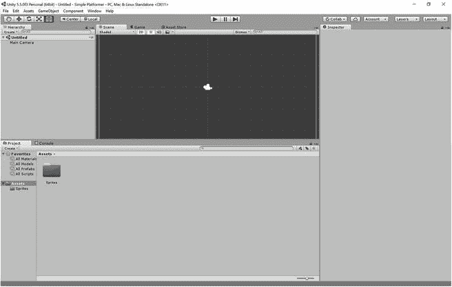
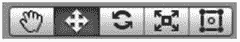
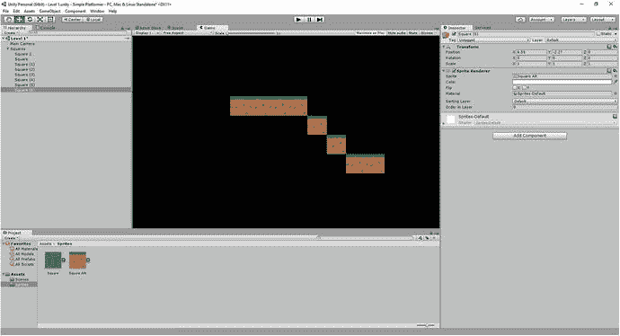

# 三、在 Unity 中寻找答案

因此，Unity 现在已经启动并运行，没有什么可以阻挡您。该走了。

在您构建任何东西之前，让我们首先让您熟悉不同的 UI 元素、控件和选项。你将在这里呆很长时间，所以熟悉一下是个好主意。

## 这是什么？熟悉 IDE

当你第一次看到 Unity(图 3-1 )时，它可能会因为许多不同的窗口、菜单和选项而显得相当混乱。幸运的是，一旦你开始行动，一切都比看起来简单得多。我们将在本章的课程中讨论这些不同视图的用途，同时我们将能够测试我们的第一个非常简单的应用。

图 3-1。

Welcome to Unity! You’ll be spending a lot of time here

首先是观点。

### 事件

Unity 的正中央是一个名为 Scene 的视图。这是你完成大量工作的地方，也是你移动各种游戏对象和安排一切的窗口。这将显示您在任何给定时间正在处理的级别/菜单屏幕的视图，并允许您选择和重新定位屏幕周围的元素。你可以放大和缩小，如果你在 3D 模式下，你还可以将相机移动 360 度。

### 素材商店

在场景窗口的顶部(图 3-2 )有两个选项卡，允许你在两个不同的功能之间切换。点击 Asset Store 选项卡，正如您所预料的，场景视图将被更改为 Asset Store 视图。在素材存储中，您可以浏览各种素材，包括脚本、游戏对象、精灵、效果等，并将其包含在您自己的应用中。这些素材由其他 Unity 开发者以及 Unity Technologies 开发。有些是免费的，有些是要花钱的；有些是对现有项目非常简单的补充，而另一些实际上是完全现成的游戏，供你随意编辑。

图 3-2。

Scene, Game, and Asset Store tabs

简而言之，通过确保您不需要手动创建每个脚本和精灵，素材存储使您的生活变得更加容易。

也就是说，这是你暂时不需要的东西，所以现在保持这个状态，不要担心它。

### 比赛

该窗口上可能还有第三个选项卡，如上图所示，名为 Game。在这个视图中，您可以看到真实的游戏，就像它在直播时一样。当你玩游戏时，这就是它的位置(除非你在玩游戏时选择最大化游戏)。

如果游戏不在同一个地方，它会在那里的某个地方。你可以自由地改变窗口的位置，有时在更新后，默认设置会改变。大多数人应该会发现所有东西都在同一个地方，他们可以按照这些指示去做。如果没有，您应该能够很快找到每个元素。

你不能将元素拖放到游戏视图中(就像在场景视图中一样)，也不能选择或移动它们。也就是说，在很大程度上，游戏视图会反映你在场景视图中看到的一些不同。首先，视角将固定在游戏中的摄像头上，这意味着你将看到你的玩家在启动游戏时会看到的东西。同样，当有多个项目共享相同的 X 和 Y 坐标时，顶部的项目将是沿 Z 轴最靠近相机的项目，而不是被选择的项目。

如果这一切听起来有点混乱，不要担心——一旦你看到它是如何工作的，就明白了(这适用于所有的窗口)。

### 服务

通常位于场景视图右侧的是服务选项卡，它与检查器共享一个窗口。这包括诸如盈利广告、了解玩家如何享受游戏的分析、多人游戏等等。请注意，如果您有免费版本，这些功能中的一些将会丢失或受到限制。

现在，您可以完全忽略这个窗口。这些服务将主要在更雄心勃勃的项目中生效，并且只有在这些应用在 Play Store 中上线后才会生效。

### 检查员

接下来是经常与服务共享窗口的选项卡:检查器(图 3-3 )。检查器是你用来查看和编辑游戏对象细节的工具。因此，当你在场景视图中选择一个游戏对象，比如精灵，你就可以使用检查器来查看对象的名称、尺寸、可能附加的脚本等等。

图 3-3。

Inspector and Services

你会经常用到这个检查器，所以把它放在你能看到的地方。但是现在，它将会是完全空白的。

### 项目

通常位于屏幕底部的是项目和控制台标签的窗口(有时游戏也会在这里)。默认情况下，项目选项卡应该是打开的，在这里您可以看到与您的项目相关联的所有单个文件。窗口左侧是您可以选择文件夹的目录，右侧是该文件夹的内容。现在，您的项目只有一个名为 Assets 的文件夹。文件夹里什么都没有。

当你工作时，这将是一个有用的窗口，因为它允许你找到你用其他软件创建的精灵，并重命名或删除你游戏中需要的文件。

### 安慰

项目选项卡旁边是控制台选项卡(图 3-4 )。在这里，您可以获得有关 Unity 和您的应用状态的信息。您将能够看到调试信息、崩溃报告和错误，这可以帮助您识别代码中的问题或找出游戏无法运行或编译的原因。这将派上用场，但我们暂时不需要担心它，所以现在让 Project 在它前面可见。

图 3-4。

The Hierarchy and Console

### 等级制度

最后，UI 中最重要的元素之一是层级(如图 3-4 所示)，它几乎总是位于场景视图的左侧。层级显示了在任何给定时间场景中所有游戏对象的列表，当你选择其中一个时，场景视图将集中在它上面；它也将在检查器中打开。这可以让你快速找到特定的游戏对象进行编辑，这也是你选择像检查点这样的“不可见”对象的唯一方法。当您想要选择多个对象(例如，可能是您的所有收藏品)时，层次结构也非常方便，并且具有用于快速检索特定项目的有用搜索工具。

保持一个整洁的层次结构是一个很好的实践，它将帮助你更快更有效地工作。

### 家政

在大多数情况下，我建议您保留窗口的默认配置。它们被这样安排是有原因的(它是有效的)，这将使你更容易按照书中的指示去做。控制台或其他窗口可能不在同一个地方，但我们现在主要使用场景、游戏、项目和检查器窗口。其他的不用担心。

但是如果你发现用户界面感觉狭窄，或者你不喜欢它在任何一点的排列方式，你可以将鼠标指针悬停在任何分割线上来改变相对大小。您也可以将标签从一个窗口拖到另一个窗口，完全关闭它们，或者使用窗口菜单中的选项将它们带回来。你可能已经注意到，在窗口菜单中还有其他可以打开的窗口，包括混音器、动画器和精灵打包器。其中一些我们以后会用到，但是现在你不需要担心它们；您应该能够使用层次、场景、项目、游戏、素材存储、控制台和检查器窗口做几乎所有的事情。

## 接触物品和场景

理论到此为止——是时候付诸实践了。要真正理解这些窗口是如何工作的，以及你需要做些什么来开始，最好的办法是开始构建一些东西。一旦你这样做了，你将直接看到所有的东西是如何一起工作的，以及一旦你开始开发，你将如何管理你的工作流程。

### 添加精灵

为了开始，让我们从添加我们的第一个游戏对象开始。这将是一个简单的 2D 广场。

与处理 3D 对象不同，在 2D 中没有简单的形状可供您插入。这意味着你引入的任何 2D 物体必须首先被创建为精灵。创建一个正方形非常简单:我们可以创建一个新的 MSPaint 文件，将其大小调整为 50 x 50 像素，然后用一种颜色填充空间。将该文件保存为 PNG 文件，并将其从保存位置拖动到项目文件夹中。为简单起见，称它为正方形。图 3-5 可以看到我的正方形。

图 3-5。

Square. Not quite triple-A graphics.

为了帮助我们尽早养成良好的习惯，我们将首先在项目中专门为精灵创建一个文件夹。本着好习惯和好命名的精神，我们将把这个文件夹称为精灵。为此，右键单击项目窗口中的素材文件夹，然后创建➤文件夹(图 3-6 )并将文件夹命名为精灵。一旦你完成，它应该看起来像图 3-7 。

图 3-7。

Your Sprites folder should look like this. It’s a folder. Called sprites.

图 3-6。

Creating new folders is very simple

随着我们的进行，我们将为我们的脚本、声音、场景等创建更多的文件夹——创建大量文件夹来帮助将所有东西分开是明智的，这样我们可以在任何给定时间快速检索我们需要的文件类型。

一旦你创建了这个文件夹，你可以简单的把 square.png 文件从 Windows 资源管理器拖到你的 Sprites 文件夹中。请注意，在任何时候，您都可以右键单击项目窗口并选择 Show in Explorer。这将向您显示项目中的素材目录，并且一旦您刷新视图，您在此处输入的任何内容都将显示在项目窗口中。

这样，精灵现在是你的项目的一部分。你可以使用完全相同的过程，无论你想添加树精灵，收藏品，敌人，或其他任何东西到你的水平。真的就这么简单。

### 引入游戏对象的两种方式

有两种方法可以将这个简单的游戏对象添加到场景中，我们将在这里介绍这两种方法，因为我觉得这是一个很好的学习机会。

最简单的方法就是在你的项目窗口中点击精灵，然后把它直接拖到你的场景中。然后你会看到它出现在你的场景视图中，并且在你的右边的层次中列出(图 3-8 )。如果选择了它，有关方块的详细信息也会显示在您的检查器窗口中。点击你的游戏视图，你会看到背景中有不同蓝色阴影的方块。

图 3-8。

The scene, now with the square

另一种给你的场景添加精灵的方法是打开顶部菜单，然后点击游戏对象➤ 2D 对象➤精灵(图 3-9 )。当你这样做的时候，一个新的精灵将会出现在你的层次窗口中，但是你将不能在场景视图中看到它，因为它当前没有一个相关的图像文件。然而，每当它被选中时，它的坐标周围会有一个半透明的圆圈。

图 3-9。

The second way to insert your sprite

在层次中选择新的 Sprite 后，打开检查器窗口，注意名为 Sprite Rendered 的部分。在这里，第一行写着“Sprite: None (Sprite)”您可以简单地将您的方形文件拖放到此处，或者您可以单击框旁边的小圆形按钮，从文件选择器对话框中选择它(图 3-10 )。

图 3-10。

Using the Sprite Renderer

当你在检查器中的时候，为什么不借此机会把你的第二个精灵(现在是新精灵)的名字改成更有趣的名字…比如 Square 2。

尝试这两种方法，你会在场景窗口的屏幕上有两个不同的精灵:方块 1 和方块 2。它看起来应该如图 3-11 所示。

图 3-11。

If it looks something like this, you’re doing well

### 操纵游戏对象

正如你可能已经猜到的，你可以很容易地在场景视图中移动你的新精灵，只需点击它们并在屏幕上拖动它们。执行此操作时，您会注意到检查器中的坐标发生了变化。在变换下，位置的 X 和 Y 值随着你移动方块而改变，正如我在图 3-12 中所做的。

图 3-12。

Change the X and Y coordinates in the Inspector to move your sprites

这意味着您可以通过在检查器中输入数字来轻松更改位置。如果你需要完美地排列东西或者把它们放在一个非常特殊的位置(你会经常做的事情)，这将会很方便。我们稍后会看到，虽然也有更有效的方法来确保一切都保持良好的排列，并在我们工作时捕捉到网格。

“那 Z 呢？”我听到你问了！嗯，在制作 2D 游戏时，Z 轴在很大程度上是多余的，尽管不是完全多余。我们将在后面看到，你可以使用这个选项来创建一个视差滚动效果，并且当有多个精灵位于同一个位置时，它也可以用于定义应该渲染哪个精灵给玩家看。这也可以通过改变 Z 顺序来控制，我们稍后也会看到。

#### 旋转和缩放

您可能已经注意到，在检查器的“变换”下还有两个更有趣的选项:旋转和缩放。他们几乎做他们所说的，并允许你改变你的精灵的旋转和大小。我们现在将忽略旋转，因为我们暂时不需要它。但是你会发现，如果你把 X 和 Y 的缩放比例从 1 改为 2，你的精灵尺寸会翻倍。

#### 在场景视图中操纵游戏对象

如果您想徒手完成此操作，您可以选择使用屏幕顶部的工具，就在层次窗口上方的左侧。这些工具包括一只手和做不同事情的各种箭头，如图 3-13 所示。

图 3-13。

The tools you’ll be using in the Scene view

这些工具改变了您与场景视图的交互方式。您只需单击想要缩进的工具并选择它:

*   最左边的那只手可以让你拖动屏幕，移动你的视图，这对于滚动一个大的级别很有用。
*   The tool that looks like four arrows on a compass is what you use to move specific GameObjects around the screen (see Figure 3-14). You can simply click the GameObject and start moving it around freely in the Scene view, or you can select it and then drag either the red or green arrow to move it solely in the X or Y axis respectively.

    

    图 3-14。

    The drag tool
*   两个弯曲的箭头表示旋转工具。选择此选项，一个圆圈将出现在所选的游戏对象周围，这将允许您在两个维度上旋转它。
*   然后你有缩放工具，它再次给你两个箭头，你可以用它来沿着每个轴缩放对象。
*   最后一个工具是你的万能工具。它可以让你拖动游戏对象，通过拖动角来调整它们的大小，或者画正方形来一次选择多个对象。

无论是使用工具徒手移动对象，还是在检查器中更改数字，您都可以按照自己喜欢的方式排列精灵，并创建一些好看的风景。

但是我们不要想得太多....

## 测试游戏和使用相机

如果 UI 中有一个控件很可能吸引了你的眼球，那就是播放按钮。好消息是，这正是你所希望的:它允许你测试游戏。

点击播放按钮，你的游戏将在游戏窗口中运行，显示两个位于浅蓝色背景上的方块。它可能不会风靡全球，但恭喜你，你刚刚运行了你的第一个工作程序(图 3-15 )！这是我们的“Hello World”，从这里开始，事情只会变得更加有趣。

图 3-15。

Your first “game”—congrats!

当游戏正在进行时，你可以在游戏视图中查看它(图 3-15 )，并且你可以通过检查器或在场景窗口中继续进行编辑。只要记住，当你这样做的时候，什么也救不了。如果你在游戏运行的时候移动精灵，当你再次停止它的时候，它会跳回到它最后的位置。使用它可以“实时”预览更改，但不能对代码进行永久性修改。试着现在就把这个记在你的脑子里。搬了一堆东西，改了一堆代码，却发现忘了先停止游戏运行，全输了，这种情况并不少见。

要随时停止游戏，只需再次点击播放按钮。请注意，如果您希望游戏在您点击播放时全屏显示，您可以点击播放时最大化。当你正确地测试你的游戏，或者你只是想好好玩一玩的时候，这是很有用的。图 3-16 是我们的游戏目前放大后的样子。

图 3-16。

The same game, only massive

## 照相机

细心的读者可能已经注意到在层次视图中有不止两个游戏对象。第三个对象叫做主相机，如果你选择它，你会看到这个白色的相机图标在你的场景视图中浮动。

主相机是一个游戏对象，就像你的精灵一样，但是有一个相机组件而不是精灵。当你在一个场景中添加一个这样的东西时，它定义了玩家的视角在哪里，以及他们将在屏幕上看到什么。试着四处移动相机，然后点击播放，你会发现屏幕上方块出现的位置发生了变化——方块没有移动，但你的视角发生了变化。

你的相机被当作精灵一样对待，这可能会让人觉得奇怪，但这是你需要了解的关于 Unity 的事情:一切都是游戏对象。除非附加到游戏对象上，否则脚本不会运行，如果你习惯了其他语言，这可能需要你重新考虑你的代码。但是一旦你掌握了它，它就是一种强大而灵活的工作方式。

附注:这不是面向对象编程的含义。这是相关的...但是我会在接下来的章节中解释更多。

既然我们在看摄像机，让我们编辑一些你可能会觉得沮丧的东西:你的游戏视图的背景颜色。点按相机，您会在检查器中看到一个名为背景的设置，当前为蓝色。如果您选择颜色，您将有机会将其设置为新的颜色。选择黑色——这样你的蓝色方块会更加醒目。

## 保存项目和场景

鉴于你可能对这个惊人的创造感到难以置信的高兴，是时候去拯救它了，以确保不会有什么不好的事情发生。

这里其实需要保存两个东西:项目和场景。场景就是你通过场景窗口看到的东西，它包含了你现在层次中的所有东西(两个方块和一个摄像机)。对于所有范围和目的，场景在大多数情况下是一个级别，尽管它也可以指标题屏幕或选项菜单。它本质上是你想在游戏中的某个时刻载入的游戏对象和脚本的集合。

要保存您的项目，请使用顶部的菜单并选择文件➤保存项目。

要保存场景，首先需要在“资源”文件夹中创建一个新的子文件夹，将其命名为 Scenes。现在转到文件➤保存场景(图 3-17 )。当对话框出现时，选择刚刚创建的场景文件夹，并将文件命名为 Level 1。当您的项目中有多个场景时，您只需在场景文件夹中双击它们，就可以在它们之间切换。

图 3-17。

Saving our scene

## 更有条理一点

因为我们是如此的有条理，并且很早就养成了好习惯，所以在我们继续之前，让我们再做一个文件夹。右键单击层次中的任何空白区域，然后单击创建空白区域。这将创建一个“空”的游戏对象，称为游戏对象。它应该已经被选中了，所以到层次结构，并重新命名为广场。理论上，你可以通过点击添加组件，然后选择相机组件或精灵渲染器，将这个空的游戏对象转换成任何其他类型的游戏对象。相反，我们保持它为空，这将允许我们附加其他游戏对象到它，从而使用它作为一个临时的分组(图 3-18 )。

图 3-18。

Start organizing your Hierarchy now and you’ll be very glad you did

将你的两个方块从它们所在的地方拖到你的空游戏对象上，它们现在会被归档到它下面。空游戏对象旁边的箭头现在也允许你展开和折叠这些项目。这不是真的有必要在这一点上，但相信我，当你有 200 个可收集的硬币，30 个敌人，和 700 个瓷砖在你的屏幕上，你会为这个组织感到高兴。

## 最后一件要设置的事情:捕捉网格设置

在第四章中，事情将会变得令人兴奋:我们将会在我们的方块中加入物理元素，这样它们就可以落下和反弹，这仅仅是个开始。但是，在我们这样做之前，我们应该处理更多的设置，并解释更多的 UI。

你可能已经注意到在你的场景视图中有一个网格，并想知道这是怎么回事。这个网格是由单元组成的，为了帮助你在屏幕上组织你的精灵，它们可以代表你想要的任何东西。你把一个充满单元的程序叫做什么？Unity！(好吧，这并不是这个名字的真正来源....)

现在，你会注意到你的正方形和单位没有关系。要改变这种情况，首先将两个方块上的比例 X 和比例 Y 设置回 1。现在打开你的精灵文件夹，选择正方形精灵，这样它会在你的检查器中打开(不要只是点击一个正方形的游戏对象，因为那不起作用)。

您应该注意到每单位像素的一个选项，默认情况下可能设置为 100。将该值更改为 50——不要忘记单击右下角的“应用”——您应该会发现两个方块现在立即变为与网格上的方块相同的大小(如图 3-19 )。记住，当我们制作这些精灵时，我们把它们制作成 50 x 50 像素。通过这样做，1 个单位= 50 个像素，我们现在有了完美大小的正方形。

图 3-19。

Make sure to set your pixels per unit for every new sprite

另一个有用的技巧是让精灵就位。拖动精灵时，按住 Ctrl，你会发现它从一点跳到另一点，而不是平滑移动。您可以通过选择编辑➤捕捉设置来更改这些点之间的距离。你会发现，对于 X 轴和 Y 轴，这可能分别被设置为 1。如果不是，则进行更改(参见图 3-20 )。

图 3-20。

Snap settings

关闭该对话框，自由移动其中一个方块，使其正好位于其中一个方格的边界内。现在按 Ctrl + C(复制)，然后按 Ctrl + V(粘贴)。这将复制你的正方形游戏对象，在完全相同的地方创建一个完全相同的副本。按住 Ctrl 并向右拖动正方形。它应该恰好移动一个方块的宽度，与前一个方块齐平。你也可以通过右击并从层次视图中选择复制来复制和粘贴游戏对象。这样做几次，你就可以创建楼梯和其他结构。

在这一点上，这可能感觉很无趣，但实际上这是一项非常重要的技能。在游戏中创建关卡时，非常重要的一点是，所有的方块都要完美地相邻放置，并且它们之间不能有像素宽的缝隙。

为什么不试着用一个稍微复杂一点的精灵来制作一些看起来像关卡基础的东西呢？我在图 3-21 中做了一些草台阶。

图 3-21。

We’ll learn how to create sprites and even pixel art in future chapters

嘿，你看那个…我们有进展了。

现在让我们让这个世界充满活力，好吗？