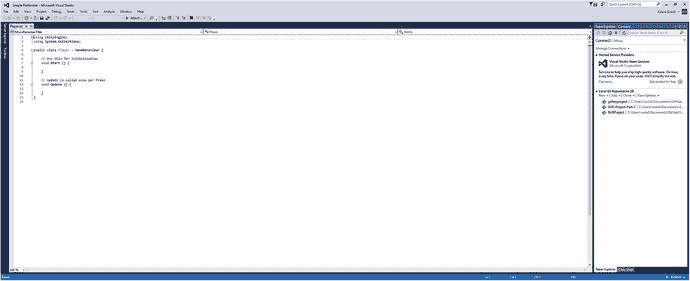

# 四、添加物理学并开始编程

在这一点上，你现在有了一个看起来有点像传统电脑游戏关卡的世界。在这一章中，我们将通过添加一些基本的物理和运动来让它像传统的电脑游戏一样玩。为此，你将第一次尝试编码。祝你好运！

因此，我们有平铺的精灵，它们有草的图案，为了混合一些东西，我还创建了一个精灵来代表草下面的地面，这样我就可以用我的关卡设计来增加一点创造性(见图 4-1 和 4-2 )。


图 4-2。

Some tiles just ready to be climbed on!


图 4-1。

The second ground tile

我用和第一个完全一样的方法创建了第二个污垢精灵，然后在我的草地表面下任何我需要的地方复制它。您也可以这样做，只需记住按住 Ctrl 键，使用“捕捉到网格”功能来保持完美的距离。

现在我们要做一些更令人兴奋的事情:创造一个游戏角色，把他放到我们的世界里。首先，我们要做一个尽可能简单的角色精灵，这是另一个正方形。为了让事情变得更有趣，我们还会给他眼睛。

见方(图 4-3 )。


图 4-3。

Squarey, mate, you don’t look so good

Squarey 可以是你喜欢的任何尺寸，但为了简单起见，我建议保持与地面瓷砖相同的尺寸。

现在将 Squarey 添加到你的精灵文件夹中，就像你对其他的一样。确保你记得再次设置每单位像素为 50，然后把他拖到你的场景中。将这个新的游戏对象命名为 Player，并将其与 Squares 文件夹分开。你想把他拖到关卡的哪个位置并不重要，但我选择把他放在我创建的山顶(图 4-4 )。


图 4-4。

Squarey surveys his domain

恭喜你！你现在有一个主角了。问题是，他实际上什么也没做。

所以，接下来我们要做的是应用一些物理知识，让重力和其他东西影响我们的性格。你不会相信 Unity 让这一切变得多么容易。

## 使用刚体 2D

如前所述，使用 Unity 这样的物理引擎的全部意义在于，我们可以访问现成的脚本和元素，避免自己从头开始编写代码。这使得添加类似重力的东西变得非常简单:我们所要做的就是把一个脚本拖到我们的游戏对象上，让它生效。

选择播放器后，点按检查器中的“添加组件”。现在点击物理二维➤刚体二维。刚体 2D 是一个脚本的名字，它作用于 2D 精灵，并应用了我们想要的所有基本物理，如重力、摩擦力、动量、碰撞等等。

然而，最简单的方法就是把它付诸行动。所以在场景窗口中拖动 Squarey 稍微高一点，然后点击 play。如果一切都按计划进行，我们现在有一个看起来很悲伤的正方形，他只是从屏幕的顶部和底部掉了下来。Squarey，来见见地心引力！

## 使用对撞机

精明的人会注意到这里缺少了什么。当然，我们实际上并不希望 Squarey 从他下面的地面掉下去；我们想让他着陆。幸运的是，这也是一个简单的解决方法。

只需再次点击 Squarey，然后添加组件➤物理 2D ➤盒碰撞器。你现在应该可以在检查器中看到刚体 2D 和 2D。


图 4-5。

The green outline shows Squarey’s collider

此外，您还应该注意到 Squarey 周围有一条细细的绿色轮廓。这是碰撞器，它本质上定义了你的精灵的边界，并告诉刚体 2D 组成角色的物质开始和停止的位置。

点击播放，你会看到角色仍然从下面的地面掉下来。希望你已经猜到了，这是因为我们的贴图也需要附加碰撞器。为此，使用鼠标在场景视图中拖动一个方块，以便一次选择所有图块。你可以选择桌面上的一堆图标(图 4-6 )，或者在按住 Shift 键的同时点击层级中的第一个项目，然后点击最后一个项目。您也可以使用 Ctrl 进行批量选择，就像在大多数 Windows 程序中一样。这是一个经常会派上用场的技巧，尽管还有另一种方法来进行大规模更改，我们很快就会看到。确保取消选择相机，然后在检查器中添加一个碰撞器。这将会同时应用到所有选中的游戏对象上。


图 4-6。

Later we will discuss using prefabs to avoid having to select multiple GameObjects

请注意，我们没有将刚体 2D 添加到地面瓷砖中。那是因为我们不想让它们从屏幕上掉下来。

现在点击 play，如果一切按计划进行，我们的角色将会摔倒并落在地上(图 4-7 )。


图 4-7。

Success!

如果你想测试刚体 2D 有多详细，把它放在正方形的位置，让它部分悬在一个台阶的边缘，然后再次点击播放。当他落地的时候，他应该给小费，然后滚下楼梯。

在这一点上，我们现在已经有了一个按照我们期望的方式运行的游戏。下一步可能是让它具有交互性。准备好:这是实际编码的地方。

## C#编程入门

在您开始编码之前，我们首先需要创建一个文件夹来包含 Assets 目录中的所有脚本。在项目视图中右键单击并选择创建➤文件夹，就像创建精灵和场景文件夹一样。调用这个新文件夹脚本，然后打开它。

在这里，您将再次右键单击，这次选择“创建➤ C#脚本”。呼叫此玩家，然后双击打开它。现在，您将第一次打开 Visual Studio。但首先，你需要登录。为此，您只需使用您的 Microsoft 帐户(您可能会使用该帐户登录 Windows 和 Hotmail)。如果您没有，您将有机会创建一个。

一旦你进入，用户界面看起来应该如图 4-8 所示。



图 4-8。

Welcome to Visual Studio

现在，我们将注意力集中在中间的大窗口上，在这里我们可以输入和编辑代码。我们在这里选择用 C#编码，因为它有点类似于 Java——大多数 Android 开发中使用的语言——只是稍微简单一点。用 C#编写代码时要记住的一件事是，每一行都需要以分号或开/闭花括号结束。如果你错过了这个，你会得到一个错误。你可能会发现很容易忽略这个关键的细节，然后花很长时间在你的代码中寻找为什么它不能运行。

您可能还会注意到，文档实际上不是空的，而是已经包含了几行代码。这些是函数，是在特定时间被调用的独立的代码集合。我们这里的两个函数将会出现在我们创建的每个脚本中，并为我们将要做的事情提供一点结构。

整个过程应该如下所示:

```java
using UnityEngine;
using System.Collections;

public class Player : MonoBehaviour {

        // Use this for initialization
        void Start () {
        }

        // Update is called once per frame
        void Update () {
        }
}

```

先不要担心前两行。第三行显示的`public class`实际上只是命名我们创建的脚本，接下来的两个部分(`void Start`和`void Update`)是我们的函数。

另外两件要注意的事情是正斜杠。在 C#中，每当一行以两个正斜杠开始时，这意味着它是一个注释，不会对代码的运行方式产生任何影响。换句话说，如果你忘记了一行代码是做什么的，你就可以这样给自己写消息。当程序员团队一起工作时，像这样的注释对于确保每个成员都知道每件事是做什么的非常重要。

这里已经有两个注释描述了这些函数的功能。第一个写的是`"Use this for initialization"`，所以每当脚本第一次被引入场景时`void Start`就会运行。第二条评论说`"Update is called once per frame"`，所以`void Update`随着游戏刷新以非常快的速度反复运行。

为了证明这一点，让我们试着让我们的角色在屏幕上移动。为此，我们首先需要引用一些我们将在代码中使用的重要元素。在这种情况下，我们需要使用附加在我们的`Player`游戏对象上的刚体 2D 脚本。为此，我们需要添加以下代码:

```java
public class Controls : MonoBehaviour {
    public Rigidbody2D rb;

    void Start () {
        rb = GetComponent<Rigidbody2D>();
    }

```

这里发生的事情是，我们正在创建一个刚体 2D 的参考，并将其命名为`rb`(刚体的缩写)。然后，当脚本初始化时，我们告诉它刚体 2D 的实例是我们的脚本附加到的游戏对象(一会儿，我们将把它附加到`Player`游戏对象)。

不要担心这是不是有点混乱:你现在可以复制和粘贴代码，以后会更有意义。

最后，我们将向我们的`Update`函数添加以下代码行:

```java
void Update () {
            rb.velocity = new Vector2(1, rb.velocity.y);
        }

```

这只是将一个值为 1 的 veleocity 加到刚体的水平 X 坐标上(`Vector`是一个坐标)。因为这是在`Update`中，这意味着它应该在每次场景刷新时运行——这发生得非常快。整个过程应该如下所示:

```java
using UnityEngine;
using System.Collections;

public class Player : MonoBehaviour {
    public Rigidbody2D rb;

    // Use this for initialization
    void Start () {
        rb = GetComponent<Rigidbody2D>();
        }

        // Update is called once per frame
        void Update () {
            rb.velocity = new Vector2(1, rb.velocity.y);
    }
}

```

请确保您记得保存您的工作！

现在剩下要做的就是回到 Unity，给玩家角色添加剧本。我们做的和我们添加刚体 2D 一样:选择`Player`游戏对象，点击添加组件，然后编写➤玩家的脚本。现在点击播放，你应该会发现 Squarey 继续向右移动，然后从台阶上摔下来，走向他的最终厄运(图 4-9 )。


图 4-9。

Squarey now has Lemming AI

只有当你把脚本附加到你的游戏对象上时，它才会有任何效果，你也可以很容易地把它添加到地面瓷砖上来获得同样的效果。

## 引入变量

现在是我们玩一些变量的时候了。变量是编码中一个非常重要的概念，也是很多逻辑和通用性的来源。

本质上，变量是一段数据的简写，可用于在未来表示该数据(如健康或球员姓名)。机会是，如果你能回想在学校时的数学，你会发现你在过去遇到过变量。还记得这样的谜题吗？

10 + x = 13，求 x

在这种情况下，x 是一个恰好代表 3 的变量。但是如果我们这样写

10 + x =？

这将允许我们改变结果，简单地用一个键或类似的东西改变 x 的值。在 C#中处理变量时，我们可以做完全相同的事情。例如，我们可以用一个名为`movespeed`的变量代替 1 来改变角色移动的速度。但是首先，我们需要通过初始化来定义`movespeed`的含义。所以现在我们的代码看起来像这样:

```java
using UnityEngine;
using System.Collections;

public class Player : MonoBehaviour {
    public Rigidbody2D rb;
    public int movespeed;

    // Use this for initialization
    void Start () {
        rb = GetComponent<Rigidbody2D>();
        movespeed = 2;
    }

        // Update is called once per frame
        void Update () {
        rb.velocity = new Vector2(movespeed, rb.velocity.y);
    }
}

```

Squarey 将会像以前一样移动，但是这次是以两倍的速度。

当我们创建变量时，我使用了一些有助于理解的术语。例如`Int`，是 integer 的简称，是一种存储整数的变量。每当你定义一个变量的时候，你总是需要告诉 C#你正在处理什么类型的变量。在这一点上，需要知道一些有用的信息:

*   整数:任何整数
*   Float:浮点变量是一个带小数点的数字
*   布尔型:一个变量，可以是真或假，也可以是 1 或 0
*   字符串:文本变量

同时，`public`意味着可以从脚本外部访问该变量。事实上，这意味着我们甚至可以从 Unity UI 中编辑我们的`movespeed`。

为此，删除显示`movespeed = 2`的行，然后在 Unity 中选择`Player`游戏对象。你应该看到现在在检查器中有一个移动速度框，如图 4-10 所示。


图 4-10。

Changing Movespeed in the Inspector

尝试将该值设置为–1，您会看到 Squarey 现在向相反的方向移动，远离楼梯并朝向突然下降的方向。如果不从脚本中删除`movespeed = 2`行，每次调用`Start`函数时，它都会被覆盖。如果你不想让变量在你的代码之外被访问，那么就简单的用`private`代替`public`。

现在，让我们把`movespeed`设为 3，因为我们想让 Squarey 在下一位快一点。虽然你可以不使用变量来做同样的事情，但是知道这些是非常有用的，当你在场景中添加更多的元素时，你会发现它会反复派上用场。

## 控制玩家角色

看到我们的角色在关卡中移动并与场景互动是非常令人兴奋的，但实际上我们希望能够控制角色。好消息是，这是我们可以很容易做到的事情，只需稍微改变我们已经拥有的代码。我们需要做的就是添加几个`if`语句，如下面的代码所示:

```java
void Update () {
        if (Input.GetKey(KeyCode.LeftArrow))
        {
            rb.velocity = new Vector2(-movespeed, rb.velocity.y);

        }
        if (Input.GetKey(KeyCode.RightArrow))
        {
            rb.velocity = new Vector2(movespeed, rb.velocity.y);

        }
}

```

这里发生的事情是，每当游戏更新时，脚本检查是否有输入。当然，`KeyCode.LeftArrow`和`KeyCode.RightArrow`指的是各自的键盘输入，然后我们通过`movespeed`或`–movespeed`来移动字符，这取决于哪一个被按下。`"If"`语句本质上是告诉一段代码只有在特定参数为真时才运行。只有当括号内的行为真时，花括号内的代码才会运行。

如果我们用伪代码(使用普通英语术语的假“代码”更容易理解)来写，那么它将翻译如下:

```java
If (Player is pressing right) {

Move character to the right

}

```

记住在`if`语句的末尾关闭花括号是很重要的。如果你有使用 Excel 或其他电子表格软件的经验，使用像这样的`if`语句可能会很熟悉。

Note

如果你现在要创建一个 APK(Android 的应用包——稍后会详细介绍)并在 Android 上运行，它实际上可以和蓝牙键盘一起工作。稍后，我们将看看如何实现触摸屏控件。

如果你点击“现在玩”,你应该有令人兴奋的机会实际尝试控制 Squarey——就像一个真正的游戏。虽然我们不得不在这里写一点代码，希望你同意这是非常简单的事情:只需几行代码，我们现在就有了一个好看的游戏世界和一个我们可以控制的角色。

## 更高级的逻辑和引入跳跃

Squarey 现在可以像专业人士一样左右移动，并且非常擅长从物体上跳下来。你应该感到自豪。但是为了能和马里奥、索尼克以及他们中的佼佼者同台竞技，他还需要学习一些跳跃技巧。不幸的是，这比左右移动要复杂一点。

你可以尝试实现跳跃，就像你处理左右移动一样。下面的代码将允许我们的英雄跳跃:

```java
if (Input.GetKey(KeyCode.Space))
        {
            rb.velocity = new Vector2(rb.velocity.x, 5);

        }

```

唯一的问题是这个代码也能让他飞起来。这是因为我们每次按空格键都会增加更多向上的速度，不管他是在地上还是在空中。这不好。

所以我们需要先确认他是否在陆地上。这就有点复杂了。

首先，我们需要创建一个新的转换。变换是空间中有自己的坐标和旋转(角度)的点。这个点也将有一个半径(这将是一个浮动)，我们还需要一个图层蒙版。我们现在还创建了第一个布尔变量`onGround`。

简而言之，您正在将以下所有代码添加到脚本中:

```java
public Transform groundCheck;

public float groundCheckRadius;

public LayerMask whatIsGround;

private bool onGround;

```

现在，这可能看起来相当复杂，但不要担心，我会解释每一位是什么，以及我们进行的过程中它做了什么。

如果在这个阶段这还不够令人畏惧，我们还将在代码中添加另一个函数，名为`FixedUpdate`。`FixedUpdate`是一个类似于`Update`的功能，除了`Update`依赖于屏幕的刷新率，`FixedUpdate`更加一致，因此对于与物理相关的代码更加可靠。

在这个函数中，您将添加以下内容:

```java
void FixedUpdate()
{
    onGround = Physics2D.OverlapCircle(groundCheck.position, groundCheckRadius, whatIsGround);
}

```

现在还不要担心这是什么。回到 Unity，你现在可以看到我们在检查器中创建的新的公共浮动、布尔和图层蒙版。

在这里，您将创建一个新的空游戏对象。这是一个游戏对象，就像一个精灵或相机，但没有组件。在层次中右键单击并选择创建空。你将调用这个空的游戏对象`Check Ground`，并使它成为`Player`的子对象(通过在层次结构中将它拖到`Player`的顶部——参见图 4-11 )。


图 4-11。

`Check Ground` is an empty GameObject and child of `Player` (more on what that means later)

现在再次选择玩家，在层级中找到写着地面检查的地方。目前它会显示 None (Transform ),但是你可以通过拖动`Check Ground`游戏对象并把它放到那个盒子里来改变它。它看起来应该如图 4-12 所示。


图 4-12。

Ground Check is a transform that is now defined as the coordinates of `Check Ground`

记住:地面检查是一个变换，意味着一组坐标。通过将一个空的游戏对象放入这里，我们现在告诉我们的脚本将这些坐标设置为那些附属于`Check Ground`的坐标。换句话说，我们已经定义了一个“点”，这就是我们将如何看待 Squarey 是否站在坚实的地面上。现在将半径值设置为 0.1，这意味着它将是一个非常小的点。最后，在场景视图中选择`Check Ground`并使用移动工具将其定位在 Squarey 的正下方，这样它就可以检查他正下方的空间。

还有一件事，我们需要做的是创建一个新的层，并将其命名为地面。再次拖动并选择所有的地砖，然后在检查器的左上方寻找图层菜单。在下拉列表的底部，你会看到添加图层的选项(图 4-13 )。


图 4-13。

Adding the Ground layer

然后，您将有机会创建您的新层，只需在下一个可用空间键入其名称(unity 已经定义了几个层)，如图 4-14 。


图 4-14。

Call the new layer Ground

在空白处键入 Ground。然后回到你的方块检查器，这一次从下拉菜单中选择地面，将它们全部设置为那个值。

现在再次查看检查器中的`Player`游戏对象，这一次使用下拉菜单设置什么是地面到地面。这基本上意味着，在我们的脚本中，设置为地面层的任何东西现在都将被视为地面——这意味着 Squarey 可以从它上面跳下来。

完成所有这些后，我们现在可以简单地将最后一行代码添加到我们的脚本中:

```java
if (Input.GetKey(KeyCode.Space) && onGround)
        {
            rb.velocity = new Vector2(rb.velocity.x, 5);
        }

```

现在点击播放，你会发现 Squarey 可以跳，但只有当他在坚实的地面上。这意味着他不能在空中连续跳跃，也意味着在第五章我们可以开始引入一些真正的平台挑战。

### 进一步解释一下

你可能仍然对这里实际发生的事情有些困惑。让我们回顾一下正在发生的事情。

关键是我们放在`FixedUpdate`函数中的这行代码:

```java
onGround = Physics2D.OverlapCircle(groundCheck.position, groundCheckRadius, whatIsGround);

```

语句`Physics2D.OverlapCircle(groundCheck.position, groundCheckRadius, whatIsGround)`为真或假，询问`groundCheck`变换是否与我们定义为地(`whatIsGround`)的任何东西重叠。`onGround`如果有重叠则为真，如果没有重叠则为假——请记住，这是一个只能为真或假的变量。因为这条线在`FixedUpdate`中，它的值会随着游戏的进行而不断变化。

在伪代码中，我们这样说:

```java
If the circle underneath the player is overlapping with ground material, then onGround is true. Otherwise, onGround is false.

```

然后，在我们的`Update`函数中，每当玩家按下空格键时，我们检查`onGround`是否为真:在 C#中，`&&`简单地表示 and。通过在`if`语句中使用`&&`，我们测试两个参数是否为真。因此

```java
if (Input.GetKey(KeyCode.Space) && onGround)
{
    rb.velocity = new Vector2(rb.velocity.x, 5);
}

```

实际上意味着

```java
If player presses jump and 'onGround' is true then add upward velocity.

```

我们也可以用一个变量代替 5，就像我们对`movespeed`所做的那样。称之为`jumppower`。

为了方便起见，整个播放器脚本现在应该是这样的:

```java
using UnityEngine;
using System.Collections;

public class Player : MonoBehaviour {
    public Rigidbody2D rb;
    public int movespeed;
    public int jumppower;
    public Transform groundCheck;
    public float groundCheckRadius;
    public LayerMask whatIsGround;
    private bool onGround;

    void Start () {
        rb = GetComponent<Rigidbody2D>();
        movespeed = 3;
        jumppower = 5;
    }

    void FixedUpdate()
    {
        onGround = Physics2D.OverlapCircle(groundCheck.position, groundCheckRadius, whatIsGround);
    }

    void Update () {
        if (Input.GetKey(KeyCode.LeftArrow))
        {
            rb.velocity = new Vector2(-movespeed, rb.velocity.y);

        }
        if (Input.GetKey(KeyCode.RightArrow))
        {
            rb.velocity = new Vector2(movespeed, rb.velocity.y);

        }

        if (Input.GetKey(KeyCode.Space) && onGround)
        {
            rb.velocity = new Vector2(rb.velocity.x, jumppower);

        }

    }
}

```

如果你现在复制它，你可以在尝试理解它的时候尝试修改线条和逆向工程。您应该会发现，其中很多内容实际上是不言自明的。

### 最后一点:让玩家保持直立

除了有一个小问题:Squarey 目前在楼梯上翻滚旋转，好像他喝了太多的伏特加。如果你跳起来，然后头着地，你将无法再次起飞，因为`Check Ground`游戏对象现在将指向空中。

要解决这个问题，单击 Squarey 并在检查器中找到刚体组件下的约束选项。在这里，您会发现冻结旋转 z 的选项。勾选该框，Squarey 的角度将被锁定(图 4-15 )。


图 4-15。

Tick Freeze Rotation and your character will stop falling over

你会注意到这里还有一些其他选项，比如重力比例(控制 Squarey 受重力影响的程度)和其他一些选项。我们将在第五章中讨论这些。

现在你可以试着创建几个浮动平台，并尝试在不从屏幕上掉下来的情况下穿过它们。你可能需要稍微调整一下你的`jumppower`或者你的重力等级，所以尽情享受吧。现在花一点时间来反思你已经取得的成就:只走了一小段路，你就已经有了一个可以在屏幕上跳跃的角色和一个导航起来非常有趣的关卡(图 4-16 )。我们才刚刚开始，所以想想在我们结束之前你还能做些什么吧！


图 4-16。

Only Chapter 4 and our game is already almost fun!

在第五章中，我们将会看到如何用预设和影响者创建更好的平台，我们将会用我们的相机做一些更有趣的事情。我们甚至可以开始放入收藏品和危险物品。