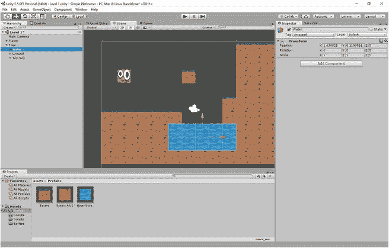
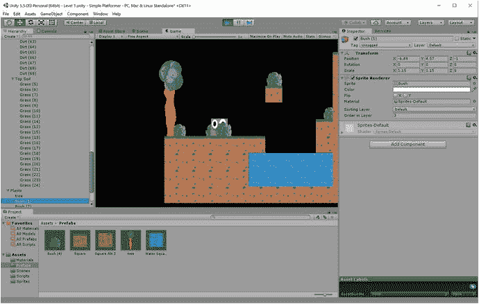

# 五、用预置、效果器和收藏品填充世界

在这一点上，事情开始走到一起，感觉有点像一个实际的游戏。我们有一个非常基本的 2D 水平，我们有一个角色，我们可以用箭头键和空格键移动，我们有工作的物理。

但目前仍有一些事情没有做到，我们没有遵循所有的最佳实践。这个世界也相当空旷，没有任何收藏品，风景，甚至天空。

在这一章中，我们将会看到如何开始添加像树、硬币和有特殊属性的平台这样的东西。我们还将看到如何更好地跟踪所有这些新元素，并通过预置来简化我们的游戏设计过程。到最后，你的游戏世界将看起来更加丰富多彩，你甚至可以开始创建一些基本的平台挑战。

## 使用效应器

你可能已经注意到，目前不太正确的一点是，我们可以贴在墙上。如果我们把 Squarey 撞在墙上，并一直按住那个方向的箭头键，那么他会把自己粘在表面上，停止下落。对于平台游戏来说，这是非常奇怪的行为，所以让我们阻止它发生。

首先，点按您想要编辑的平台，然后在检查器中查看它。现在单击添加组件➤物理二维➤区域效应器二维。然后你会被提示你需要勾选 2D 碰撞器下的被效应器使用的框。

这将在框的周围显示一个半圆，并在检查器中显示更多的选项。你应该有类似图 5-1 的东西。


图 5-1。

Platform Effector added to one of our tiles

现在试着把这个角色粘在木块上，你会发现他只是滑了下来。简而言之，平台效应器使平台表现得像一个平台。

试着从下面跳进平台，你会注意到别的东西:Squarey 可以穿过它们。你可能以前玩过这个功能的平台游戏，但是现在我们想关闭它。这样做的原因是，截至目前，执行这一举措将打破游戏。当 Squarey 穿过地板时，按住 jump 会使他第二次跳跃，这看起来很奇怪。

有很多方法可以解决这个问题:例如，通过使用光线投射来检查地面，而不是我们目前使用的系统，或者简单地让玩家在再次跳跃之前再次点击空格键。不过现在，最简单的方法是取消单向使用框(图 5-2 )，这也将允许一些游戏特性，如洞穴和死胡同。


图 5-2。

Use One Way has now been unticked

这是一个非常早期的例子，说明你的游戏将如何决定你对物理和代码的决定。你不能建立一个游戏引擎并单独设计你的关卡:游戏世界的行为方式应该由你的游戏设计决定，反之亦然。形式应该服从功能。

在这种情况下，问题是你是否想要设计一个更快节奏的游戏，允许玩家通过点击跳转无缝地扩展平台，或者你是否想要一些更多的谜题/探索，并保持将它们困在不同部分的能力。

(当然，你也可以有多种类型的平台，以不同的方式运行，但你的游戏设计的挑战是要确保从游戏开始就清楚地传达这些差异。)

出于我们的目的，我们将保持事情简单，并关闭此功能。

## 更多效果器

效应器是一种快速简单地让游戏元素以特定方式运行的好方法。当您选择平台效应器时，您可能已经注意到还有一些其他效应器可供选择。

例如，您可能发现了浮力效应器。这是一个效应器，让我们可以让瓷砖像水一样。

为了演示效应器有多有用，让我们设计一些看起来像水的新瓷砖(图 5-3 )，保持我们相同的 50 x 50 尺寸。


图 5-3。

A square of water

现在把它添加到你的精灵文件夹中，创建一个新的游戏资源叫做水广场(或者你想叫它什么都行)。记住将这个精灵的每单位像素设置为 50，并确保它有一个碰撞器。现在选择添加组件➤物理 2D ➤浮力效果器 2D。记住勾选“由效应器使用”,这次你也要点击“触发”(稍后我会解释这是什么意思)。复制并粘贴几个水方块，在它们的两边用堤岸围起来，创造一个水池。现在跳入水中，观察 Squarey 在水面下上下摆动(见图 5-4 )。


图 5-4。

Squarey bobbing just below the surface of the water

其他效应器可以让您创建风、传送带等等。

## 预置和更多的组织

不，我没忘记。现在，我们有一个很有趣的水池，但是只有一个瓷砖能正常工作。

你可以改变场景中的每一个方块来应用平台效应器。实际上，考虑到我们可以一次选择多个游戏对象，并以那种方式添加内容或改变设置，这甚至不会那么糟糕。但是现在想象一下，你有多个关卡，大量不同的游戏对象，以及庞大复杂的布局。如果你现在决定要改变一个价值观，所有这些都会让你的生活变得极其艰难。

我们要做的是创建一个预置。Prefab 是预制的缩写，本质上是一个具有预定义属性的游戏对象。我们可以把预设放到场景中，就像我们把精灵放到场景中一样，但是它们会携带所有现成的组件和值。

更好的是，当我们更改文件夹中的效应器时，这些更改将反映在游戏中对象的每个实例上。这将让我们改变我们对游戏设计方面的想法，并能够迅速实施这些变化。

首先，在素材中创建一个新文件夹，并将其命名为 Prefabs。这是相同的过程，因为它是为精灵文件夹和脚本文件夹(右键单击➤创建➤文件夹)。现在找到你制作的包含效应器的地面瓷砖，并把它从检查器拖到预设文件夹中。然后用另一个地面瓷砖和其中一个水瓷砖做同样的事情(图 5-5 )。


图 5-5。

Two prefabs down, one to go

现在到了可怕的部分——您将删除场景视图中的所有图块，除了玩家和相机之外什么都不留下。然而，所有的努力并没有白费，因为现在你将能够简单地将每块瓷砖拖放到你的游戏世界中。

这是一个很好的机会来创造一些更好的组织和重新设计我们的水平。在你再次开始放入瓷砖之前，首先选择预设并在检查器中查看它们。在这里，将名称更改为易于识别的名称。我走过了水、泥土和草地。这不会改变预置本身的名字，但是会改变游戏对象的名字。

你也可以借此机会创建单独的空游戏对象，作为你在旅途中拥有的三个元素的分组。我的是`Top Soil`草地、`Ground`泥土、`Water`水。

现在将每个单幅图块拖回到场景中，按住 Ctrl 键以捕捉到栅格。确保每个项目的第一个实例位于正确的组中，这样重复的项目也会出现在此处。首先将物品从预设文件夹中拖出，放入正确的类别中——然后你就可以简单地复制并粘贴场景视图中的元素了。在这里，你正在制作符合预设规则的副本。不要忘记按住 Ctrl 键来隔开你的图块，并使它们与网格对齐。现在你可以随意重新设计关卡布局了。图 5-6 可以看到我的。


图 5-6。

A new, more organized setup using prefabs

最后，再创建一个空的游戏对象，并将其命名为`Tiles`或类似的名称。

为了展示预设的力量，你现在可以试着在预设文件夹中选择草地并选择单向使用。点击播放，你会发现你现在可以从下面跳过任何一个草块。解开它，他们都会变回来。

这将使我们的工作流程变得更加简单，我们安排层级的方式也是如此。例如，试着点击水组，你会看到每一个水块都被高亮显示(图 5-7 )。点击瓷砖将会选中所有的水瓷砖、草瓷砖、土瓷砖(图 5-8 )。


图 5-8。

All tiles selected



图 5-7。

Water selected

这意味着你可以很容易地删除整个类别的瓷砖，在未来，这将有助于我们管理的东西，如收藏品，敌人和装饰品。好时机——本章的下一部分将开始增加更多种类。

### 故障排除:帮助！Squarey 总是卡住！

软件工程的乐趣之一(是的，就是这个)是事情会不断出错，你会被迫尝试去处理它们。有时会有一个简单的解决办法(在这种情况下，谷歌是你的朋友)。其他时候，问题可能在你的控制之外，迫使你想出一个新的解决方案。

现在，如果你在你的瓷砖和你的玩家角色上使用箱式碰撞器，你可能会发现你偶尔会被不应该被卡住的东西卡住——你的角色可能会停止移动，并压在稀薄的空气中。这个问题通常发生在位置相近的瓷砖之间的顶点，不幸的是，这似乎是 Unity 本身的一个小问题，而不是您可以修复的任何问题(显然，它是在 4.3.1 中引入的，在撰写本文时尚未解决)。

如果你确实遇到了这个问题，就试着为 Squarey 自己使用一个多边形碰撞器，通过点击编辑碰撞器来稍微改变形状，然后在轮廓上创建一个小凸起，如图 5-9 所示，这样你就可以“滑过”这些想象中的障碍。


图 5-9。

Editing the polygon collider

欢迎开发！

### 理解父母，做一个会动的相机

另一件有助于理解的事情是父母和孩子之间的关系。

层次结构中的这些分组实际上并不是文件夹。更确切地说，空的游戏对象被称为父对象，而你在它们下面的组被称为子对象。像真正的父母和孩子一样，在这种情况下，孩子将继承成人的属性。例如，如果您将`Top Soil`向右移动，那么它的所有子节点都将向右移动相同的距离，确保它们彼此保持相对距离。这在很多情况下都是一个有用的特性——例如，如果你想让两个游戏对象以相同的速度向相同的方向移动。

为什么这可能是你想做的事？好吧，我们用这个把摄像机贴在球员身上怎么样？现在，Squarey 只能在屏幕的范围内探索，这对于我们可以进行的关卡设计来说是相当有限的。但是如果我们进入层次结构并选择摄像机，我们可以将它放到`Player`上，从而使它成为游戏对象的子对象。现在，摄像机将始终相对于玩家移动！将它移动到播放器的中心，以确保它处于一个好的位置，可以从左右两边看到障碍物。为什么不在右侧增加一些水平来庆祝呢？

在图 5-10 中，你可以看到相机应该是什么样子，以及我添加的一些额外的关卡设计。


图 5-10。

With his camera attached, Squarey is now free to explore foreign lands

请注意，这是一个非常快速的破解，而不是我们真正想要的处理相机的方式。在一个已经完成的游戏中，摄像机应该做的不仅仅是盲目地跟随玩家。相反，它会加速或减速，放大和缩小，并根据游戏类型的不同而表现不同。这有利于游戏性，或者根据具体情况增加戏剧性和刺激性。我们将在后面的章节中更详细地讨论所有这些。

## 使用 Z 顺序装饰场景

现在，我们的关卡看起来很有游戏性——很明显这是一个电脑游戏关卡，感觉不太逼真，因为里面唯一的物体显然是设计用来跳跃的平台。为了改变这一点，我们需要添加一些装饰，让世界感觉像一个活生生的，会呼吸的地方。

为此，您首先需要创建一些可用于装饰的元素。我已经创建了一棵树(图 5-11 )和一丛灌木(图 5-12 )。


图 5-12。

Bush


图 5-11。

Tree

请注意，这两个图像都是 PNG 文件，边缘是透明的。我用免费的图像编辑软件 GIMP 做了这个，我们将在第十章更详细地讨论你如何做同样的事情。

现在，你想把这些加入到游戏中，就像你以前做过几次一样。将它们放入 Sprites 文件夹，确保改变每单位的像素，并将它们分组到一个名为`Plants`的空游戏对象下。你可能也想再次创建预设，尽管这在这种情况下不太重要，因为它们的外观和行为都会有所不同。

现在把你的植物和树木分散到世界各地。您可以随意混合大小，坚持在网格内并不重要。事实上，让定位看起来有点随意是件好事，因为这样会显得更自然，有助于消除一些游戏的美感。

现在试着玩这个游戏，你会发现当你走过灌木丛和树木时，你可能会走到它们的前面或后面。事实上，如果你有一个旧版本的 Unity，你甚至可以在视图中闪烁。

问题是两个东西被画在同一个地方，你还没有定义哪个应该放在上面。要解决这个问题，您需要更改 Z 顺序，这可以在检查器中通过更改名为“层中顺序”的选项来完成。默认情况下，当你添加一个新的游戏对象时，它被设置为 0，但是你可以改变它来创建不同的效果。

如果您使数字变小，这意味着对象将在其他元素之后提前绘制。同样地，如果你把数字设得更高，这意味着它会被画在最后，在所有东西的上面。

我的建议是让一些灌木和树木出现在 Squarey 的后面(设置为–1)，让一些出现在 Squarey 的前面(设置为 1)。这创造了一个有趣的效果，他看起来正在穿过茂密的树叶(图 5-13 )，尽管在你构建游戏时确保这不会让玩家感到困惑是很重要的。



图 5-13。

Squarey peeping out from behind some bushes

同样，你也需要试着避免让事情变得混乱。我的建议是保持你的播放器为 0，并以此作为你的参考点。我还建议确保瓷砖将留在前面，除非你特别打算添加装饰。这将允许你把像树这样的游戏物体藏在水面下一点，而不用担心难看的缝隙。您可以通过将它们在层中的顺序设置为 10 左右来实现这一点。

为什么你会想要在你的平台上放一些东西呢？一个原因是，如果你想添加一点更自然，看起来随机的细节。例如，我已经创建了这个爬行器(图 5-14 ，然后将 Z 顺序设置为 11。通过将 X 轴和 Y 轴上的比例分别更改为–1，我也可以水平和垂直翻转图像(图 5-15 )。


图 5-15。

This is how it looks when it’s in place


图 5-14。

This creeper adds a little detail to the game world

你可以随心所欲地添加许多这样的细节。就我个人而言，我觉得这些小小的触动对世界的外观和感觉产生了巨大的影响。我建议发挥一点创造力，看看你能想出什么。

当然，现在我们能够添加不同的层，这意味着是时候添加背景了，这将对美感产生很大的影响。我画了一个多云的天空(图 5-16 )并把它做得相当大，这样它就可以覆盖边缘没有黑色边框的空间。


图 5-16。

A nice cloudy sky

你可以使用像这样的大图片，也可以平铺背景——选择权在你。只要确保你永远不会跑出天空。显然，使用更大的图像对你的应用来说意味着以下几点:

*   它会占用更多内存
*   加载关卡需要更长的时间

将背景的 Z 顺序设置为-10，以确保您不会不小心将某些东西放在它后面，并在您的层次中创建一个名为 background 的组。

我们留下了您在图 5-17 中看到的内容。现在看起来是不是好多了？


图 5-17。

Much better!

## 透视视差滚动

如果你想变得更有趣，你可能会决定使用另一个额外的技巧:视差滚动。

您可能已经注意到，检查器不仅允许您更改对象的 X 和 Y 坐标，还允许您更改 Z 坐标。这可能会让你觉得奇怪，因为你在 2D 模式下使用 Unity。为什么不干脆取消这个选项呢？

简单的答案是，在某些情况下，您可能想要更改元素的 Z 位置以创建 3D 效果。要进行演示，请选择您刚刚创建的背景，并将检查器中的 Z 坐标更改为 30。现在选择相机，在检查器中点击名为投影的下拉菜单。将此从正投影更改为透视。

现在点击播放，看看会发生什么。你应该会发现天空现在看起来更远了，并且比关卡的其他部分移动得更慢。你刚刚创造了一个视差滚动效果！

说明这里发生的事情的最佳方式是将场景窗口切换到 3D 模式。点击顶部的 2D 按钮在两种模式之间切换，您应该会看到类似图 5-18 的内容。


图 5-18。

This is what the camera “really” sees

简而言之，我们现在有了一个 3D 视角，可以正面观察排列在 3D 空间中的纯 2D 元素。你可以用它做很多很酷的事情，你可以添加任意多的层和元素。你甚至可以在前景中看到半透明的云，或者在中距离看到以另一种速度移动的起伏的山丘。所有这些都能给你的场景增加深度和美感，但是要确保你不会以牺牲清晰度或性能为代价而失去理智。如果你在任何时候有太多的事情要做，你的玩家将不知道他们可以跳上什么或者走过什么，这甚至会让你头疼。

稍后，我们将更多地关注如何设计你的关卡，使其看起来更好，并去掉一些锋利的边缘。在那之前，让我们保持基本的东西。

## 添加收藏品和危险

现在你已经添加了一些无生命的物体和装饰，是时候考虑添加一些你实际上能够与之互动的元素了。我们可以从一些收藏品开始。

要做到这一点，我们当然需要从设计一些我们可以收集的东西开始。在这方面，一个流行的选择是金币，所以让我们从它开始。水雷如图 5-19 所示。


图 5-19。

A gold coin . Don’t you just want to collect it?

现在我们要再次把它添加到我们的场景中，就像我们把其他游戏对象添加到我们的场景中一样。这意味着我们需要导入精灵，设置每个单元的像素，然后将它制作成一个预置。我们在场景中散布的任何硬币都将按照以下等级分类:收藏品➤硬币➤金币。这一次我们也将创建一个碰撞器，我们将勾选检查器中的“触发”框。

触发器基本上是一个碰撞器，它的行为不像一个物理对象。换句话说，我们的硬币不会是我们可以走进去或跳下来的东西——相反，我们会直接穿过它，就好像它是由空气组成的一样。但与此同时，Unity 将“标记”这一事实，允许我们添加代码，告诉游戏如何响应这一事件。

将一两个你的新金币预置放到场景中，你应该会有看起来像图 5-20 的东西。


图 5-20。

The scene with some added gold coins

现在我们需要创建一个新的脚本，你应该记得怎么做。前往您的素材➤脚本文件夹，右键单击，并选择创建 C#脚本。将此集合命名为 CollectCoin(脚本名称不能有空格)，双击它打开 Visual Studio，再编写一点代码。

在这里，我们将使用一个名为`OnTriggerEnter2D`的函数。这个函数在附加的游戏对象被触发时被调用，所以你放在这里的任何东西都会在玩家接触到那个游戏对象时发生。

在这种情况下，我们希望硬币消失，所以我们需要销毁它。我们通过说`Destroy(gameObject)`来做到这一点。当使用 Unity 时，带有小写 g 的`gameObject`指的是脚本附加到的特定游戏对象。

完整的脚本应该是这样的:

```java
public class CollectCoin : MonoBehaviour {

        // Use this for initialization
        void Start () {

        }

        // Update is called once per frame
        void Update () {

        }

    private void OnTriggerEnter2D(Collider2D other)
    {
        if (other.tag == "Player")
        {
            Destroy(gameObject);
        }
    }
}

```

在伪代码中，这是在说:当某个东西接触到 2D 对撞机时，如果那个东西有标签播放器，就自毁。您可能已经猜到了，这意味着我们现在也需要跳到 Unity 中，并将那个标签添加到 Squarey 中。选择 Squarey，然后在检查器顶部找到标签选项。它现在应该显示未标记，你要做的就是点击下拉菜单并选择播放器。

最后，不要忘记把收集硬币的脚本附在你的硬币上。通过单击添加组件➤脚本➤集合来完成此操作。

点击播放，现在当你走进硬币，他们应该立即消失。在图 5-21 中，你可以看到我如何排列我的硬币，以及我如何将玩家标签添加到 Squarey 中。


图 5-21。

Ready to do some collecting

如果我们想制造一些危险呢？在这种情况下，我们可以做完全相同的事情，除了我们想要移动我们的球员回到开始的位置或者可能结束游戏。

为此，我们需要一个新的精灵(图 5-22 )。


图 5-22。

Spikes

现在添加精灵，就像你之前做的那样制作一个预置。记得设置单位像素，并添加一个多边形碰撞器。你可能需要自己塑造它来很好地适应周围的钉子。

您将像上次一样添加一个脚本。这一次的代码也将非常相似，只是略有变化。现在它将显示以下内容:

```java
public class Hazards : MonoBehaviour
{
    private Player player;

    // Use this for initialization
    void Start()
    {
        player = FindObjectOfType<Player>();
    }

    // Update is called once per frame
    void Update()
    {

    }

    private void OnTriggerEnter2D(Collider2D other)
    {
        if (other.tag == "Player")
        {
            player.transform.position = new Vector2(-6, 8);
        }
    }

}

```

将这个脚本组件附加到尖刺预设上，记住勾选 Is Trigger，然后就可以开始了。这个脚本与上一个非常相似，除了我们不是破坏游戏对象，而是移动玩家。首先，我们必须定义我们所说的“player”是什么意思，这是通过查找附加到 Player 脚本的对象来实现的。从那里，我们可以改变球员的变换(位置)到一个新的向量 2(一个有两个轴的坐标)。我们将玩家移动到位置(–6，8)，因为那是 Squarey 在我的场景中开始的地方。看一下你的 Squarey 版本的起始位置，并改变坐标来匹配。

最后，像我在图 5-23 中所做的那样，在你的关卡中合理的位置放置一些尖刺。我还建议将它们组织在一个名为`Hazards`的空游戏对象下。


图 5-23。

Beware the spike pit !

现在，当你点击播放，落在钉应该自动传送你回到开始的位置。这不是很有魅力，但它做了工作，说明了这一点。在接下来的章节中，我们将会看到如何正确地杀死和复活玩家，以及如何计算收藏品的点数。现在，虽然，这给了你一个很好的想法，如何使用触发器，以使各种各样的效果工作。我们可以使用完全相同的代码来制作一个传送门，把玩家送到下一关！或者我们可以用它来制造一些敌人…

### 介绍敌人

本质上，所有的敌人都是移动的危险。现在你知道该怎么做了:首先创建一个新的精灵，最好是看起来有点威胁的东西，如图 5-24 所示。


图 5-24。

Not sure who this guy is but he looks menacing

给他一个对撞机，给他做一个触发器，造一个预置。然后附上危险脚本，这样他的功能就和尖刺一样了。不同之处在于，我们还将添加另一个名为 BackAndForth 的脚本。进行修改，使其与之前的脚本完全相同(在 scripts 文件夹中右键单击)，然后添加以下代码:

```java
public class BackAndForth : MonoBehaviour
{

    public double amountToMove;
    public float speed;
    private float startx;
    private int direction;

    // Use this for initialization
    void Start()
    {
        direction = 0;
        startx = gameObject.transform.position.x;

    }

    // Update is called once per frame
    void Update()
    {
        if (gameObject.transform.position.x < startx + amountToMove && direction == 0)
        {
            gameObject.transform.position = new Vector2(gameObject.transform.position.x + speed, gameObject.transform.position.y);

        }
        else if (gameObject.transform.position.x >= startx + amountToMove && direction == 0)
        {
            direction = 1;
        }
        else if (gameObject.transform.position.x > startx && direction == 1)
        {
            gameObject.transform.position = new Vector2(gameObject.transform.position.x - speed, gameObject.transform.position.y);
        }
        else if (gameObject.transform.position.x <= startx && direction == 1)
        {
            direction = 0;
        }
    }
}        

```

通读一遍，看看你能否弄清楚它是如何工作的。明白了吗？你当然知道。但是以防万一…本质上，我们有两个公共变量可以从 Inspector 中设置:速度(称为`speed`)和对象将移动的距离(称为`amountToMove`)。当对象在运行时被创建时，它也检查获取它的当前 x 坐标。方向可以是 1 或 0，并且像所有整数一样，在脚本启动时默认设置为 0。

因此，脚本会询问当前位置是否小于我的起点加上我必须移动的距离，以一定的速度向右移动——但前提是我向右移动。一旦物体经过那个点(`>=`的意思是“大于或等于”)，那么它就会把方向改变为 1。当 direction 为 1 时，应用反向逻辑，直到字符等于或小于起始位置，此时 direction 切换回 0，我们再次向右。

现在，如果你把这个脚本和危险脚本一起添加到坏人身上，你应该有一个左右移动的游戏对象，当它接触到他们时杀死玩家。只要记得首先在检查器中设置变量(见图 5-25 )。


图 5-25。

The bad guy in his starting position

请注意，无需重写大量代码，只需以独特的方式组合多个脚本，就能获得令人印象深刻的结果。天空是无限的。

### 可推动的对象

当我们添加所有这些不同种类的对象和元素时，让我们再添加一个非常好和简单的:一个可推的板条箱(图 5-26 )。


图 5-26。

Crate to finally meet you…

你需要做的就是引入一个有碰撞器和刚体的游戏对象(就像玩家一样)。这将允许你通过推动它或甚至将它丢入水中来与该物体互动，以观察它上下浮动(图 5-27 )。这创造了许多潜在的游戏机制和挑战，这再简单不过了。


图 5-27。

Push the crate into the water and see what happens

但是请记住:如果你的角色要能够从箱子上跳下来，他们需要将他们的层设置为地面。

### 使用材料

在我结束这一章之前，让我来解决一个小问题，它仍然与我们游戏世界中的物体不太相符:slidiness。你可能已经注意到 Squarey 喜欢像在冰上一样到处滑行，这看起来不太对，而且很难控制。

为了解决这个问题，我们将创建一种材料，并将其应用于表层土壤。为此，您将创建一个名为 Materials 的文件夹，然后创建一个新的物理材质 2D (RMB ➤创建➤物理材质 2D)。称之为地面。

现在选择这个材质在检查器中查看，你会发现你可以改变两个属性:弹性和摩擦力。你可能已经猜到了，摩擦力控制着特定表面的摩擦力。当 Squarey 落地时，将此值更改为 0.6 以获得更多的地面控制，将反弹度更改为 0.1 以获得不易察觉的抖动(图 5-28 )。


图 5-28。

Squarey lives in a material world

现在选择表层土预设，在检查器中找到盒子碰撞器 2D 下的材质选项(不是精灵渲染器下的那个)。选择您刚刚创建的地面材质，它应该会自动应用到您游戏中的所有草地瓷砖。现在试试跑跳，事情应该更容易控制。

像这样的材料提供了一种为各种游戏对象添加属性的有用方法，我们将在以后看到它们的更多用途。

现在，这足以开始打造一个充满平台挑战、障碍和收集物品的世界。然而，我们仍然有很多事情要做，在接下来的几章中，我们将会看到如何计算分数，添加 UI 元素，甚至引入漂亮的动画。一旦一切就绪，我们就可以开始在实际的 Android 设备上进行尝试了。

现在都凑在一起了！