# 六、添加动画、效果和 HUD

好的，我知道我们已经读了这本书的第六章了，但是在这一点上我们还没有真正接触到 Android 手机！这是用桌面 IDE 编码的讽刺，但是如果你感到不耐烦，不要担心——在下一章中，你将尝试在实际的 Android 手机或平板电脑上部署你的游戏。不过现在，我们将添加更多的内容，为我们未来的游戏开发奠定基础——比如动画、粒子效果和平视显示器(HUD)。当我们读到第七章时，我们会明白为什么要先这么做。

别担心。现在也有很多令人兴奋的事情:添加简单的东西，比如动画，将会让你真正地给你的游戏添加个性和魅力，并将它提升到一个看起来非常专业的程度。

## 处理死亡和使用粒子

每个人都有自己处理死亡的方式。现在，Squarey 的方式并不特别优雅。他不仅在游戏开始时立即“出现”，而且在这种情况发生时，他也没有给我们任何短暂的停顿。整件事太简短了，不能让它真正深入人心。

如果我们有某种死亡动画，或者更好的是血淋淋的爆炸，那就好了。

为了做到这一点，我们将使用粒子系统，这种效果可以让你在屏幕上分散像素，并让它们以不同的方式运行。我们将制作一个看起来像血液爆炸的粒子效果——但是你可以很容易地使用它来制作常规的爆炸、烟火、喷泉、电力等等。

要创建您的第一个粒子系统，选择游戏对象➤粒子系统。你应该会看到一个缓慢移动的白点喷泉出现在你的场景中，选项在检查器的右边(图 6-1 )。

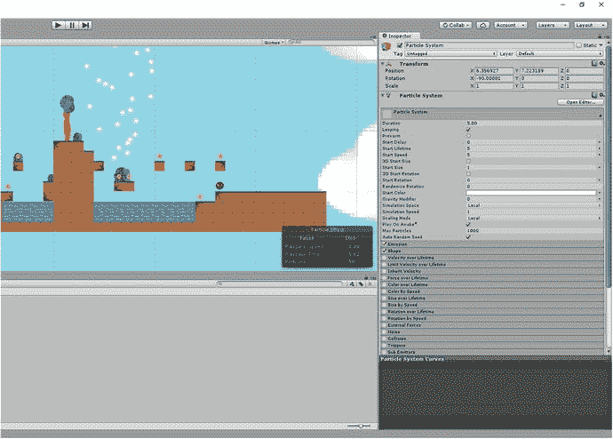

图 6-1。

Your first particle effect

你需要调整这里的一些设置，以使效果看起来更像血。我们可以从改变开始颜色为红色(点击白色条)和开始大小为 0.2 开始。然后单击下面的形状选项，选择球体而不是圆锥体。在“排放”下，将“随时间变化的速率”改为 300。

现在展开渲染器菜单选项，并单击材质选项旁边的圆圈。选择精灵-默认，红色斑点应该变成红色方块。

接下来，展开“生命周期内的大小”(请注意，您需要先勾选“项目符号”框),然后拖动右侧，使线条向下倾斜。这意味着粒子在空气中传播时会变得越来越小，使它们以一种看起来自然的方式消失，而不是突然消失。类似地，你也可以在一生中对颜色做同样的事情。我让我的血液在向外扩张的时候变得稍微暗一点，只是为了让事情保持有趣。

我还施加了 0.2 的重力(这样粒子就往下掉了)。您可以随意使用其他选项——它们通常是不言自明的。

不过，你需要做的一件事是取消顶部的循环框，并将持续时间更改为 0.30。现在效果将只播放一次就结束，而不是立即循环。在任何时候，您仍然可以通过单击“模拟”按钮来测试动画，该按钮在选择粒子效果时浮动在场景视图上。完成后，你应该会看到类似图 6-2 的东西。

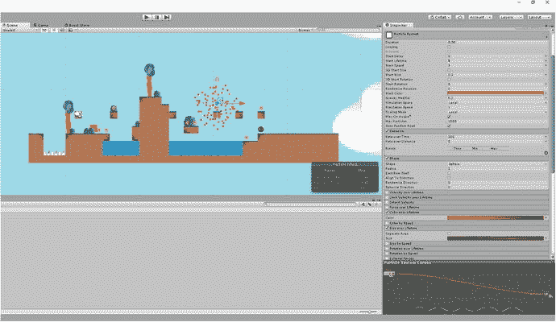

图 6-2。

A lovely cloud of blood

### 摧毁粒子系统

在我们写另一个新剧本的时候，我们将暂时把它放在一边。像往常一样，在脚本文件夹中创建它，并将其命名为 DestroyParticleSystem。你能猜出它是什么吗？(啊，太好了，罗尔夫·哈里斯的推荐信...)

该脚本将看起来像这样:

```java
using System.Collections.Generic;
using UnityEngine;

public class DestroyParticleEffect : MonoBehaviour {

    private ParticleSystem thisParticleSystem;

    void Start()
    {
        thisParticleSystem = GetComponent<ParticleSystem>();
    }

    void Update()
    {
        if (thisParticleSystem.isPlaying)
        {
            return;
        }
        Destroy(gameObject);
    }
}

```

这个脚本的目的只是在粒子效果播放完毕后将其销毁。首先，我们寻找粒子系统的特定实例(在面向对象的编程中通常称为`"this"`)，然后我们检查粒子系统是否在`Update`方法中运行。

最后，一旦效果播放完毕，我们就销毁它。

为什么这很重要？因为否则，我们会在内存中保存无数粒子的实例，这最终会使事情陷入困境。过一会儿这个会更有意义一点。现在，请相信我的话，保存脚本，并将其作为组件添加到您之前创建的粒子效果对象中。

重命名所述粒子系统为血液，然后将其放入预设文件夹。现在从你的等级和场景中删除血。

### 使危害变得危险

不过，我们还没有完成。接下来，您需要向您的危险脚本添加额外的代码，如下所示:

```java
public class Hazards : MonoBehaviour
{

    private Player player;
    public GameObject Blood;

    void Start()
    {
        player = FindObjectOfType<Player>();
    }
    void Update()
    {

    }

    private void OnTriggerEnter2D(Collider2D other)
    {
        if (other.tag == "Player")
        {
            Instantiate(Blood, player.transform.position, player.transform.rotation);
            player.transform.position = new Vector2(-6, 8);
        }
    }
}

```

首先，我们在寻找一个被称为`Blood`的公共游戏对象，然后我们实例化这个游戏对象。这意味着我们正在创建一个游戏对象的实例，在这种情况下，我们使用与玩家相同的坐标。不过，在我们移动球员之前，这一点很重要。

确保你还记得为你的每一个危险在等级中设置血液预置作为游戏对象。你需要在预设文件夹中这样做，这样它将会在每一个后续的尖刺或敌人(而不仅仅是那一个)中被反射。见图 6-3 。

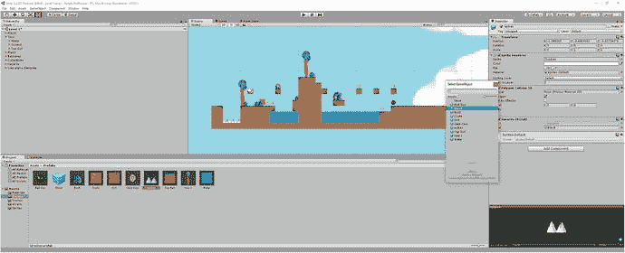

图 6-3。

Adding the blood particle system to the Hazards script attached to the Spikes prefab

有了这些，你现在可以试着玩游戏，测试新的效果。仅尝试在场景视图中观看游戏，而不是选择全屏游戏视图。这样，您应该能够看到发生了什么:当 Squarey 走到一个钉坑上时，他爆炸了，并且在该位置创建了一个血液粒子效果的实例。此时，您会看到它出现在层次结构中。一旦序列结束，效果会在消失前自动消失。

这就是为什么我们需要 DestroyParticleEffect 脚本——否则，我们会有很多“完成的”粒子效果，这些效果来自我们死去的所有时间，这会占用不必要的内存。

如果我们创建子弹或敌人，我们同样可以使用类似的脚本，这样当我们用完数据时，数据就会被销毁。在这种情况下，我们可能有一个脚本，在一段设定的时间后或在与玩家的特定交互后销毁对象。

为什么不试着对你游戏中的硬币做些类似的事情呢？创建一个新的粒子效果并将其命名为 Sparkle，确保添加 DestroyParticleEffect 脚本，然后将其应用于游戏中的硬币。也不要忘记在 CollectCoin 脚本中添加必要的行。你也想让闪光出现在硬币的位置，而不是玩家的位置，但是我会让你自己去想。

## 两个额外的触摸

我们将在处理死亡的过程中增加两个小细节。第一个是在 Squarey 被杀和 Squarey 出现在他的新地点之间引入一个短暂的停顿。我们通过在 Hazards 脚本中添加以下代码来实现这一点:

```java
void OnTriggerEnter2D(Collider2D other)
{
    if (other.tag == "Player")
    {
        StartCoroutine("respawndelay");
    }
}
public IEnumerator respawndelay()
{
    Instantiate(Blood, player.transform.position, player.transform.rotation);
    player.enabled = false;
    player.GetComponent<Rigidbody2D>().velocity = Vector3.zero;
    player.GetComponent<Renderer>().enabled = false;
    yield return new WaitForSeconds(1);
    player.transform.position =new Vector2(-6, 8);
    player.GetComponent<Renderer>().enabled = true;
    player.enabled = true;
}

```

你现在不需要太担心这段代码中发生了什么，但可以说我们增加了一个延迟。是一个可以在其他事情正在进行时发生的例行程序，这意味着我们可以包含一个暂停，而不会让它看起来像是游戏已经崩溃了。我们正在实例化我们的爆炸，等待 1 秒(`WaitForSeconds(1)`)，然后将玩家移动到新的位置。

在这些事件之间，我们还关闭了玩家的可见性(`player.GetComponent<Renderer>().enabled = false`)，并且我们移除了所有的动量，这样玩家在重生(`player.GetComponent<Rigidbody2D>().velocity = Vector3.zero;`)时就不会移动了。

点击播放并尝试一下。你应该会发现 Squarey 的死现在更有说服力了，因为他爆炸了，游戏暂停了，然后他又回到了起点(图 6-4 )。在接下来的一章中，我们将看看如何实现检查点，但是现在，这应该很好地完成了。

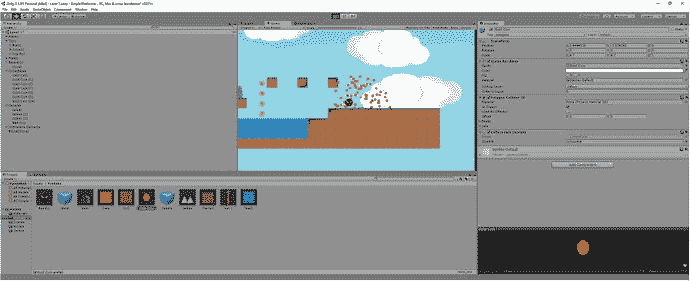

图 6-4。

Ouch, that has got to smart!

关于死亡，我们现在要做的最后一点接触是当 Squarey 从我们的水平边缘掉下时，阻止他无限下落。这很容易做到——我们要做的就是用一个盒子碰撞器创建一个不可见的游戏对象，并附上 Hazard 脚本。然后我们将拉伸它，在关卡下方创建一个屏障(见图 6-5 )。记得确保游戏对象是一个触发器。

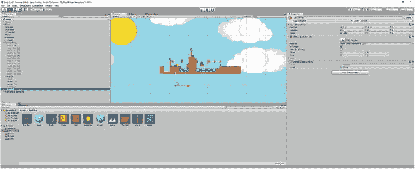

图 6-5。

Adding our barrier underneath the level

## 为玩家制作动画

像这样添加粒子效果已经为我们的游戏做了一些重要的事情:它添加了一个基本的动画，这使世界感觉更加动态。

但并不是每部动画都包含大量分散在各处的小点。在传统的平台游戏中，物体像卡通一样被动画化，这样它们看起来就像真的在跑，在跳，或者在风中飘荡。是时候给我们的玩家角色添加这种动态动画了，所以考虑到这一点，我创造了一个小太空人，他可以探索我们将要设计的外星世界。我们将叫他凯文，和凯文·史派西同名。他的精灵如下图 6-6 所示。

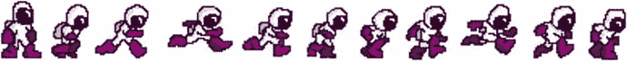

图 6-6。

Kevin, your typical derivative platform hero!

你可能会注意到凯文的雪碧和你平常喝的雪碧有点不同。具体来说，Kevin 不是一个精灵，而是几个精灵——只不过所有这些精灵都在一个文件中。你可以在自己的游戏中使用凯文，也可以创建不同的精灵；只是要确保将它们都保存在一个图像文件中。

这就是我们所说的 sprite sheet，它只是一个包含游戏中单个角色或对象的所有动画帧的图像。这只是一种更有效的处理精灵的方式，你同样可以为游戏中的其他元素制作精灵表。像往常一样将它导入游戏，然后在检查器中打开它，将每单位像素设置为 50 后，将精灵模式设置为倍数。这告诉 Unity 文件在一个图像中包含多个不同的动画帧。精灵后面的棋盘图案代表图像中的透明区域。

现在点击精灵编辑器，然后切片(在左上角)。参见图 6-7 进行参考。

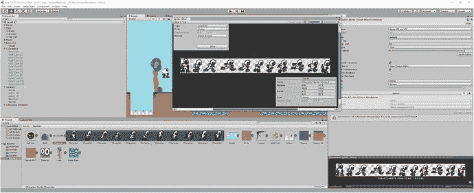

图 6-7。

The Sprite Editor

这个切片按钮很棒，因为它自动检测我们图像中的所有帧，并为我们将它们裁剪成多个不同的图像。您将看到由方框勾勒出的各个框架，如果您愿意，您可以选择手动调整。一旦你满意了，就点击顶部的应用。

现在你可以从精灵文件夹的序列中选择第一个图像(点击精灵旁边的小箭头将显示各个帧)并将其放入玩家角色的精灵框中。现在我们用凯文替换了 Squarey(我们会想念你的，Squarey)，但当我们跑步时，他仍然会沿着地板滑行(图 6-8 )。

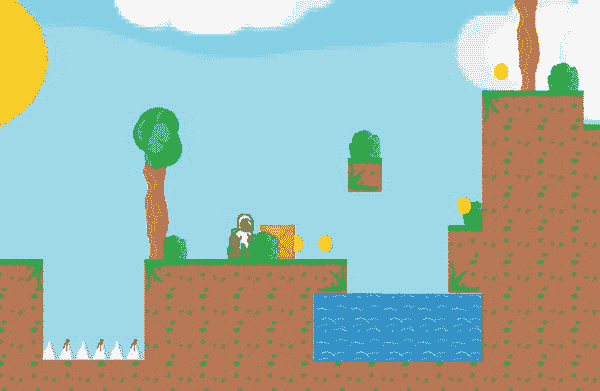

图 6-8。

Kevin enters the world

下一步是在 Unity 中再打开两个窗口。这些是动画和动画师。你可以通过选择窗口➤动画，然后使用顶部菜单选择窗口➤动画。这将打开两个新窗口，这两个窗口将首先浮动在用户界面的顶部。将这些标签拖到 Unity 中您想要的位置。我已经把动画放在了与场景和游戏相同的位置，我已经把 Animator 和项目标签一起放在了底部(见图 6-9 )。

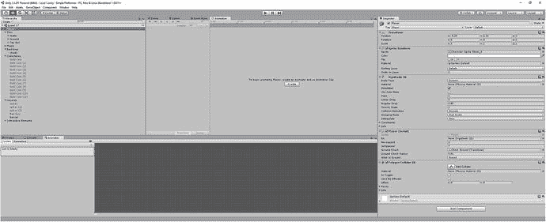

图 6-9。

Animation and Animator windows in place

你会看到我已经选择了球员，你也应该这样做。在动画窗口中，你应该会看到一个创建按钮，我们可以用它来创建我们的第一个动画。我们称它为 Idle，当对话框打开让你定义它时，你还需要创建一个新的文件夹来存储它，名为 Animations。

你会注意到，一旦你这样做了，一个时间线出现在动画窗口中，以及一种“思维导图”出现在动画窗口中。我们一会儿就会讲到这个。现在，你要做的就是将第一个精灵(凯文完全静止的样子)拖放到时间线的开始，这样你就有了看起来如图 6-10 的东西。

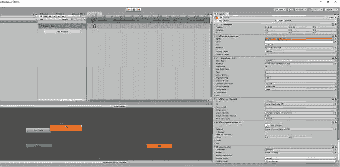

图 6-10。

An idle Kevin

信不信由你，你刚刚创作了你的第一部动画。这感觉不太像动画，因为它只有一个单一的框架。但是如果你在玩游戏的时候看动画窗口，你会看到同样的图像在一遍又一遍的循环。

### 与动画师同行

我们更有趣的动画当然是行走的动画。要做到这一点，你需要在动画窗口中找到单词 Idle，旁边有上下箭头(在左上角)。单击它，然后单击创建新剪辑。调用这个行走，并确保它再次在动画文件夹中。

现在将行走动画的每一帧从 sprite 表放到时间轴中，确保它们的间距大致相等。如果您需要创建更多的空间，您可以通过向下滚动鼠标来实现，这将缩小视图。它看起来应该如图 6-11 所示。

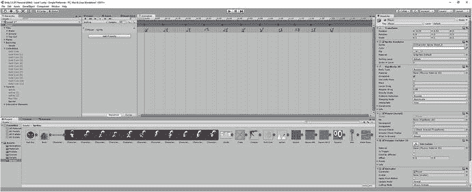

图 6-11。

Kevin’s running animation, ready to go

现在我们有两个独立的动画，但目前 Unity 不知道我们何时要在它们之间切换。考虑到这一点，我们需要进入 Animator 中的流程图，该流程图目前直接从进入空闲状态(现在忽略任何状态——这仅在动画的更复杂交互中有用)。

我们需要做的是增加一个条件，在这个条件下，我们的流程图从空闲变为行走。为此，右键单击“空闲”并选择“新建过渡”。这将创建一个箭头，您可以将它拖动到行走状态。现在你的图表进入➤闲置➤行走。

确保选择了转换本身(箭头),然后找到读取参数的小选项卡并切换到该选项卡。你会在 Name 旁边看到一个加号按钮，如果你点击它，你就可以从不同类型的变量中进行选择。记住:变量是表示数字和字符串等数据的容器。我们正在创建一个新的 bool，Boolean 的缩写——一个可以为真或假、1 或 0 的变量。一旦你点击了加号，你就可以给它命名了，你应该称它为行走。如果你做的一切都是正确的，它看起来会如图 6-12 所示。

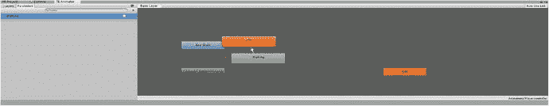

图 6-12。

Adding the walking Boolean

### 动画代码

我们现在需要再次做一点编码，所以打开播放器脚本并创建一个新的 Animator 引用，我们称之为`anim`。然后我们将在`Update`方法中添加一小段代码，它将检查是否按下了左键或右键，并适当地设置 Walking bool。

完成后，您的玩家脚本应该如下所示:

```java
public class Player : MonoBehaviour {
    public Rigidbody2D rb;
    public int movespeed;
    public int jumppower;
    public Transform groundCheck;
    public float groundCheckRadius; 

    public LayerMask whatIsGround;
    private bool onGround;
    private Animator anim;

    void Start () {
        rb = GetComponent<Rigidbody2D>();
        anim = GetComponent<Animator>();
    }

    void FixedUpdate()
    {
        onGround = Physics2D.OverlapCircle(groundCheck.position, groundCheckRadius, whatIsGround);
    }

    void Update () {

if (Input.GetKey(KeyCode.LeftArrow))
        {
            rb.velocity = new Vector2(-movespeed, rb.velocity.y);
            anim.SetBool("Walking", true);

        } else if (Input.GetKey(KeyCode.RightArrow))
        {
            rb.velocity = new Vector2(movespeed, rb.velocity.y);
            anim.SetBool("Walking", true);

        } else
        {
            anim.SetBool("Walking", false);
        }

        if (Input.GetKey(KeyCode.Space) && onGround)
        {
            rb.velocity = new Vector2(rb.velocity.x, jumppower);

        }
    }
}

```

注意我们使用了一个`"else if"`语句。当这个语句紧跟在一个`if`语句之后时，这意味着如果前面的语句为假，后面的语句为真，那么下面的代码就会运行。这允许我们仅在两个按钮都没有按下的情况下将`Walking`设置为假，同时保持我们的逻辑完整。

或者，我们可以对线`anim.SetBool("Walking", rb.velocity.x 1=0)`做一些类似的事情，这意味着如果下面的语句为真，如果玩家沿 X 轴的速度为零，变量`Walking`将等于真。然而，这可能会让凯文原地慢跑，而他纯粹依靠动量向前滑行。

完成后，返回 Unity，选择从空闲到行走的过渡，并在检查器中找到标题“条件”。单击+，使用下拉菜单选择 Walking 作为条件，并将值设置为 True。这实质上意味着只要行走是真实的，转变就会发生。

当你在这里的时候，去掉写有离开时间的方框。这意味着 Unity 不会等到整个动画结束后再从一个过渡到另一个。

现在反向重复这些步骤，这样无论何时`Walking = false`，你都可以从步行回到空闲状态。一旦一切就绪，它看起来应该如图 6-13 所示。

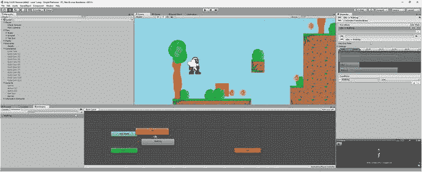

图 6-13。

Our flow chart is complete

正如你可能已经收集到的，没有什么可以阻止我们添加更多的分支到我们的流程图中，这样角色就有了跳跃、下落或其他我们在游戏后期添加的动作的动画。同样，我们可以添加动画，让树随风飘动，硬币原地旋转。水甚至可以在顶层轻轻波动。

### 该死的凯文

当然，目前这里有一个相当明显的遗漏，那就是凯文只有一个正确运行的动画。哦不！我们忘记了创建向左跑的精灵。

心理！幸运的是，我们没有必要把所有东西都做两遍，我们可以非常容易地创建向左跑的动画，只需在 Kevin 转身时翻转图像即可。为此，我们需要在播放器脚本中创建一个私有整数变量，并将其命名为`facing`。在`Start`方法中设置`facing`为 1(让前进方向对应正值是有一定意义的，所以 1 要=右)。然后像这样更新`Update`方法中的这段代码:

```java
if (Input.GetKey(KeyCode.LeftArrow))
        {
            rb.velocity = new Vector2(-movespeed, rb.velocity.y);s
            anim.SetBool("Walking", true);
            if (facing == 1)
            {
                transform.localScale = new Vector3(-1f, 1f, 1f);
                facing = 0;
            }

        } else if (Input.GetKey(KeyCode.RightArrow))
        {
            rb.velocity = new Vector2(movespeed, rb.velocity.y);
            anim.SetBool("Walking", true);
            if (facing == 0)
            {
                transform.localScale = new Vector3(1f, 1f, 1f);
                facing = 1;
            }

        } else

        {
            anim.SetBool("Walking", false);
        }

```

这里的关键行是显示`transform.localscale`的行——这是通过将比例设置为 1 或–1 来翻转播放器精灵的行。我们还需要确保我们正在改变`facing`的值，这样只有玩家第一次改变方向时才会发生。代码应该如图 6-14 所示。

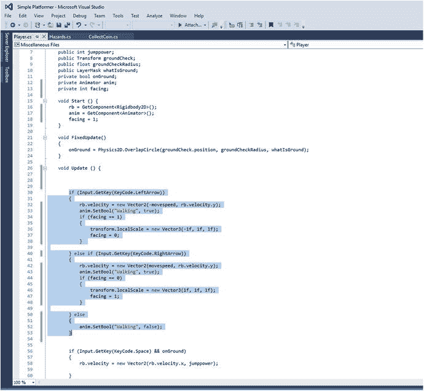

图 6-14。

The new Player script

现在点击播放，你应该会发现凯文有一个不错的小跑步动画，可以切换方向。确保您的相机对象的坐标正好为 0 和 0，否则，当 Kevin 左右翻转时，视图会轻微晃动。

当然，目前这还远非完美。我们缺少跳跃的动画，动作有点生硬，镜头僵硬地跟着我们在屏幕上走。不要担心，您可以稍后解决所有这些问题。现在，我只是给你螺母和螺栓，这样你就可以开始自己玩了。随意开始制作你所有游戏元素的动画。图 6-15 显示了当凯文抓起一枚硬币准备跳入深渊时，他看起来是多么的激动人心。

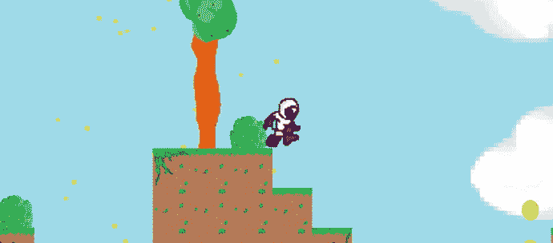

图 6-15。

You go, Kevin

## 添加 HUD

在这一章中，我们一直在关注使用效果和动画来为玩家增加更多的反馈。现在是时候关注更直接和更基本的反馈了:玩家的分数和进度。

换句话说，是时候让玩家知道他们在我们为他们制作的游戏中表现如何，并记录诸如等级、分数等等。这将通过 HUD 显示玩家重要的细节来完成。稍后，我们将能够使用这个覆盖来显示所有其他种类的东西。

首先，让我们从记录玩家收集了多少硬币开始。为此，我们希望在播放器脚本中创建一个名为`coins`的新公共整数。我们不需要在`Start`方法中说`coins = 0`，因为所有的数值变量在创建时都被默认设置为零。

现在我们将打开我们的`CollectCoin`脚本并添加对`player`的引用。然后，在`OnTriggerEnter2D`事件中，我们将添加行:`player.coins++`。这是`player.coins = player.coins + 1`的简称。换句话说，我们将玩家硬币的价值增加 1。

整个事情将如下:

```java
public class CollectCoin : MonoBehaviour {

    // Use this for initialization
    public GameObject Sparkle;
    private Player player;

        void Start () {
        player = FindObjectOfType<Player>();
    }

        // Update is called once per frame
        void Update () {

        }

    private void OnTriggerEnter2D(Collider2D other)
    {
        if (other.tag == "Player")
        {
            player.coins++;
            Instantiate(Sparkle, gameObject.transform.position, gameObject.transform.rotation);
            Destroy(gameObject);
        }
    }

```

如果你尝试一边玩游戏，一边观察检查器中的`Coins`变量(玩家被选中)，你会看到每次我们收集一个新硬币，它都会上升。

我们现在知道我们的玩家收集了多少硬币，但目前玩家还不知道。为了纠正这一点，我们将创建一个叫做画布的东西。

### 添加和使用画布

再次打开顶部菜单，创建一个新游戏对象。这一次选择游戏对象➤ UI ➤画布。在你的层次中双击它，你会看到你的场景突然缩小显示一个大的白色方框。这是画布，你可以在这里给你的游戏添加 UI 元素，比如 HUD 和触摸控件。顺便说一句，这就是为什么在创作第一部 APK 之前关注图形是恰当的。

现在右键单击层次结构中的画布，并选择 UI ➤文本来创建一个新的文本对象。在这里，让我们在检查器中写入级别 1，并将字体大小设置为 20 和粗体。我们可以改变字体，如果我们想简单地通过找到相关的 ODF 或 TTF 文件(通过下载字体，换句话说)，并把它放在这里的盒子里，就像我们做精灵一样。不过，我们可以以后再担心。

此时我们需要做的最重要的事情是将这个 UI 元素锚定到屏幕的左上角。点击检查器左上角的方块图片，然后从下拉菜单中选择左上角的选项。现在把文本放在你想要的地方，它会一直锁定在屏幕的左上角。它看起来应该如图 6-16 所示。

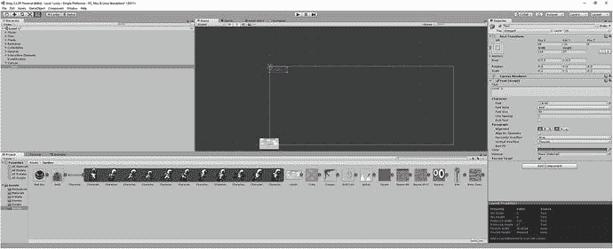

图 6-16。

I chose a color that would match Kevin’s boots and be readable against a lot of backgrounds

将文本对象重命名为`Level`。然后创建另一个，它将被放置在最上面一个的正下方，称为`Coins`。使用相同的大小和颜色的字体，并使这个说硬币:0。

你猜怎么着？是时候再做一个剧本了。这个将被称为 Score，它将被附加到我们刚刚创建的`Coins`对象上。内容如下:

```java
using UnityEngine;
using System.Collections;
using UnityEngine.UI;
public class Score : MonoBehaviour
{
    Text coins;
    private Player player;

    // Use this for initialization
    void Start()
    {
        coins = GetComponent<Text>();
        player = FindObjectOfType<Player>();
    }

    void Update()
    {
        coins.text = "Coins: " + player.coins;
    }
}

```

注意写着`using UnityEngine.UI`的那一行。这基本上告诉 Unity 我们引用了一个额外的类，以便获得更多的编码选项。

希望这个脚本的其余部分是不言自明的。我们所做的就是反复更新文本(这是一种字符串变量)来读取`Coins:`和`player.coins`整数。

将它作为一个组件添加到文本对象中，你会发现这个游戏让你知道凯文在他的冒险中收集了多少硬币。事实上，就像你在图 6-17 中看到的那样。

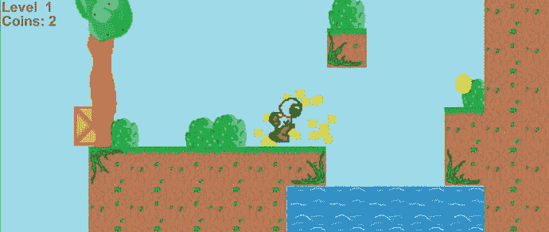

图 6-17。

Kevin now has two coins. Way to go, Kevin. Remember to add your coin’s sparkle effect, if you haven’t already.

### 添加声音效果

既然我们已经做了所有这些，我们也可以完成这项工作，并在收集硬币时添加一些音效。幸运的是，这很容易做到。

你当然需要一个文件来存放你的声音(你可以从本书的参考资料中获得或者自己制作)，正如你所预料的，你会想把它添加到一个名为 Audio 的新文件夹中。我的音频文件叫 Bling.wav。

现在将一个公共音频源 bling 添加到您的 CollectCoin 脚本中，并在`player.coins++`上方添加一行内容为`bling.Play()`。这非常简单，除了我们不能直接把音频文件放到检查器的盒子里。取而代之的是，我们需要使用一个音频源，它是任何一个将音频作为组件附加的游戏对象。我见过很多人做的是将音频文件添加到空的`Collectibles`游戏对象中，该对象是`Coins`对象的父对象，然后将它拖到检查器的框中。(确保在唤醒时取消勾选播放)。

不幸的是，你需要为游戏中的对象实例做这件事，而不是预设。

还有其他方法可以做到这一点，但就目前而言，它应该看起来像图 6-18 ，并且每当你捡起一枚硬币时，它都会发出声音。

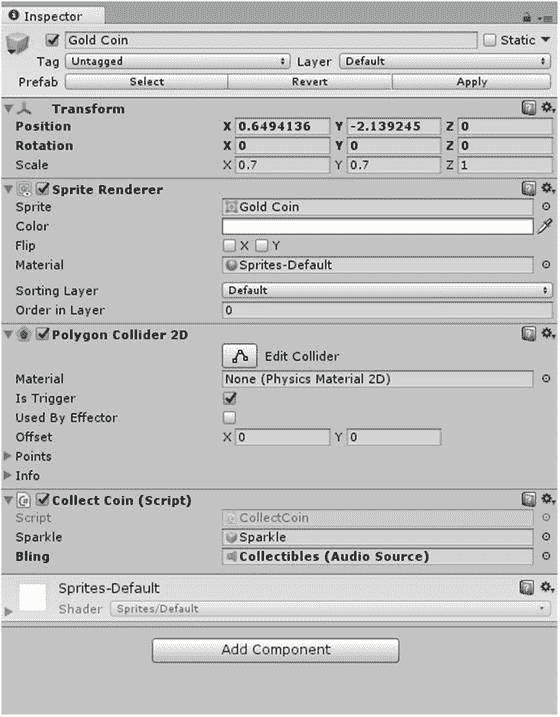

图 6-18。

The `Collectibles` object now has Bling as a component

有了这些，我们现在准备在实际的移动设备上试用这个东西。除非你觉得自己很勇敢。

### 一些高级理论:类、对象和方法，天啊！究竟什么是对象？

你可能已经注意到了，我把 Unity 中的几乎所有东西都称为游戏对象。这个术语很方便，因为在游戏开发环境中，大多数东西都是对象，比如树、敌人、硬币和云。但实际上这里还有更深层的东西。

这是因为在编程语言中，对象也可以引用一种类型的数据。Unity 如此强大和方便的另一个原因是它使用了面向对象编程(OOP)。C#和 Java 都是面向对象的，Unity 以一种优雅而聪明的方式运行着。你可能以前听说过 OOP，也可能这是你第一次遇到它。无论哪种方式，OOP 都是一种编程的设计哲学，它代表了多年来编码中发生的某种进化。如果你用像 BASIC 这样的老派语言编写代码(就像我在 ZX 谱上做的那样！)，那么您就应该以一种叫做命令式编程的方式进行编程。

#### 目标对命令对功能

命令式意味着你写的所有东西都是连续的，你应该按照运行时执行的顺序来写语句。计算机会阅读你的代码，就像你阅读文章一样:从上到下。唯一的例外是当您使用命令`GOTO`时，它会将解释器向前或向后发送到代码中的特定行号。这很容易理解，但随着程序开始达到数百万行(这种情况经常发生)，管理起来也变得不可能。如果代码中有错误，你必须一页一页地去查找原因，如果你想重用某个部分，你唯一的选择就是复制粘贴。

然后，过程化编程出现了，它通过将代码包含在称为过程或子例程的离散部分中，解决了其中的一些问题。这意味着某些指令可以被一遍又一遍地调用，并与主代码分开编辑——但鉴于您必须调用这些过程，代码仍将经历一个漫长曲折的旅程，并在途中做出无数次停留。这就是现在所说的意大利面条代码。

OOP 只是从那里发展而来的下一步。它较少从命令的角度来看编程，而更多地从这些命令描述的数据和对象的角度来看编程。

#### 解释的类和对象

在面向对象程序设计中，子程序被类代替，而类又被用来描述对象。对象是具有属性和行为的数据集合，这些行为被称为方法。

我们在代码中编写的所有脚本实际上都是类，因为它们描述了对象的属性和行为。我们的 CollectCoin 脚本(实际上是一个名为`CollectCoin`的类)描述了硬币的行为(收集时消失，增加`player.coins`值)和属性(硬币的位置、大小等等)。

这个类就像一个蓝图，可以创建任意多的硬币(物体)(就像一个房子的蓝图可以用来创建许多房子一样)。我们称之为对象的实例。当我们销毁我们的硬币时，我们销毁的是这些硬币的实例，而不是类本身。这就是为什么我们只有一个脚本(类)却有许多硬币的副本(实例)。这也是为什么我们需要在粒子效果播放结束时销毁它们，这样在任何给定的时间都不会有无数的粒子效果对象保存在内存中。

正如我们已经看到的，`CollectCoin` ( `onTriggerEnter`)中的方法可以编辑`Player` ( `coins`)中的属性，类能够通过访问彼此的方法和属性来相互交互。

一个类也不需要被附加到一个 sprite 上。一个类也可以仅仅用于处理数字和操作其他类。例如，您可以编写一个脚本(类)来控制时间限制，在这种情况下，对象将是时间限制——一个抽象的概念，而不是您可以移动的东西。但它仍然是一个对象，仍然由类定义。

当我们告诉 Unity 我们在每个脚本的开始使用某些类时，也会发生这种情况——这些类是 Unity 提供的，提供额外的功能，我们可以访问它们的方法和属性。当我们写这些行时，我们告诉 Unity 我们想要访问它为我们创建的一些方法和属性。

#### 在 Unity 中实现面向对象的好处

这就是面向对象编程的高明之处:它允许我们以模块化的方式在编程语言和代码之间共享元素。如果你想在未来的游戏中加入可收集的硬币，你可以简单的把这个类放到你的新项目中。同样，当我们使用 Android SDK 时，我们实际上是在让 Unity 访问 Google 提供的类，以确保代码在 Android 设备上都能顺利运行。使用对象允许我们从其他程序员那里借用元素，并在我们自己的代码中实现它们。这也非常适合于更开放的源代码和协作形式的开发，这对整个软件行业都有好处。

对我们来说，OOP 还让我们将事物整齐地组织在逻辑块中。我们没有一个巨大的文件来决定我们游戏世界中所有事物的行为，相反，我们有游戏对象，它们都有自己的脚本。Unity 为我们提供了这些游戏对象的可视化表示，并隐藏了大部分复杂的东西，从而使事情变得更加清晰(另一方面，学习 Java 要复杂得多，主要是因为需要了解类、方法和对象)。在 Unity 中，很多时候对象确实是对象，我们可以在我们的项目中将它们作为有形的单元移动。Unity 是面向对象代码的完美入门，当你最终过渡到一个不那么可视化的代码类型时，它将帮助你想象你的类和对象以一种相似的方式存在(希望如此)。

如果我们过于迂腐，那么将死亡代码放在`Player`脚本中可能更有意义，而不是放在`Hazards`脚本中(它们实际上是类)。死亡是玩家的一种行为，因此它是该类的一个方法更有意义(记住，类描述对象和行为)。为此，我们只需将代码转移到一个公共方法(`public void dying() {...`)中，并进行必要的修改。然后我们将通过编写`player.dying();`从`Hazards`内部调用该方法。我们也可以通过把信息放在括号里来传递信息。哦，私有方法和变量是不能被其他类访问的。

无论如何，如果你喜欢，就去改变吧——这将是一个很好的学习机会。但是如果您不愿意，代码仍然可以正常工作。

就我们的目的而言，尽可能保持代码的组织美观和高效并不重要。我们正在制作一个相对较小的游戏，大多数设备都能够运行，在这一点上，更重要的是你要跟上并了解正在发生的一切。然而，当代码变得更大时——当你作为一个团队工作时，或者当游戏更加资源密集时——在你的代码中尽可能优雅开始得到回报。让代码片段尽可能的短和高效实际上也能获得乐趣和回报。OOP？更像是强迫症编程。

不要担心，如果所有这一切都直接超过你的头。我花了多次重读才最终理解 OOP 在实际意义上的真正含义。不过，希望您现在至少对这个术语的含义有所了解——本质上是以模块化的方式编码——这将为您随着时间的推移扩展知识提供有用的基础。这将帮助你更像一个程序员一样思考，这总是一件好事。

现在，到了有趣的部分:让我们把这个东西变成一个应用。