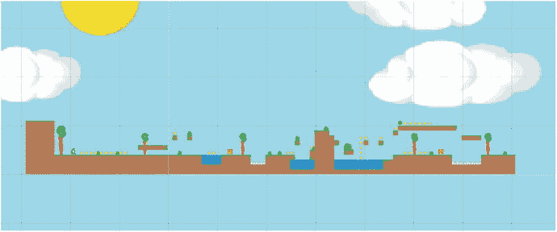
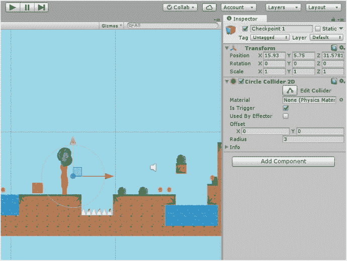
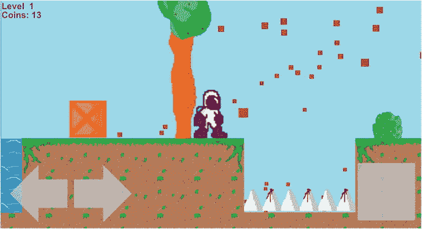
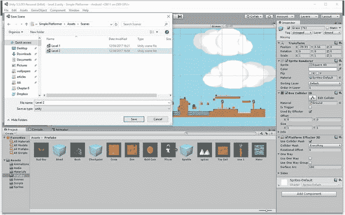
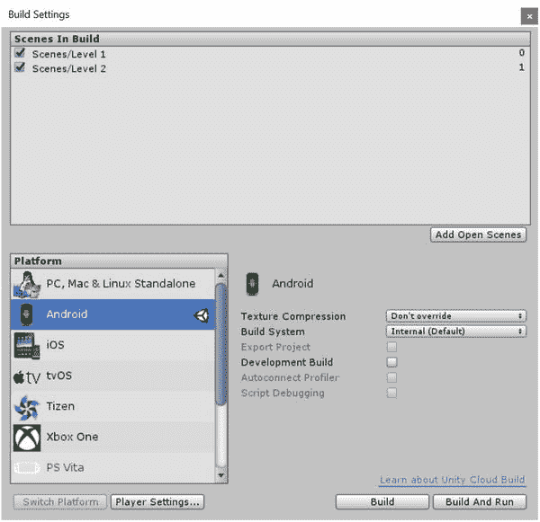
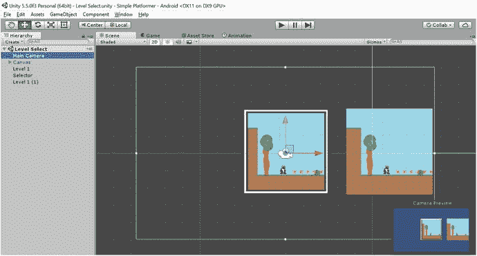
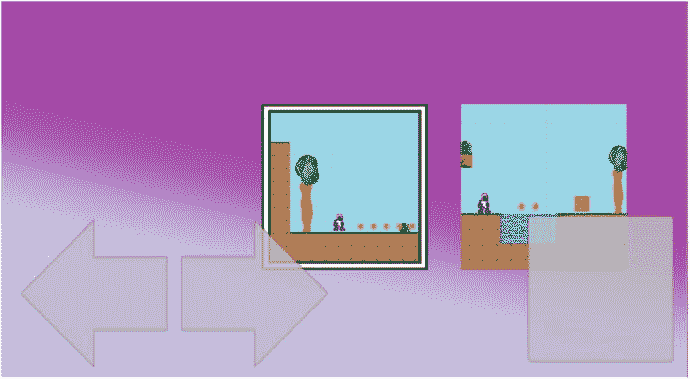
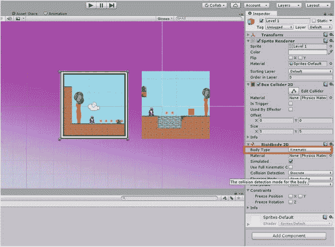
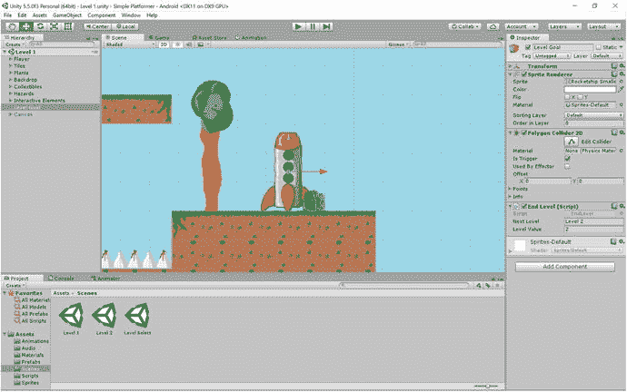
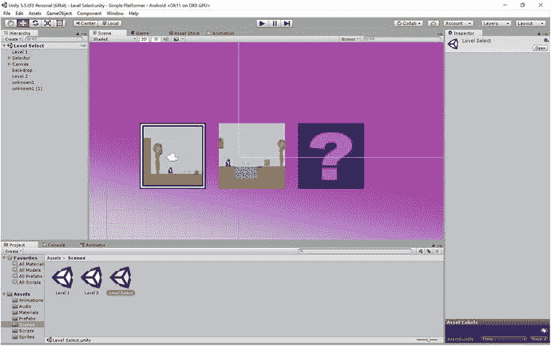

# 八、通过检查点、关卡和保存文件来扩展游戏世界

这本书的很多内容都是可选的。真的，你已经可以构建一个接近完成的游戏了。它现在运行在 Android 上，有动画和声音，通过从你已经学到的东西中推断，你可能可以创建一堆新元素，并将其包装成一个“完整”的游戏。当然，我希望你能坚持到最后，因为我认为这会给你带来更好的成品和更多的编码知识。(此外，你还将学习如何构建虚拟现实应用。)

也就是说，如果你想让你的游戏感觉完整的话，至少还有几个元素我们还没有涉及到。这就是本章的内容。

首先，如果你的关卡超过了几个平台的长度，你就需要引入关卡，这样你的玩家就不会因为不断被送回起点而沮丧。第二，您可能还想创建多个级别，并找到在它们之间过渡的方法。如果你有不止一个关卡，你需要一些关卡选择系统(菜单)和保存玩家进度的方法。在你完成一个有挑战性和有趣的游戏之前，这些是你唯一需要学习的东西。所以让我们开始吧。

## 添加检查点

在你开始增加关卡之前，让你的关卡长一点是有意义的。这是有趣的一点，所以复制和粘贴一些更多的地面精灵，添加更多的钉子和水池，让你的想象驰骋。在第十章中，我们将讨论什么是好的关卡设计——所以现在还不要投入太多的时间和精力。把这个关卡设计当作一个占位符，在你玩的时候给你一些东西。

不过，一定要确保沿途有一些可以杀死玩家的元素。这是检查站发挥作用的必要条件。你可以在图 8-1 中看到我是怎么做的。



图 8-1。

My level 1 is very flat and horizontal, keeping things simple for new players

现在，我们将创建第一个检查点。这只是一个空的游戏物体，我们将把它放入游戏的不同位置。猜猜我们会把第一个叫做什么？1 号检查站。

处理关卡放置最明显的方法是在玩家遇到新的重大挑战之前或之后放置关卡。在游戏的后期，我们可能会尝试组合多种危险，以创造一系列的挑战，从而稍微增加难度。但是现在，让我们从一个新的检查点开始，并将其直接放置在第一个尖峰坑之前。

你想让这个空的物体成为一个触发器，你可能还记得，这意味着我们可以检测到什么时候有人通过碰撞笼，但不会撞到东西。首先，给它一个圆形碰撞器，然后勾选检查器中的触发框。这意味着我们可以知道用户何时越过检查点，但他们不会知道。

让这个对象变得相当大，因为玩家不意外跳过检查点是很重要的。您可以使用调整大小工具或在检查器中输入半径来完成此操作。我的是 3，大到足以防止它被绕过。参见图 8-2 。



图 8-2。

Behold the glory of checkpoint 1

您可能已经猜到了，是时候多写一点脚本(类)了。所以创建一个脚本，命名为`Checkpoint`。我们还将编辑我们的`Player`脚本，所以也在 Visual Studio 中打开它。

### 编写一个更合适的死亡剧本

事实上，我们首先要编辑参与人 1 的剧本。如果你读过第六章中关于面向对象编程的部分，那么你就会知道我们的`Player`角色实际上是一个叫做对象的构造。这个对象有属性(变量)和方法(行为)，正是通过这些，我们的其他对象才能与之交互。

如果我们想移动我们的球员，通过操纵`Player`脚本中的变量来做是有意义的。我们首先创建两个公共浮动:`startx`和`starty`。当重生时，这些将是我们玩家的起点。

游戏的开始实际上是我们的第一个检查点，所以我们在游戏开始时繁殖我们的玩家应该做的第一件事是找出他们在世界上的什么地方，这样我们就可以在他们每次死亡时将他们送回这个确切的点。目前，我们把玩家送回我们编辑过的一组特定的坐标，如果我们要在场景视图中移动玩家，我们必须每次都更新这些数字。当我们开始创建多个关卡并使用相同的脚本时，这将会是一个更大的问题。

我们要做的是检查玩家在物体第一次被创建时的位置，并把它作为重生的位置。

为此，您只需向`Start`方法添加以下代码:

```java
startx = transform.position.x;
starty = transform.position.y;

```

前面的代码在第一次创建游戏对象时获取它的位置，并分别存储 X 和 Y 坐标。

现在找到你的`Death`方法。这将会出现在你的`Hazards`剧本或者你的`Player`剧本中(如果你是我的一个高材生并且你移动了它，就是这样)。不管怎样，你现在要把数字换成新的变量。如果`Death`方法在`Player`脚本中，您可以简单地编写如下:

```java
transform.position = new Vector2(startx, starty);

```

否则，如果它仍然在`Hazards`脚本中，它将看起来像这样:

```java
player.transform.position = new Vector2(player.startx, player.starty);

```

不管怎样，我们的球员现在回到了我们开始时读到的位置。我建议您现在移动您的`Death`方法，以便它在`Player`脚本中。如果你还没有找到这样做的方法，需要一点帮助，只需更新你的脚本如下。

`Player`脚本:

```java
public class Player : MonoBehaviour {
    public Rigidbody2D rb;
    public int movespeed;
    public int jumppower;
    public Transform groundCheck;
    public float groundCheckRadius;
    public LayerMask whatIsGround;
    private bool onGround;
    public int coins;
    private Animator anim;
    private int facing;
    public bool moveLeft;
    public bool moveRight;
    public float startx;
    public float starty;
    public GameObject Blood;

    void Start () {
        rb = GetComponent<Rigidbody2D>();
        anim = GetComponent<Animator>();
        facing = 1;
        startx = transform.position.x;
        starty = transform.position.y;

    }

    void FixedUpdate()
    {
        onGround = Physics2D.OverlapCircle(groundCheck.position, groundCheckRadius, whatIsGround);
    }

    void Update() {

        if (moveLeft || Input.GetKey(KeyCode.LeftArrow))
        {
            rb.velocity = new Vector2(-movespeed, rb.velocity.y);
            anim.SetBool("Walking", true);
            if (facing == 1)
            {
                transform.localScale = new Vector3(-1f, 1f, 1f);
                facing = 0;
            }

        } else if (moveRight || Input.GetKey(KeyCode.RightArrow))
        {
            rb.velocity = new Vector2(movespeed, rb.velocity.y);
            anim.SetBool("Walking", true);
            if (facing == 0)
            {
                transform.localScale = new Vector3(1f, 1f, 1f);
                facing = 1;
            }

        } else
        {
            anim.SetBool("Walking", false);
        }

        if (Input.GetKey(KeyCode.Space))
        {
            Jump();
        }
    }

    public void Jump() {

        if (onGround)

        {
            rb.velocity = new Vector2(rb.velocity.x, jumppower);
        }

        }

    public void Death()
    {
            StartCoroutine("respawndelay");

    }

    public IEnumerator respawndelay()
    {
        Instantiate(Blood, transform.position, transform.rotation);
        enabled = false;
        GetComponent<Rigidbody2D>().velocity = Vector3.zero;
        GetComponent<Renderer>().enabled = false;
        yield return new WaitForSeconds(1);
        transform.position = new Vector2(startx, starty);
        GetComponent<Renderer>().enabled = true;
        enabled = true;

    }
}

```

`Hazards`脚本:

```java
public class Hazards : MonoBehaviour
{

    private Player player;
    // Use this for initialization
    void Start()
    {
        player = FindObjectOfType<Player>();
    }

    // Update is called once per frame
    void Update()
    {

    }

    void OnTriggerEnter2D(Collider2D other)
    {
        if (other.tag == "Player")
        {
            player.Death();
        }
    }

}

```

### 编写检查点脚本

你可能已经知道接下来会发生什么了。我们需要做的就是在检查点进入碰撞器时改变`startx`和`starty`的值。

我们的新`Checkpoint`脚本很简单:

```java
public class Checkpoint : MonoBehaviour {

    private Player player;

    void Start()
    {
        player = FindObjectOfType<Player>();
    }

    void Update()
    {

    }

    void OnTriggerEnter2D(Collider2D other)
    {
        if (other.tag == "Player")
        {
            player.startx = transform.position.x;
            player.starty = transform.position.y;
        }
    }

}

```

别忘了，您还需要将这个脚本附加到有问题的检查点。然后使它成为一个预置，这样你就可以在将来很容易地在关卡周围添加更多的关卡。试试看，你会发现你现在在关卡重生，而不是在游戏开始的时候。

事实上，你应该出现得足够快以至于被淋上你自己的血(见图 8-3 )。很好。



图 8-3。

Kevin returns!

现在在聪明的地方多做几个检查点，稍微玩一玩，看看什么效果最好。在你的层次结构中用逻辑的方式组织它们，也许给它们一个名为`Checkpoints`的父对象。当然，你可以提供某种可见的指示器来指示你的检查点——比如在《刺猬索尼克》游戏中发现的帖子——但是现在玩家只是在游戏中的不同点重新出现是很常见的。当我们加载时，我们接受这一点作为暂停怀疑的一部分，它已经成为视频游戏语言的一部分。

## 更上一层楼

我们已经走了很长的路，但我们的游戏仍然只有一个水平。是时候引入某种形式的真正进展了。

要做到这一点，我们只需制作另一个代表关卡结束的游戏对象，并使其成为一个触发器。鉴于凯文是一名宇航员，他的关卡结束时成为某种太空火箭是有道理的。稍后，我们将制作动画。就目前而言，简单地到达太空火箭将结束这一水平。图 8-4 可以看到我的火箭。


图 8-4。

This rocket ship signals the end of each level

### 创造一个新的水平

在添加脚本之前，我们首先需要创建另一个关卡。在你这么做之前，一定要让你的`Player`游戏对象成为一个预设(把`Player`拖到预设文件夹中，并且一定要带上主摄像机和检查地面)。这样，您所做的任何更改都会在您所做的所有级别中得到全面反映。为你的`Canvas`和它所有的孩子做同样的事情。

一旦你做到了这一点，尝试使用这个简单的小技巧，使一个新的水平:只需点击文件➤保存场景为，并呼吁它的水平 2。确保它和第一级放在同一个场景文件夹中(见图 8-5 )。



图 8-5。

A quick way to make a new level

这是一个很好的捷径，因为这意味着你已经有了所有的预置，你可以更快地设置和运行。只需删除一些元素，移动一些东西，然后按 Ctrl+S 保存新布局。

(或者，只需右键单击场景文件夹，然后选择创建➤场景，即可创建一个全新的场景)。

现在，如果您导航到项目窗格中的 Scenes 文件夹并双击 level one，它应该会在两个布局之间跳转。请注意，新场景中的一切都是新的——甚至是玩家和摄像机。尽管如此，它们仍然是存在于你的预设文件夹中的相同对象的所有实例，所以编辑脚本或属性将影响所有级别的一切。

### 逃离关卡

既然我们的游戏有不止一个关卡，我们就可以在它们之间转换了。回到第一关，像平常一样将精灵添加到第一关。用多边形碰撞器使其成为 GameObject，tick 为 Trigger，创建一个名为`EndLevel`的新脚本，将其作为组件添加到火箭船中。

`EndLevel`会是这样的:

```java
using System.Collections;
using System.Collections.Generic;
using UnityEngine;
using UnityEngine.SceneManagement;

public class EndLevel : MonoBehaviour {
    public string nextLevel;

    void Start()
    {

    }

    void Update()
    {

    }

    void OnTriggerEnter2D(Collider2D other)
    {
        if (other.tag == "Player")
        {
            SceneManager.LoadScene(nextLevel);

        }
    }

}

```

再简单不过了！不过，请注意，这次我用`using`命令包含了代码的顶部。那是因为我使用了 Unity 的一个额外的类，叫做`SceneManagement`。这个类让我们使用加载下一个场景的命令。与此同时，正在讨论的场景是一个公共字符串，我们将在检查器中将其命名为 Level 2。这将使我们更容易更新每个场景的关卡目标，同时仍然使用相同的脚本和对象。

在你点击播放之前，你还需要做一件事:回到构建设置，将场景 2 添加到你的游戏中(只需将它从你的场景文件夹中拖放到窗口中即可——见图 8-6 )。



图 8-6。

Drag Level 2 into the build settings so you can load it

现在尝试通过到达火箭完成水平。你会发现下一个关卡会立即加载，你已经准备好迎接下一个挑战:创建一个关卡选择。

## 构建级别选择屏幕

在大多数手机游戏中——包括 PC 和主机游戏——玩家可以直接进入给定的关卡，只要他们之前已经完成了上一关。这让他们重放他们最喜欢的时刻，回去寻找隐藏的秘密，并击败他们的最高分。为了实现这一点，我们需要为玩家提供一些查看和选择关卡的方法。换句话说，我们需要建立一个级别选择。

这意味着你需要创建另一个场景，但是这个场景将是完全空白。我们称之为等级选择。一旦准备好了，就该重新认识 Squarey 了，只是这次他失去了一点个性(图 8-7 )。


图 8-7。

This will be our selector

实际上，这根本不是正方形，而是一个指示器或选择器，意味着我们需要在中心有一个透明度。这将显示我们希望选择哪个级别，因此我们还需要两个视图，每个级别一个，大小相同。我做了这些 500 x 500 的。你可以从你的两个关卡中截取截图(忽略它们在这一点上本质上是相同的)并保存为精灵。

现在，将两个级别的图像排列到场景中，使它们在相机的视野中，并很好地对齐。然后把你的选择器放在最上面(精确的相同坐标),确保它有一个更高的层排序值。你应该有类似图 8-8 的东西。



图 8-8。

The beginnings of our Level Select scene

### 编写控制脚本

现在我们将创建一个新的控制脚本，它的工作方式很像`Player`脚本。在很大程度上，我们将像控制玩家一样控制选择器。这是我们暂时的玩家角色。

创建脚本并将其命名为`Selector`。然后使用下面的代码:

```java
public class Selector : MonoBehaviour {

    public bool moveLeft;
    public bool moveRight;

    void Start()
    {

    }

    void Update()
    {

        if (transform.position.x > -5 && (moveLeft || Input.GetKeyDown(KeyCode.LeftArrow)))
        {
            transform.position = new Vector2(transform.position.x - 6, transform.position.y);
            moveLeft = false;

        }
        else if (transform.position.x < 1 && (moveRight || Input.GetKeyDown(KeyCode.RightArrow)))
        {
            transform.position = new Vector2(transform.position.x + 6, transform.position.y);
            moveRight = false;
        }

        if (Input.GetKey(KeyCode.Space))
        {
            Select();
        }
    }

    public void Select()
    {

    }

}

```

我的关卡图像间隔 6 个单位，所以这是选择器每一步移动的距离。

正如你所看到的，这与我们通常的`Player`脚本非常相似，尽管显然没有`Death`方法或动画。还有一个或两个其他的差异，你也需要知道。我们已经创建了一个`Select`方法，但是现在它还是空的。相反，当用户点击箭头键时，选择器向左或向右移动了 6 个单位。注意，我们现在使用的是`GetKeyDown`，所以用户必须点击而不是按住箭头。出于同样的原因，我也在方块移动一步后立即将`moveLeft`和`moveRight`设置为`false`。

最后，我添加了一点代码来检查选择器不会离开屏幕的左边缘或右边缘。你需要在每次添加一个新的关卡时更新它，或者使用类似于`numberOfLevels * 6`的东西来计算选择器可以向右移动多远。

如果你拖动`Main Camera`对象使其成为层级中选择器的子对象，那么屏幕将随着选择器的移动而“滚动”。现在，如果你测试它，只要你在电脑上使用光标键，它就应该工作。

现在您需要专门为`Selector`创建一个新的`Touch`脚本。我们可以将这段代码添加到我们已经创建的同一个`Touch`脚本中，并检查它所附加的对象，但是创建新的东西可能更简单。

所以创建另一个新脚本，这次叫做`LevelSelectTouch`。这个实际上是上一个`Touch`的翻版，让事情变得简单明了:

```java
public class LevelSelectTouch : MonoBehaviour {

    private Selector selector;

        void Start()
        {
            selector = FindObjectOfType<Selector>();
        }

        public void PressLeftArrow()
        {
            selector.moveRight = false;
            selector.moveLeft = true;
        }
        public void PressRightArrow()
        {
            selector.moveRight = true;
            selector.moveLeft = false;
        }
        public void ReleaseLeftArrow()
        {
            selector.moveLeft = false;
        }
        public void ReleaseRightArrow()
        {
            selector.moveRight = false;

        }

        public void Select()
        {
            selector.Select();

        }
    }

```

将这个脚本添加到你的层级中的`TouchController`游戏对象——而不是预置。请记住，我们只希望此更改影响此触摸控件实例，而不影响级别 1 和级别 2 中使用的控件。

现在您只需要设置控件来使用这个脚本。打开右箭头、左箭头，然后在检查器中跳转，并为每个重新配置事件触发器，以便它们与新脚本中的正确方法相对应。如果你卡住了，回头看看我们上次是怎么做的——过程是完全一样的(在第七章)。当然，在这种情况下，跳转按钮将被绑定到`Select`方法。

当我们破坏我们的预设时，从画布上删除`Level`和`Coins`游戏对象，因为它们在这个上下文中没有多大意义。

### 准备发射

尝试一下，你会发现你现在可以用光标或者屏幕上的控件来移动选择器。它看起来相当不错，尽管它可能会受益于某种更好的背景(图 8-9 )。



图 8-9。

There we go, much better!

它真正需要的是实际选择级别的能力。一个好的方法是给我们的关卡图像起一个合适的名字，这个名字将会和我们的场景名字一样(所以，关卡 1 和关卡 2 ),并且使选择器本身成为一个带有碰撞器的触发器。我们还将添加刚体，用于我们的碰撞检测。我们显然不希望我们的级别落在屏幕的底部，所以点击体型旁边的下拉菜单来选择运动学(图 8-10 )。



图 8-10。

Set Body Type to Kinematic .

现在像这样更新`Selector`脚本，记住在顶部添加新的`using`行:

```java
using System.Collections;
using System.Collections.Generic;
using UnityEngine;
using UnityEngine.SceneManagement;

public class Selector : MonoBehaviour {

    public bool moveLeft;
    public bool moveRight;
    private string levelChoice;

    void Start()
    {

    }

    void Update()
    {

        if (transform.position.x > -5 && (moveLeft || Input.GetKeyDown(KeyCode.LeftArrow)))
        {
            transform.position = new Vector2(transform.position.x - 6, transform.position.y);
            moveLeft = false;

        }
        else if (transform.position.x < 7 && (moveRight || Input.GetKeyDown(KeyCode.RightArrow)))
        {
            transform.position = new Vector2(transform.position.x + 6, transform.position.y);
            moveRight = false;
        }

        if (Input.GetKey(KeyCode.Space))
        {
            Select();
        }
    }

    public void Select()
    {
        SceneManager.LoadScene(levelChoice);

    }

    void OnTriggerEnter2D(Collider2D other)
    {

        levelChoice = other.name;

    }

}

```

这段代码只是寻找一个冲突，然后获取违规对象的名称，作为一个名为`levelChoice`的字符串进行存储。当你点击跳转按钮时，`levelChoice`会像我们之前加载的一样被加载。尝试一下，你会发现你现在可以跳到你选择的任何一个级别。不要忘记将关卡选择场景添加到构建设置中。

让我们花一点时间来思考一下你在这里的成就:你使用了你已经使用过的所有相同的技巧，但是这次你在游戏中制作了一个菜单而不是一个关卡。这是 Unity 给我们的工具是多么多才多艺的早期迹象。想象创建一个益智游戏或者某种生产力工具并不是太难。

## 保存我们的进度

在我们能够保存玩家的进度之前，关卡选择没有多大用处。我们希望他们在玩这些关卡时有成就感和进步感，这意味着随着每一关的完成，可以选择继续玩下去。这种进步应该从一个游戏阶段持续到另一个游戏阶段，因为每次都要从头开始并不有趣。

因此，我们需要一种方法来保存我们的进展，Unity 实际上给了我们许多选择，从使用玩家偏好到序列化或创建文本文件。

从技术上讲，我们应该使用的是序列化——它可以让你更快地保存更多的信息。这里不涉及太多细节，这意味着将一个对象转换成字节。不过这有点复杂，所以现在我们要用`PlayerPrefs`因为它又快又脏，而且更容易让你理解。

`PlayerPrefs`应该是用来保存像图像质量这样的偏好，或者你是否想要打开声音——换句话说，就是设置。但老实说，很多独立开发者专门使用这种方法，如果你需要做的只是存储一些最高分和级别名称，它会做得很好。

当我们加载关卡时，保存它非常简单。只需更新 1 级火箭附带的`EndLevel`脚本，如下所示:

```java
public class EndLevel : MonoBehaviour {
    public string nextLevel;
    public int levelValue;

    void Start()
    {

    }

    void Update()
    {

    }

    void OnTriggerEnter2D(Collider2D other)
    {
        if (other.tag == "Player")
        {
            SaveLevel(levelValue);
            SceneManager.LoadScene(nextLevel);

        }
    }

    public void SaveLevel(int level)
    {
        PlayerPrefs.SetInt("farthestLevel", level);
    }
}

```

那一行:`PlayerPrefs.SetInt` `("farthestLevel", level);`就是全部了。这用关键字`farthestLevel`创建了一个新的整数，并把它放在`PlayerPrefs`中。我们只需要在检查器中添加公共变量`levelValue`(图 8-11 ，现在触摸火箭将加载下一个场景并更新保存的变量。



图 8-11。

The rocket has Level 2 value

为了利用这一点，我们需要让我们的关卡选择界面更智能一点，这样它就能告诉我们什么时候一个关卡还没有准备好被载入。创造一些东西，将显示在未来的水平。我使用了一个问号，它应该与我的背景很好地匹配(图 8-12 )。


图 8-12。

What’s behind door number two?

创建其中的两个，并将第一个放在第二级后面，在顺序中靠后一点(如果你做对了，它就看不见了)。第二个沿着右边走，第三层就在右边。这些不应该有对撞机；它们只是图像，当前面的图像丢失时会显示出来。你应该有类似图 8-13 的东西。



图 8-13。

There are actually two question marks here—the first one is behind Level 2

我们现在将创建另一个名为`LevelLoader`的脚本，并将其附加到 2 级图像:

```java
public class LevelLoader : MonoBehaviour {

    public int thisLevel;
    private Selector selector;

    void Start () {
        selector = FindObjectOfType<Selector>();

    }

        void Update () {
                if (selector.farthestLevel < thisLevel) {
            this.tag = "off";
            GetComponent<Renderer>().enabled = false;
        } else
        {
            this.tag = "on";
            GetComponent<Renderer>().enabled = true;
        }
    }
}

```

所以，这些图像现在是我们的关卡加载器。当关卡选择场景被创建时，它们都会出现，然后它们会检查玩家是否走得够远。如果玩家没有，他们将消失(`GetComponent<Rendered>().enabled = false`)并将他们的标签设置为`off`。

将这个附加到 GameObject，然后在 Inspector 中输入公共整数`thisLevel`，当然应该是 2。

如您所见，我们需要检查级别的代码将在`Selector`脚本中(因为我们只想做一次)，它有公共属性`loadLevel`。要获得这个值，我们所要做的就是向脚本中的`Start`方法添加一行代码:

```java
PlayerPrefs.GetInt("farthestLevel");

```

当然，我们还需要在顶层定义公共整数。

现在，当选择器被创建时，它将通过查看`PlayerPrefs`来检查玩家已经到达的最远等级，并将该值存储为一个公共整数。如果玩家还没有走得足够远，那么`LevelLoader`图像就会消失。当玩家选择。他们仍然选择了一个“不可见的第二层”，但是因为标签被设置为`off`，它不会被加载。

## 最后几点意见

试一试，你会发现一开始你只能玩 1 级。只有在你通过火箭到达 2 级，然后再次加载这个屏幕后，你才能选择任何一个。进步。

这不一定是最理想的处理方式。为了保持简单，我们的一些方法现在在不寻常的地方。相反，你可以做的是创建一个脚本，作为一种“游戏管理器”来存储进度，加载不同的级别，等等，这样可以让你的代码更整洁。我一直在威胁关于优化的那一章，这是我们将在那里触及的其他内容。

但是现在，我觉得你已经够努力了。这是一个复杂的章节，所以如果你挣扎过，试着不要担心。我实际上只教了你很少的新东西(如何加载场景以及如何在`PlayerPrefs`中保存和加载变量)。大多数情况下，这只是用新的方式运用你已经学到的东西。因此，如果你已经走了这么远，你已经有工具来制作检查点和等级选择屏幕——这只是一个简单的问题，应用一点独创性，以拿出一个你喜欢的系统。这就是编程的乐趣所在:它本质上是一种足智多谋的练习。

在接下来的几章中，事情又会变得不那么技术性了。我们将引入一些常见的障碍、能量和能力来创造更多有趣的游戏可能性。然后我们将讨论什么是好的游戏设计。你已经完成了最难的部分(就目前而言)。是时候找点乐子了！