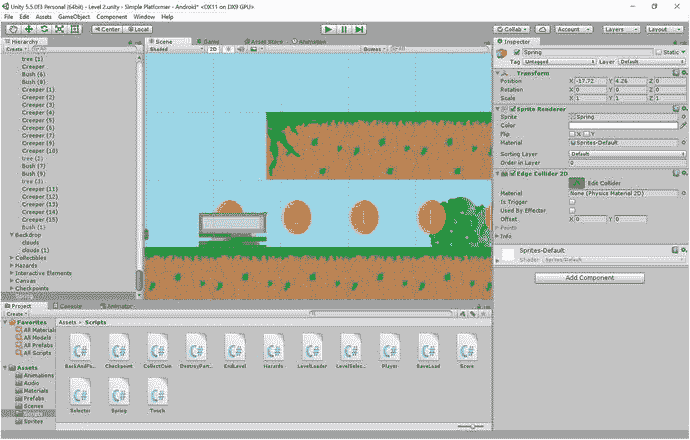

# 九、加入更多的游戏元素：弹簧、移动平台、人工智能等等

你已经花了最后几章努力创造一个工作的游戏世界。您已经开发了引擎，创建了保存文件，并使您的角色以应有的方式移动并与世界互动。希望你能从中得到乐趣，但是可能会觉得有点挑战性，而且在过程中的某些点上很有技术含量。

好了，现在是时候享受一下你的成就了。你创造了这个世界。让我们在里面找点乐子吧。

毕竟，一个典型的游戏会涉及大量不同的障碍，危险和能量，每一个通常都会创造独特的游戏挑战和有趣的遭遇。索尼克有弹簧，戒指，柱子，巴德尼克，钉坑，混沌祖母绿，和循环。马里奥有蘑菇，子弹法案，鬼，问号框，和耀西(s)。超级肉仔有传送门，巨型锯，导弹，还有一堆用过的针。

是时候让你变得有创造力，开始在你自己的游戏中引入更多的元素了。最棒的是。创造这些挑战几乎和以后经历它们一样有趣。

在这一章中，你将学习如何创造各种各样的环境危害和敌人，并且当你想在自己的游戏世界中加入其他元素时，你可以随时回头。我希望它也能成为灵感的源泉，帮助你想出自己的障碍和挑战。当然，在这个过程中，我们也会学到一些新概念。

最后，您还将学习如何掠夺素材商店，以便您可以访问他人精心创建的粒子效果、脚本和精灵，并在您自己的游戏中使用它们。

准备好了吗？让我们找点乐子！

## 一些常见的游戏对象及其行为

虽然每个平台都是不同的，你应该尽你所能使自己与众不同，脱颖而出，但某些比喻确实会不时出现。这在任何类型、任何形式的媒体中都是正常的，所以如果你发现自己又回到了“老一套”，也不用担心

因此，假设你将在游戏设计中使用一些更常见的资源和对象，这一节将向你展示如何构建基本元素，如弹簧和移动块。

### 弹簧

我们要创建的第一个游戏对象是弹簧，或“弹跳垫”可以说是由刺猬索尼克推广开来的，弹簧现在是平台游戏中一个常见的比喻，用来推动玩家上升一个等级。

环顾一下 Unity IDE，你可能会发现它似乎可以完成这项工作:你可以给物理材质 2D 添加一个“弹性”属性。不幸的是，这不是我们想要的，因为这将使地面看起来更像一个真实的弹性表面。也就是说，它将推动角色越往下坠越高，最终返回的能量越来越少。你可以用它做一些有趣的事情，但是它不会按照我们想要的方式运行。

相反，我们将创建一个 spring sprite(图 9-1 )并将它添加到你的关卡中，就像你现在习惯做的那样(图 9-2 )。注意，我们沿着顶部边缘使用了一个边缘碰撞器(而不是通常的盒子碰撞器)。



图 9-2。

A spring in a level


图 9-1。

A spring

接下来，您将创建一个`Spring`脚本并添加以下代码:

```java
public class Spring : MonoBehaviour {

    private Player player;
    // Use this for initialization
    void Start()
    {
        player = FindObjectOfType<Player>();
    }

    // Update is called once per frame
    void Update()
    {

    }

    void OnCollisionEnter2D(Collision2D other)
    {
        if (other.gameObject.tag == "Player")
        {
            player.SuperJump();
        }
    }

}

```

正如您可能已经猜到的，您还将把`SuperJump`方法添加到您的`Player`脚本中:

```java
public void SuperJump()
{
    rb.velocity = new Vector2(rb.velocity.x, jumpPower * 2);

}

```

当然，记得将新的`Spring`脚本添加到你的游戏对象中，并使它成为一个预置——通常的东西。

现在当你碰到弹簧时，凯文将会被发射到两倍于他正常跳跃高度的空中。我一直保持高度与他的跳跃高度成比例，以防我们决定改变关卡的比例。如果你愿意，你也可以给弹簧添加动画和声音。

### 移动平台

任何平台游戏中的一个常见比喻是移动平台。你有左右移动的平台，带你越过深沟，你有上下移动的平台，就像电梯一样。

我们已经可以让事物左右移动——我们已经对我们的敌人做到了。问题是，如果你把这个运动脚本贴在一块地上，凯文就不会跟着它一起动了。相反，地面会从他下面移开，他会从上面掉下来。不好。

与此同时，如果平台上下移动，而你的玩家在上面，他将会颤抖和抓狂，并可能从地板上摔下来。我们本质上需要修改这个脚本，这样我们就可以贴着顶部表面，跟着它走。

我们如何做到这一点？

我给你一点时间思考…在本书中，我们之前使用了什么来允许一个游戏对象相对于另一个游戏对象移动？

明白了吗？

答案是我们需要让凯文成为他所站的游戏对象的孩子。为此，打开你的运动脚本(我们称之为`BackAndForth`)并准备做一些改变。我们不仅改变了剧本，使我们的角色在接触平台时成为平台的孩子，我们还增加了另一个运动维度，使它也可以上下移动。`direction`整数变量现在是公共的，这意味着我们可以从检查器中编辑它。在`onStart()`方法中也不再设置为 0，但是请记住，如果未设置，整数总是从 0 开始。

这意味着我们的敌人行为不会改变——他们将继续左右移动，因为`direction`变量将默认为 0。不过，对于平台，我们可以选择将其设置为 2 或 3，这将使它先向上再向下移动，或者先向下再向上移动。

做完这一切后，`BackAndForth`现在应该是这样的:

```java
public class BackAndForth : MonoBehaviour

{

    public double amounttomove;
    public float speed;
    private float startx;
    private float starty;
    public int direction;
    private Player player;

    // Use this for initialization
    void Start()
    {

        startx = gameObject.transform.position.x;
        starty = gameObject.transform.position.y;
        player = FindObjectOfType<Player>();

    }

    // Update is called once per frame

    void Update()
    {
        if (gameObject.transform.position.x < startx + amounttomove && direction == 0)
        {
            gameObject.transform.position = new Vector2(gameObject.transform.position.x + speed, gameObject.transform.position.y);

        }
        else if (gameObject.transform.position.x >= startx + amounttomove && direction == 0)
        {
            direction = 1;
        }
        else if (gameObject.transform.position.x > startx && direction == 1)
        {
            gameObject.transform.position = new Vector2(gameObject.transform.position.x - speed, gameObject.transform.position.y);
        }
        else if (gameObject.transform.position.x <= startx && direction == 1)
        {
            direction = 0;
        }

        if (gameObject.transform.position.y < starty + amounttomove && direction == 3)
        {
            gameObject.transform.position = new Vector2(gameObject.transform.position.x, gameObject.transform.position.y + speed);

        }
        else if (gameObject.transform.position.y >= starty + amounttomove && direction == 3)
        {
            direction = 2;
        }
        else if (gameObject.transform.position.y > starty && direction == 2)
        {
            gameObject.transform.position = new Vector2(gameObject.transform.position.x, gameObject.transform.position.y - speed);
        }
        else if (gameObject.transform.position.y <= starty && direction == 2)
        {
            direction = 3;
        }

    }

    void OnCollisionEnter2D(Collision2D other)
    {
        if (other.gameObject.tag == "Player")
        {
            player.transform.parent = gameObject.transform;
        }
    }

    private void OnCollisionExit2D(Collision2D other)
    {
        if (other.gameObject.tag == "Player")
        {
            player.transform.parent = null;

        }
    }
}

```

我还建议你为平台创建一个新的物理材料 2D，并将摩擦力设置得高一些。这是为了防止凯文在平台上滑动太多，配合动作看起来有点古怪。

使用边缘碰撞器并添加平台效应器也是一个好主意。勾选效应器使用和使用一种方式，这将防止我们的玩家被平台压碎或粘在一边，并作为平台的孩子移动。如果这阻止了玩家从平台上跳下，你可以稍微增加你的地面检查的半径。还有其他方法来完成同样的事情，可能更优雅一点，但这是一个简单的“修复”，将让您的移动平台启动并运行。

如果一切正常，凯文现在应该随着平台一起移动，不管它是向左向右还是向上向下(图 9-3 )。这创造了大量的平台挑战机会，所以尽情享受吧。


图 9-3。

Kevin going for a ride

### 折叠平台

你知道还有什么很棒吗？倒塌的平台。这些都是平台，当你在它们上面着陆时，它们会在脚下粉碎，从而鼓励你快速奔跑和跳跃，以避免落入你的厄运。

在这种情况下，向玩家传达他们即将面临的挑战的性质是非常重要的。在没有警告的情况下，让一个平台从你的球员下面掉出来，这是不公平的，因此，通常建议有一个视觉指示器来指示地面不太稳定。

出于这个原因，我设计了一个摇摇欲坠的平台，如图 9-4 所示。


图 9-4。

A crumbling platform tile

我们希望这个平台瓷砖在我们着陆时开始破碎，所以我们将创建一个名为`Crumble`的新脚本。这个脚本将简单地在玩家触摸到物体时启动一个计时器，然后在计时器结束时让物体落下并消失。

代码如下所示:

```java
public class Crumble : MonoBehaviour {
    private Player player;
    private Rigidbody2D rb;
    public int timeToCollapse;
    private int timeLeft;
    public int timeToRestore;
    private int restoreTime;
    private float startY;
    private float startX;
    // Use this for initialization
    void Start () {
        rb = GetComponent<Rigidbody2D>();
        player = FindObjectOfType<Player>();
        startX = transform.position.x;
        startY = transform.position.y;
        timeLeft = -70;
    }

     // Update is called once per frame
     void Update () {
           if (timeLeft > -70)
        {
            timeLeft = timeLeft - 1;
        }
        if (timeLeft == 0)
        {
            rb.constraints = RigidbodyConstraints2D.None;
        }
        if (timeLeft == -62)
        {
            GetComponent<Renderer>().enabled = false;
            restoreTime = timeToRestore;
        }
        if (restoreTime > 0)
        {
            restoreTime = restoreTime - 1;
        }
        if (restoreTime == 2)
        {
            transform.position = new Vector3(startX, startY);
            transform.rotation = Quaternion.identity;
            GetComponent<Rigidbody2D>().velocity = Vector3.zero;
            rb.constraints = RigidbodyConstraints2D.FreezeAll;
            GetComponent<Renderer>().enabled = true;
        }

        }

    void OnCollisionEnter2D(Collision2D other)
    {
        if (other.gameObject.tag == "Player")
        {
            timeLeft = timeToCollapse;
        }
    }

}

```

当玩家触摸碰撞器时，开始倒计时，这将是在检查器中选择的一个值。当倒计时过零时，刚体的约束被移除，允许它下落并在空中旋转。计时器继续从 0 倒数到-70，这样我们就有时间看到平台落下并消失。就在时间到达该点之前，对象将停止被渲染并变得不可见。这将开始一个新的倒计时:恢复计时器。这也是在检查器中设定的，当它倒数到零时，对象将返回到其原始位置，约束重新冻结，旋转设定为零，渲染返回。

从玩家的角度来看，这将创建一个瓷砖，在它从屏幕上掉落并最终消失之前，可以站立一段有限的时间。你可能想添加一个“隆隆”的动画和声音效果来增加戏剧性，然后你可以引入一些很酷的反身平台。它应该看起来像图 9-5 。


图 9-5。

Running along collapsing blocks … action!

## 更好的人工智能

另一件你可能想在游戏中加入的东西是一个更好的敌人 AI。现在，我们的敌人只是左右移动，并不比我们的移动平台更聪明。对玩家来说，更具挑战性的是一个会真正找到玩家并追捕他们的敌人。

我认为地面上的东西会更有趣，所以我创造了另一个敌人。这次我要带一种长相很贱的机械鼠(见图 9-6 )。为什么呢？可能是因为太晚了，我把它弄丢了。


图 9-6。

Look, it’s an alien planet. It doesn’t need to make sense

这个小家伙要用一个新的脚本，名字就叫`GroundEnemy`。这个角色的基本行为是沿着地面跟随玩家。所以，如果我们的水平位置比玩家的大，我们减少 x 的值。如果它小，我们增加那个值。我们还需要老鼠在改变方向时翻转，就像玩家一样。

这个简单的脚本看起来像这样:

```java
public class GoundEnemy : MonoBehaviour {
    private Player player;
    private int facing;
    public float enemySpeed;

void Start () {
        player = FindObjectOfType<Player>();

    }

void Update () {

        if (gameObject.transform.position.x > player.transform.position.x)
            {
                gameObject.transform.position = new Vector2(gameObject.transform.position.x - enemySpeed, gameObject.transform.position.y);
                if (facing == 0)
                {
                    facing = 1;
                    transform.localScale = new Vector3(.2f, .2f, 1f);
                }
            }

            if (gameObject.transform.position.x < player.transform.position.x)
            {
                gameObject.transform.position = new Vector2(gameObject.transform.position.x + enemySpeed, gameObject.transform.position.y);
                if (facing == 1)
                {
                    facing = 0;
                    transform.localScale = new Vector3(-.2f, .2f, 1f);
                }
            }
        }

}

```

有趣的事实:我制作的第一个游戏就是基于这个脚本的(除了 ZX 基础版)。这是我“了解”编程的起点。我做了一个可以在屏幕上移动的点，它会被第二个点追赶。玩家的目标是诱骗敌人降落在一个小地雷上(一个红点)。也许这不是一个有趣的事实…有时我会感到困惑。

咳咳。当然，如果你想让坏人真正致命，你也应该添加`Hazards`脚本(你需要添加一个`onCollissionEnter2D`方法，这样碰撞器和触发器都会杀死玩家)。图 9-7 中可以看到敌人在追击。


图 9-7。

Run Kevin, it's some kind of robot rat

无论如何，这个脚本目前有点太简单了。事实上，游戏一开始，敌人就会开始追逐玩家，很可能会被困在某个坑里。不仅如此，他很容易被愚弄，几乎会被任何障碍所阻碍。

为了解决这个问题，我们首先要让他在玩家到达一定距离后立即行动，然后在玩家离开后停止跟随。接近度将是一个公共整数，我们可以在检查器中设置。一个有用的提示是确保你在不同的范围和不同的速度下玩耍。理想情况下，你不希望敌人开始移动，直到玩家可以在屏幕上看到他们。同样，理想的速度应该是能让玩家在紧张的追逐后逃脱的速度。

请注意调整这些数字是如何稍微改变游戏的节奏和紧张程度的。这类似于成为一名电影导演，我们将在下一章更多地讨论这些方面。

既然如此，为什么我们不多一点创意，让我们的敌人有更多穿越环境的能力呢？例如，如果 Roborat(是的，我应该叫他 Roborat)能跳过障碍物试图够到玩家，如果它能自己从坑里出来，那就太好了。为此，我们将使用一个新功能:光线投射。

### 使用光线投射

光线投射有点像你车上的倒车传感器；它们发出一束检查碰撞的光束，如果有碰撞就返回“真”。我们想做的是给我们的敌人一种能力，看看是否有什么东西挡住了它的道路，然后跳过它。这意味着它也需要自己的`groundCheck`(这样它就不会一直跳来跳去)。用和你为玩家做的完全一样的方法来处理这个:创建一个小半径的空游戏对象，然后让它检查地面来设置一个布尔值。您可以直接复制并粘贴代码，一旦代码就位，它应该看起来像这样:

```java
public class GoundEnemy : MonoBehaviour {
    private Player player;
    private int facing;
    public float enemySpeed;
    private bool chaseIsOn;
    public int attackRange;
    public Transform groundCheck;
    public float groundCheckRadius;
    public LayerMask whatIsGround;
    private bool onGround;

    void Start () {
        player = FindObjectOfType<Player>();

    }

    void FixedUpdate()
    {
        onGround = Physics2D.OverlapCircle(groundCheck.position, groundCheckRadius, whatIsGround);

    }

```

在检查器中你也应该有类似图 9-8 的东西。


图 9-8。

Remember, you’re creating an empty GameObject just below the character to use as a transform and then adding it to the Inspector

光线投射是一条看不见的线，我们将使用更多的变换和空的游戏物体来定义它的位置。为了检查这是否有效，我们将使用一个`debug`函数在两点之间画一条直线。这是 Unity 的一个便利特性，可以让你以一种只在场景视图中可见的方式直接在屏幕上绘图。玩家不会看到它，但我们可以用它来测试我们的游戏。

因此，创建两个新的空游戏对象，它们是老鼠的孩子(这听起来像一本奇怪的书名:老鼠的孩子)。第一个应该是死点，我们就叫`Sight Start`。第二个将在 rat 前面两个单位，称为`Sight End`。

现在我们要创建两个新的公共转换，分别是`enemySightStart`和`enemySightEnd`。我们将再次使用检查器将刚刚创建的两个空对象放入其中。如果你做对了，你应该可以添加这一行:

```java
Debug.DrawLine(enemySightStart.position, enemySightEnd.position, Color.red);

```

然后看到场景视图中两点之间出现一条红线(见图 9-9 )。现在我们要把这条线换成光线投射。


图 9-9。

Once the transforms are set, your rat should look like he's jousting

我们的光线投射将精确地到达线当前所在的位置，但是无论如何保持线是有用的，因为光线投射是完全不可见的，否则很难可视化。

幸运的是，使用我们的光线投射非常简单——特别是因为你熟悉使用重叠圆。

我们将使用`Physics2D.Linecast`来完成这项工作。还有其他类型的光线投射，如`Circlecast`，但对于一个规则简单的 2D 游戏来说，一条线是最有效的选择。我们需要给这个函数一个起点和一个终点(就像我们对线条所做的那样)，然后我们还要提供一个图层蒙版。我们不希望敌人跳过玩家，所以它要找的层是地面。

这将进入更新，并且只有当`chaseIsOn`布尔值为真时(也就是说，如果玩家已经被看见)才会起作用:

```java
if (Physics2D.Linecast(enemySightStart.position, enemySightEnd.position, whatIsGround)) {
                Jump();
            }

```

如你所见，我也创建了一个`Jump`方法，就像我们为玩家做的一样。这应该很熟悉:

```java
private void Jump()
    {

        if (onGround)
        {
            rb.velocity = new Vector2(rb.velocity.x, jumpHeight);
        }

    }

```

这实际上是我们的敌人现在能够跨越障碍所需要的一切(见图 9-10 )。现在没有什么能阻止他，他就像一个终结者。


图 9-10。

Leaping rats—a common sight for an ex-Londoner like myself

好消息是，当老鼠转身时，`Sight End`对象也会翻转，因为它是老鼠的孩子。让老鼠尝试跳过裂缝也不需要太多的代码；我们只需要第二个光线投射来观察第一个下方的地面。加上这一点，并确保敌人在该点不与地面重叠时跳跃(图 9-11 )。


图 9-11。

Our rat friend looking for the floor

### 编码敌人的行为

我还添加了一些东西，本质上是来自`BackAndForth`脚本的相同代码。我想让老鼠左右移动，这样它就“巡逻”了，直到它开始追逐玩家。让一个完美的敌人一直保持到玩家被看到，这看起来并不特别自然…尽管这可能会令人毛骨悚然，我承认。不过，我们会让这个代码更智能一点，如果敌人接近边缘，我们会让它改变巡逻方向，这样它就不会离开平台或撞到墙上。

我还将稍微移动一下代码，这样它就不会全部位于`Update`函数中——这看起来有点难看。如果您想走简单的路线，您可以复制并粘贴这段代码来创建您自己的地面敌人:

```java
public class GoundEnemy : MonoBehaviour {
    private Player player;
    private int facing;
    public int jumpHeight;
    public float enemySpeed;
    private bool chaseIsOn;
    public int attackRange;
    public Transform groundCheck;
    public Rigidbody2D rb;
    public float groundCheckRadius;
    public LayerMask whatIsGround;
    private bool onGround;
    public Transform enemySightStart;
    public Transform enemySightEnd;
    public Transform enemySightEnd2;
    private float startX;
    public double amountToMove;

    void Start () {
        player = FindObjectOfType<Player>();
        rb = GetComponent<Rigidbody2D>();
        startX = gameObject.transform.position.x;
        facing = 3;
    }

    void FixedUpdate()
    {
        onGround = Physics2D.OverlapCircle(groundCheck.position, groundCheckRadius, whatIsGround);
        Debug.DrawLine(enemySightStart.position, enemySightEnd.position, Color.red);
        Debug.DrawLine(enemySightStart.position, enemySightEnd2.position, Color.green);
    }

    void Update()
    {

        if (gameObject.transform.position.x - player.transform.position.x < attackRange && gameObject.transform.position.x - player.transform.position.x > -attackRange && chaseIsOn == false)
        {
            chaseIsOn = true;

        }
        if (gameObject.transform.position.x - player.transform.position.x > attackRange || gameObject.transform.position.x - player.transform.position.x < -attackRange && chaseIsOn == true)
        {
            if (chaseIsOn)
            {
                startX = gameObject.transform.position.x;
            }
            chaseIsOn = false;
        }

        if (chaseIsOn)
        {
            Pursuit();
        } else
        {
            Patrol();
        }
    }

    private void Patrol()
    {
        if (facing == 3)
        {
            facing = 0;
            transform.localScale = new Vector3(-.2f, .2f, 1f);
        }

        if (gameObject.transform.position.x < startX + amountToMove && facing == 0)
        {
            gameObject.transform.position = new Vector2(gameObject.transform.position.x + enemySpeed / 2, gameObject.transform.position.y);

        }
        else if (gameObject.transform.position.x >= startX + amountToMove && facing == 0)
        {
            facing = 1;
            transform.localScale = new Vector3(.2f, .2f, 1f);
        }
        else if (gameObject.transform.position.x > startX && facing == 1)
        {
            gameObject.transform.position = new Vector2(gameObject.transform.position.x - enemySpeed / 2, gameObject.transform.position.y);
        }
        else if (gameObject.transform.position.x <= startX && facing == 1)
        {
            facing = 0;
            transform.localScale = new Vector3(-.2f, .2f, 1f);
        }

        if (Physics2D.Linecast(enemySightStart.position, enemySightEnd2.position, whatIsGround) == false || Physics2D.Linecast(enemySightStart.position, enemySightEnd.position, whatIsGround))

        {
            if (facing == 1)
            {
                facing = 0;
                transform.localScale = new Vector3(-.2f, .2f, 1f);

            }
            else
            {
                facing = 1;
                transform.localScale = new Vector3(.2f, .2f, 1f);

            }
        }
    }

    private void Pursuit()
    {

        if (Physics2D.Linecast(enemySightStart.position, enemySightEnd.position, whatIsGround) || Physics2D.Linecast(enemySightStart.position, enemySightEnd2.position, whatIsGround) == false)
        {
            Jump();
        }

        if (gameObject.transform.position.x > player.transform.position.x)
        {
            gameObject.transform.position = new Vector2(gameObject.transform.position.x - enemySpeed, gameObject.transform.position.y);
            if (facing == 0 || facing == 3)
            {
                facing = 1;
                transform.localScale = new Vector3(.2f, .2f, 1f);
            }
        }

        if (gameObject.transform.position.x < player.transform.position.x)
        {
            gameObject.transform.position = new Vector2(gameObject.transform.position.x + enemySpeed, gameObject.transform.position.y);
            if (facing == 1 || facing == 3)
            {
                facing = 0;
                transform.localScale = new Vector3(-.2f, .2f, 1f);
            }
        }
    }

    private void Jump()
    {

        if (onGround)
        {
            rb.velocity = new Vector2(rb.velocity.x, jumpHeight);

        }

    }

void OnCollisionEnter2D(Collision2D collision)
    {
        if (collision.gameObject.tag == "Enemy")
        {
            Physics2D.IgnoreCollision(collision.collider, GetComponent<Collider2D>());
        }
    }
}

```

这仍然是相当简单的敌人人工智能去，但它导致一些相当愉快的行为。我们的坏蛋现在会慢慢地巡逻(我把这个设置为半速)直到玩家接近。作为一只老鼠，他能闻到凯文的气味，所以一旦凯文靠得太近，老鼠就会紧追不舍，跳过障碍物和深坑紧追不舍。如果他碰凯文，我们就死定了。如果凯文及时逃走，老鼠就会失去兴趣，在他所在的任何地方巡逻。

最后一种方法——`onCollission2D`方法——是为了防止老鼠相互碰撞。我把这个包括进来，这样你就可以为毛出因子做一个老鼠的“坑”。不过，你需要将老鼠标记为敌人，它才能工作。

如果 Roborat 发现自己被困在一个平台上(见图 9-12 )，他通常只会僵住。所以，他并不完美。但他仍然很有趣，而且充满活力，足以创造许多游戏机会。


图 9-12。

So long, sucker!

并感到自豪:你刚刚创造了你的第一个人工智能。一天的工作。

## 武装玩家

我们的老鼠已经被证明是一个相当卑鄙的威胁，肯定是一个足够的挑战，给我们的球员一段艰难的时间。是时候给我们的球员一个反击的机会了。

创建一个玩家可以发射的子弹是相对容易的，尽管我们需要做一些杂耍来确保我们引用了正确的`Bullet`对象实例。请允许我解释。首先，我们需要创建一个新的游戏对象，名为`Bullet`。这是我们的子弹，它的方向和速度有公共变量。它也将有一个对撞机。该脚本如下所示:

```java
public class Bullet : MonoBehaviour {

    public float speed;
    public int direction;
    private int timeLeft;
    public GameObject Blood;

    void Start () {
        timeLeft = 100;
        }

        void Update () {
        timeLeft = timeLeft - 1;
        if (timeLeft < 1)
        {
            Destroy(gameObject);
        }
        if (direction == 0)
        {
            gameObject.transform.position = new Vector2(gameObject.transform.position.x - speed, gameObject.transform.position.y);
        } else if (direction == 1)
        {
            gameObject.transform.position = new Vector2(gameObject.transform.position.x + speed, gameObject.transform.position.y);
        }
    }

    void OnCollisionEnter2D(Collision2D other)
    {
        if (other.gameObject.tag == "Enemy")
        {
            Destroy(other.gameObject);
            Instantiate(Blood, transform.position, transform.rotation);
        }
        else if (other.gameObject.tag == "Player")
        {
            Physics2D.IgnoreCollision(other.collider, GetComponent<Collider2D>());
        }
        else
        {
            Destroy(gameObject);
        }
    }
}

```

请注意，杀死一只老鼠会造成与玩家死亡时相同的血腥粒子效果。这意味着你需要像以前一样在检查器中添加那个公共游戏对象。还要注意，我们的`onCollision`方法检查对象标签，这样老鼠会被血杀死，玩家会被忽略，其他任何东西都会破坏子弹。so 在设定的持续时间后超时，并自毁以将其自身从内存中移除，就像之前的粒子效果一样。

同样，我们还想在`Player`脚本中创建一个名为`Bullet`的新公共对象。你需要通过检查员把子弹预置放在那里。

然后，您将添加以下代码:

```java
if (Input.GetKeyDown(KeyCode.LeftControl)) {
                var newBullet = Instantiate(bullet, transform.position, transform.rotation);
                var bulletScript = newBullet.GetComponent<Bullet>();
                bulletScript.direction = facing;
            }

```

这是新的部分。这里，我们不仅要实例化一个新对象，还要在创建对象时为它设置一些属性。为此，我们需要使用`GetComponent`来从这个实例中获取对脚本的引用。从那里，我们可以访问公共变量并更改它。

最终，你会得到一颗可以穿透敌人的子弹，如图 9-13 所示。


图 9-13。

Alas, poor Roborat

(当然，稍后您会想要进入画布并添加一个“fire”按钮。我没有说这个，因为我认为子弹让我们的球员有点被制服了。这一部分只是供你参考，如果你想的话，你可以在游戏中添加子弹和枪支。同样，你也需要给你的玩家精灵添加一把枪，可能还需要一个新的动画。)

## 使用素材存储中的素材

我可以继续告诉你如何创建不同的对象和行为，直到我脸色发青，但我永远不会告诉你如何制作你可能需要的一切。传送玩家的传送门怎么样？开门的开关呢？会飞的敌人呢？还是双跳？还是开机？

希望你现在能自己弄清楚这些东西。本章介绍了光线投射，更详细地介绍了实例化，并增加了您的知识。利用这些新信息，在你已经知道的基础上，你应该能够对你能想到的几乎任何问题提出创造性的解决方案。记住，没有缺乏资源这种事，只有缺乏足智多谋。

但是如果你自己想不出来，或者你只是没有时间或者兴趣，你可以找到别人(包括 Unity Technologies)已经做好的预制体，添加到你自己的项目中。这就是素材存储的用武之地(图 9-14 )。


图 9-14。

The Asset Store in all its glory

要开始浏览此处，只需选择“素材商店”选项卡并四处查看。你会看到各种各样的东西——从粒子效果，到脚本，到精灵包，到整个游戏演示。你会注意到有滑块让你设置价格(许多素材是免费的)和文件大小，你可以从右边的类别中选择。如果你点击一个出版商的名字，比如 Unity Technologies，你可以看到他们所有的素材和软件包。

我想让你从 Unity Technologies 找到名为 2D 平台的素材选择(图 9-15 )。这基本上是一个完整的 2D 游戏，但现在让我们试着选择一个我们想要的元素，而不是使用整个游戏。具体来说，我们抓一个音效文件:Player-jump1.wav。


图 9-15。

This will do just nicely

在商店中点按“下载”,然后点按“导入”。Unity 会警告你，你可能会覆盖你的辛苦工作，但是不要担心——你可以在下一个屏幕上准确地选择你想要添加的内容。所以点击 OK，在打开的窗口中取消选择列表中的所有内容(点击 None)，然后手动重新选择声音效果(图 9-16 )。


图 9-16。

Only select what you want

现在点击导入，一秒钟后你会在你的音频文件夹中找到新的子文件夹。点击这些，你最终会得到你想要的声音效果。

您现在可以像以前一样创建一个音频源，并让它在 Kevin 跳跃时播放。这种声音对他来说绝对是错误的，但希望你看到这里的可能性——你可以在素材商店找到几乎任何你想要的东西，尽管你可能需要支付一些费用，但你会发现它通常不会太贵。通常，这里的资源的质量和专业性将超过你自己所能做的，这将加速开发，同时产生具有更高生产价值和更多“光泽”的最终产品我不想推荐任何具体的东西，因为商店的内容一直在变化，这可能会使这本书过时。然而，现在有一个 2D 精华精选，其中包括一些很酷的东西，如天气粒子效果，动态照明，反射 2D 水和“专业相机 2D”

希望你的头脑现在对这些可能性感到震惊，但最重要的是你不要忘乎所以。好的游戏设计不仅仅意味着向玩家扔你能扔的所有酷的东西——它和其他东西一样需要克制。权力越大，责任越大。


图 9-17。

My Level 2 looks like this right now, which is all wrong. Find out why in the next chapter.

这就是为什么第十章为你提供了优秀游戏设计、技巧和风格的基本介绍。你已经掌握了基本技能——现在是时候学习如何利用它们了。