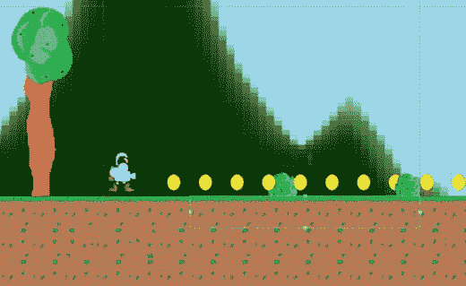

# 十、让游戏变得有趣和优化

恭喜你，你现在可以用 Unity 做游戏了！

不，说真的，如果你现在停止阅读，我相当有信心你可以建立一个完整的游戏关卡和一切。你甚至可以在浏览了一会儿之后找到如何在 Play Store 上发布它的方法(尽管我会在第十二章解释)。

是的，你可以建立一个游戏。但是你能开发一个好的游戏吗？因为这是两码事。记住:权力越大，责任越大。我觉得，如果我教你如何制作游戏，然后在没有任何关于如何让游戏变得有趣的指导的情况下让你自由，我会对这个世界造成伤害。

这就是我们将在这一章中探讨的内容。我们也会讨论一些关于优化的问题(让你的游戏运行更流畅，占用更少的空间)，甚至如何让你的关卡看起来更漂亮。这是放在编程蛋糕上的樱桃。走吧！

## 入职和教程

还记得你从商店买了一个电脑游戏，然后在服装店等着你妈妈买完东西的日子吗？你可能很高兴坐在那里，因为你有手册可以阅读，里面充满了背景故事、提示和关于游戏中一切是如何工作的解释。它让你对游戏充满期待，并确保你在插入卡带/磁盘后就知道如何开始游戏。

如今，游戏很少配有手册，尤其是手机游戏。但这并不意味着你可以假设你的玩家马上就知道怎么玩了。事实上，你甚至不应该假设他们以前玩过电子游戏。因为你的一些玩家可能不会有，而那些仍然是你想留下来的客户。每个游戏都是某人的第一次。所以你的工作就是“在工作中”教玩家，这意味着你需要一个教程级别。

实际上，教程水平几乎和指导手册本身一样是一个时代错误。如果你还记得你真正喜欢的上一个教程级别，请举手。不，我不这么认为！

一个好的第一关应该在没有明确告诉玩家任何事情的情况下指导玩家如何操作一切。这意味着你将需要使用视觉线索，以及游戏性的比喻，创造一个知识的基础，然后在此基础上建立。

### 剖析完美的开放水平

虽然缺乏手册可能是一个现代问题，但在有史以来最经典的游戏之一《超级马里奥兄弟》中可以找到一个完美的开放级别的例子，它含蓄地教玩家如何玩。这款游戏的开放级别，称为世界 1-1，是游戏历史上最受分析和高度赞扬的级别之一，这是有充分理由的。让我们看看它是如何工作的。

为了您的方便，我已经使用来自我们简单平台的素材重新创建了第一级布局(图 10-1 )。这可能是也可能不是亵渎。


图 10-1。

Hmm, this is oddly familiar…

从第一个屏幕开始，玩家就开始学习如何玩游戏。在这里，他们受到他们的主角马里奥(或者在我们的情况下，凯文)的欢迎。马里奥被放置在屏幕的最左边，镜头向前推到右边。这立即无声地告诉玩家:向右走。

当马里奥向右走时，他会看到一个愤怒的古姆巴向他走来(我们已经用我们的机器人代替了它)。你知道吗，从进化上来说，每当有东西直接向我们靠近时，我们就会感到压力。这就是为什么通勤是一场噩梦。这种运动模式结合古姆巴人愤怒的眉毛应该足以告诉我们需要避开敌人。我们唯一能做的就是跳——否则，我们会死(图 10-2 )。


图 10-2。

Jump or die

跳跃是马里奥的主要机制，这种开放确保了玩家在进入下一步之前明白这是如何运作的。如果他们失去了所有的生命，回到起点，那么他们什么也没有失去，因为他们还没有取得任何进展。所以这是一个很好的实验场所。

马里奥接下来会遇到一个问号框。这个盒子正乞求被一个强有力的视觉暗示所触动，这个视觉暗示就是问号。这个通用符号在说，“哦，这是什么？”(“哦”是可选的)。

当马里奥通过弹跳进入问号来触摸它时，他会发现它会产生一个蘑菇。下一关的设计是马里奥几乎被迫收集蘑菇。它将从盒子中出现，在马里奥上方向右移动，然后从管道中反弹向左。马里奥此时很可能在下一个平台的下面，所以即使他试图跳起来避开蘑菇，它仍然可能击中他。在我们的游戏中，图 10-3 近似于这种情况。


图 10-3。

Were this Mario, a mushroom would now be appearing

因此，玩家学会了如何成为“超级马里奥”

这一关以这种方式继续，以简单、无言的方式教玩家他们需要的每一项技能。接下来的几个关卡会给玩家足够的时间来练习这些技能，然后将一些障碍串联起来，以进行真正的挑战。随着游戏的进行，必须按顺序绕过的障碍数量会增加，最终会开始引入新的怪癖和曲折。

### 确保你的玩家理解你的游戏

这可能对你来说听起来像是常识(难道你不聪明)，但是当你在关卡设计的阵痛中，很容易忽略这些点。

看看你已经创造了什么。我知道在这一点上你只是在玩，但我敢打赌你已经设置了一些相当残忍的陷阱。人们很容易被这种想法冲昏头脑，错误地认为辛苦=有趣。这种哲学会导致很多人在给你一个合适的机会之前就放弃你的游戏。如果玩家没有太多的游戏经验，这一点尤其正确。

那么，你必须经常做的事情就是把你的游戏交给人们去尝试。为 Android 开发的好处是，你可以把你的手机带到酒吧，在周围传递，看看你的朋友们过得怎么样。你可能会发现，对你来说似乎显而易见的事情对第一次玩游戏的人来说是迟钝或不公平的。你会看到你的玩家在哪里卡住了，在什么时候他们会考虑放弃。如果你做对了，他们至少应该能够通过最初的几关而不会过度沮丧。他们至少需要这么长时间才会上瘾。

马里奥和世界 1-1 背后的天才头脑 Shigeru Miyamotu 的建议是，最后设计你的第一关。这使得后退一步，避免在关卡设计中变成虐待狂的诱惑变得容易多了。

### 难度曲线

不过，你确实需要在游戏的某个阶段开始引入重大挑战，否则会变得很无聊。乐趣在于不可能和太容易之间的平衡点。

为什么呢？因为从神经学的角度来看，只要我们在学习，游戏就是有趣的。是的，我要深入了。

你的大脑进化来帮助你生存。是什么让人类如此擅长生存？我们适应和学习的能力。我们茁壮成长，因为我们学会了如何利用我们周围的环境，应对不断变化的气候和环境。我们的反应随着练习变得更好，固定的运动模式通过重复变得根深蒂固。

大脑想要不断学习，所以它通过释放某些神经递质和激素来奖励这种学习。当你朝着一个目标努力时，大脑会释放多巴胺让你保持专注。当你完成这个目标时，它会释放内啡肽——感觉很棒。这鼓励大脑重新连接自己，这样你就有更好的机会再次完成同样的事情。游戏使用声音效果来表示奖励，这加强了这种反应。

如果你给大脑的刺激或挑战太少，它就会变得无聊。无聊对我们有害，因为它会导致大脑萎缩。无聊的时候，我们会很快找点别的事情做。

同样，当你向大脑提出一个不可能的挑战时，它会很快泄气并放弃。

但是如果给你一个足够困难的挑战，需要做大量的工作，但又不会困难到不可能，那么这可以在大脑学习、适应和成长的过程中刺激和吸引你。如果一款游戏做到了这一点，那么玩家将进入神经科学中所谓的心流状态——一种我们完全专注于手头任务的精神状态，以至于我们周围的时间似乎都在膨胀和变慢。脑成像研究显示，大脑在这一点上的工作方式发生了一些令人着迷的变化；它进入了一种被称为额叶功能减退的状态，在这种状态下，大脑的额叶区域受到抑制，我们开始纯粹凭本能行事。这种平衡如图 10-4 所示。


图 10-4。

For your players to be engaged and have fun, your difficulty curve must perfectly match their level of ability

你可能在某个时候经历过这种情况，在一场子弹地狱射击中，你恍惚地在屏幕上的数百颗子弹周围跳舞，或者在一场激烈的 boss 战斗中，你只剩下一条命了。

大脑参与其中是因为它在学习和成长，当你回到早期水平，发现新的肌肉记忆使以前看似不可能的挑战变得容易时，你可以感受到这种劳动的成果。

作为一名游戏设计师，你的工作是确保挑战的强度随着玩家技能和经验的提高而完美提升，最终目标是让他们保持在最佳状态。更好的是，你应该给你的游戏深度，以便他们可以回到早期水平，并使用他们的新技能获得更好的时间或找到隐藏的收藏品。

(也就是说，节奏也很重要，你确实需要给球员提供偶尔的喘息空间，以便他们能够恢复。)

### 让你的游戏变得有趣的其他方法

所以，当玩家在游戏中前进时，你要不断地教他们，并保持挑战的公平性和回报性，这是非常重要的。

但这并不是让你的游戏变得有趣的唯一方法。另一个有用的工具是多样性。在现实世界中刺激心流状态的一种方法是把一个人放在一个新奇的环境中，这是我们可以利用的优势。当周围环境不熟悉时，大脑会醒来并集中注意力，因为这再次代表了一个学习的机会。

这就是为什么您应该不断引入新的机制并升级您的环境。这也是为什么在游戏中看到“雪级”和“火山级”如此常见的原因。当然，你可以更有创造性，但最重要的是你要不断改变调色板和色调。这创造了一种发现的感觉，并鼓励你的球员想要不断向前推进。

解谜是玩家在游戏中喜欢的另一个比喻。再一次，这是一种神经上的回报，来自于那个“发现”的时刻，来自于让一切都到位。

那么如何设计一个好的拼图呢？答案是在你的游戏中引入一些元素，然后让玩家寻找新的方法来组合和使用这些元素。所以，你用来爬壁架的盒子变成了你可以扔向敌人的武器(见图 10-5 )。这需要横向思维，并挑战大脑克服功能固定性——只在最初介绍的背景下查看对象和元素的诱惑。


图 10-5。

Tee hee!

增加谜题挑战性的最好方法是逐渐增加玩家解决谜题所需的步骤数。

最后，奖励你的玩家并进一步吸引他们的一个很好的方法是让他们以某种方式对他们周围的世界产生影响。这通常与你游戏的中心挂钩有关——使你的游戏与众不同并允许你的角色以独特的方式在世界中导航的机制。如果这种机制碰巧让玩家看到他们对周围环境的影响，那么这将有助于让他们感到更强大，从中可以获得很多乐趣。这就是为什么像《愤怒的小鸟》或《正义事业》这样的游戏本质上是围绕着造成大量破坏而展开的。它让玩家感到强大。其他游戏如 Godus 更进一步，让玩家扮演上帝。

也就是说，削弱玩家创造紧张、孤立和危险感的能力是增加他们注意力和注意力的好方法，并使他们的胜利更有回报。这一点在《地狱边缘》这样的游戏中得到了完美的体现。

### 紧急游戏

其他需要考虑的是你的游戏中你无法设计的方面。你的世界将是一个不断变化的排列系列，它将基于随机事件和你的玩家的行动。你不能预测每一个单一的场景，这意味着一些游戏的可能性将超出你的控制。但这并不是一件坏事。其实是一件很棒的事情。这就是紧急游戏是如何诞生的:当你创造的元素以意想不到的方式相互作用，为玩家创造新的挑战和独特的情况。例如，如果 Roborat 能够触发下落的方块，在正确的情况下，这可能会导致玩家和老鼠跳过下落的碎片。紧急游戏是惊人的，因为它给每个玩家自己独特的故事来讲述，并确保每个游戏环节都是不同的。你只需要创造元素，在一个大锅里搅拌它们，然后等待奇迹发生。

## 硬件、游戏引擎、格式和游戏性之间的相互作用

在第五章中，我提到你创造的游戏物理和元素将与游戏性和挑战密不可分。我的意思是，这里有一个双向互动，在你的设计过程中必须加以考虑。你对游戏世界的运作所做的决定将会对你的游戏方式和可能的挑战产生直接的影响。例如，你在一个表面上增加的摩擦力会改变一系列移动平台带来的困难，就像我们之前看到的那样。同样，屏幕上方向键的大小和玩家自己的手指也是如此。所有这些都需要在创建一个具有挑战性的序列和设计游戏物理的时候考虑在内。

正如我们将会看到的，这种双向关系要深入得多....

### 创造一个伟大的相机

游戏机制和你的游戏引擎的编程如何交叉的一个最好的例子可以用相机来看。

现在，你的`Camera`非常简单:它是`Player`的孩子，因此以与玩家完全相同的速度移动。你可能没有考虑这么多，但如果你现在回到你最喜欢的平台游戏，你可能会注意到这不是大多数游戏的行为方式。

例如，我们在早期马里奥的例子中看到，摄像机从玩家的右边开始，指示他们应该移动的方向。这也是你在任何“无止境奔跑游戏”中看到的相机位置，在这种情况下，相机采取这个位置是为了确保玩家有很多机会看到即将到来的障碍，因此有更多的时间做出反应。在这种类型的游戏中，玩家不能向后跑，那么在他们的左边有很多无用的空间有什么用呢？

游戏的节奏越快，为了展示更多即将发生的事情，摄像机应该越往后拉，FOV(视野)越宽。

在有很多平台的游戏中，防止恶心是很重要的。在这种情况下，相机有时会在中心有一个中立区，玩家可以在其中移动，然后只有当他们离开这个中心时才能滚动。其他平台解决这个问题的方法是让相机“捕捉”到角色在任何给定时间接触的平台。

在图 10-6 中，黑色方框表示我们的中立区。上下空间很大，左右空间就没那么大了。因此，如果玩家向左或向右移动，相机会很快跟踪，只有轻微的延迟(这意味着他们在躲避障碍时会感觉更快)。然而，会有更多的空间让玩家上下跳动，而不会让相机疯狂地上下摆动。这将有助于更少的垂直水平设计，有许多跨越间隙的跳跃。看到相机行为是如何反映关卡布局的了吗，反之亦然？这是在 2D 刺猬索尼克游戏中看到的相同类型的相机行为，这实际上是至关重要的，因为在那些游戏中有许多小山和梯度。如果摄像机只是简单地跟随音速，它会不停地上下移动到令人作呕的程度——尤其是在这样的速度下。


图 10-6。

A different approach to our camera

在其他情况下，相机可以用来产生戏剧性的效果——暗示前方的危险，或者在玩家接近一个大挑战时放慢速度。如果镜头停止向前移动，玩家会立刻怀疑他们是否应该继续，并开始想知道他们视野之外是什么(FOV)。

所以，如果你的游戏设计不像你想象的那样，考虑一下你想象的世界和相机的运动之间是否有适当的协同。通过在你的相机中编码一些更高级的行为，甚至只是稍微向后移动，游戏会变得更有趣吗？

### 硬件和业务模式

在你的游戏设计中，不仅仅是物理和代码定义了什么是可能的，什么是有趣的。它也是你瞄准的硬件和你想要使用的商业模式。

要了解硬件和货币化如何直接影响游戏的玩法，只需看看你当地的游戏机就知道了。街机游戏通常非常困难，而且有生命系统，因为他们希望玩家投入更多的硬币。同样，它们必须易于学习，掌握起来具有挑战性，这样人们才会不断回到高分排行榜的首位。

当游戏迁移到 PC 上时，它们开始变得更加复杂和错综复杂。随着保存文件和更强大的硬件的引入，它们变得更加精细。

有意思的是，手机游戏把事情又往后退了一点。小屏幕上的移动游戏本身更适合“一口大小”的游戏(见图 10-7 )，而“免费游戏”等替代货币化选项的引入意味着游戏需要再次激励我们保持支出。


图 10-7。

Breath of the Wild works well as a portable game due to the ability to so easily dip in and out

与此同时，在线功能意味着“高分”名单再次变得更加重要。这里的要点是，你的游戏中不应该包含任何东西，因为“游戏就是这样做的。”每件事都应该有一个目的，而这个目的将由多个不同的因素来定义。

无论你是想创建一个针对平板设备的一次性支付的“坐下来”游戏，还是为休闲游戏玩家创建一个免费的无休止的跑步者，都将彻底改变你的关卡设计方式。这意味着在你开始设计第一关之前，你需要对你的整个游戏有一些概念。

想想你就要开始把东西丢在某个地方。

## 让你的游戏看起来棒极了

虽然游戏性可以说比外观更重要，但两者兼而有之仍然非常重要。我们已经看到，游戏中的图形会对游戏的运行方式产生影响；图形可以传达一种场所感，并为互动提供线索。与此同时，虽然，它将是截图和游戏镜头比任何东西都更有助于你出售你的游戏。

换句话说，是时候给我们构建的游戏添加一点色彩了。我们有哪些方法可以改善它在照片中的表现？

### 让你的游戏更吸引人的简单方法

如果你看看我们创造的东西，公平地说，目前它并不那么有吸引力。它看起来还不太像一个职业游戏，这就是我们想要解决的问题(见图 10-8 )。


图 10-8。

The current look

但是到底哪里出了问题？少了什么？

第一个问题是，一切都是非常无机的。这些平台是由直线构成的，而且都是一样的。改变这种情况的一个快速方法是将它们中的一些旋转 90 或 180 度。这是重用相同素材和保持较小文件大小的有效方法，但它仍然会给外观带来一些变化。同样，我们应该考虑在平台的边缘使用一些更细致的精灵。这将给出自然腐烂的效果，并迅速使事物看起来更真实。

我们可以添加更多的细节，就像我们之前使用的藤蔓，让每一块土地看起来都有点不同。基本上，我们希望一切看起来尽可能随机，我们可以用一点代码来实现。

图 10-9 好看多了。


图 10-9。

Not much has changed, but it looks slightly more organic

事实上，我们游戏世界的另一个问题是它是静态的。看看你的窗外，你会发现有东西一直在动，不管是风中吹动的树枝，还是从管道滴落的雨水。最好的游戏也是如此，这就是为什么几乎所有的东西都是动画的，从背景中的花朵到星星。这不仅会让你的世界充满活力，还会给你的游戏带来更多的特色和个性，让它看起来更有趣。

然而，有一个分界点。我们不想让我们的球员在重要的元素上分心。

当然，目前我们在游戏中缺少动画。你将会想要给你的坏人动画和你的玩家动画做像跳跃或射击的事情。这是帮助玩家感受到他们正在与世界互动的另一种方式。当弹簧被弹开时，它会摆动。

最后一个问题是游戏缺乏深度。我们设计的背景非常平坦，在到达云层或太阳之前缺乏趣味性。这让你感觉一切都是从纸板上切下来的，所以你应该通过增加几层来改善它。

在图 10-10 中，我在前景添加了一些透明的云彩，当关卡滚动时，它们会比中间的地面移动得更快。我还在背景中添加了一些，并引入了一层山脉。这些山脉以另一种速度移动，它们有助于确保我们的游戏世界永远不会在背景中看起来完全空白。


图 10-10。

With these few changes, our game is starting to look more interesting

### 如何创建好看的精灵并为你的游戏选择设计语言

虽然添加这些元素可以改善游戏的外观和感觉，但它们都要求你在创建自己的精灵时具备一些基本技能。如果你身体里没有艺术的骨头，你会怎么做？

一种选择是外包你的作品。像 Fiverr、Freelancer 和 UpWork 这样的网站可以让你与提供包括艺术和设计在内的广泛服务的自由职业者建立联系。这些也是获得背景音乐和音效的好地方。

选择二是制作一个风格化的游戏，使用独特的艺术风格，大大减少你需要做的工作量。如今很多游戏使用黑白艺术风格、轮廓(就像前面提到的地狱边缘)，或者各种复古外观(就像在 VVVVVV 中看到的，它看起来像是根据 ZX 光谱设计的)。图 10-11 向我们展示了如果我们的游戏是为一个游戏男孩设计的，它会是什么样子。


图 10-11。

Retro-style Kevin

使用像这样的特定艺术风格可以让你的游戏在 Play Store 中脱颖而出并吸引眼球，同时也给它一个强大的身份。如果你选择一些最简单的东西，你也会为自己节省很多时间，并且不再需要在设计上精益求精。

对于我们的游戏，我们采用了像素艺术风格。这是另一个复古风格的外观，让我们的游戏有一种怀旧的感觉，让我们不再需要创建逼真的精灵。

那么如何实现这种风格呢？答案很简单:使用任何图像编辑软件，如 GIMP 甚至 MSPaint，然后尽可能放大。如果可能，请在设置中选择“显示网格线”。现在，使用 100%不透明度的铅笔工具，你可以开始为你的精灵绘制轮廓了。您应该能够在绘图时看到单个像素。

当你画精灵的时候要花时间和精力，并确保留意任何形成的图案。例如，如果你正在画一个渐变，你可能会注意到像素向上移动一个，每次移动三个。这将导致一些看起来更加一致和可控的东西。幸运的是，如果你犯了任何错误，你可以按 Ctrl+Z。另一个技巧是考虑使用可用的图层(GIMP 和 Photoshop 提供这个功能，但 MSPaint 没有),这样就可以描绘出你想要变成像素艺术的图像。


图 10-12。

An early app I made used a pastel color palette and a Sudoku-inspired look: Debugger: Brain Untraining

你可以勾勒出你的精灵或者你可以使用颜色块。我也推荐加底纹。这通常意味着你将使用三种颜色:一种用于主要填充，一种用于阴影，一种用于高光。确保你的所有精灵在同一个场景中的阴影都在同一边——否则会看起来很混乱，因为不清楚光源在哪里。

最后，导出你的图片。现在，你可能会发现当你这样做时，它看起来很小，但当你把它导入 Unity 并设置单位像素和比例时，这是可以解决的。把一个小图像放大，像素真的会变大。

## 最佳化

这一章是关于如何把你的功能游戏变成一个令人敬畏的游戏。为此，我们的议程上还剩下一个项目:优化。我们已经看了表面的细节——现在我们需要再看一看内在的东西。

首先，我说的优化到底是什么意思？本质上，我说的是让你的游戏运行流畅，易于编辑、改进和更新。好的代码应该使用尽可能少的行，一切都组织得井井有条，这样你就很容易找到你需要的任何元素。

### tipsForBetterCode

无论何时你写代码，你都需要着眼于未来。有一天，你会想要更新你的游戏来修复一个 bug 或者增加一个新的功能(这在移动设备上也很常见)，并且在离开一段时间后会回来。在理想的世界里，这应该是一种无痛的体验。一切都很容易理解，你不需要花时间眯着眼睛看屏幕。你应该知道一切都在哪里，你需要改变什么才能达到你想要的结果。如果你在团队中工作，这变得更加重要。

如前所述，更好的代码也意味着更少的代码。页面上的代码越多，就越难找到你要找的东西，每个过程可能需要的步骤也越多。步骤越多=执行越慢。

那么如何开始制作更优雅的程序呢？以下是一些帮助你开始的建议:

1.  将多个变量放在一行:

    ```java
    public float startX;    
    public float startY;

    ```

    变成

    ```java
    public float startX, startY;

    ```

2.  一定要确保使用合理的名称来描述变量的功能。这听起来很明显，但是你会惊讶程序员使用完全随机标签的频率。如果你的变量告诉角色他们应该跳多高，它应该被称为类似于`jumpHeight`的东西。这也意味着要避免缩写(`jh`)，缩写会很快变得生硬和令人困惑。事实上，理想的情况是你的变量让你的代码读起来像英语。特别是在使用布尔值时，它可以是真或假，这意味着你可以创建这样的行:

    ```java
    if (playerIsGrounded) {

    ```

    这告诉了我们需要知道的一切，即使我们不知道一行编程。
3.  使用驼色外壳。这意味着变量中的每个新单词都以大写字母开头，以便帮助读者分解它(有时这不包括第一个单词)。比如:`jumpheight`要么写成`jumpHeight`要么写成`JumpHeight`。这不仅进一步提高了可读性，而且当您在检查器中查看变量时，您还会看到 Unity 将这些变量分解为单个单词。
4.  避免使用“神奇数字”换句话说，不要通过赋予一个数字随机的重要性来规避编码挑战。我在第九章中这样做了，当时我使用了一个计时器，这个计时器对下落的砖块计时超过了零。计时器到达–70 时停止。为什么减七十？避免这种情况的一种方法是使用常量。常量是一种具有固定值的变量，一旦定义就不能更改。这没有内存开销，其主要目的通常是为了易读性。例如，我们可以创建一个值为–70 的常量整数，并将其命名为`endOfFallAnimation`。现在我们的滑车将停在`endOfFallAnimation`而不是–70。更有意义！还记得我们的`Player`脚本和它用 1 代表“右”,用 0 代表“左”吗？如果你从代码中抽出一段时间，然后再回来，这也可能会很混乱。所以为什么不用这个来代替:

    ```java
    const int left = 0, right = 1;

    ```

    现在我们可以说

    ```java
    if (facing == right)

    ```

    ，这对于我们来说更容易回读。(然而，这在检查器中仍然显示为 0 和 1。)使用常量的另一个优点是，如果以后需要修改，搜索和替换值要容易得多。
5.  描述为什么而不是什么。写注释时，描述方法的目的比描述方法的作用重要得多。这个功能的相关性是什么？它和剧本的其他部分有什么关系？
6.  尽可能避免重复编写相同的代码。可以放在不同方法中的代码越多，就越容易快速找到要找的内容，并且需要键入的内容也越少。使用方法还允许您将整个代码块从一个脚本复制并粘贴到下一个脚本。
7.  使用循环！循环是一段不断重复的代码，直到满足或中断某个条件。比如一个`while`循环看起来是这样的:

    ```java
    int count = 1;
            while (count <= 4)
            {
                count = count + 1;
            }

    ```

    这只是数到四然后停止，但是我们可以用这个结构执行同一个命令四次。然而实际上，对于使用增量变量的循环，使用`"for"`通常是有意义的。这是一个用更少的代码行完成同样事情的例子。一个`for`循环看起来是这样的:

    ```java
    for ( init; condition; increment )
    {
       statement(s);
    }

    ```

    无论你使用哪种类型的循环，它们都有类似于方法的作用，帮助你将代码分段，防止你重复编写大量的函数。
8.  使用智能标记和层。就像你需要对变量命名惯例有所了解一样，在 Unity IDE 中你也需要对你所分配的名字有所了解。到目前为止，你已经知道使用正确的养育方式和创建预设，而不是处理实例。

### 性能和兼容性

前面的技巧将有助于使你的代码更有逻辑性和可读性，在某些情况下还会更快。不过，实际上，速度方面的主要瓶颈将在您的脚本之外。

#### 较小的图像

例如，你需要确保你使用的图片不是太大。图像越大，应用的文件就越大，加载时间也越长。我想告诉你，你的应用的大小并不重要，但这是一个谎言:当 APK 尺寸变得太大时，我个人已经收到了来自我自己用户的多个负面评论，所以这是人们真正关心的事情。

注意，如果有必要，你可以显示一个加载屏幕，从一个协同例程中加载场景(就像我们在`Player.Death`方法中使用的那样)，然后在旧场景上显示一个加载 UI。然而，我们仍然希望加载时间尽可能短，所以你应该避免在你的场景中粘贴不必要的大图片。这是选择像素艺术风格很有意义的另一个原因:它让你保持较小的文件大小，然后放大它们，而不必担心像素化。选择正确的图像压缩方式(JPG 图像格式，而不是 PNG 格式，这样可以降低一点质量)也会有所帮助。重用素材也是如此，这就是为什么之前旋转磁贴是一个好的举措。

Unity 将在您构建 APK 时为您的图像添加额外的压缩，您可以在构建设置中设置想要使用的纹理压缩类型。这种额外的压缩会影响应用的速度和大小，还会影响它的兼容性以及它是否支持 alpha(透明度)。来自 Unity 自己的文档:

<colgroup><col> <col></colgroup> 
| 纹理格式 | 纹理使用了什么样的内部表示。这是尺寸和质量之间的权衡。 |
| RGB 压缩 DXT1 | 压缩的 RGB 纹理。由 Nvidia Tegra 支持。每像素 4 位(256 x 256 纹理为 32 KB)。 |
| RGBA 压缩 DXT5 | 压缩 RGBA 纹理。由 Nvidia Tegra 支持。每像素 6 位(256 x 256 纹理为 64 KB)。 |
| RGB 压缩等 4 位 | 压缩的 RGB 纹理。这是 Android 项目的默认纹理格式。ETC1 是 OpenGL ES 2.0 的一部分，受所有 OpenGL ES 2.0 GPUs 支持。它不支持 alpha。每像素 4 位(256 x 256 纹理为 32 KB) |
| RGB 压缩 PVRTC 2 位 | 压缩的 RGB 纹理。由 Imagination PowerVR GPUs 支持。每像素 2 位(256 x 256 纹理为 16 KB) |
| RGBA 压缩 PVRTC 2 位 | 压缩 RGBA 纹理。由 Imagination PowerVR GPUs 支持。每像素 2 位(256 x 256 纹理为 16 KB) |
| RGB 压缩 PVRTC 4 位 | 压缩的 RGB 纹理。由 Imagination PowerVR GPUs 支持。每像素 4 位(256 x 256 纹理为 32 KB) |
| RGBA 压缩 PVRTC 4 位 | 压缩 RGBA 纹理。由 Imagination PowerVR GPUs 支持。每像素 4 位(256 x 256 纹理为 32 KB) |
| RGB 压缩 ATC 4 位 | 压缩的 RGB 纹理。由高通骁龙支持。每像素 4 位(256 x 256 纹理为 32 KB)。 |
| RGBA 压缩 ATC 8 位 | 压缩 RGBA 纹理。由高通骁龙支持。每像素 6 位(256x256 纹理 64 KB)。 |
| RGB 16 位 | 六万五千种没有 alpha 的颜色。使用比压缩格式更多的内存，但可能更适合 UI 或没有渐变的清晰纹理。256 x 256 纹理需要 128 KB。 |
| RGB 24 位 | 真彩色但没有 alpha。256 x 256 纹理需要 192 KB。 |
| 阿尔法 8 位 | 高质量的 alpha 通道，但没有任何颜色。256 x 256 纹理需要 64 KB。 |
| RGBA 16 位 | 低质量真彩色。带有 alpha 通道的纹理的默认压缩。256 x 256 纹理需要 128 KB。 |
| RGBA 32 位 | 带有 alpha 的真彩色-这是带有 alpha 的纹理的最高质量压缩。256 x 256 纹理需要 256 KB。 |
| 压缩质量 | 选择“快速”可获得最快的性能，“最佳”可获得最佳的图像质量，“正常”可在两者之间取得平衡。 |

#### 碰撞

如果你在 Unity 中制作 2D 游戏，性能应该不是一个大问题。除非你在屏幕上有无数的元素，都在运行复杂的动画和脚本，否则大多数 Android 手机将能够处理你扔给它们的大多数东西。

但这并不是说尽可能降低应用的要求没有好处(例如，考虑电池消耗和将其他应用保存在内存中)，而且你肯定希望避免应用变得无响应的任何机会。

那么，在运行时，需要考虑的最重要的事情之一就是你有多少个碰撞器。对撞机的大小并不重要，但问题是对撞机的数量和这些对撞机的复杂性。例如，我们的瓷砖使用单独的碰撞器，这使得开发更容易，并允许我们使用预置。这在很大程度上是我们的最佳实践，因为我们添加未来更新的灵活性和方便性远远超过了性能成本。参见图 10-13 。



图 10-13。

I have drawn a single box collider around a bunch of tiles here

你可以用碰撞器使积木成为孩子，并把它们保存为一个预置，以便快速地在你的游戏中实现它们。或者，你可以简单地用他们自己的更大的碰撞器画更大的平台盒子。

请记住，表面下的瓷砖实际上不需要碰撞器。从这里移除碰撞器可能是让我们的应用运行得更好的最快最简单的方法之一。

比拥有许多小型碰撞器更糟糕的是使用具有许多不同点和角度的复杂多边形碰撞器(见图 10-14 )。这为 Unity 创造了更多的数学，因为它需要计算出每个点如何与它碰到的表面相互作用。这就是为什么对你的角色使用一个长方体碰撞器(或者是一个稍微变形的长方体的多边形碰撞器)比使用一个完全符合角色轮廓的多边形碰撞器更有意义。


图 10-14。

An overly complex collider

即使是图 10-14 中过于复杂的碰撞器也不太可能导致任何明显的减速，但是如果你有很多这样的碰撞器，事情可能会变得有点不稳定。归根结底，这是一种浪费，因为它不会对玩家实际玩游戏的方式产生任何有意义的影响。

## 制作其他类型的游戏

在这一章中，我们已经讨论了很多关于游戏机制、设计和硬件之间的相互作用。但到目前为止，我们还没有真正考虑我们正在开发的平台的性质。

毕竟，该平台可追溯到 NES 和其他早期计算机，并不自然地适合移动设备的触摸屏输入。Android 平台游戏肯定还有市场，这是一个特别好的教程选择，因为它允许我们尝试许多不同的概念。

但是如果你想涉足一个更适合手机的类型，你可能会选择开发一个无限跑者。除了一个关键的不同，这看起来和行为都像一个平台玩家:玩家不断向前跑。很好的例子包括 Canabalt、Sonic Runners、Super Mario Run、Temple Run 和 Jetpack Joyride。在这里，玩家只需要一个输入——跳转——就可以清理屏幕(不再有箭头键遮挡游戏空间),并提供完美的快速进出游戏。

要使您构建的程序成为无限运行程序，您只需修改`Player`脚本，使其自动向前运行。然后你可以在设计关卡时考虑到这一点，或者如果你想让关卡真正“无限”的话，让你的关卡自己动态生成(称为过程生成)。这意味着你需要引入一种算法来随机实例化新的平台(并且很可能破坏旧的)，同时确保玩家总有一条穿越的路线。使用更大的平台瓷砖通常是一个好主意，当然你需要难度和速度来逐渐增加。

你同样可以把重力从物理引擎中移除，把它变成某种太空射击游戏，甚至是自上而下的游戏。

## 益智游戏和更多

Android 平台上的平台游戏、第一人称射击游戏和赛车游戏的潜在问题是，它们本质上涉及到在新硬件上改造旧游戏类型。相反，可以说最有创造性和最有趣的 Android 游戏是那些找到新方法来利用硬件的游戏。

《愤怒的小鸟》就是一个很好的例子，因为它以一种非常自然的方式利用触摸屏来开辟新的游戏可能性。房间和纪念碑谷甚至更进一步，让玩家通过伸出手触摸、扭转和拖动各种元素，甚至有时包括倾斜控制，直接与游戏世界互动。还记得我们说过玩家喜欢感觉他们正在影响游戏世界吗？

你可以让你的游戏像这样简单地使用手机的加速度计:

```java
rb.velocity = new Vector2(Input.acceleration.x, rb.velocity.y);

```

如果倾斜手机会导致敌人和收藏品滑过屏幕怎么办？

同样，您也可以非常轻松地使用多点触控，这开启了一系列其他可能性:

```java
void Update ()
    {
        Touch myTouch = Input.GetTouch(0);

        Touch[] myTouches = Input.touches;
        for(int i = 0; i < Input.touchCount; i++)
        {
            //Do something with the touches
        }

```

不要被“游戏”必须是什么的旧观念所限制。你可以设置任何条件来结束这一关，无论是让一个球滚到一个像触发器一样的目标上，还是当玩家收集到屏幕上的每一个硬币时进行计数。甚至根本不需要有一个“玩家”对象——看看俄罗斯方块就知道了，这是最早的移动热门游戏。

哦，说到不同种类的手机游戏，我在下一章为你准备了一些令人兴奋的东西。首先，我们将讨论如何为 Android 创建一个具有逼真图形的 3D 游戏(是的，你可以做到)。然后，我们将讨论如何使用三星 Galaxy Gear 或谷歌的 Daydream View 耳机进入那个世界。

对于移动开发者来说，这是一个令人兴奋的新领域，我们将确保你正处于这一浪潮的顶峰。


图 10-15。

Now that's starting to look like a game I want to play!