# 十一、3D 游戏开发和虚拟现实导论

第十章最后讨论了如何使用 Unity 创建其他类型的游戏，如谜题、无限跑者等等。所有需要做的就是从我们简单的平台上调整一些脚本和游戏对象。你可以改变目标、输入法和整个体验。你甚至可以用这种方式制作工具。

但是还有另外一类游戏我们还没有解决，这需要一种完全不同的方法:3D 游戏。虽然 3D 控制在小触摸屏上有时会很困难，但是有很多游戏已经成功地绕过了这个限制；有些已经变得非常受欢迎。热门 3D 游戏包括 N.O.V.A .系列、沥青 8:空降、几何战争 3 和《我的世界》:口袋版等等。

更令人兴奋的是，一旦你学会了创建 3D 游戏所需的技能，你就可以开始为 Galaxy Gear VR 和谷歌 Daydream 耳机创建自己的虚拟现实体验。

## 创造一个 3D 世界

要开始，你需要做的第一件事是为你的角色创建一个 3D 环境来开始探索。和凯文说再见可能感觉怪怪的，但是是时候向前看了。

点击文件➤新项目但这次选择开始一个 3D 项目(图 11-1 )。然后你会看到一个类似的设置，除了视角是 3D 的。视角的改变也影响了网格，现在可以从上方以一个角度观察网格(图 11-2 )。

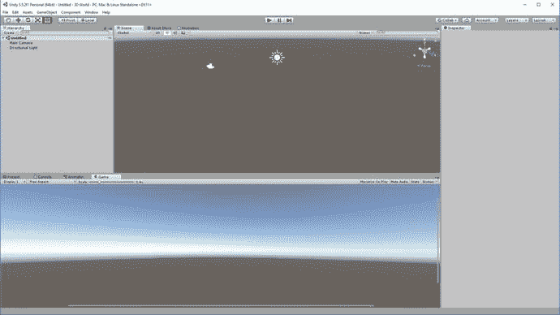

图 11-2。

The Unity you know and love, now in 3D

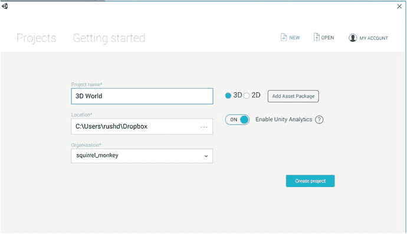

图 11-1。

Create your new 3D project

UI 的行为基本上和以前一样。主要区别是在场景窗口的右上角包含了透视小部件。点击此按钮，您可以将视图的角度更改为自上而下(图 11-3 )、侧面等。起初，处理 3D 对象可能会很棘手，您会发现自己一直在与透视做斗争。一个快速提示是，没有什么可以阻止你打开多个场景窗口:右键单击任何选项卡，然后选择添加选项卡➤场景。这样，您可以拥有多个窗口，每个窗口都有不同的视角(自上而下、侧面等等)。但是像以前一样，由您来决定哪种设置最适合您的工作流程。

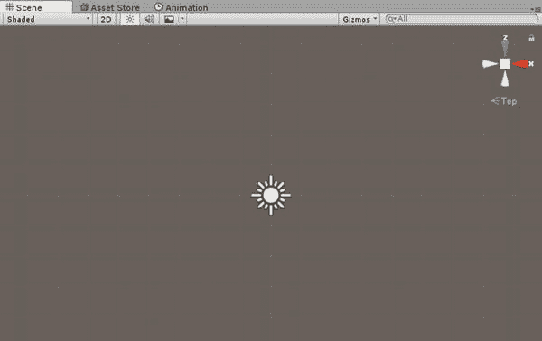

图 11-3。

This angle can be useful for aligning ground tiles for instance

否则，您仍然可以使用手形工具拖动视图，或者像以前一样使用滚轮放大视图。

不过，我们要做的第一件事是将一个 3D 物体放入这个世界。导航到游戏物体➤三维物体➤平面。你猜对了，这将把一个 3D 平面放到场景中(见图 11-4 )。然后我们就可以通过检查器来改变这个平面的大小，移动它，或者改变它的属性，就像我们之前处理 2D 精灵一样。

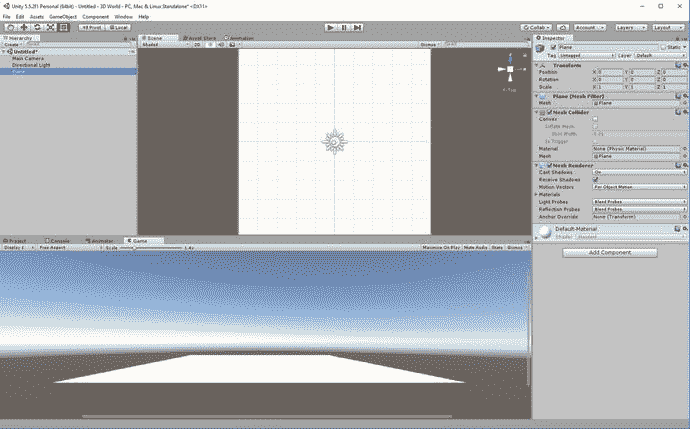

图 11-4。

Let there be a plane

现在在游戏中加入另一个元素。这次来个立方体怎么样？点击 GameObject ➤ 3DObject ➤立方体，你的场景中就会出现一个立方体(见图 11-5 )。

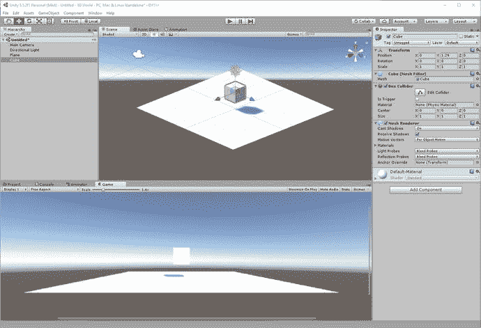

图 11-5。

And now a cube

到目前为止，很简单。但是点击播放，你会看到立方体只是无限期地悬浮在空中。和以前一样，我们需要应用一些物理知识。所以选择立方体，然后添加组件➤物理➤刚体。注意这次没有 2D 后缀。Unity 最初是专门为 3D 开发而开发的，所以“默认”脚本和对象都是 3D 的，不需要明确说明事实。

一旦游戏对象被添加，他们已经有一个网格碰撞器附加，所以如果你现在按下播放，立方体将下降到平面上，并停止在其轨道上。太棒了。

### 精灵和天空盒

为了让这个世界看起来更好，你可以在你的素材目录中创建一个名为纹理的子文件夹，然后放一些精灵进去。现在把精灵从那里拖到你的游戏对象上，在检查器中展开着色器菜单。在这里你可以设置纹理重复的次数(平铺)以及反射率(金属)、平滑度等等。

在图 11-6 中，我使用了游戏 2D 版本的精灵。

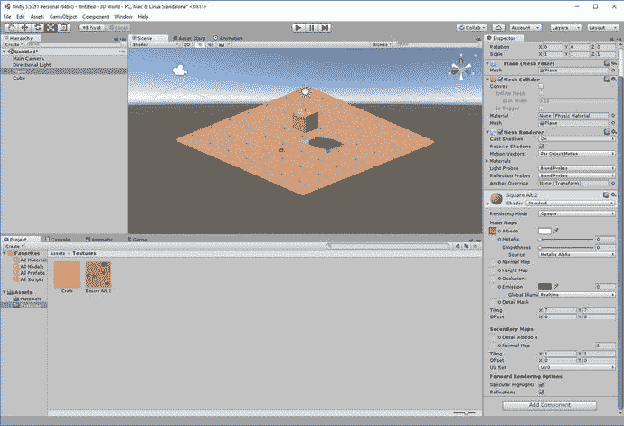

图 11-6。

A crate over some dirt

现在我们想为我们的世界添加一个更好的背景。为此，我们需要创建一个灯箱。在项目中找到 Materials 文件夹，然后在任意位置单击鼠标右键，创建一个名为 Sky 的新材质。在检查器中，使用下拉菜单将着色器设置为天空盒，然后选择程序。这份遗嘱；改变背景中天空的颜色和外观，因此设置大气厚度、曝光、阳光大小等等，就像你想要的那样。我打算在黄昏时把我的场景设在一个海滩式的地方。

现在选择窗口➤照明，并使用场景选项卡来设置天空框为你刚刚创建的天空材质。你应该立即看到你的游戏变化的样子(见图 11-7 )。注意，如果你选择 6 面作为天空盒，你可以使用任何你想要的纹理作为背景。

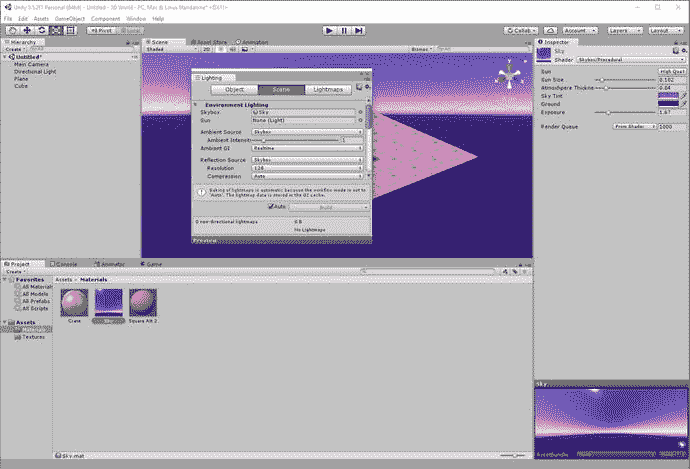

图 11-7。

Setting up some mood lighting

### 添加玩家

准备好再次对 Unity 印象深刻吧:在我们的游戏世界中添加一个玩家非常容易，因为有另一个现成的素材可以帮助我们做到这一点:FPSController。这为第一人称玩家处理控制、物理和更多。

右键单击“素材”文件夹，然后选择“导入包➤字符”。保持所有选择不变，点击导入。这将需要几秒钟的时间，但是一旦完成，您将在项目中有一个名为 Standard Assets 的新文件夹，其中将有各种子目录。我们现在感兴趣的是第一人称角色。稍后，为了减小项目的大小，您可以选择仅导入您需要的元素。

找到标准素材➤人物➤第一人称人物➤预置，然后选择 fps 控制器。你现在已经知道什么是预置了，所以你可能已经猜到这本质上是一个现成的 FPS 角色，我们可以把它放到我们的场景中。这样做，确保角色在地面上，然后删除多余的`Main Camera`游戏对象。然后点击播放。你应该有类似图 11-8 的东西。

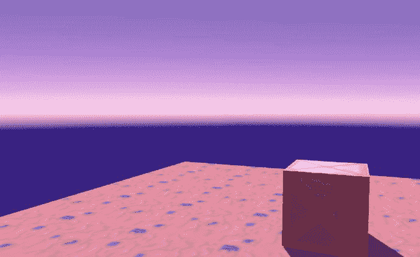

图 11-8。

A strangely serene view…

这是圣诞奇迹！很容易，我们就有了一个 FPS 游戏。你可以用鼠标四处查看，用 W、A、S 和 D 键查看，用空格键跳跃。甚至还有行走的声音效果，你可以和盒子互动来推它。若要退出，请按 Esc 键，然后您可以将鼠标指针向上移动到停止按钮。

如果您想尝试，请恢复`Main Camera`，删除 FPSController，并加入第三个 PersonController。这是一个更详细的 3D 对象，有复杂的动画，但没有着色器，它可以用相同的控件移动，所以你可以感受一下创建 3D 平台的感觉。尽管如此，这种素材组合使得游戏看起来相当怪异(图 11-9 )。

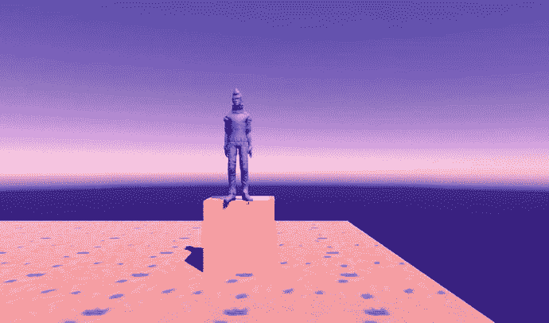

图 11-9。

If Damien Hirst made computer games …

目前，我们将继续使用 FPSController。

### 触摸控制

准备好再次被打动吧:在 Unity 中添加触摸控制也是一样简单的。再一次，我们有一个现成的预制构件；这个叫做 DualTouchControls。这在 CrossPlatformInput ➤预设中，你需要做的就是把它放到你的场景中，然后添加一个事件系统。您还需要在构建设置中将平台切换到 Android，这样才能工作。

通过使用画布并锚定到屏幕上，您可以在屏幕上随意设置这些触摸区域，就像您之前所做的一样(图 11-10 )。一旦准备就绪，尝试在智能手机上构建并运行该应用，看看实际使用起来是什么样的。如果一切都按计划进行，你应该可以通过拖动屏幕的左侧来四处走动，同时使用屏幕右侧的隐形触摸板来查看。底部的横杠是用来跳跃的。你可以在图 11-11 中看到它们是如何组合在一起的。

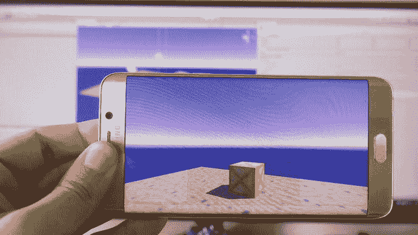

图 11-11。

Not exactly easy controls, but controls nonetheless

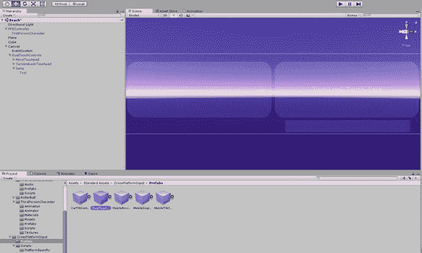

图 11-10。

Set up touch controls on the canvas as you want them to appear

请注意，一旦您将平台设置为 Android，游戏将停止响应您的键盘和鼠标输入。所以你可能想在开发的时候把它换回来。

### 使用 3D 模型

当我们在构建我们的 2D 平台时，我们会不时地从编码中抽出时间来创建某种精灵。这让我们的游戏世界变得栩栩如生，当然，我们不希望将我们的 3D 努力局限于简单的立方体和球体。

然而，现在我们将把 3D 模型添加到我们的游戏世界中，而不是精灵，这将为我们创造无限的机会。Free3D.com 是一个提供大量免费 3D 模型供你下载并放入游戏的网站，包括家具、怪物、野生动物等等。当然，你也可以在素材商店里找到很多，而且很多都是 Unity 免费提供的。一定要确保无论你使用什么，你肯定许可延伸到商业使用——如果你计划出售你的最终创作，那就是。

利用 Free3D.com 的资源，我用 3D 技术重建了我的客厅(见图 11-12 )。我妻子和我打算在挑选之前用它来试试墙壁的颜色。不过，它需要先做一些工作。

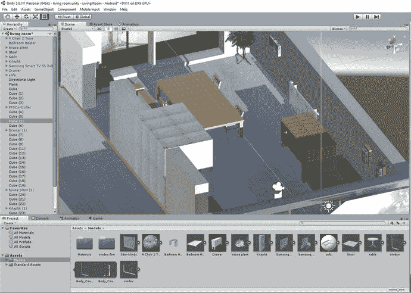

图 11-12。

My living room,or near enough. I am a SIM apparently

请原谅我在等级制度上的拙劣组织。这只是一点乐趣。

不要客气！请记住，在您完成应用之前，务必确保您在法律上被允许使用、分发和从任何潜在的版权作品(如 3D 模型)中获利，这一点非常重要。

想要制作自己的 3D 模型吗？最好的方法是使用名为 Blender 的免费软件。这很难掌握，但是一旦你知道你在做什么，几乎任何事情都是可能的，你甚至可以开始创作动画。不知不觉中，你就要为皮克斯工作了。

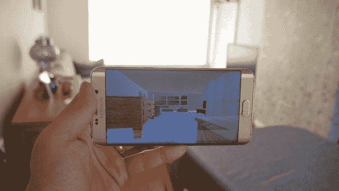

图 11-13。

But which is the real world?

### 另一个新领域

或者，你可以用另一种方式来创造一个稍微有点不同和更有趣的世界，那就是使用 Unity 的一些内置功能来创造郁郁葱葱的自然景观。

开始一个新场景或新项目，这次选择游戏对象➤ 3D 对象➤地形。迎接你的将是另一片平原，尽管这一片比之前的要大得多。不过，地形真正的巧妙之处在于，它可以让你插入山脉、丘陵、树木等等，从而创造出看起来更加有机和自然的东西。

您需要为此导入另一个包。单击素材➤导入包➤环境。在这里，你可以找到树、草和其他各种环境物品供你玩耍。

现在选择场景中的地形对象，你会注意到检查器中一些有趣的图标。这些以山、画笔、树木等为特色。尝试点击带有山脉和向上箭头的图标(见图 11-14 )，然后在地形上拖动鼠标指针——根据您施加的速度和压力，看起来相当自然的山脉开始爆发。

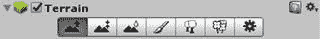

图 11-14。

These are fun

您也可以尝试在风景上绘制树木，首先选择您想要添加的树木类型(这是这些资源派上用场的地方)，然后以不同的密度绘制它们。您也可以使用画笔工具绘制纹理，同样是在首先从资源中选择看起来像零件的东西之后。试一试，你会很快意识到你可以多快地创造出一个渴望被探索的世界。参见图 11-15 。

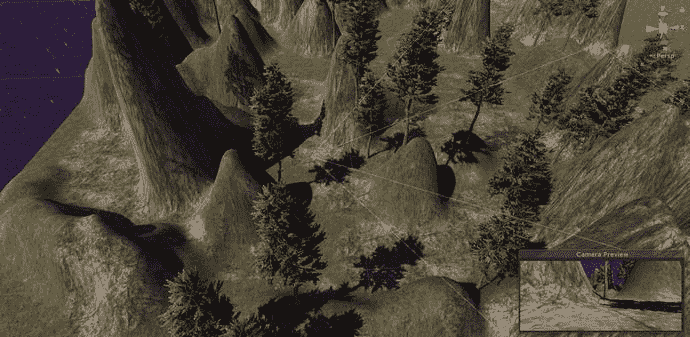

图 11-15。

Breath of the Wild, eat your heart out

### 添加枪

几乎每一个第一人称游戏都涉及到某种形式的射击，那么你会如何添加一把枪呢？

这其实很简单，基本上涉及到你已经熟悉的与 2D 共事的技巧。你应该熟悉一些变化。我们可以从创建/定位一把枪的 3D 模型开始，然后让它成为`Player`角色的孩子。我们将它对齐，使它处于正确的位置，就好像角色拿着它一样。

从那里，我们将继续添加一个脚本到 gun 对象，这样它将响应鼠标点击。这将与屏幕上任何地方的点击(或 Gear VR 上的侧按钮)相对应。

然后我们会以相同的角度在枪内实例化一颗子弹:

```java
if (Input.GetKeyDown(KeyCode.Mouse0))
        {
            Instantiate(blast, gameObject.transform.position, gameObject.transform.rotation);            
        }

```

子弹会有自己的脚本，以确保它在一段时间后自我毁灭，并保持前进。唯一的不同是，子弹现在是在三维空间中运动。我们将使用`transform.forward`，这样子弹将会以它当前面对的任何角度向前移动(这反过来与枪相同):

```java
 public class Forward : MonoBehaviour {
    private float timetodestroy;

    void Start () {
        timetodestroy = 3;
    }

    void Update () {
        timetodestroy = timetodestroy - Time.deltaTime;
        gameObject.transform.position += transform.forward * Time.deltaTime * 30;
        if (timetodestroy < 0)
        {
            Destroy(gameObject);
        }
    }
}

```

从那里，我们可以使用`onTriggerEnter`或`onCollisionEnter`,就像我们通常会做的那样(除了 2D ),让我们的子弹爆炸物品，翻转开关，以及做任何其他事情。

正如你所看到的，这是一件相当简单的事情，就像你上次做的那样，把这个基本的设置构建成一个完整的游戏。你可以从这些说明中推断出你的人工智能，弹簧和其他东西。

## 步入虚拟现实

但是你知道吗？第一人称射击游戏(也称为 FPS)在使用触摸输入的手机上没有那么有趣。那么，让自己熟悉 3D 到底有什么意义呢？

当然，你可能会发现你可以制作其他类型的 3D 游戏。也许你对使用倾斜控件制作弹球游戏或赛车游戏感兴趣。或者也许你只是很固执，无论如何你都要做 FPS。国家志愿队系列赛看起来还是不错的...

但是你也可以做一个更令人兴奋的虚拟现实应用(见图 11-16 )。

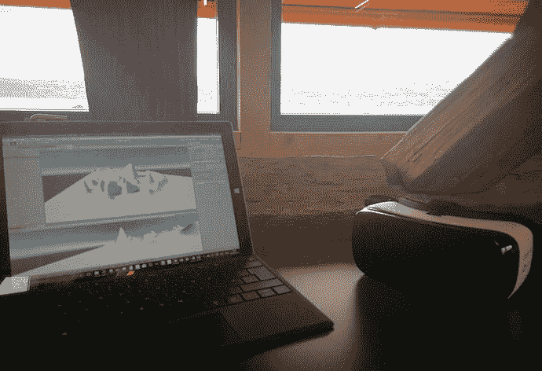

图 11-16。

Developing for the Gear VR in a library in Radolfzell, Germany. Good times!

由于三星 Gear VR 和谷歌 Daydream 耳机，虚拟现实在移动设备上是一件大事。事实上，我更倾向于预测这可能是虚拟现实的未来所在(图 11-17 )。在移动设备上的采用已经是最大的了(由于与 PC 虚拟现实相关的高昂成本和技术挑战)，但更令人兴奋的是，移动设备现在能够解决虚拟现实面临的最大挑战之一:位置跟踪。


图 11-17。

Is mobile VR the future?

位置跟踪指的是不只是环顾四周，而是在 3D 空间中实际起身走动的能力。跳跃、躲避、奔跑和倾斜。Oculus Rift 和 HTC Vive 使用精心设计的“由外向内”解决方案来解决这一问题，这种解决方案涉及在房间内安装传感器。Gear VR 和 Daydream 目前只提供头部追踪。

但在最近的谷歌 I/O 大会上，HTC 推出了一款“独立”耳机，它将使用一种名为 WorldSense 的东西来提供一种完全不受限制的位置跟踪解决方案，没有设置，也没有外部传感器。这是从里到外的追踪。该设备将与 Daydream 体验相关联，因此我们可以预计它可能会运行 Android，或者至少与当前的设置非常相似。

这种设备还没有上市，也不是全新的技术。这很可能是谷歌项目 Tango 的一种演变——努力创造出内置足够多传感器的手机，以便能够看到我们所看到的世界。该技术已经在联想 Phab Phone 2 中可用，并将在不久的将来应用于更多设备(当您阅读本文时，可能已经有了)。

简而言之，手机将很快拥有使用“计算机视觉”的能力，以便感知他们面前的东西以及你如何在空间中移动——从而能够跟踪虚拟现实中的移动，并确保玩家不会将自己置于任何危险之中。

但谁知道呢，也许移动 VR 不会是下一个大事情。也许 VR 根本不会腾飞。无论发生什么，我们肯定都同意，创造虚拟世界，然后步入其中是很酷的。

### 创建 Gear VR/Google Daydream Ready 应用

那么，我们如何将我们刚刚创建的 3D 景观之一变成一个可以在 Gear VR(见图 11-18 )或谷歌 Daydream 上运行的 VR 应用呢？

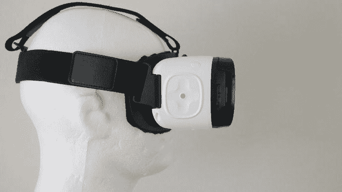

图 11-18。

Insert your head here

这实际上再简单不过了——只要它能工作，就是这样。实际上，在撰写本文时，Unity 还需要解决一些问题，所以事情并不完全顺利。试图为 Gear VR 构建应用会导致 AndroidManifest 文件无法合并的问题(这些文件包含关于你的应用的信息，如版本、名称等——见图 11-19 )。该团队承诺会解决这个问题，所以希望在你读到这篇文章的时候，一切都已经启动并运行了。对于 Google Daydream 或 Cardboard 来说，不存在这样的问题。我与你分享这些是因为这是编码的现实。有时有一个变通办法，但其他时候你不得不等待专业人士提出解决方案。幸运的是，Unity 在发布补丁方面往往很快。

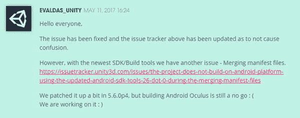

图 11-19。

Gee thanks, Unity. At least the frowny face shows true remorse.

假设 Unity 玩得很好，你只需要在你的玩家偏好上做一些改变。具体来说，你会想要勾选支持 VR 的方框，然后选择 Oculus 或 Daydream 作为你的 SDK(图 11-20 )。当然，如果你愿意，你也可以试试其他的，包括纸板。Unity 会知道它需要下载和添加到插件中的东西，以使事情正常运行。

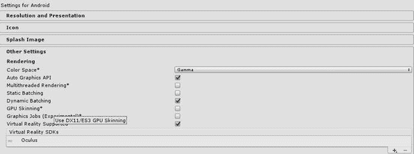

图 11-20。

Pretty simple!

为了让你的应用在虚拟现实硬件上运行，并尝试在虚拟现实中探索你的风景，这就是你需要做的全部事情。点击构建和运行，然后插入。

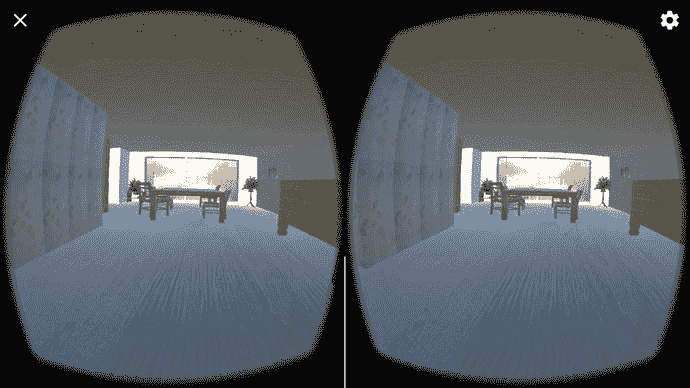

图 11-21。

The VR version is much tidier

### 获取您的 Oculus 签名文件

如果你在为 Gear VR 开发，事情会稍微复杂一点。这是因为 Oculus 对其平台有点保护，不希望人们通过 Play Store 以外的渠道分发自己的应用。因此，它引入了一个系统来禁止肆意分享应用，这是他们的“签名文件”基本上，每个 APK 只能在一个设备上工作，这将由您在构建时添加的文件来定义。

要获得 Oculus 签名文件，您首先需要获得您的设备 ID。这是你的特定硬件的标识符，所以任何时候你想在新设备上测试你的应用，你都需要再次经历这个过程。为此，导航到 PC 上 Android SDK 安装的 platform-tools 文件夹。在这里，您会发现一个名为 adb.exe 的可执行文件，这是 Android Debug Bridge 的首字母缩写。按住 Shift 键，右键单击该文件夹中的任意位置，然后选择“在此打开命令行”。在打开的 shell 中，您现在要输入 adb 设备，并插入您的 Android 设备。这将列出所有连接硬件的设备 id，如图 11-22 所示。

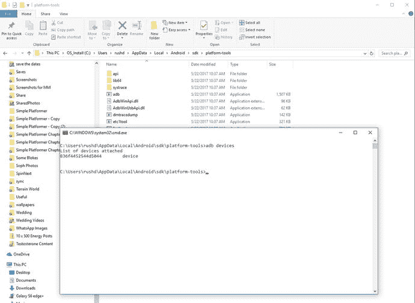

图 11-22。

My device ID. Don’t … steal it?

无论如何，熟悉 ADB 是一件很方便的事情，因为它有许多其他用途。

现在前往 developer.oculus.com，找到 Oculus 签名文件(osig)生成器。在写的时候，这是在 [`https://dashboard.oculus.com/tools/osig-generator/`](https://dashboard.oculus.com/tools/osig-generator/) 。按照提示在框中输入您的设备 ID 号，然后点击下载文件(图 11-23 )。现在，您只需将该文件放入项目中的特定目录:

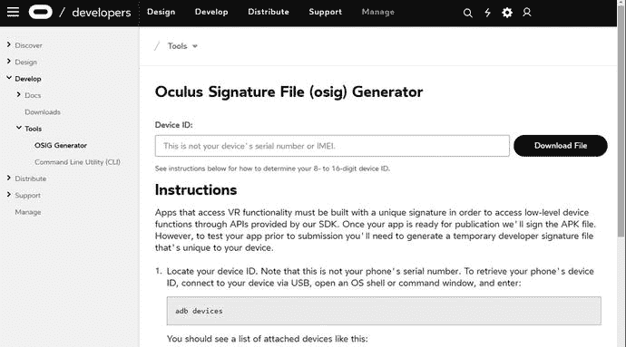

图 11-23。

You'll need to create a new account first

```java
Assets > Plugins > Android > assets

```

是的，它区分大小写，是的，这意味着您需要一个大写的 Assets 文件夹和一个小写的版本。不，这些文件夹不会已经存在，所以你必须创建它们。

这是一个麻烦，但一旦完成，你就可以开始在自己的硬件上测试你的新虚拟现实应用，而且你暂时不需要再担心它了。

### 无限的可能性

创建虚拟现实内容是一门艺术，而且是一种仍在不断发展的艺术形式。在屏幕上工作良好的东西不一定能很好地转化为 VR，反之亦然。然后还有输入和恶心等问题。但事实上，这个空间是如此未被探索，这使得它如此令人兴奋。这里的可能性是无限的，你有很多机会偶然发现一些改变游戏规则的东西。

有了它，你的所有技能都有了用武之地。您将在实践中学习，并在实践中成长为一名开发人员。但我觉得你已经准备好接受这些挑战，开始寻找自己的路。我们还需要做一件事:让你的作品在谷歌 Play 商店上运行起来，让其他人也能欣赏它们。