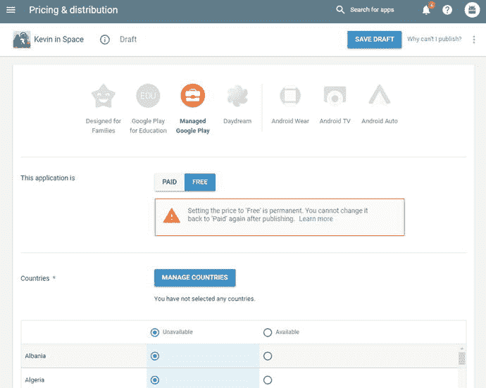
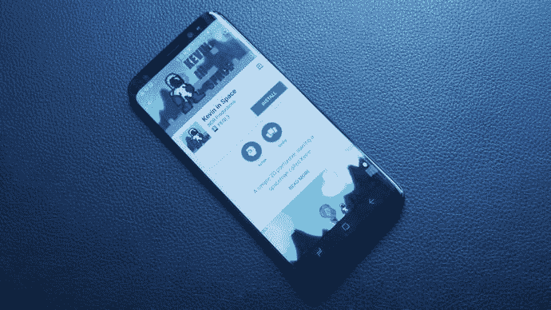

# 十二、如何发布和推广你的安卓应用

你已经成功地走了这么远，现在你在最后的障碍。你知道如何制作应用，你知道如何让它们在你的智能手机上运行…见鬼，你甚至知道如何在虚拟现实中探索它们。现在剩下要做的就是发布这些应用，这样你就可以与世界其他地方分享它们，并获得你应得的赞美/报酬。

这可能是一个令人伤脑筋的过程。把你的应用发布出去会让你容易受到批评，而且总有可能会失败，一次下载也没有。但是不要让恐惧冻结你。Android 应用的伟大之处在于它们永远不会结束:你可以自由地上传更新，并在产品发布后不断迭代(更新)你的产品。没什么好害怕的:如果你第一次没有做对，你只需要不断尝试，最终将你的应用发展成人们喜欢的东西。

无论如何，你的应用的成功只是部分与它的质量有关。同样重要(如果不是更重要的话)的是你营销和撰写店铺清单的方式。我们将在这里看看如何做到这一切。

## 创建您的签名 APK

一旦你完成了你的游戏并且对它感到满意，你需要做的第一件事就是创建你的签名 APK。APK 是 Android 用来在其他人的手机上安装你的应用的包文件，在测试你的游戏时你已经建立了几个。

不过，到目前为止，如果你一直使用构建和运行选项，并且将播放器设置保留为默认设置，你将一直运行该应用的调试版本。为了实际发布你的创作，你需要返回到构建设置➤播放器设置，以便“签署”它，为大时代做好准备(以及做一些其他更改)。

首先，为你的应用添加一些图标。然后确保你有一个满意的包名。软件包名称是其他 Android 应用将会看到的内部文件名(如主屏幕启动器)，但您的用户在大多数情况下不会看到它，除非他们获得技术支持。然而，这应该是明智的，因为你以后不能改变它。这些都可以在检查器中的其他设置标题下找到(图 12-1 )，通常的格式是包括你的公司名称，然后是应用名称。

图 12-1。

Setting a package name for the platformer

产品名称是您的用户将看到的内容(也称为标签)。这是你的品牌将去的地方，这一点以后是可变的。换句话说，这是你游戏的标题，但是如果你以后改变主意了，你也不用担心。

您的版本代码是为您和您的用户准备的。这是他们将看到的版本号，您可能希望在每次推出新版本时递增更新。错误修复和小调整可能会导致增量调整(1.0.1)，但增加新功能和级别的大变化可能会导致整个版本的升级(2.0)。请注意，alpha 和 beta 产品的版本代码应该低于 1。

另一方面，捆绑版本代码是一个内部计数器，用于跟踪您的应用版本。每次你上传一个新版本的 APK，这个必须增加 1。这使得谷歌可以跟踪并确保你的用户得到最新的版本。因此，您的用户可能会看到版本 1.1.4，但是您的包版本代码可能是 8。

你还需要考虑你想瞄准的 Android 版本。有些插件和功能会要求你针对更高版本的 Android 或者设置更高的最低 API。比如 VR 应用就是如此。但是允许尽可能多的人安装和使用你的应用对商业是有好处的。令人惊讶的是，大量用户仍然在使用旧版本的 Android，所以为了最大化你的影响力，低 API 是明智的。你可以在 [`https://developer.android.com/about/dashboards/index.html`](https://developer.android.com/about/dashboards/index.html) 查看这方面的统计数据。

尝试在你的设备上安装新的 APK，你应该看到它现在在你的应用抽屉里有正确的名称和图标。我们越来越近了——我能感觉到！

### 创建密钥库

在发布设置下，您将看到创建密钥库的选项。这是一种特殊的数字证书，将识别和授权您的 APK 文件。换句话说，它将是一个带有密码和用户名的文件，你需要在每个新版本的应用中包含这些密码和用户名，以证明它确实是你的应用。如果您丢失此文件，您将永远无法发布未来的更新，因此请将它放在一个非常安全的地方！(有一个选项可以让谷歌把它存储在云上，我稍后会讨论这个选项。)

尽管 keystore 方案听起来可能很严格，但它对用户和开发人员来说都是一项重要的安全措施。否则，拥有你的开发者帐户密码的人可能会上传你的应用的新“版本”,简单地用恶意软件替换它。这可能会伤害你的用户，破坏你的声誉，并摧毁你的业务。

所以这很令人沮丧，但是要确保你记得你把文件保存在哪里，你不应该有任何问题。

要创建您的密钥库，只需选择 Create New Keystore，输入用户名和密码，并选择保存文件的目的地(图 12-2 )。

图 12-2。

Never lose this!

## 上传你的应用

一旦你有了你的 APK 并正确签名，你就可以将它上传到 Play Store。为此，请前往 [`https://play.google.com/apps/publish`](https://play.google.com/apps/publish) 或搜索 Google Play 开发者控制台。

如果您还没有注册，您需要注册。幸运的是，你可以使用你的谷歌帐户，这将使事情变得又好又容易。目前的注册费为 25 美元，但这是一次性费用，肯定比 iOS 开发者不得不忍受的更昂贵的年费要好。希望，就投资回报而言，这将是你花的最好的 25 美元之一。即使是一个虚荣的项目，25 美元也不会让你倾家荡产。

开发者控制台(图 12-3 )是你能够看到你的应用和它们的统计数据的地方，一旦你有一些活的。您将能够检查用户评论，应用更新，并检查收入和错误报告。不过，你还没有任何应用，所以这将是相当空的。

图 12-3。

My developer console

### 创建你的商店列表

要开始，找到并单击创建应用。你将被要求选择一种语言并给它一个标题，然后你将被带到另一个页面，在那里你可以输入更多的细节，包括描述、翻译和各种图形素材(见图 12-4 )。我们要先填好这个。

图 12-4。

Write a compelling description that will help your game stand apart

您可以输入标题、描述和其他内容。一会儿我们将更详细地讨论在这里放什么可以获得最佳效果。至于图像，包括一个高分辨率图标(512 x 512)，将显示在 Play Store 中您的应用列表旁边，一个功能图形(1024 x 500)，将显示在页面顶部，以及一个宣传图形(180 x 120)。宣传画主要用于旧版本的 Android，不需要提交，但值得花时间为每个类别创建图像。你花了这么长时间来构建你的应用，不要在最后一关摔倒。

如果你也使用宣传视频(这是值得做的)，那么你的特征图形顶部会有一个播放图标。对于那些创建 Daydream 应用的人来说，你需要创建一个立体的 360 度视频。祝你好运！Android TV 应用需要 1280 x 720 的横幅图像。

你还会注意到，你可以添加游戏截图，并且可以为手机、平板电脑、电视和 Android Wear 选择不同的截图。这是你要把你的游戏在行动中的镜头。你可以在图 12-5 中看到我使用的图片。

图 12-5。

How could anyone not want to download and play all two levels?

继续向下滚动页面，您将能够选择应用类型(游戏)、类别(在这种情况下可能是“动作”)、内容分级和您的联系方式。稍后，您需要返回到内容分级页面，要获得证书，您需要填写各种问题。

接下来输入您的联系方式。如果你认为你的游戏有可能大获成功，我建议你建立一个新的电子邮件地址。任何人都可以通过这里联系你，如果你的应用启动，你可以期待得到很多通信。这包括漂亮的赞美，以及一些完全愚蠢的批评和大量的废话。所以在透露你的个人信息时要小心。

然后，如果您愿意，您可以选择提交隐私政策，或者暂时将其留空。如果你正在开发一款不会从用户那里收集任何隐私数据的手机游戏，你可能没有必要经历这一步。

### 上传 APK

要上传您的 APK，请转到应用发布(位于左侧)，然后单击管理制作。当然，这是可以改变的，但是无论如何你应该有一个创造释放的选择。

在这里，您可以单击上传 APK，如果一切按计划进行，它应该通过测试，并被上传到商店(它还没有上线，不要担心)。您应该能够看到正确的版本代码和发布名称，与您在播放器设置中输入的内容相对应。你的应用的标题应该在页面的左上角，在你选择的图标旁边。当您想要添加更新时，您可以回到这里，并且您可以添加“此版本中有什么新内容？”告诉你的用户发生了什么变化。如果这不管什么原因都不起作用，问题很可能出在你的密钥库上，所以再看一下本章的第一节。此时，它看起来应该如图 12-6 所示。

图 12-6。

So far, so good

现在，您只需将它保存为草稿。当直播开始时，你可以马上回来。

### 更多设置

控制台中还有许多其他设置需要考虑，有强制的也有可选的。在这一部分，我们将快速浏览其中的几个。

#### 内容分级

为了让您的游戏能够广泛使用，您需要完成内容分级过程。点按左侧的“内容分级”,选取“继续”,然后回答问题。它们是不言自明的(图 12-7 )。

图 12-7。

You might want to reconsider those Nazi references

点击保存调查问卷，然后计算评级，以获得您在各个不同地区的分类，最后应用评级。

#### 定价和分销

你还需要决定你的应用收费多少，或者你是否想让它免费。请注意，如果你的应用是为了赚钱而出售的，你可以随时让它免费。但是一旦你让它免费，就没有回头路了，除非你上传一个全新的商店列表(图 12-8 )。

图 12-8。

Consider the best business model for your app if you want to make a profit from it

此页面的另一部分允许您选择您希望您的应用在哪些国家可用。你可能想让它随处可用，因为这样最大数量的人将能够享受你的创作(并付钱给你)。

你还需要回答屏幕下方的一些问题，例如该应用是否包含广告，以及它是否符合 Android 内容指南和美国出口法律。同样，这应该是不言自明的。

#### 其余的

快到了。完成应用发布、商店列表、内容分级、定价和分发部分后，您的应用就可以发布了。但是如果你想知道其他部分是干什么的，请继续阅读。

设备目录显示哪些设备可以运行你的应用，如果你不希望这些设备上有应用，你可以选择过滤掉一些。翻译服务允许您为其他地区翻译您的应用。服务和 API 是用于访问 Firebase(谷歌的“后端服务”——不用担心)等外部工具，优化技巧只是基于你当前的列表分享建议(值得一读)。在应用内产品中，您可以管理您的应用内购买，但如果您的应用没有任何应用内购买，则在这里没有任何事情可做。神器库允许你下载你的 APK 和其他已经上传到游戏商店的东西。

Android Instant Apps 是一个相对较新的功能，允许用户运行应用，而不必永久下载和安装它们，但它在这里并不适用。这个特性不仅不是对每个人都可用，而且大部分游戏涉及的大文件大小(更不用说它们的本质)意味着它不完全适合大多数开发者。最后，应用签名是您可以注册 Google 的应用签名计划，将您的密钥库存储在云中，这样它就永远不会丢失。这是一个方便的选择，但它不是强制性的，所以您可以决定是否要采取这一额外的步骤。如果您愿意，您可以随时决定以后再做这件事。然而，一旦你走上这条路，你就不能回头了。

当您的应用处于活动状态时，您可以随时返回控制台查看您发布的所有项目。点击一个按钮，你就可以看到一大堆数据，包括收入、下载次数等等。

### 出发时间

有了它，你就可以出版了。这是一个重要的时刻，尤其是如果你已经在你的应用上工作了几个月或几年，所以去给自己倒点香槟酒吧。

回到 App Releases ➤编辑发布，向下滚动到底部，点击开始推广到生产(图 12-9 )。

图 12-9。

Do it!

确认，然后…你的应用就发布了！或者说，差不多....

实际上，你的应用现在将接受审查，你会看到它在页面顶部写着“待发布”。发布过程是自动的，这意味着它是由算法处理的，而不是由实际的人类管理员处理的(不像苹果的应用商店)。这是一个好消息，因为这意味着你的应用应该在接下来的几个小时内上线，准备好让人们开始下载和评论。在这个阶段拒绝任何东西是非常罕见的。当然，这不是忽视条款和条件的许可——你的应用仍然可能在以后被删除。

祝贺你，亲爱的读者！你刚刚成为正式的游戏开发者。

## 创建更多下载

一旦你的应用上线，你的工作还远远没有结束。你不仅有道德义务不断更新和改进你的应用，而且你还需要确保你在积极推广你的创作并鼓励下载。这不是“建造它，他们就会来”的情况。今天，Android 上有太多优秀的应用，市场已经高度饱和。更确切地说，这取决于你把这个消息传出去，并确保人们兴奋地检查你的创作。这是你欠自己的。

那么，你如何确保人们真的找到并下载你的应用呢？这一部分讲述了一些可能有所帮助的营销技巧。

### 想想 SEO

SEO 代表搜索引擎优化。这在互联网营销界是一件大事，但它在开发者中也有作用。这是因为谷歌 Play 商店本质上是一个搜索引擎，人们经常会通过搜索找到新的应用(见图 12-10 )。

图 12-10。

Kevin in Space is open for business

这里要理解的关键概念是关键字的使用。关键词是人们可能会搜索以找到你的应用的单词或短语。在我们的案例中，好的例子可能包括以下内容:

*   2D 平台
*   侧滚游戏
*   像素类型
*   复古游戏

为了增加我们被发现的机会，我们可以尝试在描述中多次包含这些术语。不要做得太过分，因为这看起来很垃圾，可能会让你的应用被删除。试着自然地加入一些内容。在完整描述中写得越多，这就越容易，添加更长的描述也是谷歌鼓励的做法。真正推销你的应用，告诉人们为什么他们应该感兴趣。

另外，考虑到竞争的激烈程度，一个太流行的术语将更难排名。寻找最佳点:有需求但不够模糊的术语，已经没有大量的可用内容。

### 明智地选择你的名字

当然，确保你的关键词排名靠前的最好方法之一就是用这个词来命名你的应用。例如，你可以把你的游戏叫做复古 2D 平台或者类似的名字。

不过要小心:这样做也意味着你的应用不会有同样多的个性或强大的品牌供你推广。这也可能让用户感到不快，让你更难在 Play 商店之外进行推广。

一个能传达你的游戏的名字并不是一个坏主意，但是要有创造性和趣味性。选择一个能传达某种情感(比如《地狱边缘》或《愤怒的小鸟》)并能激起兴趣(比如《VVVVVV》或《托马斯独自一人》)的名字。理想情况下，有人应该立刻知道你的游戏可能是关于什么的，或者一听到游戏的名字就想了解更多。

### 寻找通往市场的路线

营销也意味着偶尔出去大声宣传你令人惊叹的新游戏(图 12-11 )。做到这一点的最好方法是找到一条通往市场的路线，市场基本上是可能感兴趣的人经常去的任何地方。例如，这可能是一个致力于某个游戏流派的脸书小组或 Subreddit(也可以试试 [`www.reddit.com/r/playmygame/`](http://www.reddit.com/r/playmygame/) )。

图 12-11。

Your game is now available for millions of people to download

市场路线也是在游戏的早期设计阶段需要考虑的事情。当然，你应该制作你想制作的游戏，让你兴奋，但是也要考虑你的游戏会有什么营销机会。通过瞄准一个特定的利基市场，你可以避免成为大池塘里的一条小鱼，避开竞争。更重要的是，通过锁定某个用户(称为人物角色)，你可以给自己提供更具体的市场路线。

事实上,《太空中的凯文》很难营销，因为它并不突出，对任何人都没有吸引力。但如果这是一个关于自由跑英雄的游戏，我们可以把它发布在一个针对自由跑者的论坛上。如果这是一个有着令人敬畏的 synthwave 原声音乐的游戏，我们可以尝试从 synthwave 网站获得宣传。

同样，想想你目前拥有的人脉和资源。当然，你应该尝试让你的朋友下载你的应用(并留下好评！)，但也许你认识某个为大网站写稿的人，比如？

### 获得好评

Play Store 上的 SEO 与 Google.com 上的 SEO 略有不同，因为它考虑了一系列其他因素。其中就有你的用户留下的评价，正面评价越多=下载越多。获得好的评论是创建一个你引以为豪的伟大游戏的问题，但是让你的用户用偶尔的弹出窗口来评论它也是一个好主意。解释它将如何真正帮助你，但不要尝试任何不光彩的策略来迫使一个积极的评论——谷歌不赞成这样做。

如果你得到一个差评，快速回复总是一个好主意。这样做不仅表明你是一个真正关心用户的细心的开发者，而且如果你提供一个解决方案，你甚至会发现用户改变了他们的分数。

千万不要为评论买单。这种做法会让你的应用被删除，只会让用户不高兴。

### 定期更新

定期更新你的应用也很重要。它不仅鼓励更多积极的评论，还让你的应用在 Play Store 的新游戏+更新游戏部分获得了曝光的机会。更多这样的曝光意味着人们有更多的机会发现你的应用并尝试一下。

### 选择正确的图片和文字

如果有人意外发现了你的应用，他们可以选择点击阅读更多内容，或者直接从你身边经过而不停下来阅读。影响这一决定的最大因素很可能是你选择的图标，所以不言而喻，这需要是好的。目的是脱颖而出，吸引人们的兴趣，同时准确地传达你的游戏是为谁设计的。不要试图吸引每一个人，而是拥抱你所选择的流派、定位和风格。

想想你自己的习惯:在浏览新游戏时，什么样的图片会引起你的兴趣？对我来说，这绝对会是一个看起来未来派，动作密集，独立的游戏。我远离诸如《部落冲突》或其他明显针对休闲市场的精美免费游戏。这只是我的看法——但是通过了解你的用户在寻找什么，你就可以通过你的图片来确定要传达什么。当然，你也需要用你的特写图片和截图把它敲出公园。

你的描述也是如此。使用几个关键词可能是一个不错的策略，但更重要的是为用户而写。这样做意味着用强有力的开场白迅速抓住注意力，用要点推销你游戏的关键功能，用情绪化的语言试图鼓励快速点击。熟读说服性写作，因为这能带来真正的改变。再次强调:了解你的用户，把你的推销目标对准他们。向所有人呼吁意味着不向任何人呼吁。

### 制造轰动

最后，通过向游戏网站和 Android/移动渠道提交新闻稿，努力为你的应用创造声势。尝试向 YouTube 名人提供免费的 apk，以换取评论或“让我们玩吧”视频。瞄准更小的个性和更容易回应的渠道，如果你的游戏很好，更大的渠道会注意到你。

考虑为你自己的游戏创建一个网站，你可以单独推广。社交媒体页面也是如此。如今使用 WordPress ( [`www.wordpress.com`](http://www.wordpress.com) )创建一个网站出奇的容易。

也要考虑在你发布之前制造一个声势。你可以通过创建一个开发者博客，谈论你的应用的创建，或者通过向小网站和频道发布挑逗性的新闻来做到这一点。

如果你真的雄心勃勃，尝试在 Kickstarter 或 Indiegogo 等众筹网站上发起一场运动，人们会提供资金支持，帮助你完成游戏。众筹不仅能为你的项目买单，还能确保围绕你的游戏发布会有一个大的、活跃的、积极参与的社区。此外，它更容易引起游戏媒体的注意。记住，网站和杂志不想给你提供免费的推广，但是他们想报道有趣的故事。

尽管如此，为了实现这一点，你需要一个令人信服的 USP——无论这意味着创造一个心爱的专营权的精神继承者，复兴一个被遗忘的流派，还是尝试一些令人难以置信的新的和令人信服的东西。让人们有理由支持你的游戏，把它变成一项运动，而不仅仅是另一个产品。-让他们相信并为之兴奋！

## 结束语

就这样，你只能靠自己了。我已经带你走得够远了，剩下的就看你的了。我相信你会找到自己的方式，创造出你引以为豪的东西，并得到应有的关注和赞誉。

图 12-12。

The rest is up to you

只要记得从小处着手，然后从那里开始积累。创造一些不同和独特的东西。最重要的是，享受做这件事的乐趣。如果你真的享受创作过程，如果你全身心地投入到自己的激情项目中，它会在最终产品中表现出来。做你想玩的游戏，不要害怕拥抱你自己的身份。

如果你的游戏不成功呢？继续下一个产品。制作一部轰动一时的电影也有很多机会。

我祝你在你的项目上好运，希望你绝对能成功。当你富有和出名的时候记得我！