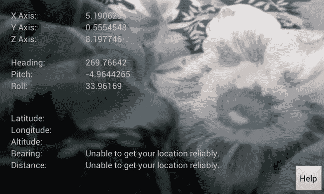
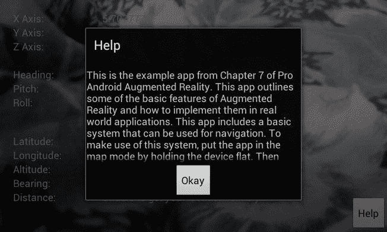
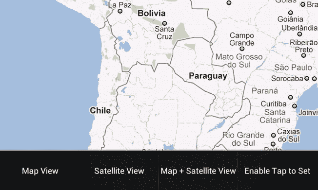
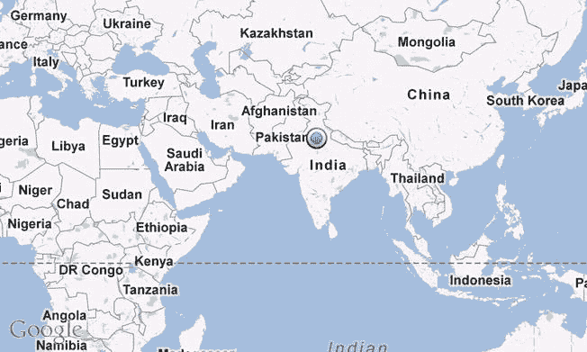
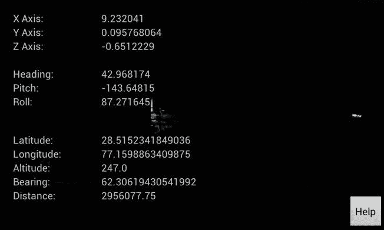

# 七、使用增强现实、GPS 和地图的基本导航应用

在第六章中，我们设计了一个简单的 AR 应用，如果设备与地面平行，它将在相机预览上显示传感器数据，并在地图上显示位置。在这一章中，我们将扩展这个应用，以便它可以用于基本的导航目的。

### 新的应用

该应用的扩展版本将具有以下功能:

*   当与地面不平行时，该应用将显示一个覆盖有各种数据的相机预览。
*   当与地面平行时，地图将会展开。用户可以在地图上定位期望的位置，并使 Tap 能够设置模式。启用该模式后，用户可以点击所需的位置。该位置已保存。
*   再次显示相机预览时，根据 GPS 数据计算出目标位置的方位以及两个位置之间的距离。
*   每次接收到新的定位时，方位和距离都会更新。

如果你想扩展它来添加指南针和做其他事情，这个应用会给你你需要的每一个计算。

现在，事不宜迟，让我们开始编码。

首先创建一个新项目。在这个例子中，包名是 com.paar.ch7，构建目标是 android 2.1 的 Google APIs。我们必须针对谷歌 APIs SDK，因为我们正在使用谷歌地图。

首先，复制第六章的项目。把 main `Activity`(带有相机预览的那个)的名字改成你想要的任何名字，只要你记得更新它的清单。此外，因为这是一个新项目，您可能还需要另一个包名。

#### 更新的 XML 文件

首先，我们需要更新一些 XML 文件。先说`strings.xml`:

**清单 7-1。** *更新 strings.xml*

`<?xml version="1.0" encoding="utf-8"?>
<resources>
<string name="hello">Hello World, ASimpleAppUsingARActivity!</string>
<***string name="app_name">A Slightly More Complex AR App</string>***
<string name="xAxis">X Axis:</string>
<string name="yAxis">Y Axis:</string>
<string name="zAxis">Z Axis:</string>
<string name="heading">Heading:</string>
<string name="pitch">Pitch:</string>
<string name="roll">Roll:</string>
<string name="altitude">Altitude:</string>
<string name="longitude">Longitude:</string>
<string name="latitude">Latitude:</string>
<string name="empty"></string>
***<string name="help">This is the example app from Chapter 7 of Pro Android***
***Augmented Reality. This app outlines some of the basic features of Augmented***
***Reality and how to implement them in real world applications. This app includes***
***a basic system that can be used for navigation. To make use of this system, put***
***the app in the map mode by holding the device flat. Then enable \"Enable tap to***
***set\" from the menu option after you have located the place you want to go to.***
***After that, switch back to camera mode. If a reliable GPS fix is available, you***`
`***will be given your current bearing to that location. The bearing will be updated***
***every time a new location fix is received.</string>***
<string name="helpLabel">Help</string>
***<string name="go">Go</string>***
***<string name="bearingLabel">Bearing:</string>***
***<string name="distanceLabel">Distance:</string>***
</resources>`

这里的“`Distance:`”将作为标签，告诉用户从他/她的当前位置到所选位置的直线距离。乌鸦路径是从 A 点到 b 点的直线距离。它不显示通过道路或任何其他路径的距离。如果你还记得高中物理的话，这很像位移。它是从 A 点到 B 点的最短距离，不管这段距离实际上是否可以穿越。

您会注意到一些新的字符串和帮助字符串大小的增加。除此之外，我们的`strings.xml`大体相同。接下来，我们需要从`/res/menu`文件夹中更新我们的`map_toggle.xml`。我们需要添加一个新的选项来允许用户设置位置。

**清单 7-2。** *更新后的 map_toggle.xml*

`<?xml version="1.0" encoding="utf-8"?>
<menu
xmlns:android="http://schemas.android.com/apk/res/android">
<item
android:id="@+id/map"
android:title="Map View"></item>
<item
android:id="@+id/sat"
android:title="Satellite View"></item>
<item
android:id="@+id/both"
android:title="Map + Satellite View"></item>
***<item***
***android:id="@+id/toggleSetDestination"***
***android:title="Enable Tap to Set">***
***</item>***
</menu>`

我们的新菜单选项是“启用点击设置”此选项将用于允许用户启用和禁用点击来设置我们的应用的功能。如果我们不添加检查，每次用户移动地图或试图缩放时，都会设置一个新的位置。为了避免这种情况，我们设置了一个启用/禁用选项。

现在是我们最大的 XML 文件 main.xml 的最后一个变化，我们需要添加两个`TextViews`并稍微移动我们的帮助按钮。下面的代码只显示了更新的部分。此处未给出的内容与上一章完全相同。

**清单 7-3。** *更新 main.xml*

`// Cut here

<TextView
android:id="@+id/altitudeValue"
android:layout_width="wrap_content"
android:layout_height="wrap_content"
android:layout_alignBaseline="@+id/altitudeLabel"
android:layout_alignBottom="@+id/altitudeLabel"
android:layout_alignLeft="@+id/longitudeValue"
android:text="@string/empty" />

***<TextView***
***android:id="@+id/textView1"***
***android:layout_width="wrap_content"***
***android:layout_height="wrap_content"***
***android:layout_alignLeft="@+id/altitudeLabel"***
***android:layout_below="@+id/altitudeLabel"***
***android:text="@string/bearingLabel" />***

***<TextView***
***android:id="@+id/bearingValue"***
***android:layout_width="wrap_content"***
***android:layout_height="wrap_content"***
***android:layout_alignLeft="@+id/altitudeValue"***
***android:layout_below="@+id/altitudeValue"***
***android:text="@string/empty" />***

***<Button***
***android:id="@+id/helpButton"***
***android:layout_width="wrap_content"***
***android:layout_height="wrap_content"***
***android:layout_alignParentBottom="true"***
***android:layout_alignParentRight="true"***
***android:text="@string/helpLabel" />***

***<TextView***
***android:id="@+id/distanceLabel"***
***android:layout_width="wrap_content"***
***android:layout_height="wrap_content"***
***android:layout_alignLeft="@+id/textView1"***
***android:layout_below="@+id/textView1"***
***android:text="@string/distanceLabel" />***

***<TextView***`
`***android:id="@+id/distanceValue"***
***android:layout_width="wrap_content"***
***android:layout_height="wrap_content"***
***android:layout_alignBottom="@+id/distanceLabel"***
***android:layout_alignLeft="@+id/bearingValue"***
***android:text="@string/empty" />***

</RelativeLayout>`

鉴于我们添加的内容都遵循了前一章的模式，我希望这段代码是不言自明的。id 中带有“`label`”的`TextViews`是实际值的标签。我们的 Java 代码不会引用这些。id 中带有“`value`”的`TextViews`将从我们的 Java 代码中动态更新以显示值。

#### 更新的 Java 文件

现在我们可以开始主要的 Java 代码了。我们三分之二的 Java 文件需要用新代码更新。

在`FixLocation.java`中，您需要更新包声明以匹配新的声明。那是那份文件中唯一的变化。

##### FlatBack.java 更新

现在让我们转到下一个需要更新的文件:`FlatBack.java`:

**清单 7-4。**更新了 FlatBack.java 的

*`***package com.paar.ch7;***

import com.google.android.maps.GeoPoint;
import com.google.android.maps.MapActivity;
import com.google.android.maps.MapView;
import com.google.android.maps.MyLocationOverlay;

***import android.content.SharedPreferences;***
import android.hardware.Sensor;
import android.hardware.SensorEvent;
import android.hardware.SensorEventListener;
import android.hardware.SensorManager;
import android.os.Bundle;
import android.util.Log;
import android.view.Menu;
import android.view.MenuInflater;
import android.view.MenuItem;`
`***import android.view.MotionEvent;***
***import android.view.View;***
***import android.view.View.OnTouchListener;***

public class FlatBack extends MapActivity{
private MapView mapView;
private MyLocationOverlay myLocationOverlay;
final static String *TAG* = "PAAR";
SensorManager sensorManager;

***SharedPreferences prefs;***
***SharedPreferences.Editor editor;***

int orientationSensor;
float headingAngle;
float pitchAngle;
float rollAngle;
***String enteredAddress;***
***boolean tapToSet;***
/** Called when the activity is first created. */
@Override
public void onCreate(Bundle savedInstanceState) {
super.onCreate(savedInstanceState);

// main.xml contains a MapView
setContentView(R.layout.*map*);
***prefs = getSharedPreferences("PAARCH7", 0);***
***editor = prefs.edit();***
sensorManager = (SensorManager) getSystemService(*SENSOR_SERVICE*);
orientationSensor = Sensor.*TYPE_ORIENTATION*;
sensorManager.registerListener(sensorEventListener, sensorManager
.getDefaultSensor(orientationSensor), SensorManager.*SENSOR_DELAY_NORMAL*);

// extract MapView from layout
mapView = (MapView) findViewById(R.id.*mapView*);
mapView.setBuiltInZoomControls(true);

// create an overlay that shows our current location
myLocationOverlay = new FixLocation(this, mapView);

// add this overlay to the MapView and refresh it
mapView.getOverlays().add(myLocationOverlay);
mapView.postInvalidate();

// call convenience method that zooms map on our location
zoomToMyLocation();

***mapView.setOnTouchListener(new OnTouchListener() {***`

`***public boolean onTouch(View arg0, MotionEvent arg1) {***

***if(tapToSet == true)***
***{***
***GeoPoint p = mapView.getProjection().fromPixels((int)***
***arg1.getX(), (int) arg1.getY());***

***Log.d(TAG,"Latitude:" + String.valueOf(p.getLatitudeE6()/1e6));***
***Log.d(TAG,"Longitude:" +***
***String.valueOf(p.getLongitudeE6()/1e6));***
***float lat =(float) ((float) p.getLatitudeE6()/1e6);***
***float lon = (float) ((float) p.getLongitudeE6()/1e6);***
***editor.putFloat("SetLatitude", lat);***
***editor.putFloat("SetLongitude", lon);***
***editor.commit();***
***return true;***
***}***
***return false;***

***}***

***});***

}

@Override
public boolean onCreateOptionsMenu(Menu menu) {
MenuInflater inflater = getMenuInflater();
inflater.inflate(R.menu.*map_toggle*, menu);
return true;
}

public boolean onOptionsItemSelected(MenuItem item) {
// Handle item selection
switch (item.getItemId()) {
case R.id.*map*:
if (mapView.isSatellite() == true) {
mapView.setSatellite(false);
mapView.setStreetView(true);
}
return true;
case R.id.*sat*:
if (mapView.isSatellite()==false){
mapView.setSatellite(true);
mapView.setStreetView(false);
}
return true;
case R.id.*both*:
mapView.setSatellite(true);`
`mapView.setStreetView(true);
***case R.id.toggleSetDestination:***
***if(tapToSet == false)***
***{***
***tapToSet = true;***
***item.setTitle("Disable Tap to Set");***
***}***
***else if(tapToSet == true)***
***{***
***tapToSet = false;***
***item.setTitle("Enable Tap to Set");***
***mapView.invalidate();***
***}***
default:
return super.onOptionsItemSelected(item);
}
}

final SensorEventListener sensorEventListener = new SensorEventListener() {
public void onSensorChanged(SensorEvent sensorEvent) {
if (sensorEvent.sensor.getType() == Sensor.*TYPE_ORIENTATION*)
{
headingAngle = sensorEvent.values[0];
pitchAngle = sensorEvent.values[1];
rollAngle = sensorEvent.values[2];

Log.d(TAG, "Heading: " + String.valueOf(headingAngle));
Log.d(TAG, "Pitch: " + String.valueOf(pitchAngle));
Log.d(TAG, "Roll: " + String.valueOf(rollAngle));

if (pitchAngle > 7 || pitchAngle < -7 || rollAngle > 7 || rollAngle
< -7)
{
launchCameraView();
}
}
}

public void onAccuracyChanged(Sensor arg0, int arg1) {

}
};

***public void launchCameraView() {***
***finish();***
***}***

@Override
protected void onResume() {
super.onResume();`
`myLocationOverlay.enableMyLocation();
}

@Override
protected void onPause() {
super.onPause();
myLocationOverlay.disableMyLocation();
}

private void zoomToMyLocation() {
GeoPoint myLocationGeoPoint = myLocationOverlay.getMyLocation();
if(myLocationGeoPoint != null) {
mapView.getController().animateTo(myLocationGeoPoint);
mapView.getController().setZoom(10);
}
}

protected boolean isRouteDisplayed() {
return false;
}
}`* *我们来看看有什么变化。首先，我们在顶部有一些新的变量:

`boolean tapToSet;
SharedPreferences prefs;
SharedPreferences.Editor editor;`

`boolean tapToSet`将告诉我们点击设置模式是否启用。另外两个是`SharedPreferences`相关变量。我们将使用`SharedPreferences`来存储用户的设置值，因为我们将从我们类的两个活动中访问它。当然，我们可以在启动`MapActivity`时使用`startActivityForResult()`，并以这种方式获取用户的设置值，但通过使用`SharedPreferences`，我们也可以保留用户最后使用的位置，以防应用稍后启动时没有设置新位置。

接下来，我们给我们的`onCreate()`方法添加了一些新的东西。这两行负责访问我们的`SharedPreferences`,并允许我们稍后编辑它们:

`prefs = getSharedPreferences("PAARCH7", 0);
editor = prefs.edit();`

PAARCH7 是我们偏好文件的名称，代表**P**ro**A**n droid**A**ugmented**R**ealityChapter**7**。如果你自己扩展这个应用，并从多个地方同时使用`SharedPreferences`，请记住，当编辑同一个偏好文件时，每个人都可以立即看到这些变化。第一次运行时，PAARCH7 文件不存在，所以 Android 创建了它。逗号后面的小 0 告诉 Android 这个文件是私有的。下一行指定编辑器能够编辑我们的首选项。

现在我们的`onCreate()`方法有了更多的变化。我们给我们的`MapView`分配一个`onTouchListener()`:

`mapView.setOnTouchListener(new OnTouchListener() {

public boolean onTouch(View arg0, MotionEvent arg1) {

if(tapToSet == true)
{
GeoPoint p =
mapView.getProjection().fromPixels((int)arg1.getX(),
(int) arg1.getY());

Log.*d*(*TAG*,"Latitude:" +String.*valueOf*(p.getLatitudeE6()/1e6));
Log.*d*(*TAG*,"Longitude:" +String.*valueOf*(p.getLongitudeE6()/1e6));
float lat =(float) ((float) p.getLatitudeE6()/1e6);
float lon = (float) ((float) p.getLongitudeE6()/1e6);
editor.putFloat("SetLatitude", lat);
editor.putFloat("SetLongitude", lon);
editor.commit();
return true;
}
return false;

}

});`

在这个`onTouchListener(),`中，我们过滤每个触摸。如果启用了点击设置模式，我们将捕获触摸事件并获得纬度和经度。然后我们把从 touched `GeoPoint`接收到的 doubles 转换成 floats，这样我们就可以按照自己的喜好来写了，这正是我们所做的。我们把这两个浮点数都放在我们的首选项文件中，然后调用`editor.commit()`把它们写到文件中。如果我们捕捉到触摸，我们返回`true`，如果没有，我们返回`false`。通过返回`false`，我们允许`MapView`继续正常的滚动和放大缩小。

我们需要做的最后一件事是修改我们的`onOptionsItemSelected()`方法，以允许 Enable Tap To Set 选项。

`public boolean onOptionsItemSelected(MenuItem item) {
// Handle item selection
switch (item.getItemId()) {
case R.id.map:
if (mapView.isSatellite() == true) {
mapView.setSatellite(false);`
`mapView.setStreetView(true);
}
return true;
case R.id.sat:
if (mapView.isSatellite()==false){
mapView.setSatellite(true);
mapView.setStreetView(false);
}
return true;
case R.id.both:
mapView.setSatellite(true);
mapView.setStreetView(true);
case R.id.toggleSetDestination:
if(tapToSet == false)
{
tapToSet = true;
item.setTitle("Disable Tap to Set");
}
else if(tapToSet == true)
{
tapToSet = false;
item.setTitle("Enable Tap to Set");
mapView.invalidate();
}
default:
return super.onOptionsItemSelected(item);
}
}`

我们首先检查`tapToSet`是否是`false`。如果是，我们将其设置为`true`，并将标题更改为“禁用点击设置”如果是`true`，我们把它改成`false`，把标题改回“启用点击设置”

这份文件就包装好了。

##### 主活动文件

现在我们只剩下主文件了。

我们将从查看新变量开始。

**清单 7-5。** *包申报、进口和新变量*

`package com.paar.ch7;

import android.app.Activity;
import android.app.Dialog;
import android.content.Intent;
***import android.content.SharedPreferences;***`

`import android.hardware.Camera;

…

***double bearing;***
***double distance;***

***float lat;***
***float lon;***

***Location setLoc;***
***Location locationInUse;***

***SharedPreferences prefs;***

…

***TextView bearingValue;***
***TextView distanceValue;***`

当从文件中读取时，两个浮点数`lat`和`lon`将存储我们保存到`MapActivity`中的`SharedPreferences`中的值。位置`setLoc`将被传递前面提到的纬度和经度以创建一个新的`Location`。然后，我们将使用该位置来获取用户的方位。`locationInUse`是我们 GPS 定位的副本。这两个`TextViews`将显示我们的结果。double`bearing`和`distance`将存储我们的结果。

现在我们需要对我们的`onCreate()`方法做一些改变。

**清单 7-6。** *更新 onCreate()*

`@Override
public void onCreate(Bundle savedInstanceState) {
super.onCreate(savedInstanceState);
setContentView(R.layout.main);
***setLoc = new Location("");***

***prefs = getSharedPreferences("PAARCH7", 0);***

locationManager = (LocationManager) getSystemService(LOCATION_SERVICE);
locationManager.requestLocationUpdates(LocationManager.GPS_PROVIDER, 2000,
2, locationListener);

sensorManager = (SensorManager) getSystemService(SENSOR_SERVICE);
orientationSensor = Sensor.TYPE_ORIENTATION;
accelerometerSensor = Sensor.TYPE_ACCELEROMETER;
sensorManager.registerListener(sensorEventListener, sensorManager
.getDefaultSensor(orientationSensor), SensorManager.SENSOR_DELAY_NORMAL);`
`sensorManager.registerListener(sensorEventListener, sensorManager
.getDefaultSensor(accelerometerSensor), SensorManager.SENSOR_DELAY_NORMAL);

inPreview = false;

cameraPreview = (SurfaceView)findViewById(R.id.cameraPreview);
previewHolder = cameraPreview.getHolder();
previewHolder.addCallback(surfaceCallback);
previewHolder.setType(SurfaceHolder.SURFACE_TYPE_PUSH_BUFFERS);

xAxisValue = (TextView) findViewById(R.id.xAxisValue);
yAxisValue = (TextView) findViewById(R.id.yAxisValue);
zAxisValue = (TextView) findViewById(R.id.zAxisValue);
headingValue = (TextView) findViewById(R.id.headingValue);
pitchValue = (TextView) findViewById(R.id.pitchValue);
rollValue = (TextView) findViewById(R.id.rollValue);
altitudeValue = (TextView) findViewById(R.id.altitudeValue);
longitudeValue = (TextView) findViewById(R.id.longitudeValue);
latitudeValue = (TextView) findViewById(R.id.latitudeValue);
***bearingValue = (TextView) findViewById(R.id.bearingValue);***
***distanceValue = (TextView) findViewById(R.id.distanceValue);***
button = (Button) findViewById(R.id.helpButton);
button.setOnClickListener(new OnClickListener() {
public void onClick(View v) {
showHelp();
}
});
}`

行`prefs = getSharedPreferences("PAARCH7", 0);`让我们访问我们的`SharedPreferences`。接下来的新行(`bearingValue = (TextView) findViewById(R.id.bearingValue);`和`distanceValue = (TextView) findViewById(R.id.distanceValue);`)将引用我们的新`TextViews`，并允许我们稍后更新它们。

现在我们必须更新`LocationListener`，这样我们的计算就会随着位置的更新而更新。这个比较简单。

**清单 7-7。** *更新了 LocationListener*

`LocationListener locationListener = new LocationListener() {
public void onLocationChanged(Location location) {
***locationInUse = location;***
latitude = location.getLatitude();
longitude = location.getLongitude();
altitude = location.getAltitude();

Log.d(TAG, "Latitude: " + String.valueOf(latitude));
Log.d(TAG, "Longitude: " + String.valueOf(longitude));`
`Log.d(TAG, "Altitude: " + String.valueOf(altitude));

latitudeValue.setText(String.valueOf(latitude));
longitudeValue.setText(String.valueOf(longitude));
altitudeValue.setText(String.valueOf(altitude));

***lat = prefs.getFloat("SetLatitude", 0.0f);***
***lon = prefs.getFloat("SetLongitude", 0.0f);***

***setLoc.setLatitude(lat);***
***setLoc.setLongitude(lon);***
***if(locationInUse != null)***
***{***
***bearing = locationInUse.bearingTo(setLoc);***
***distance = locationInUse.distanceTo(setLoc);***
***bearingValue.setText(String.valueOf(bearing));***
***distanceValue.setText(String.valueOf(distance));***
***}***
}`

我们的修改包括从`SharedPreferences`获取值，并检查我们是否有一个有效的位置；如果有一个有效的位置，我们计算并显示方位和距离。如果没有，我们什么也不做。

我们需要在`onResume()`中重复一些相同的事情。这是因为当我们切换到`MapActivity`并设置位置时，我们将回到相机预览。这意味着`onResume()`将被调用，从而使它成为更新我们的位置和计算的最佳位置。

**清单 7-8。** *更新于 Resume*

`@Override
public void onResume() {
super.onResume();
locationManager.requestLocationUpdates(LocationManager.GPS_PROVIDER, 2000,
2, locationListener);
sensorManager.registerListener(sensorEventListener, sensorManager
.getDefaultSensor(orientationSensor), SensorManager.SENSOR_DELAY_NORMAL);
sensorManager.registerListener(sensorEventListener, sensorManager
.getDefaultSensor(accelerometerSensor), SensorManager.SENSOR_DELAY_NORMAL);
//Camera camera;

***lat = prefs.getFloat("SetLatitude", 0.0f);***
***lon = prefs.getFloat("SetLongitude", 0.0f);***

***setLoc.setLatitude(lat);***
***setLoc.setLongitude(lon);***
***if(locationInUse != null)***`
`***{***
***bearing = locationInUse.bearingTo(setLoc);***
***distance = locationInUse.distanceTo(setLoc);***
***bearingValue.setText(String.valueOf(bearing));***
***distanceValue.setText(String.valueOf(distance));***
***}***
***else***
***{***
***bearingValue.setText("Unable to get your location reliably.");***
***distanceValue.setText("Unable to get your location reliably.");***
***}***
}`

几乎完全一样，除了如果我们不能得到位置来计算距离和方位，我们也会给出一个消息。

#### 更新的 Android 清单

这基本上结束了这个示例应用。此处未给出的所有文件与第六章中的完全相同。最后一次更新是对`AndroidManifest.xml`的更新，其中`Activity`声明已被编辑:

**清单 7-9。** *更新 AndroidManifest.xml*

`<?xml version="1.0" encoding="utf-8"?>
<manifest xmlns:android="http://schemas.android.com/apk/res/android"
***package="com.paar.ch7"***
android:versionCode="1"
android:versionName="1.0" >

<uses-sdk android:minSdkVersion="7" />`

### 完成的应用

图 7-1–7-5 显示了增强现实模式下的应用，打开了帮助对话框和地图。

**图 7-1。** *启动时的应用，没有 GPS 定位*

**图 7-2。** *打开带有帮助对话框的 app*

**图 7-3。** *打开带有地图的应用，显示选项菜单*

**图 7-4。** *显示用户当前位置的应用*

**图 7-5。** *该 app 带有到达设定位置的方位和距离。地点定在中国中部，我面朝北。*

你可以从这本书的 apress.com 页面或者 GitHub 库获得完整的源代码。

##### 摘要

本章讨论了如何制作导航应用的基本框架。我们允许用户选择地图上的任何一点，然后我们计算用户需要移动的方向作为方位。将它转换为可发布的应用只需要你在增强现实视图中画一个箭头，为用户指出正确的方向。然而，在示例应用中添加这些内容会增加其复杂性，超出本章的范围。

在下一章，你将学习如何设计和实现一个基于标记的增强现实浏览器。*