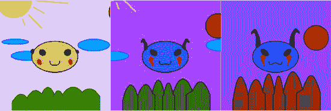
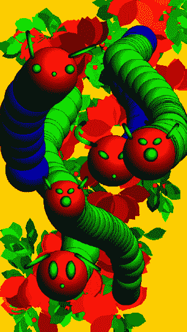

# 二、针对移动配置文件的目标应用

与台式机相比，移动设备的资源非常有限。移动处理器正迅速赶上昨日台式机的速度，但内存和存储仍处于溢价状态。与此同时，用户希望移动应用能够瞬间启动，并对任何时候的硬崩溃或软崩溃具有完全的容错能力。

例如，为了节省内存资源，Android 操作系统可以随时选择关闭后台应用。当用户访问应用时，它依赖于最后已知的活动状态来启动它。如果应用重新启动的时间超过一秒钟，用户会注意到延迟，因为他们认为应用仍在后台运行。

虽然许多相同的概念适用于桌面应用开发，例如使用的工具和编程语言、可用的服务器通信协议以及可用于 UI 开发的控件和外观，但移动设备有一些独特的特征会影响 UI 和应用设计，例如屏幕大小、输入法和部署。

许多相同的空间、占用空间和启动时间的限制在 Web 上已经存在了很长时间。Flash 浏览器应用通常被期望适合一个有限的网页，快速下载，共享有限的计算资源，并即时启动。因此，您现有的 Flash 和 Flex 应用可能是移植到移动设备的良好候选。在本章中，我们将向您展示如何构建充分利用 Android 移动平台的应用。

### 屏幕尺寸

Android 是操作系统和软件栈，不是硬件平台。Google 提供了一个开源平台，包括一个修改过的 Linux 内核和基于 Java 的应用，可以在各种硬件平台上运行。然而，他们并不能控制运行 Android 的最终设备的确切特征。这意味着设备的确切配置变化很大，屏幕尺寸是分辨率、物理尺寸和像素密度有很大差异的一个方面。Table 2–1 显示了终端用户可能在其上运行您的应用的各种常见 Android 设备的屏幕特征。

在表 2–1 中，分辨率是水平和垂直方向的物理像素数，尺寸是屏幕的对角线尺寸，密度是每英寸的像素数(ppi)。Type 为屏幕分辨率提供了一个通用名称，它是下列之一:

*   *QVGA(四分之一视频图形阵列)* : 240×320 像素或 VGA 显示器(480×640)分辨率的四分之一
*   *HVGA(半视频图形阵列)* : 320×480 或 VGA 显示器分辨率的一半
*   *WVGA(宽视频图形阵列)* : 480×800，与 VGA 高度相同，但宽度为 800(横向观看时)
*   *FWVGA(全宽视频图形阵列)* : 480×854，与 VGA 高度相同，但比例为 16:9，用于显示未剪辑的高清视频
*   *qHD(四分之一高清)* : 540×960 或四分之一 1080p 显示屏，16:9 比例，用于显示未剪辑的高清视频

你的应用的可用区域也会因为 Android 状态栏的高度而减少。中密度显示器(如 HTC Hero)的条形高度为 25 像素，高密度显示器(如 Nexus One)的条形高度为 38 像素，超高密度显示器的条形高度为 50 像素。当显示器从纵向模式切换到横向模式时，这也会发生变化。比如 Nexus One 在人像模式下的可用面积是 480×762，而在风景模式下变成了 442×800。

您可能只有一两个设备需要测试，但这并不意味着您的应用不能支持所有的设备。Flash 可以自动缩放应用以适应屏幕大小，并且很容易获得屏幕分辨率来以编程方式修改界面。清单 2–1 展示了如何从 ActionScript 代码中检索屏幕分辨率和密度。

**清单 2–1。** *程序化屏幕分辨率和密度捕捉*

`var resY = Capabilities.screenResolutionX;
var resX = Capabilities.screenResolutionY;
var dpi = Capabilities.screenDPI;
trace("Screen Resolution is " + resX + "x" + resY + " at " + dpi + "ppi");`

注意:术语每英寸点数(dpi)和每英寸像素(ppi)是等价的度量。这些在整个 ActionScript APIs 中可以互换使用。

#### 屏幕分辨率与密度

虽然应用开发人员更可能关注屏幕分辨率的差异，但屏幕密度也同样重要。您的应用需要能够扩展到更大或更小的设备，以便文本仍然可读，目标足够大以便操作。图 2–1 比较了几款不同特性手机的物理尺寸和屏幕分辨率。

虽然 Xperia X10 mini 的屏幕分辨率与 Nexus One 相比微不足道，但屏幕的物理尺寸仅小 30%。这意味着用户界面中的所有图形都需要大幅缩小以适合屏幕。另一方面，在为 Xperia X10 mini 构建时，由于像素太大，即使很小的目标也可以被用户轻松操纵。对于 Nexus One，你需要将目标做得更大。

在 2006 年完成的一项研究中，奥卢大学和马里兰大学的研究人员发现，用拇指操纵触摸屏的最小目标尺寸在 9.2 毫米到 9.6 毫米之间。

__________

1 佩卡·帕尔希、艾米·k·卡尔森和本杰明·b·彼得森，“在小型触摸屏设备上单手使用拇指的目标尺寸研究”， [`http://portal.acm.org/citation.cfm?id=1152260`](http://portal.acm.org/citation.cfm?id=1152260) ，2006 年

**图 2–1。** ***几种安卓设备的物理尺寸和分辨率***

例如，为了实现触摸交互，你需要在 Xperia X10 mini 上将目标尺寸调整为 57 像素宽，或者在 Nexus One 上调整为 92 像素宽。通过调整用户界面的大小以考虑密度，您可以确保用户界面仍然可用，同时最大化活动设备的屏幕空间。

#### 在 Flash 中模拟与设备无关的像素

Android 有一个与设备无关的像素的概念，可以用来做布局，即使显示器的物理大小不同，也会出现相似的布局。它基于 160 dpi 屏幕的参考平台，相当于每英寸大约一个 13×13 像素的正方形。如果你指定了一个 Android 布局，使用与设备无关的像素，平台会根据你的应用运行的设备自动调整。

Flash 没有设备无关像素的概念，但是用代码模拟非常容易。基本公式是 dips =像素* (160 /密度)。清单 2–2 演示了如何在 ActionScript 中进行计算。

**清单 2–2。** *ActionScript 函数计算设备无关像素(dips)*

`function pixelsToDips(pixels:int) {
    return pixels * (160 / Capabilities.screenDPI);
}
trace("100 pixels = " + pixelsToDips(100) + " dips");`

使用模拟的设备无关像素，您可以在 Flash 应用中重现与原生 Android 应用相似的布局行为。

如果您计划根据当前设备密度缩放应用图形，请确保您的应用没有设置为自动调整大小以填充屏幕或在旋转时居中显示内容。有关如何操作的更多信息，请参见本章后面的“Flash 中的自动方向翻转”一节。

#### Flex 应用中的密度

Flex 有内置的支持来缩放应用的用户界面，包括图形、字体和控件。它支持三种常见显示密度的离散比例因子，而不是任意缩放。Table 2–2 列出了所有不同的显示密度，以及用于为当前设备选择密度的映射 DPI 范围。

为了利用 Flex density 支持，将您的`Application`对象上的`applicationDPI`属性设置为应用最初设计的比例。在运行时，您的应用将根据设备屏幕的密度自动缩放。一个 240 dpi 的应用描述符的例子包含在清单 2–3 中。

**清单 2–3。** *应用描述符设置`applicationDPI`*

`<s:ViewNavigatorApplication xmlns:fx="http://ns.adobe.com/mxml/2009"
    xmlns:s="library://ns.adobe.com/flex/spark" firstView="views.MainHomeView"
    **applicationDPI="240"**>
</s:ViewNavigatorApplication>`

`applicationDPI`的唯一有效值是文本字符串“160”、“240”和“320”，对应于三种支持的密度。只能通过 MXML 设置`applicationDPI`属性。

根据作者密度与设备密度的比率，使用矢量图形和文本构建的应用部分会根据需要平滑地放大或缩小。就字体而言，调整字体大小，确保文本在任何显示器上都易于阅读。

位图图形也将被缩放，但放大时可能看起来模糊，缩小时可能会丢失细节。为了确保您的位图大小适合不同的密度，您可以通过使用`MultiDPIBitmapSource`类提供基于显示密度自动换入的替代图像。

#### 密度浏览器应用

为了更好地了解密度如何影响您的 Flex 应用，我们将指导您创建密度浏览器应用。该应用允许您输入应用`dpi`和设备`dpi`作为参数，并计算将在不同设备上使用的灵活调整的设备密度和比例因子。

首先，使用移动应用模板创建一个名为“密度浏览器”的新 Flex 移动项目。这将自动生成一个标准项目模板，其中包括一个 Adobe AIR 应用描述符(`DensityExplorer-app.xml`)、一个 ViewNavigatorApplication ( `DensityExplorer.mxml`)和一个初始视图(`DensityExplorerHomeView.mxml`)。

第一步是打开`DensityExplorerHomeView.mxml`并添加一些控件，让你设置作者密度和设备 DPI。我们将在第五章中更详细地介绍 Flex 控件，但是对于这个应用来说，几个标签、单选按钮和一个水平滑块就足够了。

清单 2–4 显示了允许使用`RadioButton`和`HSlider`类输入作者密度和设备 dpi 的基本代码。

**清单 2–4。** *密度浏览器控件用于`applicationDPI`和`deviceDPI`条目*

`<fx:Script>
  <![CDATA[
    [Bindable]
    protectedvarapplicationDPI:Number;
    [Bindable]
    publicvardeviceDPI:Number;
  ]]>
</fx:Script>
<s:VGroup paddingTop="20" paddingLeft="15" paddingRight="15" paddingBottom="15"
          gap="20" width="100%" height="100%">
  <s:Label text="Application DPI:"/>
  <s:HGroup gap="30">
    <s:RadioButton id="ad160" content="160" click="applicationDPI = 160"/>
    <s:RadioButton id="ad240" content="240" click="applicationDPI = 240"/>
    <s:RadioButton id="ad320" content="320" click="applicationDPI = 320"/>
  </s:HGroup>
  <s:Label text="Device DPI: {deviceDPI}"/>
  <s:HSlider id="dpiSlider" minimum="130" maximum="320" value="@{deviceDPI}"
             width="100%"/>
</s:VGroup>`

首先，引入一些可绑定的脚本变量来保存`applicationDPI`和`deviceDPI`。这些并不是显示基本 UI 所必需的，但是它们将使以后连接输出部分变得更加容易。主控件在`VGroup`中垂直组织，而`RadioButtons`使用`HGroup`水平组织。

使用一个简单的`click`处理器将`RadioButtons`连接到`applicationDPI`。当滑块改变时，双向数据绑定表达式(前缀为@操作符)用于更新`dpi`的值。为了完成 UI 的这一部分，设备 dpi 文本包含一个对 DPI 的绑定引用，以便您可以在滑块的值发生变化时看到它。

运行这个程序会给你一个简单的 Flex 应用，如图 2–2 所示。您可以通过移动滑块来验证功能，这将更新`deviceDPI`设置。

**图 2–2。** ***密度探索者第一部分:基本控件***

此应用的目标是计算 Flex 将使用的调整后的设备密度和比例因子。幸运的是，有一个新的 Flex 4.5 API 可以通过 ActionScript 公开这些信息。我们需要调用的类叫做`DensityUtil`，可以在`mx.utils`包中找到。`DensityUtil`有两个带有以下签名的静态方法:

*   `getRuntimeDPI():Number:`该函数返回`applicationDPI`如果置位，否则当前运行时应用的 DPI 分类；它将始终返回下列值之一:160、240 或 320。
*   在给定应用 DPI(源)和设备 DPI(目标)的情况下，此函数计算 Flex 将使用的比例。

除了这些函数，我们还需要知道当前的`applicationDPI`和设备 dpi 值，这样我们就可以填充 UI 控件的初始值。这些可以通过以下 API 进行查询:

*   `Application.applicationDPI:`对象上的成员变量，可以被查询以获得初始的`applicationDPI`值
*   `Capabilities.screenDPI:`返回屏幕 dpi 数值的`Capabilities`对象的静态方法

利用这些 API，我们可以扩充之前的代码，添加初始化逻辑以及密度和规模的读数。清单 2–5 用粗体显示了更新后的代码。

**清单 2–5。** *更新了密度探测器代码，并进行初始化和输出*

`<?xml version="1.0" encoding="utf-8"?>
<s:View xmlns:fx="http://ns.adobe.com/mxml/2009"
    xmlns:mx="library://ns.adobe.com/flex/mx"
    xmlns:s="library://ns.adobe.com/flex/spark"
    title="Density Explorer" **initialize="init()"**>
  <fx:Script>
    <![CDATA[
      **import mx.binding.utils.BindingUtils;**
      **import mx.utils.DensityUtil;**
      [Bindable]
      protectedvarapplicationDPI:Number;
      [Bindable]
      publicvardeviceDPI:Number;
      **[Bindable]**
      **protectedvardpiClassification:Number;**
      **protectedfunction updateDensity(dpi:Number):void {**
        **dpiClassification = dpi < 200 ? 160 : dpi >= 280 ? 320 : 240;**
      **}**
      **protectedfunction init():void {**
        **applicationDPI= parentApplication.applicationDPI;**
        **if (applicationDPI!= null) {**
          **this["ad" + applicationDPI].selected = true;**
        **}**
        **BindingUtils.bindSetter(updateDensity, this, "deviceDPI");**
        **deviceDPI= Capabilities.screenDPI;**
      **}**
    ]]>
  </fx:Script>
  <s:VGroup paddingTop="20" paddingLeft="15" paddingRight="15" paddingBottom="15"
                    gap="20" width="100%" height="100%">
    <s:Label text="ApplicationDPI:"/>
    <s:HGroup gap="30">
      <s:RadioButton id="ad160" content="160" click="applicationDPI= 160"/>
      <s:RadioButton id="ad240" content="240" click="applicationDPI= 240"/>
      <s:RadioButton id="ad320" content="320" click="applicationDPI= 320"/>
    </s:HGroup>
    <s:Label text="Device DPI: {dpi}"/>
    <s:HSlider id="dpiSlider" minimum="130" maximum="320" value="@{deviceDPI}"                width="100%"/>
    **<s:Group width="100%" height="100%">**
      **<s:BorderContainer bottom="0" minHeight="0"width="100%" borderStyle="inset"**
                 **backgroundColor="#d0d0d0"borderColor="#888888" backgroundAlpha=".6">**
        **<s:layout>**
          **<s:VerticalLayout gap="10"paddingLeft="10" paddingRight="10"**
                    **paddingTop="10" paddingBottom="10"/>**
        **</s:layout>**
        **<s:Label text="Adjusted Device Density: {dpiClassification}"/>**
        **<s:Label text="Scale Factor: {DensityUtil.getDPIScale(applicationDPI,**
                                                           **dpiClassification)}"/>**
      **</s:BorderContainer>**` `    **</s:Group>**
  </s:VGroup>
</s:View>`

在由`View.initialize`调用的方法内部执行初始化，以确保所有值都可用。首先从`parentApplication`对象更新`applicationDPI`，并通过对返回的字符串执行 ID 查找来选择正确的`RadioButton`。接下来从`Capabilities`对象设置`dpi`。为了确保初始值赋值和滑块后续更新对`dpi`的所有更新都将重新计算`deviceDensity`，bind setter 被配置为触发对`dpi`的所有更新。

为了显示`deviceDensity`的当前值和计算出的刻度，在`View`的末端增加了一个带有几个`Labels`的`BorderContainer`。通过使用一个`BorderContainer`作为环绕组，很容易改变样式，使输出在视觉上不同于输入。

最后一步是添加一个额外的群组，它将随着`dpi`设置的更新而淡入设备图片。为了确保图像针对不同密度的显示器进行优化缩放，我们使用了一个`MultiDPIBimapSource`,它指的是不同的预缩放伪影。该代码如清单 2–6 所示。

**清单 2–6。*****【MXML】用于显示代表性设备图像的代码使用了** `MultiDPIBitmapSource`*

`<s:Group id="phones" width="100%" height="100%">
  <s:Image alpha="{1-Math.abs(deviceDPI-157)/20}" horizontalCenter="0">
    <s:source>
      <s:MultiDPIBitmapSource
        source160dpi="@Embed('assets/xperia-x10-mini160.jpg')"
        source240dpi="@Embed('assets/xperia-x10-mini240.jpg')"
        source320dpi="@Embed('assets/xperia-x10-mini320.jpg')" />
    </s:source>
  </s:Image>
  <s:Image alpha="{1-Math.abs(deviceDPI-180)/20}" horizontalCenter="0">
    <s:source>
      <s:MultiDPIBitmapSource
        source160dpi="@Embed('assets/htc-hero160.jpg')"
        source240dpi="@Embed('assets/htc-hero240.jpg')"
        source320dpi="@Embed('assets/htc-hero320.jpg')" />
    </s:source>
  </s:Image>
  <s:Image alpha="{1-Math.abs(deviceDPI-217)/20}" horizontalCenter="0">
    <s:source>
      <s:MultiDPIBitmapSource
        source160dpi="@Embed('assets/htc-evo-4g160.jpg')"
        source240dpi="@Embed('assets/htc-evo-4g240.jpg')"
        source320dpi="@Embed('assets/htc-evo-4g320.jpg')" />
    </s:source>
  </s:Image>
  <s:Image alpha="{1-Math.abs(deviceDPI-252)/20}" horizontalCenter="0">
    <s:source>
      <s:MultiDPIBitmapSource
        source160dpi="@Embed('assets/nexus-one160.jpg')"
        source240dpi="@Embed('assets/nexus-one240.jpg')"
        source320dpi="@Embed('assets/nexus-one320.jpg')" />
    </s:source>` `  </s:Image>
  <s:Image alpha="{1-Math.abs(deviceDPI-275)/20}" horizontalCenter="0">
    <s:source>
      <s:MultiDPIBitmapSource
        source160dpi="@Embed('assets/atrix160.jpg')"
        source240dpi="@Embed('assets/atrix240.jpg')"
        source320dpi="@Embed('assets/atrix320.jpg')" />
    </s:source>
  </s:Image>
</s:Group>`

所有选择的图片都是手机标准新闻图片的缩放版本。为了在接近 dpi 值时慢慢淡入设备，将一个简单的数学公式应用于 alpha:

`1-Math.abs(deviceDPI-{physicalDPI})/{threshold}`

对于每个电话，实际的`dpi`代替该设备的`physicalDPI`，并且阈值被设置为足够低的值，使得对于目标 dpi 值不会有两个电话重叠。对于所选择的设备，阈值 20 低于任何电话`dpi`值之间的差。

完成的密度浏览器应用如图 2–3 所示。这是试验应用 dpi 和设备 dpi 的不同值的好机会，以查看它们对您部署的应用的影响。

**图 2–3。** *完成了密度探测器的应用*

为了进行对比，Figure 2–4 展示了在物理设备上以 160、240 和 320 dpi 运行的 Density Explorer 的屏幕截图。请注意，尽管屏幕的物理尺寸差异很大，但应用的布局和图形的质量都保持不变。通过将作者密度设置为 240，可以保证您的应用在任何密度的设备上都具有相同的外观和感觉，而无需修改代码。

**图 2–4。** *密度浏览器在分类为 160 dpi(左)、240 dpi(中)和 320 dpi(右)的设备上运行时的并排比较*

#### CSS 中的密度支持

虽然 Flex 中的`applicationDPI`设置为您提供了一种简单的机制来为一种密度编写您的应用，并让 Flex 负责调整大小，但是当您在不同的设备上查看应用时，它并不能让您对应用的精确布局和样式进行细粒度的控制。将`applicationDPI`设置为常量对于简单的应用来说很好，但是随着 UI 复杂性的增加，这通常不够好。这就是 CSS 媒体查询的来源。

Flex 媒体查询允许您在 CSS 中对不同设备上的样式进行细粒度控制。它们基于 W3C CSS 媒体查询候选推荐标准， 2 ，但仅包含与 Flex 和移动应用最相关的功能的子集。

Flex 支持两种类型的选择器。第一种类型允许您根据设备类型选择样式。清单 2–7 中的代码演示了如何根据运行设备的类型来改变字体颜色。

__________

2 [`www.w3.org/TR/css3-mediaqueries/`](http://www.w3.org/TR/css3-mediaqueries/)

**清单 2–7。** *演示设备媒体选择器的代码示例*

`@namespace s "library://ns.adobe.com/flex/spark";

@media (os-platform: "IOS") {
  s|Label
  {
    color: red;
  }
}

@media (os-platform: "Android") {
  s|Label {
    color: blue;
  }
}`

将该样式表添加到您的应用中会将所有`Labels`的颜色变为蓝色或红色，这取决于您运行的移动平台。但是，当作为桌面应用运行时，这不会有任何影响。

第二种选择器允许您根据应用`dpi`改变样式。与之匹配的有效值是标准弯曲密度 160、240 和 320。使用`dpi`选择器，您可以微调布局和字体，甚至用不同密度的显示器替换图像。

**重要提示:**为了使用 CSS 媒体选择器，您需要确保没有在您的移动应用类上设置`applicationDPI`属性。

为了演示`dpi`选择器的使用，我们将更新 Density Explorer 示例，使用样式表来替换图像，而不是将其嵌入到带有`MultiDPIBitmapSource`的代码中。应用图像的简化应用代码如清单 2–8 所示。

**清单 2–8。** ***更新了** `DensityExplorer` **代码用于整合 CSS 媒体查询***

`<s:Group id="phones" width="100%" height="100%">
  <s:Image alpha="{1-Math.abs(deviceDPI-157)/20}" horizontalCenter="0"
        source="{phones.getStyle('xperiaX10Mini')}"/>
  <s:Image alpha="{1-Math.abs(deviceDPI-180)/20}" horizontalCenter="0"
        source="{phones.getStyle('htcHero')}"/>
  <s:Image alpha="{1-Math.abs(deviceDPI-217)/20}" horizontalCenter="0"
        source="{phones.getStyle('htcEvo4g')}"/>
  <s:Image alpha="{1-Math.abs(deviceDPI-252)/20}" horizontalCenter="0"
        source="{phones.getStyle('nexusOne')}"/>
  <s:Image alpha="{1-Math.abs(deviceDPI-275)/20}" horizontalCenter="0"
        source="{phones.getStyle('atrix')}"/>
</s:Group>`

注意，我们在父对象上使用了`getStyle`方法来分配图像源。如果您使用的是图标或按钮状态这样的样式，这通常是不需要的，但是 image 类上的 source 是一个普通的属性。使用这种技术绑定到一个命名的样式使得`Image`源可以通过 CSS 访问。

为了完成这个例子，我们还需要创建一个样式表，利用`dpi`媒体选择器来替换一个适当缩放的图像。这类似于设备选择器，如清单 2–9 所示。

**清单 2–9。** ***CSS 基于应用** `dpi`* 进行图像切换

`@media (application-dpi: 160) {
  #phones {
    xperiaX10Mini: Embed("/assets/xperia-x10-mini160.jpg");
    htcHero: Embed("/assets/htc-hero160.jpg");
    htcEvo4g: Embed("/assets/htc-evo-4g160.jpg");
    nexusOne: Embed("/assets/nexus-one160.jpg");
    atrix: Embed("/assets/atrix160.jpg");
  }
}

@media (application-dpi: 240) {
  #phones {
    xperiaX10Mini: Embed("/assets/xperia-x10-mini240.jpg");
    htcHero: Embed("/assets/htc-hero240.jpg");
    htcEvo4g: Embed("/assets/htc-evo-4g240.jpg");
    nexusOne: Embed("/assets/nexus-one240.jpg");
    atrix: Embed("/assets/atrix240.jpg");
  }
}

@media (application-dpi: 320) {
  #phones {
    xperiaX10Mini: Embed("/assets/xperia-x10-mini320.jpg");
    htcHero: Embed("/assets/htc-hero320.jpg");
    htcEvo4g: Embed("/assets/htc-evo-4g320.jpg");
    nexusOne: Embed("/assets/nexus-one320.jpg");
    atrix: Embed("/assets/atrix320.jpg");
  }
}`

最后一步是确保我们在`ViewNavigatorApplication`中引用了样式表。您还需要移除`applicationDPI`设置，否则样式表选择器将总是将`dpi`报告为常量值，如清单 2–10 所示。

**清单 2–10。** ***完成** `DensityExplorer` **应用类对整合媒体查询的支持***

`<?xml version="1.0" encoding="utf-8"?>
<s:ViewNavigatorApplication xmlns:fx="http://ns.adobe.com/mxml/2009"
              xmlns:s="library://ns.adobe.com/flex/spark"
              splashScreenImage="@Embed('ProAndroidFlash400.png')"
              firstView="views.DensityExplorerHomeView">
  <fx:Style source="DensityExplorer.css"/>
</s:ViewNavigatorApplication>`

在不同设备上运行该程序的输出几乎与之前在图 2–4 中的结果相同，只是间距略有不同。原因是 Flex control 团队也在他们的控件中放入了`dpi`提示，这样它们就可以根据目标设备自动调整大小，即使没有将`applicationDPI`固定为一个常量值。

既然你已经学习了 CSS 媒体选择器，你就有了一个强大的工具来从你的代码中提取样式，甚至是对密度敏感的应用。

### 屏幕方向

移动设备的一个独特之处是可以在手中旋转。在桌面世界中，这相当于将显示器翻转过来。虽然旋转桌面显示器有一些创造性的用途，如图 2–5 所示，但这肯定不是一个常见的用例。

**图 2–5。** *独特的利用监视器旋转来制造光弧 3*

在移动设备中，旋转是一个重要的 UI 范例，它让您可以充分利用有限的屏幕空间。一个表现良好的移动应用应该在旋转时调整用户界面的大小，让用户停留在他或她喜欢的方向，通常显示一个完全不同的视图，这是为那个方向定制的。

__________

3Tim prit love 拍摄的知识共享许可照片:
[`www.flickr.com/photos/timpritlove/123865627/`](http://www.flickr.com/photos/timpritlove/123865627/) 。

#### Flex 中的纵向/横向切换

要在 Flex 项目中打开自动定向，有两种方法。最方便的方法是在从标准模板创建新的 Flex 移动应用时，只需选中“自动重定向”复选框。图 2–6 显示了选中“自动重定向”选项的项目创建向导的屏幕截图。

**图 2–6。** *选中了“自动重定向”选项的 Flex builder 项目向导*

如果您有一个现有的项目或者想要手动更改自动定向，您需要在应用描述符中设置`autoOrients`属性。应用描述符位于根项目目录中名为`*-app.xml`的文件中，其中的`autoOrients`属性应该被创建为`initialWindow`元素的子元素，并被设置为`true`，如清单 2–11 所示。

**清单 2–11。** *应用描述符更改，允许载物台自动定位*

`<initialWindow>
  <content>[This value will be overwritten by Flash Builder in the output
app.xml]</content>
  **<autoOrients>true</autoOrients>**
</initialWindow>`

这会旋转舞台并调整其大小，还会引发事件，您可以通过监听这些事件来更改应用布局。

然而，简单地打开自动定向通常会产生不理想的结果。例如，如果您在 Density Explorer 应用上启用自动定向，用户界面的底部会被裁剪掉，如 Figure 2–7 所示。

**图 2–7。**

对于 Density Explorer 应用的横向方向，理想的布局是将手机图片放在控件的左侧。在 Flex 应用中有两种方法可以实现这一点。第一个是为动态改变布局的旋转事件添加一个事件处理程序。由于这是一种纯粹的 ActionScript 方法，它在 Flash Professional 中也同样适用。第二个是利用新的肖像和风景状态，这只能从 MXML 访问。在下面的小节中，我们将演示这两种方法。

##### 随着事件进行纵向/横向切换

每次旋转 Flash 移动设备时，都会触发方向事件来通知任何侦听器。方向事件处理程序通过标准的`addEventListener`方法添加到`Stage`对象上。定向事件的事件类为`StageOrientationEvent`，事件类型为`StageOrientationEvent.ORIENTATION_CHANGE`。

**注意:**在`StageOrientationEvent`类上也有一个`ORIENTATION_CHANGING`事件类型，但这不适用于 Android 设备。

`StageOrientationEvent`有两个变量对处理方向变化特别有用:

*   `beforeOrientation`:当前旋转事件触发前的手机方向
*   `afterOrientation`:当前手机方向

将所有这些放在一起，您可以修改密度浏览器，以根据手机的方向改变布局。

第一步是更新声明性的 MXML UI，以包含一个额外的用于横向的`HBox`，用惟一的 id 命名外部的`HBox`和内部的`VBox`，并连接一个`addedToStage`事件监听器。完成这项工作的代码如清单 2–12 所示。

**清单 2–12。** *MXML 新增支持舞台布局变更*

`**<s:HGroup id="outer" width="100%" height="100%" addedToStage="stageInit()">**
  <s:VGroup paddingTop="20" paddingLeft="15" paddingRight="15"
                    paddingBottom="15" gap="20" width="100%" height="100%">
    …
    <s:Group **id="inner"** width="100%" height="100%">
      <s:Group id="phones" width="100%" height="100%">
        …
  </s:VGroup>
**</s:HGroup>**`

下一步是实现`stageInit`函数来连接一个方向改变事件监听器。除了连接侦听器之外，用当前方向触发一个初始事件通常也很有帮助。这将确保即使您的应用以横向模式启动，它也将遵循相同的代码路径，就像它以纵向模式打开，然后被用户旋转一样。这个动作脚本显示在清单 2–13 中。

**清单 2–13。** ***实现** `stageInit` **和** `orientationChange` **功能***

`**protected function** orientationChange(e:StageOrientationEvent):**void** {
  **switch** (e.afterOrientation) {
    **case** StageOrientation.DEFAULT:
    **case** StageOrientation.UPSIDE_DOWN:` `      inner.addElementAt(phones, 0);
      **break**;
    **case** StageOrientation.ROTATED_RIGHT:
    **case** StageOrientation.ROTATED_LEFT:
      outer.addElementAt(phones, 0);
      **break**;
  }
}
**protected function** stageInit():**void** {
  stage.addEventListener(StageOrientationEvent.ORIENTATION_CHANGE, orientationChange);
  orientationChange(**new** StageOrientationEvent(
                                StageOrientationEvent.ORIENTATION_CHANGE, **false**, **false**,
                                **null**, stage.orientation));
}`

在这种情况下，向右和向左旋转的行为是相同的，尽管如果你想变得有创意，你可以根据手机旋转的方式将设备显示屏放在屏幕的不同侧。

运行修改后的密度浏览器应用的结果如图 2–8 所示。正如您所看到的，设备显示屏以可用的大小显示，其余的控件不再在很宽的显示屏上展开。最令人印象深刻的是，当你旋转手机时，布局会动态更新，以优化纵向和横向。

**图 2–8。** *改进了景观布局的密度浏览器应用*

##### 纵向/横向状态切换

在 Flex 中可以用于纵向/横向切换的第二种技术是利用两种内置状态，这两种状态在设备旋转时触发，称为`portrait`和`landscape`。虽然这只能从 MXML 访问，并且不像事件 API 那样提供那么多关于设备方向的信息，但实现这一点的代码更简单，本质上更具声明性，更易于阅读和维护。

要公开新的纵向和横向状态，您需要在视图代码中添加一个定义了`portrait`和`landscape`状态的`states`声明，如清单 2–14 所示。

**清单 2–14。** ***状态声明为** `portrait` **和** `landscape` **模式***

`<s:states>
  <s:State name="portrait"/>
  <s:State name="landscape"/>
</s:states>`

这些`states`将在设备改变方向时自动触发。要修改布局，您可以利用`includedIn`属性和`Reparent`标签来移动手机图像的位置。你需要做的代码修改如清单 2–15 所示。

**清单 2–15。** *当状态改变时，用户界面改变以恢复手机图像*

`**<s:HGroup width="100%" height="100%">**
  **<fx:Reparent target="phones" includeIn="landscape" />**
  …
    <s:Group width="100%" height="100%">
      <s:Group id="phones" width="100%" height="100%" **includeIn="portrait"**>
        …
  </s:VGroup>
**</s:HGroup>**`

最终结果是，用 8 行 MXML 代码就可以完成用事件方法需要 21 行代码才能完成的事情。运行该应用的结果与在图 2–8 中获得的结果相同。

#### Flash 中的自动方向翻转

Flash 应用也可以配置为在设备旋转时自动翻转舞台的方向。要在 Flash 项目中启用自动方向切换，需要勾选 Android 发布设置对话框的空中自动方向复选框，如图 Figure 2–9 所示。

**图 2–9。**??【闪光 CS5.5 自动定向设置】带圈

设置此选项将导致应用的纵横比在用户旋转设备时自动从横向翻转到纵向。方向改变时，载物台将旋转，使其垂直定向，旋转后调整大小以填充新尺寸，然后在显示器内居中。

如果您想要更改内容的布局以填充屏幕并完全控制舞台的大小，您需要禁用自动缩放和定位。这可以在 ActionScript 中通过改变`Stage`对象的`scaleMode`和`align`属性来完成，如清单 2–16 所示。

**清单 2–16。** *从 ActionScript 中禁用舞台缩放和对齐*

`stage.scaleMode = StageScaleMode.NO_SCALE;  // turn off scaling
stage.align = StageAlign.TOP_LEFT;  // align content to the top-left of the stage`

这可以添加到应用启动时执行的任何关键帧中，并保持舞台左上角对齐，不调整内容的大小。然后，您可以在方向改变时添加事件侦听器，以便修改您的应用来适应屏幕大小。

#### 旋转笑脸 Flash 定向示例

为了演示如何在 Flash CS5.5 中快速创建调整方向的内容，您将创建一个小的示例应用，该应用在方向改变时将一张快乐的笑脸图片变形为一张魔鬼图片。

首先，您需要创建一个新的 AIR for Android 项目，大小为 480×480 像素。选择与较小设备尺寸大小相等的正方形画布的原因是为了确保旋转时不会发生额外的缩放。

图 2–10 显示了快乐笑脸图片的开始状态，画出的方框表示横向和纵向模式的范围。两个框的交叉点是 480×480 的画布，附加图形水平和垂直溢出。当方向改变时，这些会被裁剪掉，使笑脸很好地居中。

**图 2–10。** *快乐笑脸图片起始状态，用方框显示横向和纵向范围*

你可以随心所欲地创作自己的图形，但要将元素放在单独的图层中，这样便于以后制作动画和变形。

下一步是创建大约一秒钟的魔鬼笑脸关键帧。这应该包括从快乐的笑脸平滑过渡的运动或形状补间。图 2–11 显示了一些延时帧，这些帧显示了笑脸以及一些背景场景元素的动画。

**图 2–11。** *从快乐到恶魔般的笑脸的动画*

同时，也创建反向动画，在大约两秒钟后回到快乐的笑脸。虽然有一些在 Flash 中反转动画的 ActionScript 技术，但是它们不直观，并且通常会带来性能损失。

现在您已经完成了图形，您需要添加 ActionScript 代码来在设备旋转时制作笑脸动画。这应该添加到时间轴中的第一个关键帧，并且应该包括停止动画自动播放和将方向事件监听器附加到场景，如清单 2–17 所示。

**清单 2–17。** *响应方向改变事件的 ActionScript 代码*

`import flash.events.StageOrientationEvent;

stop();

stage.addEventListener(StageOrientationEvent.ORIENTATION_CHANGE, onChanged);

function onChanged(event:StageOrientationEvent):void {
  play();
}`

注意，`onChanged`事件处理程序只需在每个方向改变事件上播放电影。动画的所有重担都已经被时间线承担了。

所需代码的最后一点是在这个邪恶的笑脸框上添加一个`stop()`调用，这样它就会在一个旋转事件之后停止。

另外，如果用户的设备不支持定向事件，例如用户在桌面或电视上运行，您可以向用户添加警告。给出反馈的最简单方法是创建一个隐藏层，在检查方向支持的基础上使其可见，如清单 2–18 所示。

**清单 2–18。** *定位校验码隐藏/显示错误页面*

`if (Stage.supportsOrientationChange) {
  orientationNotSupported.visible = false;
}`

在设备上运行的完整旋转笑脸应用如图 2–12 所示。虽然这个例子相当简单，但它展示了向应用添加方向支持是多么容易。

**图 2–12。** *完成纵向(左)和横向(右)旋转笑脸示例*

### 多点触摸和手势

用户界面长期以来一直受到桌面鼠标的限制。第一只鼠标是道格拉斯·恩格尔巴特在 1963 年发明的。它有两个垂直的轮子用于跟踪运动，还有一条长绳子，类似于啮齿动物或老鼠的尾巴。在这之后，出现了内置球、光学跟踪和多个按钮的鼠标，如 80 年代初生产的 Dépraz 鼠标。这两种早期装置都显示在图 2–13 中。

**图 2–13。** *恩格尔巴特鼠(右下)和德普拉兹鼠(左上)*的照片

现代鼠标包括诸如滚轮、激光跟踪和无线操作等功能。然而，所有的鼠标都有一个共同的限制，那就是它们一次只能在屏幕上支持一个光标。

移动界面最初也有指针驱动的单点触摸交互的限制。然而，它们已经进化到利用人类的体质。我们有两只手，总共十个手指，每个手指都能够单独与设备上的触摸点进行交互和操作。

大多数 Android 设备支持至少两个同步触摸点，这是处理所有移动手势所需的最低要求。这也是移动设备由手指支撑并用两个拇指操作的最常见的使用场景。然而，支持几乎无限数量的接触点的新设备正在被引入。

您可以通过查询`Multitouch`对象来检索您的设备支持的触摸点数量，如清单 2–19 所示。

**清单 2–19。** *通过 ActionScript 检索触摸点数*

`trace("Max Touch Points: " + Multitouch.maxTouchPoints);`

在本节中，您将学习如何利用多点触摸和用户手势，改善用户体验和 Flash 应用的可用性。

#### 移动手势

使用多点触控最简单的方法是利用 Flash 支持的预定义手势。对于任何至少有两个触摸点的 Android 设备，您将能够使用表 2–3 中的手势。

__________

4 由 Gestureworks ( [`www.gestureworks.com`](http://www.gestureworks.com) )提供的知识共享许可插图

在不支持手势的情况下，在应用中提供一些其他机制来完成相同的行为通常是一个好主意；然而，移动用户已经开始期待手势提供的便利和速度，因此在应用设计中适当地映射它们是很重要的。

要发现运行您的应用的设备是否支持手势，并动态查询手势功能，您可以在`Multitouch`类上调用以下静态方法:

*   `Multitouch.supportsGestureEvents`:您运行的设备是否支持发射手势事件
*   `Multitouch.supportedGestures`:字符串列表，每个支持的多点触摸事件对应一个字符串

在使用手势事件之前，需要将`touchMode`设置为手势输入模式，如清单 2–20 所示。

**清单 2–20。** *启用手势识别支持的动作脚本代码*

`Multitouch.inputMode = MultitouchInputMode.GESTURE;`

在您期望接收手势事件之前，应该在您的程序中调用它。

#### Flash 剪贴簿示例

为了演示如何处理手势事件，我们将通过一个示例程序来构建一个响应多点触摸事件的图片剪贴簿。为简单起见，我们将图像作为资源加载(参见第七章了解更多关于从相机胶卷中检索图像的信息)。

以下是我们将支持的一些多点触摸事件:

*   *缩放*:放大或缩小图片
*   *旋转*:将图像旋转到任意角度
*   *平移*:将整页图像作为一个单元移动
*   *滑动*:滑动标题，在图像页面之间切换
*   *双指轻击*:用两个手指轻击图像，在自己的视图中打开它

此外，虽然它不是多点触摸手势，但我们将挂接拖动监听器，以便您可以通过用单个手指拖动图像来定位它们。

在 Flash 应用中有两种不同的方法来连接多点触摸监听器。第一种是通过纯 ActionScript，在基于 Flash 或 Flex 的应用中同样适用。第二种是通过使用`InteractiveObject`类上的事件挂钩，如果您正在使用 Flex 组件，这是最方便的选择。我们将在这一部分展示两者的例子。

##### 缩放和旋转手势处理

Flash 剪贴簿示例的核心将是一个`MultitouchImage`组件，它扩展了 spark `Image`类以添加大小调整和旋转功能。对于这个类，我们将使用`addEventListener`机制来连接缩放和旋转手势的多点触摸监听器。代码如清单 2–21 所示。

**清单 2–21。** *`MultitouchImage` **类添加旋转和调整大小支持***

`package com.proandroidflash {
  import flash.events.TransformGestureEvent;
  import flash.geom.Point;
  import flash.ui.Multitouch;
  import flash.ui.MultitouchInputMode;
  import mx.events.ResizeEvent;
  import spark.components.Image;

  publicclassMultitouchImageextends Image {
    publicfunctionMultitouchImage() {
      addEventListener(ResizeEvent.RESIZE, resizeListener);
      addEventListener(TransformGestureEvent.GESTURE_ROTATE, rotateListener);
      addEventListener(TransformGestureEvent.GESTURE_ZOOM, zoomListener);
      Multitouch.inputMode = MultitouchInputMode.GESTURE;
    }` `    protectedfunction resizeListener(e:ResizeEvent):void {
      transformX = width/2;
      transformY = height/2;
    }

    protectedfunction rotateListener(e:TransformGestureEvent):void {
      rotation += e.rotation;
    }

    protectedfunction zoomListener(e:TransformGestureEvent):void {
      scaleX *= e.scaleX;
      scaleY *= e.scaleY;
    }
  }
}`

在构造函数中，我们通过调用`addEventListener`方法并传入`GESTURE_ROTATE`和`GESTURE_ZOOM`常量来添加旋转和缩放监听器。旋转回调简单地获取`TransformGestureEvent`的旋转参数，并将其添加到节点的当前旋转中，将值保存回来。在这两种情况下，旋转都以度数表示为数值。缩放监听器类似地获取`TransformGestureEvent`的`scaleX`和`scaleY`参数，并将它们乘以节点的`scaleX`和`scaleY`以获得新值。在这两种情况下，手势事件为您提供了自上次调用侦听器以来的增量，因此您可以简单地增量调整节点值。

为了确保旋转和缩放发生在图像节点的中心，我们将`transformX`和`transformY`设置在`resizeListener`中节点的中点。这也是通过构造函数中的`addEventListener`连接的，因此每次节点大小改变时都会触发。

我们做的最后一件事是将`inputMode`设置为`MultitouchInputMode.GESTURE`,这样事件监听器将被触发。根据我们的需要频繁地设置这个值是安全的，所以我们在每次调用构造函数时都这样做。

对于其余的手势事件，我们将利用`InteractiveObject`事件挂钩，通过 MXML 轻松连接；然而，你也可以通过遵循表 2–4 中的类和常量信息，使用`addEventListener`机制连接所有其他手势。

##### 按住并拖动鼠标事件

我们将使用的另一个助手类是`DraggableGroup`类。这实现了一个标准的指向和拖动隐喻，作为 spark 组的扩展，如清单 2–22 所示。除了有利于封装之外，从手势事件中提取鼠标事件允许您同时处理多个事件。

**清单 2–22。** *`DraggableGroup` **实现点和拖动力学的类***

`package com.proandroidflash {
  import flash.events.MouseEvent;
  import mx.core.UIComponent;
  import spark.components.Form;
  import spark.components.Group;

  public class DraggableGroup extends Group {
    public function DraggableGroup() {
      mouseEnabledWhereTransparent = false;
      addEventListener(MouseEvent.MOUSE_DOWN, mouseDownListener);
      addEventListener(MouseEvent.MOUSE_UP, mouseUpListener);
    }

    protected function mouseDownListener(e:MouseEvent):void {
      (parent as Group).setElementIndex(this, parent.numChildren-1);
      startDrag();
    }

     protected function mouseUpListener(e:MouseEvent):void {
       stopDrag();
       *// fix for bug in Flex where child elements don't get invalidated*
       for (var i:int=0; i<numElements; i++) {
         (getElementAt(i) as UIComponent).invalidateProperties();
       }
     }
   }
}`

`DraggableGroup`的代码是一个相当简单的 Flex 组件实现，使用与手势代码相同的`addEventListener/`回调范例。虽然您可以使用触摸事件实现相同的代码，但是坚持使用鼠标抬起和鼠标放下事件的好处是，即使在没有触摸支持的情况下，UI 的这一部分也可以工作。

代码中的一些微妙之处值得指出。

*   默认情况下，Group 类为其边界区域中的任何单击触发事件。通过将`mouseEnabledWhereTransparent`设置为`false`，您可以避免孩子范围之外的误点火。
*   要在单击时引发该对象，需要更改父容器中的顺序。这个实现假设父节点是一个`Group`，并使用`setElementIndex`函数将这个节点推到前面。
*   Flex 中有一个 bug，在拖动后子元素的布局属性不会失效。在所有子节点上手动调用`invalidateProperties`可以解决这个问题。例如，如果没有此修复，您会注意到旋转/缩放的中心不会随着拖动而平移。

##### 滑动手势处理

为了显示图像，我们将使用一个简单的视图，将各个图像页面的呈现委托给一个`ItemRenderer`。首先，我们将看看组成剪贴簿示例主屏幕的`View`类。完整的代码如清单 2–23 所示。

**清单 2–23。** *Flash 剪贴簿主视图代码，滑动事件处理程序以粗体突出显示*

`<?xml version="1.0" encoding="utf-8"?>
<s:View xmlns:fx="http://ns.adobe.com/mxml/2009"
    xmlns:s="library://ns.adobe.com/flex/spark"
    xmlns:mx="library://ns.adobe.com/flex/mx"
    xmlns:proandroidflash="com.proandroidflash.*"
    title="Home" backgroundColor="#333333" destructionPolicy="never">
  <fx:Script>
    <![CDATA[
      import mx.core.IVisualElement;
      [Bindable]
      protected var page:int = 0;
      **protected function swipe(e:TransformGestureEvent):void** {
        page = (page + e.offsetX + pages.numElements) % pages.numElements;
        updateVisibility();
      }
      protected function updateVisibility():void {
        for (var i:int=0; i<pages.numElements; i++) {
          var element:IVisualElement = pages.getElementAt(i);
          if (element != null) {
            element.visible = i == page;
          }
        }
     }
  ]]>
</fx:Script>
<s:layout>
  <s:VerticalLayout horizontalAlign="center" paddingTop="10"
                    paddingLeft="10" paddingRight="10" paddingBottom="10"/>
</s:layout>
<fx:Declarations>
  <s:ArrayList id="images">
    <fx:Object image1="@Embed(source='img/cassandra1.jpg')"
                     image2="@Embed(source='img/cassandra2.jpg')"
                     image3="@Embed(source='img/cassandra3.jpg')"/>
    <fx:Object image1="@Embed(source='img/cassandra4.jpg')"
                     image2="@Embed(source='img/cassandra5.jpg')"
                     image3="@Embed(source='img/cassandra6.jpg')"/>
    <fx:Object image1="@Embed(source='img/cassandra7.jpg')"
                     image2="@Embed(source='img/cassandra8.jpg')"
                     image3="@Embed(source='img/cassandra9.jpg')"/>
    <fx:Object image1="@Embed(source='img/cassandra10.jpg')"/>
  </s:ArrayList>
</fx:Declarations>
<s:VGroup **gestureSwipe="swipe(event)"**>
  <s:Label text="Flash Scrapbook" fontSize="32" color="white"/>
  <s:Label text="Drag, Rotate, and Zoom with your fingers." fontSize="14"
           color="#aaaaaa"/>
</s:VGroup>
<s:DataGroup id="pages" itemRenderer="com.proandroidflash.ScrapbookPage"
             dataProvider="{images}" width="100%" height="100%"
             added="updateVisibility()"/>
</s:View>`

虽然有相当多的代码来创建视图，但是实际的视图定义本身只包含五行来创建标题的`VGroup`和显示图像的`DataGroup`。剩下的主要是一大块代码，用于简单地将嵌入的图像加载到一个`ArrayList`中，以及一些嵌入在脚本标签中的辅助函数。

挂钩 swipe 事件处理程序所需的代码以粗体突出显示。通过利用`InteractiveObject`上的`gesture*`事件属性，您可以像这样快速地将事件监听器连接到您的应用。每当用户滑动标题 VGroup 时，将调用 protected swipe 方法，其中包含滑动方向的信息。与旋转和缩放事件在手势持续期间不断调用不同，swipe 在手势结束时只被调用一次。您可以通过检查`offsetX`和`offsetY`属性来解读滑动的方向。

*   `offsetX=0, offsetY=-1: Swipe Up`
*   `offsetX=0, offsetY=1: Swipe Down`
*   `offsetX=-1, offsetY=0: Swipe Left`
*   `offsetX=1, offsetY=0: Swipe Right`

值得注意的是，刷卡将总是在水平或垂直方向。不支持对角线滑动，不会被识别为手势。此外，您需要确保您将滑动监听器钩到的组件足够宽或足够高，以提供足够的移动距离来识别手势。一旦用户的手指离开组件，手势识别就会结束。

##### 添加平移和双指轻敲事件监听器

现在我们有了一个带有`DataGroup`的主页，我们需要实现引用的`ItemRenderer`来构建剪贴簿页面。这也将是`MultitouchImage, DraggableGroup`和我们之前定义的主视图之间的链接。

首先创建一个新的 MXML 文件，该文件有一个外部的`ItemRenderer`元素，其中声明了页面内容。在这个类中，我们将连接两个新的手势事件监听器。在外部的`BorderContainer`上，我们将连接一个平移事件监听器，这样用户就可以用一个手势拖动整个页面和页面上的所有图像。此外，在每个`MultitouchImages`上，我们将添加一个双指点击事件监听器，用于切换到全屏视图。

剪贴簿页面实现的完整代码如清单 2–24 所示。

**清单 2–24**。 *Flash `ScrapbookPage`项目渲染器代码，平移和双指点击事件处理程序以粗体突出显示*

`<?xml version="1.0" encoding="utf-8"?>
<s:ItemRenderer xmlns:fx="http://ns.adobe.com/mxml/2009"
        xmlns:s="library://ns.adobe.com/flex/spark"
        xmlns:proandroidflash="com.proandroidflash.*"
        autoDrawBackground="false" width="100%" height="100%">
  <s:BorderContainer backgroundColor="#cccccc" borderColor="#555555"
                     **gesturePan="pan(event)"** rotation="5" x="50" width="100%"
                     height="100%">
    <fx:Script>
      <![CDATA[
        import spark.components.View;
        import views.ImageView;
        **protected function pan(e:TransformGestureEvent):void {**
          **e.target.x += e.offsetX;**
          **e.target.y += e.offsetY;**
        **}**
        **protected function expand(source:Object):void {**
          **(parentDocument as View).navigator.pushView(ImageView, source);**
        **}**
      ]]>
    </fx:Script>
    <proandroidflash:DraggableGroup>
      <proandroidflash:MultitouchImage source="{data.image1}" y="-70" x="10" width="350"
                               rotation="-3" **gestureTwoFingerTap="expand(data.image1)**"/>
    </proandroidflash:DraggableGroup>
    <proandroidflash:DraggableGroup>
      <proandroidflash:MultitouchImage source="{data.image2}" y="100" x="40" width="350"
                               rotation="13" **gestureTwoFingerTap="expand(data.image2)**"/>
    </proandroidflash:DraggableGroup>
    <proandroidflash:DraggableGroup>
  <proandroidflash:MultitouchImage source="{data.image3}" y="300" x="5" width="350"
                               rotation="-8" **gestureTwoFingerTap="expand(data.image3)**"/>
    </proandroidflash:DraggableGroup>
  </s:BorderContainer>
</s:ItemRenderer>`

平移和双指轻敲事件侦听器的连接方式与我们之前连接滑动事件侦听器的方式类似。平移手势碰巧使用了与滑动手势相同的`offsetX`和`offsetY`变量，但是具有非常不同的含义。平移事件在用户手势的持续时间内不断被调用，并为`offsetX`和`offsetY`传递以像素为单位的增量。

对于双指点击手势，我们选择不传入事件，而是替换为包含要显示的图像的上下文相关变量。然后，这作为`ViewNavigator's pushView`方法的数据参数传入。

##### Flash 剪贴簿图片查看

最后一步是实现在`pushView`方法调用中引用的`ImageView`类。因为 Flex 为我们处理了所有的视图导航逻辑，所以实现非常简单。我们增加的唯一额外功能是另一个双指轻击手势，这样你就可以导航回主视图，而不用点击 Android 的后退按钮。

`ImageView`类的代码如清单 2–25 所示。

**清单 2–25。** *`ImageView` **代码，用粗体字突出显示的双指点击事件处理程序***

`<?xml version="1.0" encoding="utf-8"?>
<s:View xmlns:fx="http://ns.adobe.com/mxml/2009"
    xmlns:s="library://ns.adobe.com/flex/spark"
    title="Image Viewer" backgroundColor="#333333">
  <s:Image source="{data}" width="100%" height="100%"
           **gestureTwoFingerTap="navigator.popView**()"/>
</s:View>`

简单表达式可以内联在事件处理程序中，就像我们在这里所做的那样。这避免了创建`Script`标签的需要，使得代码清单非常简洁。

这也完成了 Flash 剪贴簿应用的最后一个文件，所以你现在可以给它一个测试驱动器。启动应用后，您应该会看到类似于图 2–14 所示的屏幕。

在应用的此页面上，尝试执行以下操作:

*   通过用一个手指按住并拖动来在画布上拖动图像—这将练习`DraggableGroup`。
*   用两个手指按下并向相反的方向拖动来放大图像——这可以锻炼`MultitouchImage`上的缩放收听者。
*   用两个手指按下并在圆圈中拖动来旋转图像——这将练习`MultitouchImage`上的旋转监听器。
*   用一个手指在“Flash 剪贴簿”上水平滑动以改变页面，这可以锻炼主视图上的滑动听者。
*   将图像拖到一边，这样你就可以看到背景，并用两个手指拖过背景，平移场景——这练习了`ScrapbookPage`上的平移监听器。
*   用两个手指点击其中一个图像并切换到`ImageView—`这将练习连接到每个`MultitouchImage`的两个手指点击监听器。

**图 2–14。** *首页查看页面*完成 Flash 剪贴簿申请

完成最后一步后，您将进入应用的`ImageView`页面，如图图 2–15 所示。要返回主视图，你可以用两个手指再次点击图像，或者使用 Android 的后退按钮。

**图 2–15。** *完成了图片浏览器页面上的 Flash 剪贴簿示例*

通过完成这个简单的示例，您已经成功探索了 Flash Android 上所有可用的手势事件。尝试在自己的应用中以创新的方式使用这些手势！

#### 接触点 API

处理多点触摸输入的另一种方法是使用触摸点 API 来直接访问设备上生成的事件。这使您可以根据自己的应用需求进行定制的多点触摸处理。要确定您的设备是否支持触摸事件处理，您可以查询`Multitouch`对象，如清单 2–26 所示。

**清单 2–26。** *打印出是否支持触摸事件的代码片段*

`trace("Supports touch events: " + Multitouch.supportsTouchEvents);`

由于处理触摸事件与手势识别直接冲突，您需要更改应用的输入模式来开始接收触摸点事件。这可以通过将`Multitouch.inputMode`变量设置为`TOUCH_POINT`来实现，如清单 2–27 所示。

**清单 2–27。** *启用触摸点事件的代码片段*

`Multitouch.inputMode = MultitouchInputMode.TOUCH_POINT;`

**注意:**将`inputMode`设置为`TOUCH_POINT`将禁止识别任何手势，如缩放、旋转和平移。

在被调度的事件的数量和类型方面，接触点 API 是相当低级的。您可以注册并监听表 2–5 中列出的任何事件，只要目标对象扩展`InteractiveObject`。

大多数触摸事件都是不言自明的，但是`touchOver, touchOut, touchRollOver,`和`touchRollOut`可能会有点混乱。例如，以三个嵌套的矩形为例，分别标记为 A(外部)、B(中间)和 C(内部)。当手指从 A 滚动到 C 时，您会收到以下滚动事件:

`**touchRollOver(A)** -> touchRollOver(B) -> touchRollOver(C)`

同时，您还会收到以下溢出/溢出事件:

`**touchOver(A) -> touchOut(A) / touchOver(B) -> touchOut(B) / touchOver(C)**`

矩形 A 将直接接收的事件以粗体突出显示。滚动事件不会传播，所以您只收到一个`touchRollOver`事件。然而，`touchOver/Out`事件确实会传播到父节点，所以除了两个额外的`touchOut`事件之外，您还会收到三个`touchOver`事件。

记住这些如何工作的最简单的方法是将滚动事件与滚动效果的实现相关联。对于翻转效果，如果节点或其任何子节点被触摸，您通常希望显示该效果，这是`touchRollOver`的语义。

##### 卡特彼勒发电机示例

作为触摸点 API 的一个简单示例，我们将指导您如何创建一个支持多点触摸的 Flash 应用，当您在屏幕上拖动手指时，该应用会生成毛虫。

首先，我们将创建一些可用于构建示例的艺术素材:

*   *背景:*创建一个名为 Background 的图层，作为应用的背景。我们选择使用图案画笔来绘制一个供毛毛虫爬行的虚拟花园，但要尽可能有创意。
*   *绿球:*制作一个名为绿球的简单电影剪辑，它将组成毛毛虫的身体。为此，我们在一个椭圆形的图元上做了一个简单的径向渐变。
*   *Blue Ball:* 制作一个名为 Blue Ball 的简单电影剪辑，它将组成毛毛虫的备用身体。为此，我们在椭圆上做了另一个径向渐变。
*   *红球:*创建一个名为红球的电影剪辑，其中包含一系列将在毛毛虫上显示的面孔。确保在每一帧上编码一个`stop()`,这样我们就可以一次一个地浏览它们。

应用逻辑的机制非常简单。当用户在屏幕上拖动他或她的手指时，我们将在当前的一个或多个触摸位置为毛虫的身体不断创建新的球对象。一旦用户的手指离开屏幕，我们将绘制毛毛虫的头部。此外，如果用户点击其中一个卡特彼勒头，我们将播放电影来改变所显示的面孔。

为了完成这个，我们需要引入`TouchEvent`类，它由每个触摸事件回调函数返回。`TouchEvent`上与本例相关的变量包括:

*   `stageX/stageY:`在全局坐标中指定的触摸事件发生的位置；要获得相对于当前`Sprite,`的位置，请使用`localX/localY`来代替。
*   `pressure:`显示屏上使用的压力量(通常与尺寸有关)；这是依赖于设备的，所以你不能指望它在所有设备上都可用。
*   正在交互的对象
*   `isPrimaryTouchPoint:`这是注册的第一个触摸点还是后来添加的附加触摸点；我们将用这个给毛毛虫涂上不同的颜色。

卡特彼勒发电机应用的完整代码列表如列表 2–28 所示。你可能想把它放在一个叫做 Actions 的单独层的第一帧，以区别于程序中的图形元素。

**清单 2–28。** *卡特彼勒发电机应用的代码列表*

`import flash.ui.Multitouch;
import flash.ui.MultitouchInputMode;
import flash.events.TouchEvent;
import flash.events.KeyboardEvent;
import flash.ui.Keyboard;

Multitouch.inputMode = MultitouchInputMode.TOUCH_POINT;
stage.addEventListener(TouchEvent.TOUCH_BEGIN, beginListener);
stage.addEventListener(TouchEvent.TOUCH_MOVE, moveListener);
stage.addEventListener(TouchEvent.TOUCH_END, endListener);
stage.addEventListener(KeyboardEvent.KEY_DOWN, keyListener);

var lastScale:Number;
var startX:Number;
var startY:Number;

function beginListener(event:TouchEvent):void {
  lastScale = 0;
}

function moveListener(event:TouchEvent):void {
  var ball;
  if (event.isPrimaryTouchPoint) {
    ball = new GreenBall();
  } else {
    ball = new BlueBall();
  }
  ball.x = event.stageX;
  ball.y = event.stageY;
  lastScale = Math.max(lastScale, event.pressure*7);
  ball.scaleX = lastScale;
  ball.scaleY = lastScale;
  addChild(ball);
}

function endListener(event:TouchEvent):void {
  var ball = new RedBall();
  ball.x = event.stageX;
  ball.y = event.stageY;
  ball.scaleX = lastScale;
  ball.scaleY = lastScale;
  ball.addEventListener(TouchEvent.TOUCH_MOVE, ballMoveListener);
  ball.addEventListener(TouchEvent.TOUCH_TAP, changeFace);
  addChild(ball);
}

function ballMoveListener(event:TouchEvent):void {
  event.stopImmediatePropagation();
}

function changeFace(event:TouchEvent):void {
  event.target.play();
}

function keyListener(event:KeyboardEvent):void {
  if (event.keyCode = Keyboard.MENU) {
    clearAll();
  }
}

function clearAll():void {
  for (var i:int=numChildren-1; i>=0; i--) {
    if (getChildAt(i).name != "background") {
      removeChildAt(i);
    }
  }
}`

注意，我们将事件监听器添加到了`Stage`中，而不是背景中。这样做的原因是，当在手指下添加额外的节点以组成卡特彼勒身体时，它们会遮挡背景，从而防止触发额外的移动事件。但是，stage 会接收所有事件，而不管它们发生在哪个对象中。

向`Stage`添加事件侦听器是一把双刃剑，因为这也意味着接收任何点击事件极其困难。为了防止 caterpillar 脸上的移动事件蔓延到舞台，我们称之为`event.stopImmediatePropogation().`,这允许在不受舞台事件监听器干扰的情况下处理点击手势。

我们使用的另一个技术是通过使用`Math.max`函数来确保每个后续添加的球都比前一个大。这确保了即使当用户将他或她的手指从屏幕上移开时压力减小，卡特彼勒视角也保持不变。

在设备上运行时，最终应用看起来应该类似于图 2–16。

**图 2–16。**??【毛虫发电机】应用显示杂草中的几条毛虫

这个应用也可以作为一个粗略的性能测试，因为它不断地生成`Sprites`并将其添加到 stage 中。您可以通过按下手机上的菜单按钮随时清除场景和重置应用，该按钮已连接到`clearAll`功能。

尝试为`pressure`使用不同的乘数来调整应用，以在您的设备上获得最佳性能。

### 总结

在本章中，您学习了如何设计和构建充分利用移动平台的应用。您将能够在未来的移动项目中应用的一些要点包括:

*   不仅要考虑屏幕分辨率，还要考虑密度
*   如何计算设备无关像素并利用`applicationDPI`
*   为纵向和横向模式定制您的应用布局
*   通过多点触控手势提高应用的可用性
*   如何在应用中使用和处理原始触摸事件

我们将在整本书中继续使用这些概念来构建更加复杂和强大的应用，但是您应该已经有了一个设计自己的移动用户界面的良好开端。