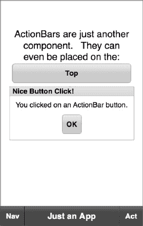
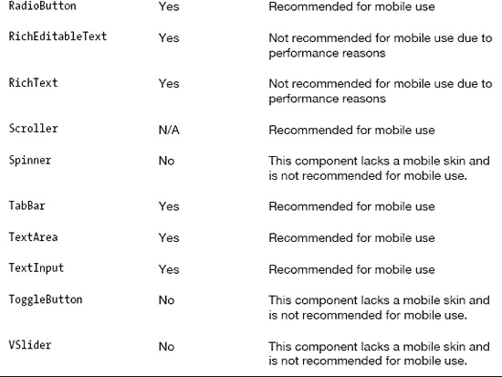
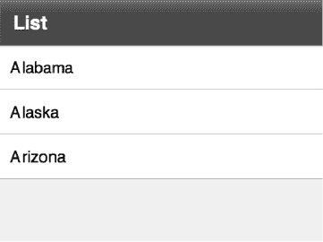
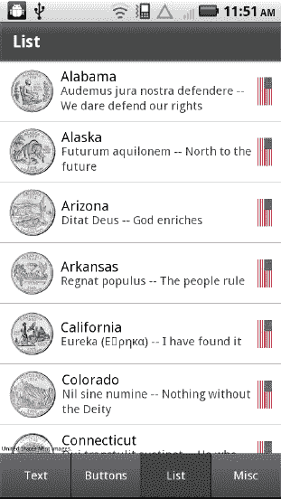

# 三、为 Android 构建 Flash 和 Flex 应用

第一章和第二章介绍了如何使用 Flash 和 Flex 作为创建移动应用的平台。现在，您已经了解了选择 Flash 平台的原因，以及为使用触摸手势作为主要用户输入形式的各种屏幕设备编写应用时需要考虑的一些事项。下一步是着手编写自己的应用。在本章结束时，您将知道如何在各种类型的 Flex 应用之间做出选择，如何编写自己的`View`以及如何使用 Flex SDK 中的移动就绪控件为这些`View`提供丰富的内容。

简而言之，是时候向您展示将您的应用想法变为现实所需的一切了！

### 用 Flex 构建移动用户界面

由于其便利性和开发人员生产力特性，MXML 是定义 Flex 移动应用主用户界面的首选方式。然而，MXML 的便利性是以性能为代价的。因此，有些任务，比如`List`项目渲染器，最好在纯 ActionScript 中完成。我们将在第十章中更深入地讨论这个特殊的话题。

由于屏幕尺寸较小，大多数移动应用被分成多个`View`应用。因此，大多数 Android 应用的 AIR 都是用`ViewNavigatorApplication`或`TabbedViewNavigatorApplication`构建的也就不足为奇了。这些应用容器负责初始化和连接所有与应用`View`相关的东西。这包括一个或多个以下组件:

*   `ViewNavigator`:这个类处理将一组`View`链接在一起，来回传递数据，并在`View`之间转换。`ViewNavigator`还拥有应用的`ActionBar`，它显示当前`View`的标题、可选的动作控件(通常是按钮)和可选的导航控件(通常是 Home 或 back 按钮)。
*   这些 Flex 组件提供了应用的大部分实际接口。每个`View`都有一个对其`ViewNavigator`和`ActionBar`的引用。每个`View`可以用自己的内容填充`ActionBar`，甚至完全隐藏它。`View` s 根据用户交互使用`ViewNavigator`触发其他`View` s 的显示。

图 3–1 显示了纵向和横向手机的基本构造`ViewNavigatorApplication`。源代码可以在位于本书示例代码的`chapter-03`目录中的 ViewAppAnatomy 示例项目中找到。

**图 3–1。** *屈曲移动的基本解剖`ViewNavigatorApplication`*

在图 3–1 中，应用的`ActionBar`在屏幕顶部伸展。由三个区域组成:导航区域、标题区域和动作区域。图 3–1 中的`ActionBar`在`ActionBar`导航区域包含一个标记为 Nav 的按钮，而标题区域显示的是“`ActionBar`字符串。`ActionBar`的操作区包含两个标记为 A1 和 A2 的按钮。`View`的内容区域由`ActionBar`下方的屏幕其余部分组成。请记住，尽管`View`使用`ActionBar`来显示它的标题和控件，但这两者在组件层次结构中是兄弟。除非`ViewNavigator`的`overlayControls`属性设置为`true`，否则`View`的`width`和`height`不包括`ActionBar`所占的面积。如果`overlayControls`设置为`true`，那么`ActionBar`以及`TabbedViewNavigatorApplication`的标签栏将部分透明，这样它们下面的任何`View`内容都是可见的。

作为这种基于`View`的应用结构的替代方案，您也可以从一个普通的`Application` MXML 文件开始创建一个完全定制的界面，就像您对基于 web 或基于桌面的应用所做的那样。

如果您使用的是 Flash Builder 4.5，您可以单击应用的文件菜单并选择新建 Flex 移动项目。在你命名你的新项目并点击 Next 按钮后，你可以选择从一个普通的旧`Application`、一个`ViewNavigatorApplication`或者一个`TabbedViewNavigatorApplication`开始。我们将在接下来的几节中研究这三种选择之间的区别。

#### 查看导航应用

`ViewNavigatorApplication`创建一个单一的`ViewNavigator`来管理整个移动应用的`View`之间的转换。应用容器还有一个`firstView`属性，该属性决定应用启动时将显示哪个`View`组件。清单 3–1 显示了一个非常基本的`ViewNavigatorApplication`的代码。这段代码来自本书示例代码的`examples/chapter-03`目录中的 HelloView 示例项目。

**清单 3–1。** *一个简单的开始:你的第一个 Flex 移动`ViewNavigatorApplication`*

`**<!-- HelloView.mxml - the application container -->**
<?xml version="1.0" encoding="utf-8"?>
<s:ViewNavigatorApplication xmlns:fx="http://ns.adobe.com/mxml/2009"
                            xmlns:s="library://ns.adobe.com/flex/spark"
                            splashScreenImage="@Embed('assets/splash.png')"
                            firstView="views.FirstView">
</s:ViewNavigatorApplication>

**<!-- FirstView.mxml - one of the application container's View components -->**
<?xml version="1.0" encoding="utf-8"?>
<s:View xmlns:fx="http://ns.adobe.com/mxml/2009"
        xmlns:s="library://ns.adobe.com/flex/spark"
        title="Hello World">

  <s:VGroup width="100%" horizontalAlign="center" gap="20" top="20" left="10"
            right="10">
    <s:Label text="This is a ViewNavigatorApplication." width="100%"
             textAlign="center"/>
    <s:Button label="Next View" click="navigator.pushView(SecondView)"/>
  </s:VGroup>
</s:View>

**<!-- SecondView.mxml - the application's other View component -->**
<?xml version="1.0" encoding="utf-8"?>
<s:View xmlns:fx="http://ns.adobe.com/mxml/2009"
        xmlns:s="library://ns.adobe.com/flex/spark"
        title="Hello Again">` `  <s:Label text="Press the back button to return to the first view." top="20"
                    left="10" right="10"/>
</s:View>`

太神奇了！在大约 20 行代码中，我们有了一个全功能的移动应用，它有多个`View`和它们之间的动画转换。这就是为什么 Flex 是移动开发的一个令人信服的选择。Adobe 的团队让您可以轻松快速地开始开发 Android 移动应用。

使用 XML 属性将`ViewNavigatorApplication`容器的`firstView`属性设置为`views.FirstView`。创建项目时，Flash Builder 会在应用的默认包下创建一个*视图*包。所以`views.FirstView`是`FirstView.mxml`文件的全限定路径名。此外，我们已经在我们的`ViewNavigatorApplication`上指定了一个`splashScreenImage`属性。这通常是一个好主意，因为移动应用有时需要一段时间才能启动。`@Embed`指令将这个图像嵌入到应用中，这样它就可以在启动时显示。

在清单 3–1 中的应用容器的正下方显示了`FirstView`的源代码。文件中的根组件是一个 Spark `View`组件。`<s:View>`标签的`title`属性指定了当`View`被激活时将在`ActionBar`中显示的字符串。像任何 MXML 文件一样，`View`标签的子元素指定了构成`View`用户界面的各种 Spark 组件。在这种情况下，我们有一个火花`Label`和`Button`布置在一个垂直组或`VGroup`内。

注意，`Button`的`click`事件处理程序调用了`navigator`对象的`pushView`函数，这是`View`对应用的`ViewNavigator`实例的引用。这个方法的第一个参数是应该显示的`View`的类名。在这种情况下，我们告诉`navigator`接下来显示`SecondView`。而`SecondView`则只是简单的指示用户使用 Android 内置的“返回”按钮返回到`FirstView`。在`SecondView`的代码中没有对`navigator`对象进行显式调用。这是可能的，因为`ViewNavigator`自动添加一个监听器到 Android 的后退按钮。由于`ViewNavigator`还维护一个已经显示的`View`的堆栈，它可以从堆栈中弹出最近的`View`并返回到前一个`View`以响应“后退”按钮的按下，而无需应用开发人员编写任何额外的代码。第一个 Hello World 应用在图 3–2 中运行。

**图 3–2。** *一个简单的`ViewNavigatorApplication` Hello World 节目*

#### 视图生命中的重要事件

事件是任何 Flex 和 Flash 应用的生命线。它们不仅允许您对应用中正在发生的事情做出反应，而且知道事件到达的顺序也很重要，这样您就可以选择适当的处理程序来放置程序逻辑。图 3–3 显示了在三个应用阶段接收一些更重要事件的顺序:启动、关闭和从一个`View`到另一个`View`的转换。图中代表应用容器接收到的事件的方框是深色的，而`View` s 接收到的事件是浅色的。

**图 3–3。** *应用及其`View`接收重要事件的顺序*

在创建第一个`View`之前，应用接收到了`initialize`事件。因此，我们知道如果您需要以编程方式而不是作为 XML 属性中的简单字符串来设置`ViewNavigatorApplication`的`firstView`和`firstViewData`属性，那么`initialize`处理程序是一个很好的地方。一个方便的例子是，当您在关机期间保存数据，并希望在下次启动时读回数据并恢复应用的`View`状态。

在应用接收到`initialize`事件后，第一个`View`将接收到它的`initialize`、`creationComplete`和`viewActivate`事件。当设置你的`View` s 时，记住这个顺序是很重要的。如果你需要在你的控件上编程设置一些初始状态，如果可能的话，最好在`initialize`处理程序中完成。如果您一直等到调用`creationComplete`处理程序，那么控件实际上被初始化了两次。这可能不会造成明显的延迟，但在为移动平台开发时，意识到性能问题总是值得的。同样，`viewActivate`事件将是你在`View`启动序列中发表意见的最后机会。

一旦第一个`View`完成其初始启动序列，应用将接收其`creationComplete`和`activate`事件。那么第一个`View`也会收到最后一个`activate`事件。只有应用的第一个`View`会收到`activate`事件。只有当应用运行时第一个创建的是`View`时，该事件处理程序才是您想要运行的代码的合适位置。

在一个`View`转换序列中，新的`View`将在旧的`View`接收其`viewDeactivate`事件之前接收其`initialize`和`creationComplete`事件。尽管旧的`View`仍然有效，但是您应该避免`View`之间的相互依赖。任何需要从一个`View`传递到下一个`View`的数据都可以使用新的`View`的`data`参数来传递。我们将在本章的后面向您展示如何做到这一点。`View`转换序列的最后一步是新的`View`接收其`viewActivate`事件。关于这个序列需要记住的重要事情是，在`ViewNavigator`播放到新`View`的动画过渡之前，新`View`将接收到`initialize`和`creationComplete`事件。`viewActivate`事件将在过渡播放后接收。如果你想让新的`View`控件在转场播放时处于某个特定状态——并且它们对用户可见——你需要使用`initialize`或`creationComplete`事件。同样，`initialize`是首选，这样控件就不会被初始化两次。另一方面，在过渡播放之前做大量的处理将导致用户输入和`View`过渡开始之间的明显滞后，这将导致您的界面感觉迟钝。因此，尽可能将处理延迟到`viewActivate`事件是一个好主意。

当应用关闭时，应用容器将接收到`deactivate`事件，随后是`View`堆栈中的每个`View`。如果一个`View`被实例化多次，它将接收多个`deactivate`事件，每个实例一个。在移动环境中，关闭并不总是意味着应用从内存中删除。例如，在 Android 中，当一个应用正在运行时按下“home”按钮将导致该应用接收其停用事件。但是应用还没有退出；它只是在后台运行。如果您真的希望您的应用在停用时退出，您可以从应用容器的`deactivate`处理程序中调用`NativeApplication`类中的`exit`函数，如清单 3–2 所示。

**清单 3–2。** *使移动应用在停用时完全退出*

`<?xml version="1.0" encoding="utf-8"?>
<s:ViewNavigatorApplication xmlns:fx="http://ns.adobe.com/mxml/2009"
                            xmlns:s="library://ns.adobe.com/flex/spark"
                            deactivate="onDeactivate()"
                            firstView="views.FirstView">
  <fx:Script>
    <![CDATA[
      privatefunction onDeactivate():void {
        NativeApplication.nativeApplication.exit();
      }
    ]]>
  </fx:Script>
</s:ViewNavigatorApplication>`

#### 选项卡式视图导航应用

一个`TabbedViewNavigatorApplication`允许你划分你的应用，这样每一组与特定应用功能相关的`View`就有了自己的标签。例如，股票投资组合应用可能有一个选项卡，允许您查看您的投资组合，其中一个`View`显示您拥有的所有股票，另一个详细的 `View`允许您详细检查某一特定股票。另一个标签可能会显示市场新闻，其中的`View`会列出新闻，而另一个标签会让你查看单个新闻。最后，您可能会有一个帐户选项卡，让您管理您的帐户设置。

在这个场景中，每个选项卡都有自己的`ViewNavigator`，负责管理与该选项卡相关联的`View`。您在应用容器的 MXML 文件中定义这些`ViewNavigator`，如清单 3–3 所示。

**清单 3–3。** *宣告一个`TabbedViewNavigatorApplication`*

`<?xml version="1.0" encoding="utf-8"?>
<s:TabbedViewNavigatorApplication xmlns:fx="http://ns.adobe.com/mxml/2009"
                                  xmlns:s="library://ns.adobe.com/flex/spark">

  <s:ViewNavigator label="Hello" width="100%" height="100%"
                   icon="@Embed('assets/smiley.png')"
                   firstView="views.HelloView"/>

<s:ViewNavigator label="World" width="100%" height="100%"
                   icon="@Embed('assets/globe.png')"
                   firstView="views.WorldView"/>

</s:TabbedViewNavigatorApplication>`

您可以将您的`ViewNavigator`声明包含在一个`<s:navigators>`标记中，但是这是不必要的，因为`navigators`属性是`TabbedViewNavigatorApplication`的默认属性。这允许我们将我们的`ViewNavigator`声明为`TabbedViewNavigatorApplication`的直接子元素。`ViewNavigator` s 的`width`和`height`设置为 100%。如果您想要正确调整`View`的大小，这是必需的。否则，它们将只有容纳其内容所需的大小。一个`ActionBar`只延伸到屏幕顶部的一部分，看起来有点奇怪！图标的大小也很关键。选项卡组件不会尝试调整图像的大小。如果它太大，你的标签会占据整个屏幕。虽然在这个简单的例子中我们没有这样做，但是在实际的应用中，你会希望使用一个`MultiDPIBitmapSource`来定义你的标签图标，这样它们在所有的设备屏幕上都很好看。

与常规`ViewNavigatorApplication`的另一个区别是`firstView`属性是在`ViewNavigator`上定义的，而不是在`TabbedViewNavigatorApplication`中定义的。这是有意义的，因为每个`ViewNavigator`管理自己的一组`View`。在 MXML 文件中声明的第一个`ViewNavigator`是应用启动时默认激活的。清单 3–4 显示了组成该应用 Hello 选项卡的两个`View`的 MXML，即`HelloView`和`LanguageView`。

**清单 3–4。** *我们的`TabbedViewNavigatorApplication`* 中 Hello 页签的两个视图

`<!-- HelloView.mxml -->
<?xml version="1.0" encoding="utf-8"?>
<s:View xmlns:fx="http://ns.adobe.com/mxml/2009"
        xmlns:s="library://ns.adobe.com/flex/spark"
        initialize="onInitialize()"
        title="Hello" >
  <fx:Script>` `     <![CDATA[
       import spark.events.IndexChangeEvent;

       privatefunction onChange(event:IndexChangeEvent):void {
         data.selectedIndex = event.newIndex;
         navigator.pushView(LanguageView, listData.getItemAt(event.newIndex));
       }

       /**
        * Initializes the data object if it does not exist. If it does,
        * then restore the selected list index that was persisted.
*/
       privatefunction onInitialize():void {
         if (data == null) {
           data = {selectedIndex: -1};
         }

         helloList.selectedIndex = data.selectedIndex;
      }
    ]]>
  </fx:Script>

  <s:List id="helloList" width="100%" height="100%" labelField="hello"
          change="onChange(event)">
    <s:ArrayCollection id="listData">
      <fx:Object hello="Hello" lang="English"/>
      <fx:Object hello="Hola" lang="Spanish"/>
      <fx:Object hello="nuqneH" lang="Klingon"/>
      <!-- and a bunch of others… -->
    </s:ArrayCollection>
  </s:List>
</s:View>

<!-- LanguageView.mxml -->
<?xml version="1.0" encoding="utf-8"?>
<s:View xmlns:fx="http://ns.adobe.com/mxml/2009"
        xmlns:s="library://ns.adobe.com/flex/spark"
        initialize="onInitialize()"
        title="Language">

<fx:Script>
    <![CDATA[
      privatefunction onInitialize():void {
        hello.text = data.hello;
        lang.text = "("+data.lang+")";
      }
    ]]>
  </fx:Script>

  <s:VGroup horizontalAlign="center" width="100%" paddingTop="20">
    <s:Label id="hello" fontSize="36"/>
    <s:Label id="lang" fontSize="36"/>
  </s:VGroup>
</s:View>`

`HelloView`用两个属性定义了对象的静态`ArrayCollection`:一个`hello`属性包含用某种特定语言写的单词“Hello ”,另一个`lang`属性指定该语言是什么。这个`ArrayCollection`然后被用作`View`中显示的火花`List`的`dataProvider`。关于这个`View`要注意的第一件事是，当显示其他`View`时，它使用它的`data`属性为自己保存数据。这在`onInitialize`功能中完成。如果`View`的`data`对象为空，换句话说，如果这是第一次初始化`View`，那么使用 ActionScript 的对象文字符号创建一个新的`data`对象。否则，现有的`data`对象——在其他`View`显示时保持不变——用于检索之前在`List`中选择的项目的索引，并在`View`重新激活时重新选择它。

`HelloView`源代码还演示了如何将数据传递给另一个`View`，正如在`List`的`onChange`处理程序中所做的那样。当用户在`HelloView`的`List`中选择一个项目时，`onChange`处理程序会首先将`IndexChangeEvent`的`newIndex`属性保存在自己的`data`对象中，这样在下次激活`View`时可以恢复`List`选择。然后，处理函数使用同一个`newIndex`属性从`ArrayCollection`中获取对所选对象的引用。它将对象作为`ViewNavigator`的`pushView`函数的第二个参数传递给`LanguageView`的`data`属性。在清单 3–4 的底部，您可以看到`LanguageView`的代码用两个`Label`组件向用户显示了`data`对象的`hello`和`lang`属性，这两个组件的`text`属性被绑定到`data`对象的属性。

图 3–4 显示了在 Hello TabbedView 示例应用中运行的 Hello 选项卡的这两个`View`。这个项目的源代码可以在本书示例代码的`examples/chapter-03`目录中找到。

**图 3–4。***Hello World`TabbedViewNavigatorApplication`*的 Hello 标签下的`View`

那关于世界选项卡呢？世界标签包含一个`View`，它的名字很有创意，叫做`WorldView`。不直观地说，它不包含地球的图片。相反，它展示了基于 GUI 的 Hello World 程序的另一个主要部分:问候消息。图 3–5 展示了这种`View`的作用。

**图 3–5。***Hello World`TabbedViewNavigatorApplication`*的 World 标签下的`View`

这个特定实现的独特之处在于，它演示了`ActionBar`可以包含任何种类的 Spark 控件，而不仅仅是按钮。清单 3–5 展示了这是如何实现的。

**清单 3–5。** *一个问候消息的简单实现*

`<?xml version="1.0" encoding="utf-8"?>
<s:View xmlns:fx="http://ns.adobe.com/mxml/2009"
        xmlns:s="library://ns.adobe.com/flex/spark">
  <fx:Script>
    <![CDATA[
      import spark.events.TextOperationEvent;

      privatefunction onChange(event:TextOperationEvent):void {
        viewLabel.text = "Hello, "+textInput.text;
      }
    ]]>
  </fx:Script>

  <s:titleContent>
    <s:TextInput id="textInput" prompt="Enter your name..." width="100%"
                 change="onChange(event)"/>
  </s:titleContent>

  <s:VGroup horizontalAlign="center" width="100%" paddingTop="20">
    <s:Label id="viewLabel" text="Hello, World" fontSize="44"/>
  </s:VGroup>
</s:View>`

通常显示`View`标题字符串的`View`的`titleContent`，已经被一个 Spark `TextInput`控件取代。`TextInput`的`change`处理程序只是复制已经输入到`Label`的`text`属性中的字符。这是一个很好的例子，说明了定制`ActionBar`的灵活性。

#### 只是一个应用

创建新的 Flex mobile 项目的第三个选项是从空白应用开始。如果您正在处理一个独特的移动应用，它的界面不使用多“视图”的典型模式，那么您可以选择这个选项。如果您正在处理一个只有一个`View`的应用，因此您不需要`ViewNavigator`和它带来的所有东西，那么您也可以利用这个选项。当您选择从一个空白的应用开始时，您将得到的正是这个，如清单 3–6 所示。

**清单 3–6。** *一个空白的手机应用*

`<?xml version="1.0" encoding="utf-8"?>
<s:Application xmlns:fx="http://ns.adobe.com/mxml/2009"
               xmlns:s="library://ns.adobe.com/flex/spark">
  <fx:Declarations>
    <!-- Place non-visual elements (e.g., services, value objects) here -->
  </fx:Declarations>
</s:Application>`

然而，您从一个空白应用开始并不意味着您不能利用 Flex 4.5 中包含的特定于移动设备的控件。举个例子，你正在开发一个只有一个屏幕的应用。为一个屏幕设置一个完整的基于`View`的系统是不值得的。但是这并不意味着你不能使用一个`ActionBar`来让你的应用看起来更像一个传统的移动应用！清单 3–7 展示了一个应用，它最初是一个空白的应用，现在看起来像任何其他 Flex 移动应用。

**清单 3–7。** *一款没有`ViewNavigator`的 Flex 移动应用*

`<?xml version="1.0" encoding="utf-8"?>
<s:Application xmlns:fx="http://ns.adobe.com/mxml/2009"
               xmlns:s="library://ns.adobe.com/flex/spark">
  <fx:Declarations>
    <s:SkinnablePopUpContainer id="myAlert" x="{(width-myAlert.width)/2}"
                               y="{(height-myAlert.height)/2}">
      <s:Panel title="Nice Button Click!">
        <s:VGroup horizontalAlign="center" paddingTop="20" paddingBottom="20"
                  paddingLeft="20" paddingRight="20" gap="20" width="100%">
            <s:Label text="You clicked on an ActionBar button."/>
            <s:Button label="OK" click="myAlert.close()"/>
          </s:VGroup>
        </s:Panel>
      </s:SkinnablePopUpContainer>
    </fx:Declarations>` 
`  <s:ActionBar id="ab" left="0" right="0" top="0" title="Just an App"
               titleAlign="center">
    <s:navigationContent>
      <s:Button label="Nav" click="myAlert.open(this, true)"/>
    </s:navigationContent>
    <s:actionContent>
      <s:Button label="Act" click="myAlert.open(this, true)"/>
    </s:actionContent>
  </s:ActionBar>

  <s:VGroup top="100" horizontalCenter="0" horizontalAlign="contentJustify">
    <s:Label text="ActionBars are just another component.  
They can even be placed on the:"
             width="400" fontSize="32" textAlign="center"/>
    <s:Button label="Top" click="ab.top=0;ab.bottom=null;ab.left=0;ab.right=0"/>
    <s:Label text="or" fontSize="32" textAlign="center"/>
    <s:Button label="Bottom" click="ab.top=null;ab.bottom=0;ab.left=0;ab.right=0"/>
  </s:VGroup>

</s:Application>`

这个应用声明了它自己的`ActionBar`，就像它声明任何其他组件一样。事实上，该应用允许您将`ActionBar`放在屏幕的顶部或底部。在这个清单中定义的`ActionBar`在其`navigationContent`和`actionContent`中也包含显示弹出容器的按钮。`SkinnablePopupContainer`是可用于移动应用的新型火花控制器之一。Android 界面的一个常见设计模式是，长时间点击组件可以显示一个弹出容器，允许用户选择更多选项。`SkinnablePopupContainer`是如何在 Flex 移动应用中实现这种模式。我们将在本章后面更详细地介绍 Android 设计模式和 Flex 移动组件。Figure 3–6 显示了该应用运行时，底部的`ActionBar`和弹出容器是可见的。

不过，要明确的是，`ActionBar` s 属于屏幕的顶部；不要在家里尝试，我们是专业人士！在前面的例子中，我们已经多次提到了`ViewNavigator`、`View`和`ActionBar`。在下一节中，我们将更深入地探讨移动 Flex 应用的这些主要部分。

**图 3–6。** *一个带有`ActionBar`组件和一个可见弹出容器的应用*

#### 视图导航器和视图

`ViewNavigator`是一个可设置皮肤的容器，它保存了一堆`View`对象，其中在任何给定的时间，只有栈顶的`View`是可见的和活动的。将新的`View`压入堆栈会自动播放动画过渡并显示新的`View`。要返回到前一个`View`，应用只需将顶部的`View`弹出堆栈。

`ViewNavigator`还显示一个`ActionBar`，它显示由激活的`View`定义的上下文信息。每当显示新的`View`时，`ViewNavigator`自动更新`ActionBar`。`ViewNavigator`类中主要感兴趣的方法如下:

*   `pushView`:推一个新的`View`到堆栈上，自动使其在屏幕上可见；这个函数的第一个参数是要显示的`View`的类。该方法还有另外三个可选参数:一个将被传递给新的`View`的`data`对象，一个由`ViewNavigator`存储并可由新的`View`读取的`context`对象，以及一个在`View`之间播放的`transition`。我们将在本章的后面详细介绍这三个可选参数。
*   `popView`:从堆栈中删除当前`View`，显示前一个`View`；该函数有一个可选参数:在`View`之间播放的`transition`
*   `popToFirstView`:从堆栈中移除所有的`View`，除了第一个，然后第一个变成可见的`View`；该函数也接受一个`transition`参数。
*   `popAll`:从堆栈中删除所有`View`并显示一个空白屏幕；`transition`参数也是可选的。
*   `hideActionBar` / `showActionBar`:隐藏或显示`ActionBar`；一些移动应用可以通过点击`ActionBar`中的控件来选择全屏显示。在全屏模式下，轻击屏幕会再次显示`ActionBar`。这些方法可用于在您的 Flex 应用中实现这样的系统。默认情况下，`ActionBar`的隐藏和显示是动态的，但是您可以向这些函数传递一个`Boolean`参数来关闭它。

`ViewNavigator`将自动处理 Android 后退按钮的按压，并代表应用调用`popView`。`ActionBar`、`View`和`ViewNavigator`类都合作为移动开发者提供了许多这样的特性。本节的其余部分将探讨这些类如何协同工作，为您提供一个高效、灵活、健壮的框架来开发您的移动应用。

##### 动作栏

在移动应用中，`ActionBar`是`View`标题和控件的传统位置。`ActionBar`有三个不同的区域:导航区域、标题区域和动作区域。回头参考图 3–1 中显示这些区域的示例。这三个区域都可以包含任意控件，但是默认情况下，标题区域将显示一个标题字符串。尽管标题区域也可以显示任意的控件，但是如果给了它可显示的替代内容，它就不会显示标题字符串。

每个`ViewNavigator`都有一个由导航器实例化的`View`共享的`ActionBar`控件。因此，一个`ViewNavigatorApplication`对于整个应用将只有一个`ActionBar`，而一个`TabbedViewNavigatorApplication`对于应用中的每个`ViewNavigator`将有一个单独的`ActionBar`。`ActionBar`有七个属性决定了它的内容和布局。

*   `actionContent`:决定在`ActionBar`的动作区域(标题的右边)显示什么的控件数组
*   `actionLayout`:Spark 布局，允许由`actionContent`数组指定的控件的自定义布局
*   `navigationContent`:一个控件数组，决定在`ActionBar`的导航区域(标题的左边)显示什么
*   `navigationLayout`:Spark 布局，允许由`navigationContent`数组指定的控件的自定义布局
*   `title`:如果`titleContent`为空，将在标题区显示的字符串
*   `titleContent`:决定在`ActionBar`的标题区域(`ActionBar`的中心)显示什么的控件数组
*   `titleLayout`:Spark 布局，允许由`actionContent`数组指定的控件的自定义布局

这七个属性在`ViewNavigatorApplication`、`ViewNavigator`和`View`类中被复制。如果您在`ViewNavigatorApplication`中为这些属性赋值，您实际上是为整个应用定义了`ActionBar`的默认外观。在`ViewNavigator`中定义这些属性作为所有`View`的默认属性，这些属性将由`ViewNavigator`显示。在`TabbedViewNavigatorApplication` s 中，这是指定默认`ActionBar`设置的唯一方式——每个`ViewNavigator`一次。当显示一个新的`View`时，它的`ViewNavigator`将用那个`View`的`ActionBar`相关属性更新`ActionBar`，从而覆盖应用或导航器指定的任何默认值。此外，`View` s 还有一个额外的属性，`actionBarVisible`，它决定了在显示`View`时，是否应该显示`ActionBar`。

我们已经展示了在导航和操作区域显示控件的示例应用，以及用`TextField`替换标题内容的应用，所以在本节中我们不再重复这些示例。您可能会发现有用的另外一条信息是影响`ActionBar`外观的两种特殊样式的使用。`titleAlign`风格允许您将标题字符串的对齐方式设置为`left`、`right`或`center`。`defaultButtonAppearance`风格可以设置为`normal`或`beveled`。在 Android 上，这些默认为左对齐的标题和正常的按钮外观。您可以根据应用的需要更改它们，或者如果您计划将应用移植到 iOS 平台，也可能需要更改它们。在这种情况下，iOS 上的通常会有倾斜的按钮和居中的标题。图 3–7 显示了这种情况。

**图 3–7。** *一个机器人`ActionBar`穿着 iPhone 去约会*

将斜面样式应用到`defaultButtonAppearance`甚至为导航内容中的按钮添加了传统的 iOS 箭头形状。微小的触动会让一切变得不同。清单 3–8 显示了创建图 3–7 的`ActionBar`外观的代码。

**清单 3–8。** *一个 iOS 风格的`ActionBar`，有格调！*

`<?xml version="1.0" encoding="utf-8"?>
<s:ViewNavigatorApplication xmlns:fx="http://ns.adobe.com/mxml/2009"
                            xmlns:s="library://ns.adobe.com/flex/spark"
                            firstView="views.MainHomeView">
  <fx:Style>
    @namespace s "library://ns.adobe.com/flex/spark";
    s|ActionBar {
      titleAlign: "center";
      defaultButtonAppearance: "beveled";
      chromeColor: "0x7893AB"
    }
  </fx:Style>

  <s:navigationContent>
    <s:Button label="Back"/>
  </s:navigationContent>
</s:ViewNavigatorApplication>`

我们已经利用了在 MXML 文件中直接为`ViewNavigatorApplication`定义`navigationContent`的能力。由于这种布局，后退按钮会出现在整个应用的每个`View`上。除了`titleAlign`和`defaultButtonAppearance`样式，我们还为`ActionBar`定义了自定义颜色。`ActionBar`将使用`chromeColor`样式作为填充`ActionBar`背景的渐变的基础。为`ActionBar`定义一个定制`chromeColor`是定制一个移动应用以实现品牌或独特性的常见方式。

##### 动画视图过渡

`View`过渡控制一个`View`替换另一个`View`时播放的动画。当按下一个新的`View`时，默认的过渡是向左一个`SlideViewTransition`，而弹出一个`View`会向右一个`SlideViewTransition`。这两种默认转换都使用其`push`模式。然而，您可以用无数不同的方式定制`View`过渡动画。Table 3–1 显示了转换及其模式和方向。

当你在组合中加入不同的 easers 时，你真的有大量的组合可以玩。例如，`uncover`模式中的`SlideViewTransition`和向下方向看起来像当前的`View`正在向下滑动离开屏幕，以显示位于其下方的新的`View`。再放一个`Bounce`画架，顶部的`View`会滑下来，碰到屏幕底部会反弹。您甚至可以通过扩展`ViewTransitionBase`类来编写自己的自定义过渡，通过实现`IEaser`接口来编写自己的 easers。你真的只是被你的想象力所限制！

您可以通过将您的转换作为第四个参数传递给`pushView`或`replaceView`函数来指定`ViewNavigator`将使用的转换。`ViewNavigator`的`popView`、`popAll`和`popToFirstView`也采用单个可选参数，指定在更改`View` s 时播放哪个过渡。啊，但是如果用户按下 Android 的后退按钮呢？在这种情况下，我们不能显式地调用`pop`函数，所以相反，您必须将`ViewNavigator`的`defaultPopTransition`属性设置为您希望它默认播放的过渡。如果您没有为`pop`函数指定过渡参数或设置`defaultPopTransition`属性，则`ViewNavigator`将在弹出`View`时播放其默认的幻灯片过渡。即使您使用自定义过渡来推动`View`，当`View`弹出时，`ViewNavigator`也不会尝试反向播放推动过渡。还需要注意的是`ViewNavigator`有对应的`defaultPushTransition`。您可以使用这两个属性为特定的`ViewNavigator`播放的所有过渡设置默认值。

现在唯一合理且有趣的事情是编写一个应用来尝试这些转换组合，对吗？没错。清单 3–9 显示了 ViewTransitions 示例程序的`TransitionListView`的代码。这个`View`显示了所有内置`View`过渡的`List`，每个过渡都显示了一些不同的模式、方向和画师的组合。ViewTransitions 项目可以在本书第三章的示例代码中找到。

**清单 3–9。** *展示了几个不同品种的每一个`View`跃迁*

`<?xml version="1.0" encoding="utf-8"?>
<s:View xmlns:fx="http://ns.adobe.com/mxml/2009"
        xmlns:s="library://ns.adobe.com/flex/spark"
        title="Home">
  <fx:Declarations>
    <s:Bounce id="bounce"/>
    <s:SlideViewTransition id="slide"/>
    <s:SlideViewTransition id="slideBounce" easer="{bounce}" duration="1000"/>
    <s:SlideViewTransition id="slideCover" mode="cover"/>
    <s:SlideViewTransition id="slideUncover" mode="uncover"/>
    <s:SlideViewTransition id="uncoverBounce" mode="uncover" easer="{bounce}"
                           direction="down" duration="1000"/>
    <s:FlipViewTransition id="flip"/>
    <s:FlipViewTransition id="flipBounce" easer="{bounce}" duration="1000"/>
    <s:FlipViewTransition id="flipCube" mode="cube"/>
    <s:CrossFadeViewTransition id="fade"/>
    <s:ZoomViewTransition id="zoom"/>
    <s:ZoomViewTransition id="zoomBounce" easer="{bounce}" duration="1000"/>
    <s:ZoomViewTransition id="zoomIn" mode="in"/>` `    <s:ZoomViewTransition id="zoomInBounce" mode="in" easer="{bounce}"
                          duration="1000"/>
  </fx:Declarations>

  <fx:Script>
    <![CDATA[
      import spark.events.IndexChangeEvent;
      import spark.transitions.ViewTransitionBase;

      privatefunction onChange(event:IndexChangeEvent):void {
        var selectedItem:Object = transitionList.selectedItem;
        var transition:ViewTransitionBase = selectedItem.transition;
        var data:Object = {name: selectedItem.name};

        navigator.defaultPopTransition = transition;
        navigator.pushView(TransitionedView, data, null, transition);
      }

    ]]>
  </fx:Script>

  <s:navigationContent/>

  <s:List id="transitionList" width="100%" height="100%" labelField="name"
          change="onChange(event)">
    <s:ArrayCollection>
      <fx:Object name="Default - Push Slide" transition="{slide}"/>
      <fx:Object name="Push Slide with Bounce" transition="{slideBounce}"/>
      <fx:Object name="Cover Slide" transition="{slideCover}"/>
      <fx:Object name="Uncover Slide" transition="{slideUncover}"/>
      <fx:Object name="Uncover Slide with Bounce" transition="{uncoverBounce}"/>
      <fx:Object name="Flip" transition="{flip}"/>
      <fx:Object name="Flip with Bounce" transition="{flipBounce}"/>
      <fx:Object name="Cube Flip" transition="{flipCube}"/>
      <fx:Object name="Fade" transition="{fade}"/>
      <fx:Object name="Zoom Out" transition="{zoom}"/>
      <fx:Object name="Zoom Out with Bounce" transition="{zoomBounce}"/>
      <fx:Object name="Zoom In" transition="{zoomIn}"/>
      <fx:Object name="Zoom In with Bounce" transition="{zoomInBounce}"/>
    </s:ArrayCollection>
  </s:List>
</s:View>`

`<fx:Declarations>`部分用于声明一个`Bounce`更容易和各种不同的过渡。一些过渡使用它们的默认设置，而另一些则指定特殊的模式或方向。几个转换也使用`duration`属性来指定转换需要的总毫秒数。内置转换的默认持续时间范围是 300 到 400 毫秒。这对于一个有效的弹跳动画来说有点太快了，所以那些使用`Bounce` easer 的过渡有更长的持续时间。

当从`List`中选择一个过渡时，`onChange`处理函数检索所选对象，并将过渡的名称传递给下一个`View`的`data.name`属性。包含在`List`中的对象也保留了对所需过渡的引用。所以这个转换属性作为第四个参数传递给导航器的 `pushView`方法。但是请注意，这个转换也用于在调用`pushView`之前设置导航器的`defaultPopTransition`属性。这将确保如果在推送过程中播放了一个`FlipViewTransition`，当返回到`TransitionListView`时将播放相同的过渡。这有一点欺骗，因为当你通常想要在特定的一对`View`的推和弹出上播放相同类型的过渡时，你通常会颠倒弹出过渡的方向。这在常规应用中很容易实现，但在这种情况下，不值得在示例代码中为每个当前转换对象定义一个相反方向的转换。图 3–8 显示了在立方体模式下`FlipViewTransition`期间捕获的 ViewTransitions 示例程序。

**图 3–8。** *使用立方体翻转过渡从一个`View`到下一个*

如果您在 ViewTransitions 示例程序运行时仔细观察`ActionBar`，或者如果您检查图 3–8 中的中间图像，您将会注意到`ActionBar`没有随着`View`进行转换。这是因为`ActionBar`被认为属于整个应用——或者整个选项卡——而不仅仅是一个`View`。但是有些时候，如果`ActionBar`参与进来，这种转变看起来会更好。在这些情况下，您可以将`View`转换类的`transitionControlsWithContent`属性设置为`true`。因此，如果我们如下更改示例应用中的立方体翻转声明，我们就可以获得如图 Figure 3–9 所示的效果。

`<s:FlipViewTransition id="flipCube" mode="cube"
           transitionControlsWithContent="true"/>` 

**图 3-9。** *在立方体翻转过渡上用`View`过渡`ActionBar`*

##### 查看菜单

所有 Android 设备都有一个内置的菜单按钮，可以显示屏幕菜单。AIR 通过`ViewMenu`和`ViewMenuItem`类支持这一功能。`ViewMenu`充当一个`ViewMenuItem` s 单级的容器；不支持子菜单。应用中的每个`View`都可以定义自己的`ViewMenu`。清单 3–10 展示了如何为`View`声明一个`ViewMenu`。

**清单 3–10。** *宣告一个`ViewMenu`*

`<?xml version="1.0" encoding="utf-8"?>
<s:View xmlns:fx="http://ns.adobe.com/mxml/2009"
        xmlns:s="library://ns.adobe.com/flex/spark"
        title="MenuItem Example">` `  <fx:Script>
    <![CDATA[
      privatefunction onClick(event:MouseEvent):void {
        message.text = "You selected " + (event.target as ViewMenuItem).label
      }
    ]]>
  </fx:Script>

  <s:viewMenuItems>
    <s:ViewMenuItem label="Pro" click="onClick(event)"
                    icon="@Embed('assets/ProAndroidFlashIcon36.png')"/>
    <s:ViewMenuItem label="Android" click="onClick(event)"
                    icon="@Embed('assets/android.png')" />
    <s:ViewMenuItem label="Flash" click="onClick(event)"
                    icon="@Embed('assets/flash.png')" />
    <s:ViewMenuItem label="Book" click="onClick(event)"
                    icon="@Embed('assets/book.png')" />
  </s:viewMenuItems>

  <s:Label id="message" width="100%" top="20" textAlign="center"/>
</s:View>`

一个`ViewMenuItem`实际上只是另一种按钮。它甚至扩展了 Spark `ButtonBase`类。因此，就像任何其他按钮一样，您可以定义标签和图标属性以及一个`click`事件处理程序。在这个例子中，每个`ViewMenuItem`都有相同的`onClick`处理程序，它使用`ViewMenuItem`的标签向用户显示选择。使`ViewMenu`容器和`ViewMenuItem`按钮与普通 Spark 不同的是，它们的布局设计模仿了原生 Android 菜单。

**提示:**记住 Windows 上的 Ctrl+N 和 Mac 上的 Cmd+Non 会在桌面模拟器中显示 Viewmenu。

图 3–10 显示了在 Android 设备上运行时产生的`ViewMenu`的样子。

**图 3-10。** *一个`ViewMenu`带图标*

#### 在视图之间传递数据

为了节省资源，`ViewNavigator`将确保在任何给定时间内存中只有一个`View`。当一个`View`被推到栈顶时，旧的`View`的`data`对象被自动保存，如果一个新的`data`对象作为`pushView`函数的第二个参数被提供，它将被传递给新的`View`。如果没有提供`data`对象，那么新的`View`的`data`属性将为空。由于当一个新的`View`被压入堆栈时，一个`View`的`data`对象被持久化，所以当由于其他`View`被弹出堆栈而导致`View`被重新激活时，那个`data`对象将被恢复。

那么，通过`data`对象的通信似乎是单向的:一个`View`可以将一个`data`对象传递给它正在推入堆栈的`View`，但是当它弹出堆栈时，`View`无法将数据返回给原始的`View`。那么，如果需要的话，新的`View`如何将数据返回给原来的`View`？答案是新的`View`将简单地覆盖`View`的`createReturnObject`功能。该函数返回一个保存在`ViewNavigator`的`poppedViewReturnedObject`属性中的对象，其类型为`ViewReturnObject`。所以为了访问新的`View`返回的对象，原来的`View`将访问`navigator.poppedViewReturnedObject.object`。

您也可以通过使用`context`对象将数据传递给新的`View`。你可以传递一个`context`对象作为`ViewNavigator`的`pushView`函数的第三个参数。`context`的行为很像`data`对象；通过访问`navigator.context`属性，新的`View`可以随时访问它。当顶部的`View`从`ViewNavigatorView`栈中弹出时，先前的`View`的`context`也被恢复。弹出的`View`的`context`对象也存在于`navigator`的`poppedViewReturnedObject.context`属性中。

`data`和`context`对象的使用在某种程度上是可以互换的，在这种情况下，你应该更喜欢使用`data`对象。`context`对象对于那些有一个`View`的情况很有用，根据用户导航到`View`的方式，这个【】的显示会略有不同。例如，您可能有一个显示一个人的联系信息的细节`View`。有时，根据用户如何导航到“`View`”——无论是通过点击“查看”按钮还是“编辑”按钮——`View`应该相应地调整其显示。这是一个使用`context`对象来区分包含在`data`对象中的联系信息是应该简单地呈现给用户还是应该可编辑的好地方。

#### 保存视图和会话数据

我们已经在清单 3–4 中看到，并且在上一节中简要讨论过，当`View`被`ViewNavigator`弹出函数之一重新激活时，`View`的`data`对象被恢复。因此，`View`数据的一个持久性策略是在调用`pushView`之前将值存储在它的`data`对象中，或者存储在`viewDeactivate`事件的处理程序中。如果新的`View`调用其中一个弹出函数，那么先前由原来的`View`存储的数据将可以通过它的`data`对象再次访问。这种策略只对正在运行的应用中的`View`之间的持久化数据有效。如果用户触发调用`NativeApplication`的`exit`功能的动作或 Android 操作系统关闭应用，那么所有`Viewdata`对象都将丢失。

`PersistenceManager`类用于在应用运行之间保存数据。`ViewNavigatorApplication`和`TabbedViewNavigatorApplication`容器引用了一个`persistenceManager`实例，该实例可用于在应用启动或关闭时保存和加载持久化数据。清单 3–11 展示了一个使用`persistenceManager`保存应用启动次数的简单例子。这段代码是名为简单持久性的第三章示例项目的一部分。

**清单 3–11。** *在应用运行之间保存数据*

`<?xml version="1.0" encoding="utf-8"?>
<s:ViewNavigatorApplication xmlns:fx="http://ns.adobe.com/mxml/2009"
                            xmlns:s="library://ns.adobe.com/flex/spark"
                            splashScreenImage="@Embed('assets/splash.png')"
                            initialize="onInitialize()"
                            deactivate="onDeactivate()"
                            applicationDPI="160">` `  <fx:Script>
    <![CDATA[
      import views.PersistenceCountView;
      privatestaticconst RUN_COUNT:String = "runCount";
      privatefunction onInitialize():void {
        var rc:Number = Number(persistenceManager.getProperty(RUN_COUNT));
        navigator.pushView(views.PersistenceCountView, rc);
      }

      privatefunction onDeactivate():void {
        var rc:Number = Number(persistenceManager.getProperty(RUN_COUNT));
        persistenceManager.setProperty(RUN_COUNT, ++rc);
        NativeApplication.nativeApplication.exit(0);
      }
    ]]>
  </fx:Script>
</s:ViewNavigatorApplication>`

当应用被放到后台或被 Android 操作系统关闭时，应用的`onDeactivate`处理程序被调用。所以在这个处理程序中，我们增加了运行计数，并调用`persistenceManager`的`setProperty`函数来保存它。然后我们调用`NativeApplication`的`exit`函数来确保应用在两次运行之间被关闭。这确保了我们的数据真正被持久化和恢复。

当应用的`onInitialize`处理程序被触发时，使用`getProperty`函数从`persistenceManager`中检索应用的运行计数。`getProperty`函数接受一个参数，该参数是要检索的属性的键`String`。该运行计数被转换为一个`Number`并传递给应用的第一个`View`，在此显示如图 3–11 所示。

**图 3–11。** *显示应用的持续运行次数*

基于`View`导航器的应用也有一个名为`persistNavigatorState`的属性，当设置为`true`时，将自动保存`ViewNavigator`的状态和`View`堆栈。持久化的数据会在下次运行程序时自动加载回来。除了`ViewNavigator`数据，应用的版本和数据保存的时间也被保存。使用`PersistenceManager`的`getProperty`函数和“应用版本”和“时间戳”键可以访问这两个数据。

既然我们已经探索了移动应用容器，是时候关注移动 Flex 应用可用的控件了。

### 视觉控制

任何 Flex 应用的核心都是一组丰富的 UI 控件，让您可以在 UI 中表达常见元素。我们已经在本书前面的代码和应用中使用了其中的许多；然而，在本节中，我们将特别关注可用于 mobile Flex 应用的不同类型的控件。

对于移动应用，性能和外观对于确保用户界面的可用性都非常重要。出于这个原因，强烈建议远离 Flex 中的旧 MX 包，并专注于具有移动皮肤的 Spark 控件。

Spark 控件的完整列表显示在表 3–2 中，以及它们对移动应用的适用性。

许多控件目前没有移动优化外观，因此目前不应在移动设备上使用。例如，`ComboBox`、`NumericStepper`和`DropDownList`如果在移动设备上使用它们的桌面皮肤，就不会有一致的外观和交互。如果您需要一个具有这些功能之一的控件，您可以创建自己的自定义外观，以匹配您的移动应用的样式。

一些可用的组件也没有针对移动设备上的性能进行优化。我们在第十章的中更详细地讨论了这个话题，但是如果你遵循前面的指导方针，使用`TextArea`和`TextInput`而不是`RichText`和`RichEditableText`，你应该没问题。对于`Image`类也是如此，重复使用时可以是重量级的，比如在`ListItemRenderers`中。

该列表是截至 Flex 4.5 的最新版本，但是 Adobe 正在为其余控件添加额外的移动外观，因此请参考 API 文档以了解有关移动控件兼容性的最新信息。

在本章的其余部分，我们将详细介绍如何使用每个支持移动设备的控件的全部功能。

#### 文本控件

三个为移动设备优化并能给你带来最佳性能应用的控件是`Label`、`TextArea`和`TextInput`。每个控件都可以通过 CSS 样式高度定制。

`Label`让您能够以统一的格式显示单行或多行文本。它在幕后使用 Flash 文本引擎(FTE)，这使它快速而轻量，但不如使用全文布局框架(TLF)的`RichText`控件灵活。`Labels`应该用在任何你想在屏幕上显示不可修改的文本的地方，比如控件标签或者章节标题。

`TextInput`和`TextArea`分别提供单行和多行使用的文本输入。当在移动设备上使用时，它们在幕后使用`StyleableTextField`类，这使它们具有极高的性能，但功能有限。在桌面上，这些控件由 TLF 支持，为您提供国际语言支持、改进的排版和嵌入的 CFF 字体。如果你在移动设备上需要这些功能，你将不得不使用`RichEditableText`控件，这会带来很大的性能损失。

三个推荐文本组件的移动样式如表 3–3 所示。虽然在桌面配置文件上运行时还有其他样式属性可用，如`kerning`、`lineBreak`和`renderingMode`，但由于移动主题中使用的轻量级文本引擎，这些属性在移动设备上不受支持。

正如您所看到的，这些文本组件支持的样式几乎是相同的，只是为内容区域、边框以及`TextInput`和`TextArea`的焦点添加了一些样式。

使用不同文本组件的最大区别在于使用不同的属性进行文本编辑。这些属性中有许多在`TextInput`和`TextArea`上可用，但对于`Label`并不需要，因为它仅用于文本渲染。Table 3–4 列出了三个文本组件的所有可用属性。

为了展示文本组件的不同风格和功能，我们构建了一个小的示例应用，它呈现了美国独立宣言的前几段以及一个可编辑的签名列表。该应用的代码如清单 3–12 所示。

*清单 3–12。显示独立宣言的文本组件示例代码*

`<?xml version="1.0" encoding="utf-8"?>
<s:View xmlns:fx="http://ns.adobe.com/mxml/2009"
    xmlns:s="library://ns.adobe.com/flex/spark" title="Text">
  <fx:Style>
    @namespace s "library://ns.adobe.com/flex/spark";
    .title {
      fontFamily: Times;
      fontSize: 30;
      fontWeight: bold;
    }
    .body {
      color: #222222;
      fontFamily: Times;
      fontSize: 12;
      fontStyle: italic;
      textAlign: justify;
    }
    .main-signature {
      fontFamily: Helvetica;
      fontSize: 18;
    }
    .state-signatures {
      fontFamily: Helvetica;
      fontSize: 12;
    }
  </fx:Style>
  <s:VGroup left="15" top="15" right="15" width="100%" gap="12">
    <s:Label styleName="title" text="Declaration of Independence"/>
    <s:Label styleName="body" width="100%"
         text="When in the Course of human events, it becomes necessary for one people to …"
         />
    <s:Label styleName="body" width="100%" maxDisplayedLines="12"
         text="We hold these truths to be self-evident, that all men are created equal, that they are …"
         />
    <s:HGroup verticalAlign="baseline" width="100%">
    <s:Label styleName="main-signature" text="President of Congress:"/>
    <s:TextInput styleName="main-signature" text="John Hancock" editable="false" width="100%"/>
    </s:HGroup>
    <s:Label styleName="main-signature" text="State Representatives:"/>
    <s:TextArea styleName="state-signatures" width="100%"
         text="Josiah Bartlett, William Whipple, Matthew Thornton, Samuel Adams, John Adams, …"
        />
  </s:VGroup>
</s:View>`

注意使用内联 CSS 从代码中抽象出样式。也可以将文本组件上的样式直接声明为 XML 属性，尽管为了模块化，您可能更愿意反其道而行之，将 CSS 完全提取到一个单独的文件中。

运行这个例子会得到如图 Figure 3–12 所示的输出。

**图 3–12。** *独立宣言测试样本*

作为测试文本组件的一个练习，尝试对应用进行以下更改:

*   在`TextArea`组件上使用密码保护。
*   更改`TextInput`的大小，使其与初始文本大小完全匹配。
*   将`TextInput`默认文本改为用户开始输入时消失的提示。
*   更改`TextInput`的样式和交互性，以匹配`Label`的样式和交互性。

**提示:**使用一个禁用了可编辑性且样式类似于`Label`的`TextInput`比直接使用一个`Label`组件性能更高，这是因为使用了幕后的`StyleableTextField`实现。

#### 软键盘支持

当使用文本组件时，Android 软键盘会像你所期望的那样在焦点上自动触发。然而，有时您需要更精细地控制软键盘何时被触发，以及当它被激活时会发生什么。

Flex 中的软键盘由应用焦点控制。当一个将`needsSoftKeyboard`属性设置为`true`的组件获得焦点时，软键盘将出现在前面，舞台将滚动，以便选定的组件可见。当该组件失去焦点时，软键盘将消失，舞台将返回其正常位置。

有了对焦点的理解，你可以通过做以下事情来控制软键盘:

*   *以声明方式显示软键盘*:为你的组件设置`needsSoftKeyboard`到`true`。
*   *以编程方式显示软键盘*:在已经设置了`needsSoftKeyboard`的组件上调用`requestSoftKeyboard()`。
*   *隐藏软键盘*:在没有设置`needsSoftKeyboard`的组件上调用`setFocus()`。

这对于通常不触发软键盘的组件来说工作良好；但是，对于自动升高键盘的组件，将`needsSoftKeyboard`设置为`false`没有任何作用。防止键盘在这些组件上弹出的一个解决方法是侦听激活事件，并用如下代码抑制它:

`<fx:Script>
  <![CDATA[
    private function preventActivate(event:SoftKeyboardEvent):void {
      event.preventDefault();
    }
  ]]>
</fx:Script>
<s:TextArea text="I am a text component, but have no keyboard?"
  softKeyboardActivating="preventActivate(event)"/>`

这段代码捕获了`TextArea`组件上的`softKeyboardActivating`事件，并取消了提升软键盘的默认动作。

除了在激活时获取事件，您还可以捕捉`softKeyboardActivate`和`softKeyboardDeactivate`事件，以便根据软键盘状态执行操作。

清单 3–13 展示了一个软键盘示例应用，它展示了所有这些技术一起使用来完全控制软键盘。

**清单 3–13。** *软键盘交互示例代码*

`<?xml version="1.0" encoding="utf-8"?>
<s:Application xmlns:fx="http://ns.adobe.com/mxml/2009"
         xmlns:s="library://ns.adobe.com/flex/spark"
         splashScreenImage="@Embed('ProAndroidFlash400.png')">
  <fx:Script>
    <![CDATA[
      [Bindable]
      privatevar state:String;

      [Bindable]
      privatevar type:String;

      privatefunction handleActivating(event:SoftKeyboardEvent):void {
        state = "Activating...";
        type = event.triggerType;
      }

      privatefunction handleActivate(event:SoftKeyboardEvent):void {
        state = "Active";
        type = event.triggerType;
      }

      privatefunction handleDeactivate(event:SoftKeyboardEvent):void {
        state = "Deactive";
        type = event.triggerType;
      }

      privatefunction preventActivate(event:SoftKeyboardEvent):void {
        event.preventDefault();
      }
    ]]>
  </fx:Script>
  <s:VGroup left="20" top="20" right="20" gap="15"
        softKeyboardActivating="handleActivating(event)"
        softKeyboardActivate="handleActivate(event)"
        softKeyboardDeactivate="handleDeactivate(event)">
    <s:HGroup>
      <s:Label text="Keyboard State: " fontWeight="bold"/>
      <s:Label text="{state}"/>
    </s:HGroup>
    <s:HGroup>
      <s:Label text="Trigger Type: " fontWeight="bold"/>
      <s:Label text="{type}"/>
    </s:HGroup>
    <s:Button id="needy" label="I Need the Keyboard" needsSoftKeyboard="true" emphasized="true"/>
    <s:TextArea text="I am a text component, but have no keyboard?"
          softKeyboardActivating="preventActivate(event)"/>
    <s:HGroup width="100%" gap="15">
      <s:Button label="Hide Keyboard" click="{setFocus()}" width="50%"/>
      <s:Button label="Show Keyboard" click="{needy.requestSoftKeyboard()}" width="50%"/>
    </s:HGroup>
  </s:VGroup>
</s:Application>`

这段代码创建了几个控件，并为它们附加了动作，这样你就可以随意隐藏和显示软键盘，还可以看到当前软键盘的状态，就像涓流事件所报告的那样。运行该应用后，您将会看到如图图 3–13 所示的 UI。

**图 3–13。** *演示如何控制软键盘的示例应用*

请注意，通常触发软键盘的`TextArea`控件不再弹出软键盘，而高亮按钮在获得焦点时会立即弹出软键盘。底部显示和隐藏键盘的两个按钮仅仅是玩焦点把戏，让 Flash 随意显示和隐藏键盘。

你可以在你的应用中使用同样的技术来完全控制软键盘。

#### 按钮控件

也许任何用户界面最基本的元素之一就是按钮。自从 1973 年施乐 Alto 上出现第一个图形用户界面以来，它就一直存在。Figure 3–14 展示了一张桌子大小的 Alto 的图片，以及其文件管理器中使用的按钮样式。自那时以来，我们已经走过了漫长的道路，但基本概念并没有多大变化。

**图 3–14。** *施乐 Alto 的图像(左)和其 GUI 中使用的按钮样式的复制品(右)*

Flex 有几个内置的按钮控件，具有移动优化的样式，可以在设备上以可用的大小呈现它们。其中包括以下按钮类型:

*   `Button`
*   `CheckBox`
*   `RadioButton`
*   `ButtonBar`

标准的`Button`控件是高度可定制的，包括嵌入图像图标的能力。`CheckBox`控件提供了一个带有标签的定制按钮和一个可视开关，可以通过单击来启用或禁用。`RadioButton`类似于`CheckBox`，但是使用一个圆形指示器，并与一组相关的`RadioButton`一起工作，一次只能选择其中一个。最后，`ButtonBar`将一组切换按钮合并成一行，在给定时间只能选择其中一个，类似于`RadioButton`组。

所有这些控件都有相似的样式，可以用来自定义它们。由于手机皮肤的不同，并不是所有的桌面风格都可用，比如`cffHinting``direction``renderingMode`。Table 3–5 列出了按钮类上支持移动的样式。

所有按钮类型都支持其中的大多数样式，包括嵌入在类型为`ButtonBarButton`的`ButtonBar`中的按钮。有一些例外，样式被明确地从子类中排除，比如`textAlign`和`icon`，它们在`CheckBoxes`和`Radiobuttons`中都不被支持。对于在`ButtonBarButtons`上设置样式，通常只需在`ButtonBar`上设置样式，并让 CSS 继承将它应用到创建的子按钮上。

由于功能的不同，操作按钮的可用属性也略有不同。Table 3–6 列出了可用的公共属性，包括它们适用于哪个按钮类。

除了这些属性之外，button 类上还有一些事件和方法有助于交互性。其中最重要的是`clickHandler`函数，每当用户在按钮上按下并释放鼠标时，该函数就会被调用。此外，您可以监听一个`buttonDown`事件，并覆盖`buttonReleased`和`mouseEventHandler`函数来进行更高级的交互。可切换按钮子类(`CheckBox`、`RadioButton`和`ButtonBarButton`)上的另一个可用事件是`change`事件，每当`selected`属性改变时就会触发该事件。

为了演示不同按钮控件的使用，我们制作了一个小按钮示例，模仿了现代微波炉上的复杂控件集。本例的代码如清单 3–14 所示。

**清单 3–14。** *现代微波的代号举例*

`<?xml version="1.0" encoding="utf-8"?>
<s:View xmlns:fx="http://ns.adobe.com/mxml/2009"` `  xmlns:s="library://ns.adobe.com/flex/spark" title="Buttons">
<fx:Style>
  @namespace s "library://ns.adobe.com/flex/spark";
  .number {
    touchDelay: 500;
  }
    .header {
      color: #660000;
    }
  </fx:Style>
  <s:VGroup left="60" right="60" top="20" width="100%">
    <s:ButtonBar styleName="header" requireSelection="true" width="100%">
      <s:dataProvider>
        <s:ArrayCollection source="['Defrost', 'Cook', 'Irradiate']" />
      </s:dataProvider>
    </s:ButtonBar>
    <s:RadioButton label="Meat" color="#404040" symbolColor="green"/>
    <s:RadioButton label="Poultry" color="#404040" symbolColor="yellow"/>
    <s:RadioButton label="Alien Fish" color="#d02525" symbolColor="#d02525"/>
    <s:CheckBox label="Trigger Meltdown" symbolColor="red"/>
    <s:HGroup width="100%">
      <s:Button styleName="number" label="9" width="100%"/>
      <s:Button styleName="number" label="8" width="100%"/>
      <s:Button styleName="number" label="7" width="100%"/>
    </s:HGroup>
    <s:HGroup width="100%">
      <s:Button styleName="number" label="6" width="100%"/>
      <s:Button styleName="number" label="5" width="100%"/>
      <s:Button styleName="number" label="4" width="100%"/>
    </s:HGroup>
    <s:HGroup width="100%">
      <s:Button styleName="number" label="3" width="100%"/>
      <s:Button styleName="number" label="2" width="100%"/>
      <s:Button styleName="number" label="1" width="100%"/>
    </s:HGroup>
  <s:HGroup width="100%">
      <s:Button styleName="number" label="?" width="100%"/>
      <s:Button styleName="number" label="0" width="100%"/>
      <s:Button styleName="number" icon="@Embed('alien.gif')" width="100%"/>
    </s:HGroup>
    <s:HGroup width="100%">
      <s:Button label="End" width="100%"/>
      <s:Button label="Start" width="100%" emphasized="true"/>
    </s:HGroup>
  </s:VGroup>
</s:View>`

当在移动设备上运行时，该应用将类似于图 3–15 中所示。

**图 3–15。** *运转现代微波输出的例子*

要使用您所学的一些新样式和属性进行练习，请尝试以下方法:

*   更改数字按钮中标签字体的大小和颜色。
*   增加一个`clickHandler`，微波炉启动时会播放声音。
*   添加一个`Label`，重复地将按钮上的数字追加到文本中。

#### 弹性列表

s 可能是移动应用中最重要的控件之一。由于有限的屏幕空间，它们取代了数据网格，通常用于通过菜单或层次结构进行向下导航。

Flex`List`控件已经针对移动应用进行了彻底的改进，其行为类似于你对移动设备的期望。这包括带有图标和装饰的大图形，以及当你通过一个`List`的开始或结束时的滚动“反弹”。

最简单的方法是，你可以创建并显示一个 Flex `List`,只需给它一个要渲染的对象集合，如清单 3–15 所示。

**清单 3–15。** *代码从一个`ArrayCollection`* 创建一个`List`

`<s:List width="100%" height="100%">
  <s:ArrayCollection source="['Alabama', 'Alaska', 'Arizona']" />
</s:List>`

上述代码将默认的`dataProvider`属性设置为字符串的`ArrayCollection`。默认情况下，它将使用`LabelItemRenderer`，它只是在一个`StyleableTextField`中显示`List`的每个条目。执行该程序将产生一个基本的`List`，如图 3–16 中的所示。

**图 3–16。** *基本`List`例题使用`LabelItemRenderer`*

要创建一个更复杂的`List`，你可以改变`itemRenderer`来使用一个更复杂的渲染器。Flex 4.5 附带了第二个名为`IconItemRenderer`的内置渲染器，它具有显示以下项目组件的附加功能:

*   图标:显示在文本左侧的图形图标，通过设置`iconField`或分配`iconFunction`来选择
*   标签:以大字体显示的单行文本，通过设置`labelField`或分配`labelFunction`来选择
*   消息:以较小字体显示的多行描述，通过设置`messageField`或分配`messageFunction`来选择
*   Decorator:显示在图像右侧的图标，设置在`decorator`属性上

为了演示`IconItemRenderers`的用法，我们制作了一个示例，让您浏览所有 50 个州的格言和纪念币列表。该示例的代码如清单 3–16 所示。

**清单 3–16。** `*IconItemRenderer*` *样本应用代码*

`<?xml version="1.0" encoding="utf-8"?>
<s:View xmlns:fx="http://ns.adobe.com/mxml/2009"
    xmlns:s="library://ns.adobe.com/flex/spark" title="List">
  <fx:Declarations>
    <s:ArrayCollection id="stateInfo">
      <fx:Object state='Alabama' coin="@Embed('coins/Alabama.jpg')"
        motto="Audemus jura nostra defendere -- We dare defend our rights"/>
      <fx:Object state='Alaska' coin="@Embed('coins/Alaska.jpg')"
        motto="Futurum aquilonem -- North to the future"/>
      <fx:Object state='Arizona' coin="@Embed('coins/Arizona.jpg')"
        motto="Ditat Deus -- God enriches"/>
      <fx:Object state='Arkansas' coin="@Embed('coins/Arkansas.jpg')"
        motto="Regnat populus -- The people rule"/>
      <fx:Object state='California' coin="@Embed('coins/California.jpg')"
        motto="Eureka (??????) -- I have found it"/>
      …
    </s:ArrayCollection>
  </fx:Declarations>
  <s:Group width="100%" height="100%">
    <s:List dataProvider="{stateInfo}" width="100%" height="100%">
      <s:itemRenderer>
        <fx:Component>
          <s:IconItemRenderer labelField="state" messageField="motto" iconField="coin"
               decorator="@Embed('usflag.png')"/>
        </fx:Component>
      </s:itemRenderer>
    </s:List>
    <s:Label text="United States Mint images." fontSize="10" left="2" bottom="2"/>
  </s:Group>
</s:View>`

注意，我们没有嵌套`dataProvider`，而是将其抽象为一个声明，并由`id`引用。通常，您的数据将由 web 服务或数据库查询提供，在这种情况下，您只需用您的`dataProvider`替换示例代码中使用的那个。

对于`IconItemRenderer`，我们使用`Component`标签创建了一个内联实例，并将其直接分配给`itemRenderer`属性。还要注意，我们选择使用`*Field`版本来选择标签、消息和图标。出于性能原因，这是更可取的，因为这意味着`IconItemRenderer`知道值是静态的，可以进行更多的缓存来提高性能。

Figure 3–17 显示了在移动设备上运行的状态信息示例。

**图 3–17。** *国家信息应用展示纪念币和格言*

通过利用`IconItemRenderer`类的样式属性，您可以进一步定制列表。这里有一些关于你可以尝试的改变的建议:

*   Change the font family, size, and color to further distinguish the motto from the state name.

    **提示:`IconItemRenderer`上设置的**样式将被标签继承，而`messageStyleName`类可以用来改变消息的样式。

*   通过以编程方式更改硬币图形的宽度和缩放模式来增加硬币图形的大小。
*   使用`allowMultipleSelection`属性在`List`组件上启用多选。

#### 滑块、滚动条和忙碌指示器控件

在创建移动应用时，您会发现其他几个控件也很有用。这些控件包括`HSlider`、`Scroller`和`BusyIndicator`控件。

##### 元首

`HSlider`是一个标准的水平滑块控件，允许您指定用户可以选择的值范围。`HSlider`的一些特性包括:

*   移动大小的滑动条
*   显示精确值的数据提示
*   支持可配置的值范围和步进

滚动条本身的样式仅限于几个简单的属性，包括`focusAlpha`、`focusColor`、`liveDragging`和`slideDuration`。前两种样式与其他控件上的样式相同。此外，您可以通过将`liveDragging`设置为`false`来禁用它，这将强制该值仅在用户放开鼠标按钮时更新。`slideDuration`样式控制滑块背景被按下时拇指移动的时间，默认为 300 毫秒。

除此之外，您可以使用几个属性来控制数据提示的显示，包括将`Numeric`值转换为字符串的`dataTipFormatFunction`、`dataTipPrecision`来选择小数位数，以及让您完全禁用数据提示的`showDataTip`。数据提示文本使用与上一节中提到的按钮组件相同的文本样式属性。对于移动使用，支持以下文本样式:`fontFamily`、`fontStyle`、`leading`、`letterSpacing`、`locale`、`textDecoration`。

为了控制滑块的范围，有几个属性可用，包括`minimum`、`maximum`、`stepSize`和`snapInterval`。这些都是`Numeric`值，让您控制滑块的范围以及步进和捕捉行为。您可以使用`value`属性设置滑块的初始值。当用户与滑块交互时，该属性也会动态更新。

最后，在使用滑块时，您可以跟踪几个事件来进行交互行为。这包括`change`、`changing`、`thumbDrag`、`thumbPress`和`thumbRelease`的事件。

##### 滚动条

`Scroller`是一个支持移动的控件，允许用户在大于可视区域的内容周围翻页。移动皮肤是一个完整的重新设计，它使用触摸事件而不是静态滚动条来平移视口。这使得在触摸屏显示器上操作更加容易，同时提供了等效的功能。

`Scroller`的子节点必须实现`IViewport`接口，该接口包括 Spark 库中的`Group`、`DataGroup`和`RicheditableText`组件。下面的示例代码展示了如何创建一个新的`Scroller`实例来浏览静态图像:

`<s:Scroller width="100%" height="100%">
  <s:VGroup>
    <s:BitmapImage source="@Embed('/ProAndroidFlash.png')"/>
  </s:VGroup>
</s:Scroller>`

在这个例子中，`viewport`的默认属性被设置为一个`VGroup`，它包含一个大的`BitmapImage`。`Group`只是用来包装`BitmapImage`，确保外部组件是`IViewport`类型，否则用户看不到。在运行这个示例时，用户将能够在屏幕上拖动鼠标来浏览图像。

除此之外，由于简化的移动用户界面，真的没有什么可定制的。文本或滚动条样式都不适用，包括字体、颜色以及隐藏或显示滚动条。

##### 忙碌指示器

最后一个组件显示一个简单的繁忙指示器小部件，带有一组圆形的旋转叶片。当图形显示在屏幕上时，它会不断地使图形产生动画效果，表明诸如加载之类的活动正在后台进行。

`BusyIndicator`的直径计算为高度和宽度的最小值，四舍五入为 2 的倍数。另外两个专用于`BusyIndicator`组件的刻度盘是一个用于控制动画速度(以毫秒为单位)的`rotationInterval`和一个用于改变等待图形颜色的`symbolColor`。

##### 合并样本

为了演示这三个控件的用法，我们制作了一个快速演示，它使用所有控件来提供图像的缩放和平移。`HSlider`控件用于改变图像的缩放级别，`Scroller`组件在图像被放大时提供平移，而`BusyIndicator`在这些动作发生时显示活动。

这个例子的完整代码显示在清单 3–17 中。

**清单 3–17。** *示例代码演示了`HSlider`、`Scroller`和`BusyIndicator`控件*的使用

`<?xml version="1.0" encoding="utf-8"?>
<s:View xmlns:fx="http://ns.adobe.com/mxml/2009"
    xmlns:s="library://ns.adobe.com/flex/spark" title="Misc">
  <fx:Script>
    <![CDATA[
      [Bindable]
      private var scale:Number = .5;
      [Bindable]
      private var busy:Boolean = false;
    ]]>
  </fx:Script>
  <s:VGroup top="15" left="15" right="15" bottom="15" gap="10" width="100%" height="100%">
    <s:HGroup width="100%" verticalAlign="middle">
      <s:Label text="Scale:"/>
      <s:HSlider width="100%" value="@{scale}" minimum=".01" maximum="1" stepSize="0"
             changeStart="{busy=true}" changeEnd="{busy=false}"/>
      <s:BusyIndicator visible="{busy}"/>
    </s:HGroup>
    <s:Scroller width="100%" height="100%"
          mouseDown="{busy=true}" mouseUp="{busy=false}" mouseOut="{busy=false}">
      <s:VGroup>
        <s:BitmapImage source="@Embed('/ProAndroidFlash.png')"
                 scaleX="{scale}" scaleY="{scale}"/>
      </s:VGroup>
    </s:Scroller>
  </s:VGroup>
</s:View>`

在运行这个示例时，您将看到类似于 Figure 3–18 的输出，这是在`Scroller`拖动操作的中途捕获的。

**图 3-18。** `*Scroller*` *平移操作期间捕获的示例*

尝试操作控件来缩放和平移图像，并随意用您选择的图像替换此示例中的图像。

在阅读了前面几节关于所有可用控件的内容并对示例进行了实验之后，您现在已经对 Flex toolkit 的 UI 功能有了很好的理解。

### 总结

本章详细分析了 mobile Flex 应用。有了这些知识，您现在应该能够开始编写自己的移动应用了。以下主题现在是您开发工具的一部分:

*   `TabbedViewNavigatorApplication`和`ViewNavigatorApplication`应用容器以及何时使用其中之一
*   `ViewNavigator`和`View`的关系
*   如何指定`View`之间的动画过渡
*   如何在`View`之间来回传递数据
*   在运行之间保持应用状态时使用的正确方法
*   哪些控件针对移动应用进行了优化
*   如何使用文本控件显示用户的输出和集合输入
*   如何控制 Android 的软键盘
*   使用和设计移动`Button`控件的一些技巧和提示
*   如何使用`IconItemRenderer`在你的`List`控件中显示丰富的内容
*   如何使用滑块输入范围内的值
*   使用`Scroller`在比移动设备的受限屏幕更大的内容中平移
*   如何使用`BusyIndicator`通知用户正在进行的操作

您现在知道如何创建移动应用。在下一章中，我们将向你展示如何用图形、动画和图表来增加一些活力！