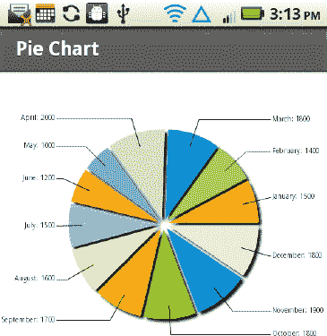

# 四、图形和动画

图形对所有年龄段的人来说都是一种有趣的“取悦大众”的方式。如果您和我们一样喜欢图形，您会很高兴地发现，在桌面浏览器上运行的基于 Flex 的图形代码示例也可以在移动设备上运行。此外，当您为移动设备创建基于图形的应用时，您可以利用与触摸相关的事件和手势(在第二章中讨论过)。

本章的第一部分向你展示了如何渲染各种二维形状，如矩形、椭圆、贝塞尔曲线和路径。本章的第二部分包含一个使用线性渐变和径向渐变渲染几何对象的代码示例。本章的第三部分提供了一个代码示例，说明如何使用滤镜效果，包括`Blur`、`DropShadow`和`Glow`。

您还将看到移动代码示例，说明如何对本章第一部分中讨论的图形形状执行变换(平移、缩放、旋转和剪切)。接下来，您将学习如何渲染图表和图形(使用 MX 组件)，然后是本章的最后一个示例，它向您展示了如何创建一个草图绘制程序，将本章前面介绍的各种图形相关概念联系在一起。这个草图程序还包括触摸事件，在 JPG 文件上绘制草图的能力，以及一个保存选项，使您可以在移动设备上将草图保存为 JPG。

阅读完本章后，您将对移动设备的图形相关功能有一个很好的认识，并且本章中的一些代码示例可能会启发您编写自己美观的图形代码！

### 为 2D 形状使用火花原语

本节中的移动代码示例演示了如何呈现各种 2D 形状，如矩形、椭圆形、贝塞尔曲线、多边形和路径。此外，一些代码示例包含采用各种阴影技术的多个图形图像，这将使您能够对图形图像的代码进行并排比较。

#### 绘制矩形和椭圆形

让我们从渲染两个矩形和一个椭圆开始，这是两个大家都很熟悉的 2D 形状。使用移动应用模板创建一个名为 RectEllipse1 的新 Flex 移动项目，并添加如清单 4–1 所示的代码。

**清单 4–1。** *渲染两个矩形和一个椭圆*

`<?xml version="1.0" encoding="utf-8"?>
<s:View xmlns:fx="http://ns.adobe.com/mxml/2009"
        xmlns:s="library://ns.adobe.com/flex/spark"
        title="Rectangle and Ellipse">
   <s:Rect id="rect1" x="10" y="10" width="250" height="200">
      <s:fill>
         <s:SolidColor color="0xFF0000"/>
      </s:fill>
      <s:stroke>
        <s:SolidColorStroke color="0xFFFF00" weight="4"/>
      </s:stroke>
   </s:Rect>

   <s:Ellipse id="ellipse1" x="10" y="220" width="250" height="200">
      <s:fill>
         <s:SolidColor color="0x0000FF"/>
      </s:fill>
      <s:stroke>
         <s:SolidColorStroke color="0xFF0000" weight="4"/>
      </s:stroke>
   </s:Ellipse>

  <s:Rect id="rect2" x="10" y="460" width="250" height="100">
    <s:fill>
      <s:SolidColor color="0xFFFF00"/>
    </s:fill>
    <s:stroke>
      <s:SolidColorStroke color="0x0000FF" weight="8"/>
    </s:stroke>

   <fx:Declarations>
      <!-- Place non-visual elements (e.g., services, value objects) here -->
   </fx:Declarations>
</s:View>`

清单 4–1 以一个 XML `Rect`元素开始，该元素指定了属性`id`、`x`、`y`、`width`和`height`的值。注意，XML `Rect`元素包含一个 XML `fill`元素和一个 XML `stroke`元素，而不是一个`fill`属性和一个`stroke`属性，这与 SVG 不同，SVG 通过属性指定`fill`和`stroke`值。但是，XML `stroke`元素包含一个 XML `SolidColorStroke`子元素，它将`color`和`weight`指定为属性，而不是 XML 元素的值。注意，SVG 使用了一个`stroke`和一个`stroke-width`属性，而不是一个`color`属性和一个`weight`属性。

清单 4–1 还包含一个 XML `Ellipse`元素，它定义了一个椭圆，具有与 XML `Rect`元素几乎相同的属性和值，但是生成的输出是一个椭圆而不是矩形。

第二个 XML `Rect`元素类似于第一个`Rect`元素，但是颜色不同，在屏幕上的位置也不同。

图 4–1 显示了两个矩形和一个椭圆。

**图 4–1。** *两个矩形和一个椭圆*

#### 使用线性和径向渐变

Flex 移动应用支持线性渐变和径向渐变。顾名思义，线性渐变以线性方式计算起始色和结束色之间的中间色。例如，如果线性渐变从黑色变化到红色，那么初始颜色是黑色，最终颜色是红色，颜色的阴影线性“过渡”在黑色和红色之间。

径向梯度不同于线性梯度，因为过渡以径向方式发生。想象一颗扔进池塘的鹅卵石，观察半径增加的圆圈的波纹效果，这让你对径向渐变是如何渲染的有所了解。

作为一个示例，下面的移动代码呈现一个具有线性渐变的矩形和一个具有径向渐变的椭圆。使用移动应用模板创建一个名为 LinearRadial1 的新 Flex 移动项目，并添加如清单 4–2 所示的代码。

**清单 4–2。** *使用线性渐变和径向渐变*

`<?xml version="1.0" encoding="utf-8"?>
<s:View xmlns:fx="http://ns.adobe.com/mxml/2009"
        xmlns:s="library://ns.adobe.com/flex/spark"
        xmlns:mx="library://ns.adobe.com/flex/mx"
        title="Linear and Radial Gradients">

  <s:Panel title="Linear and Radial Gradients">
    <s:Group>
      <s:Rect id="rect1" x="10" y="10"
              height="250" width="300">
         <s:fill>
           <s:LinearGradient>
             <s:GradientEntry color="0xFF0000"
                              ratio="0"   alpha=".5"/>
             <s:GradientEntry color="0xFFFF00"
                              ratio=".33" alpha=".5"/>
             <s:GradientEntry color="0x0000FF"
                              ratio=".66" alpha=".5"/>
           </s:LinearGradient>
         </s:fill>

         <s:stroke>
           <s:SolidColorStroke color="0x000000" weight="2"/>
         </s:stroke>
      </s:Rect>

      <s:Ellipse id="ellipse1" x="10" y="270"
                      height="300" width="250">
        <s:fill>
          <s:RadialGradient>
            <s:GradientEntry color="0xFF0000"
                             ratio="0"  alpha="1"/>
            <s:GradientEntry color="0xFFFF00"
                             ratio=".9" alpha="1"/>
         </s:RadialGradient>
       </s:fill>

       <s:stroke>
         <s:SolidColorStroke color="0x000000" weight="2"/>
       </s:stroke>
     </s:Ellipse>
   </s:Group>`
`  </s:Panel>

  <fx:Declarations>
    <!-- Place non-visual elements (e.g., services, value objects) here -->
  </fx:Declarations>
</s:View>`

清单 4–2 包含一个 XML `Panel`元素，该元素包含一个 XML `Group`元素，其属性指定面板的布局。XML `Group`元素包含两个 XML 子元素:一个 XML `Rect`元素和一个 XML `Ellipse`元素。XML `Rect`元素定义了一个带有线性渐变的矩形，如下所示:

`    <s:Rect id="rect1" x="10" y="10"
                  height="100" width="200">
       <s:fill>
          <s:LinearGradient>
             <s:GradientEntry color="0xFF0000"
                              ratio="0"   alpha=".5"/>
             <s:GradientEntry color="0xFFFF00"
                              ratio=".33" alpha=".5"/>
             <s:GradientEntry color="0x0000FF"
                              ratio=".66" alpha=".5"/>
          </s:LinearGradient>
       </s:fill>

       <s:stroke>
          <s:SolidColorStroke color="0x000000" weight="2"/>
       </s:stroke>
    </s:Rect>`

前面的 XML `Rect`元素指定了属性`id`、`x`、`y`、`width`和`height`的值。接下来，XML `Rect`元素包含一个 XML `fill`元素(正如您在前面的示例中看到的)，该元素又包含一个 XML `LinearGradient`元素，该元素指定了三个 XML `GradientEntry`元素，每个元素都为`ratio`和`alpha`属性指定了一个十进制值(在`0`和`1`之间)。XML `Rect`元素的最后一部分包含一个 XML `stroke`元素，该元素包含一个 XML `SolidColorStroke`元素，该元素指定属性`color`和`weight`的值。

清单 4–2 还包含一个 XML `Ellipse`元素，它定义了一个带有径向渐变的椭圆。这段代码包含与 XML `Rect`元素几乎相同的属性和值，除了它表示一个椭圆而不是矩形。

图 4–2 显示了一个带有线性渐变的矩形和一个带有径向渐变的椭圆。

**图 4–2。**??【线性渐变的矩形】和径向渐变的椭圆

#### 绘制三次贝塞尔曲线

Flex 支持三次贝塞尔曲线(有两个端点和两个控制点)和二次贝塞尔曲线(有两个端点和一个控制点)。您可以轻松识别三次贝塞尔曲线，因为它以字母“C”(或“C”)开头，二次贝塞尔曲线以字母“Q”(或“Q”)开头。大写字母“C”和“Q”指定“绝对”位置，而小写字母“C”和“Q”指定相对于 XML `Path`元素中前面一点的位置。

三次或二次贝塞尔曲线的点中列出的第一个点是第一个控制点，在三次贝塞尔曲线的情况下，后面是另一个控制点，然后是第二个端点。二次和三次贝塞尔曲线中的第一个端点是 XML `Path`元素中指定的前一个点；如果未指定点，则将原点(0，0)用作第一个端点。

您也可以使用字母“S”(对于三次贝塞尔曲线)或字母“T”(对于二次贝塞尔曲线)来指定贝塞尔曲线序列。

使用移动应用模板创建一个名为 BezierCurves1 的新 Flex 移动项目，并添加如清单 4–3 所示的代码，该代码显示了四条贝塞尔曲线的代码:一条三次贝塞尔曲线、一条二次贝塞尔曲线、两条组合的三次贝塞尔曲线以及一条组合的三次和二次贝塞尔曲线。

**清单 4–3。** *渲染三次和二次贝塞尔曲线*

`<?xml version="1.0" encoding="utf-8"?>
<s:View xmlns:fx="http://ns.adobe.com/mxml/2009"
        xmlns:s="library://ns.adobe.com/flex/spark"
        title="Cubic and Quadratic Bezier Curves">

   <s:Panel width="500" height="500"
                  title="Cubic and Quadratic Bezier Curves">
     <!-- cubic Bezier curve -->
     <s:Path data="C 100 150 200 20 300 100">
       <s:fill>
       <s:LinearGradient rotation="90">
         <s:GradientEntry color="#FFFFFF" alpha="0.5"/>
         <s:GradientEntry color="#FF0000" alpha="0.5"/>
       </s:LinearGradient>
       </s:fill>
       <s:stroke>
         <s:SolidColorStroke color="0x0000FF" weight="4"/>
       </s:stroke>
     </s:Path>

     <!-- quadratic Bezier curve -->
     <s:Path data="Q 250 200 100 300">
       <s:fill>
         <s:RadialGradient rotation="90">
           <s:GradientEntry color="#000000" alpha="0.8"/>
           <s:GradientEntry color="#0000FF" alpha="0.8"/>
         </s:RadialGradient>
       </s:fill>

       <s:stroke>
         <s:SolidColorStroke color="0xFF0000" weight="8"/>
       </s:stroke>
     </s:Path>

     <!-- two combined cubic Bezier curves -->
     <s:Path data="C 100 300 200 20 300 100 S 250 200 300 250">
       <s:fill>
         <s:LinearGradient rotation="90">
           <s:GradientEntry color="#FF0000" alpha="0.5"/>
           <s:GradientEntry color="#FFFF00" alpha="0.5"/>
         </s:LinearGradient>
       </s:fill>

       <s:stroke>`
`         <s:SolidColorStroke color="0x00FF00" weight="2"/>
       </s:stroke>
     </s:Path>

     <!-- two combined cubic and quadratic Bezier curves -->
     <s:Path data="C 250 400 200 150 350 100 T 250 250 400 280">
       <s:fill>
         <s:LinearGradient rotation="90">
           <s:GradientEntry color="#FFFF00" alpha="0.5"/>
           <s:GradientEntry color="#FF0000" alpha="0.5"/>
         </s:LinearGradient>
       </s:fill>

       <s:stroke>
         <s:SolidColorStroke color="0x000000" weight="4"/>
       </s:stroke>
     </s:Path>
   </s:Panel>
</s:View>`

清单 4–3 包含一个 XML `Panel`元素，该元素又包含四个 XML `Path`元素，这些元素指定带有各种阴影的贝塞尔曲线。第一个 XML `Path`元素指定了一条三次贝塞尔曲线，如下所示:

`    <s:Path data="C 100 300 200 20 300 100 S 250 200 300 250">
     [other elements omitted]
    </s:Path>`

此三次贝塞尔曲线的第一个端点是(0，0)，因为没有指定点；控制点为(100，300)和(200，20)；并且目的地端点是(300，100)。

这个 XML `Path`元素包含一个 XML `LinearGradient`元素，该元素从白色到红色变化，不透明度为`0.5`，后跟宽度为`4`的蓝色笔划，如下所示:

`    <s:LinearGradient rotation="90">
      <s:GradientEntry color="#FFFFFF" alpha="0.5"/>
      <s:GradientEntry color="#FF0000" alpha="0.5"/>
    </s:LinearGradient>
    </s:fill>
    <s:stroke>
      <s:SolidColorStroke color="0x0000FF" weight="4"/>
    </s:stroke>`

第二个 XML `Path`元素指定了一条二次贝塞尔曲线，该曲线的第一个端点是(0，0 ),因为没有指定点；这条二次贝塞尔曲线的单个控制点是(250，200)；而目的地端点是(100，300)。这个 XML `Path`元素包含一个 XML `LinearGradient`元素，从黑色到蓝色变化，不透明度为`0.8`。

第三个 XML `Path`元素指定了一条与第二条三次贝塞尔曲线“连接”的三次贝塞尔曲线，如下所示:

`    <s:Path data="C 100 300 200 20 300 100 S 250 200 300 250">
     [other elements omitted]
    </s:Path>`

这条三次贝塞尔曲线的两个控制点是(100，300)和(20，300)，目的端点是(300，100)。这个 XML `Path`元素的第二部分指定了一条二次贝塞尔曲线，它的控制点是(250，200)，目标端点是(300，250)。

这个 XML `Path`元素包含一个指定从黄色到红色的线性渐变的 XML `LinearGradient`元素，后面是一个指定黑色和宽度为`4`单位的 XML `stroke`元素。

最后一个 XML `Path`元素指定了一条三次贝塞尔曲线，后跟第二条三次贝塞尔曲线，如下所示:

`    <s:Path data="C 250 300 200 150 350 100 T 250 250 400 280">
      [other elements omitted]
    </s:Path>`

这条三次贝塞尔曲线的控制点是(250，300)和(200，150)，目的端点是(350，100)。这个 XML `Path`元素的第二部分指定了一条二次贝塞尔曲线，它的控制点是(250，250)，目标端点是(400，280)。

这个 XML `Path`元素包含一个 XML `LinearGradient`元素，它指定从黄色到红色的线性渐变，不透明度为`0.5`，后面是一个 XML `stroke`元素，它指定黑色和线宽为`4`单位。

图 4–3 显示了三次、二次和组合贝塞尔曲线。

**图 4–3。** *三次、二次和组合贝塞尔曲线*

#### 另一个路径元素示例

在前面的例子中，您看到了如何使用`Path`元素来呈现一组贝塞尔曲线。元素还可以让你组合其他的 2D 形状，比如线段和带有线性渐变和径向渐变的贝塞尔曲线。使用移动应用模板创建一个名为 Path1 的新 Flex 移动项目，并添加如清单 4–4 所示的代码。

**清单 4–4。** *结合线段和贝塞尔曲线*

`<?xml version="1.0" encoding="utf-8"?>
<s:View xmlns:fx="http://ns.adobe.com/mxml/2009"
        xmlns:s="library://ns.adobe.com/flex/spark"
        title="Path-based Lines and Bezier Curves">

   <s:Panel width="500" height="500"
                  title="Path-based Lines and Bezier Curves">
     <s:Path data="M 50 50 L150 50 350 150 50 150z
             C 250 300 200 150 350 100 T 250 250 400 500">
       <s:fill>
         <s:LinearGradient rotation="90">
           <s:GradientEntry color="#FF0000" alpha="1"/>
           <s:GradientEntry color="#0000FF" alpha="1"/>
         </s:LinearGradient>
       </s:fill>

       <s:stroke>
         <s:SolidColorStroke color="0x000000" weight="8"/>
       </s:stroke>
     </s:Path>
   </s:Panel>
</s:View>`

清单 4–4 中的 XML `Panel`元素包含一个 XML `Path`元素，它使用线段来呈现一个梯形，后跟一对三次贝塞尔曲线。XML `Path`元素的`data`属性如下所示:

`    <s:Path data="M 50 50 L150 50 350 150 50 150z
            C 250 300 200 150 350 100 T 250 250 400 280">`

`data`属性的第一部分(以字母`M`开始)指定一个梯形；`data`属性的第二部分(以字母`C`开始)呈现一条三次贝塞尔曲线；`data`属性的第三部分(以字母`T`开始)指定了另一条三次贝塞尔曲线。

图 4–4 显示了一条梯形和两条三次贝塞尔曲线。

**图 4–4。** *基于路径的梯形和贝塞尔曲线*

#### 使用火花过滤器

Flex 滤镜效果对于在基于 Flex 的应用中创建丰富的视觉效果非常有用，这些效果可以真正增强应用的吸引力。Spark 原语支持多种滤镜，包括`Blur`滤镜，一个`DropShadow`滤镜，一个`Glow`滤镜，都属于`spark.filters`包。

使用移动应用模板创建一个名为 RectLGradFilters3 的新 Flex 移动项目，并添加如清单 4–5 所示的代码。

**清单 4–5。** *用火花滤镜画矩形*

`<?xml version="1.0" encoding="utf-8"?>
<s:View xmlns:fx="http://ns.adobe.com/mxml/2009"
        xmlns:s="library://ns.adobe.com/flex/spark"
        title="Rectangle: Gradient and Filters">

  <s:Rect id="rect1" x="50" y="50" height="300" width="250">
    <s:fill>
      <s:LinearGradient>
        <s:GradientEntry color="0xFF0000"
                         ratio="0"   alpha=".5"/>
        <s:GradientEntry color="0xFFFF00"
                         ratio=".33" alpha=".5"/>
        <s:GradientEntry color="0x0000FF"
                         ratio=".66" alpha=".5"/>
      </s:LinearGradient>
    </s:fill>
    <s:stroke>
      <s:SolidColorStroke color="0xFF0000" weight="2"/>
    </s:stroke>
    <s:filters>
      <s:DropShadowFilter distance="80" color="#0000FF"/>
      <s:BlurFilter/>
      <s:GlowFilter/>
    </s:filters>
  </s:Rect>
</s:View>`

清单 4–5 包含一个 XML `Rect`元素，它定义了一个用线性渐变渲染的矩形。`ratio`属性是一个介于`0`和`1`之间的十进制数，它指定了颜色过渡从起点到终点的距离的分数。在清单 4–5 中，第一个`GradientEntry`元素有一个 ratio 属性，其值为`0`，这意味着矩形用颜色`0xFF0000`(红色的十六进制值)呈现。第二个`GradientEntry`元素有一个 ratio 属性，它的值是`0.33`，这意味着矩形是用颜色`0xFFFF00`(黄色的十六进制值)从初始位置到目的地的 33%的位置呈现的。第三个`GradientEntry`元素有一个值为`0.66`的`ratio`属性，因此矩形从初始位置到目的位置的 66%处用颜色`0x0000FF`(蓝色的十六进制值)呈现。

`alpha`属性是不透明度，是介于`0`(不可见)和`1`(完全可见)之间的十进制数。清单 4–5 中的三个`GradientEntry`元素有一个`0.5`的 alpha 属性，所以矩形是部分可见的。尝试比率属性和 alpha 属性的不同值，以便可以找到创建令人愉悦的视觉效果的组合。

XML `Rect`元素的最后一部分包含一个 XML `stroke`元素，该元素指定红色和描边宽度`2`，后跟三个火花过滤器，如下所示:

`    <s:filters>
      <s:DropShadowFilter distance="80" color="#0000FF"/>
      <s:BlurFilter/>
      <s:GlowFilter/>`
`    </s:filters>`

本例中的三个 Spark 过滤器具有直观的名称，表明当您将它们包含在代码中时可以创建的效果。第一个 Spark 过滤器是一个向 XML `Rect`元素添加“投影”的`DropShadowFilter`。第二个火花过滤器是一个`BlurFilter`，它增加了模糊效果。第三个也是最后一个火花过滤器是一个`GlowFilter`，它创建了一个辉光过滤器效果。

Figure 4–5 显示了一个带有线性渐变和三个火花过滤器的矩形。

**图 4–5。** *一个带有线性渐变和三个火花滤镜的矩形*

### 将变换应用于几何形状

本章的这一节介绍了如何将变换应用于几何对象，包括本章上一部分讨论的对象。Spark 原语支持以下效果和变换:

*   `Animate`
*   `AnimateColor`
*   `AnimateFilter`
*   `AnimateShaderTransition`
*   `AnimateTransform`
*   `Fade`
*   `Move`
*   `Resize`
*   `Rotate`
*   `Scale`
*   `Wipe`
*   `CrossFade`

这些 Spark 原语在`spark.effects`包中，它们可以应用于 Spark 组件，也可以应用于 MX 组件；`mx.effects`包(包含在 Flex 4 SDK 中)包含可以应用于 MX 组件的相应功能。

以下小节包含一个 Flex 代码示例，它说明了如何在 Flex 中创建缩放效果。

#### 创建缩放效果

缩放效果(即，扩展或收缩形状)对于面向游戏的应用非常有用，并且在基于 Flex 的应用中非常容易创建。使用移动应用模板创建一个名为 ScaleEffect1 的新 Flex 移动项目，并添加如清单 4–6 所示的代码。

**清单 4–6。** *用线性渐变创建缩放效果*

`<?xml version="1.0" encoding="utf-8"?>
<s:View xmlns:fx="http://ns.adobe.com/mxml/2009"
        xmlns:s="library://ns.adobe.com/flex/spark"
        title="Scale Effect">

   <fx:Library>
     <fx:Definition name="MyRect1">
       <s:Rect x="50" y="50" height="40" width="20">
         <s:fill>
           <s:LinearGradient>
             <s:GradientEntry color="0xFF0000"
                              ratio="0"   alpha=".5"/>
             <s:GradientEntry color="0xFFFF00"
                              ratio=".33" alpha=".5"/>
             <s:GradientEntry color="0x0000FF"
                              ratio=".66" alpha=".5"/>
           </s:LinearGradient>
         </s:fill>
         <s:stroke>
            <s:SolidColorStroke color="0xFF0000" weight="1"/>
         </s:stroke>
         <s:filters>
            <s:BlurFilter/>
            <s:GlowFilter/>
         </s:filters>` `       </s:Rect>
     </fx:Definition>

     <fx:Definition name="MyEllipse1">
        <s:Ellipse x="200" y="200" height="40" width="80">
          <s:fill>
            <s:LinearGradient>
               <s:GradientEntry color="0xFF0000"
                             ratio="0"   alpha=".5"/>
               <s:GradientEntry color="0xFFFF00"
                             ratio=".33" alpha=".5"/>
               <s:GradientEntry color="0x0000FF"
                             ratio=".66" alpha=".5"/>
            </s:LinearGradient>
          </s:fill>
          <s:stroke>
            <s:SolidColorStroke color="0xFF0000" weight="1"/>
          </s:stroke>
          <s:filters>
            <s:DropShadowFilter distance="20" color="#FF0000"/>
          </s:filters>
        </s:Ellipse>
     </fx:Definition>
  </fx:Library>

  <s:Group>
    <fx:MyRect1    scaleX="6" scaleY="4"/>
    <fx:MyEllipse1 scaleX="3" scaleY="8"/>
    <fx:MyRect1    scaleX="2" scaleY="2"/>
    <fx:MyEllipse1 scaleX="2" scaleY="2"/>
  </s:Group>
</s:View>`

清单 4–6 包含一个 XML `Definition`元素，它指定一个带有矩形定义的 XML `Rect`元素，以及另一个 XML `Definition`元素，它指定一个带有椭圆定义的 XML `Ellipse`元素。XML `Group`元素包含两个对矩形的引用和两个对椭圆的引用，如下所示:

`<s:Group>
  <fx:MyRect1    scaleX="6" scaleY="4"/>
  <fx:MyEllipse1 scaleX="3" scaleY="8"/>
  <fx:MyRect1    scaleX="2" scaleY="2"/>
  <fx:MyEllipse1 scaleX="2" scaleY="2"/>
</s:Group>`

第一个 XML 元素通过为属性`scaleX`和`scaleY`指定值`6`和`3`来缩放先前定义的矩形。第二个 XML 元素通过为属性`scaleX`和`scaleY`指定值`3`和`8`来缩放先前定义的矩形。

图 4–6 显示了两个缩放的矩形和两个缩放的椭圆。

**图 4–6。** *两个缩放的矩形和椭圆*

### 在 Spark 中创建动画效果

本节包含的移动代码展示了如何将动画效果应用到几何对象上，包括本章上一部分讨论的那些对象。动画效果的火花原语如下:

*   `Animate`
*   `AnimateColor`
*   `AnimateFilter`
*   `AnimateShaderTransition`
*   `AnimateTransform`
*   `CrossFade`
*   `Fade`
*   `Move`
*   `Resize`
*   `Rotate`
*   `Scale`
*   `Wipe`

以下部分提供了移动代码示例，说明如何使用 XML `Animate`元素以及如何并行和顺序定义动画效果。

#### 使用动画元素

对于面向游戏的应用来说，动画效果显然非常受欢迎，而且它们也可以有效地用于其他类型的应用。同时，请记住，在以业务为中心的应用中谨慎使用动画效果可能是个好主意。

使用移动应用模板创建一个名为 AnimPropertyWidth 的新 Flex 移动项目，并添加如清单 4–7 所示的代码。

**清单 4–7。** *动画显示矩形的宽度*

`<?xml version="1.0" encoding="utf-8"?>
<s:View xmlns:fx="http://ns.adobe.com/mxml/2009"
        xmlns:s="library://ns.adobe.com/flex/spark"
        title="Animate Rectangle Width">

   <fx:Declarations>
    <s:Animate id="MyAnimate1">
       <s:motionPaths>
         <s:MotionPath property="width">
           <s:keyframes>
             <s:Keyframe time="0"    value="200"/>
             <s:Keyframe time="2000" value="400"/>
           </s:keyframes>
         </s:MotionPath>
       </s:motionPaths>
     </s:Animate>
   </fx:Declarations>

  <s:VGroup>
    <s:Rect id="rect1" x="10" y="50" height="300" width="200">
      <s:fill>
         <s:LinearGradient>
            <s:GradientEntry color="0xFF0000"
                             ratio="0"   alpha=".5"/>
            <s:GradientEntry color="0xFFFF00"
                             ratio=".33" alpha=".5"/>
            <s:GradientEntry color="0x0000FF"
                             ratio=".66" alpha=".5"/>
         </s:LinearGradient>
       </s:fill>
       <s:stroke>` `         <s:SolidColorStroke color="0xFF0000" weight="2"/>
      </s:stroke>
    </s:Rect>

    <s:Button id="MyButton1" label="Animate Width"
              click="MyAnimate1.play([rect1])"
              bottom="150" right="50">
    </s:Button>
   </s:VGroup>
 </s:View>`

清单 4–7 包含一个 XML `Declarations`元素，该元素又包含一个定义动画特定细节的 XML `Animate`元素。XML `Animate`元素有一个值为`MyAnimate1`的`id`属性，该属性在本节稍后描述的点击处理事件中被引用。

清单 4–7 包含一个 XML `VGroup`元素，该元素又包含一个 XML `Rect`元素，其内容类似于您在本章中已经看到的例子。

清单 4–7 包含一个 XML `Button`元素，使您能够开始动画效果。每当用户单击或点击这个按钮时，代码将执行事件处理程序，其`id`属性为`MyAnimate1`，这在前面的代码示例中已定义。动画效果很简单:矩形宽度在两秒钟(2000 毫秒)内从 200 个单位增加到 400 个单位。

图 4–7 和图 4–8 显示了当用户点击按钮时，一个矩形在屏幕上水平移动的两个快照。

**图 4–7。** *一个带有动画的矩形(初始位置)*

**图 4–8。** *一个带动画的矩形(最终位置)*

#### 动画:并行和顺序

Flex 支持两种动画效果。并行动画效果涉及同时发生的两个或多个动画效果。另一方面，顺序动画效果涉及两个或更多按顺序出现的动画效果，这意味着在任何给定时间只出现一个动画效果。记住这一点，使用移动应用模板创建一个名为 SequentialAnimation1 的新 Flex 移动项目，并添加如清单 4–8 所示的代码。

**清单 4–8。** *创造连续动画效果*

`<?xml version="1.0" encoding="utf-8"?>
<s:View xmlns:fx="http://ns.adobe.com/mxml/2009"
        xmlns:s="library://ns.adobe.com/flex/spark"
        title="Sequential Animation">

  <fx:Declarations>
    <s:Sequence id="transformer1" target="{button1}">
      <s:Move xFrom="50" xTo="150"
              autoCenterTransform="true"/>
      <s:Rotate angleFrom="0" angleTo="360"
              autoCenterTransform="true"/>
      <s:Scale scaleXFrom="1" scaleXTo="2"
              autoCenterTransform="true"/>
    </s:Sequence>

    <s:Sequence id="transformer2" target="{button2}">
      <s:Move xFrom="50" xTo="150"`
`             autoCenterTransform="true"/>
    <s:Scale scaleXFrom="1" scaleXTo="2"
             autoCenterTransform="true"/>
    <s:Rotate angleFrom="0" angleTo="720"
             autoCenterTransform="true"/>
    </s:Sequence>
  </fx:Declarations>

  <s:Rect id="rect1" x="10" y="10" width="400" height="400">
    <s:fill>
      <s:SolidColor color="0xFF0000"/>
    </s:fill>
    <s:stroke>
      <s:SolidColorStroke color="0x0000FF" weight="4"/>
    </s:stroke>
  </s:Rect>

  <s:Button id="button1" x="50" y="100" label="Transform Me"
                  click="transformer1.play()"/>

  <s:Button id="button2" x="50" y="200" label="Transform Me Too"
                  click="transformer2.play()"/>
</s:View>`

清单 4–8 包含一个 XML `Declarations`元素，该元素又包含两个 XML `Sequence`元素，这两个元素指定了三种转换效果。动画效果从 XML `Move`元素开始(提供翻译效果)，然后是 XML `Rotate`元素(提供旋转效果)，最后是 XML `Scale`元素(提供缩放效果)。当用户点击第一个 XML `Button`元素时，这将调用 XML `Sequence`元素中定义的动画效果，该元素的`id`属性的值为`transformer1`。

类似的注释也适用于第二个 XML `Sequence`元素和第二个按钮，只是动画效果包含两次完整的旋转，而不是一次旋转。

请注意，通过用 XML `Parallel`元素替换 XML `Sequence`元素，您可以轻松地将动画效果从顺序改为并行，如下所示:

`     <s:Parallel id="transformer" target="{button}">
       <s:Move xFrom="50" xTo="150"
               autoCenterTransform="true"/>
       <s:Rotate angleFrom="0" angleTo="360"
              autoCenterTransform="true"/>
       <s:Scale scaleXFrom="1" scaleXTo="2"  
              autoCenterTransform="true"/>
     </s:Parallel>`

图 4–9 和图 4–10 显示了两个按顺序经历动画效果的按钮。由于截图只捕获了初始和最终的动画效果，因此在移动设备上启动这个移动应用，这样您还可以看到滑动效果和旋转效果。

**图 4–9。***一个带有连续动画的按钮(初始)*

*

**图 4–10。** *一个带有连续动画的按钮(后)*

### 创建 3D 效果

Flex 支持多种 3D 效果，包括移动、旋转和缩放 JPG 文件。3D“移动”效果包括移动 JPG 图像以及减小图像的尺寸，而 3D 缩放效果包括将 JPG 图像的宽度和高度从起始值(通常为 1)增加(或减小)到最终值(可以大于或小于 1)。3D“旋转”效果包括旋转 JPG 图像，使其看起来像在三维空间中旋转。

清单 4.9 中的以下代码示例向您展示了如何在基于移动设备的应用中创建移动、旋转和缩放 JPG 文件的 3D 效果。

Figure 4–11 显示了卡桑德拉·陈(斯蒂芬·陈的女儿)的 JPG 形象`Cassandra4.jpg`，该形象用于说明这三种 3D 动画效果的代码示例中。

**图 4–11。***3D 特效的 JPG*

**清单 4–9。** *制作 3D 动画效果*

`<?xml version="1.0" encoding="utf-8"?>
<s:View xmlns:fx="http://ns.adobe.com/mxml/2009"
        xmlns:s="library://ns.adobe.com/flex/spark"
        title="Creating 3D Effects">

  <fx:Declarations>
    <s:Move3D id="moveEffect" target="{targetImg}" xBy="100" zBy="100"`
`              repeatCount="2" repeatBehavior="reverse"
              effectStart="playMoveButton.enabled=false"
              effectEnd="playMoveButton.enabled=true;"/>

    <s:Rotate3D id="rotateEffect" target="{targetImg}"
                angleYFrom="0" angleYTo="360"
                repeatCount="4" repeatBehavior="reverse"
                effectStart="playRotateButton.enabled=false;"
                effectEnd="playRotateButton.enabled=true;"/>

    <s:Scale3D id="atScale" target="{targetImg}"
               scaleXBy="-.45" repeatCount="2"
               repeatBehavior="reverse"
               effectStart="playScaleButton.enabled=false"
               effectEnd="playScaleButton.enabled=true;"/>
  </fx:Declarations>

  <s:VGroup width="100%" height="100%" >
    <s:Image id="targetImg"
             horizontalCenter="0"
             verticalCenter="0"
             source="@Embed(source='img/Cassandra4.jpg')"/>

    <s:HGroup>
      <s:Button id="playMoveButton"
                left="10" bottom="25"
                label="Move"
                click="moveEffect.play();"/>

      <s:Button id="playRotateButton"
                left="110" bottom="25"
                label="Rotate"
                click="rotateEffect.play();"/>

      <s:Button id="playScaleButton"
                left="222" bottom="25"
                label="Scale" click="atScale.play();"/>
    </s:HGroup>
  </s:VGroup>

</s:View>`

清单 4–9 包含一个 XML `Declarations`元素，该元素包含三个 3D 效果元素，以及三个 XML `Button`元素，用户可以单击这些元素来创建 3D 效果。XML `Move3D`元素通过属性`xBy`和`zBy`指定目标位置，还有一个值为 2 的`repeatCount`(执行动画效果两次)，以及一个值为`reverse`(每次都返回到原始位置)的`repeatBehavior`。相应的 XML `Button`元素包含一个值为`Move`的`label`属性和一个值为`moveEffect.play()`的`click`属性，后者调用在 XML `Declarations`元素中定义的 XML `MoveEffect`元素中指定的移动动画效果。

旋转效果通过 XML `Rotate3D`元素处理，其属性`angleYFrom`和`angleYTo`分别指定`0`和`360`的开始和结束角度(即一次完整的旋转)。这种旋转效果会出现四次。XML `Button`元素包含一个值为`Rotate`的`label`属性和一个值为`rotateEffect.play()`的`click`属性，该属性调用在 XML `Declarations`元素中定义的 XML `Rotate3D`元素中指定的缩放动画效果。

缩放效果(这是第三个也是最后一个效果)是通过 XML `Scale3D`元素处理的，该元素包含几个属性，这些属性的值指定了同一个 JPG 图像的动画行为的细节。`id`属性的值为`atScale`，用于在代码的其他地方引用这个元素。属性`target`引用了 XML 元素，其`id`的值为`targetImg`，引用了 JPG 图像。`scaleXBy`属性的值为`-0.25`，它将 JPG 图像缩小 25%。`repeatCount`属性的值为`4`,`repeatBehavior`属性的值为`reverse`，表示动画效果出现四次，从左到右来回交替。另外两个属性是`effectStart`和`effectEnd`，它们指定动画开始和结束时的行为，在本例中是禁用然后启用 playButton。

注意，XML `Image`元素指定了`Cassandra4.jpg,`的位置，它位于这个移动项目的顶层目录的`images`子文件夹中。出于布局目的，XML `Image`元素在 XML `VGroup`元素中指定，该元素还包含一个 XML `HGroup`元素，该元素包含三个 XML `Button`元素。

Figure 4–12 显示了经过 3D“移动”效果后的 JPG。

**图 4–12。** *一个 3D 移动后的 JPG 效果*

图 4–13 显示了经过 3D“旋转”效果后的 JPG。

**图 4–13。** *一个 3D 旋转后的 JPG 效果*

图 4–14 显示了经过 3D“缩放”效果后的 JPG。

**图 4–14。** *一个 JPG 经过 3D 缩放后的效果*

### 创建火花皮肤

当您希望在移动应用的某些方面创建更丰富的视觉效果时，自定义外观非常有用。例如，您可以创建多个自定义外观，将图形效果(包括您在本章前面学习的那些)应用于按钮。我们将要讨论的代码示例清楚地展示了创建 Spark 自定义皮肤效果的过程。

清单 4–10 到 4–12 分别显示`CustomSkinHomeView.mxml`、`ButtonSkin1.mxml`和`ButtonSkin2.mxml`中的代码内容。

在本节讨论 MXML 文件之前，让我们看一下下面的将文件`ButtonSkin1.mxml`(在`skins`包中)添加到项目中的步骤列表。

1.  将新文件夹`skins`添加到您的项目中。
2.  右键单击您的项目，并导航到`New->MXML Skin`。
3.  指定`skins`作为新皮肤的包名。
4.  指定`ButtonSkin1`作为皮肤的名称。
5.  指定`spark.components.Button`作为组件的名称。
6.  取消选择标签“`Create as a copy of:`”左侧的复选框。

对定制皮肤`ButtonSkin2.mxml`重复前面的一组步骤，并对您想要添加到这个项目中的任何额外的定制皮肤重复这些步骤。现在让我们看看`CustomSkin.mxml`的内容，显示在清单 4–10 中

**清单 4–10。** *创建自定义火花皮肤*

`<?xml version="1.0" encoding="utf-8"?>
<s:View xmlns:fx="http://ns.adobe.com/mxml/2009"
        xmlns:s="library://ns.adobe.com/flex/spark"
        title="Custom Skins">
<s:VGroup>
    <s:Label text="This is a Normal Button:" x="10" y="0"/>
    <s:Button label="Button1" x="10" y="25"/>

    <s:Label text="First Skinned Button:"   x="10" y="60"/>
    <s:Button skinClass="skins.ButtonSkin1" x="10" y="85"/>

    <s:Label text="Second Skinned Button:"  x="10" y="100"/>
    <s:Button skinClass="skins.ButtonSkin2" x="10" y="125"/>

    <s:Label text="Third Skinned Button:"   x="10" y="140"/>
    <s:Button skinClass="skins.ButtonSkin1" x="10" y="165"/>

    <s:Label text="Fourth Skinned Button:"  x="10" y="180"/>
    <s:Button skinClass="skins.ButtonSkin2" x="10" y="205"/>
</s:VGroup>
</s:View>`

清单 4–10 包含一个 XML `VGroup`元素，该元素包含十个“成对的”XML 元素，用于呈现一个标准 XML `Label`元素和一个标准 XML `Button`元素，其中第一个是一个普通的按钮，如下所示:

`      <s:Label text="This is a Normal Button:" x="10" y="0"/>
      <s:Button label="Button1" x="10" y="25"/>`

前面的 XML 元素很简单:第一个是标签(“`This is a Normal Button`”)，第二个呈现按钮。

第一对包含皮肤按钮的 XML 元素显示标签“`First Skinned Button:`”，第二个元素基于包`skins`中 Flex 皮肤`ButtonSkin1`的内容呈现一个 XML `Button`元素。类似地，下一对包含皮肤按钮的 XML 元素显示标签“`Second Skinned Button:`”，这一对中的第二个元素基于包`skins`中 Flex 皮肤`ButtonSkin2`的内容呈现一个 XML `Button`元素。类似的注释也适用于其他两个自定义按钮。

现在让我们看看清单 4–11 中`ButtonSkin1.mxml`的内容，它包含了渲染第二个按钮(这是第一个皮肤按钮)的数据。

**清单 4–11**。*创建带有图形的按钮皮肤*

`<s:Skin xmlns:fx="http://ns.adobe.com/mxml/2009"
        xmlns:s="library://ns.adobe.com/flex/spark" >

   <fx:Metadata>
     [HostComponent("spark.components.Button")]
   </fx:Metadata>

   <s:states>
     <s:State name="disabled" />
     <s:State name="down" />
     <s:State name="over" />
     <s:State name="up" />
   </s:states>

   <s:Rect id="rect1" x="0" y="0" height="40" width="100">
     <s:fill>
       <s:LinearGradient>
         <s:GradientEntry color="0xFF0000"
                          ratio="0"   alpha=".5"/>
         <s:GradientEntry color="0xFFFF00"
                          ratio=".33" alpha=".5"/>
         <s:GradientEntry color="0x0000FF"
                          ratio=".66" alpha=".5"/>
       </s:LinearGradient>
     </s:fill>

     <s:stroke>
       <s:SolidColorStroke color="0x000000" weight="2"/>
     </s:stroke>
   </s:Rect>
</s:Skin>`

清单 4–11 包含一个 XML `Skin`根节点，其中有三个 XML 子元素定义了定制皮肤的行为。第一个子元素是 XML `Metadata`元素，如下所示:

`     <fx:Metadata>
       [HostComponent("spark.components.Button")]
     </fx:Metadata>`

前面的 XML 元素指定了`Button`类的包名，这也是您在项目中添加自定义皮肤`ButtonSkin1.mxml`时指定的名称。

第二个子元素是 XML `states`元素，如下所示:

`   <s:states>
     <s:State name="disabled" />
     <s:State name="down" />
     <s:State name="over" />
     <s:State name="up" />
   </s:states>`

前面的 XML `states`元素包含对应于一个按钮状态和三个鼠标相关事件的四个子元素，如果您想要处理这些状态，您可以包含额外的代码。第三个子元素是 XML `Rect`元素，它为阴影效果和黑色边框指定了线性渐变。

**清单 4–12。** *创建第二个按钮皮肤*

`<s:Skin xmlns:fx="http://ns.adobe.com/mxml/2009"
        xmlns:s="library://ns.adobe.com/flex/spark" >

   <fx:Metadata>
     [HostComponent("spark.components.Button")]
   </fx:Metadata>
   <s:states>
     <s:State name="disabled" />
     <s:State name="down" />
     <s:State name="over" />
     <s:State name="up" />
   </s:states>

   <s:Path data="M 0 0 L 100 0 L 100 40 L 0 40 Z ">
     <s:fill>
       <s:SolidColor color="#FF0000" alpha="1"/>
     </s:fill>
     <s:stroke>
       <s:SolidColorStroke color="#0000FF" weight="4"/>
     </s:stroke>
   </s:Path>
</s:Skin>`

注意，清单 4–12 和清单 4–11 的唯一区别是 XML `Path`元素而不是 XML `Rect`元素。

XML `Path`元素很简单:它包含一个数据属性，该属性的值是一组指定矩形的线段，矩形的颜色是`#FF0000`(红色)，边框是`#0000FF`(蓝色)，宽度是`4`。

如你所见，Flex 使得定义自定义皮肤变得非常容易。然而，更复杂(也更有趣)的自定义皮肤通常指定鼠标事件(如鼠标按下、鼠标抬起等)的行为以及相应的状态变化方面的触摸事件。您可以“绑定”在这些事件期间执行的 ActionScript 函数(由您编写),以便更改应用各个方面的可视显示。

Figure 4–15 显示了一个标准的 Flex 按钮和四个使用自定义皮肤的按钮。

**图 4–15。** *一个标准按钮和四个带有自定义火花皮肤的按钮*

### 在 Spark 中生成 2D 图表和图形

Flex 4 为以下 2D 图表和图形提供了良好的支持:

*   面积图
*   柱形图
*   条形图
*   曲线图
*   饼图
*   散点图

在下面的示例中，您将学习如何编写用于呈现 2D 条形图和 2D 饼图的移动代码示例，您还将看到具有动画效果并可以处理鼠标事件和触摸事件的代码示例。请注意，Flex 使用术语“条形图”表示水平条形图(即每个条形元素从左到右水平呈现)，术语“柱形图”指垂直条形图。

#### 创建 2D 条形图

条形图非常受欢迎，尤其是在面向业务的应用中，因为它们使您能够轻松地看到数据的趋势，否则可能很难从数据的表格显示中看出这些趋势。在接下来的示例中，您将学习如何创建一个移动应用，该应用从 XML 文档中读取基于 XML 的数据，然后在 2D 条形图中呈现这些数据。这些数据是为了举例说明，显然你会使用你自己的真实数据，而不是包含在清单 4–12 中的“虚构”数据。还要记住，本书中示例的完整来源可以从本书的网页上在线获得。

现在，使用移动应用模板创建一个名为 BarChart1 的新 Flex 移动项目，添加一个名为`chartdata`的新顶级文件夹，然后在这个名为`ChartData.xml`的文件夹中添加一个新的 XML 文档，其中包含了清单 4–13 中显示的数据。

**清单 4–13。**定义基于 XML 的图表数据

`<?xml version="1.0"?>
<chartdata>
  <data>
    <month>January</month>
    <revenue>1500</revenue>
  </data>
  <data>
    <month>February</month>
    <revenue>1400</revenue>
</data>
[data omitted for brevity]
  <data>
    <month>November</month>
    <revenue>1900</revenue>
  </data>
  <data>
    <month>December</month>
    <revenue>1800</revenue>
  </data>
</chartdata>`

清单 4–13 包含一个 XML `chartdata`元素，该元素包含 12 个 XML `data`元素，每个元素保存一年中某个月的图表相关数据。清单 4–13 中的每个 XML `data`元素包含一个 XML `month`元素和一个 XML `revenue`元素。例如，第一个 XML `data`元素指定了一个值为`1500`的`revenue`元素和一个值为`January`的`month`元素(没有指定货币单位)。

现在让我们看一下清单 4–14，它包含使用清单 4–13 中基于 XML 的数据呈现条形图的代码。

**清单 4–14。** *创建条形图*

`<?xml version="1.0" encoding="utf-8"?>
<s:View xmlns:fx="http://ns.adobe.com/mxml/2009"
        xmlns:mx="library://ns.adobe.com/flex/mx"
        xmlns:s="library://ns.adobe.com/flex/spark"`
`        title="Bar Chart">

   <!-- XML-based chart data -->
   <fx:Declarations>
     <fx:Model id="chartModel" source="chartdata/ChartData.xml"/>
     <s:ArrayCollection id="chartData" source="{chartModel.data}"/>
     <mx:NumberFormatter id="nf" precision="1" rounding="nearest"/>
   </fx:Declarations>

   <fx:Style>
     @namespace s  "library://ns.adobe.com/flex/spark";
     @namespace mx "library://ns.adobe.com/flex/mx";
     mx|ColumnChart
     {
       font-size:12;
       font-weight:bold;
     }
   </fx:Style>

   <!-- specify a column chart with appropriate attributes -->
   <mx:ColumnChart dataProvider="{chartData}"
                   height="70%" width="100%">
        <mx:horizontalAxis>
       <mx:CategoryAxis dataProvider="{chartData}"
                        categoryField="month"/>
     </mx:horizontalAxis>
     <mx:series>
       <mx:ColumnSeries xField="month" yField="revenue"/>
     </mx:series>
   </mx:ColumnChart>
</s:View>`

清单 4–14 定义了 XML 文档`ChartData.xml`在 XML `Model`元素中的位置，以及由基于 XML 的数据组成的`ArrayCollection`和一个简单的数据格式化程序。清单 4–14 包含一个 XML `Style`元素，该元素为两个 CSS 属性`font-size`和`font-weight`指定值，分别为`12`和`bold`，用于在饼图中呈现文本。

XML `ColumnChart`元素指定了一个柱形图，以及属性`dataProvider`、`height`和`weight`的适当值，它们的值分别是`chartData`、`75%`和`80%`。注意，`chartData`是一个在 XML `Declarations`元素中定义的`ArrayCollection`变量，而`chartData`是用 XML 文档`ChartData.xml`中指定的数据值填充的。

`height`和`weight`属性的值被指定为呈现饼图的屏幕尺寸的百分比；根据您希望条形图占据屏幕的百分比来调整这些属性的值(50%表示半宽或半高，25%表示四分之一宽或四分之一高，依此类推)。

XML `ColumnChart`元素包含两个重要的元素。首先，有一个 XML `horizontalAxis`元素指定了水平轴的`month`值(在`ChartData.xml`中指定)。其次，有一个 XML `series`元素，引用条形图水平轴的`month`值和垂直轴的`revenue`值。

图 4–16 显示了一个基于 XML 文件`ChartData.xml`中数据的条形图，显示在清单 4–13 中。

**图 4–16。***2D 条形图*

请记住图 4–16 缺少一些有用的信息，例如收入的货币、当前年份、公司的名称和位置以及收入数据的地区(或国家)。如果您添加此类额外信息，请对清单 4–14 中的代码进行适当的修改，以确保修改后的代码指定了访问收入相关数据的正确路径。

#### 创建 2D 饼图

饼图也很受欢迎，因为它以一种更容易理解数据元素之间关系的方式显示数据。我们将创建一个饼图，它使用了清单 4–13 中的 XML 文档`ChartData.xml`中的数据，这些数据与上一个示例中用于呈现条形图的数据相同。使用移动应用模板创建一个名为 PieChart1 的新 Flex 移动项目，并添加如清单 4–15 所示的代码。

**清单 4–15。** *创建饼状图*

`<?xml version="1.0" encoding="utf-8"?>
<s:View xmlns:fx="http://ns.adobe.com/mxml/2009"
        xmlns:mx="library://ns.adobe.com/flex/mx"
        xmlns:s="library://ns.adobe.com/flex/spark"
        title="Pie Chart">

   <!-- XML-based chart data -->
   <fx:Declarations>
     <fx:Model id="chartModel" source="chartdata/ChartData.xml"/>
     <s:ArrayCollection id="chartData" source="{chartModel.data}"/>
     <mx:NumberFormatter id="nf" precision="1" rounding="nearest"/>
   </fx:Declarations>

   <fx:Style>
      @namespace s  "library://ns.adobe.com/flex/spark";
      @namespace mx "library://ns.adobe.com/flex/mx";
      mx|PieChart
      {
         font-size:12;
         font-weight:bold;
      }
   </fx:Style>

   <!-- wedge information is a name:value pair -->
   <fx:Script>
      <![CDATA[
         private function getWedgeLabel (item:Object,
                                         field:String,
                                         index:Number,
                                         percentValue:Number):String
         {
            return item.month+": "+item.revenue;
         }
      ]]>
   </fx:Script>

   <!-- specify a pie chart with appropriate attributes -->
   <mx:PieChart dataProvider="{chartData}"
                height="50%" width="80%"
                horizontalCenter="0" verticalCenter="0">
      <mx:series>
         <mx:PieSeries field="revenue"
                       labelFunction="getWedgeLabel"
                       labelPosition="callout"
                       explodeRadius="0.05"/>
      </mx:series>
   </mx:PieChart>
</s:View>`

清单 4–15 包含一个 XML `Declarations`元素和一个 XML `Style`元素，它们与清单 4–14 相同。定义私有函数 `getWedgeLabel`的 XML `Script`元素返回由每个饼图楔形区的`name:value`对组成的字符串，如下所示:

`<fx:Script>
   <![CDATA[
      private function getWedgeLabel (item:Object,
                                      field:String,
                                      index:Number,
                                      percentValue:Number):String
      {
         return item.month+": "+item.revenue;
      }
   ]]>
</fx:Script>`

XML `PieChart`元素指定了一个饼图，以及其值指定如何呈现饼图的属性。例如，`height`和`width`属性都有值`80%`，这意味着图表的高度和宽度是屏幕尺寸的 80%。根据您希望饼图占据屏幕的百分比来调整这些属性的值(就像您对条形图所做的那样)。

XML `PieChart`元素还包含一个 XML `PieSeries`元素，该元素又包含四个属性，使您能够指定如何呈现饼图数据和饼图扇区。`field`属性的值为`revenue`，这意味着 XML `revenue`元素的数据值呈现在饼图中。

`labelFunction`属性的值为`getWedgeLabel`，这是一个 ActionScript 函数(在前面的`fx:Script`元素中定义),它指定了饼图中每个饼图“楔形”的标签。

`labelPosition`属性的值为`callout`，这意味着每个饼图扇区的标签都呈现在饼图扇区之外，从饼图扇区到其标签之间有一条“断开的”线段。注意，`labelPosition`属性可以有另外三个值:`inside`、`outside`或`insideWithCallout`。尝试这些值，看看它们如何改变饼图的呈现。

最后，`explodeRadius`属性的值为`0.05`，它呈现的饼图在相邻的饼图扇区之间留有空间，产生了一种“爆炸”效果。

图 4–17 显示了一个 2D 饼图。

**图 4–17。**??【2D】饼状图

#### 使用带火花的 FXG

第三章包含了对 FXG 的简要介绍，这一节包含了一个代码示例，演示了如何将清单 4–1(包含了渲染矩形和椭圆的代码)转换成使用 FXG 的 Flex 项目。

使用移动应用模板创建一个名为 FXG1 的新 Flex 移动项目，创建一个名为`components`的顶层文件夹，然后在这个名为`RectEllipse1.fxg`的文件夹中创建一个文件，其内容如清单 4–16 所示。

**清单 4–16。** *使用 FXG 定义图形元素*

`<?xml version="1.0" encoding="utf-8"?>
<Graphic version="2">
  <Rect id="rect1" x="10" y="10" width="250" height="200">
    <fill>
      <SolidColor color="#FF0000"/>
    </fill>
    <stroke>
      <SolidColorStroke color="#FFFF00" weight="4"/>
    </stroke>
  </Rect>

  <Ellipse id="ellipse1" x="10" y="220" width="250" height="200">
    <fill>
      <SolidColor color="#0000FF"/>
    </fill>`
`    <stroke>
      <SolidColorStroke color="#FF0000" weight="4"/>
    </stroke>
  </Ellipse>

  <Rect id="rect2" x="10" y="460" width="250" height="100">
    <fill>
      <SolidColor color="#FFFF00"/>
    </fill>
    <stroke>
      <SolidColorStroke color="#0000FF" weight="8"/>
    </stroke>
  </Rect>

</Graphic>`

XML `Graphic`元素包含两个 XML 元素，它们的数据值与清单 4–1 中的 XML `Rect`元素和 XML `Ellipse`元素相同，除此之外还有以下区别:

*   元素不包含命名空间前缀。
*   这些元素属于默认的名称空间。
*   颜色属性使用“#”符号而不是“0x”前缀。

清单 4–17 展示了如何引用清单 4–16 中定义的元素。

**清单 4–17。** *引用 FXG 组件*

`<?xml version="1.0" encoding="utf-8"?>
<s:View xmlns:fx="http://ns.adobe.com/mxml/2009"
        xmlns:mx="library://ns.adobe.com/flex/mx"
        xmlns:s="library://ns.adobe.com/flex/spark"
        xmlns:comps="components.*">

  <s:VGroup>
      <comps:RectEllipse1 id="rect1"/>
</s:VGroup>
</s:View>`

清单 4–17 包含一个引用 FXG 文件`RectEllipse1.fxg`的名称空间，该文件位于`components`子目录中。XML `VGroup`元素在`comps`名称空间中包含一个 XML `RectEllipse1`元素，该元素引用一个 XML 元素，该元素的`id`属性的值为`rect1`，该值在 FXG 文件`RectEllipse1.fxg`中定义，如清单 4–16 所示。

图 4–18 显示一个椭圆和两个矩形，与图 4–1 中的相同。

**图 4–18。**??【一个长方形和一个椭圆】??

从这个例子可以推测，FXG 使您能够模块化 Flex 项目中的代码。此外，以下 Adobe 产品使您能够将项目导出为 FXG 文件，然后您可以将这些文件导入 Flex 项目:

*   Adobe Photoshop 中
*   Adobe Illustrator 中
*   Adobe Fireworks

你可以在第九章中看到 FXG 文件更复杂的例子。

#### 一个素描程序

您将在本节中看到的移动代码向您展示了如何创建一个草图程序，该程序将本章前面介绍的各种图形相关概念结合在一起，并提供触摸事件、在 JPG 文件上绘制草图以及在移动设备上将草图保存为 JPG 的能力。

使用 Mobile Flex 应用模板创建一个名为 Sketch1 的新 Flex 移动项目，并添加显示在清单 4–18 中的代码。出于讨论的目的，代码以较小的代码块呈现，请记住完整的代码可以从本书的网站下载。

**清单 4–18。** *渲染并保存草图*

`<?xml version="1.0" encoding="utf-8"?>
<s:View xmlns:fx="http://ns.adobe.com/mxml/2009"
        xmlns:s="library://ns.adobe.com/flex/spark" title="HomeView">
   <fx:Script>
     <![CDATA[
       import flash.ui.Multitouch;
       import flash.ui.MultitouchInputMode;
       import flash.events.TouchEvent;

       import mx.graphics.ImageSnapshot;
       import mx.graphics.SolidColor;
       import mx.graphics.codec.JPEGEncoder;

       private var colors:Array = [0xFF0000, 0x00FF00, 0xFFfF00, 0x0000FF];
       private var singleTapCount:int = 0;
       private var touchMoveCount:int = 0;
       private var widthFactor:int = 0;
       private var heightFactor:int = 0;
       private var currentColor:int = 0;
       private var rectWidth:int = 20;
       private var rectHeight:int = 20;

       Multitouch.inputMode = MultitouchInputMode.TOUCH_POINT;

       function touchMove(event:TouchEvent):void {
          //event.stopImmediatePropagation();
          ++touchMoveCount;

          if (event.isPrimaryTouchPoint) {
            currentColor = colors[touchMoveCount%colors.length];
          } else {
            currentColor = colors[(touchMoveCount+2)%colors.length];
          }

          var myRect:Rect = new Rect();
          myRect.x = event.localX;
          myRect.y = event.localY;
          myRect.width  = rectWidth;
          myRect.height = rectHeight;
          myRect.fill = new SolidColor(currentColor);

          var myGroup1:Group = event.target as Group;
          myGroup1.addElement(myRect);
       }`

清单 4–18 以一个 XML `Script`元素开始，该元素包含各种导入语句和在一些 ActionScript 3 方法中使用的恰当命名的变量的定义(例如，用于跟踪触摸事件)。

`MultiTouch.inputMode`设置为多点触摸模式，因此当您在屏幕上拖动多个手指时，会呈现多个矩形。如果你需要刷新一下关于多点触摸的记忆，你可以阅读第二章中的相关章节。

函数`touchMove`包含处理移动事件的代码。该函数首先递增变量`touchMoveCount`，然后使用该变量作为数组`colors`的索引，从而呈现一组矩形，其颜色遍历该数组。该函数中的其余代码在触摸事件的位置创建一个小矩形。这实际上是图形渲染代码的“心脏”，但是其他函数处理其他事件。

下一个代码块包含函数`touchEnd()`的代码，它实际上是可选的，但是它向您展示了一个在这个事件处理程序中可以做什么的例子。

`      function touchEnd(event:TouchEvent):void {
         ++touchMoveCount;

         if (event.isPrimaryTouchPoint) {
           currentColor = colors[touchMoveCount%colors.length];
         } else {
           currentColor = colors[0];
         }

         widthFactor = (touchMoveCount%3)+1;
         heightFactor = (touchMoveCount%3)+2;

         var myRect:Rect = new Rect();
         myRect.x = event.localX;
         myRect.y = event.localY;
         myRect.width  = rectWidth*widthFactor;
         myRect.height = rectHeight*heightFactor;
         myRect.fill = new SolidColor(currentColor);

         var myGroup1:Group = event.target as Group;
         myGroup1.addElement(myRect);
      }`

函数`touchEnd`中处理“touch up”事件的代码递增变量`touchMoveCount`，然后使用该变量作为数组`colors`的索引，但是在这种情况下，执行一些简单的算法来呈现不同尺寸的矩形。

`function touchSingleTap(event:TouchEvent):void {
          var myRect:Rect = new Rect();
          myRect.x = event.localX;
          myRect.y = event.localY;

          ++singleTapCount;
          if (event.isPrimaryTouchPoint) {
            currentColor = colors[singleTapCount%colors.length];
            myRect.width  = rectWidth*3;
            myRect.height = rectHeight*2;
          } else {
             currentColor = colors[(singleTapCount+1)%colors.length];
             myRect.width  = rectWidth*2;
             myRect.height = rectHeight*3;` `          }

          myRect.fill = new SolidColor(currentColor);

          var myGroup1:Group = event.target as Group;
          myGroup1.addElement(myRect);
      }`

处理单击事件的逻辑在函数`touchSingleTap`中。该函数递增变量`touchSingleTapCount`，然后应用一些简单的逻辑来确定在单击事件位置呈现的矩形的尺寸。

`      function touchMoveHandlerImage(event:TouchEvent):void {
        touchMove(event);
      }

      function touchTapHandlerImage(event:TouchEvent):void {
        touchSingleTap(event);
      }

      private function saveImageToFileSystem():void {
         var jPEGEncoder:JPEGEncoder = new JPEGEncoder(500);
         var imageSnapshot:ImageSnapshot = ImageSnapshot.captureImage(imgPanel, 0,
                                                                      jPEGEncoder);

         var fileReference:FileReference = new FileReference();
         fileReference.save(imageSnapshot.data, "fingersketch.jpg");
       }
     ]]>
   </fx:Script>`

两个函数`touchMoveHandlerImage`和`touchTapHandlerImage`(顾名思义)处理 JPG 文件`fingersketch.jpg`的移动事件和单击事件，该文件存储在 Flex 应用的`images`子目录中。这两个函数包含一行调用相应函数`touchMove`和`touchTapHandler`的代码，这在本节前面已经讨论过了。

每当您单击 Save Sketch 按钮时，就会调用函数`saveImageToFileSystem`，它包含将当前草图保存到移动设备的文件系统的代码。将出现一个弹出对话框，其中包含 JPG 文件的默认位置和名称，在保存当前草图之前，您可以更改这两个位置和名称。

`   <s:Panel id="imgPanel" title="Finger Sketching For Fun!" width="100%" height="100%" >
      <s:Button id="saveImage"
                left="150" bottom="5"
                label="Save Sketch"
                click="saveImageToFileSystem();"/>

      <s:Group name="myGroup1" width="500" height="500"
               touchMove="touchMove(event)"
               touchEnd="touchEnd(event)"
               touchTap="touchSingleTap(event)">
        <s:Ellipse id="ellipse1" x="10" y="10" width="100" height="50">
          <s:fill> <s:SolidColor color="0xFFFF00"/> </s:fill>
          <s:stroke> <s:SolidColorStroke color="red" weight="5"/> </s:stroke>`
`          </s:Ellipse>
          <s:Rect id="rect1" x="110" y="10" width="100" height="50">
            <s:fill> <s:SolidColor color="0xFF0000"/> </s:fill>
             <s:stroke> <s:SolidColorStroke color="blue" weight="5"/> </s:stroke>
          </s:Rect>
          <s:Ellipse id="ellipse2" x="210" y="10" width="100" height="50">
            <s:fill> <s:SolidColor color="0xFFFF00"/> </s:fill>
            <s:stroke> <s:SolidColorStroke color="red" weight="5"/> </s:stroke>
          </s:Ellipse>
          <s:Rect id="rect2" x="310" y="10" width="100" height="50">
            <s:fill> <s:SolidColor color="0xFF0000"/> </s:fill>
             <s:stroke> <s:SolidColorStroke color="blue" weight="5"/> </s:stroke>
          </s:Rect>

          <s:Path data="C100 300 200 20 300 100 S 250 200 300 250">
             <s:fill>
                <s:LinearGradient rotation="90">
                   <s:GradientEntry color="#FF0000" alpha="0.8"/>
                   <s:GradientEntry color="#0000FF" alpha="0.8"/>
             </s:LinearGradient>
           </s:fill>

           <s:stroke>
              <s:SolidColorStroke color="0x00FF00" weight="2"/>
           </s:stroke>
        </s:Path>

        <s:Path data="C 350 300 200 150 350 100 T 250 250 400 280">
           <s:fill>
              <s:LinearGradient rotation="90">
                 <s:GradientEntry color="#FFFF00" alpha="0.5"/>
                 <s:GradientEntry color="#FF0000" alpha="0.5"/>
              </s:LinearGradient>
           </s:fill>

           <s:stroke>
              <s:SolidColorStroke color="0x000000" weight="4"/>
           </s:stroke>
        </s:Path>
     </s:Group>

     <s:Image id="img" width="480" height="320" source="img/fingersketch.jpg"
              touchMove="touchMoveHandlerImage(event)"
              touchTap="touchTapHandlerImage(event)"
              horizontalCenter="-10" verticalCenter="60"/>
   </s:Panel>
</s:View>`

代码的下一个主要部分由一个 XML `Panel`元素组成，该元素包含一个用于保存当前草图的 XML `Button`元素，随后是一个 XML `Group`元素，该元素指定与触摸相关的事件处理程序`touchMove`、`touchEnd`和`touchTap`，它们在本示例的前面已经讨论过。

XML `Group`元素还包含各种图形对象的定义，包括椭圆、矩形和贝塞尔曲线，这在本章前面已经学过。这些图形对象显然是可选的，它们只是为了让你知道如何制作一个对用户有吸引力和视觉吸引力的草图程序。

XML `Image`元素指定了 JPG 文件`fingersketch.jpg`，它位于这个 Flex 应用的`images`子目录中。XML `Image`元素指定了用于触摸动作事件的函数`touchMoveHandlerImage`和用于轻击相关事件的函数`touchTapHandlerImage`。尝试使用属性`horizontalCenter`和`verticalCenter`的不同值，这将改变 JPG 图像的水平和垂直布局位置。

图 4–19 显示了在移动设备中启动草图程序后的草图样本。

**图 4–19。** *一张样图*

### 总结

在本章中，您学习了如何使用 Spark 组件在面向移动设备的图形应用中呈现各种 2D 图形形状。如果您已经熟悉渲染基于 Flex 的图形，那么您可以快速轻松地利用现有知识来创建使用图形的移动应用。

您使用的图形图像和图形效果取决于应用特定的要求，您可以在自己的移动项目中使用的一些效果包括:

*   渲染基本形状，如矩形、椭圆形和线段
*   为需要更多“艺术”非线性视觉效果的移动应用渲染二次和三次贝塞尔曲线
*   应用线性渐变、径向渐变和滤镜效果来产生更丰富、更引人注目的视觉效果
*   应用变换(平移、缩放、旋转和剪切)
*   创建自定义皮肤来替换“标准”按钮
*   结合触摸事件使用并行或顺序动画效果

使用条形图和饼图执行有效的数据可视化*