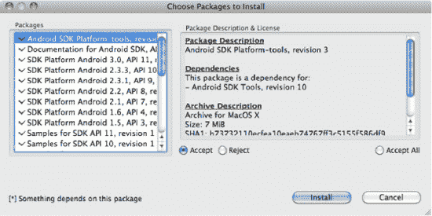
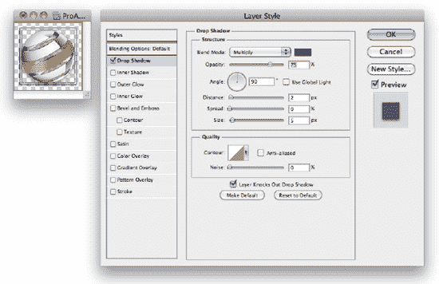

# 五、应用部署和发布

至此，我们已经向您展示了如何在 Flash 平台上构建引人入胜的应用，这些应用利用了 Flash Professional 和 Flash Builder 中的移动功能。然而，为了展示您新开发的应用，您需要知道如何准备您的应用进行部署，将它们安装在开发设备上，并将您的应用部署到 Android Market，最终用户可以在那里下载它们。

在本章中，我们将首先向您展示如何安装和配置 Android SDK，并在 Android 模拟器中运行。这是在一系列不同设备类型和操作系统组合上试验您的应用的好方法，这通常需要专门的设备测试实验室。

接下来，我们将向您展示如何从 Flash Professional 和 Flash Builder 部署您的应用，并使用您在前面章节中开发的一些应用作为示例。这是对高级主题的补充，如证书创建、命令行部署和 Android 模拟器的打包。

最后，我们向您展示如何将您的应用发布到 Android Market 和 Amazon Appstore。一旦您成功发布了一个应用，它将像商店中的任何其他本机应用一样出现，因为它是在 Flash 平台上构建的，这一事实对您的最终用户是完全透明的。

### 设置 Android 模拟器

如果您没有现成的 Android 设备，或者正在寻找一种方法在新的或不同的硬件上部署和测试您的代码，Android Emulator 是一个很好的选择。SDK 附带的 Android 模拟器尽可能接近于运行真实的东西，包括运行完整的 Android 操作系统堆栈，并支持类似的开发人员与 USB 连接设备的交互。

Table 5–1 比较了在设备上运行、在仿真器中运行和在 AIR Debug Launcher (ADL)中运行的体验。

正如你所看到的，ADL 是一种在开发过程中测试 Flash 应用的方便方法，但它不是一个完整的 Android 环境。相比之下，Android 模拟器在虚拟设备上运行完整版本的 Android 操作系统，因此您可以测试您的应用在不同的操作系统版本和屏幕组合上的表现。

在桌面模拟器中运行时有一些限制。最值得注意的是，你没有多点触摸支持。此外，一些 Android 按钮和功能只能通过命令行选项或按键绑定来使用，这将在下一节“模拟器按键绑定”中详细介绍

尽管有这些限制，Android 模拟器是在多种不同设备和 Android 操作系统版本上测试您的应用的一种非常经济有效的方式，也是一种您不想失去的工具。

#### 安装 Android SDK

在设备上安装和运行 Flash 的先决条件是安装 Android SDK。为了运行模拟器，您需要下载并安装 Java SDK 和 Android SDK。您可以在此下载适用于您的平台的最新版本的 Java:

`http://java.sun.com/javase/downloads`

**注:** Java 预装在 Mac OS X 上

Android SDK 可免费用于个人和商业用途，并可通过以下网址从 Google 下载:

`http://developer.android.com/sdk`

初始下载相对较小，可以解压缩到您选择的目录中。要完成安装，您必须在主目录中运行 SDK 安装程序。这将提示您一个软件包安装对话框，如图 Figure 5–1 所示。

**图 5–1。** *AIR for Android 软件包安装对话框*

您可以选择想要的软件包，方法是分别选择它们并单击“接受”按钮，或者只需单击“全部接受”。一旦您点击安装按钮，您接受的软件包将被下载和安装。

**注意:** Windows 用户必须安装一个额外的 USB 连接包，才能使用带有 USB 连接线的手机。如果你使用的是谷歌 Android 开发者手机，你可以在这里找到驱动:`[`developer.android.com/sdk/win-usb.html`](http://developer.android.com/sdk/win-usb.html).`

一个可选的步骤是安装 Eclipse 和 Eclipse 的 Android 开发工具(ADT)插件。正如下一章所讨论的，如果你想做任何原生 Android 开发，这是很有帮助的。ADT Eclipse 插件可以从以下 URL 下载:

`http://developer.android.com/sdk/eclipse-adt.html`

也可以使用您选择的 IDE 来开发原生 Android 应用。您只需使用 Android SDK 附带的命令行工具来编译和打包您的项目。

#### 创建 Android 虚拟设备

Android 模拟器的核心是 Android 虚拟设备(AVDs)。每个 AVD 指定该设备特有的设置，包括 API 版本、屏幕大小和硬件属性。使用 AVDs，您可以拥有自己的私有虚拟设备实验室，针对要测试应用的每个目标设备进行不同的配置。

首先，您需要创建第一个 AVD 来运行 Flash 平台应用。这是在 Android SDK 和 AVD 管理器中完成的，在第一次安装 SDK 时运行。

您可以通过导航到`sdk/tools`目录并启动`android`可执行文件，从命令行重新启动 Android SDK 和 AVD 管理器。

片刻之后，Android 将启动 SDK 管理器。在这里，您可以通过执行以下步骤来创建一个新的 AVD。

1.  导航到虚拟设备窗格。
2.  点击 New…按钮打开如图 Figure 5–2 所示的 AVD 创建对话框。
3.  在名称输入字段中指定“MyAndroidDevice”。
4.  在尺寸输入字段中输入“50”。
5.  从目标下拉列表中选择“Android 2.3.3 - API Level 10”(或更高版本)。
6.  选择名为“WVGA854”的内置皮肤。
7.  单击创建 AVD 按钮。

**图 5–2。** *对话框创建新的 Android 虚拟设备*

步骤 3 中 AVD 的名称只是一个建议，所以您可以用另一个名称替换这个字符串。

要启动新创建的 AVD，请在列表中选择它，然后单击 Start…按钮。它会显示标准的 Android 启动屏幕，然后是一个锁定屏幕。拖动锁形符号解锁仿真器后，您将看到熟悉的主屏幕，如图图 5–3 所示。

**图 5–3。**??【Android 2 . 3 . 3】运行在桌面上的仿真器

模拟器的 Android 标准皮肤在左边显示你的设备屏幕，在右边显示完整的 Android 按钮和按键。有些键，比如拨号和挂断键，可能并不是在每个 Android 设备上都可以找到，但是模拟器仍然可以让你测试你的应用在这些键被按下时的行为。

几乎所有你能在普通 Android 设备上做的事情都可以在模拟器上实现，所以在继续安装你自己的应用之前，先熟悉一下用户界面。您可以启动预装的应用，如浏览器、联系人或电子邮件，或者来自 Android Market 的新应用。默认情况下，模拟器映像带有所有启用的开发选项，如 USB 调试、“保持清醒”和模拟位置，但熟悉设置应用也是值得的。

#### 在仿真器内安装空气

当您通过 USB 调试在物理设备上运行时，如果您的 AIR SDK 包含较新版本，Flash Builder 将自动提示您升级已安装的 AIR 版本。您还可以选择直接从 Android Market 下载并安装 AIR 的发布版本，这正是在您运行没有安装 AIR 的 Flash Android 应用时会发生的情况。

然而，在模拟器的情况下，你不能直接在 Android Market 之外使用 AIR 的版本，因为它们不兼容。此外，由于 Flash Builder 不直接与 Android 模拟器集成，因此您也不能使用自动更新机制来安装 AIR。

解决方法是从 SDK 手动安装 AIR 运行时。AIR SDK 可以在 Flash Builder 安装的`sdks/<version>`文件夹中找到(截至发稿时，最新版本为 4.5.0)。在 AIR SDK 文件夹中，您可以在以下位置找到模拟器运行时:

`runtimes/air/android/emulator/Runtime.apk`

**注意:**设备和模拟器有单独的 AIR 运行时，因此请确保为此选择模拟器运行时。

可以从命令行使用 Android Debug Bridge (ADB)程序安装该文件。ADB 是 Android SDK 附带的工具之一，可以在`platform-tools`文件夹中找到。清单 5–1 展示了在 Mac OS X 的默认安装位置安装模拟器 APK 的命令

`***Listing 5–1.** Installation Command for the AIR Emulator Runtime*`

`adb install "/Applications/Adobe Flash Builder
4.5/sdks/4.5.0/runtimes/air/android/emulator/Runtime.apk"`

在 Windows 上，该命令非常相似，只是 Flash Builder 安装的路径位置不同。

**提示:**您还可以使用 AIR 调试工具(ADT)来安装 AIR 运行时。配置 ADT 将在本章后面的“设置 ADT”一节中介绍。使用 ADT 安装 AIR 运行时的命令如下:

`adt -installRuntime -platform android`

#### 仿真器按键绑定

在 Android 模拟器中运行时，您可以选择使用普通的桌面键盘作为输入。除了 Android 设备上有几个特殊的键没有到桌面键盘的正常映射之外，这种方式工作得相当好。例如电源按钮、音量和相机按钮。

为了便于在 Android 设备上按下这些按钮，默认的设备皮肤在物理仿真器面板上包含了这些按钮，因此您可以用鼠标单击它们。然而，不能保证将来你自己安装的 Android 皮肤或自定义皮肤会有完整的按钮。一个这样的皮肤，如图图 5–4 所示，给你一个接近照片质量的 Nexus S 设备外观，1但是缺少一些按钮。

**图 5–4。** *Nexus S 安卓模拟器皮肤*

__________

1 黑科·伯伦斯的 Nexus S Skin:`[`heikobehrens.net/2011/03/15/android-skins/`](http://heikobehrens.net/2011/03/15/android-skins/)`

为了克服这个限制，Android 模拟器提供了完整的按键绑定。Table 5–2 列出了从普通 Android 键到桌面键盘修饰键的映射，当使用任何仿真器皮肤时，您都可以键入这些修饰键。

除了重新映射 Android 按钮之外，模拟器还有一些隐藏的功能，只能通过按键绑定来访问。Table 5–3 显示了一些特殊的键绑定，在仿真器中测试应用时，您会发现它们很有用。

为了充分利用前面的键绑定，您需要知道如何从命令行启动模拟器并传入参数。从命令行启动 Android 模拟器是对`emulator`可执行文件的直接调用，该文件可以在`sdk/tools`目录中找到:

`emulator -avd <Virtual Device Name>`

您替换的虚拟设备名称与 Android 工具中定义的名称完全相同，如前一节所示。然后，您可以添加任何想要使用的附加选项，例如`-trace`或`-onion`。

### 部署 AIR 应用

如果您一直使用设备通过 USB 测试您的应用，那么您已经在开发过程中进行了有限形式的部署。然而，您可能使用的是调试版本，当您的最终用户获得一个完全打包的应用时，不必担心对他们来说很重要的许多事情，比如权限、适当的证书和图标。

在这一节中，我们将更详细地研究应用描述符，演示如何微调您的应用部署，以改善用户体验并为您的公司形象树立品牌。

#### 设置 ADT

虽然可以通过 Flash Professional 和 Flash Builder 完成整个发布工作流，但对于自动化和脚本编写而言，能够从命令行完成相同的活动非常有用。Adobe AIR SDK 提供了一个名为 AIR Developer Tool (ADT)的命令行，它允许您从脚本或构建文件执行任何操作。

要从命令行使用 ADT，必须预先设置以下内容:

*   为您的平台安装 AIR SDK(这是使用 Flash Builder 自动安装的)。
*   安装有效的 Java 运行时环境(JRE)。
*   将 Java 运行时添加到您的`PATH`环境变量中。
    *   对于 Windows，这将是`%JRE_HOME%\bin`。
    *   对于麦克·OS X 来说，这将是`$JRE_HOME/bin.`
    *   其中`JRE_HOME`是 JRE 安装位置的完全限定路径
*   将 AIR SDK 添加到您的`PATH`环境变量中。
    *   对于 Windows，这将是`%AIR_SDK%\bin`。
    *   对于麦克·OS X 来说，这将是`$AIR_SDK/bin`。
    *   其中`AIR_SDK`是 AIR SDK 安装位置的完全限定路径

设置完成后，您可以使用 ADT 从命令行完成许多不同的打包和部署活动。其中包括以下内容:

*   *创建签名证书* : ADT 允许您从命令行创建代码签名证书，这些证书可以在打包应用时使用。
*   *打包应用*:通过传入一个项目文件列表和一个有效的证书，你可以打包一个 APK 文件部署到 Android 设备上。这支持创建一个有或没有调试符号的 APK 文件，也允许你以 Android 模拟器为目标。
*   *安装应用*:打包步骤创建的 APK 文件可以安装在设备上。这需要一个到 Android SDK 的路径。
*   *启动应用* : ADT 也可用于在设备上启动应用。这也需要一个通往 Android SDK 的路径。

在本章中，我们将利用 ADT 来展示 Flash 工作流的自动化潜力。

#### 应用权限

用户对您的应用的第一印象将是它在安装时请求的不同权限的列表。因此，您应该确保您所请求的权限对您的应用有意义，并且是您可以交付功能的最小集合。

请求太大的权限可能会让用户暂停安装应用。例如，Twitter 客户端没有理由需要写入外部存储，因此请求该权限可能会阻止精明的用户出于安全考虑安装您的应用。

**提示:**您可能已经默认启用的权限之一是`INTERNET`权限。应用的 USB 调试需要该权限，因此在开发过程中启用该权限非常重要。大多数应用还需要访问 Internet 运行时，因此很可能您发布的应用版本也需要此权限；但如果没有，记得禁用这个。

##### 在 Flash Professional 中更改权限

Flash Professional 有一个专用的用户界面来管理所有部署选项，包括权限。若要打开“设置”面板，请从“文件”菜单中选择“Air for Android 设置…”。然后点击 Permissions 选项卡，您将得到一个对话框，其中每个权限都有复选框，如图 Figure 5–5 所示。

**图 5–5。**??【Flash 职业权限】选项卡中的空中安卓设置对话框

您还可以通过选择顶部的复选框来手动设置应用描述符文件中的权限。如果您想这样做，请参阅“手动更改应用描述符中的权限”一节。

##### 在 Flash Builder 中设置初始权限

Flash Builder 允许您在首次创建项目时设置权限。为此，点击新建移动项目向导第二页中的权限选项卡，如图 Figure 5–6 所示。

**图 5–6。** *新建项目向导中的 Flash Builder 权限选项卡*

请注意，当您进入对话框时，`INTERNET`权限是预先选定的。这是 USB 设备调试工作所必需的。如果您需要任何额外的权限，可以在开始项目之前设置它们。

一旦创建了项目，就不能再通过项目设置对话框更改权限。相反，您可以按照下一节中的说明直接编辑为您创建的应用描述符文件。

##### 手动更改应用描述符中的权限

如果您选择手动管理权限(对于 Flash Professional)或在项目创建后修改权限(对于 Flash Builder)，则您需要知道如何修改应用描述符文件来更改权限。

应用描述符文件通常位于项目的源根目录中，并按照惯例`<project-name>-app.xml`命名。它被格式化为 XML 标记的标记，其中包含您可以以声明方式控制的所有不同应用设置的部分。权限设置可以在文件底部的`android`标签下找到，如清单 5–2 所示。

**清单 5–2。** *示例 AIR 应用描述符的权限部分*

`<android>
  <manifestAdditions>
    <manifest android:installLocation="auto">
      <![CDATA[
        <uses-permission android:name="android.permission.**PERMISSION_NAME** " />
      ]]>
    </manifest>
  </manifestAdditions>
</android>`

对于您想要启用的每个权限，您可以复制`uses-permission`标记并用适当的权限名称替换`PERMISSION_NAME`占位符。清单 5–3 以适当的格式显示了所有可用的 Android 权限的例子，直接包含在应用描述符中。

**清单 5–3。** *全套可用安卓权限*

`<uses-permission android:name="android.permission.INTERNET" />
<uses-permission android:name="android.permission.WRITE_EXTERNAL_STORAGE" />
<uses-permission android:name="android.permission.READ_PHONE_STATE" />
<uses-permission android:name="android.permission.ACCESS_FINE_LOCATION" />
<uses-permission android:name="android.permission.DISABLE_KEYGUARD" />
<uses-permission android:name="android.permission.WAKE_LOCK" />
<uses-permission android:name="android.permission.CAMERA" />
<uses-permission android:name="android.permission.RECORD_AUDIO" />
<uses-permission android:name="android.permission.ACCESS_NETWORK_STATE"/>
<uses-permission android:name="android.permission.ACCESS_WIFI_STATE"/>`

在这些权限中，有一些可以作为一个组来启用和禁用，例如:

*   AIR 的`SystemIdleMode`API 需要`DISABLE_KEYGUARD`和`WAKE_LOCK`权限。
*   AIR 的`NetworkInfo`API 同时需要`ACCESS_NETWORK_STATE`和`ACCESS_WIFI_STATE`

因此，如果您计划使用这两种 API 中的任何一种，请确保同时启用这两种权限。

#### 图标和资源

每次用户打开你的应用，他们都会看到你选择的 Android 启动图标，所以这是很专业的，并且代表你的应用，这一点很重要。

从 Android 2.0 开始，他们标准化了面向前的图标设计，建议选择应用的一个方面，并用全尺寸的描述来强调这一点。图 5–7 突出显示了一些启动器图标，它们是推荐的 Android 外观和感觉的模型示例。

**图 5–7。** *示例 Android 应用启动器图标* **2**

为了更容易地构建符合这些标准的应用图标，Android 团队提供了一个包，其中包含不同大小图标的样本材料和模板。您可以从以下网址下载 Android 图标模板包:

`http://developer.android.com/guide/practices/ui_guidelines/icon_design.html#tem
platespack`

该软件包包括 Photoshop 模板，您可以使用这些模板在边框内精确排列图形，以及配置为应用适当效果(如图标投影)的滤镜。

图 5–8 显示了本书示例中使用的 Pro Android Flash 图标的 Photoshop 文件。它采用“网络水果”图形作为封面艺术的中心，并使用这一单一元素作为书籍的代表性图标。

__________

2 转载自 Android 开源项目创建和共享的作品，并根据知识共享 2.5 归属许可中描述的条款使用:`[`developer.android.com/guide/practices/ui_guidelines/icon_design_launcher.html`](http://developer.android.com/guide/practices/ui_guidelines/icon_design_launcher.html)`

**图 5–8。***Adobe Photoshop 中的安卓图标模板*

因为我们使用的形状是圆形的，所以它可以接触到外部的蓝色边界(1/6 的间隔)。方形图标不应超出橙色边界线(2/9 英寸的距离)。我们也使用推荐的高密度投影设置，2 像素距离，5 像素大小，90 度角。Table 5–4 列出了不同密度图标的图标尺寸、边框大小和阴影设置。

要完成图标的准备工作，请隐藏用于创建图标的任何参考图层，并将其保存为透明的可移植网络图形(PNG)文件。如果您使用的是 Photoshop，最好的方法是使用“文件”菜单中的“存储为 Web 和设备所用格式”命令。这可以确保您的图像文件尽可能小，删除任何不必要的头信息。

一旦你创建了你的图形，你可以将它们包含在你的应用描述符中，这样它们将与你的应用捆绑在一起，并显示在你部署的应用的启动器和菜单中。Flash Professional 有一个配置页面，允许您选择图标并将它们链接到您的应用，如图 5–9 所示。

**图 5–9。***Flash 专业设置对话框的图标选择选项卡*

您选择的每个图形文件都将被移动到名为`AppIconsForPublish`的文件夹中，该文件夹位于您的项目文件位置。部署后，这些图标将被复制到生成的`.apk`文件中，并作为相应的密度素材进行链接。

如果您使用 Flash Builder 或手动管理应用描述符，则必须手动编辑 XML。在文本编辑器中打开应用描述符后，添加一个`icon`部分，列出应用支持的不同密度图标的绝对或相对路径。清单 5–4 展示了应用描述符的`icon`部分应该是什么样子。

**清单 5–4。** *空中应用描述符*的示例`icon`部分

`<icon>
  <image36x36>ProAndroidFlashIcon36.png</image36x36>
  <image48x48>ProAndroidFlashIcon48.png</image48x48>
  <image72x72>ProAndroidFlashIcon72.png</image72x72>
</icon>`

`icon`标签应该直接位于文件的外部`application`标签之下。在本例中，所有图标资源都与应用描述符文件位于同一个文件夹中，因此路径是一个简单的文件名。您可以将文件命名为任何名称，只要它们与描述符文件中的内容相匹配。

#### 代码签名证书

Android 要求所有部署的应用都要签名。为了将应用部署到 Android Market，您不必从证书颁发机构购买昂贵的代码签名证书。所需的只是一个简单的自签名证书，因为谷歌负责检查在其市场上销售应用的各方的身份。

Flash Professional 和 Flash Builder 都提供用户界面来快速轻松地创建证书。您也可以使用 AIR Developer Tool (ADT)从命令行创建证书。所有这些机制创建的证书都是相同的，可以在工具之间互换使用。

若要在 Flash Professional 中创建证书，请从“文件”菜单中打开 Air for Android 设置…。在此对话框的“部署”选项卡上，您可以单击“创建…”按钮，通过弹出窗口生成新的证书，如图 5–10 所示。

**图 5–10。** *Flash 职业证书创建对话框*

我们将在前面更详细地讨论创建证书的字段，但是如果您是为了开发目的而创建证书，那么您可以输入您想要的任何内容。Flash Professional 要求您在继续之前填写所有字段。

Flash Builder 有一个相同的表单，可以从 Google Android 数字签名部分的项目属性对话框中访问。再次点击 Create…按钮打开证书创建对话框，如图 Figure 5–11 所示。

**图 5–11。** *Flash Builder 证书创建对话框*

Flash Builder 对话框与 Flash Professional 对话框几乎相同，只是省略了有效期。这将自动默认为 25 年。

#### 使用 ADT 创建证书

若要从命令行创建证书，可以使用 AIR 开发工具(ADT)。有关设置 ADT 的更多信息，请参阅本章前面的“设置 ADT”一节。

要通过命令行创建代码签名证书，您需要键入以下命令:

`adt -certificate -cn <name> ( -ou <org-unit> )? ( -o <org-name> )? ( -c <country> )? ( -
validityPeriod <years> )? <key-type> <pfx-file> <password>`

括号中的参数是可选的，可以省略。您可以自己选择的值用尖括号括起来。所有参数的描述和有效值在表 5–5 中列出。

**注意:** Android Market 要求证书的有效期必须超过 2033 年 10 月 22 日。因此，建议有效期至少为 25 年。

例如，以下命令将创建一个有效的 Android 代码签名证书:

`adt -certificate -cn ProAndroidFlash -validityPeriod 25 1024-RSA proandroidflash.p12
superSecretPassword`

然后，您可以通过运行`checkstore`命令来验证证书是否有效:

`adt -checkstore -storetype pkcs12 -keystore proandroidflash.p12 -storepass superSecretPassword`

如果证书创建成功，该命令将返回`"valid password"`。

#### 从 Flash Professional 发布

一旦您设置了适当的权限、图标和证书，从 Flash Professional 发布应用就像按一个按钮一样简单。事实上，您可以选择几个按钮或菜单项:

*   Android 设置对话框中的发布按钮
*   “发布设置”对话框中的“发布”按钮
*   “文件”菜单中的“发布”菜单项

这三个位置在图 5–12 中描述。除了在错误输入或信息不完整的情况下(例如证书密码丢失)，您将被重定向到 AIR for Android 设置对话框，它们的工作方式完全相同。

**图 5–12。** *AIR for Android 部署设置对话框*

在 AIR for Android 设置对话框的部署选项卡上有几个部署选项，我们还没有谈到，但它们在发布时很重要。首先是选择一个`Device`、`Emulator`或`Debug`版本。如果您正在创建一个供最终用户使用的 Android 包，请确保选择一个`Device`版本。

如果您计划在 Android 模拟器中测试您的应用，那么`Emulator`版本是必需的，所以如果这是您计划测试您的应用的方式，请确保选择此选项。然而，记住切换回一个`Device`版本以分发给最终用户。

一个`Debug`版本是当你通过 USB 调试测试你的应用时通常会构建的项目类型。与`Device`版本相比，这种版本的性能较慢，并且在错误条件下的行为略有不同，因此不建议将其用于分发目的。

您还可以选择应用下载 AIR 运行时的位置。目前支持的两个应用商店是谷歌 Android Market 和亚马逊 Appstore。如果您计划将应用部署到这两个应用商店，则应该使用不同的 AIR 运行时设置为每个商店创建单独的版本。

最后一组选项将自动在第一个连接的 USB 设备上安装和启动您的应用包。这些对于以发布形式测试新构建的应用非常方便。如果您正在运行模拟器，Flash Professional 会将其视为连接的设备，并且还可以自动部署到该设备。

点击发布，一个 Android 包文件(APK)将为你的应用创建。APK 文件是一个自包含的安装包，您可以将其部署到设备或通过应用商店发布。APK 文件的位置和名称在“发布设置”对话框的“输出文件”栏中设定。

#### 从 Flash Builder 导出发布版本

Flash Builder 还能够为您的应用打包 APK 文件。从项目菜单中选择导出发布版本…开始导出过程，之后您将看到一个向导对话框，如图 5–13 所示。

**图 5–13。**??【Flash Builder 导出发布构建向导】

向导的第一页允许您选择平台、文件名和签名选项。对于移动应用，您通常希望选择第一个选项来为每个目标平台签署包，在我们的例子中只有一个。要进入第二页，请单击“下一步”按钮。

第二页包含几个选项卡，其中包含数字签名、包内容和部署的选项。如果您已经按照本章前面的讨论设置了您的签名，除了可能输入密码之外，您不必在第一个选项卡上进行任何更改。Package Contents 选项卡显示了所有资源的列表，将包含在 APK 文件中。除非您想明确排除任何文件，如未使用的图形，否则您不需要在此进行任何更改。最后，最后一个选项卡有一个选项，可以在连接的移动设备上自动部署和运行(如果可用)，这是默认选择的。

单击“完成”按钮后，Flash Builder 将打包一个用于发布的 APK 文件，并可能在已安装的设备上部署和启动该文件。

#### 在 Android 模拟器中运行 Flex 应用

与 Flash Professional 发布过程相比，您可能会注意到在 Flash Builder 对话框中没有提到 Android 模拟器。此外，如果您尝试在 Android 模拟器上安装由 Flash Builder 创建的 APK 文件，安装将会失败并出现错误。

但是，您可以从命令行使用 AIR Developer Tool (ADT)手动创建同一应用的模拟器友好版本。有关设置 ADT 的更多信息，请参阅本章前面的“设置 ADT”一节。

作为一个例子，清单 5–5 向您展示了如何为第一章中构建的手势检查项目构建一个仿真器友好的 APK。请确保在 Flash Builder 已经构建了 SWF 文件后，从`bin-debug`文件夹执行此命令。

`***Listing 5–5.** Command to Build an APK File for the GestureCheck Project*`

`adt -package -target apk-emulator -storetype pkcs12 -keystore <certificate file>
GestureCheck.apk GestureCheck-app.xml GestureCheck.swf ProAndroidFlashIcon*.png`

这将构建一个与 Android 模拟器兼容的 APK 文件。在模拟器运行时，您可以使用 ADT 工具通过执行以下命令来安装它:

`adt -installApp -platform android -package GestureCheck.apk`

**提示:**您也可以使用 Android 调试桥(ADB)安装 APK 文件，如下所示:

`adb install GestureCheck.apk`

您的应用现在将出现在模拟器的应用菜单中。您可以通过菜单手动启动应用，或者使用以下命令以编程方式启动应用:

`adt -launchApp -platform android -appid com.proandroidflash.GestureCheck.debug`

请注意，`appid`与您的应用描述符中的`id used`相同，只是多了一个“.”。`debug`”追加到末尾。

**提示:**您也可以使用 ADB 启动 AIR 应用，如下所示:

`adb shell am start -a android.intent.action.MAIN -n
air.com.proandroidflash.GestureCheck.debug/.AppEntry`

Figure 5–14 展示了一个在普通 Android 模拟器上运行的手势检查应用的真实例子。

**图 5–14。** *运行在桌面模拟器上的 Android 2 . 3 . 3*

如前所述，Android 模拟器不支持多点触摸事件，这一点通过查看手势检查应用在模拟器中运行时的输出可以明显看出。

#### 从命令行部署

虽然 Flash Professional 和 Flash Builder 使从工具内部部署应用变得非常方便，但是能够从命令行执行相同的部署通常也很有用。这允许您创建一个可重复的、自动化的过程，该过程是为您的开发工作流的确切需求而定制的。

我们将使用的命令行工具称为 AIR Developer Tool (ADT ),它可以自动执行多种不同的任务，从证书创建到应用打包再到设备部署。有关设置 ADT 的更多信息，请参见前面的“设置 ADT”一节。

ADT 中用于包装空气应用的主要标志是`-package`。这表明您将为桌面、移动或其他部署打包 AIR 应用。以下是用 ADT 打包 Android 应用的全部论据:

`adt -package -target ( apk | apk-debug | apk-emulator ) ( -connect <host> | -listen
<port>? )? ( -airDownloadURL <url> )? SIGNING_OPTIONS <output-package> ( <app-desc>
PLATFORM-SDK-OPTION? FILE-OPTIONS | <input-package> PLATFORM-SDK-OPTION? )`

Table 5–6 讨论了这些参数以及有效值。

虽然打包选项的排列看起来令人望而生畏，但是您只需要所需的参数就可以完成大多数任务。例如，下面将使用应用描述符中的信息打包一个简单的应用:

`adt -package -target apk -storetype pkcs12 -keystore cert.p12 Sample-app.xml Sample.swf`

这是从描述符和 SWF 文件打包应用的最小参数集。要构建调试版本，您应该执行以下操作:

`adt -package -target apk-debug -listen -storetype pkcs12 -keystore cert.p12 Sample-
app.xml Sample.swf`

这将在启动时监听端口`7936`上的 USB 调试接口。

如果您知道要为同一个项目创建多个部署，AIR Intermediate (AIRI)文件会非常方便。您可以从 Flash Builder 导出一个 AIRI 文件，也可以在命令行上使用以下语法的`prepare`命令创建一个文件:

`adt -prepare Sample.airi Sample-app.xml Sample.swf`

然后，您可以使用`package`命令的`input-package`变体部署到多个不同的目标:

`adt -package -target apk -storetype pkcs12 -keystore cert.p12 Sample-android.apk
Sample.airi
adt -package -target apk -airDownloadURL
http://www.amazon.com/gp/mas/dl/android?p=com.adobe.air  -storetype pkcs12 -keystore
cert.p12 Sample-amazon.apk Sample.airi`

这将创建两个不同的 APK 文件，一个准备部署到 Android Market，另一个使用不同的 AIR 下载 URL 从 Amazon Appstore 获取运行时。

命令行部署练习

本练习将指导您逐步完成打包、签名、安装和启动 Flash Capability Reporter 示例的过程。

以下是练习的先决条件:

1.  AIR SDK 已安装并位于路径中
2.  Java 运行时环境(JRE)已安装并位于路径中
3.  安装了 Android SDK

首先打开命令提示符或终端。您应该能够键入不带选项的命令`adt`,并获得命令参数的帮助。如果它找不到`adt`命令或者抱怨`java`不在路径中，验证你已经正确地更新了你的 path 环境变量。

<ins>**创建代码签名证书**</ins>

要创建代码签名证书，您可以发出以下命令，其中尖括号中的值应该替换为您的名称和密码:

`adt -certificate -cn <YourName> -validityPeriod 25 1024-RSA exercise.p12 <YourPassword>`

如果命令成功完成，它将返回退出代码 0。

<ins>**打包应用**</ins>

要打包该应用，请确保您已经在 Flash Professional 中运行了该应用一次，以便可以创建电影(* `.swf`)和应用描述符(* `-app.xml`)文件。然后使用以下命令将其打包成一个 APK 文件:

`adt -package -target apk -storetype pkcs12 -keystore exercise.p12
FlashCapabilityReporter.apk FlashCapabilityReporter-app.xml FlashCapabilityReporter.swf
AppIconsForPublish/`

这将创建一个包含应用可部署版本的 APK 文件。

<ins>**安装并启动应用**</ins>

另外，您可以使用以下命令将应用安装并启动到通过 USB 连接的设备上:

`adt -installApp -platform android -package FlashCapabilityReporter.apk
adt -launchApp -platform android -appid com.proandroidflash.FlashCapabilityReporter`

如果成功，Flash Capability Reporter 应用将安装并运行在您的 Android 手机上。

### 将 AIR 应用发布到 Android Market

Android Market 是谷歌为 Android 设备创建和运营的应用商店。与苹果应用商店或亚马逊应用商店等其他应用商店相比，安卓市场非常开放。它没有一个限制性的筛选过程，它允许最终用户试用一个应用一天，如果他们不喜欢它，可以选择全额退款。

谷歌向开发者收取 25 美元的费用，以便创建一个可以用来提交无限数量的应用的帐户。据谷歌称，这项费用旨在通过防止应用垃圾来提高市场质量。

本节概述了将 Adobe AIR 应用发布到 Android marketplace 的三步流程。

#### 第一步:创建一个 Android Market 开发者账户

要创建 Android Market 开发者帐户，请访问以下网站:

`http://market.android.com/publish/Home`

您将被要求登录您想要链接到您的 Android Market 开发者帐户的 Google 帐户。如果你已经有一个谷歌帐户，你可以使用它，否则可以免费创建一个新帐户。但是，请记住，一旦您链接了您的 Google 帐户，在不创建新的 Android Market 开发者帐户的情况下，将来将无法更改它。

接下来，提供所需的信息，如您的全名、网站 URL 和电话号码，并按照提示操作，直到您到达 Google Checkout 网站，以便提交您的注册费。要完成这个过程，请在结帐后按照链接返回注册页面，并同意 Android Market 许可证。

#### 第二步:打包你的应用

为了上传到 Android 商店，你需要一个被打包成 APK 文件的签名应用。您可以从 Flash Professional、Flash Builder 或命令行执行此操作，如前几章所述。

提交申请时，你需要记住以下几点:

*   确保您提交的是应用的发布版本(而不是调试或仿真版本)。
*   如果不需要调试所需的`INTERNET`权限，记得禁用它。
*   确保在所有标准 Android 尺寸(36×36、48×48 和 72×72)的应用中包含自定义图标。
*   确保您将 AIR 运行时 URL 设置为 Android Market(这是默认设置)。

一旦你建立了 APK 文件，你就可以开始发布你的应用到 Android Market 了。

#### 步骤 3:上传您的 Adobe AIR 应用

Android Market 应用提交过程是完全自动化的，包括每个步骤的详细说明。Figure 5–15 展示了一个例子，展示了如果您使用第一章中的手势检查示例应用，提交过程会是什么样子。

**图 5–15。** *安卓市场提交流程*

大部分的申请提交过程只需上传你的 APK 文件。这包括选择图标、设置权限和选择支持的平台。

除了 APK 文件之外，你还需要提交至少两张你的申请截图以及一个大尺寸图标(512 像素见方)。要截屏你的应用，你可以在桌面上的模拟器中运行它，然后把图片裁剪到合适的大小，或者使用截屏工具直接在你的 Android 设备上拍照。

在填写必填字段后，您可以提交您的应用，它将立即在 Android Market 中可用。图 5–16 显示了一个成功的应用部署到 Android Market 的成功结果。

**图 5–16。** *成功部署安卓市场应用*

### 将 AIR 应用发布到亚马逊应用商店

亚马逊应用商店是第二个购买 Android 设备应用的市场。它与亚马逊的店面紧密集成，允许你从一个界面购买 Android 应用以及书籍、CD 和其他产品。此外，它使用亚马逊的专利一键式购买系统来简化在移动设备上购买应用的过程。

通过亚马逊应用商店发布应用的费用要高得多，每年订阅费用为 99 美元。幸运的是，亚马逊已经免除了同时注册亚马逊开发者计划的开发者第一年的费用。

发布到亚马逊 Appstore 的要求和流程与 Android Market 非常相似。设置您的帐户、打包您的应用并将其上传到商店的三个步骤仍然适用。

提交到亚马逊 Appstore 时，一定要设置 AIR 运行时 URL 指向亚马逊 Appstore 进行下载。这可以通过 Flash Professional UI 中的部署设置来完成，也可以通过命令行将 ADT 的`-airDownloadURL property`设置为以下内容来完成:

`http://www.amazon.com/gp/mas/dl/android?p=com.adobe.air`

Figure 5–17 展示了 Amazon Appstore 应用提交的一个例子。

**图 5–17。** *亚马逊应用商店提交流程*

作为开发人员，在向 Amazon Appstore 提交应用时，您会注意到以下一些主要差异:

*   您需要提交三张您的应用截图，并且它们的大小必须精确到 854×480 或 480×854。
*   除了 512×512 的图标，亚马逊 Appstore 还要求 114×114 的图标。
*   你不能立即看到你的应用出现在亚马逊应用商店，你必须等待它通过审查过程。

尽管存在这些差异，但大多数应用提交过程都非常相似，这使得将您的 AIR Android 应用部署到这两个应用商店非常容易。

### 总结

本章结束了 Flash 平台的端到端移动应用开发过程。现在，您已经知道如何将应用从初始阶段发展到最终用户可以从市场上下载的完全发布的 Android 应用。

在本章中，您学习了如何执行以下操作:

*   设置 Android 模拟器并配置 Android 虚拟设备
*   配置应用在安装时请求的权限
*   指定启动器图标和其他资源作为应用的一部分
*   从 Flash Professional、Flash Builder 和命令行发布 AIR 包
*   在设备上或 Android 模拟器中测试您的应用包
*   将您的应用发布到 Android Market 和 Amazon Appstore

在接下来的几章中，我们将进一步深入探讨与 Android 的原生集成、针对移动设备的性能调整以及与设计师的合作。