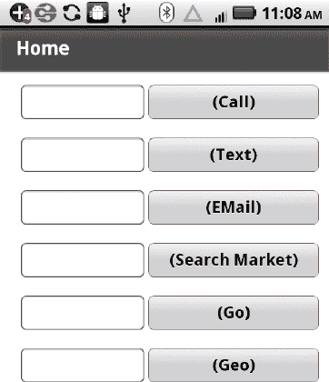
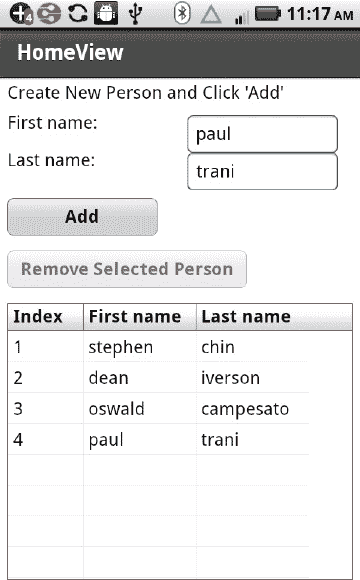
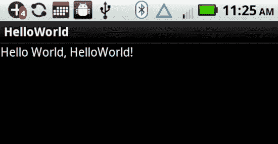
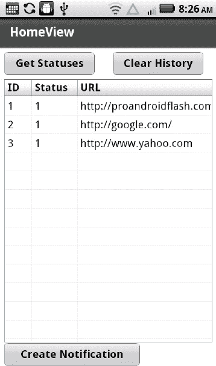

# 六、Adobe AIR 和原生 Android 应用

您已经学习了如何创建有趣的基于 Flex 的移动应用，在本章中，您将了解 Adobe AIR 中可用的其他有用功能，以及如何将 Android 特定的功能合并到 Adobe AIR 移动应用中。

首先，您将学习如何执行 Adobe AIR 中提供的两项操作:如何在 AIR 应用中启动本机浏览器，以及如何在 SQLite 数据库中存储特定于应用的数据。本章的下一部分深入探讨了 Android 的基础知识，你需要理解本章后面讨论的代码示例。本节将向您展示如何创建一个简单的原生 Android 应用，并讨论 Android 应用中的主要文件。您还将了解重要的 Android 特定概念，如活动、`Intent` s 和`Service` s。

本章的第三部分包含一个 Adobe AIR mobile 应用的示例，该应用调用外部 API 来提供用户已向外部服务注册的网站的状态信息。我们的 Adobe AIR 应用将每个网站的状态存储在 SQLite 数据库中，然后在数据网格中显示状态详细信息。这个移动应用还允许用户点击一个按钮，向原生 Android 代码发送更新，然后在 Android 通知栏中显示更新。本章的最后一部分包含将 Adobe AIR mobile 应用与本机 Android 代码集成所需的步骤。

关于本章的内容，有几点需要记住。首先，Android 内容旨在帮助您了解如何将原生 Android 功能集成到 Adobe AIR 应用中。因此，只涵盖了 Android 主题的一个子集，这不足以成为一名熟练的 Android 应用开发人员。其次，Adobe AIR 是一个不断发展的产品，因此 Adobe AIR 目前不可用的一些 Android 功能可能会在未来的版本中可用。第三，Adobe AIR 应用与原生 Android 功能的集成不受 Adobe 官方支持；因此，如果您在整合过程中遇到困难，没有正式的支持机制来帮助您解决这些困难。

另一个需要考虑的问题与 Adobe AIR mobile 应用的目标设备所支持的 Android 版本有关。例如，支持 Android 2.2 的移动设备的数量目前远远大于支持 Android 2.3.x 或 Android 3.0 的移动设备，这两种移动设备目前都仅限于几款平板电脑(如三星 Galaxy Tab 10.1 和摩托罗拉 Xoom)和一款智能手机(三星 Galaxy S II)。

另一方面，如果 Adobe AIR 支持您创建移动应用所需的所有功能和特性，那么您就不需要本章中说明如何将 Adobe AIR 应用与 Android 应用合并的任何代码示例。如果是这种情况，你可以跳过这些材料而不失去连贯性。

### 在 Adobe AIR 中调用 URI 处理程序

目前，Adobe AIR 中有五个与 URI 相关的处理程序，使您能够在 Adobe AIR mobile 应用中执行以下操作:

*   电话(打电话)
*   sms(发送文本消息)
*   mailto(发送电子邮件)
*   市场(进行市场搜索)
*   http 和 https(启动 web 浏览器)

每个处理程序的代码都非常简单，这使得在 Adobe AIR mobile 应用中嵌入这些处理程序非常简单。需要记住的一点是，Adobe AIR 不支持“地理”URI，但是您仍然可以导航到 maps.google.com，并且会提示用户在地图应用的浏览器会话版本中打开该 URL。这种“变通方法”使您能够在 Adobe AIR mobile 应用中支持与地图相关的功能。

使用移动应用模板创建一个名为 URIHandlers 的新 Flex 移动项目，并添加如清单 6–1 所示的代码。

**清单 6–1。** *调用 URI 处理程序*

`<?xml version="1.0" encoding="utf-8"?>
<s:View xmlns:fx="http://ns.adobe.com/mxml/2009"
        xmlns:s="library://ns.adobe.com/flex/spark" title="Home">
  <fx:Script>
    <![CDATA[
      import flash.sensors.Geolocation;

      [Bindable]
      public var tel:String;
      [Bindable]
      public var sms:String;
      [Bindable]
      public var mailto:String;
      [Bindable]
      public var search:String;
      [Bindable]
      public var http:String;
      [Bindable]
      public var geo1:String;

      private var geo:Geolocation;

      private function onTel():void {
         navigateToURL(new URLRequest("tel:"+tel));
      }

      private function onSMS():void {
         navigateToURL(new URLRequest("sms:"+sms));
      }

      private function onMailto():void {
         navigateToURL(new URLRequest("mailto:"+mailto+"?subject=Hello%20AIR"));
      }

      private function onSearch():void {
         navigateToURL(new URLRequest("market://search?q=iReverse"));
      }

      private function onHTTP():void {
         navigateToURL(new URLRequest(http));
      }

      private function onGeo():void {
         this.geo = new Geolocation();
         this.geo.addEventListener(GeolocationEvent.UPDATE, onLocationUpdate);
      }

      private function onLocationUpdate(e:GeolocationEvent):void  {
         this.geo.removeEventListener(GeolocationEvent.UPDATE,onLocationUpdate);
         var long:Number = e.longitude;
         var lat:Number = e.latitude;
         navigateToURL(new URLRequest("http://maps.google.com/"));
      }
    ]]>
  </fx:Script>

  <s:VGroup>
   <s:Form backgroundColor="0xFFFFFF" width="300">
    <s:FormItem>
      <s:HGroup left="0">
      <s:TextInput width="180" height="50" text="{tel}"/>
      <s:Button id="telID" width="250" height="50" label="(Call)" click="onTel();"/>
      </s:HGroup>
    </s:FormItem>

    <s:FormItem>
      <s:HGroup left="0">      <s:TextInput width="180" height="50" text="{sms}"/>
      <s:Button id="smsID" width="250" height="50" label="(Text)" click="onSMS();"/>` `      </s:HGroup>
    </s:FormItem>

    <s:FormItem>
      <s:HGroup left="0">
      <s:TextInput width="180" height="50" text="{mailto}"/>
      <s:Button id="mailtoID" width="250" height="50" label="(EMail)"
                click="onMailto();"/>
      </s:HGroup>
    </s:FormItem>

    <s:FormItem>
      <s:HGroup left="0">
      <s:TextInput width="180" height="50" text="{search}"/>
      <s:Button id="searchID" width="250" height="50" label="(Search Market)"
                click="onTel();"/>
      </s:HGroup>
    </s:FormItem>

    <s:FormItem>
      <s:HGroup left="0">
      <s:TextInput width="180" height="50" text="{http}"/>
      <s:Button id="httpID" width="250" height="50" label="(Go)" click="onHTTP();"/>
      </s:HGroup>
    </s:FormItem>

    <s:FormItem>
      <s:HGroup left="0">
      <s:TextInput width="180" height="50" text="{geo1}"/>
      <s:Button id="geoID" width="250" height="50" label="(Geo)" click="onGeo();"/>
      </s:HGroup>
    </s:FormItem>
   </s:Form>
  </s:VGroup>
</s:View>`

清单 6–1 包含一个带有各种输入字段的表单，每个输入字段都有一个关联的事件处理程序，它使用不同的参数调用内置方法`navigateToURL()`。例如，当用户输入一个 URL，然后点击相关的按钮，方法`onHTTP()`用下面的代码行启动一个 URL:

`navigateToURL(new URLRequest(http));`

Figure 6–1 显示了一个带有各种输入字段的表单，说明了如何在 AIR mobile 应用中使用与 URI 相关的功能。

**图 6–1。** *使用 URI 相关功能*

### 在 Adobe AIR 中启动自定义 HTML 页面

Adobe AIR 使您能够启动定制的 HTML 页面(如前面所示)，还可以导航到任意 HTML 页面(如清单 6–2 所示)。

使用 ActionScript 移动应用模板创建一个名为 StageWebViewHTML1 的新 Flex 移动项目，并添加如清单 6–2 中所示的代码。

**清单 6–2。** *启动一个硬编码的 HTML 页面*

`package {
  import flash.display.Sprite;
  import flash.display.StageAlign;
  import flash.display.StageScaleMode;
  import flash.geom.Rectangle;
  import flash.media.StageWebView;

  public class StageWebViewHTML1 extends Sprite {
    public function StageWebViewHTML1() {
       super();

       // support autoOrients
       stage.align = StageAlign.TOP_LEFT;
       stage.scaleMode = StageScaleMode.NO_SCALE;` `       var webView:StageWebView = new StageWebView();
       webView.stage = this.stage;
       webView.viewPort = new Rectangle( 0, 0,
                                         stage.stageWidth,
                                         stage.stageHeight );
       // create an HTML page
       var htmlStr:String = "<!DOCTYPE HTML>" +
         "<html>" +
         "<body>" +
           "<h3>An HTML Page in Adobe AIR</h3>" +
           "
<strong>Hello from the Author Team:</strong>
" +
           "
"+
           "
Stephen Chin
" +
           "
Dean Iverson
" +
           "
Oswald Campesato
" +
           "
Paul Trani
" +
           "
"+
           " "+
           "
<i>This is the key line of code:</i>
"+
           "
webView.loadString( htmlStr, 'text/html'; );
"+
           "
'htmlStr' contains the HTML contents
";
         "</body>" +
         "</html>";

       // launch the HTML page
       webView.loadString( htmlStr, "text/html" );
    }
  }
}`

清单 6–2 包含几个`import`语句和自动生成的代码，变量`htmlStr`是一个字符串，其中包含一行代码启动的 HTML 页面的内容:

`       webView.loadString( htmlStr, "text/html" );`

如果您计划在移动应用中调用硬编码的 HTML 页面，请尝试使用不同的 HTML5 标签来创建 HTML 页面所需的样式效果。

图 6–2 显示了来自清单 6–2 的输出，它呈现了一个带有硬编码内容的 HTML 页面。

**图 6–2。** *启动一个硬编码的 HTML 页面*

### 在 Adobe AIR 中导航到 HTML 页面

在前面的示例中，您学习了如何启动硬编码的 HTML 页面，在本节中，您将学习如何导航到任何 HTML 页面，然后在 Adobe AIR mobile 应用中启动该 HTML 页面。

使用 ActionScript 移动应用模板创建一个名为 StageWebViewLaunch2 的新 Flex 移动项目，并添加如清单 6–3 所示的代码。

**清单 6–3。** *启动用户指定的 URL*

`<?xml version="1.0" encoding="utf-8"?>
<s:View xmlns:fx="http://ns.adobe.com/mxml/2009"
        xmlns:s="library://ns.adobe.com/flex/spark"
        xmlns:mx="library://ns.adobe.com/flex/mx"
        title="HomeView" >

  <fx:Script source="StageWebViewLaunch.as"/>

  <s:Label x="10" y="50" width="150" height="50" text="Enter a URL: "/>` `  <s:TextInput x="180" y="50" width="290" height="50" text="{url}"/>
  <s:Button x="10" y="120" width="300" height="50"
            label="Launch the URL" click="StageWebViewExample()" />
</s:View>`

清单 6–3 包含一个允许用户输入 URL 的输入字段，以及一个通过 ActionScript3 文件`StageWebViewLaunch.as`中定义的方法`StageWebViewExample()`启动指定 URL 的按钮。

现在创建文件`StageWebViewLaunch.as`并插入清单 6–4 中的代码。

**清单 6–4。** *启动 URL 的 ActionScript3 代码*

`import flash.media.StageWebView;
import flash.geom.Rectangle;

import flash.events.ErrorEvent;
import flash.events.Event;
import flash.events.LocationChangeEvent;

[Bindable]
public var url:String = "http://www.google.com";

private var webView:StageWebView = new StageWebView();

public function StageWebViewExample() {
  webView.stage = this.stage;
  webView.viewPort = new Rectangle( 0, 0,
                                    stage.stageWidth,
                                    stage.stageHeight );

  webView.addEventListener(Event.COMPLETE, completeHandler);
  webView.addEventListener(ErrorEvent.ERROR, errorHandler);
  webView.addEventListener(LocationChangeEvent.LOCATION_CHANGING,
                           locationChangingHandler);
  webView.addEventListener(LocationChangeEvent.LOCATION_CHANGE,
                           locationChangeHandler);
  // launch the user-specified URL
  webView.loadURL( url );
}

// Dispatched after the page or web content has been fully loaded
protected function completeHandler(event:Event):void {
  dispatchEvent(event);
}

// Dispatched when the location is about to change
protected function locationChangingHandler(event:Event):void {
  dispatchEvent(event);
}

// Dispatched after the location has changed
protected function locationChangeHandler(event:Event):void {
  dispatchEvent(event);
}

// Dispatched when an error occurs
protected function errorHandler(event:ErrorEvent):void {` `  dispatchEvent(event);
}`

清单 6–4 定义了引用用户指定的 URL 的`Bindable`变量`url`，后面是包含特定于 URL 的功能的变量`webView`。方法`StageWebViewExample()`定义了各种事件处理程序，所有这些程序都调用内置方法`dispatchEvent()`，然后用户指定的 URL 通过这行代码启动:

`  webView.loadURL( url );`

图 6–3 显示了谷歌主页，这是清单 6–4 中的默认 URL。

**图 6–3。** *启动用户指定的网址*

### 在 Adobe AIR 中访问 SQLite

Adobe AIR 支持访问存储在移动设备上的 SQLite 数据库中的数据。您也可以直接从原生 Android 代码访问 SQLite 数据库，但 Adobe AIR 提供了更高的抽象级别(代码也更简单)。

使用移动应用模板创建一个名为 SQLite1 的新 Flex 移动项目，并添加如清单 6–5 所示的代码。

**清单 6–5。** *查看 SQLite 数据库中的数据*

`<?xml version="1.0" encoding="utf-8"?>
<s:View xmlns:fx="http://ns.adobe.com/mxml/2009"
        xmlns:s="library://ns.adobe.com/flex/spark"
        title="HomeView" creationComplete="start()">

  <fx:Script source="SQLiteAccess.as"/>

  <s:Label x="10" y="10" width="400" height="50"
           text="Create New Person and Click 'Add'"/>
  <s:Label x="10" y="50" width="150" height="50" text="First name:"/>
  <s:TextInput x="250" y="50" width="200" height="50" id="first_name"/>

  <s:Label x="10" y="100" width="150" height="50" text="Last name:"/>
  <s:TextInput x="250" y="100" width="200" height="50" id="last_name"/>

  <s:Button x="10" y="160" width="200" height="50"
            label="Add" click="addItem()"/>

  <s:Button label="Remove Selected Person" height="50" x="10" y="230"
                  click="remove()" enabled="{dg.selectedIndex != -1}"/>

  <s:DataGrid id="dg" left="10" right="10" top="300" bottom="80"
              dataProvider="{dp}">
     <s:columns>
       <s:ArrayList>
         <s:GridColumn headerText="Index"
                       dataField="id"
                       width="100" />
         <s:GridColumn headerText="First name"
                       dataField="first_name"
                       width="150" />
         <s:GridColumn headerText="Last name"  
                       dataField="last_name"
                       width="150" />
       </s:ArrayList>
    </s:columns>
  </s:DataGrid>
</s:View>`

清单 6–5 包含一个 XML 脚本元素，该元素引用一个 ActionScript3 文件，该文件包含访问 SQLite 数据库的方法，其内容将显示在清单 6–6 中。标签和文本输入字段使用户能够输入将被添加到我们的数据库中的每个新人的名字和姓氏。

有一个 XML `Button`元素用于通过`addPerson()`方法添加一个新人员，还有一个 XML `Button`用于通过`removePerson()`方法从我们的数据库中删除一个现有人员。两种方法都在`SQLiteAccess.as`中定义。变量`dp`是一个`Bindable`变量，包含数据网格中显示的数据，由于用户可以添加和删除数据行，`dp`是一个`Bindable`变量。

因为我们要访问存储在 SQLite 数据库中的数据，所以我们需要在 ActionScript3 中定义几个方法来管理数据库内容的创建、访问和更新。在与文件`SQLite1HomeView.mxml`相同的目录下创建一个名为`SQLiteAccess.as`的新 ActionScript3 文件，并添加如清单 6–6 所示的代码。

**清单 6–6。** *在 ActionScript3 中定义数据库访问方法*

`import flash.data.SQLStatement;
import flash.errors.SQLError;
import flash.events.Event;
import flash.events.SQLErrorEvent;
import flash.events.SQLEvent;
import flash.events.TimerEvent;
import flash.filesystem.File;
import flash.utils.Timer;

import mx.collections.ArrayCollection;
import mx.utils.ObjectUtil;

import org.osmf.events.TimeEvent;`

清单 6–6 包含各种与 SQL 相关的`import`语句和一个`Timer`类，当我们试图读取更新后的数据库的内容时，将会用到这个类。因为在任何给定的时间点只能执行一条 SQL 语句，所以`Timer`类给了我们“稍后再试”的能力(以毫秒为单位)。

`// sqlconn holds the database connection
public var sqlconn:SQLConnection = new SQLConnection();

// sqlstmt holds SQL commands
public var sqlstmt:SQLStatement = new SQLStatement();

// a bindable ArrayCollection and the data provider for the datagrid
[Bindable]
public var dp:ArrayCollection = new ArrayCollection();

// invoked after the application has loaded
private function start():void {
  // set 'people.db' as the file for our database (created after it's opened)
  var db:File = File.applicationStorageDirectory.resolvePath("people.db");

  // open the database in asynchronous mode
  sqlconn.openAsync(db);

  // event listeners for handling sql errors and 'result' are
  // invoked whenever data is retrieved from the database
  sqlconn.addEventListener(SQLEvent.OPEN, db_opened);
  sqlconn.addEventListener(SQLErrorEvent.ERROR, error);
  sqlstmt.addEventListener(SQLErrorEvent.ERROR, error);` `  sqlstmt.addEventListener(SQLEvent.RESULT, result);
}`

变量`sqlconn`和`sqlstmt`使我们能够连接到 SQLite 数据库并执行 SQL 查询。`start()`方法将数据库名称指定为`people.db`，然后打开一个异步连接。请注意用于处理数据库相关操作和错误的各种事件处理程序。

`private function db_opened(e:SQLEvent):void {
  // specify the connection for the SQL statement
  sqlstmt.sqlConnection = sqlconn;

  // Table "person_table" contains three columns:
  // 1) id  (an autoincrementing integer)
  // 2) first_name (the first name of each person)
  // 3) last_name (the last name of each person)
 sqlstmt.text = "CREATE TABLE IF NOT EXISTS person_table
                            ( id INTEGER PRIMARY KEY AUTOINCREMENT,
                             first_name TEXT, last_name TEXT);";

  // execute the sqlstmt to update the database
  sqlstmt.execute();

  // refresh the datagrid to display all data rows
  refreshDataGrid();
}

// function to append a new row to person_table
// each new row contains first_name and last_name
private function addPerson():void {
  sqlstmt.text = "INSERT INTO person_table (first_name, last_name)
                          VALUES('"+first_name.text+"','"+last_name.text+"');";
  sqlstmt.execute();

  refreshDataGrid();
}`

方法`db_opened()`指定数据库的名称和包含我们的个人相关数据的表，然后执行`refreshDataGrid()`方法，该方法检索数据库的最新内容，以便在我们的移动应用的数据网格中显示该数据。请注意，在`addPerson()`插入一个新的人之后，`refreshDataGrid()`方法被调用，这样 datagrid 将自动显示新添加的人。

`// function to refresh the data in datagrid
private function refreshDataGrid(e:TimerEvent = null):void {
  // timer object pauses and then attempts to execute again
  var timer:Timer = new Timer(100,1);
  timer.addEventListener(TimerEvent.TIMER, refreshDataGrid);

  if ( !sqlstmt.executing ) {
    sqlstmt.text = "SELECT * FROM person_table"
    sqlstmt.execute();
  } else {
    timer.start();` `  }
}

// invoked when we receive data from a sql command
private function result(e:SQLEvent):void {
  var data:Array = sqlstmt.getResult().data;

  // fill the datagrid
  dp = new ArrayCollection(data);
}

// remove a row from the table
private function removePerson():void {
  sqlstmt.text = "DELETE FROM person_table WHERE id="+dp[dg.selectedIndex].id;
  sqlstmt.execute();
  refreshDataGrid();
}

// error handling method
private function error(e:SQLErrorEvent):void {
//  Alert.show(e.toString());
}`

方法`refreshDataGrid()`首先检查 SQL 语句当前是否正在执行；如果是，那么它暂停指定的毫秒数(在本例中是 100)，然后从`person_table`中检索所有行(这将包括新添加的人员)。方法`result()`用刷新的数据集填充变量`dp`。`removePerson()`方法删除用户在数据网格中点击选中的行。

Figure 6–4 显示了一组存储在移动设备上的 SQLite 数据库中的行。

**图 6–4。***SQLite 数据库中的一组记录*

### 学习 Android 的基本概念

Android 是一个用于开发 Android 移动应用的开源工具包，在撰写本文时，Android 3.0(“蜂巢”)是最新的主要版本；Android 的最新版本是 3.1。注意，Adobe AIR 2 . 5 . 1 for mobile applications 至少需要 Android 2.2，您可以在支持 Android 2.2 或更高版本的移动设备上安装 Adobe AIR 应用。

以下部分提供了一些关于 Android 3.0 的主要特性、从哪里下载 Android 以及 Android 中的关键概念的信息。当你读完这一节，你将理解如何创建原生 Android 应用。

#### Android 3.0 的主要特性

Android 的早期版本提供了对 UI 组件和事件处理程序、音频和视频、管理文件系统上的文件、图形和动画效果、数据库支持、web 服务以及电话和消息(SMS)的支持。

Google Android 3.0(2011 年初发布)为 Android 2.3(2010 年 12 月发布)中的功能提供了向后兼容的支持。Android 3.0 提供了比 2.3 版本更好的功能，以及以下新功能:

*   平板电脑的新用户界面
*   状态和通知的系统栏
*   应用控制的操作栏
*   可定制的主屏幕
*   复制/粘贴支持
*   更多连接选项
*   SVG 支援
*   通用远程功能
*   谷歌文档集成
*   内置远程桌面
*   改进的媒体播放器
*   更好的 GPS 支持
*   改进的多任务处理
*   跟踪设备
*   电池寿命/电源管理改进

Android 3.0 中的优秀功能改进包括更长的电池寿命、更快的图形渲染和更丰富的媒体功能(例如，延时视频、HTTP 直播和 DRM)。此外，Android 3.1 支持另一组新功能，包括 USB 附件的 API 和来自鼠标、轨迹球和操纵杆的新输入事件。但是，在本章中，我们将重点关注 Android 功能的一小部分，为了将 Adobe AIR 应用与原生 Android 应用合并，我们需要了解这些功能，因此我们不会深入研究 Android 3.x 的功能。导航到 Android 主页以获取有关|Android 3.x 中支持的新的和改进的功能套件的更多信息。

#### 安卓下载/安装

为了在 Eclipse 中开发基于 Android 的移动应用，您需要下载并安装 Java、Eclipse 和 Android。注意 Java 是预装在 Mac OSX 上的，Java 也可以通过基于 Linux 的包管理器下载。你可以在这里下载适合你平台的 Java:`[`java.sun.com/javase/downloads`](http://java.sun.com/javase/downloads)`。

如果您有一台 Windows 机器，您需要将环境变量`JAVA_HOME`设置为解压缩 Java 发行版的目录。

Android SDK 可以在这里下载:`[`developer.android.com/sdk/index.html`](http://developer.android.com/sdk/index.html)`。

对于 Windows 平台，Android 发行版是一个具有以下类型名称的文件(这在本书出版时可能略有不同):`android-sdk_r06-windows.zip`。

完成 Java 和 Eclipse 安装后，按照 Android 安装步骤在您的机器上安装 Android。

你还需要创建一个 AVD (Android 虚拟设备)，具体操作步骤在第五章中。

#### Android 中的关键概念

尽管 Android 应用是用 Java 编写的，但 Java 代码被编译成 Dalvik 可执行文件，该文件(以及其他素材)是部署到 Android 设备的`.apk`应用文件的一部分。

除了支持标准 Java 语言特性之外，Android 应用通常还包含以下特定于 Android 的概念:

*   活动
*   `Intent`年代
*   `Service`年代
*   `Broadcast`接收者

在您掌握了前面列表中的概念之后，您可以了解`Intent Filter`和`Content Provider`(对这两个主题的全面讨论超出了本章的范围)以及如何使用它们来提供更细粒度的基于`Intent`的功能以及跨 Android 应用共享数据的能力。

每个 Android 应用的属性都在 XML 文档`AndroidManifest.xml`中指定，该文档是在创建每个 Android 应用时自动生成的。这个清单文件包含关于活动、`Intent`、`Service`、`Broadcast`接收者和许可的信息，这些信息是相关联的 Android 应用的一部分。

一个 Android 应用可以包含多个 Android Activities，每个 Android `Activity`可以包含多个`Intent`和`Intent Filter`，此外，一个 Android 应用可以包含一个 Android `Service`和一个 Android `Broadcast` receiver，它们都被定义为`AndroidManifest.xml`中 Android `activity`元素的兄弟元素。

清单 6–7 提供了您可能在`AndroidManifest.xml`项目文件中找到的内容的概要。在这种情况下，项目文件包含两个 Android 活动、两个 Android `Service`和两个 Android `Broadcast`接收者的“存根”。XML 元素的属性已经被省略，这样您就可以看到 Android 应用的整体结构，在本章的后面，您将看到一个完整的`AndroidManifest.xml`内容的例子。

**清单 6–7。** *一个轮廓`AndroidManifest.xml`*

`<manifest xmlns:android=http://schemas.android.com/apk/res/android>
    <application>
        <activity>
            <intent-filter>
            </intent-filter>
        </activity>
        <activity>
        </activity>
        <service>
        </service>
        <service>
            <intent-filter>
            </intent-filte>
        </service>
        <receiver>
        </receiver>
        <receiver>
            <intent-filter>
            </intent-filter>
        </receiver>
    </application>
</manifest>`

清单 6–7 包含两个 Android `activity`元素、两个 Android `service`元素和两个 Android `receiver`元素。在这三对中的每一对中，都有一个包含 Android `intent-filter`元素的元素，但是请记住，`AndroidManifest.xml`的内容可能有许多变化。项目文件的确切内容取决于您的 Android 应用的功能。

Android 还支持 Java 本地接口(JNI ),允许 Java 代码调用 C/C++ 函数。但是，您还需要下载并安装 Android 原生开发工具包(NDK)，它包含一组工具，用于创建包含可从 Java 代码调用的函数的库。如果你需要比单独使用 Java 更好的性能(尤其是图形性能)，你可以使用 JNI，但是这个主题的细节已经超出了本章的范围。

##### 安卓活动

Android `Activity`对应于应用的一个屏幕或一个视图，Android 应用的主要入口点是一个 Android `Activity`，它包含一个`onCreate()`方法(覆盖其超类中的相同方法)，每当您启动 Android 应用时都会调用该方法。当你启动你的 Android 应用时，它的 Android `Activity`会自动启动。例如，清单 6–8 显示了`HelloWorld.java`的内容，这是在本章稍后创建基于 Eclipse 的“Hello World”Android 应用时自动生成的。

**清单 6–8。***`HelloWorld.java`*的内容

`package com.apress.hello;

import android.app.Activity;
import android.os.Bundle;

public class HelloWorld extends Activity
{
   /** Called when the activity is first created. */
   @Override
   public void onCreate(Bundle savedInstanceState)
   {
      super.onCreate(savedInstanceState);
      setContentView(R.layout.main);
   }
}`

在 Android 应用的项目创建步骤中，您指定包名和类名；其余生成的代码对于每个 Android 项目都是一样的。

注意，`HelloWorld`扩展了`android.app.Activity`，并且它也覆盖了`onCreate()`方法。正如你可能猜到的，Android `Activity`是一个包含一组方法(如`onCreate()`)的 Android 类，你可以在你的 Android 应用中覆盖这些方法。一个`Activity`包含一个或多个属于 Android 应用的`View`。

Android `View`是用户在屏幕上看到的东西，包括 Android 应用的 UI 小部件。HelloWorld Android 应用包含一个 Android 类，它扩展了 Android `Activity`类，并用您的自定义代码覆盖了`onCreate()`方法。注意，Android 应用也可以扩展其他 Android 类(比如`Service`类)，它们也可以创建线程。

一个 Android 应用可以包含不止一个 Android `Activity`，正如您已经知道的，每个`Activity`都必须在 XML 文档`AndroidManifest.xml`中定义，XML 文档是每个 Android 应用的一部分。

HelloWorld Android 项目包含 XML 文档`AndroidManifest.xml`，其中 Android 类`HelloWorld`注册在 XML `activity`元素中，如清单 6–9 所示。

**清单 6–9。***`AndroidManifest.xml`*的内容

`<?xml version="1.0" encoding="utf-8"?>
<manifest xmlns:android="http://schemas.android.com/apk/res/android"
          package="com.apress.hello"
          android:versionCode="1"
          android:versionName="1.0">
    <application android:icon="@drawable/icon"
                        android:label="@string/app_name">
        <activity android:name=".HelloWorld"
                      android:label="@string/app_name">
          <intent-filter>
            <action android:name="android.intent.action.MAIN" />
            <category android:name="android.intent.category.LAUNCHER" />
          </intent-filter>
        </activity>

    </application>
    <uses-sdk android:minSdkVersion="9" />
</manifest>`

请注意句号(“.”)位于清单 6–9 中的 Android `Activity HelloWorld`之前。这个句点是强制的，因为字符串`.HelloWorld`被附加到包名`com.apress.hello`(也在清单 6–9 中指定)，所以这个 Android 项目中`HelloWorld.java`的完全限定名是`com.apress.hello.HelloWorld`。

##### 安卓意图

Android UI(用户界面)由`Intent`和`View`组成。抽象地说，Android `Intent`表示在 Android 应用中要执行的动作(通常由动词描述)的细节。

一个`Intent`本质上是 Android 活动(或`Service` s)之间的通知。一个`Intent`使一个 Android `Activity`能够向其他 Android 活动发送数据，也能够从其他 Android 活动接收数据。

Android `Intent`类似于事件处理器，但是 Android 提供了处理多个`Intent`的额外功能，以及使用现有`Inten` ts 与启动新`Intent`的选项。Android `Intent` s 可以启动一个新的 Android `Activity`，它们还可以广播消息(由 Android `Broadcast`接收器处理)。下面的代码片段说明了如何通过一个`Intent`来启动一个新的`Activity`:

`Intent intent = new Intent(action, data);
startActivity(intent);`

Android Activities 和`Intent` s 提供了一组松散耦合的资源，让人想起 SOA(面向服务的架构)。Android `Activity`的对等物是一个 web 服务，Android `Activity`可以处理的`Intent`类似于 web 服务提供给世界的“操作”或方法。其他 Android 应用可以显式地调用这些方法中的一个，或者它们可以发出一个“通用”请求，在这种情况下，“框架”决定哪些 web 服务将处理该通用请求。

你也可以广播`Intent`以便在组件之间发送消息。下面的代码片段说明了如何广播一个`Intent`:

`Intent intent = new Intent(a-broadcast-receiver-class);
sendBroadcast(intent);`

这种类型的功能为 Android 应用提供了更大的灵活性和“开放性”。

##### Android 意图的类型

Android 有几种类型，每一种提供的功能都略有不同。定向的*`Intent`是具有一个接收者的`Intent`，而广播的*`Intent`可以被任何进程接收。一个*显式*?? 指定了需要调用的 Java 类。一个*隐式* `Intent`是一个不指定 Java 类的`Intent`，这意味着 Android 系统将决定哪个应用将处理隐式`Intent`。如果有几个应用可以响应隐式的`Intent`，Android 系统会让用户选择其中一个应用。**

 **Android 也有`Intent Filter` s 的概念，用于`Intent`分辨率。一个`Intent Filter`表示一个机器人`Activity`(或机器人`Service`)可以“消费”的`Intent`，细节在 XML `intent-filter`元素中指定。注意，如果应用不提供`Intent Filter`，那么它只能被显式的`Intent`调用(而不能被隐式的`Intent`)。

在文件`AndroidManifest.xml`的一个 Android `Activity`中指定了一个`Intent Filter`，如清单 6–10 所示。

**清单 6–10。** *安卓*中的一个`Intent Filter`的例子

`<intent-filter>
      <action android:name="android.intent.action.MAIN" />
      <category android:name="android.intent.category.LAUNCHER" />
</intent-filter>`

清单 6–10 显示了`AndroidManifest.xml`内容的一个片段，如清单 6–9 所示。清单 6–10 中的 XML `action`元素指定默认值`android.intent.action.MAIN`，XML `category`元素指定`android.intent.category.LAUNCHER`(也是默认值)，这意味着父`Activity`将显示在应用启动器中。

一个`Intent Filter`必须包含一个 XML `action`元素，并且可以选择包含一个 XML `category`元素或者一个 XML `data`元素。如您所见，清单 6–10 包含指定默认动作的强制 XML `action`元素，以及可选的 XML `category`元素，但不包含可选的 XML `data`元素。

一个`Intent Filter`是定义特定动作的一组信息；XML `data`元素指定要操作的数据，XML `category`元素指定执行动作的组件。

在一个`Intent Filter`中可以指定这三个 XML 元素的各种组合，因为其中两个元素是可选的，Android 使用一种基于优先级的算法来确定将为您在`AndroidManifest.xml`中定义的每个`Intent Filter`执行什么。如果您需要更详细地了解`Intent Filter` s，请查阅 Android 文档以获取更多信息。

如果你有兴趣了解免费提供的 Android `Intent` s，你可以访问 OpenIntents，这是一个由其他人捐赠的各种 Android `Intent` s 组成的开源项目，它的主页在这里:`[www.openintents.org/en/](http://www.openintents.org/en)`。

OpenIntents 提供各种类别的 Android 应用，如实用程序、商业应用、教育和娱乐。这些应用以`.apk`文件的形式提供，有时这些应用的源代码也是免费的。此外，OpenIntents 提供了游戏引擎、图表包等 Android 库的链接，以及访问 CouchDB 服务器、Drupal、脸书等服务。OpenIntents 库可从这里获得:`[www.openintents.org/en/libraries](http://www.openintents.org/en/libraries)`。

OpenIntents 还提供了一个可以被 Android 活动调用的公开可用的 Android `Intent`的注册表，以及它们的类文件和它们的服务描述。有关更多信息，请访问 OpenIntents 主页。

##### 安卓服务

Android `Service`可用于处理后台任务和其他不涉及视觉界面的任务。由于 Android `Service`运行在主进程的主线程中，Android `Service`通常会在需要执行工作时启动一个新线程，而不会阻塞 Android 应用的 UI(在主线程中处理)。因此，Android 应用可以通过该服务公开的一组 API“绑定”到一个`Service`。

Android `Service`是通过`AndroidManifest.xml`中的 XML `service`元素定义的，如下所示:

`<service android:name=".subpackagename.SimpleService"/>`

清单 6–11 显示了`ServiceName.java`的内容，它为自定义 Android `Service`类的定义提供了“框架”代码。

**清单 6–11。***`SimpleService.java`*的内容

`public class SimpleService extends Service {
   @Override
   public IBinder onBind(Intent intent) {
      return null;
   }

   @Override
   protected void onCreate() {
      super.onCreate();
      startservice(); // defined elsewhere
   }

   @Override` `   protected void onCreate() {
      // insert your code here
   }

   @Override
   protected void onStart() {
      // insert your code here
   }
}`

例如，如果您需要定期执行某件事情，那么您可以包含一个`Timer`类的实例，该实例根据您的应用的需要来调度和执行一个`TimerTask`。

##### 安卓广播接收器

Android `Broadcast`接收器的目的是“听”Android `Intent` s. 清单 6–12 在本章稍后讨论的基于小部件的 Android 应用的`AndroidManifest.xml`文件中显示了 Android `Broadcast`接收器的定义。

**清单 6–12。** *为`AndroidManifest.xml`* 中的接收人录入样本

`<!-- Broadcast Receiver that will process AppWidget updates -->
    <receiver android:name=".MyHelloWidget" android:label="@string/app_name">
      <intent-filter>
        <action android:name="android.appwidget.action.APPWIDGET_UPDATE" />
      </intent-filter>
      <meta-data android:name="android.appwidget.provider"
                 android:resource="@xml/hello_widget_provider" />
    </receiver>`

清单 6–12 包含一个 XML `receiver`元素，该元素将`MyHelloWidget`指定为这个小部件的 Java 类。这个 Android receiver 包含一个 XML `intent-filter`元素和一个 XML `action`元素，当需要更新`AppWidget MyHelloWidget`时，这个 XML`action`元素会导致一个动作发生，如下所示:

`    <action android:name="android.appwidget.action.APPWIDGET_UPDATE" />`

##### Android 生命周期

在本章的前面，您看到了`HelloWorld.java`的内容，它包含了覆盖超类中相同方法的`onCreate()`方法。事实上，`onCreate()`是组成 Android 应用生命周期的七种 Android 方法之一。

谷歌 Android 应用包含以下方法，这是 Android 应用生命周期中调用方法的顺序 1 :

*   `onCreate()`
*   `onRestart()`
*   `onStart()`
*   `onResume()`
*   `onPause()`
*   `onStop()`
*   `onDestroy()`

创建`Activity`时会调用`onCreate()`方法，其作用类似于其他语言中的`init()`方法。当从内存中移除一个`Activity`时，就会调用`onDestroy()`方法，它的作用实质上是 C++ 中的一个析构函数方法。当`Activity`必须暂停时(比如回收资源)，调用`onPause()`方法。当重新启动`Activity`时，调用`onRestart()`方法。当`Activity`与用户交互时，调用`onResume()`方法。当`Activity`在屏幕上可见时，调用`onStart()`方法。最后，调用`onStop()`方法来停止`Activity`。

方法`onRestart()`、`onStart()`和`onStop()`处于可见阶段；方法`onResume()`和`onPause()`处于前台阶段。Android 应用在执行期间可以暂停和恢复多次；细节是特定于应用的功能的(也可能是用户交互的类型)。

### 创建 Android 应用

这一节描述了如何在 Eclipse 中创建 Android 应用，随后的一节向您展示了 Android 应用的目录结构，随后讨论了在每个 Android 应用中创建的主要文件。

启动 Eclipse 并执行以下步骤，以创建一个名为 HelloWorld 的新 Android 应用:

1.  导航到文件新建 Android 项目。
2.  输入“HelloWorld”作为项目名称。
3.  选择“Android 2.3”左侧的复选框作为构建目标。
4.  输入“HelloWorld”作为应用名称。
5.  输入“com.apress.hello”作为包名。
6.  在创建活动输入字段中输入“HelloWorld”。
7.  输入数字“9”表示最小 SDK 版本。
8.  单击完成按钮。

Eclipse 将生成一个新的 Android 项目(其结构将在下一节描述)。接下来，通过右键单击项目名 HelloWorld 启动这个应用，然后选择 Run As  Android Application。您必须等待 Android 模拟器完成其初始化步骤，这可能需要一分钟左右的时间(但是您的应用的每次后续启动都会明显更快)。

图 6–5 显示了从 Eclipse 启动的 Android 模拟器中 HelloWorld 应用的输出。

**图 6–5。***hello world 安卓应用*

#### Android 应用的结构

导航到您在上一节中创建的 HelloWorld 项目，右键单击项目名称以显示展开的目录结构。接下来的几个小节讨论了每个 Android 应用的目录结构和主文件的内容。

清单 6–13 显示了 Android 项目 HelloWorld 的目录结构。

**清单 6–13。** *一个安卓项目的架构*

`+HelloWorld
  src/
    com/
      apress/
        hello/
          HelloWorld.java

  gen/
    com/
      apress/
        hello/
          R.java
  Android 2.3/
    android.jar
  assets/
  res/
    drawable-hdpi/
      icon.png
    drawable-ldpi/
      icon.png
    drawable-mdpi/
      icon.png
    layout/
      main.xml
    values/
      strings.xml
  AndroidManifest.xml
  default.properties
proguard.cfg`

这个 Android 应用包含两个 Java 文件(`HelloWorld.java`和`R.java`)、一个 JAR 文件(`android.jar`)、一个图像文件(`icon.png`)、三个 XML 文件(`main.xml`、`strings.xml`和`AndroidManifest.xml`)以及一个文本文件`default.properties`。

#### Android 应用中的主要文件

这里列出了我们将在本节中讨论的 HelloWorld Android 应用中的文件(所有文件都是相对于项目根目录列出的):

*   `src/com/apress/hello/HelloWorld.java`
*   `gen/com/apress/hello/R.java`
*   `AndroidManifest.xml`
*   `res/layout/main.xml`
*   `res/values/strings.xml`

清单 6–14 显示了`HelloWorld.java`的内容，其中包含了这个 Android 应用所需的所有定制 Java 代码。

**清单 6–14。***`HelloWorld.java`*的内容

`package com.apress.hello;

import android.app.Activity;
import android.os.Bundle;
public class HelloWorld extends Activity {
    /** Called when the activity is first created. */
    @Override
    public void onCreate(Bundle savedInstanceState) {
        super.onCreate(savedInstanceState);
        setContentView(R.layout.main);
    }
}`

在本章的前面，您已经看到了`HelloWorld.java`的内容。您可以将这段代码视为“样板”代码，它是在项目创建过程中根据用户提供的包名和类名的值自动生成的。

您的自定义代码包含在该语句之后:

`        setContentView(R.layout.main);`

除了从文件`main.xml`中设置`View`之外，从另一个 XML 文件或者从 Android 项目中其他地方定义的自定义类中设置`View`也很常见。

现在让我们看一下清单 6–15，它显示了资源文件`R.java`的内容，该文件是在您创建 Android 应用时自动生成的。

**清单 6–15。***`R.java`*的内容

`/* AUTO-GENERATED FILE.  DO NOT MODIFY.
 *
 * This class was automatically generated by the
 * aapt tool from the resource data it found.  It
 * should not be modified by hand.
 */

package com.apress.hello;

public final class R {
    public static final class attr {
    }
    public static final class drawable {
        public static final int icon=0x7f020000;
    }
    public static final class layout {
        public static final int main=0x7f030000;
    }
    public static final class string {
        public static final int app_name=0x7f040001;
        public static final int hello=0x7f040000;
    }
}`

清单 6–15 中的整数值本质上是对应于 Android 应用素材的引用。例如，变量`icon`是对位于`res`目录的子目录中的`icon.png`文件的引用。变量`main`是对位于`res/layout`子目录中的 XML 文件`main.xml`(将在本节稍后介绍)的引用。变量`app_name`和`hello`是对 XML 文件`strings.xml`(本节前面已经介绍过)中的 XML `app_name`元素和 XML `hello`元素的引用，该文件位于`res/values`子目录中。

既然我们已经研究了基于 Java 的项目文件的内容，让我们把注意力转向 Android 项目中基于 XML 的文件。清单 6–16 显示了`AndroidManifest.xml`的全部内容。

**清单 6–16。***`AndroidManifest.xml`*的内容

`<?xml version="1.0" encoding="utf-8"?>
<manifest xmlns:android="http://schemas.android.com/apk/res/android"
          package="com.apress.hello"
          android:versionCode="1"
          android:versionName="1.0">
    <application android:icon="@drawable/icon"
                        android:label="@string/app_name">
        <activity android:name=".HelloWorld"
                      android:label="@string/app_name">
          <intent-filter>
             <action android:name="android.intent.action.MAIN" />
            <category android:name="android.intent.category.LAUNCHER" />
          </intent-filter>
        </activity>

    </application>
    <uses-sdk android:minSdkVersion="9" />
</manifest>`

清单 6–16 以一个 XML 声明开始，后面是一个包含子 XML 元素的 XML `manifest`元素，它提供了关于您的 Android 应用的信息。注意，XML `manifest`元素包含一个带有 Android 应用包名的属性。

清单 6–16 中的 XML `application`元素包含一个值为`@drawable/icon`的`android:icon`属性，该属性引用位于`res`子目录中的一个图像文件`icon.png`。Android 支持三种类型的图像文件:高密度、中密度和低密度。对应的目录有`drawable-hdpi`、`drawable-mdpi`、`drawable-ldpi`，都是每个安卓应用根目录下`res`目录的子目录。

清单 6–16 中的 XML `application`元素还包含一个值为`@string/app_name`的`android:label`属性，该属性引用了位于`res/values`子目录中的文件`strings.xml`中的一个 XML 元素。

清单 6–16 包含一个 XML `intent-filter`元素，这在本章前面已经简要讨论过了。清单 6–10 的最后一部分指定了该应用所需的最低 Android 版本号，如下所示:

`    <uses-sdk android:minSdkVersion="9" />`

在我们当前的例子中，最低版本是 9，这也是我们在这个 Android 应用的创建步骤中指定的数字。

现在让我们看看清单 6–17，它显示了 XML 文件`strings.xml`的内容。

**清单 6–17。***`strings.xml`*的内容

`<?xml version="1.0" encoding="utf-8"?>
<resources>
    <string name="hello">Hello World, HelloWorld!/string>
    <string name="app_name">HelloWorld</string>
</resources>`

清单 6–17 很简单:它包含一个 XML `resources`元素和两个 XML 子元素，用于显示字符串“HelloWorld，Hello World！”当你启动这个安卓应用。注意，XML 文档`AndroidManifest.xml`中的 XML `application`元素还引用了第二个 XML `string`元素，其 name 属性的值为`app_name`，如下所示:

`<application android:icon="@drawable/icon"
                    android:label="@string/app_name">`

现在让我们看一下清单 6–18，它显示了 XML 文档`main.xml`的内容，该文档包含关于这个 Android 应用的`View`相关信息。

**清单 6–18。***`main.xml`*的内容

`<?xml version="1.0" encoding="utf-8"?>
<LinearLayout xmlns:android="http://schemas.android.com/apk/res/android"
    android:orientation="vertical"
    android:layout_width="fill_parent"
    android:layout_height="fill_parent"
    >
<TextView
    android:layout_width="fill_parent"
    android:layout_height="wrap_content"
    android:text="@string/hello"
    />
</LinearLayout>`

清单 6–18 包含一个 XML `LinearLayout`元素，这是 Android 应用的默认布局。Android 支持其他布局类型，包括`AbsoluteLayout`、`FrameLayout`、`RelativeLayout`和`TableLayout`(本章不讨论)。

XML `LinearLayout`元素包含一个`fill_parent`属性，该属性指示当前元素将与父元素一样大(减去填充)。属性`layout_width`和`layout_height`指定了`View`的宽度和高度的基本值。

XML `TextView`元素包含属性`layout_width`和`layout_height`，它们的值分别是`fill_parent`和`wrap_content`。`wrap_content`属性指定`View`的大小刚好足够包含它的内容(加上填充)。属性`text`是指在 `strings.xml`文件(位于`res/values`子目录中)中指定的 XML `hello`元素，其定义如下所示:

`<string name="hello">Hello World, HelloWorld!</string>`

字符串“HelloWorld，Hello World！”是在部署此 Android 应用后，在 Android 模拟器或 Android 设备中启动“Hello World”Android 应用时显示的文本。

### 在 Android 应用中发送通知

正如你已经知道的，Adobe 不提供通知的内置支持，这在原生 Android 移动应用中是可用的。然而，本节中的示例将向您展示如何创建一个 Adobe AIR mobile 应用和一个原生 Android 应用，它们可以合并成一个单独的`.apk`文件，该文件将支持与`Notification`相关的功能。

詹姆斯·沃德(他为这本书写了前言)在这一部分贡献了基于套接字的代码，Elad Elrom 提供了将 Adobe AIR mobile 应用与原生 Android 应用合并的分步说明。

这一节很长，因为有一个初始设置序列(涉及六个步骤)，两个 Adobe AIR 源文件，以及这个移动应用的 Android 源文件。第一部分描述了设置序列；本节的第二部分讨论了带有 Adobe AIR 代码的两个源文件；第三部分讨论了包含原生 Android 代码的两个源文件。

1.  下载一个包，其中包含为 Android 扩展 AIR 所需的依赖项:`www.jamesward.com/downloads/extending_air_for_android-flex_4_5-air_2_6–v_1.zip`
2.  在 Eclipse 中创建一个常规的 Android 项目(暂时不要创建`Activity`):指定 FooAndroid 的“项目名称:”，为“目标名称:”选择 Android 2.2，为“应用名称:”键入“FooAndroid”，为“包名称:”输入“com.proandroidflash”，为“最小 SDK 版本:”键入“8”，然后单击 Finish 按钮。
3.  将步骤 1 中下载的 zip 文件中的所有文件复制到新创建的 Android 项目的根目录中。您需要覆盖现有的文件，Eclipse 将提示您更新启动配置。
4.  删除`res/layout`目录。
5.  通过右键单击文件将`airbootstrap.jar`文件添加到项目的构建路径，然后选择 build path 和 Add to Build Path。
6.  启动项目，确认在 Android 设备上看到“Hello，world”。如果是这样，那么 AIR 应用被正确引导，并且`assets/app.swf`中的 Flex 应用被正确运行。

现在我们已经完成了初始设置步骤，让我们使用移动应用模板创建一个名为 Foo 的新 Flex 移动项目，并添加如清单 6–19 所示的代码。

**清单 6–19。** *接收数据并将数据发送给 Android 上的通知*

`<?xml version="1.0" encoding="utf-8"?>
<s:View xmlns:fx="http://ns.adobe.com/mxml/2009"
        xmlns:s="library://ns.adobe.com/flex/spark"
        title="HomeView" creationComplete="start()">

  <fx:Script source="SQLiteAccess.as"/>

  <!-- get status updates from Montastic -->
  <s:Button x="10" y="10" width="200" height="50"
            label="Get Statuses" click="invokeMontastic()">
  </s:Button>

  <s:Button x="250" y="10" width="200" height="50"
            label="Clear History" click="removeAll()">
  </s:Button>

  <s:DataGrid id="dg" left="10" right="10" top="70" bottom="100"
              dataProvider="{dp}">
    <s:columns>
      <s:ArrayList>
        <s:GridColumn headerText="ID"
                      dataField="id"
                      width="60" />
        <s:GridColumn headerText="Status"
                      dataField="status"
                      width="100" />
        <s:GridColumn headerText="URL"
                      dataField="url"
                      width="300" />
      </s:ArrayList>
    </s:columns>
  </s:DataGrid>

  <s:Button label="Create Notification" x="10" y="650" width="300" height="50">
     <s:click>
        >![CDATA[
           var s:Socket = new Socket();
           s.connect("localhost", 12345);` `           s.addEventListener(Event.CONNECT, function(event:Event):void {
             trace('Client successfully connected to server');
             (event.currentTarget as Socket).writeInt(1);
             (event.currentTarget as Socket).writeUTF(allStatuses);
             (event.currentTarget as Socket).flush();
             (event.currentTarget as Socket).close();
           });
          s.addEventListener(IOErrorEvent.IO_ERROR, function(event:IOErrorEvent):void {
            trace('error sending allStatuses from client: ' + event.errorID);
          });
          s.addEventListener(ProgressEvent.SOCKET_DATA,
function(event:ProgressEvent):void {
            trace('allStatuses sent successfully');
         });
        ]]>
     </s:click>
  </s:Button>
</s:View>`

清单 6–19 包含一个 XML 按钮，它调用 Montastic APIs 来检索在 Montastic 中注册的网站的状态。当用户单击此按钮时，网站的状态存储在 SQLite 数据库中，并且数据网格用新的一组行刷新。

第二个 XML 按钮使用户能够删除 SQLite 表中的所有行，这很方便，因为该表的大小可以快速增加。如果您想维护这个表的所有行，您可能应该为 datagrid 提供滚动功能。

当用户单击第三个 XML 按钮元素时，这将在端口 12345 上启动一个基于客户端套接字的连接，以便将网站的最新状态发送到运行在本地 Android 应用中的服务器端套接字。Android 应用读取客户端发送的信息，然后在 Android 通知栏中显示状态。

清单 6–20 中的 ActionScript3 代码类似于清单 6–8，因此您将能够快速阅读其内容，尽管对代码进行了各种特定于应用的更改。

**清单 6–20。** *接收数据并将数据发送给 Android 上的通知*

`Import flash.data.SQLConnection;
import flash.data.SQLStatement;
import flash.events.Event;
import flash.events.IOErrorEvent;
import flash.errors.SQLErrorEvent;
import flash.events.SQLEvent;
import flash.events.TimerEvent;
import flash.filesystem.File;
import flash.net.URLLoader;
import flash.net.URLRequest;
import flash.net.URLRequestHeader;
import flash.net.URLRequestMethod;
import flash.utils.Timer;

import mx.collections.ArrayCollection;
import mx.utils.Base64Encoder;

//Montastic URL
private static const montasticURL:String =
         "https://www.montastic.com/checkpoints/show";

// sqlconn holds the database connection
public var sqlconn:SQLConnection = new SQLConnection();` `// sqlstmt is a SQLStatement that holds SQL commands
public var sqlstmt:SQLStatement = new SQLStatement();

// a bindable ArrayCollection and the data provider for the datagrid
[Bindable]
public var dp:ArrayCollection = new ArrayCollection();
[Bindable]
public var allStatuses:String = "1:UP#2:UP#3:UP";

private var urlList:Array = new Array();
private var statusList:Array = new Array();`

清单 6–20 包含各种导入语句，后面是用于打开数据库连接和执行 SQL 语句的变量。`Bindable`变量提供对数据库表内容的访问，以及在 Montastic 注册的网站的 URL 和状态。

变量`checkpointsXMLList`包含您已经向 Montastic 注册的网站的“实时”数据。

`// invoked after the application has loaded
private function start():void {
  // set 'montastic.db' as the file for our database (created after it's opened)
  var db:File = File.applicationStorageDirectory.resolvePath("montastic.db");

  // open the database in asynchronous mode
  sqlconn.openAsync(db);

  // event listeners for handling sql errors and 'result' are
  // invoked whenever data is retrieved from the database
  sqlconn.addEventListener(SQLEvent.OPEN, db_opened);
  sqlconn.addEventListener(SQLErrorEvent.ERROR, error);
  sqlstmt.addEventListener(SQLErrorEvent.ERROR, error);
  sqlstmt.addEventListener(SQLEvent.RESULT, result);
}

private function db_opened(e:SQLEvent):void {
  // specify the connection for the SQL statement
  sqlstmt.sqlConnection = sqlconn;

  // Table "montastic_table" contains three columns:
  // 1) id  (an autoincrementing integer)
  // 2) url (the url of each web site)
  // 3) status (the status of each web site)
  sqlstmt.text = "CREATE TABLE IF NOT EXISTS montastic_table ( id INTEGER PRIMARY KEY
AUTOINCREMENT, url TEXT, status TEXT);";

  // execute the sqlstmt to update the database
  sqlstmt.execute();

  // refresh the datagrid to display all data rows
  refreshDataGrid();
}`

方法`start()`和`db_opened()`类似于本章前面的例子，除了数据库名称现在是`montastic.db`，并且当用户在移动应用中点击相关的`Button`时，数据库表`montastic_table`被更新。注意，`montastic_table`包含列`id`、`url`和`status`，而不是列`id`、`first_name`和`last_name`。

`// function to append new rows to montastic table
// use a begin/commit block to insert multiple rows
private function addWebsiteInfo():void {
  allStatuses = "";
  sqlconn.begin();

  for (var i:uint = 0; i < urlList.length; i++) {
     var stmt:SQLStatement = new SQLStatement();
     stmt.sqlConnection = sqlconn;

     stmt.text = "INSERT INTO montastic_table (url, status) VALUES(:url, :status);";
     stmt.parameters[":url"] = urlList[i];
     stmt.parameters[":status"] = statusList[i];

     stmt.execute();
  }

  // insert the rows into the database table
  sqlconn.commit();

  refreshDataGrid();
}

// refresh the Montastic data in the datagrid
private function refreshDataGrid(e:TimerEvent = null):void {
   // timer object pauses and then attempts to execute again
   var timer:Timer = new Timer(100,1);
   timer.addEventListener(TimerEvent.TIMER, refreshDataGrid);

   if (!sqlstmt.executing) {
       sqlstmt.text = "SELECT * FROM montastic_table"
       sqlstmt.execute();
   } else {
       timer.start();
   }
}

// invoked when we receive data from a sql command
//this method is also called for sql statements to insert items
// and to create our table but in this case sqlstmt.getResult().data
// is null
private function result(e:SQLEvent):void {
   var data:Array = sqlstmt.getResult().data;

   // fill the datagrid with the latest data
   dp = new ArrayCollection(data);
}

// remove all rows from the table
private function removeAll():void {
  sqlstmt.text = "DELETE FROM montastic_table";
  sqlstmt.execute();

  refreshDataGrid();` `}`

方法`addWebsiteInfo()`是`addPerson()`方法的“对应物”,在 begin/end 块中执行数据库插入，以便在一个 SQL 语句中执行多行插入。这种技术使我们能够使用与两种方法`refreshDataGrid()`和`result()`相同的逻辑，从数据库中检索最新的数据，而不会出现争用错误。

请注意，我们现在有一个从数据库表中删除所有行的方法`removeAll()`，而不是从数据网格中删除选定行的方法`remove()`。

`// functions for Montastic
public function invokeMontastic():void {
   var loader:URLLoader = new URLLoader();
   loader.addEventListener(Event.COMPLETE, completeHandler);
   loader.addEventListener(IOErrorEvent.IO_ERROR, ioErrorHandler);

   var request:URLRequest = new URLRequest( montasticURL );
   request.method = URLRequestMethod.GET;

   var encoder:Base64Encoder = new Base64Encoder();
   encoder.encode("yourname@yahoo.com:insert-your-password-here");
   request.requestHeaders.push(new URLRequestHeader("Authorization",
                                                    "Basic " + encoder.toString()));
   request.requestHeaders.push(new URLRequestHeader("pragma", "no-cache"));
   request.requestHeaders.push(new URLRequestHeader("Accept",
                                                    "application/xml"));
   request.requestHeaders.push(new URLRequestHeader("Content-Type",
                                                    "application/xml"));
   loader.load(request);
}
private function completeHandler(event:Event):void {
   var loader:URLLoader = URLLoader(event.target);
   checkpointsXMLList = new XML(loader.data);

   urlList = new Array();
   statusList = new Array();

   for each (var checkpoint:XML in checkpointsXMLList.checkpoint) {
      statusList.push(checkpoint.status.toString());
      urlList.push(checkpoint.url.toString());

   }

   allStatuses = "1="+statusList[0]+"#2="+statusList[1];

   addWebsiteInfo();
}`

当用户点击相关按钮(其标签为“Get Statuses”)时，方法`invokeMontastic()`被执行，这又调用 Montastic APIs，这些 API 返回 XML，其中包含关于用户已向 Montastic 注册的网站的状态相关信息。

注意，方法`completeHandler()`是在对 Montastic 网站的异步请求返回了基于 XML 的数据之后调用的。

变量`allStatuses`被适当地更新(我们需要将这个字符串发送到服务器套接字)，然后方法`addWebsiteInfo()`被执行，它用我们从 Montastic 接收的数据更新数据库表`montastic_table`。

`private function ioErrorHandler(event:IOErrorEvent):void {
   trace("IO Error" + event);
}
private function sqlError(event:SQLErrorEvent):void {
   trace("SQL Error" + event);
}`

函数`ioErrorHandler()`和`sqlError()`在相关错误发生时被调用，在生产环境中，您可以添加额外的错误消息来提供有用的调试信息。

正如您之前看到的，我们使用了一个硬编码的 XML 字符串，其中包含您在 Montastic 注册的网站的信息样本。目前，您可以通过从命令行调用“curl”程序来检索基于 XML 的网站状态信息，如下所示(作为单行调用):

`curl -H 'Accept: application/xml' -H 'Content-type: application/xml' -u
yourname@yahoo.com:yourpassword https://www.montastic.com/checkpoints/index`

既然我们已经讨论了特定于 AIR 的代码，那么让我们把重点放在处理来自客户端的信息的基于套接字的原生 Android 代码上。套接字代码是我们命名为 FooAndroid 的 Android 应用的一部分。

在我们讨论这个应用的 Java 代码之前，让我们看一下清单 6–21，它包含了我们的 Android 应用的文件`AndroidManifest.xml`。注意清单 6–21 显示了这个配置文件的最终版本，而不是在 Android 项目 FooAndroid 的创建步骤中生成的内容。

**清单 6–21。** *`AndroidManifest.xml`为原生安卓应用*

`<?xml version="1.0" encoding="utf-8"?>
<manifest xmlns:android="http://schemas.android.com/apk/res/android"
          package="com.proandroidflash"
          android:versionCode="1"
          android:versionName="1.0">

      <uses-permission android:name="android.permission.INTERNET" />

     <application android:icon="@drawable/icon"
                  android:label="@string/app_name">
      <activity android:name=".MainApp"
                android:label="@string/app_name"
                android:theme="@android:style/Theme.NoTitleBar"
                android:launchMode="singleTask"
                android:screenOrientation="nosensor"
                android:configChanges="keyboardHidden|orientation"
                android:windowSoftInputMode="stateHidden|adjustResize">
            <uses-permission android:name="android.permission.INTERNET" />` `            <intent-filter>
                <action android:name="android.intent.action.MAIN" />
                <category android:name="android.intent.category.LAUNCHER" />
            </intent-filter>
        </activity>
        <service android:enabled="true" android:name="TestService" />
    </application>
</manifest>`

清单 6–21 指定`MainApp.java`作为我们的 Android 应用的 Android `Activity`。正如你将看到的，Java 类`MainApp.java`(包含一些定制的 Java 代码)扩展了 Android `ActivityAppEntry.java`，它是 Android `Activity`类的子类。请注意，清单 6–21 指定了一个名为`TestService.java`的 Android `Service`类，它包含基于套接字的定制代码，用于处理从 Adobe AIR 客户端接收的信息。

现在在 Eclipse 中创建一个名为 FooAndroid 的原生 Android 应用，它带有一个 Java 类`MainApp`，该类扩展了类`AppEntry`。Java 类`AppEntry.java`是一个简单的预建 Java `Activity`，它是 Android `Activity`类和我们定制的 Java 类`MainApp`之间的中间类。清单 6–22 显示了 Java 类`MainApp`的内容。

**清单 6–22。**主安卓`Activity`级

`package com.proandroidflash;

import android.app.Activity;
import android.content.Intent;
import android.os.Bundle;

public class MainApp extends AppEntry {
    /** Called when the activity is first created. */

    @Override
    public void onCreate(Bundle savedInstanceState)
    {
      super.onCreate(savedInstanceState);

      try {
          Intent srv = new Intent(this, TestService.class);
          startService(srv);
      }
      catch (Exception e)
      {
          // service could not be started
      }
    }
}`

Java 类`MainApp`(它是 Android `Activity`类的间接子类)在我们的 Android 应用启动时执行；MainApp 中的`onCreate()`方法启动我们的定制 Java 类`TestService.java`(稍后讨论)，该类启动服务器端套接字，以便处理来自 Adobe AIR 客户端的数据请求。

如您所见，`onCreate()`方法调用了安卓`Activity`类中的`startService()`方法，以启动`TestService Service`。这个功能是可能的，因为`MainApp`是 Android `Activity`类的子类。

现在在`com.proandroidflash`包中创建第二个 Java 类`TestServiceApp.java`，并将代码插入清单 6–23 中。

**清单 6–23。** *一个 Android `Service`类，处理来自 AIR 客户端的数据*

`package com.proandroidflash;

import java.io.BufferedInputStream;
import java.io.DataInputStream;
import java.io.IOException;
import java.net.ServerSocket;
import java.net.Socket;

import android.app.Notification;
import android.app.NotificationManager;
import android.app.PendingIntent;
import android.app.Service;
import android.content.Context;
import android.content.Intent;
import android.os.IBinder;
import android.os.Looper;
import android.util.Log;

public class TestService extends Service {
  private boolean stopped=false;
  private Thread serverThread;
  private ServerSocket ss;

  @Override
  public IBinder onBind(Intent intent) {
    return null;
  }
  @Override
  public void onCreate() {
     super.onCreate();

     Log.d(getClass().getSimpleName(), "onCreate");

     serverThread = new Thread(new Runnable() {
          public void run() {
             try {
                Looper.prepare();` `                ss = new ServerSocket(12345);
                ss.setReuseAddress(true);
                ss.setPerformancePreferences(100, 100, 1);

                while (!stopped) {
                   Socket accept = ss.accept();
                   accept.setPerformancePreferences(10, 100, 1);
                   accept.setKeepAlive(true);

                   DataInputStream _in = null;

                   try {
                       _in = new DataInputStream(new BufferedInputStream(
                             accept.getInputStream(),1024));
                   }
                   catch (IOException e2) {
                     e2.printStackTrace();
                   }

                   int method = _in.readInt();

                   switch (method) {
                     // send a notification?
                     case 1: doNotification(_in);
                             break;
                   }
                }
             }
             catch (Throwable e) {
                e.printStackTrace();
                Log.e(getClass().getSimpleName(), "** Error in Listener **",e);
             }

               try {
                 ss.close();
               }
               catch (IOException e) {
                  Log.e(getClass().getSimpleName(), "Could not close serversocket");
               }
            }
       },"Server thread");

     serverThread.start();
  }`

FooAndroid 的初始部分包含各种导入语句、私有套接字相关变量和`onBind()`方法。这个方法可以用于 Android `Service`类支持的其他功能(这超出了本例的范围)，对于我们的目的，这个方法只是返回 null。

清单 6–23 的下一部分包含一个冗长的`onCreate()`方法，它启动一个服务器端套接字来处理 Adobe AIR 客户端请求。

`onCreate()`方法启动一个 Java `Thread`，其`run()`方法在端口 12345(与客户端套接字是同一个端口)上启动一个服务器端套接字。`onCreate()`方法包含一个`while`循环，它等待客户端请求，然后在`try/catch`块中处理它们。

如果客户端请求中的第一个字符是数字“1”，那么我们知道客户端请求来自我们的 AIR 应用，并且`try/catch`块中的代码调用方法`doNotification()`。如果有必要，您可以增强`onCreate()`(即处理其他数字、文本字符串等的出现)，以便服务器端代码可以处理其他客户端请求。

`  private void doNotification(DataInputStream in) throws IOException {
    String id = in.readUTF();
    displayNotification(id);
  }
  public void displayNotification(String notificationString)
  {
    int icon = R.drawable.mp_warning_32x32_n;

    CharSequence tickerText = notificationString;
    long when = System.currentTimeMillis();
    Context context = getApplicationContext();
    CharSequence contentTitle = notificationString;
    CharSequence contentText = "Hello World!";

    Intent notificationIntent = new Intent(this, MainApp.class);
    PendingIntent contentIntent = PendingIntent.getActivity(this, 0,
                                                   notificationIntent, 0);
    Notification notification = new Notification(icon, tickerText, when);
    notification.vibrate = new long[] {0,100,200,300};

    notification.setLatestEventInfo(context, contentTitle,
                                    contentText, contentIntent);

    String ns = Context.NOTIFICATION_SERVICE;
    NotificationManager mNotificationManager =
                          (NotificationManager) getSystemService(ns);

    mNotificationManager.notify(1, notification);
  }
  @Override
  public void onDestroy() {
     stopped = true;
     try {
        ss.close();
     }
     catch (IOException e) {}

     serverThread.interrupt();

     try {
        serverThread.join();
     }
     catch (InterruptedException e) {}
  }
}`

`doNotification()`方法只是读取输入流中的下一个字符串(由客户端发送)，然后调用方法`displayNotification()`。在我们的例子中，这个字符串是一个串联的字符串，包含每个注册网站的状态(“UP”或“DOWN”)。

您可能已经猜到了，`displayNotification()`方法包含了在 Android 通知栏中显示通知的 Android 代码。需要注意的关键点是，这个方法用 Java 类`MainApp.java`创建了一个 Android `Intent`。新的`Intent`使我们能够创建一个 Android `PendingIntent`，这反过来又允许我们创建一个 Android `Notification`实例。`displayNotification()`中的最后一行代码启动我们的通知，它在 Android 通知栏中显示注册网站的状态。

代码的最后一部分是`onDestroy()`方法，它停止在`onCreate()`方法上启动的服务器端套接字。

现在我们已经完成了这个应用的 Java 代码，我们需要处理这个应用的 XML 相关文件。首先，确保应用中的`AndroidManifest.xml`内容与清单 6–21 中的内容相同。其次，在 XML 文件`strings.xml`中包含以下字符串:

`<string name="button_yes">Yes</string>
<string name="button_no">No</string>
<string name="dialog_title"><b>Adobe AIR</b></string>
<string name="dialog_text">This application requires that you first install Adobe
AIR®.\n\nDownload it free from Android Market now?</string>`

现在我们已经完成了所有的 Adobe AIR 代码和原生 Android 代码，我们准备将文件合并到一个移动应用中，这样做的步骤将在本章的下一节中显示。

您可以在 Figure 6–6 中看到本节中调用示例应用的示例，该示例显示了一组由 URL 及其状态组成的记录，这些记录存储在移动设备上的 SQLite 数据库中。

**图 6–6。** *一组注册网站的状态记录*

### Adobe AIR 和原生 Android 集成

本节包含将原生 Android 功能(如本章中的示例)集成到 Adobe AIR mobile 应用的过程。请注意，Adobe 不支持完成此操作的过程，实际步骤可能会在本书出版时发生变化。该信息由 Elad Elrom 提供。

清单 6–24 中的命令使用实用程序`adt`、`apktool`和`adb`将 Adobe AIR 应用`MyAIRApp`的内容与原生 Android 应用`AndroidNative.apk`的内容合并，以创建 Adobe AIR 移动应用`MergedAIRApp.apk`。

清单 6–24 显示了您需要调用的实际命令，以便创建一个新的`.apk`文件，该文件包含来自 Adobe AIR 移动应用和原生 Android 移动应用的代码。确保您更新了变量`APP_HOME`的值，以便它反映您的环境的正确值。

**清单 6–24。** *使用 Adobe AIR 和原生 Android 代码创建合并的应用*

`APP_HOME="/users/ocampesato/AdobeFlashBuilder/MyAIRApp"
cd $APP_HOME/bin-debug
adt -package -target apk -storetype pkcs12 -keystore certificate.p12 -storepass Nyc1982 out.apk MyAIRApp-app.xml MyAIRApp.swf
apktool d -r out.apk air_apk
apktool d -r AndroidNative.apk native_apk
mkdir native_apk/assets
cp -r air_apk/assets/* native_apk/assets
cp air_apk/smali/app/AIRApp/AppEntry*.smali native_apk/smali/app/AIRApp
apktool b native_apk
cd native_apk/dist
jarsigner -verbose -keystore ~/.android/debug.keystore -storepass android out.apk androiddebugkey
zipalign -v 4 out.apk out-new.apk
cd ../../
cp native_apk/dist/out-new.apk MergedAIRApp.apk
rm -r native_apk
rm -r air_apk
rm out.apk
adb uninstall app.AIRApp
adb install -r MergedAIRApp.apk`

如果您熟悉 Linux 或 Unix，清单 6–24 中的命令很简单。如果您更喜欢在 Windows 环境中工作，您可以通过进行以下更改，将清单 6–24 中的命令转换为一组相应的 DOS 命令:

*   定义`APP_HOME`变量时使用“set”。
*   使用 DOS 风格的变量(例如:`%abc%`而不是`$abc`)。
*   用`copy`替换`cp`，用`erase`替换`rm`。
*   用反斜杠(" \ ")替换正斜杠("/")。

要记住一个重要的细节:您必须获得正确的自签名证书(在清单 6–24 中称为`certificate.p12`),以使前面的合并过程正确工作。您可以为基于 Flex 的应用生成证书，如下所示:

*   在 FlashBuilder 中选择您的项目。
*   单击导出发布版本。
*   指定“导出到文件夹:”的位置(或单击“下一步”)。
*   点击“创建:”按钮。
*   为必填字段提供值。
*   在“另存为:”输入栏中指定一个值。
*   单击确定按钮。
*   单击“记住此会话的密码”(可选)。
*   单击“完成”按钮。

生成自签名证书后，将该证书复制到您执行清单 6–24 中显示的 shell 脚本命令的目录中，如果您做的一切都正确，您将生成一个可以部署到基于 Android 的移动设备的合并应用。

本节总结了创建 Adobe AIR 应用并将其与原生 Android 应用合并的多步过程。正如您所看到的，这个集成过程不是微不足道的，也可以说是非直观的，因此在这个过程中您一定会遇到困难(当您遇到困难时不要气馁)。需要记住的是，为 Adobe AIR 应用添加原生 Android 支持可能会使您的应用有别于市场上的类似应用。

### 总结

在本章中，您学习了如何启动本机浏览器、访问数据库以及将 AIR mobile 应用与本机 Android 代码相结合。更具体地说，您了解了以下内容:

*   从包含网站实际 HTML 代码的字符串启动本机 web 浏览器
*   允许用户指定 URL，然后在 AIR 应用中启动该 URL
*   使用 SQLite 数据库创建、更新和删除特定于用户的数据，以及如何自动刷新更新数据的显示
*   在 Eclipse 中创建原生 Android 应用
*   将外部 API、SQLite 数据库和原生 Android 通知的功能集成到一个移动应用中

将 Adobe AIR 应用与原生 Android 应用合并的特定步骤序列。

____________________

1**