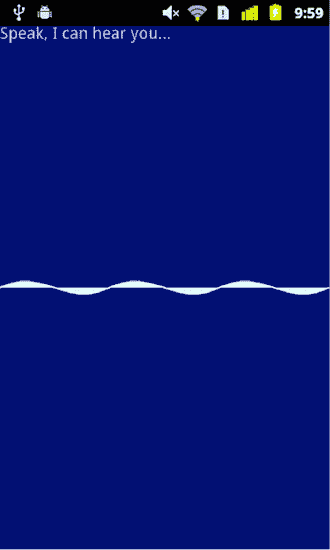
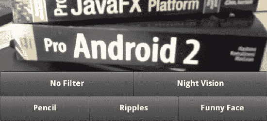
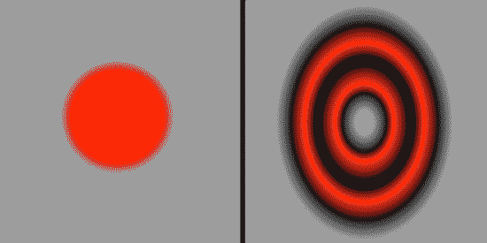
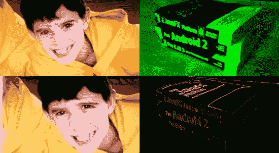
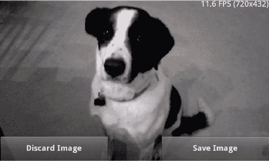
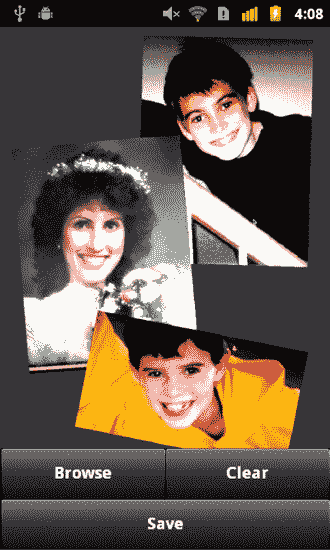
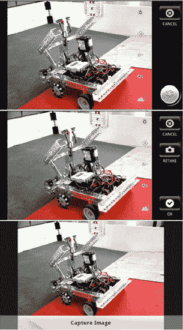
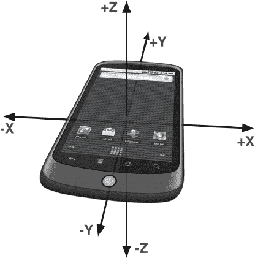
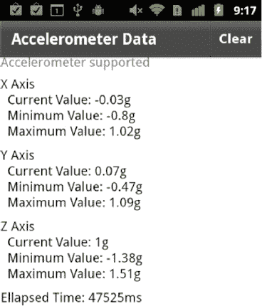
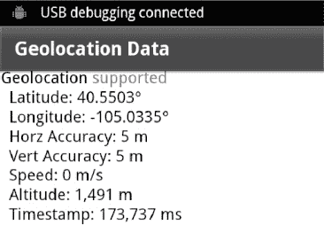

# 七、利用硬件输入

在前一章中，您已经了解了如何将您的 Android Flash 应用与 Android 操作系统提供的本地软件服务相集成。在本章中，您将学习如何利用 Android 驱动设备中包含的硬件传感器。本章结束时，你将能够捕捉声音、图像和视频；接入地理定位服务以读取设备的位置；读取加速度计数据以确定设备的方向，所有这些都在您的 Flash 应用中完成。

现代移动设备有一系列令人惊叹的硬件传感器，从加速度计到摄像头再到 GPS 接收器。有效的移动应用应该能够在需要时利用这些特性。AIR 运行时提供了允许您访问这些本机硬件资源的类。这些类中的一些，比如`Microphone`和`Camera`，对于有经验的 Flash 开发者来说可能很熟悉。其他的，如`CameraUI`和`CameraRoll`，是新增加的，允许 AIR 应用利用 Android 设备上常见的功能。

### 麦克风

如果没有麦克风，电话就没什么用了，所以我们从最基本的输入开始。Flash 支持用`Microphone`类捕获声音已经很久了，这个类在 Android 的 AIR 上也完全支持。正如你将在本章看到的所有硬件支持类一样，第一步是检查类的静态`isSupported`属性，以确保它在用户的设备上受支持。当然，所有手机都有麦克风，但平板电脑和电视不一定如此。因为你想要支持多种当前和未来的设备，所以最好总是检查`Microphone`的`isSupported`属性和我们将在本章中讨论的其他类。

如果支持`Microphone`，那么您可以继续检索一个`Microphone`实例，设置您的捕获参数，并附加一个事件监听器，使您能够接收来自设备麦克风的声音数据。

清单 7–1 展示了本书示例代码的`examples/chapter-07`目录中 MicrophoneBasic 示例项目的摘录中的这些步骤。

**清单 7–1。** *初始化并从麦克风读取样本*

`**private var** activityLevel: uint;

private function onCreationComplete():void {
  if (Microphone.isSupported) {
    microphone = Microphone.getMicrophone();

    microphone.setSilenceLevel(0)
    microphone.gain = 100;
    microphone.rate = 22;
    microphone.addEventListener(SampleDataEvent.SAMPLE_DATA, onSample);

    initGraphics();
    showMessage("Speak, I can hear you...");
  } else {
    showMessage("flash.media.Microphone is unsupported on this device.");
  }
}

private function onSample(event:SampleDataEvent):void {
  if (microphone.activityLevel > activityLevel) {
    activityLevel = Math.min(50, microphone.activityLevel);
  }
}

**private function** showMessage(msg:String):**void** {
  messageLabel.text = msg;
}`

麦克风初始化代码位于`View`的`creationComplete`处理程序中。如果`Microphone`不被支持，`onCreationComplete()`函数调用`showMessage()`函数向用户显示一条消息。`showMessage()`函数简单地设置位于视图顶部的火花`Label`的文本属性。然而，如果支持`Microphone`，那么调用静态函数`Microphone.getMicrophone()`，它返回一个麦克风对象的实例。然后设置对象的增益和速率属性。设置 100 是麦克风的最大增益设置，速率 22 指定最大采样频率为 22 kHz。这将确保即使是轻柔的声音也能以合理的采样率被捕捉到。你应该注意到`Microphone`支持高达 44.1 kHz 的采集速率，这与光盘上使用的采样速率相同。然而，记录的质量受限于底层硬件所能支持的。手机麦克风可能会以低得多的速率捕捉音频。虽然 Flash 会将捕获的音频转换为您要求的采样率，但这并不意味着您最终会获得 CD 品质的音频。

最后，我们为`SampleDataEvent.SAMPLE_DATA`事件添加一个监听器。一旦连接了这个监听器，应用将开始接收声音数据。该事件有两个特别有趣的特性:

*   `position`:表示数据在音频流中的位置的`Number`
*   `data`:包含自上次`SAMPLE_DATA`事件以来捕获的音频数据的`ByteArray`

应用通常会将`data`字节复制到应用创建的`ByteArray`中，以保存整个音频剪辑，直到可以播放、存储或发送到服务器。关于采集和回放音频数据的更多细节，请参见第八章。MicrophoneBasic 示例应用通过检查`activityLevel`属性简单地显示来自麦克风的音频数据的视觉反馈，如清单 7–1 所示。

需要记住的一件重要事情是在应用描述符 XML 文件中设置`android.permission.RECORD_AUDIO`设置。没有此权限，您将无法在 Android 设备上读取麦克风数据。示例项目的清单部分如下面的代码片段所示。

`<android>
    <manifestAdditions>
        <![CDATA[
        <manifest>
            <!-- For debugging only -->
            <uses-permission android:name="android.permission.INTERNET"/>
            <uses-permission android:name="android.permission.RECORD_AUDIO"/>
        </manifest>
        ]]>
    </manifestAdditions>
</android>`

Flash 对捕获音频样本的支持实际上相当复杂。您甚至可以使用`setSilenceLevel()`设置“零”电平，或者使用`setUseEchoSuppression()`启用回声抑制。我们鼓励您查看 Adobe 优秀的在线文档 1 。

__________

1 `[`help.adobe.com/en_US/FlashPlatform/reference/actionscript/3/flash/media/Microphone.html`](http://help.adobe.com/en_US/FlashPlatform/reference/actionscript/three/flash/media/Microphone.html)`

Figure 7–1 展示了 MicrophoneBasic 应用在实际手机上运行时的样子。

**图 7–1。***Android 手机上运行的 MicrophoneBasic 示例应用*

### 照相机和摄像机

你会发现大多数移动设备上都有一个摄像头(有时是两个)。Android Flash 应用可以使用相机捕捉静态图像和动态视频。一些设备甚至能够捕捉高清视频。

有两种不同的方式来访问设备的摄像头。`flash.media.Camera`类将让你访问来自摄像机的原始视频流。这允许您在从设备的主摄像头捕捉图像时对图像进行实时处理。

**注意:**从 AIR 2.5.1 开始，`flash.media.Camera`类不支持在 Android 设备上从多个摄像头进行捕捉的功能。在未来发布的 AIR for Android 中，有望实现在视频拍摄过程中选择相机的功能。

替代方法是使用`flash.media.CameraUI`来捕捉高质量的图像和视频。`CameraUI`非常适合只需轻松捕捉图像或视频的应用。它使用原生的 Android 摄像头接口来处理繁重的工作。这意味着您的应用的用户将能够在给定的设备上访问 Android 原生支持的所有功能，包括多个摄像头和调整白平衡、地理标记功能、对焦、曝光和闪光灯设置的能力。

Android 还提供了一个标准界面，用于浏览设备上拍摄的图像和视频。AIR 通过`flash.media.CameraRoll`类提供对该服务的访问。`CameraRoll`提供了一种将图像保存到设备的简单方法。它还允许用户浏览以前捕获的图像，如果用户选择了图像或视频文件，它会通知您的应用。和`CameraUI`一样，`CameraRoll`是原生 Android 媒体浏览器界面的包装器。用户喜欢感觉熟悉并且看起来像他们使用的其他本机应用的应用。因此，AIR 提供了对相机功能的本地接口的简单访问是一件好事。如果它们满足您的应用需求，应该是您的首选。

在接下来的部分中，我们将更深入地探索这三个类。我们将首先向您介绍基本的`Camera`类，然后展示一个将一些强大的闪光滤镜效果应用到实时视频流的例子。手机上的实时视频处理！这有多酷？之后，我们将带你参观一下`CameraRoll`和`CameraUI`类，并向你展示如何使用它们通过 Android 的本地界面来捕获、保存和浏览媒体。让乐趣开始吧！

#### 照相机

构成 Flash 和 Flex SDKs 的 API 通常设计良好。视频捕捉功能也不例外。这个复杂过程的职责被划分到两个易于使用的类中。`flash.media.Camera`类负责底层视频捕捉，`flash.media.Video`类是一个`DisplayObject`，用于向用户显示视频流。因此，获取摄像头的视频信息是一个简单的三步过程。

1.  调用`Camera.getCamera()`来获得对一个`Camera`实例的引用。
2.  创建一个`flash.media.Video`对象，并将摄像机连接到它。
3.  将`Video`对象添加到`DisplayObjectContainer`中，如`UIComponent`，使其在舞台上可见。

清单 7–2 中的代码演示了这些基本步骤。您可以在 Flash Builder 4.5 中创建新的 Flex mobile 项目，并将清单 7–2 中的代码复制到作为项目一部分创建的`View`类中。或者，如果您已经下载了本书的示例代码，也可以通过查看`examples/chapter-07`目录中的 CameraBasic 项目来继续学习。

`View`将其动作栏的可见性设置为`false`,以最大化视频显示的屏幕空间。所有的初始化工作都在`creationComplete`处理程序中完成。如前面步骤 3 所述，可以使用一个`UIComponent`作为视频流的容器，使其在舞台上可见。`Camera`、`Video`和`UIComponent`都被设置为与视图本身相同的大小。

**清单 7–2。** *移动中的基本图像捕捉`View`类*

`<?xml version="1.0" encoding="utf-8"?>
<s:View xmlns:fx="http://ns.adobe.com/mxml/2009"
        xmlns:s="library://ns.adobe.com/flex/spark"
        xmlns:mx="library://ns.adobe.com/flex/mx"
        actionBarVisible="false"
        creationComplete="onCreationComplete()">

  <fx:Script>
    <![CDATA[
      private var camera:Camera;

      private function onCreationComplete():void {
        if (Camera.isSupported) {
          var screenWidth:Number = Screen.mainScreen.bounds.width;
          var screenHeight:Number = Screen.mainScreen.bounds.height;

          camera = Camera.getCamera();
          camera.setMode(screenWidth, screenHeight, 15);

          var video: Video = new Video(screenWidth, screenHeight);
          video.attachCamera(camera);

          videoContainer.addChild(video);
        } else {
          notSupportedLabel.visible = true;
        }
      }
    ]]>
  </fx:Script>

  <mx:UIComponent id="videoContainer" width="100%" height="100%"/>
  <s:Label id="messageLabel" visible="false" top="0" right="0"
           text="flash.media.Camera is not supported on this device."/>
</s:View>`

##### 检查摄像头支持

该视图还在前景中包含一个标签组件，如果出于某种原因不支持该相机，该组件会向用户显示一条消息。使用文本组件(如标签)是在移动设备的小屏幕上向用户显示状态和错误消息的一种简单方法。这里你看到了静态属性`isSupported`的第二次出现，这次是在`Camera`类上。检查`Camera`的`isSupported`属性以确保该特性在用户的设备上受支持是一个很好的做法。例如，移动浏览器目前不支持`Camera`。

**注意:**电视设备的 AIR 目前也不支持摄像头。然而，Adobe 的文档指出，即使`getCamera`总是返回`null`，在那个环境中`isSupported`仍然返回`true`。为了处理这种情况，您可以将前面示例中的`isSupported`检查改为`if (Camera.isSupported && (camera = Camera.getCamera()) != null) { … }`。

##### 初始化相机

仔细查看摄像机初始化代码，可以看到在通过调用静态的`getCamera`方法获得`Camera`实例之后，还有一个对`setMode`方法的调用。如果没有这个调用，相机将默认捕捉 160 × 120 像素的视频，当显示在分辨率通常为 800 × 480 或更高的现代手机上时，会看起来非常像素化。`setMode`方法的第一个和第二个参数指定您希望捕获视频的宽度和高度。`setMode`的第三个参数规定了视频捕捉的帧速率，单位为每秒帧数，也称为 FPS。

然而，你要求的不一定是你得到的。摄像机将被置于与您的请求参数最匹配的固有模式。`setMode`调用的第四个可选参数控制在选择原生相机模式时是优先考虑您的分辨率(宽度和高度)还是 FPS 请求。默认情况下，相机会尝试满足您的分辨率要求，即使这意味着无法满足您的 FPS 要求。

因此，我们调用`setMode`并请求一个与`View`的分辨率相匹配的视频捕捉分辨率——本质上是使用`this.width`和`this.height`。这与设备屏幕的分辨率相同，因为应用是在全屏模式下运行的，我们将在下一节中介绍。我们还要求以每秒 15 帧的速度捕捉视频。对于视频来说，这是一个合理的速率，同时不会对性能和电池寿命造成太大的消耗。您可能希望在较慢的设备上降低 FPS 请求。

在屏幕分辨率为 800 × 480 的 Nexus S 手机上，该请求导致相机被设置为以 720 × 432 捕捉帧。在分辨率为 854 × 480 的摩托罗拉 Droid 上，摄像头以 848 × 477 拍摄。在这两种情况下，相机都选择尽可能接近所要求的分辨率*的模式，同时保持所要求的宽高比*。

有关配置和使用的更多详细信息，请参考 Adobe 网站`[`help.adobe.com/en_US/FlashPlatform/reference/actionscript/3`](http://help.adobe.com/en_US/FlashPlatform/reference/actionscript/3)/`上的`flash.media.Camera`和`flash.media.Video`的文档。

##### 应用设置和安卓权限

来自 Flash 的`Camera`类的视频流采用横向方向。将应用锁定在横向模式下可以获得最佳效果。否则所有的视频看起来都像被旋转了 90 度。控制这种行为的选项可以在与您的项目相关的应用描述符 XML 文件的`initialWindow`部分找到。在 CameraBasic 项目中，该文件名为`CameraBasic-app.xml`，位于项目的`src`文件夹中。您需要将`aspectRatio`设置为`landscape`，将`autoOrients`设置为`false`。请注意，在 Flash Builder 4.5 中创建移动项目时，取消选中“自动重定向”复选框会在创建应用描述符文件时将`autoOrients`设置为`false`。

清单 7–3 展示了 CameraBasic 项目的最终应用描述符。为清晰起见，已从生成的文件中删除了注释和未使用的设置。如前所述，在创建项目时，应用也被指定为全屏应用。这导致`fullScreen`的`initialWindow`设置被设置为`true`，并导致应用在运行时占据整个屏幕，隐藏屏幕顶部的 Android 指示条。

**清单 7–3。**??`CameraBasic-app.xml`来自 camera basic 项目的应用描述符文件

`<?xml version="1.0" encoding="utf-8" standalone="no"?>
<application >
    <id>CameraBasic</id>
    <filename>CameraBasic</filename>
    <name>CameraBasic</name>
    <versionNumber>0.0.1</versionNumber>

    <initialWindow>
        <content>[This value will be overwritten by Flash Builder…]</content>
        **<autoOrients>false</autoOrients>**
        **<aspectRatio>landscape</aspectRatio>**
        <fullScreen>true</fullScreen>
        <visible>false</visible>
    </initialWindow>

    <android>
        <manifestAdditions><![CDATA[
            <manifest>
                **<uses-permission android:name="android.permission.CAMERA" />**
            </manifest>
        ]]></manifestAdditions>
    </android>
</application>`

您需要在 APK 文件的清单中指定 Android 摄像头权限，才能访问设备的摄像头。正如您在清单 7–3 中看到的，应用描述符的 Android manifest 部分包含了`android.permission.CAMERA`权限。指定这个权限意味着使用了`android.hardware.camera`和`android.hardware.camera.autofocus`特性。因此，它们没有被明确地列在清单附件中。

#### 操纵摄像机的视频流

使用`Camera`而不是`CameraUI`的优势在于，您可以在视频流被捕获时访问它。您可以对视频流应用几种类型的图像滤镜效果:模糊、发光、渐变、颜色变换、置换贴图和卷积。其中一些相对便宜，而另一些，如`ConvolutionFilter`，可能是处理器密集型的，因此会降低捕获的视频流的帧速率。简单的模糊、发光和斜面滤镜使用起来非常简单，所以这个例子将使用一些更复杂的滤镜:`ColorMatrixFilter`、`DisplacementMapFilter`和`ConvolutionFilter`。

清单 7–4 显示了 CameraFilter 示例项目的默认视图的代码。如果您已经下载了该书附带的源代码，那么可以在`examples/chapter-07`目录中找到它。

**清单 7–4。**??`VideoFilterView.mxml`文件来自 CameraFilter 示例项目

`<?xml version="1.0" encoding="utf-8"?>
<s:View xmlns:fx="http://ns.adobe.com/mxml/2009"
        xmlns:s="library://ns.adobe.com/flex/spark"
        xmlns:mx="library://ns.adobe.com/flex/mx"
        actionBarVisible="false" creationComplete="onCreationComplete()">

  <fx:Script source="VideoFilterViewScript.as"/>

  <fx:Declarations>
    <s:NumberFormatter id="fpsFormatter" fractionalDigits="1"/>
  </fx:Declarations>

  <s:viewMenuItems>
    <s:ViewMenuItem label="No Filter" click="onFilterChange(event)"/>
    <s:ViewMenuItem label="Night Vision" click="onFilterChange(event)"/>
    <s:ViewMenuItem label="Pencil" click="onFilterChange(event)"/>
    <s:ViewMenuItem label="Ripples" click="onFilterChange(event)"/>
    <s:ViewMenuItem label="Funny Face" click="onFilterChange(event)"/>
  </s:viewMenuItems>

  <mx:UIComponent id="videoContainer" width="100%" height="100%"/>
  <s:Label id="messageLabel" top="0" right="0"/>
</s:View>`

你可以在清单 7–4 中看到，我们已经将 ActionScript 代码分离到它自己的文件中，因为与这个例子相关的代码比前一个例子大得多。我们已经包含了使用`<fx:Script>`标签的`source`属性的脚本文件。像这样编写跨越两个文件的代码有点不方便，但是这样做可以使两个文件的大小更易于管理。您还会注意到添加了一个`<fx:Declarations>`元素，该元素声明了一个用于格式化每秒帧数值的`NumberFormatter`。

您可以想象，如果有多个过滤器可以应用于视频流，那么就需要有一种方法让用户选择哪个过滤器应该是活动的。清单 7–4 中的所示的`ViewMenuItem`为用户提供了一个简单的方法来完成这个任务。点击一个`ViewMenuItem`会导致一个对`onFilterChange`处理器的调用，它将处理设置新选择的滤镜效果。产生的应用如图 7–2 所示，菜单可见。

**图 7–2。** *允许用户选择应用哪种滤镜效果的菜单*

现在菜单已经工作了，是时候看看如何创建图像过滤效果并将其附加到视频流中了。

**提示:**当用户按下“home”按钮时，Android 应用的 AIR 不会被通知，因为这是 Android 自己使用的。然而，你可以通过检查你的`KeyboardEvent`监听器中的`Keyboard.BACK`和`Keyboard.SEARCH`来监听 Android 的“返回”和“搜索”按钮。在这两种情况下，调用`event.preventDefault()`可能是一个好主意，以防止系统响应这些按钮按下而采取任何潜在的默认动作。

##### 创建图像滤镜效果

正如所料，Flash 提供了易于使用的复杂图像处理效果。将滤镜效果应用到视频流不是本章的重点，所以我们将只简要描述滤镜并给出相关代码，不做任何注释。关于`flash.filters`包中包含的滤镜的详细信息，可以参考 Adobe 优秀的在线文档。如果您已经熟悉 Flash 中的滤镜效果，可以浏览代码并快速进入下一部分。

第一步是创建过滤器。清单 7–5 显示了初始化代码。和前面的例子一样，`onCreationComplete()`方法是视图的`creationComplete`处理程序。`onCreationComplete()`做的第一件事是调用`initFilters()`方法，它封装了所有的过滤器初始化代码。这个例子使用的三个滤镜效果是`ColorMatrixFilter`、`ConvolutionFilter`和`DisplacementMapFilter`。

**清单 7–5。** *创建图像过滤器实例*

`private function onCreationComplete():void {
  var screenWidth:Number = Screen.mainScreen.bounds.width;
  var screenHeight:Number = Screen.mainScreen.bounds.height;

  initFilters(screenWidth, screenHeight);

  if (Camera.isSupported) {
    // The same Camera and Video initialization as before…
  }  else {
    showNotSupportedMsg();
  }
}

private function initFilters(screenWidth:Number, screenHeight:Number):void {
  var colorMat: Array = [
    .5,  0,  0,  0,  0,
     0, 10,  0,  0,  0,
     0,  0, .5,  0,  0,
     0,  0,  0,  1,  0
  ];

  nightVisionFilter = new ColorMatrixFilter(colorMat);

  var sharpMat: Array = [
    0, -5,  0,
    -5, 20, -5,
    0, -5,  0
  ];

  ultraSharpFilter = new ConvolutionFilter(3, 3, sharpMat);

  var bmpData: BitmapData = new BitmapData(screenWidth, screenHeight, false);
  var pt: Point = new Point(0, 0);

  displacementFilter = new DisplacementMapFilter(bmpData, pt,
    BitmapDataChannel.RED, BitmapDataChannel.RED, 40, 40);
}`

A `ColorMatrixFilter`使用 4 × 5 矩阵，其值乘以每个像素的颜色通道。例如，矩阵第一行中的条目乘以未过滤像素的红色、绿色、蓝色和 alpha 分量，将结果与该行中的第五个值相加，并指定为最终过滤像素的红色分量。分别使用矩阵的第二、第三和第四行，类似地计算滤波像素的绿色、蓝色和阿尔法分量。对源图像中的每个像素都这样做，以产生最终的滤波图像。`ColorMatrixFilter`能够实现许多复杂的颜色处理效果，包括饱和度变化、色调旋转、亮度到 alpha 变换(源图像中的像素越亮，过滤后的图像越透明)等。正如你所看到的，这个示例程序使用`ColorMatrixFilter` 通过增强绿色通道和减弱红色和蓝色通道来产生一个伪夜视效果。阿尔法通道保持不变。

`ConvolutionFilter`是图像处理过滤器的主力。它的工作原理是定义一个矩阵，其元素乘以一个像素块。然后将该乘法的结果相加，得到像素的最终值。在本例中，我们使用的是一个 3×3 矩阵，从它的值可以看出，源图像中每个像素的红色、绿色、蓝色和 alpha 分量都乘以了 20 倍，同时，源像素的正北、正南、正东和正西的像素都乘以了-5 倍。然后将这些结果相加，得到滤波像素的最终值。矩阵角上的零意味着源像素西北、东北、西南和东南的像素完全从等式中移除。由于负面因素抵消了正面因素，图像的整体亮度保持不变。我们在这里定义的矩阵实现了一个基本的边缘检测算法。并且倍增因子足够大，使得最终的图像将主要是黑色的，边缘是白色的。过滤后的图像看起来有点像是用白色铅笔在黑色页面上绘制的，因此我们将过滤器命名为:铅笔。

`DisplacementFilter`使用一个位图中的像素值来偏移源图像中的像素。因此，与原始图像相比，所得到的图像将以某种方式扭曲。这会产生各种有趣的效果。`initFilters()`方法中的代码简单地用一个空位图初始化置换过滤器。置换贴图的选择实际上是在用户选择滑稽脸滤镜或波纹滤镜时设置的。本例使用的位移图如图图 7–3 所示。为了你自己的理智，不要盯着这些图像太久！

置换过滤器被配置为在计算 x 和 y 置换值时使用置换贴图的红色通道。因此图 7–3 左侧的滑稽脸贴图只是一个位于灰色背景中心的红点。这将保持周围的像素不变，但会扩大图像中心的像素，以产生球根状效果。涟漪贴图只是红色和黑色的交替圆圈，导致正负像素偏移(扩展和收缩)，给人的印象是源图像是通过荡漾的水观看的，尽管这种涟漪在时间和空间上似乎是冻结的(嗯，听起来像一部糟糕的*星际迷航*集)。

**图 7–3。** *示例程序中使用的位移贴图*

清单 7–6 显示了在位移过滤器上设置这些位移图的代码，以响应相应的菜单按钮点击。当选择波纹或滑稽脸效果时，适当的位图(在启动时从嵌入的资源中加载)被绘制到置换过滤器的`mapBitmap`中。

**清单 7–6。** *选择滤镜并设置置换贴图*

`[Embed(source="funny_face.png")]
private var FunnyFaceImage:Class;

[Embed(source="ripples.png")]
private var RippleImage:Class;

private var rippleBmp:Bitmap = new RippleImage() as Bitmap;
private var funnyFaceBmp:Bitmap = new FunnyFaceImage() as Bitmap;

// This function is the click handler for all buttons in the menu.  videoContainer
// is a UIComponent that is displaying the video stream from the camera.
private function onFilterChange(event:Event):void {
  var btn: Button = event.target as Button;
  switch (btn.id) {
    case "noFilterBtn":
      videoContainer.filters = [];
      break;

    case "nightVisionBtn":
      videoContainer.filters = [nightVisionFilter];
      break;

    case "sharpBtn":
      videoContainer.filters = [ultraSharpFilter];
      break;

    case "rippleBtn":` `      showDisplacementFilter(true);
      break;

    case "funnyFaceBtn":
      showDisplacementFilter(false);
      break;
  }

  toggleMenu();
}

private function showDisplacementFilter(ripples:Boolean):void {
  var bmp: Bitmap = ripples ? rippleBmp : funnyFaceBmp;

  var mat: Matrix = new Matrix();
  mat.scale(width / bmp.width, height / bmp.height);

  displacementFilter.mapBitmap.draw(bmp, mat);

  videoContainer.filters = [displacementFilter];
}`

图 7–4 显示了使用这些滤镜拍摄的一些图像。从左上角逆时针方向，你可以看到一个没有滤镜的图像，滑稽脸滤镜，铅笔滤镜，夜视滤镜。

**图 7–4。***Nexus S 手机拍摄的本例中使用的一些滤镜的输出*

应该注意的是，虽然置换贴图和颜色矩阵滤镜在性能方面相对便宜，但卷积滤镜在我们测试的 Android 设备上是一个真正的性能杀手。这是一个重要的提醒，处理器周期不像桌面系统那样充足。始终在目标硬件上测试您的性能假设！

##### 显示一个 FPS 计数器

监控目标硬件性能的一个简单方法是显示每秒帧数。清单 7–7 显示了在`Label`控件中显示摄像机 FPS 计数的代码。FPS 值由在后台运行的定时器每两秒钟格式化和更新一次。FPS 计数直接来自相机，但会考虑滤镜所用的时间。当您应用过滤器，你会看到帧速率下降，因为这将减慢整个程序，包括视频捕捉过程。通过点击屏幕上的任意位置，可以隐藏和重新显示性能计数器。这是通过向显示视频流的 UIComponent 添加一个 click 处理程序来实现的。

**清单 7–7。** *屏幕上显示一个性能计数器*

`private var timer: Timer;
private var fpsString: String;

private function onCreationComplete(): void {
  var screenWidth:Number = Screen.mainScreen.bounds.width;
  var screenHeight:Number = Screen.mainScreen.bounds.height;

  initFilters(screenWidth, screenHeight);

  if (Camera.isSupported) {
    // The same Camera and Video initialization as before…

    videoContainer.addEventListener(MouseEvent.CLICK, onTouch);
    fpsString = " FPS ("+camera.width+"x"+camera.height+")";

    timer = new Timer(2000);
    timer.addEventListener(TimerEvent.TIMER, updateFPS);
    timer.start();
  }  else {
    showNotSupportedMsg();
  }
}

private function updateFPS(event:TimerEvent):void {
  messageLabel.text = fpsFormatter.format(camera.currentFPS) + fpsString;
}

private function onTouch(event:MouseEvent):void {
  if (messageLabel.visible) {
    timer.stop();
    messageLabel.visible = false;
  } else {
    timer.start();
    messageLabel.visible = true;
  }
}`

既然应用已经能够从视频流中创建有趣的图像，那么下一个合乎逻辑的步骤就是捕获一帧视频并将其保存在设备上。

##### 从视频流中捕获并保存图像

我们处理`Camera`类的一系列示例项目的高潮是 CameraFunHouse。这个最终的应用通过整合对从视频流中捕捉图像并将其保存在设备上的支持，结束了这个系列。你必须使用 Android 新的`CameraRoll`类的 AIR 来保存设备上的图像。幸运的是，这是一个简单的过程，将在本节末尾演示。

从视频流中捕捉图像只使用了优秀的老式 Flash 和 Flex 功能。首先对`View`的 MXML 文件做一些添加，如清单 7–8 所示。为了方便起见，新增加的内容会突出显示。它们由一个新的`UIComponent`组成，将显示从视频流中捕获的静态图像的位图。该位图将显示为预览，以便用户可以决定是否应该保存该图像。其他新增加的是按钮，用户可以点击捕捉图像，然后保存或丢弃它。

**清单 7–8。** *查看支持图像拍摄和保存的增强功能*

`<?xml version="1.0" encoding="utf-8"?>
<s:View xmlns:fx="http://ns.adobe.com/mxml/2009"
        xmlns:s="library://ns.adobe.com/flex/spark"
        xmlns:mx="library://ns.adobe.com/flex/mx"
        actionBarVisible="false"
        creationComplete="onCreationComplete()">

  <fx:Script source="FunHouseVideoViewScript.as"/>

  <fx:Declarations>
    <!-- Same as before -->
  </fx:Declarations>

  <s:viewMenuItems>
    <!-- Same as before -->
  </s:viewMenuItems>

  <mx:UIComponent id="videoContainer" width="100%" height="100%"/>
  **<mx:UIComponent id="bitmapContainer" width="100%" height="100%"/>**

  **<s:Button id="captureButton" width="100%" bottom="0" label="Capture Image"**
**            alpha="0.75" click="onCaptureImage()"/>**

  **<s:Button id="saveButton" width="40%" right="0" bottom="0"**
**            label="Save Image" alpha="0.75" click="onSaveImage()"/>**
  **<s:Button id="discardButton" width="40%" left="0" bottom="0"**
**            label="Discard Image" alpha="0.75" click="onDiscardImage()"/>**

  <s:Label id="messageLabel" top="0" right="0"/>
</s:View>`

当应用处于捕获模式时,“捕获图像”按钮将始终可见。该按钮是半透明的，因此用户可以看到按钮后面的视频流。一旦用户点击了捕获按钮，应用将抓取并显示图像，隐藏捕获按钮，并显示保存图像和丢弃图像按钮。这个逻辑由添加到 ActionScript 文件中的代码以及三个新的点击处理程序控制:`onCaptureImage()`、`onSaveImage()`和`onDiscardImage()`。这些增加的内容显示在清单 7–9 中。

**清单 7–9。** *添加和更改 ActionScript 代码以支持图像捕捉和保存*

`private function onCreationComplete():void {
  var screenWidth:Number = <ins>Screen</ins>.mainScreen.bounds.width;
  var screenHeight:Number = <ins>Screen</ins>.mainScreen.bounds.height;

  initFilters(screenWidth, screenHeight);
  setCaptureMode(true);

  // The rest of the method is the same as before…
}

// Determines which controls are visible
private function setCaptureMode(capture: Boolean): void {
  videoContainer.visible = capture;
  bitmapContainer.visible = !capture;

  captureButton.visible = capture;
  saveButton.visible = !capture;
  discardButton.visible = !capture;        
}

private function onCaptureImage():void {
  var bmp: BitmapData = new BitmapData(width, height, false, 0xffffff);
  bmp.draw(videoContainer);

  bitmapContainer.addChild(new Bitmap(bmp));
  setCaptureMode(false);
}

private function onDiscardImage():void {
  bitmapContainer.removeChildAt(0);
  setCaptureMode(true);
}

private function onSaveImage():void {
  if (CameraRoll.supportsAddBitmapData) {
    var bmp: Bitmap = bitmapContainer.removeChildAt(0) as Bitmap;
    new CameraRoll().addBitmapData(bmp.bitmapData);
    setCaptureMode(true);
  } else {
    showNotSupportedMsg(ROLL_NOT_SUPPORTED);
    saveButton.visible = false;
  }
}`

`onCaptureImage()`函数只是将`videoContainer`的内容绘制到一个新的位图中，并在`bitmapContainer`中显示为预览。在方法结束时对`setCaptureMode(false)`的调用负责设置所有适当控件的可见性。同样，`onDiscardImage()`处理程序删除预览位图，并将应用放回捕获模式。

`CameraRoll`类在用户想要保存图像时发挥作用。如您所见，它遵循了在使用类之前检查支持的常见模式。您应该首先确保设备支持使用`CameraRoll.supportsAddBitmapData`属性保存图像。假设支持添加图像，`onSaveImage()`函数创建一个新的`CameraRoll`实例并调用它的`addBitmapData`方法，传递一个对保存预览图像的`BitmapData`对象的引用。`CameraRoll`当图像已成功保存或出现阻止保存操作的错误时，将发出事件。下一节涉及的照片收集示例将展示使用这些事件的示例。Figure 7–5 显示了完整的 CameraFunHouse 应用捕捉一只合作犬的图像。

**图 7–5。** *我们的模特欣然同意使用她的肖像作为交换。*

`CameraRoll`类还允许用户浏览和选择保存在设备上的图像以及用户保存在互联网相册中的图像！这个特性将在下一节解释。

#### 服务员

用`CameraRoll`在 Android 设备上浏览照片几乎和保存照片一样简单。我们将在一个名为 PhotoCollage 的新示例程序的上下文中说明这个特性。这个程序让你选择已经存储在设备上的图像，并把它们排列成拼贴画。您可以使用多点触控手势来拖动、缩放和旋转图像。当图像按照您的喜好排列后，您可以将新图像存储回“相机胶卷”。这个例子可以在本书的源代码的`examples/chapter-07` 目录中找到。清单 7–10 显示了应用主视图的 MXML 文件。

**清单 7–10。** *照片收藏应用的首页视图— `PhotoCollageHome.mxml`*

`<?xml version="1.0" encoding="utf-8"?>
<s:View xmlns:fx="http://ns.adobe.com/mxml/2009"
        xmlns:s="library://ns.adobe.com/flex/spark"
        xmlns:mx="library://ns.adobe.com/flex/mx"
        actionBarVisible="false"
        creationComplete="onCreationComplete()" >

  <fx:Script source="PhotoCollageHomeScript.as"/>

  <s:viewMenuItems>
    <s:ViewMenuItem label="Browse" click="onBrowse()"/>
    <s:ViewMenuItem label="Clear" click="onClear()"/>
    <s:ViewMenuItem label="Save" click="onSave()"/>
  </s:viewMenuItems>

  <mx:UIComponent id="photoContainer" width="100%" height="100%"/>
  <s:Label id="messageLabel" top="0" left="0" mouseEnabled="false"/>
</s:View>`

您可以看到，就像前面的例子一样，已经为这个视图声明了一个菜单。我们再次将视图的相关脚本代码分离到它自己的文件中。该视图有两个子组件:一个`UIComponent`作为正在排列的图像的容器，另一个`Label`提供显示来自应用的消息的方式。注意标签的`mouseEnabled`属性被设置为`false`。这将防止标签干扰用户的触摸手势。关于如何使用`messageLabel`对运行中的程序提供反馈的更多细节，请参见标题为“除错”的部分。

将 KeyboardEvent 侦听器添加到舞台的代码与前面示例中的代码相同，因此我们在此不再重复。

##### 图片浏览

正如您在清单 7–10 中看到的，当用户点击浏览按钮时会调用`onBrowse`处理程序。这引发了一系列动作，允许用户使用原生 Android 图像浏览器浏览图像，并且如果图像被选中，则图像最终出现在应用的视图中。清单 7–11 显示了相关的源代码。

**清单 7–11。** *启动浏览动作并显示选中图像的代码*

`private static const BROWSE_UNSUPPORTED: String = "Browsing with " +
    "flash.media.CameraRoll is unsupported on this device.";

private var cameraRoll: CameraRoll = new CameraRoll();

private function onCreationComplete():void {
  cameraRoll.addEventListener(MediaEvent.SELECT, onSelect);
  cameraRoll.addEventListener(Event.CANCEL, onSelectCanceled);
  cameraRoll.addEventListener(ErrorEvent.ERROR, onCameraRollError);` `  cameraRoll.addEventListener(Event.COMPLETE, onSaveComplete);

  // …  
}

private function onBrowse():void {
  if (CameraRoll.supportsBrowseForImage) {
    cameraRoll.browseForImage();
  } else {
    showMessage(BROWSE_UNSUPPORTED);
  }
  toggleMenu();
}

private function onSelect(event:MediaEvent):void {
  var loader: Loader = new Loader();
  loader.contentLoaderInfo.addEventListener(Event.COMPLETE, onLoaded);
  loader.load(new URLRequest(event.data.file.url));
}

private function onLoaded(event:Event):void {
  var info: LoaderInfo = event.target as LoaderInfo;
  var bmp: Bitmap = info.content as Bitmap;

  scaleContainer(bmp.width, bmp.height);

  var sprite: Sprite = new Sprite();

  sprite.addEventListener(TransformGestureEvent.GESTURE_ZOOM, onZoom);
  sprite.addEventListener(TransformGestureEvent.GESTURE_ROTATE, onRotate);
  sprite.addEventListener(MouseEvent.MOUSE_DOWN, onMouseDown);
  sprite.addEventListener(MouseEvent.MOUSE_UP, onMouseUp);
  sprite.addChild(bmp);

  photoContainer.addChild(sprite);
}

private function onSelectCanceled(event:Event):void {
  showMessage("Select canceled");
}

private function onCameraRollError(event:ErrorEvent):void {
  showMessage("Error: "+event.text);
}

private function onSaveComplete(event:Event):void {
  showMessage("CameraRoll operation complete");
}`

`onCreationComplete()`函数为与该应用相关的所有`CameraRoll`事件附加处理程序。`MediaEvent.SELECT`和`Event.CANCEL`是浏览操作的两个可能的成功结果。如果在浏览或保存过程中出现错误，将发送`ErrorEvent.ERROR`。最后，当保存成功完成时，触发`Event.COMPLETE`事件。`onSelectCanceled()`、`onCameraRollError()`和`onSaveComplete()`处理函数简单地调用`showMessage`函数，在屏幕上显示一条消息。

现在应用正在监听所有必要的事件，它准备好处理`onBrowse`回调。和往常一样，您应该做的第一件事是使用`CameraRoll.supportsBrowseForImage`属性检查浏览是否受支持。如果这个属性是`true`，那么可以调用`cameraRoll`对象上的`browseForImage()`实例方法。这将触发向用户显示原生 Android 图像浏览器。如果用户选择一幅图像，应用的`onSelect()`处理程序将被调用。作为参数传递给该函数的`MediaEvent`对象包含一个名为`data`的属性，它是一个`MediaPromise`对象的实例。`MediaPromise`对象中的关键信息是文件属性。您可以使用文件的 URL 来加载选定的图像。因此，如前所示，您真正想要的是`event.data.file.url`属性。这个属性被传递给一个处理图像数据加载的`Loader`对象。当加载完成时，它触发`onLoaded`回调函数，该函数负责获取生成的位图并将其放入`Sprite`中，以便用户可以对其进行操作。然后将此`Sprite`添加到`photoContainer`中，这样它就可以显示在屏幕上。

当然，使用`Loader`并不是读取数据的唯一方式。如果你只是对显示照片感兴趣，而不是用触摸手势操作，使用火花`BitmapImage`或光环`Image`会更容易。在这两种情况下，您只需要将`Image`或`BitmapImage`的 source 属性设置为`event.data.file.url`，然后将其添加到您的 stage 中。其他一切都将自动处理。图 7–6 显示了运行在 Android 设备上的 PhotoCollage 应用。

**图 7–6。***Nexus S 上运行的 PhotoCollage 程序*

##### 一旁调试

Flash Builder 4.5 附带的设备上调试器是一个非常棒的工具。但是有时使用好的老式调试输出来了解程序的运行情况会更快。在 Flash 中添加这种输出的传统方法是使用`trace()`函数。只有当应用在调试模式下运行时，该函数才会打印消息。Flash Builder 的调试器连接到 Flash 播放器，并将在调试器的控制台窗口中显示`trace`消息。此方法在移动设备上调试时也有效。

有时候，您可能希望将输出直接写到屏幕上，作为调试过程的一部分，或者只是为了向用户提供额外的信息。幸运的是，这是非常容易建立在一个 Android 程序的空气。清单 7–12 展示了在设备屏幕上为您的应用提供可行的输出日志所需的少量代码。这个清单包括了之前显示的 MXML 文件中的声明`messageLabel`,只是作为一个提示。`messageLabel`是一个简单的火花`Label`，位于视图的左上角。它位于所有其他显示对象之上，所以它的鼠标交互必须被禁用，这样它才不会干扰用户输入。

**清单 7–12。** *为 Android 应用的 AIR 添加调试输出*

`// From PhotoCollageHome.mxml
<s:Label id="messageLabel" top="0" left="0" mouseEnabled="false"/>

// From PhotoCollageHomeScript.as
private function onCreationComplete():void {
  // CameraRoll event listener initialization…

  *// Make sure the text messages stay within the confines*
  *// of our view's width.*
  messageLabel.maxWidth = Screen.mainScreen.bounds.width;
  messageLabel.maxHeight = Screen.mainScreen.bounds.height;

  // Multitouch initialization…  
}

private function showMessage(msg:String):void {
  if (messageLabel.text && messageLabel.height < height) {
    messageLabel.text += "\n" + msg;
  } else {
    messageLabel.text = msg;
  }
}`

在`onCreationComplete()`函数中，`messageLabel`的`maxWidth`和`maxHeight`属性被设置为屏幕的宽度和高度。这将防止标签的文本被绘制到屏幕边界之外。最后一部分是一个小的`showMessage`函数，它将一个消息字符串作为参数。如果`messageLabel.text`属性当前为空，或者如果`messageLabel`变得太大，那么文本属性被设置为消息字符串，有效地清除标签。否则，新消息将与换行符一起追加到现有文本中。结果是一个消息缓冲区在屏幕上向下扩展，直到到达底部，此时现有的消息将被删除，新消息将从顶部重新开始。它不是一个全功能的应用日志，并且必须为应用中的每个`View`重新实现，但是作为一种在屏幕上显示调试消息的简单方式，它是无与伦比的。

您现在应该熟悉使用`CameraRoll`类在 Android 设备上浏览和保存图像。您可以在 PhotoCollage 示例项目的 `PhotoCollageHomeScript.as`文件中找到完整的源代码。ActionScript 文件包括之前没有显示的部分，例如多点触摸缩放和旋转手势以及触摸拖动的处理。这段代码应该能让您很好地理解如何处理这类用户输入。如果你需要更多关于这些主题的细节，你也可以参考第二章的“多点触摸和手势”部分。

本章将讨论的 Flash 相机支持的最后一个方面是通过`CameraUI`类使用原生 Android 媒体捕获接口。这将是下一节的主题。

#### 喀麦隆

`CameraUI`类使您能够利用原生 Android 媒体捕获接口的能力来捕获高质量、高分辨率的图像和视频。这个类的使用包括现在熟悉的三个步骤:确保功能受支持，调用一个方法来调用本机接口，以及注册一个回调以在图像或视频被捕获时得到通知，以便您可以在应用中显示它。清单 7–13 显示了 CameraUIBasic 示例项目的捕获视图。这个简短的程序演示了刚刚列出的三个步骤。

**清单 7–13。** *基本图像捕捉使用`CameraUI`*

`<?xml version="1.0" encoding="utf-8"?>
<s:View xmlns:fx="http://ns.adobe.com/mxml/2009"
              xmlns:s="library://ns.adobe.com/flex/spark"
              actionBarVisible="false" creationComplete="onCreationComplete()">

<fx:Script>
    <![CDATA[
      private var cameraUI:CameraUI;

      private function onCreationComplete():void {
        if (CameraUI.isSupported) {
          cameraUI = new CameraUI();
          cameraUI.addEventListener(MediaEvent.COMPLETE, onCaptureComplete);
        }

        captureButton.visible = CameraUI.isSupported;
        notSupportedLabel.visible = !CameraUI.isSupported;
      }

      private function onCaptureImage():void {
        cameraUI.launch(MediaType.IMAGE);
      }

      private function onCaptureComplete(event:MediaEvent):void {
        image.source = event.data.file.url;
      }
    ]]>
  </fx:Script>

  <s:Label id="notSupportedLabel" width="100%" height="100%"` `                 verticalAlign="middle" textAlign="center"
                 text="CameraUI is not supported on this device."/>

  <s:Image id="image" width="100%" height="100%"/>
  <s:Button id="captureButton" width="100%" bottom="0" label="Capture Image"
                  alpha="0.75" click="onCaptureImage()"/>
</s:View>`

`onCreationComplete()`方法检查`CameraUI`支持，如果存在的话，创建一个新的`cameraUI`实例。然后向实例对象添加一个事件监听器，以便应用在捕获完成时通过其`onCaptureComplete`回调函数得到通知。当用户点击捕获图像按钮时，`onCaptureImage`回调函数调用`CameraUI`的 launch 方法来显示 Android 捕获界面。当捕获完成时，我们附加到`CameraUI`的回调函数被调用。它接收一个`MediaEvent`参数，与前面讨论的`CameraRoll`使用的事件类相同。和以前一样，事件在其`data`属性中包含一个`MediaPromise`实例。因此，您可以使用`event.data.file.url`加载捕获的图像，就像使用`CameraRoll`的浏览功能选择图像时所做的一样。

CameraUIBasic 示例程序显示了一个视图，其中有一个带有“Capture Image”标签的半透明按钮。当用户点击按钮时，Android 的原生相机界面通过`CameraUI`类启动。捕获图像后，图像数据将返回到原始视图进行显示，如清单 7–13 所示。图 7–7 是一系列图像，显示了原生 Android 摄像头界面捕捉机器人的图像并将其返回给应用进行显示。参加第一届技术挑战机器人竞赛的一组中学生制造了如图图 7–7 所示的机器人。

**注意:**用`CameraUI`拍摄的任何照片也会自动保存到设备的照片库中，因此以后可以使用`CameraRoll`类检索。

以上就是我们对 Android 版 AIR 中摄像头功能的介绍。在本章的剩余部分，你将了解到`flash.sensors`包的内容:加速度计和地理定位。我们希望你会发现它又快又切题。

**图 7–7。** *用原生安卓相机界面和`CameraUI`* 拍摄的机器人图像

### 加速度计

加速度传感器允许您通过测量重力沿 x、y 和 z 轴产生的加速度来检测设备的方向。静止时，地球上的任何物体都会由于重力而经历大约 9.8 米/秒/秒(米/秒/秒)的加速度。9.8 米/秒/秒也被称为 1 重力或 1 重力，或者简单地称为 1 克加速度。因此，10g 的加速度是重力的 10 倍，即 98 米/秒/秒。这是一个非常大的重力，通常只有战斗机飞行员在极端机动中才会感受到！

由于手机是一个三维物体，它的方向可以通过观察 1g 的力如何沿其三个轴分布来确定。加速度计还可以告诉你手机是否受到震动或以其他快速方式移动，因为在这种情况下，手机在三个轴上的加速度明显大于或小于 1g。您需要知道手机的轴是如何布置的，以便从加速度计值中收集有用的信息。图 7–8 显示了手机加速轴相对于手机机身的方向。

**图 7–8。** *安卓手机的加速度计轴*

如果您对齐图 7–8 中标记的轴之一，使其与重力正对*，您将在该轴上读取 1g 的加速度。如果一个轴垂直于重力，那么它的读数将是 0g。例如，如果你把手机放下，让面朝上，放在一个平面上，那么加速度计在 z 轴上的读数大约为+1g，在 x 轴和 y 轴上的读数大约为 0g。如果你将手机翻转过来，让它面朝下，加速度计将在 z 轴上显示-1g。*

#### 加速度计和加速度计事件类别

Adobe AIR 团队的优秀人员继续他们的趋势，通过提供一个简单的类来使我们的生活变得更容易，通过这个类，您可以与加速度传感器进行交互。毫不奇怪，它被命名为`Accelerometer`，并配备了通常的静态`isSupported`属性。该类只声明了一个新的实例方法`setRequestedUpdateInterval()`。此方法采用单个参数，该参数指定两次更新之间等待的毫秒数。零值意味着使用支持的最小更新间隔。加速度计将使用`AccelerometerEvent`将其更新发送到您的应用(当然！)的类型`AccelerometerEvent.UPDATE`。一个`AccelerometerEvent`实例包含四个属性，告诉您沿着三个轴中的每一个轴检测到的当前加速度，以及测量值的时间戳。这四个属性被命名为`accelerationX`、`accelerationY`、`accelerationZ`和`timestamp`。三个加速度以重力为单位，时间戳以毫秒为单位，从传感器开始向应用发送事件时算起。时间戳可以让你检测到震动和其他运动，告诉你是否在短时间内经历了大的正负重力。

`Accelerometer`类还包含一个名为`muted`的属性。如果用户拒绝应用访问加速度传感器，则该属性为`true`。如果希望在`muted`属性的值改变时得到通知，应用可以注册一个回调来监听类型`StatusEvent.STATUS`的事件。清单 7–14 显示了 AccelerometerBasic 示例应用中与初始化和接收来自加速度计的更新相关的代码。

**清单 7–14。** *读取加速度传感器*

`private var accelerometer: Accelerometer;

private function onCreationComplete():void {
  if (Accelerometer.isSupported) {
    showMessage("Accelerometer supported");

    accelerometer = new Accelerometer();
    accelerometer.addEventListener(AccelerometerEvent.UPDATE, onUpdate);
    accelerometer.addEventListener(StatusEvent.STATUS, onStatus);
    accelerometer.setRequestedUpdateInterval(100);

    if (accelerometer.muted) {
      showMessage("Accelerometer muted, access denied!");
    }
  } else {
    showMessage(UNSUPPORTED);
  }
}` `private function onStatus(event:StatusEvent):void {
  showMessage("Muted status has changed, is now: "+accelerometer.muted);
}

private function onUpdate(event:AccelerometerEvent):void {
  updateAccel(xAxis, event.accelerationX, 0);
  updateAccel(yAxis, event.accelerationY, 1);
  updateAccel(zAxis, event.accelerationZ, 2);

  time.text = "Ellapsed Time: " + event.timestamp + "ms";
}

private function updateAccel(l: Label, val: Number, idx: int):void {
  var item: Object = accelData[idx];
  item.max = formatter.format(Math.max(item.max, val));
  item.min = formatter.format(Math.min(item.min, val));

  l.text = item.title +
      "\n  Current Value: " + formatter.format(val) + "g" +
      "\n  Minimum Value: " + item.min + "g" +
      "\n  Maximum Value: " + item.max + "g";
}`

在检查以确保加速度计在当前设备上受支持之后，`onCreationComplete()`方法创建了一个新的`Accelerometer`类实例，并为更新和状态事件附加了监听器。调用`setRequestedUpdateInterval`方法来请求每 100 毫秒更新一次。在为移动设备编程时，您应该始终注意电池消耗。始终设置仍能满足应用要求的最长更新间隔。一旦连接了更新监听器，程序将开始从传感器接收事件。这些事件中包含的数据以一系列标签的形式显示在屏幕上:每个轴一个，时间戳一个。该程序还跟踪并显示传感器报告的最小和最大值。图 7–9 显示了 Android 设备上 AccelerometerBasic 程序的输出。

**图 7–9。** *运行在安卓设备上的加速度计基础程序*

该程序在其操作栏中包括一个按钮，允许用户清除到目前为止已经记录的最小值和最大值。这有助于在规划自己的应用时试验加速度计读数。最小值和最大值被初始化为正负 10g，因为手机不太可能经历比这更大的加速度，除非你碰巧是战斗机飞行员。最后要注意的是，为了使用加速度计，您的应用不需要在应用描述符中指定任何特殊的 Android 权限。

从本节的材料中可以看出，在 AIR 应用中读取加速度计很容易，并且允许您以新的和创造性的方式接受用户的输入。接下来，我们将看看如何读取移动应用中广泛使用的另一种数据形式:地理位置数据。

### 地理位置

近年来，移动设备中地理定位服务的流行导致位置感知应用的数量迅速增加。位置数据可以来自蜂窝塔三角测量，一个已知 Wi-Fi 接入点的数据库，当然，还有 GPS 卫星。基于 Wi-Fi 和手机信号塔的位置数据不如 GPS 数据准确，但与使用设备的 GPS 接收器相比，它可以更快地获得并消耗更少的电池电量。由于这种复杂性，获得准确的位置可能比您想象的更复杂。

AIR 为开发人员提供了一种轻松访问位置数据的方式，而不必担心获取准确读数所涉及的大部分细节。`Geolocation`和`GeolocationEvent`是这个过程中涉及的两个主要类。如果您刚刚阅读完上一节关于加速度计的内容，现在应该对这些类的用法很熟悉了。像往常一样，首先检查`Geolocation`类的静态`isSupported`属性。如果支持可用，您可以选择使用`setRequestedUpdateInterval`方法以某个速率请求更新。该方法采用单个参数，该参数是以毫秒表示的更新之间的请求时间间隔。请务必记住，这只是一个请求，是对设备的一个提示，告诉您希望接收更新的频率。这不是一个保证。实际更新速率可能大于或小于请求的速率。事实上，虽然您可以请求不到一秒钟的时间间隔，但在我们测试的设备上，我们还没有看到一个 AIR 应用可以间隔一秒钟以上接收更新。

对于地理定位数据来说，电池使用是一个更大的问题，因为 GPS 接收机可能会消耗电池寿命。如果设备位于信号较弱的地方，这一点尤其明显。因此，您应该仔细考虑您的应用真正需要位置更新的频率。在位置感知应用中，一分钟(60，000 毫秒)或更长的更新间隔并不少见。并且由于方位和速度也与位置数据一起提供，所以可以基于先前的数据进行一定量的推断。这可以显著地平滑您提供给应用用户的位置更新。

您将从类型为`GeolocationEvent.UPDATE`的`GeolocationEvent`对象接收位置数据，该数据将被传递给您将向`Geolocation`实例注册的事件处理程序。`GeolocationEvent`类包含几个感兴趣的属性:

*   `latitude`:设备的纬度，单位为度；范围将在-90°和+90°之间。
*   `longitude`:设备的经度，单位为度；范围将在-180°和+180°之间，其中负数表示本初子午线(也称为格林威治子午线或国际子午线)以西的位置，而正经度表示以东的位置。
*   `horizontalAccuracy`:估计位置数据在水平面上的精度，单位为米
*   `verticalAccuracy`:估计位置数据在垂直方向上的精确程度，单位为米
*   `speed`:使用相对于时间的最近位置读数之间的距离测量的速度；该值以米/秒为单位。
*   `altitude`:设备当前海拔高度，单位为米
*   `timestamp`:自应用开始接收位置更新以来，发送事件时的毫秒数

**注意:**虽然 AIR 2.5.1 支持`GeolocationEvent`中的一个`heading`属性，但是这个属性目前在 Android 设备上还不支持，会一直返回`NaN`。

`Geolocation`类还包含一个名为`muted`的属性，如果用户禁用了地理定位(或者如果您忘记在应用描述符 XML 文件的 manifest 部分指定`android.permission.ACCESS_FINE_LOCATION`权限),该属性将被设置为`true`!).当`muted`属性的值改变时，`Geolocation`类将发送一个类型为`StatusChange.STATUS`的`StatusChange`事件给你的监听器，如果你已经添加了一个的话。清单 7–15 显示了 GeolocationBasic 示例项目的源代码。这段代码演示了在应用中接收和显示地理位置数据的步骤。

**清单 7–15。***GeolocationBasicHome 视图的源代码*

`<?xml version="1.0" encoding="utf-8"?>
<s:View xmlns:fx="http://ns.adobe.com/mxml/2009"
        xmlns:s="library://ns.adobe.com/flex/spark"
        creationComplete="onCreationComplete()" title="Geolocation Data">

  <fx:Declarations>
    <s:NumberFormatter id="f" fractionalDigits="4"/>
  </fx:Declarations>

  <fx:Script>
    <![CDATA[
      import flash.sensors.Geolocation;

      private static const UNSUPPORTED: String = "flash.sensors.Geolocation "+
        "is not supported on this device.";

      private var loc: Geolocation;

      private function onCreationComplete():void {
        if (Geolocation.isSupported) {
          showMessage("Geolocation supported");

          loc = new Geolocation();` `          if (!loc.muted) {
            loc.addEventListener(GeolocationEvent.UPDATE, onUpdate);
            loc.addEventListener(StatusEvent.STATUS, onStatus);
            loc.setRequestedUpdateInterval(1000);
          } else {
            showMessage("Geolocation muted");
          }
        } else {
          showMessage(UNSUPPORTED);
        }
      }

      private function onStatus(event:StatusEvent):void {
        showMessage("Geolocation status changed, muted is now " + loc.muted);
      }

      private function onUpdate(event:GeolocationEvent):void {
        geoDataLabel.text = "Geolocation" +
          "\n  Latitude: " + f.format(event.latitude) + "\u00B0" +
          "\n  Longitude: " + f.format(event.longitude) + "\u00B0" +
          "\n  Horz Accuracy: " + f.format(event.horizontalAccuracy) + " m" +
          "\n  Vert Accuracy: " + f.format(event.verticalAccuracy) + " m" +
          "\n  Speed: " + f.format(event.speed) + " m/s" +
          "\n  Altitude: " + f.format(event.altitude) + " m" +
          "\n  Timestamp: " + f.format(event.timestamp) + " ms";
      }

      private function showMessage(msg:String):void {
        if (messageLabel.text && messageLabel.height < height) {
          messageLabel.text += "\n" + msg;
        } else {
          messageLabel.text = msg;
        }
      }
    ]]>
  </fx:Script>

  <s:Label id="geoDataLabel" width="100%"/>
  <s:Label id="messageLabel" top="0" left="0" mouseEnabled="false" alpha="0.5"/>
</s:View>`

正如我们顺便提到的，除非您在应用描述符的 manifest 部分指定了正确的 Android 权限，否则这段代码将无法运行。该应用的应用描述符如清单 7–16 所示。

**清单 7–16。***geolocation basic 的应用描述符，显示了精确定位许可的正确使用*

`<?xml version=*"1.0"* encoding=*"utf-8"* standalone=*"no"*?>
<application xmlns=*"http://ns.adobe.com/air/application/2.5"*>
    <id>GeolocationBasic</id>
    <filename>GeolocationBasic</filename>
    <name>GeolocationBasic</name>
    <versionNumber>0.0.1</versionNumber>

    <initialWindow>
        <content>[This value will be overwritten by Flash Builder in the output app.xml]</content>` `        <autoOrients>false</autoOrients>
        <fullScreen>false</fullScreen>
        <visible>false</visible>
    </initialWindow>

    <android>
        <manifestAdditions>
            <![CDATA[
            <manifest>
                <!-- Only used for debugging -->
                <uses-permission android:name="android.permission.INTERNET"/>
               **<uses-permission android:name="android.permission.ACCESS_FINE_LOCATION"/>**
            </manifest>
            ]]>
        </manifestAdditions>
    </android>
</application>`

Android 使用`ACCESS_COARSE_LOCATION`将地理定位数据限制为仅使用 Wi-Fi 和手机信号塔获取位置信息。先前使用的`ACCESS_FINE_LOCATION`权限包括粗略定位权限，还增加了访问 GPS 接收器以获得更精确读数的能力。图 7–10 显示了运行中的 GeolocationBasic 程序的屏幕截图。

**图 7–10。***Android 设备上运行的 GeolocationBasic 程序*

### 总结

本章介绍了各种传感器和硬件功能。从麦克风和摄像头到媒体存储、加速度计和地理定位数据，您现在已经掌握了将您的应用与 AIR 应用可用的各种硬件服务相集成所需的所有知识。在本章的学习过程中，您已经了解了以下内容:

*   如何使用麦克风接收音频输入
*   如何访问和查看实时视频流
*   如何对这些视频流应用各种滤镜效果
*   如何在移动设备上存储和浏览媒体
*   如何在自己的应用中使用 Android 的原生图像和视频拍摄接口
*   如何读取和解释来自加速度计的加速度数据
*   如何从设备上的地理位置传感器检索位置数据，包括纬度、经度、速度和高度

在下一章中，您将通过探索 Flash 的媒体播放功能，继续探索 AIR 和 Android 探索之路。