# 八、富媒体集成

如果你的用户没有使用他们的 Android 设备打电话，那么他们很可能在玩游戏、听音乐或看视频。说到 it，对于现代消费者来说，音频和视频的消费可能比他们的移动设备的通信能力更重要。幸运的是，出色的音频和视频支持是 Flash 平台的真正优势之一。事实上，这是 Flash Player 在我们的计算机和移动设备上变得如此普遍的主要原因之一。

前一章向您展示了如何在 Android 设备上捕捉音频和视频。本章以这些概念为基础，将教您如何使用 Flash 平台的力量来释放 Android 移动设备的富媒体潜力。

### 播放音效

音效通常是响应各种应用事件(如弹出警告或按下按钮)而播放的简短声音。声音效果的音频数据应该在 MP3 文件中，可以嵌入到应用的 SWF 文件中，也可以从互联网上下载。您通过使用`Embed`元数据标签来标识素材，将 MP3 素材嵌入到您的应用中，如清单 8–1 所示。

**清单 8–1。** *嵌入带有`Embed`元数据标签*的声音文件

`<?xml version="1.0" encoding="utf-8"?>
<s:View xmlns:fx="http://ns.adobe.com/mxml/2009"
        xmlns:s="library://ns.adobe.com/flex/spark"
        xmlns:mx="library://ns.adobe.com/flex/mx"
        title="SoundAssets">

  <fx:Script>
    <![CDATA[
      import mx.core.SoundAsset;

      **[Embed(source="mySound.mp3")]**
      **private var MySound:Class;**
      **private var sound:SoundAsset = new MySound();**` `]]>
    </fx:Script>

  <s:Button label="Play SoundAsset" click="sound.play()"/>
</s:View>`

`Embed`元数据标签将使编译器对 MP3 文件进行代码转换，并将其嵌入到应用的 SWF 文件中。`source`属性指定 MP3 文件的路径和文件名。在这种情况下，我们将文件放在与源文件相同的包中。您可以通过创建与`Embed`标签相关联的类的实例来访问嵌入的声音，在清单 8–1 中，该实例是一个名为`MySound`的类。`MySound`类由编译器生成，将是`mx.core.SoundAsset`的子类。因此，它为音频素材的基本回放提供了所有必要的支持。在清单 8–1 中，我们通过创建一个名为`sound`的实例变量并调用其`play`方法来响应按钮点击，从而利用了这种支持。

#### 音效类

虽然知道幕后发生的事情很好，但是通常不需要在 Flex 程序中创建和实例化`SoundAsset`。您选择的工具通常是`SoundEffect`类，因为它能够在回放样本时轻松创建有趣的效果。它在回放过程中提供了对循环、平移和音量效果的简单控制。因为它扩展了基本的`mx.effect.Effect`类，所以它可以在任何可以使用常规效果的地方使用。例如，你可以将一个`SoundEffect`实例设置为一个`Button`的`mouseDownEffect`或者一个`Alert`对话框的`creationCompleteEffect`。清单 8–2 展示了如何做到这一点，以及如何手动弹奏一个`SoundEffect`。

**清单 8–2。** *创建并播放一个循环`SoundEffect`*

`<?xml version="1.0" encoding="utf-8"?>
<s:View xmlns:fx="http://ns.adobe.com/mxml/2009"
        xmlns:s="library://ns.adobe.com/flex/spark"
        xmlns:mx="library://ns.adobe.com/flex/mx"
        title="SoundEffects">

  <fx:Declarations>
**    <mx:SoundEffect id="mySound" source="{MySound}" useDuration="false"**
**                    loops="2"/>**
  </fx:Declarations>

  <fx:Script>
    <![CDATA[
      [Bindable]
      [Embed(source="mySound.mp3")]
      private var MySound:Class;

      private function playEffect(event:MouseEvent):void {
        mySound.end();
        mySound.play([event.target]);
      }
    ]]>
</fx:Script>` `<s:VGroup horizontalCenter="0" horizontalAlign="contentJustify">
    <s:Button label="Play mouseDownEffect" mouseDownEffect="{mySound}"/>
    <s:Button label="End & Play SoundEffect" click="playEffect(event)"/>
  </s:VGroup>
</s:View>` 

在清单 8–2 中突出显示的`SoundEffect`声明创建了一个每次播放时循环两次的声音效果。注意设置为`false`的`useDuration`属性。一个`SoundEffect`的`duration`默认设置为 500 毫秒，如果`useDuration`保持默认值`true`，那么只会播放你声音的前半秒。因此，您几乎总是希望将此属性设置为`false`，除非您也设置了`duration`属性，以便只播放部分音效。`SoundEffect`的`source`属性被赋予嵌入声音素材的类名。

然后我们创建两个按钮来说明玩`SoundEffect`的两种不同方式。第一个按钮只是将`SoundEffect`的实例`id`设置为它的`mouseDownEffect`。每次在按钮上按下鼠标按钮时，都会播放我们的音频样本。每次按下鼠标按钮，都会创建并播放一个新的效果。如果您点按的速度足够快，并且您的声音样本足够长，就有可能听到它们同时播放。

单击第二个按钮将调用`playEffect`方法，该方法做两件事。首先，它将通过调用`end`方法来停止当前正在播放的任何效果实例。这确保声音不会与自身的任何其他实例重叠。第二，使用按钮作为目标对象来播放新的声音效果。`MouseEvent`的`target`属性提供了一种便捷的方式来引用我们将用作效果目标的按钮。注意，`play`方法的参数实际上是一个目标数组。这就是为什么我们需要在`event.target`参数周围加一组方括号。

您可以看到，以这种方式嵌入的每个声音都需要三行代码:两个元数据标记和声明声音素材类名的代码行。有一种方法可以避免这种情况，直接将声音嵌入到音效中。

#### 嵌入式音效示例

您可以在`SoundEffect`声明的`source`属性中使用`@Embed`指令。这种技术用于 SoundEffectBasic 示例应用，可以在本书示例代码的`examples/chapter-08`目录中找到。这个示例应用还演示了如何在播放时调整声音效果的音量和声相。清单 8–3 显示了应用的主`View`。

**清单 8–3。**??【声效基础范例计划】之家`View`

`<?xml version="1.0" encoding="utf-8"?>
<s:View xmlns:fx="http://ns.adobe.com/mxml/2009"
        xmlns:s="library://ns.adobe.com/flex/spark"
        xmlns:mx="library://ns.adobe.com/flex/mx"
        title="Code Monkey To-Do List">` `<fx:Declarations>
    <mx:SoundEffect id="coffee" source="@Embed('coffee.mp3')"
                    useDuration="false" volumeFrom="1.0" volumeTo="0.0"/>
    <mx:SoundEffect id="job" source="@Embed('job.mp3')"
                    useDuration="false" panFrom="-1.0" panTo="1.0"/>
    <mx:SoundEffect id="meeting" source="@Embed('meeting.mp3')"
                    useDuration="false" volumeFrom="1.0" volumeTo="0.0"
                    volumeEasingFunction="Back.easeOut"/>
  </fx:Declarations>

  <fx:Script>
    <![CDATA[
      import flash.net.navigateToURL;
      import mx.effects.easing.Back;

      private static const CM_URL_STR:String = "http://www.jonathancoulton.com"+
          "/2006/04/14/thing-a-week-29-code-monkey/";

      private static const CM_URL:URLRequest = new URLRequest(CM_URL_STR);

      private function play(event:MouseEvent, effect:SoundEffect):void {
        effect.end();
        effect.play([event.target]);
      }
    ]]>
  </fx:Script>

  <s:VGroup horizontalCenter="0" horizontalAlign="contentJustify" top="15" >
    <s:Button label="1\. Get Coffee" click="play(event, coffee)"/>
    <s:Button label="2\. Go to Job"  click="play(event, job)"/>
    <s:Button label="3\. Have Meeting" mouseDownEffect="{meeting}"/>
  </s:VGroup>

  <s:Button horizontalCenter="0" bottom="5" width="90%"
            label="About Code Monkey..." click="navigateToURL(CM_URL)"/>
</s:View>` 

在清单 8–3 中首先要注意的是在每个`SoundEffect`声明的`source`属性中使用了`@Embed`语句。这允许您在一个步骤中嵌入声音素材并将其与`SoundEffect`相关联。就像以前一样，如果你的声音文件和你的源文件在不同的包中，那么你必须在`@Embed`语句中包含声音文件的路径，这样编译器才能找到它。

每个音效将播放乔纳森·科尔顿的歌曲《代码猴子》的一小段摘录。我们使用了`SoundEffect`类的`volumeFrom`和`volumeTo`属性，在音频样本播放时将音量从 1.0(最大音量)渐变到 0.0(最小音量)。由于我们没有指定一个`volumeEasingFunction`，这将是一个线性渐变。同样，第二个声音效果将在样本播放时线性地将音频样本从-1.0(左扬声器)移动到 1.0(右扬声器)。如果你想为你的平移效果使用不同的缓动函数，你可以使用`SoundEffect`类的`panEasingFunction`属性来指定它。最后的`SoundEffect`声明展示了如何使用 Flex 的一个内置 easers 来改变样本播放时的音量。通过使用`Back` easer 的`fadeOut`方法，我们将使音量下降到 0.0 的目标值，稍微超过它，并在最终固定在最终值之前再次反弹超过 0.0。这会在音频样本的结尾产生一个有趣的小音量波动。

这个例子再次演示了播放音效的两种不同方法。在屏幕的底部还有第四个按钮，当点击它时，会启动 Android 的原生网络浏览器，并通过使用第六章中的方法将你带到“代码猴子”网页。结果应用如图 8–1 中的所示。

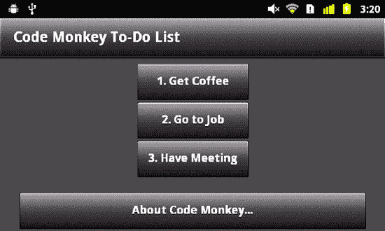

**图 8–1。** *运行在 Android 设备上的代码猴子音效示例*

`SoundEffect`类非常适合播放小的声音效果来响应应用事件。如果您需要对应用中的声音进行更高级的控制，那么是时候深入挖掘 Flash 平台必须提供的功能了。

### 复杂的声音解决方案

对于大多数应用来说,`SoundEffect`类是一个方便的抽象，这些应用的需求不会超出偶尔提示或通知用户的能力。在一些应用中，声音是主要成分之一。如果你想录制语音备忘录或播放音乐，那么你需要更深入地了解 Flash 声音 API。我们将首先看一看`Sound`类和它的伙伴:`SoundChannel`和`SoundTransform`。所有这三个类都可以在`flash.media`包中找到。

`Sound`类充当音频文件的数据容器。它的主要职责是提供将数据加载到其缓冲区的机制，并开始回放该数据。加载到`Sound`类中的音频数据通常来自 MP3 文件或应用本身动态生成的数据。不出所料，这个类中需要注意的关键方法是`load`和`play`方法。您使用`load`方法来提供应该加载到`Sound`中的 MP3 文件的 URL。数据一旦加载到`Sound`中，就不能更改。如果您稍后想要加载另一个 MP3 文件，您必须创建一个新的`Sound`对象。向`Sound`对象的构造函数传递一个 URL 相当于调用`load`方法。`Sound`类在加载音频数据的过程中调度几个事件，如 Table 8–1 所示。

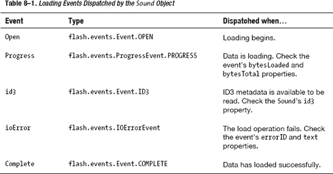

加载完数据后，调用`Sound`类的`play`方法将导致声音开始播放。`play`方法返回一个`SoundChannel`对象，该对象可用于跟踪声音播放的进度并提前停止播放。`SoundChannel`还有一个与之关联的`SoundTransform`对象，可以用来改变声音播放时的音量和声相。有三个可选参数可以传递给`play`方法。首先是`startTime`参数，它将导致声音在样本中指定的毫秒数开始播放。如果您希望声音播放一定的次数，也可以传递循环计数。最后，如果您想在声音开始播放时设置声音的初始转换，也可以提供一个`SoundTransform`对象作为`play`方法的参数。您传递的变换将被设置为`SoundChannel`的`SoundTransform`。

每次调用`Sound.play`方法时，都会创建并返回一个新的`SoundChannel`对象。`SoundChannel`在声音播放时充当你与声音互动的主要点。它允许你跟踪当前的位置和音量。它包含一个`stop`方法，该方法中断和终止声音的回放。当一个声音到达其数据的末尾时，`SoundChannel`类将通过分派类型为`flash.events.Event.SOUND_COMPLETE`的`soundComplete`事件来通知您。最后，您还可以使用它的`soundTransform`属性来操纵声音的音量，并将声音移动到左右扬声器。图 8–2 说明了这三个协作类之间的关系。

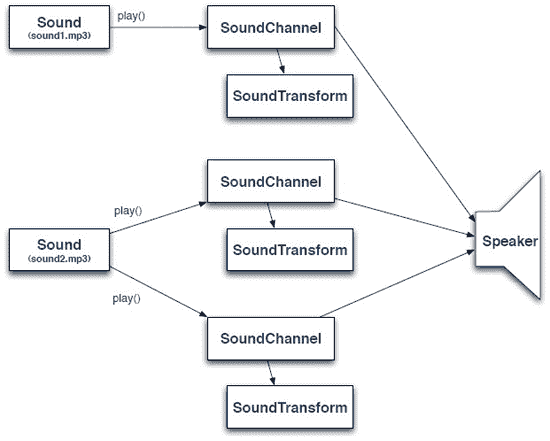

**图 8–2。***`Sound``SoundChannel``SoundTransform`*的关系

诚然，从`SoundChannel`到说话者的路径并不像图 8–2 暗示的那样直接。在音频信号到达扬声器之前，存在几个层(包括操作系统驱动程序和数模转换电路)。Flash 在`flash.media`包中还提供了另一个名为`SoundMixer`的类，它包括几个静态方法，用于在全局级别上操作和收集关于应用正在播放的声音的数据。

这就结束了我们对使用 Flash 在 Android 设备上播放声音所需要熟悉的类的概述。在下一节中，我们将看一些使用这些类来播放来自内存缓冲区和存储在设备上的文件的声音的例子。

### 播放录制的声音

我们在第七章的 MicrophoneBasic 示例应用中向您展示了如何从设备的麦克风录制音频数据。扩展该示例将为更深入地探索 Flash 的音频支持提供一个方便的起点。您可能还记得，我们给`Microphone`对象附加了一个事件处理程序来处理它的`sampleData`事件。每次麦克风为我们的应用获取数据时，都会调用处理程序。在那个例子中，我们实际上没有对麦克风数据做任何事情，但是将数据复制到一个`ByteArray`中用于以后的回放应该是一件简单的事情。问题是:我们如何播放来自`ByteArray`的声音数据？

#### 动态生成声音数据

如果你在一个没有加载任何东西的`Sound`对象上调用`play()`方法，这个对象将被迫寻找声音数据来播放。它通过调度`sampleData`事件来请求声音样本。事件的类型是`SampleDataEvent.SAMPLE_DATA`，在`flash.events`包中找到。这恰好与`Microphone`类用来通知我们样本可用的事件类型相同。我们之前问题的答案很简单:您只需为`Sound`的`sampleData`事件附加一个处理程序，并开始将字节复制到事件的`data`属性中。

因此，我们增强的应用将为`sampleData`事件提供两个独立的处理程序。当麦克风处于活动状态时，第一个会将数据复制到一个`ByteArray`，当我们回放时，第二个会将数据从同一个`ByteArray`复制到`Sound`对象。新应用的源代码可以在位于`examples/chapter-08`目录下的 SoundRecorder 应用中找到。清单 8–4 显示了麦克风数据的`sampleData`事件处理程序。

**清单 8–4。** *麦克风数据通知的设置代码和事件处理程序*

`private staticconst SOUND_RATE:uint = 44;
private staticconst MICROPHONE_RATE:uint = 22;

// Handles the View’s creationComplete event
private function onCreationComplete():void {
  if (Microphone.isSupported) {
    microphone = Microphone.getMicrophone();
    microphone.setSilenceLevel(0)
    microphone.gain = 75;
    microphone.rate = MICROPHONE_RATE;

    sound = new Sound();
    recordedBytes = new ByteArray();  
  } else {
    showMessage("microphone unsupported");
  }
}

// This handler is called when the microphone has data to give us` `private function onMicSample(event:SampleDataEvent):void {
  if (microphone.activityLevel > activityLevel) {
    activityLevel = Math.min(50, microphone.activityLevel);
  }

  if (event.data.bytesAvailable) {
    recordedBytes.writeBytes(event.data);
  }
}` 

`onCreationComplete`处理程序负责检测麦克风，初始化它，并创建应用用来存储和播放声音的`ByteArray`和`Sound`对象。请注意，麦克风的`rate`设置为 22 kHz。这对于捕获语音记录来说是足够的质量，并且比以全 44 kHz 记录占用更少的空间。

这个处理程序很简单。与之前一样，`Microphone`对象的`activityLevel`属性用于计算一个数字，该数字随后用于确定在显示器上绘制的动画曲线的幅度，以指示声音级别。然后事件的`data`属性，也就是一个`ByteArray`，被用来确定是否有麦克风数据可用。如果`bytesAvailable`属性大于零，那么字节从`data`数组复制到`recordedBytes`数组。这对于正常的录音来说效果很好。如果您需要记录数小时的音频数据，那么您应该将数据流式传输到服务器，或者将其写入设备上的文件中。

因为我们处理的是原始音频数据，所以由程序来记录声音的格式。在这种情况下，我们有一个麦克风，为我们提供 22 kHz 单声道(单声道)声音样本。`Sound`对象期望 44 kHz 立体声(左右声道)声音。这意味着每个麦克风样本必须写入`Sound`数据两次，以将其从单声道转换为立体声，然后再写入两次，以从 22 kHz 转换为 44 kHz。因此，每个麦克风样本名义上将被复制到`Sound`对象的数据数组中四次，以便使用与捕获时相同的速率回放录音。清单 8–5 显示了执行复制的`Sound`的`sampleData`处理程序。

**清单 8–5。**??`Sound`对象的数据请求的事件处理程序

`// This handler is called when the Sound needs more data
private function onSoundSample(event:SampleDataEvent):void {
  if (soundChannel) {
    var avgPeak:Number = (soundChannel.leftPeak + soundChannel.rightPeak) / 2;
    activityLevel = avgPeak * 50;
  }

  // Calculate the number of stereo samples to write for each microphone sample
  var sample:Number = 0;
  var sampleCount:int = 0;
  var overSample:Number = SOUND_RATE / MICROPHONE_RATE * freqMultiplier;

  while (recordedBytes.bytesAvailable && sampleCount < 2048/overSample) {
    sample = recordedBytes.readFloat();
    for (var i:int=0; i<overSample; ++i) {
      // Write the data twice to convert from mono to stereo
      event.data.writeFloat(sample);` `event.data.writeFloat(sample);
    }
    ++sampleCount;
  }
}` 

由于在回放和记录期间，显示器上的曲线应该是动画的，所以在处理程序中做的第一件事是计算用于绘制曲线的`activityLevel`。从上一节对声音相关类的概述中，我们知道`SoundChannel`类是我们需要查找正在播放的声音的信息的地方。这个类有一个`leftPeak`和一个`rightPeak`属性来指示声音的振幅。这两个值的范围都是从 0.0 到 1.0，其中 0.0 是静音，1.0 是最大音量。这两个值被平均并乘以 50 以计算出一个`activityLevel`，该值可用于激活波形显示。

现在我们到了有趣的部分:将记录的数据传输到声音的数据数组。首先计算`overSample`值。它解释了捕获频率与回放频率之间的差异。它在内部`for`循环中用于控制写入多少立体声样本(记住`writeFloat`被调用两次，因为在回放期间来自麦克风的每个样本都用于左右声道)。通常情况下,`overSample`变量的值是 2(44/22 ),乘以对`writeFloat`的两次调用，我们将得到之前计算的每个麦克风样本的四个回放样本。毫无疑问，您已经注意到还包括了一个额外的倍频因子。这个倍增器将让我们能够加快(想想花栗鼠)或减慢播放的频率。`freqMultiplier`变量的值将被限制在 0.5、1.0 或 2.0，这意味着`overSample`的值将是 1、2 或 4。与正常值 2 相比，值 1 将导致只有一半的样本被写入。这意味着频率会加倍，我们会听到花栗鼠的声音。值为 4 的`overSample`将导致慢动作音频回放。

下一个要回答的问题是:每次`Sound`请求数据时，我们的`recordedBytes`数组中有多少应该被复制到`Sound`中？粗略的回答是“在 2048 到 8192 个样本之间。”确切的答案是“视情况而定。”你不讨厌吗？但是在这种情况下，宇宙向我们展示了仁慈，因为依赖性是很容易理解的。写入更多样本以获得更好的性能，写入更少样本以获得更好的延迟。因此，如果您的应用只是简单地回放声音，正如它被记录，使用 8192。如果你必须生成声音或者动态地改变它，比如说，改变播放频率，那么使用更接近 2048 的东西来减少用户在屏幕上看到的和他们从扬声器听到的之间的滞后。如果您写入缓冲区的样本少于 2048 个，那么`Sound`会将其视为没有更多数据的标志，并且在剩余样本被消耗完之后，回放将会结束。在清单 8–5 中，`while`循环确保只要`recordedBytes`数组中有足够的数据可用，就总是写入 2048 个样本。

我们现在有能力记录和回放声音样本。应用所缺少的是在两种模式之间转换的方法。

#### 处理状态转换

应用有四种状态:`stopped`、`recording`、`readyToPlay`和`playing`。点击屏幕上的某个地方将使应用从一种状态转换到下一种状态。图 8–3 说明了这一过程。

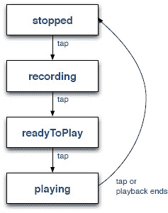

**图 8–3。** *录音机应用的四种状态*

应用在`stopped`状态下启动。当用户点击屏幕时，应用转换到`recording`状态，并开始录制他或她的声音。另一次点击停止记录并转换到`readyToPlay`状态。当用户准备好收听录音时，另一次点击在`playing`状态下开始回放。然后，用户可以第四次点击以停止播放并返回到`stopped`状态，准备再次录制。如果播放自行结束，应用也应自动转换到`stopped`状态。清单 8–6 显示了这个应用唯一的`View`的 MXML。

**清单 8–6。**??【录音笔应用的首页】??

`<?xml version="1.0" encoding="utf-8"?>
<s:View xmlns:fx="http://ns.adobe.com/mxml/2009"
        xmlns:s="library://ns.adobe.com/flex/spark"
        actionBarVisible="false"
        creationComplete="onCreationComplete()">

  <fx:Script source="SoundRecorderHomeScript.as"/>

  <s:states>
    <s:State name="stopped"/>
    <s:State name="recording"/>
    <s:State name="readyToPlay"/>
    <s:State name="playing"/>
  </s:states>` `<s:transitions>
    <s:Transition toState="stopped">
      <s:Parallel>
        <s:Scale target="{stopLabel}" scaleXBy="4" scaleYBy="4"/>
        <s:Fade target="{stopLabel}" alphaFrom="1" alphaTo="0"/>
        <s:Scale target="{tapLabel}" scaleXFrom="0" scaleXTo="1"
                 scaleYFrom="0" scaleYTo="1"/>
        <s:Fade target="{tapLabel}" alphaFrom="0" alphaTo="1"/>
      </s:Parallel>
    </s:Transition>

    <s:Transition toState="readyToPlay">
      <s:Parallel>
        <s:Scale target="{stopLabel}" scaleXBy="4" scaleYBy="4"/>
        <s:Fade target="{stopLabel}" alphaFrom="1" alphaTo="0"/>
        <s:Scale target="{tapLabel}" scaleXFrom="0" scaleXTo="1"
                 scaleYFrom="0" scaleYTo="1"/>
        <s:Fade target="{tapLabel}" alphaFrom="0" alphaTo="1"/>
      </s:Parallel>
    </s:Transition>

    <s:Transition toState="*">
      <s:Parallel>
        <s:Scale target="{tapLabel}" scaleXBy="4" scaleYBy="4"/>
        <s:Fade  target="{tapLabel}" alphaFrom="1" alphaTo="0"/>
        <s:Scale target="{stopLabel}" scaleXFrom="0" scaleXTo="1"
                 scaleYFrom="0" scaleYTo="1"/>
        <s:Fade  target="{stopLabel}" alphaFrom="0" alphaTo="1"/>
      </s:Parallel>
    </s:Transition>
  </s:transitions>

  <s:Group id="canvas" width="100%" height="100%" touchTap="onTouchTap(event)"/>
  <s:Label id="messageLabel" top="0" left="0" mouseEnabled="false" alpha="0.5"
           styleName="label"/>

    <s:Label id="tapLabel" bottom="100" horizontalCenter="0" mouseEnabled="false"
           text="Tap to Record" includeIn="readyToPlay, stopped"
           styleName="label"/>
  <s:Label id="stopLabel" bottom="100" horizontalCenter="0" mouseEnabled="false"
           text="Tap to Stop" includeIn="playing, recording"
           styleName="label"/>

  <s:Label id="speedLabel" top="100" horizontalCenter="0" mouseEnabled="false"
           text="{1/freqMultiplier}x" fontSize="48" includeIn="playing"
           styleName="label"/>
</s:View>`

这段代码包含了包含这个`View`的 ActionScript 代码的源文件，声明了`View`的四个状态以及它们之间的转换，最后声明了显示在`View`中的 UI 组件。UI 组件包括一个`Group`，它既是动画波形的绘图画布，也是触发状态转换的点击事件的处理程序。还有一个向用户显示错误消息的`Label`，两个向用户显示状态消息的`Label`，以及一个指示播放频率的`Label`。

现在桌子已经摆好了；定义了我们的用户界面和应用状态。下一步将是查看控制状态更改和 UI 组件的代码。清单 8–7 展示了控制从一个状态到下一个状态的转换的 ActionScript 代码。

**清单 8–7。** *控制录音机应用的状态转换顺序*

`private function onTouchTap(event:TouchEvent):void {
  if (currentState == "playing" && isDrag) {
    return;
  }

  incrementProgramState();
}

private function onSoundComplete(event:Event):void {
  incrementProgramState();
}

private function incrementProgramState():void {
  switch (currentState) {
    case"stopped":
      transitionToRecordingState();
      break;
    case"recording":
      transitionToReadyToPlayState();
      break;
    case"readyToPlay":
      transitionToPlayingState();
      break;
    case"playing":
      transitionToStoppedState();
      break;
  }
}` 

您可以看到，当用户点击屏幕或录制的声音播放完毕时，应用的状态会发生变化。`onTouchTap`函数还执行检查，以确保点击事件不是作为拖动的一部分生成的(用于控制回放频率)。`incrementProgramState`函数简单地使用`currentState`变量的值来确定接下来应该进入哪个状态，并调用适当的函数来执行与进入该状态相关的内务处理。这些函数如清单 8–8 所示。

**清单 8–8。** *录音机应用的状态转换功能*

`private function transitionToRecordingState():void {
  recordedBytes.clear();
  microphone.addEventListener(SampleDataEvent.SAMPLE_DATA, onMicSample);
  currentState = "recording";
}

private function transitionToReadyToPlayState():void {
  microphone.removeEventListener(SampleDataEvent.SAMPLE_DATA, onMicSample);
  tapLabel.text = "Tap to Play";
  currentState = "readyToPlay";
}` `private function transitionToPlayingState():void {
  freqMultiplier = 1;
  recordedBytes.position = 0;

  canvas.addEventListener(TouchEvent.TOUCH_BEGIN, onTouchBegin);
  canvas.addEventListener(TouchEvent.TOUCH_MOVE, onTouchMove);

  sound.addEventListener(SampleDataEvent.SAMPLE_DATA, onSoundSample);
  soundChannel = sound.play();
  soundChannel.addEventListener(Event.SOUND_COMPLETE, onSoundComplete);

  currentState = "playing";  
}

private function transitionToStoppedState():void {
  canvas.removeEventListener(TouchEvent.TOUCH_BEGIN, onTouchBegin);
  canvas.removeEventListener(TouchEvent.TOUCH_MOVE, onTouchMove);

  soundChannel.stop()
  soundChannel.removeEventListener(Event.SOUND_COMPLETE, onSoundComplete);
  sound.removeEventListener(SampleDataEvent.SAMPLE_DATA, onSoundSample);

  tapLabel.text = "Tap to Record";
  currentState = "stopped";
}` 

`transitionToRecordingState`函数从`recordedBytes`数组中清除任何现有的数据，将`sampleData`监听器添加到麦克风，以便它开始发送数据样本，最后设置`currentState`变量来触发动画状态转换。类似地，当记录完成时，调用`transitionToReadyToPlayState`。它负责从麦克风上移除`sampleData`监听器，将 UI 中的`Label`更改为“点击播放”，并再次设置`currentState`变量来触发动画过渡。

当用户点击屏幕开始回放录制的样本时，会调用`transitionToPlayingState`功能。它首先将回放频率重置为 1，并将`recordedBytes`数组的读取位置重置为数组的开头。接下来，它将触摸事件监听器添加到画布`Group`中，以便在回放期间监听控制倍频器的手势。它还为`Sound`的`sampleData`事件安装了一个处理程序，这样应用就可以在回放期间为`Sound`提供数据。然后调用`play`方法开始播放声音。一旦我们有了对控制回放的`soundChannel`的引用，我们就可以为`soundComplete`事件添加一个处理程序，这样我们就可以知道声音是否播放完毕，这样我们就可以自动转换回`stopped`状态。最后，改变`View`的`currentState`变量的值来触发动画状态转换。

最后一个转换是将应用带回到`stopped`状态。`transitionToStoppedState`函数负责停止播放(如果声音已经播放完毕，这没有任何作用),并删除所有由`transitionToPlayingState`函数添加的监听器。它最终重置`Label`的`text`属性，并更改`currentState`变量的值来触发状态转换动画。

剩下的功能是倍频器。清单 8–9 显示了处理控制这个变量的触摸事件的代码。

**清单 8–9。** *用触摸手势控制播放的频率*

`private function onTouchBegin(event:TouchEvent):void {
  touchAnchor = event.localY;
  isDrag = false;
}

private function onTouchMove(event:TouchEvent):void {
  var delta:Number = event.localY - touchAnchor;
  if (Math.abs(delta) > 75) {
    isDrag = true;
    touchAnchor = event.localY;
    freqMultiplier *= (delta > 0 ? 2 : 0.5);
    freqMultiplier = Math.min(2, Math.max(0.5, freqMultiplier));
  }
}` 

当用户第一次发起触摸事件时，调用`onTouchBegin`处理程序。代码记录下触摸点的初始 y 位置，并将`isDrag`标志重置为`false`。如果接收到触摸拖动事件，`onTouchMove`处理器检查移动是否大到足以触发拖动事件。如果是这样，`isDrag`标志被设置为`true`，因此应用的其余部分知道倍频器调整正在进行中。拖动的方向用于确定倍频器应该减半还是加倍。然后，该值被箝位在 0.5 和 2.0 之间。`touchAnchor`变量也被重置，以便在进一步移动的情况下可以再次运行计算。结果是，在回放期间，用户可以在屏幕上向上或向下拖动手指，以动态地改变回放的频率。

图 8–4 展示了运行在 Android 设备上的 SoundRecorder 示例应用。左边的图像显示了处于`recording`状态的应用，而右边的图像显示了从`readyToPlay`状态到`playing`状态的动画转换。

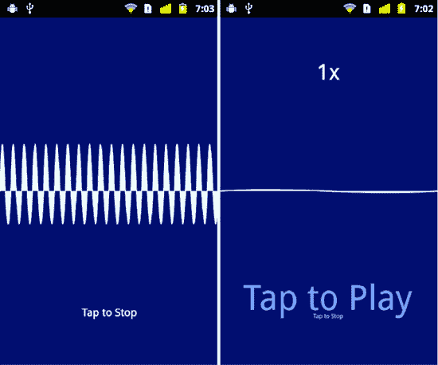

**图 8–4。** *运行在安卓设备上的录音笔应用*

我们现在已经向您展示了如何播放和操作存储在`ByteArray`中的数据。应该注意的是，如果您需要操作存储在`Sound`对象而不是`ByteArray`中的数据，这种技术也是可行的。您可以使用`Sound`类的`extract`方法来访问原始声音数据，以某种方式操纵它，然后在它的`sampleData`处理程序中将它写回另一个`Sound`对象。

声音功能的另一个常见用途是播放音乐，无论是通过互联网还是以 MP3 文件的形式存储在设备上。如果您认为 Flash 平台非常适合这种类型的应用，那么您是对的！下一节将向您展示如何用 Flash 编写移动音乐播放器。

### 一个 Flash 音乐播放器

在设备上播放 MP3 文件的声音并不复杂。然而，音乐播放器不仅仅是播放声音。本节将首先向您展示如何使用 Flash 的声音 API 来播放 MP3 文件。一旦解决了这个问题，我们将看看你在创建移动应用时需要考虑的其他因素。

#### 播放 MP3 文件

将 MP3 文件加载到`Sound`对象中就像使用以`file`协议开头的 URL 一样简单。清单 8–10 展示了这是如何实现的。

**清单 8–10。** *从文件系统加载并播放 MP3 文件*

`<?xml version="1.0" encoding="utf-8"?>
<s:View xmlns:fx="http://ns.adobe.com/mxml/2009"
        xmlns:s="library://ns.adobe.com/flex/spark"
        creationComplete="onCreationComplete()"
        title="Sound Loading">

  <fx:Script>
    <![CDATA[
      private var sound:Sound;

      private function onCreationComplete():void {
**        var path:String = "file:///absolute/path/to/the/file.mp3";**
**        sound = new Sound(new URLRequest(path));**
**        sound.play();**
      }
    ]]>
  </fx:Script>
</s:View>` 

粗体显示的三行是播放 MP3 文件所需的全部内容。注意`file://`后面的第三个正斜杠，它用来表示这是 MP3 文件的绝对路径。在实际应用中，你显然不希望使用这样的常量路径。在本章的后面，当我们讨论制作实际应用的注意事项时，我们将会看到以更优雅的方式处理文件系统路径的策略。

##### 读取 ID3 元数据

播放音乐文件是一个好的开始；毕竟这是音乐播放器的本质。所有音乐播放器做的另一件事是读取嵌入在文件的 ID3tags 中的元数据。 1 这些元数据包括艺术家和专辑的名字、录制年份，甚至歌曲的流派和曲目号。`Sound`类为读取这些标签提供了内置支持。清单 8–11 展示了如何将这一功能添加到我们刚刚起步的音乐播放器中。粗体行表示从清单 8–10 中新增的源代码。

__________

1 `[www.id3.org/](http://www.id3.org/)`

**清单 8–11。** *从 MP3 文件中读取 ID3 元数据*

`<?xml version="1.0" encoding="utf-8"?>
<s:View xmlns:fx="http://ns.adobe.com/mxml/2009"
        xmlns:s="library://ns.adobe.com/flex/spark"
        creationComplete="onCreationComplete()"
        title="Sound Loading">

  <fx:Script>
    <![CDATA
      private var sound:Sound;

      private function onCreationComplete():void {
        var path:String = "file:///absolute/path/to/the/file.mp3";
        sound = new Sound(new URLRequest(path));
**        sound.addEventListener(Event.ID3, onID3);**
        sound.play()
      }

**      private function onID3(event:Event):void {**
**        metaData.text = "Artist: "+sound.id3.artist+"\n"+**
**                        "Year: "+sound.id3.year+"\n";**
**      }**
  </fx:Script>

  <s:Label id="metaData" width="100%" textAlign="center"/>
</s:View>`

添加了`onID3`处理程序作为`Event.ID3`事件的监听器。当从 MP3 文件中读取元数据并准备好使用时，调用此处理程序。在`ID3Info`类中有几个预定义的属性，对应于更常用的 ID3 标签。像专辑名、艺术家名、歌曲名、流派、年份和曲目号都有在类中定义的属性。此外，您还可以访问 ID3 规范 2.3 版定义的任何其他文本信息框架。 [2 例如，要访问包含出版商名称的 TPUB 帧，您可以使用`sound.id3.TPUB`。

不支持的一件事是从 ID3 标签读取图像，如专辑封面。在本章的后面，你将学习如何使用开源的 ActionScript 库来完成这个任务。

##### 实施暂停功能

`SoundChannel`类不直接支持暂停声音数据的回放。然而，通过结合使用类的`position`属性和它的`stop`方法，很容易实现暂停特性。清单 8–12 展示了一种实现播放/暂停切换的可能技术。新添加的代码再次以粗体显示。

__________

2

**清单 8–12。**?? 实现播放/暂停切换

`<?xml version="1.0" encoding="utf-8"?>
<s:View … >

  <fx:Script>
    <![CDATA[
**      private var sound:Sound;**
**      private var channel:SoundChannel;**
**      private var pausePosition:Number = 0;**

**      [Bindable] private var isPlaying:Boolean = false;**

      private function onCreationComplete():void {
        var path:String = "file:///absolute/path/to/the/file.mp3";
        sound = new Sound(new URLRequest(path));
        sound.addEventListener(Event.ID3, onID3);
      }

      private function onID3(event:Event):void { /* same as before */ }

**      private function onClick():void {**
**        if (isPlaying) {**
**          pausePosition = channel.position;**
**          channel.stop();**
**          channel.removeEventListener(Event.SOUND_COMPLETE, onSoundComplete);**
**          isPlaying = false;**
**        } else {**
**          channel = sound.play(pausePosition);**
**          channel.addEventListener(Event.SOUND_COMPLETE, onSoundComplete);**
**          isPlaying = true;**
**        }**
**      }**

**      private function onSoundComplete(event:Event):void {**
**        isPlaying = false;**
**        pausePosition = 0;**
**      }**
    ]]>
  </fx:Script>

  <s:VGroup top="5" width="100%" horizontalAlign="center" gap="20">
    <s:Label id="metaData" width="100%" textAlign="center"/>
    **<s:Button label="{isPlaying ? 'Pause' : 'Play'}" click="onClick()"/>**
  </s:VGroup>
</s:View>`

在`onCreationComplete`处理程序中不再调用`Sound`的`play`方法。取而代之的是，界面上增加了一个按钮，它的`Label`根据`isPlaying`标志的值是“播放”还是“暂停”。点击按钮触发对`onClick`处理器的调用。如果声音当前正在播放，通道的`position`保存在`pausePosition`实例变量中，声音停止，并且`soundComplete`事件监听器从通道中移除。下次播放声音时，将创建一个新的`SoundChannel`对象。因此，未能从旧的`SoundChannel`中移除我们的侦听器将导致内存泄漏。

如果声音当前没有播放，它是通过调用`Sound`的`play`方法启动的。将`pausePosition`作为参数传递给`play`方法，这样声音将从上次停止的位置开始播放。一个`soundComplete`事件的监听器被附加到由`play`方法返回的新的`SoundChannel`对象上。当声音播放完毕时，将调用此事件的处理程序。当这种情况发生时，处理程序会将`isPlaying`标志的值重置为`false`并将`pausePosition`重置为零。这样，下次点击播放按钮时，歌曲将从头开始播放。

##### 调节音量

我们的音乐播放器也必须具备在播放歌曲时调节音量的功能。这是与歌曲播放时的`SoundChannel`相关联的`SoundTransform`对象的工作。清单 8–13 展示了如何使用`SoundTransform`来改变声音播放时的音量和声相。

**清单 8–13。** *实现音量和声相调整*

`<?xml version="1.0" encoding="utf-8"?>
<s:View …>
  <fx:Script>
    <![CDATA[
      /* All other code is unchanged… */

      private function onClick():void {
        if (isPlaying) {
           /* Same as before */
        } else {
          channel = sound.play(pausePosition);
          channel.addEventListener(Event.SOUND_COMPLETE, onSoundComplete);
**          onVolumeChange();**
**          onPanChange();**
          isPlaying = true;
        }
      }

**      private function onVolumeChange():void {**
**        if (channel) {**
**          var xform:SoundTransform = channel.soundTransform;**
**          xform.volume = volume.value / 100;**
**          channel.soundTransform = xform;**
**        }**
**      }**

**      private function onPanChange():void {**
**        if (channel) {**
**          var xform:SoundTransform = channel.soundTransform;**
**          xform.pan = pan.value / 100;**
**          channel.soundTransform = xform;**
**        }**
    ]]>
  </fx:Script>` `<s:VGroup top="5" width="100%" horizontalAlign="center" gap="20">
  <s:Label id="metaData" width="100%" textAlign="center"/>
  <s:Button label="{isPlaying ? 'Pause' : 'Play'}" click="onClick()"/>
**  <s:HSlider id="volume" minimum="0" maximum="100" value="100"**
**             change="onVolumeChange()"/>**
**  <s:HSlider id="pan" minimum="-100" maximum="100" value="0"**
**             change="onPanChange()"/>**
  </s:VGroup>
</s:View>`

我们添加了两个水平滑块，可以用来调整音量和声音播放时的平移。对于移动设备上的音乐播放器来说，担心声相可能不是一个很好的理由，但是为了完整起见，这里给出了一个例子。也许这个音乐播放器有一天会成长为一个迷你移动混音工作室。如果发生这种情况，您将在这个功能上有一个良好的开端！

当滑块移动时，调用`change`事件处理程序。注意调整`SoundTransform`设置所需的模式。您首先获得一个对现有转换的引用，以便从所有当前设置开始。然后更改您感兴趣的设置，并再次在通道上设置变换对象。设置`soundTransform`属性会触发频道更新其设置。这样，您可以将多个变换更改一起批处理，并且只需支付一次还原通道变换的成本。

`SoundTransform`的`volume`属性需要一个介于 0.0(静音)和 1.0(最大音量)之间的值。类似地，`pan`属性期望一个介于-1.0(左)和 1.0(右)之间的值。`change`处理程序负责将滑块的值调整到合适的范围。最后要注意的是`onVolumeChange`和`onPanChange`在声音开始播放时也会被调用。同样，这是必要的，因为每次调用`Sound`的`play`方法都会创建一个新的通道。这个新的通道对象在调用`onVolumeChange`和`onPanChange`之前不会有新的设置。

这就结束了我们对基本音乐播放器功能的快速概述。如果这就是你需要知道的全部信息，就没有必要再往下读了，所以你可以直接跳到“播放视频”部分。然而，如果你有兴趣了解把这个简约的音乐播放器变成一个真正的 Android 应用的所有考虑因素，那么下一节就是为你准备的。

#### 从原型到应用

我们已经介绍了在 Flash 中播放音乐所需的基本技术，但是创建一个真正的音乐播放器应用还需要更多的努力。本节将讨论一些需要完成的事情，包括以下内容:

*   创建可测试、可维护和可重用的代码
*   处理不同的屏幕密度
*   整合第三方库以提供 Flash 中缺少的功能
*   创建一个自定义控件来增加一点视觉效果
*   处理应用和`View`的激活和停用事件
*   停用应用时保持数据

我们将从一种架构模式开始，这种模式可以帮助您将`View`的逻辑从它的表示中分离出来，从而创建更具可重用性和可测试性的代码。您可以通过参考在本书源代码的`examples/chapter-08`目录中找到的 MusicPlayer 示例应用来跟踪这个讨论。

##### 更好的模式:展示模型

当我们以前想要将`View`的逻辑从它的表示中分离出来时，我们依赖于简单地将 ActionScript 代码移动到一个单独的文件中。然后使用`<fx:Script>`标签的`source`属性将该文件包含在 MXML `View`中。这是可行的，但是最终你会得到与`View`紧密耦合的脚本逻辑，因此不太容易重用。在用户界面中实现职责分离有更好的选择。

2004 年，Martin Fowler 发表了一篇文章，详细介绍了一种称为表示模型的设计模式。 3 这种模式是对流行的 MVC 模式 4 的一个小小的修改，特别适合现代框架，比如 Flash、Silverlight、WPF 和 JavaFX，它们包含了数据绑定等特性。实现这种模式通常需要三个类协同工作:数据模型、表示模型和`View`。值得注意的是，数据模型通常只是被称为“模型”或者有时是“领域模型”每个表示模型都可以访问一个或多个数据模型，并将其内容呈现给`View`进行显示。虽然不是原始模式描述的一部分，但是在富互联网应用中，服务类作为第四个组件包含进来是非常常见的。服务类封装了访问 web 服务(或任何其他类型的服务)所需的逻辑。服务类和表示模型通常会来回传递数据模型对象。

这种常见的应用结构在 Figure 8–5 中进行了说明，我们稍后将在音乐播放器应用中实现该设计。`SongListView`是我们的 MXML 文件，它声明了一个`View`来显示对象列表。`SongListView`只知道它的表示模型`SongListViewModel`。表示模型不知道使用它的`View`或`View`。它的工作是与`MusicService`协作来呈现一个用于显示的`MusicEntry`对象列表。有明确的责任划分，每个班级对系统的其余部分都了解有限。用软件工程术语来说，设计具有低耦合性和高内聚性。这应该是你设计的任何应用的目标。

__________

3 马丁·福勒，《演示模型》，`[`martinfowler.com/eaaDev/PresentationModel.html`](http://martinfowler.com/eaaDev/PresentationModel.html), July 19, 2004`

4 马丁·福勒，《模型视图控制器》，`[`martinfowler.com/eaaCatalog/modelViewController.html`](http://martinfowler.com/eaaCatalog/modelViewController.html)`

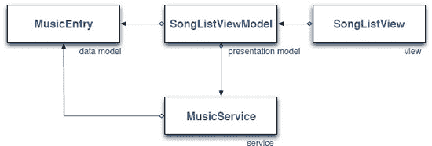

**图 8–5。** *演示模型模式的一种常见实现*

总之，使用表示模型模式有两个主要好处:

1.  `View`知道表示模型，但是表示模型对`View`一无所知。这使得多个`View`共享同一个表示模型变得很容易。这是表示模型模式使重用代码变得更容易的一种方式。
2.  大多数逻辑从`View`中移出，进入表示模型。`View`可以绑定到呈现模型的属性，以便向用户呈现数据。像按钮按下这样的动作最好直接传递给表示模型，而不是在`View`中处理。这意味着大部分值得测试的代码都在表示模型中，您不必担心测试 UI 代码。

##### 创建视图导航应用

既然已经了解了应用设计的基本构建模块，那么是时候创建一个新的 Flex 移动项目了。这个应用将是一个`ViewNavigatorApplication`，因为我们需要在两个不同的`View`之间导航:一个`View`包含歌曲、艺术家或专辑的列表，一个`View`包含播放歌曲的控件。一旦创建了项目，我们就可以设置应用的包结构。`assets`、`views`、`viewmodels`、`models`和`services`各有一个包。这使得按职责组织应用中的各种类变得很容易。这个`assets`包是应用的所有图形素材，比如图标和闪屏，将被放置在其中。

`ViewNavigatorApplication`的主要工作是创建和显示第一个`View`。这通常通过设置`<s:ViewNavigatorApplication>`标签的`firstView`属性来完成。在这个应用中会有一点不同，因为每个`View`的表示模型都会在它的`data`属性中传递给它。为了完成这个任务，一个处理程序被分配给`ViewNavigatorApplication`的`initialize`事件。在这个`onInitialize`处理程序中，`MusicService`和初始的表示模型将被创建并传递给第一个`View`。清单 8–14 显示了应用的 MXML。

**清单 8–14。**??【MXML】主`ViewNavigatorApplication`

`<?xml version="1.0" encoding="utf-8"?>
<s:ViewNavigatorApplication xmlns:fx="http://ns.adobe.com/mxml/2009"
                     xmlns:s="library://ns.adobe.com/flex/spark"
                     splashScreenImage="@Embed('assets/splash.png')"
                     initialize="onInitialize()"
                     applicationDPI="160">

  <fx:Script>
    <![CDATA[
      importservices.LocalMusicService;
      importservices.MusicService;
      import views.SongListView;
      import viewmodels.SongListViewModel;

**      private function onInitialize():void {**
**        var service:MusicService = new LocalMusicService();**
**        navigator.pushView(SongListView, new SongListViewModel(service));**
**      }**
    ]]>
  </fx:Script>
</s:ViewNavigatorApplication>`

这个应用中使用的`MusicService`接口的具体实现是一个名为`LocalMusicService`的类，它从设备的本地文件系统中读取文件。这个服务实例然后被用来构建表示模型，在这个例子中是`SongListViewModel`的一个实例。像这样将服务传递给表示模型比让表示模型在内部构造服务更可取。这使得在测试期间，或者如果程序的功能集被扩展到包括其他类型的音乐服务时，很容易向展示模型提供不同版本的服务。但是我们太超前了。我们将在下一节更详细地讨论这些类。

**注意:**有些人更喜欢让`View`类创建自己的表示模型，而不是像我们在这里使用`data`属性传递它。我们更喜欢将表示模型传递给`View`,因为在其他条件相同的情况下，您应该总是喜欢类之间的耦合更少。然而，这两种方式在实践中都很有效。

在清单 8–14 中需要注意的最后一件事是`ViewNavigatorApplication`的`applicationDPI`属性的声明。我们将它设置为 160，表示应用的 UI 将为 160 dpi 的屏幕设计。如果应用在更高 dpi 的屏幕上运行，UI 将相应地缩放。更多详情，请参考第二章的的“Flex 应用中的密度”一节。

##### 实现音乐服务

将您的服务类定义为一个`interface`是一个好主意。那么您的表示模型只依赖于`interface`类，而不依赖于任何一个具体的服务实现。这使得在您的表示模型中使用不同的服务实现成为可能。例如，您可以创建音乐服务的一个实现，从设备的本地存储中读取音乐文件，而另一个实现可以用于通过互联网传输音乐。

然而，使用服务接口还有一个更好的理由；这使得对你的表示模型进行单元测试变得很容易。假设您通常使用从互联网 web 服务读取音乐文件的`MusicService`实现来运行您的应用。如果您的表示模型硬连线使用这个版本，那么您不能孤立地测试表示模型。您需要确保您有一个活动的互联网连接，并且 web 服务已经启动并且正在运行，否则您的测试将会失败。使表示模型仅依赖于接口使得交换一个模拟服务变得很简单，该模拟服务向表示模型返回一个预定义的`MusicEntry`对象列表。这使得你的单元测试可靠且可重复。这也使它们运行得更快，因为您不必在每次测试中都从 web 服务下载数据！

给定一个 URL 路径，`MusicService`的工作只是提供一个`MusicEntry`对象的列表。因此，`interface`类将包含一个方法，如清单 8–15 所示。

**清单 8–15。***`MusicService`界面*

`package services
{
  import mx.collections.ArrayCollection;

  public interface MusicService {
    /**
     * A MusicService implementation knows how to use the rootPath to find
     * the list of MusicEntry objects that reside at that path.
     *
     * @return An ArrayCollection of MusicEntry objects.
     * @see models.MusicEntry
     */
    **function getMusicEntries(rootPath:String = null):ArrayCollection;**
  }
}`

一个`MusicEntry`对象可以代表一首歌曲，也可以代表一个保存一首或多首其他歌曲的容器。这样，我们可以使用多个`MusicEntry`对象列表来浏览艺术家、专辑和歌曲的分层列表。与大多数数据模型一样，这个类是一个属性集合，几乎没有逻辑。`MusicEntry`对象如清单 8–16 所示。

**清单 8–16。**??`MusicEntry`数据模型

`package models
{
  import flash.utils.IDataInput;`
`/**
   * This class represents an object that can be either a song or a container
   * of other songs.
   */  
  public class MusicEntry {
    private var _name:String;
    private var _url:String;
    private var _streamFunc:Function;

    public function MusicEntry(name:String, url:String, streamFunc:Function) {
      _name = name;
      _url = url;
      _streamFunc = streamFunc;
    }

    public function get name():String {
      return _name;
    }

    public function get url():String {
      return _url;
    }

    /**
     * @return A stream object if this is a valid song.  Null otherwise.
     */
    public function get stream():IDataInput {
      return _streamFunc == null ? null : _streamFunc();
    }

    public function get isSong():Boolean {
      return _streamFunc != null;
    }
  }
}`

`MusicEntry`包含条目`name`的属性，一个`url`标识条目的位置，一个`stream`可用于读取条目(如果是一首歌)，一个`isSong`属性可用于区分代表一首歌的条目和代表一个歌曲容器的条目。由于我们事先不知道阅读歌曲需要什么样的流，所以我们依赖 ActionScript 的函数式编程功能。这允许一个`MusicEntry`对象的创建者将一个函数对象传递给该类的构造器，当被调用时，该构造器负责创建适当类型的流。

这个应用将从设备的本地存储中播放音乐文件，所以我们的服务将提供从设备的文件系统中读取的`MusicEntry`对象。清单 8–17 展示了`LocalMusicService`的实现。

**清单 8–17。** *从本地文件系统*中读取歌曲的`MusicService`的实现

`package services
{
  import flash.filesystem.File;
  import flash.filesystem.FileMode;
  import flash.filesystem.FileStream;`
`import flash.utils.IDataInput;
  import mx.collections.ArrayCollection;
  import models.MusicEntry;

  public class LocalMusicService implements MusicService {
    private static const DEFAULT_DIR:File = File.userDirectory.resolvePath("Music");

    /**
     * Finds all of the files in the directory indicated by the path variable
     * and adds them to the collection if they are a directory or an MP3 file.
     *
     * @return A collection of MusicEntry objects.
     */
    public function getMusicEntries(rootPath:String=null):ArrayCollection {
      var rootDir:File = rootPath ? new File(rootPath) : DEFAULT_DIR;
      var songList:ArrayCollection = new ArrayCollection();

      if (rootDir.isDirectory) {
        var dirListing:Array = rootDir.getDirectoryListing();

        for (var i:int = 0; i < dirListing.length; i++) {
          var file:File = dirListing[i];

          if (!shouldBeListed(file))
            continue;

          songList.addItem(createMusicEntryForFile(file));
        }
      }

      return songList;
    }

    /**
     * @return The appropriate type of MusicEntry for the given file.
     */
    private function createMusicEntryForFile(file:File):MusicEntry {
      var name:String = stripFileExtension(file.name);
      var url:String = "file://" + file.nativePath;
      var stream:Function = null;

      if (!file.isDirectory) {
        stream = function():IDataInput {
          var stream:FileStream = new FileStream();
          stream.openAsync(file, FileMode.READ);
          return stream;
        }
      }

      return new MusicEntry(name, url, stream);
    }

    // Other utility functions removed for brevity…
  }
}`

毫不奇怪，这种类型的服务严重依赖于`flash.filesystem`包中的类。当使用文件系统路径时，您应该总是尝试使用在`File`类中定义的路径属性。`DEFAULT_DIR`常量使用`File.userDirectory`作为其默认路径的基础，在 Android 上它指向`/mnt/sdcard`目录。因此，该服务将默认在`/mnt/sdcard/Music`目录中查找其文件。这是 Android 设备上音乐文件的一个相当标准的位置。

**注意:** `File.userDirectory`、`File.desktopDirectory`、`File.documentsDirectory`都指向安卓设备上的`/mnt/sdcard`。`File.applicationStorageDirectory`指向一个特定于您的应用的“本地存储”目录。`File.applicationDirectory`空。

`LocalMusicPlayer`中的`getMusicEntries`实现将提供的`rootPath`字符串转换为`File`，或者如果没有提供`rootPath`则使用默认目录，然后继续遍历位于该路径的文件。它为任何一个目录(其他歌曲的容器)或 MP3 文件(一首歌曲)的`File`创建一个`MusicEntry`对象。如果`File`是一首歌而不是一个目录，那么`createMusicEntryForFile`函数创建一个函数闭包，当被调用时，打开一个异步`FileStream`进行读取。然后，这个函数闭包被传递给播放歌曲时要使用的`MusicEntry`对象的构造函数。您可能还记得清单 8–16 中，这个闭包对象的值——不管它是否为空——被用来确定对象所代表的`MusicEntry`的类型。

##### 歌曲列表视图

清单 8–14 显示应用创建的第一个`View`是`SongListView`。应用的`onInitialize`处理程序实例化适当类型的`MusicService`，并使用它为`View`构建`SongListViewModel`。然后将`SongListViewModel`作为`navigator.pushView`函数的第二个参数传递给`View`。这将在`View`的`data`属性中放置一个对模型实例的引用。

`SongListViewModel`的工作非常简单。它使用给定的`MusicService`来检索`SongListView`要显示的`MusicEntry`对象列表。清单 8–18 显示了这个表示模型的源代码。

**清单 8–18。** *的演示模式为`SongListView`*

`package viewmodels
{
  import models.MusicEntry;
  import mx.collections.ArrayCollection;
  import services.LocalMusicService;
  import services.MusicService;

  [Bindable]
  public class SongListViewModel {` `private var _entries:ArrayCollection = new ArrayCollection();
    private var _musicEntry:MusicEntry;
    private var _musicService:MusicService;

    public function SongListViewModel(service:MusicService = null,
                                      entry:MusicEntry = null ) {
      _musicEntry = entry;
      _musicService = service;

      if (_musicService) {
        var url:String = _musicEntry ? _musicEntry.url : null;
        entries = _musicService.getMusicEntries(url);
      }
   }

    public function get entries():ArrayCollection {
      return _entries;
    }

    public function set entries(value:ArrayCollection):void {
      _entries = value;
    }

    public function cloneModelForEntry(entry:MusicEntry):SongListViewModel {
      return new SongListViewModel(_musicService, entry);
    }

    public function createSongViewModel(selectedIndex:int):SongViewModel {
      return new SongViewModel(entries, selectedIndex);
    }
  }
}`

该类用`Bindable`进行了注释，因此`entries`属性可以绑定到`View`类中的 UI 组件。

构造函数将存储对传入的`MusicService`和`MusicEntry`实例的引用。如果服务引用不为空，则从`MusicService`中检索条目集合。如果服务为空，那么`entries`集合将保持为空。

该类中还有两个额外的公共函数。`cloneModelForEntry`函数将通过传递给它的`MusicService`引用来创建一个新的`SongListViewModel`。`createSongViewModel`将使用这个模型的`entries`集合和所选条目的索引为`SongView`创建一个新的表示模型。这是这些函数的逻辑位置，因为这个表示模型引用了创建新表示模型所需的数据。因此，一个表示模型创建另一个表示模型是很常见的。

考虑到这一点，是时候看看`View`如何使用它的表示模型了。`SongListView`的源代码如清单 8–19 所示。

**清单 8–19。***`SongListView`*

`<?xml version="1.0" encoding="utf-8"?>
<s:View xmlns:fx="http://ns.adobe.com/mxml/2009"
        xmlns:s="library://ns.adobe.com/flex/spark"
        initialize="onInitialize()"
        title="Music Player">

  <fx:Script>
    <![CDATA[
      import spark.events.IndexChangeEvent;
      import models.MusicEntry;
      import viewmodels.SongListViewModel;

      [Bindable]
      private var model:SongListViewModel;

      private function onInitialize():void {
        model = data as SongListViewModel;
      }

      private function onChange(event:IndexChangeEvent):void {
        var list:List = List(event.target);
        var selObj:MusicEntry = list.selectedItem as MusicEntry;

        if (selObj.isSong) {
          var index:int = list.selectedIndex;
          navigator.pushView(SongView, model.createSongViewModel(index));
        } else {
          navigator.pushView(SongListView, model.cloneModelForEntry(selObj));
        }
      }
    ]]>
  </fx:Script>

  <s:List width="100%" height="100%" change="onChange(event)"
          dataProvider="{model.entries}">
    <s:itemRenderer>
      <fx:Component>
        <s:IconItemRenderer labelField="name" decorator="{chevron}">
          <fx:Declarations>
            <s:MultiDPIBitmapSource id="chevron"
                                source160dpi="@Embed('assets/chevron160.png')"
                                source240dpi="@Embed('assets/chevron240.png')"
                                source320dpi="@Embed('assets/chevron320.png')"/>
          </fx:Declarations>
        </s:IconItemRenderer>
      </fx:Component>
    </s:itemRenderer>
  </s:List>
</s:View>`

`onInitialize`处理程序从`data`属性初始化`View`的模型引用。然后`model`被用来访问作为`List`的`dataProvider`的`entries`。它也用于`List`的`onChange`处理程序中。如果选择的`MusicEntry`是一首歌曲，则用`model`创建一首新的`SongViewModel`，用`navigator.pushView`功能显示一首`SongView`。否则，创建一个新的`SongListViewModel`并使用选择的`MusicEntry`作为新的`MusicEntry`对象集合的路径显示一个新的 ??。

还为`List`组件声明了一个自定义的`IconItemRenderer`。这样做是为了给项目渲染器添加一个 v 形符号，以表明选择一个项目会导致一个新的`View`。一个`MultiDPIBitmapSource`用于参考三个预缩放版本的人字形图像。注意，人字形位图源必须包含在`<fx:Declaration>`标签中，该标签是`<s:IconItemRenderer>`标签的子元素。如果位图源被声明为`View`的`<fx:Declaration>`标签的子标签，那么它对`IconItemRenderer`是不可见的。

`chevron160.png`文件是基本大小，而`chevron240.png`大 50%，`chevron320.png`大两倍。人字形位图的最佳尺寸将根据运行程序的设备的屏幕属性来选择。图 8–6 显示了在中低 dpi 设备上运行的`SongListView`。请注意，人字形没有因缩放而产生的像素化伪像，如果我们在两个屏幕上使用相同的位图，就会出现这种情况。

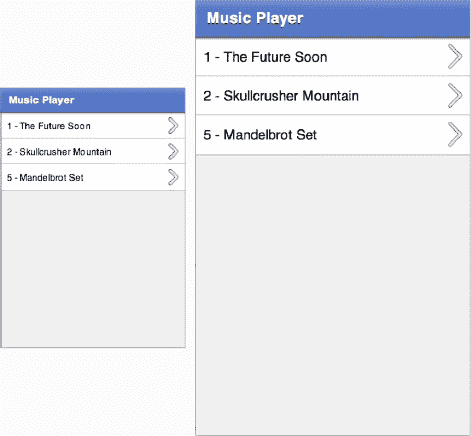

**图 8–6。**??`SongListView`运行在不同 dpi 分类的设备上

**注意:**你也可以使用一个 FXG 图形作为一个`IconItemRenderer`的图标或装饰，方法是以与前面的`MultiDPIBitmapSource`相同的方式声明它。不幸的是，由于图标和装饰将被转换成位图，然后缩放，您将失去使用矢量图形的好处。出于这个原因，我们建议您将`MultiDPIBitmapSource`对象与您的自定义`IconItemRenderers`一起使用。

##### 宋观

这就把我们带到了应用的真正核心:让用户播放音乐的视图！我们希望这个界面具有与大多数其他音乐播放器相同的功能。我们将显示歌名和专辑封面。它应该有控件，允许用户跳到下一首或上一首歌曲，播放和暂停当前歌曲，调整当前歌曲的位置以及音量和平移(只是为了好玩)。产生的界面如图 8–7 所示。

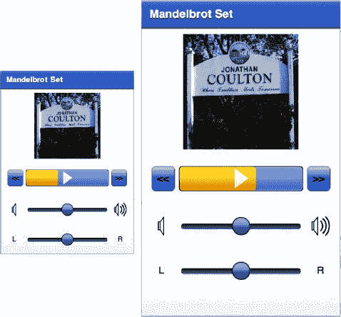

**图 8–7。***`SongView`界面运行在两种不同的 dpi 设置下*

从 Figure 8–7 可以看出，这个界面比列表视图稍微复杂一点。它甚至包括一个自定义控件，不仅可以作为播放/暂停按钮，还可以作为当前歌曲播放位置的进度指示器。此外，你可以通过在按钮上来回滑动手指来控制歌曲的位置。编写这个自定义控件只是本节将要讨论的主题之一。

清单 8–20 显示了定义这个`View`的 MXML 文件的一部分。由于这是一个更大的接口声明，我们将把它分解成更小、更容易理解的部分。

**清单 8–20。**??【美国】和`SongView` MXML 文件的剧本章节

`<?xml version="1.0" encoding="utf-8"?>
<s:View xmlns:fx="http://ns.adobe.com/mxml/2009"
        xmlns:s="library://ns.adobe.com/flex/spark"
        xmlns:assets="assets.*"
        xmlns:views="views.*"
        initialize="onInitialize()"
        viewDeactivate="onViewDeactivate()"
        title="{model.songTitle}" >

  <s:states>
    <s:State name="portrait"/>
    <s:State name="landscape"/>
  </s:states>

  <fx:Script>
    <![CDATA[
      import viewmodels.SongViewModel;

      [Bindable]
      private var model:SongViewModel;

      private function onInitialize():void {
        model = data as SongViewModel;
        model.addEventListener(SongViewModel.SONG_ENDED, onSongEnded);
      }

      private function onViewDeactivate():void {
        model.removeEventListener(SongViewModel.SONG_ENDED, onSongEnded);
        if (model.isPlaying)
          model.onPlayPause();
      }

      private function onSongEnded(event:Event):void {
        progressButton.stop();
      }
    ]]>
  </fx:Script>
  <!-- UI components removed for now… -->
</s:View>`

文件的`<s:states>`部分声明了界面的`portrait`和`landscape`方向的状态。请记住第二章中的，通过在`View`中明确声明这些状态的名称，Flex 将在设备方向改变时适当地设置我们的`View`的状态。完成这些后，当方向改变时，您可以利用这些状态名来调整界面的布局。

与在`SongListView`中一样，`onInitialize`处理程序从`data`属性初始化表示模型引用。它还为模型的`SONG_ENDED` 事件附加了一个处理程序，以便`onSongEnded`处理程序可以在歌曲结束播放时适当地调整界面。还声明了一个用于`View`的`viewDeactivate`事件的处理程序。这允许当用户离开`View`时`View`停止播放歌曲。

我们现在将一次一个片段地检查这个`View`的 UI 组件。

`<s:Rect width="100%" height="100%">
  <s:fill>
    <s:LinearGradient rotation="90">
      <s:GradientEntry color="0xFFFFFF" ratio="0.40"/>
      <s:GradientEntry color="0xe2e5f4" ratio="1.00"/>
    </s:LinearGradient>
  </s:fill>
</s:Rect>`

MXML 的第一部分在屏幕底部声明了从白色到浅蓝色的背景渐变。矩形的`width`和`height`被设置为 100%,这样无论设备处于什么方向，它都会自动填充屏幕。

`<s:Group width="100%" height="100%">
  <s:layout.landscape>
    <s:HorizontalLayout verticalAlign="middle" paddingLeft="10"/>
  </s:layout.landscape>
  <s:layout.portrait>
    <s:VerticalLayout horizontalAlign="center" paddingTop="10"/>
  </s:layout.portrait>`

前面的代码片段创建了作为接口其余部分的容器的`Group`。再一次，它的`width`和`height`被设置为总是充满屏幕。`Group`在风景模式下使用一个`HorizontalLayout`，在肖像模式下使用一个`VerticalLayout`。状态语法确保在设备重定向时使用正确的布局。图 8–8 显示了横向放置的设备上的`SongView`界面。

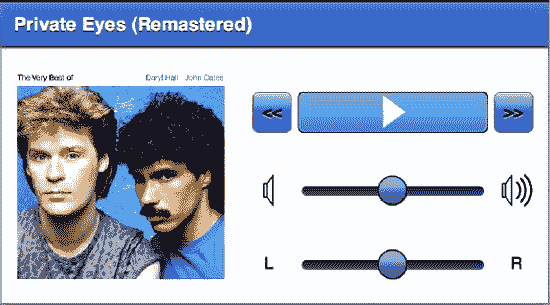

**图 8–8。** *横向音乐播放器界面*

下一段代码中的`Group`是专辑封面图像的容器。`Group`的大小根据方向动态调整，但是宽度和高度总是保持相等——它总是形成一个正方形。

`<s:Group width.portrait="{height*0.4}" height.portrait="{height*0.4}"
         width.landscape="{width*0.4}" height.landscape="{width*0.4}">
  <s:BitmapImage id="albumCover" width="100%" height="100%"
                 source="{model.albumCover}"
                 visible="{model.albumCover != null}"/>

  <assets:DefaultAlbum id="placeHolder" width="100%" height="100%"
                       visible="{!model.albumCover}" />
</s:Group>`

`albumCover`位图的源被绑定到模型的`albumCover`属性。只有当模型中确实有一个`albumCover`图像时，该位图才可见。如果没有，则显示占位符图形。占位符是一个 FXG 图像，位于应用的`assets`包中。您可以看到在您的 MXML 声明中使用 FXG 图形是微不足道的。由于它们是矢量图形，因此对于不同的屏幕密度也能很好地缩放。

在专辑封面之后，我们到达包含这个`View`控件的`VGroup`。这个`VGroup`实际上是由三个独立的`HGroup`集装箱组成的。第一个包含上一首歌按钮、自定义的`ProgressButton`控件和下一首歌按钮。下一个`HGroup`容器包含水平音量滑块，以及它的 FXG 图标，以指示滑块两侧的低音量和高音量。最后的`HGroup`包含水平平移滑块，以及显示左右方向的`Label`。注意，模型的`volume`、`pan`和`percentComplete`属性通过双向绑定被绑定到接口组件。这意味着绑定的任何一端都可以设置属性的值，而另一端将被更新。

`<s:VGroup id="controls" horizontalAlign="center" width="100%"
          paddingTop="20" gap="40">
  <s:HGroup width="90%">
    <s:Button label="&lt;&lt;" height="40" click="model.previousSong()"/>
    <views:ProgressButton id="progressButton" width="100%" height="40"
                          click="model.onPlayPause()"
                          percentComplete="@{model.percentComplete}"
                          skinClass="views.ProgressButtonSkin"/>
    <s:Button label=">>" height="40" click="model.nextSong()"/>
  </s:HGroup>

  <s:HGroup verticalAlign="middle" width="90%">
    <assets:VolLow id="volLow" width="32" height="32"/>
    <s:HSlider width="100%" maximum="1.0" minimum="0.0" stepSize="0.01"
             snapInterval="0.01" value="@{model.volume}" showDataTip="false"/>
    <assets:VolHigh id="volHigh" width="32" height="32"/>
  </s:HGroup>

  <s:HGroup verticalAlign="middle" width="90%" >
    <s:Label text="L" width="32" height="32" verticalAlign="middle"
             textAlign="center"/>
    <s:HSlider width="100%" maximum="1.0" minimum="-1.0" stepSize="0.01"
             snapInterval="0.01" value="@{model.pan}" showDataTip="false"/>
    <s:Label text="R" width="32" height="32" verticalAlign="middle"` `textAlign="center"/>
      </s:HGroup>
    </s:VGroup>
  </s:Group>
</s:View>`

请注意，`View`中几乎没有逻辑。它都是声明性的表示代码，就像它应该的那样。所有的艰苦工作都委托给了表示模型。

不幸的是，`SongViewModel`类太大了，无法完整列出，所以我们将限制自己只查看该类的几个精选部分。请记住，播放音乐文件所需的基本功能在本章前面已经介绍过了，如果您想查看该类的完整源代码，可以参考本书示例代码中包含的 MusicPlayer 项目。清单 8–21 显示了`SongViewModel`类的声明和构造函数。

**清单 8–21。***`SongViewModel`级*的宣言

`package viewmodels
{
  // import statements…

  [Event(name="songEnded", type="flash.events.Event")]

  [Bindable]
  public class SongViewModel extends EventDispatcher {
    public static const SONG_ENDED:String = "songEnded";

    public var albumCover:BitmapData;
    public var albumTitle:String = "";
    public var songTitle:String = "";
    public var artistName:String = "";
    public var isPlaying:Boolean = false;

    private var timer:Timer;

    public function SongViewModel(songList:ArrayCollection, index:Number) {
      this.songList = songList;
      this.currentIndex = index;

      timer = new Timer(500, 0);
      timer.addEventListener(TimerEvent.TIMER, onTimer);

      loadCurrentSong();
    }
  }
}`

该类扩展了`EventDispatcher`以便它可以在歌曲结束时通知任何可能正在收听的`View`。当这种情况发生时，模型会调度`SONG_ENDED`事件。这个模型还用`Bindable`进行了注释，以确保`View`可以轻松绑定到属性，如`albumCover`位图、`albumTitle`、`songTitle`、`artistName`和`isPlaying`标志。构造函数获取一个集合`MusicEntries`和该集合中应该播放的歌曲的索引。这些参数被保存到实例变量中以供以后参考，因为当用户想要跳到集合中的上一首或下一首歌曲时会用到它们。构造函数还初始化一个每 500 毫秒计时一次的计时器。这个定时器读取歌曲的当前位置，并更新类的`percentComplete`变量。最后，构造函数加载当前歌曲。接下来的两节介绍了关于处理`percentComplete`更新和`loadCurrentSong`方法的更多细节。

###### 双向装订的特殊考虑

当查看`SongView`的 MXML 声明时，我们注意到双向绑定被用于模型的`volume`、`pan`和`percentComplete`变量。这意味着它们的值可以在模型类之外设置。这种额外的复杂性需要在模型类中进行一些特殊的处理。清单 8–22 显示了与`SongViewModel`中的这些属性相关的代码。

**清单 8–22。** *在展示模型中处理双向绑定*

`private var _volume:Number = 0.5;
  private var _pan:Number = 0.0;
  private var _percentComplete:int = 0;

  public function get volume():Number {return _volume; }
  public function set volume(val:Number):void {
    _volume = val;
    updateChannelVolume();
  }

  public function get pan():Number {return _pan; }
  public function set pan(val:Number):void {
    _pan = val;
    updateChannelPan();
  }

  public function get percentComplete():int {return _percentComplete;}

  /**
   * Setting this value causes the song's play position to be updated.
   */
  public function set percentComplete(value:int):void {
    _percentComplete = clipToPercentageBounds(value)
    updateSongPosition();
  }

  /**
   * Clips the value to ensure it remains between 0 and 100 inclusive.
   */
  private function clipToPercentageBounds(value:int):int {
    return Math.max(0, Math.min(100, value));
  }

  /**
   * Set the position of the song based on the percentComplete value.
   */
  private function updateSongPosition():void {
    var newPos:Number = _percentComplete / 100.0 * song.length;
    if (isPlaying) {` `pauseSong()
    playSong(newPos);
  } else {
    pausePosition = newPos;
  }
}`

`volume`、`pan`、`percentComplete`属性的`public get`和`set`函数保证了它们可以在`View`中绑定。简单地将变量声明为 public 在这里是行不通的，因为当它们是从类外部设置时，我们需要做一些额外的工作。当设置了`volume`和`pan`属性时，我们只需要调用更新`SoundTransform`中的值的函数，如本章前面所示。处理`percentageComplete`更新有点复杂:如果歌曲正在播放，我们需要停止它，然后在新的位置重新开始。我们使用私有的`pauseSong`和`playSong`实用程序方法来处理细节。如果歌曲当前没有播放，我们只需更新私有的`pausePosition`变量，这样下次歌曲开始播放时，它就从更新的位置开始播放。

这涵盖了对来自类外的`percentComplete`更新的处理，但是来自类内的更新呢？回想一下，有一个定时器每半秒钟读取一次歌曲的位置，然后更新`percentComplete`的值。在这种情况下，我们仍然需要通知绑定的另一方,`percentComplete`的值已经更改，但是我们不能使用`set`方法来这样做，因为我们不想每隔半秒钟就停止并重新启动歌曲。我们需要一个替代的更新路径，如清单 8–23 所示。

**清单 8–23。** *在定时器滴答期间更新`percentComplete`*

`/*
 * Update the song's percentComplete value on each timer tick.
 */
private function onTimer(event:TimerEvent):void {
  var oldValue:int = _percentComplete;

  var percent:Number = channel.position / song.length * 100;
  updatePercentComplete(Math.round(percent));
}

/**
 * Updates the value of _percentComplete without affecting the playback
 * of the current song (i.e. updateSongPosition is NOT called).  This
 * function will dispatch a property change event to inform any clients
 * that are bound to the percentComplete property of the update.
 */
private function updatePercentComplete(value:int):void {
  var oldValue:int = _percentComplete;
  _percentComplete = clipToPercentageBounds(value);

  var pce:Event = PropertyChangeEvent.createUpdateEvent(this,
        "percentComplete", oldValue, _percentComplete);
  dispatchEvent(pce);
}`

这里给出的解决方案是直接更新`_percentComplete`的值，然后手动调度`PropertyChangeEvent`通知绑定的另一方值已经改变。

###### 整合中期文库

如果能在 MP3 文件的元数据中嵌入专辑封面的图像，那就太好了。然而，Flash 的`ID3Info`类不支持从声音文件中读取图像元数据。幸运的是，这些年来，围绕 Flex 和 Flash 平台已经形成了一个充满活力的开发社区。这个社区已经产生了许多第三方库，帮助填补平台中缺失的功能。一个这样的库是开放源码的 Metaphilelibrary。 5 这个小而强大的 ActionScript 库提供了从许多流行的文件格式中读取元数据(包括图像)的能力。

使用这个库非常简单，只需从项目网站下载最新的代码，将其编译成一个`.swc`文件，然后将该文件放在项目的`libs`目录中。该库提供了一个可以用来读取 MP3 元数据条目的`ID3Reader`类，如清单 8–24 所示。当`Sound`类使用当前歌曲的`MusicEntry`实例提供的 URL 时，Metaphile 的`ID3Reader`类被设置为读取其元数据。当元数据被解析后，会通知一个`onMetaData`事件处理程序。该类的`autoLimit`属性设置为-1，因此可以解析的元数据的大小没有限制，并且`autoClose`属性设置为`true`，以确保一旦`ID3Reader`读取完元数据，输入流将被关闭。最后一步是调用`ID3Reader`的`read`函数，将通过访问`MusicEntry`的`stream`属性创建的输入流作为参数传入。

**清单 8–24。** *加载 MP3 文件并读取其元数据*

`/**
 * Loads the song data for the entry in the songList indicated by
 * the value of currentSongIndex.
 */
private function loadCurrentSong():void {
  try {
    var songFile:MusicEntry = songList[currentIndex];

    song = new Sound(new URLRequest(songFile.url));

    var id3Reader:ID3Reader = new ID3Reader();
    id3Reader.onMetaData = onMetaData;
    id3Reader.autoLimit = -1;
    id3Reader.autoClose = true;

    id3Reader.read(songFile.stream);
  } catch (err:Error) {
    trace("Error while reading song or metadata: "+err.message);
  }` `}

/**
 * Called when the song's metadata has been loaded by the Metaphile
 * library.
 */
private function onMetaData(metaData:IMetaData):void {
  var songFile:MusicEntry = songList[currentIndex];
  var id3:ID3Data = ID3Data(metaData);

  artistName = id3.performer ? id3.performer.text : "Unknown";
  albumTitle = id3.albumTitle ? id3.albumTitle.text : "Unknown";
  songTitle = id3.songTitle ? id3.songTitle.text : songFile.name;

  if (id3.image) {
    var loader:Loader = new Loader();
    loader.contentLoaderInfo.addEventListener(Event.COMPLETE,
                                              onLoadComplete)
    loader.loadBytes(id3.image);
  } else {
    albumCover = null;
  }
}

/**
 * Called when the album image is finished loading from the metadata.
 */
private function onLoadComplete(e:Event):void{
  albumCover = Bitmap(e.target.content).bitmapData
}`

__________

5 `[`code.google.com/p/metaphile/`](http://code.google.com/p/metaphile/)`

向`onMetaData`处理程序传递一个符合中期库`IMetaData`接口的参数。由于这个处理程序被附加到一个`ID3Reader`对象，我们知道将传入的`metaData`对象强制转换为一个`ID3Data`对象的实例是安全的。这样做可以让我们轻松访问`ID3Data`类的属性，比如`performer`、`albumTitle`和`songTitle`。如果在`ID3Data`类的 image 属性中存在图像数据，则创建一个新的`flash.display.Loader`实例，将字节加载到`DisplayObject`中。当加载图像字节时，`onLoadComplete`处理程序使用存储在`Loader`的内容属性中的`DisplayObject`来初始化`albumCover BitmapData`对象。由于`View`被绑定到了`albumCover`属性，所以一旦相册封面图像被更新，它就会显示出来。

##### 创建定制组件

创建自定义移动组件与在 Flex 4 中创建任何其他自定义 Spark 组件非常相似。你创建了一个扩展了`SkinnableComponent`的`component`类和一个`Skin`。只要你的图形不是太复杂，你可以使用普通的 MXML `Skin`。如果您遇到性能问题，您可能需要用 ActionScript 编写您的`Skin`。参见第十一章了解有关移动应用性能调整的更多信息。

我们将编写的定制组件是`ProgressButton`。为了节省用户界面的空间，我们希望将播放/暂停按钮的功能与指示歌曲当前播放位置的进度监视器的功能结合起来。如果需要的话，控制器还将允许用户调整回放位置。因此，如果用户点击控件，我们将把它视为按钮的切换。如果用户触摸控件，然后水平拖动，将被视为位置调整。

因此，该控件将有两个图形元素:一个指示播放/暂停功能状态的图标和一个显示歌曲播放位置的进度条。图 8–9 显示了各种状态下的控制。

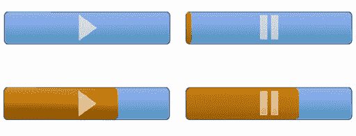

**图 8–9。** *自定义`ProgressButton`控制*

当创建自定义 Spark 控件时，您可以将`Skin`视为您的`View`并将`SkinnableComponent`视为您的模型。清单 8–25 显示了`ProgressButton`类，它扩展了`SkinnableComponent`，因此充当控件的模型。

**清单 8–25。***`ProgressButton`*的申报组成部分

`package views
{
  // imports removed…

  [SkinState("pause")]
  public class ProgressButton extends SkinnableComponent
  {
    [SkinPart(required="true")]
    public var playIcon:DisplayObject;

    [SkinPart(required="true")]
    public var pauseIcon:DisplayObject;

    [SkinPart(required="true")]
    public var background:Group;

    [Bindable]
    public var percentComplete:Number = 0;

    private var mouseDownTime:Number;
    private var isMouseDown:Boolean;

    public function ProgressButton() {` `*// Make sure the mouse doesn't interact with any of the skin parts*
      mouseChildren = false;

      addEventListener(MouseEvent.MOUSE_DOWN, onMouseDown);
      addEventListener(MouseEvent.MOUSE_MOVE, onMouseMove);
      addEventListener(MouseEvent.MOUSE_UP, onMouseUp);
      addEventListener(MouseEvent.CLICK, onMouseClick);
    }

    override protected function getCurrentSkinState():String {
      if (isPlaying()) {
        return "play";
      } else {
        return "pause";
      }
    }

    override protected function partAdded(partName:String, instance:Object):void {
      super.partAdded(partName, instance);

      if (instance == pauseIcon) {
        pauseIcon.visible = false;
      }
    }

    override protected function partRemoved(partName:String, instance:Object):void {
      super.partRemoved(partName, instance);
    }

    // Consult Listing 8–26 for the rest of this class
  }
}`

组件有两种状态，每个`Skin`都必须支持:`play`和`pause`。用`SkinState(“pause”)`对`component`类进行注释，将其`Skin`的默认状态设置为`pause`状态。虽然一个`Skin`可以根据需要声明尽可能多的部分，但是组件要求每个`Skin`至少定义一个`playIcon`、`pauseIcon`和一个`background`。组件和`Skin`之间接口契约的最后一个组件是`Skin`用来绘制进度条的可绑定`percentComplete`属性。组件的构造函数禁止鼠标与包含在`Skin`中的任何子组件交互，并为它需要处理的鼠标事件附加监听器。

大多数组件需要实现三种方法来确保自定义控件的正确行为:`getCurrentSkinState`、`partAdded`和`partRemoved`。当`Skin`需要更新显示时，它调用`getCurrentSkinState`函数。`ProgressButton`组件覆盖这个函数，根据`isPlaying`标志的当前值返回状态名。当添加和移除`Skin`部件时，`partAdded`和`partRemoved`功能使组件有机会执行初始化和清理任务。在这种情况下，这两个函数都确保在超类中调用它们对应的函数，并且为`ProgressButton`所做的惟一特殊化是确保`pauseIcon`在被添加时是不可见的。

清单 8–26 显示了`ProgressButton`类中定义的其余函数。它显示了构成该类的公共接口、鼠标事件处理程序和私有实用函数的其他函数。例如，`SongView`在被通知当前歌曲已经播放完毕时，调用`stop`函数。

**清单 8–26。***`ProgressButton`组件类*的剩余功能

`/**
 * If in "play" state, stops the progress and changes the control's
 * state from "play" to "pause".
 */
public function stop():void {
  if (isPlaying()) {
    togglePlayPause();
  }
}

/**
 * @return True if the control is in "play" state.
 */
public function isPlaying():Boolean {
  return pauseIcon && pauseIcon.visible;
}

private function onMouseDown(event:MouseEvent):void {
  mouseDownTime = getTimer();
  isMouseDown = true;
}

private function onMouseMove(event:MouseEvent):void {
  if (isMouseDown && getTimer() - mouseDownTime > 250) {
    percentComplete = event.localX / width * 100;
  }
}

private function onMouseUp(event:MouseEvent):void {
  isMouseDown = false;
}

private function onMouseClick(event:MouseEvent):void {
  if (getTimer() - mouseDownTime < 250) {
    togglePlayPause();
  } else {
    event.stopImmediatePropagation();
  }
}

private function togglePlayPause():void {
  if (playIcon.visible) {
    playIcon.visible = false;
    pauseIcon.visible = true;
  } else {
    playIcon.visible = true;
    pauseIcon.visible = false;
  }
}`

处理程序负责区分点击和拖动手势。如果按下控件的时间少于 250 毫秒，手势将被解释为按钮按下，不会发生拖动。任何持续时间超过 250 毫秒的触摸将被解释为拖动而不是触摸，并且`percentComplete`值将根据鼠标相对于控件原点的位置进行调整。这个类中的其他一些函数使用`togglePlayPause`函数来切换图标的可见性，这决定了控件的状态。

创建自定义控件的最后一步是定义一个`Skin`类。这只是创建一个新的 MXML 组件的问题。用于 MusicPlayer 应用中的`ProgressButton`的`Skin`如清单 8–27 所示。每个`Skin`都必须包含一个元数据标签，该标签指定了`Skin`的设计目标`HostComponent`。对元数据标签中指定的`HostComponent`的引用可以通过`Skin`的`hostComponent`属性获得。另一个要求是`Skin`必须声明它感兴趣的所有状态。此外，状态名称必须与主机组件定义的名称一致，以便`Skin`正确运行。

**清单 8–27。**??`ProgressButtonSkin`宣言

`<?xml version="1.0" encoding="utf-8"?>
<s:Skin xmlns:fx="http://ns.adobe.com/mxml/2009"
        xmlns:s="library://ns.adobe.com/flex/spark"
        xmlns:assets="assets.*"
        minWidth="20" minHeight="20">

  <fx:Metadata>
    [HostComponent("views.ProgressButton")]
  </fx:Metadata>

  <s:states>
    <s:State name="play"/>
    <s:State name="pause"/>
  </s:states>

  <s:Group id="background" width="{hostComponent.width}"
           height="{hostComponent.height}">

    <s:Rect top="0" right="0" bottom="0" left="0" radiusX="5" radiusY="5">
      <s:fill>
        <s:SolidColor color="0x1A253C" />
      </s:fill>
    </s:Rect>

    <s:Rect top="1" right="1" bottom="1" left="1" radiusX="5" radiusY="5">
      <s:fill>
        <s:LinearGradient rotation="90">
          <s:GradientEntry color="0xa0b8f0" ratio="0.00"/>
          <s:GradientEntry color="0x81A1E0" ratio="0.48"/>
          <s:GradientEntry color="0x6098c0" ratio="0.85"/>
        </s:LinearGradient>
      </s:fill>
    </s:Rect>

    <s:Rect  top="1" bottom="1" left="1" right="1" radiusX="5" radiusY="5">` `<s:stroke>
        <s:SolidColorStroke color="0xa0b8f0" weight="1"/>
      </s:stroke>
    </s:Rect>

    <s:Rect radiusX="5" radiusY="5" top="1" bottom="1" x="1"
          width="{(hostComponent.width-2)*hostComponent.percentComplete/100.0}">
      <s:fill>
        <s:LinearGradient rotation="90">
          <s:GradientEntry color="0xFFE080" ratio="0.00"/>
          <s:GradientEntry color="0xFFc860" ratio="0.48"/>
          <s:GradientEntry color="0xE0a020" ratio="0.85"/>
        </s:LinearGradient>
      </s:fill>
    </s:Rect>

    <assets:Play id="playIcon" verticalCenter="0" horizontalCenter="0"
                    width="{hostComponent.height-4}"
                    height="{hostComponent.height-4}"/>
    <assets:Pause id="pauseIcon" verticalCenter="0" horizontalCenter="0"
                   width="{hostComponent.height-4}"
                   height="{hostComponent.height-4}"/>

  </s:Group>
</s:Skin>`

背景`Group`作为`Skin`其余图形的容器。它被束缚在`hostComponent`的宽度和高度上。由`Skin`声明的下三个矩形充当组件的边界和背景填充。第四个矩形绘制进度条。它的宽度是基于对`hostComponent`及其`percentComplete`属性的宽度的计算。它是在三个背景和边框矩形之后声明的，因此它将被绘制在它们的顶部。添加到`Skin`的最后部分是`playIcon`和`pauseIcon`的 FXG 图形。FXG 文件在`Skin`类中就像在任何其他 MXML 文件中一样容易使用。FXG 文件被编译为优化的格式，并绘制为矢量图形。因此，它们不仅渲染速度快，而且伸缩性也很好。你不必担心它们在不同的分辨率和屏幕密度下看起来很糟糕(除非在`IconItemRenderers`中使用，如前所述！).

这就结束了我们对在 Flash 中播放声音和创建一个音乐播放器的研究，通过探索在编写真正的 Android 应用时必须处理的问题，这个音乐播放器在某种程度上超越了一个简单的示例应用。在本章的其余部分，我们将探索视频回放，这一功能使 Flash 成为一个家喻户晓的词。

### 播放视频

最近的一些估计表明，Flash 对多达 75%的网络视频负有责任。 6 无论视频是 On2 VP6 格式还是广泛使用的 H.264 格式，都可以放心地在您的移动 Flash 和 Flex 应用中播放。然而，在处理移动设备时，必须考虑一些事情。尽管移动设备的 CPU 和图形处理能力正以令人难以置信的速度增长，但它们仍然比普通的台式机或笔记本电脑慢得多。最近的高端移动设备支持 H.264 视频的硬件加速解码和渲染，但许多设备不支持。Flash 中的新功能，如 Stage Video，使您的 Flash 应用可以在桌面和电视上访问硬件加速的视频渲染，在 Android 设备上还不可用，尽管这只是时间问题。在此之前，你必须在移动设备上播放视频时做出一些妥协。这从编码开始，这是我们研究移动 Flash 视频的起点。

#### 为移动设备优化视频

视频编码一半是科学，一半是黑色艺术。有一些很好的资源可以探索这个主题的所有精彩细节。因此，我们将只总结一些最近推荐的最佳实践，同时建议您查看本页脚注中引用的资源，以深入了解该主题。当您为移动设备编码视频时，要记住的主要事情是，您正在处理更有限的硬件，并且您将不得不应对 3G、4G 和 Wi-Fi 网络之间波动的带宽。

Adobe 建议在对新视频进行编码时，最好使用最大帧速率为 24 fps(每秒帧数)的 H.264 格式，并使用 44.1 kHz AAC 编码的立体声音频。如果您必须使用 On2 VP6 格式，那么同样的建议也适用于帧速率和音频采样，只适用于 MP3 格式而不是 AAC 格式的音频。如果您正在使用 H.264 进行编码，并且希望在最大数量的设备上保持良好的性能，那么您应该坚持使用基线配置文件。如果源素材的帧速率高于 24，您可能要考虑将其减半，直到低于该目标值。例如，如果您的素材是 30 fps，那么您将通过以 15 fps 编码它来获得最佳结果，因为编码器不必内插任何视频数据。

__________

6 Adobe 公司，“在移动设备上为 Flash Player 10.1 提供视频”，[www . Adobe . com/devnet/devices/articles/Delivering _ video _ fp10-1 . html](http://www.adobe.com/devnet/devices/articles/delivering_video_fp10-1.html)，2010 年 2 月 15 日

7 Adobe 公司，“Android 移动设备视频编码指南”，[www . Adobe . com/devnet/devices/articles/encoding-guidelines-Android . html](http://www.adobe.com/devnet/devices/articles/encoding-guidelines-android.html)，2010 年 12 月 22 日

表 8–2 显示了从 Adobe 最近的出版物以及 Adobe Max 和 360|Flex 的会议中收集的编码建议。所有这些数字都假定在基线配置文件中使用 H.264 编码。请记住，这些只是建议，它们会随着更快的硬件的出现而快速变化，可能不适用于您的特定情况。此外，这些建议针对尽可能多的设备。如果您的应用专门针对运行最新版本 Android 的高端设备，那么这些数字对于您的需求来说可能有点过于保守。

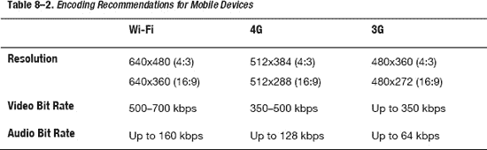

您还可以在应用中采取几个步骤来确保获得最佳性能。您应该避免使用变换:旋转、透视投影和颜色变换。避免阴影、滤镜效果和像素弯曲效果。您应该尽可能避免透明度和视频对象与其他图形的混合。

最好也尽量避免过多的 ActionScript 处理。例如，如果您有一个正在更新播放头的计时器，如果真的没有必要，就不要让它每秒更新多次。目标是在播放视频时，始终将尽可能多的处理时间用于渲染，并将程序逻辑所需的时间量降至最低。出于同样的原因，你也应该尽可能避免拉伸或压缩视频。使用`Capabilities`类或者`View`的大小来确定显示区域的大小，然后选择最接近的匹配，这是一个更好的主意。假设你有多种格式的视频可供选择。如果没有，那么最好在应用中包含一些选项，让用户决定是以自然分辨率播放视频，还是拉伸视频以填满屏幕(记住，对于视频，拉伸时几乎总是希望保持纵横比)。

#### Spark 视频播放器

播放视频这个话题太大了，一本书的一个章节甚至一章都容不下。我们不会安装或连接到流媒体服务器，如 Red5 Media Server 或 Adobe 的 Flash Media Server。我们将不涉及 DRM (数字版权管理) 8 或 CDNs(内容交付网络)等主题。相反，我们将介绍在您的应用中播放视频的基本选项。所有这些选项都适用于渐进式下载或流媒体服务器。我们的目的是让你朝着正确的方向开始，这样你就知道从哪里开始。如果您需要更高级的功能，比如前面提到的那些，Adobe 的文档已经足够了。

我们要看的第一个选项是 Flex 4 中引入的 Spark `VideoPlayer`组件。该组件构建在开源媒体框架(OSMF)之上，这是一个旨在处理全功能视频播放器所需的所有“幕后”任务的库。这个想法是，你写一个很酷的视频播放器 GUI，连接到 OSMF 提供的功能，你就可以开始了。我们将在本章后面更深入地研究 OSMF。

因此，Spark `VideoPlayer`是一个预打包的视频播放器 UI，建立在预打包的 OSMF 库之上。这是最方便的(也是最懒惰的),因为你只需要几行代码就可以给你的应用添加视频播放功能。清单 8–28 展示了如何在`View` MXML 文件中实例化一个`VideoPlayer`。

**清单 8–28。** *在手机应用中使用 Spark`VideoPlayer`*

`<?xml version="1.0" encoding="utf-8"?>
<s:View xmlns:fx="http://ns.adobe.com/mxml/2009"
        xmlns:s="library://ns.adobe.com/flex/spark"
        viewDeactivate="onViewDeactivate()"
        actionBarVisible="false">

  <fx:Script/>
    <![CDATA[
      privatestaticconst sourceURL:String = "http://ia600408.us.archive.org"+
          "/26/items/BigBuckBunny_328/BigBuckBunny_512kb.mp4";

      private function onViewDeactivate():void {
        player.stop();
      }
    ]]>
  </fx:Script>

  <s:VideoPlayer id="player" width="100%" height="100%" source="{sourceURL}"
                 skinClass="views.MobileVideoPlayerSkin"/>
</s:View>`

这个应用被设置为全屏，`View`的`ActionBar`已经被禁用，以允许`VideoPlayer`占据设备的整个屏幕。组件需要的只是一个源 URL，一旦缓冲了足够的数据，它就会自动开始回放。这真的不会变得更容易。当`View`被禁用时，我们会小心地停止播放。这是一件小事，但是没有理由继续缓冲和播放超过严格必要的时间。

__________

8[`help . adobe . com/en _ us/as3/dev/ws 5b 3 CCC 516 D4 fbf 351 e63 e3d 118676 a5 be 7-8000 . html`](http://help.adobe.com/en_US/as3/dev/WS5b3ccc516d4fbf351e63e3d118676a5be7-8000.html)

如果你使用 Flash Builder 或者查阅关于`VideoPlayer`类的文档，你可能会看到一个不祥的警告，关于`VideoPlayer`没有“为移动优化”，但是在这种情况下，他们真正的意思是“警告:还没有定义移动皮肤！”你可以直接使用`VideoPlayer`,但是当你在中等或高 dpi 的设备上运行你的应用时，视频控件将会非常小(是的，这是一个技术术语),很难使用。解决方案是像我们在这个例子中所做的那样，创建自己的`MobileVideoPlayerSkin`。

在这种情况下，我们刚刚使用 Flash Builder 在原来的`VideoPlayerSkin`的基础上创建了一个新的`Skin`，然后对它进行了一点修改。我们去掉了阴影，稍微缩放了控件，并调整了间距。修改后的`Skin`可以在本书源代码的`examples/chapter-08`目录下的 VideoPlayers 示例项目中找到。结果可以在图 8–10 中看到，我们正在播放视频剪辑中著名的老黄牛:大巴克兔子。这些图片来自 Nexus S，其中的控件现在已经足够大，可以使用了。

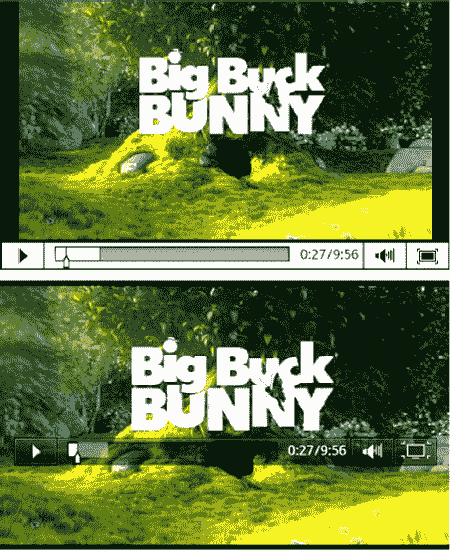

**图 8–10。***Nexus S 在常规(上图)和全屏(下图)模式下运行的火花`VideoPlayer`*

这只是当前`VideoPlayerSkin`的一个快速修改，但是当然，由于 Flex 4 中引入的 Spark 组件的皮肤架构，你可以随心所欲地使用你的新手机`Skin`。请记住您在移动环境中将面临的一些性能限制。

#### 【NetStream 视频

拥有一个方便的预打包解决方案，比如`VideoPlayer`是很好的，但是有时候你真的需要一些定制的东西。或者，也许你不想要像 OSMF 那样“一切都包括在内”的图书馆带来的所有包袱。这就是`NetConnection`、`NetStream`和`Video`类出现的原因。这些类允许你构建一个轻量级的或者全功能的完全定制的视频播放器。

简而言之，`NetConnection`处理联网；`NetStream`提供控制视频流、缓冲和回放的编程接口；而`Video`提供解码视频最终出现的显示对象。在这种情况下，您负责为视频播放器提供用户界面。清单 8–29 展示了一个基于`NetStream`的视频播放器的极简 MXML 声明。

**清单 8–29。***MXML 文件为`NetStreamVideoView`*

`<?xml version="1.0" encoding="utf-8"?>
<s:View xmlns:fx="http://ns.adobe.com/mxml/2009"
        xmlns:s="library://ns.adobe.com/flex/spark"
        xmlns:mx="library://ns.adobe.com/flex/mx"
        initialize="onInitialize()"
        viewDeactivate="onViewDeactivate()"
        actionBarVisible="false"
        backgroundColor="black">

  <fx:Script source="NetStreamVideoViewScript.as"/>

  <mx:UIComponent id="videoContainer" width="100%" height="100%"/>

  <s:Label id="logger" width="100%" color="gray"/>

  <s:HGroup bottom="2" left="30" right="30" height="36" verticalAlign="middle">
    <s:ToggleButton id="playBtn" click="onPlayPause()" selected="true"
      skinClass="spark.skins.spark.mediaClasses.normal.PlayPauseButtonSkin"/>
    <s:Label id="timeDisplay" color="gray" width="100%" textAlign="right"/>
  </s:HGroup>
</s:View>`

我们已经声明了一个`UIComponent`作为`Video`显示对象的最终容器。除此之外，只有另外两个可见控件。第一个是从 Spark `VideoPlayer`组件“借用”了`PlayPauseButtonSkin`的`ToggleButton`(好吧，我们承认，我们彻头彻尾地偷了`Skin`，我们甚至没有一点点抱歉)。这给了我们一个简单的方法来显示一个带有传统的三角形播放图标和双条暂停图标的按钮。另一个控件只是一个`Label`，它将显示视频剪辑的持续时间和当前播放位置。

MXML 宣言中提到了各种 ActionScript 函数作为`View`的`initialize`和`viewDeactivate`事件以及`Button`的`click`事件的事件处理程序。ActionScript 代码已被移到一个单独的文件中，并包含了一个`<fx:Script>`标签。清单 8–30 显示了`View`的`onInitialize`和`onViewDeactivate`处理程序的代码。

**清单 8–30。***`View`事件处理程序为`NetStreamVideoView`*

`private static const SOURCE:String = "http://ia600408.us.archive.org/"+
  "26/items/BigBuckBunny_328/BigBuckBunny_512kb.mp4";

private var video:Video;
private var ns:NetStream;
private var isPlaying:Boolean;
private var timer:Timer;
private var duration:String = "";

private function onInitialize():void {
  video = new Video();
  videoContainer.addChild(video);

  var nc:NetConnection = new NetConnection();
  nc.connect(null);

  ns = new NetStream(nc);
  ns.addEventListener(NetStatusEvent.NET_STATUS, onNetStatus);
  ns.client = {
    onMetaData: onMetaData,
    onCuePoint: onCuePoint,
    onPlayStatus: onPlayStatus
  };

  ns.play(SOURCE);
  video.attachNetStream(ns);

  timer = new Timer(1000);
  timer.addEventListener(TimerEvent.TIMER, onTimer);
  timer.start();
}

private function onViewDeactivate():void {
  if (ns) {
    ns.close();
  }
}`

`onInitialize`处理程序负责所有的设置代码。`Video`显示对象被创建并添加到它的`UIComponent`容器中。接下来，创建一个`NetConnection`，用一个`null`值调用它的`connect`方法。这告诉`NetConnection`它将播放来自本地文件系统或 web 服务器的 MP3 或视频文件。如果不同的参数被传递给它的`connect`方法，那么`NetConnection`也可以用于 Flash Remoting 或者连接到 Flash 媒体服务器。

下一步是通过在构造函数中传递对`NetConnection`的引用来创建`NetStream`对象。根据玩家的复杂程度，你可能会对从`NetStream`物体接收到的几个事件感兴趣。 `NET_STATUS`事件将通知您缓冲状态、回放状态和错误情况。还有附加到`NetStream`的客户端属性的`metaData`、`cuePoint`和`playStatus`事件。客户端只是一个定义某些属性的`Object`；它不必是任何特定的类型。在前面的清单中，我们只是使用了一个对象文字来声明一个具有所需属性的匿名对象。

`metaData`事件将为您提供重要信息，如视频的宽度、高度和持续时间。当视频中嵌入的提示点到达时,`cuePoint`事件会通知您。处理`playStatus`甚至会让你知道视频什么时候结束。这些事件处理程序如清单 8–31 所示。

最后的步骤是开始播放`NetStream`，将其附加到`Video`显示对象，并创建和启动计时器，该计时器将每秒更新一次时间显示。

**清单 8–31。**??`NetStream`事件处理者

`private function onMetaData(item:Object):void {
  video.width = item.width;
  video.height = item.height;

  video.x = (width - video.width) / 2;
  video.y = (height - video.height) / 2;

  if (item.duration)
    duration = formatSeconds(item.duration);
}

private function onCuePoint(item:Object):void {
  *// Item has four properties: name, time, parameters, type*
  log("cue point "+item.name+" reached");
}

private function onPlayStatus(item:Object):void {
  if (item.code == "NetStream.Play.Complete") {
    timer.stop();
    updateTimeDisplay(duration);
  }
}

private function onNetStatus(event:NetStatusEvent):void {
  var msg:String = "";

  if (event.info.code)
    msg += event.info.code;

  if (event.info.level)
    msg += ", level: "+event.info.level;

  log(msg);
}

private function log(msg:String, showUser:Boolean=true):void {
  trace(msg);
  if (showUser)
    logger.text += msg + "\n";
}`

`onMetaData`处理器使用视频的`width`和`height`使其在`View`中居中。它还保存视频的`duration`，以便在时间显示`Label`中使用。在`onPlayStatus`处理程序中，我们检查这是否是一个`NetStream.Play.Complete`通知，如果是，停止更新时间显示的计时器。`onCuePoint`和`onNetStatus`处理程序仅用于演示目的，它们的输出被简单地记录到调试控制台和可选的屏幕上。

清单 8–32 显示了与`NetStreamVideoView`相关的剩余代码。`onPlayPause`函数作为`ToggleButton`的点击处理程序。根据`ToggleButton`的`selected`状态，它将暂停或恢复`NetStream`并启动或停止更新`timeDisplayLabel`的定时器。`onTimer`函数是那个`Timer`的处理程序。它将使用`NetStream`的`time`属性，格式化为`minutes:seconds`字符串，来更新`Label`。

**清单 8–32。** *播放，暂停，`NetStream`* 读取属性

`private function onPlayPause():void {
  if (playBtn.selected) {
    ns.resume();
    timer.start();
  } else {
    ns.pause();
    timer.stop();
  }
}

private function onTimer(event:TimerEvent):void {
  updateTimeDisplay(formatSeconds(ns.time));
}

private function updateTimeDisplay(time:String):void {
  if (duration)
    time += " / "+duration;

  timeDisplay.text = time;
}

private function formatSeconds(time:Number):String {
  var minutes:int = time / 60;
  var seconds:int = int(time) % 60;

  return String(minutes+":"+(seconds<10 ? "0" : "")+seconds);
}`

Figure 8–11 显示了所有这些代码在低 dpi Android 设备上运行的结果。像这样的小型播放器更适合这种类型的屏幕。

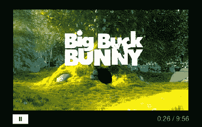

**图 8-11。** *运行在低 dpi 设备上的基于`NetStream`的最小视频播放器*

正如你所看到的，在创建我们基于极简`NetStream`的视频播放器的过程中，涉及了更多的代码。但是，如果您需要轻量级视频播放器实现的终极灵活性，`NetStream`和`Video`类的组合将提供您需要的所有功能。

在播放视频这一节的开始，我们简单地提到了 Stage Video。一旦在 Android 上得到支持，它将允许您基于`NetStream`的视频播放器利用 H.264 视频的硬件加速解码和渲染。Adobe 提供了一个非常有用的“入门”指南来帮助你转换你的`NetStream`代码以使用 StageVideo 而不是`Video`显示对象。如果你喜欢不费吹灰之力就让自己适应未来，你可以利用第三个选项在 Android 上编写视频播放器:OSMF 库。这是我们下一节的主题，当它在 Android 上可用时，它将自动利用 StageVideo。

#### 与 OSMF 玩视频

开源媒体框架是 Adobe 发起的一个项目，旨在创建一个库，收集编写基于 Flash 的媒体播放器的最佳实践。它是一个全功能的媒体播放器，被抽象成一些易于使用的类。该库允许您快速创建用于 Flex 和 Flash 应用的高质量视频播放器。OSMF 包含在 Flex 4 SDK 中，但是您也可以从项目网站下载最新版本。 10 清单 8–33 显示了`OSMFVideoView`的 MXML 代码。这里显示的用户界面代码与`NetStreamVideoView`的清单 8–29 中的代码几乎完全相同。本质上，我们只是用基于 OSMF 的`MediaPlayer`实现替换了基于`NetStream`的后端。

__________

9 Adobe 公司，“舞台视频入门”，[www.adobe.com/devnet/flashplayer/articles/stage_video.html](http://www.adobe.com/devnet/flashplayer/articles/stage_video.html)，2011 年 2 月 8 日

10http://sourceforge.net/projects/osmf.adobe/files/[10](http://sourceforge.net/projects/osmf.adobe/files/)

**清单 8–33。***《MXML 宣言》为`OSMFVideoView`*

`<?xml version="1.0" encoding="utf-8"?>
<s:View xmlns:fx="http://ns.adobe.com/mxml/2009"
        xmlns:s="library://ns.adobe.com/flex/spark"
        xmlns:mx="library://ns.adobe.com/flex/mx"
        initialize="onInitialize()"
        viewDeactivate="onViewDeactivate()"
        actionBarVisible="false"
        backgroundColor="black">

  <fx:Script source="OSMFVideoViewScript.as"/>

  <mx:UIComponent id="videoContainer" width="100%" height="100%"/>
  <s:HGroup bottom="2" left="30" right="30" height="36" verticalAlign="middle">
    <s:ToggleButton id="playBtn" click="onPlayPause()" selected="true"

skinClass="spark.skins.spark.mediaClasses.normal.PlayPauseButtonSkin"/>
    <s:Label id="timeDisplay" color="gray" width="100%" textAlign="right"/>
  </s:HGroup>
</s:View>`

清单 8–34 显示了将用于实现视频播放器的 OSMF 类的初始化代码。我们将包含电影 URL 的实例`URLResource`传递给`LightweightVideoElement`构造函数。OSMF `MediaElement`是正在播放的媒体类型的接口。`LightweightVideoElement`是一个代表视频的专门化，支持渐进式下载和简单的 RTMP 流。还有一个名为`VideoElement`的类支持更多的流协议，但是对于我们的目的来说，`LightweightVideoElement`拥有所有需要的功能。

一旦`LightweightVideoElement`被创建，它就被传递给 OSMF `MediaPlayer`类的构造函数。`MediaPlayer`是一个类，通过它你可以控制视频的播放。它能够调度许多不同的事件，这些事件可以用来获取关于`MediaPlayer`的状态和状况的信息。在接下来显示的示例代码中，我们处理了`mediaSizeChange`事件以使视频显示在`View`上居中，处理了`timeChange`和`durationChange`事件以更新`timeDisplayLabel`，处理了`complete`事件以通知我们视频何时结束播放。

`MediaPlayer`本身不是显示对象。相反，它提供了一个可以添加到显示列表中的`displayObject`属性。在本例中，它被添加为`videoContainerUIComponent`的子节点。我们做的最后一点初始化工作是使用`currentTimeUpdateInterval`属性请求我们每秒只更新一次视频播放器的`currentTime`，而不是默认值的每 250 毫秒。视频将自动开始播放，因为`MediaPlayer`的`autoPlay`属性的默认值是`true`。

**清单 8–34。** *初始化代码为`MediaPlayer`*

`import org.osmf.elements.VideoElement;
import org.osmf.events.DisplayObjectEvent;
import org.osmf.events.MediaElementEvent;
import org.osmf.events.TimeEvent;
import org.osmf.media.MediaPlayer;
import org.osmf.media.URLResource;
import org.osmf.net.NetLoader;

privatestaticconst sourceURL:String = "http://ia600408.us.archive.org"+
  "/26/items/BigBuckBunny_328/BigBuckBunny_512kb.mp4";

privatevar player:MediaPlayer;
privatevar duration:String;

privatefunction onInitialize():void {
  var element:LightweightVideoElement;
  element = new LightweightVideoElement(new URLResource(sourceURL));

  player = new MediaPlayer(element);
  videoContainer.addChild(player.displayObject);

  player.addEventListener(DisplayObjectEvent.MEDIA_SIZE_CHANGE, onSize);
  player.addEventListener(TimeEvent.CURRENT_TIME_CHANGE, onTimeChange);
  player.addEventListener(TimeEvent.DURATION_CHANGE, onDurationChange);
  player.addEventListener(TimeEvent.COMPLETE, onVideoComplete);
  player.currentTimeUpdateInterval = 1000;
}

privatefunction onViewDeactivate():void {
  if (player)
    player.stop();
}

privatefunction onPlayPause():void {
  if (player.playing) {
    player.play();
  } else {
    player.pause();
  }
}`

在刚刚显示的`onViewDeactivate`处理程序中，我们确保当`View`被停用时停止播放器。您还可以看到播放/暂停`ToggleButton`的`click`处理程序。它只是调用了`MediaPlayer`的`play`和`pause`方法，这取决于玩家当前是否在玩游戏。

清单 8–35 通过显示`MediaPlayer`事件处理程序，继续列出`OSMFVideoView`的脚本代码。每当媒体改变大小时，就会调用`onSize`处理程序。我们使用这个处理程序将`MediaPlayer`的`displayObject`置于`View`的中心。当玩家知道正在播放的视频的总时长时，就会调用`onDurationChange`处理程序。我们使用这个处理程序将持续时间存储为格式化字符串，供`timeDisplayLabel`使用。每秒调用一次`onTimeChange`处理程序——正如我们在初始化期间所请求的那样——这样我们就可以更新`timeDisplayLabel`。最后，`onVideoComplete`用于演示目的。我们的实现只是将一条消息打印到调试控制台。

**清单 8–35。***OSMF 事件处理者*

`privatefunction onSize(event:DisplayObjectEvent):void {
  player.displayObject.x = (width - event.newWidth) / 2;
  player.displayObject.y = (height - event.newHeight) / 2;
}

privatefunction onDurationChange(event:TimeEvent):void {
  duration = formatSeconds(player.duration);
}

privatefunction onTimeChange(event:TimeEvent):void {
  updateTimeDisplay(formatSeconds(player.currentTime));
}

privatefunction onVideoComplete(event:TimeEvent):void{
  trace("The video played all the way through!");
}

privatefunction updateTimeDisplay(time:String):void {
  if (duration)
    time += " / "+ duration;

  timeDisplay.text = time;
}

privatefunction formatSeconds(time:Number):String {
  var minutes:int = time / 60;
  var seconds:int = int(time) % 60;

  return String(minutes+":"+(seconds<10 ? "0" : "")+seconds);
}`

与滚动你自己的基于`NetStream`的视频播放器相比，有了 OSMF，你可以用更少的代码获得所有的功能。您还可以利用视频专家编写的代码。如果你需要它提供的所有功能，在 OSMF 上构建你的视频播放器是不会错的。运行时，这个基于 OSMF 的视频播放器的外观和行为与图 8–11 中所示的一模一样。

#### 录像机示例

本章的最后一个例子是前面提到的录音机的视频模拟。VideoRecorder 应用将使用 Android 摄像头接口来捕获视频文件，然后允许用户立即在 Flex 应用中播放它。本例的源代码可以在本书源代码的`examples/chapter-08`目录下的 VideoRecorder 示例应用中找到。

你可能还记得第七章中的提到过，`CameraUI`类可以用来通过原生的 Android 摄像头接口捕捉视频和图像。

这个例子将使用一个 OSMF `MediaPlayer`来播放捕获的视频。清单 8–36 显示了`CameraUI`类和`MediaPlayer`类的初始化代码。

**清单 8–36。** *初始化`CameraUI`和`MediaPlayer`类*

`import flash.media.CameraUI;
import org.osmf.elements.VideoElement;
import org.osmf.events.DisplayObjectEvent;
import org.osmf.events.MediaElementEvent;
import org.osmf.events.TimeEvent;
import org.osmf.media.MediaPlayer;
import org.osmf.media.URLResource;
import org.osmf.net.NetLoader;

privatevar cameraUI:CameraUI;
privatevar player:MediaPlayer;
privatevar duration:String;

privatefunction onInitialize():void {
  if (CameraUI.isSupported) {
    cameraUI = new CameraUI();
    cameraUI.addEventListener(MediaEvent.COMPLETE, onCaptureComplete);

    player = new MediaPlayer();

    player.addEventListener(DisplayObjectEvent.MEDIA_SIZE_CHANGE, onSize);
    player.addEventListener(TimeEvent.CURRENT_TIME_CHANGE, onTimeChange);
    player.addEventListener(TimeEvent.DURATION_CHANGE, onDurationChange);
    player.addEventListener(TimeEvent.COMPLETE, onVideoComplete);

    player.currentTimeUpdateInterval = 1000;
    player.autoPlay = false;
  }

  captureButton.visible = CameraUI.isSupported;
}`

像往常一样，我们检查以确保设备支持`CameraUI`类。如果是这样，就会创建一个新的`CameraUI`实例，并为它的`complete`事件添加一个处理程序。您在第七章中了解到，当图像或视频捕获成功完成时，`CameraUI`会触发此事件。接下来我们创建我们的`MediaPlayer`并附加通常的事件监听器。注意,`autoPlay`属性被设置为`false`,因为我们想要在这个应用中手动开始回放。

清单 8–37 显示了使用原生 Android 界面启动视频捕获的代码，以及在捕获成功完成时得到通知的处理程序。

**清单 8–37。** *开始并完成视频捕捉*

`privatefunction onCaptureImage():void {
  cameraUI.launch(MediaType.VIDEO);
}

privatefunction onCaptureComplete(event:MediaEvent):void {
  player.media = new VideoElement(new URLResource(event.data.file.url));
  player.play();
  playBtn.selected = true;
  playBtn.visible = true;

  if (videoContainer.numChildren > 0)
    videoContainer.removeChildAt(0);

  videoContainer.addChild(player.displayObject);
}`

当用户点击按钮开始捕获时，`onCaptureImage`处理程序启动本地摄像机 UI 来捕获视频文件。如果成功，`onCaptureComplete`处理程序接收一个包含`MediaPromise`作为其`data`属性的事件。`MediaPromise`包含一个文件的引用，捕获的视频存储在该文件中。我们可以使用文件的 URL 来初始化一个新的`VideoElement`，并将其分配给`MediaPlayer`的`media`属性。然后，我们可以开始播放视频，并调整`playBtn`的属性，使其与应用的状态保持一致。如果`videoContainer`已经添加了一个`displayObject`，我们删除它，然后添加玩家新的`displayObject`。

大多数事件处理代码与上一节给出的`OSMFVideoView`代码相同。清单 8–38 中显示了两个不同之处。

**清单 8–38。** *对`MediaPlayer`事件的处理略有不同*

`privatefunction onSize(event:DisplayObjectEvent):void {
  if (player.displayObject == null)
    return;

  var scaleX:int = Math.floor(width / event.newWidth);
  var scaleY:int = Math.floor(height / event.newHeight);
  var scale:Number = Math.min(scaleX, scaleY);

  player.displayObject.width = event.newWidth * scale;
  player.displayObject.height = event.newHeight * scale;

  player.displayObject.x = (width - player.displayObject.width) / 2;
  player.displayObject.y = (height - player.displayObject.height) / 2;
}

privatefunction onVideoComplete(event:TimeEvent):void{
  player.seek(0);
  playBtn.selected = false;
}`

在这种情况下，`onSize`处理程序将尝试缩放视频尺寸，使其更接近显示器的尺寸。注意检查`player.displayObject`是否是`null`。当从一个捕获的视频切换到下一个视频时，可能会发生这种情况。因此，我们必须小心不要试图在`displayObject`不存在时对其进行缩放。另一个区别在于`onVideoComplete`处理程序。由于用户可能希望多次观看他们捕获的视频剪辑，我们通过将播放头重新定位到开头并重置播放/暂停按钮的状态来重置视频流。Figure 8–12 显示了在 Android 设备上运行的应用。

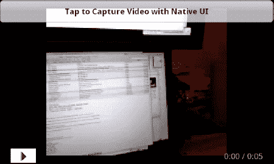

**图 8–12。** *抓拍短视频后的录像机示例应用*

### 总结

随着移动设备变得越来越强大，在移动设备上欣赏媒体的能力将变得越来越普遍。现在，您已经掌握了在自己的移动应用中利用 Flash media APIs 的能力所需的知识。本章涵盖了与在 Flash 平台上播放各种类型的媒体相关的各种主题。特别是，您现在知道了以下内容:

*   如何使用`SoundEffect`类嵌入和播放音效
*   如何使用`Sound`类加载 MP3 文件
*   如何使用`SoundChannel`和`SoundTransform`类控制声音的回放、音量和平移
*   如何播放动态生成或录制的声音
*   如何编写可维护和可测试的 Flex 移动应用
*   如何为 Flex 4 移动应用编写自定义控件
*   如何使用 Spark `VideoPlayer`组件、`NetStream`类和 OSMF 库播放视频
*   如何与`CameraUI`类接口以捕获视频，然后在 Android 应用的 AIR 中播放捕获的视频

在下一章中，我们将继续编写真实的 Flex 移动应用的主题，看看在团队中工作和利用设计师-开发人员工作流的一些方面。