# 九、设计人员——开发人员工作流

无论您是设计师还是开发人员，现在都是进入移动开发的激动人心的时刻，这是一个充满潜力和机会的年轻行业。但是移动开发行业确实面临着其他软件开发项目所面临的同样的挑战，那些通信和工作流的挑战。图 9–1 取笑软件项目中的沟通和解释问题。这幅漫画与许多公司的做法相差无几。一个项目可能有许多实际的需求，但是大多数参与的人只会表达那些他们关心或感兴趣的需求。

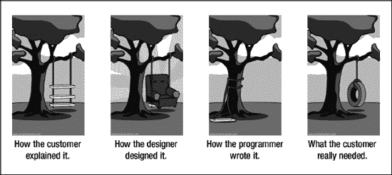

**图 9–1。** *【项目如何真正工作】出自`[www.projectcartoon.com](http://www.projectcartoon.com)` 1 知识共享署名下许可 3.0 未许可许可:`[`creativecommons.org/licenses/by/3.0/`](http://creativecommons.org/licenses/by/3.0/)`*

__________

2006 年 7 月 24 日， 1 “项目如何真正运作”，【http://www.projectcartoon.com】??

项目可能会在很多地方失败。一个智能的工作流可以真正帮助缓解这些痛点，这样客户要求的就是设计师设计的，开发者执行的。但是首先必须理解设计者和开发者的角色，以及他们使用的工具。

### 视觉设计师的角色

设计师的角色是理解客户的需求，将这些转化为应用，并为其创造视觉设计。设计师与客户讨论应用应该如何工作，GUI 如何完成用户故事，以及为什么它会这样工作。这是一条双行道，因为客户的输入也被考虑在内。设计师也根据开发者的需求调整视觉设计。有时候，开发人员可以预见设计人员没有意识到的技术挑战，在这种情况下，他们可以也应该合作解决问题。有时候合作只是澄清事情是如何运作的。其他时候，它可能导致设计和技术限制之间的折衷。

> “设计是一种有意识的、直觉的努力，旨在建立有意义的秩序。”
> 
> –维克多·帕帕内克，设计师兼教育家

#### 从 Adobe Device Central 开始

Adobe Device Central 简化了移动电话、平板电脑和消费电子设备的内容创建。它允许设计人员和开发人员计划、预览和测试移动体验。您可以通过动态更新的在线设备库访问最新的设备配置文件，并在设备外观环境中模拟背光超时和阳光反射等显示条件，以针对现实条件调整设计。

**提示**欲了解更多信息，请参见`[www.adobe.com/products/devicecentral.html](http://www.adobe.com/products/devicecentral.html)`

#### 使用设备中心

Adobe Device Central CS5.5 与大多数设计程序集成，包括 Photoshop、Illustrator、Fireworks 和 Flash，使您能够利用手机数据，从移动项目的开始到最终启动提高工作效率。

##### 从 Device Central 创建新文档

开始新的移动项目时，Device Central CS5.5 是一个不错的起点。当您启动 Device Central 时，会出现一个欢迎屏幕(参见 Figure 9–2)。

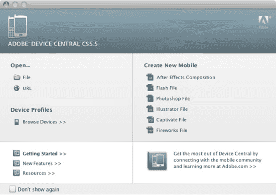

**图 9–2。** *从 CS5 中部设备启动新的 Fireworks 文档；从 Device Central CS4 开始，添加了 Captivate 和 Fireworks 文件格式。*

1.  从右边的栏中点击您想要创建的文件类型(参见 Figure 9–3)开始一个新项目。中间的消息指出，“要开始，请在‘文本设备’面板中选择设备。”
2.  Click the Browse button, located in the upper right corner. This will display a list of devices to create and test against (see Figure 9–3). 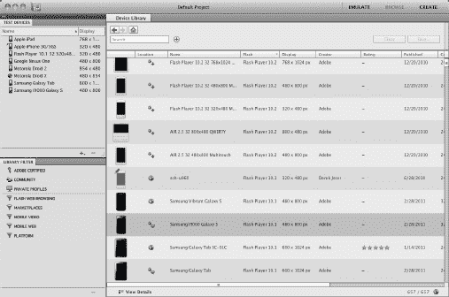

    **图 9–3。** *浏览设备库中的设备，按名称排序，显示创建者评级或搜索特定设备。*

3.  选择要测试的设备，并将其拖至测试设备面板。
4.  Double-click the device name to view the device details (see Figure 9–4). 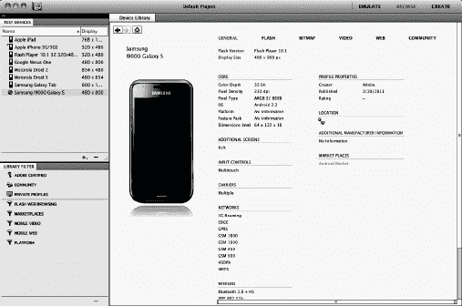

    **图 9–4。** *点击并拖动设备到测试设备面板，将其添加到要测试的设备*

5.  准备好基于所选配置文件创建新文件后，双击左侧列出的测试设备中的配置文件。然后，点击右上角的创建(参见图 9–5)。

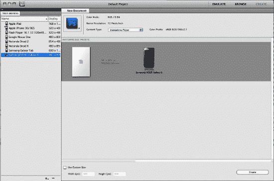

**图 9–5。** *从测试设备面板双击设备配置文件。单击右上角的 Create，基于该配置文件创建一个新文档。*

新文档会自动设置为适合目标设备的正确显示尺寸和屏幕方向。现在，您已经准备好创建自己的手机设计了。在分析设备和模拟内容外观方面，Device Central 的帮助再大也不为过。这有助于加快设计工作流程，肯定比购买许多不同的设备要好。

就组织和生产力而言，Fireworks 的一个流行功能是能够在单个文件中创建具有不同尺寸、屏幕方向甚至文档分辨率的多个页面。这意味着您可以轻松地同时处理纵向和横向布局，这在针对多点触摸设备和使用加速度计时非常方便。你甚至可以将应用图标和你的主要内容保存在同一个文件中。除了 Fireworks，没有任何 Adobe 产品能做到这一点。

##### 在 Device Central 中预览内容

为移动设备进行设计时，在设计过程中有些时候，您可能希望在实际的手机环境中预览您的作品。最快、最简单的方法是从 Photoshop、Illustrator、Flash 或 Fireworks 中启动预览。

1.  在 Photoshop 中，选择文件保存为网络&设备…
2.  在左下角，选择“设备中心…”
3.  现在，您将能够看到您的设计在各种设备上的外观。
4.  当您在 Device Central 中查看您的工作时，您可以通过在“测试设备”面板中双击不同的设备配置文件来更改设备外观。
5.  您还可以使用 Device Central 中的显示面板来调整照明或反射，以便在不同的照明条件下测试您的内容(请参见 Figure 9–6)。

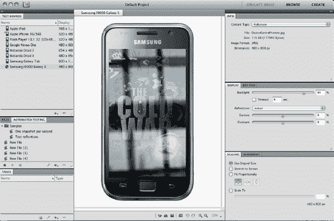

**图 9–6。** *在 Device Central 中预览三星 Galaxy S 上的设计，选择室内反射*

##### 创建自定义配置文件

您可能想要创建自定设备描述文件有几个原因:

*   您会注意到桌面上仿真工作区中显示的内容与您在实际设备上看到的内容之间存在差异。
*   出于演示目的，您希望修改设备外观(例如，删除或添加运营商徽标)。
*   您制造设备并需要创建新的配置文件(一旦设备发货，自定义配置文件就可以分发给社区)。

创建自定描述文件的第一步是制作现有设备描述文件的副本，用作模板。我建议选择尽可能与您想要的自定义配置文件相似的内容。原始配置文件和您的自定义配置文件之间的相似之处越多，您以后在编辑单个数据点时需要做的工作就越少。

1.  在 Device Central 中，单击“浏览”(位于右上角),以便进入“浏览”工作区。
2.  如果您移动了面板，您可以随时通过选择**窗口**  **工作区**  **重置浏览**来恢复默认设置。
3.  右键单击 Flash Player 10.1 32 320×480 多点触控配置文件，并选择创建可编辑副本(参见图 9–7)。
4.  为配置文件键入新名称，例如，键入“My_Multitouch_320×480”，然后点按“好”。

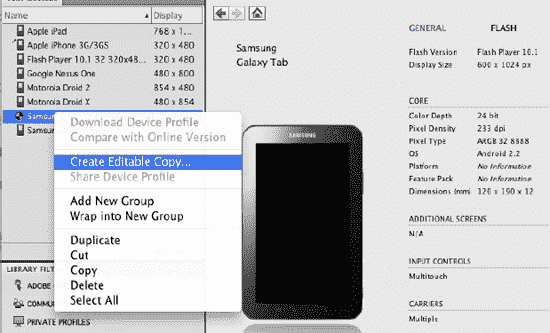

**图 9–7。** *创建概要文件的可编辑副本*

请注意，如果您计划与他人共享您的自定义配置文件，您应该给他们起一个既独特又有描述性的名称。此外，尽可能完整地填写所有字段。这是一个显而易见的最佳实践，有助于为整个社区的共同利益发展一个准确和完整的数据集。

在右边，您现在应该会看到一个圆形，在设备皮肤的正上方有一个铅笔，表示该配置文件现在是可编辑的。类似地，当您将指针悬停在任何属性上时，比如输入控件或语言，会出现相同的铅笔图标。如果悬停时属性不显示铅笔图标，则该属性不可编辑。

接下来，您可以直接从 CS5 设备中心编辑设备配置文件:

1.  将指针悬停在语言上；出现铅笔图标，表示该属性是可编辑的。
2.  单击语言并选择要显示的语言。
3.  单击复选标记确认您的选择。

您选择的语言现在应该显示在您的自定义配置文件中。

重复这些步骤，从 Device Central 中编辑所有自定义设备配置文件信息。这种从界面编辑配置文件数据的简单而直接的方法是一种真正的时间节省，是对早期版本的巨大改进。

#### Adobe Photoshop

Adobe Photoshop CS5 非常注重摄影，但也用于创建应用设计，因为它在设计创建和图像编辑方面非常灵活。Adobe Photoshop CS5 拥有卓越的图像选择、图像润饰和逼真绘画的突破性功能，以及广泛的工作流程和性能增强。

**提示:**更多信息见`[www.adobe.com/products/photoshop.html](http://www.adobe.com/products/photoshop.html)`

一旦在 Photoshop 中创建了设计(图 9–8)，工作流程中的下一步将是将这些图形引入 Flash Professional 或 Flash Builder 进行进一步开发。这可以通过分别导出每个图像，或将 Photoshop 文件(`.psd`)直接导入 Flash Professional 来完成。

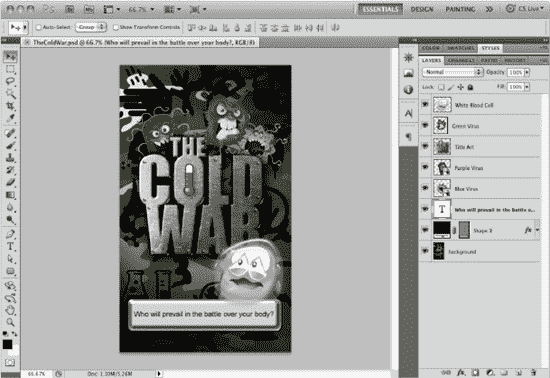

**图 9–8。** *一个在 CS5 Adobe Photoshop 中创建的应用设计，包括形状层、文本和智能对象，仅举几个例子*

##### Photoshop 到 Flash Professional 的工作流程

Flash Professional CS3 中引入的一个令人兴奋的功能是导入 PSD 文件的能力(图 9–9)。在导入时，Flash Professional 使您能够确定如何导入每个层。例如，您可以在 Flash Professional 中将文本层作为可编辑文本导入。在 Flash Professional 中，形状层也可以转换为可编辑的形状。甚至电影剪辑也可以从光栅图形创建，包括实例名称。Photoshop 中的图层在 Flash Professional 中可以显示为图层，并带有仍可编辑的图层效果。甚至物品的位置都可以保持。最终结果是 Flash Professional 中的完整设计，可以制作动画并进一步开发用于移动设备。

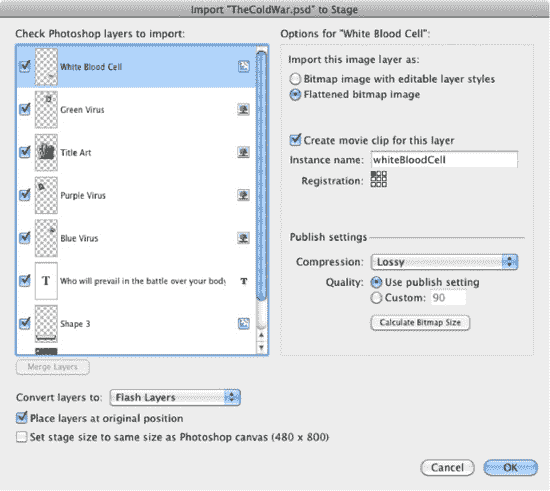

**图 9–9。** *将原 Photoshop 文件，导入到 Flash Professional 中；每个层可以不同方式导入，保持文本、形状层，甚至层效果。*

尽管导入 Photoshop 文件非常容易而且非常有用，但是您必须注意一些事情。请注意，当导入许多层时，文件会变大，请考虑合并它们。例如，如果在构成背景的不同图层上有多个图形，请考虑在导入之前在 Photoshop 中合并这些图层。此外，考虑在 Flash 中绘制矢量元素，而不是导入它们。这将使您在编辑时有更多的控制权。如果有帮助的话，您甚至可以从 Photoshop 中导入一个图形作为向导，同时在 Flash Professional 中将所有部分创建为矢量元素。

如果 Photoshop 文件相当复杂，由多个图层组成背景，请考虑将这些图层合并为一个背景图层。一般的规则是，如果图形不动，看看能不能和其他图形合并。

##### Photoshop 到 Flash Builder 的工作流程

Flash Builder 不像 Flash Professional 那样导入 Photoshop 文件。相反，需要从 Photoshop 中导出单独的图像。最有效的方法是将每个元素分离成自己的 Photoshop 文件，并导出适当的文件类型(图 9–10)。

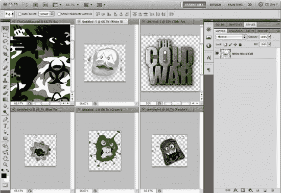

**图 9–10。** *单独 PSD 文件中的单个图形准备导出为 PNG、JPG 或 GIF。请务必保留原始 PSD 文件，以防以后需要进行更改。*

在 Photoshop 中，导出图形的最佳方式是使用“文件”菜单下的“存储为 Web 和设备所用格式”选项。这使您能够选择想要导出的格式并查看其质量(Figure 9–11)。在 Flash Builder 中，您可以导入适当的文件类型，无论它是 JPG、GID、PNG、SWF 还是 FXG。

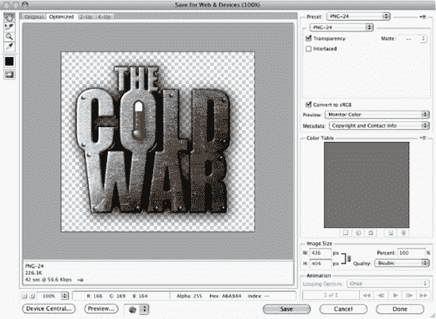

**图 9–11。** *使用文件从 Photoshop 中导出图形保存为 Web 和设备格式*

#### 图形文件格式

基本上有四种不同的文件类型可以在 Flash 应用中使用。您选择哪一个取决于图形的内容。

##### PNG-24(便携式网络图形，24 位深度)

PNG-24 可能是富图形最流行的图形文件类型之一，因为它允许不同级别的透明度和 24 位颜色。还有一个 PNG-8，它不允许透明，但文件大小更小，因为颜色深度是 8 位(256 色)。

##### GIF(图形交换格式)

GIF 是一种 8 位文件格式，允许多达 256 种颜色，这使文件大小保持较小。由于颜色数量有限，gif 适用于边缘锐利的线条艺术和平面颜色，如徽标。相反，该格式不用于摄影或带有渐变的图像。gif 可以用来存储游戏的低颜色精灵数据。gif 也可以用于小动画，因为它们可以包含多个帧。GIF 文件也可以有透明度，但不像 PNG-24 文件那样有不同的透明度。GIF 中的每个像素要么不透明，要么透明。

##### 联合图像专家组

JPG 文件通常用于摄影图像。这种格式具有有损压缩，这意味着图像可以被压缩，导致文件较小，但这可能会导致图像质量的一些损失。将图像压缩到 JPG 是在保持图像质量的同时保持文件大小较小的一个很好的平衡。

##### FXG (Flash XML 图形)

Adobe Flash Platform 基于 XML 的图形交换格式使设计人员能够为 web、交互式和 RIA 项目的开发人员提供更多可编辑、可工作的内容。FXG 用作跨应用文件支持的图形交换格式。它基于 XML，可以包含图像、文本和矢量数据。Flash Professional、Fireworks 和 Illustrator 都可以创建 FXG 文件。然后，这些文件可以在 Flash Professional 或 Flash Builder 中使用(参见 Figure 9–12)。

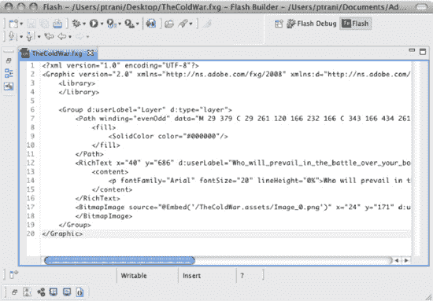

**图 9–12。** *在 Flash Builder 中打开的一个 FXG 文件，包含矢量、文本和位图数据*

所有这些文件格式都可以从大多数图像编辑程序中创建。所使用的程序在很大程度上取决于设计师最喜欢什么，但是如果我们更客观地看一看，你会注意到每个程序在移动 Flash 开发方面都有自己独特的优势。例如，FXG 格式非常灵活，可以在 Flash Builder 中向开发人员展示各种文本和矢量图形元素。PNG-24 文件格式在设计师需要具有不同透明度的像素级完美图形时非常有用。如果照片有多种颜色和阴影，并且不需要透明度，JPG 格式非常适合。最后，GIF 非常适合平面图形，比如徽标。

#### Adobe Illustrator

Adobe Illustrator 帮助设计师为几乎所有项目创建矢量作品。Illustrator 拥有复杂的绘图工具、自然笔刷和大量内置的省时工具，可用于矢量图像编辑。Illustrator CS5 允许用户在文件的像素网格上精确地创建和对齐矢量对象，以获得干净、清晰的光栅图形。用户还可以利用光栅效果，如投影、模糊和纹理，并跨媒体保持其外观，因为图像与分辨率无关。这使得 Illustrator 成为一个很好的开始创建图形的地方，不管输出是什么。

**提示:**更多信息见`[www.adobe.com/products/illustrator.html](http://www.adobe.com/products/illustrator.html)`

##### Illustrator 转 Flash 专业工作流程

使用 Illustrator，您可以创建移动设计，并将单个图形转换为电影剪辑元件。元件的每个实例都可以有一个实例名，就像在 Flash 中一样。可以将影片剪辑元件实例复制并粘贴到 Flash Professional 中。Flash 维护电影剪辑甚至实例名称(参见图 9–13)。

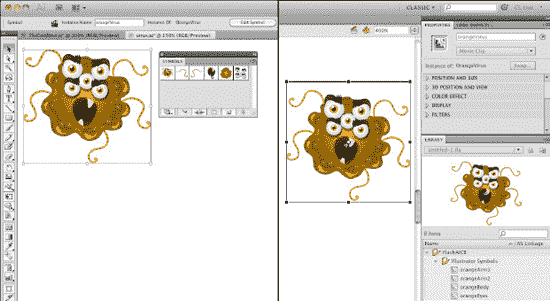

**图 9–13。** *在 Illustrator(左)中，您可以创建可以直接复制并粘贴到 Flash Professional(右)中的电影剪辑元件。符号和实例名称保持不变。*

#### 土坯烟花

Adobe Fireworks CS5 软件提供了为 Web 或几乎任何设备创建高度优化的图形所需的工具。Fireworks 允许您创建、导入和编辑矢量和位图图像。

##### Fireworks 到 Flash Builder 工作流

在 Fireworks 中创建图形后(参见 Figure 9–14)，可以将其导出为最流行的图形格式，包括 FXG 和 MXML，专门用于 Flash Builder。以基于 XML 的 FXG 格式导出有助于确保为 Adobe Flash Builder 精确转换丰富的应用设计。FXG 和 MXML 都是基于 XML 的格式，可以包含可以在 Flash Builder 中打开和编辑的矢量图形和文本(参见图 9–15)。基于位图的图像被外部引用。

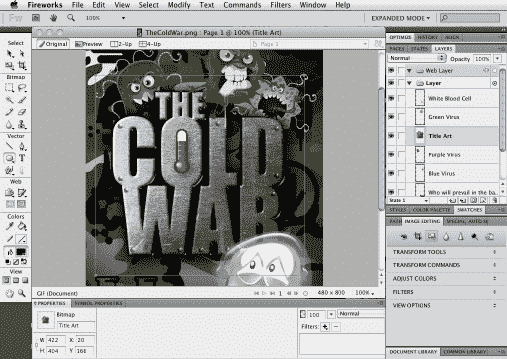

**图 9–14。** *烟花中的画面设计*

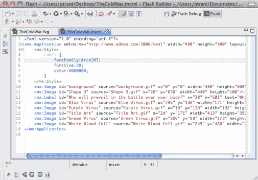

**图 9–15。** *FXG-和 MXML-创建的文件在 Flash Builder 中打开；请注意第 12 行的文本引用以及第 5–7 行的文本标签属性。位图图像在文件外部。*

**提示:**更多信息见`[www.adobe.com/products/fireworks.html](http://www.adobe.com/products/fireworks.html)`

### 开发者的角色

从技术角度来看，开发人员应该能够将最基本的设计和技术规范转化为实际的应用。优秀的开发人员在许多方面不同于他们更普通的同事。一些重要的例子如下:

*   *培养理解能力*:几乎任何人都可以盲目地遵循为他们制定的指令，但是优秀的开发人员会重视理解他们正在做的事情，这样他们就可以随时发现潜在的问题和改进的机会。
*   *掌握结构和应用架构*:在软件开发中，没有任何一种“正确的”做事方式，因为同一个问题通常可以用许多种方式来解决。然而，通常有一些方法比其他方法“更正确”。掌握众所周知的数据结构和应用架构意味着以最直接的方式解决问题，并以最灵活和有效的方式构建应用。
*   专业化:专业化展示了不断学习和成长的意愿，这有助于开发人员与众不同。对移动开发技术的特殊掌握使开发人员成为任何公司的宝贵员工和资源。

#### 开发者的工具箱

开发人员的工具箱有限。他们应该知道他们所选择的一种或多种语言的开发环境(包括编译器和调试器)，以及开发团队的每个成员都需要使用的一些常用工具。这些工具通常被集成到一个平台中，该平台既充当编译器又充当调试器。这通常是用于学习语言的相同工具，因此学习开发环境通常不是一个大挑战。以下开发环境通常用于移动 Flash 开发。

##### Adobe Flash Professional

Adobe Flash Professional CS5.5 是制作富有表现力的交互式内容的领先创作环境，是设计人员和开发人员共享的工具。ActionScript 是使用的编码语言，可以在二进制 FLA 文件格式中编写，其中可以包含图形、声音、字体、动画，有时还可以包含设计人员添加的视频。代码片段是在 Flash Professional CS5 中引入的，可用于加速开发。ActionScript 也可以在外部 ActionScript 文件(`.as`)中编写，这是为`Document`类和其他对象类例行完成的。通常这取决于项目类型来决定动作脚本将被写在哪里。对于较小的项目，在 FLA 中编写 ActionScript 就可以了。对于较大的项目，许多开发人员更喜欢外部 ActionScript 文件来帮助组织他们的代码。

Flash Professional CS5.5 包括舞台元件栅格化，以提高移动设备上复杂矢量对象的渲染性能。此外，还添加了 20 多个新的代码片段，包括用于创建移动和 AIR 应用的代码片段。在通过 USB 电缆连接的支持 Adobe AIR 的设备上可以进行源代码级调试，直接在设备上运行内容。

**提示:**更多信息见`[www.adobe.com/products/flash.html](http://www.adobe.com/products/flash.html)`

##### Flash 专业工作流程

设计师通常要么在 Flash Professional 中创建图形，要么从其他来源导入图形。FLA 可以在会议中用作原型，向客户展示最终的应用将如何工作，和/或它可以用作最终的源。最终结果如下(参见图 9–16)。

*   客户端请求应用。
*   设计师创建一个初始设计。
*   设计者给开发者一个 FLA 或图形文件。
*   开发者对设计进行编程，并从设计者的 FLA 中合并图形，或者导入设计者的图形文件。
*   客户请求更改。
*   如果设计发生变化，设计师会发送新的图形文件。
*   开发者用新的图形/动画更新应用。

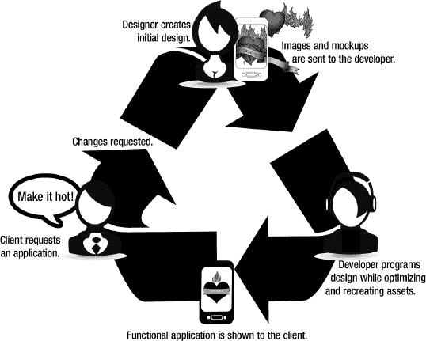

**图 9–16。** *典型的客户、设计师、开发人员工作流程*

##### Flash Builder 4.5

Adobe Flash Builder 4.5(以前称为 Adobe Flex Builder)是一个基于 Eclipse 的开发工具，用于使用 ActionScript 和开源 Flex 框架快速构建富有表现力的移动、web 和桌面应用。Flash Builder 4.5 允许开发人员为一个或多个移动平台(Android、BlackBerry 或 iOS)构建独立的 Flex/ActionScript 应用。设计和代码视图支持使用移动就绪组件进行移动开发。使用移动 Adobe AIR 运行时仿真器在桌面上测试移动应用，或者使用一键式打包、部署和启动流程在本地连接的移动设备上进行测试。开发人员可以将所需资源部署、打包和签名为特定于平台的安装程序文件，以便上传到移动应用分发站点或商店。

##### Flash Builder 工作流程

Flash Builder 可以导入许多流行的图形文件格式(参见 Figure 9–17)。内容应该决定将使用什么类型的文件。对于摄影，可以使用 JPG。如果有动画，将需要一个 SWF 文件。大概最灵活的文件格式是 FXG。它是一种基于 XML 的格式，公开了大量内容，使开发人员能够进一步编辑或在需要时进行动态更改。

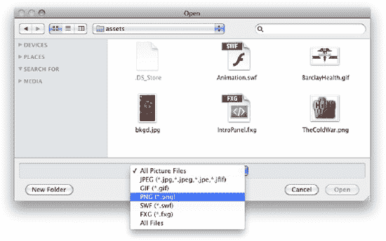

**图 9–17。** *将图形文件导入 Flash Builder*

在 Flex 框架中使用 Flash Builder 时，情况与 FLA 工作流略有不同。首先，没有 Fla。Flex 就像传统的 web 开发一样。你所有的文件都在一个文件夹中，由开发人员来组织它们并将它们全部签入到源代码控制中(如果正在使用的话)。代码也在适当的文件夹中公开和组织，或者作为 MXML (Flex 框架)文件或者作为(ActionScript)文件。因此，设计师目前无法轻松地在他们自己的设计“沙盒”中游戏，就像他们可以在 Flash Professional 中使用自己的 FLA 一样。这有利有弊。好处是没有设计师可以编辑开发者的作品。缺点是设计师不能检验他或她的设计。决定使用 Flash Builder 还是 Flash Professional 工作流取决于开发人员的技能和偏好。

### 总结

一个好的工作流程真的可以决定一个项目成功还是失败。你可以在一个项目中拥有最好的设计师和开发人员，但是如果他们不能有效地一起工作，交换想法和素材，所有这些都很容易失去。设计师设想的可能不是开发人员执行的，项目经理解释的可能不是最初要求的。你可以很容易地看到一个项目在很多地方可能会失败。一个好的工作流可以缓解过程中的许多痛点，并且可以很容易地确定一个项目是否失败。