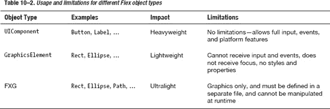
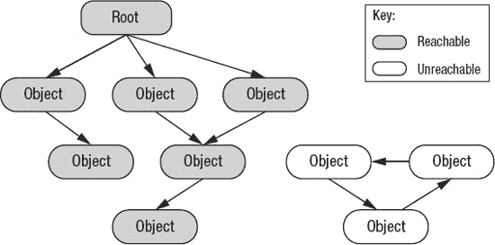

# 十、性能调整

业界认为闪存技术发展缓慢。媒体上的负面言论进一步强化了这一点，例如苹果公司首席执行官史蒂夫·乔布斯在他的《关于 Flash 的思考》中称“Flash 在移动设备上的表现不佳”

虽然可以用 Flash 或任何其他移动技术编写运行缓慢的应用，但使用正确的工具和技术，您也可以创建快速、响应迅速的应用。就像本机应用一样，Flash 技术让您可以利用硬件加速的视频播放和 GPU 加速的渲染。正确使用这些技术可以显著提高应用的性能，减少电池消耗。

还很容易陷入这样一个陷阱:将针对桌面应用优化的现有内容用于移动应用。移动设备的屏幕更小，处理器更慢，内存更少，网络连接通常更慢或不可靠。如果您在构建应用时考虑到这些约束，并经常在目标移动设备上进行测试，那么您将会获得更好的结果。

在本章中，您将详细了解 Flash 运行时是如何工作的，从而理解限制您的应用性能的关键因素。然后，我们将深入研究几个不同的性能敏感领域，包括图像、媒体和文本。在此过程中，我们将回顾 ActionScript 和 Flex 中专门为优化移动内容而引入的新 API，您应该充分利用这些 API。

总会有一些写得很差的 Flash 应用让批评者指出 Flash 不适合移动设备的原因。但是，通过遵循本章中的建议和准则，您将确保您的应用不是其中之一。

_______________

2011 年 4 月，www.apple.com/hotnews/thoughts-on-flash/,[苹果公司](http://www.apple.com/hotnews/thoughts-on-flash/,April)

### 移动性能调优基础知识

性能调优移动应用与桌面应用并没有太大的不同，并分为相同的三个基本考虑事项:

*   执行时间
*   内存使用
*   应用大小

执行时间是在显示每一帧之前，应用在处理上花费的 CPU 周期。这可能是您编写的用于准备或更新内容的应用逻辑、您的应用等待外部服务器响应的网络 I/O，或者在底层 Flash 运行时中用于验证或渲染图形的时间。

内存是应用运行时使用的设备 RAM 的数量。这通常会随着应用的执行而增长，直到达到一个稳定状态，不再创建其他对象，或者新对象的数量大致等于被释放对象的数量。内存的持续增长可能表明存在内存泄漏，即没有释放资源或者没有取消对不可见/屏幕外对象的引用。

移动设备增加了额外的复杂性，主系统和 GPU 上都有内存限制。垃圾收集也是一个因素，因为当收集器复制活动对象以释放未使用的内存时，使用的内存通常是实际需要的两倍。

应用的大小也是一个重要的考虑因素，因为它会影响应用从 Android Market 的初始下载及其启动性能。编译后的 ActionScript 实际上非常紧凑，因此静态素材(如嵌入到项目中的图像和视频)通常会决定应用的大小。

所有这些因素对于决定应用的整体性能都很重要。然而，比执行时间、内存和应用大小的绝对度量更重要的是最终用户感受到的性能。

### 感知绩效与实际绩效

如果您编写了一个广泛使用的应用，您可能会遇到用户对性能不满意的情况。对于每一个抱怨性能缓慢的用户，都有数十或数百人放弃或停止使用该应用，而不是报告问题。

科罗拉多州立大学的 John Hoxmeier 和 Chris DiCesare 的研究证实了应用性能低、使用率低和用户满意度低之间的相关性。 2 通过用 100 名学生组成的控制组进行测试，他们证明了以下假设:

*   响应时间越长，满意度越低
*   不满意导致停止使用
*   易用性随着满意度的下降而下降

虽然他们是在基于 web 的应用上进行测试，但是这些发现与您在基于 Flash 平台的富客户端应用上的体验非常相似。在这项研究中，花了 6 秒或更短时间的反应被认为是强有力的和足够快的，而花了 9 秒或更长时间的反应被评为非常不利。

**注意:**在这项研究中，他们还反驳了专家用户更有可能容忍较慢响应时间的假设，所以不要认为这项研究不适用于您的应用。

那么你的应用需要多快才能让用户满意呢？根据本·施奈德曼的说法， 3 你应该保持在以下界限内:

*   *打字、光标移动、鼠标选择*:50-150 毫秒
*   *简单频繁的任务* : 1 秒
*   *常见任务*:2-4 秒
*   *复杂任务*:8-12 秒

此外，通过进度条或旋转的等待图标向用户提供关于长时间运行任务的反馈会极大地改变他们等待的意愿。除了 15 秒之外，这对于确保用户在上下文切换后等待或回来是绝对重要的。

那么这对您的 Flash 应用意味着什么呢？

Flash 应用通常利用动画和过渡来改善用户体验。如果你打算利用这些，它们需要有相对较高的帧速率，以便给用户留下应用响应迅速的印象。这些的目标应该是大约每秒 24 帧或大约 42 毫秒，这是用户感觉动画流畅的最小帧速率。在下一节中，我们将更多地讨论如何调整渲染性能来达到这个目标。

_________________

John A. Hoxmeier 和 Chris DiCesare，“系统响应时间和用户满意度:基于浏览器的应用的实验研究。” *AMCIS 2000 年会议录* (2000 年)。347 号文件。

Ben Shneiderman，“计算机对人类行为的反应时间和显示率。”*计算调查* 16 (1984)，第 265–285 页。

对于频繁的任务，例如显示细节、提交表单或拖放，您应该将响应时间控制在一秒以内。在执行这些操作时，Flash 应用比 web 应用有明显的优势，因为它们可以在后台执行任务以检索或发送数据时给用户即时反馈。

一些常见的任务，比如加载一个新的页面，或者通过一个标签或者链接来导航，可能会花费更长的时间，但是应该有一个不确定的进度指示器来让用户知道活动正在发生。此外，合理使用过渡动画可以使加载看起来比实际发生得更快。

复杂的任务，如搜索或填充大型数据列表，可能需要更长的时间，但应该限制在 12 秒内完成，或者提供一个进度条，指示任务需要多长时间才能完成。通常可以显示中间结果，如部分搜索结果或前几页数据。这将允许用户在后台加载额外数据的同时继续使用应用，从而显著改变感知的等待时间。

### 调整图形性能

在其核心，Flash 运行时是一个基于帧的动画引擎，处理保留模式图形。即使您正在使用 Flex 之类的高级框架构建应用，了解 Flash Player 的渲染基础也会有所帮助，这样您就可以优化处理和内容以获得最佳性能。

Flash 引擎的心跳是每秒帧数设置，它控制每秒在屏幕上绘制的帧数。虽然性能瓶颈可能会导致每秒帧数减少，但处理的帧数永远不会超过这个数字。

许多图形工具包使用所谓的即时模式渲染来绘制到屏幕上。在即时模式呈现中，应用实现了一个回调，它必须在每个时钟周期重新绘制屏幕内容。虽然这在概念上很简单，并且接近硬件实现的内容，但是它将保存状态和为动画提供连续性的工作留给了应用开发人员。

Flash 使用保留模式图形，您可以创建一个将在屏幕上渲染的所有对象的显示列表，并让框架负责在每个时钟周期渲染和传输最终图形。这更适合动画和图形应用，但基于显示列表的大小和复杂性，可能会耗费更多资源。

#### 弹性跑道

Ted Patrick 为 Flash 播放器如何处理渲染提出了一个非常有用的概念模型，他称之为弹性跑道。 4 如图图 10–1 所示，该模型将每一帧中的工作在代码执行和渲染之间进行拆分。

**图 10–1。** *闪光播放器弹性跑道*

代码执行是运行与该帧相关联的任何 ActionScript 所花费的时间，包括因用户输入而触发的事件处理程序、计时器和`ENTER_FRAME`事件。渲染包括 Flash Player 为准备显示列表、合成图像和将图形传输到屏幕上而进行的处理。为了保持稳定的帧速率，这两个活动的总持续时间不能超过为该帧分配的时间片。

那么你有多少时间来执行你所有的逻辑呢？Table 10–1 列出了一些常见的帧速率，以及处理代码执行和渲染需要多少毫秒。

_________________

4 特德·帕特里克，“Flash Player 心智模型——弹性跑道”，`[`ted.onflash.org/2005/07/flash-player-mental-model-elastic.php`](http://ted.onflash.org/2005/07/flash-player-mental-model-elastic.php)`，2005 年 7 月

Flash 播放器的默认帧速率是 24fps 低于这个值的任何值对用户来说都是明显不稳定或滞后的。然而，用户可以轻松感知高达 60fps 的帧速率差异，特别是在有大量运动或滚动的任务中。拍摄高于 60fps 的帧速率通常是不值得的，尤其是考虑到大多数液晶显示器的刷新率上限为 60hz，一些设备的最大帧速率上限为 60。

当尝试诊断低帧速率时，第一步是确定您是否受到长时间代码执行或缓慢渲染的限制。代码执行是两者中比较容易分析的，因为它在您的控制之下，如果它接近或超过您的目标帧速率的总帧长度，这就是您想要开始优化的地方。

#### 减少代码执行时间

如果您的代码执行时间比单个帧周期稍长，您可以通过优化代码来获得足够的性能。这将根据您是使用纯 ActionScript 还是基于 Flex 构建而有所不同。此外，如果您正在进行复杂或长时间运行的操作，可能需要不同的方法。

值得研究的一些常见 ActionScript 代码性能最佳实践包括:

*   *更喜欢向量而不是数组*:向量数据类型经过了高度优化，比使用数组进行基本的列表操作要快得多。在某些情况下，比如大型稀疏列表，数组的性能会更好，但这是一个罕见的例外。
*   *尽可能指定强类型* : ActionScript 是动态类型的，允许你省略显式类型信息。但是，如果提供了类型信息，编译器可以生成更高效的代码。
*   *保持构造函数轻便*:实时(JIT)编译器不优化变量初始化器或构造函数中的代码，强制代码以解释模式运行。一般来说，对象构造是很昂贵的，应该推迟到元素在屏幕上可见的时候。
*   *明智地使用绑定*:绑定引入了额外的开销，这对更新 UI 是有意义的，但在其他地方应该避免。
*   *正则表达式开销很大*:尽量少用正则表达式来验证数据。如果需要搜索，String.index 的速度要快一个数量级。

如果您正在编写一个 Flex 应用，您还需要了解以下内容:

*   *最小化组和容器的嵌套*:大型对象图的测量和布局可能非常昂贵。通过保持容器尽可能的平坦，你将加速你的应用。这在构建可重复使用的网格或列表呈现器时尤为重要。
*   *更喜欢组而不是容器*:新的 Spark 图形库在重新设计时考虑到了性能。因此，与容器相比，组是非常轻量级的，应该用于布局。

如果在调优代码后，代码执行仍然是瓶颈，那么您可能希望将工作负载分散到多个框架上。例如，如果您正在执行命中检测算法，可能无法检查单个帧中的所有对象。但是，如果您可以按区域对对象进行分组，并对它们进行增量处理，则工作可以分布在多个帧上，从而提高应用的渲染速度。

#### 加速渲染

在 CPU 上运行时，Flash 使用高度优化的保留模式软件渲染器将图形绘制到屏幕上。为了渲染每一帧，它遍历 DisplayList 中所有对象的列表，以确定哪些是可见的，哪些需要绘制。

软件渲染器逐行扫描更新区域，通过查看显示列表中每个元素的顺序、位置和不透明度来计算每个像素的值。Figure 10–2 包含一个在 Flash 中创建的示例图形，该图形由几层文本和图形复合而成。

**图 10–2。** *内脏的样本闪现图示 5*

当放置在舞台中时，该场景将具有类似于图 10–3 所示的显示列表。

**图 10–3。** *显示样本闪光器官图形列表*

____________

5 基于公共领域器官库的图形:米凯尔·海格斯特伦，《内脏》，【http://commons.wikimedia.org/wiki/File:Internal_organs.png 

在渲染阶段，Flash 将使用这个显示列表来决定如何在屏幕上绘制每个像素。由于图形是不透明的，并且嵌套只有三层深，这将在屏幕上非常快地呈现。随着显示列表的复杂性增加，您需要特别注意应用中使用的对象类型，以及应用于它们的效果。

提高应用呈现性能的一些方法包括:

*   保持你的显示列表很小:一个修剪良好的显示列表将帮助 Flash 渲染器节省内存和扫描层次结构的执行时间。如果不再使用对象，请确保为其父对象移除它们。否则，您可以通过动态更改单个元素的可见性来隐藏和显示它们。
*   *使用合适的对象类型*:形状或`Bitmap`是显示列表中最小的对象，仅占用 236 字节。`Sprites`更重，具有交互和事件处理功能，占用 414 字节。`MovieClips`是场景中最昂贵的对象，440 字节和额外的开销来支持动画。为了加快渲染速度，您应该选择满足您需求的最简单的对象类型。
*   *避免 alpha、遮罩、滤镜和混合*:如果使用这些功能，Flash 渲染引擎无法进行某些优化，这会降低渲染性能。与其使用 alpha 来隐藏和显示对象，不如使用 visibility 标志。遮罩非常昂贵，通常可以用简单的剪切或场景分层来代替。混合模式特别昂贵，应尽可能避免。

如果您正在开发一个基于 Flex 的应用，那么您将需要特别注意 UIComponents、GraphicElements 和 FXG 的使用。Table 10–2 列出了使用这些不同对象类型的利弊。

`UIComponents`是 Flex 中最复杂的对象类型，会显著影响渲染性能，尤其是在表格或列表渲染器中广泛使用时。和 FXG 都是非常轻量级的组件，渲染器可以对它们进行显著的优化。FXG 有轻微的性能优势，因为它在应用构建时被编译成图形，而`GraphicsElements`则需要在运行时处理。

移动开发中的一个常见错误是专门在桌面模拟器中开发，并等到应用几乎完成时才开始在设备上测试。如果等到有了极其复杂的显示列表，就很难找出哪些元素导致了速度的下降。另一方面，如果您在构建应用时定期进行测试，那么就很容易诊断出哪些更改对性能影响最大。

#### 场景位图缓存

另一种可以用来以牺牲内存为代价提高渲染性能的技术是场景位图缓存。Flash 通过`cacheAsBitmap`和`cacheAsBitmapMatrix`属性提供内置支持，可以轻松捕捉和替换静态图像，以代替完整的场景层次。这在移动设备上尤其重要，因为在移动设备上，矢量图形操作要慢得多，并且会显著影响您的性能。

##### cacheAsBitmap

`cacheAsBitmap`是`DisplayObject`的`boolean`属性，通过扩展，你在 Flash 和 Flex 中使用的所有视觉元素包括`Sprite`和`UIComponent`都可以访问这个变量。当设置为 true 时，每次`DisplayObject`或它的一个子节点改变时，它将获取当前状态的快照并保存到屏幕外缓冲区。然后，对于未来的渲染操作，它将重新绘制保存的屏幕外缓冲区，这对于场景的复杂部分可以快几个数量级。

要在`DisplayObject`上启用`cacheAsBitmap`，您需要执行以下操作:

`cacheAsBitmap = true`;

Flex `UIComponent`有一个缓存策略，它会根据启发自动启用`cacheAsBitmap`。您可以通过执行以下操作来覆盖此行为并强制启用`cacheAsBitmap`:

`cachePolicy = UIComponentCachePolicy.ON;`

当您有不经常改变的复杂图形时，打开`cacheAsBitmap`是一项重要的技术，例如矢量渲染的背景。尽管背景是静态的，但是当围绕它移动的其他元素重叠并遮挡了部分背景时，也会触发更新。此外，简单的翻译，如滚动背景，将导致一个昂贵的重绘操作。

为了弄清楚应用重绘的每一帧中屏幕的哪些部分被重绘，可以使用下面的代码启用`showRedrawRegions`:

`flash.profiler.showRedrawRegions(true);`

这将在正在更新的屏幕区域周围绘制红色矩形，并且可以通过编程打开和关闭。图 10–4 显示了一个`CheckBox`控件的例子，它可以让你打开和关闭重绘区域。该控件最近被单击过，所以它周围有一个红色的矩形。

**图 10–4。** *重绘区域调试功能的例子*

此选项仅在调试播放器中可用，因此在测试应用时，它将在 AIR 调试启动程序中工作，但在运行时播放器(如移动设备)中部署时，它将不起作用。Figure 10–4 还展示了一个非常简单的每秒帧数监视器，可用于在开发过程中对您的 Flex 应用性能进行基准测试。这两者的完整代码将在下一节构建 Flash Mobile Bench 应用中显示。

虽然`cacheAsBitmap`是一个非常强大的优化应用重绘的工具，但如果使用不当，它也是一把双刃剑。在`cacheAsBitmap`设置为 true 的情况下，为每个`DisplayObject`保留并刷新一个全尺寸的屏幕缓冲区，如果在图形加速模式下运行，这会消耗大量设备内存或耗尽有限的 GPU 内存。

此外，如果你有一个频繁更新的对象或者应用了一个转换，那么`cacheAsBitmap`只会用不必要的缓冲操作来降低你的应用的速度。幸运的是，对于转换的情况，有一个改进版本的`cacheAsBitmap`，叫做`cacheAsBitmapMatrix`，你可以利用它。

##### cacheasbitmap 矩阵

`cacheAsBitmapMatrix`也是`DisplayObject`上的一个属性，和`cacheAsBitmap`一起工作。为了使`cacheAsBitmapMatrix`生效，`cacheAsBitmap`也必须开启。

如前所述，`cacheAsBitmap`在对对象应用旋转或倾斜等变换时不起作用。这样做的原因是将这样的变换应用到保存的`Bitmap`会产生缩放伪像，这会降低最终图像的外观。因此，如果您希望将缓存应用于应用了变换的对象，Flash 要求您还为存储在`cacheAsBitmapMatrix`属性中的`Bitmap`指定一个变换矩阵。

在大多数情况下，将`cacheAsBitmapMatrix`设置为识别矩阵将会达到预期效果。屏幕外的`Bitmap`将被保存在未变换的位置，并且`DisplayObject`上的任何后续变换将被应用到那个`Bitmap`。以下代码显示了如何将`cacheAsBitmapMatrix`设置为识别转换:

`cacheAsBitmap = true;
cacheAsBitmapMatrix = new Matrix();`

如果您利用一个`cachePolicy`在一个 Flex `UIComponent`上做同样的事情，您将做以下事情:

`cachePolicy = UIComponentCachePolicy.ON;
cacheAsBitmapMatrix = new Matrix();`

**注意:**如果你计划在多个对象上设置`cacheAsBitmapMatrix`，你可以重用同一个矩阵来消除矩阵创建的开销。

这样做的缺点是，最终的图像可能会出现一些轻微的锯齿，尤其是在图像被放大或直线被旋转的情况下。为此，您可以指定一个变换矩阵，在缓冲图像之前放大图像。同样，如果您知道最终的图形将总是以缩小的尺寸呈现，您可以指定一个变换矩阵来缩小缓冲的图像以节省内存使用。

如果你使用`cacheAsBitmapMatrix`来缩小图像尺寸，你需要注意不要以原始尺寸显示`DisplayObject`。Figure 10–5 显示了一个例子，如果你设置一个先缩小并旋转图像的缓存矩阵，然后尝试以其原始大小渲染对象，会发生什么。

**图 10–5。** *演示误用`cacheAsBitmapMatrix`对图像质量的影响*

请注意，由于放大，最终图像有很多锯齿。即使您使用原始图像的一对一转换来显示它，Flash 也会放大缓存的版本，从而产生低保真度的图像。

`cacheAsBitmapMatrix`的最佳用途是将其设置为比预期的变换稍大，这样您就有足够的像素信息来生成高质量的变换图像。

##### 闪光移动工作台

Flash Mobile Bench 是一个简单的应用，可让您测试不同设置对您部署的移动应用的性能的影响。

它允许您测试的功能包括:

*   向显示列表添加大量形状
*   简单 x/y 平移的动画速度
*   简单顺时针旋转的动画速度
*   `cacheAsBitmap`对性能的影响
*   `cacheAsBitmapMatrix`对性能的影响
*   自动 Flex 缓存启发式算法对性能的影响

它还包括一个简单的 FPS 监控小部件，您可以在自己的应用中重用它。

为了强调运行该应用的设备的能力，我们必须做的第一件事是将帧速率从默认的 24fps 提高到更高的水平。根据对一些设备的测试，我们发现 240fps 是许多平台达到的上限，并选择它作为目标帧速率设置。请记住，这是一个测试理论性能的基准应用，但在大多数情况下，您不会希望将帧速率设置得这么高，因为您可能会处理比硬件所能显示的更多的帧。

为了改变帧速率，`Application`类中有一个名为`frameRate`的属性。清单 10–1 展示了如何在 Flex 移动应用中设置这一点。

**清单 10–1。** *闪光移动板凳`ViewNavigatorApplication` ( `MobileBench.mxml` )*

`<?xml version="1.0" encoding="utf-8"?>
<s:ViewNavigatorApplication xmlns:fx="http://ns.adobe.com/mxml/2009"
  xmlns:s="library://ns.adobe.com/flex/spark"
  firstView="views.MobileBenchHomeView"
  **frameRate="240"**>
</s:ViewNavigatorApplication>`

这遵循了用一个叫做`MobileBenchHomeView`的`View`构建 Flex 移动应用的`ViewNavigatorApplication`模式。这个`View`的布局在 MXML 完成，如清单 10–2 所示。

**清单 10–2。** *Flash 移动工作台`View`布局代码(`MobileBenchHomeView.mxml` )*

`<?xml version="1.0" encoding="utf-8"?>
<s:View xmlns:fx="http://ns.adobe.com/mxml/2009"
    xmlns:s="library://ns.adobe.com/flex/spark"
    title="Flash Mobile Bench" initialize="init()">`
`  <fx:Script>
    <![CDATA[
      …
    ]]>
  </fx:Script>
  <s:VGroup top="10" left="10" right="10">
    <s:Label id="fps"/>
    <s:CheckBox id="redraw" label="show redraw"
                click="{flash.profiler.showRedrawRegions(redraw.selected)}"/>
    <s:HGroup verticalAlign="middle" gap="20">
      <s:Label text="Cache:"/>
      <s:VGroup>
        <s:RadioButton label="Off" click="cacheOff()"/>
        <s:RadioButton label="Auto" click="cacheAuto()"/>
      </s:VGroup>
      <s:VGroup>
        <s:RadioButton label="Bitmap" click="cacheAsBitmapX()"/>
        <s:RadioButton label="Matrix" click="cacheAsBitmapMatrixX()"/>
      </s:VGroup>
    </s:HGroup>
    <s:TileGroup id="tiles" width="100%">
      <s:Button label="Generate Rects" click="generateSquares()"/>
      <s:Button label="Generate Circles" click="generateCircles()"/>
      <s:Button label="Start Moving" click="moving = true"/>
      <s:Button label="Stop Moving" click="moving = false"/>
      <s:Button label="Start Rotating" click="rotating = true"/>
      <s:Button id="stop" label="Stop Rotating" click="rotating=false"/>
    </s:TileGroup>
  </s:VGroup>
  <s:Group id="bounds" left="20" top="{stop.y + tiles.y + stop.height + 20}">
    <s:Group id="shapeGroup" transformX="{tiles.width/2 - 10}"
             transformY="{(height - bounds.y)/2 - 10}"/>
  </s:Group>
</s:View>`

这为应用创建了基本的 UI，包括一个填充 FPS 设置的地方，用于选择缓存策略的单选按钮，以及用于添加`GraphicsElement`以及开始和停止动画的按钮。

还有一个额外的复选框来显示重绘区域。该控件可以按原样放入您自己的应用中，并可以帮助您最小化重绘区域的大小，以优化渲染性能。请记住，此功能仅在 AIR 调试启动程序中有效，因此您不能在设备运行时使用它。

除了 UI 标签，FPS 监视器的代码是相当独立的。它由一个绑定到`ENTER_FRAME`事件的事件监听器和一些簿记变量组成，以跟踪平均帧速率。代码如清单 10–3 所示。

**清单 10–3。** *动作脚本导入，初始化，以及 FPS 处理程序的代码*

`import flash.profiler.showRedrawRegions;
import flash.utils.getTimer;
import mx.core.UIComponentCachePolicy;
import mx.graphics.SolidColor;
import mx.graphics.SolidColorStroke;
import spark.components.Group;
import spark.primitives.Ellipse;` `import spark.primitives.Rect;
import spark.primitives.supportClasses.FilledElement;

privatefunction init():void {
  addEventListener(Event.ENTER_FRAME, calculateFPS);
  addEventListener(Event.ENTER_FRAME, animateShapes);
}

*// FPS handler*

privatevar lastTime:int = getTimer();
privatevar frameAvg:Number = 0;
privatevar lastFPSUpdate:int = getTimer();

privatefunction calculateFPS(e:Event):void {
  var currentTime:int = getTimer();
  var duration:int = currentTime - lastTime;
  var weight:Number = (duration + 10) / 1000;
  frameAvg = frameAvg * (1 - weight) + duration * weight;
  lastTime = currentTime;
  if (currentTime - lastFPSUpdate > 200) {
    fps.text = "FPS: " + Math.round(1000.0 / frameAvg).toString();
    lastFPSUpdate = currentTime;
  }
}`

用于计算帧速率的算法针对以下特征进行了调整:

*   *每秒刷新不超过五次*:过于频繁地刷新计数器会使其难以读取，并会对您的性能产生负面影响。该条件通过`lastFPSUpdate`与 200 毫秒阈值的比较来强制执行。
*   *提高慢速帧的权重*:随着帧速率的降低，事件的数量也会减少。这要求每一帧的权重更高，以避免读数滞后。权重变量在 1000 毫秒(1 秒)的阈值内完成此操作。
*   *给快速帧赋予最小权重*:随着帧速率的上升，权重趋近于零。因此，分配了 1%的最小权重，以防止读数滞后于另一个极端。

该算法中需要注意的另一点是整数和浮点运算的使用。前者更快，在可能的情况下更受欢迎(例如计算持续时间)，而后者更准确，并且需要保持精确的平均值(`frameAvg`)。

代码的下一个关键部分是场景中`GraphicsElement`的填充。清单 10–4 中的代码实现了这一点。

**清单 10–4。** *创作`GraphicsElement` s* 的动作脚本代码

`[Bindable]
private var shapes:Vector.<FilledElement> = new Vector.<FilledElement>();

private function populateRandomShape(shape:FilledElement):void {
  shape.width = shape.height = Math.random() * 20 + 20;
  shape.x = Math.random() * (tiles.width - 20) - shape.width/2;
  shape.y = Math.random() * (height - bounds.y - 20) - shape.width/2;
  shape.fill = new SolidColor(0xFFFFFF * Math.random());
  shape.stroke = new SolidColorStroke(0xFFFFFF * Math.random());
  shapes.push(shape);
  shapeGroup.addElement(shape);
}

private function generateCircles():void {
  for (var i:int=0; i<100; i++) {
    populateRandomShape(new Ellipse());
  }
}

private function generateSquares():void {
  for (var i:int=0; i<100; i++) {
    populateRandomShape(new Rect());
  }
}`

形状的所有属性都是随机的，从填充和描边的颜色到大小和位置。`Rect`和`Ellipse`创建之间的重叠逻辑也被抽象成一个公共函数，以最大化代码重用。

为了制作形状的动画，我们使用了在清单 10–5 中找到的代码。

**清单 10–5。***`Rect`和`Ellipse`形状*动画的 ActionScript 代码

`privatevar moving:Boolean;
privatevar rotating:Boolean;
privatevar directionCounter:int;

privatefunction animateShapes(e:Event):void {
  if (moving) {
    shapeGroup.x += 1 - ((directionCounter + 200) / 400) % 2;
    shapeGroup.y += 1 - (directionCounter / 200) % 2;
    directionCounter++;
  }
  if (rotating) {
    shapeGroup.rotation += 1;
  }
}`

我们没有使用 Flex 动画类，而是选择通过一个简单的`ENTER_FRAME`事件监听器来实现。这使您可以灵活地扩展线束，以修改形状类上不是一级属性的变量。

最后，修改`cacheAsBitmap`设置的代码如清单 10–6 所示。

**清单 10–6。** *用于设置 renderMode 的应用描述符标签(加粗)*

`privatevar identityMatrix:Matrix = new Matrix();

privatefunction cacheOff():void {
  shapeGroup.cachePolicy = UIComponentCachePolicy.OFF;
}

privatefunction cacheAuto():void {
  shapeGroup.cachePolicy = UIComponentCachePolicy.AUTO;
}

privatefunction cacheAsBitmapX():void {
  shapeGroup.cachePolicy = UIComponentCachePolicy.ON;
  shapeGroup.cacheAsBitmapMatrix = null;
}

privatefunction cacheAsBitmapMatrixX():void {
  shapeGroup.cachePolicy = UIComponentCachePolicy.ON;
  shapeGroup.cacheAsBitmapMatrix = identityMatrix;
}`

在阅读了上一节之后，这段代码应该看起来非常熟悉。尽管我们只有一个对象实例来应用`cacheAsBitmapMatrix`,我们还是遵循了重用公共单位矩阵的最佳实践，以避免额外的内存和垃圾收集开销。

运行 Flash Mobile Bench 后，您将立即看到指定设备上的 FPS 计数器最大值。单击按钮将一些形状添加到场景中，将缓存设置为所需的设置，并查看设备的性能。图 10–6 显示了在摩托罗拉 Droid 2 上运行的 Flash 移动工作台应用，使用`cacheAsBitmapMatrix`渲染了 300 个圆。

**图 10–6。** *运行在摩托罗拉 Droid 2 上的 Flash 移动工作台*

你的设备性能如何？

#### GPU 渲染

另一种目前仅适用于移动设备的技术是将渲染卸载到图形处理单元(GPU)。虽然 GPU 是一个高度受限的芯片，不能做普通 CPU 能够做的一切，但它擅长做图形和渲染计算，这些计算在 CPU 上需要几个数量级的时间。同时，GPU 产生更少的电池消耗，允许移动设备循环降低 CPU 以节省电池寿命。

Flash 移动项目的默认设置是 renderMode 为“auto”，目前默认为`cpu`。您可以显式地将其更改为`gpu`渲染，看看您的应用是否获得了显著的性能提升。要在 Flash Professional 中更改渲染模式，请打开 AIR for Android 设置对话框，并从渲染模式下拉列表中选择 GPU，如图 Figure 10–7 所示。

**图 10–7。***Flash Professional 中的 GPU 渲染模式设置*

要更改 Flash Builder 项目中的 renderMode，您需要编辑应用描述符文件，并在`initialWindow`下添加一个额外的 renderMode 标签，如清单 10–7 所示。

**清单 10–7。** *用于设置 renderMode 的应用描述符标签(加粗)*

`<application>
  …
  <initialWindow>
    **<renderMode>gpu</renderMode>**
    …
  </initialWindow>
</application>`

从`gpu`模式获得的结果会因您使用的应用特性和运行的硬件而有很大差异。在某些情况下，你会发现你的应用在`gpu`模式下比在`cpu`模式下运行得更慢。Table 10–3 列出了在 Motorola Droid 2 上运行 Flash Mobile Bench 的一些实验结果，在不同的缓存和 gpu 模式下运行 100 个圆和 100 个正方形。

正如您在这个特定设备上的这个场景的结果中所看到的，GPU 没有提供任何优势，并且在没有矩阵集的情况下启用`cacheAsBitmap`的情况下速度明显较慢。

这强调了在应用中进行设计决策之前，使用不同设备进行测试的重要性。在这个特定的例子中，性能下降很可能是由于 GPU 将数据发送回 CPU 的回写开销。大多数 GPU 设备都针对从 CPU 接收数据进行了优化，以便快速将其写入屏幕。在某些设备上，从另一个方向发回数据进行处理的成本高得惊人。

然而，随着摩托罗拉 ATRIX 和 XOOM 上的英特尔 Integra 特性等新芯片组的推出，这种情况正在迅速改变，这些芯片组为双向通信优化了管道。此外，Flash 团队正在开发一个优化的渲染管道，通过在处理器上做更多的工作来减少对 CPU 的写回需求。有关闪存团队正在进行的性能改进的更多信息，请参见本章后面的“闪存性能的未来”一节。

### 表演项目渲染器

性能在关键应用领域的环境中得到最佳调整，这将被用户注意到。对于 Flex 移动应用来说，通过列表组织内容是非常常见的，但也带来了巨大的性能挑战。

由于滚动列表涉及动画，如果在交互过程中帧速率下降，这是非常明显的。同时，项目渲染器代码中的任何性能问题都会因渲染器在每个单独的列表单元格中重用而被放大。

为了演示这些概念，我们将构建一个简单的示例，显示所有 Adobe 用户组的列表，并在单击某个项目时导航到用户组网站。

清单 10–8 展示了基本的`View`代码，用于创建一个 Flex 列表和连接一个将打开浏览器页面的 click 事件处理程序。我们还利用之前开发的`FPSComponent`来跟踪我们开发应用的速度。

**清单 10–8。** *Adobe 用户组应用`View`类*

`<?xml version="1.0" encoding="utf-8"?>
<s:View xmlns:fx="http://ns.adobe.com/mxml/2009"
    xmlns:s="library://ns.adobe.com/flex/spark"
    xmlns:renderers="renderers.*" xmlns:profile="profile.*"
    title="Adobe User Groups (Original)">
  <fx:Script>
    <![CDATA[
      import flash.net.navigateToURL;
      privatefunction clickHandler(event:MouseEvent):void {
        navigateToURL(new URLRequest(event.currentTarget.selectedItem.url));
        }
    ]]>
  </fx:Script>
  <s:VGroup width="100%" height="100%">
    <profile:FPSDisplay/>
    <s:List width="100%" height="100%" dataProvider="{data}"
            click="clickHandler(event)">
      <s:itemRenderer>
        <fx:Component>
          <renderers:UserGroupRendererOriginal/>
        </fx:Component>
      </s:itemRenderer>
    </s:List>
  </s:VGroup>
</s:View>`

**提示:**对于移动应用，总是使用`itemRenderer`属性而不是`itemRendererFunction`属性。后者会导致创建项目渲染器的多个实例，并会对性能产生负面影响。

这个类引用了一个显示列表项的`UserGroupRenderer`。该渲染器的创建包括组合以下组件:

*   用户组徽标的图像组件
*   用于显示用户组名称和描述的两个文本字段
*   分隔不同视觉元素的水平线

清单 10–9 展示了满足这些需求的`ItemRenderer`的简单实现。

**清单 10–9。** *未优化的`ItemRenderer`代码*

`<?xml version="1.0" encoding="utf-8"?>
<s:View xmlns:fx="http://ns.adobe.com/mxml/2009"
    xmlns:s="library://ns.adobe.com/flex/spark"
    xmlns:renderers="renderers.*" xmlns:profile="profile.*"
    title="Adobe User Groups (Original)">
  <fx:Script>
    <![CDATA[
      import flash.net.navigateToURL;
      privatefunction clickHandler(event:MouseEvent):void {
        navigateToURL(new URLRequest(event.currentTarget.selectedItem.url));
      }
    ]]>
  </fx:Script>
  <s:VGroup width="100%" height="100%">
    <profile:FPSDisplay/>
    <s:List width="100%" height="100%" dataProvider="{data}"
            click="clickHandler(event)">
      <s:itemRenderer>
        <fx:Component>
          <renderers:UserGroupRendererOriginal/>
        </fx:Component>
      </s:itemRenderer>
    </s:List>
  </s:VGroup>
</s:View>`

在运行这个例子时，我们有一个非常实用的滚动列表，如图 Figure 10–8 所示。

**图 10-8。** *使用自定义的 Adobe 用户组列表`ItemRenderer`*

虽然功能和外观都很好，但这种实现的性能并不理想。对于正常的滚动，帧速率下降到大约 18fps，当通过在屏幕上滑动来长时间滚动列表时，你只能获得 7fps。在这样的速度下，滚动在视觉上会分散注意力，给人一种整个应用都很慢的印象。

#### 灵活形象类

Flash 提供了几个不同的映像类，这些映像类提供不同的功能，并且具有非常不同的性能特征。根据您的应用需求使用正确的图像类可以带来巨大的性能差异。

可用的图像类别按性能升序排列如下:

*   `mx.controls.Image`:这是原始的 Flex 图像组件。它现在已经过时，不应该用于移动应用。
*   这取代了以前的 image 类，应该在任何需要样式、进度指示器或其他高级功能的地方使用。
*   `flash.display.Bitmap`:这是核心的 Flash 镜像组件。它的功能有限，是在屏幕上显示图像的最高性能方式。

对于最初版本的`ItemRenderer`，我们使用了 Flex `Image`类。虽然这是一个不错的选择，但是我们也没有使用这个类的高级特性，所以我们可以通过使用`Bitmap`来提高性能。

此外，Flex 4.5 中添加的一个新特性是`ContentCache`类。当在一个`Bitmap`上设置为 contentLoader 时，它缓存远程获取的图像，在同一图像多次显示的情况下显著提高滚动性能。

清单 10–10 显示了项目渲染器类的更新版本，该类包含了这些改进以提高性能。

**清单 10–10。** *`ItemRenderer`【代码对图像进行了优化(粗体变化)*

`<?xml version="1.0" encoding="utf-8"?>
<s:ItemRenderer xmlns:fx="http://ns.adobe.com/mxml/2009"
        xmlns:s="library://ns.adobe.com/flex/spark">
  <fx:Style>
    .descriptionStyle {
      fontSize: 15;
      color: #606060;
    }
  </fx:Style>
  **<fx:Script>**
    **<![CDATA[**
      **import spark.core.ContentCache;**
      **static private const cache:ContentCache = new ContentCache();**
    **]]>**
  **</fx:Script>**
  <s:Line left="0" right="0" bottom="0">
    <s:stroke><s:SolidColorStroke color="gray"/></s:stroke>
  </s:Line>
  <s:HGroup left="15" right="15" top="12" bottom="12" gap="10" verticalAlign="middle">
    **<s:BitmapImage source="{data.logo}" contentLoader="{cache}"/>**
    <s:VGroup width="100%" gap="5">` `      <s:RichText width="100%" text="{data.groupName}"/>
      <s:RichText width="100%" text="{data.description}" styleName="descriptionStyle"/>
    </s:VGroup>
  </s:HGroup>
</s:ItemRenderer>`

通过这些额外的改进，我们将滚动的帧速率提高到了 19fps，投掷的帧速率提高到了 12fps。后者仅用几行代码就提高了 70%以上，而且没有损失任何功能。

#### 文本组件性能

您会注意到桌面和移动设备之间最显著的性能差异之一是文本的性能。当您能够使用映射到设备字体的文本组件和样式时，您将获得最佳性能。但是，使用自定义字体或组件来提供精确的文本控制和反走样会有很大的性能损失。

随着 Flash Player 10 的发布，Adobe 推出了一个新的低级文本引擎，称为 Flash 文本引擎(FTE)和一个建立在它之上的框架，称为文本布局框架(TLF)。与以前的文本引擎(通常称为经典文本)相比，TLF 具有显著的优势，例如支持双向文本和印刷质量的排版。然而，这对移动应用来说是一个巨大的性能损失。

Flash Player 获得高性能文本显示的最佳设置是将文本引擎设置为“经典文本”，并通过在文本属性窗格中选择“使用设备字体”来关闭抗锯齿，如 Figure 10–9 所示。

**图 10–9。** *Flash 专业优化手机文本设置*

对于 Flex 应用，您有大量不同的文本组件，它们利用了从经典文本到 TLF 的所有内容，因此具有不同的性能特征。

表 10–4 中显示了可用的文本组件，以及它们所基于的文本框架和移动性能特征。

对于移动应用，使用`Label`、`TextInput`和`TextArea`组件可以获得最佳性能，应该尽可能使用它们。由于它们不支持双向文本和其他高级特性和样式，在某些情况下，您可能仍然需要使用`RichEditableText`或`RichText`。

由于用户组列表应用不需要任何高级文本特性，我们可以用`Label`代替`RichText`。更新后的代码如清单 10–11 所示。

**清单 10–11。** *`ItemRenderer`【代码对文本进行了优化(更改以粗体显示)*

`<?xml version="1.0" encoding="utf-8"?>
<s:ItemRenderer xmlns:fx="http://ns.adobe.com/mxml/2009"
        xmlns:s="library://ns.adobe.com/flex/spark">
  <fx:Style>
    .descriptionStyle {
      fontSize: 15;
      color: #606060;
    }
  </fx:Style>
  <fx:Script>
    <![CDATA[
      import spark.core.ContentCache;
      staticprivateconst cache:ContentCache = new ContentCache();
    ]]>
  </fx:Script>
  <s:Line left="0" right="0" bottom="0">
    <s:stroke<<s:SolidColorStroke color="gray"/></s:stroke>
  </s:Line>
  <s:HGroup left="15" right="15" top="12" bottom="12" gap="10" verticalAlign="middle">
    <s:BitmapImage source="{data.logo}" contentLoader="{cache}"/>
    <s:VGroup width="100%" gap="5">
      **<s:Label width="100%" text="{data.groupName}"/>**
      **<s:Label width="100%" text="{data.description}" styleName="descriptionStyle"/>**
    </s:VGroup>
  </s:HGroup>
</s:ItemRenderer>`

这次改动后，滚动速度为 20fps，投掷速度为 18fps，有了显著的提升。我们可以通过使用`StyleableTextField`来实现更高的速度，这正是 Flash 团队为他们的内置组件所做的。

#### 内置项目渲染器

在过去的几节中，我们在测试设备上将自定义项目渲染器的性能从低于 10fps 的完全不可接受的速度提升到大约 20fps。我们可以通过进行以下一些额外的更改来继续优化渲染器:

*   使用`cacheAsBitmap`保存最近的细胞图像。
*   在 ActionScript 中重写以利用`StyleableTextField`。
*   移除组并使用绝对布局。

但是，已经有一个组件包含了这些优化，并且可以开箱即用。

Flex 团队提供了一个`LabelItemRenderer`和`IconItemRenderer`的默认实现，您可以使用和扩展。这些类中已经包含了很多您可以利用的功能，包括对样式、图标和装饰器的支持。它们也是高度优化的，利用了本章讨论的所有最佳实践。

清单 10–12 展示了您将使用内置`IconItemRenderer`替换我们的自定义项目渲染器的代码更改。

**清单 10–12。** *`View`代码利用内置的`IconItemRenderer`*

`<?xml version="1.0" encoding="utf-8"?>
<s:View xmlns:fx="http://ns.adobe.com/mxml/2009"
    xmlns:s="library://ns.adobe.com/flex/spark"
    xmlns:views="views.*"
    title="Adobe User Groups (Built-in)" xmlns:profile="profile.*">
  <fx:Script>
    <![CDATA[
      import flash.net.navigateToURL;
      privatefunction clickHandler(event:MouseEvent):void {
        navigateToURL(new URLRequest(event.currentTarget.selectedItem.url));
      }
    ]]>
  </fx:Script>
  **<fx:Style>**
    **.descriptionStyle {**
      **fontSize: 15;**
      **color: #606060;**
    **}**
  **</fx:Style>**
  <s:VGroup width="100%" height="100%">
    <profile:FPSDisplay/>
    <s:List width="100%" height="100%" dataProvider="{data}"
              click="clickHandler(event)">
      <s:itemRenderer>
        <fx:Component>
          **<s:IconItemRenderer labelField="groupName"**
                    **fontSize="25"**
                    **messageField="description"**
                    **messageStyleName="descriptionStyle"**
                    **iconField="logo"/>**
        </fx:Component>
      </s:itemRenderer>
    </s:List>
  </s:VGroup>
</s:View>`

运行这段代码的结果非常接近我们最初的项目渲染器，如图图 10–10 所示。如果您并排比较这些图像，您会注意到由于使用了`StyleableTextComponent`，文本中有细微的差异，但是没有显著的差异会影响应用的可用性。

**图 10-10。** *Adobe 用户组列表使用内置的`IconItemRenderer`*

在摩托罗拉 Droid 2 上，使用内置组件的最终性能是滚动 24fps，投掷 27fps。这超过了 Flex 应用的默认帧速率，表明您可以用很少的代码在 Flash 中构建功能丰富、性能卓越的应用。

### 性能监控 API 和工具

构建高性能移动应用的最佳秘诀是尽早并经常测试性能。通过在构建应用时识别性能问题，您将能够快速识别代码中对性能至关重要的部分，并在开发过程中对它们进行调优。

拥有正确的工具来获得绩效反馈会使这项工作变得更加容易。本节重点介绍了几个免费提供的工具，或者您的系统中可能已经有了这些工具，您可以从今天开始利用它们。

#### 高分辨率！统计

获得关于应用的帧速率、内存使用和整体性能的实时反馈对于确保在开发过程中不会出现性能倒退至关重要。虽然您可以滚动您自己的性能度量，但是如果您不小心的话，您可能会因为使用您自己的工具降低应用的速度而扭曲您的结果。

幸运的是，一个臭名昭著的网络黑客，化名为 Doob 先生，创建了一个开源统计小部件，您可以很容易地将它合并到您的项目中。您可以从以下网址下载源代码:`[`github.com/mrdoob/Hi-ReS-Stats`](https://github.com/mrdoob/Hi-ReS-Stats)`。

杜布先生的高分辨率！Stats 为您提供了以下工具:

*   *每秒帧数*:显示当前 FPS 加上播放器中设置的目标 FPS(越高越好)。
*   *帧持续时间*:每秒帧数的倒数，这让你知道渲染一帧需要多少毫秒(越低越好)。
*   *内存使用量*:应用当前使用的内存量(以兆字节为单位)
*   *内存使用峰值*:该应用达到的最高内存使用阈值(也以兆字节为单位)

添加高分辨率！Stats 添加到 ActionScript 项目中，可以使用以下代码:

`import net.hires.debug.Stats;
addChild(newStats());`

因为它是一个纯 ActionScript 组件，所以您需要做更多的工作来将其添加到 Flex 项目中，具体操作如下:

`import mx.core.IVisualElementContainer;
import mx.core.UIComponent;
import net.hires.debug.Stats;
private function addStats(parent:IVisualElementContainer):void {
  var comp:UIComponent = new UIComponent();
  parent.addElement(comp);` `  comp.addChild(new Stats());
}`

然后，要将它附加到一个`View`，只需用一个自引用从`initialize`方法调用它:

`<s:View … initialize="addStats(this)"> … </View>`

在统计数据下面，绘制了这些值的图表，让您了解应用的趋势。您还可以通过单击读数的顶部或底部来增加或减少应用帧速率。图 10–11 显示了高分辨率的放大版本！统计用户界面。

**图 10–11。** *高清放大截图！统计数据*

#### 效能测试 v2 Beta

一旦您确定了您的性能问题，追踪根本原因并确保一旦您修复了它，行为不会随着将来的变化而倒退是非常棘手的。

Grant Skinner 采用了一种科学的方法来解决 PerformanceTest 的问题，为您提供纯 ActionScript APIs 来计时方法、分析内存使用情况，并创建可重复的性能测试场景。运行 PerformanceTest 工具的示例输出如图图 10–12 所示。

**图 10–12。** *运行性能测试工具的输出*

由于输出是 XML 格式的，您可以轻松地将其与其他工具或报告集成，包括在编写代码时进行性能测试的 TDD 框架。有关 PerformanceTest v2 的更多信息，请参见以下 URL:

`http://gskinner.com/blog/archives/2010/02/performancetest.html.`

#### Flash Builder 分析器

对于堆和内存分析，最好的可用工具之一是内置于 Flash Professional 中的探查器。Flash Builder profiler 为您提供了内存使用情况的实时图表，允许您拍摄堆快照并将其与基准进行比较，还可以捕获应用的方法级性能计时。

虽然这在直接运行在移动设备上时目前不工作，但它可以用于在 AIR Debug Launcher 中运行时分析您的移动应用。要在 profiler 中启动应用，请从运行菜单中选择 Profile。执行时，您将看到应用的实时视图，如图 Figure 10–13 所示。

**图 10–13。** *在调试模式下针对 Flash 移动项目运行的 Flash Builder 探查器*

### 闪存性能的未来

Adobe 的 Flash 运行时团队一直在寻找新的方法来提高 Flash 应用在桌面和移动设备上的性能。这包括对您的应用透明的 Flash 和 AIR 运行时的性能增强，以及可让您在应用内更高效地工作的新 API 和功能。

**注意:**本节中的所有改进和更改都是针对闪存路线图提出的，但不是承诺的功能。最终的实现可能与所讨论的有很大的不同。

#### 更快的垃圾收集

随着应用规模的增长，垃圾收集暂停会对应用的响应能力产生越来越大的影响。虽然垃圾收集的摊余成本非常低，但由于它提供了所有的好处，所以由全内存清理引起的偶然命中可能会对应用的感知性能造成毁灭性的影响。

从 Flash Player 8 开始，Flash 运行时就使用了标记和清除垃圾收集器。标记和清除垃圾收集器的工作方式是在从根对象遍历所有活动引用之前暂停应用，标记活动对象，如图 Figure 10–14 所示。在该阶段未被标记的对象在算法的扫描阶段被标记为删除。最后一步是释放已释放的内存，这并不保证会立即发生。

**图 10–14。** *标记和清扫垃圾收集算法的可视化表示*

标记和清除算法的好处是很少涉及簿记，而且执行起来相当快。然而，随着堆大小的增长，垃圾收集暂停的持续时间也会增长。这可能会对动画或其他对时间要求严格的操作造成严重破坏，这些操作在收集过程中似乎会挂起。

Flash runtime 团队正在考虑对垃圾收集算法进行多项改进，以提高性能:

*   增量 GC
*   GC 提示 API
*   分代垃圾收集

增量垃圾收集将允许垃圾收集器将标记和清扫工作拆分到几个帧上。在这种情况下，垃圾收集的总成本会稍微高一些；然而，对任何特定帧持续时间的影响被最小化，允许应用在收集期间维持高帧速率。

垃圾收集器对于何时触发收集是相当天真的，并且总是会选择最糟糕的时间进行标记和清扫。GC 提示 API 可以让开发人员向垃圾收集器提示不需要垃圾收集的性能关键时刻。如果内存足够低，垃圾收集可能仍然会被触发，但这将有助于防止虚假的垃圾收集在错误的时刻降低应用的速度。

虽然还不太为人所知，但反过来已经是可能的了。Flash 已经有了手动触发垃圾收集的机制。要立即触发垃圾收集循环，需要调用两次`System.gc()`方法，一次强制标记，第二次强制清扫，如清单 10–13 所示。

**清单 10–13。** *代码强制垃圾回收(有意重复调用)*

`flash.system.System.gc();
flash.system.System.gc();`

**提示:**以前这个 API 只能从 AIR 获得，并且只能在调试模式下运行，但是现在它完全支持所有模式。

虽然标记和清扫收集器相当有效且易于实现，但它们不太适合交互式应用，并且倾向于破坏新创建的对象。实际上，长寿命对象很少需要收集，而新创建的对象经常被丢弃。分代垃圾收集器认识到了这种趋势，并根据对象的年龄将它们分成不同的代。这使得更频繁地在年轻一代上触发收集成为可能，允许以更少的工作量回收更大量的内存。

拥有一个高效的分代式垃圾收集器将极大地改变 ActionScript 的使用模式，不再需要过多的对象池和缓存策略，而这些策略目前通常用于提高性能。

#### 更快的 ActionScript 性能

您编写的 Flash 应用甚至平台本身中的库都是使用 ActionScript 编写的，因此 ActionScript 性能的增量改进可以对实际性能产生巨大影响。

闪存团队正在研究的一些将惠及所有应用的改进包括:

*   实时(JIT)编译器优化
*   `Float`数字型

Flash 利用所谓的实时(JIT)编译器来动态优化 Flash 字节码。JIT 编译器将性能关键的代码段翻译成可以直接在设备上运行的机器代码，以获得更高的性能。同时，它拥有关于代码执行路径的信息，可以利用这些信息来执行优化，从而加速应用。

计划中的一些新的 JIT 优化包括:

*   基于类型的优化 : ActionScript 是一种动态语言，因此类型信息是可选的。在显式指定类型或者可以通过检查调用链隐式发现类型的地方，可以生成更高效的机器码。
*   *数值优化*:目前在 Flash 运行时中，所有的数值运算，包括像加法和乘法这样的重载运算符，都是针对数值对象而不是原始数字和整数的。因此，生成的代码包含额外的指令来检查数字的类型，并从对象中取出值，这在紧循环中是非常昂贵的。通过检查代码来确定原始值可以被替换的位置，这些操作的性能可以得到显著提高。
*   *可空性* : ActionScript 是一种空安全的语言，这对于 UI 编程来说非常方便，但是这意味着产生了许多额外的检查来缩短调用，否则这些调用会取消对空指针的引用。对于在创建时初始化并且从不设置为 null 的变量也是如此。在这些情况下，JIT 有足够的信息来安全地跳过空检查，减少生成代码中的分支数量。

这些 JIT 优化的最终结果是，在不改变应用代码的情况下，您将受益于更快的性能。一般来说，您的应用受 CPU 限制越多，您获得的好处就越大。

此外，Flash 团队还提议增加一个显式的`float`数字类型和匹配的`Vector.<float>`。根据定义，Flash 中的数字类型是 64 位精度值，改变它的语义会破坏与现有应用的向后兼容性。然而，许多移动设备已经对硬件进行了优化，可以对 32 位值进行浮点运算。通过让程序员选择指定数值的精度，他们可以决定在有意义的地方牺牲精度来换取性能。

#### 并发

现代计算机拥有多个处理器和内核，可用于并行执行操作以提高效率。这一趋势还扩展到了移动应用，摩托罗拉 ATRIX 等现代设备能够将双核处理器封装在一个非常小的封装中。这意味着为了充分利用硬件，您的应用需要能够在多个线程上并行执行代码。

即使在多个处理器不可用的情况下，考虑在多个线程上并行执行的代码仍然是一个有用的抽象。这使您可以增量处理长期运行的任务，而不会影响需要频繁更新的操作，如渲染管道。

许多内置闪存操作已经在幕后多线程化，可以有效利用多个内核。这包括在后台执行 I/O 操作的网络代码，以及利用在不同线程中运行的本机代码的 Stage Video。通过使用这些 API，您可以隐式地利用并行性。

为了让您能够利用显式线程，Flash 团队正在考虑两种不同的机制向开发人员公开这一点:

*   *SWF 委托*:代码被编译成两个不同的独立的 SWF 文件。要生成一个新线程，您可以使用主 SWF 文件中的 worker API 来创建子 SWF 的新实例。
*   *入口点类*:多线程代码被分成一个不同的类，使用代码注释来指定它是一个唯一的应用入口点。

在这两种场景中，都使用了无共享并发模型。这意味着您不能访问变量或在不同线程中执行的代码之间更改状态，除非使用显式消息传递。无共享模型的优点是它可以防止竞争情况、死锁和其他难以诊断的线程问题。

通过在平台中内置显式并发机制，您的应用将受益于多核处理器的更高效使用，并可以在执行 CPU 密集型操作时避免动画和渲染暂停。

#### 线程渲染流水线

如今，Flash 渲染管道是单线程的，这意味着它不能在较新的移动设备上利用多核，如摩托罗拉 ATRIX。这在渲染图形和视频时尤其成问题，因为它们最终会被顺序处理，如图 Figure 10–15 所示。

**图 10–15。** *单线程渲染流水线*

当 ActionScript 代码的执行时间比预期长时，这可能会导致视频帧被丢弃。Flash 将通过跳过舞台渲染并优先处理后续帧上的视频来进行补偿。结果是，当其中一个处理器处于空闲状态时，您的视频和动画性能都会显著下降。

线程渲染管道将视频处理卸载到第二个 CPU，从而使视频能够流畅运行，而不管 ActionScript 执行或舞台渲染中的延迟。这使得多核系统上的可用资源得到了最佳利用，如图 Figure 10–16 所示。

**图 10–16。** *多线程渲染流水线*

我们可以更进一步，利用 Stage Video 将视频解码和合成卸载到图形处理器，这为您提供了优化的渲染管道，如图图 10–17 所示。

**图 10–17。** *多线程渲染流水线配合舞台视频*

最终结果是，您能够在 ActionScript 代码中进行更多处理，而不会影响帧速率或视频回放。

#### 3d 阶段

闪存路线图中另一个备受关注的项目是 Stage3D。这项技术的代号是 Molehill，对于需要一个非常接近底层图形硬件的跨平台 3D 库的游戏开发者来说，这是特别感兴趣的。Stage3D 使一些应用成为可能，如图 10–18 所示。

**图 10–18。** *来自 Away3D 的 Molehill 演示(右上和右下)和 Adobe Max(左下)*

这些示例是使用名为 Away3D 的第三方 3D 工具包在 Stage3D 的预发布版本之上构建的。其他一些可以利用 Stage3D 的工具包包括 Alternative3D、Flare3D、Sophie3D、Unity、Yogurt3D 和 M2D。

除了对游戏开发者有用之外，Stage3D 还开启了拥有高度优化的 2D UI 工具包的可能性。正如前面讨论的 GPU 加速支持，图形处理器可以比 CPU 更快地完成许多操作，同时消耗更少的功率并延长电池寿命。通过将 UI 工具包完全卸载到图形处理器，CPU 可以专用于应用和业务逻辑，而通过现有的 3D 场景图将显示列表管理、合成和渲染留给 GPU。

### 总结

正如您在本章中了解到的，通过遵循一些移动调优最佳实践，可以构建具有高级图形、高帧速率和流畅动画的高性能 Flex 应用。您已经获得性能调优知识的一些特定领域包括:

*   加速图形渲染
*   将场景图的部分缓存为`Bitmap` s
*   构建高性能项目渲染器
*   文本和项目组件的最佳使用

此外，您还了解了 Flash 运行时和图形处理能力的未来改进，您将能够在未来利用这些改进，而无需更改代码。

所有这些性能调整技术也适用于我们的最后一个主题，即将您的 Flash 和 Flex 应用扩展到平板电脑、电视等领域。